# 第三章. 用 PDF 文件和文档发挥创意

Word 文档和 PDF 文件是商业专业人士最常用的文件格式之一。你想向客户发送发票或向供应商发送一组需求，企业通常会使用 PDF 文件和文档来满足他们的需求。让我们看看如何在 Python 中处理这些文件格式。

在本章中，我们将涵盖以下食谱：

+   从 PDF 文件中提取数据

+   创建和复制 PDF 文档

+   操作 PDF（添加页眉/页脚，合并，拆分，删除）

+   自动生成财务部门的工资条

+   读取 Word 文档

+   将数据写入 Word 文档（添加标题，图片，表格）

+   以自动化的方式为 HR 团队生成个性化的新员工入职培训

# 简介

在前几章中，我们研究了如何处理 CSV 文件，然后扩展了我们的范围来学习如何处理 Excel 工作表。虽然 CSV 文件是简单的文本格式，但 Excel 文件是二进制格式。

在本章中，我们将讨论另外两种二进制文件格式：`.pdf`和`.docx`。你将建立关于生成和读取 PDF 文件、复制它们甚至操作它们以构建自己的页眉和页脚格式的知识。你知道你可以通过简单的 Python 食谱合并多个 PDF 文件吗？

本章还将带你了解如何处理 Word 文档。它帮助你建立关于读取和将数据写入 Word 文件的知识。添加表格、图片、图表，你想要的这里都有。听起来很有趣？那么这一章绝对适合你！

具体来说，在本章中，我们将重点关注以下 Python 模块：

+   `PyPDF2` ([`pythonhosted.org/PyPDF2/`](https://pythonhosted.org/PyPDF2/))

+   `fpdf` ([`pyfpdf.readthedocs.io/`](https://pyfpdf.readthedocs.io/))

+   `python-docx` ([`python-docx.readthedocs.io/en/latest/`](http://python-docx.readthedocs.io/en/latest/))

### 注意

尽管在本章中你将学习到`.pdf`和`.docx`文件所支持的多数操作，但我们无法全面涵盖它们。我建议你尝试本章讨论的库中剩余的 API。

# 从 PDF 文件中提取数据

**PDF**（**便携式文档格式**）是一种用于在文档中存储数据，与应用程序软件、硬件和操作系统无关的文件格式（因此得名，便携）。PDF 文档是固定布局的平面文件，包含文本和图形，并包含显示内容所需的信息。这个食谱将向你展示如何从 PDF 文件中提取信息并使用阅读器对象。

## 准备工作

要逐步执行此食谱，你需要安装 Python v2.7。要处理 PDF 文件，我们有`PyPDF2`，这是一个很好的模块，可以使用以下命令安装：

```py
sudo pip install PyPDF2

```

已经安装了模块？那么，让我们开始吧！

## 如何操作...

1.  在你的 Linux/Mac 计算机上，前往终端并使用 Vim 或选择你喜欢的编辑器。

1.  我们首先从互联网上下载一个现有的 PDF 文件。让我们下载`diveintopython.pdf`文件。

    ### 注意

    你可以在互联网上搜索这个文件并轻松获取它。如果你下载了这本书的代码示例，你也会得到这个文件。

1.  现在，让我们编写创建 PDF 文件读取对象的 Python 代码：

    ```py
            import PyPDF2
            from PyPDF2 import PdfFileReader
            pdf = open("diveintopython.pdf", 'rb')
            readerObj = PdfFileReader(pdf) 
            print "PDF Reader Object is:", readerObj
    ```

    上述代码片段的输出如下：

    

1.  这很好；我们现在有了 PDF 文件的读者对象。让我们继续看看我们可以用这个对象做什么，基于以下 Python 代码：

    ```py
            print "Details of diveintopython book"
            print "Number of pages:", readerObj.getNumPages()
            print "Title:", readerObj.getDocumentInfo().title
            print "Author:", readerObj.getDocumentInfo().author
    ```

    上述代码片段的输出如下所示。看看我们是如何使用`PdfFileReader`对象来获取文件元数据的：

    

1.  好的，这很整洁！但我们都想提取文件的内容，不是吗？让我们继续看看如何通过一个简单的代码片段来实现这一点：

    ```py
            print "Reading Page 1"
            page = readerObj.getPage(1)
            print page.extractText()
    ```

    那么，我们在前面的代码中做了什么？我猜，`print`语句很明显。是的，我们读取了`diveintopython`书的首页。以下屏幕截图显示了`diveintopython`书的第一页内容：

    

    内容是部分性的（因为我无法将整个页面放入截图），但正如你所见，内容格式与 PDF 文件中的格式不同。这是 PDF 文件文本摘录的一个缺点。尽管不是 100%，但我们仍然可以以相当高的准确性获取 PDF 文件的内容。

1.  让我们用`PdfFileReader`对象做另一个有趣的操作。用它来获取书籍大纲怎么样？是的，这在 Python 中很容易实现：

    ```py
            print "Book Outline"
            for heading in readerObj.getOutlines():
                if type(heading) is not list:
                    print dict(heading).get('/Title') 

    ```

上述代码示例的输出可以在以下屏幕截图中看到。正如你所见，我们得到了书的完整大纲。一开始，我们看到`Dive Into Python`的介绍和`目录`。然后我们得到了从`第一章`到`第十八章`的所有章节名称，以及从`附录 A`到`附录 H`的附录：


## 它是如何工作的...

在第一个代码片段中，我们使用了`PyPDF2`模块中的`PdfFileReader`类来生成一个对象。这个对象打开了从 PDF 文件中读取和提取信息的大门。

在下一个代码片段中，我们使用了`PdfFileReader`对象来获取文件元数据。我们得到了书籍的详细信息，例如书的页数、书的标题以及作者的名字。

在第三个例子中，我们使用了从`PdfFileReader`类创建的读者对象，并指向`diveintopython`书的首页。这创建了一个由`page`变量表示的`page`对象。然后我们使用了`page`对象，并通过`extractText()`方法读取页面的内容。

最后，在这个菜谱的最后一段代码中，我们使用了 `getOutlines()` 方法来检索书籍的大纲作为一个数组。大纲不仅返回主题的标题，还返回主主题下的子主题。在我们的例子中，我们过滤了子主题，只打印了如图所示的书籍主大纲。

## 还有更多...

很酷，所以我们已经查看了一些可以使用 `PdfFileReader` 实现的功能。你学习了如何读取文件元数据，读取大纲，浏览 PDF 文件中的指定页面，以及提取文本信息。所有这些都很棒，但是嘿，我们还想创建新的 PDF 文件，对吧？

# 创建和复制 PDF 文档

使用 PDFs 添加更多价值，当你能够从零开始以编程方式创建它们时。让我们看看在本节中我们如何创建自己的 PDF 文件。

## 准备工作

我们将继续使用 `PyPDF2` 模块来完成这个菜谱，并将处理其 `PdfFileWriter` 和 `PdfFileMerger` 类。我们还将使用另一个模块 `fpdf` 来演示向 PDF 文件中添加内容。我们将在菜谱的后面讨论这个问题。

## 如何做到这一点...

1.  我们可以通过多种方式创建 PDF 文件；在这个例子中，我们复制旧文件的内容来生成新的 PDF 文件。我们首先取一个现有的 PDF 文件--`Exercise.pdf`。下面的截图显示了该文件的内容。它包含两页；第一页是一个技术练习，第二页给出了练习解决方案的可能提示，如图所示：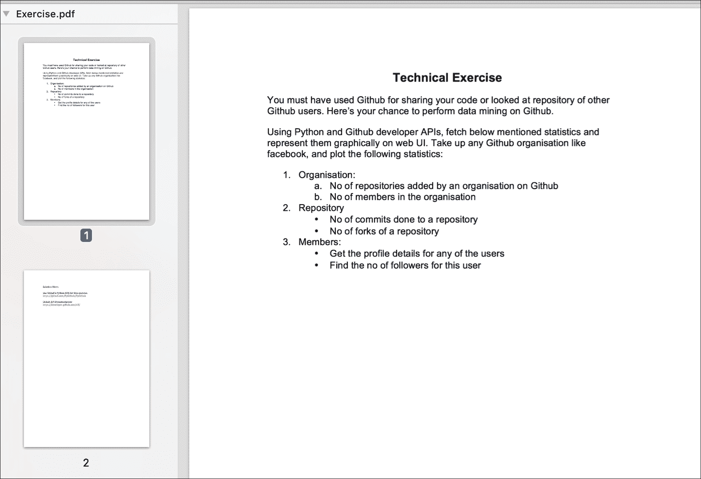

1.  我们将通过读取 `Exercise.pdf` 并将练习的第一页内容写入新文件来创建一个新的 PDF 文件。我们还将向新创建的 PDF 文件中添加一个空白页。让我们先写一些代码：

    ```py
            from PyPDF2 import PdfFileReader, PdfFileWriter
            infile = PdfFileReader(open('Exercise.pdf', 'rb'))
            outfile = PdfFileWriter()
    ```

    在前面的代码中，我们从 `PyPDF2` 模块中导入了适当的类。由于我们需要读取 `Exercise.pdf` 文件并将内容写入新的 PDF 文件，我们需要 `PdfFileReader` 和 `PdfFileWriter` 类。然后我们使用 `open()` 方法以读取模式打开练习文件，并创建一个名为 `infile` 的读取对象。稍后，我们实例化 `PdfFileWriter` 并创建一个名为 `outfile` 的对象，该对象将用于将内容写入新文件。

1.  让我们继续前进，并使用 `addBlankPage()` 方法向 `outfile` 对象中添加一个空白页。页面的尺寸通常是 8.5 x 11 英寸，但在这个例子中，我们需要将它们转换为点单位，即 612 x 792 点。

    ### 小贴士

    *点* 是桌面出版点，也称为 PostScript 点。100 点 = 1.38 英寸。

1.  接下来，我们使用 `getPage()` 方法读取 `Exercise.pdf` 的第一页内容。一旦我们有了页面对象 `p`，我们就将这个对象传递给写入对象。写入对象使用 `addPage()` 方法将内容添加到新文件中：

    ```py
            outfile.addBlankPage(612, 792)
            p = infile.getPage(0)
            outfile.addPage(p)
    ```

    ### 注意

    到目前为止，我们已经创建了一个输出 PDF 文件对象 `outfile`，但还没有创建文件。

1.  好的，太棒了！现在我们有了写入对象和要写入新 PDF 文件的内容。因此，我们使用`open()`方法创建一个新的 PDF 文件，并使用写入对象写入内容，生成新的 PDF 文件`myPdf.pdf`（这是 PDF 文件在文件系统上的可用位置，我们可以查看）。以下代码实现了这一点。在这里，`f`是新创建的 PDF 文件的文件句柄：

    ```py
            with open('myPdf.pdf', 'wb') as f: 
                 outfile.write(f)
            f.close()
    ```

    以下截图显示了新创建的 PDF 文件的内容。正如你所见，第一页是空白页，第二页包含了`Exercise.pdf`文件的第一页内容。太棒了，不是吗！

    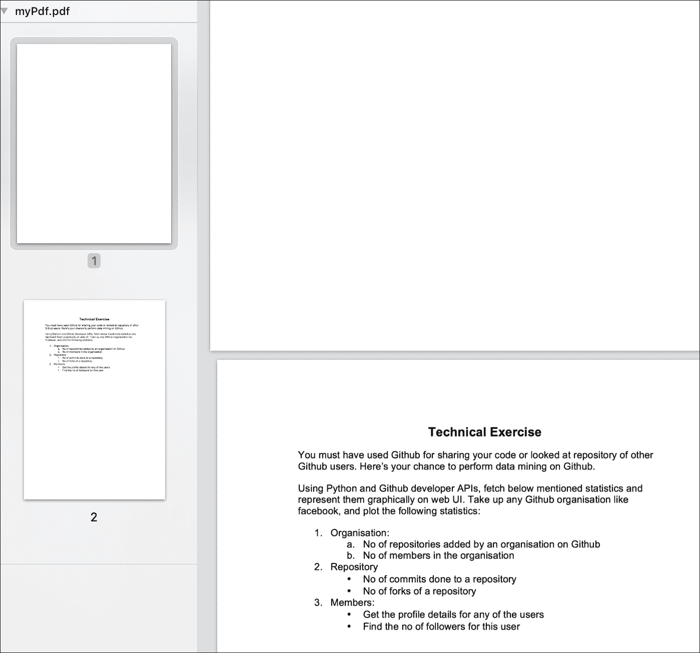

1.  但是，嘿，我们总是需要从头开始创建一个 PDF 文件！是的，还有另一种创建 PDF 文件的方法。为此，我们将使用以下命令安装一个新的模块`fpdf`：

    ```py
     pip install fpdf

    ```

1.  让我们看看以下代码片段中给出的一个非常基本的例子：

    ```py
            import fpdf
            from fpdf import FPDF
            pdf = FPDF(format='letter')
    ```

    在这个例子中，我们从`fpdf`模块实例化`FPDF()`类并创建一个对象，`pdf`，它本质上代表了 PDF 文件。在创建对象时，我们还定义了 PDF 文件的默认格式，即`letter`。`fpdf`模块支持多种格式，例如`A3`、`A4`、`A5`、`Letter`和`Legal`。

1.  接下来，我们开始将内容插入到文件中。但是，嘿，文件仍然是空的，所以在我们写入内容之前，我们使用`add_page()`方法插入一个新页面，并使用`set_font()`方法设置字体。我们将字体设置为`Arial`，大小为`12`：

    ```py
            pdf.add_page()
            pdf.set_font("Arial", size=12)
    ```

1.  现在，我们实际上开始使用`cell()`方法将内容写入文件。单元格是一个包含一些文本的矩形区域。所以，正如你在以下代码中所见，我们添加了一行新内容`欢迎来到自动化！`，然后紧接着又添加了一行`由 Chetan 创建`。你必须注意一些事情。200 x 10 是单元格的高度和宽度。`ln=1`指定了新的一行，`align=C`将文本对齐到页面中心。当你向单元格添加长文本时可能会遇到问题，但`fpdf`模块有一个`multi_cell()`方法，它可以自动使用可用的有效页面宽度断开长文本行。你总是可以计算出页面宽度：

    ```py
            pdf.cell(200, 10, txt="Welcome to Automate It!", ln=1, 
            align="C")
            pdf.cell(200,10,'Created by Chetan',0,1,'C') 
            pdf.output("automateit.pdf")
    ```

    上述代码的输出是一个包含以下截图所示内容的 PDF 文件：

    

# 操作 PDF（添加页眉/页脚、合并、拆分、删除）

你是否想过能否在几秒钟内以编程方式合并 PDF 文件？或者能否迅速更新许多 PDF 文件的头和尾？在这个菜谱中，让我们继续做一些有趣且最常执行的操作，即对 PDF 文件进行操作。

## 准备工作

对于这个菜谱，我们将使用为早期菜谱安装的`PyPDF2`和`fpdf`模块。

## 如何操作...

1.  让我们从使用`PyPDF2`的`PdfFileMerge`类开始工作。我们使用这个类来合并多个 PDF 文件。以下代码示例做了完全相同的事情：

    ```py
            from PyPDF2 import PdfFileReader, PdfFileMerger
            import os 
            merger = PdfFileMerger()
            files = [x for x in os.listdir('.') if
            x.endswith('.pdf')]
            for fname in sorted(files):
                merger.append(PdfFileReader(open(
                              os.path.join('.', fname), 'rb')))
            merger.write("output.pdf")
    ```

1.  如果你运行前面的代码片段，它将生成一个新的文件，`output.pdf`，该文件将合并多个 PDF 文件。打开`output.pdf`文件并亲自查看。

1.  那真酷！现在，我们来看看如何给 PDF 文件添加页眉和页脚。让我们调用前面菜谱中使用的`fpdf`模块来生成 PDF 文件（`automateit.pdf`）。现在，如果我们需要创建一个带有页眉和页脚信息的类似文件，怎么办？下面的代码正是这样做的：

    ```py
            from fpdf import FPDF
            class PDF(FPDF):
                def footer(self):
                    self.set_y(-15)
                    self.set_font('Arial', 'I', 8)
                    self.cell(0, 10, 'Page %s' % self.page_no(), 0, 0, 'C')
                def header(self):
                    self.set_font('Arial', 'B', 15)
                    self.cell(80)
                    self.cell(30, 10, 'Automate It!', 1, 0, 'C')
                    self.ln(20)
            pdf = PDF(format='A5')
            pdf.add_page()
            pdf.set_font("Times", size=12)
            for i in range(1, 50):
                pdf.cell(0, 10, "This my new line. line number is:
                         %s" % i, ln=1, align='C')
            pdf.output("header_footer.pdf")
    ```

    前面代码片段的输出可以在下面的屏幕截图中查看。看看我们如何能够操纵我们的 PDF 文档的页眉和页脚：

    

1.  哇！真不错；现在，让我们快速覆盖一些其他操作。记得我们在前面的菜谱中向`myPdf.pdf`文件添加了一个空白页？如果我想从 PDF 文件中移除空白页怎么办？

    ```py
            infile = PdfFileReader('myPdf.pdf', 'rb')
            output = PdfFileWriter()

            for i in xrange(infile.getNumPages()):
                p = infile.getPage(i)
                if p.getContents():
                    output.addPage(p)
            with open('myPdf_wo_blank.pdf', 'wb') as f:
                output.write(f)
    ```

    如果你运行 Python 代码并查看`myPdf_wo_blank.pdf`的内容，你将只会看到一页，空白页将被移除。

1.  现在，如果我们想向我们的文件添加特定的元信息怎么办？我们应该能够轻松地使用以下 Python 代码编辑 PDF 文件的元数据：

    ```py
            from PyPDF2 import PdfFileMerger, PdfFileReader
            mergerObj = PdfFileMerger()
            fp = open('myPdf.pdf', 'wb')
            metadata = {u'/edited':u'ByPdfFileMerger',}
            mergerObj.addMetadata(metadata)
            mergerObj.write(fp)
            fp.close()
            pdf = open("myPdf.pdf", 'rb')
            readerObj = PdfFileReader(pdf)
            print "Document Info:", readerObj.getDocumentInfo()
            pdf.close()
    ```

    前面代码的输出可以在下面的屏幕截图中看到。看看我们如何成功地将编辑后的元数据添加到我们的 PDF 文件中。

    

1.  从开发角度来看，另一个很好的选项是能够在 PDF 文件中旋转页面。是的，我们也可以使用`PyPDF2`模块做到这一点。以下代码将`Exercise.pdf`的第一页逆时针旋转`90`度：

    ```py
            from PyPDF2 import PdfFileReader
            fp = open('Exercise.pdf', 'rb')
            readerObj = PdfFileReader(fp)
            page = readerObj.getPage(0)
            page.rotateCounterClockwise(90)
            writer = PdfFileWriter()
            writer.addPage(page)
            fw = open('RotatedExercise.pdf', 'wb')
            writer.write(fw)
            fw.close()
            fp.close()
    ```

    以下屏幕截图显示了文件逆时针旋转后的样子：

    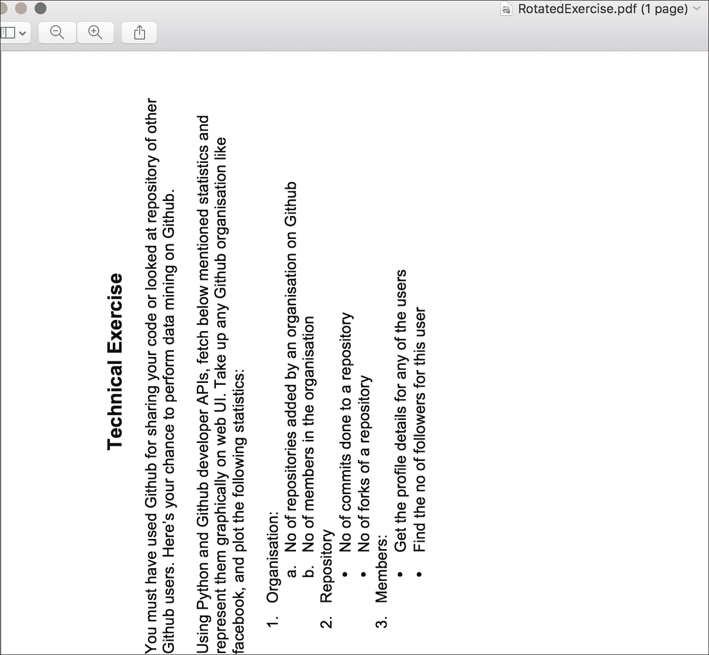

## 它是如何工作的...

在第一个代码片段中，我们创建了`PdfFileMerger`类的对象，命名为`merger`。然后我们遍历当前工作目录中的所有文件，并使用 Python 的列表推导式选择所有扩展名为`.pdf`的文件。

我们首先对文件进行了排序，并运行了一个循环，一次选择一个文件，读取它，并将其追加到`merger`对象中。

一旦所有文件都合并完成，我们就使用了`merger`对象的`write()`方法来生成一个单独的合并文件：`output.pdf`。

### 注意

在这个例子中，我们不需要为`output.pdf`文件创建文件句柄。合并器内部处理它，并生成一个漂亮的 PDF 文件。

在第二个代码片段中，我们执行了多个操作：

1.  我们继承了标准的`FPDF`类，并编写了自己的类，`PDF`。

1.  我们重写了两个方法--`header()`和`footer()`--来定义当我们使用 PDF 类创建新的 PDF 文件时，页眉和页脚应该看起来是什么样子。

1.  在`footer()`方法中，我们为每一页添加了页码。页码以`斜体`形式显示，字体大小为`8`，使用`Arial`字体。我们还将其居中，并设置为在页面底部上方 15 毫米处显示。

1.  在`header()`方法中，我们创建了标题单元格并将其定位到最右侧。标题为`Automate It`，字体为`Arial`和加粗，字号为`15`。标题也在单元格的上下文中居中。最后，我们在标题下方添加了 20 像素的换行。

1.  然后，我们创建了自己的 PDF 文件，页面格式设置为`A5`。

1.  PDF 的内容将是`This is my new line. Line number is <line_no>`，字体设置为`Times`，字号为`12`。

1.  生成的 PDF 看起来如下截图所示。注意，页面大小为`A5`，因此页面只能添加 15 行。如果它是信纸大小，那么它至少可以容纳一页上的 20 行。

在本菜谱的第三个代码示例中，`getContents()`执行了检查给定页面是否有内容的临界任务。因此，当我们开始读取旧的 PDF 文件时，我们会检查页面的内容。如果没有内容，该页面将被忽略，不会添加到新的 PDF 文件中。

在第四个代码片段中，我们使用`addMetadata()`方法将元数据信息添加到我们的 PDF 文件中。`addMetadata()`方法接受一个键值对作为参数，其中我们可以传递需要修改的 PDF 文件属性。在我们的例子中，我们使用该方法将`/edited`元数据字段添加到 PDF 文件中。

对于最后的例子，我认为代码的其他部分都是不言自明的，除了`rotateCounterClockwise()`的使用，它实际上会旋转页面。我们也可以使用`rotateClockwise()`将页面顺时针旋转。

## 更多...

你已经学习了如何读取和写入 PDF 文件，并且了解了多种操作 PDF 文件的方法。现在是时候用一个现实生活中的例子来将这些知识应用到实践中了。

# 自动化财务部门的工资单生成

让我们以一个组织用例为例，其中公司的财务经理希望使工资单生成过程更快。他意识到这项任务不仅单调乏味，而且耗时。随着更多员工预期加入公司，这将变得更加困难。他选择自动化这个过程，并找到你。你该如何帮助？

嗯，通过本章所学的内容，我敢打赌这对你们来说将是一件轻而易举的事情！让我们着手解决这个问题。

## 准备工作

对于这个例子，我们不需要任何特殊的模块。之前菜谱中安装的所有模块对我们来说已经足够了，你不这么认为吗？

## 如何实现...

让我们首先考虑一个工资单模板。工资单包含什么内容？

+   员工信息

+   公司的支付

+   扣除（支付给政府的税款）

+   总支付金额

因此，我们需要获取员工信息，添加支付和扣除的表格，并添加一个月支付的总工资条目。

这个场景的代码实现可能如下所示：

```py
from datetime import datetime

employee_data = [ 
     { 'id': 123, 'name': 'John Sally', 'payment': 10000,
       'tax': 3000, 'total': 7000 },
     { 'id': 245, 'name': 'Robert Langford', 'payment': 12000,
       'tax': 4000, 'total': 8000 }, 
]
from fpdf import FPDF, HTMLMixin
class PaySlip(FPDF, HTMLMixin):
      def footer(self): 
          self.set_y(-15) 
          self.set_font('Arial', 'I', 8)
          self.cell(0, 10, 'Page %s' % self.page_no(), 0, 0, 'C')
      def header(self):
          self.set_font('Arial', 'B', 15)
          self.cell(80)
          self.cell(30, 10, 'Google', 1, 0, 'C')
          self.ln(20)
def generate_payslip(data):
     month = datetime.now().strftime("%B")
     year = datetime.now().strftime("%Y")
     pdf = PaySlip(format='letter')
     pdf.add_page()
     pdf.set_font("Times", size=12)
     pdf.cell(200, 10, txt="Pay Slip for %s, %s" % 
              (month, year),  ln=3, align="C")
     pdf.cell(50)
     pdf.cell(100, 10, txt="Employeed Id: %s" % data['id'],
              ln=1, align='L')
     pdf.cell(50)
     pdf.cell(100, 10, txt="Employeed Name: %s" % 
              data['name'], ln=3, align='L')
     html = """
         <table border="0" align="center" width="50%">
         <thead><tr><th align="left" width="50%">
          Pay Slip Details</th><th align="right" width="50%">
          Amount in USD</th></tr></thead>
         <tbody>
             <tr><td>Payments</td><td align="right">""" + 
                     str(data['payment']) + """</td></tr> 
             <tr><td>Tax</td><td align="right">""" + 
                     str(data['tax']) + """</td></tr>
             <tr><td>Total</td><td align="right">""" + 
                     str(data['total']) + """</td></tr>
         </tbody>
         </table>
         """
     pdf.write_html(html)
     pdf.output('payslip_%s.pdf' % data['id'])
for emp in employee_data:
     generate_payslip(emp)
```

这是带有标题、页脚和工资单详情的工资单的外观：

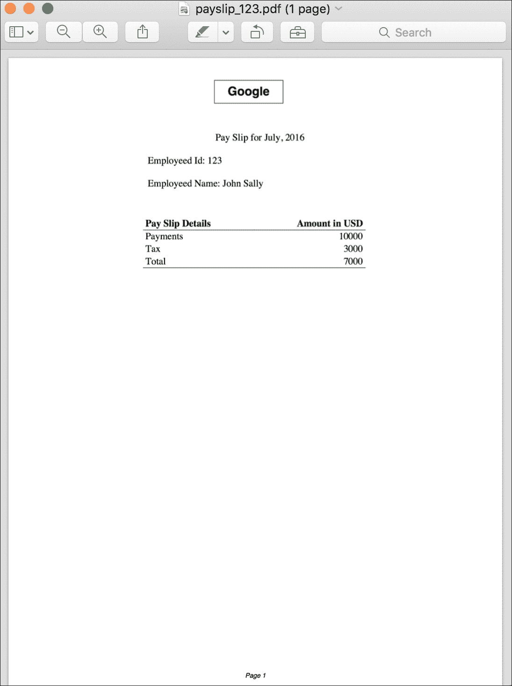

## 它是如何工作的...

我们首先在字典`employee_data`中获取了员工数据。在现实场景中，它可能来自员工表，并且将通过 SQL 查询检索。我们编写了自己的`PaySlip`类，它继承自`FPDF`类，并定义了自己的页眉和页脚。

然后，我们编写了自己的方法来生成工资条。这包括顶部的页眉，包含公司名称（在这个例子中，比如说**谷歌**）和工资条适用的期间。我们还添加了**员工 ID**和**员工姓名**。

现在，这很有趣。我们创建了一个 HTML 文档，使用`add_html()`方法生成一个表格，并将支付、税费和总工资信息添加到工资条中。

最后，我们使用`output()`方法将所有这些信息添加到 PDF 文件中，并将工资条命名为`payslip_<employee_id>`。

## 还有更多...

尽管我们编写了示例代码，但您认为有什么遗漏吗？是的，我们没有加密 PDF。用密码保护工资条总是一个好主意，这样除了员工外，没有人能够查看它。以下代码将帮助我们加密文件。在这个例子中，我们加密了`Exercise.pdf`，用密码`P@$$w0rd`保护，并将其重命名为`EncryptExercise.pdf`：

```py
from PyPDF2 import PdfFileWriter, PdfFileReader
fp = open('Exercise.pdf', 'rb')
readerObj = PdfFileReader(fp)

writer = PdfFileWriter()

for page in range(readerObj.numPages):
     writer.addPage(readerObj.getPage(page))
writer.encrypt('P@$$w0rd')

newfp = open('EncryptExercise.pdf', 'wb')
writer.write(newfp)
newfp.close()
fp.close()
```

如果我们打开受保护的文件，它将要求您输入密码：

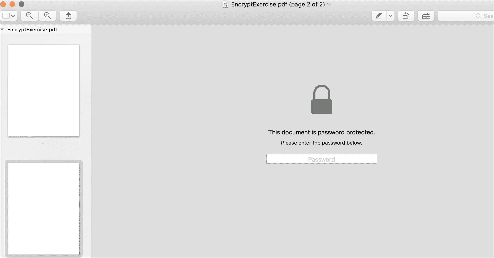

嗯，这是一个很棒的解决方案！我相信您的财务经理会很高兴！想知道如何解密受保护的文件吗？我将把它留给你；这相当直接。阅读文档说明。

我们已经到达了关于处理 PDF 文件的部分的结尾。PDF 文件本质上以二进制格式存储数据，并支持我们讨论的多个操作。在下一节中，我们将开始处理文档（`.docx`）并欣赏它们能提供什么！

# 阅读 Word 文档

如您所知，从 Office 2007 开始，Microsoft Office 开始为 Word 文档提供一个新的扩展名，即`.docx`。随着这一变化，文档转移到基于 XML 的文件格式（Office Open XML）并使用 ZIP 压缩。当商业社区要求一个开放文件格式以帮助在不同应用程序之间传输数据时，Microsoft 做出了这一改变。因此，让我们从 DOCX 文件开始我们的旅程！

## 准备工作

在这个菜谱中，我们将使用`python-docx`模块来读取 Word 文档。`python-docx`是一个综合模块，它可以在 Word 文档上执行读取和写入操作。让我们用我们最喜欢的工具`pip`安装这个模块：

```py
pip install python-docx

```

## 如何操作...

1.  我们首先创建了自己的 Word 文档。这与我们在处理 PDF 文件时看到的上一个部分中的练习相同。除了我们向其中添加了一个表格并将其存储为`WExercise.docx`之外。它看起来如下：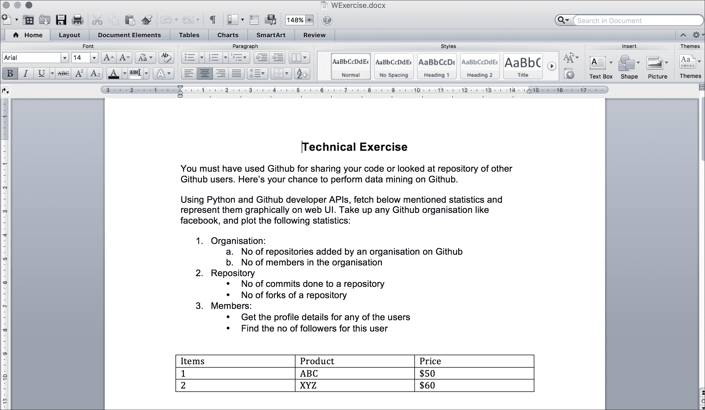

1.  现在我们继续读取 `WExercise.docx` 文件。以下代码将帮助我们获取指向 `WExercise.docx` 文件的对象：

    ```py
            import docx
            doc = docx.Document('WExercise.docx')
            print "Document Object:", doc
    ```

    上述代码的输出在下面的屏幕截图中显示。阅读 Word 文档在概念上与在 Python 中读取文件非常相似。就像我们使用 `open()` 方法创建文件句柄一样，在这个代码片段中我们创建了一个文档句柄：

    

1.  现在，如果我们想获取文档的基本信息，我们可以使用前面代码中的文档对象 `doc`。例如，如果我们想检索文档的标题，我们可以使用以下代码。如果你仔细查看代码，我们会使用 `paragraphs` 对象来获取文本。段落是文档中的行。假设文档的标题是文档的第一行，我们获取文档中段落的 `0` 索引并调用 `text` 属性来获取标题的文本：

    ```py
    import docx
    doc = docx.Document('WExercise.docx')
    print "Document Object:", doc
    print "Title of the document:"
    print doc.paragraphs[0].text

    ```

    注意以下屏幕截图中的输出，我们如何打印练习文档的标题：

    

1.  哇，这太酷了！让我们继续并读取 Word 文档中我们关心的其他属性。让我们使用相同的 `doc` 对象：

    ```py
            print "Attributes of the document"
            print "Author:", doc.core_properties.author
            print "Date Created:", doc.core_properties.created
            print "Document Revision:", doc.core_properties.revision
    ```

    上述代码的输出在下面的屏幕截图中显示。文档的作者是 `Chetan Giridhar`。正如你可能已经观察到的，它是在 7 月 2 日早上 4:24 创建的。此外，请注意文档已被修改了五次，这是文档的第五次修订：

    

1.  好吧，我现在将变得更加大胆，并读取文档中的表格。`python-docx` 模块非常适合读取表格。看看下面的代码片段：

    ```py
            table = doc.tables[0]

            print "Column 1:"
            for i in range(len(table.rows)):
                print table.rows[i].cells[0].paragraphs[0].text

            print "Column 2:"
            for i in range(len(table.rows)):
                print table.rows[i].cells[1].paragraphs[0].text

            print "Column 3:"
            for i in range(len(table.rows)):
                print table.rows[i].cells[2].paragraphs[0].text
    ```

1.  在前面的例子中，我们使用 `tables` 对象来读取文档中的表格。由于整个文档中只有一个表格，我们使用 `tables[0]` 获取第一个索引并将对象存储在 `table` 变量中。

1.  每个表格都包含行和列，并且可以使用 `table.rows` 或 `table.columns` 访问它们。我们使用 `table.rows` 来获取表格中的行数。

1.  接下来，我们遍历所有行，并使用 `table.rows[index].cells[index].paragraphs[0].text` 读取单元格中的文本。我们需要 `paragraphs` 对象，因为它包含单元格的实际文本。（我们再次使用了第 0 个索引，因为假设每个单元格只有一行数据。）

1.  从第一个 `for` 循环中，你可以识别出我们在读取所有三行，但读取每行的第一个单元格。本质上，我们正在读取列值。

1.  上述代码片段的输出显示了所有列及其值：

1.  太棒了！所以，我们现在已经成为阅读 Word 文档的专家。但如果我们不能将数据写入 Word 文档，那又有什么用呢？让我们看看如何在下一个菜谱中写入或创建 `.docx` 文档。

# 将数据写入 Word 文档（添加标题、图片、表格）

使用`python-docx`模块读取文件非常简单。现在，让我们将注意力转向编写 Word 文档。在本节中，我们将对文档执行多个操作。

## 准备工作

对于这个菜谱，我们将使用相同的出色的 Python 模块，`python-docx`。我们不需要在设置上花费太多时间。让我们开始吧！

## 如何做到这一点...

1.  我们从创建一个`.docx`文件并添加一个标题到它开始。以下代码执行了这个操作：

    ```py
            from docx import Document
            document = Document()
            document.add_heading('Test Document from Docx', 0)
            document.save('testDoc.docx')
    ```

    文档看起来就是这样：

    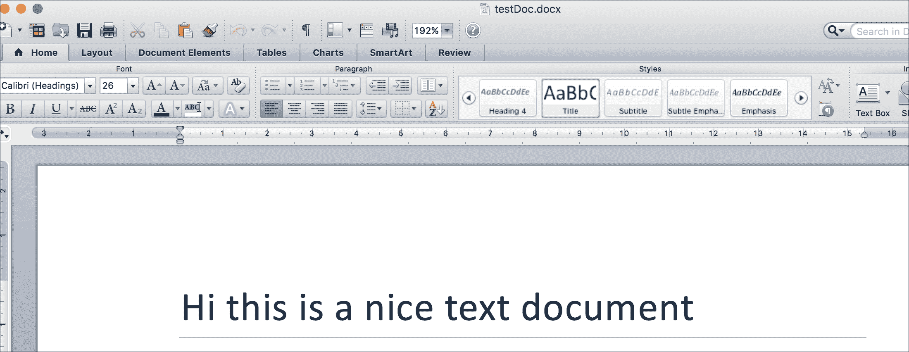

1.  如果你查看截图，你会看到一个包含字符串的新文档正在创建。观察截图是如何指示它被格式化为**标题**文本的。我们是如何做到这一点的？你在我们的 Python 代码的第三行看到`0`了吗？它谈论的是标题类型，并相应地格式化文本。`0`表示标题；`1`和`2`表示带有**标题 1**或**标题 2**的文本。

1.  让我们继续前进，并在文档中添加一行新内容。我们用一些粗体字和一些斜体字装饰了这个字符串：

    ```py
            document = Document('testDoc.docx')
            p = document.add_paragraph('A plain paragraph
                                        having some ')
            p.add_run('bold words').bold = True
            p.add_run(' and italics.').italic = True
            document.save('testDoc.docx')
    ```

1.  文档现在看起来如下所示。观察添加的**正常**样式的行。文本中的一些词是粗体的，少数是斜体的：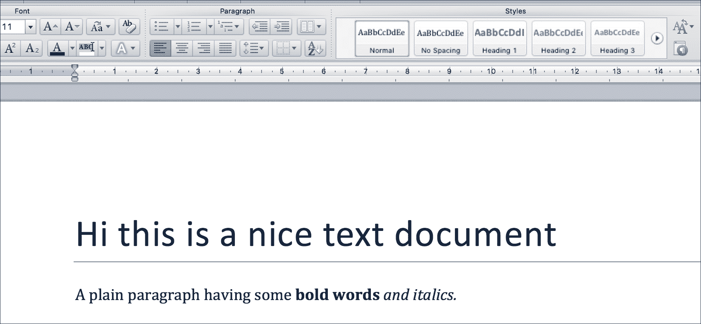

1.  好的，很好。让我们给我们的文档添加另一个子主题。看看下面的代码实现。在这里，我们创建了一个带有**标题 1**样式的子主题，并在该主题下添加了一行新内容：

    ```py
            document = Document('testDoc.docx')
            document.add_heading('Lets talk about Python 
                                  language', level=1)
            document.add_paragraph('First lets see the Python
                                    logo', style='ListBullet')
            document.save('testDoc.docx')
    ```

1.  文档现在看起来如下所示。在截图时，我点击了截图中的**标题 1**行。注意子主题是如何被格式化为项目符号的：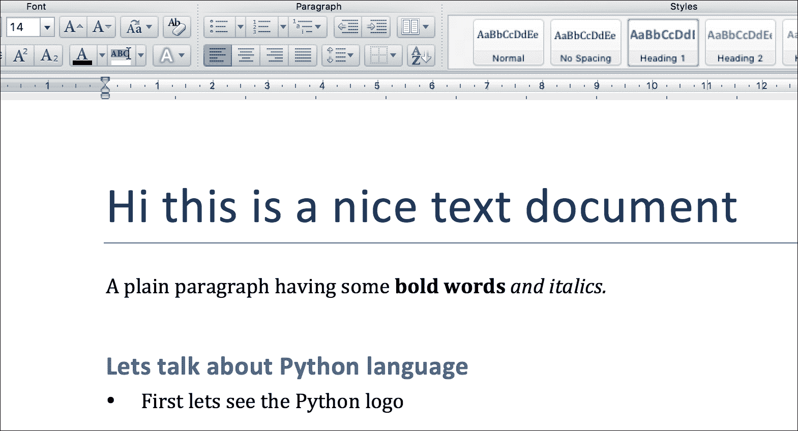

1.  经常需要在文档中包含图片。现在这真的非常简单。查看以下代码来完成这一步：

    ```py
            from docx.shared import Inches
            document = Document('testDoc.docx')
            document.add_picture('python.png', 
                                  width=Inches(1.25)) 
            document.save('testDoc.docx')
    ```

    如果你在你自己的解释器上运行 Python 代码，你会看到文档现在包含了一个漂亮的 Python 标志。请注意，我在截图之前点击了图片以吸引你的注意，所以这不是由库完成的：

    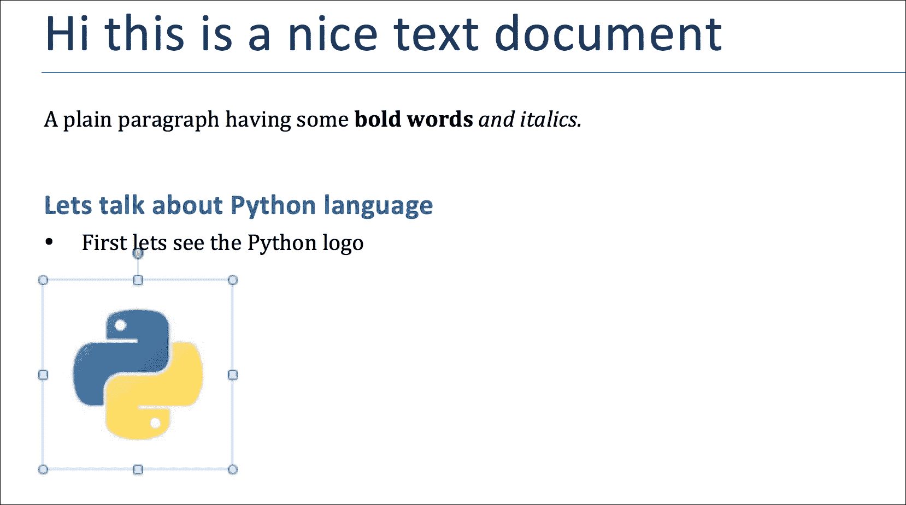

1.  最后但同样重要的是，我们可能还想在我们的文档中添加表格，对吧？让我们这么做。以下代码演示了如何向 DOCX 文件添加表格：

    ```py
            document = Document('testDoc.docx')
            table = document.add_table(rows=1, cols=3)
            table.style = 'TableGrid'

            data = {'id':1, 'items':'apple', 'price':50}

            headings = table.rows[0].cells
            headings[0].text = 'Id'
            headings[1].text = 'Items'
            headings[2].text = 'Price'

            row = table.add_row().cells
            row[0].text = str(data.get('id'))
            row[1].text = data.get('items')
            row[2].text = str(data.get('price')) 
            document.save('testDoc.docx')
    ```

以下截图显示了完整的文档以及表格的外观。真不错！

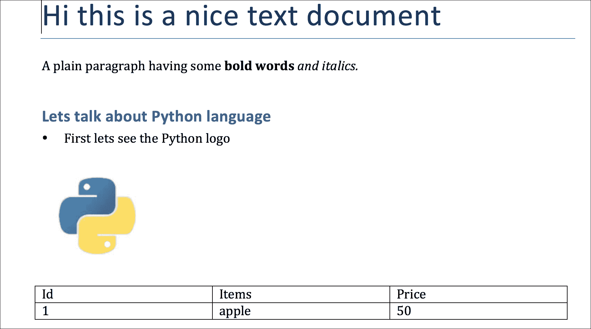

## 它是如何工作的...

在第一个代码片段中，我们从`Document`类创建了`document`对象。然后我们使用这个对象添加了一个新的标题，其中包含文本`Hi this is a nice text document`。我知道这并不是一个文本文档，而只是一个字符串。

在第二个例子中，添加新行是通过`add_paragraph()`方法完成的（记住，在上一节中使用了`paragraphs`来从 Word 文档中读取行）。那么我们是如何得到样式的呢？可以通过设置`add_run()`方法的属性`bold`和`italic`为`true`来实现。

在第四个例子中，我们只是使用了`add_image()`方法将图片添加到文档中。我们还可以设置图片的高度和宽度为英寸。为此，我们导入了一个新的类`Inches`，并将图片的宽度设置为 1.25 英寸。简单又整洁！

在最后的例子中，我们通过以下步骤将表格添加到文档中：

1.  我们首先使用`add_table()`方法创建了一个表格对象。我们配置了表格包含一行和三列。我们还对表格进行了样式设置，使其成为一个网格表格。

1.  正如我们在上一节中看到的，`table`对象有`rows`和`columns`对象。我们使用这些对象来填充表格中的字典`data`。

1.  然后我们在表格中添加了一个标题。标题是表格的第一行，因此我们使用了`table.rows[0]`来填充其中的数据。我们通过`Id`填充了第一列，通过`Items`填充了第二列，通过`Price`填充了第三列。

1.  在标题之后，我们添加了一行新行，并从数据字典中填充了这一行的单元格。

1.  如果你看看截图，文档现在添加了一个表格，其中 ID 为`1`，项目为`apple`，价格为`50`。

## 还有更多...

在上一节中你所学到的都是直接、经常做的、日常的将数据写入 DOCX 文件的操作。我们可以以编程方式执行更多操作，就像我们习惯在 Word 文档上手动操作一样。现在让我们将所学知识结合到一个商业案例中。

# 以自动化的方式为 HR 团队生成个性化的新员工入职培训

作为你们公司的 HR 经理，你负责新员工的入职培训。你看到每个月至少有 15-20 名新员工加入你们组织。一旦他们在公司完成一个月的工作，你就必须通过入职培训向他们介绍公司的政策。

为了这个目的，你需要给他们发送一份包含新员工入职培训详细信息的个性化文档。从数据库中逐个获取员工的详细信息是繁琐的；更不用说，你还得根据不同的部门筛选出即将进行入职培训的员工。

所有这些都很耗时，你觉得这个过程可以很容易地自动化。让我们看看我们如何利用本章学到的知识来自动化这个过程。

## 准备工作

对于这个菜谱，我们将使用`python-docx`，这在我们的前一个菜谱中非常有帮助。因此，我们不需要安装任何新的模块。

## 如何做到这一点...

1.  让我们先分解问题。首先，我们需要收集需要参加入职培训的员工。接下来，我们需要知道他们的部门并查看基于部门的日程模板。一旦有了这些细节，我们需要将这些信息整理成文档。

1.  查看此场景的代码实现：

    ```py
            from docx import Document

            employee_data = [
                {'id': 123, 'name': 'John Sally', 'department':
                 'Operations', 'isDue': True},
                {'id': 245, 'name': 'Robert Langford',
                'department': 'Software', 'isDue': False},
            ]
            agenda = {
                "Operations": ["SAP Overview", "Inventory Management"],
                "Software": ["C/C++ Overview", "Computer Architecture"],
                "Hardware": ["Computer Aided Tools", "Hardware Design"] }
            def generate_document(employee_data, agenda):
                document = Document()
                for emp in employee_data:
                    if emp['isDue']:
                        name = emp['name']
                        document.add_heading('Your New Hire
                                        Orientationn', level=1)
                        document.add_paragraph('Dear %s,' % name)
                        document.add_paragraph('Welcome to Google
                          Inc. You have been selected for our new
                          hire orientation.')
                       document.add_paragraph('Based on your 
                          department you will go through 
                          below sessions:')
                       department = emp['department']
                       for session in agenda[department]:
                           document.add_paragraph(
                             session , style='ListBullet'
                       )
                       document.add_paragraph('Thanks,n HR Manager')
                       document.save('orientation_%s.docx' % emp['id'])
                       generate_document(employee_data, agenda)
    ```

1.  如果您运行此代码片段，您的文档将呈现有关入职的所有相关细节。酷！但它是如何工作的？我们将在*如何工作*部分中看到。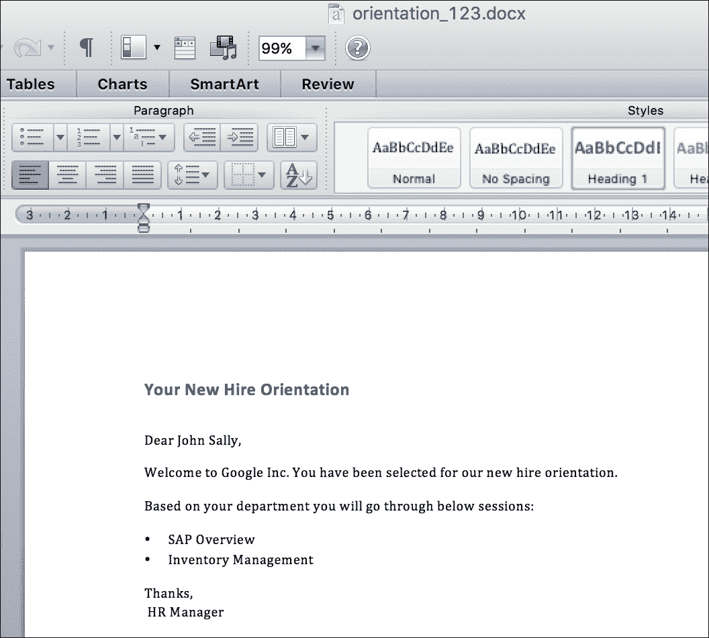

## 它是如何工作的...

在前面的代码中，我们有一个预填充的字典`employee_data`，其中包含员工信息。此字典还包含有关员工是否需要参加入职培训的信息。我们还有一个`agenda`字典，它根据部门作为不同会议的模板。在这个例子中，我们手动将这些数据添加到 Python 字典中，但在现实世界中，需要从您组织的数据库中提取这些数据。

接下来，我们编写一个`generate_document()`方法，该方法接受`employee_data`和`agenda`。它遍历所有员工并检查是否有员工需要参加入职培训，然后开始编写文档。首先添加标题，然后是针对员工的个性化致辞，然后根据员工的部门调整到需要参加的会议。

最后，所有文本都保存为名为`orientation_<emp_id>.docx`的文档文件。

那真是太酷了！想象一下您节省的时间。作为人力资源经理，您有多高兴？您获得了一些新技能，并迅速将其应用到团队的利益中。太棒了！

我们已经完成了关于读取、编写和操作 PDF 文件和文档的章节。希望您喜欢它，并学到了许多可以应用到您在办公室或学校工作中的应用新知识！当然，您可以做得更多；我强烈鼓励您尝试这些模块，并享受其中的乐趣。
