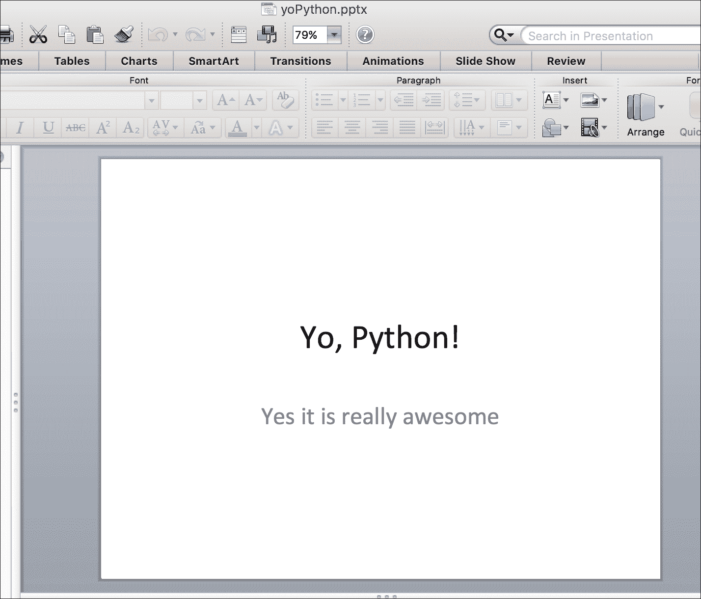
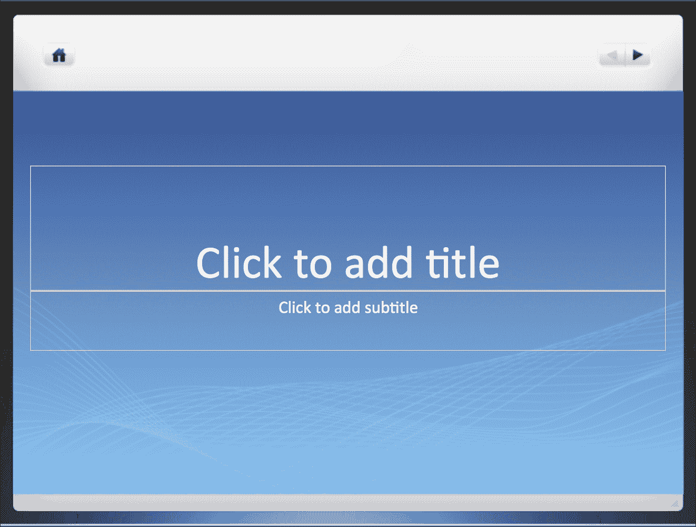
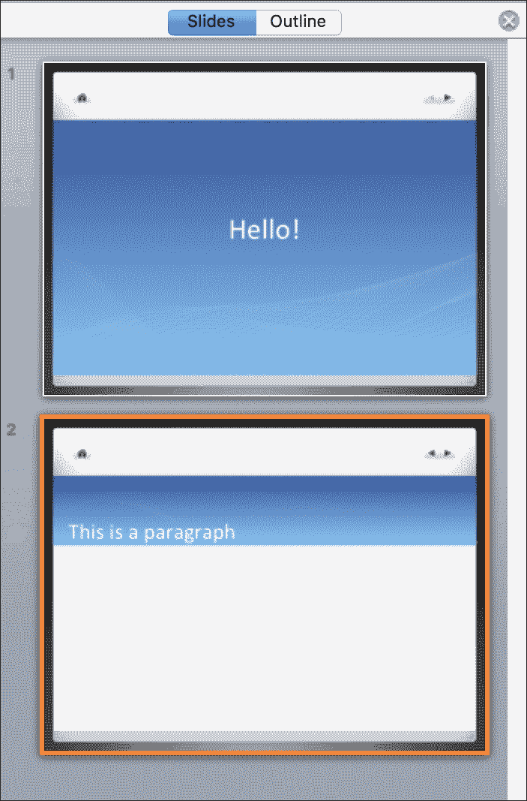
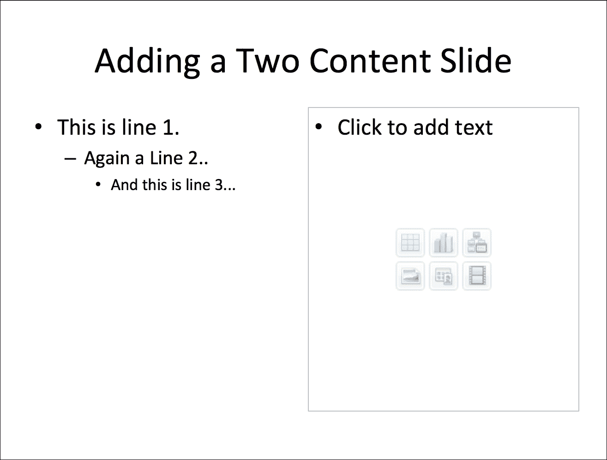
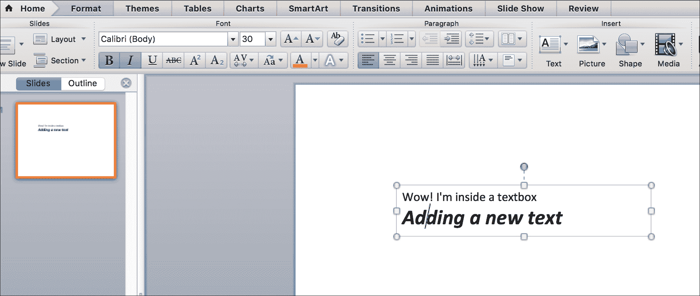
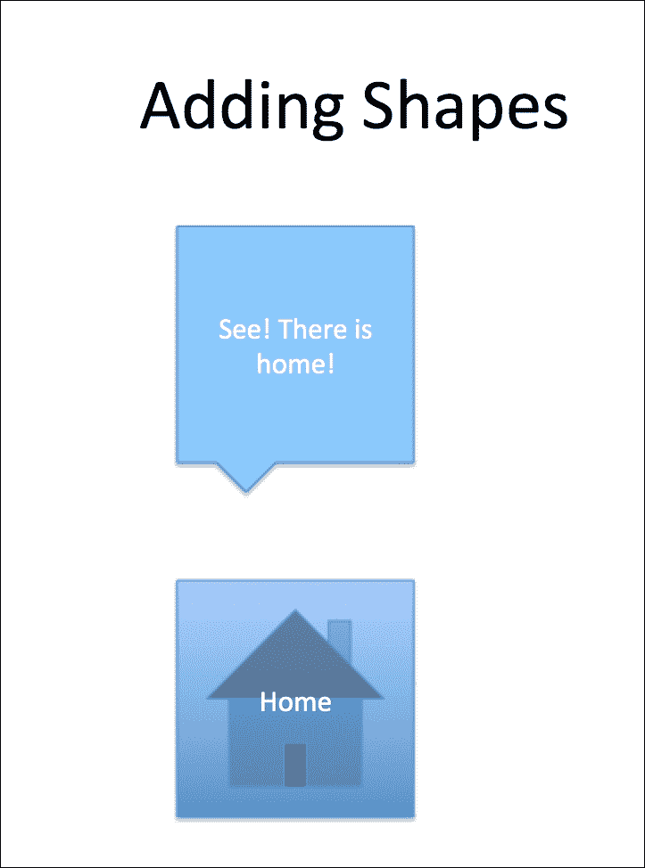
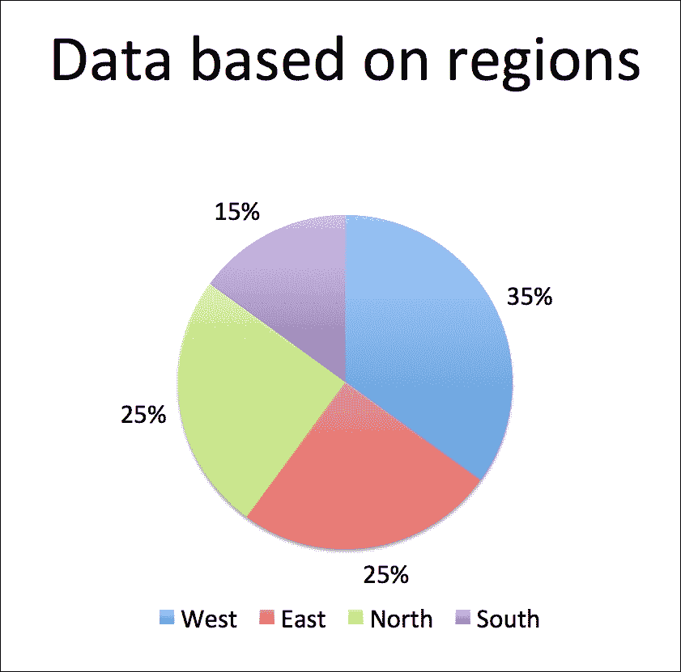
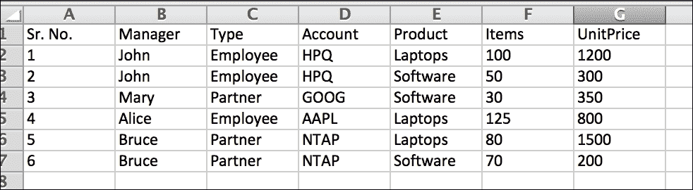
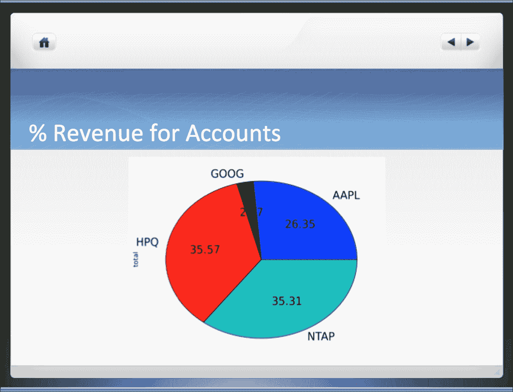
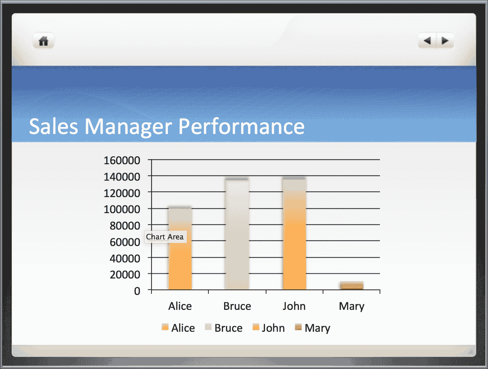

# 第六章. 演示文稿及其他

哦，今天还要给老板做一个演示文稿！我能不能简单地运行一个程序生成演示文稿，而不是手动从头再来？别再担心了；这一章可能正是解决您所有担忧的方法。我们将探讨您可以使用 Python 以自动化方式创建自己演示文稿的各种方法。

在本章中，我们将涵盖以下菜谱：

+   读取 PowerPoint 演示文稿

+   创建和更新演示文稿，以及添加幻灯片

+   玩转布局、占位符和文本框

+   使用不同形状和添加表格

+   图片和图表的视觉盛宴

+   自动化每周销售报告

# 简介

当涉及到报告数据或工作管理状态或展示一个想法时，PowerPoint 演示文稿是您最好的选择之一。PowerPoint 允许您制作交互式多媒体幻灯片来展示信息。问问您商业界的几位朋友；专业人士几乎都是在演示文稿中思考，这意味着思维过程是围绕**PowerPoint**演示文稿的幻灯片结构化的（简称为**PPT**）。

在本章中，我们讨论使用 Python 生成自定义 PowerPoint 演示文稿。您将了解如何读取、写入和操作 PPT 文件。PPT 提供了添加表格、托管图像和展示图表等功能；我们将学习如何使用 Python 来操作所有这些有趣的功能。

在本章中，我们将使用二进制文件格式：`.pptx`。与 PPT 版本不同，PPTX 演示文稿使用的是自 Microsoft Office 2007 引入的 Microsoft Open XML 格式。

本章中的菜谱将专注于帮助我们执行多个 PPTX 文件操作的 Python 模块；具体来说，我们将在本章中关注以下 Python 模块：

+   `python-pptx` ([`python-pptx.readthedocs.io/en/latest/index.html`](https://python-pptx.readthedocs.io/en/latest/index.html))

+   `pandas` ([`pandas.pydata.org/`](http://pandas.pydata.org/))

### 注意

注意，尽管我们试图涵盖与 PowerPoint 演示文稿相关的所有主要操作，但总是有可能做更多。因此，我强烈建议您尝试多种技巧，并用 Python 进行实践。

您也可以使用 Windows 的 Win32 COM API 在 Windows 操作系统中处理 PPT，而不是使用`python-pptx`模块（我们将在本章中使用）。

# 读取 PowerPoint 演示文稿

基于我们对 PowerPoint 演示文稿的经验，我们知道 PPT 文件包含幻灯片，每张幻灯片都包含需要向观众展示的详细信息。这个菜谱将向您展示如何使用`python-pptx`模块从 PPTX 文件中提取信息。

## 准备工作

要逐步完成这个菜谱，我们需要安装`python-pptx`模块。让我们使用 Python 的`pip`来安装这个模块：

```py
chetans-MacBookPro:ch08 Chetan$ sudo pip install python-pptx 
Password: 
Downloading/unpacking python-pptx 
  Downloading python-pptx-0.6.0.tar.gz (6.3MB): 6.3MB downloaded 
  Running setup.py (path:/private/tmp/pip_build_root/python-pptx/setup.py) egg_info for package python-pptx 

Requirement already satisfied (use --upgrade to upgrade): lxml>=3.1.0 in /Library/Python/2.7/site-packages (from python-pptx) 
Requirement already satisfied (use --upgrade to upgrade): Pillow>=2.6.1 in /Library/Python/2.7/site-packages (from python-pptx) 
Requirement already satisfied (use --upgrade to upgrade): XlsxWriter>=0.5.7 in /Library/Python/2.7/site-packages (from python-pptx) 
Installing collected packages: python-pptx 
  Running setup.py install for python-pptx 

Successfully installed python-pptx 
Cleaning up...

```

已经安装了模块吗？让我们开始吧！

## 如何做到这一点...

1.  我们首先使用 Microsoft PowerPoint 2013 创建一个 PPTX 文件。我们将使用这个文件作为样本来学习如何从演示文稿中读取和提取数据。如果你下载了这本书的代码示例，你也会得到这个文件。我们称这个文件为`myprofile.pptx`；它包含有关本书作者的信息，其中包含两张幻灯片。以下截图显示了文件内容：

1.  如果你查看演示文稿，第一张幻灯片有两个文本项：标题项是**Chetan Giridhar**，副标题是**世界充满知识..**.. 第二张幻灯片有更多数据；它有不同的布局，幻灯片的标题是**他希望**，包含作者的所有四个愿望和一个圆形内容，**这是生命的循环**。很有趣！

1.  在你的电脑上，转到终端并使用 `vim` 或选择你喜欢的编辑器。为了读取 PPT 文件，让我们首先使用 Python 代码为 `myprofile.pptx` 创建一个演示文稿对象：

    ```py
            from pptx import Presentation 
            path_to_presentation = 'myprofile.pptx' 
            prs = Presentation(path_to_presentation) 
            print "Presentation object for myprofile file: ", prs 

    ```

    上述代码片段的输出如下：

    ```py
            Presentation object for myprofile file:  
            <pptx.presentation.Presentation object at 0x10e56e550> 

    ```

1.  好的；现在我们有了演示文稿对象，让我们使用它来获取幻灯片对象。我们知道演示文稿有两张幻灯片。以下代码获取了幻灯片对象。幻灯片在`slide`对象中以 Python 列表的形式表示，并且可以在 for 循环中迭代：

    ```py
            print "Slides are:" 
            for slide in prs.slides: 
                print "Slide object:", slide 

    ```

1.  上述代码片段使用演示文稿对象`prs`来检索幻灯片对象。代码片段的输出如下：

    ```py
     Slides are: 
            Slide object: <pptx.slide.Slide object at 0x10e59f500> 
            Slide object: <pptx.slide.Slide object at 0x10e59f460>

    ```

1.  好的，这很整洁！让我们再深入一层，看看`slides`对象的一些属性。以下代码打印了`slide`对象的一些属性：

    ```py
            print "Slide has following objects:" 
            slide1, slide2 = prs.slides[0], prs.slides[1] 
            print "Slide Ids: \n", slide1.slide_id, ",", slide2.slide_id 
            print "Slide Open XML elements: \n", slide1.element, ",", 
                   slide2.element 
            print "Slide layouts: \n", slide1.slide_layout.name, ",",
                   slide2.slide_layout.name 

    ```

1.  注意到第一张幻灯片的布局是**标题幻灯片**，下一张幻灯片是**标题和内容**，这确实是如此。我们还打印了`幻灯片 ID`和`Open XML 元素`：

    ```py
    Slide has following objects:
    Slide Ids: 
    256, 257
    Slide Open XML elements: 
    <Element {http://schemas.openxmlformats.org/
                      presentationml/2006/main}sld at 0x109fc2d60>, 
            <Element {http://schemas.openxmlformats.org/
                      presentationml/2006/main}sld at 0x109fc23c0>
    Slide layouts: 
    Title Slide, Title and Content

    ```

1.  现在，每个幻灯片都包含一些形状。例如，第一张幻灯片有两个文本占位符，标题和副标题。在第二张幻灯片中，我们有两个占位符，但还有一个圆形形状。以下代码打印了这些信息：

    ```py
            print "Shapes in the slides" 
            i=1 
            for slide in prs.slides: 
                print 'Slide', i 
                for shape in slide.shapes: 
                    print "Shape: ", shape.shape_type 
                i +=1 

    ```

    上述代码片段的输出如下。你可以观察到第一张幻灯片包含文本框，但第二张幻灯片也有一个自动形状：

    ```py
            Shapes in the slides 
            Slide 1 
            Shape:  PLACEHOLDER (14) 
            Shape:  PLACEHOLDER (14) 

            Slide 2 
            Shape:  PLACEHOLDER (14) 
            Shape:  PLACEHOLDER (14) 
            Shape:  AUTO_SHAPE (1) 

    ```

1.  好的，所以现在我们有了幻灯片、幻灯片布局和幻灯片形状。让我们尝试从两张幻灯片和所有形状中获取文本内容。以下代码正好做到了这一点：

    ```py
            text_runs = [] 
            for slide in prs.slides: 

                for shape in slide.shapes: 
                    if not shape.has_text_frame: 
                    continue 
                for paragraph in shape.text_frame.paragraphs: 
                    for run in paragraph.runs: 
                        text_runs.append(run.text) 

            print "Text is: ", text_runs 

    ```

代码示例的输出如下。它包含了两张幻灯片上的所有文本。在`python-pptx`的世界里，这些被称为**文本运行**：

```py
Text is:  [u'Chetan Giridhar', u'World is full of knowledge..', u'He wishes to', u'Travel round the world', u'Build apps', u'Have fun', u'Die peacefully', u'This is circle of life'] 

```

## 它是如何工作的...

在这个菜谱中，我们读取了整个演示文稿，并获取了两张幻灯片的内容。

我们首先使用 Microsoft PowerPoint 2013 手动创建了一个 PPTX 文件，并使用 PPTX 模块的 `Presentation` 类创建了一个 `myprofilepptx` 文件的 `prs` 对象。使用此对象，我们通过 `presentation` 对象的 `prs.slides` 方法获得了对幻灯片的访问权限。

接下来，我们使用了 `slides` 对象来获取所有可用的形状，包括 `slides.shapes` 中的幻灯片。遍历此对象帮助我们获取幻灯片中的形状，如 `PLACEHOLDER` 和 `AUTO_SHAPE`。我们将在本章的后续部分学习更多关于幻灯片和形状的内容。

然后，我们使用了 `shape.has_text_frame` 属性来检查形状是否有文本框架，如果有，则从文本框架中获取 `paragraphs` 对象。段落对象的 `runs` 属性包含了实际的文本数据列表，然后这些数据被存储在数组 `text_runs` 中。

## 还有更多...

太酷了！所以，我们在一个菜谱中学习了很多东西：演示文稿对象、幻灯片、布局、形状、文本框架和段落。有了这些，我们处于一个很好的位置来读取 PPTX 文件。

所有这些都很棒，但是嘿，我们想要创建新的 PPTX 文件，对吧？并且希望自动化创建演示文稿？那么，让我们继续看看如何在 Python 中实现这一点。

# 创建和更新演示文稿，以及添加幻灯片

在本节中，我们继续使用 `python-pptx` 模块。因此，我们不需要安装任何新的模块。我们将学习如何创建一个空白演示文稿并将其添加到幻灯片中，当然，还有一些内容。

## 如何操作...

1.  让我们从创建一个带有**Yo! Python**字样的非常简单的示例 PPT 开始。以下代码帮助我们创建演示文稿：

    ```py
            from pptx import Presentation 

            prs = Presentation() 
            slide = prs.slides.add_slide(prs.slide_layouts[0]) 
            slide.shapes.title.text = "Yo, Python!" 
            slide.placeholders[1].text = "Yes it is really awesome" 

            prs.save('yoPython.pptx') 

    ```

    如果我们运行前面的代码片段，它将创建一个标题为**Yo, Python!**，副标题为**是的，它真的很棒**的 PPTX 文件。以下截图显示了幻灯片的内容：

    

    此外，请注意幻灯片布局是**标题幻灯片**的布局。

1.  我们也可以从一个现有的演示文稿中创建一个新的演示文稿。在下一个代码示例中，我们使用 PowerPoint 模板创建一个新的 PPT，并向其中添加了一个带有文本内容的幻灯片。我们使用以下模板进行此示例：

    如果我们在模板演示文稿上运行以下程序，我们将得到一个新的 PPT，如下一张截图所示：

    ```py
            from pptx import Presentation 
            prs = Presentation('sample_ppt.pptx') 

            first_slide = prs.slides[0] 
            first_slide.shapes[0].text_frame.paragraphs[0]
                                 .text = "Hello!" 

            slide = prs.slides.add_slide(prs.slide_layouts[1]) 
            text_frame = slide.shapes[0].text_frame 
            p = text_frame.paragraphs[0] 
            p.text = "This is a paragraph" 

            prs.save('new_ppt.pptx')
    ```

1.  第一张幻灯片更新了标题文本**Hello!**，并添加了一个带有布局、标题和内容的新的幻灯片，文本为**这是一个段落**。以下截图显示了新创建的演示文稿`new_ppt.pptx`：

## 它是如何工作的...

在本节中，我们学习了如何使用 Python 创建演示文稿。在前面的代码片段中，我们实现了三个不同的功能。

首先，我们使用默认模板创建了一个**标题幻灯片**，并向其中添加了标题文本和副标题文本。我们通过以下步骤实现了这一点：

1.  使用 `pptx` 模块的 `Presentation` 类创建了一个演示文稿对象 `prs`。

1.  然后，使用 `prs` 对象通过 `add_slide()` 方法添加了一个新的幻灯片。将布局 `0` 作为参数传递给 `add_slide()`，这表示新幻灯片是类型 `Title`，并由变量 `slide` 引用。

1.  标题布局通常包含一个标题和副标题。标题文本的内容是通过 `slide.shape.title.text` 属性添加的，而副标题的内容是通过 `slide.placeholders.text` 属性添加的。

接下来，我们从一个现有的 PPT 模板中创建了一个新的演示文稿。该模板存储在 `sample_ppt.pptx` 文件中，并且已经包含了一个空白布局幻灯片。这是我们在这个菜谱中实现的内容：

1.  我们从模板 PPT 中创建了一个演示文稿对象 `prs`。然后我们使用演示文稿对象来引用第一个幻灯片，`prs.slides[0]`，它存储在变量 `first_slide` 中。

1.  然后使用 `first_slide` 对象访问第一个形状，即标题文本。标题文本随后更新为内容 **Hello!**

1.  之后，我们添加了一个新的幻灯片，其布局为 **Layout** 一个（**标题和内容**），并用 `slide` 变量引用它。新创建的幻灯片的第一个形状是一个文本框，其中添加了内容 **这是一个段落**。

1.  最后，我们将新创建的演示文稿以 `new_ppt.pptx` 的名称保存。

## 还有更多...

太棒了！所以，我们学习了如何从头创建新的演示文稿，更新现有的模板，向其中添加新内容并创建演示文稿，最后，创建具有不同类型布局和项目符号数据的演示文稿。在下一个菜谱中，让我们看看我们可以使用 Python 做些什么其他的事情。

# 玩转布局、占位符和文本框

现在，让我们继续做一些有趣的 PPT 操作。重要的是，我们将讨论最常用的操作。

## 准备工作

此菜谱不需要特定的模块；我们将使用为早期菜谱安装的 `python-pptx` 模块。在这个菜谱中，我们将使用不同的幻灯片布局，并玩转形状和文本。

## 如何操作...

1.  让我们更进一步，使用不同类型的幻灯片布局，并在其中添加项目符号内容。以下代码片段完成了我们所需的工作：

    ```py
            from pptx import Presentation

            prs = Presentation()
            two_content_slide_layout = prs.slide_layouts[3]
            slide = prs.slides.add_slide(two_content_slide_layout)
            shapes = slide.shapes

            title_shape = shapes.title
            title_shape.text = 'Adding a Two Content Slide'

            body_shape = shapes.placeholders[1] 
            tf = body_shape.text_frame 
            tf.text = 'This is line 1.' 

            p = tf.add_paragraph() 
            p.text = 'Again a Line 2..' 
            p.level = 1 

            p = tf.add_paragraph() 
            p.text = 'And this is line 3...' 
            p.level = 2 

            prs.save('two_content.pptx') 

    ```

    当我们运行前面的 Python 代码时，我们得到一个新的 PPT，它包含了一个带有添加的项目符号内容的 *两内容* 幻灯片。以下截图显示了创建的新演示文稿的输出。不错，对吧？我们可以将项目符号内容添加到幻灯片左侧的占位符中：

    

1.  现在，让我们发挥创意，在我们的幻灯片中添加另一种类型的形状，即文本框。以下代码片段向我们的幻灯片中添加了一个文本框：

    ```py
            from pptx import Presentation 
            from pptx.util import Inches, Pt 
            prs = Presentation() 
            blank_slide_layout = prs.slide_layouts[6] 
            slide = prs.slides.add_slide(blank_slide_layout) 

            txBox = slide.shapes.add_textbox(Inches(2), 
                    Inches(2), Inches(5), Inches(1)) 
            tf = txBox.text_frame 
            tf.text = "Wow! I'm inside a textbox" 

            p = tf.add_paragraph() 
            p.text = "Adding a new text" 
            p.font.bold = True 
            p.font.italic = True 
            p.font.size = Pt(30) 

            prs.save('textBox.pptx')
    ```

    以下截图显示了新创建的 PPTX 文件的外观。如果你仔细观察，你会注意到我们添加了一个文本框，并且文本框内的第二行文本是粗体、斜体，字体大小为 30。

    

## 它是如何工作的...

在这个示例中，我们使用了空白模板来添加一个双内容布局幻灯片。让我们看看我们还做了些什么：

1.  在代码中，我们使用`prs.slide_layouts[3]`将演示文稿对象`prs`传递给添加具有双内容布局的幻灯片。双内容布局还有一个标题文本，它通过使用`shapes.title`属性更新为**添加双内容幻灯片**。

1.  接下来，我们查看**占位符**。占位符是一个预先格式化的容器，可以向其中添加内容。占位符是形状的类别，这意味着多个形状可以有占位符。例如，一个自动形状（如第一个示例中的圆形）是一个占位符；图片或图形框架也可以是占位符。在一个双内容幻灯片中，我们有两个占位符，一个在左侧，一个在右侧。我们使用`shapes.placeholders[1]`定位左侧的占位符，并将第一行文本**这是第一行。**添加到由`shapes.placeholders[1].text_frame`引用的文本框架中。

1.  然后，我们通过向`text_frame`添加一个段落并使用`add_paragraph()`方法添加文本**再次是第二行...**在一级和**这是第三行...**在二级。

1.  基本上，并非所有形状都包含文本，但可以通过使用`shape.has_text_frame`属性来检查一个形状是否支持文本。在这个示例中，我们知道我们的形状包含一个可以处理文本内容的占位符。因此，我们使用`text_frame`属性添加了第一行文本。同样，我们使用`add_paragraph()`方法添加后续的文本，使用`level`属性以项目符号的形式添加。

1.  最后，我们将新的演示文稿以`two_content.pptx`为名保存。如果你查看截图，你会看到文本被添加到幻灯片左侧文本框上的项目符号样式。

接下来，我们在演示文稿中添加了一个文本框。文本框在演示文稿中非常常用。人们使用文本框来突出重点，并利用文本框的调整大小和移动功能。以下是我们示例中做了什么：

1.  我们首先创建了一个布局为六的空白幻灯片，并使用`add_slide()`方法将其添加到演示文稿中。

1.  接下来，我们创建了一个具有适当尺寸的文本框。我们使用`Inches(2)`作为左上角坐标，然后分别使用`Inches(5)`和`Inches(1)`来管理宽度和高度。在这里，英寸映射到相同的现实世界实体，即*1 英寸=2.54 厘米*。我们使用`add_textbox()`方法将这个文本框添加到幻灯片中。

1.  使用文本框对象，我们通过`text_frame`属性添加了一个文本框架对象`tf`。

1.  如前一个示例所示，我们在文本框架中添加了文本**哇！我就在文本框里面**。

1.  我们通过使用`add_paragraph()`方法添加一个段落，并将文本**添加新文本**添加到这个段落中，使文本加粗、斜体，并将字体大小增加到`30`。

1.  最后，我们将文件保存为`textBox.pptx`。

你学习了关于占位符和文本框的内容。你学习了如何使用文本框和段落向我们的幻灯片添加文本。你还学习了如何向我们的幻灯片添加所需尺寸的文本框。

# 使用不同形状和添加表格

好的，让我们继续前进，通过添加不同的形状、表格甚至图片来使我们的演示文稿更有趣！为什么等待？让我们迅速采取行动。

## 准备工作

对于这个食谱，不需要特定的模块；我们将使用为早期食谱安装的`python-pptx`模块。

## 如何做到这一点...

1.  在这个食谱中，我们将向我们的演示文稿添加一些形状。形状在演示文稿中非常有用，因为它们可以代表现实世界中的对象，可以指示关系，并为听众（正在听演示的人）提供很好的视觉反馈。在这个食谱中，我们添加了一个**主页**按钮，然后添加了一个**矩形标注**来显示我们的**主页**按钮的位置。我们还将自定义颜色填充到我们的`Callout`元素中。以下代码将形状添加到演示文稿中：

    ```py
            from pptx import Presentation 
            from pptx.enum.shapes import MSO_SHAPE 
            from pptx.util import Inches 
            from pptx.dml.color import RGBColor 

            prs = Presentation() 
            title_only_slide_layout = prs.slide_layouts[5] 
            slide = prs.slides.add_slide(title_only_slide_layout) 
            shapes = slide.shapes 
            shapes.title.text = 'Adding Shapes' 

            shape1 = shapes.add_shape(MSO_SHAPE.RECTANGULAR_CALLOUT,
            Inches(3.5), Inches(2), Inches(2), Inches(2)) 
            shape1.fill.solid() 
            shape1.fill.fore_color.rgb = RGBColor(0x1E, 0x90, 0xFF) 
            shape1.fill.fore_color.brightness = 0.4 

            shape1.text = 'See! There is home!' 

            shape2 = shapes.add_shape(MSO_SHAPE.ACTION_BUTTON_HOME,
            Inches(3.5), Inches(5), Inches(2), Inches(2)) 
            shape2.text = 'Home' 

            prs.save('shapes.pptx') 

    ```

    在运行前面的代码后，我们得到了一个新的演示文稿，`shapes.pptx`，其外观如下所示：

    

1.  真是 neat！现在让我们看看我们是否可以向我们的演示文稿添加一个表格。同样，表格在演示文稿中用于展示数据和做出明智的决策。演讲者（负责制作演示的人）经常通过表格展示某些项目的相关事实，并从观众那里征求讨论或反馈。使用 Python 在演示文稿中添加表格是微不足道的；请参考以下代码。在这个例子中，我们添加了一个包含三名学生信息的表格：

    ```py
            from pptx import Presentation 
            from pptx.util import Inches 

            prs = Presentation() 
            title_only_slide_layout = prs.slide_layouts[5] 
            slide = prs.slides.add_slide(title_only_slide_layout) 
            shapes = slide.shapes 
            shapes.title.text = 'Students Data' 

            rows = 4; cols = 3 
            left = top = Inches(2.0) 
            width = Inches(6.0) 
            height = Inches(1.2) 

            table = shapes.add_table(rows, cols, left, top,
                                     width, height).table 
            table.columns[0].width = Inches(2.0) 
            table.columns[1].width = Inches(2.0) 
            table.columns[2].width = Inches(2.0) 

            table.cell(0, 0).text = 'Sr. No.' 
            table.cell(0, 1).text = 'Student Name' 
            table.cell(0, 2).text = 'Student Id' 

            students = { 
                1: ["John", 115], 
                2: ["Mary", 119], 
                3: ["Alice", 101] 
            } 

            for i in range(len(students)): 
                table.cell(i+1, 0).text = str(i+1) 
                table.cell(i+1, 1).text = str(students[i+1][0]) 
                table.cell(i+1, 2).text = str(students[i+1][1]) 

            prs.save('table.pptx')
    ```

    如果我们运行这个代码片段，你将在演示文稿中看到一个包含所有学生数据的表格。请参考以下截图：

    

## 它是如何工作的...

在第一个代码片段中，我们通过以下操作向我们的演示文稿添加了一些形状：

1.  我们通过使用`add_shapes()`方法添加形状，该方法接受形状类型作为输入。

1.  在我们的代码中，我们使用了`MSO_SHAPE`枚举（其中列出了所有形状）并选择了两个形状，即`MSO_SHAPE.RECTANGULAR_CALLOUT`和`MSO_SHAPE.ACTION_BUTTON_HOME`。就像在文本框的情况下，`add_shapes()`方法也需要使用`Inches()`方法定义形状的大小。

1.  我们还成功地使用`SlideShape`类的`fill`方法定义了调用形状的自定义颜色。我们使用`shape.fill.fore_color.rgb`属性设置了调用形状的颜色。使用的 RGB 颜色是`1E90FF`，这是一种浅蓝色，如截图所示。我们还使用`shape.fill.fore_color.brightness`属性设置了颜色亮度。

1.  当然，我们通过设置`shape.text`属性在形状中添加了文本。最后，我们将文件保存为`shapes.pptx`。

在第二个例子中，我们使用 Python 代码的帮助在演示文稿中添加了一个漂亮的表格。这是我们的做法：

1.  我们使用`add_slide()`方法创建了一个仅包含**标题**布局的演示文稿，并添加了一个幻灯片。我们还定义了幻灯片的标题为**学生数据**。

1.  添加表格就像添加形状一样简单。我们使用`add_table()`方法将表格添加到演示文稿中。正如预期的那样，`add_table()`方法期望输入行数和列数，同时期望表格的大小。在我们的例子中，我们将行数设置为`4`，列数设置为`3`，表格的大小为坐标`Inches(2)`、`Inches(2)`、`Inches(6)`和`Inches(8)`，这意味着表格距离左侧 2 英寸，距离幻灯片顶部 2 英寸以下，表格宽度为 6 英寸，高度为 1.2 英寸（15.3cm x 3.1cm）。

1.  我们定义了表格具有三个列；每个列的宽度设置为 2 英寸。我们使用`table.columns.width`属性来设置这一点。我们还使用`table.cell(row, column).text`属性设置了列标题的文本为**序号**、**学生姓名**和**学生 ID**。请注意，在这里，行值始终为`0`，表示第一行或标题行，而列从`0`到`2`变化，表示三个列。

1.  为了本例的目的，我们使用了一个预定义的字典`students`，其中包含学生姓名和学生 ID 等信息。我们遍历所有学生信息，并更新表格的单元格以填充适当的信息，因此表格中包含了所有学生数据，如截图所示。

1.  最后，我们将演示文稿保存为`table.pptx`。

## 还有更多...

太棒了！使用 Python 制作演示文稿我们还能做什么呢？或者你们中的一些人已经期待我谈论图表或图片了，不是吗？哦，是的，我们也会涵盖这一点。让我们来点图形的，换句话说！

# 视觉盛宴：图片和图表

是时候了。在本节中，我们将探讨如何向您的演示文稿添加图片和图表。他们说“一图胜千言”，确实，您一定见过包含大量图片和图表的演示文稿。它们的存在是有原因的。您可以在一张幻灯片中传达尽可能多的信息。图表和图片都具有这种力量，如果不了解它们，本章就不完整。所以，让我们开始吧！

## 准备工作

此菜谱不需要特定的模块；我们将使用为早期菜谱安装的`python-pptx`模块。

## 如何操作...

我们将这个菜谱分为两部分。首先，我们将介绍如何向幻灯片添加图片，在下一部分，我们将处理图表。

1.  以下代码片段帮助我们向幻灯片添加图片：

    ```py
            from pptx import Presentation 
            from pptx.util import Inches 

            img_path = 'python.png' 
            img_path2 = 'learn_python.jpeg' 
            prs = Presentation() 
            blank_slide_layout = prs.slide_layouts[6] 
            slide = prs.slides.add_slide(blank_slide_layout) 

            left = top = Inches(2) 
            pic = slide.shapes.add_picture(img_path, left,
                  top, height=Inches(2), width=Inches(3)) 

            left = Inches(2) 
            top = Inches(5) 
            height = Inches(2) 
            pic = slide.shapes.add_picture(img_path2, left,
                                           top, height=height) 

            prs.save('picture.pptx') 

    ```

    当我们运行上述程序时，我们得到一个包含两张图片的幻灯片，如下面的截图所示：

    

1.  现在，让我们看看我们是否可以用 Python 代码向幻灯片添加图表。`python-pptx`模块支持多种类型的图表，如折线图、柱状图和气泡图，但我的最爱一直是饼图。在我们的菜谱中添加一个如何？是的，以下代码向演示文稿添加了一个饼图：

    ```py
            from pptx import Presentation 
            from pptx.chart.data import ChartData 
            from pptx.enum.chart import XL_CHART_TYPE 
            from pptx.enum.chart import XL_LABEL_POSITION,
                                        XL_LEGEND_POSITION 
            from pptx.util import Inches 

            prs = Presentation() 
            slide = prs.slides.add_slide(prs.slide_layouts[5]) 
            slide.shapes.title.text = 'Data based on regions' 

            chart_data = ChartData() 
            chart_data.categories = ['West', 'East', 
                                     'North', 'South'] 
            chart_data.add_series('Series 1', (0.35, 
                                     0.25, 0.25, 0.15)) 

            x, y, cx, cy = Inches(2), Inches(2), Inches(6),
                           Inches(4.5) 
            chart = slide.shapes.add_chart( 
                XL_CHART_TYPE.PIE, x, y, cx, cy, chart_data 
            ).chart 

            chart.has_legend = True 
            chart.legend.position = XL_LEGEND_POSITION.BOTTOM 
            chart.legend.include_in_layout = False 

            chart.plots[0].has_data_labels = True 
            data_labels = chart.plots[0].data_labels 
            data_labels.number_format = '0%' 
            data_labels.position = XL_LABEL_POSITION.OUTSIDE_END 

            prs.save('chart.pptx') 

    ```

    上述程序输出的结果如下：

    

## 它是如何工作的...

在第一个代码片段中，我们向幻灯片添加了两张图片。我们是如何做到的？听起来就像逻辑一样，我们使用了`add_picture()`方法。这个库不是很好吗？使用`add_textbox()`添加文本框，使用`add_slide()`添加幻灯片，现在使用`add_picture()`添加图片。让我们更深入地看看我们在菜谱的第一部分中做了什么：

1.  如预期的那样，`add_picture()`期望从图像需要添加到演示文稿的路径，就像其他方法一样，图片的坐标和大小。在我们的例子中，我们添加了两张图片。第一张图片是`python.org`，我们将其配置为从左侧 2 英寸和从顶部 2 英寸处显示。我们还配置了图片的大小，使其宽度为 3 英寸，高度为 2 英寸。

1.  我们添加的第二张图片是`learn_python.jpeg`；它被配置为从左侧 2 英寸，从顶部 5 英寸处显示，高度为 2 英寸，宽度与图片宽度相同。

1.  在我们的例子中，我们创建了一个新的幻灯片，使用了空白幻灯片布局，并添加了这两张图片，最后将文件保存为`picture.pptx`。

在第二部分，我们在幻灯片演示文稿中添加了一个饼图。我们这样做：

1.  我们添加了一个幻灯片，并将标题文本设置为**基于区域的数据**。

1.  然后，我们创建了一个`ChartData()`类的对象，并将其命名为`chart_data`。我们使用`chart_data.categories`属性定义了饼图的类别，并将其设置为区域数组`['西', '东', '北', '南']`。我们还使用`add_series()`方法为所有区域配置了`chart_data`对象的数据。

1.  我们是如何在演示文稿幻灯片上添加这个图表的？是的，你猜对了：`add_chart()`方法为我们做到了这一点。`add_chart()`方法期望图表类型作为其中一个参数，并且像其他方法一样，它期望维度。在我们的代码中，我们还设置了`has_legend`、`number_format`和数据标签的属性，使饼图看起来很棒！

## 更多内容...

太棒了！所以我们在这个章节中学到了很多有趣的东西。但将知识应用于解决现实世界的用例不是更有趣吗？你听说过亚历克斯在每周销售报告中遇到的问题吗？

# 自动化每周销售报告

亚历克斯是 Innova 8 Inc 公司的销售总监，该公司销售笔记本电脑和商业软件。他有一群销售经理向他汇报。他负责衡量下属的成功，并每周向销售副总裁汇报。亚历克斯的老板主要对两件事感兴趣：来自商业账户产生的收入以及销售经理的业绩。亚历克斯需要在每周的员工会议上报告这些数字。他使用 PowerPoint 作为工具，每周将数据汇总并展示给销售副总裁。

然而，亚历克斯有一些问题。他从销售经理那里得到的数据通常在 Excel 表格中。此外，数据非常动态，根据客户是否在会议前付款，数据会一直变化到最后一刻。由于这种变化，亚历克斯很难提前为会议制作演示文稿。此外，亚历克斯分析数据并生成图表的过程非常繁琐——这是一个完全手动的过程。

你能帮助亚历克斯用你在本章中学到的知识吗？

## 准备工作

如果分析这些问题，我们可以为亚历克斯自动化整个流程。亚历克斯的数据在 Excel 表格中；我们可以使用 Python 的`pandas`模块轻松读取这些数据。此外，我们可以使用`python-pptx`模块创建一个新的演示文稿。

以下步骤可以帮助解决亚历克斯的问题：

1.  读取 Excel 表格的内容并获取所需数据。

1.  创建一个新的 PowerPoint 演示文稿，并向其中添加两张幻灯片。

1.  在第一张幻灯片上，创建一个饼图来展示不同账户的收入数据，并根据百分比进行比较。

1.  在第二张幻灯片上，添加一个柱状图来比较销售经理基于收入的业绩。

对于这个菜谱，让我们安装`pandas`模块。我们使用我们最喜欢的 Python 实用工具`pip`来安装`pandas`。我们使用以下命令来安装`pandas`：

```py
pip install pandas

```

### 注意

这只是一个使用`pandas`处理 Excel 表格的简单示例。`pandas`模块有一套全面的 API，可用于数据分析、过滤和聚合。我们在处理数据分析和可视化的章节中讨论了所有这些以及更多内容。

现在我们准备好了，让我们看看帮助 Alex 自动化这个过程的代码。

## 如何操作...

1.  让我们先看看包含每周销售数据的 Excel 表格。我们称这个文件为`Sales_Data.xlsx`，它看起来如下截图所示：

1.  现在，让我们看看代码片段，这将帮助 Alex 读取这些数据并生成他需要的精确演示文稿：

    ```py
            from pptx import Presentation 
            from pptx.chart.data import ChartData 
            from pptx.enum.chart import XL_CHART_TYPE 
            from pptx.enum.chart import XL_LABEL_POSITION, 
                                        XL_LEGEND_POSITION 
            from pptx.util import Inches 
            from datetime import datetime 
            import pandas as pd 

            xls_file = pd.ExcelFile('Sales_Data.xlsx') 

            prs = Presentation('sample_ppt.pptx') 

            first_slide = prs.slides[0] 
            first_slide.shapes[0].text_frame.paragraphs[0]
                       .text = "Weekly Sales Report %s" \ 
                            % datetime.now().strftime('%D') 
           first_slide.placeholders[1].text = 
                              "Author: Alex, alex@innova8" 
           blank_slide_layout = prs.slide_layouts[6] 
           slide = prs.slides.add_slide(blank_slide_layout) 
           slide.shapes.title.text = '% Revenue for Accounts' 
           df = xls_file.parse('Sales') 
           df['total'] = df['Items'] * df['UnitPrice'] 
           plot = df.groupby('Account')['total']
                    .sum().plot(kind='pie', \ 
                    autopct='%.2f', fontsize=20) 
           f=plot.get_figure() 
           f.savefig("result.png", bbox_inches='tight',
                                                dpi=400) 
           left = Inches(2.5);  top = Inches(3) 
           pic = slide.shapes.add_picture("result.png", left, top,
           height=Inches(4), width=Inches(5)) 

           slide = prs.slides.add_slide(prs.slide_layouts[6]) 
           slide.shapes.title.text = 'Sales Manager Performance' 
           df = xls_file.parse('Sales') 
           df['total'] = df['Items'] * df['UnitPrice'] 
           mgr_data = df.groupby(['Manager'])['total'].sum() 
           managers = mgr_data.index.values.tolist() 
           sales = [] 
           for mgr in managers:  
               sales.append(mgr_data.loc[mgr])  

           chart_data = ChartData() 
           chart_data.categories = managers 
           chart_data.add_series('Series 1', tuple(sales)) 
           x, y, cx, cy = Inches(2), Inches(3), Inches(6),
                          Inches(4) 
           chart = slide.shapes.add_chart( 
           XL_CHART_TYPE.COLUMN_CLUSTERED, x, y, cx, cy, 
                                              chart_data 
           ).chart 

           chart.has_legend = True 
           chart.legend.position = XL_LEGEND_POSITION.BOTTOM 
           chart.legend.include_in_layout = False 

           prs.save('sales.pptx') 

    ```

1.  现在，如果我们运行前面的代码片段，我们将得到一个包含所有必要图表和数据点的 PowerPoint 演示文稿，这正是 Alex 每周销售报告中需要的。看看演示文稿的所有幻灯片的截图。这正是 Alex 所需要的！第一张幻灯片是演示文稿的标题幻灯片，标题为**每周销售报告 <日期>**。它还提到了 Alex 的名字和电子邮件地址，作为本演示文稿的作者：

    第二张幻灯片展示了通过饼图帮助展示账户间的收入分布：

    

    最后，最后一张幻灯片通过柱状图比较了所有销售经理的表现。酷吧？

    

## 它是如何工作的...

在前面的例子中，我们首先为包含所有销售数据的 Excel 表格`Sales_Data.xlsx`创建了一个读取对象。我们通过使用`pandas`模块的`ExcelFile()`方法实现了这一点。

接下来，我们通过使用`sample_ppt.pptx`文件创建了一个新的演示文稿。如果你还记得，我们的示例演示文稿有一个没有任何文本的标题幻灯片。因此，在我们的代码片段中，我们通过设置标题为**每周状态报告 <YYYY** **-** **MM** **-** **YY>**来更新了这个标题幻灯片。我们还添加了一个包含作者名字的副标题，在这个例子中是**作者：Alex alex@innova8**。我们通过文本框中的占位符来设置这些标题。

接下来，我们在新的演示文稿中添加了一个新的空白幻灯片，布局为六。我们使用这个幻灯片来添加账户的营收数据。我们通过`prs.slides.add_slide()`方法实现了这一点。然而，我们的数据存储在 Excel 表格中，因此我们使用 Excel 表格的`reader`对象来读取**销售**工作表。**销售**工作表包含了亚历克斯用于分析的所有数据。pandas 模块以数据框的形式读取 Excel 数据（以矩阵格式存储的数据）。如果你查看 Excel 表格的截图，我们可以看到两列，`价格`和`数量`，这表示了销售的笔记本电脑或软件许可证的数量以及每单位的价格。因此，在我们的代码中，我们首先将这些值相乘以获取 Excel 记录中每个条目的收入，并将其存储在以`total`为列名的数据框中。现在，我们不仅需要总收入数字；还需要根据账户对其进行分类。使用数据框，获取这些信息非常简单；就像运行一个 SQL 查询一样。如果你查看代码，我们已经通过`Account`对数据框进行了分组，并汇总了所有的`total`数据（通过数量乘以价格获得）并使用这些数据点绘制饼图，这样亚历克斯就可以更容易地比较每个账户的收入占总收入的比例。对于数据分组，我们使用了`groupby()`方法，然后使用`sum()`方法汇总了收入，并使用`plot()`方法绘制饼图。再次强调，如果图表在`pandas`中可用但不在 PowerPoint 中，那么它就没有用了，所以我们使用`pandas`的`savefig()`方法将图表保存为`result.png`文件；我们就是这样做的。最后，我们使用`add_picture()`方法将这张图片文件添加到我们的演示文稿中，并管理了图片的坐标和大小，以确保其可见且看起来很棒。

亚历克斯还需要绘制所有销售经理的表现。为此，我们使用了相同的方法来读取 Excel 表格数据，并以数据框的形式存储。对于这个问题，我们通过销售经理对数据进行了分组，并获取了每个销售经理分配的总收入。在这里，我们也使用了`groupby()`方法，但是在 Excel 数据的`Manager`列上。我们将所有销售经理的姓名存储在数组`managers`中，遍历每个销售经理的所有记录，获取他们的销售数据，并将其添加到列表`sales`中。然后我们将这个列表转换为元组以供以后使用。就像我们在前面的菜谱中看到的那样，我们使用`ChartData()`方法创建了一个图表数据对象，使用`sales`元组作为输入创建了一个簇状柱形图，并使用`add_chart()`方法将其添加到演示文稿的第二张幻灯片中。

最后，我们将这个新创建的演示文稿保存为`sales.pptx`，这作为亚历克斯的每周销售报告。就这样了！

我希望您喜欢本章中的食谱、我们讨论的示例和用例。我相信您也迫不及待地想要自动化您的演示文稿。我什么时候去您的办公桌欣赏您的工作呢？
