# 第七章. API 的力量

本章将带你进入有趣的 API 世界。API 是当今商业世界的一个关键部分。查询数据、在服务之间交换信息等任务都依赖于 Web API 和 Webhooks。

在本章中，我们将涵盖以下主题：

+   设计你自己的 REST API

+   使用 Twitter API 自动化社交媒体营销

+   Webhooks 简介

+   实现 Webhooks

+   使用 Webhooks 自动化潜在客户管理

# 简介

在由互联网驱动的世界中，API 变得绝对不可或缺。你必须与之交互的每个网络应用程序都在其后端使用 API 来实现其核心功能——亚马逊、谷歌、推特，等等！更重要的是，你看到所有这些应用程序都是基于 API 繁荣起来的。亚马逊用它来驱动其支付交易，谷歌用它来显示所有这些花哨的地图。API 对商业如此重要，以至于从 CEO 到经理，再到软件开发者，你都能听到 API 这个词。总的来说，使用 API 是使不同的软件相互通信的基本方式。操作系统操作也是通过 API 执行的。它们从一开始就是至关重要的。

但 API 是什么？它们有什么用？我们如何开发自己的 API？它们是如何进入业务流程自动化的？在本章中，我们将找到所有这些问题的答案。

我们从一个更熟悉且更古老的网络术语开始：网络服务。网络服务本质上是在不同平台和不同语言上使用独立系统托管的不同应用程序之间的集成关键点。网络服务通过 WWW 相互通信，通常涉及两方：一方暴露一组 API，也称为服务器，另一方调用或消费服务器 API，也称为消费者或客户端。网络服务独立于客户端实现，因此与浏览器、手机或任何可以发起 API 调用的软件都很好地协同工作。

它们使用不同的协议进行通信，有不同的消息和 URI 合约。最常见网络服务的实现包括：

+   基于 HTTP 的**REST**（**表示状态转移**）网络服务

+   基于 SOAP 的（**简单对象访问协议**）网络服务

+   XML **RPC**（**远程过程调用**）

这些服务常用的消息格式包括：

+   **JSON**（**JavaScript 对象表示法**）

+   **XML**（**可扩展标记语言**）

今天的网络应用程序的核心是网络服务，因此需要提供良好的性能；它们需要可扩展和可靠。

对了，所以在本章中，我们将介绍基于 HTTP 的 REST API。你将详细了解如何使用 Python 开发 RESTful 网络服务。你还将学习客户端如何使用 RESTful 网络服务自动化他们的业务流程。

### 注意

注意，有不同术语可用于引用 API，例如 HTTP API、Web API 等。我建议您阅读有关它们的资料以获得更好的清晰度。然而，本质上，它们的核心理念是应用程序中两个服务或跨应用程序的多个服务器/服务之间的集成点。

在本章中，我们将查看以下列表中提到的多个 Python 模块：

+   `flask` ([`flask.pocoo.org/`](http://flask.pocoo.org/))

+   `twython` ([`twython.readthedocs.io/en/latest/`](https://twython.readthedocs.io/en/latest/))

+   `pytz` ([`pypi.python.org/pypi/pytz`](https://pypi.python.org/pypi/pytz))

+   `django` ([`www.djangoproject.com/`](https://www.djangoproject.com/))

+   `django-rest-hooks` ([`github.com/zapier/django-rest-hooks`](https://github.com/zapier/django-rest-hooks))

# 设计自己的 REST API

**表征状态转移**（**REST**）在社区中获得了许多偏好和流行，几乎成为设计实现 RESTful 网络服务的默认架构风格。

### 注意

注意，还有其他可能的网络服务实现方式，例如遵循 SOAP 和 XML-RPC 方式，这些内容不在本章范围内。

在本食谱中，我们将学习如何使用 Python flask 微框架实现一个简单的 RESTful 网络服务。我们将实现一个用户服务用于用户管理，这是任何网络应用的一个强制方面。

REST 架构旨在与 HTTP 协议兼容，并具有资源概念，即**统一资源标识符**（**URIs**）。客户端通过不同的 HTTP 请求方法向这些 URI 发送请求，并作为响应返回受影响资源的状态。

那么，我们还在等什么呢？让我们设计和实现用户网络服务。

## 如何实现...

1.  让我们从定义我们的模型——**用户**开始。我们的用户资源通常由以下属性标识：

    +   `id`: 用于识别用户的唯一标识符

    +   `username`: 在应用中使用的用户名

    +   `email`: 用于电子邮件通知的用户电子邮件地址

    +   `status`: 检查用户是否活跃或已验证

1.  设计 REST API 涉及到识别资源（URIs）和动词（HTTP 方法），这些动词对用户模型进行操作。我们需要执行创建新用户、更新用户某些属性、获取用户或用户列表，或必要时删除用户等操作。我们还需要将我们的操作与 HTTP 动词相关联，并为我们服务定义 CRUD 操作。**CRUD** 表示在用户模型上执行**创建、读取、更新和删除**操作。以下表格显示了我们需要的内容：

    | **URI** | **方法** | **操作** |
    | --- | --- | --- |
    | `http://v1/users/` | `GET` | 获取可用用户列表 |
    | `http://v1/users/` | `POST` | 创建新用户 |
    | `http://v1/users/1/` | `GET` | 获取 ID 等于 1 的现有用户详细信息 |
    | `http:///v1/users/1/` | `PUT`/`DELETE` | 更新或删除 ID 等于 1 的用户 |

1.  现在让我们编写代码来实现 RESTful 用户服务。我们首先创建一个虚拟环境。我希望我们所有人都知道`virtualenv`，但对于初学者来说，虚拟环境是一个隔离 Python 模块的工具。这有助于解决与权限相关的问题；它还有助于避免污染全局 Python 安装，并管理跨应用使用的同一模块的版本。如果你系统上没有`virtualenv`，你可以使用 Python 的`pip`安装它，或者从[`pypi.python.org/pypi/virtualenv`](https://pypi.python.org/pypi/virtualenv)下载它。

    ```py
     chetans-MacBookPro:ch07 Chetan$ pip install virtualenv 

            chetans-MacBookPro:ch07 Chetan$ virtualenv user 
            New python executable in user/bin/python2.7 
            Also creating executable in user/bin/python 
            Installing setuptools, pip, wheel...done. 

    ```

1.  一旦我们安装了`virtualenv`，我们需要使用简单的命令来激活它。正如你在下面的第二行中看到的，`virtualenv`用户已经被激活：

    ```py
     chetans-MacBookPro:ch07 Chetan$ source user/bin/activate 
             (user)chetans-MacBookPro:ch07 Chetan$ 

    ```

1.  让我们继续在虚拟环境中安装`flask`。我们使用 Python 的`pip`通过`pip install flask`命令来完成此操作：

    ```py
     (user)chetans-MacBookPro:ch07 Chetan$ pip install flask 
            Collecting flask 
              Using cached Flask-0.11.1-py2.py3-none-any.whl 
            Collecting click>=2.0 (from flask) 
              Using cached click-6.6.tar.gz 
            Collecting its dangerous>=0.21 (from flask) 
            Collecting Werkzeug>=0.7 (from flask) 
              Using cached Werkzeug-0.11.10-py2.py3-none-any.whl 
            Collecting Jinja2>=2.4 (from flask) 
              Using cached Jinja2-2.8-py2.py3-none-any.whl 
            Collecting MarkupSafe (from Jinja2>=2.4->flask) 
            Building wheels for collected packages: click 
              Running setup.py bdist_wheel for click 
              Stored in directory: /Users/chetan/Library/ 
              Caches/pip/wheels/b0/6d/8c/ 
              cf5ca1146e48bc7914748bfb1dbf3a40a440b8b4f4f0d952dd 
            Successfully built click 
            Installing collected packages: click, itsdangerous,  
              Werkzeug, MarkupSafe, Jinja2, flask 
            Successfully installed Jinja2-2.8 MarkupSafe-0.23  
              Werkzeug-0.11.10 click-6.6 flask-0.11.1  
              itsdangerous-0.24 

    ```

1.  如果你查看安装日志，我们会发现我们似乎已经安装了`flask`以及模板引擎`Jinja2`和`Werkzeug`，这是一个支持多种操作的 WSGI 实用工具，例如处理 cookie、文件上传和请求/响应对象。

1.  好的！我们已经安装了`flask`，环境也设置得很好。让我们编写一个简约的 Web 应用程序，命名为`app.py`。我们的 Web 服务代码如下：

    ```py
            from flask import Flask 
            app = Flask(__name__) 

            @app.route('/') 

            def index(): 
                return "Hello, Python!" 

            if __name__ == '__main__': 
                app.run(debug=True) 

    ```

1.  如果你运行应用程序，你会看到 Flask 服务器正在 5000 端口上运行：

    ```py
            (user)chetans-MacBookPro:ch07 Chetan$ python app.py  
             * Running on http://127.0.0.1:5000/ (Press CTRL+C to quit) 
             * Restarting with stat 
             * Debugger is active! 
             * Debugger pin code: 272-029-183 

    ```

1.  如果你尝试访问 5000 端口的服务器，你会看到我们预期的效果：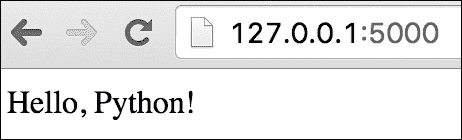

1.  太好了！现在让我们改进这个来实现用户 REST API。我们首先在`/v1/users/`资源上实现 HTTP 的`GET`。在以下代码中，我们实现了一个`flask`路由，名为`get_users()` API，以返回所有用户的 JSON 格式：

    ```py
            from flask import Flask, jsonify 
            app = Flask(__name__) 

            users = [ 
                { 
                    'id': 1, 
                    'username': u'cjgiridhar', 
                    'email': u'abc@xyz.com', 
                    'active': True 
                }, 
                { 
                    'id': 2, 
                    'username': u'python', 
                    'email': u'py@py.org', 
                    'active': False 
                } 
            ] 

            @app.route('/v1/users/', methods=['GET']) 
            def get_users(): 
                return jsonify({'users': users}) 

            if __name__ == '__main__': 
                app.run(debug=True) 

    ```

1.  如果我们重新运行应用程序（如果你使用的是 PyCharm 等编辑器，每次你保存代码时，它都会自动重新加载应用程序），我们的`flask`路由就会被加载；我们现在可以在`/v1/users/` API 上发出 HTTP `GET`请求。请求的输出将产生响应，如下一张截图所示。嘿，太酷了！我们为 RESTful 用户服务编写了第一个资源。

1.  注意响应的头部部分：

    +   `Content-Type`是 application/JSON（我们将在本章后面讨论消息格式）

    +   服务器是基于 Werkzeug 的 Flask

    +   日期指的是服务器响应请求的时间

    +   响应体包含以下内容：

    +   包含所有用户信息的`users`键输出

    +   关于用户的信息包括所需的属性，如 ID、用户名、电子邮件和账户状态

    响应格式是 JSON，如头部所示

    ### 注意

    注意，我们使用 Firefox 的 RESTED 插件来发送这些请求。

    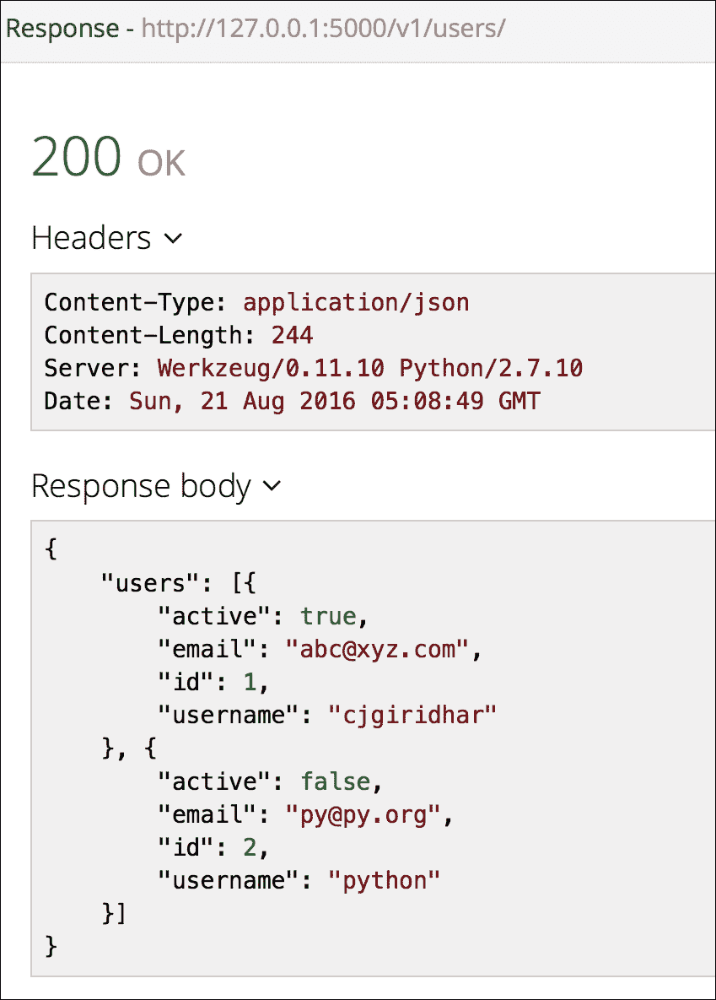

1.  太好了！我们已经将第一个 URI 作为用户服务的一部分实现了。现在让我们快速继续实现下一个资源。在这里，我们需要根据 ID 获取用户。以下 `flask` 路由将为我们完成这项工作：

    ```py
            @app.errorhandler(404) 
            def not_found(error): 
                return make_response(jsonify({'error': 'Not found'}), 404) 

            @app.route('/v1/users/<int:id>/', methods=['GET']) 
            def get_user(id): 
                for user in users: 
                    if user.get("id") == id: 
                        return jsonify({'users': user}) 
                abort(404) 

    ```

1.  在前面的代码中，我们定义了一个 `flask` 路由，其 API 为 `get_user(id)`，它接受用户 ID 作为参数。当我们对这个 URI 发起 HTTP `GET` 请求时，`get_user()` API 被调用；它内部查找所有可用的用户以定位到具有所需 ID 的用户。如果找到用户，则将用户记录以 JSON 格式返回；如果没有找到，服务器发送 HTTP 404 响应。以下是一个说明此过程的截图：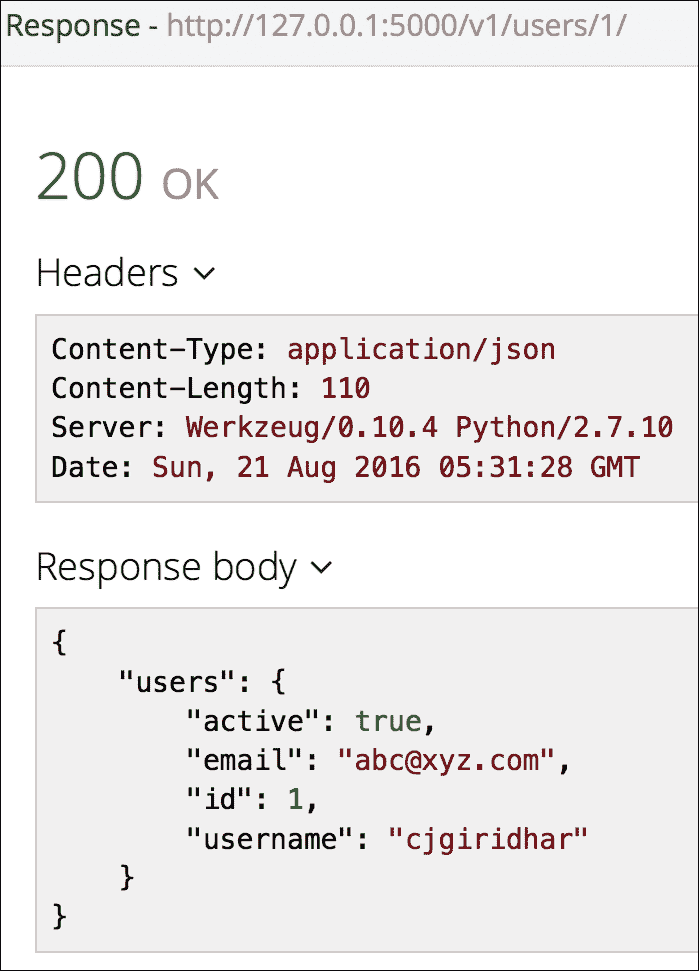

1.  您希望用户在您的网络应用程序上注册，对吧？所以让我们编写一个 `flask` 路由，它将帮助创建一个新的用户。以下代码执行此操作：

    ```py
            @app.route('/v1/users/', methods=['POST']) 
            def create_user(): 
                if not request.json or not 'email' in request.json: 
                    abort(404) 
                user_id = users[-1].get("id") + 1 
                username = request.json.get('username') 
                email = request.json.get('email') 
                status = False 
                user = {"id": user_id, "email": email, 
                        "username": username, "active": status} 
                users.append(user) 
                return jsonify({'user':user}), 201 

    ```

1.  现在如果您在 `/v1/users/` 资源上发起一个 HTTP `POST` 请求并将用户信息传递到请求体中，您将能够创建一个新的用户。默认情况下，用户的状 态将是未激活（`'active': False`）；当用户验证她的/他的电子邮件地址时，您可以将其设置为 `'active': False`：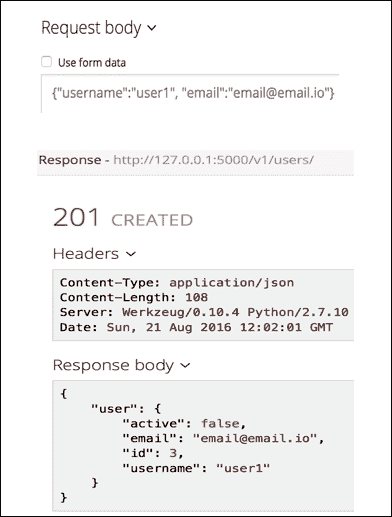

1.  好吧！现在让我们快速看一下将编辑用户详情并在需要时删除用户的 REST API。以下 Flask 路由将编辑用户详情：

    ```py
            @app.route('/v1/users/<int:id>/', methods=['PUT']) 
            def update_user(id): 
                user = [user for user in users if user['id'] == id] 
                user[0]['username'] = request.json.get( 
                        'username', user[0]['username']) 
                user[0]['email'] = request.json.get( 
            'email', user[0]['email']) 
                user[0]['active'] = request.json.get( 
            'active', user[0]['active']) 
                return jsonify({'users': user[0]}) 

    ```

1.  现在如果我们对 `/v1/users/:id/` 资源执行 HTTP `PUT` 操作并传递更改后的数据，我们应该能够更新用户信息。在以下截图中，请求体包含需要更新为用户 ID 等于 `1` 的新电子邮件地址。当我们发起 HTTP `PUT` 请求时，信息得到更新，我们有了用户的新电子邮件地址：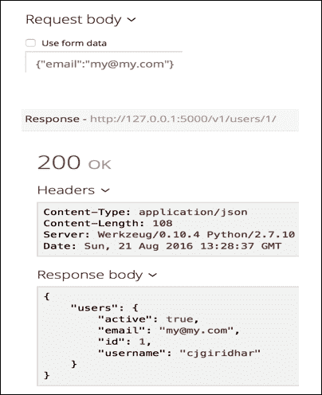

1.  现在唯一待定的操作是实现 `DELETE` 操作。我们可以使用这个操作来删除一个用户。但您可能会问，“我为什么要删除用户？”所以您可以为 `DELETE` 操作实现自己的实现；可能的话，您可以通过将 `active` 属性设置为 `False` 来使用户未激活。但为了这次讨论，让我们随意删除用户。

1.  以下代码根据用户 ID 删除用户：

    ```py
            @app.route('/v1/users/<int:id>/', methods=['DELETE']) 
            def delete_user(id): 
                user = [user for user in users if user['id'] == id] 
                users.remove(user[0]) 
                return jsonify({}), 204 

    ```

1.  `DELETE` 操作通常返回状态码 **204 NO CONTENT**，如下截图所示：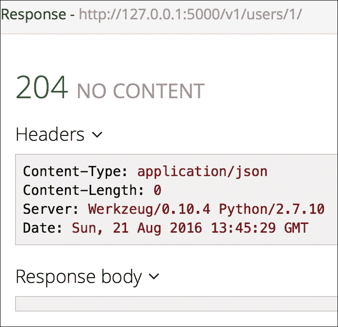

1.  太棒了！所以我们已经完全实现了 RESTful 用户服务并使其运行。太好了！

## 它是如何工作的...

REST 是万维网的一种架构风格。它由一组协调的组件组成，其中重点在于组件角色和数据元素之间的交互，而不是实现。其目的是使网络更具可扩展性、可移植性和可靠性，并提高性能。

REST 架构根据以下约束工作：

+   **客户端-服务器**：**统一资源定位符**（**URL**）将 REST API 与客户端分开。服务器不关心用户界面或状态；因此，REST API 更具可扩展性。

+   **无状态**：这意味着每个请求都是独立的，并且与之前的请求或客户端没有关联。客户端必须包含完成请求所需的所有信息，会话状态保持在客户端，因此不会存储在服务器上。

+   **可缓存**：RESTful 网络服务可以缓存或不缓存响应。服务必须让客户端知道响应是否被缓存。这有助于提高系统的性能，因为某些请求可能不再需要，基于缓存过期时间。

+   **分层系统**：客户端可能直接与服务器交互，也可能不直接交互；它们始终可以拥有中介服务器，如缓存或负载均衡器。

+   **统一资源**：每个 REST 资源应该是独立的；这允许你有一个关注点的分离，并且解耦了架构。

+   **按需代码**：服务器可以为客户端提供在其上下文中执行的代码。这是一个可选的要求。

`GET`和`HEAD`方法是安全方法的例子，因为它们不会改变资源的状态。`PUT`/`DELETE`方法是幂等的。这意味着客户端可以对资源进行多次类似的调用，资源将以完全相同的方式表现；当然，响应本身也会发生变化。

太棒了！现在我们处于创建自己的 RESTful API 的位置。我们可以在互联网上托管这些 API，供我们的客户使用，或在我们的网络应用程序中实现功能。做得好！

## 还有更多...

我们研究了 REST 架构的基础，并学习了如何设计 RESTful 网络服务。我们得到了 Flask 微框架的帮助，并学习了如何编写我们自己的 REST API。

在下一个菜谱中，我们将看到客户端如何根据其需求消费 REST API。我们还将学习如何使用 REST API 来自动化业务流程。

# 使用 Twitter API 自动化社交媒体营销

乔伊是一家世界知名消费品牌的营销经理。她负责公司的内容营销组合，并严重依赖博客和社交媒体来展示公司的产品线并在市场上制造轰动。

毫无疑问，她有几个问题！她所营销的一些产品针对不同的市场设计不同，因此她必须跨越时区工作，以确保她的内容在正确的时间发布。她还觉得有必要重复发布帖子，以确保她能够接触到大多数客户；这也有助于提高品牌知名度。

## 准备中

如果你仔细分析她的情况，Joy 有两个问题。一是，她必须确保她的社交媒体内容在正确的时间发布，基于她的客户市场。所以如果她的产品在澳大利亚销售，她需要确保她的推文在澳大利亚时间发布，那时她的客户最有可能查看。二是，为了使她的产品公告（如周末优惠）获得更多关注，她可能希望在稍后的时间重复几条推文。

好的！现在我们了解了她的问题，让我们尝试制定一个解决方案。看起来我们需要注意以下要点：

+   我们应该提供她自动发布推文的 capability

+   她的推文应该在期望的时间发布，即使 Joy 睡着了

+   我们还应该提供安排重复推文的 capability

## 如何做...

REST APIs 来拯救！Twitter 提供了一套令人惊叹的 REST APIs，用户可以使用这些 API 来玩转 Twitter 数据、用户信息，当然还有发布推文。你还可以执行多个操作，如上传图片、查询时间线、发送私信。哇！太酷了！但让我们不要分心，而是继续解决手头的这个问题：

1.  首先，让我们看看我们如何使用 Python 发布推文，即使不登录到 Twitter。要发布推文，我们将使用一个名为 `twython` 的 Python 库。所以让我们使用我们的朋友 Python `pip` 安装 `twython`：

    ```py
     (user)chetans-MacBookPro:ch07 Chetan$ pip install twython 
            Collecting twython 
              Downloading twython-3.4.0.tar.gz 
            Collecting requests>=2.1.0 (from twython) 
              Downloading requests-2.11.1-py2.py3-none-any.whl (514kB) 
                100% |████████████████████████████████| 516kB 495kB/s  
            Collecting requests-oauthlib>=0.4.0 (from twython) 
              Downloading requests_oauthlib-0.6.2-py2.py3-none-any.whl 
            Collecting oauthlib>=0.6.2 (from requests-oauthlib>=0.4.0-
            >twython) 
              Downloading oauthlib-1.1.2.tar.gz (111kB) 
                100% |████████████████████████████████| 114kB 80kB/s  
            Building wheels for collected packages: twython, oauthlib 
              Running setup.py bdist_wheel for twython 
              Stored in directory: /Users/chetan/Library/Caches/pip/ 
              wheels/48/e9/f5/a4c968725948c73f71df51a3c6 
              759425358c1eda2dcf2031f4 
              Running setup.py bdist_wheel for oauthlib 
              Stored in directory: /Users/chetan/Library/Caches/pip/ 
              wheels/e6/be/43/e4a2ca8cb9c78fbd9b5b14b9 
              6cb7a5cc43f36bc11af5dfac5b 
            Successfully built twython oauthlib 
            Installing collected packages: requests, oauthlib,  
                                   requests-oauthlib, twython 
            Successfully installed oauthlib-1.1.2  
              requests-2.11.1 requests-oauthlib-0.6.2 twython-3.4.0 
             (user)chetans-MacBookPro:ch07 Chetan$ 

    ```

1.  但在我们开始玩转我们的 Twitter 账户之前，我们需要在 Twitter 上注册一个应用程序。这确保了 Twitter 了解我们的 API 调用，并认为它们是合法的。我们可以通过导航到 [`apps.twitter.com/`](https://apps.twitter.com/) 并点击 **Create New App** 来注册一个应用程序。你可以填写以下截图所示的详细信息并创建你的应用程序。

    请注意你需要填写的一些细节：

    +   应用程序名称在 Twitter 的所有用户中是唯一的，所以尽量让它对你来说非常独特，但同时也要保持简单

    +   制作一个精确定义你的 use case 的描述，这样你以后就能记住它

    +   填写你的网站名称；保持简短

    +   只有当你想让 Twitter 发送有关你的 authentication 的数据给你时，才需要回调 URL，而这在这个练习中不是必需的

    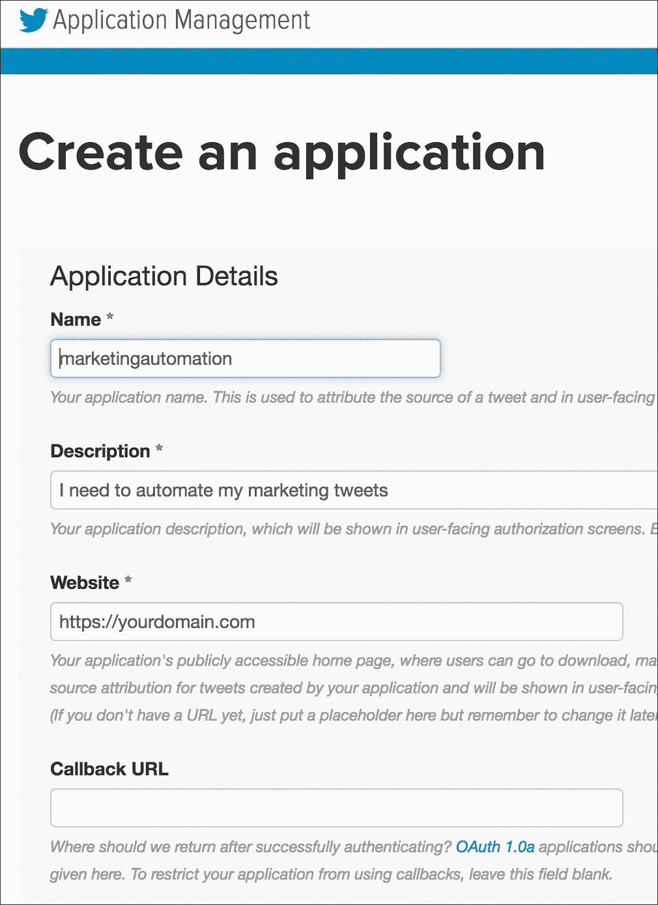

1.  你还需要获取你的 App Key 和 App Secret，为此你需要 OAuth Token 和 OAuth Token Secret。这些基本上是用于验证你的 API 调用与 Twitter，否则 Twitter 会拒绝你的 REST API 调用，认为它是恶意行为。你可以通过点击你新创建的应用程序并浏览到页面顶部的 **Keys and Access Tokens** 选项卡来获取这些详细信息：

1.  好的！让我们写一些代码，检查我们是否可以与 Twitter 的 REST API 一起工作。以下代码调用 Twitter 时间轴 REST API，并获取您时间轴上最顶部推文的详细信息。在这里，我们对[`dev.twitter.com/rest/reference/get/statuses/home_timeline`](https://dev.twitter.com/rest/reference/get/statuses/home_timeline) REST API 执行 HTTP `GET`操作：

    ```py
            from twython import Twython 

            APP_KEY = '' 
            APP_SECRET = '' 
            OAUTH_TOKEN ='' 
            OAUTH_TOKEN_SECRET = '' 
            twitter = Twython(APP_KEY, APP_SECRET, 
                              OAUTH_TOKEN, OAUTH_TOKEN_SECRET) 

            tweet = twitter.get_home_timeline()[1] 
            print "Tweet text: ", tweet["text"] 
            print "Tweet created at: ", tweet["created_at"] 
            print "Tweeted by: ",  
            tweet["entities"]["user_mentions"][0]["name"] 
            print "Re Tweeted?: ", tweet["retweet_count"] 

    ```

    前面代码片段的输出如下：

    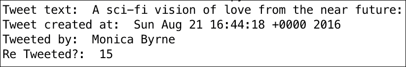

    这很酷！我们从时间轴上的帖子中获取所有必要的信息。看起来在 Twitter 应用和密钥方面我们已经准备好了。

1.  现在，让我们尝试通过向它发送数据来使用状态 REST API 进行推文。这里使用的 REST API 是[`dev.twitter.com/rest/reference/post/statuses/update`](https://dev.twitter.com/rest/reference/post/statuses/update)。以下 Python 代码将对这个 REST 资源发起`POST`请求，并在我的推特账户上创建一条推文：

    ```py
            from twython import Twython 

            APP_KEY = '' 
            APP_SECRET = '' 
            OAUTH_TOKEN ='' 
            OAUTH_TOKEN_SECRET = '' 
            twitter = Twython(APP_KEY, APP_SECRET, 
                              OAUTH_TOKEN, OAUTH_TOKEN_SECRET) 
            twitter.update_status(status='Python import antigravity
            https://xkcd.com/353/') 

    ```

    在运行前面的代码后，我查看了推特，哇！我的名字下自动出现了一条推文。以下是这条推文的截图：

    

    因此，我们已经为乔伊解决了第一个问题。即使她不在或无法登录互联网，也可以代表她发布推文。这可以通过前面的 Python 代码片段完成。但她还不能按照澳大利亚时区安排她的推文。嗯，让我们现在看看如何解决调度问题。

1.  在我们查看如何安排推文之前，我们将安装一个对下一个菜谱非常有用的模块。我们将安装`pytz`。它帮助我们处理时区，并将有助于解决乔伊的问题：

    ```py
     (user)chetans-MacBookPro:ch07 Chetan$ pip install pytz 
            Collecting pytz 
              Using cached pytz-2016.6.1-py2.py3-none-any.whl 
            Installing collected packages: pytz 
            Successfully installed pytz-2016.6.1 

    ```

1.  为了解决调度问题，我们需要两样东西。首先，我们需要一个配置，可以用来决定推文的内容、时间和时区。其次，我们需要一个运行程序，将使用这个配置在推特上发布推文。现在让我们看看以下代码，它正好是我们需要的：

    ```py
            scheduled_tweets.py 

            from twython import Twython 

            APP_KEY = '' 
            APP_SECRET = '' 
            OAUTH_TOKEN ='' 
            OAUTH_TOKEN_SECRET = '' 
            twitter = Twython(APP_KEY, APP_SECRET, 
                      OAUTH_TOKEN, OAUTH_TOKEN_SECRET) 

            from datetime import datetime 
            import pytz, time 
            from pytz import timezone 
            import tweet_config as config 

            while True: 

                for msg in config.scheduled_messages: 
                    print msg["timezone"] 
                    tz = timezone(msg["timezone"]) 
                    utc = pytz.utc 
                    utc_dt = datetime.utcnow().replace(tzinfo=utc) 
                    au_dt = utc_dt.astimezone(tz) 
                    sday = au_dt.strftime('%Y-%m-%d') 
                    stime = au_dt.strftime('%H:%M') 
                    print "Current Day:Time", sday, stime 

                    if sday == msg["day"]: 
                        if stime == msg["time"]: 
                            print "Time", stime 
                            print "Content", msg["content"] 
                            twitter.update_status(status='%s' %
                            msg["content"] ) 

                print "Running.. Will try in another min" 
                time.sleep(60) 
                tweet_config.py
            offers_sydney = { 
                "content":"Weekend Offers, avail 30% discount today!", 
                "day":"2016-08-27", 
                "time":"13:25", 
                "timezone":"Australia/Sydney" 
            } 

            post_newyork = { 
                "content":"Introducing sun glasses at your favorite stores 
                in NY!", 
                "day":"2016-08-27", 
                "time":"12:41", 
                "timezone":"America/New_York" 
            } 

            scheduled_messages = [offers_sydney, post_newyork] 

    ```

    前面代码的输出如下。这是第一次迭代：

    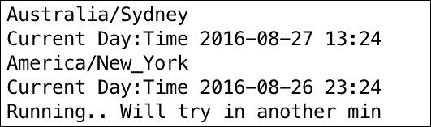

    这是第二次迭代：

    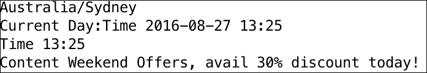

    这是实际的推文：

    

1.  太酷了！所以我们有了乔伊需要的东西。一条自动推文，在正确的时间，向全球的正确受众推送正确的内容。哇哦！

## 它是如何工作的...

在前面的代码片段中，我们有两个文件。我们有`tweet_config.py`，它包含一个配置字典，用于指定推文的内容和安排。它还提到了需要发布推文的时区。

第二个文件`scheduled_tweets.py`是一个运行程序。它每分钟检查一次配置，看看当天是否有安排的推文。

当运行程序`scheduled_tweets.py`运行时，它会检查是否有任何安排的消息。在迭代 1 中，运行程序没有找到需要处理的内容；它只是返回当前时区的日期和时间。

在迭代 2 中，它确实发现有一个在澳大利亚时区，即悉尼，8 月 27 日 13:25 安排的推文；^，因为时间匹配，它发布了一条推文。当然，这里采用的例子非常简单。我们可能想要安排 Cron 作业而不是无休止的 while 循环。但是嘿，这是一个为了说明自动安排推文这一点的例子。

在本节中，我们自动化了 Joy 的营销过程。现在她不仅可以在睡觉时发推文，还可以为不同的时区和不同的内容安排推文。这就是自动化的力量。

“但是嘿，这只是一个社交媒体平台；那 Facebook 呢？”你可能想知道。是的，我们这里有一个小技巧。Twitter 提供了连接你到多个服务的应用程序，包括 Facebook。所以为你的账户配置一个应用程序，以便你发布的每条推文也会被发布在 Facebook 上。这是配置看起来像什么。它发布你的原始推文，并在你的 Facebook 个人资料上转发它们：


记得我们最初发布的关于 Python 反重力（antigravity）的消息吗？是的，它实际上也被发布在了 Facebook 墙上。看看推文日期和时间旁边的源代码；是的，那是 Twitter！也许，Twitter 使用 Facebook API 来自动化这个过程：

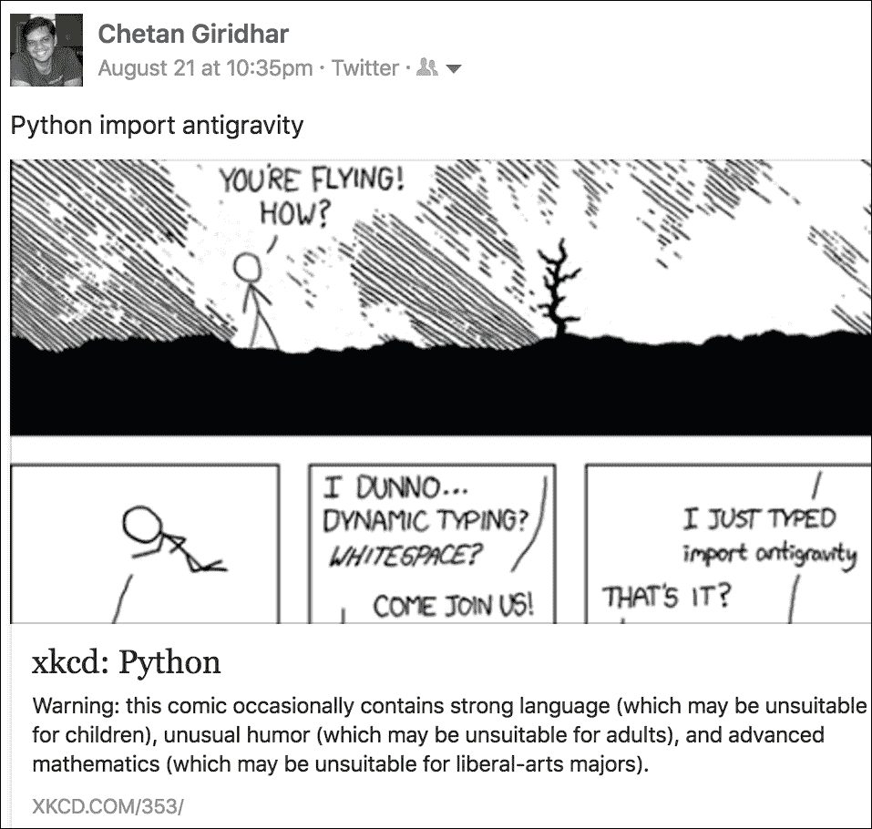

# Webhooks 简介

在上一节中，我们了解了如何设计和开发 REST API，以及如何通过 Twitter/Facebook 自动化的例子来利用 REST API 为我们带来好处。让我们看看另一个令人惊叹的部分：Webhooks。Webhook 是一种 HTTP 回调——当发生有利事件时，向用户定义的 URL（实现为 HTTP API）发送的 HTTP `POST`请求。Webhooks 通常被称为反向 API，用于跨服务的实时通信或集成。但在我们深入之前，让我们了解一下轮询。

你可能见过应用程序长时间轮询以检查是否发生了某个事件，以便它们可以对该事件执行一些后续操作。以一个现实世界的例子来说明。你去了自助餐厅，为午餐点了一份你最喜欢的披萨。柜台上的那个人给你一个订单号，并告诉你去观察那个标记机，以便你可以领取你的披萨。当周围的人都忙着吃饭时，你饿了，每隔 5 秒钟就会看一次这个标记机，希望看到你的订单号在上面闪烁。现在这就是轮询。你正在轮询这个标记机。在 API 世界中，客户端会轮询披萨店的 API 来检查订单的状态。

服务台的人当订单准备好时大声喊出订单号不是足够简单吗？所以在你下单后，你可以忙于检查你的官方电子邮件。当服务人员叫出你的订单号时，你可以从配送柜台取走你的披萨。这确保了你的时间得到更好的利用。现在这就是一个 Webhook。当发生有利的事件（你的订单准备好了）时，你会在你的 URL（在这种情况下，你的耳朵）上收到回调（服务人员大声喊出你的订单号），这个 URL 实际上是在监听并响应回调。在 API 世界中，你会注册你的 URL（HTTP API），当你的订单准备好时，披萨店会调用这个 URL。

Webhooks 可以用于三个主要目的：

+   实时接收数据

+   接收数据并将其推送到另一个服务

+   接收数据然后处理并返回它

你可以思考在前面三个场景中如何使用 Webhooks 的许多不同方式。

如果你想到轮询和 Webhooks，它们都使用 API 来满足集成需求。虽然轮询是一种客户端驱动的集成技术，但 Webhooks 是服务器驱动的。轮询在效率上非常低，因为客户端不断地通过时间戳调用服务器 API 来检查资源的状态（在我们的例子中，是一个订单资源）。轮询可以每 *x* 分钟、*x* 小时甚至 *x* 秒进行，以变得更加实时，但我认为你已经了解了轮询的低效率。另一方面，Webhooks 在有利事件发生时将数据发送回回调 URI。这比持续的轮询更有效率，但不利的一面是你最终需要在客户端开发 API，所以你的客户端倾向于表现得像服务器本身。

# 实现 Webhooks

带着这些知识，让我们开始并在这个菜谱中实现 Webhooks。

## 准备工作

对于这个菜谱，我们将使用一个著名的 Python 网络框架，称为 **Django**。它允许你使用多个插件，这些插件可以简单地插入。在这里，我们将使用 Zapier 开发的 `django-rest-hooks` 插件来实现 Webhooks。

所以让我们开始并安装所需的包。我们使用我们最喜欢的工具 Python `pip` 安装 `Django==1.10` 和 `django-rest-hooks==1.3.1`：

```py
 (user)chetans-MacBookPro:ch07 Chetan$ pip install Django==1.10 
        Collecting Django==1.10 
          Downloading Django-1.10-py2.py3-none-any.whl (6.8MB) 
            100% |████████████████████████████████| 6.8MB 71kB/s  
        Installing collected packages: Django 
        Successfully installed Django-1.10 

         (user)chetans-MacBookPro:ch07 Chetan$ pip install django-rest-hooks 
        Collecting django-rest-hooks 
          Downloading django-rest-hooks-1.3.1.tar.gz 
        Requirement already satisfied (use --upgrade to upgrade): Django>=1.4 in ./user/lib/python2.7/site-packages (from django-rest-hooks) 
        Requirement already satisfied (use --upgrade to upgrade): requests in ./user/lib/python2.7/site-packages (from django-rest-hooks) 
        Building wheels for collected packages: django-rest-hooks 
          Running setup.py bdist_wheel for django-rest-hooks 
          Stored in directory: /Users/chetan/Library/Caches/pip/wheels/96/93/12/3ec10693ee2b394a7d8594e8939f7506d7231fab69c8e69550 
        Successfully built django-rest-hooks 
        Installing collected packages: django-rest-hooks 
        Successfully installed django-rest-hooks-1.3.1 

```

## 如何做到这一点...

1.  好的，让我们创建一个 Django 应用。我们通过以下命令来完成这个操作：

    ```py
     python manage.py startproject bookstore 
               cd bookstore 
               python manage.py startapp book 

    ```

1.  接下来，让我们配置 Django 以在应用中使用 `rest_hooks` 模块。我们通过将 `rest_hooks` 添加到 `bookstore/settings.py` 中的 `INSTALLED_APPS` 来完成这个操作。我们还把我们的应用 book 添加到这个列表中。通过使用 `HOOK_EVENTS` 常量，将一个事件 `user.signup` 添加到 `settings.py` 中。在这里，我们没有将事件 `user.signup` 绑定到任何操作，所以它是空的。这就是 `settings.py` 应该看起来像的：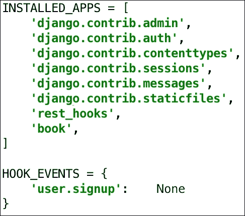

1.  现在，让我们将此事件注册到回调 URL 上。但在我们继续之前，导航到你的项目根目录并运行以下命令以初始化你的 Django 模型：

    ```py
     (user)chetans-MacBookPro:bookstore Chetan$ python manage.py
            migrate 
            Operations to perform: 
              Apply all migrations: admin, contenttypes, rest_hooks, auth,
              sessions 
            Running migrations: 
              Rendering model states... DONE 
              Applying contenttypes.0001_initial... OK 
              Applying auth.0001_initial... OK 
              Applying admin.0001_initial... OK 
              Applying admin.0002_logentry_remove_auto_add... OK 
              Applying contenttypes.0002_remove_content_type_name... OK 
              Applying auth.0002_alter_permission_name_max_length... OK 
              Applying auth.0003_alter_user_email_max_length... OK 
              Applying auth.0004_alter_user_username_opts... OK 
              Applying auth.0005_alter_user_last_login_null... OK 
              Applying auth.0006_require_contenttypes_0002... OK 
              Applying auth.0007_alter_validators_add_error_messages... OK 
              Applying rest_hooks.0001_initial... OK 
              Applying sessions.0001_initial... OK 

    ```

1.  一旦初始化了模型，转到数据库 shell 并运行以下 Python 代码片段。它们将在 Django 用户表中创建一个用户并为该用户注册一个 Webhook：

    ```py
     >>> from django.contrib.auth.models import User 
            >>> from rest_hooks.models import Hook 
            >>> usr=User.objects.create(username='chetan') 
            >>> hook = Hook(user=usr, event='user.signup',
            target='http://localhost:8000/hook/') 
            >>> hook.save() 
            >>> hook 
            <Hook: user.signup => http://localhost:8000/hook/> 

    ```

1.  现在将一个名为 `urls.py` 的文件添加到 Book 应用程序中，并添加以下代码：

    ```py
            from django.conf.urls import url 
            from . import views 
            urlpatterns = [ 
                url(r'event/$', views.event), 
                url(r'hook/$', views.webhook),] 

    ```

1.  将以下方法添加到 `book/views.py` 中以创建 Django 视图：

    ```py
            from django.shortcuts import render
            from django.views.decorators.csrf import csrf_exempt 
            from rest_hooks.signals import raw_hook_event 
            from django.contrib.auth.models import User 
            import datetime 
            from django.http.response import HttpResponse 
            # Create your views here. 

            @csrf_exempt 
            def webhook(request): 
                print request.body 
                return HttpResponse() 

            def event(request): 
                user = User.objects.get(username='chetan') 
                raw_hook_event.send( 
                    sender=None, 
                    event_name='user.signup', 
                    payload={ 
                        'username': user.username, 
                        'email': user.email, 
                        'when': datetime.datetime.now().isoformat() 
                    }, 
                    user=user # required: used to filter Hooks 
                ) 
                return HttpResponse() 

    ```

1.  此外，将以下 URL 包含在项目中的 `bookstore.urls.py` 文件中，如下所示：

    ```py
            from django.conf.urls import url, include 
            from django.contrib import admin 

            urlpatterns = [ 
                url(r'^admin/', admin.site.urls), 
                url(r'^', include('book.urls')) 
            ] 

    ```

1.  现在按照以下方式运行 Django 服务器：

    ```py
     (user)chetans-MacBookPro:bookstore Chetan$ python manage.py 
            runserver 
            Performing system checks... 

            System check identified no issues (0 silenced). 
            August 27, 2016 - 11:14:52 
            Django version 1.9, using settings 'bookstore.settings' 
            Starting development server at http://127.0.0.1:8000/ 
            Quit the server with CONTROL-C. 

    ```

1.  从您的浏览器中，访问 `http://localhost:8000/event/` 并查看您的服务器日志。您将看到已注册的 Webhook 被调用，这意味着向目标 URL `http://localhost:8000/hook/` 发送了一个包含我们配置在视图中的所有信息的 HTTP `POST` 请求。服务器日志如下所示：

    ```py
            [27/Aug/2016 10:53:29] "GET /event/ HTTP/1.1" 200 0 

            {"hook": {"target": "http://localhost:8000/hook/", "id": 1,
            "event": "user.signup"}, "data": {"username": "chetan", "when": 
            "2016-08-27T10:53:29.301317", "email": ""}} 

             [27/Aug/2016 10:53:29] "POST /hook/ HTTP/1.1" 200 0 

    ```

太棒了！你看了吗？我们调用了 /event URL，它反过来将所需信息发布到目标 URL，该 URL 已在我们的 Webhook 中注册为 `user.signup` 事件。

与自定义 Webhook 类似，也可以开发 RESTful Webhook。RESTful Webhook 通过 RESTful 接口支持订阅、通知和发布操作。RESTful Webhook 必须支持四种事件类型，即 `ACCESSED`、`CREATED`、`UPDATED` 和 `DELETED`，它们对应于四个 HTTP 动词；对于应用于资源的操作，应发送通知。例如，当资源被创建时，会生成一个事件；因此，Webhook 必须被触发，并且目标 URL 应该被发布。在我们的示例中，我们可以定义两个额外的钩子事件，即 `book.added` 和 `book.deleted`，以及如 `book.Book.added` 或 `book.Book.deleted` 的操作。当我们对模型执行 `book.save()` 操作时，`book.added` 事件将被触发，并且如果我们为该用户定义了此事件的钩子，则将在目标 URL 上调用 HTTP `POST` 请求。

## 它是如何工作的...

在前面的代码片段中，我们首先在 `settings.py` 文件中定义了一个事件。该事件名为 `user.signup`。由于它是一个自定义事件，因此没有定义任何操作。

我们随后使用默认的 Django 用户模型在 `auth_user` 表中创建了一个新的用户 `chetan`。

之后，我们为用户 `chetan` 定义了一个 Webhook。此 Webhook 被配置为 `user.signup` 事件，目标 URL 设置为 `http://localhost:8000/hook/`。

我们还在我们的 Django 应用程序中定义了两个视图。第一个视图负责触发对应用户和事件的 Webhook，并发送有效负载信息。第二个视图 Webhook 定义为目标 URL。

我们随后启动了 Django 开发服务器，并导航到 `http://localhost:8000/event/`，该地址将有效负载信息发布到目标 URL，即 `http://localhost:8000/hook/`。目标 URL 接收了所有有效负载数据，例如用户名、电子邮件以及注册发生的时间。

## 还有更多...

在本节中，我们探讨了轮询和 Webhooks，它们是 Web 上使用 API 的另一种集成形式。我们学习了轮询的效率低下，以及 Webhooks 如何更加有用。在前面的菜谱中，我们介绍了一个对用户注册有用的自定义事件，因为我希望以通用的方式解释这个概念。覆盖范围很简短，所以我希望你能更多地研究 RESTful Webhooks，因为它们展示了自动化强大的用例。有了这个理解，让我们看看 Oliver 遇到了什么问题，以及我们如何帮助他。

# 使用 Webhooks 自动化潜在客户管理

Oliver 是 Joy 的同事，在市场营销部门工作。他负责用户入职流程。他的主要职责包括：

+   向在您的网站上注册的用户发送欢迎邮件

+   将新签约者的记录添加到 CRM 中

以前，由于网站上的注册数量很少，他很容易手动执行这两个任务。但随着网站知名度的增长，他开始看到每天注册数量的激增。毫无疑问，他认为这是一个非常耗时且可以轻松自动化的活动。你能帮助 Oliver 吗？

如果我们仔细分析问题，Oliver 的主要问题是服务之间的集成。他需要集成的两个服务是电子邮件和 CRM。他需要跟踪一个注册事件并对这个事件采取行动。Webhooks 是这个用例的完美解决方案。让我们看看我们如何帮助 Oliver 自动化他的任务。

## 如何操作...

我们将使用同一个 Django 项目来解决这个问题。我们还将使用外部服务 Zapier，看看它如何帮助使事情变得如此简单。让我们开始吧：

1.  从终端进入 Django 项目的根目录，并运行 Python `manage.py` shell 命令以登录到 DB shell。在这里，更新我们的用户`chetan`的电子邮件地址。这可以通过以下命令集实现：

    ```py
     >>> from django.contrib.auth.models import User 
            >>> from rest_hooks.models import Hook 
            >>> usr = User.objects.get(username='chetan') 
            >>> usr.email='chetan@email.io' 
            >>> usr.save() 

    ```

1.  现在通过导航到[`zapier.com/`](https://zapier.com/)创建 Zapier 应用的账户。一旦创建了账户，点击**创建 ZAP**进入**选择应用**，然后在**内置应用**部分下点击**Webhooks**：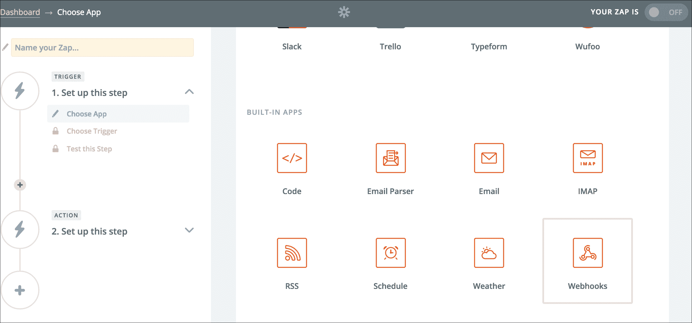

1.  一旦你选择了一个 Webhook，你将得到一个屏幕，在左侧面板上创建一个**触发器**和**操作**。在右侧，选择**捕获钩子**选项。点击**保存+继续**。参考以下截图：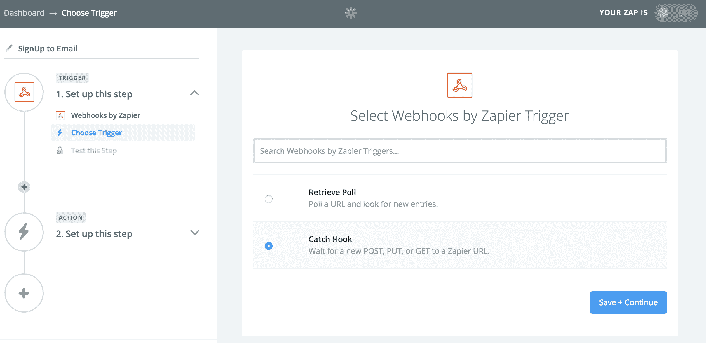

1.  接下来，你将获得一个页面，让你提供你想要从有效载荷中选择的一个 JSON 密钥。这是一个可选步骤，可以忽略。点击**继续**进入下一步。在这里，你会得到一个自定义的 Webhook URL。复制这个 URL；它将作为目标 URL。

1.  现在，回到您的 Django 项目并导航到 DB shell。创建一个新的钩子，使用相同的事件 `user.signup` 并将目标 URL 定位到您在早期步骤中收到的 URL。命令如下所示：

    ```py
     >>> hook = Hook(user=usr, event='user.signup', 
            target=
            'https://hooks.zapier.com/hooks/catch/<Id>/<Webhook_Id>/') 
            >>> hook.save() 
            >>> hook 
            <Hook: user.signup => 
            https://hooks.zapier.com/hooks/catch/<Id>/<Webhook_Id>/> 

    ```

1.  使用 Python `manage.py` 的 `runserver` 命令运行 Django 开发服务器。一旦服务器启动，请访问 `http://localhost:8000/event/`；这将向 Zapier 获得的目标 URL 发起回调请求。您可以通过再次访问 Zapier 并在**捕获钩子**部分左侧的**测试此步骤**中查看来验证这一点：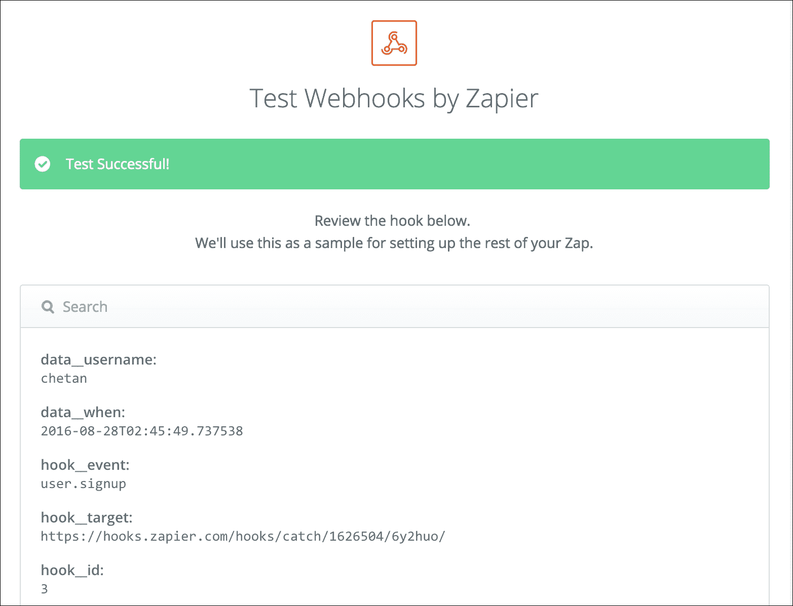

1.  太棒了！我们现在已经设置了触发器。接下来，让我们设置操作。为此，转到您的左侧面板，并在**操作**下点击**设置此步骤**。从屏幕右侧显示的应用程序列表中选择 Gmail：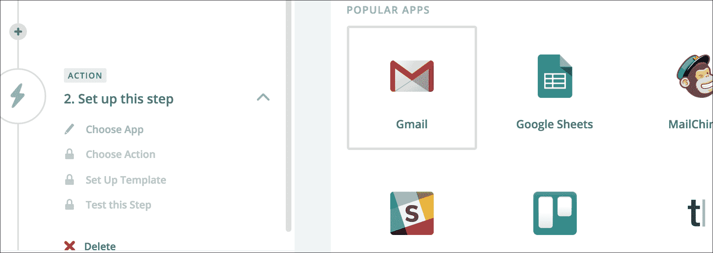

1.  一旦点击**Gmail**，你将获得选择下一步操作的下拉菜单，例如**创建草稿**或**发送电子邮件**。点击**发送电子邮件**，并通过允许 Zapier 访问您的电子邮件账户来激活您的电子邮件账户。以下截图将展示如何执行这些步骤：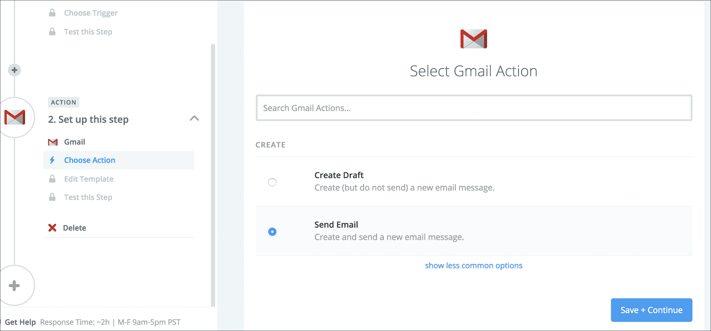

    在下一个截图中，我们允许 Zapier 访问 Gmail 应用程序：

    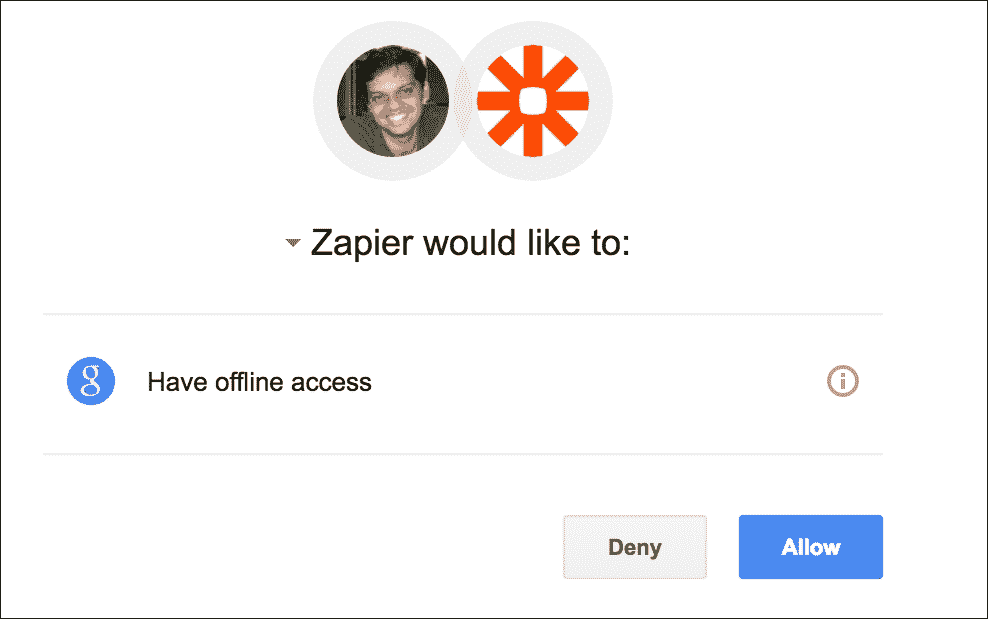

1.  好的！现在唯一要做的就是创建电子邮件模板。我们的模板包含**收件人**电子邮件地址、主题和正文。Zapier 提供了一个很好的选项来配置您的模板。如果您已经通过向目标 URL 发送数据来测试了触发器，您将在电子邮件模板中每个字段的极端右侧看到一组选项。在接下来的两个截图中，我在**收件人**字段中输入了**数据电子邮件**，在**主题**字段中输入了**欢迎数据用户名**，并将电子邮件正文设置为**您的注册让我们的日子变得美好**。

1.  以下截图显示了目标 URL 在触发器的**测试此步骤**部分接收到的有效载荷中的所有可用选项下拉列表。我刚刚展示了用户名。看看模板的字段名**收件人**如何从有效载荷中选择**数据用户名**：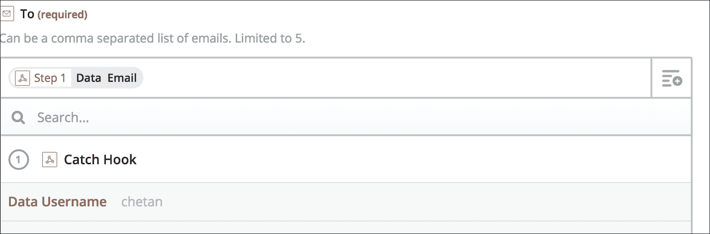

    在以下截图中，您可以看到配置了所有必要字段的电子邮件模板。我们在 Zapier 中配置了电子邮件的**收件人**、主题和正文部分：

    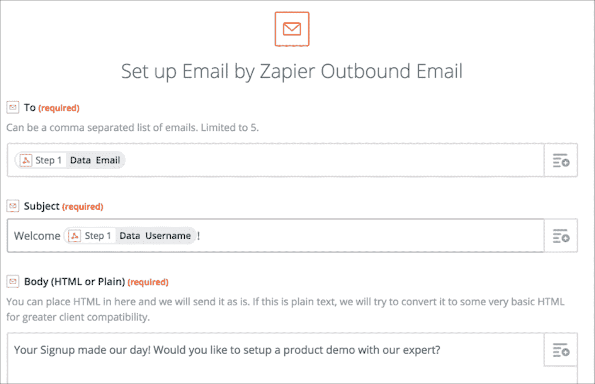

1.  就这样！点击屏幕底部的**继续**；Zapier 将测试您的操作，您就完成了。以下截图显示了成功的确认！！

1.  现在，如果你检查你的电子邮件，你应该已经收到了来自 Zapier 的测试电子邮件，这是用来测试 Zapier 操作的。电子邮件的内容正是我们想要的样子。非常酷！所以现在，当任何人注册奥利弗的产品网站时，视图将 `POST` 注册者的信息作为有效载荷到 Zapier 的 Webhook（目标 URL），Zapier 将自动化电子邮件部分。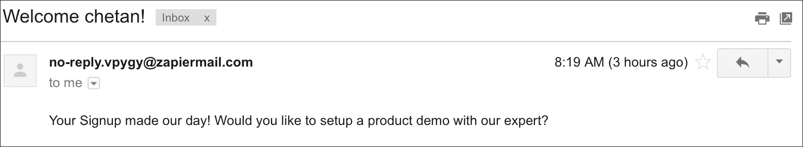

## 它是如何工作的...

Zapier 为我们提供了一个创建自定义 Webhooks 的功能。它与几乎所有应用程序都有集成，例如 Gmail、Trello、Slack 等。我们只是创建了一个 Webhook 作为触发器，然后跟随 Gmail 的一个操作。

每当用户注册（新用户创建）时，Django 应用程序会将用户的数据作为有效载荷 `POST` 到我们在 Zapier 中创建触发器时得到的 Zapier 目标 URL。

一旦 Zapier 收到目标 URL 的有效载荷数据，它会检查操作并发现需要向一个 Gmail 账户发送电子邮件。Zapier 还足够智能，能够从有效载荷中获取数据并将电子邮件发送到用户的电子邮件地址；它还允许配置电子邮件的主题和正文。

太棒了！奥利弗很高兴！那么第二步呢？嗯，它又是另一个 Zapier 触发器，可以是 Salesforce 或 Pipedrive CRM，用于在 CRM 中创建潜在客户记录。轻而易举！

在本节中，我们探讨了使用用户注册事件来自动化用户入职。我们以 Zapier 为例，因为它是最理想的自动化应用程序的方式。如果我们没有这样做，我们可能最终会理解所有这些应用程序提供的 API，并为它们各自编写代码，这可能并不是你的产品或服务的核心。

好了，就是这样，朋友们！希望你们喜欢这篇自动化文章，我确信你们一定会将其应用到你们组织中。
