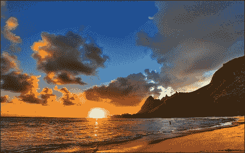
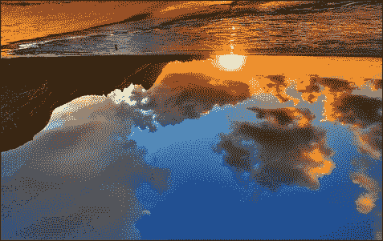
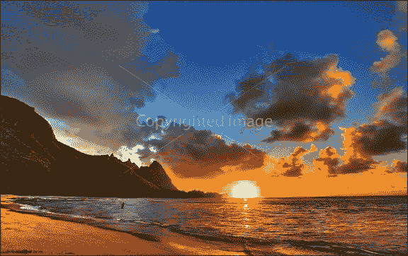
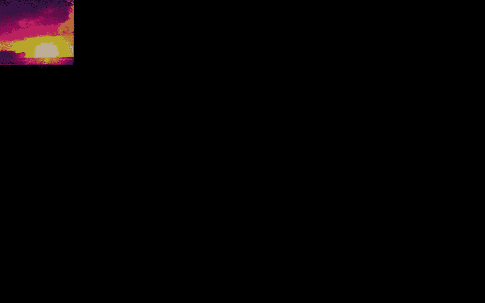
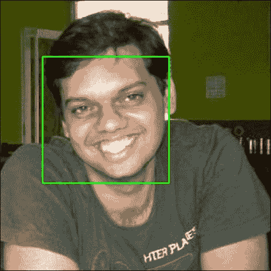
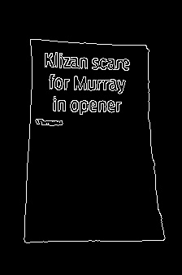
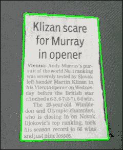

# 第九章. 想象中的图像

我们几乎每天都在处理图像。上传图像到您的 Facebook 个人资料页面，或者在开发移动或 Web 应用程序时操作图像；有大量的用例。随着计算机视觉领域的众多进步，成像已经成为一个关键领域。使用 Python 处理图像变得非常简单。

在本章中，我们将介绍以下食谱：

+   转换图像

+   调整大小、裁剪和生成缩略图

+   复制粘贴和添加水印的图像

+   图像差异和比较

+   人脸检测

+   成像作为业务流程

# 简介

在电子世界中，图像是由 0 和 1 组成的位序列。它们是场景或文档的电子快照。即使是绘画或照片也可以数字化成图像。让我们深入了解图像，了解它们的结构。

每张图像都被采样，并由称为**像素**的点阵表示。这些像素代表屏幕上显示的图片的最小可控元素。图像中可用的像素数量越多，设备屏幕上图像的表示就越准确。

每个像素的强度是可变的。在数字世界中，图像的颜色由三种或四种不同颜色的强度表示：**红色、绿色和蓝色**（**RGB**）或**青色、品红色、黄色和黑色**（**CMYK**）。计算机程序通常使用 RGBA 格式来表示颜色，其中 A 代表 alpha（或颜色的透明度）。每个像素在 RGBA 格式中以二进制表示，并由计算机作为序列存储。然后计算机读取这个序列进行显示，在某些情况下，将其转换为打印的模拟版本。让我们详细看看一些特定的图像属性。

## 图像属性

让我们看看一些图像属性：

+   **图像大小**：如您之前所学的，计算机图像以一系列 0 和 1 存储，并以像素（矩形点）为单位进行测量。图像的文件大小是根据它包含的像素数量和存储的颜色信息量来计算的。实际上，文件大小是图像在计算机硬盘上占用的空间。

+   **位深度**：这是表示单个像素颜色的位数。这个概念可以定义为每像素位数，表示描述像素所使用的位数。图像的位深度越大，它可以存储的颜色就越多。一个 1 位图像只能存储两种（2¹）颜色--0 和 1--因此是黑白颜色。与之相比，一个 8 位图像可以存储 256（2⁸）种颜色。

+   **图像分辨率**：分辨率是指图像中的像素数量。分辨率有时通过图像的宽度和高度来识别。例如，分辨率为 1920 x 1024 像素的图像包含 1,966,080 个像素，或是一个 1.9 兆像素的图像。

+   **图像质量**：它可以根据图像存储的信息进行更改。并非所有图像都需要存储所有像素来表示图像。例如，图片中连续的蓝色海洋区域不需要所有像素，并且图像可以被压缩以减少图像的磁盘空间，而不会影响图像质量。这种磁盘空间的减少被称为压缩。更高的压缩意味着细节的明显损失。在当今世界，典型的压缩类型是 JPG 压缩，它减少了图像的大小，同时也牺牲了图像的质量。

+   **图像格式**：图像在计算机中以不同的扩展名存储。例如，BMP 或 TIF 这样的格式根本不进行压缩；因此，它们占用更多的磁盘空间。例如，JPG 这样的文件可以进行压缩，您还可以选择压缩级别。因此，TIF 图像是无损的，而 JPG 压缩被称为有损压缩。值得注意的是，有损压缩利用了人类无法区分细微色调差异的能力。多次有损转换会导致图像退化，而多次无损转换将保留图像质量。但通常，在压缩时，是在图像退化和大小之间进行权衡。

好的，这是一个良好的开端。在本章中，我们将探讨更多关于图像的概念，并查看您可以使用 Python 在图像上执行的各种操作。我们将查看多个模块，这些模块将帮助我们以所需的方式操作图像。在本章结束时，我们还将探讨一个可以通过本章中涵盖的食谱所构建的知识自动化的典型业务流程。

在本章的进行过程中，我们将使用以下 Python 模块：

+   `Pillow` ([`pypi.python.org/pypi/Pillow`](https://pypi.python.org/pypi/Pillow))

+   `scipy` ([`www.scipy.org/`](https://www.scipy.org/))

+   `opencv` ([`pypi.python.org/pypi/opencv-python`](https://pypi.python.org/pypi/opencv-python))

# 转换图像

让我们以简单的示例开始我们的图像之旅。但在继续之前，让我们构建我们的虚拟环境。

1.  我们将使用`virtualenv`命令构建虚拟环境，并激活它：

    ```py
    chetans-MacBookPro:~ Chetan$ cd book/ch10/
    chetans-MacBookPro:ch10 Chetan$ virtualenv ch10
    New python executable in ch10/bin/python2.7
    Also creating executable in ch10/bin/python
    Installing setuptools, pip, wheel...done.
    chetans-MacBookPro:ch10 Chetan$ source ch10/bin/activate
    (ch10)chetans-MacBookPro:ch10 Chetan$

    ```

1.  太好了！因此，我们现在有一个独立的环境来处理本章的食谱。对于第一组示例，我们将使用 Python 的 Pillow 模块。在我们进入食谱之前，让我们先安装这个模块。我们将使用我们喜欢的`python-pip`来安装 Pillow 模块：

    ```py
    (ch10)chetans-MacBookPro:ch10 Chetan$ pip install pillow
    You are using pip version 7.1.0, however version 8.1.2 is
            available.
    You should consider upgrading via the 'pip install --upgrade
            pip' command.
    Collecting pillow
     Downloading Pillow-3.4.2.tar.gz (10.8MB)
     100% |████████████████████████████████| 10.8MB 39kB/s 
    Building wheels for collected packages: pillow
     Running setup.py bdist_wheel for pillow
    Installing collected packages: pillow
    Successfully installed pillow-3.4.2

    ```

因此，我们现在有了我们的环境，并且`Pillow`模块也已经安装。我们现在可以开始使用食谱工作了。

## 如何操作...

在本节中，我们将处理将图像转换为不同格式的问题。

1.  首先，让我们下载一个可以作为示例图像来执行所有操作的图像。我喜欢日落，这也是为什么我在本章的大部分食谱中使用了日落图像。这是它的样子。我把它存储在我的笔记本电脑上，命名为 `beach_sunset.png`：

1.  现在，让我们继续编写将此图像转换为 JPEG 格式的 Python 代码。以下代码正好符合我们的需求。我们将 Python 代码存储在一个名为 `convert.py` 的文件中：

    ```py
    from PIL import Image
    img = Image.open('beach_sunset.png')
    img.save('beach-sunset-conv.jpg','jpeg')

    ```

    当你用 Python 的 `convert.py` 命令运行此程序时，它将取原始 PNG 图像，将其转换为 JPG 格式，并存储为 `beach-susnset-conv.jpg`。

1.  真棒！现在，让我们对这个图像执行一个额外的操作，并将其转换为灰度图（黑白格式）。人们通常将图像转换为黑白格式，以赋予它们怀旧的外观；这可以通过以下一系列命令行轻松实现：

    ```py
            from PIL import Image 
            img = Image.open('beach_sunset.png').convert('L') 
            img.show() 
            img.save('beach-sunset-gray.png','png') 

    ```

    现在，当你运行这个程序时，你将在磁盘上看到另一个生成的图像，其名称为 `beach-sunset-gray.png`，如下所示：

    

1.  很酷，让我们更进一步，执行一些旋转和翻转图像的操作。这些动作通常用于有趣的网站，你可以简单地玩弄你的图像。以下代码将帮助你将图像旋转 180 度：

    ```py
            from PIL import Image 
            img = Image.open('sunset.jpg') 
            img.rotate(180).save('sunset180deg.jpg') 

    ```

    如果你用我们的基础图像运行此代码，你会看到一个旋转了 180 度的图像，即图像是颠倒的，如下所示：

    

1.  虽然旋转图像很酷，但如果我们可以翻转图像，那就更有趣了。PIL 在这里没有让人失望，并提供了水平翻转和垂直翻转图像的选项。以下代码将帮助我们执行翻转操作：

    ```py
            from PIL import Image 
            img = Image.open('sunset.jpg') 
            img.transpose(Image.FLIP_LEFT_RIGHT).save(
                          'sunset_horizontal_flip.png')
            img.transpose(Image.FLIP_TOP_BOTTOM).save(
                             'sunset_vertical_flip.png') 

    ```

    现在如果你运行这段代码，它将生成两个图像。以下图像与原始图像相同，但水平翻转（就像在图像的右侧放了一面镜子）。注意山已经移动到图像的右侧：

    

    以下截图是原始图像的镜像，它是垂直翻转的。注意，山仍然在图像的左侧，但它现在是颠倒的。落日的命运也是如此。它看起来像日出吗？

    

## 工作原理...

在本节中，我们处理了两种不同的图像格式：PNG 和 JPEG。**可移植网络图形**（**PNG**）文件是非损失性文件，在压缩照片图像时不会降低质量。它是一种优秀的网络图形文件格式；它可以用于多种背景，并支持透明度。对于第一个代码示例中使用的图像，`beach_sunset.png`，文件大小为 550KB。

**联合图像专家小组** (**JPEG**) 使用有损压缩技术来压缩图像。JPG 通过减少图像的部分到像素或瓦片来压缩图像。JPG 图像可以根据设置以 N:1 的比例压缩。由于图像容易压缩并且可以减少访问互联网上图像的带宽，JPG 已成为互联网上图像的标准。对于转换后的图像，我看到文件大小是 450KB--比 PNG 文件小近 20%。

现在，让我们理解 Python 代码。我们从`PIL`模块中导入`Image`类。`Image`类负责打开、加载和转换图像，以及其他操作，如将图像保存在磁盘上。在我们的示例中，我们使用`open()`方法打开 PNG 图像，并使用`save()`方法以 JPEG 格式保存图像。

在第二个示例中，我们将图像转换为黑白格式。正如我们有 RGB 和 CMYK 格式一样，我们也有*L*格式，它表示黑白。在将图像转换为*L*格式时，它使用 ITU-R 亮度格式，其中*L=R*299/1000 + G*587/1000 + B*114/1000*。

在 Python 代码方面，我们再次使用`Image`类来`open()`文件，并使用带有参数*L*的`convert()`方法将图像转换为黑白。最后，我们使用`save()`方法将文件保存在磁盘上。我们保持文件格式为 PNG。

在第三个示例中，我们使用相同的`Image`类和`open()`方法打开图像以获取`img`对象。然后，使用旋转角度作为参数调用`rotate()`方法。在我们的示例中，我们旋转了图像 180 度，并最终调用`save()`方法将旋转后的图像以`sunset180deg.jpg`的名称保存在磁盘上。

在最后一个示例中，我们使用了`PIL`模块的`transpose()`方法，并使用`Image.FLIP_LEFT_RIGHT`和`Image.FLIP_TOP_BOTTOM`属性将图像左右和上下翻转，然后分别以`sunset_horizontal_flip.png`和`sunset_vertical_flip.png`的名称保存翻转后的图像。

## 还有更多...

Pillow 模块有许多更多的方法可以帮助我们在图像上执行更复杂的操作，例如调整大小、粘贴、裁剪等等。我们将在本章的下一个示例中查看它们。

# 调整大小、裁剪和生成缩略图

调整图像大小和裁剪以获取图像的选定部分等操作非常常见，但当以编程方式尝试时，这些操作可能会变得繁琐。看看我们如何完成这些任务。

## 准备工作

在这个示例中，我们将使用`Pillow`库来调整图像大小和裁剪图像。由于我们已经安装了 Pillow 模块，我们不必担心任何安装。让我们开始操作吧。

## 如何做到这一点...

1.  首先，让我们看看如何将图像调整到给定的尺寸。创建一个 Python 文件，`resize.py`，并将以下代码片段粘贴进去：

    ```py
            from PIL import Image 
            img = Image.open('sunset.jpg') 
            resized = img.resize((256,256)) 
            resized.save('sunset-resize.jpg', 'jpeg') 

    ```

1.  此外，从互联网上下载一张图片，命名为 sunset.jpg。我的图片看起来像这样：

1.  现在，使用`python resize.py`命令运行 Python 代码，然后查看磁盘上的图像`sunset-resize.jpg`。你会看到图像被调整大小，看起来类似于以下截图：

    如预期的那样，图像的尺寸也是 256 像素乘以 256 像素：

    

1.  在编程中经常需要的另一个操作是生成图像的缩略图。缩略图用作原始图像的预览，通常用于电影评论网站或图书出版网站。让我们看看我们是否可以轻松地使用 Pillow 模块生成缩略图。创建一个 Python 文件并添加以下代码：

    ```py
            import os, sys 
            from PIL import Image 

            size = 128, 128 
            infile = "sunset.jpg" 
            outfile = os.path.splitext(infile)[0] + ".thumbnail.jpg" 
            if infile != outfile: 
                try: 
                    im = Image.open(infile) 
                    im.thumbnail(size, Image.BICUBIC) 
                    im.save(outfile, "JPEG") 
                except IOError: 
                    print "cannot create thumbnail for '%s'" % infile 

    ```

    现在，如果你运行这段代码，你会得到一个名为`sunset.thumbnail.jpg`的图像，它是原始图像的缩略图，看起来如下面的截图所示。如果你查看图像的大小，它不会是 128 x 128（对我来说是 128 x 80 像素）。我们将在稍后解释这个原因。

    太好了！因此，我们已经生成了图像的缩略图，它可以用作网站上的个人资料缩略图或预览图：

    

1.  在本食谱中，我们将介绍另一种操作，即图像裁剪。以下代码正好实现了我们所需要的功能：

    ```py
            from PIL import Image 
            img = Image.open('sunset.jpg') 
            cropImg = img.crop((965, 700, 1265, 960)) 
            cropImg.save('sunset-crop.jpg') 

    ```

    如果你运行前面的 Python 代码片段，你将在磁盘上看到一个名为`sunset-crop.jpg`的图像，它从原始日落图像中裁剪了太阳。它看起来是这样的：

    

看起来很棒，我们可以如此轻松且直观地使用 Pillow 对图像执行多个操作。但是这些操作是如何工作的；使用了哪些方法？让我们来看看。

## 它是如何工作的...

在这个食谱中，我们再次使用了 Pillow 的`Image`类来调整图像大小、裁剪图像并从原始图像生成缩略图。

在第一个代码片段中，我们使用`open()`方法打开了 sunset.jpg 图像。然后我们使用带有元组参数的`resize()`方法，列出了调整大小图像的宽度和高度。然后我们使用`save()`方法，文件名为`sunset-esize.jpg`，以 JPEG 格式将文件保存到磁盘上。

在第二个片段中，我们使用`open()`方法打开图像并获取一个图像对象。然后，我们使用`Image`类的`thumbnail()`方法对图像对象进行缩略图生成。`thumbnail()`方法接受图像的大小（我们使用了 128 x 128），并使用 BICUBIC 图像过滤机制。最后，我们使用`save()`方法保存图像，目标文件名为`sunset.thumbnail.jpg`。我们查看缩略图的大小，并发现它并不完全是 128 x 128；实际上，它是 128 x 80。这是因为 PIL 保持图像宽度为 128 像素，然后重新计算高度以保持图像的宽高比。

在第三个示例中，我们使用 Pillow 模块的`crop()`方法裁剪图像。`crop()`方法接受从原始图像中需要裁剪出的所有四个坐标。在我们的例子中，我们给出了坐标`left = 965`，`top = 700`，`right = 1265`，`bottom = 960`来裁剪原始图像，得到的结果就是我们看到的太阳图像。

## 更多内容...

在缩略图生成示例中，我简要提到了为了提高清晰度而应用于图像的过滤器。在本章中，我不会详细讨论这些内容，但如果您感兴趣，可以在[`pillow.readthedocs.io/en/3.0.x/releasenotes/2.7.0.html#default-filter-for-thumbnails`](http://pillow.readthedocs.io/en/3.0.x/releasenotes/2.7.0.html#default-filter-for-thumbnails)中详细了解。

# 复制粘贴和添加水印图像

在这个菜谱中，我们将介绍设计师和营销人员高度使用的操作之一，即图像添加水印。我们还将看到将图像重叠粘贴的有趣用法。让我们继续看看它们。

## 准备工作

在这个菜谱中，我们将继续使用 Pillow 进行复制粘贴图像，但我们将使用另一个 Python 模块`wand`进行添加水印。所以，按照常规做法，在我们开始编写任何代码之前，让我们首先安装`wand`模块。我们使用我们喜欢的工具 Python 的`pip`安装 wand：

```py
(ch10)chetans-MacBookPro:ch10 Chetan$ pip install wand
You are using pip version 7.1.0, however version 8.1.2 is
        available.
You should consider upgrading via the 'pip install --upgrade
        pip' command.
Collecting wand
 Downloading Wand-0.4.3.tar.gz (65kB)
 100% |████████████████████████████████| 65kB 101kB/s 
Building wheels for collected packages: wand
 Running setup.py bdist_wheel for wand
 Stored in directory:

             /Users/chetan/Library/Caches/pip/wheels/77/
             c2/a3/6cfc4bb3e21c3103df1ce72d7d301b1965657ee6f81cd3738c
Successfully built wand
Installing collected packages: wand
Successfully installed wand-0.4.3

```

已经安装了模块吗？好的，那么，让我们深入探讨。

## 如何操作...

1.  首先，让我们看看如何使用 Pillow 执行复制粘贴操作。记住，从前面的章节中，我们有两个图像：原始图像，`sunset.jpg`，以及从原始图像中裁剪出的太阳图像，`sunset-crop.jpg`。我们将在下面的 Python 代码中使用这些图像：

    ```py
            from PIL import Image 
            img = Image.open('sunset-crop.jpg') 
            pasteImg = Image.open('sunset.jpg') 
            pasteImg.paste(img, (0,0)) 
            pasteImg.save('pasted.jpg') 

    ```

1.  让我们将代码保存在名为`copy_paste.py`的文件中，并使用 Python 命令`copy_paste.py`运行代码。一旦运行代码，我们将看到一个新文件被生成，名为`pasted.jpg`，如下面的截图所示：

    我们已经成功地将裁剪的图像复制，粘贴到原始图像上，并将粘贴的图像保存为`pasted.jpg`。酷吧，不是吗？

    现在，让我们看看一个有趣的例子，它具有商业用途。在这个例子中，我们将向现有图片添加水印，并以不同的名称存储。但在我们进入 Python 代码之前，让我们看看水印图片看起来是什么样子：

    

    以下 Python 代码帮助我们向我们的原始`sunset.jpg`图像文件添加前面的水印：

    ```py
            from wand.image import Image 

            with Image(filename='sunset.jpg') as background: 
            with Image(filename='watermark.jpg') as watermark: 
              background.watermark(image=watermark, transparency=0.25,
              left=560, top=300) 
            background.save(filename='result.jpg') 

    ```

1.  运行此代码，你将在你的项目中看到一个`result.jpg`文件被生成。它看起来类似于以下截图。看看图片是如何在顶部带有**版权图片**文本的水印：

## 它是如何工作的...

对于第一个代码片段，我们使用了`PIL`模块和 Image 类来`open()`裁剪的图片和原始图片，并获取两个文件的文件句柄，即：`img`和`pasteImg`。

如其名所示，我们打开了裁剪的图片`img`，并使用文件句柄将其粘贴到`pasteImg`上。

为了粘贴图片，我们使用了 Pillow 的`paste()`模块，并将`img`文件句柄作为源图片传递给它。我们还传递了裁剪图片要粘贴到原始图片上的坐标。由于我们选择的坐标是（0，0），所以裁剪的图片被粘贴到了原始图片的左上角。最后，我们将这张图片保存为`pasted.jpg`。

在第二个例子中，我们打开了原始图片`sunset.jpg`和水印图片`watermark.jpg`，并分别创建了文件句柄`background`和`watermark`。然后我们使用`wand`模块的`watermark()`方法将水印添加到原始图片上。

`watermark()`方法作用于背景图片对象（在这个例子中，背景，我们的原始图片对象）。它使用`image`作为`keyword`参数，表示水印图片的对象。您还可以设置水印图片的透明度，其中`0`表示水印完全可见，而`1`表示水印不可见。使用`watermark()`方法还可以实现的其他有用功能之一是，您可以选择水印在原始图片上的位置。在这个例子中，我们将其选择为从左`560`像素和从上`300`像素的位置。

好吧；这个菜谱就到这里。让我们继续看看本章剩余的菜谱中还有什么。

# 图像差异和比较

你肯定使用过基于文本的搜索，甚至实现过。但你可能不知道，你现在甚至可以进行基于图像的搜索？当然，谷歌做得相当不错。你认为它是如何做到的？如果你必须自己实现，你最好知道如何比较两张图片。根据你的用例，你可能还想要获取两张图片之间的`diff`或差异。在这个菜谱中，我们将涵盖两个用例：

+   如何获取两张图片之间的差异并将差异存储为图片

+   如何用科学方法客观比较两张图片

## 准备中

在这个菜谱中，我们将继续使用 Pillow 来比较图片。除了我们的`Image`类，我们还将使用`ImageChops`类来获取两张图片之间的差异。我们将使用`scipy`模块在像素级别比较图片。

1.  我们已经安装了 Pillow 模块，所以让我们继续使用 Python 的`pip`安装`scipy`模块。在 Mac OS X 机器上，你需要有一个编译器来安装`scipy`模块。我们将使用 Mac 的`brew`命令在 Mac 上安装 GCC 编译器：

    ```py
     (ch10)chetans-MacBookPro:ch10 Chetan$ brew install gcc 
            Warning: Building gcc from source: 
            The bottle needs the Xcode CLT to be installed. 
            ==> Using the sandbox 
            ==> Downloading https://ftpmirror.gnu.org/gcc/gcc-6.2.0/gcc-
            6.2.0.tar.bz2 
            Already downloaded: /Users/chetan/Library/Caches/Homebrew/gcc-
            6.2.0.tar.bz2 
            ==> Downloading
            https://raw.githubusercontent.com/Homebrew/formula-
            patches/e9e0ee09389a54cc4c8fe1c24ebca3cd765ed0ba/gcc/6.1.0-
            jit.patch 
            Already downloaded: /Users/chetan/Library/Caches/Homebrew/gcc--
            patch-     863957f90a934ee8f89707980473769cff47
            ca0663c3906992da6afb242fb220.patch 
            ==> Patching 
            ==> Applying 6.1.0-jit.patch 
            patching file gcc/jit/Make-lang.in 
            ==> ../configure --build=x86_64-apple-darwin15.5.0 --
                prefix=/usr/local/Cellar/gcc/6.2.0 --
                libdir=/usr/local/Cellar/gcc/6.2.0/lib/gcc/6 --enable-
                languages=c,c++,objc,obj-c++,fortran
                ==> make bootstrap 

            ==> make install 
            ==> Caveats 
            GCC has been built with multilib support. Notably, 
                OpenMP may not
            work: 
                https://gcc.gnu.org/bugzilla/show_bug.cgi?id=60670 
            If you need OpenMP support you may want to
            brew reinstall gcc --without-multilib 
            ==> Summary 
              /usr/local/Cellar/gcc/6.2.0: 1,436 files, 282.6M, built in 70
              minutes 47 seconds 
              (ch10)chetans-MacBookPro:ch10 Chetan$ 

    ```

1.  现在我们已经安装了 GCC，让我们使用`python-pip`安装`scipy`。以下是我系统上的安装日志：

    ```py
     (ch10)chetans-MacBookPro:ch10 Chetan$ pip install scipy 
            You are using pip version 7.1.0, however version 8.1.2 is
            available. 
            You should consider upgrading via the 'pip install --upgrade
            pip' 
            command. 
            Collecting scipy 
              Using cached scipy-0.18.1.tar.gz 
            Building wheels for collected packages: scipy 
              Running setup.py bdist_wheel for scipy 

              Stored in directory: 
                 /Users/chetan/Library/Caches/pip/wheels/33/
                 c4/f5/e00fe242696eba9e5f63cd0f30eaf5780b8c98067eb164707c 
            Successfully built scipy 
            Installing collected packages: scipy 
            Successfully installed scipy-0.18.1 

    ```

## 如何操作...

1.  现在模块已经安装好了，让我们开始利用它们来满足我们的需求。首先，让我们看看如何获取两张图片之间的差异，并将这个差异存储为一张图片本身。以下代码执行了这个操作：

    ```py
            from PIL import Image, ImageChops 

            def differnce_images(path_one, path_two, diff_save_location): 
                image_one = Image.open(path_one) 
                image_two = Image.open(path_two) 

                diff = ImageChops.difference(image_one, image_two) 

                if diff.getbbox() is None: 
                    print "No difference in the images" 
                    return 
                else: 
                    print diff.getbbox()
                    diff.save(diff_save_location) 

            differnce_images('sunset.jpg','pasted.jpg', 
                             'diff.jpg') 

    ```

    在前面的代码示例中，我们计算了原始图像`sunset.jpg`和粘贴的图像`pasted.jpg`（如果你还记得之前的菜谱，`pasted.jpg`是在将裁剪的太阳图像粘贴到原始日落图像上后获得的）之间的差异。差异图像看起来是这样的：

    

    观察一下差异仅是太阳的裁剪图像，因为基础原始图像保持不变。酷！黑色区域表示什么？我们将在*如何工作...*部分讨论它。

1.  现在，让我们继续并看看如何以客观的方式计算图像之间的差异。为此，我们将使用`scipy`模块。以下代码示例将帮助我们完成所需的工作：

    ```py
            from scipy.misc import imread 
            from scipy.linalg import norm 

            def compare_images(img1, img2): 
                diff = img1 - img2 
                z_norm = norm(diff.ravel(), 0) 
                return z_norm 

            img1 = imread("sunset.jpg").astype(float) 
            img2 = imread("pasted.jpg").astype(float) 
            z_norm = compare_images(img1, img2) 
            print "Pixel Difference:", z_norm 

    ```

    如果我们运行前面的 Python 代码，我们将得到这两张图片像素的差异。我们的示例输出如下：

    ```py
    Pixel Difference: 246660.0

    ```

## 它是如何工作的...

在本节的第一段代码中，我们使用 Pillow 库的`ImageChops`类计算了两张图片之间的差异。像往常一样，我们使用`open()`方法打开了这两张图片，分别得到了`image_one`和`image_two`这两个图像对象。

我们随后使用了`ImageChops`类的`difference()`方法，并将图像对象作为参数传递给这个方法。`difference()`方法返回一个`diff`对象，这个对象本质上代表了两个图像之间的差异。

最后，我们将差异作为名为`diff.jpg`的图像保存在磁盘上。我们还对`diff`对象使用了`getbbox()`方法，这个方法计算图像中非零区域的边界框。这里非零区域表示`sunset.jpg`和`pasted.jpg`之间的差异为 0 的像素。

现在，如果你查看`diff.jpg`，它包含一个巨大的黑色区域。这些是差异为 0 的像素，因此颜色为黑色。对于相同的图片，`getbbox()`方法返回`None`。

在第二个示例中，我们根据零范数比较了两个图像，这表示不等于零的像素数，换句话说，表示两个图像之间有多少像素不同。为了比较图像，我们首先使用 `scipy` 模块的 `imread()` 方法读取两个图像。这两个图像对象都是 `img1` 和 `img2`。

然后，我们使用 `diff = img1 - img2` 计算了两个图像之间的差异。这个返回的差异是 `scipy` 的 `ndarray` 类型。当我们把这个差异传递给 `norm()` 方法时，它返回图像之间不同的像素数。

## 还有更多...

比较图像有多种方法，我们在这章中没有涉及。如果你对此真的感兴趣，我建议你深入阅读。但就实际用途而言，我认为这一章应该足够了。

# 面部检测

在前面的章节中，我们讨论了许多图像操作。在这个食谱中，让我们深入探讨并覆盖一个高级操作，例如图像中的面部检测。

## 准备工作

在这个食谱中，我们将使用 Python 的 `opencv` 模块，所以让我们首先安装所需的模块。

1.  为了使用 `opencv` Python 绑定，我们首先需要在我们的计算机上安装 `opencv`。在我的 Mac OS X 机器上，我使用 `brew` 工具以这种方式安装 `opencv`：

    ```py
            (ch10)chetans-MacBookPro:ch10 Chetan$ brew install 
            homebrew/science/opencv 
            ==> Tapping homebrew/science 
            Cloning into '/usr/local/Homebrew/Library/Taps/homebrew/homebrew-
            science'... 
            ... 
            ... 
            ==> Summary 
              /usr/local/Cellar/opencv/2.4.13.1: 277 files, 35.5M 

    ```

1.  只在计算机上安装 `opencv` 并没有帮助。你还需要使用以下命令将 `cv2.so`（`.so` 代表共享对象或库）指向虚拟环境，以便将其粘合：

    ```py
            cd ch10/lib/python2.7/site-packages/  
            ln -s /usr/local/Cellar/opencv/2.4.13.1/lib/python2.7/site-
            packages/cv.py 
            ln -s /usr/local/Cellar/opencv/2.4.13.1/lib/python2.7/site- 
            packages/cv2.so 

    ```

太棒了！所以，我们现在已经安装了 `opencv`，这是我们在这个食谱中的示例所必需的。

## 如何做到这一点...

1.  前往你最喜欢的编辑器，创建一个 Python 文件，并将其命名为 `face_detection.py`。现在，将以下代码复制到 Python 文件中：

    ```py
            import cv2 

            face_cascade = cv2.CascadeClassifier('haarcascade.xml') 
            original_image_path = 'Chetan.jpeg' 

            image = cv2.imread(original_image_path) 

            faces = face_cascade.detectMultiScale( 
                image, scaleFactor=1.1, minNeighbors=3, 
                minSize=(30, 30), flags=cv2.cv.CV_HAAR_SCALE_IMAGE) 

            for (x, y, w, h) in faces: 
                cv2.rectangle(image, (x, y), (x + w, y + h), (0, 255, 0), 2) 

            cv2.imwrite('chetan_face.jpg', image) 

    ```

1.  现在，创建一个名为 `haarcascade.xml` 的 XML 文件，并将代码库中的内容复制过来。在我的例子中，我使用的是我自己的一张照片，`Chetan.jpeg`，但你可以使用你自己的任何照片进行这个示例。以下是 `Chetan.jpeg` 的样子：

1.  现在，让我们运行 Python 代码，看看我们的代码是否能够从图像中识别出我的脸。我们使用命令 `python face_detection.py` 运行代码，并生成一个图像，`Chetan_face.jpg`，它看起来如下。确实，它检测到了我的脸。

## 它是如何工作的...

在我们的食谱中，我们使用了 `opencv` 模块，首先使用 `haarcascade.xml` 文件创建一个级联分类器对象。我们称这个对象为 `face_cascade`。

使用 Haar 特征的级联分类器进行对象检测是 Paul Viola 和 Michael Jones 在 2001 年提出的一种有效的对象检测方法。它是一种基于机器学习的方法，其中级联函数是从大量的正负图像中训练出来的。然后，它被用来检测其他图像中的对象。

Haar 特征被输入到一个标准的 XML 文件中，这是我们代码示例中使用的。实际上，你可以训练你的分类器来检测你希望的对象。例如，眼检测使用另一个分类器。

接下来，我们使用`opencv`模块的`imread()`方法读取原始基础图像`Chetan.jpeg`，并定义了检测的最小窗口。

事实上，Haar 级联分类器采用滑动窗口方法工作，因此需要最小的窗口进行检测。分类器还需要配置`minNeighbors`。

这些设置是在级联对象的`detectMultiScale()`方法中配置的。我们已将`minSize=(30,30)`和`minNeighbors=3`设置为。

最后，我们将检测到的图像存储在磁盘上，原始图像有一个绿色矩形作为图像上人脸检测的指示。

## 还有更多...

我们查看了一个使用`opencv`进行人脸检测的非常简单的例子，并了解了一些关于分类器的内容。`opencv`还有更多你可能想了解的内容。

这里有一个链接到一篇你可能觉得有趣的资源：[`docs.opencv.org/trunk/index.html`](http://docs.opencv.org/trunk/index.html)。

# 作为一项业务流程的图像化

彼得是 MBI Inc 公司的一名 IT 经理，这是一家大型企业。他的公司已经存在很长时间，大多数合同财务文件、标准操作程序和供应链文件都是基于纸质的。他被赋予了这样一个巨大的责任，即让他的公司实现无纸化。

这意味着他负责消除管理纸质档案的麻烦和成本。根据我们在本章中收集到的图像知识（我们还将学习更多），让我们看看我们是否可以帮助彼得。

如果你仔细分析，彼得需要完成两个重要的任务：

+   扫描文件并将它们以图像格式存储在电子格式中

+   从这些文件生成文本文件，以便它们可以轻松索引

## 准备就绪

对于这个练习，让我们首先安装所需的模块。我们需要以下模块：

+   `scikit-image` ([`scikit-image.org/`](http://scikit-image.org/))

+   `pyimagesearch` ([`www.pyimagesearch.com/`](http://www.pyimagesearch.com/))

+   `tessaract`和`pytesseract` ([`pypi.python.org/pypi/pytesseract/`](https://pypi.python.org/pypi/pytesseract/))

让我们开始安装模块：

1.  让我们先从`scikit-image`开始：

    ```py
    (ch10)chetans-MacBookPro:ch10 Chetan$ pip install scikit-image
    You are using pip version 7.1.0, however version 8.1.2 is
            available.
    You should consider upgrading via the 'pip install --upgrade
            pip' command.
    Collecting scikit-image
     Downloading scikit-image-0.12.3.tar.gz (20.7MB)
     100% |████████████████████████████████| 20.7MB 19kB/s 
    Requirement already satisfied (use --upgrade to upgrade):
            six>=1.7.3 in ./lib/python2.7/site-packages (from scikit-image)
    Collecting networkx>=1.8 (from scikit-image)
     Downloading networkx-1.11-py2.py3-none-any.whl (1.3MB)
     100% |████████████████████████████████| 1.3MB 325kB/s 
    Requirement already satisfied (use --upgrade to upgrade): 
            pillow>=2.1.0 in ./lib/python2.7/site-packages (from scikit-
            image)
    Collecting dask[array]>=0.5.0 (from scikit-image)
     Downloading dask-0.11.1-py2.py3-none-any.whl (375kB)
     100% |████████████████████████████████| 376kB 946kB/s 
    Collecting decorator>=3.4.0 (from networkx>=1.8->scikit-image)
     Using cached decorator-4.0.10-py2.py3-none-any.whl
    Collecting toolz>=0.7.2 (from dask[array]>=0.5.0->scikit-image)
     Using cached toolz-0.8.0.tar.gz
    Requirement already satisfied (use --upgrade to upgrade):
            numpy in 
            ./lib/python2.7/site-packages (from dask[array]>=0.5.0->scikit-
            image)
    Building wheels for collected packages: scikit-image, toolz
     Running setup.py bdist_wheel for scikit-image
     Stored in directory:
    /Users/chetan/Library/Caches/pip/wheels/d5/e8/77/925fe026d562a74a0bccf1c7dd47d00f5f6ab2d395f247e674
     Running setup.py bdist_wheel for toolz
     Stored in directory: /Users/chetan/Library/Caches/pip/wheels/b0/84/bf/7089262387e8ea60bdefb1fdb84d2ee99427f6d09c9c7ba37d
    Successfully built scikit-image toolz
    Installing collected packages: decorator, networkx, toolz,
            dask,
            scikit-image
    Successfully installed dask-0.11.1 decorator-4.0.10 networkx-
            1.11 
            scikit-image-0.12.3 toolz-0.8.0

    ```

1.  接下来，让我们安装`pyimagesearch`。这是一套由 Adrian Rosebrock 开发的库。他在[`github.com/jrosebr1`](https://github.com/jrosebr1)上开源了他的工作。实际上，我们在本代码示例中使用了`pyimagesearch`的扫描仪示例。

1.  最后，让我们安装`tesseract`和`pytesseract`。我们需要安装`tesseract`，这是一个**光学字符识别器**（**OCR**）模块，以及`pytesseract`，这是一个用于与 OCR 模块一起工作的 Python 模块：

    ```py
    (ch10)chetans-MacBookPro:ch10 Chetan$ brew install tesseract
    ==> **Auto-updated Homebrew!** 
    Updated 4 taps (homebrew/core, homebrew/dupes, homebrew/python,
            homebrew/science).
    ..
    ..
    ..
    ==> **Installing dependencies for tesseract: leptonica** 
    ==> **Installing tesseract dependency: leptonica** 
    ==> **Downloading https://homebrew.bintray.com/bottles/leptonica-
            1.73.el_capitan.bottle.tar.gz** 
    #######################################################
              ################    # 100.0%
    ==> **Pouring leptonica-1.73.el_capitan.bottle.tar.gz** 
     /usr/local/Cellar/leptonica/1.73: 50 files, 5.4M
    ==> **Installing tesseract** 
    ==> **Downloading https://homebrew.bintray.com/bottles/tesseract-
            3.04.01_2.el_capitan.bottle.tar.gz** 
    ########################################################
              ###############    # 100.0%
    ==> **Pouring tesseract-3.04.01_2.el_capitan.bottle.tar.gz** 
     /usr/local/Cellar/tesseract/3.04.01_2: 76 files, 39M
    (ch10)chetans-MacBookPro:ch10 Chetan$ pip install pytesseract
    Collecting pytesseract
     Downloading pytesseract-0.1.6.tar.gz (149kB)
     100% |████████████████████████████████| 151kB 201kB/s 
    Building wheels for collected packages: pytesseract
     Running setup.py bdist_wheel for pytesseract
     Stored in directory: 
              /Users/chetan/Library/Caches/pip/wheels/f2/27/64/
              a8fa99a36b38980aaf8d1d2c87f5dd6b5a0a274b8706e3df36
    Successfully built pytesseract
    Installing collected packages: pytesseract
    Successfully installed pytesseract-0.1.6

    ```

好的，太棒了！现在，让我们看看*如何做到这一点...*部分中的代码。

## 如何做到这一点...

1.  前往你最喜欢的编辑器，创建一个 Python 文件，并将其命名为`scanner.py`。对于彼得来说，这将是关于他的财务文件，这些文件是图像格式，但为了这个示例，它将是我在手头上的图像。这是我图像的样子。这是一篇关于安迪·穆雷的报纸文章的照片，我正在尝试将其数字化：

1.  现在，将以下代码复制到`scanner.py`中，并使用命令`python scanner.py`运行代码：

    ```py
     **from** pyimagesearch.transform **import** four_point_transform 
     **from** pyimagesearch **import** imutils 
     **from** skimage.filters i**mport** threshold_adaptive 
            import cv2 

            image = cv2.imread("images/murray.jpg") 
            ratio = image.shape[0] / 500.0 
            orig = image.copy() 
            image = imutils.resize(image, height = 500) 
            gray = cv2.cvtColor(image, cv2.COLOR_BGR2GRAY) 
            gray = cv2.GaussianBlur(gray, (5, 5), 0) 
            edged = cv2.Canny(gray, 75, 200) 
            cv2.imwrite('scan_edge.jpg', edged) 

            (cnts, _) = cv2.findContours(edged.copy(), cv2.RETR_LIST,
            cv2.CHAIN_APPROX_SIMPLE) 
            cnts = sorted(cnts, key = cv2.contourArea, reverse = True)[:5]
            for c in cnts: 
               peri = cv2.arcLength(c, True) 
               approx = cv2.approxPolyDP(c, 0.02 * peri, True) 
               if len(approx) == 4: 
                  screenCnt = approx 
                  break 
            cv2.drawContours(image,  
                    [screenCnt], -1, (0, 255, 0), 2) 
            cv2.imwrite('scan_contours.jpg', image) 

            warped = four_point_transform(orig, screenCnt.reshape(4, 2) *
            ratio) 
            warped = cv2.cvtColor(warped, cv2.COLOR_BGR2GRAY) 
            warped = threshold_adaptive(warped, 251, offset = 10) 
            warped = warped.astype("uint8") * 255 
            cv2.imwrite('scanned.jpg', warped) 

            print "Printing the contents of the image:" 
            from PIL import Image 
            img = Image.open("scanned.jpg") 
            import pytesseract 
     **print**(pytesseract.image_to_string(img))

    ```

    一旦运行 Python 代码，你将在你的硬盘上看到三个图像被创建。第一个是边缘检测图像，在我的情况下，它看起来如下。它被保存为`scan_edge.jpg`：

    

1.  接下来，我们获取另一张图像，它检测到图像中包含文本的整个区域。这被称为轮廓图像，并生成为`scan_contours.jpg`。看看它如何突出显示图像中包含文本的部分：

1.  最后，我们得到了关于安迪·穆雷的新闻文章的扫描副本，并保存为`scanned.jpg`。看看以下截图中的新闻文章扫描效果如何：

    太酷了，这正是我们一开始想要实现的东西，不是吗？把这个给彼得，他会非常高兴。他可能会想到一些昂贵的咨询公司或扫描仪来做这项工作，而我们可以快速完成，而且还是免费的！

1.  似乎这还不够，我们在彼得这里还做了更多。如果你运行程序，你还会得到一个文本输出，它提供了整篇文章的文本。使用这个文本，彼得可以选择对文档进行分类并相应地索引它们：

    ```py
    Printing the contents of the image:
    Vienna: Andy Murray's pm"
    suitof the world No. Iranking
    was severely tested by Slovak
    lefi-hander Martin Klizan in
    his Vienna openeron Wednwo
    day before the British star
    clinched a 6-3, 64 (57), 6-0 win.
    The 29-year-old Wimble-
    don and Olympic champion,
    who is closing in on Novak
    , Djokovic's top ranking, took
    his season record to 66 wins
    and just ninelosses. fl

    ```

太棒了！让我们在“它是如何工作的”部分看看我们程序的内部结构。

## 它是如何工作的...

在我们的食谱中，我们首先拍摄了我们报纸文章的照片。我们将其命名为`murray.jpg`。我使用了一部简单的手机摄像头来拍摄这张照片。然后我们继续使用`opencv`模块的`imread()`方法读取图像。

我们还计算了原始高度与新高度的比例，克隆了原始图像，并将其调整大小。我们使用`copy()`方法克隆我们的图像，并使用`resize()`方法将其调整到新的高度。

我们随后使用`cvtColor()`方法将图像转换为灰度格式，然后应用高斯滤波器来模糊图像。

我们对模糊的图像使用`Canny()`方法检测文本的边缘，并将检测到的边缘图像保存为`scan_edge.jpg`。

接下来，我们使用`findContours()`方法找到了图像的轮廓，并将图像的轮廓保存为`scan_contours.jpg`。

然后，我们对图像进行了一些转换。四点转换帮助我们获得原始图像的俯视图。为此，我们使用了`four_point_transform()`方法。

我们还将图像转换为灰度，然后进行阈值处理，以获得黑白纸张风格的感受。`cvtColor()`方法将图像转换为灰度，而`threshold_adaptive()`方法应用适当的阈值。现在我们完成了；图像已经准备好，并且已经扫描并保存为`scanned.jpg`。

但是，正如我们在上一节中看到的，我们也打印了报纸专栏的文本。我们可以通过首先使用 Pillow 的`Image`类和`pytessaract`模块，在图像对象上使用`image_to_string()`方法来读取扫描的图像来实现这一点。

太棒了，所以我们已经自动化了将纸质文档转换为电子格式的业务流程，并添加了一个索引文件的功能，以便它们可以轻松地输入公司的 ERP 流程。彼得非常高兴！恭喜你！

## 还有更多...

我们探讨了 OCR 技术从扫描图像中提取文本数据，但还有许多其他可以实现的事情，例如智能字符识别（提取手写文本）和条码识别（识别多种类型的条码），等等。此外，在本章中，我们并没有过多地处理图像滤波。如果你对此真的感兴趣，你可以阅读很多关于这些主题的内容，但这些内容超出了本章的范围。
