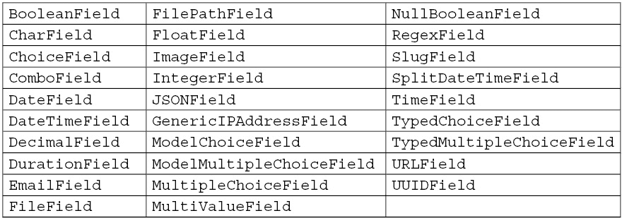
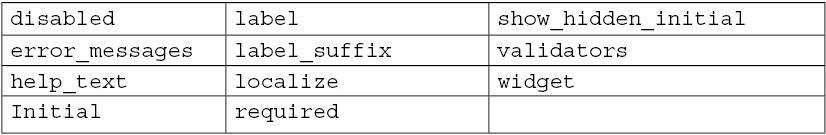
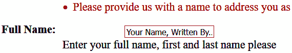
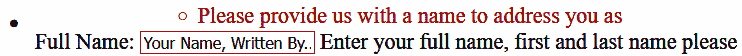
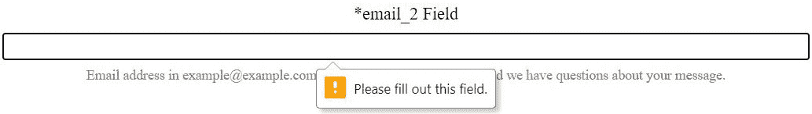
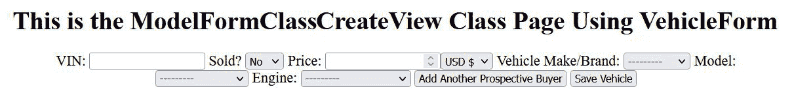
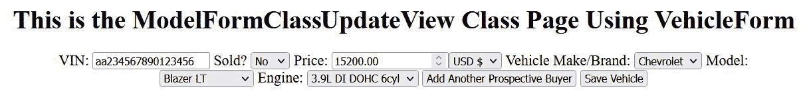
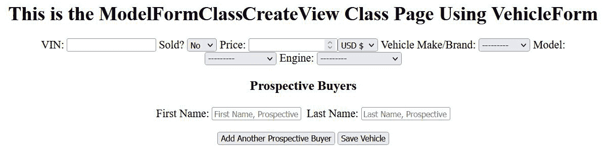
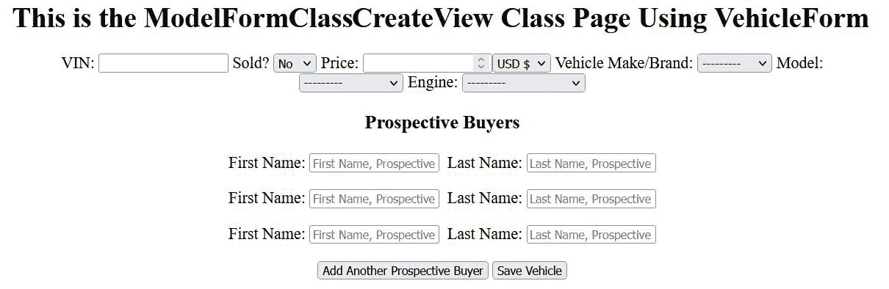

# 第五章：*第五章*：Django 表单

在编程中，**表单**是一个包含输入字段、下拉框、单选按钮、复选框和提交按钮的对象。表单的职责是从用户那里捕获信息；之后所做的一切都可以是任何事情，包括将信息存储在数据库中、发送电子邮件或使用该数据生成报告文档。在本章中，我们将尽可能多地讨论在 Django 中如何使用表单。表单对象是一个非常复杂的话题，我们在这章中只有足够的空间来涵盖基本内容和一些高级主题。本章中的一些主题可以与其他在*第八章*中涵盖的主题结合起来，即使用 Django REST 框架工作，以在 SPA-like 页面上创建表单对象。

在我们的第一个表单中，我们将创建一个名为`ContactForm`的类，并以三种不同的方式构建一个电子邮件字段。稍后，当我们在浏览器中渲染该表单时，我们将观察其行为如何通过这三种不同的机制发生变化。我们想观察每个电子邮件字段上的验证是如何进行的，以及它们之间的行为差异。这将使我们更好地理解哪种机制是我们希望实现的目标行为所需的。我们甚至会探讨编写自定义字段类，并了解它们如何从长远来看对我们有益。

根据您项目的需求，您表单的验证可能需要大量的自定义 JavaScript 才能实现您的目标。本书的重点不是 JavaScript，而是 Django 的概念。然而，在本章结束时，我们将提供一个示例，演示如何在处理表单对象上的动态内联表单集时将 JavaScript 融合到您的项目中。您可以根据项目的需求扩展此示例，构建自己的自定义 JavaScript 函数。

在本章中，我们将涵盖以下内容：

+   表单类型

+   使用表单字段

+   清理表单

+   创建自定义表单字段

+   与表单视图一起工作

+   在模板中渲染表单

+   将模型链接到表单

+   添加内联表单集

# 技术要求

要在此章节中与代码一起工作，您需要在本地机器上安装以下工具：

+   Python 版本 3.9 – 作为项目的底层编程语言使用

+   Django 版本 4.0 – 作为项目的后端框架使用

+   pip 包管理器 – 用于管理第三方 Python/Django 包

我们将继续使用在*第二章*，“项目配置”中创建的解决方案。然而，并不需要使用 Visual Studio IDE。主要项目本身可以使用其他 IDE 运行，或者从项目根目录中独立使用终端或命令行窗口运行。这就是`manage.py`文件所在的位置。无论你使用什么编辑器或 IDE，都需要一个虚拟环境来与 Django 项目一起工作。如何创建项目和虚拟环境的说明可以在*第二章*，“项目配置”中找到。你需要一个数据库来存储项目中的数据。在上一章的示例中选择了 PostgreSQL；然而，你可以为你的项目选择任何数据库类型来与本章的示例一起工作。

我们还将使用以 Django fixture 形式提供的数据，这些数据在*第三章*，“模型、关系和继承”中提供，在标题为*加载 Chapter_3 数据 fixture*的小节中。确保将`chapter_3` fixture 加载到你的数据库中；如果这已经完成，那么你可以跳过下一个命令。如果你已经创建了*第三章*，“模型、关系和继承”中提到的表，并且尚未加载该 fixture，那么在激活你的虚拟环境后，运行以下命令：

```py
(virtual_env) PS > python manage.py loaddata chapter_3
```

本章创建的所有代码都可以在本书的 GitHub 仓库中找到：[`github.com/PacktPublishing/Becoming-an-Enterprise-Django-Developer`](https://github.com/PacktPublishing/Becoming-an-Enterprise-Django-Developer)。本章中展示的大部分代码可以在`/becoming_a_django_entdev/becoming_a_django_entdev/chapter_5/`目录中找到。

查看以下视频以查看*代码的实际应用*：[`bit.ly/3xQQ2H3`](https://bit.ly/3xQQ2H3)。

## 为本章做准备

首先，在你的项目中创建一个名为`chapter_5`的新应用，按照*第二章*，“项目配置”中讨论的步骤进行。正如该部分所讨论的，不要忘记将`/becoming_a_django_entdev/becoming_a_django_entdev/chapter_5/apps.py`文件中你的应用类的`name =`变量的值更改为指向你安装应用的位置。确保还将此应用包含在`settings.py`文件中的`INSTALLED_APPS`变量中。在*第四章*，“URLs、视图和模板”的末尾，我们将`DEBUG = False`作为练习的一部分进行设置。确保将此设置回`DEBUG = True`以继续本书的剩余部分。

在网站的主要`urls.py`文件中，添加以下路径，该路径指向我们将要创建的本章的 URL 模式：

```py
# /becoming_a_django_entdev/urls.py
```

```py
...
```

```py
urlpatterns = [
```

```py
    path(
```

```py
        '',   
```

```py
        include(
```

```py
            'becoming_a_django_entdev.chapter_5.urls'
```

```py
        )
```

```py
    ),
```

```py
]
```

现在我们已经为这一章创建了应用程序，让我们开始使用 Django 管理站点来管理在 *第三章* 中创建的模型，*模型、关系和继承*。

# 表单类型

Django 被设计用来简化处理表单时涉及的大量工作。它是通过提供将你的表单对象渲染为 HTML 和处理表单提交上的数据的方式来做到这一点的。有很多人使用和操作表单对象的不同方法，但它们都始于一个表单类。Django 为我们提供了两个不同的类来使用，`ModelForm` 和 `Form`。这两个之间的区别是，一个直接链接到数据库中的表，而另一个则不。链接到数据库的 `ModelForm` 类将自动创建字段并根据在该模型类中设置的字段约束进行字段验证，从数据库级别。

表单类也使用一个 `Meta` 子类，正如在 *第三章* 中使用在模型类上一样，*模型、关系和继承*。Django 还提供了其他表单类，例如 `BaseForm` 和 `BaseModelForm`，用于编写抽象基表单类，但这些表单类超出了本书的范围。其他类与内联表单集相关，这基本上是在表单内的表单。在本章结束时，当表单被渲染时，我们将在页面上插入一个内联表单集，并在用户点击按钮时使用 JavaScript 添加更多。

让我们先讨论在创建表单类时导入和使用 `Form` 和 `ModelForm` 类。

## 表单类 – 表单

`Form` 类用于创建不链接到数据库的字段。这在表单发送电子邮件或生成 PDF 报告等情况下使用，仅举几个例子。

按照以下步骤创建你的 `Form` 类：

1.  在你的 `/becoming_a_django_entdev/chapter_5/` 目录中创建一个名为 `forms.py` 的文件。

1.  在此文件中，包含以下代码：

    ```py
    # /becoming_a_django_entdev/chapter_5/forms.py
    from django.forms 
    import Form
    class ContactForm(Form):
        pass
    ```

我们将在稍后讨论如何处理字段，但接下来让我们讨论如何导入 `ModelForm` 类。

## 表单类 – ModelForm

当我们想要直接在数据库中创建或修改数据时使用 `ModelForm` 类。每个字段都链接到它所代表的表的列。可以创建并使用不链接到你的数据库的额外字段。例如，你可以发送一个包含添加的字段数据的电子邮件。这个字段也可以是一个注释、时间戳或另一种类型的隐藏数据字段。

要创建你的 `ModelForm` 类，在你的现有 `/chapter_5/forms.py` 文件中，包含以下类：

```py
# /becoming_a_django_entdev/chapter_5/forms.py
```

```py
from django.forms 
```

```py
import Form, ModelForm
```

```py
class VehicleForm(ModelForm):
```

```py
    pass
```

在本章的后面部分，我们将把这个类链接到在 *第三章* 中创建的 `Vehicle` 模型，*模型、关系和继承*。

接下来，让我们移除这些 `pass` 语句并开始处理字段参数。

# 使用表单字段

与在 *第三章* “模型、关系和继承” 中介绍的常规模型字段类类似，Django 也提供了一些可供使用的表单字段类。区别在于模型字段类与数据库的列一起工作，而表单字段类仅用于模板中 HTML `<form></form>` 对象内的输入字段。

以下表格可以用作速查表，以参考在编写 `Form` 和/或 `ModelForm` 类时可用哪些字段：



表单字段也接受各种不同的字段参数，这些参数可以自定义每个字段的行为。在下一节中，我们将使用前面列表中的一些字段类型在我们的表单类中编写字段，并讨论可以使用的不同参数。

要了解每个这些字段类型的完整说明，请访问官方 Django 文档中关于字段类和参数的说明，可在以下位置找到：[`docs.djangoproject.com/en/4.0/ref/forms/fields/`](https://docs.djangoproject.com/en/4.0/ref/forms/fields/)。

## 常见字段参数

我们将在本练习中开始向表单类添加字段，并介绍字段参数。字段参数是我们设置字段属性的一种方式。

要创建你的字段，在你的 `/chapter_5/forms.py` 文件中，添加以下代码块中突出显示的 `import` 语句，并在相同的 `ContactForm` 类中添加一个名为 `full_name` 的字段：

```py
# /becoming_a_django_entdev/chapter_5/forms.py
```

```py
from django 
```

```py
import forms
```

```py
from django.forms 
```

```py
import Form, ModelForm
```

```py
class ContactForm(Form):
```

```py
    full_name = forms.CharField(
```

```py
        label = 'Full Name',
```

```py
        help_text = 'Enter your full name, first and last   name please',
```

```py
        min_length = 2,
```

```py
        max_length = 300,
```

```py
        required = True,
```

```py
        error_messages = {
```

```py
            'required': 'Please provide us with a name to address you as',
```

```py
            'min_length': 'Please lengthen your name, min 2 characters',
```

```py
            'max_length': 'Please shorten your name, max 300 characters'
```

```py
        }
```

```py
    )
```

在前面的例子中，我们使用 `forms.CharField` 字段类定义了一个 HTML `<input type="text">` 对象。`CharField` 对象的默认小部件是一个 `type="text"` 输入字段。`label` 参数让我们可以定义将作为此字段 `<label for="my_field_id">My Form Field Label</label>` 的文本。

`help_text` 参数将在 **文档对象模型** (**DOM**) 中的输入字段之后渲染一个 `<span class="helptext">{{ your_help_text_message</span>` 元素。

文档对象模型

DOM 是所有浏览器中找到的一个接口，它以节点树的形式呈现 HTML。这些节点代表树中的对象，其中 `<span>` 或 `<input>` 节点组成一个单一的对象。

`min_length` 和 `max_length` 参数在大多数字段类型中都会使用；它们分别定义了字段中允许的最小和最大字符数。`required` 参数将定义字段是否必须包含一个值才能有效。这些将作为 `<input type="text" maxlength="300" minlength="2" required="" />` 对象的属性来渲染。

接下来，让我们更详细地讨论一下表单验证。在接下来的两个小节中，我们将介绍 `widget` 和 `validator` 参数。要了解所有可用且未涵盖的字段参数的完整说明，请访问[`docs.djangoproject.com/en/4.0/ref/forms/fields/#core-field-arguments`](https://docs.djangoproject.com/en/4.0/ref/forms/fields/#core-field-arguments)。

## 字段小部件

字段的`widget`参数允许我们定义要使用哪种类型的字段，例如日期、电子邮件、密码或文本类型的输入对象。这也可以是复选框、单选按钮、下拉选择或文本区域，仅举几个例子。除非我们想要更改默认小部件或覆盖其初始属性，否则我们不需要指定`widget`参数。

按照下一步操作来覆盖`full_name`字段，以渲染带有`id`、`class`和`placeholder`属性的输入。我们希望得到的渲染输出应类似于以下示例代码：

```py
# Demo Code
```

```py
<input type="text" name="full_name" id="full-name" class="form-input-class" placeholder="Your Name, Written By...">
```

在你的`/chapter_5/forms.py`文件中，按照以下所示编辑你的`full_name`字段：

```py
# /becoming_a_django_entdev/chapter_5/forms.py
```

```py
from django 
```

```py
import forms
```

```py
from django.forms 
```

```py
import Form, ModelForm
```

```py
class ContactForm(Form):
```

```py
    full_name = forms.CharField(
```

```py
        ...,
```

```py
        widget = forms.TextInput(
```

```py
            attrs = {
```

```py
                'id': 'full-name',
```

```py
                'class': 'form-input-class',
```

```py
                'placeholder': 'Your Name, Written By...'
```

```py
            }
```

```py
        ),
```

```py
    ),
```

如果我们将字段的默认小部件从`forms.TextInput`更改为其他，例如`forms.EmailInput`，那么它将渲染为`<input type="email">`。将`forms.TextInput`更改为`forms.DateInput`将渲染为`<input type="date">`。使用`forms.TextArea`将渲染为`<textarea></textarea>`对象。当然，这些只是许多不同选项中的一些。要了解所有可用的小部件及其如何帮助您构建字段，请访问[`docs.djangoproject.com/en/4.0/ref/forms/widgets/`](https://docs.djangoproject.com/en/4.0/ref/forms/widgets/)。

接下来让我们讨论使用字段验证器。

## 字段验证器

当手动定义小部件时，我们有时必须编写特定的验证规则。例如，让我们以`forms.EmailInput`类为例；这将需要添加验证规则，以确定用户提供的字符串值是否实际上在 example@example.com 格式中，而不是像`IAmAString`这样的随机字符串。

按照以下步骤创建和验证电子邮件字段：

1.  在你的`/chapter_5/forms.py`文件中，在现有的`ContactForm`中，添加以下所示的`email_1`字段：

    ```py
    # /becoming_a_django_entdev/chapter_5/forms.py
    ...
    from django 
    import forms
    from django.forms 
    import Form, ModelForm
    from django.core.validators 
    import EmailValidator
    class ContactForm(Form):
        ...
        email_1 = forms.CharField(
            label = 'email_1 Field',
            min_length = 5,
            max_length = 254,
            required = False,
            help_text = 'Email address in example@example.com format.',
            validators = [
                EmailValidator(
                    'Please enter a valid email address'
                ),
            ],
            error_messages = {
                'min_length': 'Please lengthen your name, min 5 characters',
                'max_length': 'Please shorten your name, max 254 characters'
            }
        )
    ```

虽然可以使用验证器参数以这种方式操作字段，但 Django 试图为开发者提供选项，以最小化或减少他们需要编写的代码量。例如，我们不必编写前面的示例来在`CharField`上强制执行电子邮件格式，我们可以直接使用`EmailField`类，该类已经为我们强制执行了此规则。`EmailField`类包括处理电子邮件字段的全部逻辑和验证。

1.  为了练习使用`EmailField`类，我们将创建一个额外的字段来比较和对比两种代码方法。在你的`/chapter_5/forms.py`文件中，在相同的`ContactForm`类中，添加以下所示的`email_2`字段：

    ```py
    # /becoming_a_django_entdev/chapter_5/forms.py
    from django 
    import forms
    from django.forms 
    import Form, ModelForm
    ...
    class ContactForm(Form):
        ...
        email_2 = forms.EmailField(
            label = 'email_2 Field',
            min_length = 5,
            max_length = 254,
            required = True,
            help_text = 'Email address in example@example.com format for contacting you should we have questions about your message.',
            error_messages = {
                'required': 'Please provide us an email address should we need to reach you',
                'email': 'Please enter a valid email address',
                'min_length': 'Please lengthen your name, min 5 characters',
                'max_length': 'Please shorten your name, max 254 characters'
            }
        )
    ```

在*步骤 1*和*步骤 2*中找到的代码之间的区别是，当使用`EmailField`类来产生与`CharField`类相同的行为时，我们不需要定义小部件或验证器参数。错误信息现在位于使用`email`键的`error_messages`参数中，如下所示。

要完整了解所有可用的验证器类和方法，请访问 [`docs.djangoproject.com/en/4.0/ref/validators/`](https://docs.djangoproject.com/en/4.0/ref/validators/)。接下来，让我们练习清理表单，这仅仅是执行验证的另一种方式。

# 清理表单

我们还可以以其他方式对表单字段进行验证。在表单类中，我们可以编写方法来验证每个字段，格式如下：`def clean_{{ form_field_name }}()`。在这样做的时候，只能访问我们正在清理的字段值。如果我们想访问该表单中找到的其他字段值，我们必须编写一个单独的 `def clean()` 方法，这将允许我们比较两个字段。例如，我们可以使用 `def clean()` 方法，仅在另一个字段的值不为空时要求字段。

下面的两个小节将分解这两个概念。

## 方法 – `clean_{{ your_field_name }}()`

要清理单个表单字段，请按照以下步骤操作：

1.  在你的 `/chapter_5/forms.py` 文件中，在相同的 `ContactForm` 类中，添加一个名为 `email_3` 的新字段，如下所示：

    ```py
    # /becoming_a_django_entdev/chapter_5/forms.py
    from django 
    import forms
    from django.forms 
    import Form, ModelForm
    ...
    class ContactForm(Form):
        email_3 = forms.CharField(
            label = 'Email Using CharField and Using Clean Method',
            required = False,
            help_text = 'Email address in example@example.com format for contacting you should we have questions about your message.',
        )
    ```

1.  在相同的 `ContactForm` 类中，添加以下 `clean_email_3` 方法：

    ```py
    # /becoming_a_django_entdev/chapter_5/forms.py
    ...
    from django.core.exceptions 
    import ValidationError
    from django.core.validators 
    import (
        EmailValidator,
        validate_email
    )
    class ContactForm(Form):
        ...
        def clean_email_3(self):
            email = self.cleaned_data['email_3']
            if email != '':
                try:
                    validate_email(email)
                except ValidationError:
                    self.add_error(
                        'email_3', 
                        f'The following is not a valid email address: {email}'
                    )
            else:
                self.add_error(
                    'email_3', 
                    'This field is required'
                )
            return email
    ```

在前面的例子中，我们是从 `django.core.validators` 库中导入 `validate_email()` 方法，以确定字符串是否为电子邮件格式。首先，我们使用一个简单的条件语句来检查字段是否有值；如果没有，我们发出一个错误信息，指出 `"This field is required"`。即使 `email_3` 字段已将 `required` 参数设置为 `False`，我们也会执行验证检查。这仅仅说明了我们可以以另一种方式完成相同的事情。如果存在值，我们将在 `validate_email()` 方法周围包裹一个 *Try/Except* 语句，如果验证失败，我们将添加 `"The following is not a valid email address: {{ field_value }}"` 错误信息。

`Form` 和 `ModelForm` 类中提供的 `self.add_error()` 方法接受两个参数：第一个参数是字段的名称，第二个是你的自定义错误信息。我们不是使用 `self.add_error('email_3', 'This field is required')` 来向表单添加错误信息，而是可以使用 `raise ValidationError('This field is required')` 类代替。但是，有一个问题：使用这个类将会从 `cleaned_data` 值列表中移除该字段。如果你只使用 `clean_email_3()` 方法本身，那么这将有效。如果你想在 `def clean()` 方法中访问相同的清理数据，你需要在 `def clean_email_3()` 中返回该值，如之前 *步骤 2* 的最后一行所示。Django 会在执行 `clean()` 方法之前，为每个字段触发单独的清理方法，并将其保存为清理方法栈中的最后一个方法。如果你的字段值没有在特定字段的清理方法中返回，那么在需要时我们将无法访问它。

接下来，让我们使用`clean()`方法。

## 方法 – clean()

`clean()`方法用于在表单提交时访问表单中的所有字段数据。在这个方法中，你可以在允许成功的表单提交之前比较许多字段的值。接下来的示例将允许我们比较两个字段，并引发一个或多个不同的字段验证消息。

按照以下步骤配置你的`clean()`方法：

1.  在你的`/chapter_5/forms.py`文件中，向`ContactForm`类添加另一个名为`conditional_required`的字段，如下所示：

    ```py
    # /becoming_a_django_entdev/chapter_5/forms.py
    from django 
    import forms
    from django.forms 
    import Form, ModelForm
    ...
    class ContactForm(Form):
        conditional_required = forms.CharField(
            label = 'Required only if field labeled "email_3" has a value',
            help_text = 'This field is only required if the field labeled "email_3 Field" has a value',
            required = False,
        )
    ```

1.  在相同的`ContactForm`类中，添加以下`clean()`方法：

    ```py
    # /becoming_a_django_entdev/chapter_5/forms.py
    from django 
    import forms
    from django.forms 
    import Form, ModelForm
    ...
    class ContactForm(Form):
        ...
        def clean(self):
            email = self.cleaned_data['email_3']
            text_field = self.cleaned_data[
                'conditional_required'
            ]
            if email and not text_field:
                self.add_error(
                    'conditional_required', 
                    'If there is a value in the field labeled "email_3" then this field is required'
                )
    ```

在这个`clean()`方法中，我们将`email_3`字段的值赋给名为`email`的变量。然后，我们将`conditional_required`字段的值赋给名为`text_field`的变量。使用一个简单的条件语句，我们检查`email`是否有值，如果有，检查`text_field`是否有值。如果满足此条件，我们将在`conditional_required`字段中添加所需的错误。由于我们将`conditional_required`字段设置为使用`required = False`参数，如果`email_3`字段中没有值，则该字段不是必需的。

让我们继续创建我们自己的自定义表单字段。

# 创建自定义表单字段

有时，项目的需求超过了我们提供的选项。如果默认情况下没有可用的字段类，我们有两个选择：创建自己的或使用第三方包，其中其他人已经为我们编写了一个字段类。

继续使用相同的`ContactForm`类，我们将通过构建一个`MultipleEmailField`来展示验证机制之间的差异。这将是一个单字段，接受一串用逗号分隔的电子邮件地址。然后，将独立检查每个电子邮件项，看它是否在有效的电子邮件字符串格式中。我们将使用之前使用的相同的`validate_email()`函数来强制执行此约束。

## 字段类 – Field

Django 提供了一个名为`Field`的类，位于`django.forms.fields`库中，用于构建自定义字段类。这个类中发现的任何选项和方法都可以根据需要重写。例如，重写`def __init__()`方法将提供一种添加、更改或删除字段参数的方法，完全改变你以后与这些字段工作的方式。对于这个练习，我们实际上不会重写`__init__()`方法；相反，我们将使用`to_python()`和`validate()`方法。这些是我们执行`MultipleEmailField`上所需验证的唯一两个方法。

按照以下步骤编写你的`Field`类：

1.  在你的`/becoming_a_django_entdev/chapter_5/`文件夹中创建一个名为`fields.py`的新文件。

1.  在那个文件中，添加以下`MultipleEmailField`类和`import`语句：

    ```py
    # /becoming_a_django_entdev/chapter_5/fields.py
    from django.core.exceptions 
    import ValidationError
    from django.core.validators 
    import validate_email
    from django.forms.fields 
    import Field
    from django.forms.widgets 
    import TextInput
    class MultipleEmailField(Field):
        widget = TextInput
        default_validators = []
        default_error_messages = {
            'required': 'Default Required Error Message',
            'email': 'Please enter a valid email address or addresses separated by a comma with NO spaces'
        }
    ```

1.  如果你想要使用 Django 提供的一些验证器，请使用前面代码中显示的 `default_validators` 选项。这是你定义要使用哪个验证器的地方。我们使用在 `MultipleEmailField` 类的 `validate` 方法中找到的自己的逻辑，并且不会为我们想要实现的目标使用默认验证器。欢迎你使用 Django 在 `django.core.validators` 库中为你的字段类提供的任何验证器。

1.  `default_error_messages` 选项用于定义字段类的默认消息。在前面显示的 `default_error_messages` 选项中，我们指定了两个键：`required` 和 `email`。这两个键将作为在必填字段提交时没有值存在以及当值不符合电子邮件字符串格式时使用的默认消息。在 `default_error_messages` 选项中指定默认错误消息后，我们不再需要使用字段的 `error_messages = {}` 参数。如果我们想逐字段使用 `error_messages` 参数，仍然是有可能的。

1.  在相同的 `MultipleEmailField` 类中，添加以下 `to_python()` 方法：

    ```py
    # /becoming_a_django_entdev/chapter_5/fields.py
    ...
    class MultipleEmailField(Field):
        ...
        def to_python(self, value):
            if not value:
                return []
            value = value.replace(' ', '')
            return value.split(',')
    ```

`to_python()` 方法用于将值转换为 Python 对象。这个特别的方法是编写来将字符串转换为电子邮件列表，不包括逗号。

1.  在相同的 `MultipleEmailField` 类中，添加以下 `validate()` 方法：

    ```py
    # /becoming_a_django_entdev/chapter_5/fields.py
    ...
    class MultipleEmailField(Field):
        ...
        def validate(self, value):
            super().validate(value)
            for email in value:
                try:
                    validate_email(email)
                except ValidationError:
                    raise ValidationError(
                        self.error_messages['email'], 
                        code = 'email'
                    )
    ```

`validate()` 方法检查电子邮件列表中的每个项目，以确保其格式正确。我们还在 `Field` 类中覆盖了提供的选项，例如在 *步骤 2* 中显示的 `widget` 选项。默认小部件是 `TextInput`。由于这已经是我们需要的内容，我们实际上不需要包括它；在先前的示例中提供它是为了说明目的。当你编写自己的自定义字段时，你可以用 `django.forms.widgets` 库中找到的任何 Django 小部件替换 `TextInput`。如果你想将字段再进一步定制，甚至可以编写自己的自定义小部件类，但这超出了本书的范围。

让我们接下来使用我们的自定义字段类。

## 使用自定义字段

要使用我们在前一小节中创建的 `MultipleEmailField`，在你的 `/chapter_5/forms.py` 文件中，添加以下 `import` 语句并将 `multiple_emails` 字段添加到 `ContactForm` 中，如下所示：

```py
# /becoming_a_django_entdev/chapter_5/forms.py
```

```py
...
```

```py
from django.forms 
```

```py
import Form, ModelForm
```

```py
from .fields 
```

```py
import MultipleEmailField
```

```py
class ContactForm(Form):
```

```py
    ...
```

```py
    multiple_emails = MultipleEmailField(
```

```py
        label = 'Multiple Email Field',
```

```py
        help_text = 'Please enter one or more email addresses, each separated by a comma and no spaces',
```

```py
        required = True,
```

```py
    )
```

```py
    ...
```

在先前的示例中，我们不需要包含任何验证消息，因为我们已经在 `MultipleEmailField` 类中定义了想要的那些消息。

可用的参数如下所示：



这些是 Django 库中`Field`类的`__init__()`方法中包含的参数。如果我们需要使用类似于`min_length`和`max_length`这样的参数，就像我们在本章标题为“字段类 – 字段”的子节*step 2*中为`full_name`字段所做的那样，我们应该使用`CharField`类而不是`Field`类来构造`MultipleEmailField`类，如图所示：

```py
# Dummy Code
```

```py
from django.forms.fields 
```

```py
import Field, CharField
```

```py
class MultipleEmailField(CharField):
```

我们之所以想使用`CharField`而不是`Field`类，是因为它扩展了`Field`类并添加了包括`min_length`和`max_length`参数的逻辑。使用这个概念，你可以扩展任何其他字段类，在编写自己的自定义类时，可以提供该类独特的任何参数或行为。

接下来，让我们使用我们的联系表单并使用视图类来提供我们的联系页面。

# 使用表单视图

**表单视图**就像任何其他视图类一样，只不过表单视图类是为处理和处理表单对象和表单提交而设计的。

Django 提供了四个主要的表单视图类，如下所示：

+   `FormView`

+   `CreateView`

+   `UpdateView`

+   `DeleteView`

这些都可以在`django.views.generic.edit`库中找到。

如果我们要创建一个与之前创建的`ContactForm`类一起工作的视图，该类不与任何模型相关联，我们将使用简单的`FormView`类。其他三个类可以与与模型相关的表单一起使用。它们各自有不同的用途：在数据库中创建、更新或删除记录。例如，`CreateView`将渲染一个包含空白或默认值的表单，这些值旨在创建一个尚不存在的记录。`UpdateView`使用一个查找现有记录的表单，显示该记录的现有值，并允许进行更改。`DeleteView`将向用户显示一个提示或确认页面，询问用户他们是否真的想继续执行此任务，然后删除该记录。

让我们使用`FormView`类开始构建一个显示`ContactForm`类对象的页面。我们将在本章后面使用`CreateView`和`UpdateView`。有关如何使用所有这些表单视图类的完整说明，请访问[`docs.djangoproject.com/en/4.0/ref/class-based-views/generic-editing/`](https://docs.djangoproject.com/en/4.0/ref/class-based-views/generic-editing/)。

## 视图类 – FormView

让我们首先使用 Django 的`FormView`类构建一个名为`FormClassView`的类。这个类将包含三个选项，第一个选项是`template_name`，它用于定义我们正在使用的 HTML 模板的路径。第二个选项是`form_class`选项，它用于定义这个视图将要处理的表单类的名称，即`ContactForm`类。第三个选项是`success_url`，它指定了一个相对 URL 路径，当表单成功提交时，将重定向用户到该路径。

按照以下步骤配置你的`FormClassView`类：

1.  确保你的`/becoming_a_django_entdev/chapter_5/`文件夹中有一个名为`views.py`的文件。这通常是在创建新的 Django 应用时自动为你创建的。

1.  在同一文件中，添加以下代码：

    ```py
    # /becoming_a_django_entdev/chapter_5/views.py
    from django.views.generic.edit 
    import FormView
    from .forms 
    import ContactForm
    class FormClassView(FormView):
        template_name = 'chapter_5/form-class.html'
        form_class = ContactForm
        success_url = '/chapter-5/contact-form-success/'
    ```

这些选项中的任何一个都可以使用可调用函数来获取这些值，例如使用`reverse()`函数来指定`success_url`。这里展示了如何做到这一点的一个例子，但这不是实际练习的一部分：

```py
# Dummy Code
from django.urls 
import reverse
from django.views.generic.edit 
import FormView
class FormClassView(FormView):
    ...
    def get_success_url(self, **kwargs):
        return reverse('pattern_name', args=(value,))
```

我们实际上不需要这里显示的可调用函数来制定成功 URL。我们需要的只是`'/chapter_5/contact-form-success/'`字符串表示形式。

1.  接下来，配置`http://localhost:8000/chapter-5/form-class/`的 URL 模式。如果此文件没有为你自动创建，请创建`/chapter_5/urls.py`文件，并添加以下表单页面模式和`import`语句：

    ```py
    # /becoming_a_django_entdev/chapter_5/urls.py
    from django.urls 
    import re_path
    from django.views.generic 
    import (
        TemplateView
    )
    from .views 
    import FormClassView
    urlpatterns = [ 
        re_path(
            r'^chapter-5/form-class/?$', 
            FormClassView.as_view()
        ),
    ]
    ```

1.  在同一文件中，添加以下成功模式：

    ```py
    # /becoming_a_django_entdev/chapter_5/urls.py
    ...
    urlpatterns = [
        ...,
        re_path(
            r'^chapter-5/contact-form-success/?$', 
            TemplateView.as_view(
                template_name = 'chapter_5/contact-success.html'
            ),
            kwargs = {
                'title': 'FormClassView Success Page',
                'page_id': 'form-class-success',
                'page_class': 'form-class-success-page',
                'h1_tag': 'This is the FormClassView Success Page Using ContactForm',
            }
        ),
    ]
    ```

在这一步中，我们添加了一个第二个模式，作为`http://localhost:8000/chapter-5/contact-form-success/`的成功页面。这个成功页面将用于本章的所有练习。

现在我们有一个视图类可以与之一起工作，并定义了一些基本选项，让我们来探索一下使用不同请求方法需要什么。

## HTTP 请求方法

在 Django 中与`FormView`类一起工作，有两种 HTTP 请求方法：`GET`方法和`POST`方法。`GET`方法旨在将带有空白或默认值的表单渲染到页面上，并等待用户填写表单并提交。一旦表单被提交，`POST`方法将被执行。

### GET

`get()`方法就像视图类中的任何其他 GET 方法一样。它是页面首次加载时的首选方法。

按照以下步骤配置你的`FormClassView`类的`get()`方法：

1.  在`/chapter_5/views.py`文件中，使用以下代码向现有的`FormClassView`类添加`get()`方法：

    ```py
    # /becoming_a_django_entdev/chapter_5/views.py
    ...
    from django.views.generic.edit 
    import FormView
    from django.template.response 
    import (
        TemplateResponse
    )
    class FormClassView(FormView):
        ...
        def get(self, request, *args, **kwargs):
            return TemplateResponse(
                request,
                self.template_name, 
                {
                    'title': 'FormClassView Page',
                    'page_id': 'form-class-id',
                    'page_class': 'form-class-page',
                    'h1_tag': 'This is the FormClassView Page Using ContactForm',
                    'form': self.form_class,
                }
            )
    ```

在前面的`get()`方法中，我们正在以`TemplateResponse`类的形式返回一个 HTTP 响应，使用`self.template_name`的值作为模板位置的路径。我们向该模板提供了特定于此页面的上下文，例如`title`、`page_id`、`page_class`、`h1_tag`和`form`变量，如前面的代码块所示。`self.form_class`的值用于将表单对象传递到模板。可以在页面首次加载时在表单字段上定义初始值，这是表单初始化的时候。

1.  将以下`initial`列表添加到`FormClassView`类的现有`get()`方法中，并将其传递到你的返回上下文中，如下面的代码块所示：

    ```py
    # /becoming_a_django_entdev/chapter_5/views.py
    ...
    class FormClassView(FormView):
        def get(self, request, *args, **kwargs):
            initial = {
                'full_name': 'FirstName LastName',
                'email_1': 'example1@example.com',
                # Add A Value For Every Field...
            }
            return TemplateResponse(
                request, self.template_name, {
                    ...
                    'form': self.form_class(initial),
                }
            )
    ```

在这个`get()`方法中，我们添加了`initial`变量作为列表，然后将该列表传递给`self.form_class(initial)`对象，这使我们能够在字段上设置初始值，定义字段名称为之前显示的键及其相应的值。

### POST

当表单被提交时，使用 `post()` 方法来渲染相同的页面。在这个方法中，我们可以确定表单是否有效，如果是的话，我们希望将其重定向到成功 URL。如果表单无效，页面将重新加载，显示用户输入到字段中的值，并显示可能存在的任何错误消息。我们还可以使用 `post()` 方法修改或添加页面上下文。

在你的 `/chapter_5/views.py` 文件中，在相同的 `FormClassView` 类中，添加以下 `post()` 方法：

```py
# /becoming_a_django_entdev/chapter_5/views.py
```

```py
...
```

```py
from django.views.generic.edit 
```

```py
import FormView
```

```py
from django.http 
```

```py
import HttpResponseRedirect
```

```py
from django.template.response 
```

```py
import (
```

```py
    TemplateResponse
```

```py
)
```

```py
class FormClassView(FormView):
```

```py
    ...
```

```py
    def post(self, request, *args, **kwargs):
```

```py
        form = self.form_class(request.POST)
```

```py
        if form.is_valid():
```

```py
            return HttpResponseRedirect(
```

```py
                self.success_url
```

```py
            )
```

```py
        else:
```

```py
            return TemplateResponse(
```

```py
                request, 
```

```py
                self.template_name, 
```

```py
                {
```

```py
                    'title': 'FormClassView Page - Please Correct The Errors Below',
```

```py
                    'page_id': 'form-class-id',
```

```py
                    'page_class': 'form-class-page errors-found',
```

```py
                    'h1_tag': 'This is the FormClassView Page Using ContactForm<br /><small class="error-msg">Errors Found</small>',
```

```py
                    'form': form,
```

```py
                }
```

```py
            )
```

在 `TemplateResponse` 返回语句中的高亮文本表示从 `get()` 方法到 `post()` 方法已更改的上下文。为了保留用户已输入到表单中的数据，必须将 `request.POST` 传递到表单类中，如前一步中高亮的 `self.form_class(request.POST)`。如果我们没有将 `request.POST` 传递到 `self.form_class()`，那么在首次访问此页面时，我们会渲染一个空白表单，就像我们使用 `get()` 方法一样。

现在我们已经编写了视图类，接下来我们可以着手编写将渲染我们的表单的模板。

# 在模板中渲染表单

Django 提供了五种主要方式来轻松快速地将表单对象渲染到页面上。前三种是使用段落、表格或列表结构来渲染表单。其他两种包括基于 `django.forms.templates.django.forms` 库中的 `default.html` 模板的传统渲染表单方式，以及渲染你自己的模板的方式。Django 4.0 的新特性是所有表单类上的 `template_name` 选项。此选项允许你指向一个模板文件，在那里你可以构建自己的 HTML 格式。

按照以下步骤渲染你的表单对象：

1.  将在 *第四章*，*URLs、视图和模板* 中创建的 `base_template_1.html` 文件复制到你的 `/becoming_a_django_entdev/chapter_5/templates/chapter_5/base/` 文件夹中。同时将所有作为 `` 语句添加的相关部分模板文件也复制到该文件中。

1.  那个 `base_template_1.html` 文件将被重新用作本章练习的基础模板。调整任何路径以指向新的 `chapter_5` 文件夹，例如任何 CSS 和 JavaScript 文件路径。

1.  将所有相关的 CSS、JavaScript 和 HTML 文件也复制到你的 `chapter_5` 应用中。这些文件不是完成此练习所必需的，但可以防止控制台日志中出现 404 错误。

1.  在你的 `/becoming_a_django_entdev/chapter_5/templates/chapter_5/` 文件夹中创建一个名为 `form-class.html` 的新文件，并包含以下代码块中可以看到的标签：

    ```py
    # /becoming_a_django_entdev/chapter_5/templates/chapter_5/form-class.html
    
    
    {{ title }}
    
    
    {{ page_id }}
    {{ block.super }} {{ page_class }}
    ```

1.  在你的 `/chapter_5/form-class.html` 文件中，在 `body_content` 块内添加以下代码，以尽可能简单的方式渲染表单：

    ```py
    # /becoming_a_django_entdev/chapter_5/templates/chapter_5/form-class.html
    ...
    
        ...
        <form method="post">
            
            {{ form }}
            <input type="submit" value="Send Message">
        </form>
    
    ```

在这里，我们至少需要写出 `<form>` 元素并定义一个 `method="post"` 属性，告诉浏览器如何处理表单提交。`{{ form }}` 标签使用 `django.forms.templates.django.forms.default.html` 库模板渲染此表单存在的任何字段。`` 是一个跨站请求伪造令牌，用于安全措施，并且所有 Django 表单都需要它。`<input type="submit">` 指定了用于触发表单提交动作的按钮。

让我们深入了解剩余的四种机制及其使用方法。

## 渲染表单 – as_p

此选项将每个字段包裹在段落 `<p></p>` 元素中。标签将堆叠在输入字段上方，帮助文本位于其下方。如果存在错误，每个字段将渲染自己的列表对象，位于段落对象上方，列出与该字段相关的所有错误。

要以 `as_p` 形式渲染你的表单，在你的 `/chapter_5/form-class.html` 文件中，将 `{{ form }}` 标签更改为 `{{ form.as_p }}`。

这应该会渲染每个字段，看起来像这里展示的示例代码：

```py
# Dummy code rendered, for first_name field
```

```py
<ul class="errorlist">
```

```py
    <li>Please provide us with a name to address you as</li>
```

```py
</ul>
```

```py
<p>
```

```py
    <label for="full-name">Full Name:</label>
```

```py
    <input type="text" name="full_name" id="full-name" class="form-input-class field-error" placeholder="Your Name, Written By..." maxlength="300" minlength="2" required="">
```

```py
    <span class="helptext">Enter your full name, first and last name please</span>
```

```py
</p>
```

接下来，让我们以表格形式渲染表单。

## 渲染表单 – as_table

此选项将每个字段包裹在 `<tr></tr>` 元素中。此字段的标签被包裹在 `<th></th>` 元素中，而字段本身被包裹在 `<td></td>` 元素中。标签将堆叠在左侧，输入对象和帮助文本以及错误消息显示在右侧，如下所示：



图 5.1 – 渲染表单 – 以表格形式

要使用此选项，我们仍然需要将表单标签包裹在 `<table></table>` 元素中，因为只有表格的内部内容会被渲染。

要以表格形式渲染你的表单，在你的 `/chapter_5/form-class.html` 文件中，将你的 `{{ form }}` 标签更改为 `{{ form.as_table }}` 并将其包裹在 `<table>` 标签中，如下所示：

```py
# /becoming_a_django_entdev/chapter_5/templates/chapter_5/form-class.html
```

```py
...
```

```py
        <table>
```

```py
            {{ form.as_table }}
```

```py
        </table>
```

```py
...
```

接下来，让我们以列表形式渲染表单。

## 渲染表单 – as_ul

此选项将渲染你的表单为一个列表，每个字段都被 `<li></li>` 元素包裹。在该元素内部，标签首先出现，然后是输入字段，最后是帮助文本。如果发生错误，它将作为自己的列表项注入到该字段上方，如下所示：



图 5.2 – 渲染表单 – As a list

我们还必须将表单包裹在一个带有 `<ul></ul>` 列表元素的元素中。要在你的 `/chapter_5/form-class.html` 文件中以列表形式渲染表单，将 `{{ form }}` 标签更改为 `{{ form.as_ul }}` 并将其包裹在 `<ul>` 标签中，如下所示：

```py
# /becoming_a_django_entdev/chapter_5/templates/chapter_5/form-class.html
```

```py
...
```

```py
        <ul>
```

```py
            {{ form.as_ul }}
```

```py
        </ul>
```

```py
...
```

接下来，让我们使用 Django 4.0 中引入的新方法。

## 渲染表单 – 使用 template_name

Django 4.0 的新特性是 `template_name` 功能。此功能用于在自定义模板中渲染表单。它为开发者提供了在字段渲染时结构化自己的 HTML 的能力。开发者可以创建许多不同的模板样式，并根据需要使用它们。字段通过自定义模板内的 `{{ fields }}` 标签访问。

按照以下步骤配置您的自定义表单模板：

1.  在您的 `/chapter_5/forms.py` 文件中，将 `template_name` 选项添加到现有的 `ContactForm` 类中，如高亮所示：

    ```py
    /chapter_5/form-class.html file, you render your form using only the basic {{ form }} tag and not any of the other preconfigured form rendering methods.
    ```

1.  接下来，在您的 `/chapter_5/templates/chapter_5/forms/` 文件夹中创建 `custom-form.html` 文件。我们不会向此文件添加 `` 标签；相反，我们将它视为使用 `` 标签，其中它只是一个片段，而不是一个完整的 HTML 页面。

1.  在您的 `/chapter_5/custom-forms.html` 文件中，添加以下代码：

    ```py
    # /becoming_a_django_entdev/chapter_5/templates/chapter_5/forms/custom-forms.html
    
    
        <div class="field-box error">
            <label for="{{ field.id_for_label }}">
                <span class="required">*</span>{{ field.label|safe }}
            </label>
            <div class="form-group">
                {{ field }}
                {{ errors|safe }}
                
                    <span class="help-text">
                        {{ field.help_text|safe }}
                    </span>
                
            </div>
        </div>
    
    ```

在这里，我们通过 `` 标签循环遍历所有字段，如前一个代码块所示。我们使用 `<div>`、`<label>` 和 `<span>` 元素添加了自己的 HTML 结构。字段本身是通过 `{{ field }}` 标签渲染的。其他信息，如帮助文本，与 `safe` 过滤器结合使用在 `{{ field.help_text|safe }}` 中。`safe` 过滤器用于确保字符串中的任何 HTML 都被渲染为 HTML 对象，而不是打印为该对象的字符串表示。

让我们接下来演示所有这些表单渲染的实际操作。

## 渲染演示

到目前为止，我们应该有一个可以工作的表单。在您的浏览器中，访问 URL `http://localhost:8000/chapter-5/form-class/`，您应该看到表单被渲染到页面上。通过使用 `ContactForm` 类提供的所有示例，我们应该在这个页面上看到六个字段。在这里，我们可以看到电子邮件字段如何在与表单交互时表现出不同的行为。例如，如果我们将 `email_1` 字段的 `required` 参数设置为 `False`，我们可以不在此字段中输入任何内容就提交表单，并且它会成功。在名为 `email_2` 的字段中，我们指定了 `required` 参数为 `True`。这给该输入字段添加了 `required` 属性，防止用户提交该表单。这意味着用户将永远不会看到我们在 Django 代码中提供的错误消息。此路由需要使用 JavaScript，例如 jQuery Validate 库，来处理错误状态并为我们显示错误消息。不采取任何行动会导致浏览器为我们处理错误状态，在 Chrome 中，它看起来如下截图所示：



图 5.3 – ContactForm email_2 字段

然而，在名为 `email_3` 的字段上，我们将必需参数设置为等于 `False`，并在清理方法中执行验证，检查该字段是否有值。这使得我们可以提交表单并看到在回发时提供的错误消息，如下所示：


图 5.4 – ContactForm email_3 字段

接下来，让我们将 Django 表单进一步向前推进，并开始在一个表单类中处理模型。我们在标题为 *表单类 – ModelForm* 的部分创建了一个占位符类，称为 `VehicleForm`。

# 将模型链接到表单

不需要任何特殊字段渲染即可将模型链接到表单相当简单。

在您的 `/chapter_5/forms.py` 文件中，向现有的 `VehicleForm` 类添加以下代码（请记住删除之前添加到该类中的 `pass` 语句）：

```py
# /becoming_a_django_entdev/chapter_5/forms.py
```

```py
...
```

```py
from django.forms 
```

```py
import Form, ModelForm
```

```py
from ..chapter_3.models 
```

```py
import Vehicle
```

```py
class VehicleForm(ModelForm):
```

```py
    class Meta:
```

```py
        model = Vehicle
```

```py
        fields = [
```

```py
            'vin', 
```

```py
            'sold', 
```

```py
            'price', 
```

```py
            'make', 
```

```py
            'vehicle_model', 
```

```py
            'engine',
```

```py
        ]
```

在前面的例子中，我们不需要为这个表单创建字段。Django 将自动使用与我们在 *第三章* 中为 `Vehicle` 模型编写的模型字段类型关联的表单字段类型，该章名为 *模型、关系和继承*。如果需要修改任何字段行为，我们将以与 `ContactForm` 相同的方式编写表单字段，然后根据需要对其进行定制。这里使用的 `Meta` 子类定义了我们使用的模型类，而 `fields` 选项指定了我们想要包含哪些模型字段以及它们的包含顺序。

注意

使用 `fields = '__all__'` 将会包含该模型中存在的所有字段，并且按照模型中定义的顺序排列。

让我们接下来处理 `CreateView` 类。

## 视图类 – CreateView

使用我们现在已经连接到 `Vehicle` 模型的 `VehicleForm` 类，让我们创建一个视图，该视图将使用 `CreateView` 类渲染一个没有或默认字段值的表单。当表单成功提交时，它将允许我们在数据库中创建一个新的车辆记录。

按照以下步骤配置您的 `CreateView` 类：

1.  在您的 `/chapter_5/views.py` 文件中，添加以下 `import` 语句并创建 `ModelFormClassCreateView` 类，如下所示：

    ```py
    # /becoming_a_django_entdev/chapter_5/views.py
    ...
    from django.http 
    import HttpResponseRedirect
    from django.views.generic.edit 
    import (
        ..., 
        CreateView
    )
    from django.template.response 
    import (
        TemplateResponse
    )
    from .forms 
    import ContactForm, VehicleForm
    class ModelFormClassCreateView(CreateView):
        template_name = 'chapter_5/model-form-class.html'
        form_class = VehicleForm
        success_url = '/chapter-5/vehicle-form-success/'
    ```

1.  在相同的 `ModelFormClassCreateView` 类中，添加以下 `get()` 方法：

    ```py
    # /becoming_a_django_entdev/chapter_5/views.py
    ...
    class ModelFormClassCreateView(CreateView):
        ...
        def get(self, request, *args, **kwargs):
            return TemplateResponse(
                request, 
                self.template_name, 
                {
                    'title': 'ModelFormClassCreateView Page',
                    'page_id': 'model-form-class-id',
                    'page_class': 'model-form-class-page',
                    'h1_tag': 'This is the ModelFormClassCreateView Class Page Using VehicleForm',
                    'form': self.form_class(),
                }
            )
    ```

1.  在相同的 `ModelFormClassCreateView` 类中，添加以下 `post()` 方法：

    ```py
    # /becoming_a_django_entdev/chapter_5/views.py
    ...
    class ModelFormClassCreateView(CreateView):
        ...
        def post(self, request, *args, **kwargs):
            form = self.form_class(request.POST)
            if form.is_valid():
                vehicle = form.instance
                vehicle.save()
                return HttpResponseRedirect(
                    self.success_url
                )
            else:
                return TemplateResponse(
                    request, 
                    self.template_name, 
                    {
                        'title': 'ModelFormClassCreateView Page - Please Correct The Errors Below',
                        'page_id': 'model-form-class-id',
                        'page_class': 'model-form-class-page errors-found',
                        'h1_tag': 'This is the ModelFormClassCreateView Page Using VehicleForm<br /><small class="error-msg">Errors Found</small>',
                        'form': form,
                    }
                )
    ```

在这个例子中，我们给了这个类之前使用的两个相同的方法——`get()`和`post()`。这两个方法与使用`FormView`类构造的类中的用法相同。在`get()`方法中，我们通过`self.form_class()`将一个空表单作为上下文传递给模板。在`post()`方法中，我们再次将`request`传递给表单以获取用户提交的数据，使用`form = self.form_class(request.POST)`。在那个`post()`方法中，使用`if form.is_valid():`进行验证，它将重定向到成功页面或刷新，显示带有正确错误信息的表单。如果表单验证成功，在执行重定向之前，我们使用`vehicle.save()`保存表单，就像我们在*第三章*“模型、关系和继承”中使用 Django shell 添加数据时做的那样。

1.  使用`ModelFormClassCreateView`类创建一个 URL 模式，将以下路径添加到你的`/chapter_5/urls.py`文件中，并包含以下`import`语句：

    ```py
    # /becoming_a_django_entdev/chapter_5/urls.py
    from django.urls 
    import re_path
    from django.views.generic 
    import (
        TemplateView
    )
    from .views 
    import (
        FormClassView,
        ModelFormClassCreateView
    )
    urlpatterns = [
        ...,
        re_path(
            r'^chapter-5/model-form-class/?$', 
            ModelFormClassCreateView.as_view()
        ),
    ]
    ```

1.  在相同的`/chapter_5/urls.py`文件中，添加以下成功 URL 模式：

    ```py
    # /becoming_a_django_entdev/chapter_5/urls.py
    ...
    urlpatterns = [
        ...,
        re_path(
            r'^chapter-5/vehicle-form-success/?$', 
            TemplateView.as_view(
                template_name = 'chapter_5/vehicle-success.html'
            ), 
            kwargs = {
                'title': 'ModelFormClass Success Page',
                'page_id': 'model-form-class-success',
                'page_class': 'model-form-class-success-page',
                'h1_tag': 'This is the ModelFormClass Success Page Using VehicleForm',
            }
        ),
    ]
    ```

我们在`http://localhost:8000/chapter-5/vehicle-form-success/`添加了车辆表单的成功 URL 模式。

1.  接下来，以创建`/chapter_5/form-class.html`文件相同的方式构建你的`/chapter_5/model-form-class.html`文件。

1.  现在，访问 URL `http://localhost:8000/chapter-5/model-form-class/`，如果你使用标准的`{{ form }}`标签渲染表单，你应该会看到页面看起来如图下所示：



图 5.5 – 使用 ModelFormClassCreateView 的 VehicleForm

当然，这个例子是最简单的形式。如果你想要使用其他格式或你自己的模板，你将遵循本章“在模板中渲染表单”部分下的步骤。

## 视图类 – UpdateView

在这个例子中，我们需要使用路径转换器创建一个 URL 模式，以捕获正在查找的车辆记录的 ID。

按照以下步骤配置你的`UpdateView`类：

1.  在你的`/chapter_5/urls.py`文件中，添加以下路径：

    ```py
    # /becoming_a_django_entdev/chapter_5/urls.py
    from django.urls 
    import re_path
    from .views 
    import (
        ...,
        ModelFormClassUpdateView
    )
    ...
    urlpatterns = [
        ...,
        re_path(
            'chapter-5/model-form-class/(?P<id>[0-9])/?$', 
            ModelFormClassUpdateView.as_view(), 
            name = 'vehicle_detail'
        ),
    ]
    ```

这个模式将允许我们通过 ID 访问数据库中的`Vehicle`记录，也称为主键。我们在 URL 本身中指定我们想要查找的`Vehicle`的 ID，例如`http://localhost:8000/chapter-5/model-form-class/2/`。

1.  在你的`/chapter_5/views.py`文件中，添加显示的`ModelFormClassUpdateView`类和`import`语句：

    ```py
    # /becoming_a_django_entdev/chapter_5/views.py
    ...
    from django.http 
    import HttpResponseRedirect
    from django.template.response 
    import (
        TemplateResponse
    )
    from django.views.generic.edit 
    import (
        ..., 
        UpdateView
    )
    from .forms 
    import VehicleForm
    from ..chapter_3.models 
    import Vehicle
    class ModelFormClassUpdateView(UpdateView):
        template_name = 'chapter_5/model-form-class.html'
        form_class = VehicleForm
        success_url = '/chapter-5/vehicle-form-success/'
    ```

1.  在相同的`ModelFormClassUpdateView`类中，添加显示的`get()`和`post()`方法：

    ```py
    # /becoming_a_django_entdev/chapter_5/views.py
    from django.template.response 
    import (
        TemplateResponse
    )
    from django.views.generic.edit 
    import (
        ...,
        UpdateView
    )
    from ..chapter_3.models 
    import Vehicle
    ...
    class ModelFormClassUpdateView(UpdateView):
        ...
        def get(self, request, id, *args, **kwargs):
            try:
                vehicle = Vehicle.objects.get(pk=id)
            except Vehicle.DoesNotExist:
                form = self.form_class()
            else:
                form = self.form_class(instance=vehicle)
            return TemplateResponse(
                request, 
                self.template_name, 
                {
                    'title': 'ModelFormClassUpdateView Page',
                    'page_id': 'model-form-class-id',
                    'page_class': 'model-form-class-page',
                    'h1_tag': 'This is the ModelFormClassUpdateView Class Page Using VehicleForm',
                    'form': form,
                }
            )
        def post(self, request, id, *args, **kwargs):
            # Use the same code as we did for the ModelFormClassCreateView class
    ```

1.  现在，导航到 URL `http://localhost:8000/chapter-5/model-form-class/2/`，你应该会看到预先加载了数据库中该车辆的值的表单，如图下所示：



图 5.6 – 使用 ModelFormClassUpdateView 的 VehicleForm

我们再次使用相同的两个 `get()` 和 `post()` 方法。在这里编写 `get()` 方法的一个细微差别是我们正在执行 `Vehicle` 查询。我们使用 `try/except` 语句来确定对象是否存在于数据库中，使用 `vehicle = Vehicle.objects.get(pk=id)`。如果不存在，我们使用 `form = self.form_class()` 创建一个空白表单对象。如果找到 `Vehicle` 对象，则将此实例传递给我们要初始化的表单，使用 `form = self.form_class(instance=vehicle)`。`post()` 方法的编写与为 `ModelFormClassCreateView` 编写的方法相同，只是我们更新了上下文字符串变量以反映此类名称。

注意

当与具有 `unique = True` 属性的字段一起工作并使用 `UpdateView` 类保存该对象时，你可能会收到一个回发错误消息，告诉你该对象已存在。为了解决这个问题，尝试从你的模型中移除 `unique` 属性并实现你自己的 `clean()` 方法来强制执行唯一性。还有其他几种方法可以在保持 `unique` 属性的同时解决这个问题；所有这些方法都相当难以实现，并且超出了本章的范围。请尝试自己构建一个不包含 `unique` 字段的表单来更新 `Engine` 类。

让我们添加内联表单集。

# 添加内联表单集

内联表单集是在表单内的表单。这是一种提供动态字段的方式，例如，用于额外的人员、评论或对象。它们通常与前端上的 JavaScript 代码结合使用，以根据用户的需求创建或删除字段集。在下一个练习中，我们将扩展 `ModelFormClassCreateView` 类以添加我们的内联表单集。此表单集将捕获潜在买家的信息，以捕获该潜在买家的姓名和姓氏。我们将为用户创建一个 **添加另一个** 按钮，以便他们可以添加他们想要的任何数量的潜在买家。JavaScript 用于控制创建和/或删除新的 DOM 对象。它还将在此过程中更新 Django 管理表单数据。你可以在此基础上添加字段和控件来使你的表单更健壮，并允许用户操作内联表单集。

按照以下章节中的步骤开始使用内联表单集。

## Formset 函数 – formset_factory

**表单集工厂** 是我们用来注册内联表单集的控制器。

按照以下步骤创建你的表单集工厂：

1.  在 `/chapter_5/forms.py` 文件中，添加以下 `ProspectiveBuyerForm` 类，它将作为内联表单，捕获潜在买家的姓名和姓氏：

    ```py
    # /becoming_a_django_entdev/chapter_5/forms.py
    from django 
    import forms
    from django.forms 
    import Form, ModelForm
    ...
    class ProspectiveBuyerForm(Form):
        first_name = forms.CharField(
            label = 'First Name',
            help_text = 'Enter your first name only',
            required = True,
            error_messages = {
                'required': 'Please provide us with a first name',
            }
        )
        last_name = forms.CharField(
            label = 'Last Name',
            help_text = 'Enter your last name only',
            required = True,
            error_messages = {
                'required': 'Please provide us with a last name',
            }
        )
    ```

在前面的代码中，我们在 `ProspectiveBuyerForm` 类中与在之前的 `ContactForm` 中所做的不同之处在于没有进行任何不同的操作。相同的概念和验证措施适用于内联表单集中的字段。根据您的字段需要调整逻辑。

1.  在相同的 `/chapter_5/forms.py` 文件中，使用以下示例将表单注册为 `formset_factory`。确保在这个文件中将 `ProspectiveBuyerFormSet` 类放在 `ProspectiveBuyerForm` 类下方：

    ```py
    # /becoming_a_django_entdev/chapter_5/forms.py
    ...
    from django.forms 
    import (
        ...,
        formset_factory
    )
    ...
    ProspectiveBuyerFormSet = formset_factory(
        ProspectiveBuyerForm,
        extra = 1
    )
    ```

在前面的示例中，我们在一个名为 `ProspectiveBuyerFormset` 的表单集工厂中注册了 `ProspectiveBuyerForm` 类，我们将在视图类中使用它。`extra = 1` 参数用于在首次初始化 `formset_factory` 时只包含该表单集的一个实例。这里有许多其他选项，它们都在这里进行了详细解释：[`docs.djangoproject.com/en/4.0/topics/forms/formsets/`](https://docs.djangoproject.com/en/4.0/topics/forms/formsets/).

注意

在这个示例中，我们使用标准的 `formset_factory` 为一个没有与模型链接的字段表单。与模型链接的表单集将使用 `modelformset_factory()` 方法将表单字段链接到数据库中的模型。当使用该方法时，数据在视图类中的保存方式与保存 `VehicleForm` 数据的方式相同。

让我们在视图类中使用这个内联表单集。

## 在视图类中使用内联表单集

按照以下步骤在视图类中使用您新创建的内联表单集：

1.  在您的 `/chapter_5/views.py` 文件中，在现有的 `ModelFormClassCreateView` 类中，对现有的 `get()` 方法进行一些小的调整，如下所示：

    ```py
    # /becoming_a_django_entdev/chapter_5/views.py
    ...
    from django.http 
    import HttpResponseRedirect
    from django.template.response 
    import (
        TemplateResponse
    )
    from django.views.generic.edit 
    import (
        ..., 
        CreateView
    )
    from .forms 
    import ..., ProspectiveBuyerFormSet
    from ..chapter_3.models 
    import Vehicle
    class ModelFormClassCreateView(CreateView):
        ...
        def get(self, request, *args, **kwargs):
            buyer_formset = ProspectiveBuyerFormSet()
            return TemplateResponse(
                request, 
                self.template_name, 
                {
                    ...
                    'form': self.form_class(),
                    'buyer_formset': buyer_formset,
                }
            )
    ```

1.  在相同的 `ModelFormClassCreateView` 类中，对现有的 `post()` 方法进行一些小的调整，如下所示：

    ```py
    # /becoming_a_django_entdev/chapter_5/views.py
    ...
    class ModelFormClassCreateView(CreateView):
        ...
        def post(self, request, *args, **kwargs):
            form = self.form_class(request.POST)
            buyer_formset = ProspectiveBuyerFormSet(
                request.POST
            )
            if form.is_valid():
                ...
            else:
                return TemplateResponse(
                    request, 
                    self.template_name, 
                    {
                        ...
                        'form': form,
                        'buyer_formset': buyer_formset,
                    }
                )
    ```

在前面的步骤中，我们将内联 `ProspectiveBuyerFormset` 表单集作为名为 `buyer_formset` 的额外上下文变量传递到模板中。这个表单和表单集应该始终被视为完全独立的对象。如果它们使用 `ForeignKey`、`ManyToMany` 或 `OneToOne` 模型关系，表单和表单集也可以相关联。

让我们将这些内联表单集渲染到模板中。

## 在模板中渲染内联表单集

要将您新创建的内联表单集渲染到模板文件中，在您的 `/chapter_5/model-form-class.html` 文件中，包括所有存在的节点、类名和 ID，如下所示：

```py
# /becoming_a_django_entdev/chapter_5/templates/chapter_5/model-form-class.html
```

```py
...
```

```py

```

```py

```

```py
...
```

```py

```

```py
    ...
```

```py
    <form method="post" id="form">
```

```py
        
```

```py
        {{ form }}
```

```py
        
```

```py
            <h3>Prospective Buyers</h3>
```

```py
            {{ buyer_formset.non_form_errors }}
```

```py
            {{ buyer_formset.management_form }}
```

```py
            
```

```py
                <div class="formset-container {{ buyer_formset.prefix }}">
```

```py
                    <div class="first-name">
```

```py
                        {{ form.first_name.label }}: {{ form.first_name }}
```

```py
                    </div>
```

```py
                    <div class="last-name">
```

```py
                        {{ form.last_name.label }}: {{ form.last_name }}
```

```py
                    </div>
```

```py
                </div>
```

```py
            
```

```py
        
```

```py
        <button id="add-formset" type="button">Add Another Prospective Buyer</button>
```

```py
        <input type="submit" value="Save Vehicle">
```

```py
    </form>
```

```py

```

我们即将编写的 JavaScript 将依赖于这个结构，并且当你的结构发生变化时，请确保也更改你的 JavaScript。在前面代码中，表单的重要部分包括表单本身的 ID 属性，称为`id="form"`。我们将使用它来在即将编写的 JavaScript 中作为整体定位表单。使用条件检查在对其进行任何操作之前`buyer_formset`变量是否存在。例如，如果你想提供一个没有任何表单集的页面实例，那么这个条件将防止破坏。

一个重要的特性是永远不要忘记包括管理表单数据，这是通过使用`{{ buyer_formset.management_form }}`标签添加的。这将包括 Django 处理你的内联表单集所需的重要数据。然后我们使用``遍历`buyer_formset`对象中的每个表单。对于每个存在的表单，我们将所有内部 HTML 包裹在一个名为`<div class="formset-container"></div>`的节点中。这个类很重要，因为它将在我们使用 JavaScript 处理每个内联表单时区分它们。在内部，你可以按你喜欢的方式结构化你的字段。最后，在循环外部，就在提交按钮之前，我们需要添加一个`type="button"`的新`<button>`，以防止意外提交表单。给这个按钮一个属性`id="add-formset"`。

现在，访问我们之前访问的相同 URL，在`http://localhost:8000/chapter-5/model-form-class/`添加一个新的车辆。你应该看到一个类似于以下表单的界面：




图 5.7 – VehicleForm 内联表单集

目前只有一个潜在买家的实例。接下来，我们将添加 JavaScript 控件，使我们能够向此表单添加更多实例。

## 动态内联表单集

按照以下步骤配置 JavaScript，以便用户可以添加更多内联表单集的实例：

1.  在你的`/chapter_5/base/base_template_1.html`文件中，`<head>`部分已经引用了一个 JavaScript 文件。确保以下脚本包含在该文档的`<head>`中：

    ```py
    # /becoming_a_django_entdev/chapter_5/templates/chapter_5/base/base_template_1.html
    ...
    <html lang="en" xmlns="http://www.w3.org/1999/xhtml">
        <head>
            ...
            <script defer type="text/javascript" src="img/site-js.js' %}"></script>
        </head>
        ...
    </html>
    ```

这将加载一个用于使表单交互并允许用户添加另一个`ProspectiveBuyerFormset`内联表单集实例的单个 JavaScript 文件。

1.  如果你之前在准备之前的练习时没有复制 JavaScript 文件，那么现在请创建`/chapter_5/static/chapter_5/`和`/chapter_5/static/chapter_5/js/`文件夹以及`site-js.js`文件，使用你的 IDE、文件资源管理器或以下命令：

    ```py
    (virtual_env) PS > mkdir becoming_a_django_entdev/chapter_5/static/chapter_5
    (virtual_env) PS > mkdir becoming_a_django_entdev/chapter_5/static/chapter_5/js
    (virtual_env) PS > cd becoming_a_django_entdev/chapter_5/static/chapter_5/js
    (virtual_env) PS > touch site-js.js
    ```

1.  在你的`/chapter_5/js/site-js.js`文件中，包括以下变量：

    ```py
    # /becoming_a_django_entdev/chapter_5/static/chapter_5/js/site-js.js
    let formsetContainer = document.querySelectorAll(
            '.formset-container'
        ),
        form = document.querySelector('#form'),
        addFormsetButton = document.querySelector(
            '#add-formset'
        ),
        totalForms = document.querySelector(
            '#id_form-TOTAL_FORMS'
        ),
        formsetNum = formsetContainer.length - 1;
    ```

1.  将以下事件监听器添加到同一个 JavaScript 文件中：

    ```py
    # /becoming_a_django_entdev/chapter_5/static/chapter_5/js/site-js.js
    ...
    addFormsetButton.addEventListener(
        'click', 
        $addFormset
    );
    ```

1.  将以下函数添加到同一个 JavaScript 文件中：

    ```py
    # /becoming_a_django_entdev/chapter_5/static/chapter_5/js/site-js.js
    ...
    function $addFormset(e) {
        e.preventDefault();
        let newForm = formsetContainer[0].cloneNode(true),
            formRegex = RegExp(`form-(\\d){1}-`,'g');
        formsetNum++
        newForm.innerHTML = newForm.innerHTML.replace(
            formRegex, 
            'form-${formsetNum}-'
        );
        form.insertBefore(newForm, addFormsetButton);
        totalForms.setAttribute(
            'value', 
            '${formsetNum + 1}'
        );
    }
    ```

我们所做的是添加一个事件监听器，监听`<div class="formset-container"></div>`的点击事件，并在`<button id="add-formset"></button>`节点之前插入克隆的节点。由于 Django 也需要精确管理表单数据，我们需要确保每次添加或删除内联表单集时都更新相关数据。这就是为什么我们在执行克隆操作之前找到存在的内联表单集数量作为`formsetNum`变量。然后，我们使用正则表达式方法搜索具有`formset-container` CSS 类的节点的所有内部 HTML 节点，来增加这个数字，它从索引 0 开始。这个增加的数字用于更新所有节点属性到新插入的节点正确的索引。我们还更新了表单对象的值，将`id="id_form-TOTAL_FORMS"`更新为新存在的内联表单集总数。

如果成功，当我们点击**添加另一个潜在买家**按钮时，我们应该看到添加了额外的内联表单集，就像以下这样：



图 5.8 – VehicleForm 添加另一个内联表单集

# 摘要

到目前为止，我们已经完成了两个主要表单，一个用作联系表单，另一个用于处理在*第三章*中创建的车辆对象，*模型、关系和继承*。我们添加了各种字段，并讨论了这些字段类型之间的差异。通过反复使用电子邮件示例，我们见证了验证以多种不同的方式工作。根据为项目收集的需求，我们可以决定采用几种不同的编写模式来满足这些需求。例如，如果我们想完全消除 JavaScript 验证的需求，比如使用我最喜欢的库 jQuery Validate，我们可以在表单类中编写干净的方法来在后端执行所有验证。这将利用 Django 来提供错误消息。然而，如果我们确实在前端使用了基于 JavaScript 的验证，我们可以编写创建为我们创建节点属性的字段，例如`<input>`字段的`required=""`属性，这将防止表单在没有值的情况下提交。

无论项目的需求如何，我们也发现了一种非常简单的方法来创建我们自己的字段类。自定义字段类让我们可以预先格式化支持**不要重复自己**（**DRY**）风格的字段。我们探讨了视图类、表单类和字段类的差异，然后讨论了在模板中渲染这些表单的方法。

在下一章中，我们将探讨一个专门针对快速开发表单的用户界面，允许用户自行更新、创建和删除模型对象。这被称为 Django 管理站点，基本上是一种美化了的渲染与模型管理相关表单的方式。
