# 第六章：*第六章*：探索 Django 管理站点

本章将介绍 Django 管理站点，这是一个功能，允许开发者将某些模型注册到一个以模型为中心的界面中，只有被允许的用户才能管理数据库内容。该功能旨在读取与模型相关的元数据以及设置在这些模型上的字段和字段约束，以构建一组用于搜索、排序、筛选、创建、编辑和删除那些表中记录的页面。

管理站点是 Django 框架的一个可选功能，可以在项目中使用。它允许我们使用 Django 框架内构建的用户基于的角色和权限设置，仅允许被允许的用户编辑、添加或删除对象。用户角色可以被修改，仅授予编辑某些模型的权限，甚至可以设置为更细粒度，例如仅允许用户编辑或查看数据，但不能添加或删除数据。如果项目不需要或不希望使用此功能，则可以禁用此功能。

未在 Django 管理站点中特别注册的模型将无法通过该界面访问，这为开发者提供了创建存储数据的表的选择，这些数据没有任何用户可以控制。在本章结束时，我们将注册我们在 *第三章*，*模型、关系和继承* 中创建的模型。这些模型将作为本章提供的多数练习的基础。

在本章中，我们将涵盖以下主题：

+   使用 Django 管理站点

+   配置 `admin` 类选项

+   添加 `admin` 类方法

+   编写自定义 `admin form classes`

+   使用 Django 认证系统

# 技术要求

要与本章中的代码一起工作，以下工具需要在您的本地机器上安装：

+   Python 版本 3.9 – 作为项目的底层编程语言使用

+   Django 版本 4.0 – 作为项目的后端框架使用

+   pip 包管理器 – 用于管理第三方 Python/Django 包

我们将继续使用在 *第二章*，*项目配置* 中创建的解决方案。然而，并不需要使用 Visual Studio IDE。主要项目本身可以使用其他 IDE 运行，或者从项目根目录（其中包含 `manage.py` 文件）独立运行，使用终端或命令行窗口。无论您使用什么编辑器或 IDE，都需要一个虚拟环境来与 Django 项目一起工作。有关如何创建项目和虚拟环境的说明，请参阅 *第二章*，*项目配置*。您需要一个数据库来存储项目中的数据。在上一章的示例中选择了 PostgreSQL；然而，您可以为项目选择任何数据库类型来与本章的示例一起工作。

我们还将使用以 Django fixture 形式提供的数据，这些数据在*第三章*中“模型、关系和继承”小节标题为“加载 chapter_3 数据 fixture”中提供过。确保`chapter_3` fixture 已加载到你的数据库中。如果这已经完成，则可以跳过下一个命令。如果你已经创建了*第三章*中“模型、关系和继承”中提到的表，并且尚未加载该 fixture，那么在激活你的虚拟环境后，运行以下命令：

```py
(virtual_env) PS > python manage.py loaddata chapter_3
```

本章创建的所有代码都可以在本书的 GitHub 仓库[`github.com/PacktPublishing/Becoming-an-Enterprise-Django-Developer`](https://github.com/PacktPublishing/Becoming-an-Enterprise-Django-Developer)中找到。本章展示的大部分代码可以在`/becoming_a_django_entdev/becoming_a_django_entdev/chapter_6/`目录中找到。

查看以下视频，了解*代码的实际应用*：[`bit.ly/3ODUaAW`](https://bit.ly/3ODUaAW)。

## 准备本章内容

首先，按照*第二章*中“项目配置”小节标题为“创建 Django 应用”的步骤，在你的项目中创建一个名为`chapter_6`的新应用。如该节所述，不要忘记将位于`/becoming_a_django_entdev/becoming_a_django_entdev/chapter_6/apps.py`文件中的`name =`变量值更改为指向你安装应用路径。务必也将此应用包含在`settings.py`文件中的`INSTALLED_APPS`变量中。

在网站的主`urls.py`文件中，添加以下路径，该路径指向我们将要创建的此章节的 URL 模式：

```py
# /becoming_a_django_entdev/urls.py
```

```py
...
```

```py
urlpatterns = [
```

```py
    path('', include('becoming_a_django_entdev.chapter_6.urls')),
```

```py
]
```

现在我们已经创建了本章的应用，让我们开始使用 Django 管理站点来管理在*第三章*中“模型、关系和继承”创建的模型。

# 使用 Django 管理站点

Django 使得直接使用管理站点变得非常简单。为了使用此功能，我们需要在`settings.py`文件中添加一个应用并注册一个 URL 模式来处理任何项目的管理链接。默认情况下，当使用`startproject`命令或通过 IDE 创建项目时，这些设置应该已经存在于代码中。然而，某些工具和版本可能生成的代码略有不同，因此始终检查这些设置是否以这种方式配置是很好的。

## 激活 Django 管理站点

要确保 Django 管理站点在你的项目中已激活，请按照以下步骤操作：

1.  在主`settings.py`文件中，将以下应用添加到`INSTALLED_APPS`变量中，并确保它位于列表顶部：

    ```py
    # /becoming_a_django_entdev/settings.py
    ...
    INSTALLED_APPS = [
        'django.contrib.admin',
        ...
    ]
    ```

1.  如果`/chapter_6/urls.py`文件尚不存在，创建该文件并包含以下 URL 模式：

    ```py
    # /becoming_a_django_entdev/chapter_6/urls.py
    ...
    from django.contrib 
    import admin
    urlpatterns = [
        path('admin/', admin.site.urls),
    ]
    ```

要停用 Django 管理站点，请删除本节中描述的设置。与 Django 管理站点相关的模板和静态文件也可以被覆盖以创建您自己的外观和感觉。您不受默认提供的用户界面的限制。由于本书空间有限，我们将不会演示如何覆盖 Django 管理站点模板；然而，您可以参考 *第四章*，*URL、视图和模板*，以了解更多关于覆盖第三方模板的信息。

小贴士

由于 Django 被设计用来做所有繁重的工作，因此我们只需要创建一个 URL 模式，就可以激活与 Django 管理站点相关的所有 URL 模式。

## 登录 Django 管理站点

现在 Django 管理站点应该已经激活，如果我们导航到 URL `http://localhost:8000/admin/`，我们应该看到标准的 Django 管理登录屏幕，如下面的截图所示：


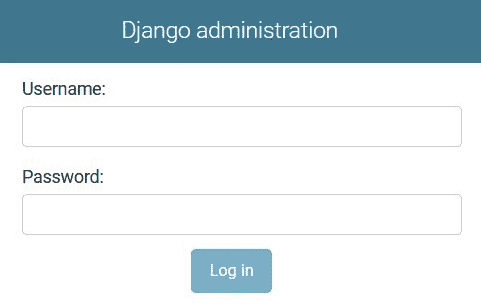

图 6.1 – Django 管理站点登录

使用在 *第二章*，*项目配置* 中执行 `createsuperuser` 命令时提供的用户名和密码。您可以使用这些超级用户凭据登录，或者如果您希望使用 `chapter_3` 数据固定提供的超级用户，则可以使用以下凭据：

+   `admin`

+   `mynewpassword`

登录后，您应该看到两个主要部分，标题为 **认证和授权** 和 **CHAPTER_3**，在右侧，您的仪表板上显示了一个 **最近操作** 侧边导航部分，如下面的截图所示：


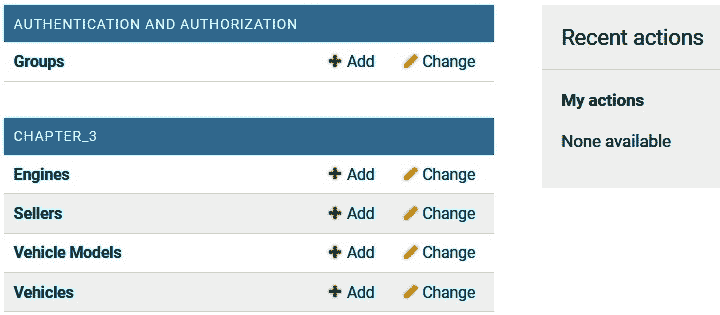

图 6.2 – Django 管理站点仪表板

如果您在 *第三章*，*模型、关系和继承* 中安装了 `django-address` 包，您将在 `settings.py` 文件的 `INSTALLED_APPS` 变量中看到额外的 `address` 应用程序，那么该部分就不会出现在管理仪表板中。

**最近操作**面板显示的信息跟踪了当用户在管理站点中创建、更改或删除特定对象时的时间，这些操作中的任何一个发生时，该对象都会在管理站点中注册。

在 *第三章*，*模型、关系和继承* 中标题为 `User` 模型的部分，使用 `settings.py` 文件中的 `AUTH_USER_MODEL` 变量指向我们创建的自定义 `Seller` 类，我们将不得不在管理站点中注册 `Seller` 模型，以便它显示出来。

接下来，让我们注册那个 `Seller` 模型，以便它在仪表板上显示。

## 编写管理类

在这里，我们将讨论如何在`django.contrib.admin`库中找到的标准`ModelAdmin`类的编写。我们还将提供一个使用`UserAdmin`类的示例，因为我们已经在*第三章*中扩展了`User`模型，*模型、关系和继承*。

### 类 – ModelAdmin

`ModelAdmin`是 Django 为我们提供的类，它为我们处理了所有繁重的工作，特别是在非用户模型方面。在模型可以注册之前，需要创建一个使用`ModelAdmin`类的 admin 类，以便将模型链接到管理界面。

在`/chapter_6/admin.py`文件中，包含以下代码：

```py
# /becoming_a_django_entdev/chapter_6/admin.py
```

```py
from django.contrib.admin 
```

```py
import ModelAdmin
```

```py
class SellerAdmin(ModelAdmin):
```

```py
    pass
```

在前面的代码中，`SellerAdmin`类是使用 Django 的`contrib`类`ModelAdmin`构建的。Django 通过为我们做很多繁重的工作而使我们变得容易。Django 将自动配置我们在这个类中没有指定的所有内容，例如我们将在本章中很快讨论的选项。这意味着如果我们在这个类中包含`pass`语句，我们就不需要写任何其他内容，Django 将根据默认参数为该模型创建管理站点。请继续编写这个类另外三次，包括剩余的车辆模型对象，并在编写时为每个类包含`pass`语句。将这些类命名为`VehicleAdmin`、`VehicleModelAdmin`和`EngineAdmin`。

注意

每个类名都以单词`Admin`结尾。在命名未来的 admin 类时，请遵循`ModelNameAdmin`的命名约定。

### 类 – UserAdmin

`UserAdmin`是 Django 提供的一个特殊类，它允许我们将基于用户的模型链接到管理界面。`UserAdmin`类是`ModelAdmin`类的扩展。接下来，我们将创建`SellerAdmin`类，它将导入 Django `UserAdmin`类中可用的所有功能。我们将以与上一个练习中相同的方式编写 admin 类，包括`pass`语句。所有其他与车辆相关的 admin 类将继续使用标准的`ModelAdmin`类。

以下代码展示了`SellerAdmin`类现在的样子：

```py
# /becoming_a_django_entdev/chapter_6/admin.py
```

```py
...
```

```py
from django.contrib.auth.admin 
```

```py
import UserAdmin
```

```py
class SellerAdmin(UserAdmin):
```

```py
    pass
```

现在我们已经编写了 admin 类，接下来让我们注册它们。

## 注册模型

我们需要编写一个注册语句，将 admin 类与其相应的模型链接，并自动创建与该模型相关的 URL 模式。有两种方法可以做到这一点，它们都做完全相同的事情：

+   第一种方法是在文档的底部写一个单独的语句，放在已经编写的任何 admin 类之后。

+   第二种方法是将每个 admin 类包裹在一个 register 装饰器函数中。

这两种方法将在以下示例中演示，但请选择您最喜欢的一种。同时实现两种方法可能会导致错误。

### 使用语句

使用语句很简单；首先编写管理类，然后在同一`admin.py`文件的底部，像以下代码块中对`Seller`所做的那样，写下注册语句：

```py
# /becoming_a_django_entdev/chapter_6/admin.py
```

```py
...
```

```py
from django.contrib 
```

```py
import admin
```

```py
from django.contrib.auth.admin 
```

```py
import UserAdmin
```

```py
from ..chapter_3.models 
```

```py
import Seller
```

```py
...
```

```py
class SellerAdmin(UserAdmin):
```

```py
    pass
```

```py
admin.site.register(Seller, SellerAdmin)
```

在这里，我们使用`admin.site.register(Model, ModelAdmin)`语句来注册管理类。再写三个语句来注册`Vehicle`、`VehicleModel`和`Engine`模型类到它们相应的管理类。

### 使用装饰器

使用装饰器的工作方式与我们在*第三章*中介绍的`@property`模型方法装饰器类似，*模型、关系和继承*。装饰器封装类，写在类声明之前的行上，就像这里的`SellerAdmin`类一样：

```py
# /becoming_a_django_entdev/chapter_6/admin.py
```

```py
...
```

```py
from django.contrib 
```

```py
import admin
```

```py
from ..chapter_3.models import (
```

```py
    Engine,
```

```py
    Seller,
```

```py
    Vehicle,
```

```py
    VehicleModel
```

```py
)
```

```py
@admin.register(Seller)
```

```py
class SellerAdmin(UserAdmin):
```

```py
    pass
```

在这里，我们使用 Django 提供的`@admin.register(Model)`装饰器。当以这种方式使用时，这个函数只接受一个位置参数，即我们希望链接到该管理类的模型类名称。管理类是从使用装饰器的类名称派生的，在这种情况下，是`SellerAdmin`类。将此装饰器添加到剩余的三个管理类中，并相应地调整每个装饰器相关的模型。

现在我们已经注册了这些模型，当访问 Django 管理仪表板时，您现在应该会看到一个名为**CHAPTER_3**的第四个部分，包含四个项目，如下面的截图所示：

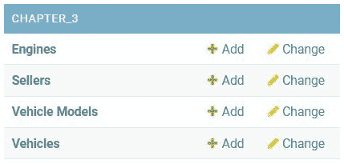


图 6.3 – Django – 注册模型

点击这些选项中的任何一个，都会带您进入所谓的**变更列表视图**，在这里会显示所有这些对象的列表或集合。点击这些项目中的任何一个，然后会进入所谓的**变更视图**。在变更列表视图页面上点击**添加**按钮，会将用户带到所谓的**添加视图**，这是一个创建该模型新实例的表单，而不是编辑现有实例。同样，删除一个对象会将用户带到该对象的**删除视图**页面。类似于如何使用那些类中编写的字段和方法来控制模型和表单，我们可以通过定义某些称为选项的自定义方法来以相同的方式控制管理类。接下来，让我们讨论一下这些选项是什么。

# 配置管理类选项

Django 为自定义 Django 管理站点界面提供了管理类选项。在本节中，我们将介绍一些最重要和最广泛使用的选项，并提供如何使用它们的示例。我们没有足够的空间详细讨论它们。

要详细了解如何使用任何可用的选项，请访问官方 Django 文档，网址为：[`docs.djangoproject.com/en/4.0/ref/contrib/admin/#modeladmin-options`](https://docs.djangoproject.com/en/4.0/ref/contrib/admin/#modeladmin-options)。

以下选项已根据它们相关的视图类型（更改列表视图、更改或添加视图以及仅添加视图）进行分类。

注意

在将任何选项添加到你的管理类之前，请记住删除之前为该类编写的`pass`语句作为占位符。

## 与更改列表视图相关的选项

这些选项与更改列表视图页面上的管理类相关，例如以下列出的：

+   `http://localhost:8000/admin/chapter_3/engine/`

+   `http://localhost:8000/admin/chapter_3/seller/`

+   `http://localhost:8000/admin/chapter_3/vehicle_model/`

+   `http://localhost:8000/admin/chapter_3/vehicle/`

### 选项 – 操作

`actions`选项与更改列表视图页面左侧每个项目旁边的复选框相关。默认情况下，Django 为每个创建并注册的模型自动提供至少一个操作；这个操作是删除操作。例如，导航到`Sellers`更改列表视图页面`http://localhost:8000/admin/chapter_3/seller/`，选择**操作**标签旁边的下拉菜单，你将只看到一个选项，即删除选项，如下面的截图所示：

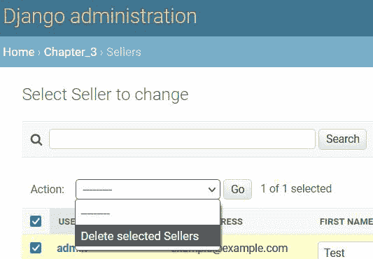

图 6.4 – Django – 操作管理选项

如果我们在这个列表中有 20 个卖家，我们可以通过使用这个操作一次性删除所有 20 个卖家，而不是不得不进行很多不必要的点击。可以创建额外的操作以供自定义使用。一个可以使用此操作的例子是，如果你有一组页面，这些页面可以处于已发布或未发布状态，并存储在你的表中的一个字段中。可以创建一个自定义操作，该操作可以发布或取消发布所有选定的对象。

在这些练习中，我们不会创建自定义操作，因为这会是一个复杂的任务，超出了本书的范围。此外，你可能考虑的一些操作，例如编辑字段，也可以使用`list_editable`选项来完成，我们将在**选项 – list_editable 部分**中讨论。

Django 在这里提供了关于如何创建自定义操作的完整文档：[`docs.djangoproject.com/en/4.0/ref/contrib/admin/actions/`](https://docs.djangoproject.com/en/4.0/ref/contrib/admin/actions/)。

### 选项 – actions_on_bottom

`actions_on_bottom`选项用于显示`False`。如果设置为`True`，如以下示例中对`SellerAdmin`类所做的那样，**操作**下拉菜单将出现在更改列表结果下方：

```py
# /becoming_a_django_entdev/chapter_6/admin.py
```

```py
...
```

```py
class SellerAdmin(UserAdmin):
```

```py
    ...
```

```py
    actions_on_bottom = True
```

### 选项 – actions_on_top

与`actions_on_bottom`选项类似，`actions_on_top`选项将显示`True`。我们只需要写这个选项，如果我们希望在更改列表上方禁用它，但我们可以使用以下示例在`SellerAdmin`类中将它设置为`True`而不触发错误：

```py
# /becoming_a_django_entdev/chapter_6/admin.py
```

```py
...
```

```py
class SellerAdmin(UserAdmin):
```

```py
    ...
```

```py
    actions_on_top = True
```

如果同时将此选项和`actions_on_bottom`选项设置为`True`，则**操作**下拉菜单将出现在更改列表结果上方和下方。

### 选项 – actions_selection_counter

`actions_selection_counter`与显示在**操作**下拉框右侧的计数器相关。此选项控制是否应出现在**操作**旁边，如下面的截图所示：


图 6.5 – Django – actions_selection_counter 管理选项

默认情况下，Django 将此值设置为`True`。除非你想通过将其值设置为`False`来禁用此功能，否则无需编写此选项。然而，包含此选项并使用`True`值是没有害处的，如下面的示例所示：

```py
# /becoming_a_django_entdev/chapter_6/admin.py
```

```py
...
```

```py
class SellerAdmin(UserAdmin):
```

```py
    ...
```

```py
    actions_selection_counter = True
```

### 选项 – 列显示

`list_display`选项用于在模型的更改列表视图页面上显示垂直列。例如，导航到 URL `http://localhost:8000/admin/chapter_3/seller/`，你会看到目前存在的五个列是`username`、`email`、`first_name`、`last_name`和`is_staff`。Django 将为该表中存在的每一行显示每个字段的值。

如果我们想调整此列表以显示我们添加到`Seller`模型中的自定义字段，而这些字段在`User`模型中不存在，例如`SellerAdmin`类将如下所示：

```py
# /becoming_a_django_entdev/chapter_6/admin.py
```

```py
...
```

```py
class SellerAdmin(UserAdmin):
```

```py
    ...
```

```py
    list_display = (
```

```py
        'username',
```

```py
        'email',
```

```py
        'first_name',
```

```py
        'last_name',
```

```py
        'name',
```

```py
        'is_staff',
```

```py
        'is_superuser',
```

```py
    )
```

在之前存在的五个列已经在`UserAdmin`类中定义的`list_display`选项中定义，该选项用于构建`SellerAdmin`类。导航回相同的 URL `http://localhost:8000/admin/chapter_3/seller/`，你现在应该看到页面倒数第三列的**业务名称**列和作为页面最后一列的**超级用户状态**列，因为它们在先前的列表中的位置就是这样。

`list_display`选项也可以以可调用函数的形式使用，允许你在该管理类中编写一个方法来格式化该列显示的数据。只需将自定义方法的名称添加到该列表中，就像使用可调用选项时添加任何其他字段名称一样。

### 选项 – list_display_links

`list_display_links`选项用于控制更改列表结果中哪些列在点击时将用户导航到该对象的更改视图页面。默认情况下，Django 将使此列表中的第一列可点击。如果你想使其他列可编辑，请使用此选项。

在`SellerAdmin`类中，添加选项如下：

```py
# /becoming_a_django_entdev/chapter_6/admin.py
```

```py
...
```

```py
class SellerAdmin(UserAdmin):
```

```py
    ...
```

```py
    list_display_links = (
```

```py
        'username',
```

```py
        'name',
```

```py
    )
```

当使用 `list_display_links` 选项时，还必须使用 `list_display` 选项。只有添加到 `list_display` 选项中的字段可以添加到该选项。此外，如果定义了 `list_display_links` 选项，Django 将不再使第一列可点击。例如，如果我们想保持第一列可点击，即在此选项中的 `username` 和 `name` 字段。此外，它们必须按照它们在 `list_display` 选项中出现的顺序排列。

注意

如果您正在使用我们即将讨论的 `list_editable` 选项，则这些字段不能用于 `list_display_links` 选项，例如 `first_name` 和 `last_name` 字段，我们将为 `list_editable` 示例保留。

### 选项 – list_editable

`list_editable` 选项是一个允许我们指定在变更列表视图页面上哪些字段可以从该页面进行编辑的选项。这避免了打开特定对象的更改视图来编辑单个字段的必要性。此外，只有包含在 `list_display` 选项中的字段可以包含在 `list_editable` 选项中。这是因为列必须存在，我们才能编辑它。

例如，如果我们想在变更列表视图页面上使 `first_name` 和 `last_name` 字段可编辑，则 `SellerAdmin` 类可以这样编写：

```py
# /becoming_a_django_entdev/chapter_6/admin.py
```

```py
...
```

```py
from django.contrib.auth.admin 
```

```py
import UserAdmin
```

```py
class SellerAdmin(UserAdmin):
```

```py
    ...
```

```py
    list_editable = (
```

```py
        'first_name',
```

```py
        'last_name',
```

```py
    )
```

现在，导航到位于 `http://localhost:8000/admin/chapter_3/seller/` 的变更列表视图。我们可以看到 `first_name` 和 `last_name` 字段现在显示为一个带有底部保存按钮的输入框，如下面的截图所示：


图 6.6 – Django – list_editable 管理选项

### 选项 – list_filter

`list_filter` 选项是一个强大的工具，它在一个标签为 **过滤** 的框中创建一个标签，位于变更列表视图页面上的结果右侧。添加到该选项的字段将告诉 Django 从该结果 QuerySet 中找到的值创建一组相关选项的过滤器。

例如，如果我们想覆盖 `UserAdmin` 类中找到的默认 `list_filter` 选项，并添加名为 `name` 的 `Seller` 模型字段作为过滤器，那么我们将按照以下示例编写 `SellerAdmin` 类：

```py
# /becoming_a_django_entdev/chapter_6/admin.py
```

```py
...
```

```py
class SellerAdmin(UserAdmin):
```

```py
    ...
```

```py
    list_filter = (
```

```py
        'is_staff',
```

```py
        'is_superuser',
```

```py
        'is_active',
```

```py
        'name',
```

```py
        'groups'
```

```py
    )
```

在前面的例子中，我们只是复制了位于 Django 的 `django.contrib.auth.admin` 库中的 `UserAdmin` 类中找到的 `list_filter` 选项，然后我们只修改了该值到期望的值。

现在，当我们导航回 URL `http://localhost:8000/admin/chapter_3/seller/` 时，我们看到 **按企业名称** 过滤器，如下面的截图所示：

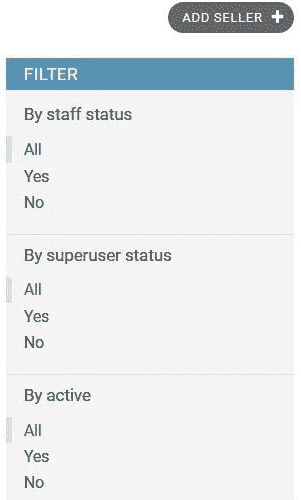

图 6.7 – Django – list_filter 管理选项

### 选项 – list_per_page

`list_per_page`选项指定了我们希望在变更列表视图页面上显示的项目数量。默认情况下，Django 会将此值设置为`100`。有时这个值对于用户来说可能太多，所以让我们继续练习将这个值设置为更友好的数字，比如在`SellerAdmin`类中使用以下示例将其设置为`20`：

```py
# /becoming_a_django_entdev/chapter_6/admin.py
```

```py
...
```

```py
class SellerAdmin(UserAdmin):
```

```py
    ...
```

```py
    list_per_page = 20
```

如果你向你的表中添加超过 20 个项目，你将在变更列表视图页面的底部看到一组分页按钮。当总项目数少于 20 时，不会出现分页按钮，因为只有一个结果页面。

注意

如果你正在使用第三方包或自定义类而不是 Django 中使用的默认`django.core.paginator.Paginator`类，你可以通过使用`paginator`管理选项来实现这个自定义分页器类。如何做到这一点的说明可以在这里找到：[`docs.djangoproject.com/en/4.0/ref/contrib/admin/#django.contrib.admin.ModelAdmin.paginator/`](https://docs.djangoproject.com/en/4.0/ref/contrib/admin/#django.contrib.admin.ModelAdmin.paginator/)。

### 选项 – ordering

`ordering`选项与模型`Meta`类中的`ordering`选项执行方式相同。此选项接受一个字段列表，当页面首次加载时，按指定的字段进行排序。

例如，`UserAdmin`类中的默认排序选项设置为按`username`升序排序。请继续使用以下示例将其添加到`SellerAdmin`类中：

```py
# /becoming_a_django_entdev/chapter_6/admin.py
```

```py
...
```

```py
class SellerAdmin(UserAdmin):
```

```py
    ...
```

```py
    ordering = ('username',)
```

在这里，我们可以添加减号符号，例如在`('-username',)`中，使其按降序排列，就像模型`Meta`类中的`ordering`选项一样。可以添加多个字段，Django 将按照此选项列表中出现的顺序对项目进行排序。此外，一旦页面加载，用户可以选择取消排序或按另一列排序，如果他们按下那些列的表头中的操作按钮。

### 选项 – preserve_filters

`preserve_filters`选项与用户访问变更列表视图页面时应用的过滤器有关。默认情况下，当用户决定为模型创建、更改或编辑对象时，当他们被带回变更列表视图页面时，过滤器将被保留。我们实际上会使用此选项的唯一时间是我们想禁用此功能，使得在执行添加、更改或删除操作后，所有过滤器都会重置。

要禁用此功能，将`preserve_filters`的值设置为`False`，如下例所示：

```py
# /becoming_a_django_entdev/chapter_6/admin.py
```

```py
...
```

```py
class SellerAdmin(UserAdmin):
```

```py
    ...
```

```py
    preserve_filters = False
```

### 选项 – search_fields

`search_fields`选项在变更列表视图页面上启用搜索栏。在`Sellers`列表中应该已经有一个出现，因为`UserAdmin`类已经为我们定义了这个选项。然而，像`name`这样的字段目前是不可搜索的。导航到`http://localhost:8000/admin/chapter_3/seller/`并搜索**Biz**关键词，你应该不会得到任何结果。

现在，将以下代码块添加到 `SellerAdmin` 类中，使标记为**商业名称**的字段可搜索：

```py
# /becoming_a_django_entdev/chapter_6/admin.py
```

```py
...
```

```py
class SellerAdmin(UserAdmin):
```

```py
    ...
```

```py
    search_fields = (
```

```py
        'username',
```

```py
        'first_name',
```

```py
        'last_name',
```

```py
        'name',
```

```py
        'email'
```

```py
    )
```

现在，刷新页面并使用 `chapter_3` 固件搜索相同的 `Seller`。

## 更改/添加视图相关选项

这些选项与添加或更改视图页面的管理类相关，例如以下列出的：

+   `http://localhost:8000/admin/chapter_3/engine/add/`

+   `http://localhost:8000/admin/chapter_3/engine/1/change/`

+   `http://localhost:8000/admin/chapter_3/seller/add/`

+   `http://localhost:8000/admin/chapter_3/seller/1/change/`

+   `http://localhost:8000/admin/chapter_3/vehicle_model/add/`

+   `http://localhost:8000/admin/chapter_3/vehicle_model/1/change/`

+   `http://localhost:8000/admin/chapter_3/vehicle/add/`

+   `http://localhost:8000/admin/chapter_3/vehicle/1/change/`

### 选项 – exclude

可以将 `exclude` 选项视为 `fields` 选项的反面。此选项将接受一个字段列表，我们希望从 Django 管理站点的表单中排除这些字段。添加到 `exclude` 选项中的字段不应出现在 `fieldsets` 或 `add_fieldsets` 选项中；否则，将触发一个错误。如果一个字段同时存在于 `fields` 和 `exclude` 选项中，该字段将被排除。

例如，如果我们想使用以下代码排除 `first_name` 字段，那么我们也必须从 `fieldsets`、`add_fieldsets`、`list_display`、`list_editable`、`search_fields` 和 `prepopulated_fields` 选项中删除 `first_name` 字段，因为它们在之前的和未来的示例中已经编写过：

```py
# /becoming_a_django_entdev/chapter_6/admin.py
```

```py
...
```

```py
class SellerAdmin(UserAdmin):
```

```py
    ...
```

```py
    exclude = ('first_name',)
```

您现在可以删除此设置并将 `first_name` 字段重置为其以前的用法。

### 选项 – fields

`fields` 选项让我们明确指定要在管理表单中包含哪些字段。如果不声明此字段，Django 将自动包含为指定模型存在的所有字段。然而，也可以使用 `'__all__'` 值来明确指定应包含相关模型中存在的所有字段。

我们不会包括这个选项，因为我们希望这些表单中包含所有字段。然而，如果我们只想指定某些字段，那么这将通过一个列表来完成，其中模型中每个字段的名字由逗号分隔：

```py
# /becoming_a_django_entdev/chapter_6/admin.py
```

```py
...
```

```py
class SellerAdmin(UserAdmin):
```

```py
    fields = ('username', 'password', 'first_name', 'last_name',)
```

在这个示例中，只有这四个字段会出现在 `Seller` 对象的更改视图页面上。

注意

`fields` 选项不能与 `fieldsets` 或 `add_fieldsets` 选项结合使用，这样做会导致错误。但是，`fieldsets` 和 `add_fieldsets` 选项可以一起使用。在 `SellerAdmin` 类中，我们只能使用 `fieldsets` 和 `add_fieldsets` 选项，因为用于构建 `SellerAdmin` 类的 `UserAdmin` 父类已经使用了这些选项。在这种情况下，如果我们不想包括特定的字段，最好使用 `exclude` 选项。此外，如果一个字段没有包含在管理类中，但在任何类选项中指定了它，那么将会触发一个错误。

### 选项 – fieldsets

`fieldsets`选项与`fields`选项类似，因为它与自定义字段相关，但它会将类似字段分组到我们创建的指定类别中。Django 将为这些字段在更改和查看页面上添加 HTML 和特殊格式。

例如，因为我们扩展了 Django 的`User`模型在*第三章*“模型、关系和继承”，现在使用`UserAdmin`类来构建`SellerAdmin`类，我们将需要编写自己的`fieldsets`选项。我们必须这样做，因为 Django 将使用`fieldsets`选项，就像它在`UserAdmin`类中那样编写，目前不包括我们创建的额外字段，称为`name`和`vehicles`。为了使`name`和`vehicles`字段出现在更改和添加查看页面上，我们需要将它们添加到任何字段集组中；否则，只会出现原始的`User`字段。

首先，将 Django 的`django.contrib.auth.admin`库中找到的原始`fieldsets`选项复制到您的`SellerAdmin`类中，并修改组以现在包括`name`和`vehicles`字段，如下所示：

```py
# /becoming_a_django_entdev/chapter_6/admin.py
```

```py
...
```

```py
class SellerAdmin(UserAdmin):
```

```py
    fieldsets = (
```

```py
        (None, {
```

```py
            'classes': ('wide',),
```

```py
            'fields': (
```

```py
                'username',
```

```py
                'password',
```

```py
            ),
```

```py
        }),
```

```py
        (('Personal Info'), {'fields': (
```

```py
            'first_name',
```

```py
            'last_name',
```

```py
            'name',
```

```py
            'email',
```

```py
        )}),
```

```py
        (('Permissions'), {'fields': (
```

```py
            'is_active',
```

```py
            'is_staff',
```

```py
            'is_superuser',
```

```py
            'groups',
```

```py
            'user_permissions',
```

```py
        )}),
```

```py
        (('Important Dates'), {'fields': (
```

```py
             'last_login',
```

```py
             'date_joined',
```

```py
        )}),
```

```py
        (('Vehicles'), {
```

```py
            'description': ('Vehicles that this user is selling.'),
```

```py
            'fields': (
```

```py
                'vehicles',
```

```py
            ),
```

```py
        }),
```

```py
    )
```

此选项接受一个元组列表。每个元组包含两个项目，该字段集的标签或显示无标签的`None`值，如之前的第一组所示。第二个项目是另一个元组列表，其中该元组定义了三个可用的键之一或全部：`fields`、`description`和`classes`。`classes`键用于给该字段集的容器赋予一个 HTML 类名，如`'classes': ('wide',)`所示。`description`键将添加一个可选的描述，该描述作为`<p></p>`HTML 对象渲染在管理表单中的字段上方，如之前在`车辆`组中所示。`fields`键将接受一个由逗号分隔的字段列表，以将该字段添加到字段集组中。这是必选键。

使用链接`http://localhost:8000/admin/chapter_3/seller/1/change/`访问名为`admin`的卖家更改视图，你应该看到五个部分。第一个部分没有标签，其他四个部分按以下顺序命名：

+   **不显示标签**

+   **个人信息**

+   **权限**

+   **重要日期**

+   **车辆**

新字段是`vehicles`字段中标记为`name`字段的独立组。

### 选项 – filter_horizontal

`filter_horizontal`选项与名为`vehicles`的`ManyToMany`字段相关联，该字段是为`Seller`模型创建的。导航到数据库中任何销售员的更改视图页面，例如`http://localhost:8000/admin/chapter_3/seller/1/change/`，你会看到标记为`<select multiple="">`的 HTML 对象字段。这实际上可能对一些用户来说难以交互，特别是当需要使用键盘时，无论是在 Windows 上按*Ctrl*按钮还是在 Mac 上按*Command*按钮来选择多个项目进行提交。Django 提供了一个基于 JavaScript 的用户界面，可以应用于任何`ManyToMany`字段。

例如，将以下选项应用到`SellerAdmin`类中，将`vehicles`字段转换为现在使用水平 JavaScript 用户界面：

```py
# /becoming_a_django_entdev/chapter_6/admin.py
```

```py
...
```

```py
class SellerAdmin(UserAdmin):
```

```py
    ...
```

```py
    filter_horizontal = ('vehicles',)
```

接下来，刷新相同的更改视图页面，你会看到车辆现在看起来如下截图所示，其中框是水平并排堆叠的：

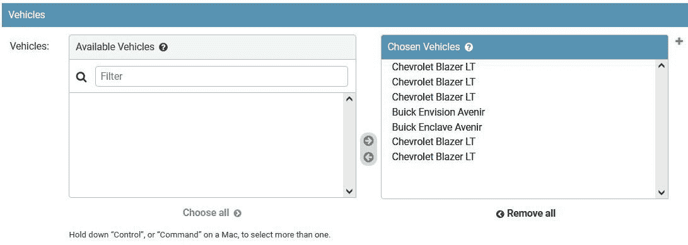


图 6.8 – Django – filter_horizontal 管理选项

现在，用户有更多种方式与这个字段交互。他们仍然可以使用键盘完成所有操作，他们可以使用鼠标完成所有操作，或者他们可以使用两者的组合。从视觉上看，这更加吸引人，更容易看到哪些被选中，哪些没有被选中。这甚至提供了一个搜索字段来帮助过滤结果，如果可选项太多，还可以减少冗余。两个框用于选择左侧可用的项目，并通过控制按钮将其移动到右侧的选中框中。额外的控制按钮允许用户选择并将一个框中找到的所有项目移动到另一个框中。

### 选项 – filter_vertical

`filter_vertical`选项与`filter_horizontal`选项完全相同，只是它将框垂直堆叠而不是水平并排。顶部框是可用的项目，底部框用于选中的项目。

### 选项 – 表单

当创建自定义管理表单时，我们将在本章后面进行，`form`选项用于指向我们希望使用的表单类。如果我们不使用此设置，Django 将为与该管理类注册的模型动态创建一个`ModelForm`。

在本章标题为*编写自定义管理表单类*的部分之前，将以下选项添加到`EngineAdmin`类中：

```py
# /becoming_a_django_entdev/chapter_6/admin.py
```

```py
...
```

```py
class EngineAdmin(ModelAdmin):
```

```py
    ...
```

```py
    form = EngineForm
```

此选项将管理类链接到我们稍后称为`EngineForm`的管理表单。

注意

在我们实际创建`EngineForm`表单之前，你可能会遇到错误。为了防止这些错误，你可以取消注释此行代码并在`EngineAdmin`类下留下`pass`语句，或者现在创建`EngineForm`类并将`pass`语句添加到该`EngineForm`类中，直到我们在本章后面添加代码。

### 选项 – inlines

`inlines`选项是一个高级功能，允许我们在父模型的更改视图页面上作为内联表单集显示来编辑子模型。这个功能被认为是高级的，因为我们需要编写单独的类来使用和实现这个选项。这些类可以使用自定义这些表单集外观和感觉的选项进行编辑。每个内联对象都以`InlineModelAdmin`类开始。用于渲染内联表单集的两个`InlineModelAdmin`子类是`StackedInline`和`TabularInline`。这两个类执行与`InlineModelAdmin`类相同的行为，除了为每个类渲染不同的 HTML 模板。甚至可以创建和使用这些内联类的新表单类。请参阅位于[`docs.djangoproject.com/en/4.0/ref/contrib/admin/#inlinemodeladmin-objects`](https://docs.djangoproject.com/en/4.0/ref/contrib/admin/#inlinemodeladmin-objects)的文档，以及*第五章*中提供的概念，*Django 表单*。

`StackedInline`和`TabularInline`类都用于与`ForeignKey`字段链接的模型。在车辆对象中，我们可以将内联选项应用于`EngineAdmin`和`VehicleModelAdmin`类。对于任何`ManyToMany`字段，我们都需要以稍微不同的方式将它们链接起来。

接下来，我们将逐一介绍这些类，并简要讨论它们的使用方法。

#### 类 – InlineModelAdmin

`InlineModelAdmin`类是构建用于渲染内联表单集的两个类的父类。这个类的每个选项和方法都可在这两个子类中使用。

许多可用于`ModelAdmin`类的选项和方法也适用于`InlineModelAdmin`类。以下是`InlineModelAdmin`类中提供内容的完整列表：

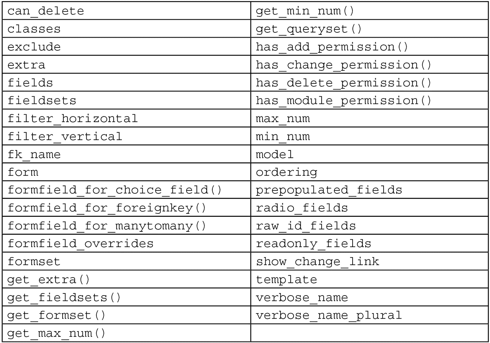

我们将添加到所有内联类的一个常见选项是`extra = 1`，这个值设置为`1`以仅显示一个额外的空白表单集，使用户能够在需要时动态添加对象。如果这个值被设置为，比如说`10`，那么将出现 10 个额外的空白表单集。默认值是`3`，这就是为什么我们将所有类的默认值覆盖为`1`，以提供更好的用户体验。

要详细了解如何使用这些选项和方法，请访问[`docs.djangoproject.com/en/4.0/ref/contrib/admin/#inlinemodeladmin-options`](https://docs.djangoproject.com/en/4.0/ref/contrib/admin/#inlinemodeladmin-options)。

#### 类 – StackedInline

`StackedInline`类用于使用`/admin/edit_inline/stacked.html`模板渲染内联表单集。

要在`EngineAdmin`类上练习使用此选项，请将以下类添加到`/chapter_6/admin.py`文件中，最好将所有内联表单集类放置在此文档的顶部：

```py
# /becoming_a_django_entdev/chapter_6/admin.py
```

```py
...
```

```py
from django.contrib.admin 
```

```py
import ..., StackedInline
```

```py
class VehicleInline(StackedInline):
```

```py
    model = Vehicle
```

```py
    extra = 1
```

接下来，将以下选项添加到`EngineAdmin`类中，放置在所有内联表单集类下方：

```py
# /becoming_a_django_entdev/chapter_6/admin.py
```

```py
...
```

```py
class EngineAdmin(ModelAdmin):
```

```py
    ...
```

```py
    inlines = [VehicleInline,]
```

现在，导航到任何发动机对象的变更视图页面，例如`http://localhost:8000/admin/chapter_3/engine/1/change/`。我们可以看到，使用该特定发动机的每辆车都可以从编辑发动机页面进行编辑，如下面的屏幕截图所示：

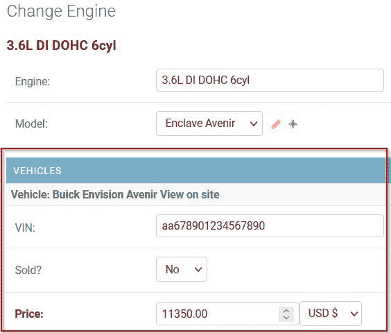

图 6.9 – Django – 内联管理选项 – 堆叠内联

`StackedInline`类将垂直堆叠显示每个字段，如前面的屏幕截图所示。

#### 类 – 表格内联

`TabularInline`类是以与之前的`StackedInline`示例完全相同的方式编写的和实现的，除了使用`VehicleInline`类，如下例所示：

```py
# /becoming_a_django_entdev/chapter_6/admin.py
```

```py
...
```

```py
from django.contrib.admin 
```

```py
import ..., TabularInline
```

```py
class VehicleInline(TabularInline):
```

```py
    model = Vehicle
```

```py
    extra = 1
```

现在，刷新相同的页面，`http://localhost:8000/admin/chapter_3/engine/1/change/`，当渲染到页面上时，字段将现在以整齐排列的列水平显示，如下面的屏幕截图所示：

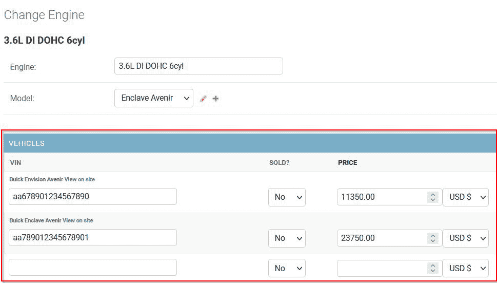

图 6.10 – Django – 内联管理选项 – 表格内联

#### 多对多字段内联

在车辆关系中最有用且最有意义的方法是将卖家在`Seller`变更视图页面上出售的所有车辆链接起来。如果我们以与为`ForeignKey`字段编写内联类相同的方式编写内联类，现在为`ManyToMany`字段关系编写，我们最终会得到一个错误。为了防止这个错误，编写你的内联类几乎与实现相关`ForeignKey`字段的内联类相同，但现在，你将添加一个`through`语句。

创建以下类，用于`SellerAdmin`类，使用`TabularInline`或`StackedInline`类作为其构造函数，对于模型，使用以下`through`语句：

```py
# /becoming_a_django_entdev/chapter_6/admin.py
```

```py
...
```

```py
from django.contrib.admin 
```

```py
import ..., TabularInline
```

```py
class VehiclesInline(TabularInline):
```

```py
    model = Seller.vehicles.through
```

```py
    extra = 1
```

在这里，我们把这个类命名为复数形式的`VehiclesInline`，带有一个*s*，而不是我们之前写的第一个类，叫做`VehicleInline`，按照命名约定。我们这样做是为了表明一个与`ManyToMany`字段相关，而另一个则不是。这个命名约定不是强制的；你的命名约定可以是任何你想要的，但这是有帮助的。我们通过`vehicles`字段直接将`model`选项链接到`Seller`模型，`vehicles`字段是`ManyToMany`字段，使用`through`属性。

在`SellerAdmin`类中，添加以下`inlines`选项：

```py
# /becoming_a_django_entdev/chapter_6/admin.py
```

```py
...
```

```py
class SellerAdmin(UserAdmin):
```

```py
    inlines = [VehiclesInline,]
```

现在，导航到 `http://localhost:8000/admin/chapter_3/seller/1/change/` 的卖家更改视图页面，我们可以看到这位卖家正在销售的车辆现在渲染得与之前的内联表单集练习相同。使用 `ManyToMany` 字段的一个区别是，它们将渲染为相关对象。可以通过点击每个项目旁边的铅笔图标来编辑它们，此时将出现一个弹出窗口，允许用户编辑该项目。

小贴士

在实现车辆内联字段集时，为了获得最佳效果，请从 `fieldsets`、`filter_horizontal` 和 `filter_vertical` 选项中移除 `vehicles` 字段。

### 选项 – radio_fields

`radio_fields` 选项用于 `ForeignKey`、`OneToOne` 字段以及任何使用选择列表的 `CharField`。默认情况下，Django 将这些字段渲染为 `<select>` HTML 对象，用户可以从下拉列表中选择一个选项。通过将字段添加到 `radio_fields` 选项中，Django 将选择渲染为一系列 HTML 单选按钮，当用户查看此页面时，所有选项都会以视觉方式呈现给他们。对于有数十个甚至数百个选项的字段，这可能不是最佳选项，这也是为什么 Django 默认使用 `<select>` 框的原因。

将 `radio_fields` 添加到 `VehicleAdmin` 类中，我们有两个 `ForeignKey` 字段可以操作。将此选项应用于其中一个字段，即 `engine` 字段，而将 `vehicle_model` 字段保持不变，就像以下示例中那样。这样，当我们查看页面时，我们可以看到两种字段之间的区别：

```py
# /becoming_a_django_entdev/chapter_6/admin.py
```

```py
...
```

```py
from django.contrib 
```

```py
import admin
```

```py
from django.contrib.admin 
```

```py
import ModelAdmin
```

```py
class VehicleAdmin(ModelAdmin):
```

```py
    radio_fields = {'engine': admin.HORIZONTAL,}
```

在前面的示例中，`radio_fields` 选项中的每个键都与我们将从 `<select>` 转换为单选按钮的字段名称相关。该键的值接受两种选择之一，`admin.VERTICAL` 或 `admin.HORIZONTAL`。此值用于在页面上垂直或水平显示单选按钮选项。

现在，导航到任何车辆的更改视图页面，例如 `http://localhost:8000/admin/chapter_3/vehicle/1/change/`，并查看 `vehicle_model` 和 `engine` 字段如何不同，如下面的截图所示，有一个选择框和单选按钮选项：


图 6.11 – Django – radio_fields 管理选项

### 选项 – save_on_top

`save_on_top` 选项用于在更改或添加视图页面的顶部显示一组操作按钮。这与 `actions_on_bottom` 或 `actions_on_top` 选项不同，后者仅与更改列表视图页面相关。默认情况下，Django 将此值设置为 `False`，只在页面底部显示操作按钮。将此值设置为 `True` 意味着按钮将出现在这些页面的顶部和底部。

例如，将以下选项添加到 `SellerAdmin` 类中，以在更改和添加视图页面的顶部和底部显示这些按钮：

```py
# /becoming_a_django_entdev/chapter_6/admin.py
```

```py
...
```

```py
class SellerAdmin(UserAdmin):
```

```py
    ...
```

```py
    save_on_top = True
```

现在，导航到任何更改或添加视图页面，例如 `http://localhost:8000/admin/chapter_3/seller/1/change/`，我们将在页面顶部和底部看到操作按钮。

## 添加视图相关选项

这些选项覆盖了仅与添加视图页面相关而不与更改视图页面相关的管理类行为，例如以下列出的：

+   `http://localhost:8000/admin/chapter_3/engine/add/`

+   `http://localhost:8000/admin/chapter_3/seller/add/`

+   `http://localhost:8000/admin/chapter_3/vehicle_model/add/`

+   `http://localhost:8000/admin/chapter_3/vehicle/add/`

### 选项 – add_fieldsets

`add_fieldsets` 选项与 `fieldsets` 选项执行的功能完全相同，但这些字段仅与添加/创建视图表单相关，而不是与更改视图表单相关。例如，导航到 `http://localhost:8000/admin/chapter_3/seller/add/`，您将看到由 `SellerAdmin` 类构建的 Django `UserAdmin` 类仅提供三个字段，然后剩余的字段在我们创建新的 `Seller` 对象后出现。

如果我们想要提供 `first_name`、`last_name`、`name` 和 `email` 字段，我们需要修改 `SellerAdmin` 类的 `add_fieldsets` 变量，使其看起来像以下示例：

```py
# /becoming_a_django_entdev/chapter_6/admin.py
```

```py
...
```

```py
class SellerAdmin(UserAdmin):
```

```py
    ...
```

```py
    add_fieldsets = (
```

```py
        (None, {
```

```py
            'classes': ('wide',),
```

```py
            'fields': (
```

```py
                'username',
```

```py
                'password1',
```

```py
                'password2',
```

```py
            ),
```

```py
        }),
```

```py
        (('Personal Info'), {'fields': (
```

```py
            'first_name',
```

```py
            'last_name',
```

```py
            'name',
```

```py
            'email',
```

```py
        )}),
```

```py
    )
```

在前面的示例中，我们看到编写和分组字段集的写法与之前 `fieldsets` 示例的写法完全相同。现在，当我们访问之前相同的添加 `Seller` URL，即 `http://localhost:8000/admin/chapter_3/seller/add/` 时，我们可以看到四个额外的字段，这四个字段是我们之前在 **个人信息** 字段集中包含的。

### 选项 – prepopulated_fields

`prepopulated_fields` 选项告诉一个字段（或多个字段）在目标字段的值发生变化时监听事件，然后使用目标字段的值更新这些字段值。这在用户更改 `title` 字段值时很有用，因为 `slug` 字段将自动填充相同的值。例如，在 `Seller` 模型中，让我们将其连接起来以监听 `first_name` 和 `last_name` 字段的变化，然后使用从 `first_name` 和 `last_name` 值派生的值填充 `username` 字段值。

对于这个示例，将以下选项应用到 `SellerAdmin` 类：

```py
# /becoming_a_django_entdev/chapter_6/admin.py
```

```py
...
```

```py
class SellerAdmin(UserAdmin):
```

```py
    ...
```

```py
    prepopulated_fields = {
```

```py
        'username': ('first_name', 'last_name',)
```

```py
    }
```

在前面的代码中，我们也可以像对 `first_name` 和 `last_name` 字段那样应用额外的字段。导航到 `Seller` 模型的添加视图页面 `http://localhost:8000/admin/chapter_3/seller/add/` 并在 `first_name` 或 `last_name` 字段中开始输入。您将看到 `username` 字段会自动填充输入的值。空格将被破折号替换，字段的值将按照它们在 `prepopulated_fields` 选项中写入的顺序显示。例如，`first_name` 将根据我们之前如何编写它而出现在 `last_name` 值之前。

现在我们已经了解了所有不同的选项，并将其中许多应用到我们的管理类中，让我们深入了解我们可以使用的各种管理类方法。

# 添加管理类方法

管理类方法允许我们添加或更改`ModelAdmin`或`UserAdmin`类的默认行为。任何在管理类中可用的选项都可以通过编写一个方法来动态计算其值。这些方法使用`get_`命名约定，然后是选项的名称，例如`get_ordering()`或`get_form()`。Django 还提供了许多内置方法，当发生某些事件时，如使用`save_model()`或`delete_model()`方法保存或删除对象时，会添加额外的操作。

接下来，我们将探索其中的一些方法，并使用一个动态值提供演示，特别是针对`form`选项。这将为我们使用本章后面的单独表单类做准备。

要详细了解如何使用 Django 管理类方法，请访问官方 Django 文档：[`docs.djangoproject.com/en/4.0/ref/contrib/admin/#modeladmin-methods`](https://docs.djangoproject.com/en/4.0/ref/contrib/admin/#modeladmin-methods)。

## 方法 – `get_form()`

`get_form()`方法用于获取在管理类内部使用的表单类。例如，在以下两个练习中，一个将检查对象是否存在，然后根据该条件的结果，我们将为更改视图提供一种表单类，为添加视图提供另一种表单类。在另一个练习中，我们将演示为超级用户显示一个表单，为普通用户显示另一个表单。

注意

我们尚未创建`EngineForm`、`EngineSuperUserForm`或`AddEngineForm`类。请继续在`/chapter_6/forms.py`文件中创建这些类，至少包含`pass`语句，以允许除引擎更改和添加视图页面以外的页面加载时不会出错。完成这些练习后，即使包含`pass`语句，您的引擎更改和添加视图页面也会出错。请等待我们完成本章标题为“编写自定义管理表单类”的部分，这将添加必要的组件以防止加载这些页面时出错。

### 修改/添加视图条件

在`EngineAdmin`类中，添加以下`get_form()`方法，并删除或注释掉我们之前为该类编写的先前`form`选项，如图所示：

```py
# /becoming_a_django_entdev/chapter_6/admin.py
```

```py
from .forms 
```

```py
import AddEngineForm, EngineForm
```

```py
...
```

```py
class EngineAdmin(ModelAdmin):
```

```py
    ...
```

```py
    #form = EngineForm
```

```py
    def get_form(self, request, obj=None, **kwargs):
```

```py
        if obj:
```

```py
            return EngineForm
```

```py
        else:
```

```py
            return AddEngineForm
```

```py
        return super(EngineAdmin, self).get_form(request, obj, **kwargs)
```

如前例所示，我们用执行一点逻辑以提供两种不同表单之一的方法替换了`form = EngineForm`。使用井号符号，我们注释掉了`form = EngineForm`行。

### 超级用户条件

此方法的另一种用途是，如果用户具有超级用户状态，则提供一种表单，如果没有，则提供另一种表单，使用此处所示的条件语句：

```py
# /becoming_a_django_entdev/chapter_6/admin.py
```

```py
from .forms 
```

```py
import ..., EngineSuperUserForm
```

```py
...
```

```py
class EngineAdmin(ModelAdmin):
```

```py
    ...
```

```py
    def get_form(self, request, obj=None, **kwargs):
```

```py
        if obj:
```

```py
            if request.user.is_superuser:
```

```py
                return EngineSuperUserForm
```

```py
            else:
```

```py
                return EngineForm
```

```py
        else:
```

```py
            return AddEngineForm
```

这里的想法是赋予超级用户一些普通用户无法编辑的额外字段，例如权限权利和权限组设置。

注意

尽管我们将 Django 的 `User` 模型扩展为卖家，但当前登录的卖家将作为 `user` 键出现在 `request` 字典中，就像前面代码块中显示的 `request.user` 一样。

## 方法 – save_model()

`save_model()` 方法用于在对象在更改或添加视图中保存前后添加操作。要将此方法添加到 `EngineAdmin` 类中，请包含以下代码：

```py
# /becoming_a_django_entdev/chapter_6/admin.py
```

```py
…
```

```py
class EngineAdmin(ModelAdmin):
```

```py
    ...
```

```py
    def save_model(self, request, obj, form, change):
```

```py
        print(obj.__dict__)
```

```py
        # Code actions before save here
```

```py
        super().save_model(request, obj, form, change)
```

```py
        # Code actions after save here
```

在这里，我们创建了一个具有五个位置参数的 `save_model()` 方法，这些参数依次是 `self`、`request`、`obj`、`form` 和 `change`。这五个参数使得在方法内部编写逻辑时可以使用相关数据。`change` 参数的值为 `True` 或 `False`。如果正在保存的对象来自添加视图页面，则 `change` 值将为 `False`；如果对象在更改视图页面上，则 `change` 值将为 `True`。`super().save_model(request, obj, form, change)` 行实际上是保存对象的方式，这与使用 `Model.save()` 操作相同。此行以上的操作将在对象保存之前执行。此行之后的操作将在对象保存之后执行，例如发送电子邮件或触发通知警报。

提示

在前面显示的 `print` 语句中使用 `__dict__` 属性将显示 `obj` 中可用的键和值的字典。

## 方法 – delete_model()

`delete_model()` 方法的使用方式与 `save_model()` 方法类似，只是在对象被删除而不是保存时使用。在相同的 `EngineAdmin` 类中，添加以下方法：

```py
# /becoming_a_django_entdev/chapter_6/admin.py
```

```py
...
```

```py
class EngineAdmin(ModelAdmin):
```

```py
    ...
```

```py
    def delete_model(self, request, obj):
```

```py
        print(obj.__dict__)
```

```py
        # Code actions before delete here
```

```py
        super().delete_model(request, obj)
```

```py
        # Code actions after delete here
```

接下来，我们将创建和修改本章前面提到的自定义管理表单类，在标题为 *方法 – get_form()* 的子节中进行。

# 编写自定义管理表单类

管理表单可以像我们在 *第五章* 中讨论的标准表单类一样创建和使用，*Django 表单*。对于管理表单类，我们需要使用 Django 的 `ModelForm` 类而不是 `django.forms` 库中的标准 `Form` 类，因为这些表单中的字段将链接到模型类。请参阅 *第五章* 中的示例，*Django 表单*，以了解更多关于如何自定义和更改表单类行为的信息，无论是 `Form` 还是 `ModelForm` 类。在这里，我们将演示仅初始化您的管理表单并启用所有现有字段，以便允许任何引擎更改和添加视图页面加载时不会出现前面提到的错误。

## 初始化管理表单

如果您还没有这样做，在`chapter_6`应用文件夹中，创建一个名为`forms.py`的文件。我们需要创建本章前面示例中使用的三个不同的表单类，并将它们命名为`EngineForm`、`AddEngineForm`和`EngineSuperUserForm`。使用此处提供的示例创建它们，但将`EngineForm`的名称更改为您正在编写的类的名称，并将所有三个类的相关模型类也相应更改：

```py
# /becoming_a_django_entdev/chapter_6/forms.py
```

```py
...
```

```py
from django.forms 
```

```py
import ..., ModelForm
```

```py
from ..chapter_3.models 
```

```py
import Engine
```

```py
class EngineForm(ModelForm):
```

```py
    def __init__(self, *args, **kwargs):
```

```py
        print('EngineForm Initialized')
```

```py
        super(EngineForm, self).__init__(*args, **kwargs)
```

```py
    class Meta:
```

```py
        model = Engine
```

```py
        fields = '__all__'
```

要在 admin 类中使`ModelForm`类工作所需的最少代码量可以通过提供`__init__`方法，初始化表单来实现。此外，我们还需要带有`model`和`fields`选项的`Meta`子类。在这三个类（`EngineForm`、`AddEngineForm`和`EngineSuperUserForm`）中，将`model`选项的值设置为`Engine`，将它们全部链接到`Engine`模型。对于`fields`选项，提供值为`'__all__'`，让 Django 根据在`Engine`模型类中编写的字段为您创建字段。与我们所编写的 admin 类不同，我们实际上必须告诉 Django 在这个类中使用所有或某些字段。

您可以调整字段和/或添加其他选项，以自定义这些表单的外观和感觉，这样我们就可以看到它们在渲染时彼此之间的差异。或者，您可以在每个表单的`__init__`方法中使用`print`语句，就像之前所做的那样，以告知您逻辑正在正常工作。如果您访问了本章“配置 admin 类选项”部分提供的选项的任何引擎更改或添加视图页面，页面现在应该能够无错误地加载。

引擎更改和添加页面如下所示：

+   引擎添加视图 – `http://localhost:8000/admin/chapter_3/engine/add/`

+   引擎更改视图 – `http://localhost:8000/admin/chapter_3/engine/1/change/`

接下来，让我们讨论在 Django 管理站点中配置用户权限。

# 使用 Django 认证系统

Django 提供了一个非常强大的认证系统，用于授予用户权限。默认情况下，超级用户拥有做任何事的权限，这就是为什么我们不得不在 *第二章* 中创建至少一个超级用户，*项目配置*。这个超级用户在 Django 系统中的任何时候都是必需的，以维护对您的站点和数据的控制。超级用户授予了我们控制我们系统的能力，并为系统中的每个其他用户建立用户角色和组。创建用户和超级用户可以通过命令行使用 Django 管理命令或通过 IDE 完成，就像我们在 *第二章* 中探索这些主题时一样，*项目配置*。也可以通过 Django shell 完成，就像我们在 *第三章* 中创建和保存模型时一样，*模型、关系和继承*。`user` 和 `Seller` 只是其他我们创建和保存的模型对象。现在我们有了访问 Django 管理站点的权限，我们也可以通过此界面添加用户，或者在我们的情况下，添加卖家，并编辑他们的权限。

接下来，让我们向系统中添加一个普通用户，以便我们可以至少有一个普通用户和一个超级用户来比较和对比他们的角色。

## 添加卖家

在这里，我们将激活 Django shell，从 `chapter_3` 应用程序导入 `Seller` 模型，然后继续创建新的 `Seller` 对象，这是一个标准用户：

1.  在任何终端或命令行窗口中激活 Django shell，就像我们在 *第三章* 中做的那样，*模型、关系和继承*。一旦激活，导入 `Seller` 对象，如下所示：

    ```py
    (virtual_env) PS > python3 manage.py shell
    >>> from becoming_a_django_entdev.chapter_3.models import Seller 
    ```

Django 在 `User` 模型中包含了 `create_user()` 方法，用于轻松创建一个没有超级用户权限的新用户。此方法为我们完成了加密密码的重任，所以我们只需提供未加密的密码字符串即可。

1.  由于我们在 *第三章* 中将 Django `User` 模型扩展为 `Seller`，*模型、关系和继承*，因此我们必须在 `Seller` 模型上使用 `create_user()` 方法，如下所示代码所示。执行以下命令，记住你使用的密码，因为你将需要使用该用户登录 Django 管理站点：

    ```py
    >>> seller = Seller.objects.create_user('test', 'testing@example.com', 'testpassword', is_staff=True)
    ```

1.  现在退出 Django shell，执行 `exit()` 命令，然后再次运行项目，如下所示：

    ```py
    >>> exit()
    (virtual_env) PS > python3 manage.py runserver
    ```

现在，访问 `Seller` 更改列表视图页面：http://localhost:8000/admin/chapter_3/seller/。你应该看到至少两个结果，如下面的截图所示：

![图 6.12 – Django – 卖家的更改列表视图![图 6.12 – Django – 卖家的更改列表视图图 6.12 – Django – 卖家的更改列表视图如前一张截图所示，一个结果具有超级用户状态，而另一个，即我们刚刚创建的，则没有。使用`create_user()`方法时，`is_staff`值被设置为`False`。这就是为什么我们不得不在前面的代码示例中显式地将它设置为`True`。现在，从管理站点登出，然后以用户名`test`和密码`testpassword`重新登录，您现在应该在仪表板上看到一条消息，表明您还没有权限查看任何内容，如下面的截图所示：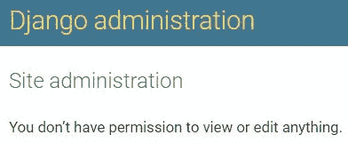

图 6.13 – Django – 卖家管理站点测试

这是预期行为，因为我们还没有授予这个用户任何权限。接下来，让我们授予这个用户一些权限。

## 授予权限

为了授予用户权限，我们这次将使用管理界面。再次登出，然后以`admin`用户或您可能为超级用户提供的任何名称重新登录。导航到您的`test`用户的更改视图，网址为`http://localhost:8000/admin/chapter_3/seller/2/change/`，应该是 ID 号`2`，除非您自己创建了更多用户，那么找到您当前正在工作的用户 ID 的更改视图。

在这个页面上，授予`test`用户更改`chapter_3`应用中所有内容的权限，并保留其他所有内容未选中，如下所示：

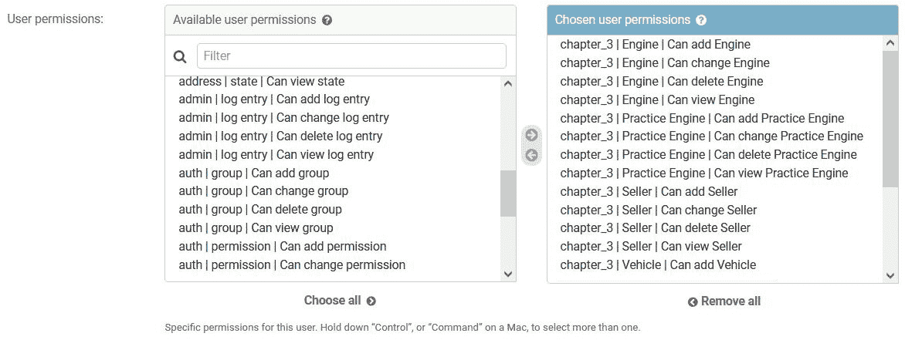

图 6.14 – Django – 用户权限

使用`chapter_3`来仅显示与此任务相关的权限。不要忘记在继续之前保存此用户。登出并再次登录，这次使用`test`用户凭据。现在，我们应该看到与我们的车辆相关的模型，如下面的截图所示：

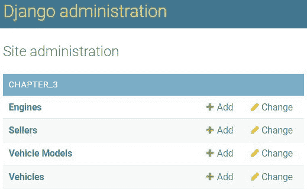

图 6.15 – Django – 卖家管理站点测试 2

可以基于每个组授予权限，而不是逐个用户地授予权限。

注意

现在`Sellers`对象对`test`用户可用。以标准用户身份登录时，导航到任何存在的`Sellers`的更改视图将显示权限字段。为了防止这种情况发生，您可以选择仅允许超级用户查看和编辑`Seller`模型对象，或者遵循本章中*方法 – get_form()*子节中描述的步骤，然后向`SellerAdmin`类添加自己的逻辑。这将只向超级用户显示与权限相关的字段。

## 权限组

权限组是一种通过定义一组权限来添加或从组中删除用户的方法。拥有数千个用户的管理系统将变得繁琐，更不用说它可能导致多少不一致性，因为我们考虑到了人为错误。

现在，请确保你已从`test`用户账户注销，然后使用`admin`用户账户重新登录，并在此导航到组添加视图页面：`http://localhost:8000/admin/auth/group/add/`。然后，创建一个名为`test_group`的新组，并将之前在练习中分配给`test`用户的相同权限授予这个组。接下来，返回到那个`test`用户的修改视图页面，移除之前的所有用户权限，并将它们分配给`test_group`组。这个`test`用户将获得与之前相同的权限。有了这个，你可以创建你想要的任何数量的组，根据你的需求将用户分配到每个组，并定制项目的权限。可以通过将用户分配到组并授予额外的基于用户的权限来临时性地给用户分配额外的权限，这组分配之外。

# 摘要

我们为项目激活并定制了 Django 管理站点，也称为管理面板。这个强大的工具帮助我们在这个网站上注册的所有模型上实现搜索、筛选、排序、创建、编辑和删除功能。根据本章提供的概念，你应该能够使你的管理面板成为一个非常有用的工具，你的用户会喜欢使用。

使用 Django 提供的认证系统，许多不同类型的用户都可以访问和使用同一个网站，但他们的角色和用途却非常不同。如果我们选择扩展模板或使用前几章中提供的概念构建模板系统，每种类型的用户甚至可以分配完全不同的模板和流程。

在下一章中，我们将讨论发送电子邮件、创建自定义电子邮件模板，以及使用 Django 模板语言创建 PDF 报告。
