# 第八章：*第八章*：使用 Django REST 框架

本章将专注于使用**应用程序编程接口**（**API**）。API 实际上是一套工具和通信协议，旨在允许两个不同的应用程序有效地相互通信；它是作为两个系统之间的中间人。**REST API**采用**表示状态传输**（**REST**）软件架构中提出的设计原则，并且通常与基于 Web 的应用程序一起使用。在本章中，每次提到 API 这个词时，我们实际上是在指 REST API，因为它们在技术上略有不同，但通常被视为同一事物。

Django 本身依赖于第三方包来与现有的 API 交互或自己创建 API。一个常见的 Python 包叫做`requests`包。`requests`包用于向服务器端现有的 API 发送和接收请求。有关此包的更多信息，请参阅[`pypi.org/project/requests/`](https://pypi.org/project/requests/)。另一方面，基于 JavaScript 的框架，如 React、AngularJS 或 Vue.js 等，都会在用户的浏览器中客户端执行这些请求。在客户端与服务器端选择操作 API 的工具方面，没有正确或错误的方式。这些决定是根据为您的项目获得的技术要求做出的。我们实际上不会使用`requests`包或任何客户端 JavaScript 框架；相反，我们将专注于**Django REST 框架**，它用于为我们之前创建的模型构建基于模型的 API。

Django REST 框架作为开源软件授权，允许开发者在他们的商业或私人应用程序中使用它。它用于根据 Django 项目的模型构建 API，其中端点执行 HTTP 请求，执行`requests`包，但如果您将此包与框架结合使用，这在项目中有时也会这样做，这也不会有害。本章将完全专注于使用 Django REST 框架为我们创建的车辆模型创建 API，这些模型在*第三章*“模型、关系和继承”中创建。我们将序列化这些模型，并将 URL 模式（即 API 端点）注册到我们编写的视图和视图集中。我们还将使用路由器为我们生成一些这些 URL 模式，完全基于我们数据库表中的数据。

在本章中，我们将涵盖以下内容：

+   安装和配置 Django REST 框架

+   序列化项目中的相关模型

+   使用 Django REST 框架提供的可浏览 API 工具

+   创建 SPA 风格的页面

+   创建自定义 API 端点

+   使用令牌认证措施执行 API 请求

# 技术要求

要使用本章中的代码，您需要在本地机器上安装以下工具：

+   Python 版本 3.9 – 作为项目的底层编程语言

+   Django 版本 4.0 – 作为项目的后端框架

+   pip 包管理器 – 用于管理第三方 Python/Django 包

我们将继续使用*第二章*，*项目配置*中创建的解决方案。然而，没有必要使用 Visual Studio IDE。主要项目本身可以使用其他 IDE 运行，或者从项目根目录（其中包含`manage.py`文件）独立运行，使用终端或命令行窗口。无论您使用什么编辑器或 IDE，都需要虚拟环境来与 Django 项目一起工作。有关如何创建项目和虚拟环境的说明可以在*第二章*，*项目配置*中找到。您需要一个数据库来存储项目中的数据。在上一章的示例中选择了 PostgreSQL；然而，您可以为项目选择任何数据库类型来使用本章中的示例。

我们还将使用以 Django fixture 形式提供的数据，这些数据包含在*第三章*，*模型、关系和继承*，的子标题*加载 chapter_3 数据 fixture*中。请确保`chapter_3` fixture 已加载到您的数据库中。如果已经完成，则可以跳过下一个命令。如果您已经创建了*第三章*，*模型、关系和继承*中提到的表，并且尚未加载该 fixture，那么在激活您的虚拟环境后，请运行以下命令：

```py
(virtual_env) PS > python manage.py loaddata chapter_3
```

本章中创建的所有代码都可以在本书的 GitHub 仓库中找到：[`github.com/PacktPublishing/Becoming-an-Enterprise-Django-Developer`](https://github.com/PacktPublishing/Becoming-an-Enterprise-Django-Developer)。本章中展示的大部分代码可以在`/becoming_a_django_entdev/becoming_a_django_entdev/chapter_8/`目录中找到。

观看以下视频以查看*代码的实际应用*：[`bit.ly/3Ojocdx`](https://bit.ly/3Ojocdx)。

# 为本章做准备

首先，按照在*第二章*中讨论的步骤，在项目中创建一个名为`chapter_8`的新应用。正如该部分所讨论的，不要忘记将`/becoming_a_django_entdev/becoming_a_django_entdev/chapter_8/apps.py`文件中您的应用类中的`name =`变量的值更改为指向您安装应用的位置。务必还将此应用包含在`settings.py`文件中的`INSTALLED_APPS`变量中。

在站点的`urls.py`主文件中，添加以下路径，该路径指向我们将要创建的本章的 URL 模式：

```py
# /becoming_a_django_entdev/urls.py
```

```py
...
```

```py
urlpatterns = [
```

```py
    path(
```

```py
        ‘’, 
```

```py
        include(
```

```py
            ‘becoming_a_django_entdev.chapter_8.urls’
```

```py
        )
```

```py
    ),
```

```py
]
```

## 安装 Django REST 框架

要在任何 Django 项目中安装 Django REST 框架并启用开始使用它所需的最小设置，请按照以下步骤操作：

1.  将`djangorestframework`、`markdown`和`django-filter`包添加到您的`requirements.txt`文件中，并使用您的 IDE 或命令行在虚拟环境中安装它们。您也可以运行以下单独的`pip`命令。使用以下命令中的第一个来激活您的虚拟环境：

    ```py
    PS C:\Projects\Packt\Repo\becoming_a_django_entdev> virtual_env/Scripts/activate
    (virtual_env) PS > pip install djangorestframework
    (virtual_env) PS > pip install markdown
    (virtual_env) PS > pip install django-filter
    ```

在安装这三个包时，无需运行 Django 迁移命令，因为它们不会创建任何额外的表。

1.  接下来，在您的`settings.py`文件中，将以下应用添加到`INSTALLED_APPS`列表中。然后，添加包含在此处显示的`DjangoModelPermissionsOrAnonReadOnly`权限类的`REST_FRAMEWORK`字典：

    ```py
    # /becoming_a_django_entdev/settings.py
    INSTALLED_APPS = [
        ...
        ‘rest_framework’,
    ]
    REST_FRAMEWORK = {
        ‘DEFAULT_PERMISSION_CLASSES’: [
            ‘rest_framework.permissions.
                DjangoModelPermissionsOrAnonReadOnly’
        ],
    }
    ```

此权限类允许我们检查基于模型的 CRUD 权限，并允许匿名用户仅查看或读取项目。有关其他六个以上权限类的完整说明，请访问[`www.django-rest-framework.org/api-guide/permissions/`](https://www.django-rest-framework.org/api-guide/permissions/)。在本章中，我们只将与一个权限类一起工作。

1.  您需要注册与此框架的认证机制相关的 URL 模式。在您的`/chapter_8/urls.py`文件中，添加以下`include`模式，以及本章的主页和 Django 管理站点链接，如下所示：

    ```py
    # /becoming_a_django_entdev/chapter_8/urls.py
    from django.contrib import admin
    from django.urls import include, path
    from django.views.generic import TemplateView
    urlpatterns = [
        path(‘admin/’, admin.site.urls),
        path(
            ‘’, 
            TemplateView.as_view(
                template_name = ‘chapter_8/index.html’
            )
        ),
        path(‘api-auth/’, include(‘rest_framework.urls’))
    ]
    ```

1.  我们还需要像在*第六章*中那样包含管理站点 URL，即*探索 Django 管理站点*，对于本章也是如此。如果您已经在项目的`urls.py`主文件中放置了这个包含语句，那么您就不需要在`chapter_8`应用中再次包含它。

现在，Django REST 框架已安装并准备好在您的项目中使用。目前，我们除了这个框架附带的身份验证 URL 外没有 API URL。目前，这些身份验证 URL 没有为我们提供任何操作。您可以通过访问 URL `http://localhost:8000/api-auth/login/` 来导航到登录页面，以查看它是否正确加载。如果您使用超级用户账户登录，目前将没有任何内容显示，并且会显示一个**404 页面未找到**的消息。

注意

我们启用`chapter_8`应用的 Django 管理站点 URL 模式的原因是能够使用超级用户账户登录 Django 管理站点并在处理本章的一些练习时验证用户。对于这些练习，如果您未登录，您将在结果中看到一个消息，指出**认证凭据未提供**。对于本章末尾的其他练习，您不需要登录 Django 管理站点；将通过基于令牌的授权措施进行认证。

要开始使用此框架并创建新的 API 端点，我们将从为*第三章*中创建的每个模型创建序列化器类开始，*模型、关系和继承*。

# 序列化对象

创建 API 的起点是创建一个序列化器类，然后创建一个视图，特别是`ModelViewSet`视图类。序列化对象意味着将模型对象转换为 JSON 格式以表示该对象的数据。我们需要做的最后一件事是创建 URL 模式，这些模式映射到我们编写的视图类；这将通过 URL 路由器来完成。这些 URL 模式被认为是您的 API 端点。

在本节中需要注意的一点是，当使用相关字段时，我们需要为所有与其它模型相关的模型创建序列化器。这就是为什么以下练习将展示`chapter_3`应用中所有四个模型的示例。这必须做到，以确保我们在使用 Browsable API 时不会出错，我们将在本章后面介绍 Browsable API，以及进行 API 请求时不会出错。这意味着如果您有多个被分配了`Group`或`Permission`的`Seller`，那么`Group`和/或`Permission`对象也必须进行序列化。记住，当我们将`AUTH_USER_MODEL`设置更改为现在等于`‘chapter_3.Seller’`时，`Seller`对象替换了`django.contrib.auth.models`库中找到的默认`User`对象，如*第三章*中所述，*模型、关系和继承*。由于`chapter_3`数据固定中只提供了一个`Seller`，因此未显示序列化`Group`或`Permission`对象的示例：

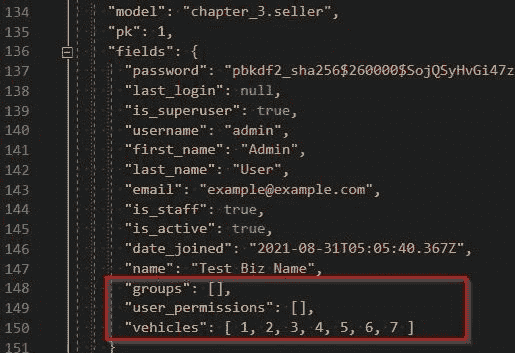

图 8.1 – chapter_3 数据固定 – 卖家对象

此处的 `Seller` 没有分配到 `Group` 或 `Permission`，因此结果是我们不应该在以下练习中遇到错误。相反，该 `Seller` 的 `is_superuser` 字段被设置为 `true`，这允许我们在登录 Django 管理站点时执行所有 CRUD 操作。

注意

如果你遇到错误，要么删除之前显示的所有除 `Seller` 数据之外的内容，或者建议只创建 `Group` 和 `Permission` 对象的附加序列化器、视图集和路由器。遵循以下示例中使用的相同代码格式。同样适用于 `django.contrib.contenttypes.models` 库中找到的 `ContentType` 对象。如果你在该序列化器类的 `Meta` 子类中定义了 `depth` 属性，更具体地说，如果 `depth` 设置为 `2` 或更大的值，这将需要。我们很快将讨论此属性的作用。

接下来，让我们开始编写我们的序列化器，并了解更多可用的类。

## 序列化器类

`rest_framework.serializers` 库为我们提供了五个类，如下所示：

+   `Serializer` – 用于嵌套 `ManyToManyField`、`ForeignKey` 和 `OneToOneField` 关系时使用。

+   `ModelSerializer` – 用于创建具有直接映射到项目中模型字段的序列化器。

+   `HyperlinkedModelSerializer` – 用于执行 `ModelSerializer` 类所做的所有操作，但它在 Browsable API 中查看时将为每个相关对象生成一个可点击的链接，而不是显示这些对象的数字 ID。

+   `ListSerializer` – 用于在一个请求中序列化多个对象，并且通常在 Django 中使用，当 `Serializer`、`ModelSerializer` 或 `HyperlinkedModelSerializer` 已初始化为具有定义了 `many=True` 属性时。

+   `BaseSerializer` – 提供给开发者创建他们自己的序列化和反序列化风格的能力。这与在 Django 消息框架中使用的 `BaseStorage` 类类似，如在第七章*“消息、电子邮件通知和 PDF 报告”*的子标题[*“消息存储后端”*]中讨论的那样。

首先，按照以下步骤为在*第三章*中创建的每个模型创建 `ModelSerializer` 类，包括 `Engine`、`Vehicle`、`VehicleModel` 和 `Seller` 模型：

1.  在你的 `/becoming_a_django_entdev/chapter_8/` 文件夹中创建一个名为 `serializers.py` 的新文件。在此文件中，添加以下导入：

    ```py
    # /becoming_a_django_entdev/chapter_8/serializers.py
    from rest_framework.serializers import ModelSerializer
    from ..chapter_3.models import (
        Seller, 
        Vehicle, 
        Engine, 
        VehicleModel
    )
    ```

1.  在此文件中，添加以下所示的 `EngineSerializer` 类：

    ```py
    # /becoming_a_django_entdev/chapter_8/serializers.py
    ...
    class EngineSerializer(ModelSerializer):
        class Meta:
            model = Engine
            fields = ‘__all__’
    ```

1.  在此文件中，添加以下所示的 `VehicleModelSerializer` 类：

    ```py
    # /becoming_a_django_entdev/chapter_8/serializers.py
    ...
    class VehicleModelSerializer(ModelSerializer):
        class Meta:
            model = VehicleModel
            fields = ‘__all__’
    ```

1.  在此文件中，添加以下所示的 `VehicleSerializer` 类：

    ```py
    # /becoming_a_django_entdev/chapter_8/serializers.py
    ...
    class VehicleSerializer(ModelSerializer):
        class Meta:
            model = Vehicle
            fields = ‘__all__’
    ```

1.  在此文件中，添加以下所示的 `SellerSerializer` 类：

    ```py
    # /becoming_a_django_entdev/chapter_8/serializers.py
    ...
    class SellerSerializer(ModelSerializer):
        class Meta:
            model = Seller
            fields = ‘__all__’
    ```

你可能会注意到前面的类与之前章节中练习中使用的某些类相似。在这里，我们使用 `‘__all__’` 值定义了字段，但我们可以提供所需字段的列表以及它们的顺序，就像在 *第五章* 的表单类中那样，*Django 表单*。

### `Meta` 子类

`Meta` 子类提供了额外的选项，类似于我们在为 *第三章* 的 *Models, Relations, and Inheritance* 编写的模型中自定义 `Meta` 子类的方式。有关所有 `Meta` 类选项的完整说明以及有关序列化器的一般信息，请访问[此处](https://www.django-rest-framework.org/api-guide/serializers/)。其他选项包括以下内容：

+   `model` – 用于指定映射到该序列化器的模型类。

+   `fields` – 用于指定在序列化器中包含哪些字段或所有字段。

+   `validators` – 用于在创建或更新操作时添加验证。类似于在 *第五章* 的 *Django 表单* 中使用表单验证，Django 首先会依赖于在数据库级别设置的任何约束，然后它会检查序列化器级别上应用的验证。有关序列化器验证器的更多信息，请参阅[此处](https://www.django-rest-framework.org/api-guide/validators/)。

+   `depth` – 用于将相关对象表示为嵌套 JSON，而不是使用指定深度的数字 ID。此选项的默认值为 `0`。

+   `read_only_fields` – 用于指定在序列化器级别上只读的字段。

+   `extra_kwargs` – 用于在序列化器中的特定字段上指定额外的关键字参数。

+   `list_serializer_class` – 用于指定使用 `ListSerializer` 类创建的自定义 `ListSerializer`。这通常在你需要修改 `ListSerializer` 类的行为时进行，例如，在整个集合上执行自定义验证，例如比较嵌套对象的值或执行字段级别的验证。

现在我们有了可以工作的序列化器类，我们需要为它们创建一个视图类。我们可以使用 Django REST 框架提供的 `ModelViewSet` 类来完成这个任务。

## 视图集类

与为每个 CRUD 操作创建视图/方法不同，Django REST 框架提供了一个将它们全部组合在一起的类。它首先在 `views.py` 文件中创建一个视图类，类似于我们在 *第四章* 的 *URLs, Views, and Templates* 中所做的那样，除了它们是使用以下视图集类之一构建的。Django REST 框架提供了以下四个视图集类：

+   `GenericViewSet` – 包含执行某些操作的方法，通常用于创建非基于模型的 API。

+   `ModelViewSet` – 这个类包括执行 CRUD 操作所需的所有方法，并旨在直接映射到您项目的模型。

+   `ReadOnlyModelViewSet` – 只提供读取操作，其他所有方法将不会提供。这个视图集也旨在与您项目的模型一起工作。

+   `ViewSet` – 开发者用来创建类似于 `BaseSerializer` 和 `BaseStorage` 类使用的自定义视图集。这个类不提供任何操作，这些方法将由开发者创建以便使用此类。

按照以下步骤准备您的视图集类：

1.  在您的 `/chapter_8/views.py` 文件中，添加以下导入：

    ```py
    # /becoming_a_django_entdev/chapter_8/views.py
    from rest_framework.permissions import IsAuthenticated
    from rest_framework.viewsets import ModelViewSet
    from .serializers import (
        EngineSerializer,
        SellerSerializer,
        VehicleSerializer,
        VehicleModelSerializer
    )
    from ..chapter_3.models import (
        Engine, 
        Seller, 
        Vehicle, 
        VehicleModel
    )
    ```

1.  在同一文件中，添加以下 `EngineViewSet` 类，如下所示：

    ```py
    # /becoming_a_django_entdev/chapter_8/views.py
    ...
    class EngineViewSet(ModelViewSet):
        queryset = Engine.objects.all().order_by(‘name’)
        serializer_class = EngineSerializer
        permission_classes = [IsAuthenticated]
    ```

1.  在同一文件中，添加以下 `VehicleModelViewSet` 类，如下所示：

    ```py
    # /becoming_a_django_entdev/chapter_8/views.py
    ...
    class VehicleModelViewSet(ModelViewSet):
        queryset = VehicleModel.objects.all().order_by(
            ‘name’
        )
        serializer_class = VehicleModelSerializer
        permission_classes = [IsAuthenticated]
    ```

1.  在同一文件中，添加以下 `VehicleViewSet` 类，如下所示：

    ```py
    # /becoming_a_django_entdev/chapter_8/views.py
    ...
    class VehicleViewSet(ModelViewSet):
        queryset = Vehicle.objects.all().order_by(‘price’)
        serializer_class = VehicleSerializer
        permission_classes = [IsAuthenticated]
    ```

1.  在同一文件中，添加以下 `SellerViewSet` 类，如下所示：

    ```py
    # /becoming_a_django_entdev/chapter_8/views.py
    ...
    class SellerViewSet(ModelViewSet):
        queryset = Seller.objects.all()
        serializer_class = SellerSerializer
        permission_classes = [IsAuthenticated]
    ```

在每个类中，我们只为这些类定义了三个属性，即 `queryset`、`serializer_class` 和 `permission_classes` 属性。在前面的示例中，我们只使用了 `all()` 方法来搜索该表中所有记录。除了使用 `all()` 方法外，还可以使用 `filter()` 和 `get()` 函数来查找特定记录。`serializer_class` 属性用于将视图映射到我们在前面的子节中构建的序列化器类；它映射到我们正在查询的模型类。`permission_classes` 属性用于定义该请求的权限。权限与我们在本章末尾将要讨论的认证令牌不同。权限确保访问系统的用户被允许在所讨论的模型上执行那些特定的 CRUD 操作。这些属性只有三个，并且在使用 `ModelViewSet` 或 `GenericViewSet` 类时，只有前两个是必需的；最后一个是可以选的。您还可以使用可调用方法自定义这些属性，甚至可以自己覆盖默认的操作方法。要了解更多关于视图集的信息，请访问 [`www.django-rest-framework.org/api-guide/viewsets/`](https://www.django-rest-framework.org/api-guide/viewsets/)。

接下来，让我们配置这些 URL 路由器以映射到我们刚刚创建的视图集。这些将是您项目的 API 端点。

## 使用 URL 路由器

URL 路由器被用作一种防止开发者必须为 API 中每个模型相关的 CRUD 操作编写单独 URL 模式的手段。这可能会在一段时间后变得非常复杂，而 Django REST 框架提供这些 URL 路由器作为自动为您生成每个端点的一种方式。

按照以下步骤配置您的路由器：

1.  在您的`/chapter_8/urls.py`文件中，添加以下`import`语句：

    ```py
    # /becoming_a_django_entdev/chapter_8/urls.py
    ...
    from rest_framework import routers
    from .views import (
        EngineViewSet,
        SellerViewSet,
        VehicleViewSet,
        VehicleModelViewSet
    )
    ```

1.  在同一文件中，添加以下`router`和`register`语句：

    ```py
    # /becoming_a_django_entdev/chapter_8/urls.py
    ...
    router = routers.DefaultRouter()
    router.register(r’engines’, EngineViewSet)
    router.register(r’sellers’, SellerViewSet)
    router.register(r’vehicles’, VehicleViewSet)
    router.register(
        r’vehicle-models’,
        VehicleModelViewSet
    )
    ```

1.  在同一文件中，包含以下`include`路径以供您的路由器使用：

    ```py
    # /becoming_a_django_entdev/chapter_8/urls.py
    ...
    urlpatterns = [
        ...
        path(‘chapter-8/’, include(router.urls)),
        path(‘api-auth/’, include(‘rest_framework.urls’)),
    ]
    ```

之前显示的`include(router.urls)`路径位于`api-auth`路径和您的管理页面路径之间。对于每个模型，使用 Django REST 框架提供的`routers.DefaultRouter()`类定义一个路由器变量。每个`router.register()`函数为该模型创建一组 URL 模式。例如，在这个 URL 中显示的`engines`路径，即`http://localhost:8000/chapter-8/engines/`，这就是在第一个注册函数的第一个参数中定义的，即`r'engines'`。路由器生成了一组 URL 模式，每个模式对应表中的一个对象，这些模式通过使用`path('chapter-8/', include(router.urls))`路径添加到您的`urlpatterns`列表中。将`chapter-8`添加到这个`path()`函数中，就是告诉 Django 为使用这组路由器创建的每个路径添加前缀`http://localhost:8000/chapter-8/`。

就这样；现在您已经有一个非常基础的 API 可以与在*第三章*“模型、关系和继承”中创建的四个模型一起使用了。为了测试您的 API 并查看每个请求发送和接收的数据，我们将使用 Django REST 框架提供的可浏览 API。

# 使用可浏览 API

在上一节中提到的`chapter-8`路径是 URL 路由器的路径，我们激活了该路径，称为`http://localhost:8000/chapter-8/`，以查看这些 URL，如图所示：

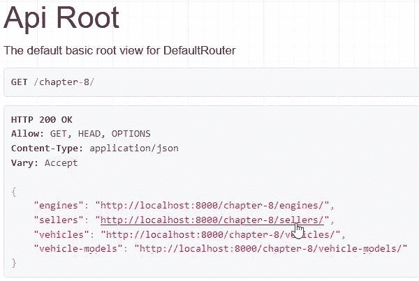

图 8.2 – 可浏览 API – API 根

当构建自定义 API 端点时，就像我们在本章后面将要做的那样，您可能不会在 API 根中看到它们。您会看到，组、权限和内容类型的序列化器都包含在这本书的代码中。在每个主要路由路径的右上角有一个下拉菜单，可以在这两种格式之间切换，即 API 和 JSON，如图所示：

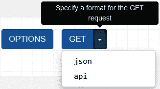

图 8.3 – 可浏览 API – GET 格式

如果使用`HyperlinkedModelSerializer`来构建您的序列化器类，每个对象将显示为可点击的 URL，而不是不可点击的 ID。超链接版本如图所示，当访问路由器为`Seller`模型在`http://localhost:8000/chapter-8/sellers/`创建的主要 URL 路径时：


图 8.4 – 可浏览 API – 卖家列表

要查看与前面截图相同的结果，只需将所有序列化器类中的`ModelSerializer`更改为`HyperlinkedModelSerializer`。还将您的`SellerSerializer`类更改为排除以下代码中显示的字段，以防止出现指示配置错误的`lookup_field`的错误，这是一个超出本书范围的高级主题：

```py
# /becoming_a_django_entdev/chapter_8/serializers.py
```

```py
...
```

```py
from rest_framework.serializers import (
```

```py
    HyperlinkedModelSerializer,
```

```py
    ModelSerializer
```

```py
)
```

```py
class SellerSerializer(HyperlinkedModelSerializer):
```

```py
    class Meta:
```

```py
        model = Seller
```

```py
        #fields = ‘__all__’
```

```py
        exclude = [‘groups’, ‘user_permissions’]
```

在前一小节中注册的每个路由器上，主 URL，例如之前显示的`http://localhost:8000/chapter-8/sellers/`链接，将允许您使用该页面底部的表单执行创建操作（`POST`请求）。仅查看此页面就执行读取操作（`GET`请求）。`http://localhost:8000/chapter-8/sellers/1/`包括一个位于该页面底部的表单，允许您对该视图中的对象执行`PUT`、`PATCH`和`DELETE`操作，如下所示：

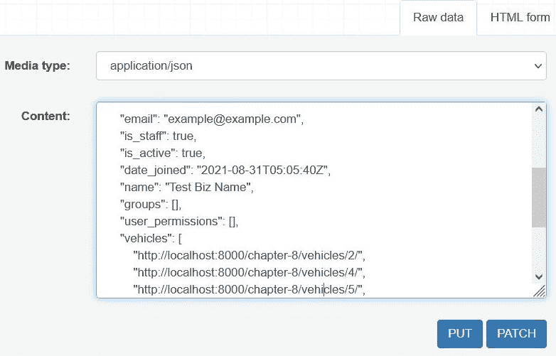

图 8.5 – 可浏览的 API – 卖家详情

默认情况下，Django 将显示没有超级用户状态的`Seller`，然后该用户/卖家必须获得组或个人权限级别访问权限才能对该模型对象执行任何 CRUD 操作。如果用户/卖家只有执行一项操作而没有执行另一项操作的权限，例如更新但不删除或创建但不更新，那么只会出现那些操作按钮。如果您没有看到您预期看到任何操作按钮，请仔细检查该用户的权限设置。

现在我们已经有一个工作的 API 并探索了如何使用可浏览的 API，让我们构建不需要重新加载或重定向页面的内容更改页面。

# 构建类似 SPA 的页面

**单页应用**（**SPA**）页面是内容在容器/节点内更新而不是重新加载或重定向页面以显示数据的网页。通常，服务器的一些工作会卸载到客户端浏览器来执行这些请求和/或渲染 HTML，通常使用 JavaScript 或 jQuery。当触发事件时，例如点击按钮或提交表单，JavaScript 用于从服务器获取数据，然后将该内容渲染到页面上，无论我们希望在何处显示。

在这个练习中，我们将使用由路由器创建的`Seller` API 端点，在`http://localhost:8000/chapter-8/sellers/1/`，将 JSON 作为字符串渲染在查询页面体中的容器内。查询页面只是一个标准的页面，它使用 JavaScript 与 API 端点进行通信。

## 创建视图

在本小节中，我们将构建视图来处理用户可以输入与想要查询的`Seller` ID 相关的数字的页面。这将是`GetSellerView`类，它将作为本章剩余两个练习的骨干使用。

要开始，请执行以下步骤：

1.  打开`/chapter_8/views.py`文件，并添加以下`GetSellerView`类：

    ```py
    # /becoming_a_django_entdev/chapter_8/views.py
    ...
    from django.template.response import TemplateResponse
    from django.views.generic import View
    ...
    class GetSellerView(View):
        template_name =   
            ‘chapter_8/spa_pages/get_seller.html’
        def get(self, request, *args, **kwargs):
            context = {}
            return TemplateResponse(
                request, 
                self.template_name, 
                context
            )
    ```

在前面的例子中，我们正在构建一个基于类的视图，就像我们在*第四章*，*URLs, Views, and Templates*中所做的那样。我们在这里所做的唯一不同的事情是我们没有包括`post()`方法；我们只提供了`get()`方法。因为我们不处理表单提交。操作按钮将通过 JavaScript 作为`type=’button’`类型的按钮来控制，而不是`type=’submit’`。完成这些后，就没有必要使用`post()`方法了。此外，我们正在创建一个标准的 Django 视图类，而不是 REST API 视图类，因为这个页面仅用于与 API 端点通信，而不是作为 API 端点本身。

现在，让我们创建一个模板来格式化要渲染到页面上的 HTML。

## 构建模板

前一个子节构建了这个练习的视图。本节将创建用于我们练习的模板。

按照以下步骤创建你的模板：

1.  在`/chapter_8/templates/chapter_8/spa_pages/`文件夹中创建`get_seller.html`模板文件。

1.  在*第四章*，*URLs, Views, and Templates*中，我们创建了一个名为`/chapter_4/templates/chapter_4/base/base_template_1.html`的文件。我们将重新使用这个文件为本章服务。请将此文件以及任何相关的模板文件复制到你的`chapter_8`应用中。相关的模板文件包括在`base_template_1.html`文件中引用的标题、页脚、JavaScript 和 CSS 文件。将它们放在与复制来源相同的子文件夹中的`templates`和`static`目录中，然后在文件中任何提及`chapter_4`和`chapter-4`的地方将其重命名为`chapter_8`和`chapter-8`。你可以始终复制本书代码中找到的`chapter_8` JavaScript、CSS 和模板文件。

1.  接下来，在你在*步骤 1*中创建的`get_seller.html`文件中，添加以下代码所示：

    ```py
    # /becoming_a_django_entdev/chapter_8/templates/chapter_
        8/spa_pages/get_seller.html
    
    
    ...
    
        <form>
            <div class=”field-box input-box”>
                <label for=”seller-id”>Seller ID:</label>
                <div class=”form-group”>
                    <input id=”seller-id” type=”text” />
                    <span class=”help-text”>Please enter 
                        the ID of the seller you want to 
                            lookup</span>
                </div>
            </div>
            <button type=”button” id=”get-sellers” onclick
                =”$gotoSPA_Page()”>
                    Get Seller Details</button>
        </form>
        <div id=”details”>
            <p>!!! No Details to Display !!!</p>
        </div>
    
    ```

1.  这个页面非常简单。我们所做的只是创建一个`type=”text”`类型的输入字段，然后是一个`type=”button”`类型的按钮。我们给按钮添加了一个`onclick`属性，它会触发一个名为`$gotoSPA_Page()`的 JavaScript 函数。有一个带有`id=”details”`属性的`<div>`容器，其中包含一段文本，表明目前没有内容可以显示。

这里的想法是我们将用从 API 请求接收到的内容替换`<div id=”details”>`容器中的所有内容。在这个特定的设置中不需要`<form>`容器；它只是为了符合之前章节中编写的相同的 CSS 样式和 HTML 节点结构而添加的。可以偏离这种结构并创建自己的。请使用前面的结构来演示这个练习。

接下来，让我们添加执行 API 请求的 JavaScript。我们将在这个客户端而不是服务器端执行这个操作。

## 编写 JavaScript

我们不需要很多 JavaScript，只需要一个利用原生 JavaScript `fetch()`函数的小函数。这几乎与 jQuery 的`.ajax()`函数相同，但也有一些不同。`fetch()`函数的不同之处在于它不会发送`cross-origin`头信息，默认模式设置为`no-cors`，而`.ajax()`函数将默认模式设置为`same-origin`。这可能会根据你的项目需求而变得重要。请求的结果将随后在具有 CSS ID 属性`details`的容器中显示，更广为人知的是`details`容器。

如果你从`chapter_4`复制了你的 JavaScript 文件，那么现在这个文件应该是空的。请按照以下步骤准备你的 JavaScript。如果你从书中代码的`chapter_8`复制了这个文件，请确保只注释掉以下代码：

1.  在你的`/chapter_8/static/chapter_8/js/site-js.js`文件中，添加以下代码：

    ```py
    # /becoming_a_django_entdev/chapter_8/static/chapter_8/js/site-js.js
    function $gotoSPA_Page() {
        const input = document.getElementById(
            ‘seller-id’
        );
        const container = document.getElementById(
            ‘details’
        );
        const id = input.value;
        var url = `/chapter-8/sellers/${id}/`;
    }
    ```

1.  在相同的`$gotoSPA_Page()`函数中，在你的常量和变量下面添加`fetch()`方法，如下所示：

    ```py
    # /becoming_a_django_entdev/chapter_8/static/chapter_8/js/site-js.js
    function $gotoSPA_Page() {
        ...
        fetch(url, {
            method: ‘GET’,
            headers: {
                ‘Content-Type’: ‘application/json’,
        }}).then(response => {
            return response.json();
        }).then(data => {
            container.innerHTML = JSON.stringify(data);
        });
    }
    ```

这是我们在前一小节中配置的`$gotoSPA_Page()`函数，当`Get Seller Details`按钮的`onclick`动作被触发时执行。就这样！这就是我们完成从数据库中检索单个记录的单个任务所需的全部 JavaScript。

在前面的代码中，我们编写了三个常量，一个名为`input`的用于定位`input`字段节点，另一个名为`container`的用于定位`details`容器节点。第三个，名为`id`的用于在函数执行时捕获输入字段的`value`。`url`变量用于使用该路径转换器的`value`作为关键字参数构造一个字符串。在 JavaScript 中，这被称为字符串连接，因为我们正在这样做，你需要确保使用反引号字符（`` ` ``）而不是单引号字符（`‘`）。它们看起来几乎一模一样；如果你只是匆匆浏览前面的代码，请小心。在这里，我们告诉`url`变量指向由`Seller` API 的 router 创建的 URL。

`fetch()` 函数接受 `url` 变量作为该函数的第一个位置参数，这是一个必需的参数。然后我们传递额外的可选参数，例如接受这些值的方法（`GET`、`POST`、`PUT`、`PATCH` 和 `DELETE`）。目前我们只想展示如何获取数据，因此在这个练习中我们将使用 `GET` 方法。有时会使用头参数来指定 `‘Content-Type’`；在这种情况下，它被设置为 `‘application/json’`。之前显示的方法和头参数是使用 `fetch()` 函数的默认值。对于读取操作来说，它们不是必需的，因为它们是默认值，但提供它们是为了说明目的。

`fetch()` 函数还使用了之前显示的两个 `then()` 方法；它们各自返回一个 JSON 格式的响应对象作为承诺。简单来说，承诺是一个包含状态和结果的物体。第二个 `then()` 方法使用返回的承诺作为 `data` 变量，然后我们通过编写一个简单的语句将那个 `data` 放入 `details` 容器中。我们使用 `JSON.stringify()` 方法将那个 JSON 对象转换成可读的格式，特别是将一个字符串放入那个容器中。如果不使用 `JSON.stringify()` 函数，我们只会看到一个对象被打印到屏幕上，用括号括起来，这在我们查看时不会很有意义。我们将在本章标题为 *First demo* 的子节中看到这个操作的截图。

目前，我们只是在 `<div>` 容器中打印 JSON 字符串。我们没有为这些节点创建 HTML 元素和/或 CSS 样式。这就是你可能需要编写额外的 JavaScript 来手动完成这些操作，或者使用基于 JavaScript 的框架的强大功能的地方。让我们先完成这个练习，看看它是如何工作的，然后我们将向你展示如何在章节标题为 *Writing custom API endpoints* 的部分中在服务器端渲染 HTML 和 CSS。

### 使用 async 和 await 关键字

传统的 JavaScript 是同步和单线程的。它将依次运行一个进程，如果其中一个进程因为例如 API 请求（服务器响应时间过长）而挂起，那么后续的进程也会挂起。问题是当这种情况发生时，页面可能会变得无响应。异步 JavaScript 允许函数在等待服务器响应的同时并行运行。返回承诺的 `then()` 函数已经是一个异步函数，这也是我们倾向于使用 `fetch()` 函数的原因。JavaScript 提供了 `async` 和 `await` 关键字，这使得使用和操作异步函数变得更容易，尤其是在你的代码开始超出这些基本用法示例时。

采取以下步骤修改你的 JavaScript。

在以下代码块中，将高亮显示的更改应用到前面示例中的`$gotoSPA_Page()`函数：

```py
# /becoming_a_django_entdev/chapter_8/static/chapter_8/js/site-js.js
```

```py
function $gotoSPA_Page() {
```

```py
    ...
```

```py
    fetch(url, {
```

```py
        method: ‘GET’,
```

```py
        headers: {
```

```py
            ‘Content-Type’: ‘application/json’,
```

```py
        }
```

```py
    }).then(async(response) => {
```

```py
        return await response.json();
```

```py
    }).then(async(data) => {
```

```py
        const thisData = await data;
```

```py
        container.innerHTML = JSON.stringify(
```

```py
            thisData
```

```py
        );
```

```py
    });
```

```py
}
```

变量和常量仍然需要。它们保持不变，并使用前三个点表示法表示。我们现在几乎可以运行我们的项目并演示这个练习的实际应用。我们只需要将 URL 模式映射到我们创建的视图。

## 映射 URL 模式

现在，我们将把创建的视图连接到一个 URL 模式，监听`/chapter-8/get-seller/`路径。

执行以下步骤来配置你的 URL 模式。

在你的`/chapter_8/urls.py`文件中，将以下路径添加到`urlpatterns`列表中：

```py
# /becoming_a_django_entdev/chapter_8/urls.py
```

```py
from .views import ..., GetSellerView
```

```py
...
```

```py
urlpatterns = [
```

```py
    ...
```

```py
    path(
```

```py
        ‘chapter-8/get-seller/’,
```

```py
        GetSellerView.as_view(),
```

```py
        name = ‘get-seller’
```

```py
    ),
```

```py
]
```

你还需要导入`GetSellerView`类以映射到前面的模式。

接下来，让我们演示这段代码的实际应用。

## 第一次演示

要演示*构建 SPA-like 页面*练习中展示的代码，请按照以下步骤操作：

1.  导航到获取卖家页面 http://localhost:8000/chapter-8/get-seller/，它应该看起来与以下截图类似：

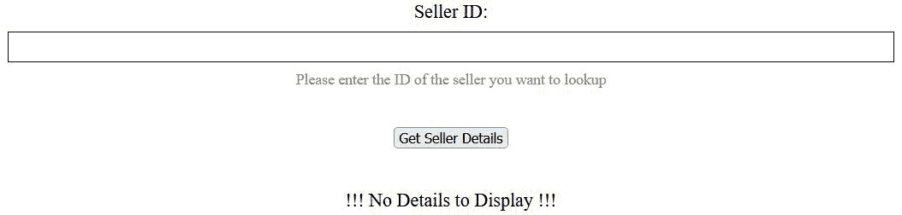

图 8.6 – 获取卖家页面

1.  接下来，在前面截图所示的输入字段中输入数字`1`，这与你数据库中第一个`Seller`的 ID 相关。然后，点击标有**获取卖家详情**的按钮。

1.  要见证正在发生的事情，在任何主要浏览器中，右键单击并选择在运行时发生的`console.log()`消息或错误。如果此操作成功，你应该会看到**!!! 无详细信息显示 !!!**的单词被请求的结果所替换，如图所示：

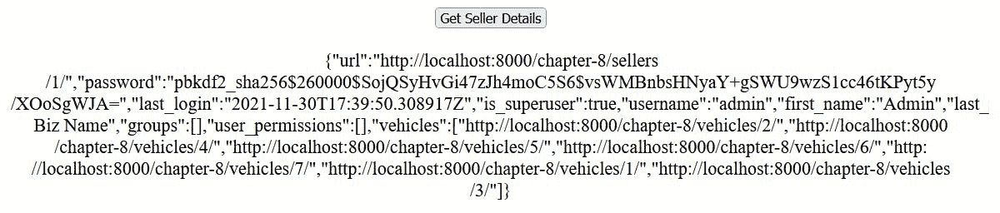

图 8.7 – 获取卖家结果 – JSON.stringify()

小贴士

你需要始终打开**网络**标签，以便将数据记录到该标签。打开此标签，然后刷新页面，以在执行这些操作时获得准确的结果。

1.  现在，再次查看网络标签，你应该会看到列表中显示了两个**/chapter-8/get-seller/**请求，如图所示：

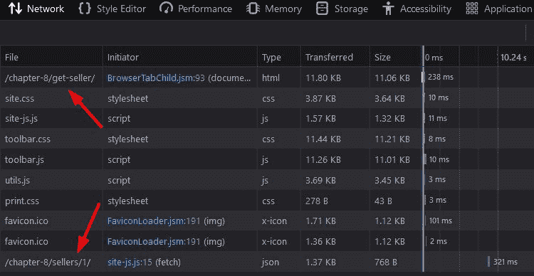

图 8.8 – 获取卖家页面 – 网络标签

列表顶部的第一个请求是由浏览器在用户首次加载 http://localhost:8000/chapter-8/get-seller/页面时发起的。第二个`site-js.js`文件，这是我们编写`$gotoSPA_Page()`函数的文件。最后一列显示了执行每个请求所需的时间。所有介于这些文件之间的文件都是其他应用在项目中使用的其他资产，例如 CSS 和 JavaScript 文件。

注意

如果你没有看到这些文件，无需担心；这仅仅意味着它们由于某种原因尚未加载。

1.  接下来，移除在`$gotoSPA_Page()`函数中使用的`JSON.stringify()`函数，只需使用`thisData`变量即可。然后，刷新此页面并再次执行查询。我们应该看到单个对象，如下所示：

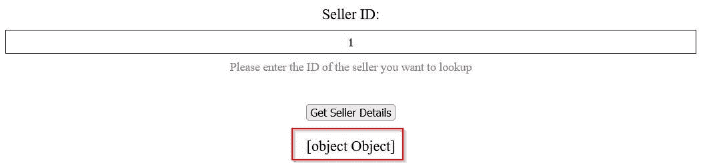

图 8.9 – 获取卖家结果 – 标准

1.  正是这里，我们可以看到为什么我们必须使用`JSON.stringify()`函数。没有这个函数，我们可以看到对象被描述为**[object Object]**，这并不很有帮助。

既然我们的 API 客户端已经启动并运行，让我们来探索如何返回渲染的 HTML 而不是返回的 JSON 对象的字符串表示。

# 编写自定义 API 端点

创建我们自己的 API 端点就像编写另一个 URL 模式一样简单。本节将教会我们如何编写自己的 API 端点并练习发送预格式化的 HTML 回客户端。您不需要创建所有自定义 API 端点来返回预格式化的 HTML，但我们将练习这样做。预格式化 HTML 只有在与您的 API 通信的应用程序在收到 HTML 后不需要以任何方式重新结构或重新样式化 HTML 时才能很好地工作。这意味着服务器/开发者需要确切地知道客户端将如何使用它接收到的数据。除了之前在`$gotoSPA_Page()`函数中已经写过的 JavaScript 之外，不再需要更多的 JavaScript。我们将重用那个相同的函数，并在继续之前只更改一两个东西。我们将创建一个新的视图类，并添加权限逻辑来保护该端点免受不受欢迎的用户访问 API。

让我们按照之前练习的顺序开始这个练习，从视图开始。

## 创建视图

按照以下步骤创建您的`APIView`类：

1.  在您的`/chapter_8/views.py`文件中，添加以下`import`语句：

    ```py
    # /becoming_a_django_entdev/chapter_8/views.py
    ...
    from django.shortcuts import render
    from ..chapter_3.models import ..., Seller
    from rest_framework.permissions import IsAuthenticated
    from rest_framework.views import APIView
    ...
    ```

1.  在同一个文件中，创建`GetSellerHTMLView`类和`get()`方法，如下所示：

    ```py
    # /becoming_a_django_entdev/chapter_8/views.py
    ...
    class GetSellerHTMLView(APIView):
        permission_classes = [IsAuthenticated]
        template_name = ‘chapter_8/details/seller.html’
        def get(self, request, format=None, id=0, *args, 
            **kwargs):
            if request.user.is_authenticated and 
                request.user.has_perm
                    (‘chapter_3.view_seller’):
                try:
                    seller = Seller.objects.get(id=id)
                except Seller.DoesNotExist:
                    seller = None
            else:
                seller = None
            context = {‘seller’: seller,}
            return render(
                request, 
                self.template_name, 
                context = context
            )
    ```

在这里，新的`GetSellerHTMLView`类模仿了我们之前练习中创建的`GetSellerView`类，但现在它使用的是 Django REST 框架提供的`APIView`类。我们只需要在这个类中指定`get()`方法即可；因为我们不处理表单对象，所以不需要`post()`方法。我们目前只创建一个处理`GET` API 方法的视图，用于查看/读取一个对象。我们将这个视图映射到的模板是`/chapter_8/templates/chapter_8/details/seller.html`文件，我们将在下一小节中创建它。我们需要将`id=0`传递给`get()`方法，正如前面代码中突出显示的那样，以期待我们如何编写这个 API 端点的 URL 模式。由于我们使用的是`APIView`类，我们必须在`get()`方法中显式设置`id=0`。如果你继承的是常规的`View`、`FormView`、`CreateView`、`UpdateView`或`DeleteView`类，你只需要写`id`，而不需要`=0`部分。同样适用于`format=None`参数，这个参数只有在与`APIView`类一起工作时才需要，而不是常规的`View`类。

这种方法依赖于用户登录到你的系统，通过使用`request.user`对象访问当前登录的用户。那些没有访问 Django 管理站点的组织外用户，将不得不使用授权令牌来登录，这将在本章后面讨论。尽管我们在*第三章*中更改了`AUTH_USER_MODEL`设置，使用`Seller`模型而不是 Django 的`User`模型，但我们仍然可以通过使用`request.user`在`request`对象中访问当前用户。你不需要使用`request.seller`；实际上，这将导致错误。当使用该用户的`is_authenticated`属性时，我们可以确定用户是否实际上已通过活动会话登录。

`has_perm()`方法用于检查该用户的权限。在这种情况下，我们使用`‘chapter_3.view_seller’`检查用户是否有对`Seller`模型对象的读取/查看权限。如果用户已认证并且具有正确的权限，我们将执行查询以查找由提供的 ID 指定的`Seller`对象。如果用户未认证，我们将设置`seller`变量为`None`，我们将在模板文件中使用它来比较它是否有值。

然后，`seller` 变量被传递到正在使用的模板的 `context` 中，这样我们就可以访问其数据。此外，我们需要将查询语句包裹在 `try`/`except` 块中，这是防止当用户搜索不存在的 `Seller` 时出现运行时错误所必需的。使用 `try`/`except` 块，我们可以将 `seller` 的值设置为 `None`，允许程序在没有错误的情况下继续运行。在模板中使用时，它将指示搜索没有返回任何内容。

我们正在使用 `django.shortcuts` 库提供的 `render()` 方法，而不是我们迄今为止一直在使用的 `TemplateResponse` 类。这是因为我们只想返回一小段 HTML，而不是整个 HTML 页面，页面可能包含所有可能的装饰。

现在我们已经创建了视图，接下来让我们构建使用该 `seller` 对象作为上下文的模板。

## 构建模板

按照以下步骤准备您的模板：

1.  在 `/chapter_8/templates/chapter_8/details/` 目录下创建一个名为 `seller.html` 的文件。

1.  在该文件中，添加以下代码：

    ```py
    # /becoming_a_django_entdev/chapter_8/templates/chapter_8/details/seller.html
    
    <h1>Seller Details</h1>
    
        <h2>{{ seller.first_name|safe }} {{ 
            seller.last_name|safe }}</h2>
        <h3>{{ seller.name|safe }}</h3>
        
            <ul>
                
                    <li>{{ vehicle.fullname }}</li>
                
            </ul>
        
    
        <p>
            <b>No Seller to Display</b><br />
            <em>or you <b>DO NOT</b> have permission</em>
        </p>
    
    ```

注意，我们在这个文件中并没有扩展任何其他模板。我们只是将简单的文本对象作为页面组件的一部分来显示，而不是整个页面。一个条件语句比较 `seller` 对象是否有值，使用 `` 语句。如果没有 `seller` 对象，将渲染显示消息 `seller` does exist，然后另一个条件语句比较 `seller` 是否有任何 `vehicles`，使用 `` 语句。如果 `vehicles` 存在，我们将使用 `` 语句遍历所有的车辆对象。非常重要的一点是，您需要在语句末尾添加 `.all`；否则，您将收到错误。这是在 Django 模板语言中访问单个对象中找到的任何嵌套对象列表的方法。我们使用在 *第三章* 中创建的 `fullname` 属性方法，*模型、关系和继承*，来打印车辆的全名作为一个 `<li>` HTML 节点对象。

现在我们有了模板，接下来让我们修改之前练习中创建的 `$gotoSPA_Page()` 函数。

## 修改 JavaScript

将现有 `$gotoSPA_Page()` 函数中的 `url` 变量更改为指向新的端点，我们将在下一小节中编写，即 `` `/chapter-8/seller/${id}/` ``，与之前练习中使用的复数 `sellers` 相比，这里是一个单数的 `seller`。

执行以下步骤来修改您的 JavaScript 函数。

在 `$gotoSPA_Page()` 函数中，进行以下突出显示的更改：

```py
# /becoming_a_django_entdev/chapter_8/static/chapter_8/js/site-js.js
```

```py
function $gotoSPA_Page() {
```

```py
    ...
```

```py
    var url = `/chapter-8/seller/${id}/`;
```

```py
    fetch(url, {
```

```py
        method: ‘GET’,
```

```py
        headers: {
```

```py
            ‘Content-Type’: ‘application/json’,
```

```py
    }}).then(async(response) => {
```

```py
        return await response.text();
```

```py
    }).then(async(data) => {
```

```py
        container.innerHTML = await data;
```

```py
    });
```

```py
}
```

在前面的代码中，我们仍然使用了`async`和`await`关键字，但你不需要这样做。`$gotoSPA_Page()`函数的前三个常量`container`、`input`和`id`保持不变，并由前面的省略号表示。

就这样；现在我们只需要创建一个 URL 模式，它将作为 API 端点被使用。

## 映射 URL 模式

执行以下步骤来映射你的 URL 模式。

在你的`/chapter_8/urls.py`文件中，添加以下突出显示的模式，保留我们之前编写的`get-seller`路径：

```py
# /becoming_a_django_entdev/chapter_8/urls.py
```

```py
from .views import (
```

```py
    ..., 
```

```py
    GetSellerView,
```

```py
    GetSellerHTMLView
```

```py
)
```

```py
...
```

```py
urlpatterns = [
```

```py
    ...
```

```py
    path(
```

```py
        ‘chapter-8/get-seller/’, 
```

```py
        GetSellerView.as_view(), 
```

```py
        name = ‘get-seller’
```

```py
    ),
```

```py
    path(
```

```py
        ‘chapter-8/seller/<int:id>/’, 
```

```py
        GetSellerHTMLView.as_view(), 
```

```py
        name = ‘seller-detail’
```

```py
    ),
```

```py
]
```

我们仍然需要第一个 URL 模式，因为它是触发 API 请求的页面，包含**获取卖家详情**按钮。

就这样。现在，让我们看看这个动作的实际效果。

## 第二个演示

为了演示这一动作，请按照以下步骤操作：

1.  确保你目前登录到`http://localhost:8000/admin/`的 Django 管理站点，使用你的超级用户账户。

1.  然后，导航到获取卖家页面`http://localhost:8000/chapter-8/get-seller/`，它应该与之前的*图 8.6*中的页面相同。

1.  在此页面的输入字段中输入数字`1`，然后点击此页面上的`details`容器，如图所示：

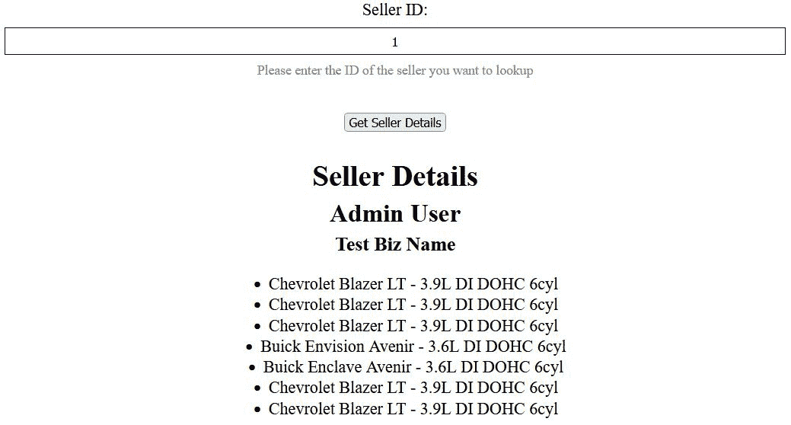

图 8.10 – 获取卖家页面 – 定制 API 端点

如果你打开了浏览器工具的网络标签页，你也会看到这个操作是在不重新加载或重定向你的页面的情况下完成的。你可以根据需要对其进行样式设置。在这个例子中，我们只是使用了简单的 HTML 节点，并进行了最小化的样式和格式化来演示这个练习。

1.  接下来，使用位于`http://localhost:8000/admin/chapter_3/seller/`的 Django 管理站点添加或创建一个新的超级用户账户。这也可以像我们在*第二章*的*项目配置*中做的那样，通过命令行完成。

1.  在不同的浏览器或隐身窗口中，使用你刚刚创建的新超级用户登录。

1.  接下来，导航到原始超级用户的编辑页面，位于`http://localhost:8000/admin/chapter_3/seller/1/change/`。这是用户名为`admin`且 ID 为`1`的用户。

1.  在此页面的**权限**部分，取消选中**超级用户状态**复选框，限制该用户执行任何操作。保留**激活**和**员工状态**复选框启用。确保**选择用户权限**框中没有选择，如图所示：

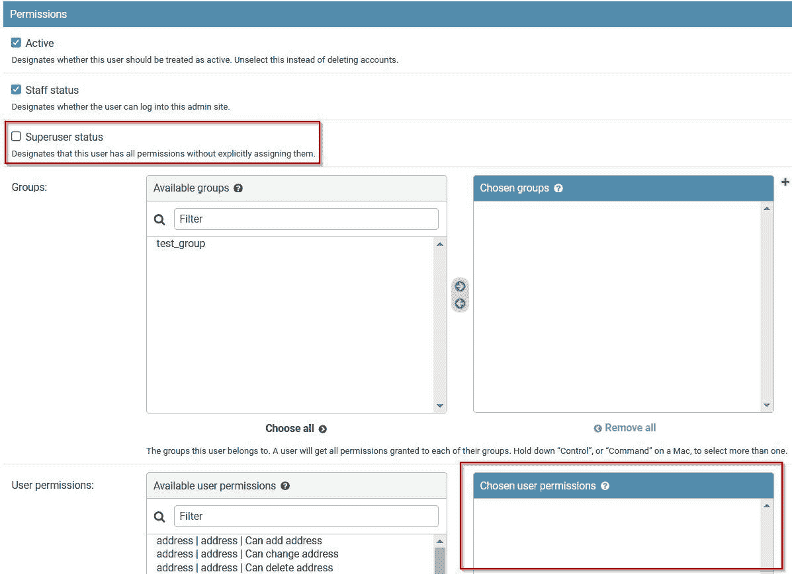

图 8.11 – 编辑超级用户权限

1.  在你的第一个浏览器中，你已以`Seller`身份登录，用户名为`admin`，请在不同的标签页中导航到`http://localhost:8000/chapter-8/get-seller/`，或者如果它仍然打开，请刷新现有标签页。

1.  在输入字段中输入数字 `1`，然后再次点击 **获取卖家详情** 按钮。它应该显示你没有权限，如以下截图所示：

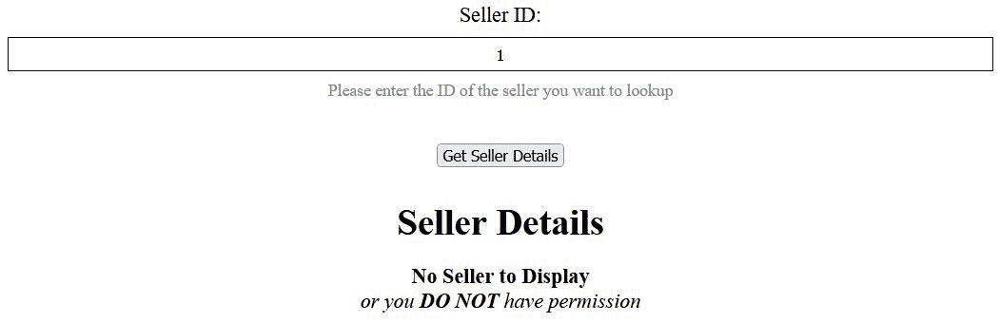

图 8.12 – 获取卖家页面 – 权限受限

1.  这是因为我们移除了该用户的原始权限。前面的消息是我们写在 `/chapter_8/details/seller.html` 模板中的 HTML，具体是在检查 `seller` 对象是否有值的条件。

1.  为了确保 `seller` 对象没有值是由于权限问题而不是由于不存在的查询，你可以在你的代码中写入 `print()` 语句来为你提供该指示器。回到另一个打开在 `http://localhost:8000/admin/chapter_3/seller/1/change/` 的浏览器窗口，你用为这次练习创建的新超级用户登录，并再次编辑 `admin` 用户。

1.  按照以下截图所示，给那个用户分配 **第三章 | 卖家 | 可以查看卖家** 权限：

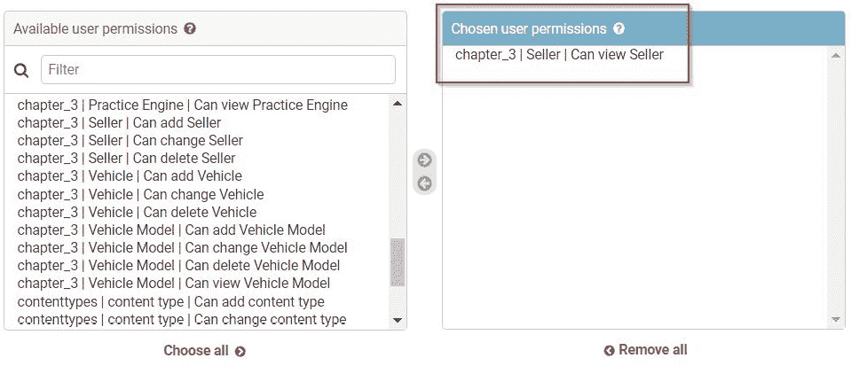

图 8.13 – 编辑超级用户权限 – 查看 Seller

通过这样做，我们给这个用户分配了我们正在 `GetSellerHTMLView` 类中检查的确切权限。记住在继续之前点击此页面的底部 **保存** 按钮。

1.  在你的第一个浏览器中，在 http://localhost:8000/chapter-8/get-seller/ 的获取卖家页面上，确保你仍然使用原始的 `admin` 用户登录，并再次点击 **获取卖家详情** 按钮。在这里，我们将看到与之前在 *图 8.9* 中看到相同的成果。

这个练习演示了如何使用 Django 模板语言来预格式化在 API `GET` 请求中返回的 HTML。正如我们在做这个练习时所发现的，我们实际上需要在执行此操作之前登录到该网站的 Django 管理站点。如果没有登录，这种方法将不起作用。这是通过在编辑用户时 **权限** 部分下的 **员工状态** 复选框控制的，它授予用户访问 Django 管理站点的权限。如果 **员工状态** 复选框未被勾选，则用户无法访问您的系统，因此将无法使用权限系统中的任何权限。

注意

将原始超级用户（用户名为 `admin`）的设置切换回原始状态，启用 **员工状态** 和 **超级用户状态** 复选框，并移除所有个人权限和组权限。确保这样做，并且在使用此用户登录之前完成此操作。

如果您需要构建一个不授予用户访问 Django 管理网站的 API，那么将需要认证令牌。在下一个练习中，我们将结合使用认证令牌和 Django REST 框架来完成这个任务。

# 使用令牌进行认证

在这个练习中，我们将把本章之前构建的 API 视为第三方提供的 API。假设您没有构建您的 API，我们将通过使用安全令牌来练习认证。除了我们在上一个练习中使用的单个模型权限之外，我们还将使用令牌安全。这将无论您是否授予用户访问 Django 管理网站都将执行。这也意味着我们将为这个练习创建一个新的用户/卖家，然后为了演示目的限制该用户对 Django 管理网站的访问。

我们将遵循与之前两个练习相同的步骤。

## 项目配置

在我们可以开始使用之前的步骤之前，这个练习需要在我们项目的 `settings.py` 文件中进行一些配置。

按照以下步骤配置您的项目：

1.  在您的 `settings.py` 文件中，将以下应用程序添加到您的 `INSTALLED_APPS` 列表中，以及 `REST_FRAMEWORK` 设置中突出显示的添加，如下所示：

    ```py
    # /becoming_a_django_entdev/settings.py
    INSTALLED_APPS = [
        ...
        ‘rest_framework’,
        ‘rest_framework.authtoken’,
    ]
    REST_FRAMEWORK = {
        ‘DEFAULT_AUTHENTICATION_CLASSES’: (
            ‘rest_framework.authentication.TokenAuthentication’,
            ‘rest_framework.authentication.SessionAuthentication’,
        ),
        ‘DEFAULT_PERMISSION_CLASSES’: [
            ‘rest_framework.permissions.
                DjangoModelPermissionsOrAnonReadOnly’
        ],
    }
    ```

`rest_framework.authtoken` 应用程序已经安装在了您的虚拟环境中，因此您不需要安装任何额外的 `pip` 包。它在安装 `djangorestframework` 包时是标准配置的一部分，但仅使用该框架所需的基本设置并不会在您的项目中启用。如果我们实际上打算使用它，我们必须将之前显示的两个认证类添加到 `REST_FRAMEWORK` 设置中，告诉 Django REST 框架使用所有 `APIView` 类进行令牌认证。这意味着我们将需要使用该 `APIView` 类创建的任何自定义端点以及本章之前使用 `router` 方法创建的所有端点。

使用 `router` 方法创建的端点都是使用 `APIView` 类构建的。添加 `SessionAuthentication` 类意味着我们将启用用户登录 Django 管理网站以使用 Browsable API 测试该端点的功能。如果没有它，您将看到一条消息表明您尚未认证。我们还将保留之前显示的 `DjangoModelPermissionsOrAnonReadOnly` 权限类，以继续检查模型级别的权限。

请确保您遵循正确的 Python 缩进。在之前显示的代码中，没有足够的空间来正确显示这一点。

1.  现在我们已经为这个项目添加了新的包到 `settings.py` 文件中，我们需要运行以下迁移命令：

    ```py
    (virtual_env) PS > python3 manage.py migrate
    ```

1.  接下来，确保你已使用 `admin` 用户登录 Django 管理站点，并导航到 `http://localhost:8000/admin/chapter_3/seller/add/`，以创建一个名为 `test` 的新用户/卖家。你可能已经有一个来自前几章的测试用户。如果是这样，只需删除该用户并重新创建它以供此练习使用。这次，不要勾选 **Staff status** 和 **Superuser status** 复选框。只给这个新用户一个权限，即之前使用的 **chapter_3 | Seller | Can view Seller** 权限。

1.  接下来，导航到 URL `http://localhost:8000/admin/authtoken/tokenproxy/` 并为刚刚创建的用户添加一个新的令牌。这也可以在命令行窗口或终端中通过执行以下命令来完成：

    ```py
    (virtual_env) PS > python manage.py drf_create_token test
    ```

1.  复制为该用户创建的令牌密钥，并将其保存以备后用，可以使用记事本或其他类似工具。

接下来，我们将按照与上次两个练习相同的顺序进行。

## 创建视图

现在，我们需要为这个练习创建一个新的视图类。它将被用于在将 API 视为他人为我们构建之前，我们添加到 API 中的一个新端点。此端点将仅返回标准 JSON 数据，而不会返回我们在上一个练习中练习过的预格式化 HTML。JSON 是 API 请求中传统上返回的内容。

按照以下步骤准备你的视图类：

1.  在你的 `/chapter_8/views.py` 文件中，添加以下高亮的 `import` 语句和 `GetSellerWithTokenView` 类：

    ```py
    # /becoming_a_django_entdev/chapter_8/views.py
    ...
    from django.http import JsonResponse
    from rest_framework.permissions import IsAuthenticated
    from rest_framework.views import APIView
    from .serializers import SellerSerializer
    from ..chapter_3.models import ..., Seller
    ...
    class GetSellerWithTokenView(APIView):
        permission_classes = [IsAuthenticated]
    ```

1.  在同一个 `GetSellerWithTokenView` 类中，添加以下 `get()` 方法和条件语句：

    ```py
    # /becoming_a_django_entdev/chapter_8/views.py
    ...
    class GetSellerWithTokenView(APIView):
        ...
        def get(self, request, format=None, id=0, *args,       
            **kwargs):
            seller = None
            req_user = request._user
            if req_user.has_perm(‘chapter_3.view_seller’):
                perm_granted = True
                try:
                    seller = Seller.objects.get(id=id)
                except Seller.DoesNotExist:
                    pass
            else:
                perm_granted = False
    ```

1.  在同一个 `get()` 方法中，在刚刚添加到该方法的以下 `context`、`serializer`、`new_context` 和 `return` 语句下方添加以下内容：

    ```py
    JsonResponse() object to return data as formatted JSON in your endpoint in this way, your endpoint will not be readily available in the Browsable API tool. If you wish for it to be accessible via that tool, use Response() instead. Keep in mind that it may alter the way developers work with the returned data.
    ```

在前面的类中，我们遵循了与上一个练习中编写的 `GetSellerHTMLView` 类相同的逻辑格式。我们添加了一个名为 `permission_classes` 的属性，它使用 `IsAuthenticated` 类。这是与令牌身份验证一起工作所需的。我们在 `get()` 方法中添加了一个额外的查询。这里的逻辑是我们使用在请求发送时添加到请求头部的两个项目，使用 `fetch()` JavaScript 函数。这两个头是 `HTTP_AUTHORIZATION` 和 `HTTP_USER`，我们很快将添加到我们的 JavaScript 函数中。

`request._user`项用于查找与该`request`关联的用户，无论该用户是否登录到 Django 管理站点，还是通过`HTTP_USER`头传递给请求，即为本练习创建的`test`用户，我们将将其与 API 请求关联。我们查找该用户以使用与之前练习中相同的`has_perm()`方法比较单个模型权限。如果找到 API 请求用户，则我们执行与之前相同的逻辑来检查该用户是否有权查看`seller`对象。这次，我们从那个条件语句中移除了`is_authenticated`属性，因为我们现在依赖于这个类的令牌认证。如果你授予了`test`用户查看`seller`对象的能力，逻辑将继续查找在输入字段中提供的 ID 的`seller`，与之前相同。如果你的`test`用户没有被授予查看`seller`对象的能力，那么`perm_granted`上下文项将返回`False`，以在返回给我们的数据中提供指示。

上下文被拆分为两个不同的项目，如*步骤 3*所示，因为在使用`SellerSerializer`时需要在该上下文中请求。然后，我们从最终返回的`JsonResponse()`中移除该请求。

## 构建模板

这个练习不需要一个新的模板。它将只返回 JSON，并且不遵循预格式化的 HTML 示例。

## 修改 JavaScript

我们将使用在*编写自定义 API 端点*部分下的*修改 JavaScript*子部分中提供的相同 JavaScript 示例。

执行以下步骤来修改你的 JavaScript 以完成这个练习。

在同一个 JavaScript 文件中，对现有的`$gotoSPA_Page()`函数进行以下突出显示的更改：

```py
# /becoming_a_django_entdev/chapter_8/static/chapter_8/js/site-js.js
```

```py
function $gotoSPA_Page() {
```

```py
    ...
```

```py
    var url = `/chapter-8/sellertoken/${id}/`;
```

```py
    fetch(url, {
```

```py
        method: ‘GET’,
```

```py
        headers: {
```

```py
            ‘Content-Type’: ‘application/json’,
```

```py
            ‘Authorization’: ‘Token your_token’,
```

```py
            ‘User’: ‘test’
```

```py
    }}).then(async(response) => {
```

```py
        return await response.text();
```

```py
    }).then(async(data) => {
```

```py
        container.innerHTML = await data;
```

```py
    });
```

```py
}
```

在这个例子中，我们保留了前三个常量`container`、`input`和`id`，它们与之前示例中的写法相同，并由前面的三个点符号表示。我们将`url`变量更改为指向我们将要创建的新路径，即`` `/chapter-8/sellertoken/${id}/` ``。`fetch()`函数的其余部分与之前相同，我们返回的结果是预格式化的 HTML 而不是 JSON。唯一不同的是，我们向这个请求的`headers`中添加了`‘Authorization’`和`‘User’`项。`‘Authorization’`项的值是创建的令牌的值，即你之前被要求复制的那个；将此粘贴到之前显示的`your_token`的位置。`‘User’`项的值是新用户/卖家的用户名，即分配给你要提供的令牌的用户。

注意

标记*永远*不应该保存在 JavaScript 文件中，就像前面示例中所做的那样。为什么在前面示例中这样做的原因在练习末尾的*第三演示*子部分中提供了解释。

## 映射 URL 模式

我们几乎完成了！我们只需要将我们正在通信的端点映射到我们新的视图类。

按照以下步骤映射你的 URL 模式。

在你的 `/chapter_8/urls.py` 文件中，添加以下路径。你可以保留已经创建的其他路径，如图所示：

```py
# /becoming_a_django_entdev/chapter_8/urls.py
```

```py
from .views import ..., GetSellerView, GetSellerHTMLView, 
```

```py
    GetSellerWithTokenView
```

```py
...
```

```py
urlpatterns = [
```

```py
    ...
```

```py
    path(
```

```py
        ‘chapter-8/get-seller/’, 
```

```py
        GetSellerView.as_view(), 
```

```py
        name = ‘get-seller’
```

```py
    ),
```

```py
    path(
```

```py
        ‘chapter-8/seller/<int:id>/’, 
```

```py
        GetSellerHTMLView.as_view(), 
```

```py
        name = ‘seller-detail’
```

```py
    ),
```

```py
    path(
```

```py
        ‘chapter-8/sellertoken/<int:id>/’, 
```

```py
        GetSellerWithTokenView.as_view(),
```

```py
        name = ‘seller-token-detail’
```

```py
    ),
```

```py
]
```

就这些了；让我们接下来演示这段代码的实际应用。

## 第三次演示

按照以下步骤查看实际效果：

1.  打开一个新的无痕窗口，并导航到 `http://localhost:8000/chapter-8/get-seller/`。我要求你打开无痕窗口是为了确保你在这次测试运行中未以任何用户登录到 Django 管理站点。你也可以导航到 `http://localhost:8000/admin/` 来双重检查，确保你没有登录。

1.  接下来，在输入字段中输入数字 `1`，并点击 JSON 格式的 `seller` 数据，包括我们传递的额外 `perm_granted` 上下文，如下截图所示：

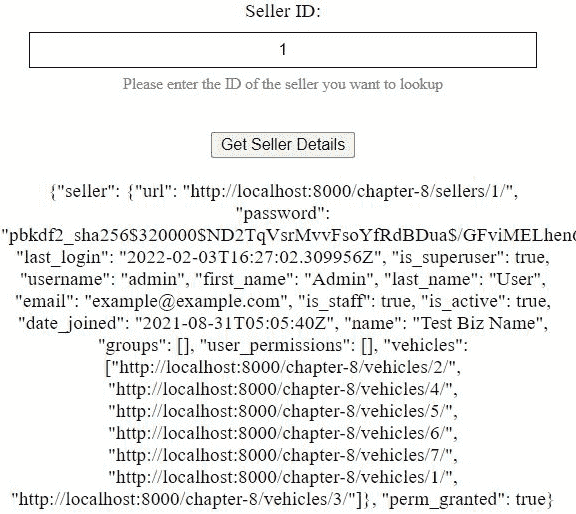

图 8.14 – 获取卖家页面 – 带令牌认证的自定义 API 端点

你也可以在你的代码中添加 `print()` 语句来验证每个条件是否实际满足。本书代码中已包含额外的 `print()` 语句和提供详细信息的注释。

注意

如果你正在你的序列化器中继承 `HyperlinkedModelSerializer` 类，你将在前一个示例中看到超链接车辆。如果你仍然使用 `ModelSerializer` 类，则只会显示数字 ID。

1.  如果你没有成功或者你在 JavaScript 文件中输入了错误的令牌，那么你将看到一个 `fetch()` 函数，再次将 `1` 输入到输入字段中，并点击 **获取卖家详情** 按钮。无效令牌消息应该看起来像以下截图所示：

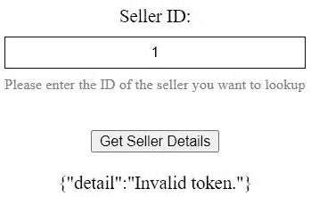

图 8.15 – 获取卖家页面 – 无效令牌

重要提示

在现实世界的例子中，如果使用`requests`包，则不应将令牌直接保存在 JavaScript 文件或 Python 文件中。相反，您应考虑创建一个额外的 API 端点，该端点使用内置的令牌生成器`obtain_auth_token`，如本节所述：[`www.django-rest-framework.org/api-guide/authentication/#generating-tokens`](https://www.django-rest-framework.org/api-guide/authentication/#generating-tokens)。令牌生成器通过接受附加在第一个 API 请求头部的用户名和密码来工作，然后返回一个新创建的令牌。然后，使用从第一个请求中接收到的令牌附加到第二个请求的头部来执行所需的操作。Django REST 框架将执行剩余的工作，使用提供的凭据来验证该请求。本练习中提供的示例仅用于演示在收到令牌后如何执行请求。生成令牌的方法需要使用和了解信号，这超出了本书的范围。

如果使用前述信息框中提到的双请求方法，现在您可以允许第三方应用的开发者与您的 API 通信，而无需创建用户账户。然而，您仍然可以在系统中为该第三方用户创建一个用户，以便继续使用本练习中一直使用的细粒度权限级别。您采取的路径取决于您项目的需求。

# 摘要

本章中提供的示例展示了构建和使用您新创建的 API 的简单方法，以多种方式！如果您想给您的应用带来类似 SPA（单页应用）的感觉，最简单的实现方式是使用纯 JavaScript 的`fetch()`函数或 jQuery 的`ajax()`函数。您不必使用这两个函数中的任何一个来编写自己的操作，而可以考虑使用基于 JavaScript 的框架，例如 React、AngularJS 或 Vue.js，仅举几个例子。基于 JavaScript 的框架可以在客户端格式化和样式化您的 HTML。本章提供的基于模板的方法之一还展示了如何将这项工作从客户端转移到服务器端。这为您提供了在构建和使用 API 方面的众多工具。

我们还学习了如何处理认证令牌，并发现我们可以在服务器端格式化 HTML 时仍然使用令牌。然而，在实站上完全实现这种方法之前，需要了解 Django 的更多高级主题和安全措施。Django REST 框架旨在成为 API 的后端，并设计为与团队确定的任何前端一起工作。

在下一章中，我们将探讨如何测试我们的项目并确保所编写的代码确实能够工作。为了做到这一点，我们将学习如何编写自动化测试脚本，然后安装一个新的包，该包提供了更多的工具，以及学习如何使用这些工具。
