# 第一章：启动 MyMDB

我们将构建的第一个项目是一个基本的**互联网电影数据库**（**IMDB**）克隆，名为**我的电影数据库（MyMDB）**，使用 Django 2.0 编写，我们将使用 Docker 部署。我们的 IMDB 克隆将有以下两种类型的用户：用户和管理员。用户将能够对电影进行评分，添加电影图片，并查看电影和演员阵容。管理员将能够添加电影、演员、作家和导演。

在本章中，我们将做以下事情：

+   创建我们的新 Django 项目 MyMDB，一个 IMDB 克隆

+   创建一个 Django 应用程序并创建我们的第一个模型、视图和模板

+   了解并使用我们模型中的各种字段，并在模型之间创建关系

该项目的代码可在以下网址在线获取：[`github.com/tomaratyn/MyMDB`](https://github.com/tomaratyn/MyMDB)。

最后，我们将能够在我们的项目中添加电影、人物和角色，并让用户在易于定制的 HTML 模板中查看它们。

# 启动我的电影数据库（MyMDB）

首先，让我们为我们的项目创建一个目录：

```py
$ mkdir MyMDB
$ cd MyMDB
```

我们所有未来的命令和路径都将相对于这个项目目录。

# 启动项目

一个 Django 项目由多个 Django 应用程序组成。Django 应用程序可以来自许多不同的地方：

+   Django 本身（例如，`django.contrib.admin`，管理后台应用程序）

+   安装 Python 包（例如，`django-rest-framework`，一个从 Django 模型创建 REST API 的框架）

+   作为项目的一部分（我们将要编写的代码）

通常，一个项目会使用前面三个选项的混合。

# 安装 Django

我们将使用`pip`安装 Django，Python 的首选包管理器，并在`requirements.dev.txt`文件中跟踪我们安装的包：

```py
django<2.1
psycopg2<2.8
```

现在，让我们安装这些包：

```py
$ pip install -r requirements.dev.txt
```

# 创建项目

安装了 Django 后，我们有了`django-admin`命令行工具，可以用它来生成我们的项目：

```py
$ django-admin startproject config
$ tree config/
config/
├── config
│   ├── __init__.py
│   ├── settings.py
│   ├── urls.py
│   └── wsgi.py
└── manage.py
```

`settings.py`文件的父级称为`config`，因为我们将项目命名为`config`而不是`mymdb`。然而，让顶级目录继续被称为`config`是令人困惑的，所以让我们将其重命名为`django`（一个项目可能会包含许多不同类型的代码；再次称呼 Django 代码的父级目录为`django`，可以让人清楚地知道）：

```py
$ mv config django 
$ tree .
.
├── django
│   ├── config
│   │   ├── __init__.py
│   │   ├── settings.py
│   │   ├── urls.py
│   │   └── wsgi.py
│   └── manage.py
└── requirements.dev.txt

2 directories, 6 files
```

让我们仔细看看其中一些文件：

+   `settings.py`：这是 Django 默认存储应用程序所有配置的地方。在缺少`DJANGO_SETTINGS`环境变量的情况下，Django 默认在这里查找设置。

+   `urls.py`：这是整个项目的根`URLConf`。你的 Web 应用程序收到的每个请求都将被路由到这个文件内匹配路径的第一个视图（或`urls.py`引用的文件）。

+   `wsgi.py`：**Web Server Gateway Interface**（**WSGI**）是 Python 和 Web 服务器之间的接口。你不会经常接触到这个文件，但这是你的 Web 服务器和 Python 代码知道如何相互通信的方式。我们将在第五章中引用它，*使用 Docker 部署*。

+   `manage.py`：这是进行非代码更改的命令中心。无论是创建数据库迁移、运行测试，还是启动开发服务器，我们经常会使用这个文件。

请注意，缺少的是`django`目录不是 Python 模块。里面没有`__init__.py`文件，也不应该有。如果添加了一个，许多东西将会出错，因为我们希望添加的 Django 应用程序是顶级 Python 模块。

# 配置数据库设置

默认情况下，Django 创建一个将使用 SQLite 的项目，但这对于生产来说是不可用的，所以我们将遵循在开发和生产中使用相同数据库的最佳实践。

让我们打开`django/config/settings.py`并更新它以使用我们的 Postgres 服务器。找到`settings.py`中以`DATABASES`开头的行。默认情况下，它看起来像这样：

```py
DATABASES = {
  'default': {
 'ENGINE': 'django.db.backends.sqlite3',
     'NAME': os.path.join(BASE_DIR, 'db.sqlite3'),  }
}
```

要使用 Postgres，请将上述代码更改为以下代码：

```py
DATABASES = {
    'default': {
 'ENGINE': 'django.db.backends.postgresql',
        'NAME': 'mymdb',
        'USER': 'mymdb',
        'PASSWORD': 'development',
        'HOST': '127.0.0.1',
        'PORT': '5432',    }
}
```

如果您以前连接过数据库，大部分内容都会很熟悉，但让我们回顾一下：

+   `DATABASES = {`: 这是数据库连接信息的字典常量，并且是 Django 所必需的。您可以连接到不同数据库的多个连接，但大部分时间，您只需要一个名为`default`的条目。

+   `'default': {`: 这是默认的数据库连接配置。您应该始终具有一组`default`连接设置。除非另有说明（在本书中我们不会），否则这是您将要使用的连接。

+   `'ENGINE': 'django.db.backends.postgresql '`: 这告诉 Django 使用 Postgres 后端。这反过来使用`psycopg2`，Python 的 Postgres 库。

+   `'NAME': 'mymdb',`: 您想要连接的数据库的名称。

+   `‘USER': 'mymdb',`: 您的连接用户名。

+   `‘PASSWORD': 'development',`: 您的数据库用户的密码。

+   `‘HOST': '127.0.0.1’,`: 您要连接的数据库服务器的地址。

+   `‘PORT': '5432',`: 您要连接的端口。

# 核心应用程序

Django 应用程序遵循**模型视图模板**（**MVT**）模式；在这种模式中，我们将注意以下事项：

+   **模型**负责从数据库保存和检索数据

+   **视图**负责处理 HTTP 请求，启动模型上的操作，并返回 HTTP 响应

+   **模板**负责响应主体的外观

在 Django 项目中，您可以拥有任意数量的应用程序。理想情况下，每个应用程序应该具有像任何其他 Python 模块一样紧密范围和自包含的功能，但在项目开始时，很难知道复杂性将出现在哪里。这就是为什么我发现从`core`应用程序开始很有用。然后，当我注意到特定主题周围存在复杂性集群时（比如说，在我们的项目中，如果我们在那里取得进展，演员可能会变得意外复杂），那么我们可以将其重构为自己的紧密范围的应用程序。其他时候，很明显一个站点有自包含的组件（例如，管理后端），并且很容易从多个应用程序开始。

# 制作核心应用程序

要创建一个新的 Django 应用程序，我们首先必须使用`manage.py`创建应用程序，然后将其添加到`INSTALLED_APPS`列表中：

```py
$ cd django
$ python manage.py startapp core
$ ls
config      core        manage.py
$tree core
core
├─  472; __init__.py
├── admin.py
├── apps.py
├── migrations
│   └── __init__.py
├── models.py
├── tests.py
└── views.py

1 directory, 7 files
```

让我们更仔细地看看核心内部有什么：

+   `core/__init__.py`: 核心不仅是一个目录，还是一个 Python 模块。

+   `admin.py`: 这是我们将在其中使用内置管理后端注册我们的模型。我们将在*电影管理*部分进行描述。

+   `apps.py`: 大部分时间，您会将其保持不变。这是您将在其中放置任何在注册应用程序时需要运行的代码的地方，如果您正在制作可重用的 Django 应用程序（例如，您想要上传到 PyPi 的软件包）。

+   `migrations`: 这是一个带有数据库迁移的 Python 模块。数据库迁移描述了如何从一个已知状态迁移数据库到另一个状态。使用 Django，如果您添加了一个模型，您只需使用`manage.py`生成并运行迁移，您可以在本章后面的*迁移数据库*部分中看到。

+   `models.py`: 这是用于模型的。

+   `tests.py`: 这是用于测试的。

+   `views.py`: 这是用于视图的。

# 安装我们的应用程序

现在我们的核心应用程序存在了，让我们通过将其添加到`settings.py`文件中的已安装应用程序列表中，让 Django 意识到它。您的`settings.py`应该有一行看起来像这样的：

```py
INSTALLED_APPS = [
    'django.contrib.admin',
    'django.contrib.auth',
    'django.contrib.contenttypes',
    'django.contrib.sessions',
    'django.contrib.messages',
    'django.contrib.staticfiles',
]
```

`INSTALLED_APPS`是 Django 应用程序的 Python 模块的 Python 路径列表。我们已经安装了用于解决常见问题的应用程序，例如管理静态文件、会话和身份验证以及管理后端，因为 Django 的 Batteries Included 哲学。

让我们将我们的`core`应用程序添加到列表的顶部：

```py
INSTALLED_APPS = [
    'core',
    'django.contrib.admin',
    'django.contrib.auth',
    'django.contrib.contenttypes',
    'django.contrib.sessions',
    'django.contrib.messages',
    'django.contrib.staticfiles',
]
```

# 添加我们的第一个模型 - 电影

现在我们可以添加我们的第一个模型，即电影。

Django 模型是从`Model`派生的类，具有一个或多个`Fields`。在数据库术语中，`Model`类对应于数据库表，`Field`类对应于列，`Model`的实例对应于行。使用像 Django 这样的 ORM，让我们利用 Python 和 Django 编写表达性的类，而不是在 Python 中编写我们的模型，然后再在 SQL 中编写一次。

让我们编辑`django/core/models.py`来添加一个`Movie`模型：

```py
from django.db import models

class Movie(models.Model):
    NOT_RATED = 0
    RATED_G = 1
    RATED_PG = 2
    RATED_R = 3
    RATINGS = (
        (NOT_RATED, 'NR - Not Rated'),
        (RATED_G,
         'G - General Audiences'),
        (RATED_PG,
         'PG - Parental Guidance '
         'Suggested'),
        (RATED_R, 'R - Restricted'),
    )

    title = models.CharField(
        max_length=140)
    plot = models.TextField()
    year = models.PositiveIntegerField()
    rating = models.IntegerField(
        choices=RATINGS,
        default=NOT_RATED)
    runtime = \
        models.PositiveIntegerField()
    website = models.URLField(
        blank=True)

    def __str__(self):
        return '{} ({})'.format(
            self.title, self.year)
```

`Movie`派生自`models.Model`，这是所有 Django 模型的基类。接下来，有一系列描述评级的常量；我们将在查看`rating`字段时再看一下，但首先让我们看看其他字段：

+   `title = models.CharField(max_length=140)`: 这将成为一个长度为 140 的`varchar`列。数据库通常要求`varchar`列的最大大小，因此 Django 也要求。

+   `plot = models.TextField()`: 这将成为我们数据库中的一个`text`列，它没有最大长度要求。这使得它更适合可以有一段（甚至一页）文本的字段。

+   `year = models.PositiveIntegerField()`: 这将成为一个`integer`列，并且 Django 将在保存之前验证该值，以确保在保存时它是`0`或更高。

+   `rating = models.IntegerField(choices=RATINGS, default=NOT_RATED)`: 这是一个更复杂的字段。Django 将知道这将是一个`integer`列。可选参数`choices`（对于所有`Fields`都可用，不仅仅是`IntegerField`）接受一个值/显示对的可迭代对象（列表或元组）。对中的第一个元素是可以存储在数据库中的有效值，第二个是该值的人性化版本。Django 还将在我们的模型中添加一个名为`get_rating_display()`的实例方法，它将返回与存储在我们的模型中的值匹配的第二个元素。任何不匹配`choices`中的值的内容在保存时都将是一个`ValidationError`。`default`参数在创建模型时提供默认值。

+   `runtime = models.PositiveIntegerField()`: 这与`year`字段相同。

+   `website = models.URLField(blank=True)`: 大多数数据库没有本机 URL 列类型，但数据驱动的 Web 应用程序通常需要存储它们。`URLField`默认情况下是一个`varchar(200)`字段（可以通过提供`max_length`参数来设置）。`URLField`还带有验证，检查其值是否为有效的 Web（`http`/`https`/`ftp`/`ftps`）URL。`blank`参数由`admin`应用程序用于知道是否需要值（它不影响数据库）。

我们的模型还有一个`__str__(self)`方法，这是一种最佳实践，有助于 Django 将模型转换为字符串。Django 在管理 UI 和我们自己的调试中都会这样做。

Django 的 ORM 自动添加了一个自增的`id`列，因此我们不必在所有模型上重复。这是 Django 的**不要重复自己**（DRY）哲学的一个简单例子。随着我们的学习，我们将看更多的例子。

# 迁移数据库

现在我们有了一个模型，我们需要在数据库中创建一个与之匹配的表。我们将使用 Django 为我们生成一个迁移，然后运行迁移来为我们的电影模型创建一个表。

虽然 Django 可以为我们的 Django 应用程序创建和运行迁移，但它不会为我们的 Django 项目创建数据库和数据库用户。要创建数据库和用户，我们必须使用管理员帐户连接到服务器。连接后，我们可以通过执行以下 SQL 来创建数据库和用户：

```py
CREATE DATABASE mymdb;
CREATE USER mymdb;
GRANT ALL ON DATABASE mymdb to "mymdb";
ALTER USER mymdb PASSWORD 'development';
ALTER USER mymdb CREATEDB;
```

上述 SQL 语句将为我们的 Django 项目创建数据库和用户。`GRANT`语句确保我们的 mymdb 用户将能够访问数据库。然后，我们在`mymdb`用户上设置密码（确保与您的`settings.py`文件中的密码相同）。最后，我们授予`mymdb`用户创建新数据库的权限，这将在运行测试时由 Django 用于创建测试数据库。

要为我们的应用程序生成迁移，我们需要告诉`manage.py`文件执行以下操作：

```py
$ cd django
$ python manage.py makemigrations core
Migrations for 'core':
  core/migrations/0001_initial.py
    - Create model Movie
```

`迁移`是我们 Django 应用程序中的一个 Python 文件，描述了如何将数据库更改为所需的状态。Django 迁移不绑定到特定的数据库系统（相同的迁移将适用于支持的数据库，除非*我们*添加特定于数据库的代码）。Django 生成使用 Django 的迁移 API 的迁移文件，我们不会在本书中研究它，但知道它存在是有用的。

请记住，有迁移的是*应用程序*而不是*项目*（因为有*模型*的是*应用程序*）。

接下来，我们告诉`manage.py`迁移我们的应用程序：

```py
$ python manage.py migrate core 
Operations to perform:
  Apply all migrations: core
Running migrations:
  Applying core.0001_initial... OK
```

现在，我们的数据库中存在我们的表：

```py
$ python manage.py dbshell
psql (9.6.1, server 9.6.3)
Type "help" for help.

mymdb=> \dt
             List of relations
 Schema |       Name        | Type  | Owner 
--------+-------------------+-------+-------
 public | core_movie        | table | mymdb
 public | django_migrations | table | mymdb
(2 rows)

mymdb=> \q
```

我们可以看到我们的数据库有两个表。Django 模型表的默认命名方案是`<app_name>_<model_name>`。我们可以看出`core_movie`是`core`应用程序的`Movie`模型的表。`django_migrations`是 Django 内部用于跟踪已应用的迁移的表。直接修改`django_migrations`表而不使用`manage.py`是一个坏主意，这将在尝试应用或回滚迁移时导致问题。

迁移命令也可以在不指定应用程序的情况下运行，在这种情况下，它将在所有应用程序上运行。让我们在没有应用程序的情况下运行`migrate`命令：

```py
$ python manage.py migrate 
Operations to perform:
  Apply all migrations: admin, auth, contenttypes, core, sessions
Running migrations:
  Applying contenttypes.0001_initial... OK
  Applying auth.0001_initial... OK
  Applying admin.0001_initial... OK
  Applying admin.0002_logentry_remove_auto_add... OK
  Applying contenttypes.0002_remove_content_type_name... OK
  Applying auth.0002_alter_permission_name_max_length... OK
  Applying auth.0003_alter_user_email_max_length... OK
  Applying auth.0004_alter_user_username_opts... OK
  Applying auth.0005_alter_user_last_login_null... OK
  Applying auth.0006_require_contenttypes_0002... OK
  Applying auth.0007_alter_validators_add_error_messages... OK
  Applying auth.0008_alter_user_username_max_length... OK
  Applying sessions.0001_initial... OK
```

这将创建用于跟踪用户、会话、权限和管理后端的表。

# 创建我们的第一个电影

与 Python 一样，Django 提供了一个交互式 REPL 来尝试一些东西。Django shell 完全连接到数据库，因此我们可以在 shell 中创建、查询、更新和删除模型：

```py
$ cd django
$ python manage.py shell
Python 3.4.6 (default, Aug  4 2017, 15:21:32) 
[GCC 4.2.1 Compatible Apple LLVM 8.1.0 (clang-802.0.42)] on darwin
Type "help", "copyright", "credits" or "license" for more information.
(InteractiveConsole)
>>> from core.models import Movie
>>> sleuth = Movie.objects.create(
... title='Sleuth',
... plot='An snobbish writer who loves games'
... ' invites his wife\'s lover for a battle of wits.',
... year=1972,
... runtime=138,
... )
>>> sleuth.id
1
>>> sleuth.get_rating_display()
'NR - Not Rated'
```

在前面的 Django shell 会话中，请注意我们没有创建的`Movie`的许多属性：

+   `objects`是模型的默认管理器。管理器是查询模型表的接口。它还提供了一个`create()`方法来创建和保存实例。每个模型必须至少有一个管理器，Django 提供了一个默认管理器。通常建议创建一个自定义管理器；我们将在*添加人员和模型关系*部分中看到这一点。

+   `id`是此实例的行的主键。如前一步骤中所述，Django 会自动创建它。

+   `get_rating_display()`是 Django 添加的一个方法，因为`rating`字段给定了一个`choices`元组。我们在`create()`调用中没有为`rating`提供值，因为`rating`字段有一个`default`值（`0`）。`get_rating_display()`方法查找该值并返回相应的显示值。Django 将为具有`choices`参数的每个`Field`属性生成这样的方法。

接下来，让我们使用 Django Admin 应用程序创建一个管理电影的后端。

# 创建电影管理

能够快速生成后端 UI 让用户在项目的其余部分仍在开发中时开始构建项目的内容。这是一个很好的功能，可以帮助并行化进度并避免重复和乏味的任务（读取/更新视图共享许多功能）。提供这种功能是 Django“电池包含”哲学的另一个例子。

为了使 Django 的管理应用程序与我们的模型一起工作，我们将执行以下步骤：

1.  注册我们的模型

1.  创建一个可以访问后端的超级用户

1.  运行开发服务器

1.  在浏览器中访问后端

让我们通过编辑`django/core/admin.py`来注册我们的`Movie`模型，如下所示：

```py
from django.contrib import admin

from core.models import Movie

admin.site.register(Movie)
```

现在我们的模型已注册！

现在让我们创建一个可以使用`manage.py`访问后端的用户：

```py
$ cd django
$ python manage.py createsuperuser 
Username (leave blank to use 'tomaratyn'): 
Email address: tom@aratyn.nam
Password: 
Password (again): 
Superuser created successfully.
```

Django 附带了一个**开发服务器**，可以为我们的应用提供服务，但不适合生产：

```py
$ python manage.py runserver
Performing system checks...

System check identified no issues (0 silenced).
September 12, 2017 - 20:31:54
Django version 1.11.5, using settings 'config.settings'
Starting development server at http://127.0.0.1:8000/
Quit the server with CONTROL-C.
```

还可以在浏览器中打开它，导航到`http://localhost:8000/`：

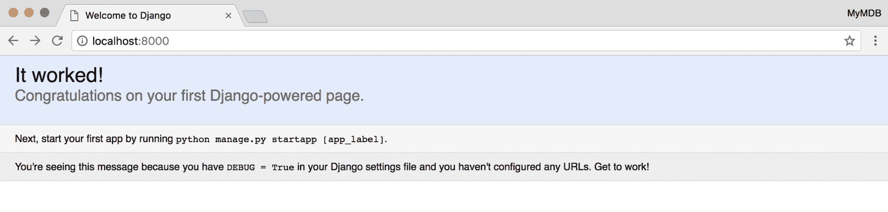

要访问管理后端，请转到`http://localhost:8000/admin`：

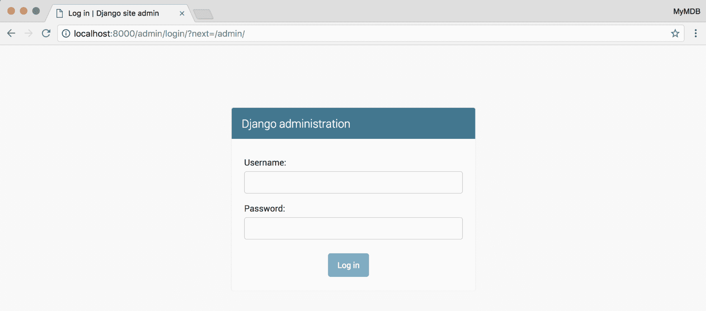

一旦使用凭据登录，我们必须管理用户和电影：

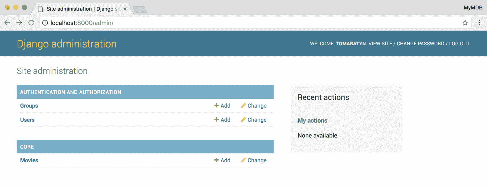

点击 MOVIES 将显示我们的电影列表：

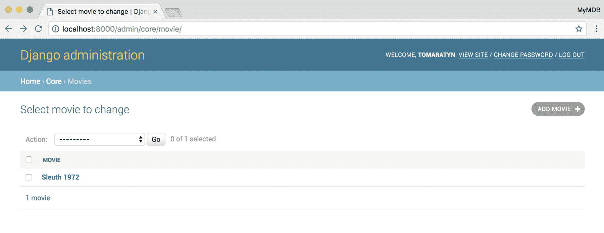

请注意，链接的标题是我们的`Movie.__str__`方法的结果。点击它将为您提供一个 UI 来编辑电影：

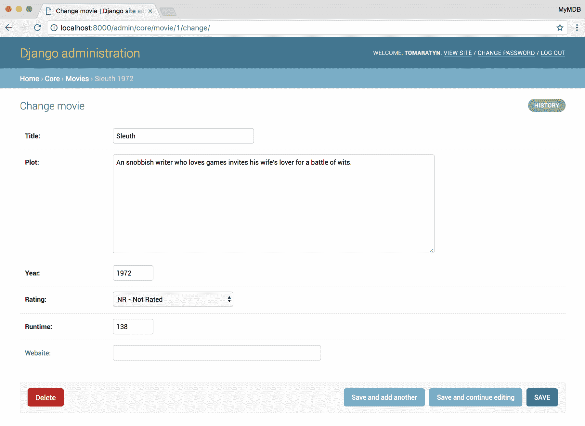

在主管理屏幕和电影列表屏幕上，您可以找到添加新电影的链接。让我们添加一个新电影：

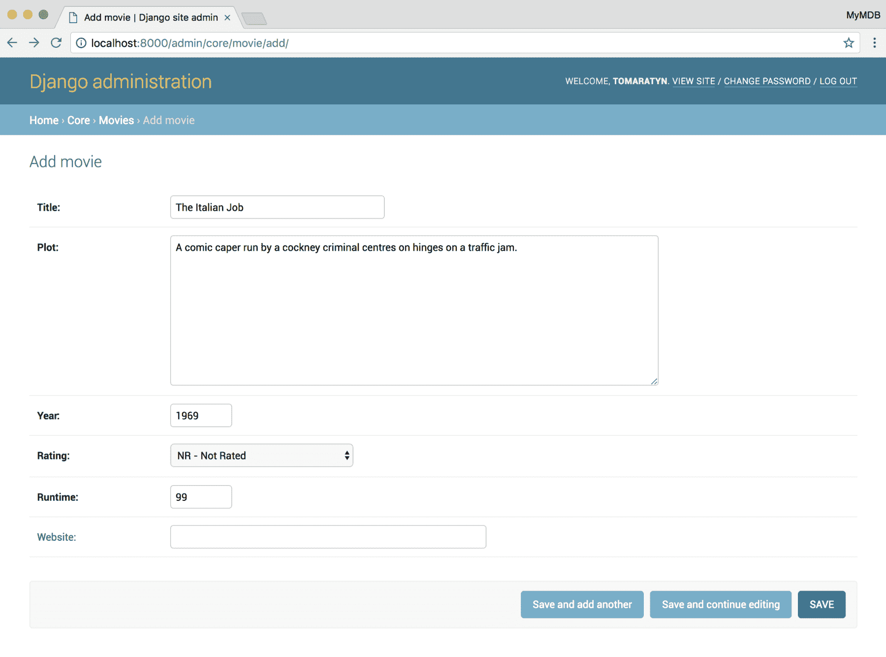

现在，我们的电影列表显示了所有电影：

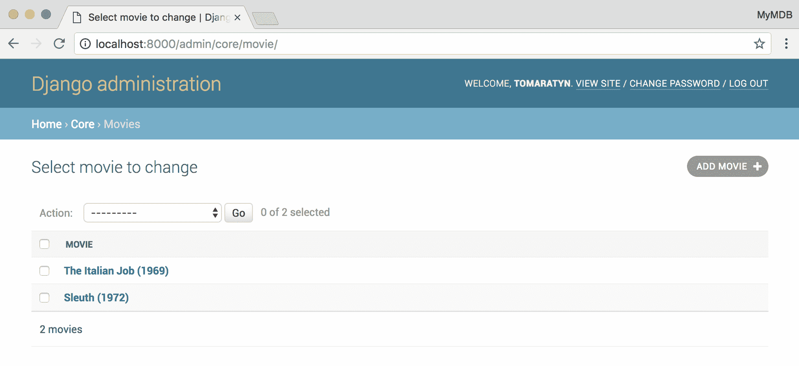

现在我们有了一种让团队填充电影数据库的方法，让我们开始为用户编写视图。

# 创建 MovieList 视图

当 Django 收到请求时，它使用请求的路径和项目的`URLConf`来匹配请求和视图，后者返回 HTTP 响应。Django 的视图可以是函数，通常称为**基于函数的视图**（**FBVs**），也可以是类，通常称为**基于类的视图**（**CBVs**）。CBVs 的优势在于 Django 附带了丰富的通用视图套件，您可以对其进行子类化，以轻松（几乎是声明性地）编写视图以完成常见任务。

让我们编写一个视图来列出我们拥有的电影。打开`django/core/views.py`并将其更改为以下内容：

```py
from django.views.generic import ListView

from core.models import Movie

class MovieList(ListView):
    model = Movie
```

`ListView`至少需要一个`model`属性。它将查询该模型的所有行，将其传递给模板，并返回渲染后的模板响应。它还提供了许多我们可以使用的钩子来替换默认行为，这些都有完整的文档记录。

`ListView`如何知道如何查询`Movie`中的所有对象？为此，我们需要讨论管理器和`QuerySet`类。每个模型都有一个默认管理器。管理器类主要用于通过提供方法（例如`all()`）来查询对象，返回`QuerySet`。`QuerySet`类是 Django 对数据库查询的表示。`QuerySet`有许多方法，包括`filter()`（例如`SELECT`语句中的`WHERE`子句）来限制结果。`QuerySet`类的一个很好的特性是它是惰性的；直到我们尝试从`QuerySet`中获取模型时，它才会被评估。另一个很好的特性是`filter()`等方法采用*查找表达式*，可以是字段名称或跨关系模型。我们将在整个项目中都这样做。

所有管理器类都有一个`all()`方法，应返回一个未经过滤的`Queryset`，相当于编写`SELECT * FROM core_movie;`。

那么，`ListView`如何知道它必须查询`Movie`中的所有对象？`ListView`检查它是否有`model`属性，如果有，它知道`Model`类具有默认管理器，带有`all()`方法，它会调用该方法。`ListView`还为我们提供了放置模板的约定，如下所示：`<app_name>/<model_name>_list.html`。

# 添加我们的第一个模板 - movie_list.html

Django 附带了自己的模板语言，称为**Django 模板语言**。Django 还可以使用其他模板语言（例如 Jinja2），但大多数 Django 项目发现使用 Django 模板语言是高效和方便的。

在我们的`settings.py`文件中生成的默认配置中，Django 模板语言配置为使用`APP_DIRS`，这意味着每个 Django 应用程序都可以有一个`templates`目录，该目录将被搜索以找到模板。这可以用来覆盖其他应用程序使用的模板，而无需修改第三方应用程序本身。

让我们在`django/core/templates/core/movie_list.html`中创建我们的第一个模板：

```py
<!DOCTYPE html>
<html>
  <body>
    <ul>
      
        <li>{{ movie }}</li>
      
        <li>
          No movies yet.
        </li>
      
    </ul>
    <p>
      Using https? 
      {{ request.is_secure|yesno }}
    </p>
  </body>
</html>
```

Django 模板是标准的 HTML（或者您希望使用的任何文本格式），其中包含变量（例如我们的示例中的`object_list`）和标签（例如我们的示例中的`for`）。变量将通过用`{{ }}`括起来来评估为字符串。过滤器可以用来在打印之前帮助格式化或修改变量（例如`yesno`）。我们还可以创建自定义标签和过滤器。

Django 文档中提供了完整的过滤器和标签列表（[`docs.djangoproject.com/en/2.0/ref/templates/builtins/`](https://docs.djangoproject.com/en/2.0/ref/templates/builtins/)）。

Django 模板语言在`settings.py`的`TEMPLATES`变量中进行配置。`DjangoTemplates`后端可以使用很多`OPTIONS`。在*开发*中，添加`'string_if_invalid': 'INVALID_VALUE',`可能会有所帮助。每当 Django 无法将模板中的变量匹配到变量或标签时，它将打印出`INVALID_VALUE`，这样更容易捕捉拼写错误。请记住，不要在*生产*中使用此设置。完整的选项列表可以在 Django 的文档中找到（[`docs.djangoproject.com/en/dev/topics/templates/#django.template.backends.django.DjangoTemplates`](https://docs.djangoproject.com/en/dev/topics/templates/#django.template.backends.django.DjangoTemplates)）。

最后一步将是将我们的视图连接到一个`URLConf`。

# 使用 URLConf 将请求路由到我们的视图

现在我们有了模型、视图和模板，我们需要告诉 Django 应该将哪些请求路由到我们的`MovieList`视图使用 URLConf。每个新项目都有一个由 Django 创建的根 URLConf（在我们的情况下是`django/config/urls.py`文件）。Django 开发人员已经形成了每个应用程序都有自己的 URLConf 的最佳实践。然后，项目的根 URLConf 将使用`include()`函数包含每个应用程序的 URLConf。

让我们通过创建一个`django/core/urls.py`文件并使用以下代码来为我们的`core`应用程序创建一个 URLConf：

```py
from django.urls import path

from . import views

app_name = 'core'
urlpatterns = [
    path('movies',
         views.MovieList.as_view(),
         name='MovieList'),
]
```

在其最简单的形式中，URLConf 是一个带有`urlpatterns`属性的模块，其中包含一系列`path`。`path`由描述路径的字符串和可调用对象组成。CBV 不是可调用的，因此基本的`View`类有一个静态的`as_view()`方法来*返回*一个可调用对象。FBV 可以直接作为回调传递（不需要`()`运算符，这会执行它们）。

每个`path()`都应该被命名，这是一个有用的最佳实践，当我们需要在模板中引用该路径时。由于一个 URLConf 可以被另一个 URLConf 包含，我们可能不知道我们的视图的完整路径。Django 提供了`reverse()`函数和`url`模板标签，可以从名称转到视图的完整路径。

`app_name`变量设置了这个`URLConf`所属的应用程序。这样，我们可以引用一个命名的`path`，而不会让 Django 混淆其他应用程序具有相同名称的`path`（例如，`index`是一个非常常见的名称，所以我们可以说`appA:index`和`appB:index`来区分它们）。

最后，让我们通过将`django/config/urls.py`更改为以下内容来将我们的`URLConf`连接到根`URLConf`：

```py
from django.urls import path, include
from django.contrib import admin

import core.urls

urlpatterns = [
    path('admin/', admin.site.urls),
    path('', include(
        core.urls, namespace='core')),
]
```

这个文件看起来很像我们之前的`URLConf`文件，只是我们的`path()`对象不是取一个视图，而是`include()`函数的结果。`include()`函数让我们可以用一个路径前缀整个`URLConf`并给它一个自定义的命名空间。

命名空间让我们区分`path`名称，就像`app_name`属性一样，但不需要修改应用程序（例如，第三方应用程序）。

您可能会想为什么我们使用`include()`而 Django 管理网站使用`property`？`include()`和`admin.site.urls`都返回格式类似的 3 元组。但是，您应该使用`include()`，而不是记住 3 元组的每个部分应该具有什么。

# 运行开发服务器

Django 现在知道如何将请求路由到我们的 View，View 知道需要显示哪些模型以及要呈现哪个模板。我们可以告诉`manage.py`启动我们的开发服务器并查看我们的结果：

```py
$ cd django
$ python manage.py runserver
```

在我们的浏览器中，转到`http://127.0.0.1:8000/movies`：

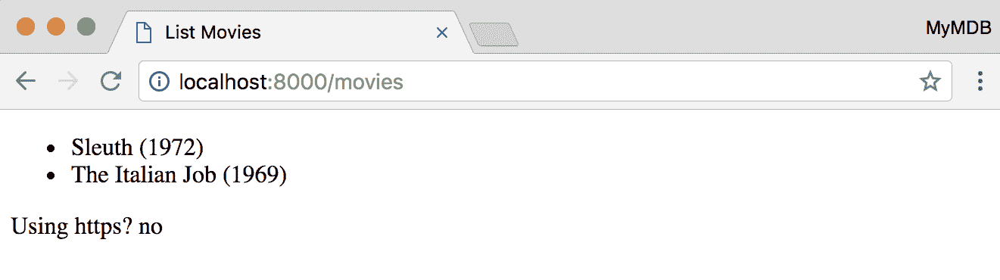

干得好！我们制作了我们的第一个页面！

在这一部分，我们创建了我们的第一个模型，生成并运行了它的迁移，并创建了一个视图和模板，以便用户可以浏览它。

现在，让我们为每部电影添加一个页面。

# 单独的电影页面

现在我们有了项目布局，我们可以更快地移动。我们已经在跟踪每部电影的信息。让我们创建一个视图来显示这些信息。

要添加电影详细信息，我们需要做以下事情：

1.  创建`MovieDetail`视图

1.  创建`movie_detail.html`模板

1.  在我们的`URLConf`中引用`MovieDetail`视图

# 创建 MovieDetail 视图

就像 Django 为我们提供了一个`ListView`类来执行列出模型的所有常见任务一样，Django 还提供了一个`DetailView`类，我们可以子类化以创建显示单个`Model`详细信息的视图。

让我们在`django/core/views.py`中创建我们的视图：

```py
from django.views.generic import (
    ListView, DetailView,
)
from core.models import Movie

class MovieDetail(DetailView):
    model = Movie

class MovieList(ListView):
    model = Movie
```

`DetailView`要求`path()`对象在`path`字符串中包含`pk`或`slug`，以便`DetailView`可以将该值传递给`QuerySet`以查询特定的模型实例。**slug**是一个短的、URL 友好的标签，通常在内容丰富的网站中使用，因为它对 SEO 友好。

# 创建 movie_detail.html 模板

现在我们有了 View，让我们制作我们的模板。

Django 的模板语言支持模板继承，这意味着您可以编写一个包含网站外观和感觉的模板，并标记其他模板将覆盖的`block`部分。这使我们能够创建整个网站的外观和感觉，而无需编辑每个模板。让我们使用这个功能创建一个具有 MyMDB 品牌和外观的基本模板，然后添加一个从基本模板继承的电影详细信息模板。

基本模板不应该与特定的应用程序绑定，因此让我们创建一个通用的模板目录：

```py
$ mkdir django/templates
```

Django 还不知道如何检查我们的`templates`目录，因此我们需要更新`settings.py`文件中的配置。找到以`TEMPLATES`开头的行，并更改配置以在`DIRS`列表中列出我们的`templates`目录：

```py
TEMPLATES = [
    {
        'BACKEND': 'django.template.backends.django.DjangoTemplates',
        'DIRS': [
            os.path.join(BASE_DIR, 'templates'),
        ],
        'APP_DIRS': True,
        'OPTIONS': {
            # omittted for brevity
        },
    },
]
```

我们唯一做的改变是将我们的新`templates`目录添加到`DIRS`键下的列表中。我们避免使用 Python 的`os.path.join()`函数和已配置的`BASE_DIR`来将路径硬编码到我们的`templates`目录。`BASE_DIR`在运行时设置为项目的路径。我们不需要添加`django/core/templates`，因为`APP_DIRS`设置告诉 Django 检查每个应用程序的`templates`目录。

虽然`settings.py`是一个非常方便的 Python 文件，我们可以在其中使用`os.path.join`和所有 Python 的功能，但要小心不要太聪明。`settings.py`需要易于阅读和理解。没有什么比不得不调试你的`settings.py`更糟糕的了。

让我们在`django/templates/base.html`中创建一个基本模板，其中有一个主列和侧边栏：

```py
<!DOCTYPE html>
<html lang="en" >
<head >
  <meta charset="UTF-8" >
  <meta
    name="viewport"
    content="width=device-width, initial-scale=1, shrink-to-fit=no"
  >
  <link
    href="https://maxcdn.bootstrapcdn.com/bootstrap/4.0.0-beta/css/bootstrap.min.css"
    integrity="sha384-/Y6pD6FV/Vv2HJnA6t+vslU6fwYXjCFtcEpHbNJ0lyAFsXTsjBbfaDjzALeQsN6M"
    rel="stylesheet"
    crossorigin="anonymous"
  >
  <title >
    MyMDB
  </title>
  <style>
    .mymdb-masthead {
      background-color: #EEEEEE;
      margin-bottom: 1em;
    }
  </style>

</head >
<body >
<div class="mymdb-masthead">
  <div class="container">
    <nav class="nav">
      <div class="navbar-brand">MyMDB</div>
      <a
        class="nav-link"
        href=""
      >
        Movies
      </a>
    </nav>
  </div>
</div>

<div class="container">
  <div class="row">
    <div class="col-sm-8 mymdb-main">
     
    </div>
    <div
        class="col-sm-3 offset-sm-1 mymdb-sidebar"
    >
      
    </div>
  </div>
</div>

</body >
</html >
```

这个 HTML 的大部分实际上是 bootstrap（HTML/CSS 框架）样板，但我们有一些新的 Django 标签：

+   `MyMDB`：这创建了一个其他模板可以替换的块。如果未替换该块，则将使用父模板中的内容。

+   `href=""`：`url`标签将为命名的`path`生成 URL 路径。URL 名称应该被引用为`<app_namespace>:<name>`；在我们的情况下，`core`是核心应用程序的命名空间（在`django/core/urls.py`中），而`MovieList`是`MovieList`视图的 URL 的名称。

这样我们就可以在`django/core/templates/core/movie_detail.html`中创建一个简单的模板：

```py



  {{ object.title }} - {{ block.super }}



<h1>{{ object }}</h1>
<p class="lead">
{{ object.plot }}
</p>



<div>
This movie is rated:
  <span class="badge badge-primary">
  {{ object.get_rating_display }}
  </span>
</div>

```

这个模板的 HTML 要少得多，因为`base.html`已经有了。`MovieDetail.html`所要做的就是为`base.html`定义的块提供值。让我们来看看一些新标签：

+   ``：如果一个模板想要扩展另一个模板，第一行必须是一个`extends`标签。Django 将寻找基本模板（它可以扩展另一个模板）并首先执行它，然后替换块。一个扩展另一个的模板不能在`block`之外有内容，因为不清楚将内容放在哪里。

+   `{{ object.title }} - {{ block.super }}`：我们在`title`模板`block`中引用`block.super`。`block.super`返回基本模板中`title`模板`block`的内容。

+   `{{ object.get_rating_display }}`：Django 模板语言不使用`()`来执行方法，只需通过名称引用它即可执行该方法。

# 将 MovieDetail 添加到 core.urls.py

最后，我们将`MovieDetail`视图添加到`core/urls.py`：

```py
from django.urls import path

from . import views

urlpatterns = [
    path('movies',
         views.MovieList.as_view(),
         name='MovieList'),
    path('movie/<int:pk>',
         views.MovieDetail.as_view(),
         name='MovieDetail'),
]
```

`MovieDetail`和`MovieList`的`path()`调用几乎看起来一样，只是`MovieDetail`字符串有一个命名参数。`path`路由字符串可以包括尖括号，给参数一个名称（例如，`<pk>`），甚至定义参数的内容必须符合的类型（例如，`<int:pk>`只匹配解析为`int`的值）。这些命名部分被 Django 捕获并按名称传递给视图。`DetailView`期望一个`pk`（或`slug`）参数，并使用它从数据库中获取正确的行。

让我们使用`python manage.py runserver`来启动`dev`服务器，看看我们的新模板是什么样子的：

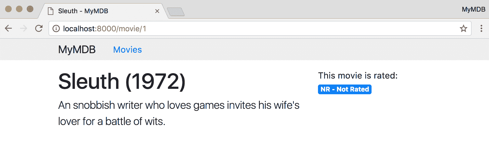

# 快速回顾本节

在本节中，我们创建了一个新视图`MovieDetail`，学习了模板继承，以及如何将参数从 URL 路径传递给我们的视图。

接下来，我们将为我们的`MovieList`视图添加分页，以防止每次查询整个数据库。

# 分页和将电影列表链接到电影详情

在这一部分，我们将更新我们的电影列表，为每部电影提供一个链接，并进行分页，以防止我们的整个数据库被倾倒到一个页面上。

# 更新 MovieList.html 以扩展 base.html

我们原来的`MovieList.html`是一个相当简陋的事情。让我们使用我们的`base.html`模板和它提供的 bootstrap CSS 来更新它，使它看起来更好看：

```py



All The Movies



<ul>
  
    <li>
      <a href="">
        {{ movie }}
      </a>
    </li>
  
  </ul>

```

我们还看到`url`标签与命名参数`pk`一起使用，因为`MovieDetail` URL 需要一个`pk`参数。如果没有提供参数，那么 Django 在渲染时会引发`NoReverseMatch`异常，导致`500`错误。

让我们来看看它是什么样子的：

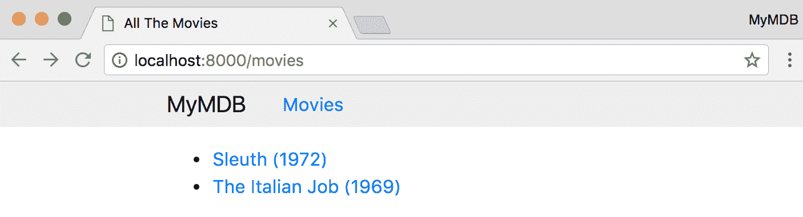

# 设置订单

我们当前视图的另一个问题是它没有排序。如果数据库返回的是无序查询，那么分页就无法帮助导航。而且，每次用户更改页面时，内容都不一致，因为数据库可能会返回一个不同顺序的结果集。我们需要我们的查询有一致的顺序。

对我们的模型进行排序也可以让开发人员的生活更轻松。无论是使用调试器、编写测试，还是运行 shell，确保我们的模型以一致的顺序返回可以使故障排除变得更简单。

Django 模型可以选择具有一个名为`Meta`的内部类，它让我们指定有关模型的信息。让我们添加一个带有`ordering`属性的`Meta`类：

```py
class Movie(models.Model):
   # constants and fields omitted for brevity 

    class Meta:
        ordering = ('-year', 'title')

    def __str__(self):
        return '{} ({})'.format(
            self.title, self.year)
```

`ordering`接受一个列表或元组，通常是字段名称的字符串，可选地以`-`字符为前缀，表示降序。`('-year', 'title')`相当于 SQL 子句`ORDER BY year DESC, title`。

将`ordering`添加到模型的`Meta`类中意味着来自模型管理器的`QuerySets`将被排序。

# 添加分页

现在我们的电影总是以相同的方式排序，让我们添加分页。Django 的`ListView`已经内置了对分页的支持，所以我们只需要利用它。**分页**由控制要显示的页面的`GET`参数`page`控制。

让我们在我们的`main`模板`block`底部添加分页：

```py

 <ul >
    
      <li >
        <a href="" >
          {{ movie }}
        </a >
      </li >
    
  </ul >
  
    <nav >
      <ul class="pagination" >
        <li class="page-item" >
          <a
            href="?page=1"
            class="page-link"
          >
            First
          </a >
        </li >
        
          <li class="page-item" >
            <a
              href="?page={{ page_obj.previous_page_number }}"
              class="page-link"
            >
              {{ page_obj.previous_page_number }}
            </a >
          </li >
        
        <li class="page-item active" >
          <a
            href="?page={{ page_obj.number }}"
            class="page-link"
          >
            {{ page_obj.number }}
          </a >
        </li >
        
          <li class="page-item" >
            <a
              href="?page={{ page_obj.next_page_number }}"
              class="page-link"
            >
              {{ page_obj.next_page_number }}
            </a >
          </li >
        
        <li class="page-item" >
          <a
              href="?page=last"
              class="page-link"
          >
            Last
          </a >
        </li >
      </ul >
    </nav >
  

```

让我们看一下我们的`MovieList`模板的一些重要点：

+   `page_obj`是`Page`类型，知道有关此结果页面的信息。我们使用它来检查是否有下一页/上一页，使用`has_next()`/`has_previous()`（在 Django 模板语言中，我们不需要在`()`中放置`()`，但`has_next()`是一个方法，而不是属性）。我们还使用它来获取`next_page_number()`/`previous_page_number()`。请注意，在检索下一页/上一页数字之前使用`has_*()`方法检查其存在性非常重要。如果在检索时它们不存在，`Page`会抛出`EmptyPage`异常。

+   `object_list`仍然可用并保存正确的值。即使`page_obj`封装了此页面的结果在`page_obj.object_list`中，`ListView`也方便地确保我们可以继续使用`object_list`，而我们的模板不会中断。

我们现在有分页功能了！

# 404-当事物丢失时

现在我们有一些视图，如果在 URL 中给出错误的值（错误的`pk`将破坏`MovieDetail`；错误的`page`将破坏`MovieList`），它们将无法正常运行；让我们通过处理`404`错误来解决这个问题。Django 在根 URLConf 中提供了一个钩子，让我们可以使用自定义视图来处理`404`错误（也适用于`403`、`400`和`500`，都遵循相同的命名方案）。在您的根`urls.py`文件中，添加一个名为`handler404`的变量，其值是指向您自定义视图的 Python 路径的字符串。

但是，我们可以继续使用默认的`404`处理程序视图，并只编写一个自定义模板。让我们在`django/templates/404.html`中添加一个`404`模板：

```py



Not Found



<h1>Not Found</h1>
<p>Sorry that reel has gone missing.</p>

```

即使另一个应用程序抛出`404`错误，也将使用此模板。

目前，如果您有一个未使用的 URL，例如`http://localhost:8000/not-a-real-page`，您将看不到我们的自定义 404 模板，因为 Django 的`settings.py`中的`DEBUG`设置为`True`。要使我们的 404 模板可见，我们需要更改`settings.py`中的`DEBUG`和`ALLOWED_HOSTS`设置：

```py
DEBUG = False

ALLOWED_HOSTS = [
    'localhost',
    '127.0.0.1'
]
```

`ALLOWED_HOSTS`是一个设置，限制 Django 将响应的 HTTP 请求中的`HOST`值。如果`DEBUG`为`False`，并且`HOST`不匹配`ALLOWED_HOSTS`值，则 Django 将返回`400`错误（您可以根据前面的代码自定义此错误的视图和模板）。这是一项保护我们的安全功能，将在我们的安全章节中更多地讨论。

现在我们的项目已配置好，让我们运行 Django 开发服务器：

```py
$ cd django
$ python manage.py runserver
```

运行时，我们可以使用我们的网络浏览器打开[`localhost:8000/not-a-real-page`](http://localhost:8000/not-a-real-page)。我们的结果应该是这样的：

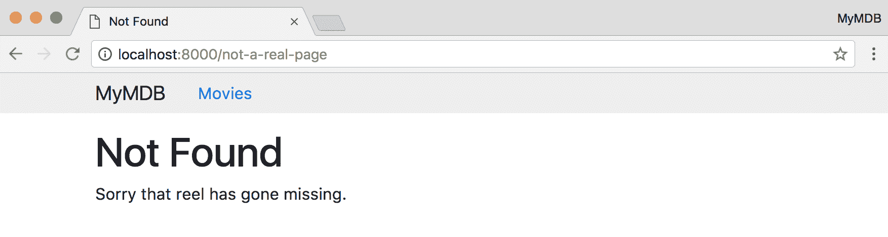

# 测试我们的视图和模板

由于我们现在在`MoveList`模板中有一些逻辑，让我们写一些测试。我们将在第八章 *测试 Answerly*中更多地讨论测试。但是，基础知识很简单，遵循常见的 XUnit 模式，即`TestCase`类包含进行断言的测试方法。

对于 Django 的`TestRunner`来找到一个测试，它必须在已安装应用的`tests`模块中。现在，这意味着`tests.py`，但是，最终，您可能希望切换到一个目录 Python 模块（在这种情况下，为了让`TestRunner`找到它们，为您的测试文件名加上`test`前缀）。

让我们添加一个执行以下功能的测试：

+   如果有超过 10 部电影，那么分页控件应该在模板中呈现

+   如果有超过 10 部电影，而我们没有提供`page` `GET`参数，请考虑以下事项：

+   `page_is_last`上下文变量应该是`False`

+   `page_is_first`上下文变量应该是`True`

+   分页中的第一项应该被标记为活动状态

以下是我们的`tests.py`文件：

```py
from django.test import TestCase
from django.test.client import \
    RequestFactory
from django.urls.base import reverse

from core.models import Movie
from core.views import MovieList

class MovieListPaginationTestCase(TestCase):

    ACTIVE_PAGINATION_HTML = """
    <li class="page-item active">
      <a href="{}?page={}" class="page-link">{}</a>
    </li>
    """

    def setUp(self):
        for n in range(15):
            Movie.objects.create(
                title='Title {}'.format(n),
                year=1990 + n,
                runtime=100,
            )

    def testFirstPage(self):
        movie_list_path = reverse('core:MovieList')
        request = RequestFactory().get(path=movie_list_path)
        response = MovieList.as_view()(request)
        self.assertEqual(200, response.status_code)
        self.assertTrue(response.context_data['is_paginated'])
        self.assertInHTML(
            self.ACTIVE_PAGINATION_HTML.format(
                movie_list_path, 1, 1),
            response.rendered_content)
```

让我们看一些有趣的地方：

+   `class MovieListPaginationTestCase(TestCase)`: `TestCase`是所有 Django 测试的基类。它内置了许多便利功能，包括许多方便的断言方法。

+   `def setUp(self)`: 像大多数 XUnit 测试框架一样，Django 的`TestCase`类提供了一个在每个测试之前运行的`setUp()`钩子。如果需要，还可以使用`tearDown()`钩子。在每个测试之间清理数据库，因此我们不需要担心删除任何我们添加的模型。

+   `def testFirstPage(self):`: 如果方法的名称以`test`开头，那么它就是一个测试方法。

+   `movie_list_path = reverse('core:MovieList')`: `reverse()`之前提到过，它是`url` Django 模板标签的 Python 等价物。它将解析名称为路径。

+   `request = RequestFactory().get(path=movie_list_path)`: `RequestFactory`是一个方便的工厂，用于创建虚拟的 HTTP 请求。`RequestFactory`具有创建`GET`、`POST`和`PUT`请求的便利方法，这些方法以动词命名（例如，`get()`用于`GET`请求）。在我们的情况下，提供的`path`对象并不重要，但其他视图可能希望检查请求的路径。

+   `self.assertEqual(200, response.status_code)`: 这断言两个参数是否相等。检查响应的`status_code`以检查成功或失败（`200`是成功的状态代码——在浏览网页时从不会看到的代码）。

+   `self.assertTrue(response.context_data['is_paginated'])`：这断言该参数评估为`True`。`response`公开了在渲染模板中使用的上下文。这使得查找错误变得更容易，因为您可以快速检查在渲染中使用的实际值。

+   `self.assertInHTML(`: `assertInHTML`是 Django 提供的许多便利方法之一，作为其**一揽子**哲学的一部分。给定一个有效的 HTML 字符串`needle`和有效的 HTML 字符串`haystack`，它将断言`needle`是否在`haystack`中。这两个字符串需要是有效的 HTML，因为 Django 将解析它们并检查一个是否在另一个中。您不需要担心间距或属性/类的顺序。当您尝试确保模板正常工作时，这是一个非常方便的断言。

要运行测试，我们可以使用`manage.py`：

```py
$ cd django
$ python manage.py test 
Creating test database for alias 'default'...
System check identified no issues (0 silenced).
.
----------------------------------------------------------------------
Ran 1 test in 0.035s

OK
Destroying test database for alias 'default'...
```

最后，我们可以确信我们已经正确地实现了分页。

# 添加人物和模型关系

在本节中，我们将在项目中为模型添加关系。人物与电影的关系可以创建一个复杂的数据模型。同一个人可以是演员、作家和导演（例如，*The Apostle*（1997）由 Robert Duvall 编写、导演和主演）。即使忽略了工作人员和制作团队并简化了一些，数据模型将涉及使用`ForiengKey`字段的一对多关系，使用`ManyToManyField`的多对多关系，以及使用`ManyToManyField`中的`through`类添加关于多对多关系的额外信息的类。

在本节中，我们将逐步执行以下操作：

1.  创建一个`Person`模型

1.  从`Movie`到`Person`添加一个`ForeignKey`字段以跟踪导演

1.  从`Movie`到`Person`添加一个`ManyToManyField`来跟踪编剧

1.  添加一个带有`through`类（`Actor`）的`ManyToManyField`来跟踪谁在电影中扮演了什么角色

1.  创建迁移

1.  将导演、编剧和演员添加到电影详情模板

1.  为列表添加一个`PersonDetail`视图，指示一个人导演了哪些电影，写了哪些电影，以及在哪些电影中表演了

# 添加具有关系的模型

首先，我们需要一个`Person`类来描述和存储参与电影的人：

```py
class Person(models.Model):
    first_name = models.CharField(
        max_length=140)
    last_name = models.CharField(
        max_length=140)
    born = models.DateField()
    died = models.DateField(null=True,
                            blank=True)

    class Meta:
        ordering = (
            'last_name', 'first_name')

    def __str__(self):
        if self.died:
            return '{}, {} ({}-{})'.format(
                self.last_name,
                self.first_name,
                self.born,
                self.died)
        return '{}, {} ({})'.format(
                self.last_name,
                self.first_name,
                self.born)
```

在`Person`中，我们还看到了一个新字段（`DateField`）和字段的一个新参数（`null`）。

`DateField`用于跟踪基于日期的数据，使用数据库上的适当列类型（Postgres 上的`date`）和 Python 中的`datetime.date`。Django 还提供了`DateTimeField`来存储日期和时间。

所有字段都支持`null`参数（默认为`False`），它指示列是否应该接受`NULL` SQL 值（在 Python 中表示为`None`）。我们将`died`标记为支持`null`，以便我们可以记录人是活着还是死了。然后，在`__str__()`方法中，如果某人是活着的或死了，我们打印出不同的字符串表示。

现在我们有了`Person`模型，它可以与`Movies`有各种关系。

# 不同类型的关系字段

Django 的 ORM 支持映射模型之间的关系的字段，包括一对多、多对多和带有中间模型的多对多。

当两个模型有一对多的关系时，我们使用`ForeignKey`字段，它将在两个表之间创建一个带有**外键**（**FK**）约束的列（假设有数据库支持）。在没有`ForeignKey`字段的模型中，Django 将自动添加`RelatedManager`对象作为实例属性。`RelatedManager`类使得在关系中查询对象更容易。我们将在以下部分看一些例子。

当两个模型有多对多的关系时，它们中的一个（但不是两者）可以得到`ManyToManyField()`；Django 将在另一侧为你创建一个`RelatedManager`。正如你可能知道的，关系数据库实际上不能在两个表之间有多对多的关系。相反，关系数据库需要一个*桥接*表，其中包含到每个相关表的外键。假设我们不想添加任何描述关系的属性，Django 将自动为我们创建和管理这个桥接表。

有时，我们想要额外的字段来描述多对多的关系（例如，它何时开始或结束）；为此，我们可以提供一个带有`through`模型的`ManyToManyField`（有时在 UML/OO 中称为关联类）。这个模型将对关系的每一侧都有一个`ForeignKey`和我们想要的任何额外字段。

在我们添加导演、编剧和演员到我们的`Movie`模型时，我们将为每一个创建一个例子。

# 导演 - 外键

在我们的模型中，我们将说每部电影可以有一个导演，但每个导演可以导演很多电影。让我们使用`ForiengKey`字段来为我们的电影添加一个导演：

```py
class Movie(models.Model):
   # constants, methods, Meta class and other fields omitted for brevity.
    director = models.ForeignKey(
        to='Person',
        on_delete=models.SET_NULL,
        related_name='directed',
        null=True,
        blank=True)
```

让我们逐行查看我们的新字段：

+   `to='Person'`：Django 的所有关系字段都可以接受字符串引用以及对相关模型的引用。这个参数是必需的。

+   `on_delete=models.SET_NULL`: Django 需要指示在引用的模型（实例/行）被删除时该怎么做。`SET_NULL`将把所有由已删除的`Person`导演的`Movie`模型实例的`director`字段设置为`NULL`。如果我们想要级联删除，我们将使用`models.CASCADE`对象。

+   `related_name='directed'`：这是一个可选参数，表示另一个模型上的`RelatedManager`实例的名称（它让我们查询`Person`导演的所有`Movie`模型实例）。如果没有提供`related_name`，那么`Person`将得到一个名为`movie_set`的属性（遵循`<具有 FK 的模型>_set`模式）。在我们的情况下，我们将在`Movie`和`Person`之间有多个不同的关系（编剧，导演和演员），所以`movie_set`将变得模糊不清，我们必须提供一个`related_name`。

这也是我们第一次向现有模型添加字段。在这样做时，我们必须*要么*添加`null=True`，*要么*提供一个`default`值。如果不这样做，那么迁移将强制我们这样做。这是因为 Django 必须假设在迁移运行时表中存在现有行（即使没有），当数据库添加新列时，它需要知道应该插入现有行的内容。在`director`字段的情况下，我们可以接受它有时可能是`NULL`。

我们现在已经向`Movie`添加了一个字段，并向`Person`实例添加了一个名为`directed`的新属性（类型为`RelatedManager`）。`RelatedManager`是一个非常有用的类，它类似于模型的默认 Manager，但自动管理两个模型之间的关系。

让我们看看`person.directed.create()`并将其与`Movie.objects.create()`进行比较。这两种方法都将创建一个新的`Movie`，但`person.directed.create()`将确保新的`Movie`将`person`作为其`director`。`RelatedManager`还提供了`add`和`remove`方法，以便我们可以通过调用`person.directed.add(movie)`将`Movie`添加到`Person`的`directed`集合中。还有一个类似的`remove()`方法，但是从关系中删除一个模型。

# Writers - ManyToManyField

两个模型也可以有多对多的关系，例如，一个人可以写很多电影，一个电影也可以由很多人写。接下来，我们将在我们的`Movie`模型中添加一个`writers`字段：

```py
class Movie(models.Model):
   # constants, methods, Meta class and other fields omitted for brevity.
    writers = models.ManyToManyField(
        to='Person',
        related_name='writing_credits',
        blank=True)
```

`ManyToManyField`建立了一个多对多的关系，并且像`RelatedManager`一样，允许用户查询和创建模型。我们再次使用`related_name`来避免给`Person`一个`movie_set`属性，而是给它一个`writing_credits`属性，它将是一个`RelatedManager`。

在`ManyToManyField`的情况下，关系的两侧都有`RelatedManager`，因此`person.writing_credits.add(movie)`的效果与写`movie.writers.add(person)`相同。

# Role - 通过类的 ManyToManyField

我们将看一个关系字段的最后一个例子，当我们想要使用一个中间模型来描述两个其他模型之间的多对多关系时使用。Django 允许我们通过创建一个模型来描述两个多对多关系模型之间的*连接表*来实现这一点。

在我们的例子中，我们将通过`Role`在`Movie`和`Person`之间创建一个多对多关系，它将有一个`name`属性：

```py
class Movie(models.Model):
   # constants, methods, Meta class and other fields omitted for brevity.
    actors = models.ManyToManyField(
        to='Person',
        through='Role',
        related_name='acting_credits',
        blank=True)

class Role(models.Model):
    movie = models.ForeignKey(Movie, on_delete=models.DO_NOTHING)
    person = models.ForeignKey(Person, on_delete=models.DO_NOTHING)
    name = models.CharField(max_length=140)

    def __str__(self):
        return "{} {} {}".format(self.movie_id, self.person_id, self.name)

    class Meta:
        unique_together = ('movie',
                           'person',
                           'name')
```

这看起来像前面的`ManyToManyField`，只是我们有一个`to`（引用`Person`）参数和一个`through`（引用`Role`）参数。

`Role`模型看起来很像一个*连接表*的设计；它对多对多关系的每一侧都有一个`ForeignKey`。它还有一个额外的字段叫做`name`来描述角色。

`Role`还对其进行了唯一约束。它要求`movie`，`person`和`billing`一起是唯一的；在`Role`的`Meta`类上设置`unique_together`属性将防止重复数据。

这种使用`ManyToManyField`将创建四个新的`RelatedManager`实例：

+   `movie.actors`将是`Person`的相关管理器

+   `person.acting_credits`将是`Movie`的相关管理器

+   `movie.role_set`将是`Role`的相关管理器

+   `person.role_set`将是`Role`的相关管理器

我们可以使用任何管理器来查询模型，但只能使用`role_set`管理器来创建模型或修改关系，因为存在中间类。如果尝试运行`movie.actors.add(person)`，Django 将抛出`IntegrityError`异常，因为没有办法填写`Role.name`的值。但是，您可以编写`movie.role_set.add(person=person, name='Hamlet')`。

# 添加迁移

现在，我们可以为我们的新模型生成一个迁移：

```py
$ python manage.py makemigrations core
Migrations for 'core':
  core/migrations/0002_auto_20170926_1650.py
    - Create model Person
    - Create model Role
    - Change Meta options on movie
    - Add field movie to role
    - Add field person to role
    - Add field actors to movie
    - Add field director to movie
    - Add field writers to movie
    - Alter unique_together for role (1 constraint(s))
```

然后，我们可以运行我们的迁移，以应用这些更改：

```py
$ python manage.py migrate core
Operations to perform:
  Apply all migrations: core
Running migrations:
  Applying core.0002_auto_20170926_1651... OK
```

接下来，让我们让我们的电影页面链接到电影中的人物。

# 创建一个 PersonView 并更新 MovieList

让我们添加一个`PersonDetail`视图，我们的`movie_detail.html`模板可以链接到。为了创建我们的视图，我们将经历一个四步过程：

1.  创建一个管理器来限制数据库查询的数量

1.  创建我们的视图

1.  创建我们的模板

1.  创建引用我们视图的 URL

# 创建自定义管理器-PersonManager

我们的`PersonDetail`视图将列出一个`Person`在其中扮演、编写或导演的所有电影。在我们的模板中，我们将打印出每个角色中每部电影的名称（以及扮演角色的`Role.name`）。为了避免向数据库发送大量查询，我们将为我们的模型创建新的管理器，这些管理器将返回更智能的`QuerySet`。

在 Django 中，每当我们跨越关系访问属性时，Django 将查询数据库以获取相关项目（例如在每个相关`Role`上循环时`person.role_set.all()`，对于每个相关`Role`）。对于出演*N*部电影的`Person`，这将导致*N*次数据库查询。我们可以使用`prefetch_related()`方法避免这种情况（稍后我们将看到`select_related()`方法）。使用`prefetch_related()`方法，Django 将在单个附加查询中查询单个关系的所有相关数据。但是，如果我们最终没有使用预取的数据，查询它将浪费时间和内存。

让我们创建一个`PersonManager`，其中包含一个新的方法`all_with_prefetch_movies()`，并将其设置为`Person`的默认管理器：

```py
class PersonManager(models.Manager):
    def all_with_prefetch_movies(self):
        qs = self.get_queryset()
        return qs.prefetch_related(
            'directed',
            'writing_credits',
            'role_set__movie')

class Person(models.Model):
    # fields omitted for brevity

    objects = PersonManager()

    class Meta:
        ordering = (
            'last_name', 'first_name')

    def __str__(self):
        # body omitted for brevity
```

我们的`PersonManager`仍将提供与默认相同的所有方法，因为`PersonManager`继承自`models.Manager`。我们还定义了一个新方法，该方法使用`get_queryset()`获取`QuerySet`，并告诉它预取相关模型。`QuerySets`是惰性的，因此直到查询集被评估（例如通过迭代、转换为布尔值、切片或通过`if`语句进行评估）之前，与数据库的通信都不会发生。`DetailView`在使用`get()`获取模型时才会评估查询。

`prefetch_related()`方法接受一个或多个*lookups*，在初始查询完成后，它会自动查询这些相关模型。当您访问与您的`QuerySet`中的模型相关的模型时，Django 不必查询它，因为您已经在`QuerySet`中预取了它。

查询是 Django `QuerySet`用来表示模型中的字段或`RelatedManager`的方式。查询甚至可以跨越关系，通过用两个下划线分隔关系字段（或`RelatedManager`）和相关模型的字段来实现：

```py
Movie.objects.all().filter(actors__last_name='Freeman', actors__first_name='Morgan')
```

上述调用将返回一个`QuerySet`，其中摩根·弗里曼曾经是演员的所有`Movie`模型实例。

在我们的`PersonManager`中，我们告诉 Django 预取`Person`执导、编写和扮演的所有电影，以及预取角色本身。使用`all_with_prefetch_movies()`方法将导致查询数量保持恒定，无论`Person`的作品有多么丰富。

# 创建一个 PersonDetail 视图和模板

现在我们可以在`django/core/views.py`中编写一个非常简单的视图：

```py
class PersonDetail(DetailView):
    queryset = Person.objects.all_with_prefetch_movies()
```

这个`DetailView`不同的地方在于我们没有为它提供一个`model`属性。相反，我们从我们的`PersonManager`类中给它一个`QuerySet`对象。当`DetailView`使用`QuerySet`的`filter()`和`get()`方法来检索模型实例时，`DetailView`将从模型实例的类名中派生模板的名称，就像我们在视图上提供了模型类属性一样。

现在，让我们在`django/core/templates/core/person_detail.html`中创建我们的模板：

```py



  {{ object.first_name }}
  {{ object.last_name }}




  <h1>{{ object }}</h1>
  <h2>Actor</h2>
  <ul >
    
      <li >
        <a href="" >
          {{ role.movie }}
        </a >:
        {{ role.name }}
      </li >
    
  </ul >
  <h2>Writer</h2>
  <ul >
    
      <li >
        <a href="" >
          {{ movie }}
        </a >
      </li >
    
  </ul >
  <h2>Director</h2>
  <ul >
    
      <li >
        <a href="" >
          {{ movie }}
        </a >
      </li >
    
  </ul >


```

我们的模板不需要做任何特殊的事情来利用我们的预取。

接下来，我们应该给`MovieDetail`视图提供与我们的`PersonDetail`视图相同的好处。

# 创建 MovieManager

让我们从`django/core/models.py`中创建一个`MovieManager`开始：

```py
class MovieManager(models.Manager):

    def all_with_related_persons(self):
        qs = self.get_queryset()
        qs = qs.select_related(
            'director')
        qs = qs.prefetch_related(
            'writers', 'actors')
        return qs

class Movie(models.Model):
    # constants and fields omitted for brevity
    objects = MovieManager()

    class Meta:
        ordering = ('-year', 'title')

    def __str__(self):
         # method body omitted for brevity
```

`MovieManager`引入了另一个新方法，称为`select_related()`。`select_related()`方法与`prefetch_related()`方法非常相似，但当关系只导致一个相关模型时（例如，使用`ForeignKey`字段），它会被使用。`select_related()`方法通过使用`JOIN` SQL 查询来在一次查询中检索两个模型。当关系*可能*导致多个模型时（例如，`ManyToManyField`的任一侧或`RelatedManager`属性），使用`prefetch_related()`。

现在，我们可以更新我们的`MovieDetail`视图，以使用查询集而不是直接使用模型：

```py
class MovieDetail(DetailView):
    queryset = (
        Movie.objects
            .all_with_related_persons())
```

视图渲染完全相同，但在需要相关的`Person`模型实例时，它不必每次查询数据库，因为它们都已经被预取。

# 本节的快速回顾

在这一部分，我们创建了`Person`模型，并在`Movie`和`Person`模型之间建立了各种关系。我们使用`ForeignKey`字段类创建了一对多的关系，使用`ManyToManyField`类创建了多对多的关系，并使用了一个中介（或关联）类，通过为`ManyToManyField`提供一个`through`模型来为多对多关系添加额外的信息。我们还创建了一个`PersonDetail`视图来显示`Person`模型实例，并使用自定义模型管理器来控制 Django 发送到数据库的查询数量。

# 总结

在本章中，我们创建了我们的 Django 项目，并启动了我们的`core` Django 应用程序。我们看到了如何使用 Django 的模型-视图-模板方法来创建易于理解的代码。我们在模型附近创建了集中的数据库逻辑，视图中的分页，以及遵循 Django 最佳实践的模板中的 HTML，即*fat models, thin views,*和*dumb templates*。

现在我们准备添加用户，他们可以注册并投票给他们最喜欢的电影。
