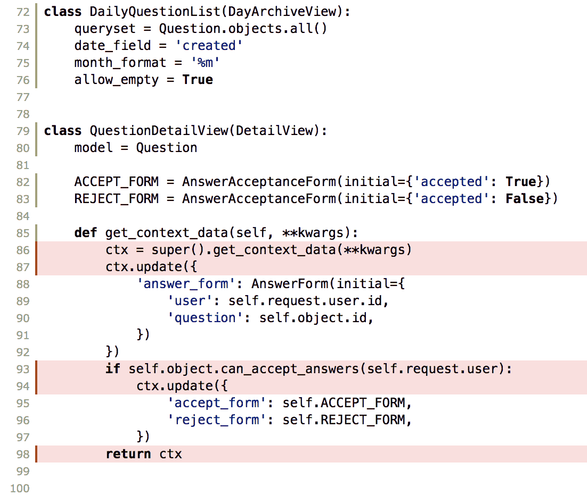

# 第七章：使用 Elasticsearch 搜索问题

现在用户可以提问和回答问题，我们将为 Answerly 添加搜索功能，以帮助用户找到问题。我们的搜索将由 Elasticsearch 提供支持。Elasticsearch 是一个由 Apache Lucene 提供支持的流行的开源搜索引擎。

在本章中，我们将执行以下操作：

+   创建一个 Elasticsearch 服务来抽象我们的代码

+   批量加载现有的`Question`模型实例到 Elasticsearch

+   构建由 Elasticsearch 提供支持的搜索视图

+   自动将新模型保存到 Elasticsearch

让我们首先设置我们的项目以使用 Elasticsearch。

# 从 Elasticsearch 开始

Elasticsearch 由 Elastic 维护，尽管服务器是开源的。Elastic 提供专有插件，以使在生产中运行更容易。您可以自己运行 Elasticsearch，也可以使用 Amazon、Google 或 Elastic 等 SaaS 提供商。在开发中，我们将使用 Elastic 提供的 Docker 镜像运行 Elasticsearch。

Elasticsearch 由零个或多个索引组成。每个索引包含文档。文档是搜索的对象。文档由字段组成。字段由 Apache Lucene 索引。每个索引还分成一个或多个分片，通过在集群中的节点之间分发来加快索引和搜索速度。

我们可以使用其 RESTful API 与 Elasticsearch 进行交互。大多数请求和响应默认都是 JSON 格式。

首先，让我们通过在 Docker 中运行 Elasticsearch 服务器来开始。

# 使用 docker 启动 Elasticsearch 服务器

运行 Elasticsearch 服务器的最简单方法是使用 Elastic 提供的 Docker 镜像。

要获取并启动 Elasticsearch docker 镜像，请运行以下命令：

```py
$ docker run -d -p 9200:9200 -p 9300:9300 -e "discovery.type=single-node" docker.elastic.co/elasticsearch/elasticsearch:6.0.0
```

以下命令执行四个操作，如下所示：

+   它从 Elastic 的服务器下载 Elasticsearch 6.0 docker 镜像

+   它使用 Elasticsearch 6.0 docker 镜像作为单节点集群运行容器

+   它将 docker 命令从运行的容器中分离（这样我们就可以在我们的 shell 中运行更多命令）

+   它在主机计算机上打开端口（`-p`）`9200`和`9300`，并将它们重定向到容器

要确认我们的服务器正在运行，我们可以向 Elasticsearch 服务器发出以下请求：

```py
$ curl http://localhost:9200/?pretty
{
  "name" : "xgf60cc",
  "cluster_name" : "docker-cluster",
  "cluster_uuid" : "HZAnjZefSjqDOxbMU99KOw",
  "version" : {
    "number" : "6.0.0",
    "build_hash" : "8f0685b",
    "build_date" : "2017-11-10T18:41:22.859Z",
    "build_snapshot" : false,
    "lucene_version" : "7.0.1",
    "minimum_wire_compatibility_version" : "5.6.0",
    "minimum_index_compatibility_version" : "5.0.0"
  },
  "tagline" : "You Know, for Search"
}
```

与 Elasticsearch 交互时，始终添加`pretty` `GET`参数，以便 Elasticsearch 打印 JSON。但是，在代码中不要使用此参数。

现在我们有了 Elasticsearch 服务器，让我们配置 Django 以了解我们的服务器。

# 配置 Answerly 以使用 Elasticsearch

接下来，我们将更新我们的`settings.py`和`requirements.txt`文件，以便与 Elasticsearch 一起使用。

让我们更新`django/config/settings.py`：

```py
ES_INDEX = 'answerly'
ES_HOST = 'localhost'
ES_PORT = '9200'
```

这些是我们的应用程序将使用的自定义设置。Django 没有内置对 Elasticsearch 的支持。相反，我们将在我们自己的代码中引用这些设置。

让我们将 Elasticsearch 库添加到我们的`requirements.txt`文件中：

```py
elasticsearch==6.0.0
```

这是由 Elastic 发布的官方 Elasticsearch Python 库。该库提供了一个低级接口，看起来很像我们可以用 cURL 与之一起使用的 RESTful API。这意味着我们可以轻松地在命令行上使用 cURL 构建查询，然后将 JSON 转换为 Python`dict`。

Elastic 还提供了一个更高级、更 Pythonic 的 API，称为`elasticsearch-dsl`。它包括一个伪 ORM，用于编写更 Pythonic 的持久层。如果您的项目包含大量 Elasticsearch 代码，这可能是一个不错的选择。但是，低级 API 与 RESTful API 密切对应，这使得重用代码并从 Elasticsearch 社区获得帮助更容易。

接下来，让我们在我们的 Elasticsearch 服务器中创建 Answerly 索引。

# 创建 Answerly 索引

让我们通过向服务器发送`PUT`请求来在 Elasticsearch 中创建索引：

```py
$ curl -XPUT "localhost:9200/answerly?pretty"
```

太好了！现在，我们可以将现有的`Question`模型实例加载到我们的 Elasticsearch 索引中。

# 将现有的问题加载到 Elasticsearch 中

添加搜索功能意味着我们需要将现有的`Question`模型实例加载到 Elasticsearch 中。解决这样的问题最简单的方法是添加一个`manage.py`命令。自定义的`manage.py`命令将普通 Python 脚本的简单性与 Django API 的强大功能结合起来。

在添加`manage.py`命令之前，我们需要编写我们的特定于 Elasticsearch 的代码。为了将 Elasticsearch 代码与 Django 代码分离，我们将在`qanda`应用程序中添加一个`elasticsearch`服务。

# 创建 Elasticsearch 服务

本章中我们将编写的大部分代码都是特定于 Elasticsearch 的。我们不希望将该代码放在我们的视图（或`manage.py`命令）中，因为这将在两个不相关的组件之间引入耦合。相反，我们将把 Elasticsearch 代码隔离到`qanda`中的自己的模块中，然后让我们的视图和`manage.py`命令调用我们的服务模块。

我们将创建的第一个函数将批量加载`Question`模型实例到 Elasticsearch 中。

让我们为我们的 Elastic 服务代码创建一个单独的文件。我们将把我们的批量插入代码放入`django/qanda/service/elasticsearch.py`中：

```py
import logging

from django.conf import settings
from elasticsearch import Elasticsearch, TransportError
from elasticsearch.helpers import streaming_bulk

FAILED_TO_LOAD_ERROR = 'Failed to load {}: {!r}'

logger = logging.getLogger(__name__)

def get_client():
    return Elasticsearch(hosts=[
        {'host': settings.ES_HOST, 'port': settings.ES_PORT,}
    ])

def bulk_load(questions):
    all_ok = True
    es_questions = (q.as_elasticsearch_dict() for q in questions)
    for ok, result in streaming_bulk(
            get_client(),
            es_questions,
            index=settings.ES_INDEX,
            raise_on_error=False,
    ):
        if not ok:
            all_ok = False
            action, result = result.popitem()
            logger.error(FAILED_TO_LOAD_ERROR.format(result['_id'], result))
    return all_ok
```

我们在新服务中创建了两个函数，`get_client()`和`bulk_load()`。

`get_client()`函数将返回一个从`settings.py`中配置的`Elasticcearch`客户端。

`bulk_load()`函数接受一个`Question`模型实例的可迭代集合，并使用`streaming_bulk()`助手将它们加载到 Elasticsearch 中。由于`bulk_load()`期望一个可迭代的集合，这意味着我们的`manage.py`命令将能够发送一个`QuerySet`对象。请记住，即使我们使用了生成器表达式（它是惰性的），我们的`questions`参数也会在我们尝试迭代它时执行完整的查询。只有`as_elasticsearch_dict()`方法的执行是惰性的。我们将在完成查看`bulk_load()`函数后编写并讨论新的`as_elasticsearch_dict()`方法。

接下来，`bulk_load()`函数使用`streaming_bulk()`函数。`streaming_bulk()`函数接受四个参数并返回一个用于报告加载进度的迭代器。四个参数如下：

+   一个`Elasticsearch`客户端

+   我们的`Question`生成器（迭代器）

+   索引名称

+   一个标志，告诉函数在出现错误时不要引发异常（这将导致`ok`变量在出现错误时为`False`）

我们的`for`循环的主体将在加载问题时出现错误时记录日志。

接下来，让我们给`Question`一个方法，可以将其转换为 Elasticsearch 可以正确处理的`dict`。

让我们更新`Question`模型：

```py
from django.db import models

class Question(models.Model):
    # fields and methods unchanged 

    def as_elasticsearch_dict(self):
        return {
            '_id': self.id,
            '_type': 'doc',
            'text': '{}\n{}'.format(self.title, self.question),
            'question_body': self.question,
            'title': self.title,
            'id': self.id,
            'created': self.created,
        }
```

`as_elasticsearch_dict()`方法将`Question`模型实例转换为适合加载到 Elasticsearch 中的字典。以下是我们特别添加到 Elasticsearch 字典中的三个字段，这些字段不在我们的模型中：

+   `_id`：这是 Elasticsearch 文档的 ID。这不一定要与模型 ID 相同。但是，如果我们想要能够更新代表“问题”的 Elasticsearch 文档，那么我们需要存储文档的`_id`或能够计算它。为简单起见，我们只使用相同的 ID。

+   `_type`：这是文档的映射类型。截至 Elasticsearch 6，Elasticsearch 索引只能存储一个映射类型。因此，索引中的所有文档应该具有相同的`_type`值。映射类型类似于数据库模式，告诉 Elasticsearch 如何索引和跟踪文档及其字段。Elasticsearch 的一个便利功能是，它不要求我们提前定义类型。Elasticsearch 会根据我们加载的数据动态构建文档的类型。

+   `text`：这是我们将在文档中创建的一个字段。对于搜索来说，将文档的标题和正文放在一个可索引的字段中是很方便的。

字典中的其余字段与模型的字段相同。

作为模型方法的`as_elasticsearch_dict()`的存在可能会有问题。`elasticsearch`服务不应该知道如何将`Question`转换为 Elasticsearch 字典吗？像许多设计问题一样，答案取决于各种因素。影响我将此方法添加到模型中的一个因素是 Django 的*fat models*哲学。通常，Django 鼓励在模型方法上编写操作。此外，此字典的属性与模型的字段耦合。将这两个字段列表保持紧密联系使未来的开发人员更容易保持两个列表同步。然而，在某些项目和环境中，将这种函数放在服务模块中可能是正确的选择。作为 Django 开发人员，我们的工作是评估权衡并为特定项目做出最佳决策。

现在我们的`elasticsearch`服务知道如何批量添加`Questions`，让我们用`manage.py`命令暴露这个功能。

# 创建一个 manage.py 命令

我们已经使用`manage.py`命令来启动项目和应用程序，以及创建和运行迁移。现在，我们将创建一个自定义命令，将我们项目中的所有问题加载到 Elasticsearch 服务器中。这将是对 Django 管理命令的简单介绍。我们将在第十二章中更详细地讨论这个主题，*构建 API*。

Django 管理命令必须位于应用程序的`manage/commands`子目录中。一个应用程序可以有多个命令。每个命令的名称与其文件名相同。文件内部应该有一个继承`django.core.management.BaseCommand`的`Command`类，它应该执行的代码应该在`handle()`方法中。

让我们在`django/qanda/management/commands/load_questions_into_elastic_search.py`中创建我们的命令：

```py
from django.core.management import BaseCommand

from qanda.service import elasticsearch
from qanda.models import Question

class Command(BaseCommand):
    help = 'Load all questions into Elasticsearch'

    def handle(self, *args, **options):
        queryset = Question.objects.all()
        all_loaded = elasticsearch.bulk_load(queryset)
        if all_loaded:
            self.stdout.write(self.style.SUCCESS(
                'Successfully loaded all questions into Elasticsearch.'))
        else:
            self.stdout.write(
                self.style.WARNING('Some questions not loaded '
                                   'successfully. See logged errors'))
```

在设计命令时，我们应该将它们视为视图，即*Fat models, thin commands*。这可能会更复杂一些，因为命令行输出没有单独的模板层，但我们的输出也不应该很复杂。

在我们的情况下，`handle()`方法获取所有`Questions`的`QuerySet`，然后将其传递给`elasticsearch.bulkload`。然后我们使用`Command`的辅助方法打印出是否成功或不成功。这些辅助方法优于直接使用`print()`，因为它们使编写测试更容易。我们将在下一章第八章中更详细地讨论这个主题，*测试 Answerly*。

让我们运行以下命令：

```py
$ cd django
$ python manage.py load_questions_into_elastic_search
Successfully loaded all questions into Elasticsearch.
```

当所有问题加载完毕后，让我们确认它们是否在我们的 Elasticsearch 服务器中。我们可以使用`curl`访问 Elasticsearch 服务器，以确认我们的问题已经加载：

```py
$ curl http://localhost:9200/answerly/_search?pretty
```

假设您的 ElasticSearch 服务器在本地主机的端口 9200 上运行，上述命令将返回`answerly`索引中的所有数据。我们可以查看结果来确认我们的数据已成功加载。

现在我们在 Elasticsearch 中有一些问题，让我们添加一个搜索视图。

# 创建一个搜索视图

在本节中，我们将创建一个视图，让用户搜索我们的`Question`并显示匹配的结果。为了实现这个结果，我们将做以下事情：

+   在我们的`elasticsearch`服务中添加一个`search_for_question()`函数

+   创建一个搜索视图

+   创建一个模板来显示搜索结果

+   更新基本模板以使搜索在任何地方都可用

让我们从为我们的`elasticsearch`服务添加搜索开始。

# 创建一个搜索功能

查询我们的 Elasticsearch 服务器以获取与用户查询匹配的问题列表的责任属于我们的`elasticsearch`服务。

让我们添加一个函数，将搜索查询发送到`django/qanda/service/elasticsearch.py`并解析结果：

```py
def search_for_questions(query):
    client = get_client()
    result = client.search(index=settings.ES_INDEX, body={
      'query': {
          'match': {
              'text': query,
          },
      },
    })
    return (h['_source'] for h in result['hits']['hits'])
```

连接客户端后，我们将发送我们的查询并解析结果。

使用客户端的`search()`方法，我们将查询作为 Python `dict`发送到 Elasticsearch Query DSL（领域特定语言）中。Elasticsearch Query DSL 提供了一个用于使用一系列嵌套对象查询 Elasticsearch 的语言。通过 HTTP 发送时，查询变成一系列嵌套的 JSON 对象。在 Python 中，我们使用`dict`。

在我们的情况下，我们在 Answerly 索引的文档的`text`字段上使用了`match`查询。`match`查询是一个模糊查询，检查每个文档的`text`字段是否匹配。查询 DSL 还支持许多配置选项，让您构建更复杂的查询。在我们的情况下，我们将接受默认的模糊配置。

接下来，`search_for_questions`遍历结果。Elasticsearch 返回了大量描述结果数量、匹配质量和结果文档的元数据。在我们的情况下，我们将返回匹配文档的迭代器（存储在`_source`中）。

现在我们可以从 Elasticsearch 获取结果，我们可以编写我们的`SearchView`。

# 创建 SearchView

我们的`SearchView`将使用`GET`参数`q`并使用我们的服务模块的`search_for_questions()`函数进行搜索。

我们将使用`TemplateView`构建我们的`SearchView`。`TemplateView`在响应`GET`请求时呈现模板。让我们将`SearchView`添加到`django/qanda/views.py`中：

```py
from django.views.generic import TemplateView

from qanda.service.elasticsearch import search_for_questions

class SearchView(TemplateView):
    template_name = 'qanda/search.html'

    def get_context_data(self, **kwargs):
        query = self.request.GET.get('q', None)
        ctx = super().get_context_data(query=query, **kwargs)
        if query:
            results = search_for_questions(query)
            ctx['hits'] = results
        return ctx
```

接下来，我们将在`django/qanda/urls.py`的 URLConf 中添加一个`path()`对象路由到我们的`SearchView`：

```py
from django.urls.conf import path, include

from qanda import views

app_name = 'qanda'

urlpatterns = [
    # skipping previous code
    path('q/search', views.SearchView.as_view(),
         name='question_search'),
]
```

现在我们有了我们的视图，让我们构建我们的`search.html`模板。

# 创建搜索模板

我们将把搜索模板放在`django/qanda/templates/qanda/search.html`中，如下所示：

```py





  <h2 >Search</h2 >
  <form method="get" class="form-inline" >
    <input class="form-control mr-2"
           placeholder="Search"
           type="search"
           name="q" value="{{ query }}" >
    <button type="submit" class="btn btn-primary" >Search</button >
  </form >
  
    <h3>Results from search query '{{ query }}'</h3 >
    <ul class="list-unstyled search-results" >
      
        <li >
          <a href="" >
            {{ hit.title }}
          </a >
          <div >
            {{ hit.question_body|markdownify|truncatewords_html:20 }}
          </div >
        </li >
      
        <li >No results.</li >
      
    </ul >
  

```

在模板的正文中，我们有一个显示查询的搜索表单。如果有`query`，那么我们也将显示其结果（如果有的话）。

我们之前在这里使用过许多标签（例如`for`，`if`，`url`和`markdownify`）。我们将添加一个新的过滤器`truncate_words_html`，它通过管道接收文本和一个数字作为参数。它将把文本截断为提供的单词数（不包括 HTML 标记），并关闭结果片段中的任何打开的 HTML 标记。

这个模板的结果是一个与我们的查询匹配的命中列表，每个问题的文本预览。由于我们在 Elasticsearch 中存储了问题的正文、标题和 ID，我们能够在不查询我们的常规数据库的情况下显示结果。

接下来，让我们更新基础模板，让用户可以从任何页面进行搜索。

# 更新基础模板

让我们更新基础模板，让用户可以从任何地方进行搜索。为此，我们需要编辑`django/templates/base.html`：

```py

<!DOCTYPE html>
<html lang="en" >
<head >{# head unchanged #}</head >
<body >
<nav class="navbar navbar-expand-lg  bg-light" >
  <div class="container" >
    <a class="navbar-brand" href="/" >Answerly</a >
    <ul class="navbar-nav" >
      {# previous nav unchanged #}  
      <li class="nav-item" >
        <form class="form-inline"
              action=""
              method="get">
          <input class="form-control mr-sm-2" type="search"
                 name="q"
                 placeholder="Search">
          <button class="btn btn-outline-primary my-2 my-sm-0" 
                 type="submit" >
            Search
          </button >
        </form >
      </li >
    </ul >
  </div >
</nav >
{# rest of body unchanged #}
</body >
</html >
```

现在，我们在每个页面的页眉中有了搜索表单。

完成搜索后，让我们确保每个新问题都会自动添加到 Elasticsearch 中。

# 在保存时将问题添加到 Elasticsearch 中

每次保存模型时执行操作的最佳方法是覆盖模型从`Model`继承的`save()`方法。我们将提供自定义的`Question.save()`方法，以确保`Question`在被 Django ORM 保存时立即添加和更新到 ElasticSearch 中。

即使您不控制该模型的源代码，您仍然可以在保存 Django 模型时执行操作。Django 提供了一个信号分发器（[`docs.djangoproject.com/en/2.0/topics/signals/`](https://docs.djangoproject.com/en/2.0/topics/signals/)），让您可以监听您不拥有的模型上的事件。但是，信号会给您的代码引入大量复杂性。除非没有其他选择，否则*不建议*使用信号。

让我们更新`django/qanda/models.py`中的`Queston`模型：

```py
from django.db import models
from qanda.service import elasticsearch
class Question(models.Model):
    # other fields and methods unchanged. 
    def save(self, force_insert=False, force_update=False, using=None,
             update_fields=None):
        super().save(force_insert=force_insert,
                     force_update=force_update,
                     using=using,
                     update_fields=update_fields)
        elasticsearch.upsert(self)
```

`save()`方法被`CreateView`，`UpdateView`，`QuerySet.create()`，`Manager.create()`和大多数第三方代码调用以持久化模型。我们确保在原始`save()`方法返回后调用我们的`upsert()`方法，因为我们希望我们的模型有一个`id`属性。

现在，让我们创建我们的 Elasticsearch 服务的`upsert`方法。

# 测量代码覆盖率

**代码覆盖**测量了测试期间执行的代码行。理想情况下，通过跟踪代码覆盖，我们可以确保哪些代码经过了测试，哪些代码没有。由于 Django 项目主要是 Python，我们可以使用 Coverage.py 来测量我们的代码覆盖率。以下是 Django 项目的两个注意事项：

+   Coverage.py 无法测量我们的模板的覆盖范围（它们不是 Python）

+   未经测试的基于类的视图似乎比它们实际覆盖的要多

查找 Django 应用程序的覆盖范围是一个两步过程：

1.  使用`coverage`命令运行我们的测试

1.  使用`coverage report`或`coverage html`生成覆盖报告

让我们使用`coverage`运行 Django 的单元`test`命令，查看未经测试的项目的基线：

```py
$ coverage run --branch --source=qanda,user manage.py test 
Creating test database for alias 'default'...
System check identified no issues (0 silenced).

----------------------------------------------------------------------
Ran 0 tests in 0.000s

OK
Destroying test database for alias 'default'...
```

上述命令告诉`coverage`运行一个命令（在我们的情况下是`manage.py test`）来记录测试覆盖率。我们将使用此命令和以下两个选项：

+   `--branch`：跟踪分支语句的两个部分是否都被覆盖（例如，当`if`语句评估为`True`和`False`时）

+   `--source=qanda,user`：仅记录`qanda`和`user`模块（我们编写的代码）的覆盖范围

现在我们已经记录了覆盖率，让我们看一下没有任何测试的应用程序的覆盖率：

```py
$ coverage report 
Name                                 Stmts   Miss Branch BrPart  Cover
----------------------------------------------------------------------
qanda/__init__.py                      0      0      0      0   100%
qanda/admin.py                         1      0      0      0   100%
qanda/apps.py                          3      3      0      0     0%
qanda/forms.py                        19      0      0      0   100%
qanda/management/__init__.py           0      0      0      0   100%
qanda/migrations/0001_initial.py       7      0      0      0   100%
qanda/migrations/__init__.py           0      0      0      0   100%
qanda/models.py                       28      6      0      0    79%
qanda/search_indexes.py                0      0      0      0   100%
qanda/service/__init__.py              0      0      0      0   100%
qanda/service/elasticsearch.py        47     32     14      0    25%
qanda/tests.py                         1      0      0      0   100%
qanda/urls.py                          4      0      0      0   100%
qanda/views.py                        76     35     12      0    47%
user/__init__.py                         0      0      0      0   100%
user/admin.py                            4      0      0      0   100%
user/apps.py                             3      3      0      0     0%
user/migrations/__init__.py              0      0      0      0   100%
user/models.py                           1      0      0      0   100%
user/tests.py                            1      0      0      0   100%
user/urls.py                             5      0      0      0   100%
user/views.py                            5      0      0      0   100%
----------------------------------------------------------------------
TOTAL                                  205     79     26      0    55%
```

为了了解未经测试的项目为何覆盖率达到 55％，让我们看一下`django/qanda/views.py`的覆盖情况。让我们使用以下命令生成覆盖的 HTML 报告：

```py
$ cd django
$ coverage html
```

上述命令将创建一个`django/htmlcov`目录和 HTML 文件，显示覆盖报告和代码覆盖的可视化显示。让我们打开`django/htmlcov/qanda_views_py.html`并向下滚动到大约第 72 行：



上述屏幕截图显示`DailyQuestionList`完全被覆盖，但`QuestionDetailView.get_context_data()`没有被覆盖。在没有任何测试的情况下，这种差异似乎有违直觉。

让我们回顾一下代码覆盖的工作原理。代码覆盖工具检查在测试期间是否*执行*了特定行的代码。在上述屏幕截图中，`DailyQuestionList`类及其成员*已经*被执行。当测试运行程序启动时，Django 将构建根 URLConf，就像在开发或生产时启动一样。创建根 URLConf 时，它会导入其他引用的 URLConfs（例如`qanda.urls`）。这些 URLConfs 又会导入它们的视图。视图导入表单，模型和其他模块。

这个导入链意味着模块顶层的任何内容都会显示为覆盖的，无论是否经过测试。`DailyQuestionList`的类定义被执行。但是，类本身没有被实例化，也没有执行任何方法。这也解释了为什么`QuestionDetailView.get_context_data()`的主体部分没有被覆盖。`QuestionDetailView.get_context_data()`的主体部分从未被执行。这是代码覆盖工具在处理声明性代码（例如`DailyQuestionList`）时的一个限制。

现在我们了解了代码覆盖的一些限制，让我们为`qanda.models.Question.save()`编写一个单元测试。

# 向 Elasticsearch 插入数据

如果对象存在，则 upsert 操作将更新对象，如果不存在则插入。Upsert 是*update*和*insert*的合成词。Elasticsearch 支持开箱即用的 upsert 操作，这可以使我们的代码更简单。

让我们将我们的`upsert()`方法添加到`django/qanda/service/elastic_search.py`中：

```py
def upsert(question_model):
    client = get_client()
    question_dict = question_model.as_elasticsearch_dict()
    doc_type = question_dict['_type']
    del question_dict['_id']
    del question_dict['_type']
    response = client.update(
        settings.ES_INDEX,
        doc_type,
        id=question_model.id,
        body={
            'doc': question_dict,
            'doc_as_upsert': True,
        }
    )
    return response
```

我们在上述代码块中定义了我们的`get_client()`函数。

要执行 upsert，我们使用 Elasticsearch `client`的`update()`方法。我们将模型作为文档`dict`提供，在`doc`键下。为了强制 Elasticsearch 执行 upsert，我们将包含`doc_as_upsert`键，并赋予`True`值。`update()`方法和我们之前使用的批量插入函数之间的一个区别是，`update()`不会在文档中接受隐式 ID（`_id`）。但是，我们在`update()`调用中提供要 upsert 的文档的 ID 作为`id`参数。我们还从`question_model.as_elasticsearch_dict()`方法返回的`dict`中删除`_type`键和值，并将值（存储在`doc_type`变量中）作为参数传递给`client.update()`方法。

我们返回响应，尽管我们的视图不会使用它。

最后，我们可以通过运行开发服务器来测试我们的视图：

```py
$ cd django
$ python manage.py runserver
```

一旦我们的开发服务器启动，我们可以在[`localhost:8000/ask`](http://localhost:8000/ask)提出一个新问题，然后在[`localhost:8000/q/search`](http://localhost:8000/q/search)进行搜索。

现在，我们已经完成了向 Answerly 添加搜索功能！

# 摘要

在本章中，我们添加了搜索功能，以便用户可以搜索问题。我们使用 Docker 为开发设置了一个 Elasticsearch 服务器。我们创建了一个`manage.py`命令，将所有我们的`Question`加载到 Elasticsearch 中。我们添加了一个搜索视图，用户可以在其中看到他们问题的结果。最后，我们更新了`Question.save`以保持 Elasticsearch 和 Django 数据库同步。

接下来，我们将深入了解测试 Django 应用程序，以便在未来进行更改时可以有信心。
