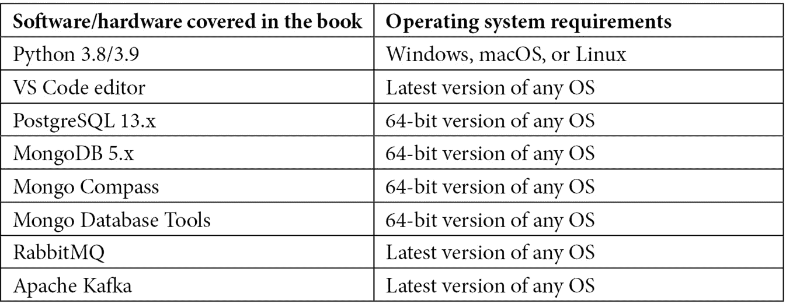
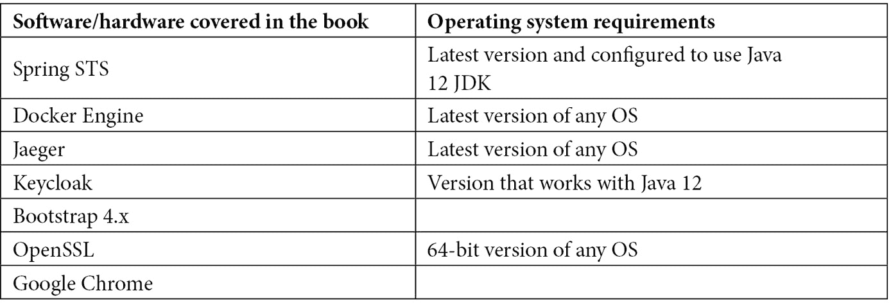

# 前言

本书教你了解 FastAPI 框架的组件，以及如何将这些组件与一些第三方工具结合使用来构建微服务应用程序。你需要具备 Python 编程的背景知识，了解 API 开发的原则，以及理解构建企业级微服务应用程序背后的原则。这不仅仅是一本参考书：它提供了一些代码蓝图，帮助你解决现实世界中的应用问题，同时详细阐述和演示了每一章的主题。

# 本书面向的对象

本书面向 Python 网络开发者、高级 Python 用户以及使用 Flask 或 Django 的后端开发者，他们想学习如何使用 FastAPI 框架来实现微服务。了解 REST API 和微服务的读者也将从本书中受益。书中的一些部分包含了一些通用概念、流程和说明，中级开发者以及 Python 爱好者也可以从中找到共鸣。

# 本书涵盖的内容

*第一章*，*FastAPI 入门设置*，介绍了如何使用核心模块类和装饰器创建 FastAPI 端点，以及框架如何管理传入的 API 请求和传出的响应。

*第二章*，*探索核心功能*，介绍了 FastAPI 的异步端点、异常处理机制、后台进程、用于项目组织的 APIRouter、内置的 JSON 编码器和 FastAPI 的 JSON 响应。

*第三章*，*探究依赖注入*，探讨了`Depends()`指令和第三方扩展模块。

*第四章*，*构建微服务应用程序*，讨论了支持构建微服务的原则和设计模式，例如分解、属性配置、日志记录和领域建模策略。

*第五章*，*连接到关系型数据库*，重点介绍了 Python **对象关系映射器**（**ORMs**），它可以无缝集成 FastAPI，使用 PostgreSQL 数据库持久化和管理数据。

*第六章*，*使用非关系型数据库*，展示了 PyMongo 和 Motor 引擎，包括一些流行的 Python **对象文档映射器**（**ODMs**），它们可以将 FastAPI 应用程序连接到 MongoDB 服务器。

*第七章*，*保护 REST API*，突出了 FastAPI 内置的安全模块类，并探讨了 JWT、Keycloak、Okta 和 Auth0 等第三方工具，以及它们如何应用于实现不同的安全方案以保护应用程序。

*第八章*，*创建协程、事件和消息驱动事务*，重点介绍了 FastAPI 异步方面的细节，如协程的使用、asyncio 环境、使用 Celery 的异步后台进程、使用 RabbitMQ 和 Apache Kafka 的异步消息、SSE、WebSocket 和异步事件。

*第九章*，*利用其他高级功能*，包含 FastAPI 可以提供的其他功能，例如其对不同响应类型的支持、中间件的定制、请求和响应、其他 JSON 编码器的应用以及绕过 CORS 浏览器策略。

*第十章*，*解决数值、符号和图形问题*，突出了 FastAPI 与`numpy`、`pandas`、`matplotlib`、`sympy`和`scipy`模块的集成，以实现能够执行数值和符号计算以解决数学和统计问题的 API 服务。

*第十一章*，*添加其他微服务功能*，讨论了其他架构关注点，如监控和检查 API 端点在运行时的属性、OpenTracing、客户端服务发现、管理存储库模块、部署以及使用 Flask 和 Django 应用创建单仓库架构。

# 要充分利用本书

本书要求您具备使用 Python 3.8 或 3.9 进行 Python 编程的经验，以及使用任何 Python 框架进行一些 API 开发的经验。需要了解 Python 的编码标准和最佳实践，包括一些高级主题，如创建装饰器、生成器、数据库连接、请求-响应事务、HTTP 状态码和 API 端点。



在 Okta 和 Auth0 上为 OpenID 连接安全方案开设账户。两者都偏好使用公司电子邮件进行注册。

**如果您使用的是本书的数字版，我们建议您亲自输入代码或从本书的 GitHub 仓库（下一节中提供链接）获取代码。这样做将有助于您避免与代码复制粘贴相关的任何潜在错误。**

每章都有一个专门的项目原型，将描述和解释主题。如果在设置过程中迷失方向，每个项目都有一个备份的数据库（`.sql`或`.zip`）和模块列表（`requirements.txt`），以解决一些问题。运行`\i`PostgreSQL 命令安装脚本文件或使用已安装的 Mongo 数据库工具中的 mongorestore 来加载所有数据库内容。此外，每个项目都有一个迷你 README 文件，概述了原型想要实现的内容。

# 下载示例代码文件

您可以从 GitHub 下载本书的示例代码文件 [`github.com/PacktPublishing/Building-Python-Microservices-with-FastAPI`](https://github.com/PacktPublishing/Building-Python-Microservices-with-FastAPI)。如果代码有更新，它将在 GitHub 仓库中更新。

我们还有其他来自我们丰富图书和视频目录的代码包，可在 [`github.com/PacktPublishing/`](https://github.com/PacktPublishing/) 获取。查看它们！

# 下载彩色图像

我们还提供了一份包含本书中使用的截图和图表彩色图像的 PDF 文件。您可以从这里下载：[`packt.link/ohTNw`](https://packt.link/ohTNw)。

# 使用的约定

本书中使用了多种文本约定。

`文本中的代码`：表示文本中的代码单词、数据库表名、文件夹名、文件名、文件扩展名、路径名、虚拟 URL、用户输入和 Twitter 昵称。以下是一个示例：“`delete_user()` 服务是一个 `DELETE` API 方法，它使用 `username` 路径参数来搜索用于删除的登录记录。”

代码块应如下设置：

```py
@app.delete("/ch01/login/remove/{username}")
def delete_user(username: str):
    del valid_users[username]
    return {"message": "deleted user"}
```

当我们希望您注意代码块中的特定部分时，相关的行或项目将以粗体显示：

```py
@app.get("/ch01/login/")
def login(username: str, password: str):
    if valid_users.get(username) == None:
        return {"message": "user does not exist"}
    else:
        user = valid_users.get(username)
```

任何命令行输入或输出都应如下编写：

```py
pip install fastapi
pip install uvicorn[standard]
```

**粗体**：表示新术语、重要单词或您在屏幕上看到的单词。例如，菜单或对话框中的单词以粗体显示。以下是一个示例：“从 **管理** 面板中选择 **系统信息**。”

小贴士或重要注意事项

看起来像这样。

# 联系我们

我们始终欢迎读者的反馈。

`customercare@packtpub.com` 并在邮件主题中提及书籍标题。

**勘误表**：尽管我们已经尽最大努力确保内容的准确性，但错误仍然可能发生。如果您在这本书中发现了错误，如果您能向我们报告，我们将不胜感激。请访问 [www.packtpub.com/support/errata](http://www.packtpub.com/support/errata) 并填写表格。

`copyright@packt.com` 并附有材料链接。

**如果您有兴趣成为作者**：如果您在某个领域有专业知识，并且您有兴趣撰写或为书籍做出贡献，请访问 [authors.packtpub.com](http://authors.packtpub.com)。

# 分享您的想法

一旦您阅读了《使用 FastAPI 构建 Python 微服务》，我们很乐意听听您的想法！请 [点击此处直接进入此书的亚马逊评论页面](https://packt.link/r/1803245964) 并分享您的反馈。

您的评论对我们和科技社区都很重要，并将帮助我们确保我们提供高质量的内容。

# 第一部分：FastAPI 微服务开发的应用相关架构概念

在本部分，我们将全面了解 FastAPI 框架，并探讨将单体应用系统性地分解为几个业务单元的理想方法。在这个过程中，您将了解如何开始开发，以及 FastAPI 中有哪些组件可以被利用来实现微服务架构。

本部分包括以下章节：

+   *第一章*，FastAPI 入门设置

+   *第二章*，探索核心组件

+   *第三章*，探究依赖注入

+   *第四章*，构建微服务应用
