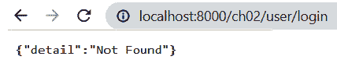

# 第二章：探索核心功能

在上一章中，我们发现使用**FastAPI**框架安装和开始开发 REST API 非常容易。使用 FastAPI 处理请求、cookies 和表单数据既快又简单，构建不同的 HTTP 路径操作也是如此。

为了进一步了解框架的功能，本章将指导我们如何通过添加一些必要的 FastAPI 功能来升级我们的 REST API 实现。这包括一些可以帮助最小化未检查异常的处理程序，可以直接管理端点响应的 JSON 编码器，可以创建审计跟踪和日志的后台作业，以及使用**uvicorn**的主线程异步运行某些 API 方法的多个线程。此外，本章还将解决大型企业项目中的源文件、模块和包管理问题。本章将使用并剖析一个*智能旅游系统*原型，以帮助阐述和举例说明 FastAPI 的核心模块。

基于上述功能，本章将讨论以下主要概念，这些概念可以帮助我们扩展对该框架的了解：

+   结构化和组织大型项目

+   管理与 API 相关的异常

+   将对象转换为 JSON 兼容类型

+   管理 API 响应

+   创建后台进程

+   使用异步路径操作

+   将中间件应用于过滤路径操作

# 技术要求

本章将实现一个智能旅游系统的原型，旨在提供旅游景点的预订信息和预约服务。它可以提供用户详情、旅游景点详情和位置网格。同时，它还允许用户或游客对旅游进行评论并评分。该原型有一个管理员账户，用于添加和删除所有旅游详情、管理用户和提供一些列表。该应用程序目前不使用任何数据库管理系统，因此所有数据临时存储在 Python 集合中。代码已全部上传至[`github.com/PacktPublishing/Building-Python-Microservices-with-FastAPI/tree/main/ch02`](https://github.com/PacktPublishing/Building-Python-Microservices-with-FastAPI/tree/main/ch02)。

# 结构化和组织大型项目

在 FastAPI 中，大型项目通过添加*包*和*模块*来组织和结构化，而不会破坏设置、配置和目的。项目在添加额外功能和需求的情况下，应始终保持灵活性和可扩展性。一个组件必须对应一个包，几个模块相当于 Flask 框架中的一个*蓝图*。

在这个原型智能旅游系统中，应用程序有几个模块，如登录、管理、访问、目的地和反馈相关的功能。其中两个最重要的是*访问*模块，它管理所有用户的旅行预订，以及*反馈*模块，它允许客户在每一个目的地发布他们的反馈。由于它们提供了核心交易，这些模块应该与其他模块分开。*图 2.1* 展示了如何使用**包**来分组实现并将一个模块与其他模块分开：


图 2.1 – FastAPI 项目结构

*图 2.1* 中的每个包都包含了实现 API 服务和一些依赖项的所有模块。所有上述模块现在都有自己的相应包，这使得测试、调试和扩展应用程序变得容易。将在接下来的章节中讨论测试 FastAPI 组件。

重要提示

在使用*VS Code 编辑器*和*Python 3.8*进行开发时，FastAPI 不需要在 Python 包中添加`__init__.py`文件，这与 Flask 不同。在编译过程中，包内部生成的`__pycache__`文件夹包含被其他模块访问和使用的模块脚本的二进制文件。主文件夹也将成为一个包，因为它将拥有自己的`__pycache__`文件夹，与其他包一起。但是，在将应用程序部署到仓库时，我们必须排除`__pycache__`，因为它可能占用大量空间。

另一方面，主文件夹中剩下的核心组件包括*后台任务*、*自定义异常处理器*、*中间件*以及`main.py`文件。现在，让我们了解 FastAPI 如何在部署时将这些包捆绑成一个巨大的应用程序。

## 实现 API 服务

为了使这些模块包能够运行，`main.py`文件必须通过 FastAPI 实例调用并注册它们所有的 API 实现。每个包内部的脚本已经是微服务的 REST API 实现，只是它们是由`APIRouter`而不是`FastAPI`对象构建的。`APIRouter`也有相同的路径操作、查询和请求参数设置、表单数据处理、响应生成以及模型对象的参数注入。`APIRouter`缺少的是异常处理器、中间件声明和自定义的支持：

```py
from fastapi import APIRouter
from login.user import Signup, User, Tourist, 
      pending_users, approved_users
router = APIRouter()
@router.get("/ch02/admin/tourists/list")
def list_all_tourists():
    return approved_users
```

这里`list_all_tourists()` API 方法操作是`admin`包中`manager.py`模块的一部分，由于项目结构使用`APIRouter`实现。该方法返回允许访问应用程序的游客记录列表，这只能由`login`包中的`user.py`模块提供。

## 导入模块组件

模块脚本可以使用 Python 的`from…import`语句与其他模块共享它们的*容器*、`BaseModel` *类*和其他*资源对象*。Python 的`from…import`语句更好，因为它允许我们从模块中导入特定的组件，而不是包含不必要的组件：

```py
from fastapi import APIRouter, status
from places.destination import Tour, TourBasicInfo, 
    TourInput, TourLocation, tours, tours_basic_info, 
    tours_locations
router = APIRouter()
@router.put("/ch02/admin/destination/update", 
            status_code=status.HTTP_202_ACCEPTED)
def update_tour_destination(tour: Tour):
    try:
        tid = tour.id
        tours[tid] = tour
        tour_basic_info = TourBasicInfo(id=tid, 
           name=tour.name, type=tour.type, 
           amenities=tour.amenities, ratings=tour.ratings)
        tour_location = TourLocation(id=tid, 
           name=tour.name, city=tour.city, 
           country=tour.country, location=tour.location )
        tours_basic_info[tid] = tour_basic_info
        tours_locations[tid] = tour_location
        return { "message" : "tour updated" }
    except:
        return { "message" : "tour does not exist" } 
```

在这里，如果不从`places`包中的`destination.py`导入`Tour`、`TourBasicInfo`和`TourLocation`模型类，`update_tour_destination()`操作将无法工作。这展示了在大型企业级 Web 项目中结构化时模块之间的依赖关系。

当实现需要时，模块脚本也可以从主项目文件夹导入组件。一个这样的例子是从`main.py`文件中访问*中间件*、*异常处理器*和*任务*。

重要提示

处理`from…import`语句时避免循环。`a.py`从`b.py`访问组件，而`b.py`则从`a.py`导入资源对象。FastAPI 不接受这种场景，并将发出错误消息。

## 实现新的 main.py 文件

从技术上讲，除非通过`main.py`文件将各自的`router`对象添加或注入到应用程序的核心中，否则框架不会识别项目包及其模块脚本。`main.py`，就像其他项目级脚本一样，使用`FastAPI`而不是`APIRouter`来创建和注册组件，以及包的模块。FastAPI 类有一个`include_router()`方法，它添加所有这些路由并将它们注入到框架中，使它们成为项目结构的一部分。除了注册路由外，此方法还可以向路由添加其他属性和组件，例如*URL 前缀*、*标签*、*异常处理器依赖项*和*状态码*：

```py
from fastapi import FastAPI, Request
from admin import manager
from login import user
from feedback import post
from places import destination
from tourist import visit
app = FastAPI()
app.include_router(manager.router)
app.include_router(user.router)
app.include_router(destination.router)
app.include_router(visit.router)
app.include_router(
    post.router,
    prefix="/ch02/post"
)
```

此代码是智能旅游系统原型`main.py`的实现，负责在将模块脚本的不同包中的所有注册项添加到框架之前导入它们。使用以下命令运行应用程序：

```py
uvicorn main:app –-reload
```

这将允许您通过`http://localhost:8000/docs`访问这些模块的所有 API。

当 API 服务在执行过程中遇到运行时问题时，应用程序会发生什么？除了应用 Python 的`try-except`块外，还有没有管理这些问题的方法？让我们进一步探讨实现具有异常处理机制的 API 服务。

# 管理 API 相关异常

FastAPI 框架有一个从其 Starlette 工具包派生的内置异常处理器，当在执行 REST API 操作期间遇到`HTTPException`时，它总是返回默认的 JSON 响应。例如，在`http://localhost:8000/ch02/user/login`访问 API 而没有提供`username`和`password`时，我们将得到*图 2.2*中描述的默认 JSON 输出：



图 2.2 – 默认异常结果

在一些罕见的情况下，框架有时会选择返回 HTTP 响应状态而不是默认的 JSON 内容。但开发者仍然可以选择覆盖这些默认处理程序，以便在特定异常原因发生时选择返回哪些响应。

让我们探索如何在我们的 API 实现中制定一种标准化且适当的方式来管理运行时错误。

## 单个状态码响应

管理应用程序异常处理机制的一种方法是在遇到异常或无异常时，通过应用 `try-except` 块来管理 API 的返回响应。在应用 `try-block` 之后，操作应触发单个 `FastAPI` 和 `APIRouter` 具有用于指示我们想要引发的状态码类型的 `status_code` 参数。

在 FastAPI 中，状态码是位于 `status` 模块中的整数常量。它还允许使用整数文字来表示所需的状态码，如果它们是有效的状态码数字。

重要提示

状态码是一个三位数，它表示 REST API 操作 HTTP 响应的原因、信息或状态。状态码范围 200 到 299 表示成功响应，300 到 399 与重定向相关，400-499 与客户端相关的问题相关，而 500 到 599 与服务器错误相关。

这种技术很少使用，因为在某些情况下，操作需要清楚地识别它遇到的每个异常，这只能通过返回 `HTTPException` 而不是包含在 JSON 对象中的自定义错误消息来完成：

```py
from fastapi import APIRouter, status
@router.put("/ch02/admin/destination/update", 
              status_code=status.HTTP_202_ACCEPTED)
def update_tour_destination(tour: Tour):
    try:
        tid = tour.id
        tours[tid] = tour
        tour_basic_info = TourBasicInfo(id=tid, 
           name=tour.name, type=tour.type, 
           amenities=tour.amenities, ratings=tour.ratings)
        tour_location = TourLocation(id=tid, 
           name=tour.name, city=tour.city, 
           country=tour.country, location=tour.location )
        tours_basic_info[tid] = tour_basic_info
        tours_locations[tid] = tour_location
        return { "message" : "tour updated" }
    except:
        return { "message" : "tour does not exist" }
@router.get("/ch02/admin/destination/list", 
            status_code=200)
def list_all_tours():
    return tours
```

这里展示的 `list_all_tours()` 方法是那种应该返回状态码 200 的 REST API 服务类型——它仅通过渲染包含数据的 Python 集合就能给出无错误的结果。注意，分配给 `GET` 路径操作 `status_code` 参数的文本整数值 `200` 或 *SC 200* 总是引发一个 *OK* 状态。另一方面，`update_tour_destination()` 方法展示了另一种通过使用 `try-except` 块来发出状态码的方法，其中两个块都返回自定义的 JSON 响应。无论哪种情况发生，它都会始终触发 *SC 202*，这可能不适用于某些 REST 实现。在导入 `status` 模块后，使用其 `HTTP_202_ACCEPTED` 常量来设置 `status_code` 参数的值。

## 多个状态码

如果我们需要 `try-except` 中的每个块返回它们各自的状态码，我们需要避免使用路径操作的 `status_code` 参数，而应使用 `JSONResponse`。`JSONResponse` 是 FastAPI 类之一，用于向客户端渲染 JSON 响应。它被实例化，通过构造函数注入其 `content` 和 `status_code` 参数的值，并由路径操作返回。默认情况下，框架使用此 API 帮助路径操作以 JSON 类型渲染响应。其 `content` 参数应该是一个 JSON 类型的对象，而 `status_code` 参数可以是一个整数常量和一个有效的状态码数字，或者它可以是模块状态中的一个常量：

```py
from fastapi.responses import JSONResponse
@router.post("/ch02/admin/destination/add")
add_tour_destination(input: TourInput):
    try:
        tid = uuid1()
        tour = Tour(id=tid, name=input.name,
           city=input.city, country=input.country, 
           type=input.type, location=input.location,
           amenities=input.amenities, feedbacks=list(), 
           ratings=0.0, visits=0, isBooked=False)
        tour_basic_info = TourBasicInfo(id=tid, 
           name=input.name, type=input.type, 
           amenities=input.amenities, ratings=0.0)
        tour_location = TourLocation(id=tid, 
           name=input.name, city=input.city, 
           country=input.country, location=input.location )
        tours[tid] = tour
        tours_basic_info[tid] = tour_basic_info
        tours_locations[tid] = tour_location
        tour_json = jsonable_encoder(tour)
        return JSONResponse(content=tour_json, 
            status_code=status.HTTP_201_CREATED)
    except:
        return JSONResponse(
         content={"message" : "invalid tour"}, 
         status_code=status.HTTP_500_INTERNAL_SERVER_ERROR)
```

这里的 `add_tour_destination()` 操作包含一个 `try-except` 块，其 `try` 块返回旅游详情和 *SC 201*，而其 `catch` 块返回一个包含服务器错误 *SC 500* 的 JSON 类型错误信息。

## 抛出 HTTPException

另一种管理可能错误的方法是让 REST API 抛出 `HTTPException` 对象。`HTTPException` 是一个 FastAPI 类，它有必需的构造参数：`detail`，它需要一个 `str` 类型的错误信息，以及 `status_code`，它需要一个有效的整数值。`detail` 部分被转换为 JSON 类型，并在操作抛出 `HTTPException` 实例后作为响应返回给用户。

要抛出 `HTTPException`，使用任何形式的 `if` 语句进行验证过程比使用 `try-except` 块更合适，因为需要在抛出使用 `raise` 语句的 `HTTPException` 对象之前识别错误的起因。一旦执行 `raise`，整个操作将停止，并将指定的状态码的 HTTP 错误信息以 JSON 类型发送给客户端：

```py
from fastapi import APIRouter, HTTPException, status
@router.post("/ch02/tourist/tour/booking/add")
def create_booking(tour: TourBasicInfo, touristId: UUID):
    if approved_users.get(touristId) == None:
         raise HTTPException(status_code=500,
            detail="details are missing")
    booking = Booking(id=uuid1(), destination=tour,
      booking_date=datetime.now(), tourist_id=touristId)
    approved_users[touristId].tours.append(tour)
    approved_users[touristId].booked += 1
    tours[tour.id].isBooked = True
    tours[tour.id].visits += 1
    return booking
```

这里的 `create_booking()` 操作模拟了一个为 *旅游者* 账户的预订过程，但在程序开始之前，它首先检查 *旅游者* 是否仍然是一个有效的用户；如果不是，它将引发 `HTTPException` 异常，以停止所有操作并返回一个错误信息。

## 自定义异常

还可以创建一个用户定义的 `HTTPException` 对象来处理特定业务问题。这个自定义异常需要一个自定义处理程序来管理它在操作引发时对客户端的响应。这些自定义组件应该在整个项目结构中的所有 API 方法中可用；因此，它们必须在项目文件夹级别实现。

在我们的应用程序中，`handler_exceptions.py` 文件中创建了两个自定义异常，分别是 `PostFeedbackException` 和 `PostRatingFeedback` 异常，它们用于处理与特定旅游中发布反馈和评分相关的问题：

```py
from fastapi import FastAPI, Request, status, HTTPException
class PostFeedbackException(HTTPException):
    def __init__(self, detail: str, status_code: int):
        self.status_code = status_code
        self.detail = detail

class PostRatingException(HTTPException):
    def __init__(self, detail: str, status_code: int):
        self.status_code = status_code
        self.detail = detail
```

一个有效的 FastAPI 异常是继承自 `HTTPException` 对象的子类，继承了基本属性，即 `status_code` 和 `detail` 属性。在路径操作引发异常之前，我们需要为这些属性提供值。在创建这些自定义异常之后，实现一个特定的处理器并将其映射到异常。

在 `main.py` 中的 FastAPI `@app` 装饰器有一个 `exception_handler()` 方法，用于定义自定义处理器并将其映射到适当的自定义异常。处理器只是一个具有两个局部参数的 Python 函数，即 `Request` 和它管理的 *自定义异常*。`Request` 对象的目的是在处理器期望任何此类请求数据的情况下，从路径操作中检索 cookies、有效载荷、headers、查询参数和路径参数。现在，一旦引发自定义异常，处理器将被设置为生成一个包含由引发异常的路径操作提供的 `detail` 和 `status_code` 属性的 JSON 类型的响应给客户端：

```py
from fastapi.responses import JSONResponse
from fastapi import FastAPI, Request, status, HTTPException
@app.exception_handler(PostFeedbackException)
def feedback_exception_handler(req: Request, 
          ex: PostFeedbackException):
    return JSONResponse(
        status_code=ex.status_code,
        content={"message": f"error: {ex.detail}"}
        )

@app.exception_handler(PostRatingException)
def rating_exception_handler(req: Request, 
             ex: PostRatingException):
     return JSONResponse(
        status_code=ex.status_code,
        content={"message": f"error: {ex.detail}"}
        )
```

当 `post.py` 中的操作引发 `PostFeedbackException` 时，这里提供的 `feedback_exception_handler()` 将触发其执行以生成一个响应，可以提供有关导致反馈问题的详细信息。对于 `PostRatingException` 和其 `rating_exception_handler()` 也会发生同样的事情：

```py
from handlers import PostRatingException,
                         PostFeedbackException

@router.post("/feedback/add")
def post_tourist_feedback(touristId: UUID, tid: UUID, 
      post: Post, bg_task: BackgroundTasks):
    if approved_users.get(touristId) == None and 
          tours.get(tid) == None:
        raise PostFeedbackException(detail='tourist and 
                tour details invalid', status_code=403)
    assessId = uuid1()
    assessment = Assessment(id=assessId, post=post, 
          tour_id= tid, tourist_id=touristId) 
    feedback_tour[assessId] = assessment
    tours[tid].ratings = (tours[tid].ratings + 
                            post.rating)/2
    bg_task.add_task(log_post_transaction, 
           str(touristId), message="post_tourist_feedback")
    assess_json = jsonable_encoder(assessment)
    return JSONResponse(content=assess_json, 
                         status_code=200)
@router.post("/feedback/update/rating")
def update_tour_rating(assessId: UUID, 
               new_rating: StarRating):
    if feedback_tour.get(assessId) == None:
        raise PostRatingException(
         detail='tour assessment invalid', status_code=403)
    tid = feedback_tour[assessId].tour_id
    tours[tid].ratings = (tours[tid].ratings + 
                            new_rating)/2
    tour_json = jsonable_encoder(tours[tid])
    return JSONResponse(content=tour_json, status_code=200)
```

`post_tourist_feedback()` 和 `update_tour_rating()` 这里的 API 操作将分别引发 `PostFeedbackException` 和 `PostRatingException` 自定义异常，从而触发其处理器的执行。构造函数中注入的 `detail` 和 `status_code` 值传递给处理器以创建响应。

## 默认处理器的覆盖

要覆盖您应用程序的异常处理机制的最佳方式是替换 FastAPI 框架的全局异常处理器，该处理器管理其核心 Starlette 的 `HTTPException` 和由 `raise` 从 JSON 类型到纯文本触发的 `RequestValidationError`。我们可以为上述所有核心异常创建自定义处理器，以执行格式转换。以下 `main.py` 的代码片段显示了这些类型的自定义处理器：

```py
from fastapi.responses import PlainTextResponse 
from starlette.exceptions import HTTPException as 
         GlobalStarletteHTTPException
from fastapi.exceptions import RequestValidationError
from handler_exceptions import PostFeedbackException, 
        PostRatingException
@app.exception_handler(GlobalStarletteHTTPException)
def global_exception_handler(req: Request, 
                 ex: str
    return PlainTextResponse(f"Error message: 
       {ex}", status_code=ex.status_code)
@app.exception_handler(RequestValidationError)
def validationerror_exception_handler(req: Request, 
                 ex: str
    return PlainTextResponse(f"Error message: 
       {str(ex)}", status_code=400)
```

`global_exception_handler()` 和 `validationerror_exception_handler()` 处理器都实现了将框架的 JSON 类型异常响应更改为 `PlainTextResponse`。一个别名 `GlobalStarletteHTTPException` 被分配给 Starlette 的 `HTTPException` 类，以区分我们之前用于构建自定义异常的 FastAPI 的 `HTTPException`。另一方面，`PostFeedbackException` 和 `PostRatingException` 都在 `handler_exceptions.py` 模块中实现。

JSON 对象遍布 FastAPI 框架的 REST API 实现中，从传入的请求到发出的响应。然而，如果涉及过程中的 JSON 数据不是 FastAPI 兼容的 JSON 类型怎么办？以下讨论将更详细地阐述这类对象。

# 将对象转换为与 JSON 兼容的类型

对于 FastAPI 来说，处理像`dict`、`list`和`BaseModel`对象这样的与 JSON 兼容的类型更容易，因为框架可以使用其默认的 JSON 编辑器轻松地将它们转换为 JSON。然而，在处理 BaseModel、数据模型或包含数据的 JSON 对象时，可能会引发运行时异常。许多原因之一是这些数据对象具有 JSON 规则不支持的特征，例如 UUID 和非内置日期类型。无论如何，使用框架的模块类，这些对象仍然可以通过将它们转换为与 JSON 兼容的类型来被利用。

当涉及到直接处理 API 操作响应时，FastAPI 有一个内置方法可以将典型模型对象编码为与 JSON 兼容的类型，在将它们持久化到任何数据存储或传递给`JSONResponse`的`detail`参数之前。这个方法，`jsonable_encoder()`，返回一个包含所有键和值的`dict`类型，这些键和值与 JSON 兼容：

```py
from fastapi.encoders import jsonable_encoder
from fastapi.responses import JSONResponse
class Tourist(BaseModel):
    id: UUID
    login: User
    date_signed: datetime
    booked: int
    tours: List[TourBasicInfo]

@router.post("/ch02/user/signup/")
async def signup(signup: Signup):
    try:
        userid = uuid1()
        login = User(id=userid, username=signup.username, 
               password=signup.password)
        tourist = Tourist(id=userid, login=login, 
          date_signed=datetime.now(), booked=0, 
          tours=list() )
        tourist_json = jsonable_encoder(tourist)
        pending_users[userid] = tourist_json
        return JSONResponse(content=tourist_json, 
            status_code=status.HTTP_201_CREATED)
    except:
        return JSONResponse(content={"message": 
         "invalid operation"}, 
         status_code=status.HTTP_500_INTERNAL_SERVER_ERROR)
```

我们的应用程序有一个`POST`操作，`signup()`，如这里所示，它捕获由管理员批准的新创建用户的个人资料。如果你观察`Tourist`模型类，它有一个`date_signed`属性，声明为`datettime`，而时间类型并不总是与 JSON 兼容。在 FastAPI 相关操作中具有非 JSON 兼容组件的模型对象可能会导致严重的异常。为了避免这些 Pydantic 验证问题，始终建议使用`jsonable_encoder()`来管理将我们模型对象的所有属性转换为 JSON 类型的转换。

重要提示

可以使用带有`dumps()`和`loads()`实用方法的`json`模块来代替`jsonable_encoder()`，但应该创建一个自定义的 JSON 编码器来成功地将`UUID`类型、格式化的`date`类型和其他复杂属性类型映射到`str`。

*第九章*，*利用其他高级功能*，将讨论其他可以比`json`模块更快地编码和解码 JSON 响应的 JSON 编码器。

# 管理 API 响应

使用 `jsonable_encoder()` 可以帮助 API 方法不仅解决数据持久性问题，还可以确保其响应的完整性和正确性。在 `signup()` 服务方法中，`JSONResponse` 返回编码后的 `Tourist` 模型而不是原始对象，以确保客户端始终收到 JSON 响应。除了抛出状态码和提供错误信息外，`JSONResponse` 还可以在处理 API 对客户端的响应时做一些技巧。尽管在许多情况下是可选的，但在生成响应时应用编码方法以避免运行时错误是推荐的：

```py
from fastapi.encoders import jsonable_encoder
from fastapi.responses import JSONResponse
@router.get("/ch02/destinations/details/{id}")
def check_tour_profile(id: UUID):
    tour_info_json = jsonable_encoder(tours[id])
    return JSONResponse(content=tour_info_json)
```

`check_tour_profile()` 这里使用 `JSONResponse` 确保其响应是 JSON 兼容的，并从管理其异常的目的进行获取。此外，它还可以用来返回与 JSON 类型的响应一起的头信息：

```py
@router.get("/ch02/destinations/list/all")
def list_tour_destinations():
    tours_json = jsonable_encoder(tours)
    resp_headers = {'X-Access-Tours': 'Try Us', 
       'X-Contact-Details':'1-900-888-TOLL', 
       'Set-Cookie':'AppName=ITS; Max-Age=3600; Version=1'}
    return JSONResponse(content=tours_json, 
          headers=resp_headers)
```

在这里，`list_tour_destinations()` 应用程序返回三个 Cookie：`AppName`、`Max-Age` 和 `Version`，以及两个用户定义的响应头。以 `X-` 开头的头是自定义头。除了 `JSONResponse` 之外，`fastapi` 模块还有一个 `Response` 类可以创建响应头：

```py
from fastapi import APIRouter, Response
@router.get("/ch02/destinations/mostbooked")
def check_recommended_tour(resp: Response):
    resp.headers['X-Access-Tours'] = 'TryUs'
    resp.headers['X-Contact-Details'] = '1900888TOLL'
    resp.headers['Content-Language'] = 'en-US'
    ranked_desc_rates = sort_orders = sorted(tours.items(),
         key=lambda x: x[1].ratings, reverse=True)
    return ranked_desc_rates;
```

我们的原型的 `check_recommend_tour()` 使用 `Response` 创建两个自定义响应头和一个已知的 `str` 类型，并存储在浏览器中，出于许多原因，例如为应用程序创建身份，留下用户轨迹，丢弃与广告相关的数据，或者当 API 遇到错误时向浏览器留下错误信息：

```py
@router.get("/ch02/tourist/tour/booked")
def show_booked_tours(touristId: UUID):
    if approved_users.get(touristId) == None:
         raise HTTPException(
         status_code=status.HTTP_500_INTERNAL_SERVER_ERROR, 
         detail="details are missing", 
         headers={"X-InputError":"missing tourist ID"})
    return approved_users[touristId].tours
```

如此处的 `show_booked_tours()` 服务方法中所示，`HTTPException` 不仅包含状态码和错误信息，还包含一些头信息，以防操作需要在抛出时向浏览器留下一些错误信息。

让我们探索 FastAPI 创建和管理在后台使用一些服务器线程运行的交易的能力。

# 创建后台进程

FastAPI 框架还能够作为 API 服务执行的一部分运行后台作业。它甚至可以在不干扰主服务执行的情况下几乎同时运行多个作业。负责此功能的类是 `BackgroundTasks`，它是 `fastapi` 模块的一部分。通常，我们在 API 服务方法的参数列表末尾声明此内容，以便框架注入 `BackgroundTask` 实例。

在我们的应用程序中，任务是创建所有 API 服务执行的审计日志并将它们存储在 `audit_log.txt` 文件中。这个操作是主项目文件夹中的 `background.py` 脚本的一部分，代码如下所示：

```py
from datetime import datetime
def audit_log_transaction(touristId: str, message=""):
    with open("audit_log.txt", mode="a") as logfile:
        content = f"tourist {touristId} executed {message} 
            at {datetime.now()}"
        logfile.write(content)
```

在这里，必须使用 `BackgroundTasks` 的 `add_task()` 方法将 `audit_log_transaction()` 注入到应用程序中，使其成为一个稍后由框架执行的背景进程：

```py
from fastapi import APIRouter, status, BackgroundTasks
@router.post("/ch02/user/login/")
async def login(login: User, bg_task:BackgroundTasks):
    try:
        signup_json = 
           jsonable_encoder(approved_users[login.id]) 
        bg_task.add_task(audit_log_transaction,
            touristId=str(login.id), message="login")
        return JSONResponse(content=signup_json, 
            status_code=status.HTTP_200_OK)
    except:
        return JSONResponse(
         content={"message": "invalid operation"}, 
         status_code=status.HTTP_500_INTERNAL_SERVER_ERROR)

@router.get("/ch02/user/login/{username}/{password}")
async def login(username:str, password: str, 
                    bg_task:BackgroundTasks):
     tourist_list = [ tourist for tourist in 
        approved_users.values() 
          if tourist['login']['username'] == username and 
              tourist['login']['password'] == password] 
     if len(tourist_list) == 0 or tourist_list == None:
        return JSONResponse(
           content={"message": "invalid operation"}, 
           status_code=status.HTTP_403_FORBIDDEN)
     else:
        tourist = tourist_list[0]
        tour_json = jsonable_encoder(tourist)
        bg_task.add_task(audit_log_transaction, 
          touristId=str(tourist['login']['id']), message="login")
        return JSONResponse(content=tour_json, 
            status_code=status.HTTP_200_OK)
```

`login()` 服务方法只是我们应用程序中记录其详细信息的众多服务之一。它使用 `bg_task` 对象将 `audit_log_transaction()` 添加到框架中以便稍后处理。日志记录、*SMTP*-/*FTP*-相关需求、事件以及一些数据库相关的触发器是后台作业的最佳候选。

重要提示

尽管后台任务执行时间可能很长，但客户端总是会从 REST API 方法中获取其响应。后台任务是为了处理时间足够长的过程，如果将其包含在 API 操作中可能会导致性能下降。

# 使用异步路径操作

当谈到提高性能时，FastAPI 是一个异步框架，它使用 Python 的 `async` 来定义服务的 `func` 签名：

```py
@router.get("/feedback/list")
async def show_tourist_post(touristId: UUID):
    tourist_posts = [assess for assess in feedback_tour.values() 
            if assess.tourist_id == touristId]
    tourist_posts_json = jsonable_encoder(tourist_posts) 
    return JSONResponse(content=tourist_posts_json,
                   status_code=200)
```

我们的应用程序有一个 `show_tourist_post()` 服务，可以检索某个 `touristId` 关于他们所经历的度假旅游发布的所有反馈。无论该服务需要多长时间，应用程序都不会受到影响，因为它的执行将与 `main` 线程同时进行。

重要提示

`feedback` APIRouter 使用在 `main.py` 的 `include_router()` 注册中指定的 `/ch02/post` 前缀。因此，要运行 `show_tourist_post()`，URL 应该是 `http://localhost:8000/ch02/post`。

异步 API 端点可以调用同步和异步的 Python 函数，这些函数可以是 DAO（数据访问对象）、原生服务或实用工具。由于 FastAPI 也遵循 `Async/Await` 设计模式，异步端点可以使用 `await` 关键字调用异步非 API 操作，这将暂停 API 操作，直到非 API 事务完成处理承诺：

```py
from utility import check_post_owner
@router.delete("/feedback/delete")
async def delete_tourist_feedback(assessId: UUID, 
              touristId: UUID ):
    if approved_users.get(touristId) == None and 
            feedback_tour.get(assessId):
        raise PostFeedbackException(detail='tourist and 
              tour details invalid', status_code=403)    post_delete = [access for access in feedback_tour.values()
               if access.id == assessId]
    for key in post_delete:
        is_owner = await check_post_owner(feedback_tour, 
                       access.id, touristId)
        if is_owner:
            del feedback_tour[access.id]
    return JSONResponse(content={"message" : f"deleted
          posts of {touristId}"}, status_code=200)
```

这里的 `delete_tourist_feedback()` 是一个异步 REST API 端点，它从 `utility.py` 脚本中调用异步 Python 函数 `check_post_owner()`。为了两个组件进行握手，API 服务调用 `check_post_owner()`，使用 `await` 关键字让前者等待后者完成验证，并检索它可以从 `await` 获取的承诺。

重要提示

`await` 关键字只能与异步 REST API 和原生事务一起使用，不能与同步事务一起使用。

为了提高性能，你可以在运行服务器时通过包含 `--workers` 选项在 `uvicorn` 线程池中添加更多线程。在调用选项后指定你喜欢的线程数：

```py
uvicorn main:app --workers 5 --reload
```

*第八章*，*创建协程、事件和消息驱动事务*，将更详细地讨论 *AsyncIO* 平台和协程的使用。

现在，FastAPI 可以提供的最后一个、最重要的核心功能是中间件或“请求-响应过滤器”。

# 应用中间件以过滤路径操作

FastAPI 有一些固有的异步组件，其中之一就是中间件。它是一个异步函数，充当 REST API 服务的过滤器。它在到达 API 服务方法之前，从 cookie、头部、请求参数、查询参数、表单数据或请求体的认证细节中过滤出传入的请求以进行验证、认证、日志记录、后台处理或内容生成。同样，它还处理出站的响应体，以进行渲染更改、响应头更新和添加以及其他可能应用于响应的转换，在它到达客户端之前。中间件应在项目级别实现，甚至可以是`main.py`的一部分：

```py
@app.middleware("http")
async def log_transaction_filter(request: Request, 
             call_next):
    start_time = datetime.now()
    method_name= request.method
    qp_map = request.query_parasms
    pp_map = request.path_params
    with open("request_log.txt", mode="a") as reqfile:
        content = f"method: {method_name}, query param: 
            {qp_map}, path params: {pp_map} received at 
            {datetime.now()}"
        reqfile.write(content)
    response = await call_next(request)
    process_time = datetime.now() - start_time
    response.headers["X-Time-Elapsed"] = str(process_time)
    return response
```

要实现中间件，首先，创建一个具有两个局部参数的`async`函数：第一个参数是`Request`，第二个参数是一个名为`call_next()`的函数，它将`Request`参数作为其参数以返回响应。然后，使用`@app.middleware("http")`装饰器将方法装饰，以将组件注入到框架中。

旅游应用程序在这里通过异步的`add_transaction_filter()`实现了一个中间件，它在执行特定 API 方法之前记录必要的请求数据，并通过添加一个响应头`X-Time-Elapsed`来修改其响应对象，该响应头携带了执行时间。

`await call_next(request)`的执行是中间件中最关键的部分，因为它明确控制了 REST API 服务的执行。这是组件中`Request`通过 API 执行进行处理的区域。同样，这也是`Response`通过隧道传输到客户端的区域。

除了日志记录外，中间件还可以用于实现单向或双向认证、检查用户角色和权限、全局异常处理以及其他在执行`call_next()`之前与过滤相关的操作。当涉及到控制出站的`Response`时，它可以用来修改响应的内容类型、删除一些现有的浏览器 cookie、修改响应细节和状态码、重定向以及其他与响应转换相关的交易。*第九章*，*利用其他高级功能*，将讨论中间件类型、中间件链以及其他自定义中间件的方法，以帮助构建更好的微服务。

重要提示

FastAPI 框架有一些内置的中间件，可以注入到应用程序中，例如`GzipMiddleware`、`ServerErrorMiddleware`、`TrustedHostMiddleware`、`ExceptionMiddleware`、`CORSMiddleware`、`SessionMiddleware`和`HTTPSRedirectionMiddleware`。

# 摘要

探索框架的核心细节总是有助于我们制定全面的计划和设计，以按照所需标准构建高质量的应用程序。我们了解到 FastAPI 将所有传入的表单数据、请求参数、查询参数、cookie、请求头和认证详情注入到 `Request` 对象中，而出去的 cookie、响应头和响应数据则由 `Response` 对象传递给客户端。在管理响应数据时，框架内置了一个 `jsonable_encoder()` 函数，可以将模型转换为 `JSONResponse` 对象渲染的 JSON 类型。FastAPI 的中间件是其一个强大功能，因为我们可以在它到达 API 执行之前和客户端接收它之前对其进行自定义。

管理异常始终是创建一个实用且可持续的微服务架构弹性和健康解决方案的第一步。FastAPI 拥有强大的默认 **Starlette** 全局异常处理程序和 **Pydantic** 模型验证器，它允许对异常处理进行定制，这在业务流程变得复杂时提供了所需的灵活性。

FastAPI 遵循 Python 的 **AsyncIO** 原则和标准来创建异步 REST 端点，这使得实现变得简单、方便且可靠。这种平台对于构建需要更多线程和异步事务的复杂架构非常有帮助。

本章是全面了解 FastAPI 如何管理其网络容器的原则和标准的一个巨大飞跃。本章中突出显示的功能为我们开启了一个新的知识层面，如果我们想利用 FastAPI 构建出色的微服务，就需要进一步探索。在下一章中，我们将讨论 FastAPI 依赖注入以及这种设计模式如何影响我们的 FastAPI 项目。
