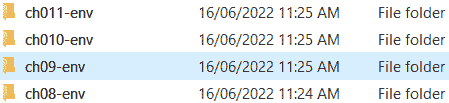
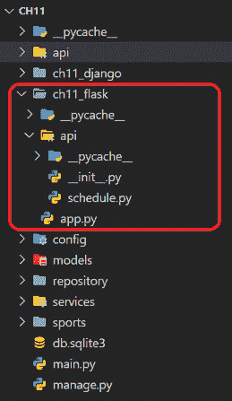

# 第十一章：添加其他微服务功能

我们探索 FastAPI 在构建微服务应用程序中的可扩展性的漫长旅程将随着本章的结束而结束，本章涵盖了基于设计模式的项目设置、维护和部署的一些标准建议，使用了一些与微服务相关的工具。本章将讨论*OpenTracing*机制及其在分布式 FastAPI 架构设置中的应用，例如使用*Jaeger*和`StarletteTracingMiddleWare`等工具。同样，*服务注册*和*客户端发现*设计模式也包含在如何管理访问微服务 API 端点的详细讨论中。一个检查 API 端点*健康状态*的微服务组件也将是讨论的一部分。此外，本章在结束之前还将提供关于 FastAPI 应用程序的*部署*建议，这可能导致其他设计策略和网络设置。

本章的主要目标是完成 FastAPI 应用程序的设计架构，在签发之前。以下是完成我们的 FastAPI 应用程序开发之旅的议题：

+   设置虚拟环境

+   检查 API 属性

+   实施开放跟踪机制

+   设置服务注册和客户端服务发现

+   使用 Docker 部署和运行应用程序

+   使用 Docker Compose 进行部署

+   利用 NGINX 作为 API 网关

+   集成 Django 和 Flask 子应用程序

# 技术要求

我们最后的软件原型将是`ch11`和其他*第十一章*相关项目。

# 设置虚拟环境

让我们从设置我们的 FastAPI 应用程序的开发环境的正确方式开始。在 Python 开发中，使用虚拟环境管理所需的库和扩展模块是很常见的。虚拟环境是一种创建多个不同且并行安装的 Python 解释器和它们的依赖项的方式，其中每个实例都有要编译和运行的应用程序。每个实例都有其自己的库集合，这取决于其应用程序的需求。但首先，我们需要安装`virtualenv`模块以追求创建这些实例：

```py
pip install virtualenv
```

以下列表描述了拥有虚拟环境的好处：

+   避免库版本的冲突

+   避免由于命名空间冲突而导致的已安装模块文件损坏

+   将库本地化以避免与某些应用程序非常依赖的全局安装的模块冲突

+   创建要复制到某些相关项目的模块集的模板或基线副本

+   维护操作系统性能和设置

安装后，我们需要运行`python -m virtualenv`命令来创建一个实例。*图 11.1*显示了如何为`ch01`项目创建`ch01-env`虚拟环境：


图 11.1 – 创建 Python 虚拟环境

要使用虚拟环境，我们需要配置我们的 *VS Code 编辑器* 以使用虚拟环境的 Python 解释器而不是全局解释器来安装模块、编译和运行应用程序。按下 *Ctrl* + *Shift* + *P* 将会打开 *命令面板*，显示用于 *选择解释器* 的 Python 命令。*图 11.2* 展示了为 `ch01` 项目选择 Python 解释器的过程：


图 11.2 – 选择 Python 解释器

选择命令将会打开一个弹出窗口 *文件资源管理器*，用于搜索带有 Python 解释器的适当虚拟环境，如图 *图 11.3* 所示：


图 11.3 – 搜索虚拟环境

为项目打开 *终端控制台* 将会自动通过运行 Windows 操作系统的 `/Scripts/activate.bat` 命令来激活虚拟环境。此外，如果自动激活不成功，可以手动运行此 `activate.bat` 脚本。顺便说一句，使用 Powershell 终端无法激活，但只能使用命令控制台，如图 *图 11.4* 所示：


图 11.4 – 激活虚拟环境

激活后，我们可以从命令行的最左侧确定已激活的虚拟环境名称。*图 11.4* 显示 `ch11-env` 的 Python 解释器是项目选择的解释器。通过其 `pip` 命令安装的任何内容都只在该实例中可用。

我们的每个项目都有一个虚拟环境，因此拥有多个包含不同已安装模块依赖关系的虚拟环境，如图 *图 11.5* 所示：



图 11.5 – 创建多个虚拟环境

在启动 Python 微服务应用程序时，设置虚拟环境只是最佳实践之一。除了本地化模块安装外，它还有助于准备应用程序的部署，例如确定在云服务器上安装哪些模块。然而，在我们讨论 FastAPI 部署方法之前，首先让我们讨论在部署项目之前应包含哪些微服务工具，例如 **Prometheus**。

# 检查 API 属性

**Prometheus** 是一个流行的监控工具，可以监控和检查任何微服务应用程序中的 API 服务。它可以检查并发请求事务的数量、一定时期内的响应数量以及端点的总请求量。要将 Prometheus 应用于 FastAPI 应用程序，首先，我们需要安装以下模块：

```py
pip install starlette-exporter
```

然后，我们将 `PrometheusMiddleware` 添加到应用程序中，并启用其端点以在运行时观察 API 的属性。以下脚本显示了使用 Prometheus 监控模块的应用程序设置：

```py
from starlette_exporter import PrometheusMiddleware, 
         handle_metrics
app = FastAPI()
app.add_middleware(PrometheusMiddleware, app_name=”osms”) 
app.add_route(“/metrics”, handle_metrics)
```

在这里，我们使用 FastAPI 的 `add_middleware()` 方法添加 `PrometheusMiddleware`。然后，我们将一个任意的 URI 模式添加到 `handle_metrics()` 工具中，以公开所有 API 健康细节。访问 `http://localhost:8000/metrics` 将提供如图 *Figure 11.6* 所示的内容：


Figure 11.6 – 监控端点

*Figure 11.6* 中的数据显示了每个 API 在处理请求、向客户端提供响应和发出每个 API 事务状态码时所用的时间长度（以秒为单位）。此外，它还包括一些内置值，这些值由工具用于创建直方图。除了直方图之外，Prometheus 还允许自定义特定应用程序的一些固有指标。

监控 FastAPI 微服务应用程序的另一种方式是通过添加一个开放跟踪工具。

# 实现开放跟踪机制

当监控多个独立且分布式的微服务时，在管理 API 日志和跟踪时，*OpenTracing* 机制是首选。如 *Zipkin*、*Jaeger* 和 *Skywalking* 这样的工具是流行的分布式跟踪系统，可以提供跟踪和日志收集的设置。在这个原型中，我们将使用 Jaeger 工具来管理应用程序的 API 跟踪和日志。

将 OpenTracing 工具集成到 FastAPI 微服务中的当前方式是通过 *OpenTelemetry* 模块，因为 *Opentracing for Python* 扩展已经是一个已弃用的模块。要使用 Jaeger 作为跟踪服务，OpenTelemetry 提供了一个 *OpenTelemetry Jaeger Thrift Exporter* 工具，它允许您将跟踪导出到 Jaeger 客户端应用程序。此导出工具使用 Thrift 压缩协议通过 UDP 将这些跟踪发送到配置的代理。但首先，我们需要安装以下扩展来利用此导出工具：

```py
pip install opentelemetry-exporter-jaeger
```

之后，将以下配置添加到 `main.py` 文件中：

```py
from opentelemetry import trace
from opentelemetry.exporter.jaeger.thrift import 
          JaegerExporter
from opentelemetry.sdk.resources import SERVICE_NAME, 
          Resource
from opentelemetry.sdk.trace import TracerProvider
from opentelemetry.sdk.trace.export import 
          BatchSpanProcessor
from opentelemetry.instrumentation.fastapi import 
          FastAPIInstrumentor
from opentelemetry.instrumentation.logging import 
         LoggingInstrumentor
app = FastAPI()
resource=Resource.create(
        {SERVICE_NAME: “online-sports-tracer”})
tracer = TracerProvider(resource=resource)
trace.set_tracer_provider(tracer)
jaeger_exporter = JaegerExporter(
    # configure client / agent
    agent_host_name=’localhost’,
    agent_port=6831,
    # optional: configure also collector
    # collector_endpoint=
    #     ‘http://localhost:14268/api/traces?
    #            format=jaeger.thrift’,
    # username=xxxx, # optional
    # password=xxxx, # optional
    # max_tag_value_length=None # optional
)
span_processor = BatchSpanProcessor(jaeger_exporter)
tracer.add_span_processor(span_processor)
FastAPIInstrumentor.instrument_app(app, 
          tracer_provider=tracer)
LoggingInstrumentor().instrument(set_logging_format=True)
```

在上述设置中的第一步是使用 OpenTelemetry 的 `Resource` 类创建一个具有名称的跟踪服务。然后，我们从服务资源实例化一个跟踪器。为了完成设置，我们需要向跟踪器提供通过 `JaegerExporter` 详细信息实例化的 `BatchSpanProcessor`，以使用 Jaeger 客户端管理所有痕迹和日志。一个 *痕迹* 包含关于所有 API 服务和其他组件之间请求和响应交换的完整详细信息。这与 *日志* 不同，它只包含关于应用程序内事务的详细信息。

在完成 Jaeger 跟踪器设置后，我们通过 `FastAPIInstrumentor` 将 `tracer` 客户端与 FastAPI 集成。为了使用这个类，首先，我们需要安装以下扩展：

```py
pip install opentelemetry-instrumentation-fastapi
```

在我们可以运行我们的应用程序之前，首先，我们需要从 `https://www.jaegertracing.io/download/` 下载一个 Jaeger 客户端，解压缩 `jaeger-xxxx-windows-amd64.tar.gz` 文件，并运行 `jaeger-all-in-one.exe`。Linux 和 macOS 的安装程序也都可以使用。

现在，打开浏览器并通过默认的 `http://localhost:16686` 访问 Jaeger 客户端。*图 11.7* 展示了跟踪器客户端的快照：


图 11.7 – 通过 Jaeger 客户端监控微服务

在进行一些浏览器刷新后，Jaeger 应用程序将在运行我们的微服务应用程序后通过其服务名称 `online-sports-tracer` 检测到我们的跟踪器。所有访问的 API 端点都会被检测和监控，从而创建所有这些端点产生的请求和响应事务的痕迹和可视化分析。*图 11.8* 展示了 Jaeger 生成的痕迹和图形图表：


图 11.8 – 搜索每个 API 事务的痕迹

在 OpenTelemetry 中，一个跨度相当于一个具有唯一 *ID* 的 *痕迹*，我们可以通过点击每个端点的搜索痕迹来检查每个跨度以查看所有细节。点击如 *图 11.8* 所示的 `/ch11/login/list/all` 端点的搜索痕迹，可以提供以下痕迹细节：


图 11.9 – 检查端点的痕迹细节

除了 *图 11.9* 中显示的痕迹外，Jaeger 客户端还可以通过名为 `opentelemetry-instrumentation-logging` 的 OpenTelemetry 模块收集 *uvicorn 日志*。在安装模块后，我们可以在 `main.py` 文件中实例化 `LoggingInstrumentor` 以启用集成，如前代码片段所示。

现在，让我们向我们的应用程序添加 *服务注册* 和 *客户端服务发现* 机制。

# 设置服务注册和客户端服务发现

服务注册工具如*Netflix Eureka*允许在不知道其服务器确切 DNS 位置的情况下注册微服务应用程序。它使用负载均衡算法管理对所有已注册服务的访问，并动态地为这些服务实例分配网络位置。这种服务注册对于部署在 DNS 名称因故障、升级和增强而变化的服务器上的微服务应用程序非常有用。

为了使服务注册能够工作，服务实例应该在服务器注册之前有一个机制来发现注册服务器。对于 FastAPI，我们需要利用`py_eureka_client`模块来实现服务发现设计模式。

## 实现客户端服务发现

创建一个用于发现和注册到服务注册服务器（如*Netflix Eureka*）的 FastAPI 微服务应用程序是直接的。首先，我们需要通过`pip`安装`py_eureka_client`：

```py
pip install py_eureka_client
```

然后，我们使用正确的`eureka_server`、`app_name`、`instance_port`和`instance_host`参数细节实例化其`EurekaClient`组件类。`eureka_server`参数必须是 Eureka 服务器的确切机器地址，而不是`localhost`。此外，客户端实例必须具有适用于 FastAPI 微服务应用程序（或客户端应用程序）的适当`app_name`参数，`instance_port`参数设置为`8000`，`instance_host`设置为`192.XXX.XXX.XXX`（不是`localhost`或`127.0.0.1`）。以下代码片段显示了在`main.py`中实例化`EurekaClient`组件类的位置：

```py
from py_eureka_client.eureka_client import EurekaClient
app = FastAPI()
@app.on_event(“startup”)
async def init():
    create_async_db() 
    global client
    client = EurekaClient(
     eureka_server=”http://DESKTOP-56HNGC9:8761/eureka”, 
     app_name=”sports_service”, instance_port=8000, 
     instance_host=”192.XXX.XXX.XXX”)
    await client.start()
@app.on_event(“shutdown”)
async def destroy():
    close_async_db() 
    await client.stop()
```

客户端发现发生在应用程序的`startup`事件中。它从实例化`EurekaClient`组件类并调用其`start()`方法（异步或非异步）开始。`EurekaClient`组件类可以处理异步或同步的 FastAPI 启动事件。要关闭服务器发现过程，始终在`shutdown`事件中调用`EurekaClient`的`stop()`方法。现在，在运行和执行客户端服务发现之前，让我们构建我们的 Netflix Eureka 服务器注册。

## 设置 Netflix Eureka 服务注册

让我们利用 Spring Boot 平台来创建我们的 Eureka 服务器。我们可以通过`https://start.spring.io/`或*Spring STS IDE*创建一个应用程序，使用由 Maven 或 Gradle 驱动的应用程序。我们的是一个 Maven 应用程序，具有`pom.xml`，其中包含以下依赖项用于 Eureka 服务器设置：

```py
<dependency>
      <groupId>org.springframework.cloud</groupId>
      <artifactId>
       spring-cloud-starter-netflix-eureka-server
     </artifactId>
</dependency>
```

在这种情况下，`application.properties`必须将`server.port`设置为`8761`，启用`server.shutdown`以实现`graceful`服务器关闭，并将`spring.cloud.inetutils.timeout-seconds`属性设置为`10`以进行主机名计算。

现在，在运行 FastAPI 客户端应用程序之前运行 Eureka 服务器应用程序。Eureka 服务器的日志将显示 FastAPI 的`EurekaClient`的自动检测和注册，如图*11.10*所示：


图 11.10 – 发现 FastAPI 微服务应用

客户端服务发现的成果在 Eureka 服务器的仪表板`http://localhost:8761`上也很明显。页面将显示所有包含注册表的服务，我们可以通过这些服务访问和测试每个服务。*图 11.11*显示了仪表板的示例快照：


图 11.11 – 创建服务注册表

如*图 11.11*所示，我们的**SPORTS_SERVICE**作为 Eureka 服务器注册表的一部分，意味着我们成功实现了*客户端服务发现设计模式*，现在是时候将我们的应用程序部署到 Docker 容器中。

# 使用 Docker 部署和运行应用程序

*Docker 化*是一个使用 Docker 容器打包、部署和运行应用程序的过程。将 FastAPI 微服务容器化可以节省安装和设置时间、空间和资源。与传统的部署打包相比，容器化应用程序具有可替换性、可复制性、高效性和可扩展性。

为了追求 Docker 化，我们需要安装*Docker Hub*和/或*Docker Engine*以使用 CLI 命令。但请注意关于其新订阅模式的新 Docker Desktop 许可协议([`www.docker.com/legal/docker-software-end-user-license-agreement/`](https://www.docker.com/legal/docker-software-end-user-license-agreement/))。本章主要关注如何运行 CLI 命令，而不是 Docker Hub 的 GUI 工具。现在，让我们生成要安装到 docker 镜像中的模块列表。

## 生成 requirements.txt 文件

由于我们使用虚拟环境实例进行模块管理，因此很容易确定在 Docker 镜像中要安装哪些扩展模块。我们可以运行以下命令将模块及其版本完整列表生成到`requirements.txt`文件中：

```py
pip freeze > requirements.txt 
```

然后，我们可以创建一个命令通过`Dockerfile`将此文件复制到镜像中。

## 创建 Docker 镜像

下一步是从*Docker Hub*中任何可用的基于 Linux 的容器镜像构建容器镜像。但我们需要一个包含所有与从 Docker Hub 拉取可用 Python 镜像、创建工作目录和从本地目录复制项目文件相关的命令的`Dockerfile`。以下是我们用于将原型部署到 Python 镜像的`Dockerfile`指令集：

```py
FROM python:3.9
WORKDIR /code
COPY ./requirements.txt /code/requirements.txt
RUN pip install --no-cache-dir --upgrade -r 
                /code/requirements.txt
COPY ./ch11 /code
EXPOSE 8000
CMD [“uvicorn”, “main:app”, “--host=0.0.0.0” , “--reload” ,
     “--port”, “8000”]
```

第一行是一个指令，它将导出一个安装了 Python 3.9 解释器的 Python 镜像，通常是基于 Linux 的。之后的命令创建了一个任意文件夹`/code`，它将成为应用程序的主要文件夹。`COPY`命令将我们的`requirements.txt`文件复制到`/code`文件夹，然后`RUN`指令使用以下命令从`requirements.txt`列表中安装更新的模块：

```py
pip install -r requirements.txt 
```

之后，第二个 `COPY` 命令将我们的 `ch11` 应用程序复制到工作目录。`EXPOSE` 命令将端口 `8000` 绑定到本地机器的端口 `8000` 以运行 `CMD` 命令，这是 `Dockerfile` 的最后一条指令。`CMD` 指令使用 *uvicorn* 在端口 `8000` 上使用主机 `0.0.0.0` 运行应用程序，而不是 `localhost` 以自动映射并利用分配给镜像的 IP 地址。

`Dockerfile` 必须与 `requirements.txt` 文件和 `ch11` 应用程序在同一文件夹中。*图 11.12* 展示了需要将文件和文件夹 Docker 化到 Python 容器镜像中的组织结构：


图 11.12 – 设置 Docker 文件夹结构

一旦所有文件和文件夹都准备好了，我们就在终端控制台使用以下 CLI 命令在该文件夹内运行：

```py
docker build -t ch11-app .
```

要检查镜像，运行 `docker image ls` CLI 命令。

## 使用 Mongo Docker 镜像

我们应用程序的后端是 MongoDB，因此我们需要使用以下 CLI 命令从 Docker Hub 拉取最新的 `mongo` 镜像：

```py
docker pull mongo:latest
```

在我们运行 `ch11-app` 应用程序和 `mongo:latest` 镜像之前，首先需要通过运行以下命令创建一个 `ch11-network`：

```py
docker network create ch11-network
```

一旦它们作为容器部署，这个网络就成为了 `mongo` 和 `ch11-app` 之间的桥梁。它将建立两个容器之间的连接，以追求 *Motor-ODM* 事务。

## 创建容器

一个 `docker run` 命令用于启动和运行已拉取或创建的镜像。因此，使用 `ch11-network` 路由运行 Mongo 镜像需要执行以下 CLI 命令：

```py
docker run --name=mongo --rm -p 27017:27017 -d                 --network=ch11-network mongo
```

使用 `docker inspect` 命令检查 `mongo:latest` 容器，以获取并使用其 IP 地址为 Motor-ODM 的连接性。将 `AsyncIOMotorClient` 中使用的 `localhost` 替换为“检查到的”IP 地址，该地址位于 `ch11-app` 的 `config/db.py` 模块中。更新后，务必重新构建 `ch11-app` Docker 镜像。

现在，使用以下命令运行 `ch11-app` 镜像，并使用 `ch11-network`：

```py
docker run --name=ch11-app --rm -p 8000:8000-d             --network=ch11-network ch11-app
```

通过 `http://localhost:8000/docs` 访问应用程序，以检查 OpenAPI 文档中的所有 API 端点。

现在，另一种简化容器化的方法是使用 *Docker Compose* 工具。

# 使用 Docker Compose 进行部署

然而，您需要在操作系统上安装 Docker Compose 工具，这需要 Docker 引擎作为预安装要求。安装后，下一步是创建包含构建镜像、处理 Dockerfile、构建 Docker 网络以及创建和运行容器的所有所需服务的 `docker-decompose.yaml` 文件。以下片段显示了我们的配置文件内容，该文件设置了 `mongo` 和 `ch11-app` 容器：

```py
version: “3”
services: 
    ch11-mongo:
        image: “mongo”
        ports:
            - 27017:27017
        expose:
            - 27017
        networks:
            - ch11-network

    ch11-app:
        build: .     # requires the Dockerfile
        depends_on: 
            - ch11-mongo
        ports:
            - 8000:8000
        networks:
            - ch11-network
networks:
    ch11-network:
      driver: bridge 
```

我们将不会运行单独的 Docker CLI 命令，Docker Compose 创建服务，如 `ch11-mongo` 和 `ch11-app`，以管理容器化，并且只使用一个 CLI 命令来执行这些服务，即 `docker-compose up`。该命令不仅创建图像网络，还运行所有容器。

使用 Docker Compose 的一个优点是 ORM 和 ODM 配置的简便性。我们不需要执行容器检查来了解使用哪个 IP 地址，我们可以使用数据库设置的 *服务名称* 作为主机名来建立数据库连接。这很方便，因为每个创建的 `mongo` 容器的 IP 地址都不同。以下是将 `ch11-mongo` 服务作为主机名的新 `AsyncIOMotorClient`：

```py
def create_async_db():
    global client
    client = AsyncIOMotorClient(str(“ch11-mongo:27017”))
```

现在，让我们使用 *NGINX* 工具为容器化应用程序实现 API 网关设计模式。

# 使用 NGINX 作为 API 网关

在 *第四章**，构建微服务应用程序* 中，我们仅使用一些 FastAPI 组件实现了 API 网关设计模式。在本章的最后，我们将通过 NGINX 建立一个 *反向代理服务器*，将为每个容器化的微服务应用程序分配一个代理 IP 地址。这些代理 IP 将将客户端请求重定向到各自容器上运行的相应微服务。

我们将不会构建实际的 NGINX 环境，而是从 Docker Hub 拉取可用的 NGINX 镜像来实现反向代理服务器。此镜像创建需要一个包含以下指令的新 Docker 应用程序文件夹和不同的 `Dockerfile`：

```py
FROM nginx:latest
COPY ./nginx_config.conf /etc/nginx/conf.d/default.conf
```

`Dockerfile` 指示创建最新的 *NGINX* 镜像，并将 `nginx_config.conf` 文件复制到该镜像中。该文件是一个 *NGINX 配置文件*，其中包含将代理 IP 地址映射到每个微服务应用程序的实际容器地址的映射。它还公开 `8080` 作为其官方端口。以下是我们 `nginx_config.conf` 文件的内容：

```py
server {
    listen 8080;
    location / {
        proxy_pass http://192.168.1.7:8000;
    }
} 
```

该应用程序的 OpenAPI 文档现在可以通过 `http://localhost:8080/docs` 访问。

NGINX 的 Docker 化必须在将应用程序部署到容器之后进行。但另一种方法是将在应用程序的 `Dockerfile` 中包含 NGINX 的 `Dockerfile` 指令，以节省时间和精力。或者我们可以在 `docker-decompose.yaml` 文件中创建另一个服务来构建和运行 NGINX 镜像。

最后一次，让我们探索 FastAPI 与其他流行的 Python 框架（如 *Flask* 和 *Django*）集成的强大功能。

# 集成 Flask 和 Django 子应用程序

*Flask* 是一个轻量级框架，因其 *Jinja2* 模板和 *WSGI* 服务器而受到欢迎。另一方面，*Django* 是一个 Python 框架，它通过 CLI 命令促进快速开发，并将文件和文件夹的脚手架应用于构建项目和应用程序。Django 应用程序可以在基于 WSGI 或 ASGI 的服务器上运行。

我们可以在 FastAPI 微服务应用程序内部创建、部署和运行 Flask 和 Django 项目。该框架具有 `WSGIMiddleware`，可以包裹 Flask 和 Django 应用程序并将它们集成到 FastAPI 平台上。通过 *uvicorn* 运行 FastAPI 应用程序也会运行这两个应用程序。

在这两个框架中，将 Flask 应用程序集成到项目中比 Django 更容易。我们只需将 Flask 的 `app` 对象导入到 `main.py` 文件中，用 `WSGIMiddleware` 包裹它，并将其挂载到 FastAPI 的 `app` 对象上。以下脚本展示了 `main.py` 中集成我们的 `ch11_flask` 项目的部分：

```py
from ch11_flask.app import app as flask_app
from fastapi.middleware.wsgi import WSGIMiddleware
app.mount(“/ch11/flask”, WSGIMiddleware(flask_app))
```

所有在 `ch11_flask` 中实现的 API 端点都将使用 `mount()` 方法中指示的 URL 前缀 `/ch11/flask` 进行访问。*图 11.13* 展示了 `ch11_flask` 在 `ch11` 项目中的位置：



图 11.13 – 在 FastAPI 项目中创建 Flask 应用程序

另一方面，以下 `main.py` 脚本将我们的 `ch11_django` 应用程序集成到 `ch11` 项目中：

```py
import os
from django.core.wsgi import get_wsgi_application
from importlib.util import find_spec
from fastapi.staticfiles import StaticFiles
os.environ.setdefault(‘DJANGO_SETTINGS_MODULE’, 
           ‘ch11_django.settings’)
django_app = get_wsgi_application()
app = FastAPI()
app.mount(‘/static’,
    StaticFiles(
         directory=os.path.normpath(
              os.path.join(
           find_spec(‘django.contrib.admin’).origin, 
                  ‘..’, ‘static’)
         )
   ),
   name=’static’,
)
app.mount(‘/ch11/django’, WSGIMiddleware(django_app))
```

Django 框架有一个 `get_wsgi_application()` 方法，用于检索其 `app` 实例。这个实例需要被 `WSGIMiddleware` 包裹并挂载到 FastAPI 的 `app` 对象上。此外，我们需要将 `ch11_django` 项目的 `settings.py` 模块加载到 FastAPI 平台，以便全局访问。我们还需要挂载 `django.contrib.main` 模块的所有静态文件，这包括 Django *安全模块* 的一些 HTML 模板。

`ch11_django` 项目的 `sports` 应用程序创建的所有视图和端点都必须使用 `/ch11/django` URL 前缀进行访问。*图 11.14* 展示了 `ch11_django` 项目在 `ch11` 应用程序中的位置：


图 11.14 – 在 FastAPI 对象中创建 Django 项目和应用程序

# 摘要

最后一章为我们提供了如何开始、部署和运行遵循标准和最佳实践的 FastAPI 微服务应用程序的途径。它介绍了从开发开始到将我们的应用程序部署到 Docker 容器中，使用虚拟环境实例来控制和管理工作模块安装的方法。本章详细解释了如何打包、部署和运行容器化应用程序的方法。最后，本章为应用程序实现了一个 NGINX 反向代理服务器，以构建我们的 API 网关。

从一开始，我们就见证了 FastAPI 框架的简洁性、强大、适应性和可扩展性，从创建后台进程到使用 HTML 模板渲染数据。它通过协程快速执行 API 端点，使该框架在未来有望成为最受欢迎的 Python 框架之一。随着 FastAPI 社区的持续增长，我们期待其在未来的更新中带来更多有前景的功能，例如支持响应式编程、断路器和签名安全模块。我们对 FastAPI 框架充满期待！
