# 第一章：使用 Django 开发 RESTful API

在本章中，我们将使用 Python 和四个不同的 Web 框架开始我们的 RESTful Web API 之旅。Python 是最受欢迎和最灵活的编程语言之一。有成千上万的 Python 包，允许你扩展 Python 的能力到任何你能想象的领域。我们可以使用许多不同的 Web 框架和包，轻松地用 Python 构建 simple 和 complex 的 RESTful Web API，我们还可以将这些框架与其他 Python 包结合使用。

我们可以利用我们对 Python 及其包的现有知识来编写我们 RESTful Web API 的不同部分及其生态系统。我们可以使用面向对象的功能来创建易于维护、理解和重用的代码。我们可以使用我们已知的所有包来与数据库、Web 服务和不同的 API 交互。Python 使我们能够轻松创建 RESTful Web API。我们不需要学习另一种编程语言；我们可以使用我们已知的并喜爱的语言。

在本章中，我们将开始使用 Django 和 Django REST 框架，并创建一个 RESTful Web API，该 API 在一个简单的 SQLite 数据库上执行 **CRUD**（**创建、读取、更新和删除**）操作。我们将：

+   设计一个与简单 SQLite 数据库交互的 RESTful API

+   理解每个 HTTP 方法执行的任务

+   使用 Django REST 框架设置虚拟环境

+   创建数据库模型

+   管理数据的序列化和反序列化

+   编写 API 视图

+   使用命令行工具向 API 发送 HTTP 请求

+   使用 GUI 工具来组合和发送 HTTP 请求

# 设计一个与简单 SQLite 数据库交互的 RESTful API

假设我们必须开始开发一个需要与 RESTful API 交互以执行 CRUD 操作的游戏移动应用。我们不希望花费时间选择和配置最合适的 **ORM**（**对象关系映射**）；我们只想尽快完成 RESTful API，以便通过我们的移动应用与之交互。我们确实希望游戏持久保存在数据库中，但我们不需要它具备生产就绪状态，因此，我们可以使用最简单的可能的关系数据库，只要我们不需要花费时间进行复杂的安装或配置。

Django REST 框架，也称为 DRF，将使我们能够轻松地完成这项任务，并开始向我们的第一个 RESTful Web 服务发送 HTTP 请求。在这种情况下，我们将使用一个非常简单的 SQLite 数据库，它是新 Django REST 框架项目的默认数据库。

首先，我们必须指定我们主要资源：游戏的要求。对于一个游戏，我们需要以下属性或字段：

+   一个整数标识符

+   一个名称或标题

+   一个发布日期

+   一个游戏类别描述，例如 *3D RPG* 和 *2D 移动街机*。

+   一个 `bool` 值，表示玩家是否至少玩过一次游戏

此外，我们希望我们的数据库保存一个时间戳，记录游戏被插入数据库的日期和时间。

下表显示了我们的 API 第一版必须支持的 HTTP 动词、作用域和方法语义。每个方法由一个 HTTP 动词和一个作用域组成，并且所有方法对所有游戏和集合都有一个明确定义的意义。

| **HTTP 动词** | **作用域** | **语义** |
| --- | --- | --- |
| `GET` | 游戏集合 | 获取集合中存储的所有游戏，按名称升序排序 |
| `GET` | 游戏 | 获取单个游戏 |
| `POST` | 游戏集合 | 在集合中创建新游戏 |
| `PUT` | 游戏 | 更新现有游戏 |
| `DELETE` | 游戏 | 删除现有游戏 |

### 小贴士

在 RESTful API 中，每个资源都有自己的唯一 URL。在我们的 API 中，每个游戏都有自己的唯一 URL。

# 理解每个 HTTP 方法执行的任务

在前一个表中，`GET` HTTP 动词出现了两次，但作用域不同。第一行显示了一个应用于游戏集合（资源集合）的 `GET` HTTP 动词，而第二行显示了一个应用于单个游戏（单一资源）的 `GET` HTTP 动词。

让我们考虑 `http://localhost:8000/games/` 是游戏集合的 URL。如果我们向该 URL 添加一个数字和一个斜杠（`/`），我们就可以识别一个特定的游戏，其 id 或主键等于指定的数值。例如，`http://localhost:8000/games/12/` 识别 id 或主键等于 `12` 的游戏。

我们必须使用以下 HTTP 动词（`POST`）和请求 URL（`http://localhost:8000/games/`）来创建一个新的游戏。此外，我们必须提供 **JSON**（**JavaScript 对象表示法**）键值对，包括字段名称和值以创建新游戏。作为请求的结果，服务器将验证提供的字段值，确保它是一个有效的游戏并将其持久化到数据库中。

服务器将在适当的表中插入一行新游戏，并返回一个 `201 已创建` 状态码，以及一个包含最近添加的游戏序列化为 JSON 的 JSON 主体，包括由数据库自动生成并分配给游戏对象的分配 id 或主键。

```py
POST http://localhost:8000/games/ 

```

我们必须使用以下 HTTP 动词（`GET`）和请求 URL（`http://localhost:8000/games/{id}/`）来检索 id 或主键与 `{id}` 处指定的数值匹配的游戏。

例如，如果我们使用请求 URL `http://localhost:8000/games/50/`，服务器将检索 id 或主键匹配 `50` 的游戏。

作为请求的结果，服务器将从数据库中检索具有指定 ID 或主键的游戏，并在 Python 中创建相应的游戏对象。如果找到游戏，服务器将游戏对象序列化为 JSON，并返回`200 OK`状态码和一个包含序列化游戏对象的 JSON 体。如果没有找到与指定 ID 或主键匹配的游戏，服务器将仅返回`404 Not Found`状态：

```py
GET http://localhost:8000/games/{id}/ 

```

我们必须使用以下 HTTP 动词（`PUT`）和请求 URL（`http://localhost:8000/games/{id}/`）来发送一个 HTTP 请求，以检索在`{id}`位置指定的数值匹配的游戏 ID 或主键，并用提供的数据创建的游戏替换它。此外，我们必须提供带有字段名称和值的 JSON 键值对，以创建将替换现有游戏的新游戏。作为请求的结果，服务器将验证提供的字段值，确保它是一个有效的游戏，并在数据库中将与指定 ID 或主键匹配的现有游戏替换为新游戏。更新操作后，游戏的 ID 或主键将保持不变。服务器将在适当的表中更新现有行，并返回一个`200 OK`状态码和一个包含序列化到 JSON 的最近更新的游戏的 JSON 体。如果我们没有提供新游戏所需的所有必要数据，服务器将返回`400 Bad Request`状态码。如果服务器找不到指定 ID 的游戏，服务器将仅返回`404 Not Found`状态。

```py
PUT http://localhost:8000/games/{id}/ 

```

我们必须使用以下 HTTP 动词（`DELETE`）和请求 URL（`http://localhost:8000/games/{id}/`）来发送一个 HTTP 请求，以删除 ID 或主键与在`{id}`位置指定的数值相匹配的游戏。例如，如果我们使用请求 URL `http://localhost:8000/games/20/`，服务器将删除 ID 或主键与`20`相匹配的游戏。作为请求的结果，服务器将从数据库中检索具有指定 ID 或主键的游戏，并在 Python 中创建相应的游戏对象。如果找到游戏，服务器将请求 ORM 删除与该游戏对象关联的游戏行，并返回`204 No Content`状态码。如果没有找到与指定 ID 或主键匹配的游戏，服务器将仅返回`404 Not Found`状态。

```py
DELETE http://localhost:8000/games/{id}/ 

```

# 使用轻量级虚拟环境

在整本书中，我们将使用不同的框架和库，因此，使用虚拟环境是很方便的。我们将使用 Python 3.3 中引入并 Python 3.4 中改进的轻量级虚拟环境。然而，你也可以选择使用流行的`virtualenv` ([`pypi.python.org/pypi/virtualenv`](https://pypi.python.org/pypi/virtualenv)) 第三方虚拟环境构建器或你的 Python IDE 提供的虚拟环境选项。

你只需确保在需要时使用适当的机制激活你的虚拟环境，而不是遵循使用 Python 中集成的`venv`模块生成的虚拟环境的步骤。你可以在[`www.python.org/dev/peps/pep-0405`](https://www.python.org/dev/peps/pep-0405)上阅读更多关于引入`venv`模块的 PEP 405 Python 虚拟环境的信息。

### 小贴士

我们使用`venv`创建的每个虚拟环境都是一个隔离的环境，并且它将在其 site 目录中拥有自己独立的一组已安装的 Python 包。当我们使用 Python 3.4 及更高版本中的`venv`创建虚拟环境时，pip 将包含在新的虚拟环境中。在 Python 3.3 中，创建虚拟环境后需要手动安装 pip。请注意，提供的说明与 Python 3.4 或更高版本兼容，包括 Python 3.5.x。以下命令假设你在 macOS、Linux 或 Windows 上安装了 Python 3.5.x。

首先，我们必须选择我们的虚拟环境的目标文件夹或目录。以下是在示例中我们将使用的路径，用于 macOS 和 Linux。虚拟环境的目标文件夹将是我们主目录中的`PythonREST/Django`文件夹。例如，如果我们的 macOS 或 Linux 中的主目录是`/Users/gaston`，虚拟环境将在`/Users/gaston/PythonREST/Django`中创建。你可以在每个命令中将指定的路径替换为你想要的路径。

```py
 ~/PythonREST/Django 
```

以下是在示例中我们将使用的路径。虚拟环境的目标文件夹将是我们用户配置文件中的`PythonREST/Django`文件夹。例如，如果我们的用户配置文件是`C:\Users\Gaston`，虚拟环境将在`C:\Users\gaston\PythonREST\Django`中创建。你可以在每个命令中将指定的路径替换为你想要的路径。

```py
%USERPROFILE%\PythonREST\Django
```

现在，我们必须使用`-m`选项后跟`venv`模块名称和所需的路径，以便 Python 将此模块作为脚本运行并创建指定路径中的虚拟环境。根据我们创建虚拟环境的平台，说明可能会有所不同。

在 macOS 或 Linux 中打开一个终端并执行以下命令以创建虚拟环境：

```py
python3 -m venv ~/PythonREST/Django01
```

在 Windows 中，执行以下命令以创建虚拟环境：

```py
python -m venv %USERPROFILE%\PythonREST\Django01
```

前一个命令不会产生任何输出。脚本创建了指定的目标文件夹，并通过调用`ensurepip`安装了 pip，因为我们没有指定`--without-pip`选项。指定的目标文件夹包含一个新的目录树，其中包含 Python 可执行文件和其他表明它是一个虚拟环境的文件。

`pyenv.cfg`配置文件指定了虚拟环境的不同选项，其存在表明我们处于虚拟环境的根目录。在 OS 和 Linux 中，该文件夹将包含以下主要子文件夹—`bin`、`include`、`lib`、`lib/python3.5`和`lib/python3.5/site-packages`。在 Windows 中，该文件夹将包含以下主要子文件夹—`Include`、`Lib`、`Lib\site-packages`和`Scripts`。每个平台中虚拟环境的目录树与这些平台中 Python 安装的布局相同。以下截图显示了在 macOS 中为`Django01`虚拟环境生成的目录树中的文件夹和文件：

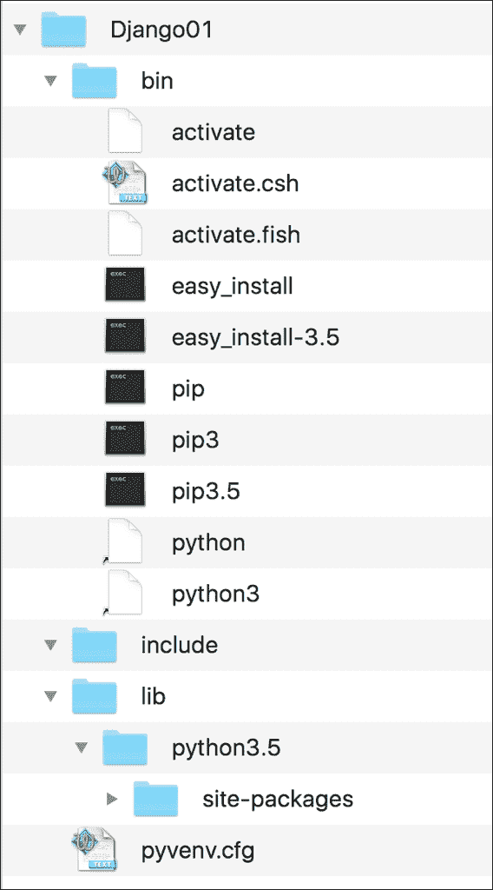

以下截图显示了为 Windows 中的虚拟环境生成的目录树中的主要文件夹：

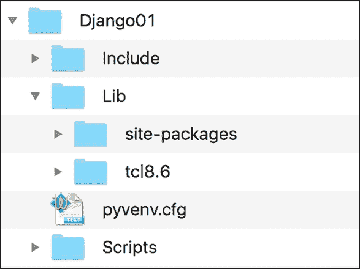

### 小贴士

激活虚拟环境后，我们将安装第三方软件包到虚拟环境中，模块将位于`lib/python3.5/site-packages`或`Lib\site-packages`文件夹中，具体取决于平台。可执行文件将被复制到`bin`或`Scripts`文件夹中，具体取决于平台。我们安装的软件包不会更改其他虚拟环境或我们的基础 Python 环境。

现在我们已经创建了一个虚拟环境，我们将运行一个特定平台的脚本以激活它。激活虚拟环境后，我们将安装仅在此虚拟环境中可用的软件包。

在 macOS 或 Linux 的终端中运行以下命令。请注意，如果您在终端会话中没有启动除默认 shell 之外的其他 shell，则此命令的结果将准确无误。如果您有疑问，请检查您的终端配置和首选项。

```py
echo $SHELL
```

该命令将显示您在终端中使用的 shell 名称。在 macOS 中，默认为`/bin/bash`，这意味着您正在使用 bash shell。根据 shell 的不同，您必须在 OS 或 Linux 中运行不同的命令来激活虚拟环境。

如果您的终端配置为在 macOS 或 Linux 中使用`bash` shell，请运行以下命令以激活虚拟环境。该命令也适用于`zsh` shell：

```py
source ~/PythonREST/Django01/bin/activate
```

如果您的终端配置为使用`csh`或`tcsh` shell，请运行以下命令以激活虚拟环境：

```py
source ~/PythonREST/Django01/bin/activate.csh
```

如果您的终端配置为使用`fish` shell，请运行以下命令以激活虚拟环境：

```py
source ~/PythonREST/Django01/bin/activate.fish
```

在 Windows 中，您可以在命令提示符中运行批处理文件或在 Windows PowerShell 中运行脚本以激活虚拟环境。如果您更喜欢命令提示符，请在 Windows 命令行中运行以下命令以激活虚拟环境：

```py
%USERPROFILE%\PythonREST\Django01\Scripts\activate.bat
```

如果你更喜欢 Windows PowerShell，请启动它并运行以下命令来激活虚拟环境。然而，请注意，你需要在 Windows PowerShell 中启用脚本执行才能运行脚本：

```py
cd $env:USERPROFILE
PythonREST\Django01\Scripts\Activate.ps1
```

在激活虚拟环境后，命令提示符将显示括号内的虚拟环境根文件夹名称作为默认提示的前缀，以提醒我们我们正在虚拟环境中工作。在这种情况下，我们将看到 (`Django01`) 作为命令提示符的前缀，因为激活的虚拟环境的根文件夹是 `Django01`。

以下截图显示了在 macOS El Capitan 终端中执行之前显示的命令后激活的虚拟环境：

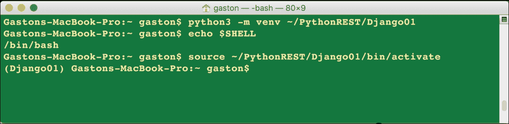

正如我们在前面的截图中所见，在激活虚拟环境后，提示符从 `Gastons-MacBook-Pro:~ gaston$` 变成了 `(Django01) Gastons-MacBook-Pro:~ gaston$`。

以下截图显示了在执行之前显示的命令后，在 Windows 10 命令提示符中激活的虚拟环境：

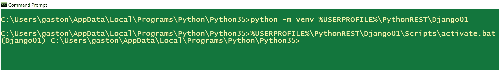

正如我们从前面的截图中所注意到的，在激活虚拟环境后，提示符从 `C:\Users\gaston\AppData\Local\Programs\Python\Python35` 变成了 `(Django01) C:\Users\gaston\AppData\Local\Programs\Python\Python35`。

### 小贴士

使用之前解释的过程生成的虚拟环境非常容易取消激活。在 macOS 或 Linux 中，只需键入 `deactivate` 并按 Enter 键。在 Windows 命令提示符中，你必须运行包含在 Scripts 文件夹中的 `deactivate.bat` 批处理文件（在我们的例子中是 `%USERPROFILE%\PythonREST\Django01\Scripts\deactivate.bat`）。在 Windows PowerShell 中，你必须运行 `Scripts` 文件夹中的 `Deactivate.ps1` 脚本。取消激活将删除在环境变量中做出的所有更改。

# 设置 Django REST 框架的虚拟环境

我们已经创建并激活了一个虚拟环境。现在是时候运行许多在 macOS、Linux 或 Windows 上都相同的命令了。现在，我们必须运行以下命令来安装 Django Web 框架：

```py
pip install django
```

输出的最后几行将指示 `django` 包已成功安装。请注意，你也可能看到升级 `pip` 的通知。

```py
Collecting django
Installing collected packages: django
Successfully installed django-1.10
```

现在我们已经安装了 Django Web 框架，我们可以安装 Django REST 框架。我们只需运行以下命令来安装此包：

```py
pip install djangorestframework
```

输出的最后几行将指示 `djangorestframework` 包已成功安装：

```py
Collecting djangorestframework
Installing collected packages: djangorestframework
Successfully installed djangorestframework-3.3.3
```

进入虚拟环境的根文件夹 `Django01`。在 macOS 或 Linux 中，输入以下命令：

```py
cd ~/PythonREST/Django01
```

在 Windows 中，输入以下命令：

```py
cd /d %USERPROFILE%\PythonREST\Django01
```

执行以下命令以创建一个名为 `gamesapi` 的新 Django 项目。该命令不会产生任何输出：

```py
django-admin.py startproject gamesapi
```

之前的命令创建了一个包含其他子文件夹和 Python 文件的 `gamesapi` 文件夹。现在，前往最近创建的 `gamesapi` 文件夹。只需执行以下命令：

```py
cd gamesapi
```

然后，运行以下命令以在 `gamesapi` Django 项目中创建一个名为 `games` 的新 Django 应用。该命令不会产生任何输出：

```py
python manage.py startapp games
```

之前的命令创建了一个新的 `gamesapi/games` 子文件夹，包含以下文件：

+   `__init__.py`

+   `admin.py`

+   `apps.py`

+   `models.py`

+   `tests.py`

+   `views.py`

此外，`gamesapi/games` 文件夹将有一个 `migrations` 子文件夹，其中包含一个 `__init__.py` Python 脚本。以下图显示了以 `gamesapi` 文件夹为起点的目录树中的文件夹和文件：

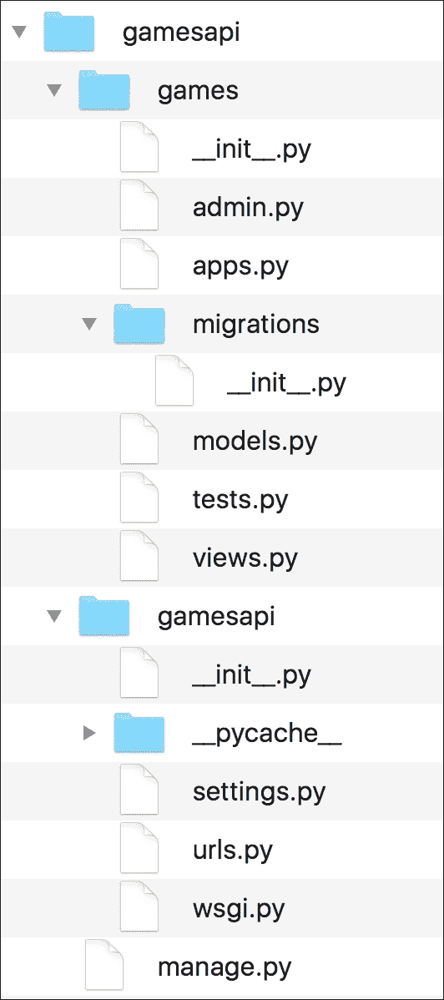

让我们检查 `gamesapi/games` 文件夹内 `apps.py` 文件中的 Python 代码。以下行显示了该文件的代码：

```py
from django.apps import AppConfig 

class GamesConfig(AppConfig): 
    name = 'games' 

```

代码声明 `GamesConfig` 类作为 `django.apps.AppConfig` 类的子类，该类代表 Django 应用及其配置。`GamesConfig` 类仅定义了 `name` 类属性，并将其值设置为 `'games'`。我们必须将 `games.apps.GamesConfig` 添加到配置 `gamesapi` Django 项目的 `gamesapi/settings.py` 文件中的已安装应用之一。我们构建前面的字符串如下 - 应用名称 + `.apps.` + 类名称，即 `games` + `.apps.` + `GamesConfig`。此外，我们还需要添加 `rest_framework` 应用，以便我们能够使用 Django REST 框架。

`gamesapi/settings.py` 文件是一个 Python 模块，其中包含模块级别的变量，用于定义 `gamesapi` 项目的 Django 配置。我们将对此 Django 设置文件进行一些修改。打开 `gamesapi/settings.py` 文件，找到以下指定已安装应用字符串列表的行：

```py
INSTALLED_APPS = [ 
    'django.contrib.admin', 
    'django.contrib.auth', 
    'django.contrib.contenttypes', 
    'django.contrib.sessions', 
    'django.contrib.messages', 
    'django.contrib.staticfiles', 
] 

```

将以下两个字符串添加到 `INSTALLED_APPS` 字符串列表中，并将更改保存到 `gamesapi/settings.py` 文件中：

+   `'rest_framework'`

+   `'games.apps.GamesConfig'`

以下行显示了带有突出显示的新代码，该代码声明了带有添加行的 `INSTALLED_APPS` 字符串列表。示例代码文件包含在 `restful_python_chapter_01_01` 文件夹中：

```py
INSTALLED_APPS = [ 
    'django.contrib.admin', 
    'django.contrib.auth', 
    'django.contrib.contenttypes', 
    'django.contrib.sessions', 
    'django.contrib.messages', 
    'django.contrib.staticfiles', 
    # Django REST Framework 
    'rest_framework', 
    # Games application 
    'games.apps.GamesConfig', 
] 

```

这样，我们就将 Django REST 框架和 `games` 应用添加到了我们的初始 Django 项目 `gamesapi` 中。

# 创建模型

现在，我们将创建一个简单的 `Game` 模型，我们将使用它来表示和持久化游戏。打开 `games/models.py` 文件。以下行显示了该文件的初始代码，仅包含一个导入语句和一个注释，指示我们应该创建模型：

```py
from django.db import models 

# Create your models here. 

```

以下行显示了在 `games/models.py` 文件中创建 `Game` 类的新代码，特别是创建 `Game` 模型。示例的代码文件包含在 `restful_python_chapter_01_01` 文件夹中：

```py
from django.db import models 

class Game(models.Model): 
    created = models.DateTimeField(auto_now_add=True) 
    name = models.CharField(max_length=200, blank=True, default='') 
    release_date = models.DateTimeField() 
    game_category = models.CharField(max_length=200, blank=True, default='') 
    played = models.BooleanField(default=False) 

    class Meta: 
        ordering = ('name',) 

```

`Game` 类是 `django.db.models.Model` 类的子类。每个定义的属性代表一个数据库列或字段。当 Django 创建与模型相关的数据库表时，它会自动添加一个名为 `id` 的自增整数主键列。然而，模型将底层的 `id` 列映射到名为 `pk` 的属性上。我们指定了许多属性的字段类型、最大长度和默认值。该类声明了一个名为 Meta 的内部类，该类声明了一个排序属性并将其值设置为字符串的元组，其中第一个值是 `'name'` 字符串，表示我们默认希望按 `name` 属性的升序排序结果。

然后，我们需要为新近编写的 `Game` 模型创建初始迁移。我们只需运行以下 Python 脚本，我们还将首次同步数据库。默认情况下，Django 使用 SQLite 数据库。在这个例子中，我们将使用这个默认配置：

```py
python manage.py makemigrations games
```

以下行显示了运行上述命令后生成的输出。

```py
Migrations for 'games':
 0001_initial.py:
 - Create model Game
```

输出表明 `gamesapi/games/migrations/0001_initial.py` 文件包含了创建 `Game` 模型的代码。以下行显示了由 Django 自动生成的此文件的代码。示例的代码文件包含在 `restful_python_chapter_01_01` 文件夹中：

```py
# -*- coding: utf-8 -*- 
# Generated by Django 1.9.6 on 2016-05-17 21:19 
from __future__ import unicode_literals 

from django.db import migrations, models 

class Migration(migrations.Migration): 

    initial = True 

    dependencies = [ 
    ] 

    operations = [ 
        migrations.CreateModel( 
            name='Game', 
            fields=[ 
                ('id', models.AutoField(auto_created=True, primary_key=True,
                serialize=False, verbose_name='ID')), 
                ('created', models.DateTimeField(auto_now_add=True)), 
                ('name', models.CharField(blank=True, default='',
                 max_length=200)), 
                ('release_date', models.DateTimeField()), 
                ('game_category', models.CharField(blank=True, default='',
                 max_length=200)), 
                ('played', models.BooleanField(default=False)), 
            ], 
            options={ 
                'ordering': ('name',), 
            }, 
        ), 
    ] 

```

代码定义了一个名为 `Migration` 的 `django.db.migrations.Migration` 类的子类，该类定义了一个创建 `Game` 模型表的操作。现在，运行以下 Python 脚本来应用所有生成的迁移：

```py
python manage.py migrate
```

以下行显示了运行上述命令后生成的输出：

```py
Operations to perform:
 Apply all migrations: sessions, games, contenttypes, admin, auth
Running migrations:
 Rendering model states... DONE
 Applying contenttypes.0001_initial... OK
 Applying auth.0001_initial... OK
 Applying admin.0001_initial... OK
 Applying admin.0002_logentry_remove_auto_add... OK
 Applying contenttypes.0002_remove_content_type_name... OK
 Applying auth.0002_alter_permission_name_max_length... OK
 Applying auth.0003_alter_user_email_max_length... OK
 Applying auth.0004_alter_user_username_opts... OK
 Applying auth.0005_alter_user_last_login_null... OK
 Applying auth.0006_require_contenttypes_0002... OK
 Applying auth.0007_alter_validators_add_error_messages... OK
 Applying games.0001_initial... OK
 Applying sessions.0001_initial... OK
```

在运行上述命令后，我们会注意到我们的 `gamesapi` 项目根目录现在有一个 `db.sqlite3` 文件。我们可以使用 SQLite 命令行或任何其他允许我们轻松检查 SQLite 数据库内容的程序来检查 Django 生成的表。

在 macOS 和大多数现代 Linux 发行版中，SQLite 已经安装，因此你可以运行 `sqlite3` 命令行工具。然而，在 Windows 上，如果你想要使用 `sqlite3.exe` 命令行工具，你必须从其网页下载并安装 SQLite - [`www.sqlite.org`](http://www.sqlite.org)。

运行以下命令以列出生成的表：

```py
sqlite3 db.sqlite3 '.tables'
```

运行以下命令以检索创建 `games_game` 表所用的 SQL：

```py
sqlite3 db.sqlite3 '.schema games_game'
```

以下命令允许你在向 RESTful API 发送 HTTP 请求并执行对 `games_game` 表的 CRUD 操作后，检查 `games_game` 表的内容：

```py
sqlite3 db.sqlite3 'SELECT * FROM games_game ORDER BY name;'
```

你可以选择使用图形界面工具来检查 SQLite 数据库的内容，而不是使用 SQLite 命令行工具。DB Browser for SQLite 是一个多平台且免费的图形界面工具，它允许我们在 macOS、Linux 和 Windows 上轻松检查 SQLite 数据库的内容。你可以从[`sqlitebrowser.org`](http://sqlitebrowser.org)了解更多关于这个工具的信息，并下载其不同版本。一旦安装了该工具，你只需打开`db.sqlite3`文件，就可以检查数据库结构并浏览不同表的数据。你也可以使用你喜欢的 IDE 中包含的数据库工具来检查 SQLite 数据库的内容。

SQLite 数据库引擎和数据库文件名在`gamesapi/settings.py`Python 文件中指定。以下行显示了包含 Django 使用的所有数据库设置的`DATABASES`字典的声明。嵌套字典将名为`default`的数据库映射到`django.db.backends.sqlite3`数据库引擎和位于`BASE_DIR`文件夹（`gamesapi`）中的`db.sqlite3`数据库文件：

```py
DATABASES = { 
    'default': { 
        'ENGINE': 'django.db.backends.sqlite3', 
        'NAME': os.path.join(BASE_DIR, 'db.sqlite3'), 
    } 
} 

```

执行迁移后，SQLite 数据库将包含以下表：

+   `auth_group`

+   `auth_group_permissions`

+   `auth_permission`

+   `auth_user`

+   `auth_user_groups`

+   `auth_user_groups_permissions`

+   `django_admin_log`

+   `django_content_type`

+   `django_migrations`

+   `django_session`

+   `games_game`

+   `sqlite_sequence`

`games_game`表在数据库中持久化了我们最近创建的`Game`类，具体来说是`Game`模型。Django 的集成 ORM 根据我们的`Game`模型生成了`games_game`表。`games_game`表有以下行（也称为字段），以及它们的 SQLite 类型，所有这些字段都不是可空的：

+   `id`: 整数主键，一个`autoincrement`行

+   `created`: `datetime`

+   `name`: `varchar(200)`

+   `release_date`: `datetime`

+   `game_category`: `varchar(200)`

+   `played`: `bool`

以下行显示了 Django 在执行迁移时生成的 SQL 创建脚本：

```py
CREATE TABLE "games_game" ( 
    "id" integer NOT NULL PRIMARY KEY AUTOINCREMENT, 
    "created" datetime NOT NULL, 
    "name" varchar(200) NOT NULL, 
    "release_date" datetime NOT NULL, 
    "game_category" varchar(200) NOT NULL, 
    "played" bool NOT NULL 
) 

```

Django 生成了额外的表，这些表是它支持 Web 框架和我们将要使用的认证功能所必需的。

# 管理序列化和反序列化

我们的 RESTful Web API 必须能够将游戏实例序列化为 JSON 表示，并从 JSON 反序列化。使用 Django REST Framework，我们只需为游戏实例创建一个序列化器类来管理序列化为 JSON 和从 JSON 反序列化。

Django REST 框架使用两阶段过程进行序列化。序列化器是模型实例和 Python 基本类型之间的中介。解析器和渲染器处理 Python 基本类型和 HTTP 请求及响应之间的中介。我们将通过创建 `rest_framework.serializers.Serializer` 类的子类来配置我们的中介，以声明字段和必要的序列化和反序列化管理方法。我们将重复一些关于字段的信息，这些信息我们已经包含在 `Game` 模型中，以便我们理解在序列化器类的子类中可以配置的所有内容。然而，我们将使用快捷方式，这将在下一个示例中减少样板代码。我们将通过使用 `ModelSerializer` 类来在下一个示例中编写更少的代码。

现在，转到 `gamesapi/games` 文件夹，并创建一个名为 `serializers.py` 的新 Python 代码文件。以下行显示了声明新 `GameSerializer` 类的代码。示例的代码文件包含在 `restful_python_chapter_01_01` 文件夹中。

```py
from rest_framework import serializers 
from games.models import Game 

class GameSerializer(serializers.Serializer): 
    pk = serializers.IntegerField(read_only=True) 
    name = serializers.CharField(max_length=200) 
    release_date = serializers.DateTimeField() 
    game_category = serializers.CharField(max_length=200) 
    played = serializers.BooleanField(required=False) 

    def create(self, validated_data): 
        return Game.objects.create(**validated_data) 

    def update(self, instance, validated_data): 
        instance.name = validated_data.get('name', instance.name) 
        instance.release_date = validated_data.get('release_date', instance.release_date) 
        instance.game_category = validated_data.get('game_category', instance.game_category) 
        instance.played = validated_data.get('played', instance.played) 
        instance.save() 
        return instance 

```

`GameSerializer` 类声明了代表我们想要序列化的字段的属性。注意，它们省略了在 `Game` 模型中存在的 `created` 属性。当对这个类的继承 `save` 方法进行调用时，重写的 `create` 和 `update` 方法定义了如何创建或修改实例。实际上，这些方法必须在我们的类中实现，因为它们在其基本声明中只是抛出一个 `NotImplementedError` 异常。

`create` 方法接收 `validated_data` 参数中的验证数据。代码根据接收到的验证数据创建并返回一个新的 `Game` 实例。

`update` 方法接收一个正在更新的现有 `Game` 实例和包含在 `instance` 和 `validated_data` 参数中的新验证数据。代码使用从验证数据中检索的更新属性值更新实例的属性值，调用更新 `Game` 实例的保存方法，并返回更新和保存的实例。

我们可以在启动之前启动默认的 Python 交互式 shell 并使所有 Django 项目模块可用。这样，我们可以检查序列化器是否按预期工作。此外，它将帮助我们理解 Django 中的序列化工作方式。运行以下命令以启动交互式 shell。确保你在终端或命令提示符中的 `gamesapi` 文件夹内：

```py
python manage.py shell
```

你会注意到在通常介绍你的默认 Python 交互式 shell 的行之后，会显示一行说（`InteractiveConsole`）。在 Python 交互式 shell 中输入以下代码以导入我们将需要测试`Game`模型及其序列化器的所有内容。示例的代码文件包含在`restful_python_chapter_01_01`文件夹中的`serializers_test_01.py`文件里：

```py
from datetime import datetime 
from django.utils import timezone 
from django.utils.six import BytesIO 
from rest_framework.renderers import JSONRenderer 
from rest_framework.parsers import JSONParser 
from games.models import Game 
from games.serializers import GameSerializer 

```

输入以下代码以创建两个`Game`模型的实例并将它们保存。示例的代码文件包含在`restful_python_chapter_01_01`文件夹中的`serializers_test_01.py`文件里：

```py
gamedatetime = timezone.make_aware(datetime.now(), timezone.get_current_timezone()) 
game1 = Game(name='Smurfs Jungle', release_date=gamedatetime, game_category='2D mobile arcade', played=False) 
game1.save() 
game2 = Game(name='Angry Birds RPG', release_date=gamedatetime, game_category='3D RPG', played=False) 
game2.save() 

```

执行完前面的代码后，我们可以使用之前介绍的命令行或 GUI 工具来检查 SQLite 数据库的内容，即`games_game`表的内容。我们会注意到该表有两行，列的值是我们提供给`Game`实例不同属性的值。

在交互式 shell 中输入以下命令以检查已保存的`Game`实例的主键或标识符的值以及`created`属性值，该值包括我们将实例保存到数据库中的日期和时间。示例的代码文件包含在`restful_python_chapter_01_01`文件夹中的`serializers_test_01.py`文件里：

```py
print(game1.pk) 
print(game1.name) 
print(game1.created) 
print(game2.pk) 
print(game2.name) 
print(game2.created) 

```

现在，让我们编写以下代码来序列化第一个游戏实例（`game1`）。示例的代码文件包含在`restful_python_chapter_01_01`文件夹中的`serializers_test_01.py`文件里：

```py
game_serializer1 = GameSerializer(game1) 
print(game_serializer1.data) 

```

以下行显示了生成的字典，具体来说，是一个`rest_framework.utils.serializer_helpers.ReturnDict`实例：

```py
{'release_date': '2016-05-18T03:02:00.776594Z', 'game_category': '2D mobile arcade', 'played': False, 'pk': 2, 'name': 'Smurfs Jungle'} 

```

现在，让我们序列化第二个游戏实例（`game2`）。示例的代码文件包含在`restful_python_chapter_01_01`文件夹中的`serializers_test_01.py`文件里：

```py
game_serializer2 = GameSerializer(game2) 
print(game_serializer2.data) 

```

以下行显示了生成的字典：

```py
{'release_date': '2016-05-18T03:02:00.776594Z', 'game_category': '3D RPG', 'played': False, 'pk': 3, 'name': 'Angry Birds RPG'} 

```

我们可以使用`rest_framework.renderers.JSONRenderer`类轻松地将存储在`data`属性中的字典渲染成 JSON。以下行创建了这个类的实例，然后调用`render`方法将存储在`data`属性中的字典渲染成 JSON。示例的代码文件包含在`restful_python_chapter_01_01`文件夹中的`serializers_test_01.py`文件里：

```py
renderer = JSONRenderer() 
rendered_game1 = renderer.render(game_serializer1.data) 
rendered_game2 = renderer.render(game_serializer2.data) 
print(rendered_game1) 
print(rendered_game2) 

```

以下行显示了两次调用`render`方法生成的输出：

```py
b'{"pk":2,"name":"Smurfs Jungle","release_date":"2016-05-
    18T03:02:00.776594Z","game_category":"2D mobile arcade","played":false}'
b'{"pk":3,"name":"Angry Birds RPG","release_date":"2016-05-
18T03:02:00.776594Z","game_category":"3D RPG","played":false}'
```

现在，我们将反向操作：从序列化数据到填充一个`Game`实例。以下行从 JSON 字符串（序列化数据）生成一个新的`Game`实例，即它们将进行反序列化。示例的代码文件包含在`restful_python_chapter_01_01`文件夹中的`serializers_test_01.py`文件里：

```py
json_string_for_new_game = '{"name":"Tomb Raider Extreme Edition","release_date":"2016-05-18T03:02:00.776594Z","game_category":"3D RPG","played":false}' 
json_bytes_for_new_game = bytes(json_string_for_new_game , encoding="UTF-8") 
stream_for_new_game = BytesIO(json_bytes_for_new_game) 
parser = JSONParser() 
parsed_new_game = parser.parse(stream_for_new_game) 
print(parsed_new_game) 

```

第一行创建了一个新的字符串，其中包含定义新游戏的 JSON（`json_string_for_new_game`）。然后，代码将字符串转换为 `bytes` 并将转换的结果保存在 `json_bytes_for_new_game` 变量中。`django.utils.six.BytesIO` 类提供了一个使用内存字节数组的缓冲 I/O 实现。代码使用这个类从之前生成的包含序列化数据的 JSON 字节（`json_bytes_for_new_game`）创建一个流，并将生成的实例保存在 `stream_for_new_game` 变量中。

我们可以使用 `rest_framework.parsers.JSONParser` 类轻松地将流反序列化和解析到 Python 模型中。下一行创建了这个类的实例，然后使用 `stream_for_new_game` 作为参数调用 `parse` 方法，将流解析为 Python 原生数据类型，并将结果保存在 `parsed_new_game` 变量中。

执行前面的行后，`parsed_new_game` 包含一个从流中解析的 Python 字典。以下行显示了执行前面的代码片段后的输出：

```py
{'release_date': '2016-05-18T03:02:00.776594Z', 'played': False,
    'game_category': '3D RPG', 'name': 'Tomb Raider Extreme Edition'}
```

以下行使用 `GameSerializer` 类从流中解析的 Python 字典生成一个完全填充的 `Game` 实例，名为 `new_game`。示例代码文件包含在 `restful_python_chapter_01_01` 文件夹中的 `serializers_test_01.py` 文件中。

```py
new_game_serializer = GameSerializer(data=parsed_new_game) 
if new_game_serializer.is_valid(): 
    new_game = new_game_serializer.save() 
    print(new_game.name) 

```

首先，代码创建了一个 `GameSerializer` 类的实例，该实例使用我们从流中之前解析的 Python 字典（`parsed_new_game`）作为 `data` 关键字参数传递。然后，代码调用 `is_valid` 方法以确定数据是否有效。请注意，我们必须始终在尝试访问序列化数据表示之前调用 `is_valid`，当我们传递 `data` 关键字参数创建序列化器时。

如果该方法返回 `true`，则我们可以访问 `data` 属性中的序列化表示，因此代码调用 `save` 方法将相应的行插入数据库，并返回一个完全填充的 `Game` 实例，保存在 `new_game` 本地变量中。然后，代码打印完全填充的 `Game` 实例的一个属性。在执行前面的代码后，我们完全填充了两个 `Game` 实例：`new_game1_instance` 和 `new_game2_instance`。

### 小贴士

如我们从前面的代码中可以学到的，Django REST 框架使得从对象序列化为 JSON 以及从 JSON 反序列化为对象变得容易，这是我们的必须执行 CRUD 操作的 RESTful Web API 的核心要求。

输入以下命令以退出包含我们开始测试序列化和反序列化的 Django 项目模块的 shell：

```py
quit() 

```

# 编写 API 视图

现在，我们将创建 Django 视图，这些视图将使用之前创建的`GameSerializer`类来为 API 处理的每个 HTTP 请求返回 JSON 表示。打开`games/views.py`文件。以下行显示了该文件的初始代码，只有一个导入语句和一个注释，表明我们应该创建视图。

```py
from django.shortcuts import render 

# Create your views here. 

```

以下行显示了创建`JSONResponse`类并声明两个函数`game_list`和`game_detail`的新代码，这些函数位于`games/views.py`文件中。我们正在创建 API 的第一个版本，我们使用函数来尽可能简化代码。我们将在下一个示例中使用类和更复杂的代码。高亮行显示了评估`request.method`属性值的表达式，以确定基于 HTTP 动词要执行的操作。示例代码文件包含在`restful_python_chapter_01_01`文件夹中：

```py
from django.http import HttpResponse 
from django.views.decorators.csrf import csrf_exempt 
from rest_framework.renderers import JSONRenderer 
from rest_framework.parsers import JSONParser 
from rest_framework import status 
from games.models import Game 
from games.serializers import GameSerializer 

class JSONResponse(HttpResponse): 
    def __init__(self, data, **kwargs): 
        content = JSONRenderer().render(data) 
        kwargs['content_type'] = 'application/json' 
        super(JSONResponse, self).__init__(content, **kwargs) 

@csrf_exempt 
def game_list(request): 
    if request.method == 'GET': 
        games = Game.objects.all() 
        games_serializer = GameSerializer(games, many=True) 
        return JSONResponse(games_serializer.data) 

    elif request.method == 'POST': 
        game_data = JSONParser().parse(request) 
        game_serializer = GameSerializer(data=game_data) 
        if game_serializer.is_valid(): 
            game_serializer.save() 
            return JSONResponse(game_serializer.data,
            status=status.HTTP_201_CREATED) 
        return JSONResponse(game_serializer.errors,
        status=status.HTTP_400_BAD_REQUEST) 

@csrf_exempt 
def game_detail(request, pk): 
    try: 
        game = Game.objects.get(pk=pk) 
    except Game.DoesNotExist: 
        return HttpResponse(status=status.HTTP_404_NOT_FOUND) 

    if request.method == 'GET': 
        game_serializer = GameSerializer(game) 
        return JSONResponse(game_serializer.data) 

    elif request.method == 'PUT': 
        game_data = JSONParser().parse(request) 
        game_serializer = GameSerializer(game, data=game_data) 
        if game_serializer.is_valid(): 
            game_serializer.save() 
            return JSONResponse(game_serializer.data) 
        return JSONResponse(game_serializer.errors,
        status=status.HTTP_400_BAD_REQUEST) 

    elif request.method == 'DELETE': 
        game.delete() 
        return HttpResponse(status=status.HTTP_204_NO_CONTENT) 

```

`JSONResponse`类是`django.http.HttpResponse`类的子类。超类表示一个以字符串为内容的 HTTP 响应。`JSONResponse`类将其内容渲染为 JSON。该类仅声明了`__init__`方法，该方法创建一个`rest_framework.renderers.JSONRenderer`实例并调用其`render`方法将接收到的数据渲染为 JSON，并将返回的字节串保存到`content`局部变量中。然后，代码将`'content_type'`键添加到响应头中，其值为`'application/json'`。最后，代码调用基类的初始化器，传递 JSON 字节串和添加到头部的键值对。这样，该类代表了一个我们用于两个函数的 JSON 响应，以便轻松返回 JSON 响应。

代码在两个函数中使用`@csrf_exempt`装饰器来确保视图设置一个**跨站请求伪造**（**CSRF**）cookie。我们这样做是为了简化测试这个示例，因为这个示例不代表一个生产就绪的 Web 服务。我们将在稍后的 RESTful API 中添加安全功能。

当 Django 服务器接收到 HTTP 请求时，Django 创建一个`HttpRequest`实例，具体是`django.http.HttpRequest`对象。此实例包含有关请求的元数据，包括 HTTP 动词。`method`属性提供了一个表示请求中使用的 HTTP 动词或方法的字符串。

当 Django 加载将处理请求的适当视图时，它将`HttpRequest`实例作为第一个参数传递给视图函数。视图函数必须返回一个`HttpResponse`实例，具体是`django.http.HttpResponse`实例。

`game_list` 函数列出所有游戏或创建一个新的游戏。该函数接收一个 `HttpRequest` 实例作为 `request` 参数。该函数能够处理两种 HTTP 动词：`GET` 和 `POST`。代码会检查 `request.method` 属性的值，以确定根据 HTTP 动词要执行哪个代码。如果 HTTP 动词是 `GET`，则表达式 `request.method == 'GET'` 将评估为 `True`，代码必须列出所有游戏。代码将从数据库检索所有 `Game` 对象，使用 `GameSerializer` 将它们全部序列化，并返回一个使用 `GameSerializer` 生成数据的 `JSONResponse` 实例。代码使用 `many=True` 参数创建 `GameSerializer` 实例，以指定必须序列化多个实例，而不仅仅是单个实例。在底层，当 `many` 参数值设置为 `True` 时，Django 使用 `ListSerializer`。

如果 HTTP 动词是 `POST`，则代码必须根据包含在 HTTP 请求中的 JSON 数据创建一个新的游戏。首先，代码使用一个 `JSONParser` 实例，并使用请求作为参数调用其 `parse` 方法，以解析请求中提供的作为 `JSON` 数据的游戏数据，并将结果保存在 `game_data` 本地变量中。然后，代码使用之前检索到的数据创建一个 `GameSerializer` 实例，并调用 `is_valid` 方法以确定 `Game` 实例是否有效。如果实例有效，代码将调用 `save` 方法将实例持久化到数据库中，并返回一个包含保存数据的 JSONResponse 实例和状态等于 `status.HTTP_201_CREATED` 的状态，即 `201 Created`。

### 小贴士

无论何时我们需要返回与默认 `200 OK` 状态不同的特定状态，使用 `rest_framework.status` 模块中定义的模块变量都是一个好习惯，并避免使用硬编码的数值。

`game_detail` 函数检索、更新或删除现有的游戏。该函数接收一个 `HttpRequest` 实例作为 `request` 参数，以及要检索、更新或删除的游戏的主键或标识符作为 `pk` 参数。该函数能够处理三种 HTTP 动词：`GET`、`PUT` 和 `DELETE`。代码会检查 `request.method` 属性的值，以确定根据 HTTP 动词要执行哪个代码。无论 HTTP 动词是什么，该函数都会调用 `Game.objects.get` 方法，将接收到的 `pk` 作为 `pk` 参数，从数据库中根据指定的主键或标识符检索一个 `Game` 实例，并将其保存在 `game` 本地变量中。如果数据库中不存在具有指定主键或标识符的游戏，代码将返回一个状态等于 `status.HTTP_404_NOT_FOUND` 的 `HttpResponse`，即 `404 Not Found`。

如果 HTTP 动词是 `GET`，代码会创建一个带有 `game` 参数的 `GameSerializer` 实例，并在一个包含默认 `200 OK` 状态的 `JSONResponse` 中返回序列化游戏的 数据。代码返回检索到的游戏序列化为 JSON 格式的数据。

如果 HTTP 动词是 `PUT`，代码必须根据包含在 HTTP 请求中的 JSON 数据创建一个新的游戏，并使用它来替换现有的游戏。首先，代码使用一个 `JSONParser` 实例，并调用其 parse 方法，将请求作为参数来解析请求中提供的 `JSON` 数据，并将结果保存到 `game_data` 本地变量中。然后，代码创建一个带有从数据库中先前检索到的 `Game` 实例（`game`）和将替换现有数据（`game_data`）的检索数据的 `GameSerializer` 实例。然后，代码调用 `is_valid` 方法来确定 `Game` 实例是否有效。如果实例有效，代码会调用 `save` 方法以替换的值在数据库中持久化实例，并返回一个包含保存数据的 `JSONResponse` 和默认的 `200 OK` 状态。如果解析的数据没有生成有效的 `Game` 实例，代码会返回一个状态等于 `status.HTTP_400_BAD_REQUEST` 的 `JSONResponse`，即 `400 Bad Request`。

如果 HTTP 动词是 `DELETE`，代码会调用之前从数据库中检索到的 `Game` 实例（`game`）的 `delete` 方法。调用 `delete` 方法会删除 `games_game` 表中的底层行，因此游戏将不再可用。然后，代码返回一个状态等于 `status.HTTP_204_NO_CONTENT` 的 `JSONResponse`，即 `204 No Content`。

现在，我们必须在 `games` 文件夹中创建一个名为 `urls.py` 的新 Python 文件，具体是 `games/urls.py` 文件。以下行显示了该文件的代码，该代码定义了 URL 模式，指定了请求中必须匹配的正则表达式，以运行在 `views.py` 文件中定义的特定函数。示例的代码文件包含在 `restful_python_chapter_01_01` 文件夹中：

```py
from django.conf.urls import url 
from games import views 

urlpatterns = [ 
    url(r'^games/$', views.game_list), 
    url(r'^games/(?P<pk>[0-9]+)/$', views.game_detail), 
] 

```

`urlpatterns` 列表使得将 URL 路由到视图成为可能。代码通过调用 `django.conf.urls.url` 函数，并传入需要匹配的正则表达式和定义在视图模块中的视图函数作为参数，为 `urlpatterns` 列表中的每个条目创建一个 `RegexURLPattern` 实例。

我们必须替换 `gamesapi` 文件夹中的 `urls.py` 文件中的代码，具体来说，是 `gamesapi/urls.py` 文件。该文件定义了根 URL 配置，因此我们必须包含在先前编写的 `games/urls.py` 文件中声明的 URL 模式。以下行显示了 `gamesapi/urls.py` 文件的新代码。示例的代码文件包含在 `restful_python_chapter_01_01` 文件夹中：

```py
from django.conf.urls import url, include 

urlpatterns = [ 
    url(r'^', include('games.urls')), 
] 

```

现在，我们可以启动 Django 的开发服务器，以编写并发送 HTTP 请求到我们的不安全 Web API（我们肯定会稍后添加安全性）。执行以下命令：

```py
python manage.py runserver
```

以下行显示了执行前面的命令后的输出。开发服务器正在监听端口 `8000`。

```py
Performing system checks...
System check identified no issues (0 silenced).
May 20, 2016 - 04:22:38
Django version 1.9.6, using settings 'gamesapi.settings'
Starting development server at http://127.0.0.1:8000/
Quit the server with CONTROL-C.
```

使用前面的命令，我们将启动 Django 开发服务器，并且我们只能在我们的开发计算机上访问它。前面的命令在默认 IP 地址上启动开发服务器，即 `127.0.0.1` (`localhost`)。从我们局域网上的其他计算机或设备无法访问此 IP 地址。因此，如果我们想从连接到我们局域网的其他计算机或设备向我们的 API 发送 HTTP 请求，我们应该使用开发计算机的 IP 地址，`0.0.0.0`（对于 IPv4 配置），或 `::`（对于 IPv6 配置）作为开发服务器的期望 IP 地址。

如果我们为 IPv4 配置指定 `0.0.0.0` 作为期望的 IP 地址，开发服务器将在端口 8000 上监听所有接口。当我们为 IPv6 配置指定 `::` 时，它将产生相同的效果。此外，有必要在我们的防火墙（软件和/或硬件）中打开默认端口 `8000` 并配置端口转发到运行开发服务器的计算机。以下命令以 IPv4 配置启动 Django 的开发服务器，并允许来自我们局域网上的其他计算机和设备的请求：

```py
python manage.py runserver 0.0.0.0:8000
```

### 小贴士

如果您决定从连接到局域网的其他计算机或设备编写并发送 HTTP 请求，请记住，您必须使用分配给开发计算机的 IP 地址而不是 `localhost`。例如，如果计算机的分配 IPv4 IP 地址是 `192.168.1.106`，则应使用 `192.168.1.106:8000` 而不是 `localhost:8000`。当然，您也可以使用主机名而不是 IP 地址。之前解释的配置非常重要，因为移动设备可能是我们 RESTful API 的消费者，我们总是希望在开发环境中测试使用我们 API 的应用程序。

# 向 API 发送 HTTP 请求

Django 开发服务器正在本地主机 (`127.0.0.1`) 上运行，监听端口 `8000`，等待我们的 HTTP 请求。现在，我们将在我们开发计算机本地或从连接到局域网的其他计算机或设备上编写并发送 HTTP 请求。我们将使用本书中介绍的不同类型的工具来编写并发送 HTTP 请求。

+   命令行工具

+   图形界面工具

+   Python 代码

+   JavaScript 代码

### 小贴士

注意，您可以使用任何其他允许您编写并发送 HTTP 请求的应用程序。有许多在平板电脑和智能手机上运行的应用程序允许您完成此任务。然而，我们将关注构建 RESTful Web API 时最有用的工具。

## 使用命令行工具 - curl 和 httpie

我们将从命令行工具开始。命令行工具的一个关键优势是，我们可以在第一次构建 HTTP 请求后轻松地再次运行它们，而无需使用鼠标或触摸屏幕来运行请求。我们还可以轻松地构建一个包含批量请求的脚本并运行它们。与任何命令行工具一样，与 GUI 工具相比，执行第一次请求可能需要更多时间，但一旦我们执行了许多请求，我们就可以轻松地重用我们以前编写的命令来组合新的请求。

Curl，也称为 cURL，是一个非常流行的开源命令行工具和库，它使我们能够轻松地传输数据。我们可以使用 cURL 命令行工具轻松地组合和发送 HTTP 请求，并检查它们的响应。

### 小贴士

如果你正在 macOS 或 Linux 上工作，你可以打开终端并从命令行开始使用 cURL。如果你正在 Windows 的任何版本上工作，你可以轻松地从`Cygwin`包安装选项中安装 cURL，并在 Cygwin 终端中执行它。你可以在[`curl.haxx.se`](http://curl.haxx.se)上了解更多关于 cURL 实用程序的信息。你可以在[`cygwin.com/install.html`](http://cygwin.com/install.html)上了解更多关于 Cygwin 终端及其安装过程的信息。

在 Windows 中打开 Cygwin 终端或在 macOS 或 Linux 中打开终端，并运行以下命令。非常重要的一点是，你必须输入结束斜杠（`/`），因为`/games`不会匹配`games/urls.py`文件中指定的任何模式。我们正在使用 Django 的默认配置，该配置不会将不匹配任何模式的 URL 重定向到带有附加斜杠的相同 URL。因此，我们必须输入`/games/`，包括结束斜杠（`/`）：

```py
curl -X GET :8000/games/
```

前面的命令将组合并发送以下 HTTP 请求-`GET http://localhost:8000/games/`。这个请求是我们 RESTful API 中最简单的情况，因为它将匹配并运行`views.game_list`函数，即`games/views.py`文件中声明的`game_list`函数。该函数仅接收`request`作为参数，因为 URL 模式不包含任何参数。由于请求的 HTTP 动词是`GET`，因此`request.method`属性等于`'GET'`，因此该函数将执行检索所有`Game`对象的代码，并生成包含所有这些序列化`Game`对象的 JSON 响应。

以下行显示了 HTTP 请求的一个示例响应，其中 JSON 响应中有三个`Game`对象：

```py
[{"pk":3,"name":"Angry Birds RPG","release_date":"2016-05-18T03:02:00.776594Z","game_category":"3D RPG","played":false},{"pk":2,"name":"Smurfs Jungle","release_date":"2016-05-18T03:02:00.776594Z","game_category":"2D mobile arcade","played":false},{"pk":11,"name":"Tomb Raider Extreme Edition","release_date":"2016-05-18T03:02:00.776594Z","game_category":"3D RPG","played":false}]
```

如我们从之前的响应中注意到的，curl 实用程序将 JSON 响应显示为单行，因此它有点难以阅读。在这种情况下，我们知道响应的`Content-Type`是`application/json`。然而，如果我们想了解更多关于响应的详细信息，我们可以使用`-i`选项请求 curl 打印 HTTP 响应头。我们可以通过使用`-iX`将`-i`和`-X`选项组合起来。

返回到 Windows 中的 Cygwin 终端或 macOS 或 Linux 中的终端，并运行以下命令：

```py
curl -iX GET :8000/games/
```

以下几行显示了 HTTP 请求的一个示例响应。前几行显示了 HTTP 响应头，包括状态（`200 OK`）和`Content-type`（`application/json`）。在 HTTP 响应头之后，我们可以看到 JSON 响应中三个`Game`对象的详细信息：

```py
HTTP/1.0 200 OK
Date: Tue, 24 May 2016 18:04:40 GMT
Server: WSGIServer/0.2 CPython/3.5.1
Content-Type: application/json
X-Frame-Options: SAMEORIGIN
[{"pk":3,"name":"Angry Birds RPG","release_date":"2016-05-18T03:02:00.776594Z","game_category":"3D RPG","played":false},{"pk":2,"name":"Smurfs Jungle","release_date":"2016-05-18T03:02:00.776594Z","game_category":"2D mobile arcade","played":false},{"pk":11,"name":"Tomb Raider Extreme Edition","release_date":"2016-05-18T03:02:00.776594Z","game_category":"3D RPG","played":false}]
```

在我们运行两个请求之后，我们将在运行 Django 开发服务器的窗口中看到以下几行。输出表明服务器接收了两个带有`GET`动词和`/games/`作为 URI 的 HTTP 请求。服务器处理了这两个 HTTP 请求，返回状态码 200，响应长度等于 379 个字符。响应长度可能不同，因为分配给每个游戏的每个主键的值将对响应长度产生影响。`HTTP/1.1."`之后的第一个数字表示返回的状态码（`200`），第二个数字表示响应长度（`379`）。

```py
[25/May/2016 04:35:09] "GET /games/ HTTP/1.1" 200 379
[25/May/2016 04:35:10] "GET /games/ HTTP/1.1" 200 379
```

以下图像显示了 macOS 上并排的两个终端窗口。左侧的终端窗口正在运行 Django 开发服务器，并显示接收和处理的 HTTP 请求。右侧的终端窗口正在运行`curl`命令来生成 HTTP 请求。

在我们编写和发送 HTTP 请求时，使用类似的配置来检查输出是个好主意。请注意，JSON 输出有点难以阅读，因为它们没有使用语法高亮：

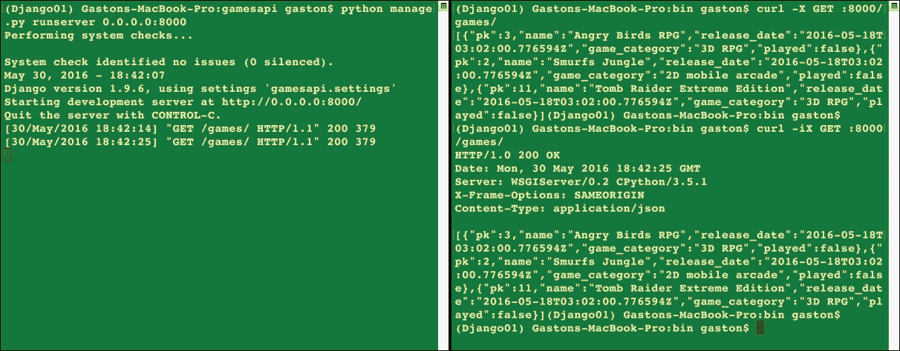

现在，我们将安装 HTTPie，这是一个用 Python 编写的命令行 HTTP 客户端，它使得发送 HTTP 请求变得简单，并且使用的语法比 curl（也称为 cURL）更容易。HTTPie 的一个巨大优点是它显示彩色输出，并使用多行来显示响应细节。因此，HTTPie 比 curl 实用程序更容易理解响应。我们只需要激活虚拟环境，然后在终端或命令提示符中运行以下命令来安装 HTTPie 包：

```py
pip install --upgrade httpie
```

输出的最后几行将指示`django`包已成功安装。

```py
Collecting httpie
 Downloading httpie-0.9.3-py2.py3-none-any.whl (66kB)
Collecting requests>=2.3.0 (from httpie)
 Using cached requests-2.10.0-py2.py3-none-any.whl
Collecting Pygments>=1.5 (from httpie)
 Using cached Pygments-2.1.3-py2.py3-none-any.whl
Installing collected packages: requests, Pygments, httpie
Successfully installed Pygments-2.1.3 httpie-0.9.3 requests-2.10.0
```

### 小贴士

如果你不记得如何激活为我们这个示例创建的虚拟环境，请阅读本章以下部分-*使用 Django REST 框架设置虚拟环境*。

现在，我们可以使用 `http` 命令轻松地编写并发送 HTTP 请求到 `localhost:8000` 并测试使用 Django REST 框架构建的 RESTful API。HTTPie 支持类似于 `curl` 的本地主机缩写，因此我们可以使用 `:8000` 作为缩写，它展开为 `http://localhost:8000`。运行以下命令并记得输入结束斜杠（`/`）：

```py
http :8000/games/
```

前面的命令将编写并发送以下 HTTP 请求：`GET http://localhost:8000/games/`。请求与之前使用 `curl` 命令编写的请求相同。然而，在这种情况下，HTTPie 工具将显示彩色输出，并使用多行来显示 JSON 响应。前面的命令等同于以下命令，该命令在 `http` 后指定 GET 方法：

```py
http GET :8000/games/
```

以下行显示了对 HTTP 请求的示例响应，包括头部信息和 JSON 响应中的三个 `Game` 对象。与使用 `curl` 编写 HTTP 请求时生成的结果相比，理解响应确实更容易。HTTPie 自动格式化接收到的 JSON 数据作为响应，并应用语法高亮，具体来说，包括颜色和格式：

```py
HTTP/1.0 200 OK
Content-Type: application/json
Date: Thu, 26 May 2016 21:33:17 GMT
Server: WSGIServer/0.2 CPython/3.5.1
X-Frame-Options: SAMEORIGIN
[
 {
 "game_category": "3D RPG",
 "name": "Angry Birds RPG",
 "pk": 3,
 "played": false,
 "release_date": "2016-05-18T03:02:00.776594Z"
 },
 {
 "game_category": "2D mobile arcade",
 "name": "Smurfs Jungle",
 "pk": 2,
 "played": false,
 "release_date": "2016-05-18T03:02:00.776594Z"
 },
 {
 "game_category": "3D RPG",
 "name": "Tomb Raider Extreme Edition",
 "pk": 11,
 "played": false,
 "release_date": "2016-05-18T03:02:00.776594Z"
 }
]
```

### 小贴士

我们可以通过将 `curl` 命令生成的输出与其他工具结合来达到相同的结果。然而，HTTPie 提供了我们与 RESTful API 一起工作所需的一切。我们将使用 HTTPie 来编写并发送 HTTP 请求，但我们将始终提供等效的 `curl` 命令。

以下图像显示了 macOS 上并排的两个终端窗口。左侧的终端窗口正在运行 Django 开发服务器，并显示接收和处理的 HTTP 请求。右侧的终端窗口正在运行 HTTPie 命令以生成 HTTP 请求。请注意，与 `curl` 命令生成的输出相比，JSON 输出更容易阅读：

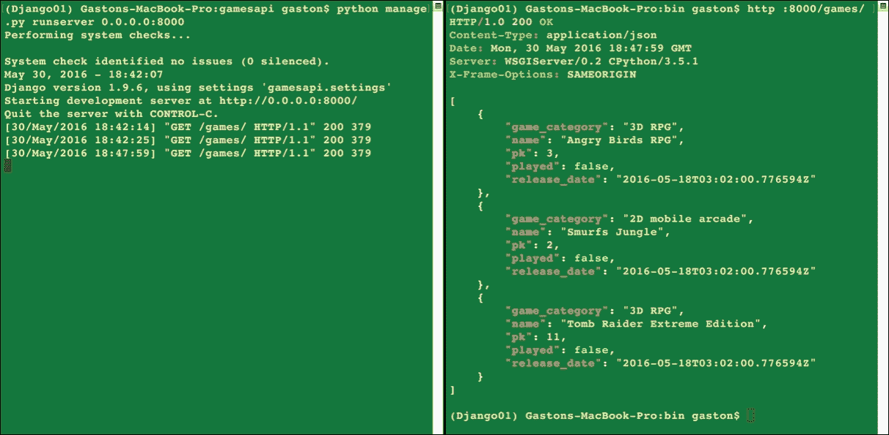

如果我们不希望在响应中包含头部信息，可以使用 `-b` 选项执行 HTTPie。例如，以下行执行了相同的 HTTP 请求，但不会在响应输出中显示头部信息，因此输出将仅显示 JSON 响应：

```py
http -b :8000/games/
```

现在，我们将从前面的列表中选择一个游戏，并编写一个 HTTP 请求来检索所选的游戏。例如，在前面的列表中，第一个游戏的 `pk` 值等于 `3`。运行以下命令来检索此游戏。使用您在先前的命令中检索到的第一个游戏的 `pk` 值，因为 `pk` 数字可能不同：

```py
http :8000/games/3/
```

以下是对应的 `curl` 命令：

```py
curl -iX GET :8000/games/3/
```

之前的命令将构建并发送以下 HTTP 请求：`GET http://localhost:8000/games/3/`。请求在`/games/`之后有一个数字，因此，它将匹配`'^games/(?P<pk>[0-9]+)/$'`并运行`views.game_detail`函数，即`games/views.py`文件中声明的`game_detail`函数。该函数接收`request`和`pk`作为参数，因为 URL 模式将`/games/`之后指定的数字作为`pk`参数传递。由于请求的 HTTP 动词是`GET`，所以`request.method`属性等于`'GET'`，因此，该函数将执行检索与作为参数接收的`pk`值匹配的`Game`对象的代码，如果找到，则生成一个包含此`Game`对象的序列化 JSON 响应。以下行显示了 HTTP 请求的示例响应，其中 JSON 响应中匹配`pk`值的`Game`对象：

```py
HTTP/1.0 200 OK
Content-Type: application/json
Date: Fri, 27 May 2016 02:28:30 GMT
Server: WSGIServer/0.2 CPython/3.5.1
X-Frame-Options: SAMEORIGIN
{
 "game_category": "3D RPG",
 "name": "Angry Birds RPG",
 "pk": 3,
 "played": false,
 "release_date": "2016-05-18T03:02:00.776594Z"
}
```

现在，我们将构建并发送一个 HTTP 请求来检索一个不存在的游戏。例如，在前面列表中，没有`pk`值等于`99999`的游戏。运行以下命令尝试检索此游戏。确保您使用一个不存在的`pk`值。我们必须确保工具将头信息作为响应的一部分显示，因为响应不会有主体部分：

```py
http :8000/games/99999/
```

以下是对应的 curl 命令：

```py
curl -iX GET :8000/games/99999/
```

前面的命令将构建并发送以下 HTTP 请求：`GET http://localhost:8000/games/99999/`。该请求与之前分析过的请求相同，只是`pk`参数的数字不同。服务器将运行`views.game_detail`函数，即`games/views.py`文件中声明的`game_detail`函数。该函数将执行检索与作为参数接收的`pk`值匹配的`Game`对象的代码，并抛出并捕获`Game.DoesNotExist`异常，因为没有与指定的`pk`值匹配的游戏。因此，代码将返回 HTTP 404 Not Found 状态码。以下行显示了 HTTP 请求的示例响应头：

```py
HTTP/1.0 404 Not Found
Content-Type: text/html; charset=utf-8
Date: Fri, 27 May 2016 02:20:41 GMT
Server: WSGIServer/0.2 CPython/3.5.1
X-Frame-Options: SAMEORIGIN
```

我们将构建并发送一个 HTTP 请求来创建一个新的游戏。

```py
http POST :8000/games/ name='PvZ 3' game_category='2D mobile arcade' played=false release_date='2016-05-18T03:02:00.776594Z'
```

以下是对应的 curl 命令。非常重要的一点是使用`-H "Content-Type: application/json"`选项来指示 curl 将-d 选项之后指定的数据作为`application/json`发送，而不是默认的`application/x-www-form-urlencoded`：

```py
curl -iX POST -H "Content-Type: application/json" -d '{"name":"PvZ 3", "game_category":"2D mobile arcade", "played": "false", "release_date": "2016-05-18T03:02:00.776594Z"}' :8000/games/
```

之前的命令将构建并发送以下 HTTP 请求：`POST http://localhost:8000/games/`，带有以下 JSON 键值对：

```py
{  
    "name": "PvZ 3",  
    "game_category": "2D mobile arcade",  
    "played": false,  
    "release_date": "2016-05-18T03:02:00.776594Z" 
} 

```

请求指定了 `/games/`，因此，它将匹配 `'^games/$'` 并运行 `views.game_list` 函数，即 `games/views.py` 文件中声明的 `game_detail` 函数。该函数仅接收 `request` 作为参数，因为 URL 模式不包含任何参数。由于请求的 HTTP 方法为 `POST`，`request.method` 属性等于 `'POST'`，因此，该函数将执行解析请求中接收到的 JSON 数据的代码，创建一个新的 `Game` 对象，如果数据有效，则保存新的 `Game`。如果新的 `Game` 成功持久化到数据库中，该函数将返回一个 `HTTP 201 Created` 状态码，并将最近持久化的 `Game` 对象序列化为 JSON 格式放在响应体中。以下行显示了 HTTP 请求的示例响应，其中包含 JSON 响应中的新 `Game` 对象：

```py
HTTP/1.0 201 Created
Content-Type: application/json
Date: Fri, 27 May 2016 05:12:39 GMT
Server: WSGIServer/0.2 CPython/3.5.1
X-Frame-Options: SAMEORIGIN
{
 "game_category": "2D mobile arcade",
 "name": "PvZ 3",
 "pk": 15,
 "played": false,
 "release_date": "2016-05-18T03:02:00.776594Z"
}
```

现在，我们将编写并发送一个 HTTP 请求来更新一个现有的游戏，具体来说，是之前添加的游戏。我们必须检查之前响应中分配给 `pk` 的值，并将命令中的 `15` 替换为返回的值。例如，如果 `pk` 的值为 `5`，则应使用 `:8000/games/5/` 而不是 `:8000/games/15/`。

```py
http PUT :8000/games/15/ name='PvZ 3' game_category='2D mobile arcade' played=true release_date='2016-05-20T03:02:00.776594Z'
```

以下是与之前 curl 示例等效的 curl 命令。与之前的 curl 示例一样，非常重要的一点是使用 `-H "Content-Type: application/json"` 选项来指示 curl 将 `-d` 选项之后指定的数据作为 `application/json` 发送，而不是默认的 `application/x-www-form-urlencoded`：

```py
curl -iX PUT -H "Content-Type: application/json" -d '{"name":"PvZ 3", "game_category":"2D mobile arcade", "played": "true", "release_date": "2016-05-20T03:02:00.776594Z"}' :8000/games/15/
```

之前的命令将编写并发送以下 HTTP 请求：`PUT http://localhost:8000/games/15/`，并带有以下 JSON 键值对：

```py
{  
    "name": "PvZ 3",  
    "game_category": "2D mobile arcade",  
    "played": true,  
    "release_date": "2016-05-20T03:02:00.776594Z" 
} 

```

请求在 `/games/` 后面有一个数字，因此，它将匹配 `'^games/(?P<pk>[0-9]+)/$'` 并运行 `views.game_detail` 函数，即 `games/views.py` 文件中声明的 `game_detail` 函数。该函数接收 `request` 和 `pk` 作为参数，因为 URL 模式将 `/games/` 后面指定的数字传递给 `pk` 参数。由于请求的 HTTP 方法为 `PUT`，`request.method` 属性等于 `'PUT'`，因此，该函数将执行解析请求中接收到的 JSON 数据的代码，从这些数据创建一个 `Game` 实例，并更新数据库中的现有游戏。如果游戏在数据库中成功更新，该函数将返回一个 `HTTP 200 OK` 状态码，并将最近更新的 `Game` 对象序列化为 JSON 格式放在响应体中。以下行显示了 `HTTP` 请求的示例响应，其中包含 JSON 响应中的更新后的 `Game` 对象：

```py
HTTP/1.0 200 OK
Content-Type: application/json
Date: Sat, 28 May 2016 00:49:05 GMT
Server: WSGIServer/0.2 CPython/3.5.1
X-Frame-Options: SAMEORIGIN
{
 "game_category": "2D mobile arcade",
 "name": "PvZ 3",
 "pk": 15,
 "played": true,
 "release_date": "2016-05-20T03:02:00.776594Z"
}
```

为了成功处理更新现有游戏的 `PUT` HTTP 请求，我们必须为所有必需的字段提供值。我们将组合并发送一个 HTTP 请求来尝试更新一个现有游戏，我们将无法做到这一点，因为我们只为名称提供了一个值。正如在先前的请求中所发生的那样，我们将使用我们在最后添加的游戏中分配给 `pk` 的值：

```py
http PUT :8000/games/15/ name='PvZ 4'
```

以下是对应的 `curl` 命令：

```py
curl -iX PUT -H "Content-Type: application/json" -d '{"name":"PvZ 4"}'
    :8000/games/15/
```

之前的命令将组合并发送以下 `HTTP` 请求：`PUT http://localhost:8000/games/15/`，并带有以下 JSON 键值对：

```py
{  
    "name": "PvZ 4",  
} 

```

请求将执行我们之前解释的相同代码。因为我们没有为 `Game` 实例提供所有必需的值，所以 `game_serializer.is_valid()` 方法将返回 `False`，函数将返回 `HTTP 400 Bad Request` 状态码，并将 `game_serializer.errors` 属性中生成的详细信息序列化为 JSON 放在响应体中。以下行显示了缺少 JSON 响应中必需字段的 HTTP 请求的示例响应：

```py
HTTP/1.0 400 Bad Request
Content-Type: application/json
Date: Sat, 28 May 2016 02:53:08 GMT
Server: WSGIServer/0.2 CPython/3.5.1
X-Frame-Options: SAMEORIGIN
{
 "game_category": [
 "This field is required."
 ],
 "release_date": [
 "This field is required."
 ]
}
```

### 小贴士

当我们希望我们的 API 能够更新现有资源的单个字段，在这种情况下，一个现有的游戏，我们应该提供一个 `PATCH` 方法的实现。`PUT` 方法旨在替换整个资源，而 `PATCH` 方法旨在对现有资源应用一个增量。我们可以在 `PUT` 方法的处理程序中编写代码来对现有资源应用增量，但使用 `PATCH` 方法执行此特定任务是一种更好的做法。我们将在稍后使用 `PATCH` 方法。

现在，我们将组合并发送一个 HTTP 请求来删除一个现有的游戏，具体来说，是我们最后添加的游戏。正如我们在上一个 HTTP 请求中所做的那样，我们必须检查上一个响应中分配给 `pk` 的值，并将命令中的 `12` 替换为返回的值：

```py
http DELETE :8000/games/15/
```

以下是对应的 `curl` 命令：

```py
curl -iX DELETE :8000/games/15/
```

上述命令将组合并发送以下 HTTP 请求：`DELETE http://localhost:8000/games/15/`。请求在 `/games/` 后有一个数字，因此它将匹配 `'^games/(?P<pk>[0-9]+)/$'` 并运行 `views.game_detail` 函数，即 `games/views.py` 文件中声明的 `game_detail` 函数。该函数接收 `request` 和 `pk` 作为参数，因为 URL 模式将 `/games/` 后指定的数字传递给 `pk` 参数。由于请求的 HTTP 动词是 `DELETE`，因此 `request.method` 属性等于 `'DELETE'`，因此该函数将执行解析请求中接收到的 JSON 数据的代码，从这些数据创建一个 `Game` 实例，并删除数据库中的现有游戏。如果游戏在数据库中成功删除，则函数返回 `HTTP 204 No Content` 状态码。以下行显示了成功删除现有游戏后的 HTTP 请求的示例响应：

```py
HTTP/1.0 204 No Content
Date: Sat, 28 May 2016 04:08:58 GMT
Server: WSGIServer/0.2 CPython/3.5.1
Content-Length: 0
X-Frame-Options: SAMEORIGIN
Content-Type: text/html; charset=utf-8
```

## 使用 GUI 工具 - Postman 和其他工具

到目前为止，我们一直在使用两个基于终端或命令行的工具来编写和发送 HTTP 请求到我们的 Django 开发服务器——cURL 和 HTTPie。现在，我们将使用**GUI**（**图形用户界面**）工具。

Postman 是一个非常流行的 API 测试套件 GUI 工具，它允许我们轻松地编写和发送 HTTP 请求，以及其他功能。Postman 可以作为 Chrome 应用和 Mac 应用使用。我们可以在 Windows、Linux 和 macOS 上作为 Chrome 应用执行它，即运行在 Google Chrome 之上的应用程序。如果我们使用 macOS，我们可以使用 Mac 应用而不是 Chrome 应用。您可以从以下 URL 下载 Postman 应用的版本-[`www.getpostman.com`](https://www.getpostman.com)。

### 小贴士

您可以免费下载并安装 Postman 来编写和发送 HTTP 请求到我们的 RESTful API。您只需在 Postman 上注册，我们不会在我们的示例中使用 Postman 云提供的任何付费功能。所有说明都适用于 Postman 4.2.2 或更高版本。

现在，我们将使用 Postman 中的**构建器**选项卡轻松地编写和发送 HTTP 请求到`localhost:8000`，并使用此 GUI 工具测试 RESTful API。Postman 不支持 curl-like 的本地主机缩写，因此我们无法在编写 HTTPie 请求时使用相同的缩写。

在**“输入请求 URL”**文本框左侧的下拉菜单中选择**GET**，然后在下拉菜单右侧的文本框中输入`localhost:8000/games/`。然后点击**发送**，Postman 将显示状态（**200 OK**）、请求处理所需的时间和响应体，其中所有游戏都格式化为带有语法高亮的 JSON（**美化**视图）。

以下截图显示了 Postman 中 HTTP GET 请求的 JSON 响应体：

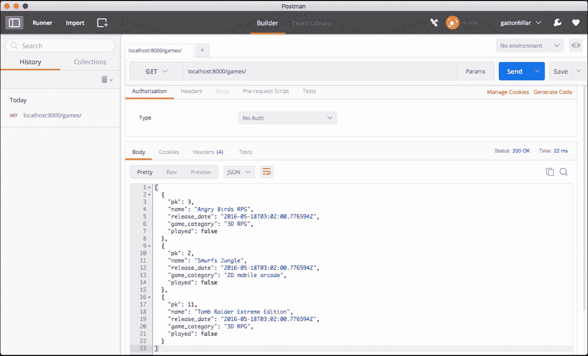

点击**Body**和**Cookies**右侧的**头部**，以读取响应头部。以下截图显示了 Postman 为前面的响应显示的响应头部布局。注意，Postman 在响应右侧显示**状态**，并且不将其作为头部的第一行，就像我们在使用 cURL 和 HTTPie 工具时发生的那样：

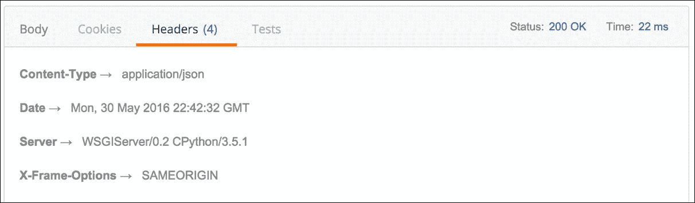

现在，我们将使用 Postman 中的**构建器**选项卡来编写和发送一个 HTTP 请求以创建一个新的游戏，具体来说，是一个 POST 请求。按照以下步骤操作：

1.  在**“输入请求 URL”**文本框左侧的下拉菜单中选择**POST**，然后在下拉菜单右侧的文本框中输入`localhost:8000/games/`。

1.  在编写请求的面板中，点击**Body**右侧的**授权**和**头部**。

1.  激活 **raw** 单选按钮，并在 **binary** 单选按钮右侧的下拉菜单中选择 **JSON (application/json)**。Postman 将自动添加一个 **Content-type** 为 **application/json** 的头部，因此，您会注意到 **Headers** 选项卡将被重命名为 **Headers (1)**，这表示我们已指定了一个请求头部的键值对。

1.  在单选按钮下方的文本框中输入以下行，位于 **Body** 选项卡内：

```py
{ 
    "name": "Batman vs Superman",  
    "game_category": "3D RPG",  
    "played": false,  
    "release_date": "2016-05-18T03:02:00.776594Z" 
} 

```

以下截图显示了 Postman 中的请求体：

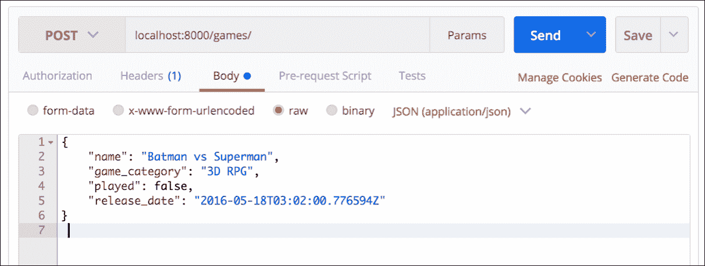

我们遵循了创建具有 JSON 体的 HTTP POST 请求的必要步骤，该请求指定了创建新游戏所需的关键值对。点击 **Send**，Postman 将显示状态（`201 Created`）、请求处理所需的时间以及以语法高亮（**Pretty** 视图）格式化的响应体。以下截图显示了 Postman 中 HTTP POST 请求的 JSON 响应体。

### 小贴士

如果我们想使用 Postman 编写和发送一个 HTTP PUT 请求，必须遵循之前解释的步骤，在请求体中提供 JSON 数据。

Postman 包含的一个不错的特点是，我们可以通过浏览 Postman 窗口左侧显示的已保存 **History** 来轻松地回顾和再次运行我们已发送的 HTTP 请求。历史记录面板显示了一个列表，其中包含我们已编写和发送的每个 HTTP 请求的 HTTP 动词和 URL。我们只需点击所需的 HTTP 请求，然后点击 **Send** 再次运行它。以下截图显示了 **History** 面板中的许多 HTTP 请求以及第一个被选中以再次发送的请求。

**JetBrains PyCharm** 是一个非常流行的多平台 Python 集成开发环境（简称 IDE），可在 macOS、Linux 和 Windows 上使用。其付费专业版包含一个 REST 客户端，允许我们测试 RESTful Web 服务。如果我们使用这个版本的 IDE，我们可以在不离开 IDE 的情况下编写并发送 HTTP 请求。您不需要 JetBrains PyCharm 专业版许可证来运行本书中包含的示例。然而，由于 IDE 非常受欢迎，我们将学习使用该 IDE 中包含的 REST 客户端来编写和发送 HTTP 请求的必要步骤。

现在，我们将使用 PyCharm 专业版中包含的 **REST 客户端**来编写并发送一个 HTTP 请求以创建一个新的游戏，具体来说，是一个 POST 请求。按照以下步骤操作：

1.  在主菜单中选择 **Tools** | **Test** RESTful Web Service 以显示 REST 客户端面板。

1.  在 REST 客户端面板中的 HTTP 方法下拉菜单中选择 **POST**。

1.  在 **Host/port** 文本框中输入 `localhost:8000`，位于下拉菜单的右侧。

1.  在 **Path** 文本框中输入 `/games/`，位于 **Host/port** 文本框的右侧。

1.  确保激活 **请求** 选项卡，然后点击 **Headers** 列表底部的添加 (**+**) 按钮。IDE 将显示一个用于名称的文本框和一个用于值的下拉菜单。在 **名称** 中输入 `Content-Type`，在 **值** 中输入 `application/json` 并按 Enter 键。

1.  在 **请求体** 中激活 **文本** 单选按钮，并点击位于 **文本** 文本框右侧的 **...** 按钮，以指定要发送的文本。在 **指定要发送的文本** 对话框中的文本框中输入以下行，然后点击 **确定**。

```py
{ 
    "name": "Teenage Mutant Ninja Turtles",  
    "game_category": "3D RPG",  
    "played": false,  
    "release_date": "2016-05-18T03:02:00.776594Z" 
} 

```

以下截图显示了 PyCharm Professional **REST 客户端** 中构建的请求。

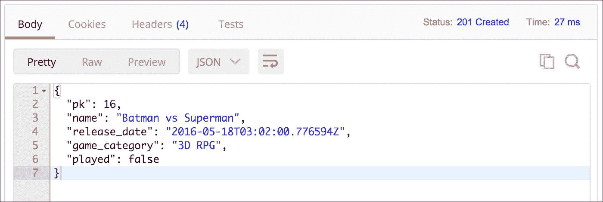

我们遵循了必要的步骤来创建一个具有 JSON 体的 HTTP POST 请求，该体指定了创建新游戏所需的关键值对。点击提交请求按钮，即位于 **REST 客户端** 窗口右上角的带有播放图标的第一个按钮。REST 客户端将编写并发送 HTTP POST 请求，激活 **响应** 选项卡，并在窗口底部显示响应代码 **201 (已创建**)、请求处理所需的时间以及内容长度。

默认情况下，REST 客户端将自动应用 JSON 语法高亮显示到响应中。但是，有时 JSON 内容会显示为没有换行，此时需要点击重格式化响应按钮，即位于 **响应** 选项卡中的第一个按钮。REST 客户端在另一个选项卡中显示响应头，因此它仅在 **响应** 选项卡中显示响应体。以下截图显示了 REST 客户端中 HTTP POST 请求的 JSON 响应体。

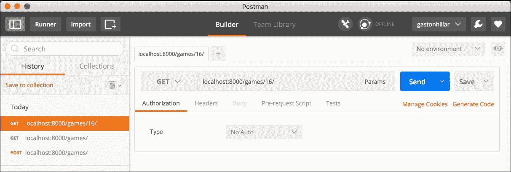

### 小贴士

如果我们想在 PyCharm Professional 中使用 REST 客户端编写和发送 HTTP PUT 请求，则需要遵循之前解释的步骤，在请求体中提供 JSON 数据。

如果您不使用 PyCharm Professional，运行以下任何命令来编写和发送创建新游戏的 HTTP POST 请求：

```py
http POST :8000/games/ name='Teenage Mutant Ninja Turtles' game_category='3D RPG' played=false release_date='2016-05-18T03:02:00.776594Z'
```

以下是对应的 `curl` 命令：

```py
curl -iX POST -H "Content-Type: application/json" -d '{"name": "Teenage
Mutant Ninja Turtles", "game_category": "3D RPG", "played": "false",
"release_date": "2016-05-18T03:02:00.776594Z"}' :8000/games/
```

Telerik Fiddler 是 Windows 开发者常用的工具。Telerik Fiddler 是一款免费的 Web 调试代理工具，具有图形用户界面，但只能在 Windows 上运行。它的主要网页将其宣传为多平台工具，但在本书出版时，macOS 和 Linux 版本完全不稳定，并且其开发已被放弃。我们可以使用 Windows 上的 Telerik Fiddler 来编写和发送 HTTP 请求，以及其他功能。您可以从以下网址下载 Fiddler for Windows -[`www.telerik.com/download/fiddler`](https://www.telerik.com/download/fiddler)。

Stoplight 是一个流行的强大 API 模型工具，它允许我们轻松测试我们的 API。其 HTTP 请求生成器允许我们编写和发送请求，并生成在不同编程语言中（如 JavaScript、Swift、C#、PHP、Node 和 Go 等）执行这些请求的必要代码。您可以在以下网址注册使用 Stoplight - [`stoplight.io`](http://stoplight.io)。

我们还可以使用能够从移动设备编写和发送 HTTP 请求的应用程序来与 RESTful API 一起工作。例如，我们可以在 iOS 设备（如 iPad 和 iPhone）上使用 iCurlHTTP 应用程序 - [`itunes.apple.com/us/app/icurlhttp/id611943891?mt=8`](https://itunes.apple.com/us/app/icurlhttp/id611943891?mt=8)。在 Android 设备上，我们可以使用 HTTP Request 应用程序 - [`play.google.com/store/apps/details?id=air.http.request&hl=en`](https://play.google.com/store/apps/details?id=air.http.request&hl=en)。

以下截图显示了使用 iCurlHTTP 应用程序编写和发送以下 HTTP 请求的结果：`GET http://192.168.1.106:8000/games/`。请记住，您必须在您的局域网和路由器中执行之前解释的配置，才能从连接到您的局域网的其它设备访问 Django 开发服务器。在这种情况下，运行 Django Web 服务器的计算机分配的 IP 地址是 `192.168.1.106`，因此，您必须将此 IP 地址替换为您开发计算机分配的 IP 地址。

在本书出版时，允许您编写和发送 HTTP 请求的移动应用程序并不提供您在 Postman 或命令行工具中可以找到的所有功能。

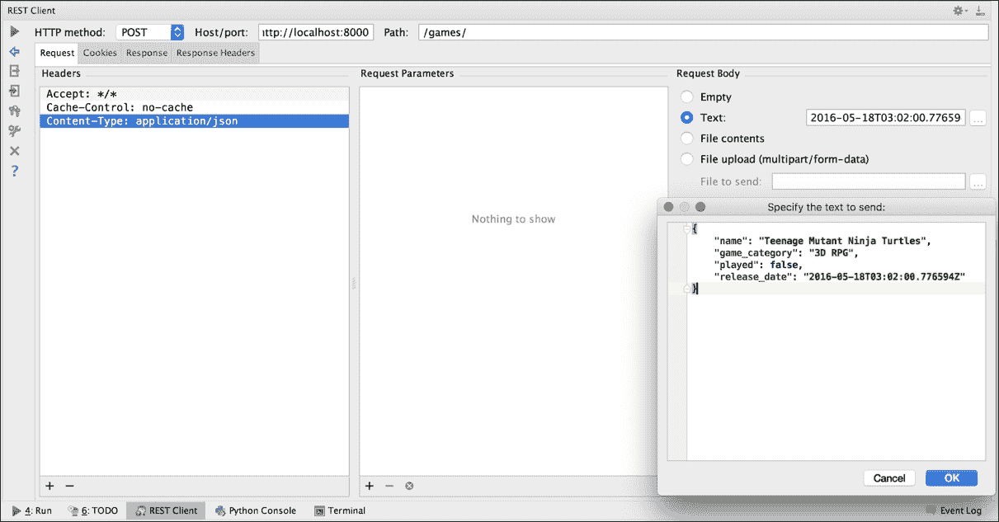

# 测试您的知识

1.  如果我们想创建一个简单的 `Player` 模型，我们将使用它来表示和持久化 Django REST 框架中的玩家，我们可以创建：

    1.  一个作为 `djangorestframework.models.Model` 类子类的 `Player` 类。

    1.  一个作为 `django.db.models.Model` 类子类的 `Player` 类。

    1.  `restframeworkmodels.py` 文件中的一个 `Player` 函数。

1.  在 Django REST 框架中，序列化器是：

    1.  模型实例和 Python 原语之间的调解者。

    1.  视图函数和 Python 原语之间的调解者。

    1.  URL 和视图函数之间的调解者。

1.  在 Django REST 框架中，解析器和渲染器：

    1.  作为模型实例和 Python 原语之间的调解者。

    1.  重置棋盘。

    1.  作为 Python 原语和 HTTP 请求与响应之间的调解者。

1.  在 `urls.py` 文件中声明的 `urlpatterns` 列使得：

    1.  将路由 URL 映射到视图。

    1.  将路由 URL 映射到模型。

    1.  将路由 URL 映射到 Python 原语。

1.  HTTPie 是一个：

    1.  用 Python 编写的命令行 HTTP 服务器，它使得创建 RESTful Web 服务器变得容易。

    1.  命令行实用程序，允许我们对 SQLite 数据库运行查询。

    1.  用 Python 编写的命令行 HTTP 客户端，它使得编写和发送 HTTP 请求变得容易。

# 摘要

在本章中，我们设计了一个 RESTful API 来与简单的 SQLite 数据库交互，并使用游戏执行 CRUD 操作。我们定义了 API 的需求，并理解了每个 HTTP 方法执行的任务。我们学习了在 Python 中使用轻量级虚拟环境的优势，并使用 Django REST 框架设置了一个虚拟环境。

我们创建了一个模型来表示和持久化游戏，并在 Django 中执行了迁移。我们学习了如何使用 Django REST 框架管理游戏实例的序列化和反序列化到 JSON 表示。我们编写了 API 视图来处理不同的 HTTP 请求，并配置了 URL 模式列表以将 URL 路由到视图。

最后，我们启动了 Django 开发服务器，并使用命令行工具向我们的 RESTful API 组合并发送 HTTP 请求，分析了我们的代码中每个 HTTP 请求的处理方式。我们还使用图形用户界面工具来组合和发送 HTTP 请求。

现在我们已经了解了 Django REST 框架的基础知识，我们将通过利用 Django REST 框架中包含的先进功能来扩展 RESTful Web API 的功能，这是我们将在下一章中讨论的内容。
