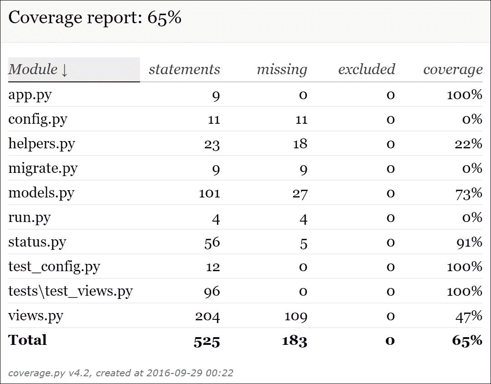
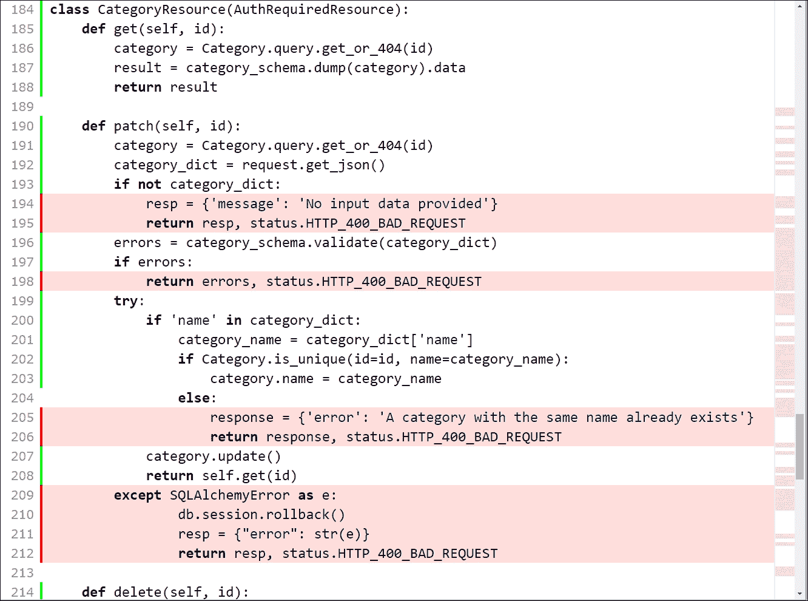

# 第八章：使用 Flask 测试和部署 API

在本章中，我们将配置、编写和执行单元测试，并学习一些与部署相关的内容。我们将：

+   设置单元测试

+   为测试创建数据库

+   编写第一轮单元测试

+   运行单元测试并检查测试覆盖率

+   提高测试覆盖率

+   理解部署和可扩展性的策略

# 设置单元测试

我们将使用 `nose2` 来简化单元测试的发现和运行。我们将测量测试覆盖率，因此，我们将安装必要的包以允许我们使用 `nose2` 运行覆盖率。首先，我们将在我们的虚拟环境中安装 `nose2` 和 `cov-core` 包。`cov-core` 包将允许我们使用 `nose2` 测量测试覆盖率。然后，我们将创建一个新的 PostgreSQL 数据库，我们将用它来进行测试。最后，我们将创建测试环境的配置文件。

确保您退出 Flask 的开发服务器。请记住，您只需在运行它的终端或命令提示符窗口中按 ***Ctrl*** + ***C*** 即可。我们只需运行以下命令即可安装 `nose2` 包：

```py
pip install nose2

```

输出的最后几行将指示 `django-nose` 包已成功安装。

```py
Collecting nose2
Collecting six>=1.1 (from nose2)
 Downloading six-1.10.0-py2.py3-none-any.whl
Installing collected packages: six, nose2
Successfully installed nose2-0.6.5 six-1.10.0

```

我们只需运行以下命令即可安装 `cov-core` 包，该包也将安装 `coverage` 依赖项：

```py
pip install cov-core

```

输出的最后几行将指示 `django-nose` 包已成功安装：

```py
Collecting cov-core
Collecting coverage>=3.6 (from cov-core)
Installing collected packages: coverage, cov-core
Successfully installed cov-core-1.15.0 coverage-4.2

```

现在，我们将创建一个 PostgreSQL 数据库，我们将将其用作测试环境的存储库。如果您还没有在您的计算机上的测试环境中或在测试服务器上运行 PostgreSQL 数据库，您将需要下载并安装 PostgreSQL 数据库。

### 小贴士

请记住确保 PostgreSQL 的 bin 文件夹包含在 `PATH` 环境变量中。您应该能够从当前的 Terminal 或 Command Prompt 执行 `psql` 命令行实用程序。

我们将使用 PostgreSQL 命令行工具创建一个名为 `test_messages` 的新数据库。如果您已经有一个同名 PostgreSQL 数据库，请确保在所有命令和配置中使用另一个名称。您可以使用任何 PostgreSQL GUI 工具执行相同的任务。如果您在 Linux 上开发，必须以 `postgres` 用户身份运行命令。在 macOS 或 Windows 上运行以下命令以创建一个名为 `test_messages` 的新数据库。请注意，该命令不会生成任何输出：

```py
createdb test_messages

```

在 Linux 上，运行以下命令以使用 `postgres` 用户：

```py
sudo -u postgres createdb test_messages

```

现在，我们将使用 `psql` 命令行工具运行一些 SQL 语句，以授予数据库对用户的权限。如果您使用的是与开发服务器不同的服务器，您必须在授予权限之前创建用户。在 macOS 或 Windows 上，运行以下命令以启动 psql：

```py
psql

```

在 Linux 上，运行以下命令以使用 postgres 用户

```py
sudo -u psql

```

然后，运行以下 SQL 语句，最后输入 \q 以退出 psql 命令行工具。将 user_name 替换为你希望在新的数据库中使用的用户名，将 password 替换为你选择的密码。我们将在 Flask 测试配置中使用用户名和密码。如果你已经在 PostgreSQL 中使用特定用户并且已经为该用户授予了数据库权限，则无需运行以下步骤：

```py
GRANT ALL PRIVILEGES ON DATABASE test_messages TO user_name;
\q

```

在 `api` 文件夹中创建一个新的 `test_config.py` 文件。以下行显示了声明变量以确定 Flask 和 SQLAlchemy 测试环境配置的代码。`SQL_ALCHEMY_DATABASE_URI` 变量生成一个用于 PostgreSQL 数据库的 SQLAlchemy URI，我们将使用它来运行所有迁移，并在开始测试之前删除所有元素。确保你指定了 `DB_NAME` 值中所需的测试数据库名称，并根据你的测试环境 PostgreSQL 配置配置用户、密码、主机和端口。如果你遵循了之前的步骤，请使用这些步骤中指定的设置。示例的代码文件包含在 `restful_python_chapter_08_01` 文件夹中。

```py
import os 

basedir = os.path.abspath(os.path.dirname(__file__)) 
DEBUG = True 
PORT = 5000 
HOST = "127.0.0.1" 
SQLALCHEMY_ECHO = False 
SQLALCHEMY_TRACK_MODIFICATIONS = True 
SQLALCHEMY_DATABASE_URI = "postgresql://{DB_USER}:{DB_PASS}@{DB_ADDR}/{DB_NAME}".format(DB_USER="user_name", DB_PASS="password", DB_ADDR="127.0.0.1", DB_NAME="test_messages") 
SQLALCHEMY_MIGRATE_REPO = os.path.join(basedir, 'db_repository') 
TESTING = True 
SERVER_NAME = '127.0.0.1:5000' 
PAGINATION_PAGE_SIZE = 5 
PAGINATION_PAGE_ARGUMENT_NAME = 'page' 
#Disable CSRF protection in the testing configuration 
WTF_CSRF_ENABLED = False 

```

正如我们在为开发环境创建的类似测试文件中做的那样，我们将指定之前创建的模块作为函数的参数，该函数将创建一个我们将用于测试的 Flask 应用程序。这样，我们有一个模块指定了测试环境中所有不同配置变量的值，另一个模块为我们的测试环境创建一个 *Flask* 应用程序。也可以创建一个类层次结构，每个环境都有一个类。然而，在我们的示例中，为测试环境创建一个新的配置文件更容易。

# 编写第一轮单元测试

现在，我们将编写第一轮单元测试。具体来说，我们将编写与用户和消息类别资源相关的单元测试：`UserResource`、`UserListResource`、`CategoryResource` 和 `CategoryListResource`。在 `api` 文件夹中创建一个新的 `tests` 子文件夹。然后，在新的 `api/tests` 子文件夹中创建一个新的 `test_views.py` 文件。添加以下行，这些行声明了许多 `import` 语句和 `InitialTests` 类的第一个方法。示例的代码文件包含在 `restful_python_chapter_08_01` 文件夹中：

```py
from app import create_app 
from base64 import b64encode 
from flask import current_app, json, url_for 
from models import db, Category, Message, User 
import status 
from unittest import TestCase 

class InitialTests(TestCase): 
    def setUp(self): 
        self.app = create_app('test_config') 
        self.test_client = self.app.test_client() 
        self.app_context = self.app.app_context() 
        self.app_context.push() 
        self.test_user_name = 'testuser' 
        self.test_user_password = 'T3s!p4s5w0RDd12#' 
        db.create_all() 

    def tearDown(self): 
        db.session.remove() 
        db.drop_all() 
        self.app_context.pop() 

    def get_accept_content_type_headers(self): 
        return { 
            'Accept': 'application/json', 
            'Content-Type': 'application/json' 
        } 

    def get_authentication_headers(self, username, password): 
        authentication_headers = self.get_accept_content_type_headers() 
        authentication_headers['Authorization'] = \ 
            'Basic ' + b64encode((username + ':' + password).encode('utf-
             8')).decode('utf-8') 
        return authentication_headers 

```

`InitialTests` 类是 `unittest.TestCase` 的子类。该类覆盖了在每次测试方法运行之前将执行的 `setUp` 方法。该方法使用 `'test_config'` 作为参数调用在 `app` 模块中声明的 `create_app` 函数。该函数将使用此模块作为配置文件设置 Flask 应用程序，因此应用程序将使用之前创建的配置文件，该文件指定了测试数据库和环境所需的值。然后，代码将新创建的 `app` 的测试属性设置为 `True`，以便异常可以传播到测试客户端。

下一个调用 `self.app.test_client` 方法来为之前创建的 Flask 应用程序创建一个测试客户端，并将测试客户端保存到 `test_client` 属性中。我们将在测试方法中使用测试客户端来轻松地组合和发送请求到我们的 API。然后，代码保存并推送应用程序上下文，并创建两个属性，包含我们将用于测试的用户名和密码。最后，方法调用 `db.create_all` 方法来创建在 `test_config.py` 文件中配置的测试数据库中所有必要的表。

`InitialTests` 类覆盖了在每次测试方法运行之后将执行的 `tearDown` 方法。代码移除 SQLAlchemy 会话，在测试数据库中删除我们在测试执行前创建的所有表，并弹出应用程序上下文。这样，每次测试完成后，测试数据库将再次为空。

`get_accept_content_type_headers` 方法构建并返回一个字典（`dict`），其中 `Accept` 和 `Content-Type` 头键的值设置为 `'application/json'`。在我们需要构建头部以组合无需认证的请求时，我们将在测试中调用此方法。

`get_authentication_headers` 方法调用之前解释过的 `get_accept_content_type_headers` 方法来生成无需认证的头部键值对。然后，代码将必要的值添加到 `Authorization` 键中，使用适当的编码来提供在 `username` 和 `password` 参数中接收的用户名和密码。最后一行返回包含认证信息的生成字典。在我们需要构建头部以添加认证来组合请求时，我们将在测试中调用此方法。我们将使用在 `setUp` 方法中存储的用户名和密码。

打开之前创建的 `test_views.py` 文件，位于新的 `api/tests` 子文件夹中。添加以下行，这些行声明了 `InitialTests` 类的多个方法。示例代码文件包含在 `restful_python_chapter_08_01` 文件夹中。

```py
 def test_request_without_authentication(self): 
        """ 
        Ensure we cannot access a resource that requirest authentication without an appropriate authentication header 
        """ 
        response = self.test_client.get( 
            url_for('api.messagelistresource', _external=True), 
            headers=self.get_accept_content_type_headers()) 
        self.assertTrue(response.status_code == status.HTTP_401_UNAUTHORIZED) 

    def create_user(self, name, password): 
        url = url_for('api.userlistresource', _external=True) 
        data = {'name': name, 'password': password} 
        response = self.test_client.post( 
            url,  
            headers=self.get_accept_content_type_headers(), 
            data=json.dumps(data)) 
        return response 

    def create_category(self, name): 
        url = url_for('api.categorylistresource', _external=True) 
        data = {'name': name} 
        response = self.test_client.post( 
            url,  
            headers=self.get_authentication_headers(self.test_user_name, 
            self.test_user_password), 
            data=json.dumps(data)) 
        return response 

    def test_create_and_retrieve_category(self): 
        """ 
        Ensure we can create a new Category and then retrieve it 
        """ 
        create_user_response = self.create_user(self.test_user_name,
        self.test_user_password) 
        self.assertEqual(create_user_response.status_code,
        status.HTTP_201_CREATED) 
        new_category_name = 'New Information' 
        post_response = self.create_category(new_category_name) 
        self.assertEqual(post_response.status_code, status.HTTP_201_CREATED) 
        self.assertEqual(Category.query.count(), 1) 
        post_response_data = json.loads(post_response.get_data(as_text=True)) 
        self.assertEqual(post_response_data['name'], new_category_name) 
        new_category_url = post_response_data['url'] 
        get_response = self.test_client.get( 
            new_category_url, 
            headers=self.get_authentication_headers(self.test_user_name,
            self.test_user_password)) 
        get_response_data = json.loads(get_response.get_data(as_text=True)) 
        self.assertEqual(get_response.status_code, status.HTTP_200_OK) 
        self.assertEqual(get_response_data['name'], new_category_name) 

```

`test_request_without_authentication` 方法测试当我们不提供适当的身份验证头时，我们是否被拒绝访问需要身份验证的资源。该方法使用测试客户端来组合并发送一个 HTTP `GET` 请求到为 `'api.messagelistresource'` 资源生成的 URL，以检索消息列表。我们需要一个经过身份验证的请求来检索消息列表。然而，代码调用 `get_authentication_headers` 方法来设置调用 `self.test_client.get` 时的 headers 参数的值，因此代码生成了一个没有身份验证的请求。最后，该方法使用 `assertTrue` 来检查响应的 `status_code` 是否为 HTTP 401 未授权 (`status.HTTP_401_UNAUTHORIZED`)。

`create_user` 方法使用测试客户端来组合并发送一个 HTTP `POST` 请求到为 `'api.userlistresource'` 资源生成的 URL，以创建一个名为和密码作为参数的新用户。我们不需要经过身份验证的请求来创建一个新用户，因此代码调用之前解释过的 `get_accept_content_type_headers` 方法来设置调用 `self.test_client.post` 时的 headers 参数的值。最后，代码返回 `POST` 请求的响应。每次我们需要创建一个经过身份验证的请求时，我们将调用 `create_user` 方法来创建一个新用户。

`create_category` 方法使用测试客户端来组合并发送一个 HTTP `POST` 请求到为 `'api.categorylistresource'` 资源生成的 URL，以创建一个名为参数接收的新 `Category`。我们需要一个经过身份验证的请求来创建一个新的 `Category`，因此代码调用之前解释过的 `get_authentication_headers` 方法来设置调用 `self.test_client.post` 时的 headers 参数的值。用户名和密码设置为 `self.test_user_name` 和 `self.test_user_password`。最后，代码返回 `POST` 请求的响应。每次我们需要创建一个类别时，我们将在创建请求身份验证的适当用户之后调用 `create_category` 方法。

`test_create_and_retrieve_category` 方法测试我们是否可以创建一个新的 `Category` 并然后检索它。该方法调用之前解释过的 `create_user` 方法来创建一个新用户，然后使用它来身份验证 `create_game_category` 方法生成的 HTTP `POST` 请求。然后，代码组合并发送一个 HTTP `GET` 方法来检索之前 `POST` 请求响应中接收到的 URL 中的最近创建的 Category。该方法使用 `assertEqual` 来检查以下预期的结果：

+   HTTP `POST` 响应的 `status_code` 是 HTTP 201 已创建 (`status.HTTP_201_CREATED`)

+   从数据库中检索到的 `Category` 对象总数是 `1`

+   HTTP `GET` 响应的 `status_code` 是 HTTP 200 OK (`status.HTTP_200_OK`)

+   HTTP `GET` 响应中 `name` 键的值等于为新类别指定的名称

在新创建的 `api/tests` 子文件夹中打开之前创建的 `test_views.py` 文件。添加以下行，这些行声明了 `InitialTests` 类的许多方法。示例代码文件包含在 `restful_python_chapter_08_01` 文件夹中。

```py
 def test_create_duplicated_category(self): 
        """ 
        Ensure we cannot create a duplicated Category 
        """ 
        create_user_response = self.create_user(self.test_user_name,
        self.test_user_password) 
        self.assertEqual(create_user_response.status_code,
        status.HTTP_201_CREATED) 
        new_category_name = 'New Information' 
        post_response = self.create_category(new_category_name) 
        self.assertEqual(post_response.status_code, status.HTTP_201_CREATED) 
        self.assertEqual(Category.query.count(), 1) 
        post_response_data = json.loads(post_response.get_data(as_text=True)) 
        self.assertEqual(post_response_data['name'], new_category_name) 
        second_post_response = self.create_category(new_category_name) 
        self.assertEqual(second_post_response.status_code,
        status.HTTP_400_BAD_REQUEST) 
        self.assertEqual(Category.query.count(), 1) 

    def test_retrieve_categories_list(self): 
        """ 
        Ensure we can retrieve the categories list 
        """ 
        create_user_response = self.create_user(self.test_user_name,
        self.test_user_password) 
        self.assertEqual(create_user_response.status_code,
        status.HTTP_201_CREATED) 
        new_category_name_1 = 'Error' 
        post_response_1 = self.create_category(new_category_name_1) 
        self.assertEqual(post_response_1.status_code, status.HTTP_201_CREATED) 
        new_category_name_2 = 'Warning' 
        post_response_2 = self.create_category(new_category_name_2) 
        self.assertEqual(post_response_2.status_code, status.HTTP_201_CREATED) 
        url = url_for('api.categorylistresource', _external=True) 
        get_response = self.test_client.get( 
            url, 
            headers=self.get_authentication_headers(self.test_user_name,
            self.test_user_password)) 
        get_response_data = json.loads(get_response.get_data(as_text=True)) 
        self.assertEqual(get_response.status_code, status.HTTP_200_OK) 
        self.assertEqual(len(get_response_data), 2) 
        self.assertEqual(get_response_data[0]['name'], new_category_name_1) 
        self.assertEqual(get_response_data[1]['name'], new_category_name_2) 

        """ 
        Ensure we can update the name for an existing category 
        """ 
        create_user_response = self.create_user(self.test_user_name,
        self.test_user_password) 
        self.assertEqual(create_user_response.status_code,
        status.HTTP_201_CREATED) 
        new_category_name_1 = 'Error 1' 
        post_response_1 = self.create_category(new_category_name_1) 
        self.assertEqual(post_response_1.status_code, status.HTTP_201_CREATED) 
        post_response_data_1 = json.loads(post_response_1.get_data(as_text=True)) 
        new_category_url = post_response_data_1['url'] 
        new_category_name_2 = 'Error 2' 
        data = {'name': new_category_name_2} 
        patch_response = self.test_client.patch( 
            new_category_url,  
            headers=self.get_authentication_headers(self.test_user_name,
            self.test_user_password), 
            data=json.dumps(data)) 
        self.assertEqual(patch_response.status_code, status.HTTP_200_OK) 
        get_response = self.test_client.get( 
            new_category_url, 
            headers=self.get_authentication_headers(self.test_user_name,
            self.test_user_password)) 
        get_response_data = json.loads(get_response.get_data(as_text=True)) 
        self.assertEqual(get_response.status_code, status.HTTP_200_OK) 
        self.assertEqual(get_response_data['name'], new_category_name_2)
```

该类声明了以下以 `test_` 前缀开头的方法：

+   `test_create_duplicated_category`：测试唯一约束是否使我们无法创建具有相同名称的两个类别。当我们第二次组合并发送具有重复类别名称的 HTTP `POST` 请求时，我们必须收到 HTTP 400 Bad Request 状态代码 (`status.HTTP_400_BAD_REQUEST`)，并且从数据库检索到的 `Category` 对象总数必须是 `1`。

+   `test_retrieve_categories_list`：测试我们是否可以检索类别列表。首先，该方法创建两个类别，然后确保检索到的列表包括这两个创建的类别。

+   `test_update_game_category`：测试我们是否可以更新类别的单个字段，特别是其名称字段。代码确保名称已被更新。

### 小贴士

注意，每个需要在数据库中满足特定条件的测试都必须执行所有必要的代码，以确保数据库处于这种特定状态。例如，为了更新现有类别，我们首先必须创建一个新的类别，然后才能更新它。每个测试方法将在数据库中不包含之前执行测试方法的数据的情况下执行，也就是说，每个测试将在清理了之前测试数据的数据库上运行。

# 使用 nose2 运行单元测试并检查测试覆盖率

现在，运行以下命令以在我们的测试数据库中创建所有必要的表，并使用 `nose2` 测试运行器执行我们创建的所有测试。测试运行器将执行 `InitialTests` 类中以 `test_` 前缀开头的方法，并将显示结果。

### 小贴士

测试不会更改我们在处理 API 时使用的数据库。请记住，我们已将 `test_messages` 数据库配置为我们的测试数据库。

从上一章创建的 `api.py` 文件从 `api` 文件夹中删除，因为我们不希望测试覆盖率考虑此文件。转到 `api` 文件夹，并在我们一直在使用的同一虚拟环境中运行以下命令。我们将使用 `-v` 选项指示 `nose2` 打印测试用例名称和状态。`--with-coverage` 选项开启测试覆盖率报告生成：

```py
nose2 -v --with-coverage

```

以下行显示了示例输出。

```py
test_create_and_retrieve_category (test_views.InitialTests) ... ok
test_create_duplicated_category (test_views.InitialTests) ... ok
test_request_without_authentication (test_views.InitialTests) ... ok
test_retrieve_categories_list (test_views.InitialTests) ... ok
test_update_category (test_views.InitialTests) ... ok
--------------------------------------------------------
Ran 5 tests in 3.973s
OK
----------- coverage: platform win32, python 3.5.2-final-0 --
Name                  Stmts   Miss  Cover
-----------------------------------------
app.py                    9      0   100%
config.py                11     11     0%
helpers.py               23     18    22%
migrate.py                9      9     0%
models.py               101     27    73%
run.py                    4      4     0%
status.py                56      5    91%
test_config.py           12      0   100%
tests\test_views.py      96      0   100%
views.py                204    109    47%
-----------------------------------------
TOTAL                   525    183    65% 

```

默认情况下，`nose2`会查找名称以`test`前缀开始的模块。在这种情况下，唯一符合标准的模块是`test_views`模块。在符合标准的模块中，`nose2`从`unittest.TestCase`的所有子类以及以`test`前缀开头名称的函数中加载测试。

输出提供了详细信息，表明测试运行器发现了并执行了五个测试，并且所有测试都通过了。输出显示了`InitialTests`类中以`test_`前缀开始的每个方法的名称和类名，这些方法代表要执行的测试。

`coverage`包提供的测试代码覆盖率测量报告使用 Python 标准库中包含的代码分析工具和跟踪钩子来确定哪些代码行是可执行的并且已经执行。报告提供了一个包含以下列的表格：

+   `Name`：Python 模块名称。

+   `Stmts`：Python 模块的执行语句计数。

+   `Miss`：未执行的执行语句的数量，即那些未执行的语句。

+   `Cover`：以百分比表示的可执行语句覆盖率。

根据报告中显示的测量结果，我们确实对`views.py`和`helpers.py`的覆盖率非常低。实际上，我们只编写了一些与类别和用户相关的测试，因此对于视图的覆盖率真的很低是有道理的。我们没有创建与消息相关的测试。

我们可以使用带有`-m`命令行选项的`coverage`命令来显示新`Missing`列中缺失语句的行号：

```py
coverage report -m

```

命令将使用上次执行的信息，并显示缺失的语句。下面的几行显示了与之前单元测试执行相对应的示例输出：

```py
Name                  Stmts   Miss  Cover   Missing
---------------------------------------------------
app.py                    9      0   100%
config.py                11     11     0%   7-20
helpers.py               23     18    22%   13-19, 23-44
migrate.py                9      9     0%   7-19
models.py               101     27    73%   28-29, 44, 46, 48, 50, 52, 54, 73-75, 79-86, 103, 127-137
run.py                    4      4     0%   7-14
status.py                56      5    91%   2, 6, 10, 14, 18
test_config.py           12      0   100%
tests\test_views.py      96      0   100%
views.py                204    109    47%   43-45, 51-58, 63-64, 67, 71-72, 83-87, 92-94, 97-124, 127-135, 140-147, 150-181, 194-195, 198, 205-206, 209-212, 215-223, 235-236, 239, 250-253
---------------------------------------------------
TOTAL                   525    183    65%

```

现在，运行以下命令以获取详细说明缺失行的注释 HTML 列表：

```py
coverage html

```

使用您的 Web 浏览器打开在`htmlcov`文件夹中生成的`index.html` HTML 文件。以下图片显示了以 HTML 格式生成的示例报告：



点击或轻触`views.py`，Web 浏览器将渲染一个显示已运行语句、缺失语句和排除语句的 Web 页面，这些语句以不同的颜色显示。我们可以点击或轻触**运行**、**缺失**和**排除**按钮来显示或隐藏代表每行代码状态的背景颜色。默认情况下，缺失的代码行将以粉红色背景显示。因此，我们必须编写针对这些代码行的单元测试来提高我们的测试覆盖率：



# 提高测试覆盖率

现在，我们将编写额外的单元测试以改进测试覆盖率。具体来说，我们将编写与消息和用户相关的单元测试。打开现有的 `api/tests/test_views.py` 文件，在 `InitialTests` 类的最后一条语句之后插入以下行。我们需要一个新的 `import` 语句，并将声明新的 `PlayerTests` 类。示例代码文件包含在 `restful_python_chapter_08_02` 文件夹中：

```py
 def create_message(self, message, duration, category): 
        url = url_for('api.messagelistresource', _external=True) 
        data = {'message': message, 'duration': duration, 'category': category} 
        response = self.test_client.post( 
            url,  
            headers=self.get_authentication_headers(self.test_user_name,
            self.test_user_password), 
            data=json.dumps(data)) 
        return response 

    def test_create_and_retrieve_message(self): 
        """ 
        Ensure we can create a new message and then retrieve it 
        """ 
        create_user_response = self.create_user(self.test_user_name,
        self.test_user_password) 
        self.assertEqual(create_user_response.status_code,
        status.HTTP_201_CREATED) 
        new_message_message = 'Welcome to the IoT world' 
        new_message_category = 'Information' 
        post_response = self.create_message(new_message_message, 15,
        new_message_category) 
        self.assertEqual(post_response.status_code, status.HTTP_201_CREATED) 
        self.assertEqual(Message.query.count(), 1) 
        # The message should have created a new catagory 
        self.assertEqual(Category.query.count(), 1) 
        post_response_data = json.loads(post_response.get_data(as_text=True)) 
        self.assertEqual(post_response_data['message'], new_message_message) 
        new_message_url = post_response_data['url'] 
        get_response = self.test_client.get( 
            new_message_url, 
            headers=self.get_authentication_headers(self.test_user_name,
            self.test_user_password)) 
        get_response_data = json.loads(get_response.get_data(as_text=True)) 
        self.assertEqual(get_response.status_code, status.HTTP_200_OK) 
        self.assertEqual(get_response_data['message'], new_message_message) 
        self.assertEqual(get_response_data['category']['name'],
        new_message_category) 

    def test_create_duplicated_message(self): 
        """ 
        Ensure we cannot create a duplicated Message 
        """ 
        create_user_response = self.create_user(self.test_user_name,
        self.test_user_password) 
        self.assertEqual(create_user_response.status_code,
        status.HTTP_201_CREATED) 
        new_message_message = 'Welcome to the IoT world' 
        new_message_category = 'Information' 
        post_response = self.create_message(new_message_message, 15,
        new_message_category) 
        self.assertEqual(post_response.status_code, status.HTTP_201_CREATED) 
        self.assertEqual(Message.query.count(), 1) 
        post_response_data = json.loads(post_response.get_data(as_text=True)) 
        self.assertEqual(post_response_data['message'], new_message_message) 
        new_message_url = post_response_data['url'] 
        get_response = self.test_client.get( 
            new_message_url, 
            headers=self.get_authentication_headers(self.test_user_name,
            self.test_user_password)) 
        get_response_data = json.loads(get_response.get_data(as_text=True)) 
        self.assertEqual(get_response.status_code, status.HTTP_200_OK) 
        self.assertEqual(get_response_data['message'], new_message_message) 
        self.assertEqual(get_response_data['category']['name'],
        new_message_category) 
        second_post_response = self.create_message(new_message_message, 15,
        new_message_category) 
        self.assertEqual(second_post_response.status_code,
        status.HTTP_400_BAD_REQUEST) 
        self.assertEqual(Message.query.count(), 1) 

```

前面的代码向 `InitialTests` 类添加了许多方法。`create_message` 方法接收新消息所需的 `message`、`duration` 和 `category`（类别名称）作为参数。该方法构建 URL 和数据字典以组成并发送 HTTP `POST` 方法，创建新消息，并返回此请求生成的响应。许多测试方法将调用 `create_message` 方法来创建消息，然后向 API 组成并发送其他 HTTP 请求。

该类声明了以下方法，其名称以 `test_` 前缀开头：

+   `test_create_and_retrieve_message`：测试我们是否可以创建一个新的 `Message` 并检索它。

+   `test_create_duplicated_message`：测试唯一约束是否使我们无法创建具有相同消息的两个消息。当我们第二次使用重复的消息组成并发送 HTTP `POST` 请求时，我们必须收到 `HTTP 400 Bad Request` 状态代码（`status.HTTP_400_BAD_REQUEST`），并且从数据库检索到的 `Message` 对象的总数必须是 `1`。

打开现有的 `api/tests/test_views.py` 文件，在 `InitialTests` 类的最后一条语句之后插入以下行。示例代码文件包含在 `restful_python_chapter_08_02` 文件夹中：

```py
 def test_retrieve_messages_list(self): 
        """ 
        Ensure we can retrieve the messages paginated list 
        """ 
        create_user_response = self.create_user(self.test_user_name,
        self.test_user_password) 
        self.assertEqual(create_user_response.status_code,
        status.HTTP_201_CREATED) 
        new_message_message_1 = 'Welcome to the IoT world' 
        new_message_category_1 = 'Information' 
        post_response = self.create_message(new_message_message_1, 15,
        new_message_category_1) 
        self.assertEqual(post_response.status_code, status.HTTP_201_CREATED) 
        self.assertEqual(Message.query.count(), 1) 
        new_message_message_2 = 'Initialization of the board failed' 
        new_message_category_2 = 'Error' 
        post_response = self.create_message(new_message_message_2, 10,
        new_message_category_2) 
        self.assertEqual(post_response.status_code, status.HTTP_201_CREATED) 
        self.assertEqual(Message.query.count(), 2) 
        get_first_page_url = url_for('api.messagelistresource', _external=True) 
        get_first_page_response = self.test_client.get( 
            get_first_page_url, 
            headers=self.get_authentication_headers(self.test_user_name,
            self.test_user_password)) 
        get_first_page_response_data =
        json.loads(get_first_page_response.get_data(as_text=True)) 
        self.assertEqual(get_first_page_response.status_code, status.HTTP_200_OK) 
        self.assertEqual(get_first_page_response_data['count'], 2) 
        self.assertIsNone(get_first_page_response_data['previous']) 
        self.assertIsNone(get_first_page_response_data['next']) 
        self.assertIsNotNone(get_first_page_response_data['results']) 
        self.assertEqual(len(get_first_page_response_data['results']), 2) 
        self.assertEqual(get_first_page_response_data['results'][0]['message'],
        new_message_message_1) 
        self.assertEqual(get_first_page_response_data['results'][1]['message'],
        new_message_message_2) 
        get_second_page_url = url_for('api.messagelistresource', page=2) 
        get_second_page_response = self.test_client.get( 
            get_second_page_url, 
            headers=self.get_authentication_headers(self.test_user_name,
            self.test_user_password)) 
        get_second_page_response_data =
        json.loads(get_second_page_response.get_data(as_text=True)) 
        self.assertEqual(get_second_page_response.status_code,
        status.HTTP_200_OK) 
        self.assertIsNotNone(get_second_page_response_data['previous']) 
        self.assertEqual(get_second_page_response_data['previous'],
        url_for('api.messagelistresource', page=1)) 
        self.assertIsNone(get_second_page_response_data['next']) 
        self.assertIsNotNone(get_second_page_response_data['results']) 
        self.assertEqual(len(get_second_page_response_data['results']), 0) 

```

之前的代码向 `InitialTests` 类添加了 `test_retrieve_messages_list` 方法。该方法测试我们是否可以检索分页的消息列表。首先，该方法创建两条消息，然后确保检索到的列表包含第一页中的两条创建的消息。此外，该方法确保第二页不包含任何消息，并且上一页的值包含第一页的 URL。

打开现有的 `api/tests/test_views.py` 文件，在 `InitialTests` 类的最后一条语句之后插入以下行。示例代码文件包含在 `restful_python_chapter_08_02` 文件夹中：

```py
 def test_update_message(self): 
        """ 
        Ensure we can update a single field for an existing message 
        """ 
        create_user_response = self.create_user(self.test_user_name,
        self.test_user_password) 
        self.assertEqual(create_user_response.status_code,
        status.HTTP_201_CREATED) 
        new_message_message_1 = 'Welcome to the IoT world' 
        new_message_category_1 = 'Information' 
        post_response = self.create_message(new_message_message_1, 30,
        new_message_category_1) 
        self.assertEqual(post_response.status_code, status.HTTP_201_CREATED) 
        self.assertEqual(Message.query.count(), 1) 
        post_response_data = json.loads(post_response.get_data(as_text=True)) 
        new_message_url = post_response_data['url'] 
        new_printed_times = 1 
        new_printed_once = True 
        data = {'printed_times': new_printed_times, 'printed_once':
        new_printed_once} 
        patch_response = self.test_client.patch( 
            new_message_url,  
            headers=self.get_authentication_headers(self.test_user_name,
            self.test_user_password), 
            data=json.dumps(data)) 
        self.assertEqual(patch_response.status_code, status.HTTP_200_OK) 
        get_response = self.test_client.get( 
            new_message_url, 
            headers=self.get_authentication_headers(self.test_user_name,
            self.test_user_password)) 
        get_response_data = json.loads(get_response.get_data(as_text=True)) 
        self.assertEqual(get_response.status_code, status.HTTP_200_OK) 
        self.assertEqual(get_response_data['printed_times'], new_printed_times) 
        self.assertEqual(get_response_data['printed_once'], new_printed_once) 

    def test_create_and_retrieve_user(self): 
        """ 
        Ensure we can create a new User and then retrieve it 
        """ 
        new_user_name = self.test_user_name 
        new_user_password = self.test_user_password 
        post_response = self.create_user(new_user_name, new_user_password) 
        self.assertEqual(post_response.status_code, status.HTTP_201_CREATED) 
        self.assertEqual(User.query.count(), 1) 
        post_response_data = json.loads(post_response.get_data(as_text=True)) 
        self.assertEqual(post_response_data['name'], new_user_name) 
        new_user_url = post_response_data['url'] 
        get_response = self.test_client.get( 
            new_user_url, 
            headers=self.get_authentication_headers(self.test_user_name,
            self.test_user_password)) 
        get_response_data = json.loads(get_response.get_data(as_text=True)) 
        self.assertEqual(get_response.status_code, status.HTTP_200_OK) 
        self.assertEqual(get_response_data['name'], new_user_name) 

```

+   之前的代码向 `InitialTests` 类添加了以下两个方法：`test_update_message` - 测试我们是否可以更新一条消息的多个字段，具体来说，是 `printed_times` 和 `printed_once` 字段的值。代码确保这两个字段都已更新。

+   `test_create_and_retrieve_user`：测试我们是否可以创建一个新的 `User` 并检索它。

我们仅编写了一些与消息相关的测试和与用户相关的一个测试，以改进测试覆盖率并注意对测试覆盖率报告的影响。

现在，在同一个虚拟环境中运行以下命令：

```py
nose2 -v --with-coverage

```

以下行显示了示例输出：

```py
test_create_and_retrieve_category (test_views.InitialTests) ... ok
test_create_and_retrieve_message (test_views.InitialTests) ... ok
test_create_and_retrieve_user (test_views.InitialTests) ... ok
test_create_duplicated_category (test_views.InitialTests) ... ok
test_create_duplicated_message (test_views.InitialTests) ... ok
test_request_without_authentication (test_views.InitialTests) ... ok
test_retrieve_categories_list (test_views.InitialTests) ... ok
test_retrieve_messages_list (test_views.InitialTests) ... ok
test_update_category (test_views.InitialTests) ... ok
test_update_message (test_views.InitialTests) ... ok
------------------------------------------------------------------
Ran 10 tests in 25.938s
OK
----------- coverage: platform win32, python 3.5.2-final-0 -------
Name                  Stmts   Miss  Cover
-----------------------------------------
app.py                    9      0   100%
config.py                11     11     0%
helpers.py               23      1    96%
migrate.py                9      9     0%
models.py               101     11    89%
run.py                    4      4     0%
status.py                56      5    91%
test_config.py           16      0   100%
tests\test_views.py     203      0   100%
views.py                204     66    68%
-----------------------------------------
TOTAL                   636    107    83% 

```

输出提供了详细信息，表明测试运行器执行了`10`个测试，并且所有测试都通过了。由`coverage`包提供的测试代码覆盖率测量报告将`views.py`模块的`Cover`百分比从上一次运行的`47%`提高到`68%`。此外，由于我们编写了使用分页的测试，`helpers.py`模块的百分比从`22%`增加到`96%`。因此，我们编写的新附加测试在多个模块中执行了额外的代码，因此覆盖率报告有所影响。

### 小贴士

我们刚刚创建了一些单元测试来了解我们如何编写它们。然而，当然，编写更多的测试以提供对 API 中包含的所有功能和执行场景的适当覆盖是必要的。

# 理解部署和可扩展性的策略

Flask 是一个用于 Web 的轻量级微框架。然而，正如 Django 所发生的那样，与 Flask 和 Flask-RESTful 相关的一个最大的缺点是每个 HTTP 请求都是阻塞的。因此，每当 Flask 服务器收到一个 HTTP 请求时，它不会开始处理队列中的任何其他 HTTP 请求，直到服务器为它收到的第一个 HTTP 请求发送响应。

我们使用 Flask 开发了一个 RESTful Web 服务。这类 Web 服务的关键优势是它们是无状态的，也就是说，它们不应该在任何服务器上保持客户端状态。我们的 API 是使用 Flask 和 Flask RESTful 的一个很好的无状态 RESTful Web 服务的例子。因此，我们可以让 API 在尽可能多的服务器上运行，以实现我们的可扩展性目标。显然，我们必须考虑到我们很容易将数据库服务器变成我们的可扩展性瓶颈。

### 小贴士

现在，我们有许多基于云的替代方案来部署使用 Flask 和 Flask-RESTful 的 RESTful Web 服务，并使其具有极高的可扩展性。

在部署我们 API 的第一个版本之前，我们总是必须确保我们分析了 API 和数据库。确保生成的查询在底层数据库上正确运行，以及最常用的查询不会最终导致顺序扫描，这一点非常重要。通常需要在数据库中的表上添加适当的索引。

我们一直在使用基本的 HTTP 身份验证。我们可以通过基于令牌的身份验证来改进它。我们必须确保 API 在生产环境中运行在 HTTPS 下。此外，我们必须确保我们在`api/config.py`文件中更改以下行：

```py
DEBUG = True 

```

我们必须在生产环境中始终关闭调试模式，因此我们必须将前面的行替换为以下一行：

```py
DEBUG = False 

```

### 小贴士

使用不同的配置文件进行生产是非常方便的。然而，另一种方法正变得越来越流行，尤其是在云原生应用程序中，那就是将配置存储在环境中。如果我们想部署云原生 RESTful Web 服务并遵循十二因素应用程序中建立的指南，我们应该将配置存储在环境中。

每个平台都包含了详细的部署我们的应用程序的说明。所有这些都需要我们生成一个 `requirements.txt` 文件，其中列出了应用程序及其版本的依赖项。这样，平台就能够安装文件中列出的所有必要依赖项。

运行以下 `pip freeze` 命令以生成 `requirements.txt` 文件。

```py
pip freeze > requirements.txt

```

以下行显示了生成的示例 `requirements.txt` 文件的内容。然而，请注意，许多包的版本号更新很快，你可能会在配置中看到不同的版本：

```py
alembic==0.8.8
aniso8601==1.1.0
click==6.6
cov-core==1.15.0
coverage==4.2
Flask==0.11.1
Flask-HTTPAuth==3.2.1
flask-marshmallow==0.7.0
Flask-Migrate==2.0.0
Flask-RESTful==0.3.5
Flask-Script==2.0.5
Flask-SQLAlchemy==2.1
itsdangerous==0.24
Jinja2==2.8
Mako==1.0.4
MarkupSafe==0.23
marshmallow==2.10.2
marshmallow-sqlalchemy==0.10.0
nose2==0.6.5
passlib==1.6.5
psycopg2==2.6.2
python-dateutil==2.5.3
python-editor==1.0.1
pytz==2016.6.1
six==1.10.0
SQLAlchemy==1.0.15
Werkzeug==0.11.11

```

# 测试你的知识

1.  默认情况下，`nose2` 会查找以下前缀开头的模块：

    1.  `test`

    1.  `run`

    1.  `unittest`

1.  默认情况下，`nose2` 从以下类的所有子类中加载测试。

    1.  `unittest.Test`

    1.  `unittest.TestCase`

    1.  `unittest.RunTest`

1.  `unittest.TestCase` 子类中的 `setUp` 方法：

    1.  在每个测试方法运行之前执行。

    1.  在所有测试开始执行之前只执行一次。

    1.  仅在所有测试执行完毕后执行一次。

1.  `unittest.TestCase` 子类中的 `tearDown` 方法：

    1.  在每个测试方法运行之后执行。

    1.  在每个测试方法运行之前执行。

    1.  仅在测试方法失败后执行。

1.  如果我们在 `unittest.TestCase` 的子类中声明一个 `get_accept_content_type_headers` 方法，默认情况下，`nose2`：

    1.  将此方法作为测试加载。

    1.  将此方法作为每个测试的 `setUp` 方法加载。

    1.  不会将此方法作为测试加载。

# 摘要

在本章中，我们设置了测试环境。我们安装了 nose2 以便于发现和执行单元测试，并创建了一个新的数据库用于测试。我们编写了一轮单元测试，测量了测试覆盖率，然后编写了额外的单元测试以提高测试覆盖率。最后，我们了解了关于部署和可扩展性的许多考虑因素。

现在我们已经使用 Flask 结合 Flask RESTful 构建了一个复杂的 API，并且对其进行了测试，接下来我们将转向另一个流行的 Python Web 框架，Tornado，这也是我们将在下一章中讨论的内容。
