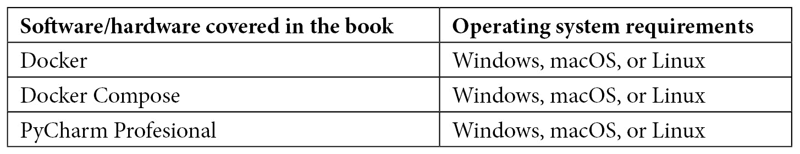

# 前言

通过 WebSockets 使用 HTML 简化了**单页应用程序**（**SPAs**）的创建，通过避免前端渲染、提供实时响应以及通过将其移动到后端来简化逻辑。在这本书中，你不会学习如何使用 JavaScript 渲染框架，如 React、Vue 或 Angular，而是将逻辑移动到 Python。这将简化你的开发，利用 Django 提供的所有工具，给你带来实时结果。

开发者将学习最先进的 WebSockets 技术，以实现对 JavaScript 最小依赖的实时应用程序。他们还将从头开始学习如何使用 Docker 创建项目、测试它并在服务器上部署它。

你将跟随一个想要创建具有良好体验的 SPAs 的 Django 开发者的路线图。你将创建一个项目并添加 Docker、开发库、Django 通道和双向通信，然后你将使用 HTML 通过 WebSockets 创建各种真实项目，例如聊天应用或带有实时评论的博客。你将通过从使用 SSR 模型转向使用 HTML 通过 WebSockets 创建网页来现代化你的开发技术。使用 Django，你将创建具有专业实时项目的 SPAs，其中逻辑将在 Python 中。

到本书结束时，你将能够制作实时应用程序，并掌握 Django 的 WebSockets。

# 本书面向的对象

本书适合中级 Django 开发者和希望使用 HTML 和 Django 通道创建实时网站的 Python 网络开发者。如果你是一位寻找创建 API 的替代方案的开发者，你不想放弃将前端与后端分离的可能性，并且不想依赖 JavaScript 来制作 SPAs，那么这本书适合你。本书假定你具备 HTML 和 Python 的基本知识，以及基本的网络开发概念。

# 本书涵盖的内容

*第一章*，*设置虚拟环境*，是我们准备 IDE 和 Docker 以便能够使用 Python 的地方。

*第二章*，*围绕 Docker 创建 Django 项目*，是我们创建一个 Django 项目并使用不同的 Docker 容器进行测试。

*第三章*，*将 WebSockets 添加到 Django 中*，是我们通过 Channels 将 WebSockets 服务器集成到 Django 中，然后测试它是否可以发送和接收数据。

*第四章*，*与数据库一起工作*，是我们创建一个微博应用，在其中我们与数据库进行交互，执行基本操作，如查询、过滤、更新或删除。

*第五章*，*在房间中分离通信*，是我们学习如何通过创建带有私密消息和群组的聊天应用来按用户或组分离通信。

*第六章*，*在后端创建 SPA*，我们将集成解决您在构建 SPA 时可能遇到的典型问题的解决方案，例如根据路由集成服务器端渲染系统或水合部分。

*第七章*，*仅使用 Django 创建实时博客*，帮助你利用所学知识构建一个完整的 SPA 博客。

*第八章*，*简化前端*，介绍了通过集成 Stimulus 到前端来简化与客户端事件的交互。

# 要充分利用本书

您需要在计算机上安装最新版本的 Docker 和 Docker Compose（或包含所有内容的 Docker Desktop）以及代码编辑器或 IDE。我推荐 PyCharm Professional。所有代码示例都已使用 Docker 在 macOS 和 Linux 操作系统上测试；然而，它们也应该在没有问题的情况下在 Windows 上运行。



您需要在计算机上安装 Docker 和 Docker Compose 的专业版（或者包含所有内容的 Docker Desktop）。否则，您可以从终端或使用 Docker Desktop 启动 Docker。

**如果您使用的是本书的数字版，我们建议您亲自输入代码或从本书的 GitHub 仓库（下一节中提供链接）获取代码。这样做将帮助您避免与代码复制和粘贴相关的任何潜在错误。**

# 下载示例代码文件

您可以从 GitHub 下载本书的示例代码文件：[`github.com/PacktPublishing/Building-SPAs-with-Django-and-HTML-Over-the-Wire`](https://github.com/PacktPublishing/Building-SPAs-with-Django-and-HTML-Over-the-Wire)。如果代码有更新，它将在 GitHub 仓库中更新。

我们还有其他来自我们丰富的图书和视频目录的代码包，可在 https://github.com/PacktPublishing/找到。查看它们吧！

# 下载彩色图像

我们还提供了一份包含本书中使用的截图和图表彩色图像的 PDF 文件。您可以从这里下载：https://packt.link/2q526。

# 使用的约定

本书使用了多种文本约定。

`文本中的代码`：表示文本中的代码词汇、数据库表名、文件夹名、文件名、文件扩展名、路径名、虚拟 URL、用户输入和 Twitter 昵称。以下是一个示例：“前端的信息传递给`receive_json`，然后通过执行`self.send_uppercase(data)`函数接收`'text in capital letters'`动作。”

代码块设置如下：

```py
* {
```

```py
    font-family: "Helvetica Neue", Helvetica, Arial, sans-serif;
```

```py
    box-sizing: border-box;
```

```py
}
```

**粗体**：表示新术语、重要词汇或屏幕上看到的词汇。例如，菜单或对话框中的单词会以粗体显示。以下是一个示例：“目前，**编辑**和**删除**按钮仅用于装饰；稍后，我们将赋予它们功能。”

小贴士或重要提示

看起来像这样。

# 联系我们

我们始终欢迎读者的反馈。

`customercare@packtpub.com` 并在邮件主题中提及书名。

**勘误**: 尽管我们已经尽一切努力确保内容的准确性，但错误仍然可能发生。如果您在这本书中发现了错误，如果您能向我们报告，我们将不胜感激。请访问 www.packtpub.com/support/errata 并填写表格。

`copyright@packt.com` 并附上材料的链接。

**如果您有兴趣成为作者**: 如果您在某个领域有专业知识，并且您有兴趣撰写或为书籍做出贡献，请访问 authors.packtpub.com。

# 分享您的想法

一旦您阅读了《Real-Time Django over the Wire》，我们很乐意听到您的想法！请[点击此处直接访问此书的亚马逊评论页面](https://packt.link/r/1803240199)并分享您的反馈。

您的评论对我们和科技社区都很重要，并将帮助我们确保我们提供高质量的内容。
