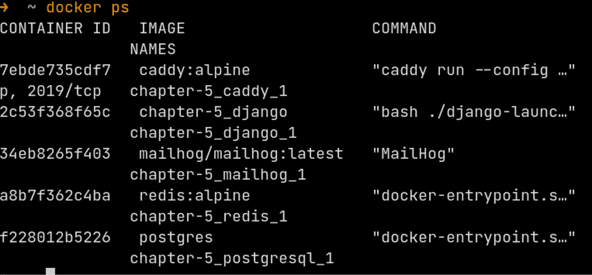
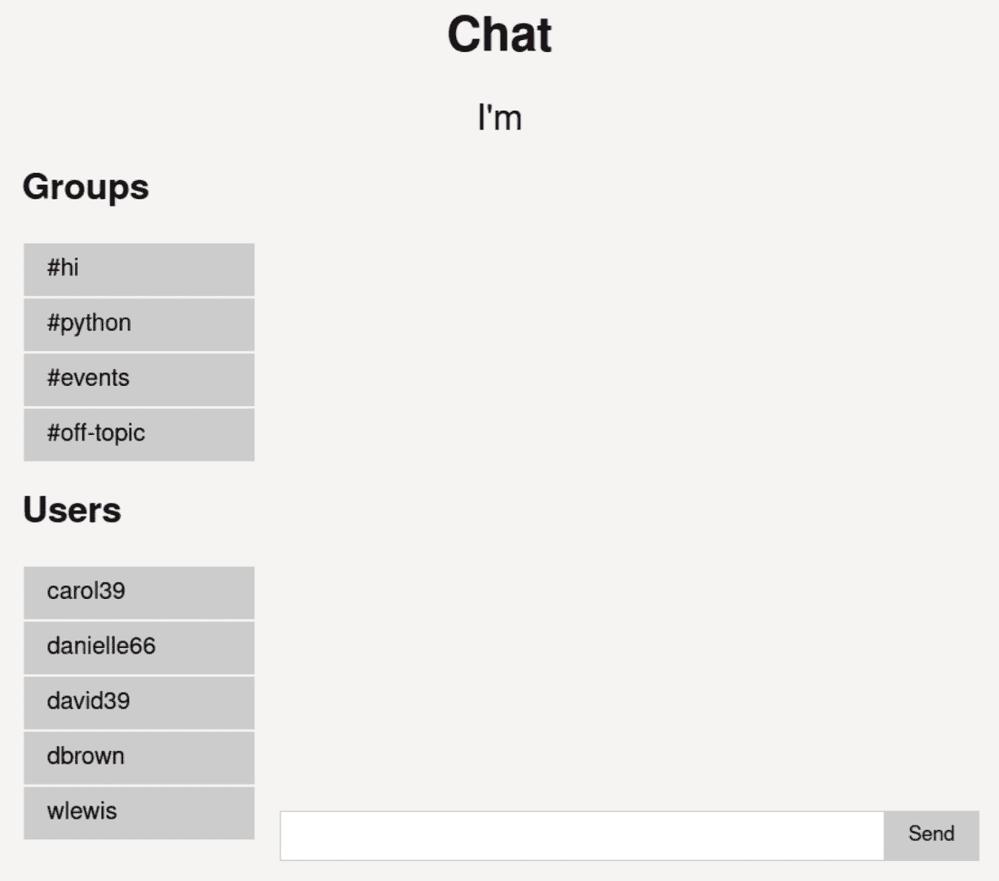
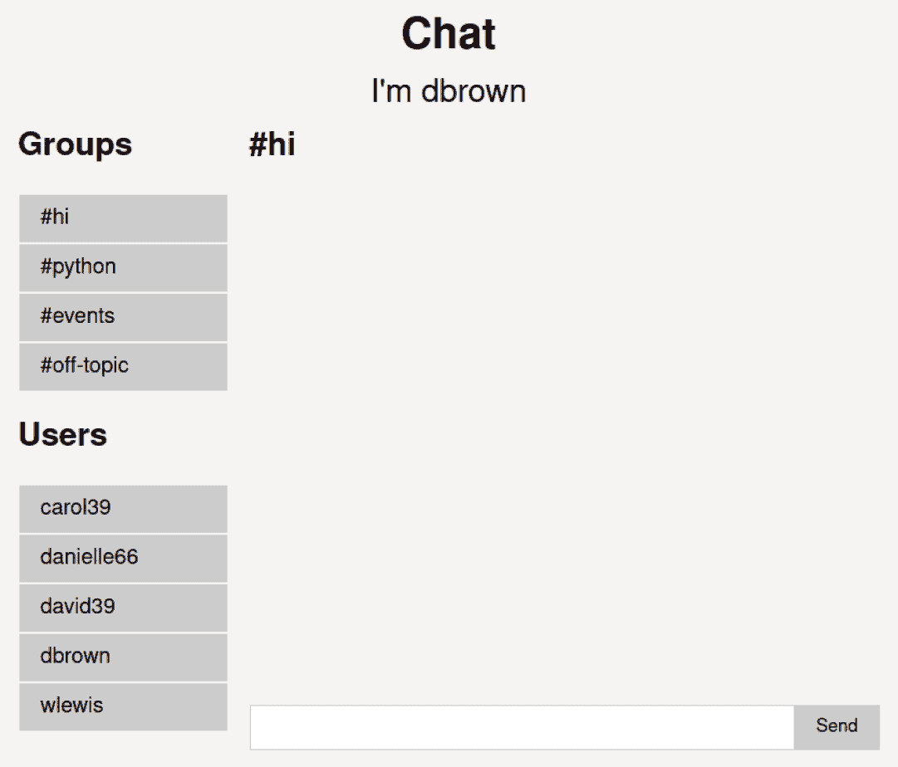
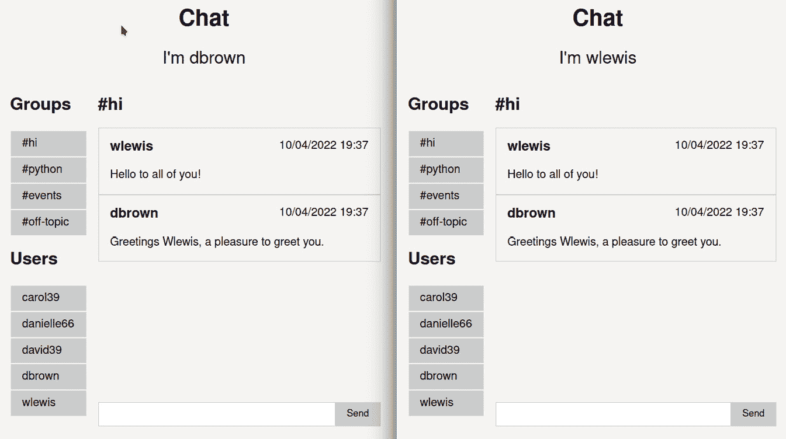
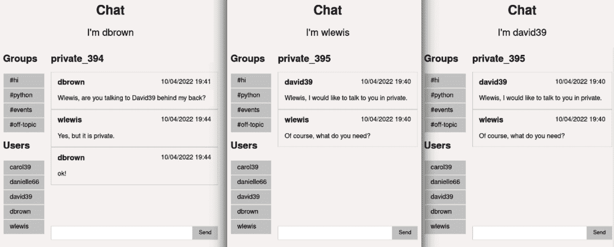

# 第五章：在房间中分离通信

通道允许我们向属于一个组的所有客户端广播、发送和接收异步消息。在组内，我们无法筛选用户。为了解决这个问题并创建分区或类别，我们必须求助于创建新的通道并手动分组客户端。

到目前为止，我们可以与被隔离在通道中的客户或与连接到公共通道的所有客户进行通信。现在，是时候学习如何控制组/通道，以便根据需要在不同组之间分离和移动客户了。你甚至可以将同一客户同时分配到几个组中。例如，如果我们正在创建聊天，用户订阅一个独特的通道以接收通知，以及另一个所有客户都可以自由写作的公共组，还有其他私人组，他们可以在其中与其他用户进行对话，这很有意义。对于客户端来说，从不同的组以不同的目的接收或发送不同的消息是有意义的。

在本章中，我们将涵盖以下主题：

+   管理通道的基本功能

+   创建完整的聊天

# 技术要求

你可以从本书的 GitHub 仓库下载本章的代码：[`github.com/PacktPublishing/Building-SPAs-with-Django-and-HTML-Over-the-Wire/tree/main/chapter-5`](https://github.com/PacktPublishing/Building-SPAs-with-Django-and-HTML-Over-the-Wire/tree/main/chapter-5)。

我们将使用我们在*第四章**，与数据库一起工作*中构建的模板：[`github.com/PacktPublishing/Building-SPAs-with-Django-and-HTML-Over-the-Wire/tree/main/chapter-4/initial-template`](https://github.com/PacktPublishing/Building-SPAs-with-Django-and-HTML-Over-the-Wire/tree/main/chapter-4/initial-template)

我已将应用程序的名称更改为 Chat。确保`App`文件夹名为`/app/chat/`，并且`apps.py`已重命名，其`name`变量：

```py
from django.apps import AppConfig
```

```py
class SimpleAppConfig(AppConfig):
```

```py
    default_auto_field = "django.db.models.BigAutoField"
```

```py
    name = "app.chat" # Update
```

如果你重命名了一个应用程序，你必须反映在`/project_template/settings.py`中：

```py
INSTALLED_APPS = [
```

```py
    "channels",
```

```py
    "django.contrib.admin",
```

```py
    "django.contrib.auth",
```

```py
    "django.contrib.contenttypes",
```

```py
    "django.contrib.sessions",
```

```py
    "django.contrib.messages",
```

```py
    "django.contrib.staticfiles",
```

```py
    "app.chat", # Update
```

```py
]
```

我也将消费者的名称更改为`ChatConsumer`：

```py
# app/chat/consumers.py
```

```py
class ChatConsumer(JsonWebsocketConsumer):
```

在`project_template/urls.py`中，你必须更改视图导入：

```py
from app.chat import views
```

在`Caddyfile`中，将域名从`hello.localhost`更改为`chat.localhost`：

```py
http://chat.localhost {
```

```py
    root * /usr/src/app/
```

最后，请记住，每次你更改消费者的名称时，都必须修改`/project_template/asgi.py`：

```py
from app.chat.consumers import ChatConsumer # Update
```

```py
... 
```

```py
                    re_path(r"^ws/chat/$", ChatConsumer.
```

```py
                        as_asgi()), # Update
```

```py
...
```

在模板就绪后，我们现在可以开始项目，这将涉及创建一个聊天工具。

我们将使用模型准备数据库并生成一些随机用户。然而，在我们继续之前，我们必须了解通道为向客户发送信息或管理组提供的功能。

# 管理通道的基本功能

管理通道的基本功能如下：

+   `send()`: 这个函数用于从消费者向单个客户端发送新消息。我们从本书的开头就使用了这个函数。然而，我们使用了`JsonWebsocketConsumer`包装器来使`send_json()`在发送 JSON 时更加方便：

    ```py
    data = {
                "my_data": "hi",
           }
    self.send_json(data)
    ```

+   `group_send()`: 这个函数用于从消费者向之前定义的客户端群组发送新消息。它是一个异步函数，因此我们需要整个消费者都是异步的，或者最好使用`async_to_sync`函数。在下面的示例中，你可以看到`{"my_data": "hi"}` JSON 是如何作为`"Main"`发送给整个群组的：

    ```py
    from asgiref.sync import async_to_sync
    async_to_sync(self.channel_layer.group_send)(
                "Main", {
                    "type": "send.hi", # Run "send_hi()" 
                        method
                    "my_data": "hi",
                }

    def send_hi(self, event):
            """Event: Send "hi" to client""""
            data = {
                "my_data": event["my_data"],
            }
            self.send_json(data)
    ```

+   `group_add()`: 这个函数用于将客户端添加到新的或现有的群组中。该函数也是异步的，因此我们将再次使用`async_to_sync`。在下面的示例中，我们将`(self.channel_name)`添加到名为`"Main"`的群组中：

    ```py
    async_to_sync(self.channel_layer.group_add)("Main", self.channel_name)
    ```

+   `group_discard()`: 这个函数用于从群组中移除一个客户端。同样，这也是一个异步函数，因此我们被迫使用`async_to_sync`。在这个示例中，我们已经从名为`"Main"`的群组中移除了`(self.channel_name)`：

    ```py
    async_to_sync(self.channel_layer.group_discard)("Main", self.channel_name)
    ```

通过这些功能，我们现在可以统治世界，或者至少是实时世界的世界。它们非常适合构建一个完整的聊天系统。而且...我们为什么不去与 WhatsApp 或 Slack 竞争呢？他们有成百上千位最优秀的工程师，但我们将在这里使用 Django：这是一场势均力敌的战斗。我们将创建一个软件，它将充分利用 Channels 的潜力来管理具有以下功能的多个群组：

+   无限制客户端数量的群组和公开消息

+   可以在两个客户端之间发送的私人消息

+   控制已连接或断开连接的客户端

+   可以识别注册用户

如果我们将 Channels 的功能与 Django 的功能结合起来，我们会发现我们拥有管理信息和连接到数据库所需的一切。然而，在连接到 Django 的模型之前，我们需要了解一些重要的细节。我们如何隔离用户？

# 创建一个完整的聊天系统

在任何技术中实现 WebSockets 时，一个非常流行的练习是创建一个简单的聊天系统。然而，当有多个连接的客户端将在私人空间和公开群组中交谈，并且任何客户端都可以阅读或参与时，难度会大大增加。使用 Channels，我们正在创建足够的抽象，以便我们可以专注于其他问题。

让我们创建一个具有现代功能的完整聊天系统：

+   消息历史

+   私人对话

+   群组

+   与数据库中注册用户关联的客户

接下来，我们必须定义数据库。我们将定义用户、房间和消息的模型。这样，我们就能存储每个用户的操作，并且会有关于所发生一切的记录。

## 定义数据库

在本节中，我们将创建一些数据库模型来管理客户、群组（我们将称之为房间）和消息。

使用以下内容编辑`/app/chat/models.py`：

```py
from django.db import models
```

```py
from django.contrib.auth.models import User
```

```py
class Client(models.Model):
```

```py
    """
```

```py
    Clients for users
```

```py
    """
```

```py
    user = models.ForeignKey(User, on_delete=models.CASCADE)
```

```py
    channel = models.CharField(max_length=200, blank=True, null=True, default=None)
```

```py
    created_at = models.DateTimeField(auto_now_add=True)
```

```py
    def __str__(self):
```

```py
        return self.user.username
```

`Client` 模型允许我们记录已连接或断开连接的用户。它还允许我们存储每个客户端的私有频道，以防我们需要从代码中的任何位置向他们发送个人消息：

```py
class Room(models.Model):
```

```py
    """
```

```py
    Rooms for users
```

```py
    """
```

```py
    users_subscribed = models.ManyToManyField(User, 
```

```py
        related_name="users_subscribed")
```

```py
    clients_active = models.ManyToManyField(Client, 
```

```py
        related_name="clients_active")
```

```py
    name = models.CharField(max_length=255, blank=True, 
```

```py
        null=True, default=None)
```

```py
    is_group = models.BooleanField(default=False)
```

```py
    def __str__(self):
```

```py
        return self.name
```

`Rooms` 将记录所有已创建的频道以及通过 `users_subscribed` 列订阅它们的客户端。我们必须执行此功能，因为频道不允许我们访问此信息，除非我们使用第三方扩展或数据库中创建记录，这正是我们在这里所做的事情。我们将使用 `clients_active` 来了解哪些客户端目前正在查看该组，因为它们可能被添加，但同时也可能断开连接或出现在另一个房间中。这样，我们只会将带有消息列表的更新或新 HTML 发送到活跃的客户端，而不是所有订阅的客户端。最后，`name` 将是组的名称，`is_group` 将标记这是一个有多个客户端的公共组（`True`）还是私人房间（`False`），这对于控制不受欢迎的访客是强制性的：

```py
class Message(models.Model):
```

```py
    """
```

```py
    Messages for users
```

```py
    """
```

```py
    User = models.ForeignKey(User, on_delete=models.
```

```py
        CASCADE)
```

```py
    room = models.ForeignKey(Room, on_delete=models.
```

```py
        CASCADE)
```

```py
    text = models.TextField()
```

```py
    created_at = models.DateTimeField(auto_now_add=True)
```

```py
    def __str__(self):
```

```py
        return self.text
```

`Message` 模型将负责存储聊天消息。每个元素都将有一个作者（我们将称之为 `user`），一个消息已发送的频道（我们将称之为 `room`），以及消息本身的文本（我们将称之为 `text`）。此外，我们还添加了 `created_at` 以便在列出消息时对它们进行排序。

我们将启动 `docker-compose` 来执行迁移：

```py
docker-compose up
```

在定义了模型之后，我们将创建迁移。我们需要进入 `django` 容器并查找其名称。作为一个提示，我们知道它将以 `_django_1` 结尾：

```py
docker ps
```

您将看到所有活动容器的列表，以及它们正在运行的进程：



图 5.1 – Docker 启动后列出所有容器的名称

在我的情况下，Django 是 `chapter-5_django_1`。

现在，让我们进入交互式 Bash 终端：

```py
docker exec -it chapter-5_django_1 bash
```

在这里，我们可以创建必要的迁移：

```py
./manage.py makemigrations chat
```

```py
./manage.py migrate
```

数据库准备就绪后，我们将添加一些随机用户以区分客户端。

## 生成随机用户

没有注册用户，我们无法工作，所以让我们创建一个 Python 脚本来生成一些随机数据。

我们将在项目的根目录下创建一个名为 `make_fake_users.py` 的文件，其中包含以下内容。目前，我们无法运行它，因为我们尚未安装 **Faker**：

Faker

Faker 是一个用于生成各种用途的假数据的 Python 库。在其最常见用途中，它用于将数据插入数据库以进行开发、原型设计或压力测试应用程序。

```py
# make_fake_users.py
```

```py
from django.contrib.auth.models import User
```

```py
from faker import Faker
```

```py
fake = Faker()
```

```py
# Delete all users
```

```py
User.objects.all().delete()
```

```py
# Generate 30 random emails and iterate them.
```

```py
for email in [fake.unique.email() for i in range(5)]:
```

```py
    # Create user in database
```

```py
    user = User.objects.create_user(fake.user_name(), 
```

```py
        email, "password")
```

```py
    user.last_name = fake.last_name()
```

```py
    user.is_active = True
```

```py
    user.save()
```

使用 Faker，我们可以生成五个唯一的电子邮件。然后，我们遍历它们，并创建一个具有生成的用户名和姓氏的唯一用户。

要安装 Faker，请将以下行添加到 `requirements.txt` 文件中：

```py
# Fake data
```

```py
Faker===8.13.2
```

不要忘记再次重建 Django 镜像，以便从`Dockerfile`安装新依赖项。

现在，让我们从 Django 容器中运行 Python 脚本：

```py
./manage.py shell < make_fake_users.py
```

我们目前有五个随机用户可供使用。

在数据库创建并填充数据后，我们可以专注于生成将使用这些信息的 HTML 及其组件。

## 集成 HTML 和样式

我们需要显示一些简洁的 HTML，以便使聊天可用，尽管我们不会赢得年度最佳网页设计奖。

让我们创建`app/chat/templates/index.html`，内容如下：

```py
{# app/chat/templates/index.html #}
```

```py

```

```py
<! doctype html>
```

```py
<html lang="en">
```

```py
<head>
```

```py
    <meta charset="UTF-8">
```

```py
    <meta name="viewport" content="width=device-width, 
```

```py
        user-scalable=no, initial-scale=1.0, maximum-
```

```py
            scale=1.0, minimum-scale=1.0">
```

```py
    <title>Chat</title>
```

```py
    {# CSS #}
```

```py
    <link rel="stylesheet" href="">
```

```py
    {# JavaScript #}
```

```py
    <script defer src="img/index.js' %}">
```

```py
    </script>
```

```py
</head>
```

让我们链接未来的 CSS 和 JavaScript 文件：

```py
<body
```

```py
        data-host="{{ request.get_host }}"
```

```py
        data-scheme="{{ request.scheme }}"
```

```py
>
```

现在，让我们沟通 JavaScript 将使用的路径来连接到`host`，并使用`scheme`检查连接是否安全：

```py
    <h1 class="title">Chat</h1>
```

```py
    {# Login user name #}
```

```py
    <h2 class="subtitle">I'm <span id="logged-user">
```

```py
    </span></h2>
```

```py
    <div class="container chat">
```

```py
        <aside id="aside">
```

```py
            {# List of groups and users #}
```

```py
            
```

```py
        </aside>
```

```py
        <main id="main">
```

```py
            {# Chat: Group name, list of users and form to 
```

```py
            send new message #}
```

```py
            
```

```py
        </main>
```

```py
    </div>
```

```py
</body>
```

```py
</html>
```

上述代码块分为三个部分：

+   `<span id="logged-user"></span>`: 用于显示客户端的名称

+   `<aside id="aside"></aside>`: 一个组件，将列出可点击以动态跳转到频道（或房间）的组名和用户名

+   `<main id="main"></main>`: 包含另一个组件，用于渲染所有现有或新消息，并使用相应的表单发布新消息

现在，让我们创建所有组件。让我们从`/app/chat/templates/components/_aside.html`开始：

```py
<nav>
```

```py
    {# Group links #}
```

```py
    <h2>Groups</h2>
```

```py
    <ul class="nav__ul">
```

```py
        <li class="nav__li">
```

```py
            <a
```

```py
                class="nav__link"
```

```py
                href="#"
```

```py
                data-group-name="hi"
```

```py
                data-group-public="true"
```

```py
            >
```

```py
                #hi
```

```py
            </a>
```

```py
        </li>
```

```py
        <li class="nav__li">
```

```py
            <a
```

```py
                class="nav__link" 
```

```py
                href="#"
```

```py
                data-group-name="python"
```

```py
                data-group-public="true"
```

```py
            >
```

```py
                #python
```

```py
            </a>
```

```py
        </li>
```

```py
                <li class="nav__li">
```

```py
            <a
```

```py
                class="nav__link"
```

```py
                href="#"
```

```py
                data-group-name="events"
```

```py
                data-group-public="true"
```

```py
            >
```

```py
                #events
```

```py
            </a>
```

```py
        </li>
```

```py
        </li>
```

```py
        <li class="nav__li">
```

```py
            <a
```

```py
                class="nav__link" 
```

```py
                href="#"
```

```py
                data-group-name="off-topic"
```

```py
                data-group-public="true"
```

```py
            >
```

```py
                #off-topic
```

```py
            </a>
```

```py
        </li>
```

```py
    </ul>
```

```py
    {# End Group links #}
```

```py
    {# Users links #}
```

```py
    <h2> Users</h2>
```

```py
    <ul class="nav__ul">
```

```py
    
```

```py
        <li class="nav__li">
```

```py
            <a
```

```py
                class="nav__link"
```

```py
                href="#"
```

```py
                data-group-name="{{ user.username }}"
```

```py
                data-is-group="false"
```

```py
            >
```

```py
                {{ user.username }}
```

```py
            </a>
```

```py
        </li>
```

```py
    
```

```py
    </ul>
```

```py
    {# End Users links #}
```

```py
</nav>
```

为了简化此代码，我们已手动输入所有组的名称，其中多个客户端可以同时发言。您可以从模型中生成它们。

现在，让我们创建`/app/chat/templates/components/_chat.html`：

```py
<section class="messages">
```

```py
    {# Name of the connected group #}
```

```py
    <h2 id="group-name">{{ name }}</h2>
```

```py
    {# List of messages #}
```

```py
    <div class="messages__list" id="messages-list"></div>
```

```py
    {# Form to add a new message #}
```

```py
    <form action="" class="messages__new-message">
```

```py
        <input type="text" class="input" name="message" 
```

```py
            id="message-text" />
```

```py
        <input type="submit" id="send" class="button" 
```

```py
            value="Send" />
```

```py
    </form>
```

```py
</section>
```

上述代码包含任何自重尊聊天室的基本三个部分：

+   当前存在的组或频道名称

+   消息列表

+   用于添加新消息的表单

然而，消息列表是空的。HTML 模板中的循环在哪里？为了整洁，我们将它放置在另一个组件中，该组件位于`app/chat/templates/components/_list_messages.html`，其中包含以下代码：

```py

```

```py
    {# Item message #}
```

```py
    <article class="message__item">
```

```py
        <header class="massage__header">
```

```py
            {# Username #}
```

```py
            <h3 class="message__title">{{ 
```

```py
                message.user.username }}</h3>
```

```py
            {# Date of creation #}
```

```py
            <time class="message__time">{{ 
```

```py
                message.created_at|date: "d/m/Y H:i" 
```

```py
                    }}</time>
```

```py
        </header>
```

```py
        <div>
```

```py
            {# Text #}
```

```py
            {{ message.text }}
```

```py
        </div>
```

```py
    </article>
```

```py
    {# End Item message #}
```

```py

```

现在我们已经定义了所有聊天 HTML，我们只需要添加一些最小样式来给它结构。

## 定义 CSS 样式

在本节中，我们将在`static/css/main.css`中创建一个样式文件，其中包含一些修复，以使未来的聊天更易于使用：

```py
/* Global styles */
```

```py
:root {
```

```py
    --color__background: #f6f4f3;
```

```py
    --color__gray: #ccc;
```

```py
    --color__black: #000;
```

```py
}
```

```py
* {
```

```py
    font-family: "Helvetica Neue", Helvetica, Arial, sans-
```

```py
        serif;
```

```py
    box-sizing: border-box;
```

```py
}
```

```py
body {
```

```py
    margin: 0;
```

```py
    background-color: var(--color__background);
```

```py
}
```

我们将准备一些颜色，提供漂亮的字体（如果您只从这本书中取一样东西，请始终使用 Helvetica），并安排`body`：

```py
/* General classes for small components */
```

```py
.container {
```

```py
    margin: 0 auto;
```

```py
    padding: 1rem 0;
```

```py
    max-width: 40rem;
```

```py
}
```

```py
.button {
```

```py
    display: inline-block;
```

```py
    padding: 0.5rem 1rem;
```

```py
    background-color: var(--color__gray);
```

```py
    border: 0;
```

```py
    cursor: pointer;
```

```py
    text-decoration: none;
```

```py
}
```

```py
.button:hover {
```

```py
    filter: brightness(90%);
```

```py
}
```

```py
.input {
```

```py
    display: block;
```

```py
    width: 100%;
```

```py
    outline: none;
```

```py
    padding: .5rem;
```

```py
    resize: none;
```

```py
    border: 1px solid var(--color__gray);
```

```py
    box-sizing: border-box;
```

```py
}
```

我们将稍微现代化输入，并准备一个容器以居中聊天：

```py
/* Styles for chat */
```

```py
.title {
```

```py
    text-align: center;
```

```py
}
```

```py
.subtitle {
```

```py
    text-align: center;
```

```py
    font-weight: normal;
```

```py
    margin: 0;
```

```py
}
```

```py
.chat {
```

```py
    display: grid;
```

```py
    grid-template-columns: 1fr 3fr;
```

```py
    gap: 1rem;
```

```py
}
```

现在，让我们水平对齐`<aside>`和`<main>`：

```py
/* Aside */
```

```py
.nav__ul {
```

```py
    list-style: none;
```

```py
    padding: 0;
```

```py
}
```

```py
.nav__link {
```

```py
    display: block;
```

```py
    padding: 0.5rem 1rem;
```

```py
    background-color: var(--color__gray);
```

```py
    border: 1px solid var(--color__background);
```

```py
    color: var(--color__black);
```

```py
    text-decoration: none;
```

```py
}
```

```py
.nav__link:hover {
```

```py
    filter: brightness(90%);
```

```py
}
```

```py
/* End Aside */
```

在这里，我们已固定浏览器和包含在`<aside>`内的链接，以便它们有一个足够舒适的点击区域：

```py
/* Chat */
```

```py
.messages {
```

```py
    display: grid;
```

```py
    height: 30rem;
```

```py
    grid-template-rows: 4rem auto 2rem;
```

```py
}
```

```py
.massage__header {
```

```py
    display: grid;
```

```py
    grid-template-columns: 1fr 1fr;
```

```py
    grid-gap: 1rem;
```

```py
}
```

```py
.messages__list {
```

```py
    overflow-y: auto;
```

```py
}
```

```py
.message__item {
```

```py
    border: 1px solid var(--color__gray);
```

```py
    padding: 1rem;
```

```py
}
```

```py
.massage__header . message__title {
```

```py
    margin-top: 0;
```

```py
}
```

```py
.massage__header . message__time {
```

```py
    text-align: right;
```

```py
}
```

```py
.messages__new-message {
```

```py
    display: grid;
```

```py
    grid-template-columns: 8fr 1fr;
```

```py
}
```

```py
/* End Chat */
```

最后，我们将每个聊天消息转换为一个带有边框的清晰分隔的框。我们还水平对齐了输入和表单按钮，以便像今天一样显示。

现在，我们必须创建一个视图来渲染我们已创建的所有部分——数据库、生成的用户、模板和 HTML 组件——以及一点 CSS。

## 创建视图

目前聊天根目录下还没有任何内容。没有视图和路由，模板无法被提供给客户端。即使我们展示一个静态模板，我们也必须指明可以访问和渲染它的路径。我们需要一个视图来生成其展示的 HTML。

在`/app/chat/views.py`中，我们将创建一个名为`index`的视图，它渲染`index.html`，显示所有用户，这些用户将在`<aside>`中显示：

```py
from django.shortcuts import render
```

```py
from django.contrib.auth.models import User
```

```py
def index(request):
```

```py
    """View with chat layout"""
```

```py
    return render(
```

```py
        request, "index.html", { "users": 
```

```py
            User.objects.all(). order_by("username")})
```

在`/project_template/urls.py`中，我们将添加当访问者进入网站根目录时要显示的视图：

```py
from django.urls import path
```

```py
from app.chat import views
```

```py
urlpatterns = [
```

```py
    path("", views.index, name="index"),
```

```py
]
```

现在，我们将打开我们手头的浏览器，访问项目的域名。地址在`docker-compose.yaml`文件的`DOMAIN`变量中描述。如果你没有修改文档，地址将是`http://hello.localhost`。在我的情况下，我已经将其更改为`http://chat.localhost`。

我们将在浏览器中看到手动编写的群组列表和现有用户的列表。此外，我们还有一个可以写入未来消息的表单：



图 5.2 – 没有任何消息、群组名称或客户端名称的聊天

视觉部分已经准备好了；现在，我们可以将所有注意力集中在聊天逻辑上。我们已经有了主体；现在，我们需要一个大脑来管理逻辑。

## 声明 JavaScript 以监听或发送消息

让我们更新`static/js/index.js`文件，添加以下代码：

```py
    VARIABLES
```

```py
*/
```

```py
// Connect to WebSockets server (SocialNetworkConsumer)
```

```py
const myWebSocket = new WebSocket(`${document.body.dataset.scheme === 'http' ? 'ws' : 'wss'}://${ document.body.dataset.host }/ws/chat/`);
```

我们将使用数据集的`<body>`标签中打印的`scheme`和`host`值，通过 WebSockets 客户端连接到后端：

```py
    FUNCTIONS
```

```py
*/
```

```py
/**
```

```py
* Send data to WebSockets server
```

```py
* @param {string} message
```

```py
* @param {WebSocket} webSocket
```

```py
* @return {void}
```

```py
*/
```

```py
function sendData(message, webSocket) {
```

```py
    webSocket.send(JSON.stringify(message));
```

```py
}
```

让我们检索之前示例中使用的`sendData()`函数，用于向后端发送消息：

```py
/**
```

```py
* Send message to WebSockets server
```

```py
* @return {void}
```

```py
*/
```

```py
function sendNewMessage(event) {
```

```py
    event.preventDefault();
```

```py
    const messageText = document.querySelector('#message-
```

```py
        text')
```

```py
    sendData({
```

```py
            action: 'New message',
```

```py
            data: {
```

```py
                message: messageText.value
```

```py
            }
```

```py
        }, myWebSocket);
```

```py
    messageText.value = '';
```

```py
}
```

现在，我们必须声明一个发送新消息的函数。由于我知道作者是谁，所以除了文本之外我们不需要任何东西：

```py
/**
```

```py
* Requests the Consumer to change the group with respect to the Dataset group-name.
```

```py
* @param event
```

```py
*/
```

```py
function changeGroup(event) {
```

```py
    event.preventDefault();
```

```py
    sendData({
```

```py
            action: 'Change group',
```

```py
            data: {
```

```py
                groupName: event.target.dataset.groupName,
```

```py
                isGroup: event.target.dataset.groupPublic 
```

```py
                    === "true".
```

```py
            }
```

```py
        }, myWebSocket);
```

```py
}
```

`changeGroup()`函数将告诉 Consumer 更改群组，并发送现有群组消息的 HTML。我们将伴随这个请求，提供存储要更改的房间名称和是否是多用户群组或私密对话的信息的数据集。

最终的 JavaScript 片段是用于后端监听器：

```py
    EVENTS
```

```py
*/
```

```py
// Event when a new message is received by WebSockets
```

```py
myWebSocket.addEventListener("message", (event) => {
```

```py
    // Parse the data received
```

```py
    const data = JSON.parse(event.data);
```

```py
    // Renders the HTML received from the Consumer
```

```py
    document.querySelector(data.selector).innerHTML = 
```

```py
        data.html;
```

如前例所示，我们将收集 JSON，解析它，并注入 HTML：

```py
    // Scrolls to the bottom of the chat
```

```py
    const messagesList = document.querySelector('#messages-
```

```py
        list');
```

```py
    messagesList.scrollTop = messagesList.scrollHeight;
```

每次我们打印消息列表或接收新消息时，滚动条都会放置在不适当的高度。它可能根本不会滚动，或者它可能悬挂在中间。为了解决这个问题，在每次 HTML 注入后，我们必须滚动到元素的末尾，始终显示最后一条消息。这是所有聊天中常见的操作：

```py
    /**
```

```py
     * Reassigns the events of the newly rendered HTML
```

```py
     */
```

```py
    // Button to send new message button
```

```py
    document.querySelector('#send').addEventListener('click', 
```

```py
    sendNewMessage);
```

```py
    // Buttons for changing groups
```

```py
    document.querySelectorAll(".nav__link").forEach(button => {
```

```py
        button.addEventListener("click", changeGroup);
```

```py
    });
```

```py
});
```

最后，我们必须在每次渲染后重新分配所有事件。发送新消息的按钮（ID 为`send`）将执行`sendNewMessage()`，而所有`<aside>`按钮将调用`changeGroup()`。

前端定义完成后，现在是时候与消费者（Consumer）一起工作了。消费者负责管理数据库、监听 JavaScript、渲染 HTML 以及管理群组。

## 构建消费者以管理群组

在本节中，我们将定义当客户端连接、断开连接、发送更改群组操作或添加新消息时会发生什么。

使用以下内容编辑`app/chat/consumers.py`：

```py
# app/chat/consumers.py
```

```py
from channels.generic.websocket import JsonWebsocketConsumer
```

```py
from django.template.loader import render_to_string
```

```py
from asgiref.sync import async_to_sync
```

```py
from channels.auth import login, logout
```

```py
from django.contrib.auth.models import User
```

```py
from .models import Client, Room, Message
```

让我们导入认证系统、用户和模型：

```py
class ChatConsumer(JsonWebsocketConsumer):
```

当我们加载消费者时，我们将首先删除僵尸客户端，以防我们强制关闭 Django：

```py
    Client.objects.all().delete()
```

```py
    def connect(self):
```

```py
        """Event when client connects"""
```

现在，我们将接受客户的连接：

```py
        self.accept()
```

接下来，我们将获取一个尚未注册为客户的随机用户：

```py
        user = User.objects.exclude(
```

```py
            id__in=Client.objects.all().values("user")
```

```py
        ).order_by("?").first()
```

在这里，我们将识别用户。与存储用户 ID 相比，使用会话将更容易工作：

```py
        async_to_sync(login)(self.scope, user)
```

```py
        self.scope["session"].save()
```

现在，我们将向前端发送注册用户的名称：

```py
        self.send_html(
```

```py
            {
```

```py
                "selector": "#logged-user",
```

```py
                "html": self.scope["user"].username,
```

```py
            }
```

接下来，我们将客户端注册到数据库中以控制谁可以连接：

```py
        Client.objects.create(user=user, 
```

```py
            channel=self.channel_name)
```

在这一点上，我们将把`"hi"`群组指定为进入时首先显示的房间。我们创建了一个特殊函数来处理更改房间时的重复性任务。我们将在稍后描述该函数的工作原理：

```py
        self.add_client_to_room("hi", True)
```

现在，让我们列出我们刚刚分配给客户端的房间的消息：

```py
        self.list_room_messages()
```

```py
def disconnect(self, close_code):
```

```py
        """Event when client disconnects"""
```

当客户端断开连接时，我们将执行以下三个任务：

+   从当前房间中移除客户端：

```py
        self.remove_client_from_current_room()
```

+   注销客户端：

```py
        Client.objects.get(channel=self.channel_name).delete()
```

+   注销用户：

```py
        logout(self.scope, self.scope["user"])
```

通过这样，我们自动实现了一个系统，为用户创建会话，这对于识别和向用户发送个人消息非常有用，并且在 WebSocket 客户端断开连接时关闭用户的会话。

我们在其他示例中用于管理前端操作的功能在这里也很有用。后端任务很简单：监听并返回 JSON。我们将始终使用相同的函数，无论应用程序如何：

```py
    def receive_json(self, data_received):
```

```py
        """
```

```py
            Event when data is received
```

```py
            All information will arrive in 2 variables:
```

```py
            "action", with the action to be taken
```

```py
            "data" with the information
```

```py
        """
```

```py
        # Get the data
```

```py
        data = data_received["data"]
```

根据操作，我们将执行一项或多项任务。这些是前端请求的操作，例如添加新消息或列出所有消息。

只有当前端发起请求时，我们才会更改群组。但这个请求何时会发起？当用户点击他们想要进入的群组名称或他们想要交谈的用户时。这个事件将被前端捕获，并将“更改群组”操作发送到后端。

对于想要进入私人房间（只有两个用户）的用户和想要进入公共房间（对用户数量和开放消息没有限制）的用户，我们不能以同样的方式工作。代码是不同的。为了控制这种情况，我们将要求前端发送我们`isGroup`。如果是`true`，则是一个公共群组。如果是`false`，则是两个用户之间的私人群组。

我们将首先更改组：

```py
        match data_received["action"]:
```

```py
            case "Change group":
```

```py
                if data["isGroup"]:
```

如果 `isGroup` 是 `True`，我们将客户端添加到多用户房间：#hi, #python...

```py
                    self.add_client_to_room(data["groupName"], data["isGroup"])
```

```py
                else:
```

如果 `isGroup` 是 `False`，我们将添加目标用户和当前用户到私人房间。

我们面临的主要问题是当两个客户端需要互相交谈时，我们需要确保只为他们创建一个房间。困难之处在于我们需要检查房间是否已经存在，如果不存在，我们需要创建一个群组，并在他们想要连接时通知参与者。我们将不得不制作一个如下所示的决策树：

1.  搜索一个已经创建的房间，其中两个客户端在过去已经交谈过。如果存在，检索房间的名称并将客户端添加到群组。如果不存在，转到 *步骤 2*。

1.  检查想要互相交谈的用户是否独自在一个房间里。这是因为他们已经创建了一个房间，并正在等待另一个用户加入并与之交谈。如果不是，请转到 *步骤 3*。

1.  创建一个新的房间，并希望有用户想要与我们交谈。

首先，我们将搜索两个客户端匹配的房间：

```py
                    room = Room.objects.filter(users_subscribed__in=[self.scope["user"]], is_group=False). intersection(Room.objects.filter(users_subscribed__in=[user_target], is_group=False)).first())
```

```py
                    if room and user_target and room.users_subscribed.count() == 2:
```

然后，我们将获取想要交谈的客户端：

```py
                    user_target = User.objects.filter(username=data["groupName"]).first()
```

可能找到一个现有的群组，其中目标和当前客户端已经在交谈。这是最有利的情况，因为有一个先前的对话，其中已经创建了一个房间。在这种情况下，客户端可以被添加到群组中进行交谈：

```py
                        self.add_client_to_room(room.name)
```

```py
                    else:
```

如果没有现有的群组，寻找目标用户独自一人的房间：

```py
                        room = Room.objects.filter(
```

```py
                            users_subscribed__in=[
```

```py
                                user_target,
```

```py
                            ],
```

```py
                            is_group=False,
```

```py
                        ).last()
```

```py
                        if room and room.users_subscribed.count() == 1:
```

如果有房间，让我们加入：

```py
                            self.add_client_to_room(room.name)
```

```py
                        else:
```

如果我们没有找到目标用户独自一人的房间，我们必须创建一个新的房间：

```py
                            self.add_client_to_room()
```

将客户端移动到另一个房间后，我们需要给他们反馈，以便他们知道他们此刻所在的房间。我们将发送房间名称给他们：

```py
                self.send_room_name()
```

```py
            case "New message":
```

在这里，我们收到了一条需要保存的新消息：

```py
                self.save_message(data["message"])
```

之后，我们将向客户端展示一些更改，例如添加一条新消息。我们总是会发送客户端所在位置的短信列表，以便他们能够获得最新的 HTML 更改：

```py
        self.list_room_messages()
```

```py
    def send_html(self, event):
```

```py
        """Event: Send html to client"""
```

```py
        data = {
```

```py
            "selector": event["selector"],
```

```py
            "html": event["html"],
```

```py
        }
```

```py
        self.send_json(data)
```

```py
    def list_room_messages(self):
```

```py
        List all messages from a group""""""
```

```py
        room_name = self.get_name_room_active()
```

```py
        # Get the room
```

```py
        room = Room.objects.get(name=room_name)
```

```py
        # Get all messages from the room
```

```py
        messages = Message.objects.filter(room=room). order_by("created_at")
```

```py
        # Render HTML and send to client
```

```py
        async_to_sync(self.channel_layer.group_send)(
```

```py
            room_name, {
```

```py
                "type": "send.html", # Run "send_html()" method
```

```py
                "selector": "#messages-list",
```

```py
                "html": render_to_string("components/_list_messages.html", {"messages": messages})
```

```py
            }
```

```py
    def send_room_name(self):
```

```py
        """Send the room name to the client"""
```

```py
        room_name = self.get_name_room_active()
```

```py
        room = Room.objects.get(name=room_name)
```

```py
        data = {
```

```py
            "selector": "#group-name",
```

```py
            # Concadena # if it is a group for aesthetic reasons
```

```py
            "html": ("#" if room.is_group else "") + room_name,
```

```py
        }
```

```py
        self.send_json(data)
```

每当我们想知道自己是谁时，我们可以使用 `self.scope["user"]`。它将返回已登录的用户对象：

```py
    def save_message(self, text):
```

```py
        "Save a message in the database"""""
```

```py
        # Get the room
```

```py
        room = Room.objects.get(name=self.get_name_room_active())
```

```py
        # Save message
```

```py
        Message.objects.create(
```

```py
            user=self.scope["user"],
```

```py
            room=room,
```

```py
            text=text,
```

要将用户添加到房间中，我们必须执行以下操作：

1.  获取用户客户端。

1.  从之前的房间中移除客户端。

1.  获取或创建一个房间。

1.  如果房间没有名称，则分配 `"private_{id}"`。例如，如果 `id` 是 1，它应该是 `"private_1"`。

1.  将客户端添加到群组中。

1.  将群组名称发送给客户端，如下所示：

```py
    def add_client_to_room(self, room_name=None, is_group=False):
```

```py
        """Add customer to a room within Channels and save the reference in the Room model."""""
```

```py
        client = Client.objects.get(user=self.scope["user"])
```

```py
        self.remove_client_from_current_room()
```

```py
        room, created = Room.objects.get_or_create(name=room_name, is_group=is_group)
```

```py
        if not room.name:
```

```py
            room.name = f "private_{room.id}"
```

```py
            room.save()
```

```py
        room.clients_active.add(client)
```

```py
        room.users_subscribed.add(client.user)
```

```py
        room.save()
```

```py
        async_to_sync(self.channel_layer.group_add)(room.name, self.channel_name)
```

```py
        self.send_room_name()
```

让我们更详细地描述前面的代码。有几个重要的部分需要理解：

1.  通过过滤数据库，获取我们活跃的房间名称相对容易：

    ```py
        def get_name_room_active(self):
            """Get the name of the group from login user""""
            room = Room.objects.filter(clients_active__user_id=self.scope["user"].id). first()
            return room.name
    ```

1.  要将自己从群组中移除，我们必须执行相反的操作：

    ```py
        def remove_client_from_current_room(self):
            Remove client from current group""""""
    ```

1.  我们获取我们活跃的所有房间：

    ```py
            client = Client.objects.get(user=self.scope["user"])
            rooms = Room.objects.filter(clients_active__in=[client])
    ```

1.  我们进出房间并相互消除：

    ```py
            for room in rooms:
    ```

1.  从群组中移除客户端：

    ```py
                async_to_sync(self.channel_layer.group_discard)(room.name, self.channel_name)
    ```

1.  我们从房间模型中移除客户端：

    ```py
                room.clients_active.remove(client)
                room.save()
    ```

现在聊天已经完成。当我们进入时，它将渲染我们的用户名和我们在活跃的房间名称。在聊天的开始，我们将看到 `#hi`：



图 5.3 – 我们的用户名，在登录时随机分配，以及当前房间

如果我们在另一个浏览器中打开一个标签页或使用私密浏览，将为会话分配一个新的随机用户，并且我们能够向任何群组发布帖子。所有消息都将实时渲染到当前群组中或活跃的客户端：



图 5.4 – 任何用户都可以在群组中自由写作，没有限制

如果我们打开第三个浏览器，我们可以体验私人房间或两个客户端之间的对话：



图 5.5 – 两个用户之间的私密对话

在任何时候，我们都可以与现有用户或群组交换消息。此外，由于我们有一个数据库来存储消息，即使我们重新启动 Docker 容器，我们也会看到所有已写入的历史记录，按创建日期排序。这里，我们有一个真实的聊天，具有后端实时响应和逻辑。如果我们知道如何使用 Django 的原生工具以及如何管理 Channels，我们能实现的事情真是令人惊叹。

# 摘要

在本章中，我们创建了一个具有私人房间和群组的实用聊天，类似于 Slack 或 Teams 等其他软件，只需很少的 JavaScript 代码（没有注释，少于 35 行）。此外，我们在认证系统中迈出了第一步。我们现在可以在不同的 Channels 中注册和管理客户端，根据我们的需求，并知道谁已连接或断开连接。魔法结束了——我们现在已经是 Channels 的主人了。

在下一章，*第六章*，*在后端创建 SPAs*，我们将处理使网站动态化的最后几个必要元素，例如更改页面、决定何时更新整个部分或添加新的 HTML 片段、使用会话以减少对数据库的依赖，以及验证数据的来源以避免使用 WebSockets 的跨站请求伪造（**CSRF**）。凭借我们已掌握的所有技能，我们将在 *第七章*，*仅使用 Django 创建实时博客* 中构建一个完整的 SPA。
