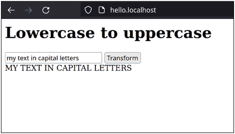

# 第八章：简化前端

在整个章节（例如，进行聊天项目或博客），我们编写了混乱的 JavaScript 代码。每当后端发送新的 HTML 时，我们被迫重复任务，清理孤儿事件并将新事件重新分配给新创建的 DOM。我们对前端的目标相当谦虚。我们限制自己通过专注于 Django 代码来生存。如果我们有一个通过服务器渲染的 HTML 处理事件的工具，JavaScript 代码将更加简洁，并且更容易处理。是时候重构前端了，但我们需要帮助来完成这项工作。

Stimulus 是这项工作的理想选择。我们谈论的是一个框架，其目标是通过对我们指定的函数连接属性和事件来不断监控页面上的变化。我们可以创建控制器，通过数据集将它们分配给输入或任何其他需要添加事件的元素。然后，我们将每个事件与 JavaScript 中的某些逻辑相关联。这是一个在 Stimulus 的官方文档中找到的精彩定义：你应该将 Stimulus 视为一个 CSS 类，它将一个 HTML 元素与一组样式连接起来。

在本章中，我们将专注于创建一个使用 Stimulus 的最小示例，它将作为理解其工作原理的基础，并且可以在网站上的任何事件中实现。我们将按顺序介绍以下内容：

+   安装和配置 Stimulus

+   定义控制器

+   使用动作管理事件

+   使用目标捕获引用

+   构建一个将文本转换为 uppercase 字母的应用程序

最终目标是构建一个小的应用程序，我们在文本框中编写，实时可视化相同的字符串，但以大写字母形式。为此，我们将使用 Stimulus 来捕获事件和输入值并与消费者进行通信。当一切就绪时，你将惊讶于前端将多么优雅。

# 技术要求

示例基于我们在 *第四章* *“与数据库一起工作”* 中使用的模板：

[使用 Django 和 HTML Over-the-Wire 构建 SPAs 的第四章/初始模板](https://github.com/PacktPublishing/Building-SPAs-with-Django-and-HTML-Over-the-Wire/tree/main/chapter-4/initial-template)

完成的代码可以在以下存储库中找到：

[使用 Django 和 HTML Over-the-Wire 构建 SPAs 的第八章](https://github.com/PacktPublishing/Building-SPAs-with-Django-and-HTML-Over-the-Wire/tree/main/chapter-8)

还建议您访问 Stimulus 的官方文档，以了解更多关于控制器、动作和目标等重要概念的信息：

[Stimulus 手册](https://stimulus.hotwired.dev/handbook/)

此外，建议你拥有一个现代版本的 Node.js 以及最新版本的`npm`。我们将使用它来安装 Stimulus 包，但我们也可以使用 CDN。

CDN 或内容分发网络

CDN 是一组位于世界各地的服务器，它们协同工作以快速有效地向用户交付内容。它与静态内容（如图像、CSS 和 JavaScript）一起使用。

在资源明确之后，我们现在可以开始实现前端的一个更好版本。我们将从安装 Stimulus 并讨论其不同的配置开始。

# 安装和配置 Stimulus

在你能够使用 Stimulus 之前，你需要下载并安装该框架。如果你不想使事情复杂化，你可以从其 CDN 导入。只需在 HTML 模板中添加以下脚本即可：

```py
<script type="module" src=
```

```py
https://unpkg.com/@hotwired/stimulus@3.0.1/dist/stimulus.js
```

```py
> 
```

如果你选择这种解决方案，你可以忽略本节的其余部分。

然而，如果你想下载 Stimulus，这是一个非常好的实践，请注意它可以在`npm`包中找到，所以让我们用命令来安装它：

```py
npm i @hotwired/stimulus
```

从这里，你有三种不同的配置可能性：使用 Webpack，使用另一个构建系统，或者使用原生的 JavaScript 模块系统。我们将专注于最后一个选项，使用模块，以简化你的实现并避免增加复杂性：

1.  将 Stimulus 文件复制到`static`文件夹内的一个文件夹中，例如，在`static/js/vendors/`路径下：

    ```py
    mkdir -p static/js/vendors/
    cp node_modules/@hotwired/stimulus/dist/stimulus. Js static/js/vendors/  
    ```

1.  我们创建一个名为`main.js`的 JavaScript 文件，该文件将包含所有未来的前端逻辑和导入（包括 Stimulus）：

    ```py
    touch static/js/main.js
    ```

1.  在我们刚刚创建的文件中，`main.js`，我们将导入 Stimulus 并运行它：

    ```py
    import { Application } from "./vendors/stimulus.js";
    window.Stimulus = Application.start();
    ```

1.  最后，我们将 JavaScript 模块导入一个将在应用程序的主要 HTML 模板中存在的脚本中，以便浏览器可以加载它：

    ```py
    <script defer type="module" 
      src="img/main.js' %}"></script>
    ```

Stimulus 已准备就绪！它正在运行，等待我们的事件。

理解所有基本概念的最佳方式是创建一个简单的应用程序。正如我们在介绍中提到的，我们将构建一个具有基本功能的应用程序：将一些文本从小写转换为大写。我们将有一个输入和一个按钮；当按钮被按下时，按钮将在底部显示大写文本。

为了实现目标，我们将了解 Stimulus 的三个基本支柱：**控制器**、**动作**（不要与后端创建的动作混淆）和**目标**。我们将首先查看控制器及其在组织逻辑中的重要性。

# 定义一个控制器

控制器的目的是将 DOM 与 JavaScript 连接起来。它将输入绑定到一个变量，并将我们指示的事件绑定到控制器内部创建的函数。

结构如下：

```py
import { Controller } from "../vendors/stimulus.js".
```

```py
export default class extends Controller {
```

```py
   // Variables linked to inputs.
```

```py
   static targets = [ "input1" ]
```

```py
   // Constructor or function to be executed when the
```

```py
   // controller is loaded.
```

```py
   connect() {
```

```py
   }
```

```py
   // Simple function
```

```py
   myFunction(event) {
```

```py
   }
```

```py
}
```

我们通过`import`和`from`的组合导入了框架自带的`Controller`类。然后，我们创建了一个扩展`Controller`的类，并且可以通过导入来访问它（`export default`）。在内部，我们有一个名为`input1`的目标示例和两个函数：当 Stimulus 准备就绪时将执行`connect()`函数，而`myFunction()`是一个示例函数，它可以被执行。

对于应用程序，我们将在`static/js/controllers/transformer_controller.js`中创建一个文件，内容如下：

```py
import { Controller } from "../vendors/stimulus.js"
```

```py
export default class extends Controller {
```

```py
  static targets = [ "myText" ]
```

```py
    connect() {
```

```py
      // Connect to the WebSocket server
```

```py
        this.myWebSocket = new WebSocket(
```

```py
          'ws://hello.localhost/ws/example/');
```

```py
        // Listen for messages from the server
```

```py
        this.myWebSocket.addEventListener("message",
```

```py
                                          (event) => {
```

```py
            // Parse the data received
```

```py
            const data = JSON.parse(event.data);
```

```py
            // Renders the HTML received from the Consumer
```

```py
            const newFragment = document.createRange().
```

```py
              createContextualFragment(data.html);
```

```py
            document.querySelector(data.selector).
```

```py
              replaceChildren(newFragment);
```

```py
        });
```

```py
    }
```

```py
    lowercaseToUppercase(event) {
```

```py
      event.preventDefault()
```

```py
      // Prepare the information we will send
```

```py
      const data = {
```

```py
          "action": "text in capital letters",
```

```py
          "data": {
```

```py
              "text": this.myTextTarget.value
```

```py
          }
```

```py
      };
```

```py
      // Send the data to the server
```

```py
      this.myWebSocket.send(JSON.stringify(data));
```

```py
  }
```

```py
}
```

如您所见，这是我们在前几章的前端代码中的重构。让我们更仔细地看看每个部分：

+   在`targets`中，我们定义了一个名为`myText`的变量，它将在*使用目标捕获引用*部分稍后链接，在那里我们获取输入的值。在控制器内部，我们可以使用`this.mytextTarget`使用输入。一个目标包含所有输入元素，如`value`。

+   `connect()`是一个在驱动程序完全挂载时执行的函数。这是一个连接到 WebSocket 服务器并设置消息监听事件的好地方。

+   `lowercaseToUppercase(event)`是一个将文本发送到后端以转换为大写的函数。在下一节*使用动作管理事件*中，我们将按钮点击事件链接到该函数。目前，我们只是声明其逻辑。

在声明控制器之后，我们需要在 Stimulus 中注册它并给它一个名字。我们使用以下代码编辑`static/js/main.js`。

```py
import { Application } from "./vendors/stimulus.js";
```

```py
import TransformerController from 
```

```py
  "./controllers/transformer_controller.js"; // New line
```

```py
window.Stimulus = Application.start();
```

```py
// New line
```

```py
Stimulus.register("transformer", TransformerController);
```

基本上，我们已经导入了`TransformerController`类，并在 Stimulus 中用别名`transformer`注册了它。

目前，Stimulus 已经注册了一个控制器，但它不知道应该监视 DOM 的哪个区域以及在哪里应用它。让我们来处理这个问题。

在一个新的模板中，例如名为`index.html`的模板，我们将创建一个简单的表单和一个用于渲染来自后端的所有内容的元素：

```py
<main>
```

```py
<form>
```

```py
<input type="text" placeholder="Enter text">
```

```py
<input type="button" value="Transform">
```

```py
</form>
```

```py
<div id="results"></div>
```

```py
</main>
```

表单有一个用于写入文本的字段和一个将执行动作的按钮。另一方面，我们包含了一个带有 ID `results`的 HTML `div`标签，它将是显示由后端处理并转换为大写的文本的地方

我们将告诉 Stimulus 使用我们选择的 DOM 来使控制器工作。这样做的方式是通过`data-controller`数据集：

```py
<element data-controller="alias"></element>
```

在我们的案例中，我们更新了`<main>`的打开方式：

```py
<main data-controller="transformer">
```

很简单，不是吗？Stimulus 已经注册了一个控制器，现在知道在哪里应用它。

下一步是指出哪个事件与哪个函数相关联，哪个输入与哪个目标相关联。

# 使用动作管理事件

动作是 Stimulus 用来将事件链接到控制器函数的结构。它们通过具有以下结构的`data-action`数据集在 DOM 中声明：

```py
<div data-controller="aliasController">
```

```py
<button
```

```py
  data-action=
```

```py
    "event->aliasController#functionOfTheController"
```

```py
>Click me!</button>
```

```py
</div>
```

它只有在它位于具有相同别名的控制器内部时才会工作；你不能在树外的 DOM 中放置一个动作。

按照示例，我们修改我们的按钮：

```py
<input
```

```py
  type="button"
```

```py
  value="Transform"
```

```py
  data-action="click->transformer#lowercaseToUppercase"
```

```py
>
```

让我们分析一下我们用 `data-action` 做了什么，因为它包含我们必须遵循的格式：

1.  事件是 `click`。它可以是任何其他事件，例如，如果我们在一个 HTML `<form>` 标签中，则可能是 `submit` 事件，或者是一个 `scroll` 事件等等。

1.  在箭头 `->` 之后，它作为分隔符，我们指出包含它的控制器别名。

1.  最后，在 `#` 之后，它是另一个分隔符，我们指出要执行的函数（`lowercaseToUppercase`）。

我们简化了事件的定义，但现在它们也会在包含或删除 DOM 元素时自动管理。不仅如此，后端现在还具有添加新事件的超级能力。是的，你没听错，后端可以包含 JavaScript 事件！它们已成为 HTML 中的数据集，我们可以根据需要删除或添加。

完成与 Stimulus 相关的最后一个步骤只剩下：详细说明可以通过目标访问的输入。否则，我们将无法从表单中收集信息。

# 使用目标捕获引用

刺激通过目标或特殊数据集连接到输入。在内部，Stimulus 创建一个可以在控制器中任何地方使用的变量。例如，我们在 DOM 中定义了一个名为 `name` 的别名：

```py
<div data-controller="aliasController">
```

```py
<input type="text" data-aliasController-target="name">
```

```py
</div>
```

当在控制器中时，我们定义以下内容：

```py
static targets = [ "name" ]
```

从这里，我可以在以下任何函数/方法中调用目标：

```py
this.nameTarget
```

如您所见，别名与目标文本连接在一起。

在我们正在开发的应用程序中，我们使用名称 `myText` 定义了目标：

```py
static targets = [ "myText" ]
```

我们按照以下方式更新输入的 DOM：

```py
<input type="text" data-transformer-target="myText" 
```

```py
  placeholder="Enter text">
```

整个前端已经准备就绪。我们已经安装了 Stimulus，创建了一个控制器，并定义了一个触发动作的动作和一个收集输入文本的目标。我们只需要在消费者中定义功能。我们转向 Django。

# 一个将文本转换为上档字母的应用程序

我们已经使用 Stimulus 简化了前端，安装、配置和实现了这个出色框架提供的工具。然而，在将文本从小写转换为上档的应用程序中，我们还有最后一个步骤：在消费者中实现后端。

使用以下代码编辑 `app/app_template/consumers.py`：

```py
from channels.generic.websocket import JsonWebsocketConsumer
```

```py
from django.template.loader import render_to_string 
```

```py
class ExampleConsumer(JsonWebsocketConsumer): 
```

```py
    def connect(self):
```

```py
        """Event when client connects"""
```

```py
        # Accept the connection
```

```py
        self.accept()
```

```py
    def receive_json(self, data_received):
```

```py
        # Get the data
```

```py
        data = data_received['data']
```

```py
        # Depending on the action we will do one task or
```

```py
        # another.
```

```py
        match data_received['action']:
```

```py
            case 'text in capital letters':
```

```py
                self.send_uppercase(data)
```

```py
    def send_uppercase(self, data):
```

```py
        """Event: Send html to client"""
```

```py
        self.send_json( {
```

```py
                'selector': '#results',
```

```py
                'html': data["text"]. upper(),
```

```py
            })
```

代码如此简单，看起来就像属于第一章节。我们已经删除了 `actions.py` 文件和一些其他元素，因为我们只寻找使它工作的最小必要部分。

让我们回顾一下信息进入后端、转换和返回的地方：

+   前端的信息传递到 `receive_json`，然后通过执行 `self.send_uppercase(data)` 函数接收 `'text in capital letters'` 动作。

+   `self.send_uppercase(data)` 将文本转换为上档并发送信息到前端，特别是到 `#results` 选择器。

是时候测试一切是否正常工作了。我们启动 Docker 并访问`http://hello.localhost`。输入内容并点击**转换**按钮。



图 8.1 – 我们测试了应用程序通过将小写字母转换为大写字母来工作

在底部，文本将以大写形式显示——我们做到了！

我们甚至可以进一步改进它。在按按钮和显示最终结果之间的本地延迟是可以忽略不计的，在我的情况下，是 0.002 秒。我们可以将`input`事件整合到输入中，以便我们在输入时就能看到结果，给人一种没有明显延迟的感觉：

```py
<input
```

```py
  type="text"
```

```py
  data-transformer-target="myText"
```

```py
  placeholder="Enter text"
```

```py
  data-action="input->transformer#lowercaseToUppercase"
```

```py
>
```

通过这个小优化，我们可以得出结论，应用程序的后端实现已经完成。

你可能会想将 Stimulus 应用到前几章的示例中——我只能告诉你：继续吧。这样会更整洁，你会对 Stimulus 了解得更多，而且维护起来会更简单。

# 摘要

我们使用 Django 学习 HTML 的旅程就此结束。现在我们能够通过将所有逻辑集中在后端来实时创建单页应用（SPAs），避免了重复任务，如验证或 HTML 结构。我们减轻了前端的大负担；现在它只需要处理事件或动画，多亏了 Stimulus 控制器和来自数据集的内部自动化。

我很想告诉你，你已经知道你需要知道的一切，但旅程还在继续。这本书只是一个起点。你面前还有许多工作要做：练习，将 Stimulus 应用到你的工作流程中（或任何其他类似框架），解决任何 SPA 典型的微小困难（例如，当用户在历史记录中点击后退按钮时），探索其他相关协议，如服务器端事件，培训你的同事，说服你的老板，定义后端和前端之间的界限（任何网络开发者的无限斗争），甚至采用其他框架。限制由你自己设定。

能够与你们一起加入这场实时 Python 冒险，我感到非常高兴。我喜欢写每一行代码，准备每一个示例。谢谢。

我只能对你说：我对你寄予厚望。

```py
WebSocket.close()
```
