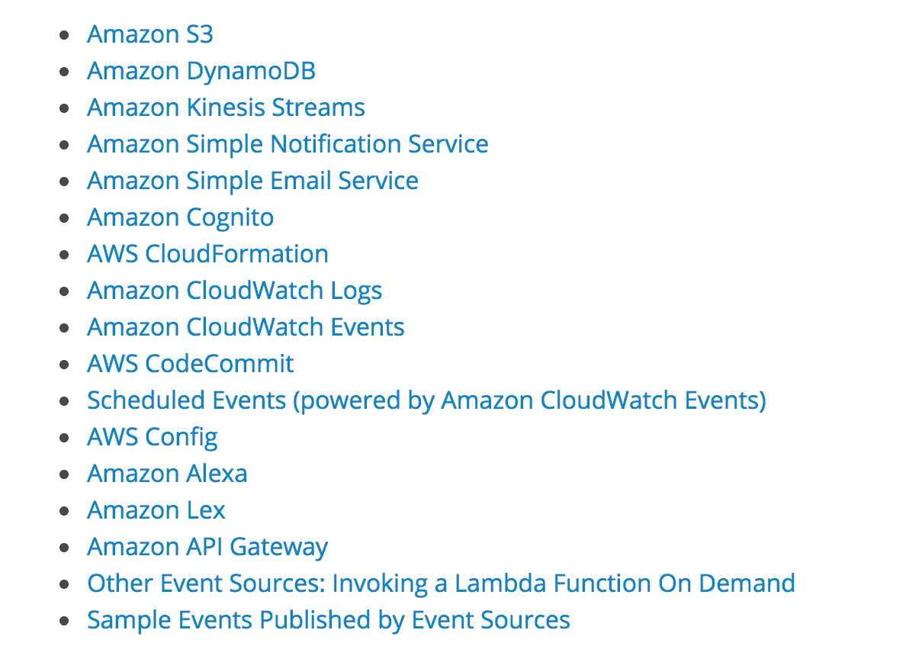
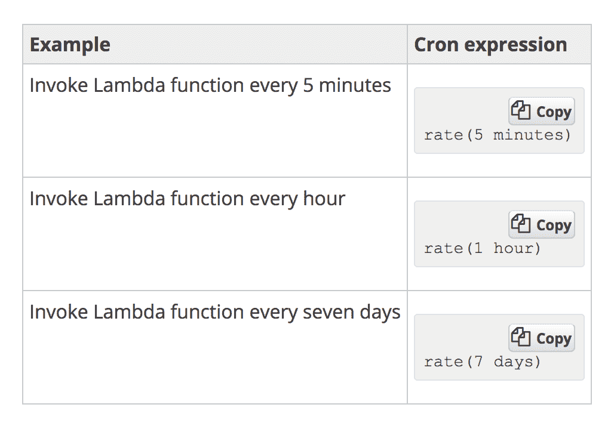

# 第一章：无服务器范式

很可能，如果你正在阅读这本书，你已经听说过无服务器范式和无服务器工程以及无服务器架构这些术语。如今，开发人员部署应用程序的方式发生了巨大变化，特别是在数据工程和 Web 开发领域，这要归功于**基于事件的架构设计**，也称为**无服务器架构**。

在生产中，服务器负载完成后可能会有空闲资源和服务器空闲，或者在等待下一个工作负载到来。这在基础设施中引入了一些冗余。如果没有工作负载时不需要空闲资源会怎样？如果资源可以在需要时创建，并在工作完成后被销毁呢？

在本章结束时，您将了解无服务器架构和函数即服务的工作原理，以及如何将它们构建到您现有的软件基础设施中。您还将了解什么是微服务，并决定微服务或无服务器操作是否适合您的架构。您还将学习如何在主要的云服务提供商（如**亚马逊网络服务**（**AWS**）和**微软的 Azure**）上使用 Python 构建无服务器应用程序。

本章将涵盖以下内容：

+   理解无服务器架构

+   理解微服务

+   无服务器架构不一定只能是实时的。

+   无服务器架构的优缺点

# 理解无服务器架构

无服务器架构或无服务器工程的概念完全围绕理解函数即服务的概念。互联网上对无服务器计算的最技术和准确的定义如下：

"无服务器计算，也称为**函数即服务**（**FAAS**），是一种云计算和代码执行模型，其中云提供商完全管理函数容器的启动和停止**平台即服务**（**PaaS**）。"

现在，让我们深入了解该定义的每个部分，以更好地理解无服务器计算的范式。我们将从函数即服务这个术语开始。这意味着每个无服务器模型都有一个在云上执行的函数。这些函数只是一些代码块，根据与函数关联的触发器执行。这是 AWS Lambda 环境中触发器的完整列表：

现在让我们了解是谁管理函数的启动和停止。每当函数通过其中一个可用的触发器触发时，云提供商会启动一个容器，函数在其中执行。此外，在函数成功执行后，函数已经返回了一些东西，或者函数已经用完了时间，容器就会被销毁。这种销毁是为了在需求高峰时重复使用容器，以及在两个触发器之间的时间很短的情况下。现在，我们来到句子的下一部分，函数的容器。这意味着函数是在容器中启动和执行的。这是 Docker 的标准容器定义，Docker 是一个使容器概念非常流行的公司：

"容器镜像是一个轻量级的、独立的、可执行的软件包，包括运行它所需的一切：代码、运行时、系统工具、系统库、设置。"

这有助于将代码、运行环境等功能打包成一个单一的部署包，以实现无缝执行。**部署包**包含了函数的主要代码文件，以及执行函数所需的所有非标准库。部署包的创建过程看起来非常类似于 Python 中的虚拟环境。

因此，我们可以清楚地看出，在无服务器基础架构中没有服务器全天候运行。这有明显的好处，包括不需要专门的运维团队成员来监控服务器。因此，如果有任何额外的成员，可以专注于更好的事情，比如软件研究等。整天不运行服务器可以为公司和/或个人节省大量资金和资源。这一好处在机器学习和数据工程团队中非常明显，他们经常使用 GPU 实例进行工作。因此，运行按需的无服务器 GPU 实例可以节省大量资金，而开发人员或运维团队无需全天候维护它们。

# 理解微服务

与无服务器概念类似，面向微服务的设计策略最近也变得非常流行。尽管这种架构设计在无服务器概念出现之前就存在了很长时间。就像我们试图从互联网上的技术定义理解无服务器架构一样，我们也应该尝试对微服务做同样的事情。微服务的技术定义是：

“微服务，也称为**微服务架构**，是一种将应用程序构建为一组松散耦合的服务的架构风格，这些服务实现业务功能。”

以微服务的形式规划和设计架构既有积极的一面，也有消极的一面，就像无服务器架构一样。了解这两者非常重要，以便在现有架构中何时以及何时不应该利用微服务。让我们先看看拥有微服务架构的积极之处，然后再看看消极之处。

微服务有助于软件团队保持敏捷，并逐步改进。简单来说，由于服务之间解耦，很容易升级和改进服务而不会导致其他服务中断。例如，在社交网络软件中，如果聊天和动态都是微服务，那么在软件团队尝试升级或对聊天服务进行小修复时，动态不必中断。然而，在大型单片系统中，很难像微服务那样轻松地分解事物。因此，即使是架构的一个小组件的修复或升级也会带来停机时间，修复所需的时间比预期的更长。

单片架构的代码库规模本身就是在任何小故障情况下阻碍进展的障碍。另一方面，微服务通过保持代码库精简大大提高了开发人员的生产力，因此他们可以在几乎没有额外开销和停机时间的情况下修复和改进服务。通过容器，微服务可以更好地利用，容器提供有效和完整的虚拟操作系统环境，隔离的进程以及对底层硬件资源的专用访问。

然而，微服务也有其自身的一系列缺点和不利因素，其中最主要的是必须处理分布式系统。现在每个服务都是独立存在的，架构师需要弄清楚它们之间的相互作用，以使产品完全功能。因此，服务之间的适当协调以及关于服务之间如何移动数据的决策是架构师需要做出的非常困难的选择。在为微服务架构设计时，架构师需要处理一些主要的分布式问题，如*共识*、*CAP 定理*和*维护共识的稳定性*以及*连接*等问题。确保和维护安全性也是分布式系统和微服务的一个主要问题。您需要为每个微服务决定单独的安全模式和层，以及为服务之间的数据交互所需的安全决策。

# 无服务器架构不一定只能是实时的

无服务器架构通常被用作实时系统，因为它们作为*函数即服务*，由一组可用的触发器触发。然而，这是一个非常常见的误解，因为无服务器系统既可以作为实时系统，也可以作为批处理架构同样有效。了解如何将无服务器系统的概念作为批处理架构来利用，将为工程团队打开许多工程可能性，因为并非所有工程团队都需要或拥有实时系统来运行。

通过利用以下方法，无服务器系统可以作为批处理：

+   触发器中的 cron 功能

+   队列的概念

首先，让我们了解触发器中的**cron 功能**的概念。云上的无服务器系统具有设置监控的能力，这使得触发器可以每隔几分钟或几小时触发一次，并且可以设置为普通的 cron 作业。这有助于将无服务器的概念作为常规的 cron 批处理作业。在 AWS 环境中，可以通过 AWS CloudWatch 设置 Lambda 作为 cron 触发器，通过手动输入时间间隔来设置 cron 的频率，并且还可以按照 cron 格式输入间隔：

在构建无服务器批处理架构时，也可以利用队列的概念。让我们通过设置一个示例数据管道来理解这一点。假设我们打算构建的系统执行以下任务：

1.  用户或服务将一些数据发送到数据库或更简单的数据存储中，例如 AWS 的 S3。

1.  一旦我的数据存储中有超过 100 个文件，我们就需要执行一些任务。比如说，对它们进行一些分析，例如计算页面数量。

这可以通过队列实现，这是我们可以考虑的一个更简单的无服务器系统示例。因此，可以按以下方式实现：

1.  用户或服务将数据上传或发送到我们选择的数据存储中。

1.  为此任务配置了一个队列。

1.  可以配置事件到 S3 存储桶或数据存储，以便一旦数据进入存储，就会向我们之前配置的队列发送消息。

1.  可以设置监控系统来监视队列中的消息数量。建议使用您正在使用的云提供商的监控系统，以便系统保持完全无服务器。

1.  可以设置警报到监控系统，为这些警报配置阈值。例如，每当我们的队列中的消息数量达到或超过 100 时，就需要触发警报。

1.  此警报可以作为触发器，触发 Lambda 函数，该函数首先从队列接收消息，然后使用从消息中接收的文件名查询数据存储。

1.  文件的分析完成后，处理后的文件可以推送到另一个数据存储进行存储。

1.  在整个任务完成后，运行 Lambda 函数的容器或服务器将被终止，从而使这个流水线完全无服务器。

# 无服务器的利弊

现在我们了解了无服务器架构和流水线的样子，以及它们如何可以整合到现有架构中，以及微服务如何帮助保持架构的精简并提高开发人员的生产力，我们将详细讨论无服务器系统的利弊，以便软件开发人员和架构师可以决定何时将无服务器范例整合到其现有系统中，何时不这样做。

无服务器系统的优点包括：

+   **更低的基础设施成本**：通过部署无服务器系统，基础设施成本可以得到极大的优化，因为不需要每天全天候运行服务器。由于服务器仅在触发函数时启动，并在函数成功执行时停止，因此计费仅针对函数运行的短暂时间段。

+   **需要更少的维护**：由于前述原因，也不需要对服务器进行持续监控和维护。由于函数和触发器是自动化的，因此无服务器系统几乎不需要维护。

+   **更高的开发人员生产力**：由于开发人员不需要担心停机时间和服务器维护，他们可以专注于解决更好的软件挑战，如扩展和设计功能。

本书的其余部分将向您展示无服务器系统如何改变软件的方式。因此，由于本章旨在帮助架构师决定无服务器系统是否适合其架构，我们现在将看一下无服务器系统的缺点。

无服务器系统的缺点包括：

+   **函数的时间限制**：无论是 AWS 的 Lambda 还是 GCP 的云函数，执行函数都有一个 5 分钟的时间限制。这使得执行繁重的计算变得不可能。然而，这可以通过以 nohup 模式执行配置工具的 playbook 来解决。这将在本章后面详细介绍。然而，准备好 playbook 并设置容器和其他任何事情应该在 5 分钟的时间限制内完成。当超过 5 分钟限制时，容器会自动被终止。

+   **无法控制容器环境**：开发人员无法控制为执行函数而创建的容器的环境。操作系统、文件系统等都由云提供商决定。例如，AWS 的 Lambda 函数在运行 Amazon Linux 操作系统的容器内执行。

+   **监控容器**：除了云提供商通过其内部监控工具提供的基本监控功能外，没有机制可以对执行无服务器函数的容器进行详细监控。当将无服务器系统扩展到容纳分布式系统时，这变得更加困难。

+   **安全性无法控制**：无法控制数据流的安全性如何得到保障，因为对容器环境的控制非常有限。不过，容器可以在开发人员选择的 VPC 和子网中运行，这有助于解决这个缺点。

然而，无服务器系统可以扩展到大规模计算的分布式系统，开发人员无需担心时间限制。如前所述，这将在接下来的章节中详细讨论。然而，为了了解如何在进行架构决策时选择无服务器系统而不是单片系统进行大规模计算，让我们了解一些重要的指针。

将无服务器系统扩展到分布式系统时需要牢记的要点包括：

+   要将无服务器系统扩展到无服务器分布式系统，必须了解 nohup 的概念是如何工作的。这是一个允许程序和进程在后台运行的**POSIX**命令。

+   Nohup 进程应该被正确记录，包括输出和错误日志。这是您的进程的唯一信息来源。

+   需要利用诸如**Ansible**或**Chef**之类的配置工具来创建一个主从架构，该架构是通过在无服务器函数执行的容器中以 nohup 模式运行的 playbook 生成的。

+   确保通过主服务器执行的所有任务都得到适当的监控和记录是一个良好的做法，因为一旦整个设置完成执行，就没有办法检索日志。

+   必须通过使用云提供商提供的临时凭证设施来确保适当的安全性。

+   必须确保系统的适当关闭。工作进程和主进程应该在任务流程执行完成后立即自我终止。这非常重要，也是使系统无服务器的关键。

+   通常，临时凭证会有一个过期时间，对于大多数环境来说是 3,600 秒。因此，如果开发人员使用临时凭证来执行一个预计需要超过过期时间的任务，那么凭证可能会过期。

+   调试分布式无服务器系统是一个极其困难的任务，原因如下：

+   监控和调试一个 nohup 进程是非常困难的。每当你想要调试一个进程时，你要么参考进程创建的日志文件，要么使用进程 ID 杀死 nohup 进程，然后手动运行脚本进行调试。

+   由于在配置工具中完整的任务列表是顺序执行的，存在一个危险，即开发人员在开始调试过程之前忘记杀死 nohup 进程，从而导致实例可能被终止。

+   由于这是一个分布式系统，可以毫无疑问地说，架构应该能够在发生任何故障或灾难时自我修复。一个例子是当一个工作进程在执行一些操作时崩溃了。整个一堆文件现在丢失了，没有任何恢复的手段。

+   另一个高级灾难场景可能是当两个工作服务器在执行一些操作时崩溃了。在这种情况下，开发人员不知道哪些文件已成功执行，哪些没有。

+   确保所有工作实例都能够平均分配负载以执行，以便分布式系统中的负载保持均匀，时间和资源得到充分优化，这是一个良好的做法。

# 摘要

在本章中，我们了解了什么是无服务器架构。最重要的是，本章帮助架构师决定无服务器是否适合他们的团队和工程，并且如何从现有基础架构过渡/迁移到无服务器范式。我们还研究了微服务的范式以及它们如何帮助构建轻量级和高度敏捷的架构。本章还详细介绍了团队何时应该开始考虑微服务，以及何时可以迁移或将其现有的单体架构拆分成微服务。

然后我们学习了在无服务器领域构建批处理架构的艺术。最常见的一个误解是无服务器系统只适用于实时计算目的。然而，我们已经学会了如何利用这些系统进行批量计算，从而为无服务器范式提供了大量的应用。我们研究了无服务器的利弊，以便能够做出更好的工程决策。

在下一章中，我们将详细了解 AWS Lambda 的工作原理，这是 AWS 云环境中无服务器工程的核心组件。我们将了解触发器的工作原理以及 AWS Lambda 函数的工作方式。您将学习利用容器执行无服务器函数和相关的计算工作负载的概念。之后，我们还将学习配置和测试 Lambda 函数，以及在此过程中了解最佳实践。我们还将介绍 Lambda 函数的版本控制，就像代码的版本控制一样，并为 AWS Lambda 创建部署包，以便开发人员可以舒适地适应第三方库，以及标准库。
