# 第二章：在 AWS 中构建无服务器应用程序

本章将介绍使用 AWS Lambda 作为首选工具的无服务器应用程序的概念。这将帮助您了解无服务器工具中涉及的概念、直觉和工作组件。它还将解释 Lambda 内部涉及的安全性、用户控制和版本控制代码的微妙之处。您将通过实践教程和课程指导，了解并学习如何使用 AWS Lambda。因此，建议您在本章中使用笔记本电脑和已设置好的 AWS 帐户，以便轻松执行给定的指令。

本章将涵盖以下主题：

+   AWS Lambda 中的触发器

+   Lambda 函数

+   函数作为容器

+   配置函数

+   测试 Lambda 函数

+   版本化 Lambda 函数

+   创建部署包

# AWS Lambda 中的触发器

无服务器函数是按需计算概念。因此，必须有一个事件来触发 Lambda 函数，以便启动整个计算过程。AWS Lambda 有几个事件可以充当触发器。几乎所有 AWS 服务都可以充当 AWS Lambda 的触发器。以下是您可以用于生成 Lambda 事件的服务列表：

+   API Gateway

+   AWS IoT

+   CloudWatch 事件

+   CloudWatch 日志

+   CodeCommit

+   Cognito 同步触发器

+   DynamoDB

+   Kinesis

+   S3

+   SNS

AWS Lambda 的触发器页面如下所示：

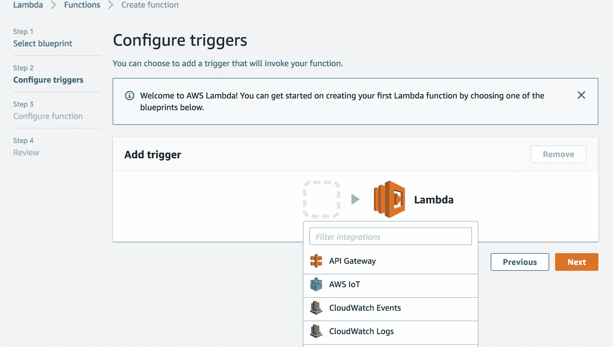

让我们来看一下一些重要和广泛使用的触发器，并了解它们如何作为无服务器范例中的 FaaS 来利用。它们如下：

+   **API Gateway**：此触发器可用于创建高效、可扩展和无服务器的 API。构建 S3 查询接口时，无服务器 API 有意义的一个场景是。假设我们在一个 S3 存储桶中有一堆文本文件。每当用户使用查询参数命中 API 时，该参数可以是我们想要在存储桶中的文本文件中搜索的某个单词，API Gateway 的触发器将启动一个 Lambda 函数，执行计算逻辑和工作量以执行查询。我们希望 API 触发的 Lambda 函数可以在 API 创建时指定。触发器将相应地在相应的 Lambda 函数控制台中创建。如下所示：

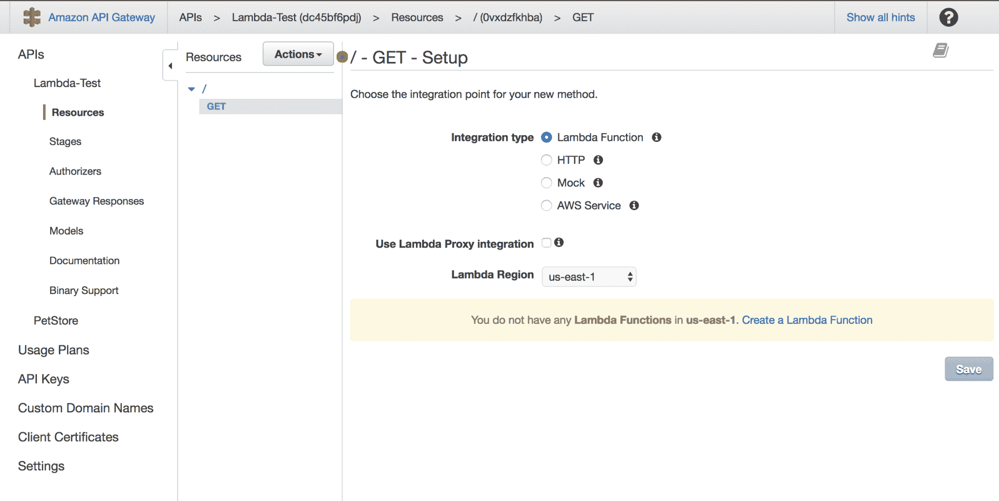

+   **CloudWatch**：它主要帮助用户设置 Lambda 的 cron 调度。CloudWatch 日志触发器在用户想要根据 Cloudwatch 日志中的某个关键字执行计算工作负载时非常有用。但是，CloudWatch 警报不能直接通过 CloudWatch 触发器直接触发 Lambda。它们必须通过通知系统发送，例如**AWS 简单通知服务**（**AWS SNS**）。以下是如何在 AWS Lambda 中创建 cron 执行的方法。在下面的屏幕截图中，Lambda 函数设置为每分钟执行一次：

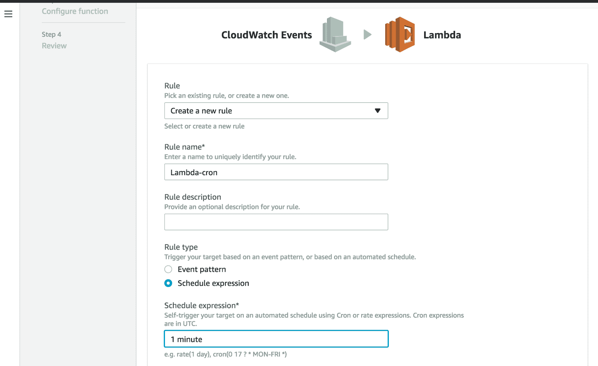

+   **S3**：这是 AWS 的文档存储。因此，每当添加、删除或更改文件时，将作为触发器添加到 AWS Lambda 时，事件将被发送到 AWS Lambda。因此，如果您想在文件上传后立即对文件进行一些计算工作，那么这个触发器可以帮助您实现。S3 的事件结构如下：

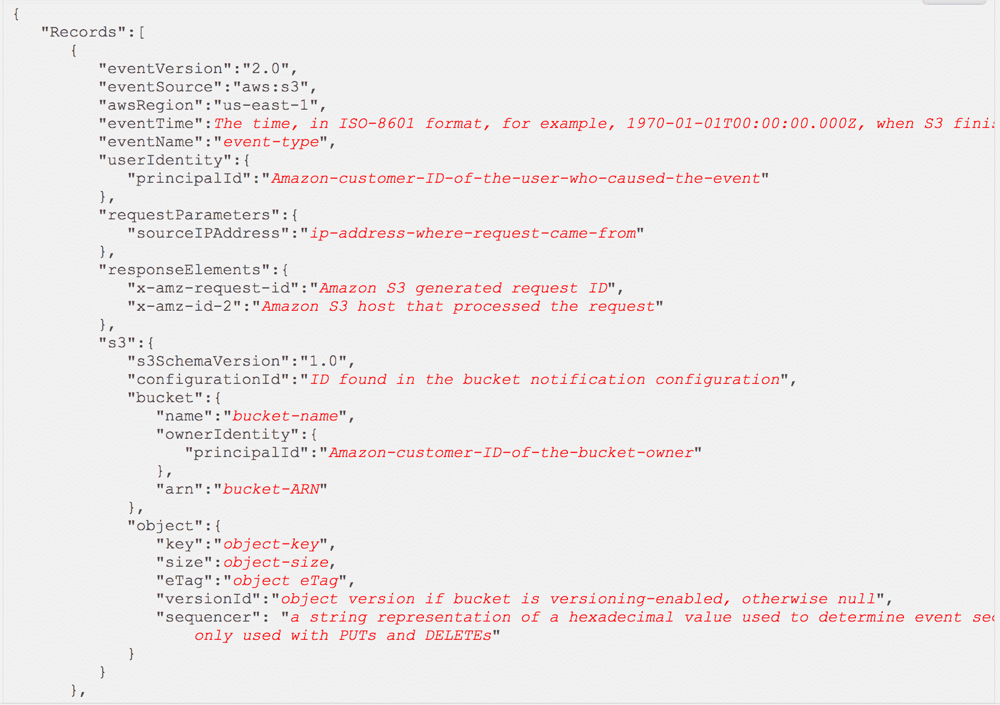

+   **AWS SNS**：AWS 的 SNS 服务帮助用户向其他系统发送通知。此服务还可用于捕获 CloudWatch 警报，并将通知发送到 Lambda 函数以进行计算执行。以下是示例 SNS 事件的样子：

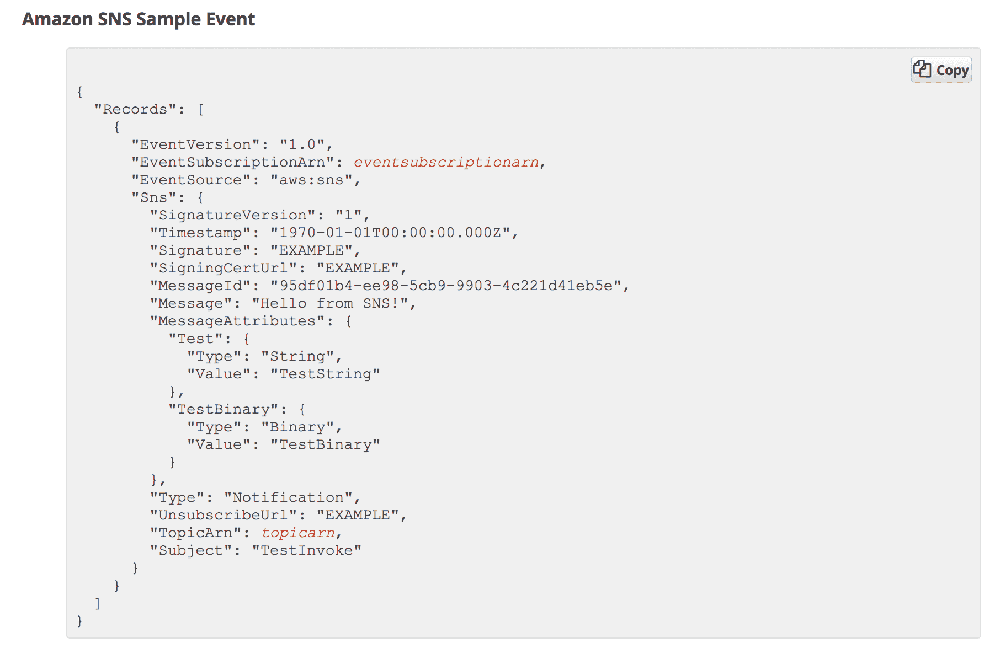

# Lambda 函数

**Lambda 函数**是无服务器架构的核心操作部分。它们包含了应该执行的代码。这些函数在触发器被触发时执行。我们已经在上一节中了解了一些最受欢迎的 Lambda 触发器。

每当 Lambda 函数被触发时，它会创建一个具有用户设置的容器。我们将在下一节中了解更多关于容器的知识。

容器的启动需要一些时间，这可能导致在进行 Lambda 函数的新调用时出现延迟，因为需要时间来设置环境并引导用户在高级设置选项卡中提到的设置。因此，为了克服这种延迟，AWS 会在一段时间内解冻一个容器以便在解冻时间内进行另一个 Lambda 调用时重用。因此，使用解冻或现成的 Lambda 函数有助于克服延迟问题。然而，解冻容器的相同全局命名空间也将被用于新的调用。

因此，如果 Lambda 函数有任何在函数内部被操作的全局变量，将它们转换为本地命名空间是一个好主意，因为被操作的全局命名空间变量将被重用，导致 Lambda 函数的执行结果出现故障。

用户需要在高级设置选项卡中指定 Lambda 函数的技术细节，其中包括以下内容：

+   内存（MB）：这是 Lambda 函数需要分配的最大内存，用于您的函数。容器的 CPU 将相应地分配。

+   超时：在容器自动停止之前，函数需要执行的最长时间。

+   DLQ 资源：这是对 AWS Lambda 的死信设置。用户可以添加 SQS 队列或 SNS 主题进行配置。Lambda 函数在失败时会异步重试至少五次。

+   VPC：这使得 Lambda 函数能够访问特定 VPC 中的组件或服务。Lambda 函数在自己的默认 VPC 中执行。

+   KMS 密钥：如果有任何环境变量与 Lambda 函数一起输入，这将帮助我们默认使用**AWS 密钥管理服务**（**KMS**）对它们进行加密。

Lambda 函数的高级设置页面如下：

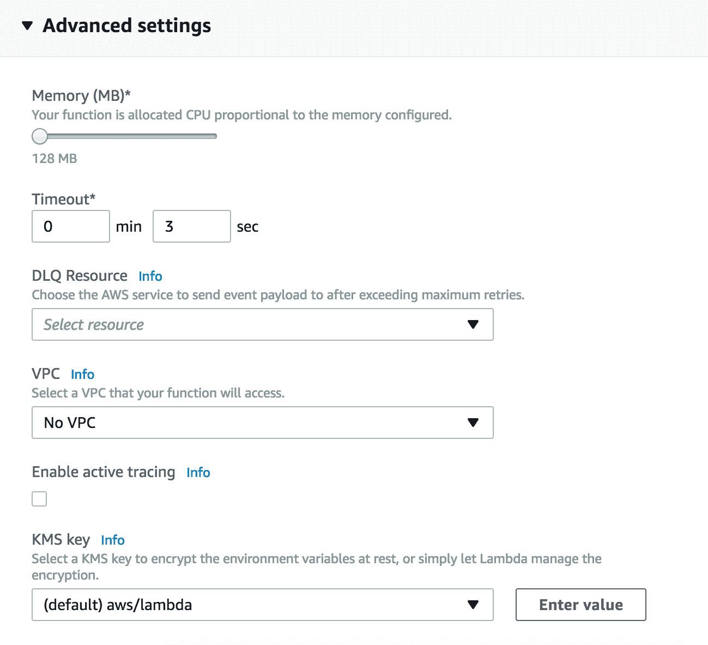

# 函数作为容器

为了理解函数作为/在容器内执行的概念，我们需要正确理解容器的概念。引用 Docker 文档中对容器的定义（[`www.docker.com/what-docker`](https://www.docker.com/what-docker)）[:](https://www.docker.com/what-docker)

容器镜像是一个轻量级的、独立的、可执行的软件包，包括运行它所需的一切：代码、运行时、系统工具、系统库、设置。

适用于 Linux 和 Windows 应用程序；容器化软件将始终在相同的环境中运行，而不受环境的影响。

容器将软件与其周围环境隔离（例如开发和分段环境之间的差异），并帮助减少不同软件在同一基础设施上运行时的冲突。

因此，容器的概念是它们是自包含的隔离环境，就像集装箱船上的集装箱一样，可以托管和在任何主机操作系统上工作，主机操作系统在我们的类比中是主机船。这个类比的形象描述会看起来像这样：

与前述类比类似，AWS Lambda 的函数也是在每个函数的独特容器中启动的。因此，让我们逐点更详细地了解这个主题：

1.  Lambda 函数可以是单个代码文件或**部署包**的形式。部署包是一个包含核心函数文件以及函数使用的库的压缩文件。我们将在本章的*创建部署包*部分详细了解如何创建部署包。

1.  每当函数被触发或启动时，AWS 会为运行函数而启动一个带有 AWS Linux 操作系统的 EC2 实例。实例的配置将取决于用户在 Lambda 函数的高级设置选项卡中提供的配置。

1.  函数执行成功的最长时间限制为 300 秒，或 5 分钟，之后容器将被销毁。因此，在设计 Lambda 函数和/或部署包时需要牢记这一点。

# 配置函数

在本节中，我们将介绍配置 Lambda 函数的方法，并详细了解所有设置。与上一节类似，我们将了解每个配置及其设置，如下所示：

1.  您可以通过从 AWS 控制台左上角的下拉菜单中选择 AWS Lambda 来转到 AWS Lambda 页面。可以按以下步骤操作：

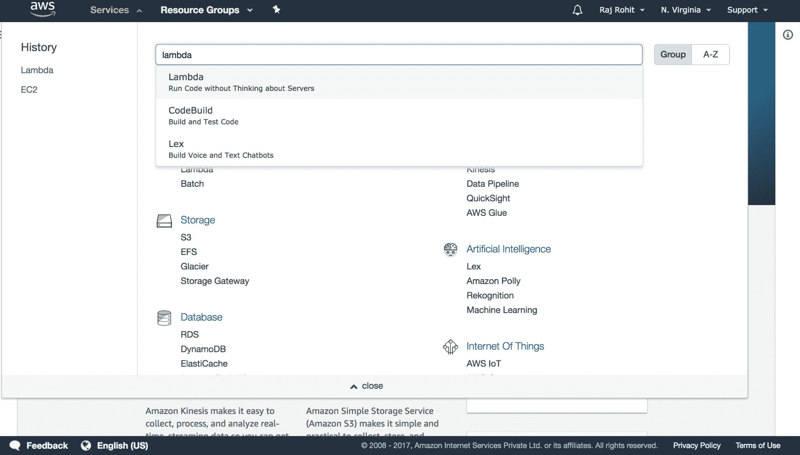

1.  选择 Lambda 选项后，它会将用户重定向到 AWS Lambda 控制台，外观类似于这样：

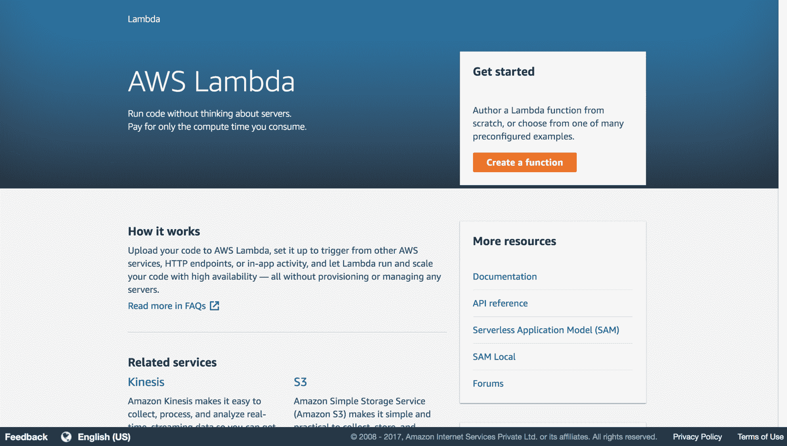

1.  要创建一个函数，您需要点击右侧的橙色“创建函数”按钮。这将打开一个用于函数创建的控制台。外观类似于这样：

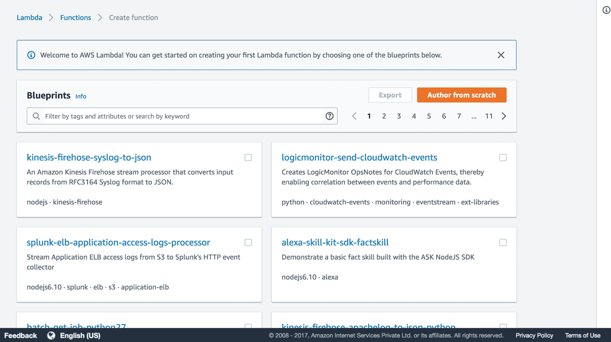

1.  让我们从头开始创建一个函数，以更好地了解配置。因此，为了做到这一点，请点击右上角的“从头开始”按钮。点击后，用户将被引导到 Lambda 的首次运行控制台，外观类似于这样：

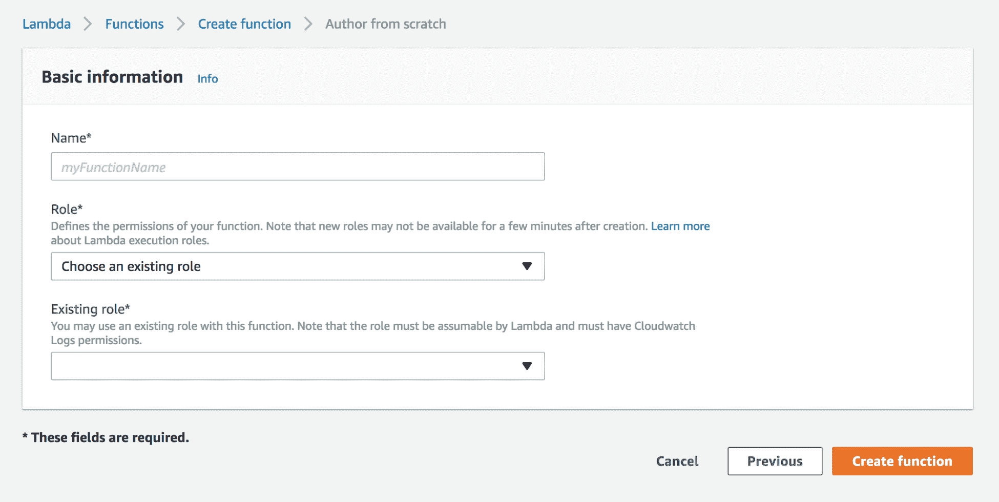

1.  此页面有三个用户可以选择的配置，即名称、角色和现有角色。名称值是用户可以输入 Lambda 函数名称的地方。角色值是您可以在 AWS 环境中定义权限的方式。角色值的下拉列表将包含以下选项：选择现有角色、从模板创建新角色和创建自定义角色。它们可以如下所示：

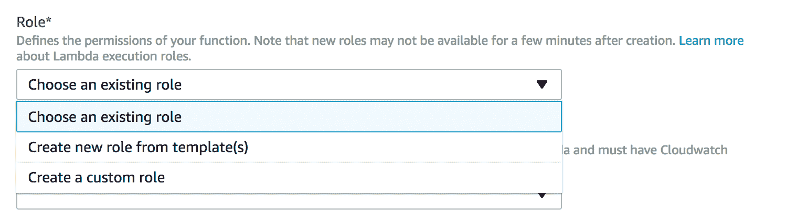

选择现有角色选项将使我们能够选择具有预配置权限的现有角色。第二个选项帮助用户从预先制作的模板创建角色。创建自定义角色选项允许用户从头开始创建具有权限的角色。预先制作的角色列表如下：

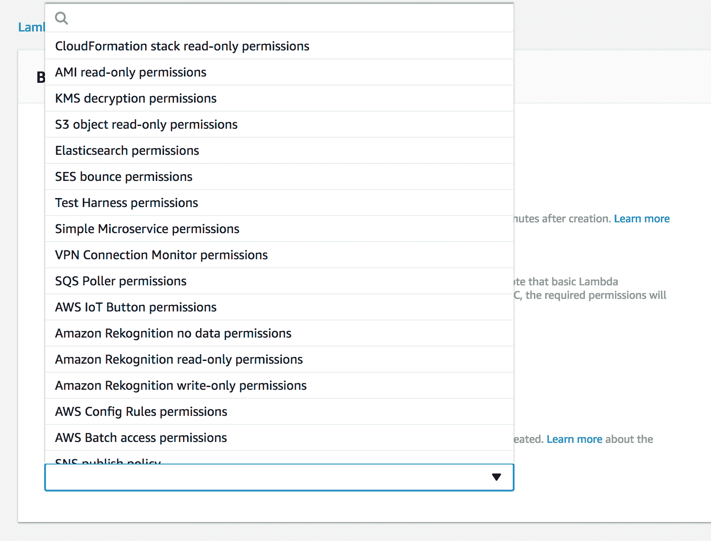

1.  为了本教程的目的，从预先制作的模板中选择一个。通过在屏幕右下角的“创建函数”按钮，我们将进入 Lambda 函数创建页面，其外观类似于这样：

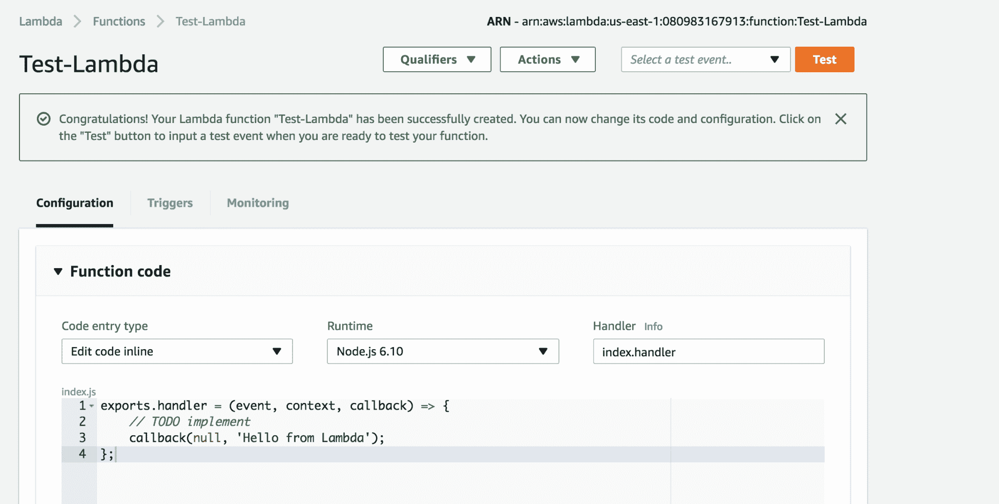

1.  在上一页中，我们成功创建了一个 AWS Lambda 函数。现在我们将探索该函数的高级设置。它们位于同一控制台的下部。它们看起来会像这样：

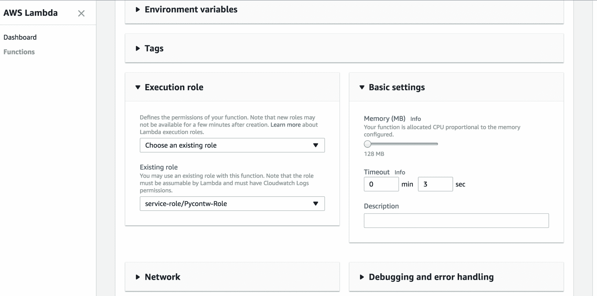

现在我们将详细了解每个部分。

1.  展开的环境变量部分包含文本框，用于输入我们函数将使用的环境变量的键值对。还可以选择提及我们希望为环境变量设置的加密设置。加密需要通过**AWS KMS**（**密钥管理服务**）进行。环境变量的展开设置框看起来像这样：

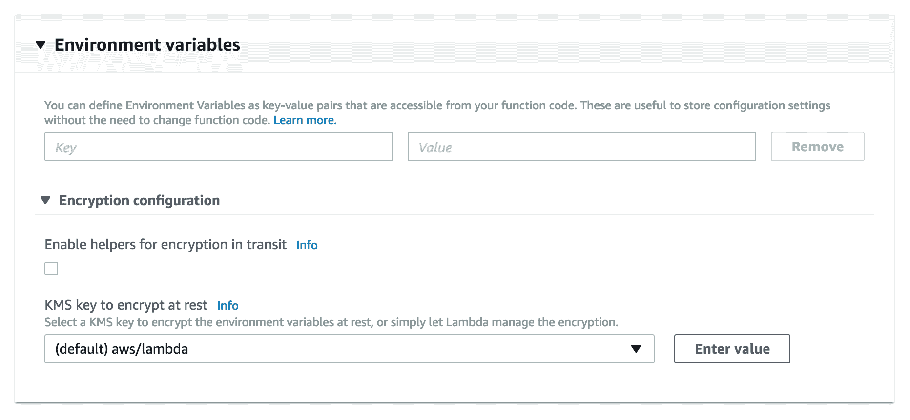

1.  接下来的设置部分是标签。这类似于所有可用 AWS 服务的标记功能，用于方便的服务发现目的。因此，与所有 AWS 服务的标记类似，这也只需要一个键和一个值。展开的标签部分看起来像这样：

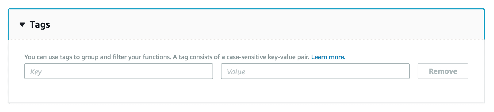

1.  在标签部分之后将可见的下一部分是执行角色部分，用户可以在其中为 Lambda 函数的执行设置**身份访问管理（IAM）**角色。由于我们之前已经讨论过 IAM 角色是什么，所以在这里不会再次涉及。如果用户在创建函数时没有设置角色，他们可以在这里设置。Lambda 控制台中将显示如下部分：

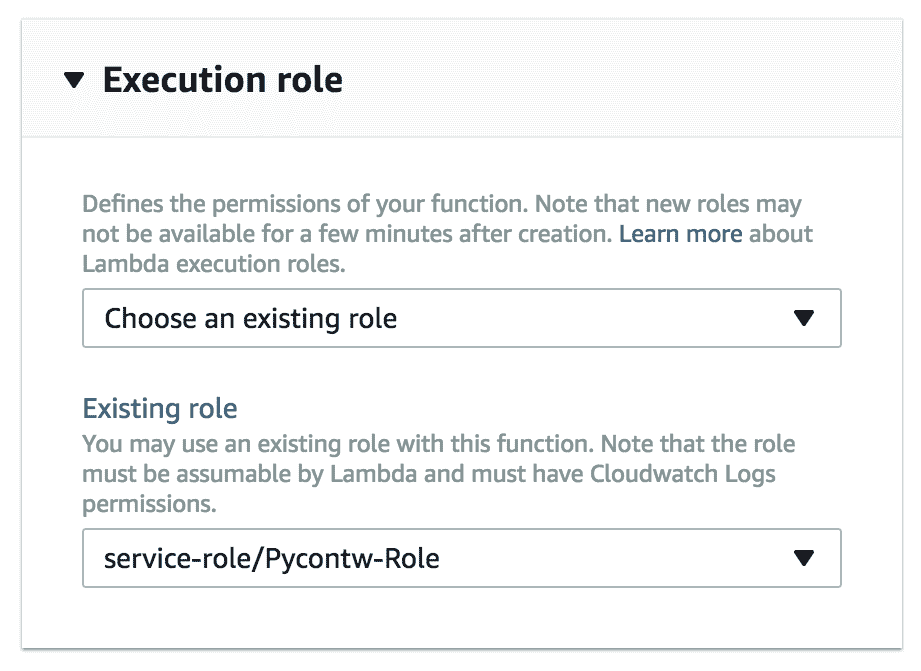

1.  接下来是基本设置部分，其中包括 Lambda 容器的内存、容器的超时时间和 Lambda 函数的描述等设置。容器的内存可以在 128 MB 到 1,536 MB 之间。用户可以在该范围内选择任何值，并将按相应的费用计费。超时时间可以设置为 1 秒到 300 秒，即 5 分钟。超时时间是 Lambda 函数及其容器在被停止或终止之前运行的时间。下一个设置是 Lambda 函数的描述值，它充当 Lambda 函数的元数据。控制台中的该部分如下所示：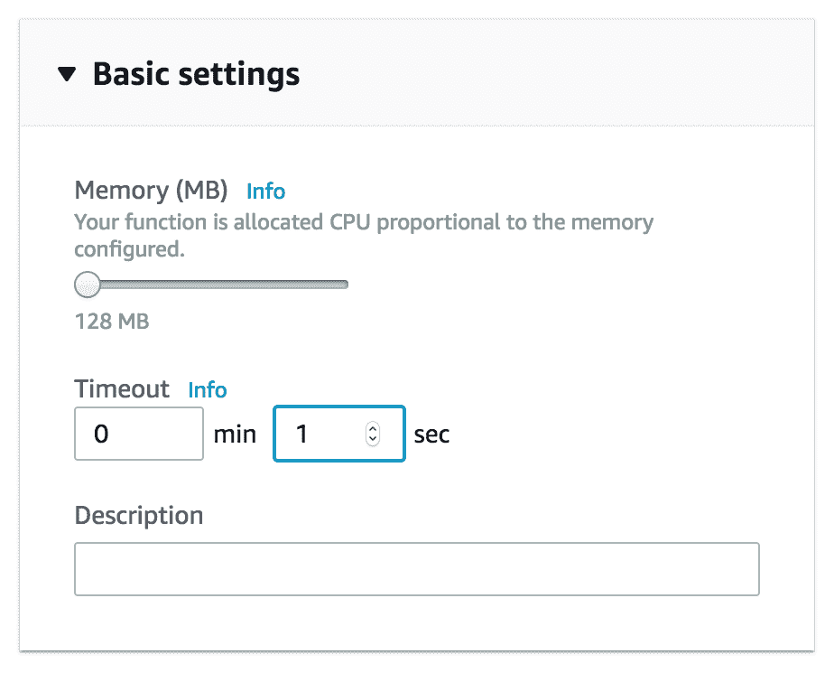

1.  接下来是网络部分，也涉及与**AWS 虚拟私有云**（**VPC**）和相关子网有关的 Lambda 函数的网络设置。即使选择了无 VPC 作为选项，AWS Lambda 也会在其自己的安全 VPC 中运行。但是，如果 Lambda 函数访问或处理位于特定 VPC 或子网中的任何其他服务，则需要在此部分中添加相应的信息，以便网络允许 Lambda 函数容器的流量。控制台中的该部分如下所示：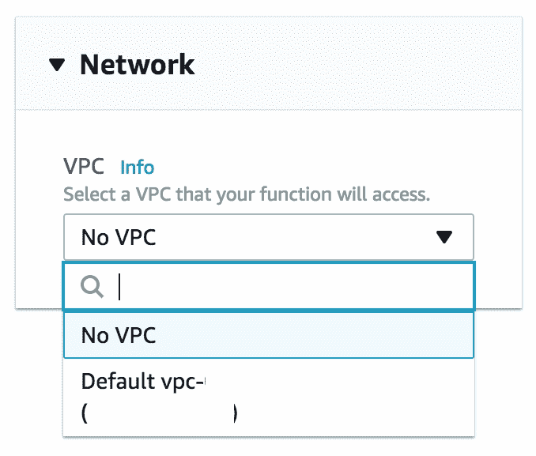为了安全起见，前面截图中的敏感信息，如 IP 地址和 VPC 的 ID，已被屏蔽。

1.  接下来是调试和错误处理部分。该部分使用户能够设置确保 Lambda 函数容错和异常处理的措施。这包括**死信队列**（**DLQ**）设置。

1.  Lambda 会自动重试异步调用的失败执行。因此，未处理的有效负载将自动转发到 DLQ 资源。Lambda 控制台中的 DLQ 设置如下：

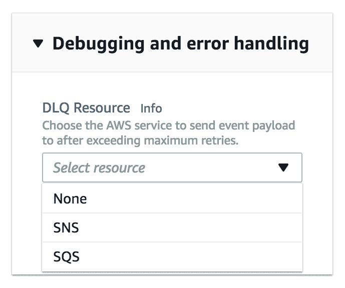

用户还可以为 Lambda 函数启用主动跟踪，这将有助于详细监视 Lambda 容器。Lambda 控制台中的调试和错误处理部分的设置如下：

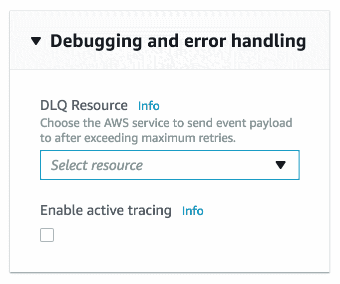

# Lambda 函数测试

与其他软件系统和编程范式一样，Lambda 函数和无服务器架构在部署到生产环境之前进行适当的测试非常重要。我们将在以下几点中尝试理解 Lambda 函数的测试：

1.  在 Lambda 控制台的最顶部栏中，可以看到保存并测试选项，用橙色按钮表示。这个按钮保存 Lambda 函数，然后运行配置的测试函数。在控制台中看起来像这样：

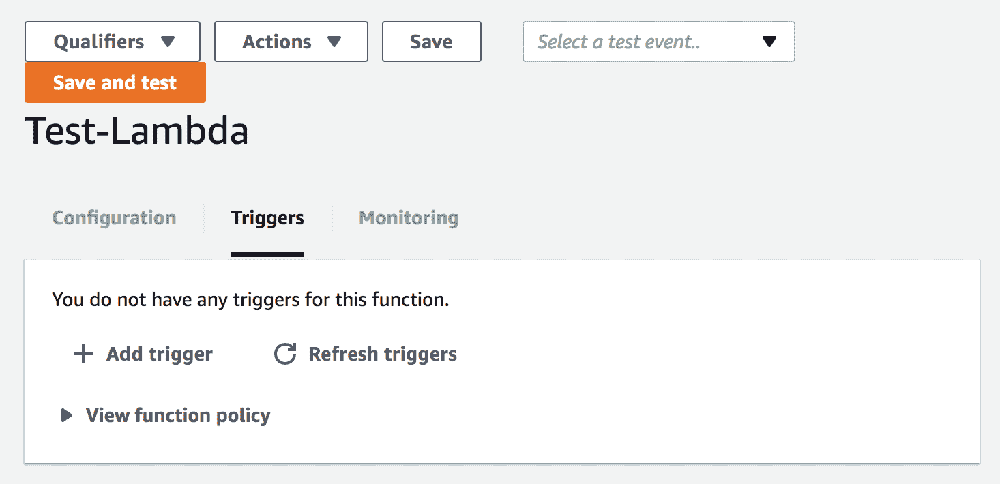

1.  此外，在同一栏中，存在一个下拉菜单，上面写着选择一个测试事件…. 这包含了用于测试 Lambda 函数的测试事件列表。下拉菜单看起来像这样：

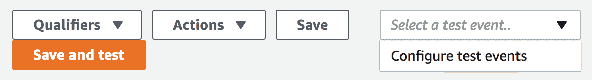

1.  现在，为了进一步配置 Lambda 函数的测试事件，用户需要在下拉菜单中选择配置测试事件选项。这将打开一个带有测试事件菜单的弹出窗口，看起来像这样：

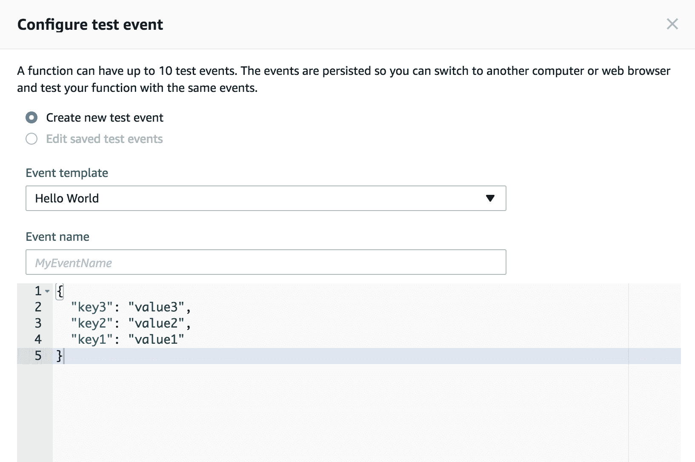

1.  这将打开基本的 Hello World 模板，其中包含三个预配置的 JSON 格式测试事件，或边缘情况。但是，根据 Lambda 函数的功能，可以选择其他测试事件。可用的测试模板列表可以在事件模板下拉菜单中看到。下拉菜单中的列表看起来像这样：

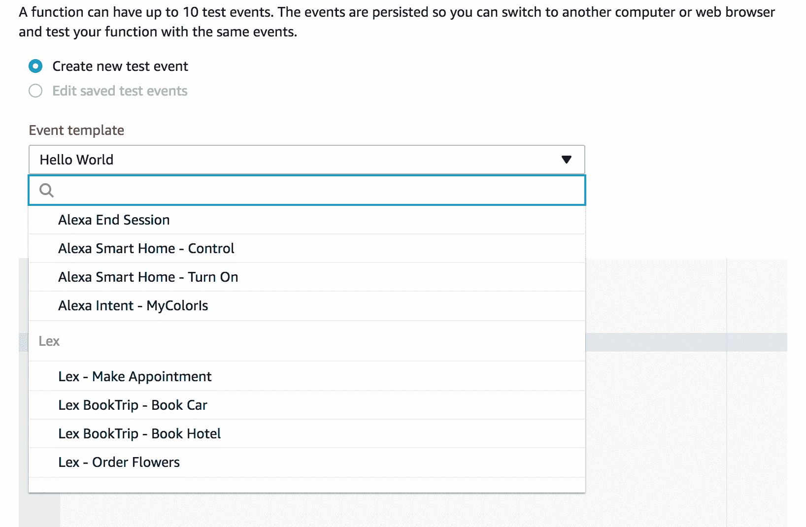

1.  例如，让我们想象我们正在构建一个流水线，其中 Lambda 函数在将图像文件添加到 S3 存储桶时启动，并且该函数执行一些图像处理任务并将其放回到某个数据存储中。S3 Put 通知的测试事件看起来像这样：

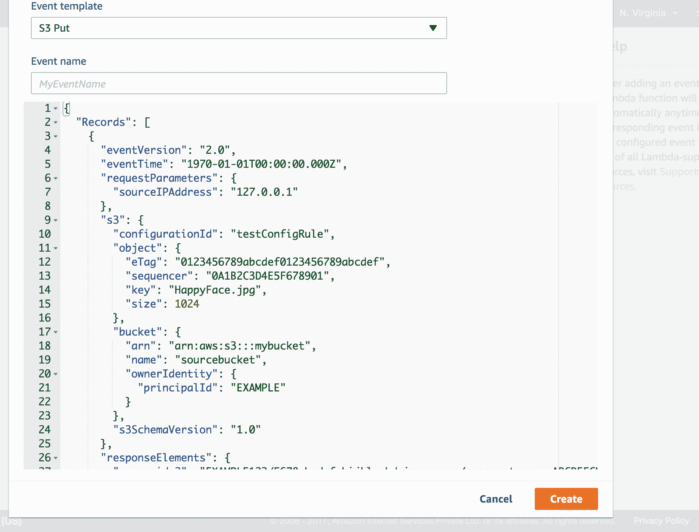

1.  选择或创建测试事件后，用户可以在事件创建控制台的右下角选择创建选项，然后将被要求为事件输入名称。输入必要的细节后，用户将被重定向回 Lambda 控制台。现在，当您在 Lambda 控制台中检查 TestEvent 下拉菜单时，可以在列表中看到保存的测试事件。可以按以下方式验证：

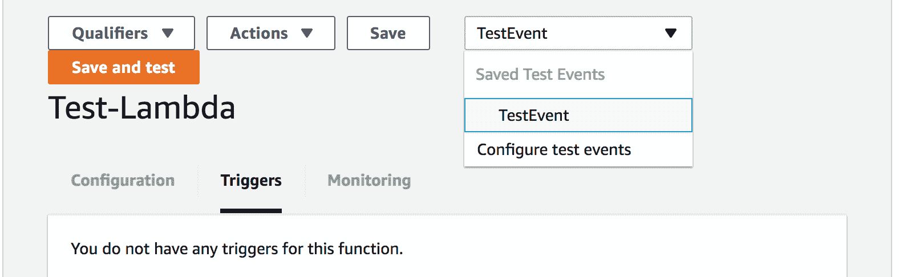

由于我将事件命名为**TestEvent**，因此在事件下拉菜单中以相同的名称可见测试。

1.  此外，当我们仔细观察 S3 测试事件中的事件结构时，我们可以观察到向 Lambda 函数提供的元数据。事件结构看起来像这样：

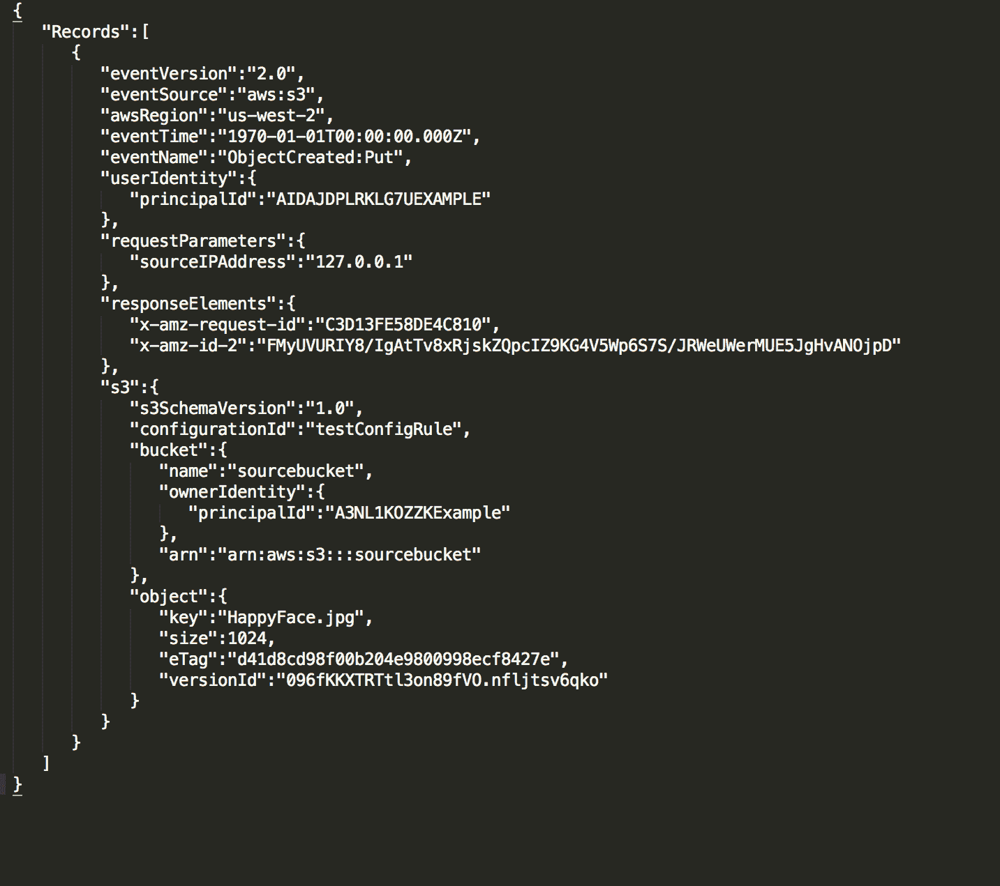

# Lambda 函数的版本控制

**版本控制系统**（**VCS**）的概念是用于控制和管理代码版本。这个功能直接从主 Lambda 控制台中可用。让我们尝试学习如何为我们的 Lambda 函数进行版本控制：

1.  Lambda 控制台中操作下拉菜单中的第一个选项是发布新版本选项。可以在这里看到这个选项：

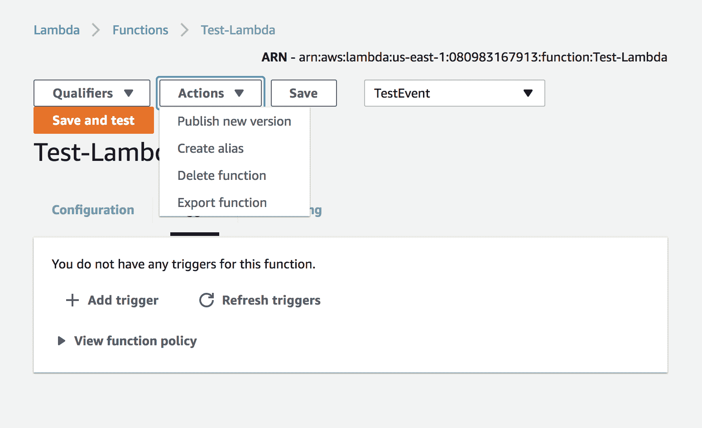

1.  当选择发布新版本选项时，Lambda 控制台的版本控制弹出窗口将出现在控制台上。这将询问您的 Lambda 函数的新版本名称。弹出窗口看起来像这样：

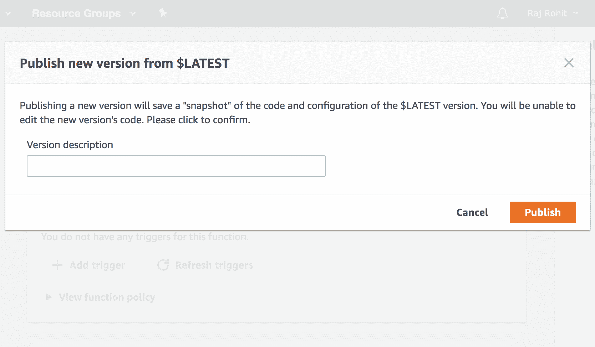

1.  单击发布按钮后，您将被重定向到主 Lambda 控制台。控制台中成功创建的 Lambda 版本看起来像这样：

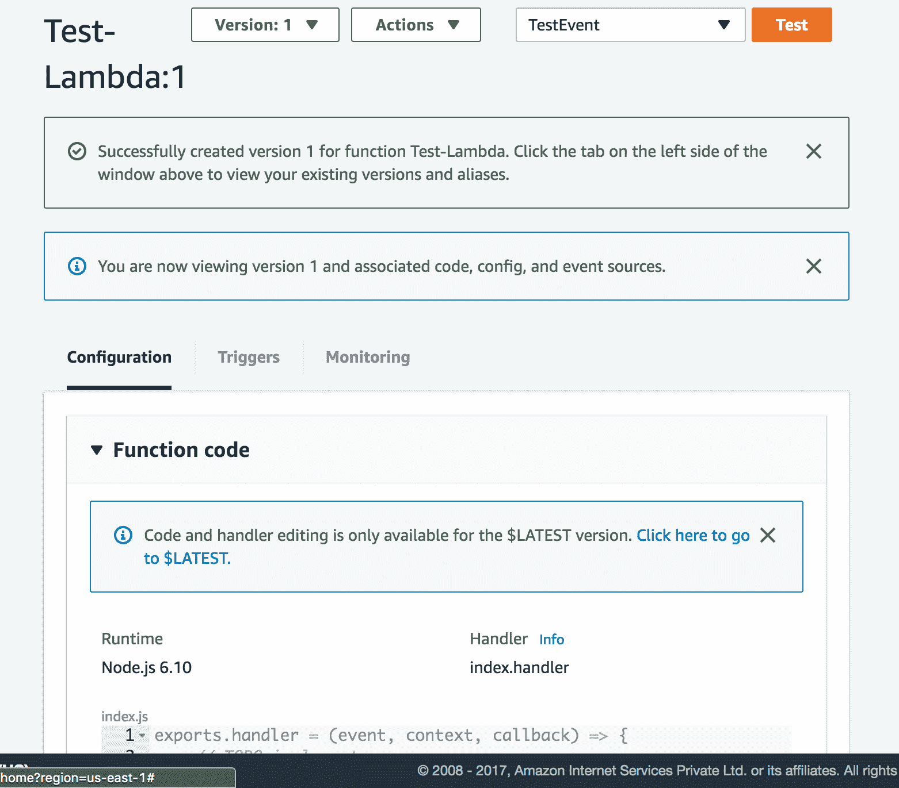

1.  在页面的下半部分，可以注意到以下消息：代码和处理程序编辑仅适用于$LATEST 版本。这意味着只能编辑名为$LATEST 的版本中的代码。版本化的 Lambda 函数是只读的，不能被编辑和操作。当出现问题或用户想要恢复或参考以前的版本时，该版本将覆盖$LATEST 版本以使编辑成为可能。消息看起来像这样：

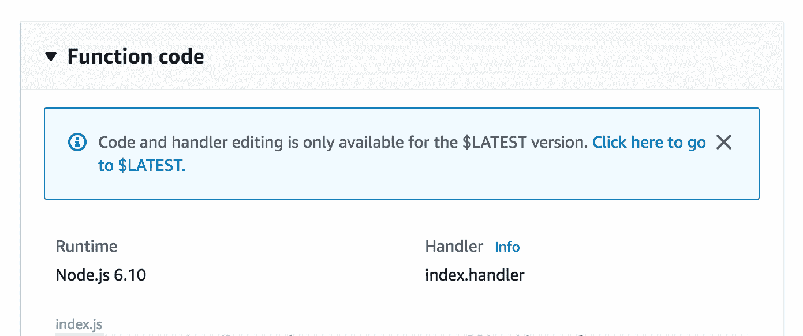

1.  当点击“点击此处转到 $LATEST 链接”时，用户将被重定向到函数的 $LATEST 版本，用户可以对其进行编辑和操作。Lambda 函数的 $LATEST 版本控制台如下所示：

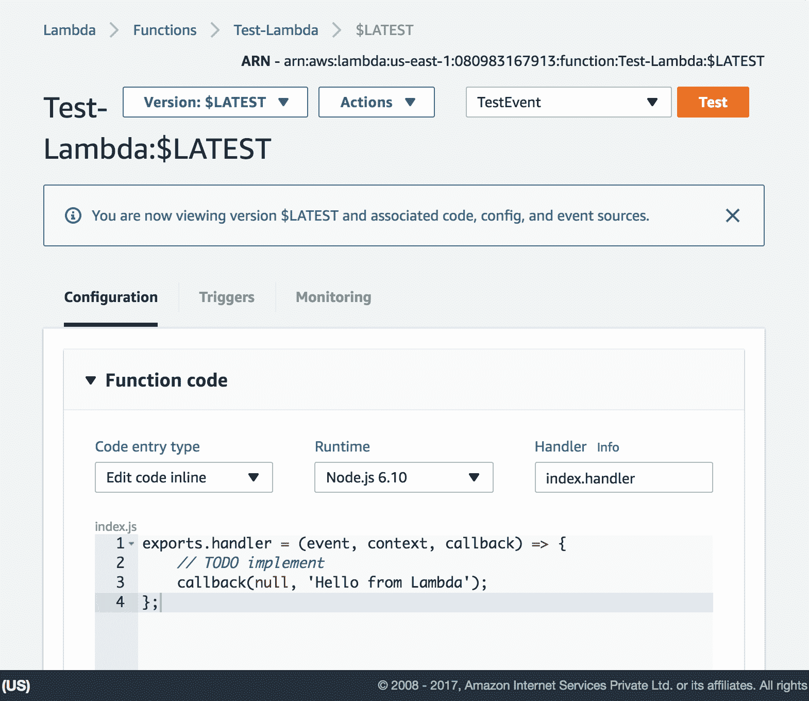

# 创建部署包

具有外部库依赖项的 Lambda 函数可以打包为部署包，并上传到 AWS Lambda 控制台。这与在 Python 中创建虚拟环境非常相似。因此，在本节中，我们将学习并了解创建 Python 部署包以在 Lambda 函数中使用的过程。我们将尝试并详细了解创建部署包的过程，如下所示：

1.  部署包通常是 ZIP 包的格式。ZIP 包的内容与任何编程语言的普通库完全相同。

1.  包的结构应该是库文件夹和函数文件在部署包的相同目标或相同层次结构内。布局看起来像这样：

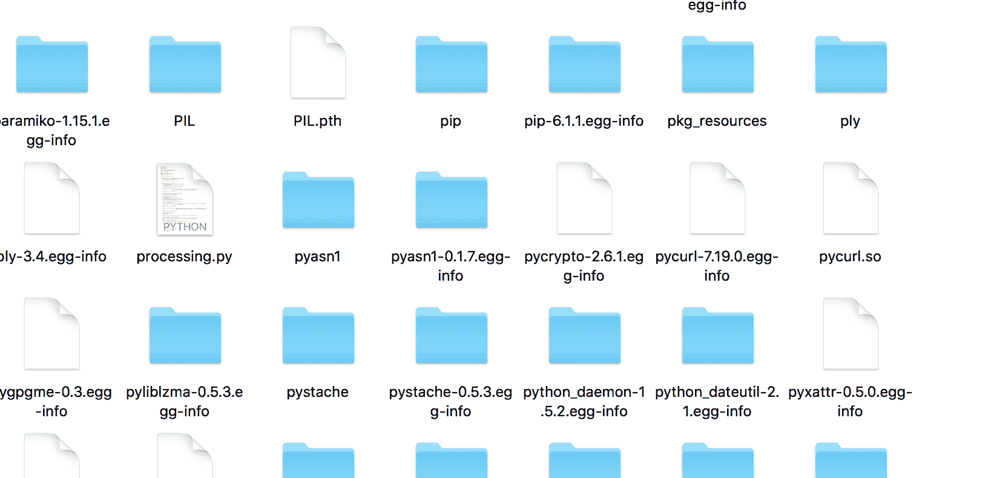

1.  可以使用 `pip install <library_name> -t <path_of_the_target_folder>` 命令安装 Python 库。这将在目标文件夹内安装包。如下截图所示：

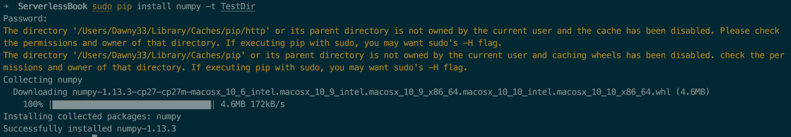

1.  现在，当我们有整个部署包文件夹以及库文件夹准备就绪时，我们需要在上传到控制台之前将所有文件夹包括 Lambda 函数文件进行压缩。以下截图显示了如何根据文件夹层次结构进行压缩：

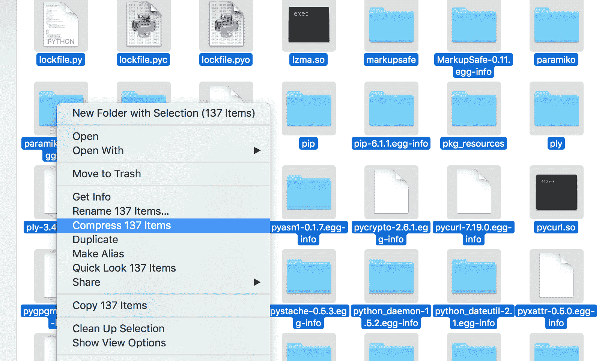

1.  现在，由于压缩包已准备就绪，我们将尝试将包上传到 Lambda 控制台进行处理。要上传 Lambda 包，我们需要在控制台中选择“代码输入类型”选项的下拉列表。在 Lambda 控制台中，选择如下所示：

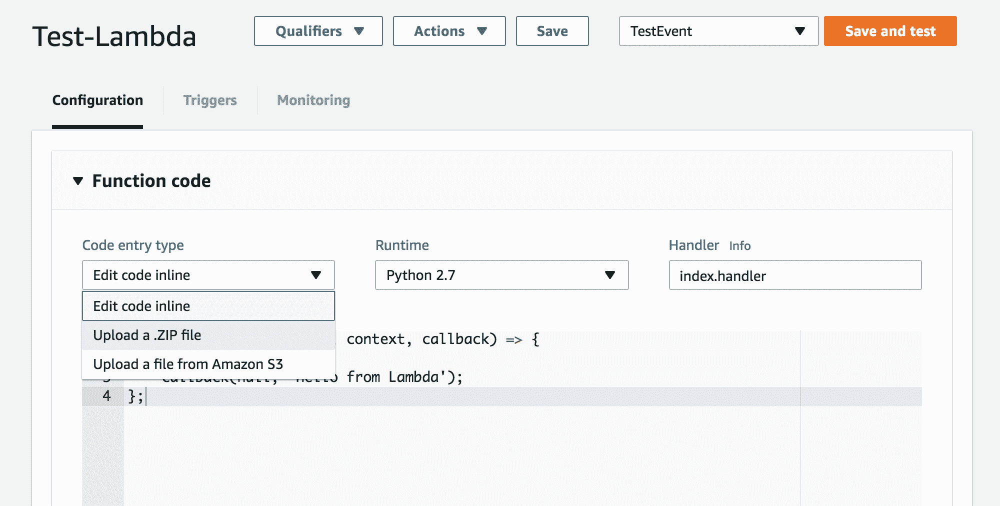

1.  一旦选择了“上传 .ZIP 文件”选项，上传者将变为可见状态，用户可以直接上传部署包，甚至可以通过 S3 存储桶上传。在 Lambda 控制台中，向导将如下所示：

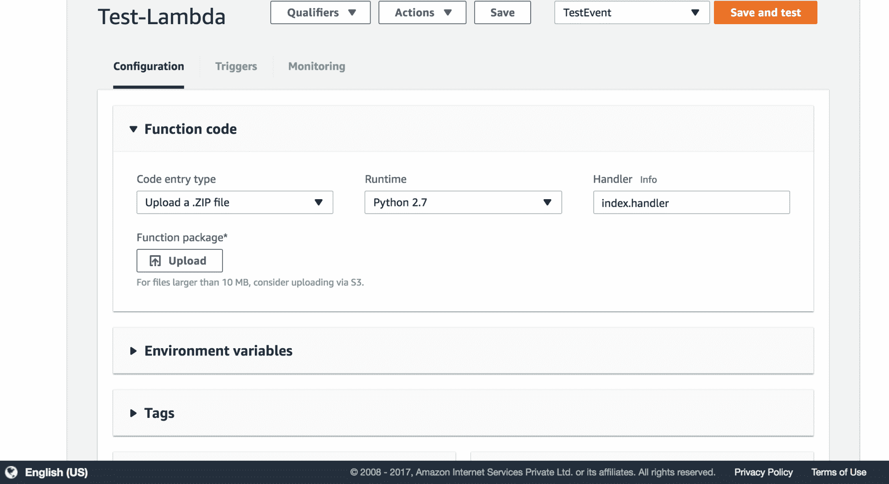

1.  如前所述，用户还可以选择通过 S3 文件位置上传部署包。在 Lambda 控制台中，该向导如下所示：

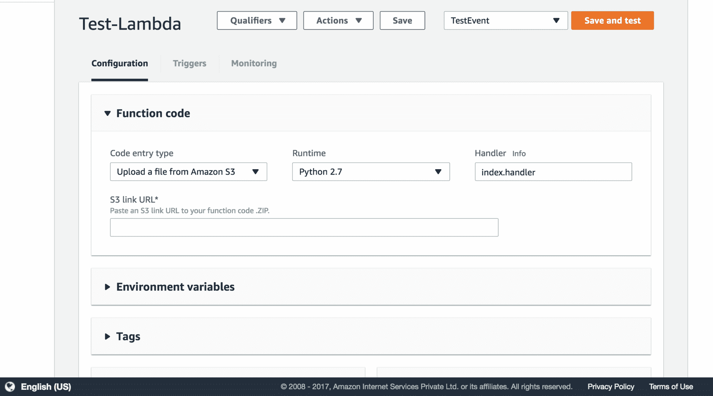

1.  部署包的命名应与设置中处理程序部分输入的值对齐。部署包的名称和 Lambda 函数文件的名称由点（`.`）分隔，并按照这个顺序排列。可以在以下截图中明确看到：

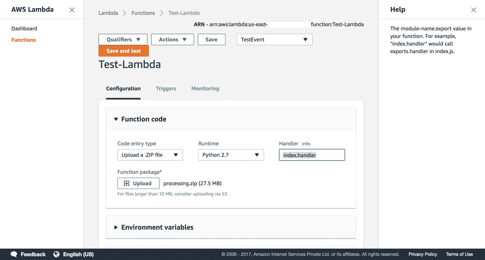

`index` 应该是 Lambda 函数的 文件名 部署包的名称。`handler` 函数文件是核心函数处理程序的名称，即 Lambda 函数。正如 AWS 的文档所述：

在函数中导出的模块名称值”。例如，index.handler 将调用 index.py 中的 exports.handler。

# 总结

在本章中，我们学习了 AWS Lambda 触发器的工作原理以及根据问题陈述和时间间隔选择触发器的概念，特别是在 cron 作业触发器的情况下。我们了解了 Lambda 函数是什么，以及它们的功能和与内存、VPC、安全性和容错相关的设置。我们还了解了 AWS Lambda 特定的容器重用方式。然后，我们涵盖了事件驱动函数以及它们在软件工程领域中的概念、用途和应用。最重要的是，通过我们学习的容器概念，我们现在可以欣赏选择容器来运行 Lambda 函数的选项。

之后，我们讨论了 AWS Lambda 仪表板中的所有配置设置，这些设置对于从头到尾构建和运行 Lambda 函数而言是必要的，而且不会出现任何与设置相关的问题。我们还学习了并了解了 Lambda 中的安全设置，以便在配置 Lambda 函数时处理必要的 VPC 详细信息和安全密钥设置。接着是根据所选触发器的选择来测试 Lambda 函数。我们学习了各种 AWS 服务的响应是什么样子，因为它们是 Lambda 函数的输入。然后，我们学习了如何编写自定义手工测试以进行自定义测试。

在此之后，我们看到了 AWS Lambda 函数的版本控制是如何进行的。我们学习了过去版本和现在版本之间的区别。我们还了解到现在版本是不可变的，不像过去的版本，以及如何在不费力的情况下恢复到过去的版本。我们还学习了如何为依赖于外部包的函数创建部署包，这些包不包括在 Python 的标准库中。我们遇到了函数代码命名的微妙之处，包括文件名和方法处理程序名称，以及部署包可以上传到 Lambda 控制台的两种方式；一种是手动上传，另一种是从 S3 文件位置上传。

在下一章中，我们将详细了解 Lambda 控制台中提供的不同触发器以及如何使用它们。我们还将学习如何在 Python 代码中实现它们。我们将了解事件结构以及来自不同 AWS 服务的响应，并利用它们来构建我们的 Lambda 函数。我们将了解如何将每个触发器集成到 Lambda 函数中，并在 Python 中执行特定任务。最后，我们还将学习有关如何使用无服务器范例将现有基础架构迁移到无服务器的想法和最佳实践。
