# 第三章：设置无服务器架构

到目前为止，我们已经了解了无服务器范例是什么，以及无服务器系统是如何工作的。我们还了解了 AWS Lambda 的无服务器工具是如何工作的。我们还学习了 AWS Lambda 中触发器的基础知识，以及用户在 Lambda 环境中可用的系统设置和配置的详细理解。我们还学习了 Lambda 控制台的工作原理，以及如何详细识别和使用 Lambda 控制台的各个部分，包括代码部署、触发器操作、在控制台中部署测试、对 Lambda 函数进行版本控制，以及可用的不同设置。

在本章结束时，您将清楚地了解 AWS Lambda 可用的所有重要触发器，以及如何使用它们来设置高效的 Lambda 架构。您还将了解事件结构是什么，以及某些 AWS 资源的事件结构是什么样子，以及如何使用这些知识来编写和部署基于触发器的 Lambda 架构。

本章将涵盖以下内容：

+   S3 触发器

+   SNS 触发器

+   SQS 触发器

+   CloudWatch 事件和日志触发器

# S3 触发器

S3 是 AWS 对象存储服务，用户可以存储和检索任何类型的对象。在本节中，我们将学习 S3 触发器的工作原理，S3 事件的事件结构是什么样的，以及如何在学习中使用它们来构建 Lambda 函数。

我们将构建一个 Lambda 函数，该函数执行以下操作：

1.  从 S3 服务接收 PUT 请求事件

1.  打印文件名和其他重要细节

1.  将文件传输到不同的存储桶

因此，让我们开始学习如何有效使用 S3 触发器。我们将逐步完成此任务，如下所示：

1.  首先，我们需要为任务创建两个 S3 存储桶。一个将是用户上传文件的存储桶。另一个将是 Lambda 函数传输和上传文件的存储桶。

1.  当没有预先存在的存储桶时，S3 控制台如下所示。您可以通过从 AWS 控制台左上角的下拉服务菜单中选择 S3 服务进入：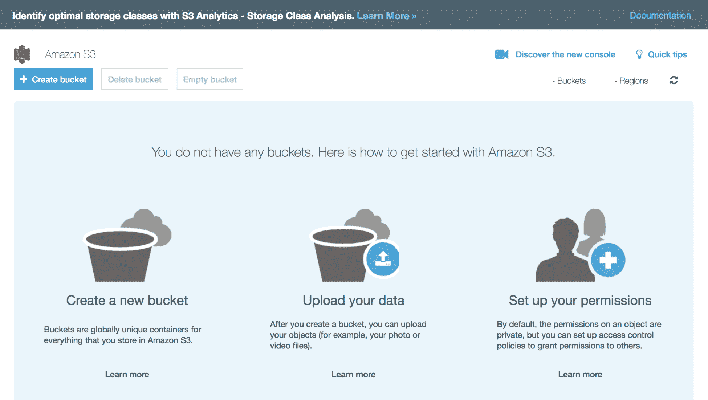

1.  让我们创建两个存储桶，即`receiver-bucket`和`sender-bucket`。

1.  `sender-bucket`存储桶将用作用户上传文件的存储桶。`receiver-bucket`存储桶是 Lambda 函数上传文件的存储桶。因此，根据我们的问题陈述，每当我们将文件上传到`sender-bucket`存储桶时，Lambda 函数将被触发，并且文件将被上传到`receiver-bucket`。

1.  当我们在 S3 控制台中单击“创建存储桶”按钮时，我们会得到一个如下所示的对话框：

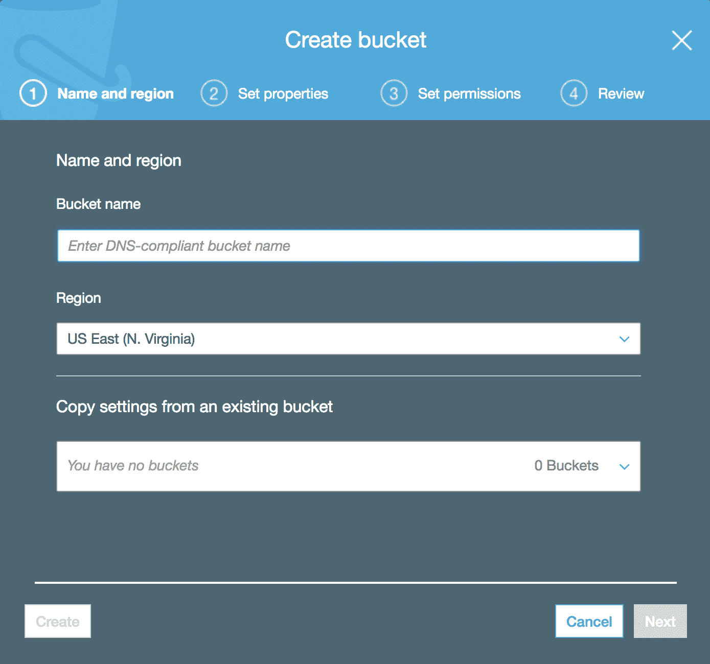

1.  在前面的对话框中，我们需要输入以下设置：

+   存储桶名称：顾名思义，我们需要输入正在创建的存储桶的名称。对于第一个存储桶的创建，将其命名为`sender-bucket`，并将第二个存储桶命名为`receiver-bucket`。

+   区域：这是我们希望存储桶所在的 AWS 区域。您可以使用默认区域，也可以使用距离您所在位置最近的区域。

+   从现有存储桶复制设置：这指定我们是否要在控制台中使用与其他存储桶相同的设置。由于我们目前在控制台中没有其他存储桶，因此可以通过将其留空来跳过此设置。之后，您可以单击弹出窗口右下角的“下一步”按钮。

1.  单击“下一步”后，我们将被重定向到弹出窗口的第二个选项卡，即“设置属性”菜单，如下所示：

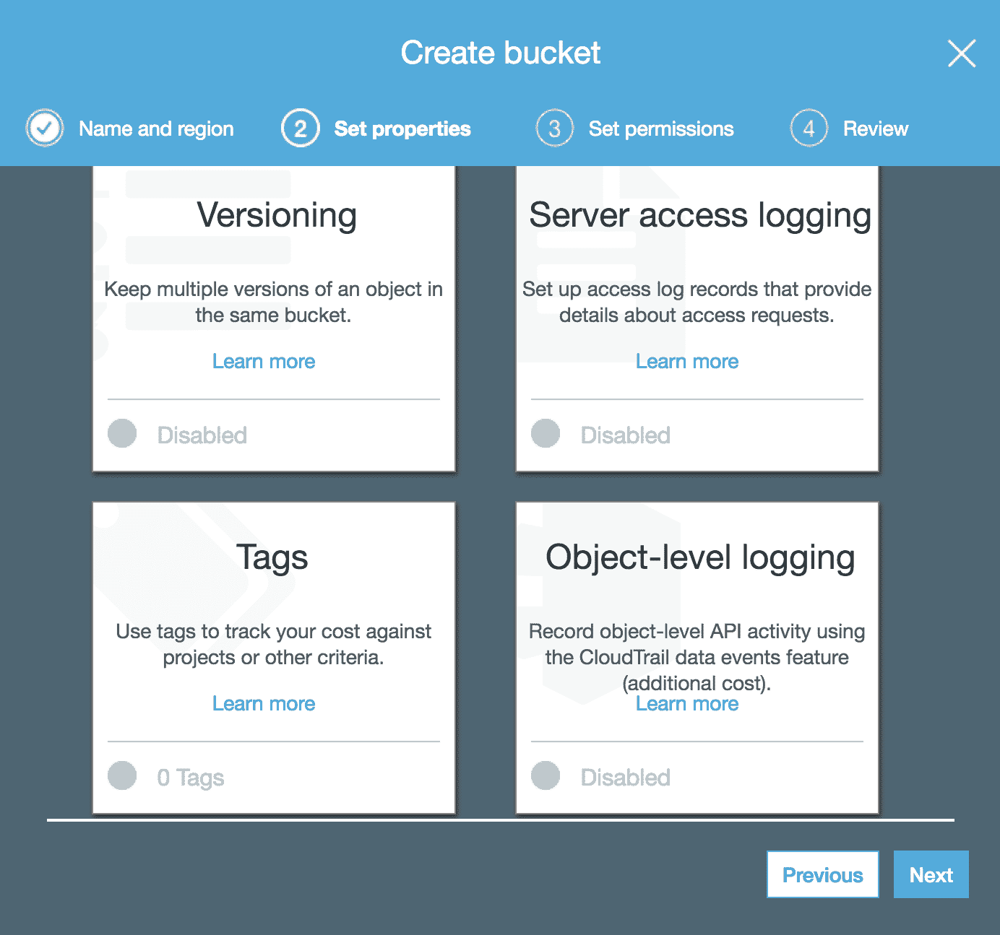

1.  在弹出窗口的此部分，我们需要决定以下设置：

+   版本控制：如果我们想要在 S3 存储桶中保留多个文件版本，这是相关的。当您需要为您的 S3 存储桶使用 Git 风格的版本控制时，需要此设置。请注意，存储成本将根据版本化文档的数量包括在内。

+   服务器访问日志：这将记录对 S3 存储桶的所有访问请求。这有助于调试任何安全漏洞，并保护 S3 存储桶和文件的安全。

+   标签：这将使用*名称:值*样式对存储桶进行标记，与我们学习 Lambda 函数的标记样式相同。

+   对象级别日志记录：这将使用 AWS 的 CloudTrail 服务记录对 S3 存储桶的所有访问请求和其他详细信息和活动。这也将包括 CloudTrail 成本。因此，只有在需要详细记录时才使用此功能。我们将跳过在本节中使用此功能。

1.  完成创建存储桶后，S3 控制台将如下所示，列出了创建的两个存储桶：

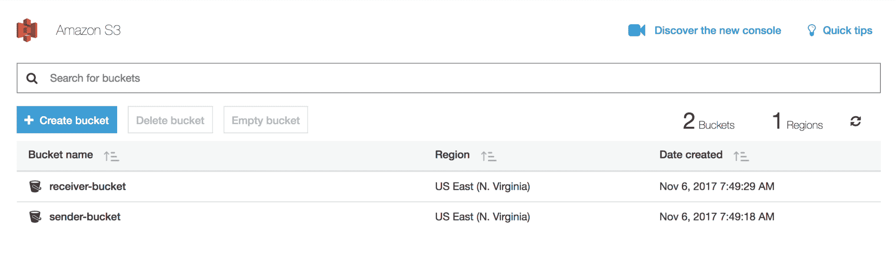

1.  我们已成功为我们的任务创建了 S3 存储桶。现在，我们必须创建一个 Lambda 函数，该函数可以识别`sender-bucket`存储桶中的对象上传，并将该文件发送到`receiver-bucket`存储桶。

1.  在创建 Lambda 函数时，这次从列出的选项中选择 s3-get-object-python 蓝图：

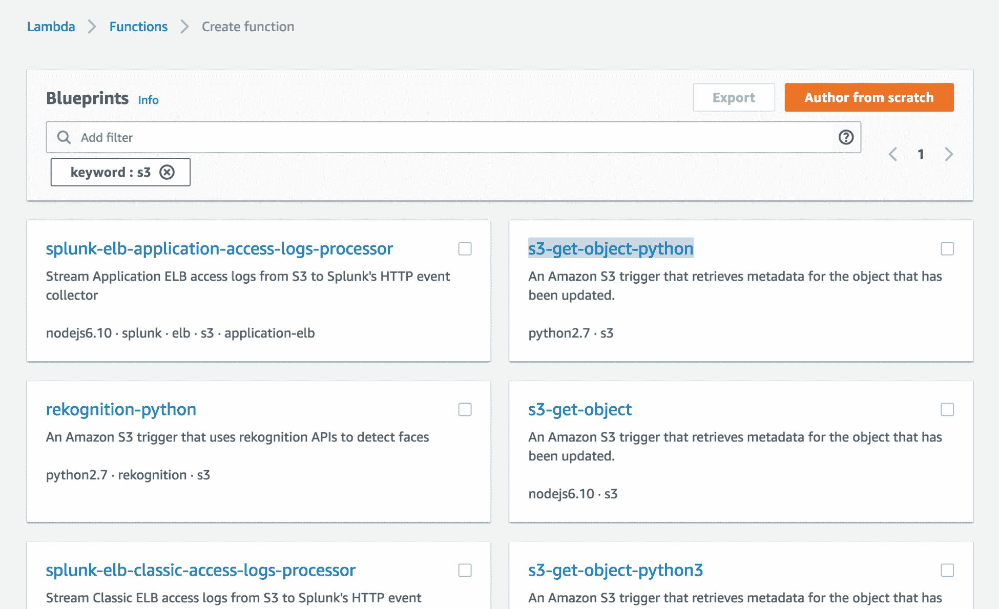

1.  在下一步中配置存储桶详细信息。在“存储桶”部分，选择`sender-bucket`存储桶，并在“事件类型”操作中选择“对象创建（全部）”选项。这是因为我们希望在`sender-bucket`存储桶中创建对象时向 Lambda 发送通知。该部分的完成部分将如下所示：

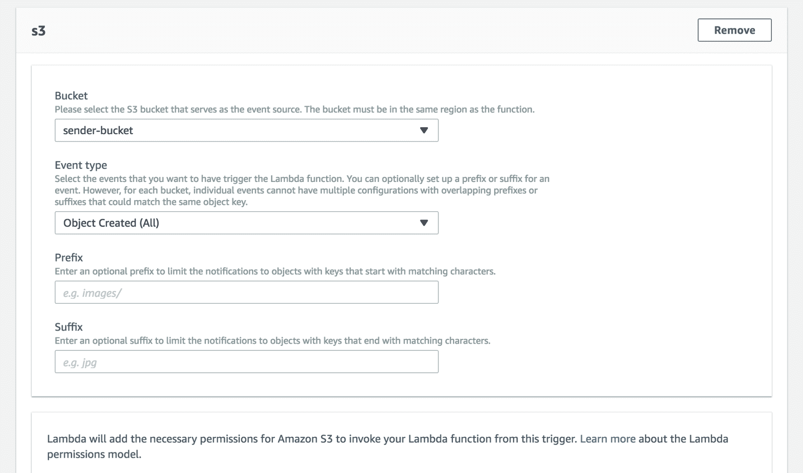

1.  一旦您启用了触发器，Lambda 将通过为任务创建样板代码来帮助您。我们所需要做的就是编写代码将对象放入`receiver-bucket`存储桶中。Lambda 函数代码部分中可以看到样板代码：

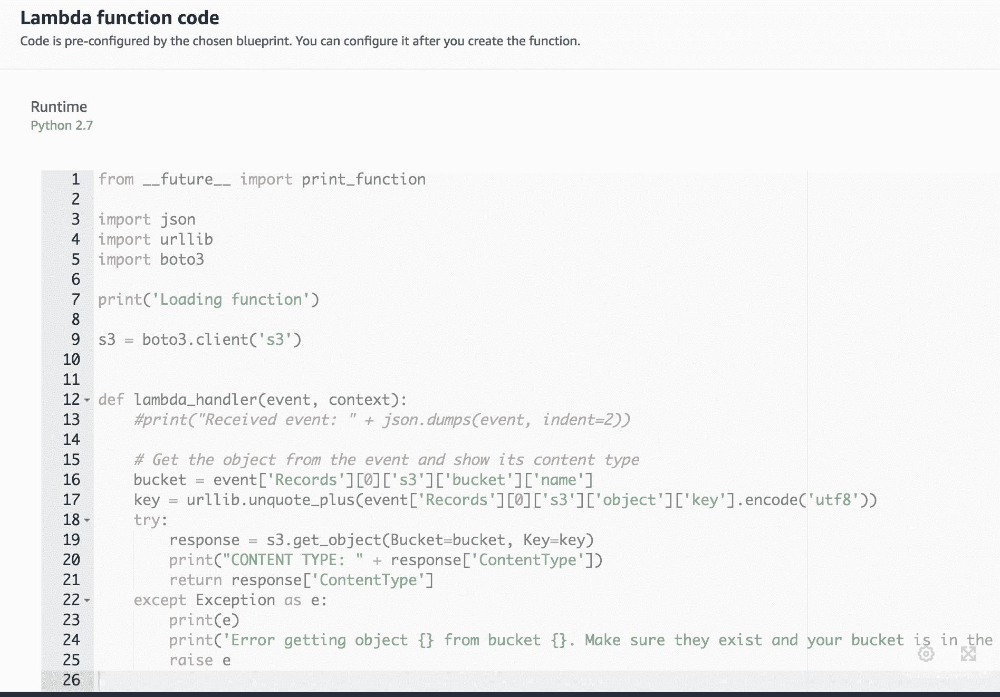

1.  当完成此步骤并单击“创建函数”按钮后，您可以在 Lambda 控制台的触发器部分看到一个成功消息，该消息在顶部以绿色显示：

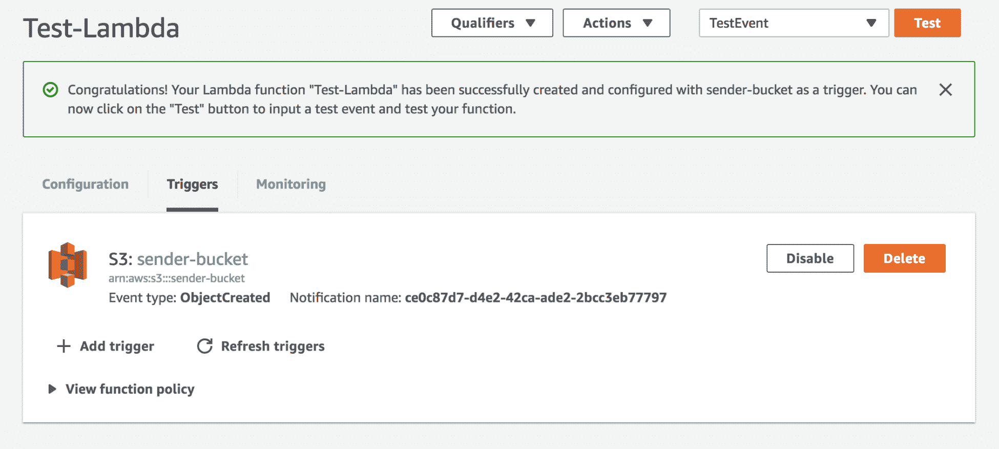

1.  我已将一个小图像文件上传到`sender-bucket`存储桶中。因此，现在`sender-bucket`存储桶的内容如下所示：

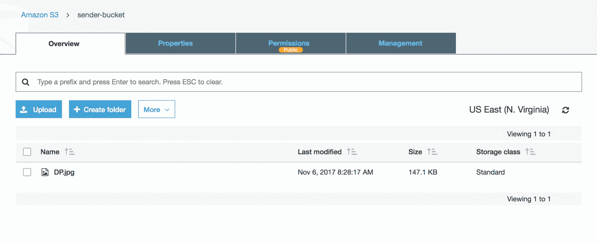

1.  一旦上传了这个文件，Lambda 函数就会被触发。Lambda 函数的代码如下所示：

```py
from __future__ import print_function

import json
import urllib
import boto3
from botocore.client import Config

print('Loading function')
sts_client = boto3.client('sts', use_ssl=True)

# Assume a Role for temporary credentials
assumedRoleObject = sts_client.assume_role(
RoleArn="arn:aws:iam::080983167913:role/service-role/Pycontw-Role",
RoleSessionName="AssumeRoleSession1"
)
credentials = assumedRoleObject['Credentials']
region = 'us-east-1'

def lambda_handler(event, context):
    #print("Received event: " + json.dumps(event, indent=2))

    # Get the object from the event and show its content type
    bucket = event['Records'][0]['s3']['bucket']['name']
    key = urllib.unquote_plus(event['Records'][0]['s3']       ['object']['key'].encode('utf8'))
    try:
        # Creates a session
        session = boto3.Session(credentials['AccessKeyId'],      credentials['SecretAccessKey'] ,      aws_session_token=credentials['SessionToken'],      region_name=region)

        #Instantiates an S3 resource
        s3 = session.resource('s3',  config=Config(signature_version='s3v4'), use_ssl=True)

        #Instantiates an S3 client
        client = session.client('s3',   config=Config(signature_version='s3v4'), use_ssl=True)

        # Gets the list of objects of a bucket
        response = client.list_objects(Bucket=bucket)

        destination_bucket = 'receiver-bucket'
        source_bucket = 'sender-bucket'

        # Adding all the file names in the S3 bucket in an  array
        keys = []
        if 'Contents' in response:
            for item in response['Contents']:
                keys.append(item['Key']);

        # Add all the files in the bucket into the receiver bucket
        for key in keys:
            path = source_bucket + '/' + key
            print(key)
        s3.Object(destination_bucket,  key).copy_from(CopySource=path)

    Exception as e:
        print(e)
print('Error getting object {} from bucket {}. Make sure they exist and your bucket is in the same region as this function.'.format(key, bucket))
raise e
```

1.  现在，当您运行 Lambda 函数时，您可以在接收者存储桶中看到相同的文件：

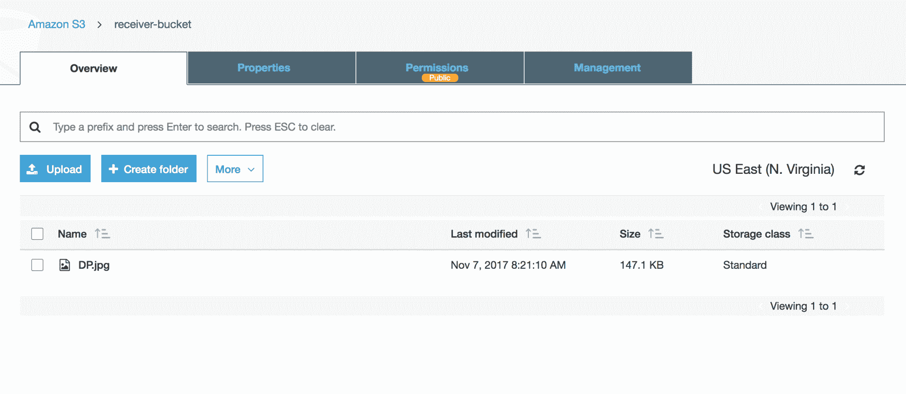

# SNS 触发器

SNS 通知服务可以用于多种用例，其中之一涉及触发 Lambda 函数。SNS 触发器通常用作 AWS CloudWatch 服务和 Lambda 之间的接口。

因此，在本节中，我们将执行以下操作：

1.  创建一个 SNS 主题

1.  为我们的`receiver-bucket`存储桶创建一个 CloudWatch 警报，以监视存储桶中的对象数量

1.  一旦对象计数达到 5，警报将被设置为警报，并相应的通知将被发送到我们刚刚创建的 SNS 主题

1.  然后，这个 SNS 主题将触发一个 Lambda 函数，为我们打印出“Hello World”消息

这将帮助您了解如何监视不同的 AWS 服务并为这些指标设置一些阈值的警报。根据服务的指标是否达到了该阈值，Lambda 函数将被触发。

这个过程的流程如下：

1.  SNS 主题可以从 SNS 仪表板创建。通过单击“创建主题”选项，您将被重定向到 SNS 的主题创建仪表板。AWS 的 SNS 仪表板如下所示：

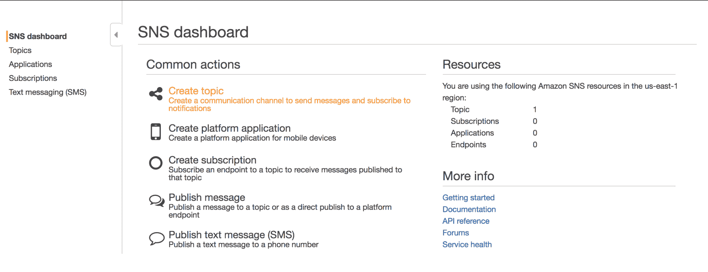

接下来的 SNS 主题创建向导如下所示：

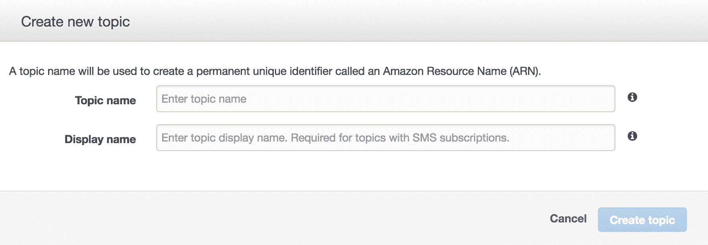

在此创建向导中，您可以为正在创建的 SNS 主题命名，并添加任何您想要的元信息。

1.  主题创建后，您可以在 SNS 仪表板左侧的“主题”菜单中查看它。按钮如下所示：

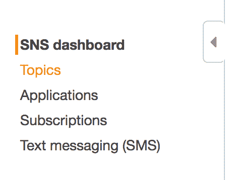

点击“主题”选项卡后，将显示主题列表，如下截图所示：

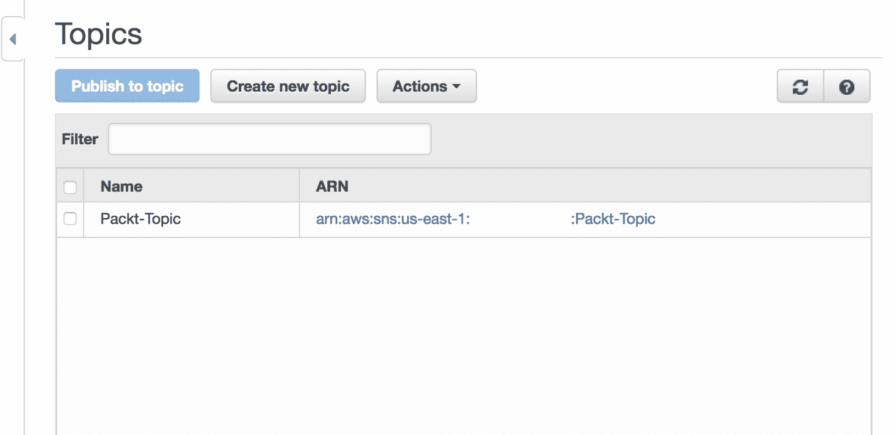

1.  现在我们已成功创建了一个 SNS 主题，我们将创建一个 CloudWatch 警报来监视我们的 S3 存储桶中的文件。AWS CloudWatch 仪表板看起来像这样：

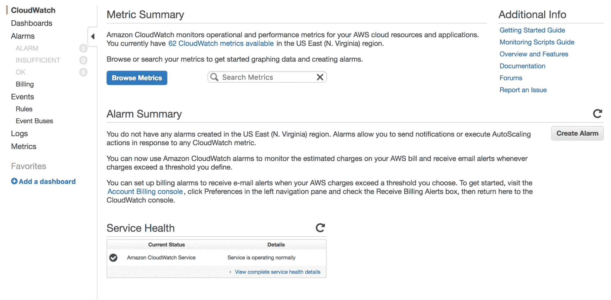

1.  现在，我们可以通过单击仪表板左侧列表中的“警报”按钮转到警报页面。AWS 警报页面如下所示：

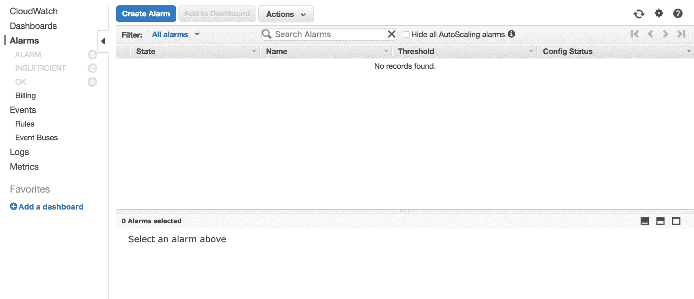

1.  接下来，点击“创建警报”以创建警报。这将打开一个带有多个选项的警报创建向导。根据您的 AWS 生态系统中运行的服务，向导如下所示：

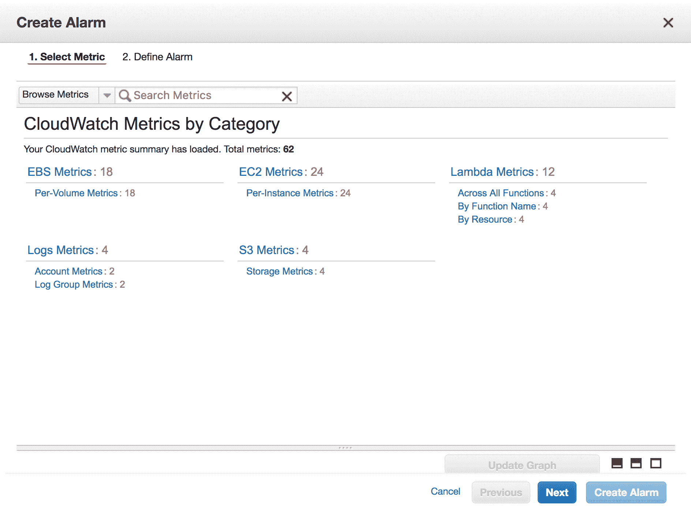

1.  由于我们打算为我们的 S3 存储桶创建警报，我们可以转到 S3 指标选项卡，并忽略其他可用的指标。如果您点击 S3 指标类别中的存储指标选项，您将被重定向到另一个警报创建向导，具体取决于您在 S3 中拥有的存储桶数量：

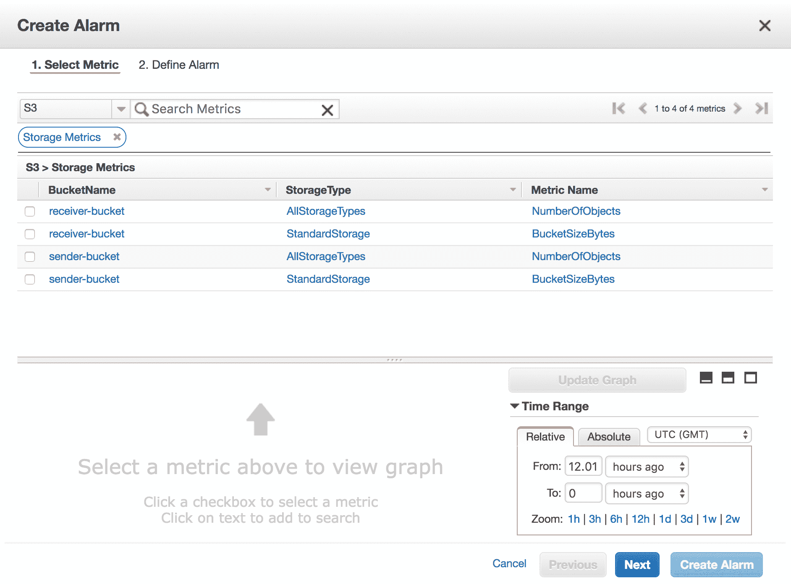

1.  如果您观察“指标名称”列中的选项，您将看到每个存储桶都有两个选项可用：NumberOfObjects 和 BucketSizeBytes。它们是不言自明的，我们只需要“NumberOfObjects”选项来监视`receiver-bucket`存储桶。因此，选择该选项并单击“下一步”：

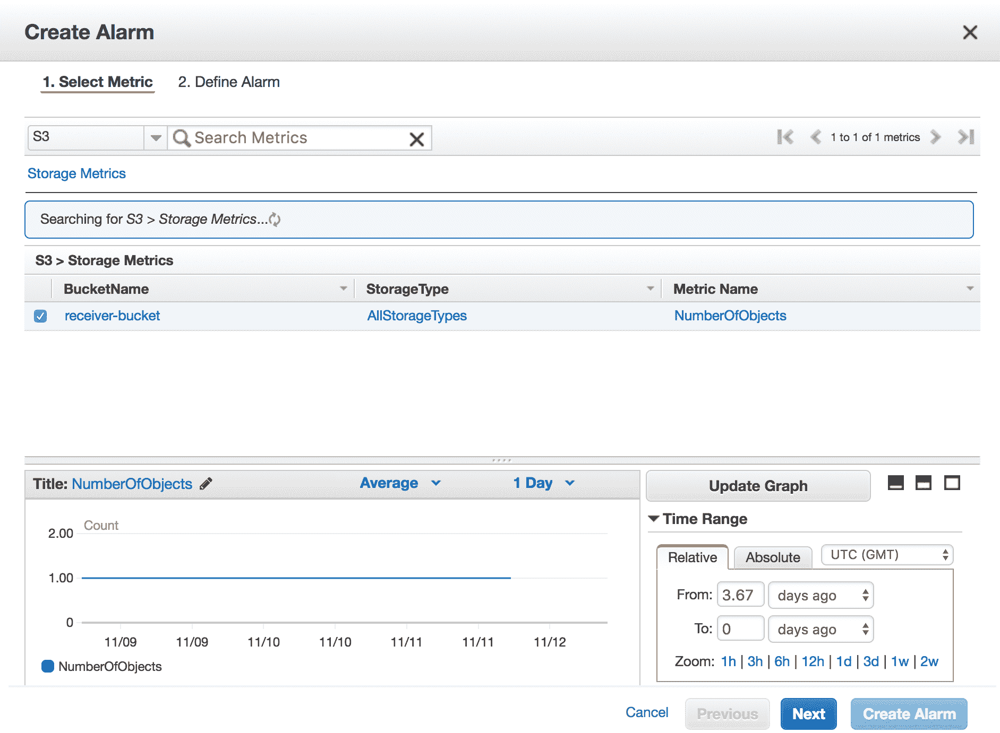

这将带您进入警报定义向导，在那里您需要指定 SNS 主题的详细信息和警报的阈值。向导如下所示：

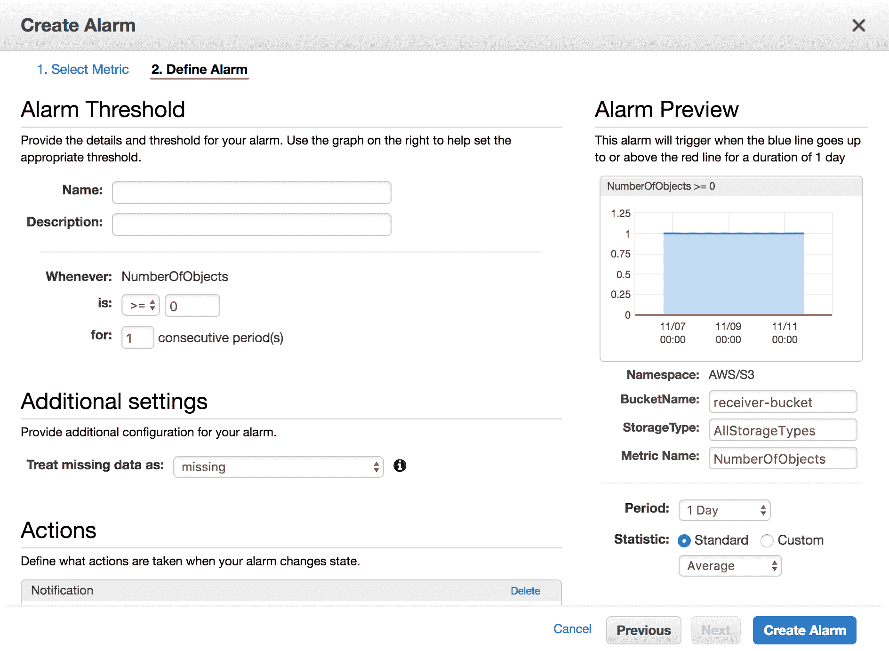

1.  添加阈值和警报名称的详细信息。阈值为五个文件，这意味着一旦相应存储桶（在我们的情况下为`receiver-bucket`）中的文件数量达到五个，警报就会被触发。向导如下所示：

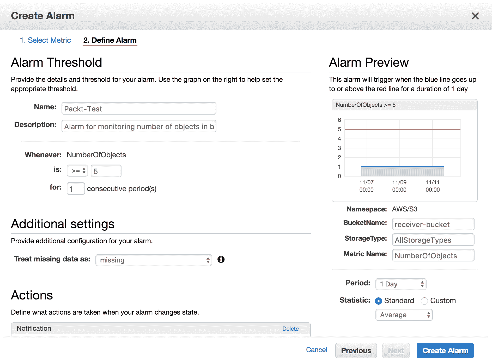

1.  在“操作”选项中，我们可以配置警报将通知发送到我们刚刚创建的 SNS 主题。您可以从下拉列表中选择主题，如下所示：

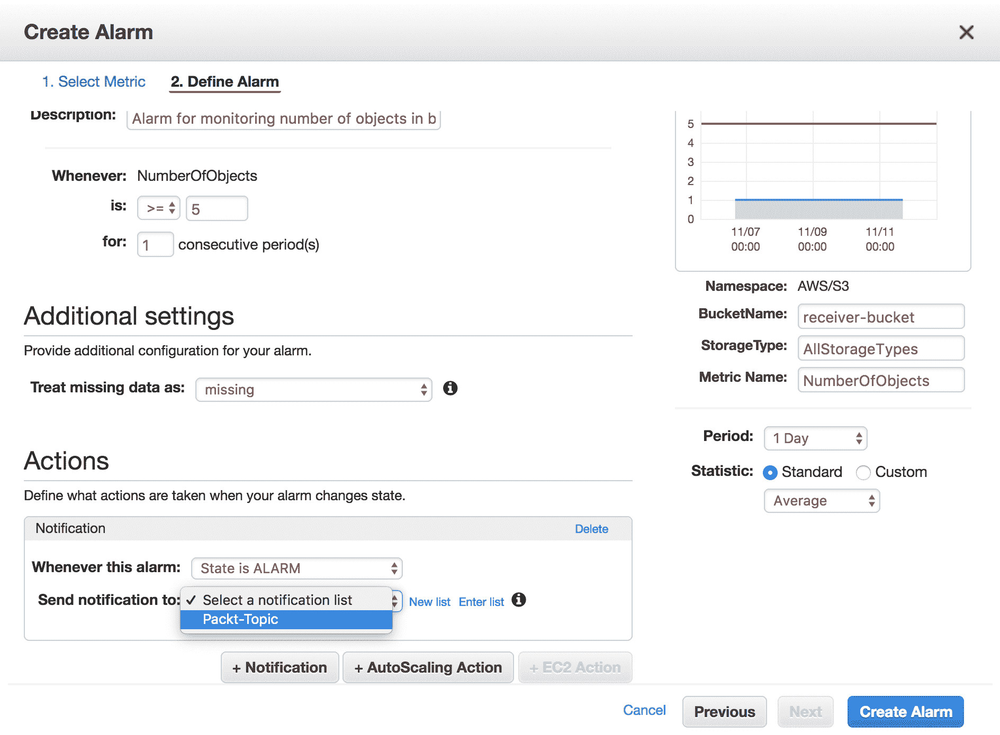

1.  一旦配置了 SNS 主题，我们可以点击底部的“创建警报”按钮。这将创建与 SNS 主题链接的警报作为通知管道。在仪表板上，创建的警报将如下所示：

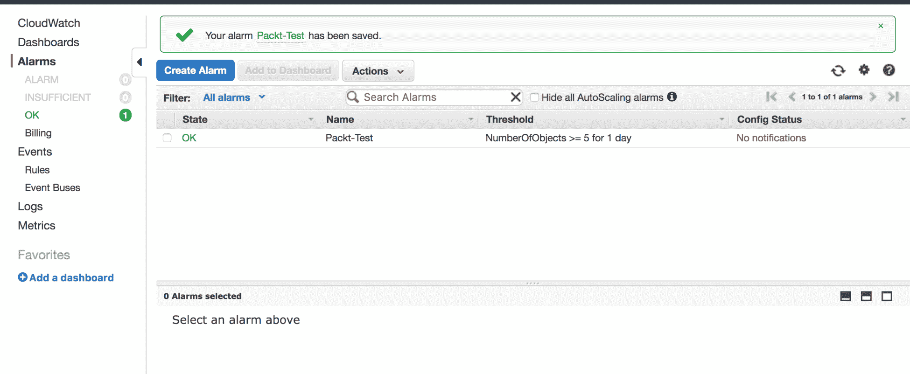

1.  现在，我们可以继续构建任务的 Lambda 函数。对于这个特定的任务，在创建 Lambda 函数时，请使用 sns-message-python 蓝图：

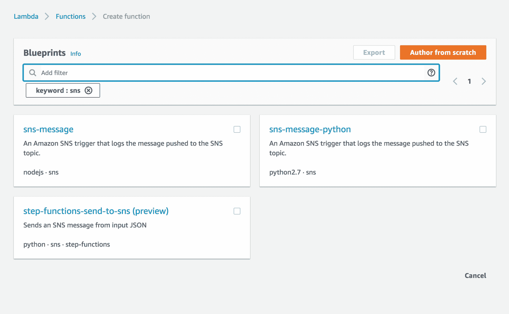

1.  在上一步中，当您选择了蓝图后，将要求您输入有关 Lambda 函数的一些元信息，就像我们之前创建 Lambda 函数时所做的那样。在同一向导中，您还将被要求提及 SNS 主题的名称。您可以在这里指定它：

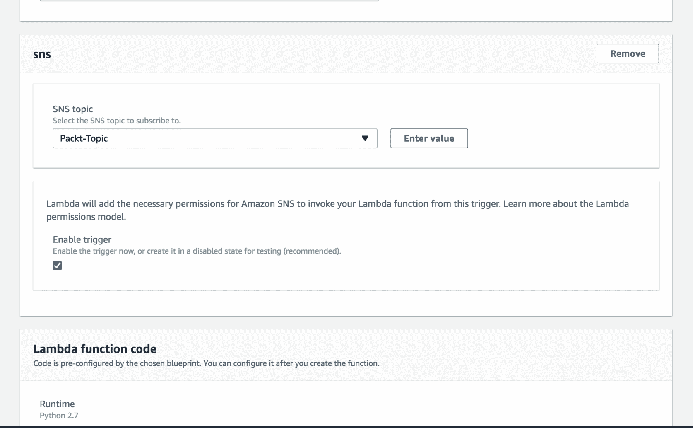

1.  现在我们已经正确选择了 Lambda 函数的所有选项，我们现在可以进行代码编写。期望的代码将如下所示：

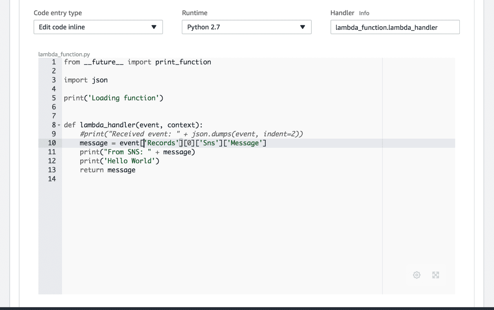

上述代码将在 Lambda 函数触发时显示`Hello World`消息。这样我们就完成了此任务的设置。

1.  要测试前面的设置，您可以简单地将超过五个文件上传到您的`receiver-bucket`存储桶，并检查 Lambda 函数的执行情况。

# SQS 触发器

**AWS 简单队列服务（SQS）**是 AWS 队列服务。该服务类似于通常在软件工程中使用的排队机制。这使我们能够在队列中添加、存储和删除消息。

我们将学习如何根据 SQS 队列中的消息数量触发 Lambda 函数。此任务将帮助您了解如何构建无服务器批量数据架构，以及如何自己构建一个。

我们将通过监视我们的 SQS 队列使用 CloudWatch 警报，并通过 SNS 主题将信息传递给 Lambda，就像我们在上一个任务中所做的那样。

因此，在本节中，我们将执行以下操作：

1.  创建一个 SQS 队列

1.  创建一个 SNS 主题

1.  为我们的 SQS 队列创建一个 CloudWatch 警报，以监视队列中的消息数量

1.  一旦消息计数达到 5，警报将被设置为“警报”，并相应的通知将被发送到我们刚刚创建的 SNS 主题

1.  然后，这个 SNS 主题将触发一个 Lambda 函数，为我们打印一个`Hello World`消息。

这将帮助您了解如何监视队列，并构建高效的无服务器数据架构，而不是实时的批处理。

此过程的流程如下：

1.  我们将首先创建一个 AWS SQS 队列。我们需要转到我们 AWS 账户的 SQS 仪表板。仪表板如下所示：

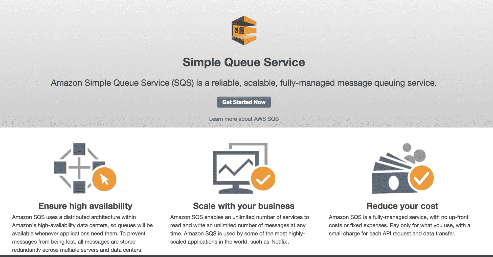

1.  单击“立即开始”按钮创建一个 SQS 队列。它会将您重定向到队列创建向导，在那里您需要输入名称、队列类型等详细信息。队列创建向导如下所示：

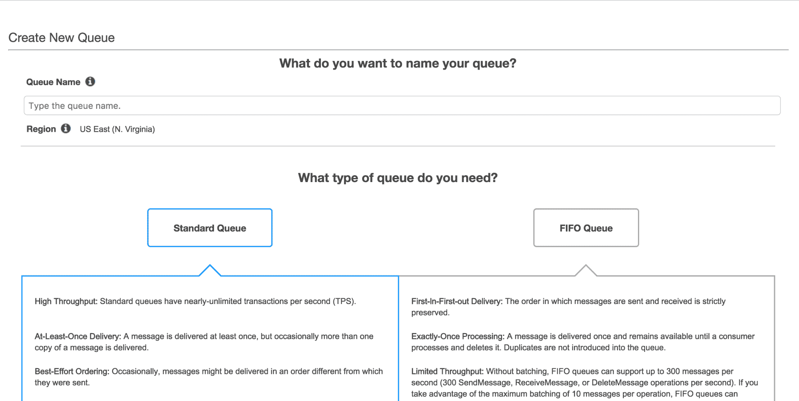

1.  您可以在“队列名称”中输入队列的名称。在“您需要什么类型的队列？”选项中，选择“标准队列”选项。在底部的选项中，选择蓝色的“快速创建队列”选项：

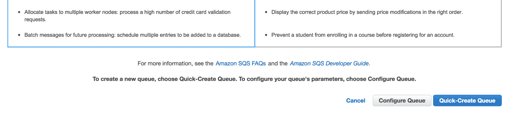

“配置队列”选项是用于高级设置的。对于这个任务，不需要调整这些设置。高级设置如下所示：

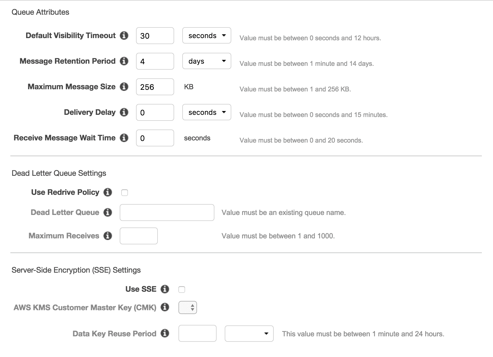

1.  创建队列后，您将被带到 SQS 页面，那里列出了您创建的所有队列，类似于 SNS 列表。此页面如下所示：

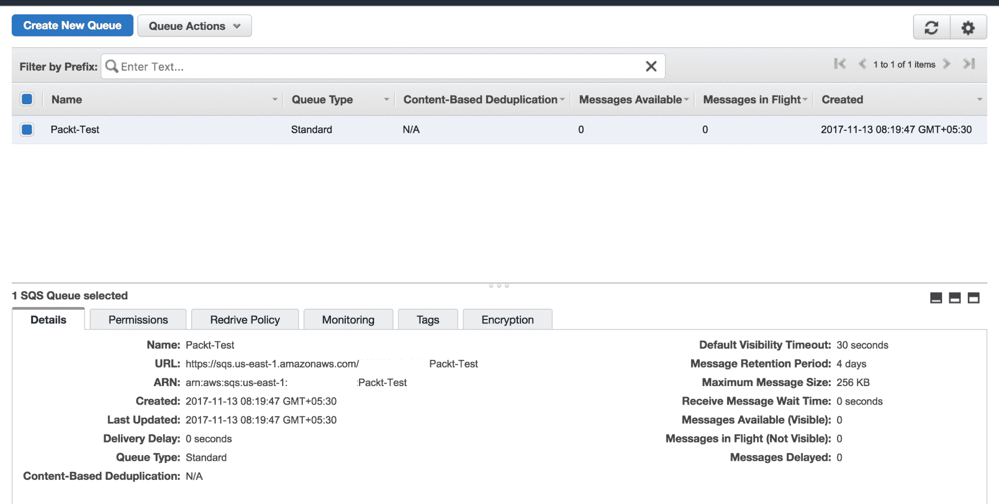

1.  由于我们在上一个任务中已经创建了一个 SNS 主题，我们将为此目的使用相同的主题。如果您还没有创建 SNS 主题，您可以参考上一个任务中有关如何创建主题的说明。SNS 主题列表如下所示：

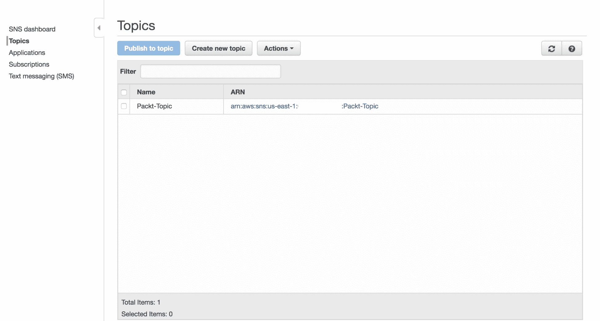

1.  现在，我们将转到 CloudWatch 仪表板，创建一个警报来监视我们的 SQS 队列，并通过我们已经创建的 SNS 主题向 Lambda 发送通知。我们现在可以在警报创建向导中看到 SQS 队列的指标：

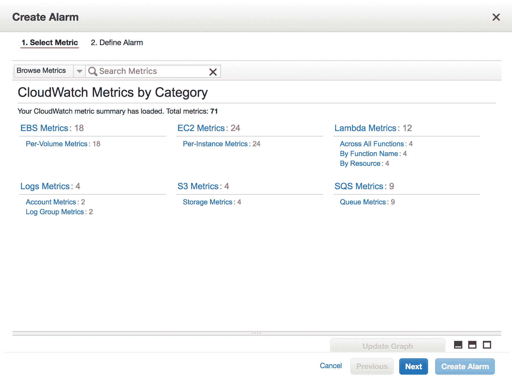

1.  通过单击 SQS 指标下的“队列指标”选项，我们将被带到列出所有队列指标的页面，我们需要选择其中一个用于我们的警报：

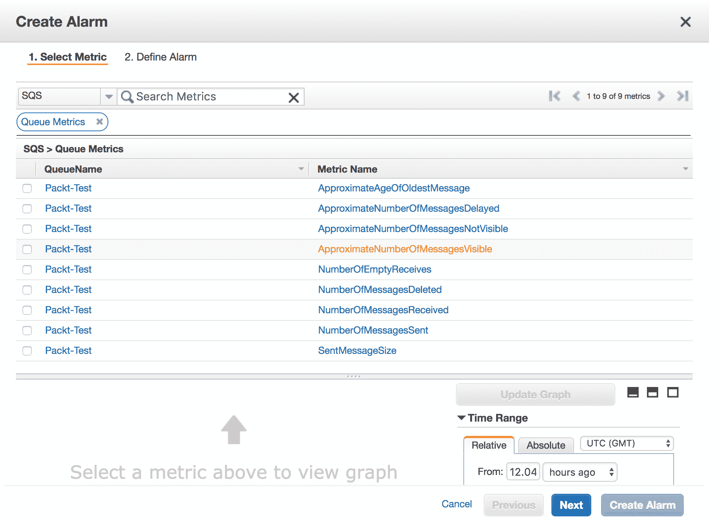

1.  在这里，我们对“ApproximateNumberOfMessagesVisible”指标感兴趣，该指标提供了队列中的消息数量。它说是“Approximate”，因为 SQS 是一个分布式队列，消息数量只能以随机方式确定。

1.  在下一页中，从列表中选择“ApproximateNumberOfMessagesVisible”指标后，可以像我们在上一个任务中为 S3 指标所做的那样配置必要的设置。页面应该如下所示：

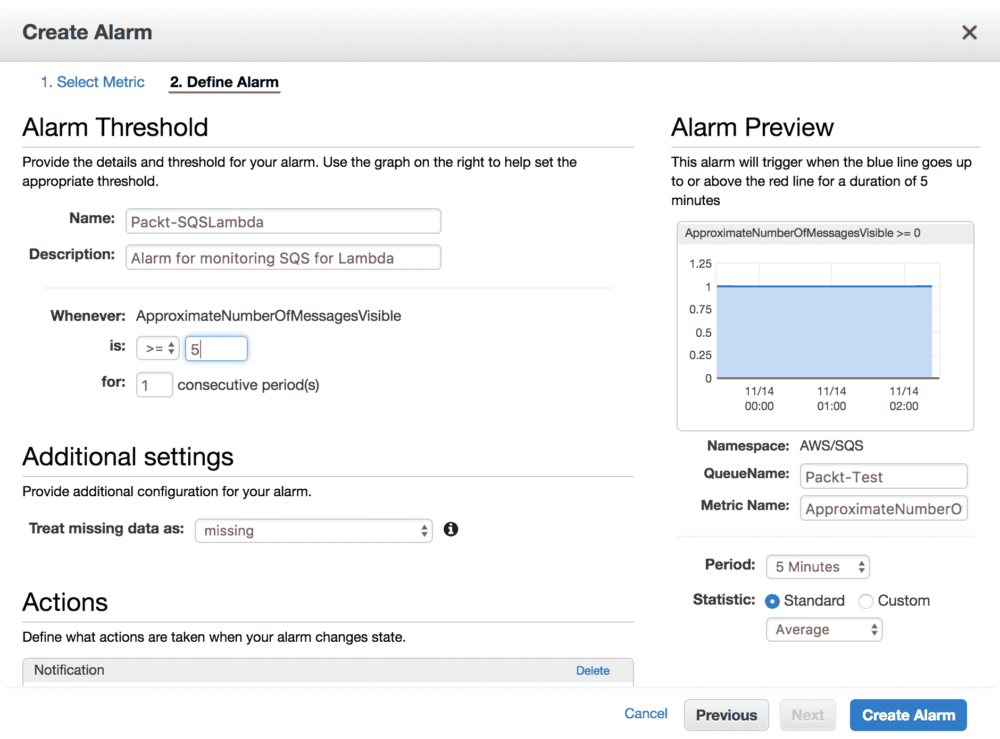

1.  在操作部分，配置我们要发送通知的 SNS 主题。这一步与我们在上一个任务中配置 SNS 主题的方式类似：

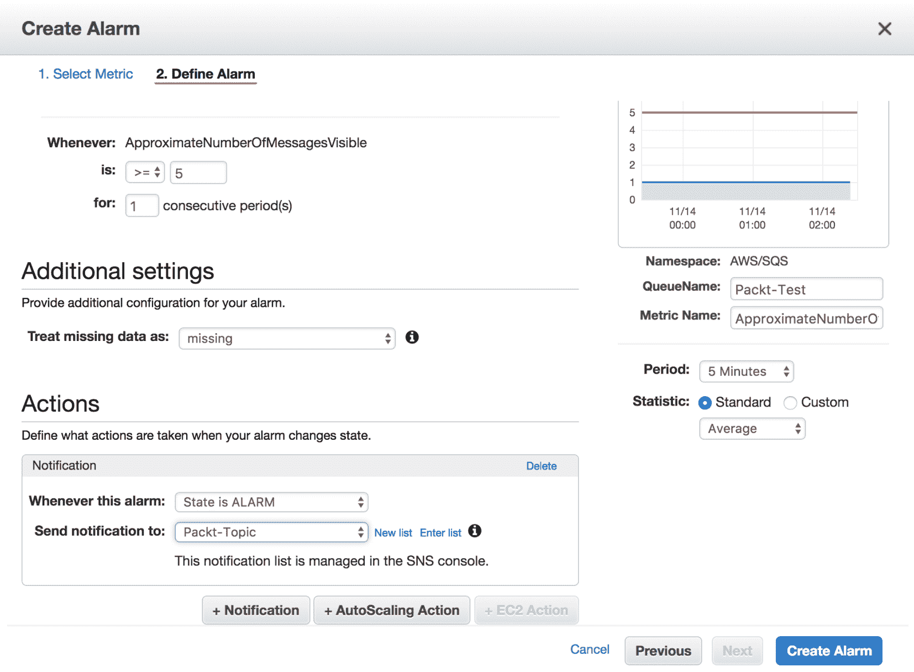

1.  一旦您对元数据和您为警报配置的设置感到满意，您可以单击屏幕右下角的蓝色创建警报按钮。这将成功创建一个监视您的 SQS 队列并向您配置的 SNS 主题发送通知的警报：

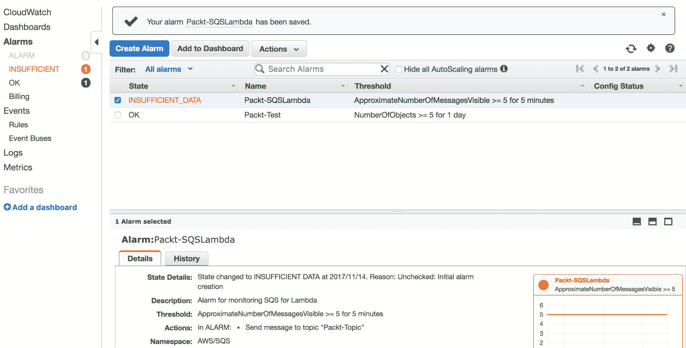

1.  我们可以使用上一个任务中创建的 Lambda 函数。确保触发器是我们用于配置警报通知系统的 SNS 主题：

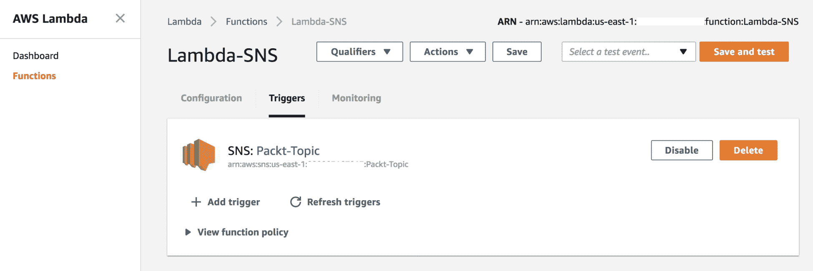

1.  此任务的 Lambda 函数代码如下：

```py
from __future__ import print_function
import json
print('Loading function')
def lambda_handler(event, context):
    #print("Received event: " + json.dumps(event, indent=2))
    message = event['Records'][0]['Sns']['Message']
    print("From SNS: " + message)
    print('Hello World')
    return message
```

# CloudWatch 触发器

**CloudWatch**是 AWS 的日志记录和监控服务，大多数服务的日志都会被存储和监控。在本节中，我们将学习 CloudWatch 触发器的工作原理，CloudWatch 查询在实践中的工作原理，如何在 Lambda 函数中配置它，以及如何利用这些知识来构建 Lambda 函数。

因此，在本节中，我们将执行以下操作：

1.  创建一个 CloudWatch 日志

1.  简要了解 CloudWatch 日志的工作原理

1.  创建一个由 CloudWatch 触发器触发的 Lambda 函数

这将帮助您理解并构建弹性和稳定的无服务器架构。

这个过程的流程如下：

1.  要创建一个 CloudWatch 日志组，请点击 CloudWatch 控制台左侧的日志选项：

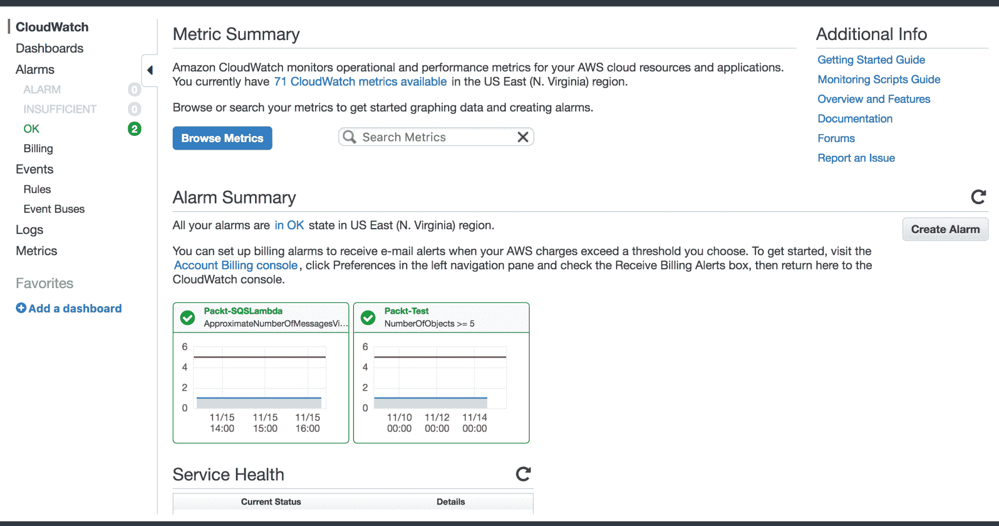

1.  一旦您进入 AWS CloudWatch 日志页面，您将看到一个已经存在的日志组列表。CloudWatch 日志页面看起来是这样的：

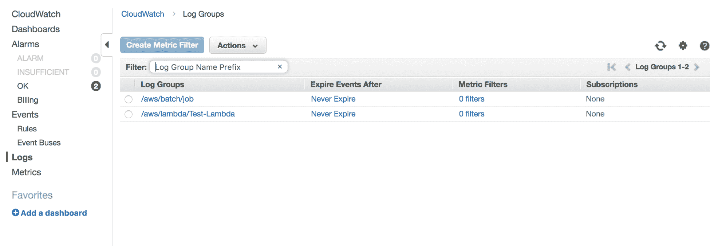

1.  让我们继续创建一个新的 CloudWatch 日志。您可以在顶部的操作下拉菜单中看到创建新日志组的选项：

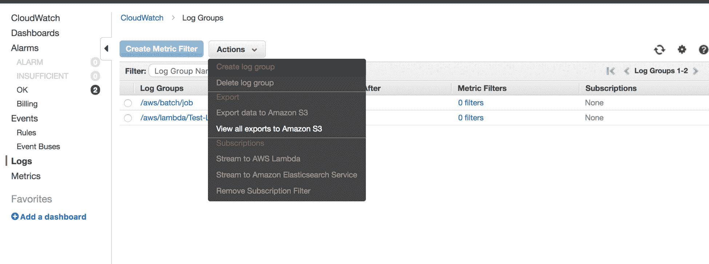

1.  在下一步中，您将被要求命名您正在创建的日志组。继续输入相关信息，然后单击创建日志组：

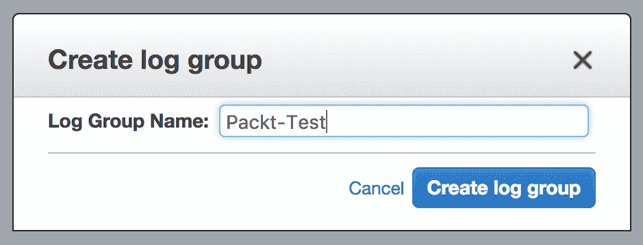

1.  所以，现在我们在 CloudWatch 控制台的日志组列表中有一个新的日志组：

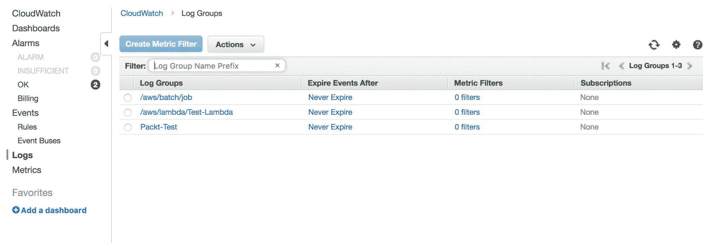

1.  日志组创建后，我们现在可以开始处理我们的 Lambda 函数。因此，让我们转到 Lambda 控制台并开始创建一个新函数。

1.  从蓝图中选择 cloudwatch-logs-process-data 蓝图。描述如下：Amazon CloudWatch 日志日志组摄取的实时日志事件的实时消费者：

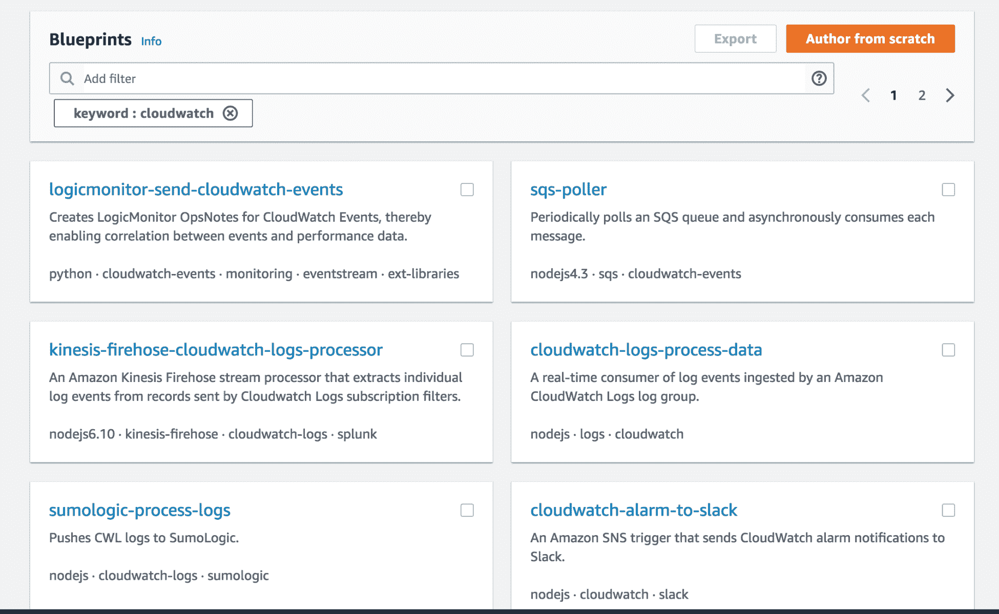

1.  选择相应的蓝图选项后，您将像往常一样被重定向到 Lambda 创建向导：

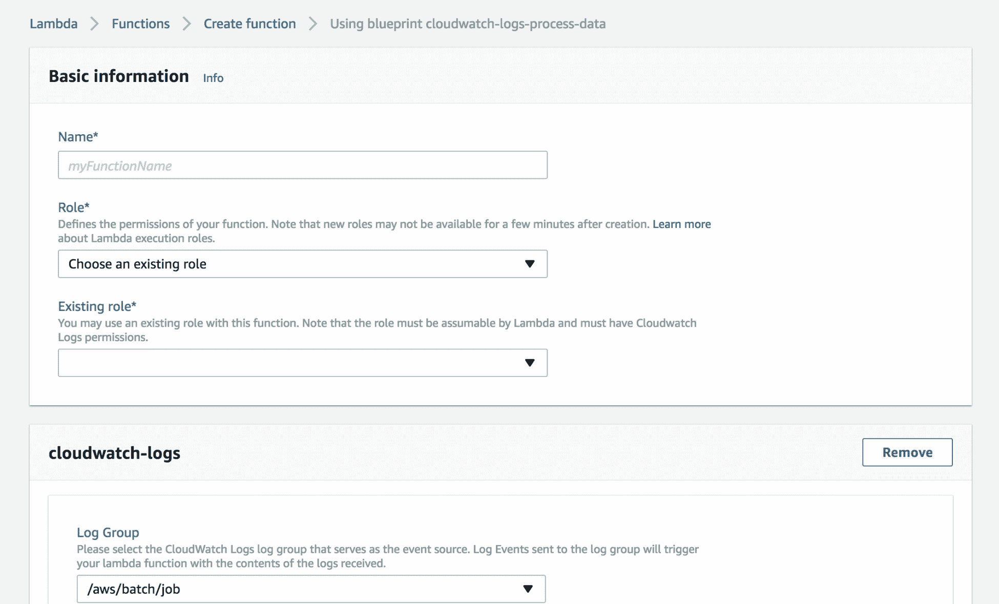

1.  就像我们在上一个任务中所做的那样，在 Lambda 创建面板的 cloudwatch-logs 窗格中，我们还将输入有关日志名称和其他细节的相关信息：

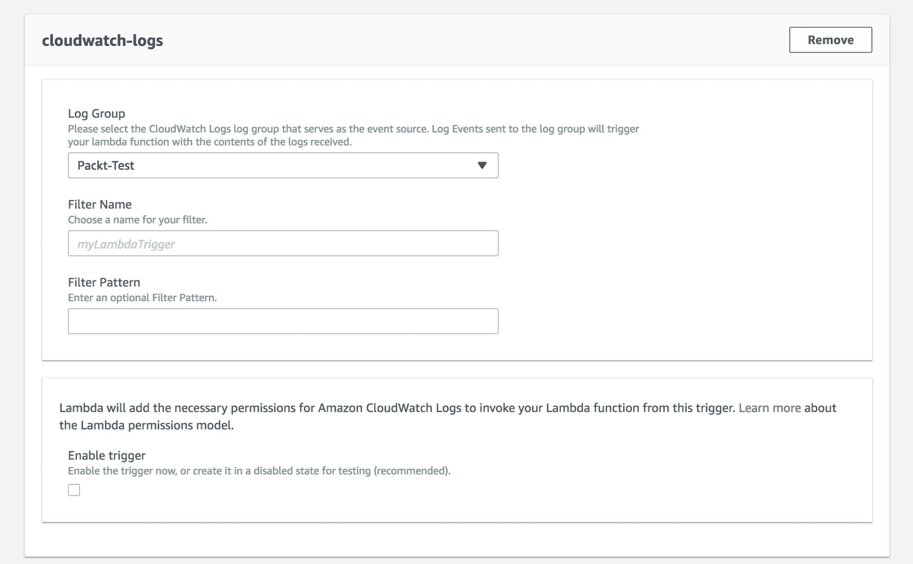

1.  单击创建函数后，我们将被重定向到一个触发器页面，并显示成功消息。

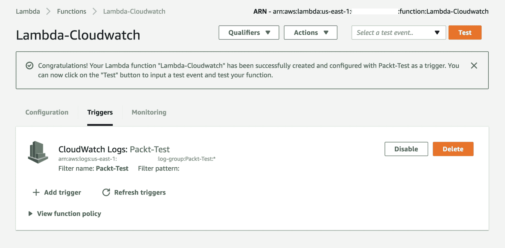

1.  所以，现在我们编写 Lambda 函数代码来识别日志组并打印`Hello World`消息：

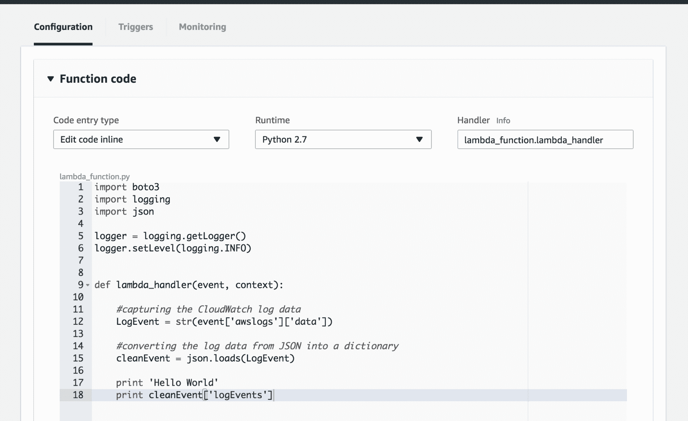

1.  我们已经成功完成了另一个任务，了解了如何通过 AWS CloudWatch 日志触发 Lambda 函数。此任务的 Lambda 函数代码如下：

```py
 import boto3
 import logging
 import json
 logger = logging.getLogger()
 logger.setLevel(logging.INFO)
 def lambda_handler(event, context):
 #capturing the CloudWatch log data
 LogEvent = str(event['awslogs']['data'])
 #converting the log data from JSON into a dictionary
 cleanEvent = json.loads(LogEvent)
 print 'Hello World'
 print cleanEvent['logEvents']
```

# 摘要

在本章中，我们已经学到了有关各种 Lambda 触发器如何工作以及如何配置它们，设置触发器并编写 Lambda 函数代码来处理它们的数据。

在第一个任务中，我们学习了 S3 事件的工作原理，以及如何理解并接收来自 S3 服务的事件到 AWS Lambda。我们了解了如何通过 CloudWatch 监视 S3 存储桶的文件详细信息，并通过 AWS SNS 将该通知发送到 Lambda 函数。

我们还学习了如何创建 SNS 主题，以及如何将它们用作从 CloudWatch 到 AWS Lambda 的多个 AWS 服务的中间路由。

我们简要了解了 AWS CloudWatch 的工作原理。我们了解了各种 AWS 服务的指标是什么样子，比如 S3、SQS 和 CloudWatch。我们还学会了为 CloudWatch 警报设置阈值，以及如何将这些警报连接到 AWS SNS 等通知服务。

我们学习了 AWS CloudWatch Logs 的工作原理，以及如何连接和使用 Lambda 中的 CloudWatch 触发器，以便在添加/接收新的日志事件时触发它。总的来说，在本章中，我们成功创建了新的 AWS 服务，如 SQS、CloudWatch Logs、SNS 和 S3 存储桶，并成功构建和部署了三个无服务器任务/流水线。

在下一章中，我们将学习如何构建无服务器 API，我们将在其中执行一些任务，就像我们在本章中所做的那样，并且深入了解 API 的工作原理，最重要的是，无服务器 API 的工作原理。
