# 第六章：扩展无服务器架构

到目前为止，我们已经学会了如何构建、监控和记录无服务器函数。在本章中，我们将学习一些概念和工程技术，帮助扩展无服务器应用程序以进行分布式，并使其能够以高标准的安全性和吞吐量处理大量工作负载。在本章中，我们还将使用一些第三方工具，如 Ansible，来扩展我们的 Lambda 函数。我们将扩展我们的 Lambda 函数以生成分布式无服务器架构，这将涉及生成多个服务器（或在 AWS 环境中的实例）。因此，在阅读本章中提到的示例时，您需要牢记这一点。

本章假定您对规划工具（如 Ansible、Chef 等）有一定的了解。您可以在它们各自的网站上快速阅读或复习这些知识，这些网站上有快速教程。如果没有，您可以安全地跳过本章，继续下一章。

本章包括五个部分，涵盖了扩展无服务器架构的所有基础知识，并为您构建更大、更复杂的无服务器架构做好准备：

+   第三方编排工具

+   服务器的创建和终止

+   安全最佳实践

+   扩展的困难

+   处理困难

# 第三方编排工具

在这一部分，我们将学习和熟悉基础设施的规划和编排概念。我们将探讨一些工具，即 Chef 和 Ansible。让我们按照以下步骤开始：

1.  我们将从介绍 Chef 开始。您可以访问 Chef 的官方网站[`www.chef.io/chef/`](https://www.chef.io/chef/)：

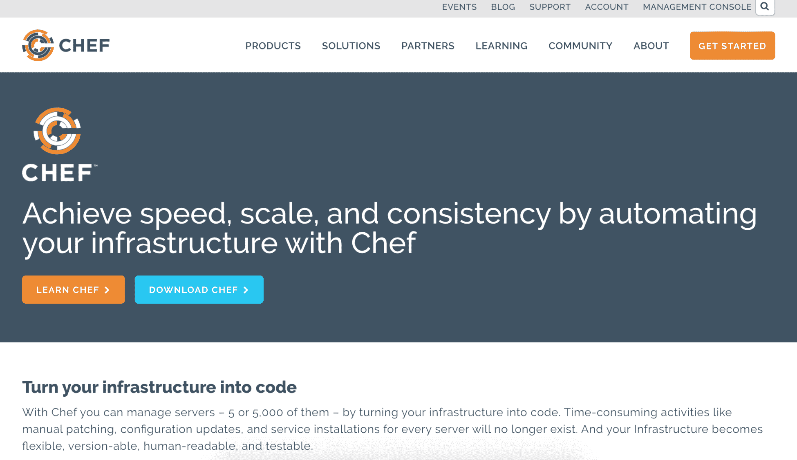

1.  Chef 有一套非常好的教程，可以让您动手实践。这些教程以每次 10 到 15 分钟的迷你教程形式组织，易于消化。请访问[`learn.chef.io/`](https://learn.chef.io/)来获取这些教程：


1.  要开始进行基础设施规划和编排，您可以参考 Chef 的文档：[`docs.chef.io/`](https://docs.chef.io/)。页面如下所示：

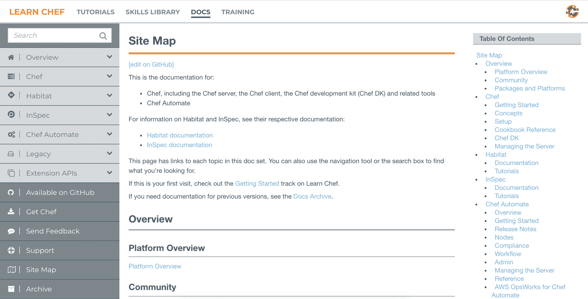

1.  您可以参考文档中的 AWS Driver Resources 页面，了解如何通过 Chef 与各种 AWS 服务进行交互：[`docs.chef.io/provisioning_aws.html`](https://docs.chef.io/provisioning_aws.html)。页面如下所示：

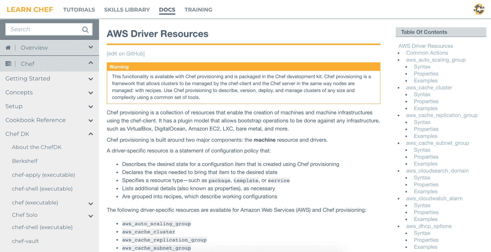

1.  您还可以参考 aws Cookbook 来达到同样的目的。这个资源有非常好的文档和 API，可以与多个 AWS 服务进行交互。这个文档的 URL 是[`supermarket.chef.io/cookbooks/aws`](https://supermarket.chef.io/cookbooks/aws)。页面如下所示：

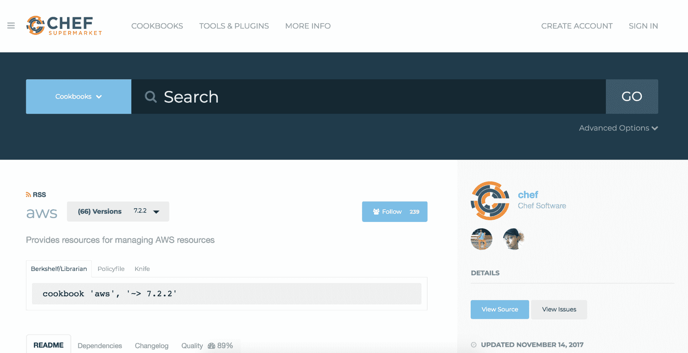

1.  当您向下滚动后，可以看到对 cookbook 的详细描述，直接在 cookbook 的标题之后。

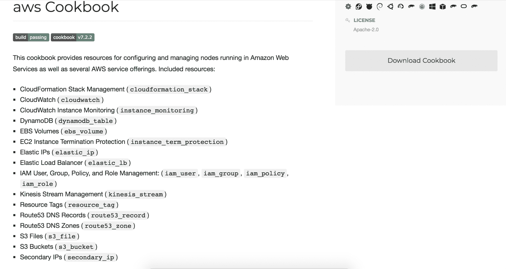

1.  另一个用于规划和编排软件资源的好工具是 Ansible。这有助于软件工程师通过 yaml 脚本自动化基础设施的多个部分。与 Chef 环境类似，这些脚本被称为**cookbooks**。

1.  我们将在随后的章节中使用这个工具来学习如何规划我们的基础设施。Ansible 的文档可以在[`docs.ansible.com/`](http://docs.ansible.com/)找到：

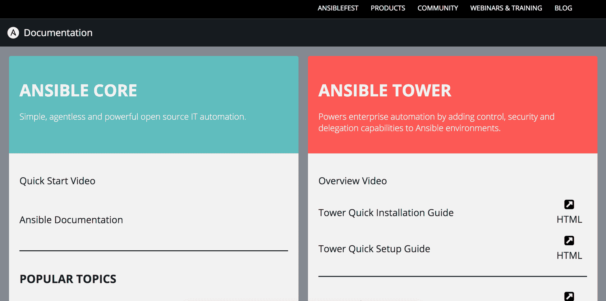

1.  产品 ANSIBLE TOWER 超出了本书的范围。我们将学习并使用 ANSIBLE CORE，这是 Ansible 及其母公司 Red Hat 的旗舰产品。

1.  Ansible 有一个非常有用的视频，可以帮助您更好地理解和使用该工具。您可以在文档页面上单击快速入门视频链接来访问：

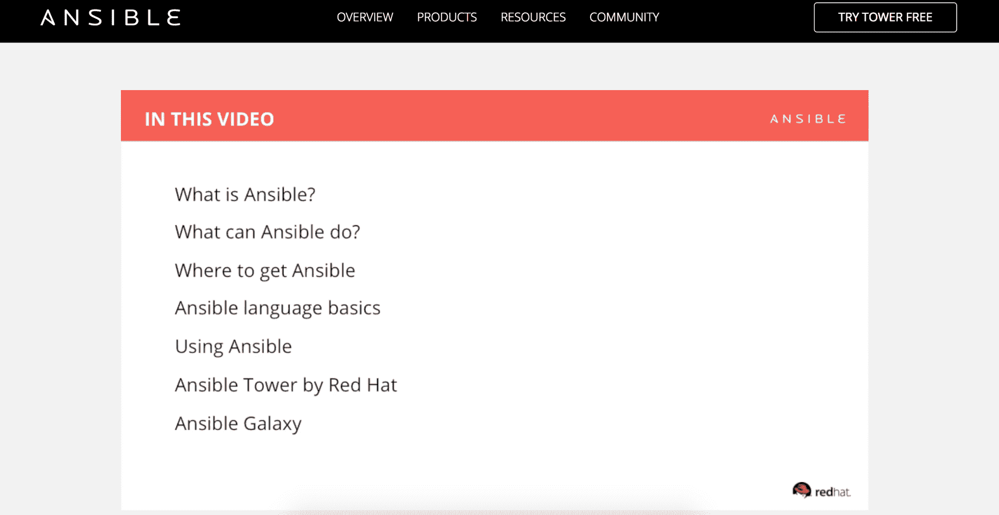

1.  观看视频后，您可以继续从文档本身了解产品。可以在以下网址访问 Ansible 的完整文档：[`docs.ansible.com/ansible/latest/index.html`](http://docs.ansible.com/ansible/latest/index.html)：

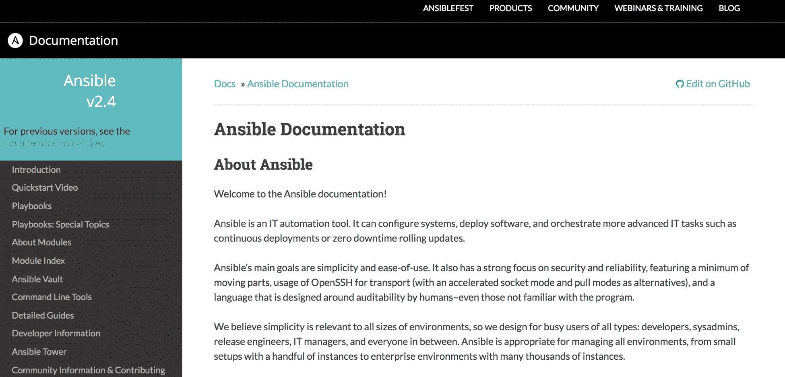

1.  EC2 模块是我们将用于配置和编排 AWS EC2 实例的模块。该部分文档非常清晰地解释了如何启动和终止 EC2 实例，以及如何添加和挂载卷；它还使我们能够将我们的 EC2 实例配置到我们自己特定的**虚拟私有云**（**VPC**）和/或我们自己的**安全组**（**SGs**）中。EC2 文档屏幕如下所示：

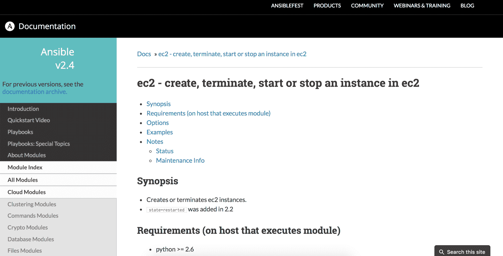

1.  您可以在 Ansible Core 文档的以下 URL 找到：[`docs.ansible.com/ansible/latest/ec2_module.html`](http://docs.ansible.com/ansible/latest/ec2_module.html)。向下滚动后，您可以看到如何使用 Ansible 的 EC2 模块来处理 AWS EC2 实例的各种任务的几个示例。其中一些如下所示：

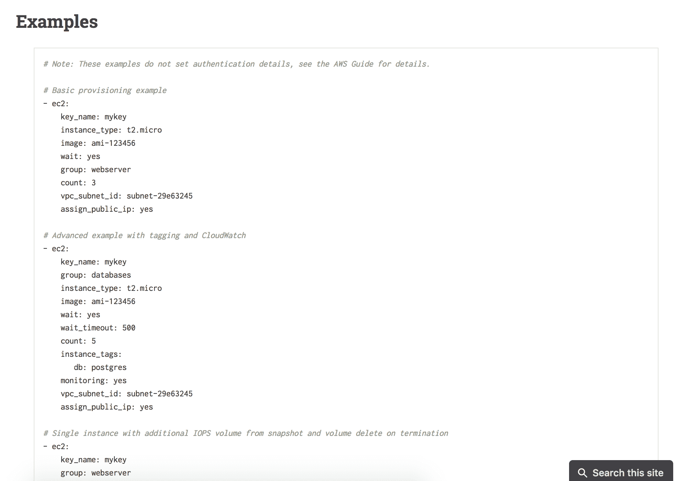

# 服务器的创建和终止

在本章中，我们将学习如何使用一些第三方工具来帮助我们构建所需的架构。与本章中的所有部分一样，信息将被分解为步骤：

1.  我们将学习的第一个工具是 Ansible。它是一个配置和编排工具，可以帮助自动化基础架构的多个部分。根据您阅读本书的时间，Ansible 项目的主页（[`www.ansible.com/`](https://www.ansible.com/)）将看起来像这样：

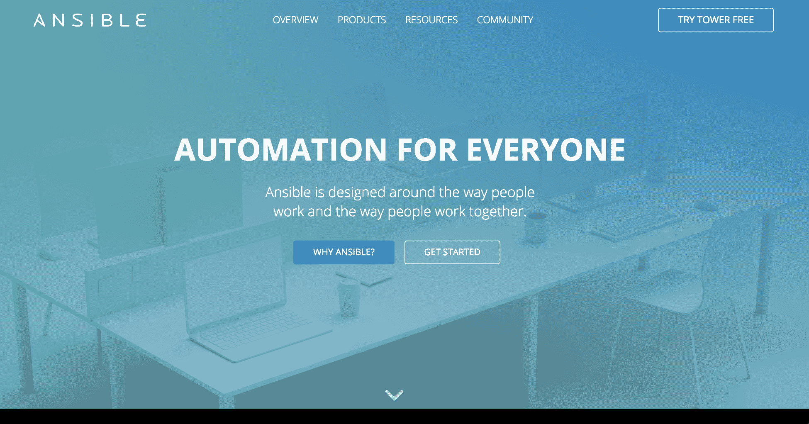

1.  Ansible 的安装过程因不同操作系统而异。一些流行操作系统的说明如下：

+   +   **对于 Ubuntu**：

```py
sudo apt-get update
sudo apt-get install software-properties-common
sudo apt-add-repository ppa:ansible/ansible
sudo apt-get update
sudo apt-get install ansible
```

+   +   **对于 Linux**：

```py
git clone https://github.com/ansible/ansible.git
cd ./ansible
make rpm
sudo rpm -Uvh ./rpm-build/ansible-*.noarch.rpm
```

+   +   **对于 OS X**：

```py
sudo pip install ansible
```

1.  现在，我们将了解**nohup**的概念。因此，您不需要对服务器进行持久的 SSH 连接来运行`nohup`命令，因此我们将使用这种技术来运行我们的主-服务器架构（要了解更多关于 nohup 的信息，请参考：[`en.wikipedia.org/wiki/Nohup`](https://en.wikipedia.org/wiki/Nohup)）。

让我们来看看维基百科上对其的定义（在撰写本书时），**nohup**是一个忽略**HUP**（挂起）信号的**POSIX**命令。**HUP**信号是终端警告依赖进程注销的方式。

1.  现在，我们将学习如何从 Ansible 中配置服务器，通过 SSH 连接到它们，在其中运行简单的`apt-get update`任务，并终止它们。通过这个，您将学习如何编写 Ansible 脚本，以及了解 Ansible 如何处理云资源的配置。以下 Ansible 脚本将帮助您了解如何配置 EC2 实例：

```py
- hosts: localhost
  connection: local
  remote_user: test
  gather_facts: no

  environment:
    AWS_ACCESS_KEY_ID: "{{ aws_id }}"
    AWS_SECRET_ACCESS_KEY: "{{ aws_key }}"

    AWS_DEFAULT_REGION: "{{ aws_region }}"

  tasks: 
- name: Provisioning EC2 instaces 
  ec2: 
    assign_public_ip: no
    aws_access_key: "{{ access_key }}"
    aws_secret_key: "{{ secret_key }}"
    region: "{{ aws_region }}"
    image: "{{ image_instance }}"
    instance_type: "{{ instance_type }}"
    key_name: "{{ ssh_keyname }}"
    state: present
    group_id: "{{ security_group }}"
    vpc_subnet_id: "{{ subnet }}"
    instance_profile_name: "{{ Profile_Name }}"
    wait: true
    instance_tags: 
      Name: "{{ Instance_Name }}" 
    delete_on_termination: yes
    register: ec2 
    ignore_errors: True
```

`{{ }}`括号中的值需要根据您的方便和规格填写。上述代码将根据`{{ Instance_Name }}`部分的规格在您的控制台中创建一个 EC2 实例并命名它。

1.  `ansible.cfg`文件应包括所有关于控制路径、有关转发代理的详细信息，以及 EC2 实例密钥的路径。`ansible.cfg`文件应如下所示：

```py
[ssh_connection]
ssh_args=-o ControlMaster=auto -o ControlPersist=60s -o ControlPath=/tmp/ansible-ssh-%h-%p-%r -o ForwardAgent=yes

[defaults]
private_key_file=/path/to/key/key.pem
```

1.  当您使用`ansible-playbook -vvv < playbook 名称 >.yml`执行此代码时，您可以在 EC2 控制台中看到 EC2 实例被创建：

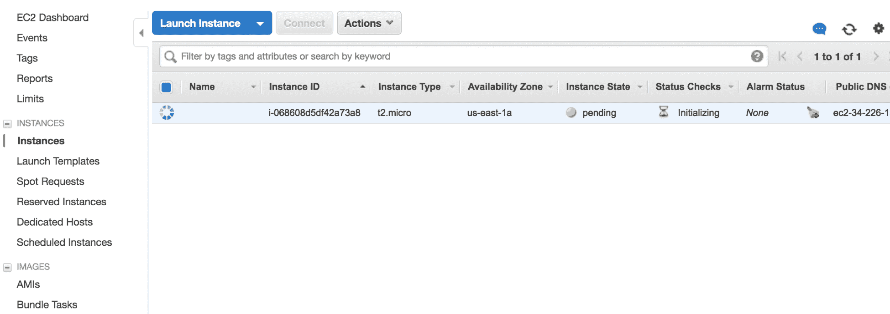

1.  现在，我们将终止通过 Ansible 刚刚创建的实例。这也将在一个类似于我们提供实例的 Ansible 脚本中完成。以下代码执行此操作：

```py
  tasks:
    - name: Terminate instances that were previously launched
      connection: local
      become: false
      ec2:
        state: 'absent'
        instance_ids: '{{ ec2.instance_ids }}'
        region: '{{ aws_region }}'
      register: TerminateWorker
      ignore_errors: True
```

1.  现在，您可以在控制台中看到实例被终止。请注意，直到任务（例如提供和终止实例）的代码都是相同的，因此您可以从提供任务中复制并粘贴：

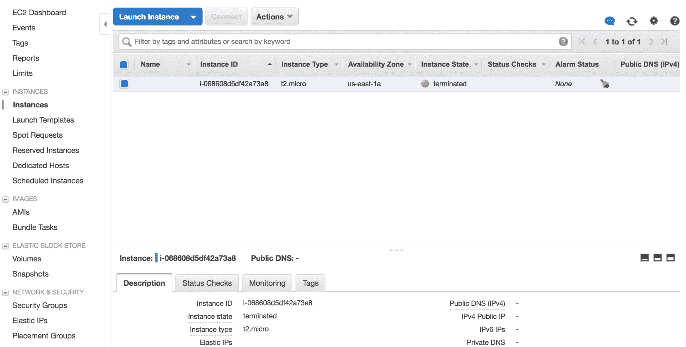

因此，我们已成功学习了如何通过 Ansible 脚本提供和终止 EC2 实例。我们将使用这些知识进行提供，并将同时终止 EC2 实例。

1.  通过对我们之前使用的 yaml 脚本中的提供代码进行小的更改，我们可以通过简单添加`count`参数来同时提供多个服务器（EC2 实例）。以下代码将根据*jinja 模板*中指定的实例数量提供实例，旁边是`count`参数。在我们的示例中，它是`ninstances`：

```py
- hosts: localhost
  connection: local
  remote_user: test
  gather_facts: no

  environment:
    AWS_ACCESS_KEY_ID: "{{ aws_id }}"
    AWS_SECRET_ACCESS_KEY: "{{ aws_key }}"

    AWS_DEFAULT_REGION: "{{ aws_region }}"

  tasks: 
- name: Provisioning EC2 instaces 
  ec2: 
    assign_public_ip: no
    aws_access_key: "{{ access_key }}"
    aws_secret_key: "{{ secret_key }}"
    region: "{{ aws_region }}"
    image: "{{ image_instance }}"
    instance_type: "{{ instance_type }}"
    key_name: "{{ ssh_keyname }}"
    count: "{{ ninstances }}"
    state: present
    group_id: "{{ security_group }}"
    vpc_subnet_id: "{{ subnet }}"
    instance_profile_name: "{{ Profile_Name }}"
    wait: true
    instance_tags: 
      Name: "{{ Instance_Name }}" 
    delete_on_termination: yes
    register: ec2 
```

1.  现在，我们的 Ansible 脚本已经准备好了，我们将使用它来从 Lambda 函数启动我们的基础架构。为此，我们将利用我们对 nohup 的知识。

1.  在 Lambda 函数中，您只需要编写创建服务器的逻辑，然后使用库`paramiko`进行一些基本安装，然后以 nohup 模式运行 Ansible 脚本，如下所示：

```py
import paramiko
import boto3
import logging

logger = logging.getLogger(__name__)
logger.setLevel(logging.CRITICAL)
region = 'us-east-1'
image = 'ami-<>'
ubuntu_image = 'ami-<>'
keyname = '<>'

def lambda_handler(event, context):
    credentials = {<>}
    k = paramiko.RSAKey.from_private_key_file("<>")
        c = paramiko.SSHClient()
    c.set_missing_host_key_policy(paramiko.AutoAddPolicy())
    logging.critical("Creating Session")
    session = boto3.Session(credentials['AccessKeyId'], 
    credentials['SecretAccessKey'],
    aws_session_token=credentials['SessionToken'], region_name=region)
    logging.critical("Created Session")
    logging.critical("Create Resource")
    ec2 = session.resource('ec2', region_name=region)
    logging.critical("Created Resource")
    logging.critical("Key Verification")

    key = '<>'
    k = paramiko.RSAKey.from_private_key_file(key)
    c = paramiko.SSHClient()
    c.set_missing_host_key_policy(paramiko.AutoAddPolicy())
    logging.critical("Key Verification done")
    # Generate Presigned URL for downloading EC2 key from    an S3 bucket into master
    s3client = session.client('s3')

# Presigned url for downloading pem file of the server from an S3 bucket
    url = s3client.generate_presigned_url('get_object',     Params={'Bucket': '<bucket_name>', 'Key': '<file_name_of_key>'},
ExpiresIn=300)
    command = 'wget ' + '-O <>.pem ' + "'" + url + "'"
    logging.critical("Create Instance")

while True:
    try:
        logging.critical("Trying")
        c.connect(hostname=dns_name, username="ubuntu", pkey=k)
    except:
        logging.critical("Failed")
    continue
        break
    logging.critical("connected")

    if size == 0:
        s3client.upload_file('<>.pem', '<bucket_name>', '<>.pem')
    else:
        pass
    set_key = credentials['AccessKeyId']
    set_secret = credentials['SecretAccessKey']
    set_token = credentials['SessionToken']

# Commands to run inside the SSH session of the server
    commands = [command,
"sudo apt-get -y update",
"sudo apt-add-repository -y ppa:ansible/ansible",
"sudo apt-get -y update",
"sudo apt-get install -y ansible python-pip git awscli",
"sudo pip install boto markupsafe boto3 python-dateutil     futures",
"ssh-keyscan -H github.com >> ~/.ssh/known_hosts",
"git clone <repository where your ansible script is> /home/ubuntu/<>/",
"chmod 400 <>.pem",
"cd <>/<>/; pwd ; nohup ansible-playbook -vvv provision.yml > ansible.out 2> ansible.err < /dev/null &"]

# Running the commands
    for command in commands:
        logging.critical("Executing %s", command)
stdin, stdout, stderr = c.exec_command(command)
    logging.critical(stdout.read())
    logging.critical("Errors : %s", stderr.read())
        c.close()
    return dns_name
```

# 安全最佳实践

确保高级别安全始终是微服务的主要问题。在设计安全层时，您需要牢记多个软件层次。工程师需要为每个服务定义安全协议，然后还需要定义每个服务之间的数据交互和传输的协议。

在设计分布式无服务器系统时，必须牢记所有这些方面，其中（几乎）每个 Ansible 任务都是一个微服务。在本节中，我们将了解如何设计安全协议，并使用一些 AWS 内置服务对其进行监视。

我们将逐步了解如何为我们的无服务器架构编写安全协议：

1.  首先，每当您在 AWS Python 脚本中使用**Boto**创建会话时，请尝试使用**AWS 安全令牌服务**（**STS**）创建特定时间段的临时凭证：

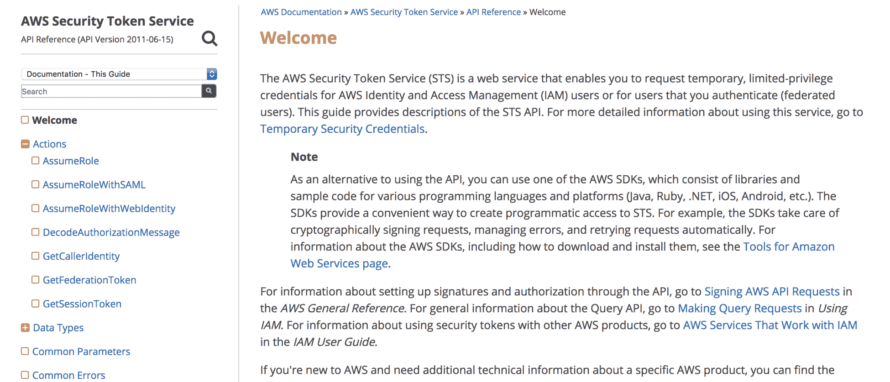

您可以查看 STS 的文档：[`docs.aws.amazon.com/STS/latest/APIReference/Welcome.html`](https://docs.aws.amazon.com/STS/latest/APIReference/Welcome.html)。

1.  STS 服务的 AssumeRole API 使程序员能够在其代码中扮演 IAM 角色：

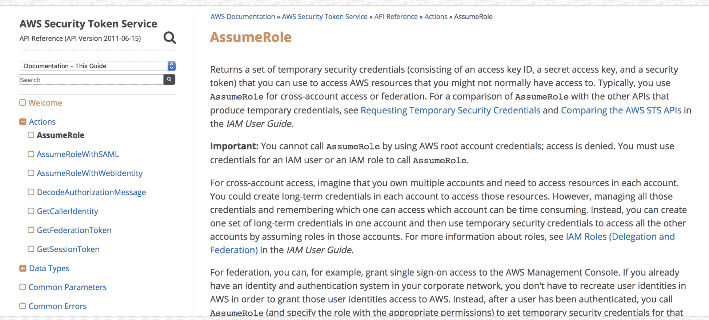

您可以在以下页面找到其文档：[`docs.aws.amazon.com/STS/latest/APIReference/API_AssumeRole.html`](https://docs.aws.amazon.com/STS/latest/APIReference/API_AssumeRole.html)

1.  可以在`boto3`文档中查看其 Python 版本：

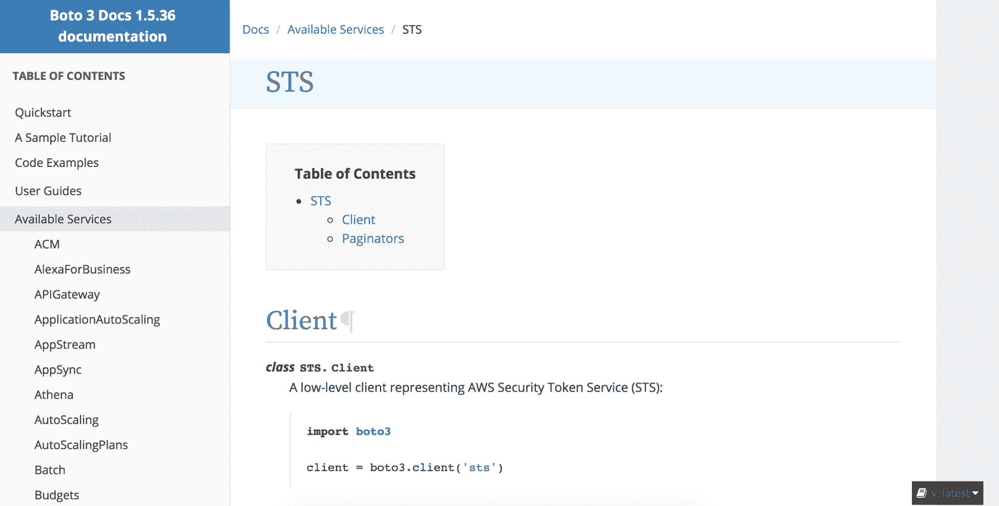

此文档可以在此处找到：[`boto3.readthedocs.io/en/latest/reference/services/sts.html`](http://boto3.readthedocs.io/en/latest/reference/services/sts.html)。

1.  向下滚动，您可以在 Python 中找到 AssumeRole API 的用法：

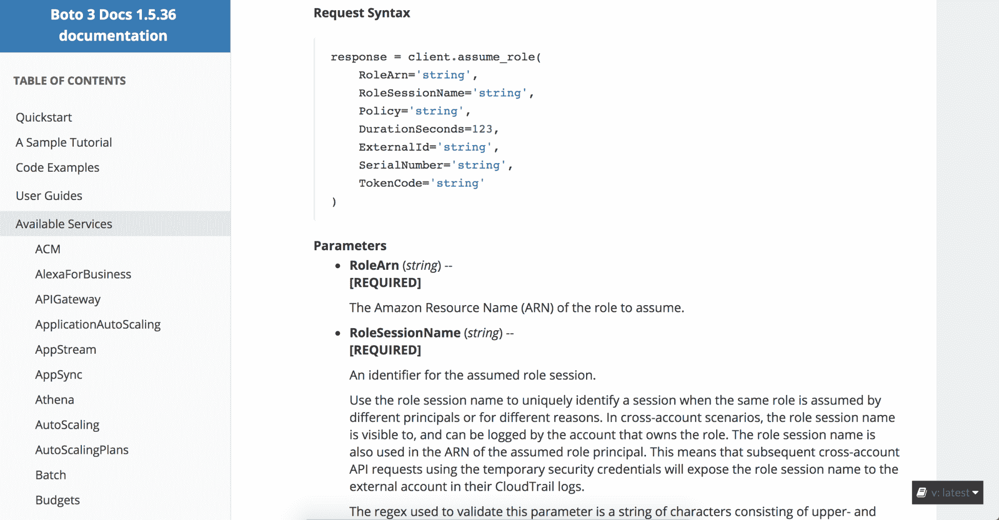

1.  必须小心确保微服务之间和/或微服务与其他 AWS 资源之间的数据交换在进行身份验证的情况下安全进行。例如，开发人员可以配置 S3 存储桶以限制诸如未加密上传、下载和不安全文件传输等操作。存储桶策略可以编写如下以确保所有这些事项得到处理：

```py
{
    "Version": "2012-10-17",
    "Id": "PutObjPolicy",
    "Statement": [
    {
        "Sid": "DenyIncorrectEncryptionHeader",
        "Effect": "Deny",
        "Principal": "*",
        "Action": "s3:PutObject",
        "Resource": "arn:aws:s3:::<bucket_name>/*",
        "Condition": {
            "StringNotEquals": {
                "s3:x-amz-server-side-encryption": "aws:kms"
            }
        }
    },
    {
        "Sid": "DenyUnEncryptedObjectUploads",
        "Effect": "Deny",
        "Principal": "*",
        "Action": "s3:PutObject",
        "Resource": "arn:aws:s3:::<bucket_name2>/*",
        "Condition": {
            "Null": {
                "s3:x-amz-server-side-encryption": "true"
            }
        }
    },
    {
        "Sid": "DenyNonSecureTraffic",
        "Effect": "Deny",
        "Principal": "*",
        "Action": "s3:*",
        "Resource": "arn:aws:s3:::<bucket_name>/*",
        "Condition": {
            "Bool": {
                "aws:SecureTransport": "false"
            }
        }
    },
    {
        "Sid": "DenyNonSecureTraffic",
        "Effect": "Deny",
        "Principal": "*",
        "Action": "s3:*",
        "Resource": "arn:aws:s3:::<bucket_name2>/*",
        "Condition": {
            "Bool": {
                "aws:SecureTransport": "false"
            }
        }
    }
]
}
```

1.  完成编写存储桶策略后，您可以在 S3 的 Bucket Policy 部分中更新它：

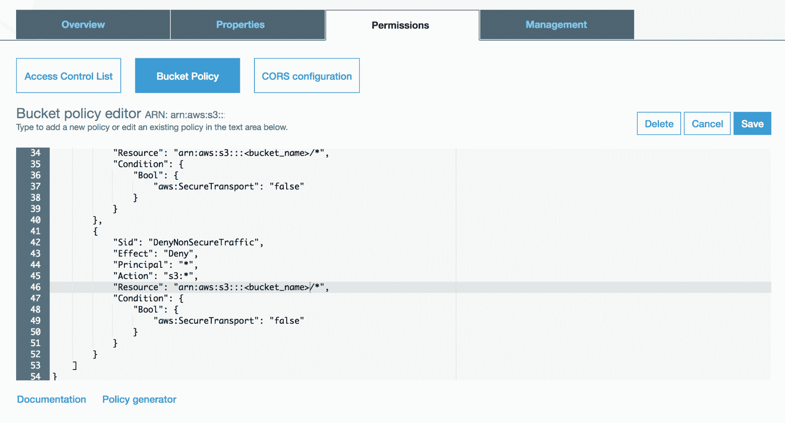

1.  AWS Config 提供了一个非常有用的界面，用于监控多种安全威胁，并帮助有效地避免或捕捉它们。AWS Config 的仪表板如下所示：

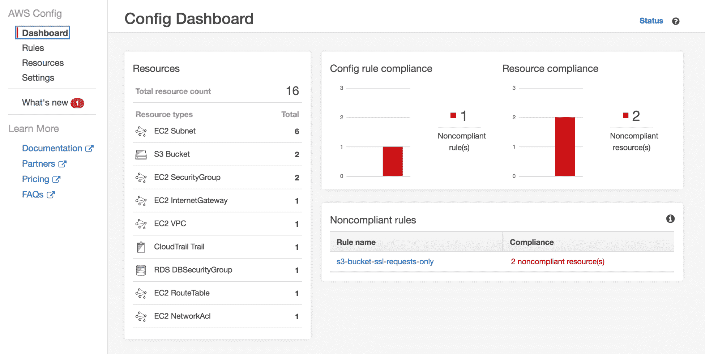

1.  您可以看到仪表板显示了 2 个不符合规定的资源，这意味着我的两个 AWS 资源不符合我在配置中设置的规则。让我们看看这些规则：

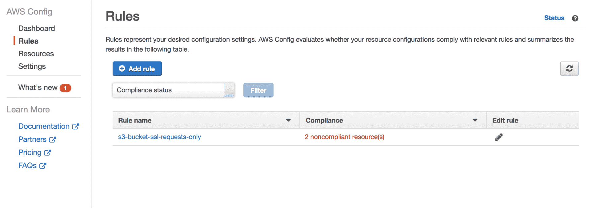

这意味着我们有两个 AWS S3 存储桶，这些存储桶没有通过存储桶策略打开 SSL 请求。单击“规则”链接后，您可以看到更多详细信息，包括存储桶名称，以及记录这些配置更改的时间戳：

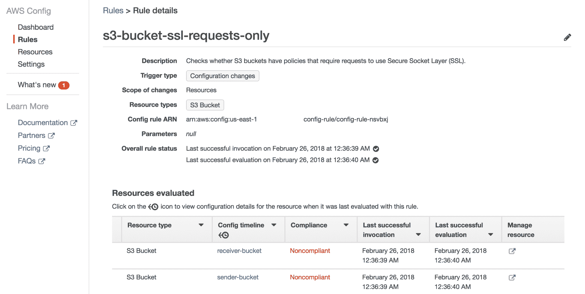

# 识别和处理扩展中的困难

扩展分布式无服务器系统会遇到一系列工程障碍和问题，事实上，无服务器系统的概念仍处于非常幼稚的阶段，这意味着大多数问题仍未解决。但是，这不应该阻止我们尝试解决和克服这些障碍。

我们将尝试了解一些这些障碍，并学习如何解决或克服它们，如下所述：

+   这更多是架构师的错误，而不是障碍。然而，重要的是要将其视为一个障碍，因为太多的架构师/软件工程师陷入了高估或低估的陷阱。我们将尝试解决的问题是在扩展时必须启动的确切实例数量。在大多数自托管的 MapReduce 风格系统中，这是开箱即用的。

+   通过在不同类型的实例上事先对工作负载进行适当的基准测试，并相应地进行扩展，可以解决这个问题。让我们通过以机器学习管道为例来理解这一点。由于我们的基准测试工作，我们已经知道*m3.medium*实例可以在 10 分钟内处理 100 个文件。因此，如果我的工作负载有 202 个文件，并且我希望在接近 10 分钟内完成，我希望有两个这样的实例来处理这个工作负载。即使我们事先不知道工作负载，我们也可以编写一个 Python 脚本，从数据存储中获取该数字，无论是 SQS 队列指针、S3 还是其他数据库；然后将该数字输入到 Ansible 脚本中，并运行 playbook。

+   由于我们已经了解了如何处理大型无服务器系统中的安全性，我们将简要介绍一下。在大型分布式无服务器工作负载中会发生多个复杂的数据移动。使用适当的安全协议并监控它们，如前面安全部分中详细提到的，将有助于克服这个问题。

+   日志记录是分布式无服务器系统中的一个主要问题，也是一个尚未完全解决的问题。由于系统和容器在工作负载完成后被销毁，日志记录一直是一项非常困难的任务。您可以通过几种方式记录工作流程。最流行的方法是分别记录每个 Ansible 任务，还有一个是最后一个 Ansible 任务是将日志打包并将压缩文件发送到数据存储，如 S3 或 Logstash。最后一种方法是最受欢迎的，因为它更好地捕获了执行流程，整个日志跟踪都在一个文件中。

+   监控类似于日志记录。监控这些系统也大多是一个未解决的问题。由于服务器在工作负载运行后全部终止，我们无法从服务器中轮询历史日志，并且延迟也不会被容忍，或者更准确地说，不可能。通过在每个任务后执行一个任务，根据前一个任务是否成功执行发送自定义指标到 CloudWatch 来监视 Ansible 的每个任务。这将看起来像这样：

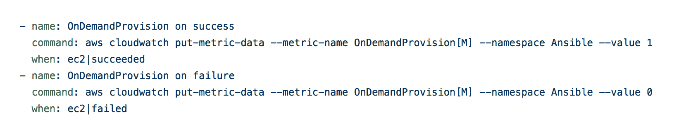

+   调试试运行也可能变得非常令人沮丧，非常快。这是因为，如果你不够快，整个系统可能在你甚至没有机会查看日志之前就被终止。此外，在调试时，Ansible 会发出非常冗长的日志，当生成多个实例时可能会显得很压倒。

+   一些基本的 Unix 技巧可以帮助处理这些问题。最重要的是监视日志文件的末尾，大约 50 行左右。这有助于不被大量日志所压倒，也可以监视 Ansible 笔记本的执行情况。

# 总结

在本章中，我们学习了如何将我们的无服务器架构扩展到大规模分布式的无服务器基础设施。我们学会了如何在现有的 Lambda 基础设施的基础上处理大量工作负载。

我们学会了使用 nohup 的概念，将我们的 Lambda 函数用作构建主-工作者架构的启动板，以考虑并行计算。我们学会了如何利用配置和编排工具，如 Ansible 和 Chef，来生成和编排多个 EC2 实例。

从本章中获得的知识将为构建许多复杂的基础设施打开大门，这些基础设施可以处理数据和请求，无论是在大小还是速度上。这将使您能够操作多个微服务紧密相互交织在一起。这也将帮助您构建类似 MapReduce 的系统，并与其他 AWS 服务无缝交互。
