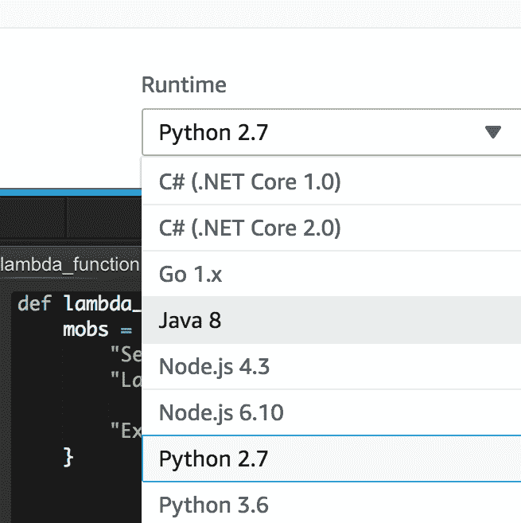
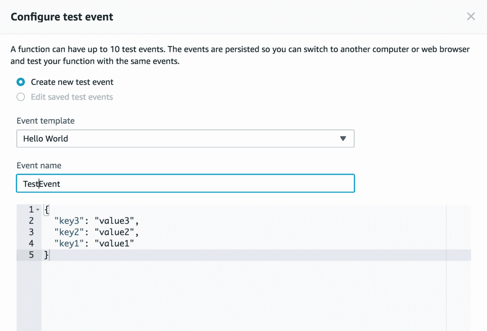
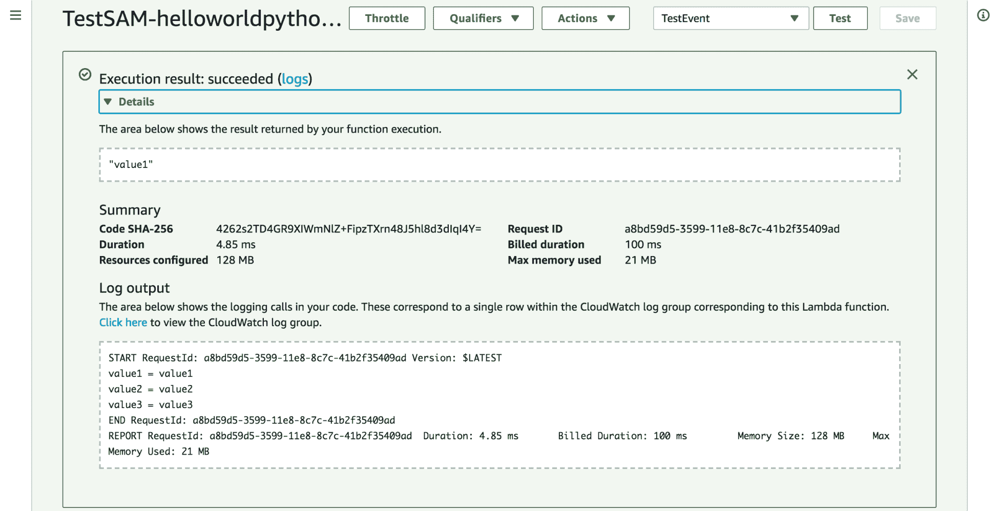
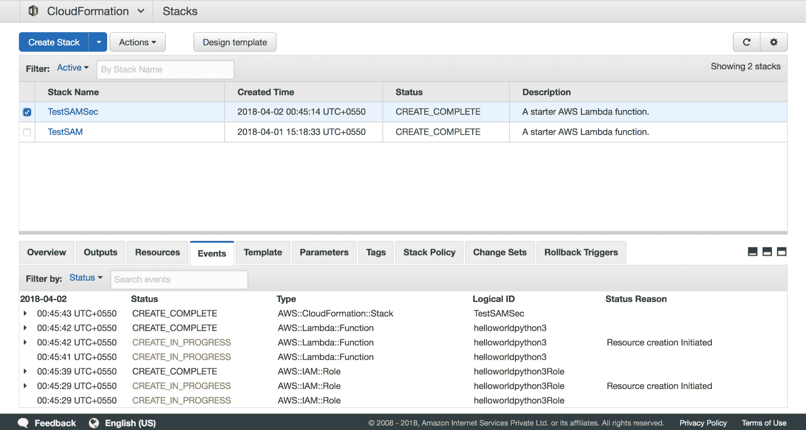
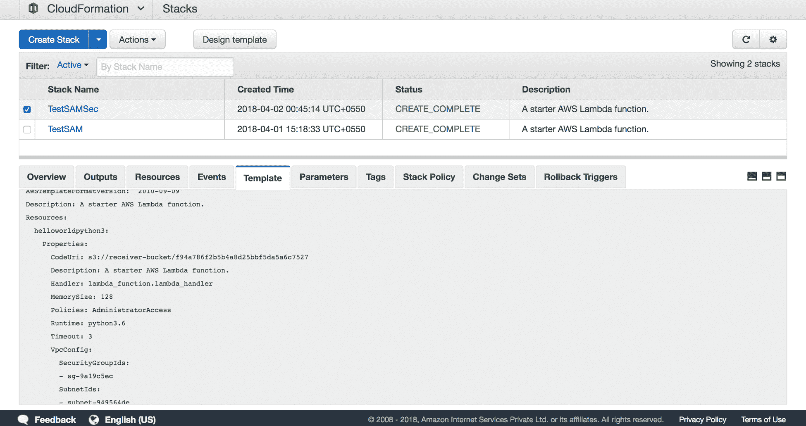

# 第八章：使用 SAM 部署 Lambda 函数

到目前为止，我们已经学习了 Lambda 函数以及如何构建它们。我们已经了解到 Lambda 函数具有一组明确定义的触发器，这些触发器将触发函数执行特定任务。该任务被编写为 Python 模块，脚本就是我们所谓的函数。我们还了解了 Lambda 函数的不同设置，包括其核心设置以及其他设置，例如安全性和网络。

还有另一种创建和部署 Lambda 函数的替代方法，即**AWS 无服务器应用程序模型**（**AWS SAM**）。这种格式基于**基础设施即代码**的概念。这个概念受到了**AWS CloudFormation**的启发，它是一种基础设施即代码的形式。

我们将学习关于 AWS CloudFormation，并利用这些知识来理解和构建 AWS SAM 模型，以创建 Lambda 函数。在本章中，我们将涵盖以下概念：

+   部署 Lambda 函数

+   使用 CloudFormation 进行无服务器服务

+   使用 SAM 进行部署

+   SAM 中的安全性理解

# SAM 简介

在本节中，我们将学习有关 SAM 的知识，这将帮助我们构建和部署无服务器函数：

1.  如前所述，SAM 是关于编写基础设施即代码。因此，在 SAM 中，Lambda 函数将被描述为：

```py
AWSTemplateFormatVersion: '2010-09-09'
Transform: AWS::Serverless-2016-10-31
Resources:
    < Name of function >:
        Type: AWS::Serverless::Function
        Properties:
            Handler: < index.handler >
            Runtime: < runtime >
            CodeUri: < URI of the bucket >
```

1.  在这段代码中，我们输入了细节 - 函数的名称，以及我们的代码包托管在的 S3 存储桶的 URI。就像我们在 Lambda 设置中命名索引和处理程序一样，我们也需要在这里输入这些细节。`index.handler`是我们的函数代码所在的文件。`Handler`是我们 Lambda 逻辑编写的函数的名称。此外，`Runtime`是用户定义的。您可以从 AWS Lambda 支持的所有可用语言中进行选择。本书的范围仅限于 Python 语言，因此我们将坚持使用其中的一个 Python 版本：



1.  我们还可以在我们的 Lambda 函数中添加环境变量，就像这里显示的那样。这些可以非常容易地进行编辑和配置，就像我们添加、更新和/或删除代码一样，这是基础设施即代码风格构建基础设施的额外优势：

```py
AWSTemplateFormatVersion: '2010-09-09'
Transform: AWS::Serverless-2016-10-31
Resources:
    PutFunction:
        Type: AWS::Serverless::Function
        Properties:
            Handler: index.handler
            Runtime: < runtime >
            Policies: < AWSLambdaDynamoDBExecutionRole >
            CodeUri: < URI of the zipped function package >
            Environment:
                Variables:
                     TABLE_NAME: !Ref Table
DeleteFunction:
    Type: AWS::Serverless::Function
     Properties:
         Handler: index.handler
         Runtime: nodejs6.10
         Policies: AWSLambdaDynamoDBExecutionRole
          CodeUri: s3://bucketName/codepackage.zip
          Environment:
              Variables:
                  TABLE_NAME: !Ref Table
          Events:
              Stream:
                  Type: DynamoDB
                  Properties:
                      Stream: !GetAtt DynamoDBTable.StreamArn
                      BatchSize: 100
                      StartingPosition: TRIM_HORIZON
DynamoDBTable:
    Type: AWS::DynamoDB::Table
    Properties:
        AttributeDefinitions:
            - AttributeName: id
                AttributeType: S
        KeySchema:
             - AttributeName: id
                 KeyType: HASH
        ProvisionedThroughput:
              ReadCapacityUnits: 5
              WriteCapacityUnits: 5
        StreamSpecification:
              StreamViewType: streamview type
```

1.  前面的 SAM 代码调用了指向 AWS `DynamoDB`表的两个 Lambda 函数。整个 SAM 代码是一个包含几个 Lambda 函数的应用程序。您需要输入必要的细节以使其工作。`Runtime`需要使用其中一个可用的 Python 运行时进行更新。处理`DynamoDB`表的相应策略需要在`Policies`部分进行更新。`CodeUri`部分需要使用代码包的 S3 URI 进行更新。

1.  需要注意的是，对于所有 SAM，始终应包括元信息，其中包括`AWSTemplateFormatVersion`和`Transform`。这将告诉`CloudFormation`您编写的代码是 AWS SAM 代码和无服务器应用程序。这两行代码如下：

```py
AWSTemplateFormatVersion: '2010-09-09'
Transform: AWS::Serverless-2016-10-31 
```

1.  如果您的无服务器函数需要访问单个`DynamoDB`表，您可以通过 SAM 函数本身使用`SimpleTable`属性创建`DynamoDB`表。操作如下：

```py
AWSTemplateFormatVersion: '2010-09-09'
Transform: AWS::Serverless-2016-10-31
Resources:
    < TableName >:
        Type: AWS::Serverless::SimpleTable
         Properties:
             PrimaryKey:
                 Name: id
                 Type: String
             ProvisionedThroughput:
                 ReadCapacityUnits: 5
                  WriteCapacityUnits: 5
```

1.  现在，我们将学习如何创建带有触发器的 Lambda 函数。由于我们已经在示例中使用了`DynamoDB`，因此我们将在此步骤中将其用作触发器。此 SAM 代码如下所示：

```py
AWSTemplateFormatVersion: '2010-09-09'
Transform: AWS::Serverless-2016-10-31
Resources:
    < Name of the function >:
        Type: AWS::Serverless::Function
        Properties:
            Handler: index.handler
            Runtime: < runtime >
            Events:
                Stream:
                    Type: DynamoDB
                    Properties:
                        Stream: !GetAtt DynamoDBTable.StreamArn
                        BatchSize: 100
                        StartingPosition: TRIM_HORIZON
< Name of the table >:
    Type: AWS::DynamoDB::Table
    Properties:
         AttributeDefinitions:
            - AttributeName: id
                AttributeType: S
        KeySchema:
            - AttributeName: id
                KeyType: HASH
        ProvisionedThroughput:
             ReadCapacityUnits: 5
             WriteCapacityUnits: 5
```

# 无服务器服务的 CloudFormation

在本节中，我们将学习如何使用 CloudFormation 构建和部署 Lambda 函数。我们将执行以下操作：

1.  我们将为定期 ping 网站并在过程中出现任何故障时提供错误的 Lambda 函数编写一个 CloudFormation 模板。此 CloudFormation 模板如下：

```py
AWSTemplateFormatVersion: '2010-09-09'
Transform: 'AWS::Serverless-2016-10-31'
Description: 'Performs a periodic check of the given site, erroring out on test failure.'
Resources:
lambdacanary:
    Type: 'AWS::Serverless::Function'
    Properties:
        Handler: lambda_function.lambda_handler
        Runtime: python2.7
        CodeUri: .
        Description: >-
            Performs a periodic check of the given site, 
erroring out on test failure.
    MemorySize: 128
    Timeout: 10
    Events:
        Schedule1:
        Type: Schedule
        Properties:
            Schedule: rate(1 minute)
    Environment:
        Variables:
            site: 'https://www.google.com/'
            expected: Search site.
```

1.  在这个 CloudFormation 片段中有很多语法。我们现在将尝试更详细地理解它：

1.  在包含 Lambda 函数的元数据的前三行中，我们有以下一行—`Transform: 'AWS::Serverless-2016-10-31'`。这行用于定义用户将通过 CloudFormation 模板使用/访问的资源。由于我们使用了 Lambda 函数，我们将其指定为`Serverless`。

1.  我们还定义了我们的函数将使用的内存大小。这类似于我们学习如何在 Lambda 的控制台中查看和更改内存设置。

1.  `超时`是 Lambda 函数在考虑尝试失败之前可以重试的时间量。

您还可以看到，我们已经向 Lambda 函数添加了环境变量，这些变量将存储在 Lambda 容器中，并在系统需要时使用。

# 使用 SAM 进行部署

在本节中，我们将学习如何部署 SAM 应用程序。我们已经了解了 SAM 应用程序和代码的外观，所以我们将学习如何通过 AWS CloudFormation 部署它们：

1.  首先，让我们为部署目的设置本地环境，然后从`pip`安装`awscli`：


1.  接下来，您需要使用您的凭据配置您的 AWS 环境：


1.  您需要输入以下详细信息，以确保您的 AWS 环境成功配置：

+   您的 AWS 访问密钥

+   您的 AWS 秘钥

+   您想要操作的默认区域

+   您希望数据的默认输出格式

1.  现在，让我们尝试通过 SAM 部署一个简单的`Hello World` Lambda 应用程序。我们将为此准备两个代码文件。一个是 Python 文件，另一个是模板`yaml`文件。

1.  我们将使用 Python 的默认`Hello World`示例，因为我们现在试图理解 SAM 部署的工作原理，而不是过于关注代码。Python 脚本将如下所示：

```py
import json
print('Loading function')
def lambda_handler(event, context):
    #print("Received event: " + json.dumps(event, indent=2))
    print("value1 = " + event['key1'])
    print("value2 = " + event['key2'])
    print("value3 = " + event['key3'])
    return event['key1'] # Echo back the first key value
    #raise Exception('Something went wrong')
```

1.  我们也将为 SAM 函数使用一个基本的模板`yaml`文件，其唯一的作用是定义其元信息并运行先前提到的 Python 脚本。模板`yaml`文件将如下所示：

```py
AWSTemplateFormatVersion: '2010-09-09'
Transform: 'AWS::Serverless-2016-10-31'
Description: A starter AWS Lambda function.
Resources:
    helloworldpython3:
        Type: 'AWS::Serverless::Function'
        Properties:
            Handler: lambda_function.lambda_handler
            Runtime: python3.6
            CodeUri: .
            Description: A starter AWS Lambda function.
            MemorySize: 128
            Timeout: 3
```

1.  现在，我们将使用命令行打包刚刚创建的 SAM 模板。打包代码的指令如下：

```py
aws cloudformation package --template-file template.yaml --output-template-file output.yaml --s3-bucket receiver-bucket
```

您会得到以下输出：


1.  这将创建一个需要部署的输出`yaml`文件，就像前面的跟踪中提到的那样。`output.yaml`文件如下所示：

```py
AWSTemplateFormatVersion: '2010-09-09'
Description: A starter AWS Lambda function.
Resources:
    helloworldpython3:
        Properties:
            CodeUri: s3://receiver-bucket/22067de83ab3b7a12a153fbd0517d6cf
            Description: A starter AWS Lambda function.
            Handler: lambda_function.lambda_handler
            MemorySize: 128
            Runtime: python3.6
            Timeout: 3
        Type: AWS::Serverless::Function
Transform: AWS::Serverless-2016-10-31
```

1.  现在，我们已经打包了 SAM 模板，我们将立即部署它。我们将使用在打包过程中显示的跟踪中的指令进行部署。部署的指令如下：

```py
aws cloudformation deploy --template-file /Users/<path>/SAM/output.yaml --stack-name 'TestSAM' --capabilities CAPABILITY_IAM 
```

这将给出以下输出：


1.  我们可以转到 CloudFormation 控制台，查看我们刚刚部署的模板。部署的模板将看起来像这样：


1.  在这里显示的模板选项卡中，我们可以看到原始模板和处理后的模板。通过选择第一个单选按钮可以看到原始模板：


1.  通过在底部的模板选项卡下选择第二个单选按钮，可以看到处理后的模板：


1.  如果我们转到 Lambda 控制台，我们将看到通过 SAM 新创建的 Lambda 函数及其对应的名称：


1.  点击“函数”将为我们提供更多有关它的信息。它还提到了 SAM 模板和创建它的 CloudFormation 模板：


1.  让我们为 Lambda 函数创建基本测试。点击“测试”按钮即可打开测试创建控制台：



1.  现在，一旦测试用例被创建，您可以再次点击“测试”按钮。这将使用更新的测试用例运行测试。成功运行的日志将如下所示：



1.  现在，让我们逐个逐个地了解 Lambda 函数的每个组件。配置显示了我们 Lambda 函数的触发器和日志记录设置。我们正在记录 AWS 的 CloudWatch 服务：


1.  在 Lambda 控制台的“监控”选项中，我们还可以看到调用指标。我们可以看到确切的一个 Lambda 调用：


1.  您可以在“函数代码”部分看到代码文件。您可以在交互式代码编辑器的左下角看到包含`template.yaml`文件和函数代码的文件夹结构：


1.  并且在更下面，您可以看到名为`lambda:createdBy`的预先存在的环境变量，以及我们在模板中提到的超时设置。

# 了解 SAM 中的安全性

到目前为止，我们已经学会了如何使用 SAM 编写、构建、打包和部署 Lambda 函数。现在我们将了解它们内部的安全性是如何工作的：

1.  您可以滚动到 Lambda 控制台的底部，查看网络和安全设置，其中提到了 VPC 和子网的详细信息：


1.  现在，我们将添加网络设置，包括安全组和子网 ID：

```py
AWSTemplateFormatVersion: '2010-09-09'
Transform: 'AWS::Serverless-2016-10-31'
Description: A starter AWS Lambda function.
Resources:
    helloworldpython3:
        Type: 'AWS::Serverless::Function'
        Properties:
            Handler: lambda_function.lambda_handler
            Runtime: python3.6
            CodeUri: .
            Description: A starter AWS Lambda function.
            MemorySize: 128
            Timeout: 3
            VpcConfig:
                SecurityGroupIds:
                    - sg-9a19c5ec
                SubnetIds:
                    - subnet-949564de
```

1.  现在，像在上一节中那样，打包并部署新更新的 SAM 模板：


1.  现在，一旦您在对 CloudFormation 模板进行相应编辑后打包并部署了模板，您将看到相应的网络和安全设置。网络部分如下所示：


1.  您还可以在“网络设置”中看到与 VPC 相关的相应安全组的入站规则：


1.  您还可以在控制台中看到已完成的 CloudFormation 模板，其中包含更新的网络和安全设置，这意味着部署已成功：



1.  您还可以在控制台底部的“模板”选项下查看原始模板：



1.  通过在控制台底部选择“查看已处理的模板”选项，可以找到已处理的模板：


# 摘要

在本章中，我们学习了如何通过 SAM 将 Lambda 函数部署为基础设施代码，这是一种编写和部署 Lambda 函数的新方法。这使得与其他 IaaS 服务（如 CloudFormation）集成变得更容易。我们还了解了 AWS CloudFormation 服务，这是一种允许和促进基础设施代码的服务。我们还学习了 SAM 代码内部的安全性以及如何配置 VPC 和子网设置。

在下一章中，您将了解 Microsoft Azure 函数，以及配置和了解该工具的组件。
