# 第一章：无服务器微服务架构和模式

微服务架构基于服务。您可以将微服务视为 SOA 的轻量级版本，但受到更近期架构的丰富，例如事件驱动架构，其中事件被定义为感兴趣的状态变化。在本章中，您将了解单片多层架构和单片**面向服务的架构**（**SOA**）。我们将讨论这两种架构的优缺点。我们还将研究微服务的背景，以了解其增长背后的原因，并比较不同的架构。

我们将介绍设计模式和原则，并介绍无服务器微服务集成模式。然后，我们将涵盖通信样式和分解微服务模式，包括同步和异步通信。

然后，您将学习如何在 AWS 中使用无服务器计算快速部署基于事件驱动的计算和云中的微服务。我们通过设置您的无服务器 AWS 和开发环境来结束本章。

在本章中，我们将涵盖以下主题：

+   理解不同的架构类型和模式

+   虚拟机、容器和无服务器计算

+   微服务集成模式概述

+   通信样式和分解微服务模式

+   AWS 中的无服务器计算

+   设置您的无服务器环境

# 理解不同的架构类型和模式

在本节中，我们将讨论不同的架构，如单片和微服务，以及它们的优缺点。

# 单片多层架构和单片面向服务的架构

在我职业生涯的早期，当我为 Capgemini 的全球财富 500 强客户工作时，我们倾向于使用多层架构，其中您可以创建不同的物理分离层，可以独立更新和部署。例如，如下所示的三层架构图表中，您可以使用**表示**，**领域逻辑**和**数据存储**层：

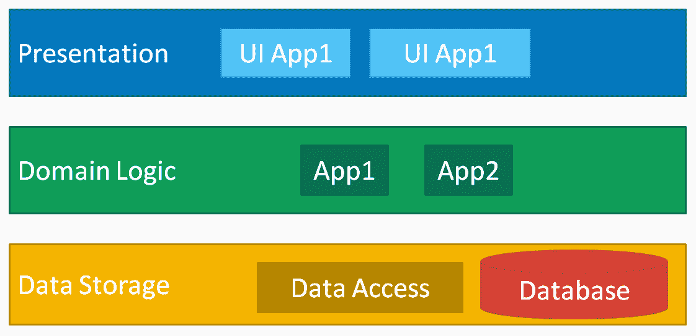

在**表示层**，您有用户界面元素和任何与表示相关的应用程序。在**领域逻辑**中，您有所有业务逻辑和与从表示层传递数据有关的任何内容。领域逻辑中的元素还涉及将数据传递给**存储或数据层**，其中包括数据访问组件和任何数据库元素或文件系统元素。例如，如果您想要将数据库技术从 SQL Server 更改为 MySQL，您只需更改数据访问组件，而不是修改表示层或领域逻辑层中的元素。这使您能够将存储类型与表示和业务逻辑解耦，从而能够更容易地通过交换数据存储层来更改数据库技术。

几年后在 Capgemini，我们使用 SOA 来实施客户项目，这比多层架构更加细粒度。基本上是有标准化的服务契约和注册表，允许自动化和抽象：

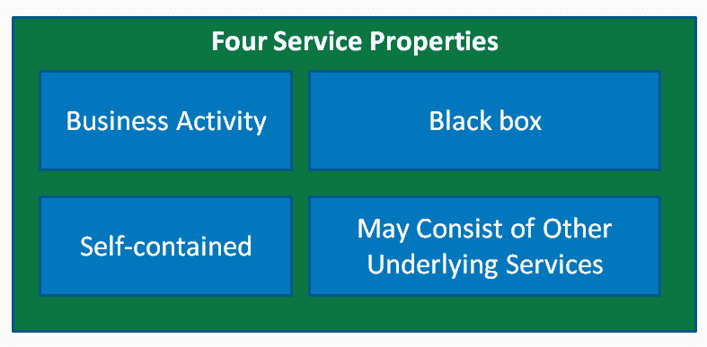

与 SOA 相关的四个重要服务属性：

+   每项服务都需要有一个与企业活动相关联的清晰业务活动。

+   使用服务的任何人都不需要了解内部工作原理。

+   所有信息和系统都是自包含的和抽象的。

+   为了支持其可组合性，服务可能由其他基础服务组成

以下是一些重要的 SOA 原则：

+   标准化

+   松散耦合的

+   摘要

+   无状态的

+   细粒度的

+   可组合的

+   可发现的

+   可重用的

第一个原则是存在**标准化**的服务合同。这基本上是在企业级别定义的通信协议，因此当您使用服务时，您确切地知道是哪个服务，传递消息的合同以及您将得到什么回报。这些服务是**松散耦合**的。这意味着它们可以自主工作，但您也可以从企业网络中的任何位置访问它们。它们还提供**抽象**版本，这意味着这些服务是一个黑匣子，内部逻辑实际上是隐藏的，但它们也可以独立于其他服务工作。

一些服务也将是**无状态**的。这意味着，如果调用一个服务，传递一个请求，您将得到一个响应，如果服务或有效负载出现问题，您还将得到一个异常。在 SOA 中，粒度也非常重要。服务的粒度需要足够小，以便不会被低效地调用或多次调用。因此，我们希望规范化服务的级别和粒度。如果某些服务被其他服务重用，可以将其分解，或者可以将服务合并并规范化以最小化冗余。服务还需要**可组合**，因此您可以将它们合并成更大的服务或将它们拆分。

有一套标准化的合同，但服务还需要**可发现**。可发现意味着有一种自动发现可用的服务、可用的端点以及解释它们的方法。最后，合理的元素，**重用**对于 SOA 非常重要，这是指逻辑可以在代码库的其他部分中重用。

# 单体架构的好处

在 SOA 中，架构是松散耦合的。企业的所有服务都在一个存储库中定义。这使我们能够清楚地看到可用的服务。此外，还有一个全局数据模型。通常，有一个数据存储库，我们在其中存储所有数据源，每个单独的服务实际上都会写入或读取它。这使得它可以在全局层面上集中。

另一个好处是通常只有少量大型服务，这些服务由明确的业务目标驱动。这使它们易于理解，并且对我们的组织来说是一致的。一般来说，服务之间的通信是通过智能管道或某种中间件解耦的。

# 单体架构的缺点

单体架构的缺点是通常只有一个技术堆栈。这意味着应用服务器、Web 服务器或数据库框架在整个企业中是一致的。过时的库和代码可能很难升级，因为这取决于单一堆栈，几乎就像所有服务都需要在相同版本的库上对齐。

另一个缺点是在单一堆栈上通常有非常庞大的代码库，这意味着构建和部署代码需要很长的时间。服务部署在单个或大型应用服务器和 Web 服务器上。这意味着，为了扩展，您需要扩展整个服务器，这意味着无法独立部署和扩展应用程序。要扩展应用程序，您需要扩展托管应用程序的 Web 应用程序或应用程序服务器。

另一个缺点是通常有一个中间件编排层或集成逻辑是集中的。例如，服务将使用**业务流程管理**（**BPM**）框架来控制工作流程，您将使用**企业服务总线**（**ESB**），它允许您在中心路由消息，或者您将有某种中间件来处理服务之间的集成。许多这些逻辑都集中在一起，当您更改该中心逻辑的配置时，您必须非常小心，以免破坏任何服务之间的通信。

# 微服务概述

微服务一词起源于 2011 年的一个研讨会，当时不同的团队描述了他们使用的一种架构风格。2012 年，Netflix 的 Adrien Cockcroft 实际上将微服务描述为一种在 Web 规模上开创的细粒度 SOA。

例如，如果我们在**物联网**（**IoT**）设备上有传感器，如果温度发生变化，我们将发出事件作为可能的下游警告。这就是所谓的**事件流处理**或**复杂事件处理**。基本上，整个架构都由事件驱动。

微服务中使用的另一种设计类型称为**领域驱动设计**（**DDD**）。这基本上是领域专家和开发人员之间有一个共同的语言。DDD 中的另一个重要组成部分是**有界上下文**，这是每个服务都依赖其边界的严格一致性模型。例如，如果这是一个处理客户开票的服务，该服务将是唯一可以处理、写入或更新客户开票的中心点和唯一位置。好处是在有界上下文之外的系统中不会有关于数据访问责任的混淆。

您可以将微服务看作是围绕着使用 JSON 标准的 REST 端点或应用程序编程接口构建的。很多逻辑可以内置到服务中。这就是所谓的**愚蠢管道**但是聪明的端点，您可以在图表中看到原因。我们有一个处理客户支持的服务，如下：

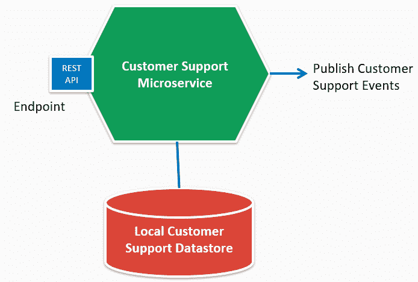

例如，端点将更新客户支持详细信息，添加新的工单，或使用特定标识符获取客户支持详细信息。我们有一个本地客户支持数据存储，因此所有关于客户支持的信息都存储在该数据存储中，您可以看到微服务发出客户支持事件。这些事件通过发布-订阅机制或使用其他发布事件框架发送出去，例如**命令查询责任分离**（**CQRS**）。您可以看到这符合有界上下文。在这个有界上下文中有一个单一的责任。因此，这个微服务控制着关于客户支持的所有信息。

# 微服务架构的优缺点

有界上下文和这是一个非常小的代码库，允许您非常频繁地构建和部署。此外，您可以独立扩展这些服务。通常每个微服务都有一个应用服务器或 Web 服务器。您可以很快地扩展它，只需针对您想要的特定服务。此外，您可以经常构建并更频繁地进行测试，并且可以使用任何类型的语言、数据库或 Web 应用程序服务器。这使其成为一个多边形系统。有界上下文非常重要，因为您可以对一个领域进行建模。功能可以非常快速地发布，因为例如，客户服务微服务实际上可以控制对数据的所有更改，因此您可以更快地部署这些组件。

然而，使用微服务架构也存在一些缺点。首先，在分布式开发和测试方面存在很多复杂性。此外，服务之间的通信更多，因此网络流量更大。延迟和网络在微服务中变得非常重要。DevOps 团队必须维护和监控从另一个服务获取响应所需的时间。此外，责任的变化是另一个复杂因素。例如，如果我们将一个有界上下文分成几种类型的子有界上下文，你需要考虑这在团队内如何运作。通常还需要一个专门的 DevOps 团队，他们基本上是为了支持和维护整个组织中更多的服务和机器。

# SOA 与微服务

现在我们对两者有了很好的理解，我们将比较 SOA 和微服务架构。在通信本身方面，SOA 和微服务都可以使用同步和异步通信。SOA 通常依赖于简单对象访问协议（SOAP）或 Web 服务。微服务倾向于更现代化，广泛使用表述状态转移（REST）API。

我们将从以下图表开始，比较 SOA 和微服务：

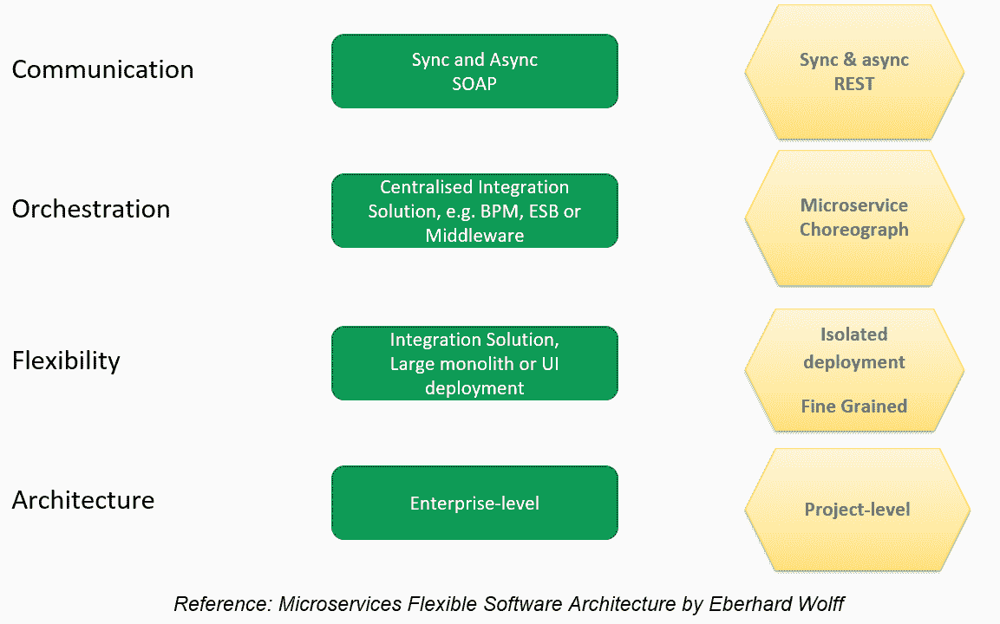

编排是一个重大的区别所在。在 SOA 中，一切都围绕着 BPM、ESB 或某种中间件集中。所有服务和数据流之间的集成都是在中央控制的。这使你可以在一个地方配置任何更改，这有一些优势。

微服务的方法是使用更基于协作的方法。这是一个个体服务更加智能，即一个智能端点但一个愚蠢的管道。这意味着服务知道要调用谁以及他们将得到什么数据，并且他们在微服务内管理这个过程。这给了我们在微服务集成方面更多的灵活性。在 SOA 世界或三层架构中，灵活性较少，因为通常是单一的代码库，集成是一组大型的单体发布和用户界面或后端服务的部署。这可能限制企业的灵活性。然而，对于微服务来说，这些系统要小得多，可以独立部署，更加细粒度。

最后，在架构方面，SOA 在企业级别运作，那里会有一个企业架构师或解决方案架构师模型和控制中央存储库中所有服务的发布。微服务更加灵活。微服务讨论的是在项目级别工作，他们说团队只由一些开发人员或非常少的开发人员组成，可以坐在一起分享披萨。因此，这使你在项目级别更加灵活地做出决策，而不必在企业级别达成一致。

# 虚拟机、容器和无服务器计算

现在我们对单体和微服务架构有了更好的理解，让我们看看用于创建无服务器微服务的亚马逊网络服务（AWS）构建模块。

但首先我们将介绍虚拟机、容器和无服务器计算，这是托管在公共云中的任何应用程序或服务的基本构建模块。

虚拟机是公共云和网络托管站点的最初提供的服务，容器是独立的轻量级镜像，无服务器计算是云提供商完全管理资源的情况。你将了解每种方法的优缺点，我们将最后进行详细比较。

# 虚拟机

在传统数据中心中，您必须购买或租赁物理机器，并具备额外的容量来处理额外的网络或用户流量。在新世界中，虚拟机是最早的公共云服务之一。您可以将其视为类似于物理盒子，您可以在其中安装操作系统，通过 SSH 或 RDP 进行远程连接，并安装应用程序和服务。我认为虚拟机一直是初创公司成功的关键构建模块之一。它使他们能够以较小的资本投资进入市场，并随着其网络流量和用户量的增加而扩展。这是以前只有大型组织才能负担得起的，因为物理硬件的大量前期成本。

虚拟机的优势在于按使用量付费、实例类型选择和动态存储分配，使您的组织完全灵活地在几分钟内租用硬件，而不是等待购买物理硬件。虚拟机还提供由云提供商管理的安全性。此外，它们提供多区域自动扩展和负载平衡，同样由云提供商管理，几乎可以通过点击按钮获得。有许多虚拟机可用，例如 Amazon EC2、Azure VM 和 Google Compute Engine。

然而，它们也有一些缺点。主要缺点是扩展需要几分钟的时间。因此，需要启动的任何机器都需要几分钟的时间，这使得在请求时几乎不可能快速扩展。在配置方面也需要一些努力，需要像 Chef 或 Puppet 这样的配置管理工具。例如，操作系统需要保持最新。

另一个缺点是您仍然需要编写逻辑来轮询或订阅其他托管服务，例如流分析服务。此外，您仍然需要支付空闲机器时间。例如，当您的服务未运行时，虚拟机仍然运行，并且即使它们没有被积极使用，您仍然需要支付时间费用。

# 容器

使用虚拟机的旧方法是在主机操作系统上部署应用程序，并使用诸如 Chef 或 Puppet 之类的配置管理工具。这样做的好处是管理应用程序构件的库和生命周期，并尝试操作特定的操作系统，无论是 Linux 还是 Windows。容器是出于这种限制而产生的，其思想是将代码和依赖项打包到一个可移植容器中，在这里您可以进行完整的操作系统级虚拟化。实际上，您可以更好地利用机器上可用的资源。

这些容器可以非常快速地启动，并且基本上是不可变的，也就是说，操作系统、库版本和配置都不能更改。基本思想是将代码和依赖项放入这个可移植容器中，并且可以通过配置在本地或服务器上重新创建环境。另一个重要方面是编排引擎。这是管理容器的关键。因此，您将有由 Kubernetes 或 Amazon EC2 容器服务（ECS）管理、部署和扩展的 Docker 镜像。

这些容器的缺点是它们通常在几秒钟内扩展，这仍然太慢了，无法实际上每个请求调用一个新容器。因此，您需要它们预热并且已经可用，这是有成本的。此外，集群和镜像配置确实需要一些 DevOps 工作。

最近，AWS 推出了 AWS Fargate 和 Elastic Kubernetes Service（EKS），这些都有助于减轻一些配置管理和支持工作，但您仍然需要一个 DevOps 团队来支持它们。

另一个缺点是与托管服务的集成工作。例如，如果您正在处理流分析服务，仍然需要编写轮询和订阅代码，将数据拉入您的应用程序或服务。

最后，与虚拟机一样，即使 Kubernetes 协助，您仍然需要支付正在运行的任何容器的费用。它们可以在 EC2 实例上运行，因此即使未使用，您仍需要支付实际机器的运行时间。

# 无服务器计算

您可以将服务计算视为专注于业务逻辑，而不是围绕服务的所有基础设施配置管理和集成。在无服务器计算中，仍然存在服务器，只是您不管理服务器本身、操作系统或硬件，所有的可伸缩性都由云提供商管理。您无法访问原始机器，也就是说，您无法 SSH 到该机器。

优势在于您可以真正专注于业务逻辑代码，而不是基础设施或入站集成代码，这是您作为组织为客户和客户添加的业务价值。

此外，安全性再次由云提供商管理，自动扩展和高可用性选项也由云提供商管理。例如，您可以根据请求的数量动态地启动更多实例。费用是按执行时间而不是按空闲时间计算。

不同的公共云无服务器提供。Google、Azure、AWS 和阿里巴巴云都有函数即服务（FaaS）的概念。这是您在函数中部署业务逻辑代码的地方，周围的一切，如安全性和可伸缩性，都由云提供商管理。

缺点是这些是无状态的，这意味着它们的寿命非常短。几分钟后，函数内部维护的任何状态都会丢失，因此必须在外部进行持久化。它不适用于长时间运行的进程。它还具有有限的实例类型和持续时间。例如，AWS Lambda 在终止之前有 15 分钟的持续时间。对于外部库的实际大小或任何自定义库，也存在限制，因为这些 Lambda 需要非常快速地启动。

# 比较虚拟机、容器和无服务器

让我们比较基础设施即服务（IaaS），容器即服务（CaaS）和函数即服务（FaaS）。将 IaaS 视为虚拟机，CaaS 视为 Docker 容器池，FaaS 的一个示例将是 Lambda 函数。这是 IaaS、CaaS 和 FaaS 之间的比较：

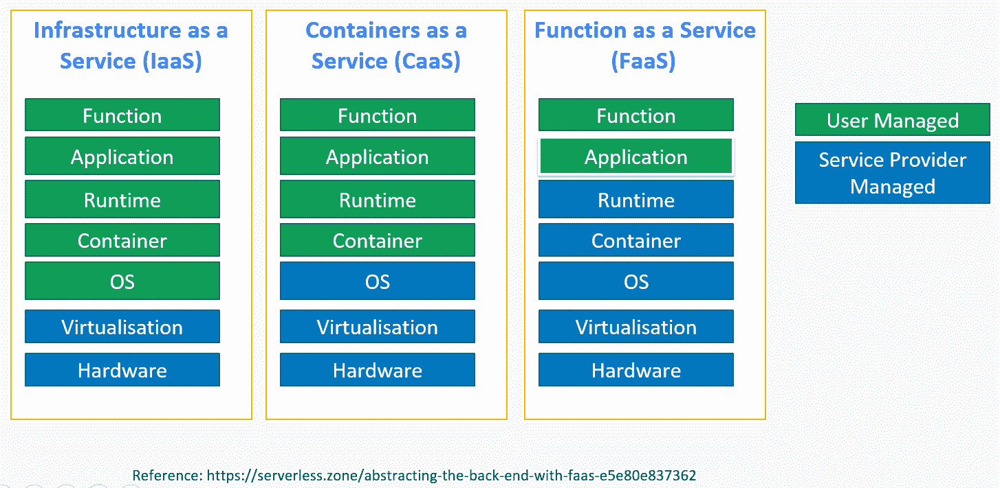

绿色元素由用户管理，蓝色元素由云服务提供商管理。因此，在左侧，您可以看到 IaaS，如虚拟机一样，用户承担了很多责任。在 CaaS 中，操作系统级由提供商管理，但您可以看到容器和运行时实际上是由用户管理的。最后，在右侧，FaaS，您可以看到核心业务逻辑代码和应用程序配置由用户管理。

那么，在 AWS 世界中，您如何在 AWS Lambda 容器和 EC2 实例之间进行选择？请查看以下图表：

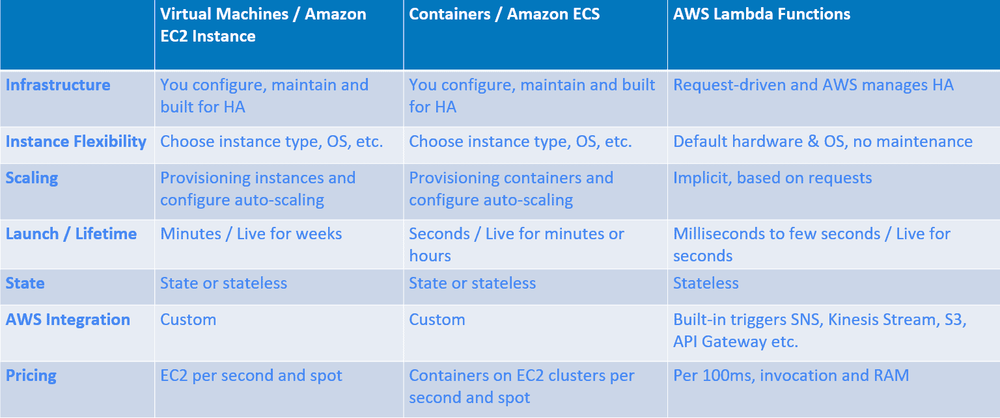

如果我们将虚拟机与容器和 Lambda 函数进行比较，您会发现在维护方面需要一些配置工作，使其具有高可用性和管理性。对于 Lambda 函数，这实际上是在预请求的基础上完成的。也就是说，它是请求驱动的。例如，如果您的网站受到更多流量的影响，AWS 将会启动更多的 Lambda 以使其高度可用（HA）。

就灵活性而言，您可以完全访问虚拟机和容器，但在 AWS Lambda 中，您只有默认的硬件、默认的操作系统，没有图形处理单元（GPU）可用。好处是您不需要对 Lambda 进行升级或维护。

就可扩展性而言，您需要提前规划虚拟机和容器。您需要预配容器或实例，并决定如何进行扩展。在 AWS Lambda 函数中，扩展是根据请求的数量或数据量隐式进行的，因为您会自然地获得更多或更少的并行执行的 Lambda 函数。

虚拟机的启动通常需要几分钟，可能会持续几周。容器可以在几秒钟内启动，并可能在几分钟或几小时内保持运行，然后被处理掉。然而，Lambda 函数可以在大约 100 毫秒内启动，并且通常会持续几秒钟或几分钟。

就状态而言，虚拟机和容器可以保持状态，即使这通常不是扩展的最佳实践。Lambda 函数始终是无状态的，当它们终止执行时，内存中的任何内容都会被处理掉，除非它在外部持久化，例如在 DynamoDB 表或 S3 存储桶中。

虚拟机和 Docker 容器需要与 AWS 服务进行自定义集成。然而，在 Lambda 函数中，事件源可以使用内置集成与其他 AWS 服务（如 Kinesis、S3 和 API Gateway）将数据推送到 Lambda 函数。您只需订阅 Lambda 事件源到 Kinesis 流，数据就会被推送到您的 Lambda 函数中，带有其业务逻辑代码，这使您能够决定如何处理和分析这些数据。然而，对于 EC2 虚拟机和 ECS 容器，您需要使用 AWS SDK 或其他方式构建自定义的入站集成逻辑。

最后，就定价而言，EC2 实例按秒计费。它们还有一个使用市场价格的竞价实例，比按需实例便宜得多。容器也是如此，只是您可以在一个 EC2 实例上运行多个容器。这样可以更好地利用资源，成本更低，因为您可以在 EC2 实例之间灵活地分配不同的容器。对于 AWS Lambda 函数，定价是按 100 毫秒、调用次数和所需的随机存取内存（RAM）计费。

# 微服务集成模式概述

在本节中，我们将讨论设计模式、设计原则，以及微服务架构模式与传统微服务模式的关系，以及如何应用于无服务器微服务。这些主题将帮助您了解不同的集成模式。

# 设计模式

模式是可重复使用的蓝图，是其他人面临类似问题的解决方案，已经在各种生产环境中得到广泛审查、测试和部署。

遵循这些模式意味着您将受益于最佳实践和技术人员的智慧。您还将与其他开发人员或架构师说同样的语言，这使您能够更快地交换想法，更轻松地与其他系统集成，并更有效地进行员工交接。

# 模式为什么有用？

有用的应用几乎从不孤立存在。它们几乎总是集成在更广泛的生态系统中，这对于微服务来说尤其如此。换句话说，集成规范和要求需要被其他开发人员和架构师沟通和理解。

使用模式时，您有一个在技术人员中间通用的语言，使您能够被理解。这实际上是更好地协作，与其他人合作，交换想法，解决问题。

模式的主要目的是在实现新服务时节省时间和精力，因为您有一个标准的术语和蓝图来构建东西。在某些情况下，它们可以帮助您避免陷阱，因为您可以从他人的经验中学习，并应用最佳实践、软件、设计模式和原则。

# 软件设计模式和原则

您可能会在您的微服务或 Lambda 代码中使用面向对象（OO）或函数式编程，因此让我们简要讨论与它们相关的模式。

在面向对象编程中，编码时可以使用许多最佳实践模式或原则，例如 GRASP 或 SOLID。我不会深入讨论，因为这需要一整本书，但我想强调一些对微服务很重要的原则：

+   SOLID：这有五个原则。一个例子是单一责任原则（SRP），其中您定义每个都有单一责任和因此单一变更原因的类，减少服务的大小并增加其稳定性。

+   包内聚性：例如，共同的闭包原则类一起变化。因此，当业务规则发生变化时，开发人员只需要在少量的包中更改代码。

+   包耦合：例如，无环依赖原则，它规定包或组件的依赖图不应该有循环。

让我们简要地介绍一些微服务的有用设计模式：

+   创建模式：例如，工厂方法创建多个派生类的实例。

+   结构模式：例如，装饰器动态地为对象添加额外的责任。

+   行为模式：例如，命令模式将请求封装为对象，使得提取参数、排队和记录请求更容易。基本上，您将创建命令的参数与执行命令的参数解耦。

+   并发模式：例如，反应器对象为必须同步处理的资源提供了异步接口。

根据您的编码经验，您可能熟悉这些。如果不熟悉，值得阅读以提高代码的可读性、管理性和稳定性，以及您的生产力。以下是一些参考资料，您可以在其中了解更多：

+   《SOLID 面向对象设计》，Sandi Metz（2009）

+   《设计模式：可复用的面向对象软件元素》，Erich Gamma，Richard Helm，Ralph Johnson，John Vlissides（1995）

+   《Head First 设计模式》，Eric T Freeman，Elisabeth Robson，Bert Bates，Kathy Sierra（2004）

+   《敏捷软件开发，原则，模式和实践》，Robert C. Martin（2002）

# 无服务器微服务模式类别

除了我们刚刚讨论的软件设计模式和原则之外，还有微服务模式。根据我的经验，有许多我推荐的与无服务器微服务相关的微服务模式，如下图所示：

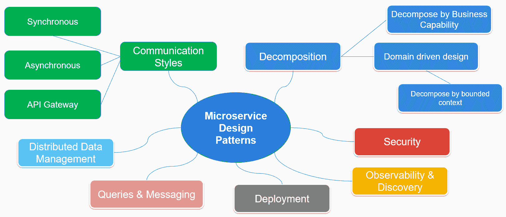

我创建了这个图表来总结和说明我们将在本书中讨论的无服务器微服务模式：

+   通信风格：服务之间和外部之间的通信方式。

+   分解模式：创建一个通过业务能力或有界上下文松耦合的服务。

+   数据管理：处理本地和共享数据存储。

+   查询和消息传递：查看微服务之间发送的事件和消息，以及如何有效地查询服务。

+   部署：理想情况下，我们希望统一和独立的部署，您也不希望开发人员为每个有界上下文或微服务重新创建新的流水线。

+   **可观察性和发现**：能够了解服务是否正常运行，监视和记录活动，使您能够在出现问题时进行深入分析。您还希望了解和监视当前运行的内容，例如出于成本和维护原因。

+   **安全性**：这对于合规性、数据完整性、数据可用性和潜在的财务损失至关重要。重要的是要建立不同的加密、身份验证和授权流程。

接下来，我们将首先看一下通信风格和分解模式。

# 通信风格和分解微服务模式

在本节中，我们将讨论两种微服务模式，称为**通信风格和分解**，并提供足够详细的内容，以便您能够与其他开发人员、架构师和 DevOps 讨论它们。

# 通信风格

由于微服务应用程序本质上是分布式的，因此它们严重依赖于授权网络。这使得了解可用的不同通信风格非常重要。这些可以用于彼此之间的通信，也可以用于与外部世界的通信。以下是一些示例：

+   **远程过程调用**：以前，Java 使用**远程方法调用**（**RMI**）很流行，这是客户端和服务器之间紧密耦合的一种非标准协议，这是一种限制。此外，网络不可靠，因此应避免传统的 RMI。其他方法，如 SOAP 接口和从**Web 服务定义语言**（**WSDL**）生成的客户端，更好，但与**REpresentational State Transfer**（**REST**）API 相比，它们被视为过重，而 REST API 已被广泛应用于微服务。

+   **同步通信**：它更简单易懂，也更容易实现；您发出请求并获得响应。然而，在等待响应的同时，您可能也会阻塞连接插槽和资源，从而限制其他服务的调用：

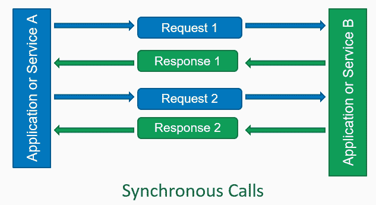

+   **异步通信**：通过异步通信，您发出请求，然后稍后收到响应，有时是无序的。这些可以使用回调、`async`/`await`或 Node.js 或 Python 中的`promise`来实现。然而，在使用`async`时有许多设计考虑，特别是如果需要监视失败。与大多数同步调用不同，这些是非阻塞的：

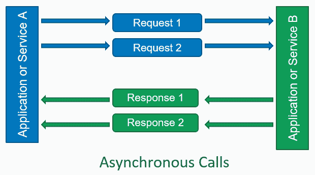

在处理通信时，您还需要考虑您的调用是阻塞还是非阻塞。例如，使用阻塞调用将网页客户端的指标写入 NoSQL 数据库可能会减慢您的网站。

您需要考虑如何处理接收到的太多请求并对其进行限流，以免过度压倒您的服务，并查看失败，如重试、延迟和错误。

使用 Lambda 函数时，您可以从 AWS 构建的事件源中受益，并针对每个请求或微批量数据启动一个 Lambda。在大多数情况下，即使在规模上，同步代码也足够使用，但在设计系统时了解架构和服务之间的通信非常重要，因为它受带宽限制，网络连接可能会失败。

# 一对一通信微服务模式

在单个微服务级别上，数据管理模式由一套小型服务组成，具有自己的本地数据存储，通过 REST API 或通过发布/订阅进行通信：

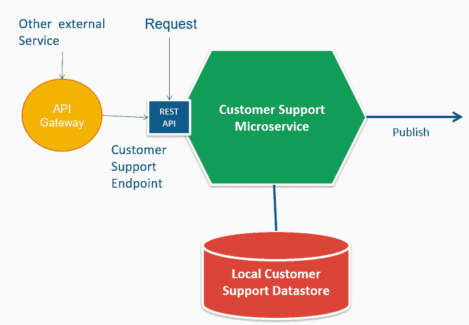

API 网关是所有客户端的单一入口点，并为它们量身定制，允许对其进行解耦，这对于面向外部服务特别有用。

一对一的请求/响应可以是同步或异步。如果它们是同步的，它们可以对每个请求进行响应。如果通信是异步的，它们可以有异步响应或异步通知。通常更喜欢异步，因为它不会保持开放的连接（非阻塞），并且更好地利用了**中央处理单元**（**CPU**）和**输入/输出**（**I/O**）操作。

我们将在本书的后面更详细地讨论数据管理模式，届时我们将看看微服务如何在更广泛的生态系统中集成。

# 多对多通信微服务模式

对于多对多的通信，我们使用发布/订阅，这是一种消息模式。发送者称为发布者的消息不会直接发送到特定的接收者；相反，接收者需要订阅消息。这是一种高度可扩展的模式，因为两者是解耦的：

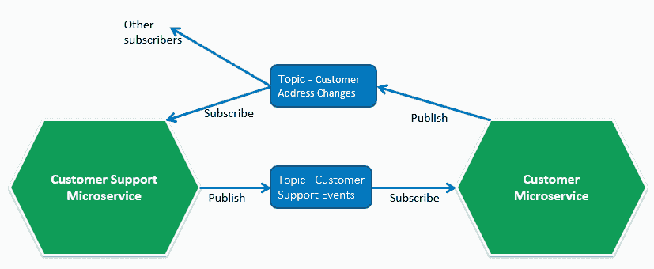

异步消息允许服务消费和响应事件，并且作为一种非常可扩展的模式，因为您已经解耦了两个服务：发布者和订阅者。

# 按业务能力分解模式

如何创建和设计微服务？如果您正在迁移现有系统，您可能会考虑将单体或应用程序分解为微服务。即使对于新的绿地项目，您也需要考虑所需的微服务：


首先，您需要识别业务能力，即组织为了产生价值而做的事情，而不是*如何*。也就是说，您需要分析目的、结构和业务流程。一旦您确定了业务能力，您就为每个能力或能力组定义一个服务。然后，您需要添加更多细节，以了解服务通过定义可用的方法或操作所做的事情。最后，您需要设计服务之间的通信方式。

这种方法的好处是相对稳定，因为它与您的业务提供的内容相关。此外，它与流程和地位相关。

缺点是数据可能跨多个服务，可能不是最佳的通信或共享代码，并且需要一个集中的企业语言模型。

# 按有界上下文分解模式

应用有界上下文分解模式有三个步骤：首先，识别领域，即组织所做的事情。然后识别子域，即根据实际功能将交织在一起的模型分割成逻辑上分离的子域。最后，找到有界上下文，标记出领域模型中每个术语的含义都被充分理解的地方。有界上下文不一定只属于单个子域。这三个步骤如下：


这种模式的好处如下：

+   在与领域专家合作时使用普遍语言，有助于更广泛的沟通。

+   团队拥有、部署和维护服务，使他们在有界上下文中具有灵活性和更深入的理解。这是很好的，因为其中的服务最有可能相互通信。

+   团队与代表性领域专家一起理解领域。有一个接口，可以将其他团队的许多实现细节抽象出来。

也有一些缺点：

+   需要领域专业知识。

+   这是一个迭代的过程，需要进行**持续集成**（**CI**）。

+   对于简单的领域来说过于复杂，依赖于普遍语言和领域专家。

+   如果使用了多语言方法，可能没有人再知道技术栈。幸运的是，微服务应该更小更简单，因此可以重新编写这些服务。

更多细节可以在以下书籍中找到：

+   *构建微服务*，Sam Newman（2015）

+   *领域驱动设计：应对软件核心的复杂性*，Eric Evans（2003）

+   *实施领域驱动设计*，Vaughn Vernon（2013）

# AWS 中的无服务器计算

AWS 中的无服务器计算允许您快速在云中部署事件驱动的计算。使用无服务器计算，仍然有服务器，但您不必管理它们。AWS 会自动为您管理所有计算资源，以及任何触发机制。例如，当对象被写入存储桶时，会触发一个事件。如果另一个服务向 Amazon DynamoDB 表写入新记录，那可能会触发一个事件或调用一个端点。

使用事件驱动计算的主要思想是，它可以轻松地将数据转换为到达云端时，或者我们可以执行数据驱动的审计分析通知、转换或解析**物联网**（IoT）设备事件。无服务器还意味着您不需要始终运行的服务来执行，实际上可以根据事件触发它。

# AWS 中一些关键的无服务器服务概述

以下是 AWS 中一些关键的无服务器服务的解释：

+   **Amazon 简单存储服务（S3）**：分布式的网络规模对象存储，具有高度可扩展性、高度安全性和可靠性。您只需支付实际消耗的存储空间，这在定价方面非常有利。它还支持加密，您可以提供自己的密钥，或者可以使用 AWS 提供的服务器端加密密钥。

+   **Amazon DynamoDB**：由 AWS 管理的完全托管的 NoSQL 存储数据库服务，允许您专注于将数据写入数据存储。它具有高度的耐用性和可用性。它已经在游戏和其他需要低延迟的高性能活动中使用。它在内部使用 SSD 存储，并为高可用性提供了分区。

+   **Amazon 简单通知服务（SNS）**：一种推送通知服务，允许您向其他订阅者发送通知。这些订阅者可以是电子邮件地址、SNS 消息或其他队列。消息将被推送到 SNS 服务的任何订阅者。

+   **Amazon 简单队列服务（SQS）**：一个完全托管和可扩展的分布式消息队列，具有高可用性和耐用性。SQS 队列通常订阅到 SNS 主题以实现分布式发布-订阅模式。您根据请求的数量付费。

+   **AWS Lambda**：主要思想是您编写业务逻辑代码，并且它基于您配置的事件源进行触发。美妙之处在于，您只在代码实际执行时付费，最低到 100 毫秒。它会自动扩展并具有高可用性。这是 AWS 无服务器生态系统的关键组件之一。

+   **Amazon API 网关**：一个托管的 API 服务，允许您构建、发布和管理 API。它可以扩展，并允许您执行缓存、流量限制和边缘位置的缓存，这意味着它们基于用户所在的位置进行本地化，最大限度地减少总体延迟。此外，它与 AWS Lambda 函数进行本地集成，允许您专注于解析请求或数据的核心业务逻辑代码。

+   **AWS 身份和访问管理（IAM）**：所有安全性的核心组件是 IAM 角色和策略，这基本上是由 AWS 管理的一种机制，用于集中安全性并将其联合到其他服务。例如，您可以限制 Lambda 仅读取特定的 DynamoDB 表，但无法写入相同的 DynamoDB 表，也可以拒绝对其他表的读/写访问。

+   **亚马逊 CloudWatch**：用于监控服务的中央系统。例如，您可以监视各种资源的利用率，记录自定义指标，并托管应用程序日志。它还非常有用，可以创建规则，当特定事件或异常发生时触发通知。

+   **AWS X-Ray**：允许您跟踪服务请求并分析来自各种来源的延迟和跟踪。它还生成服务地图，因此您可以看到依赖关系以及请求中花费最多时间的地方，并对性能问题和错误进行根本原因分析。

+   **亚马逊 Kinesis Streams**：允许您捕获每秒数百万事件的流服务，以便您可以进一步分析。主要思想是，例如，成千上万的物联网设备直接写入 Kinesis Streams，将数据捕获在一个管道中，然后用不同的消费者进行分析。如果事件数量增加，需要更多容量，您可以简单地添加更多分片，每个分片的写入容量为每秒 1000 次。添加更多分片很简单，没有停机时间，也不会中断事件捕获。

+   亚马逊 Kinesis Firehose：允许您持久保存和加载流数据的系统。它允许您写入一个端点，该端点会在内存中缓冲事件长达 15 分钟，然后将其写入 S3。它支持大量数据，并与云中的数据仓库 Amazon Redshift 集成。它还与 Elasticsearch 服务集成，允许您查询自由文本、网络日志和其他非结构化数据。

+   **亚马逊 Kinesis Analytics**：允许您使用**结构化查询语言**（**SQL**）分析 Kinesis Streams 中的数据。它还具有发现数据模式的能力，以便您可以在流上使用 SQL 语句。例如，如果您捕获网络分析数据，您可以计算每日页面查看数据，并按特定的`pageId`进行聚合。

+   **亚马逊 Athena**：允许您直接使用读取模式的模式查询 S3 的服务。它依赖于 AWS Glue 数据目录来存储表模式。您可以创建一个表，然后直接从 S3 查询数据，没有启动时间，它是无服务器的，并且可以以非常灵活和具有成本效益的方式探索大规模数据集。

在所有这些服务中，AWS Lambda 是 AWS 中最广泛使用的无服务器服务。我们将在下一节中更多地讨论这个。

# AWS Lambda

AWS 中的关键无服务器组件称为**AWS Lambda**。Lambda 基本上是一些业务逻辑代码，可以由事件源触发：

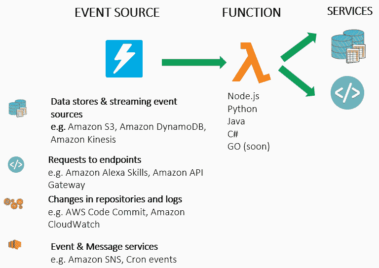

**数据事件源**可以是将对象放入或获取对象从 S3 存储桶。**流事件源**可以是已添加到 DynamoDB 表的新记录，触发了 Lambda 函数。其他流事件源包括 Kinesis Streams 和 SQS。

**端点请求**的一个例子是 Alexa 技能，来自 Alexa Echo 设备。另一个常见的是 Amazon API Gateway，当您调用一个将调用 Lambda 函数的端点。此外，您可以使用 AWS CodeCommit 或 Amazon Cloud Watch 的更改。

最后，您可以基于 SNS 或不同的定时事件触发不同的**事件和消息**。这些可以是常规事件，也可以是通知事件。

主要思想是，事件源和 Lambda 之间的集成完全由 AWS 管理，因此您只需要编写业务逻辑代码，即函数本身。一旦函数运行，您可以运行转换或一些业务逻辑代码，实际上写入图表右侧的其他服务。这些可以是数据存储或调用其他端点。

在无服务器世界中，您可以更轻松地使用 AWS Lambda 实现`sync`/`asyc`请求、消息传递或事件流处理。这包括我们刚刚讨论的微服务通信风格和数据管理模式。

Lambda 有两种类型的事件源类型，非流事件源和流事件源：

+   **非流事件源**：Lambda 可以异步或同步调用。例如，SNS/S3 是异步的，但 API Gateway 是同步的。对于同步调用，客户端负责重试，但对于异步调用，如果配置了，它将在发送到**死信队列**（**DLQ**）之前多次重试。有这个重试逻辑和 AWS 事件源的集成和支持是非常好的，因为这意味着更少的代码和更简单的架构。

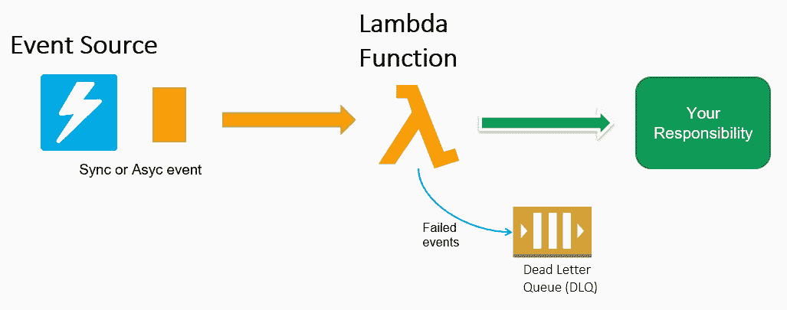

+   **流事件源**：Lambda 被微批量数据调用。在并发方面，对于 Kinesis Streams，每个分片并行调用一个 Lambda，对于 DynamoDB Stream，每个分区调用一个 Lambda。在 Lambda 内部，您只需要迭代传入的 Kinesis Streams、DynamoDB 或 SQS 数据作为 JSON 记录。此外，您可以从 AWS 内置的流集成中受益，Lambda 将轮询流并按顺序检索数据，并在失败时重试，直到数据过期，对于 Kinesis Streams，数据可以保存长达七天。而且，有了这个重试逻辑内置，而不需要编写一行代码，这是非常好的。如果您必须使用 AWS Consumer 或 Kinesis SDK 自己构建 EC2 或容器的一组，那么这将需要更多的工作：

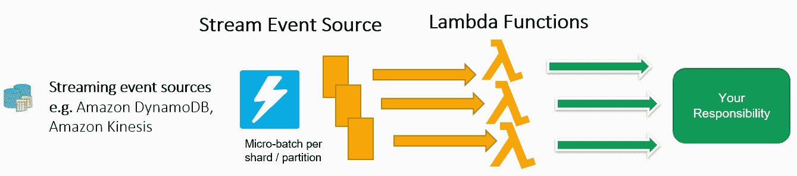

实质上，AWS 负责调用并传递事件数据给 Lambda，您负责处理 Lambda 的响应。

# 无服务器计算实现微服务模式

以下是 AWS 上可用的一些无服务器和托管服务的概述图：

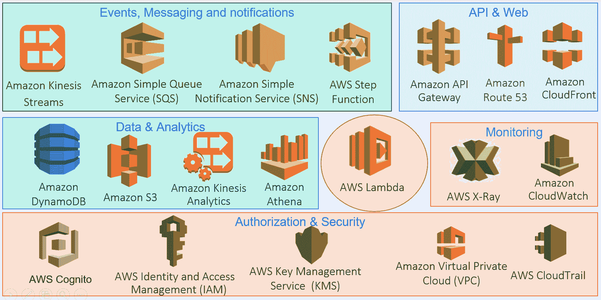

利用 AWS 托管服务确实意味着额外的供应商锁定，但有助于减少非业务差异化的支持和维护成本。同时也可以更快地部署应用程序，因为基础设施可以在几分钟内进行配置或销毁。在某些情况下，使用 AWS 托管服务来实现微服务模式，不需要太多的代码，只需要配置。

我们有以下服务：

+   **事件、消息和通知**：用于异步发布/订阅和协调组件

+   **API 和 Web**：为您的无服务器微服务创建 API 并将其暴露给 Web

+   数据和分析：存储、共享和分析您的数据

+   **监控**：确保您的微服务和堆栈正常运行

+   **授权和安全**：确保您的服务和数据安全，并且只能被授权的人访问

在中心是 AWS Lambda，用于连接服务的粘合剂，同时也是您部署业务逻辑源代码的关键位置之一。

# 示例用例 - 无服务器文件转换器

以下是一个示例用例，让您了解不同的托管 AWS 系统如何作为解决方案组合在一起。要求是第三方供应商每天在随机时间向我们发送一个小的 10MB 文件，我们需要转换数据并将其写入 NoSQL 数据库，以便可以实时查询。如果第三方数据出现任何问题，我们希望在几分钟内发送警报。您的老板告诉您，他们不想为这个任务专门保留一台始终开机的机器，第三方没有 API 开发经验，而且预算有限。安全主管也了解到这个项目，并增加了另一个限制。他们不希望将第三方访问您的 AWS 帐户超出一个被封锁的 S3 存储桶：

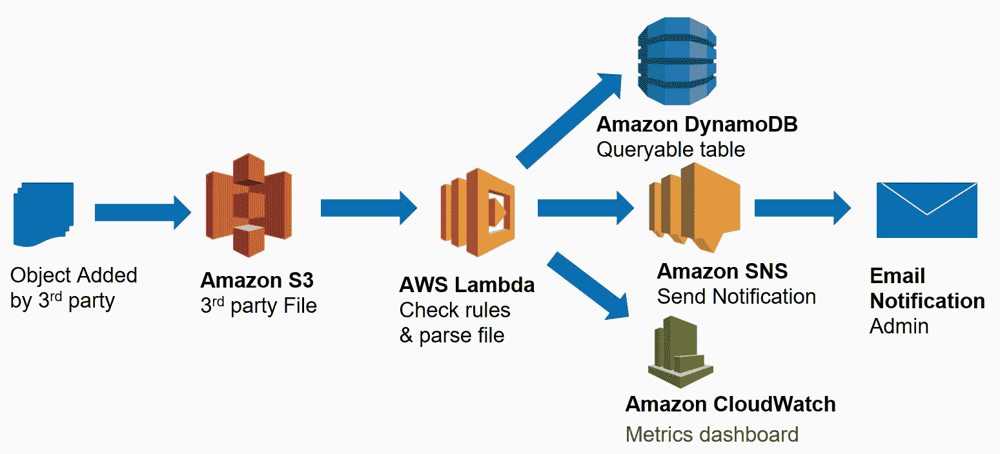

这可以作为一个事件驱动的无服务器堆栈来实现。在左边，我们有一个 S3 存储桶，第三方可以访问并放置他们的文件。当创建新对象时，会触发 Lambda 调用，通过内置的事件源映射。Lambda 执行代码来转换数据，例如，从对象中提取关键记录，如`user_id`、`date`和`event`类型，并将它们写入 DynamoDB 表。Lambda 发送转换的摘要自定义指标，例如转换并写入 CloudWatch 指标的记录数。此外，如果有转换错误，Lambda 会发送包含转换问题摘要的 SNS 通知，这可能会生成一封邮件给管理员和第三方提供商，以便他们调查问题。

# 设置您的无服务器环境

如果您已经拥有 AWS 帐户并在本地配置了它，您可以跳过此部分，但出于安全原因，我建议您为控制台访问启用**多因素身份验证**（**MFA**），并且不要使用根用户帐户密钥进行课程。

有三种访问 AWS 资源的方式：

+   AWS 管理控制台是一个用于管理您的服务和计费的基于 Web 的界面。

+   AWS 命令行界面是一个统一的工具，用于管理和自动化所有 AWS 服务。

+   Python、JavaScript、Java、.NET 和 GO 中的软件开发工具包，允许您以编程方式与 AWS 进行交互。

# 设置您的 AWS 帐户

设置帐户非常简单；您只需要大约五分钟、一个智能手机和一张信用卡：

1.  创建帐户。AWS 帐户包括 12 个月的免费使用：[`aws.amazon.com/free/`](https://aws.amazon.com/free/)。

1.  输入您的姓名和地址。

1.  提供付款方式。

1.  验证您的电话号码。

这将创建一个根帐户，我建议您仅将其用于计费，而不是开发

# 设置 MFA

我建议您使用 MFA，因为它在用户名和密码之上增加了额外的保护层。使用您的手机作为虚拟 MFA 设备是免费的 ([`aws.amazon.com/iam/details/mfa/`](https://aws.amazon.com/iam/details/mfa/))。执行以下步骤进行设置：

1.  登录 AWS 管理控制台：[`console.aws.amazon.com`](https://console.aws.amazon.com)。

1.  在左侧菜单中选择仪表板。

1.  在安全状态下，展开在根帐户上激活 MFA。

1.  选择激活 MFA 或管理 MFA。

1.  在向导中，选择虚拟 MFA 设备，然后选择继续。

1.  安装 MFA 应用程序，如 Authy ([`authy.com/`](https://authy.com/))。

1.  选择显示 QR 码，然后用您的智能手机扫描 QR 码。点击帐户并生成 Amazon 的六位数字令牌。

1.  在 MFA 代码 1 框中输入六位数字令牌。

1.  等待您的手机生成一个新的令牌，每 30 秒生成一次。

1.  在 MFA 代码 2 框中输入六位数字令牌。

1.  选择分配 MFA：

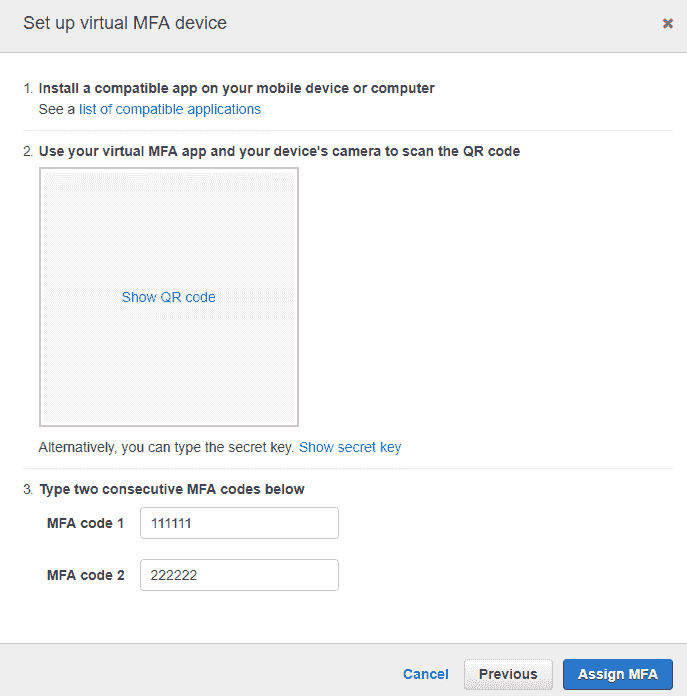

# 设置新用户和密钥

出于安全原因，我建议您仅将根帐户用于计费！因此，第一件事是创建另一个权限较低的用户：

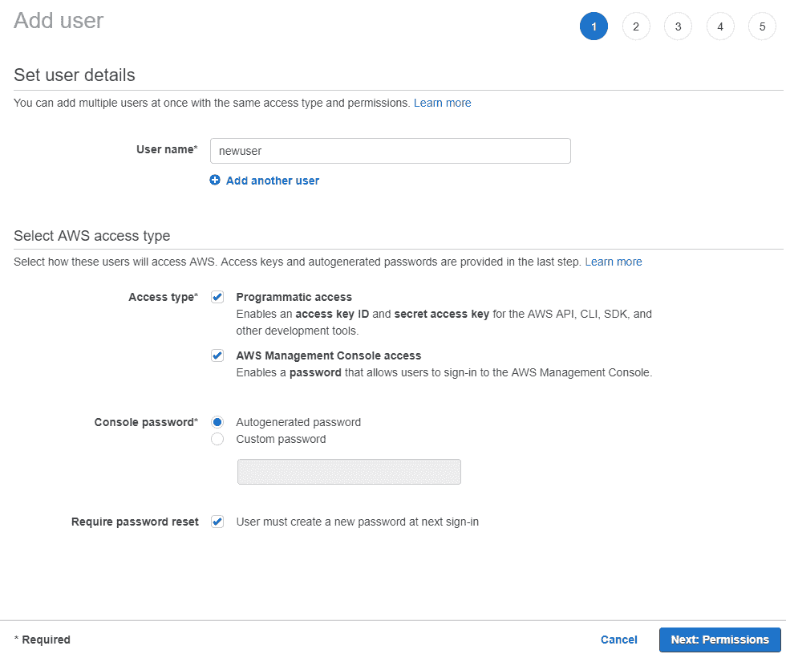

按照以下步骤创建用户：

1.  登录 AWS 管理控制台 ([`console.aws.amazon.com/`](https://console.aws.amazon.com/))。

1.  选择安全、身份和合规性 > IAM 或在“查找服务”下搜索 IAM。

1.  在 IAM 页面上，选择添加用户。

1.  对于用户名，在设置用户详细信息窗格上输入新用户。

1.  对于选择 AWS 访问类型，选择旁边的复选框，即编程访问、AWS 控制台访问。可选择自动生成的密码和需要密码重置。

1.  选择下一步：权限：

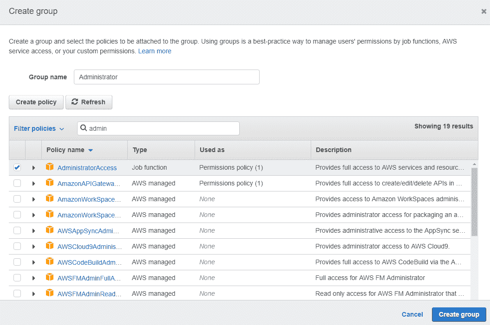

按照以下步骤为新用户设置权限：

1.  选择创建组。

1.  在“创建组”对话框中，输入`Administrator`作为新组名称。

1.  在策略列表中，选择 AdministratorAccess 旁边的复选框（请注意，对于非概念验证或非开发 AWS 环境，我建议使用更受限制的访问策略）。

1.  选择创建组。

1.  选择刷新并确保管理员旁边的复选框被选中。

1.  选择下一步：标签。

1.  选择下一步：审核。

1.  选择创建用户。

1.  选择下载.csv 并记下密钥和密码。您将需要这些来以编程方式访问账户并登录为此用户。

1.  选择关闭。

有关创建新用户的更多详细信息，请访问[`docs.aws.amazon.com/IAM/latest/UserGuide/getting-started_create-admin-group.html`](https://docs.aws.amazon.com/IAM/latest/UserGuide/getting-started_create-admin-group.html)。

与 root 账户一样，我建议您启用 MFA：

1.  在管理控制台中，选择 IAM | 用户并选择新用户。

1.  选择安全凭据选项卡，然后选择未分配的 MFA 设备旁边的管理。

1.  选择虚拟 MFA 设备并选择继续。

1.  安装诸如 Authy ([`authy.com/`](https://authy.com/))之类的 MFA 应用程序。

1.  选择显示 QR 码，然后用您的智能手机扫描 QR 码。点击账户并生成 Amazon 的六位令牌。

1.  在 MFA 代码 1 框中输入六位令牌。

1.  等待手机生成一个新的令牌，每 30 秒生成一个。

1.  在 MFA 代码 2 框中输入六位令牌。

1.  选择分配 MFA。

# 使用代码管理您的基础设施

在 AWS 管理控制台中可以通过 Web 界面完成很多工作。这是一个很好的开始，可以帮助您了解您正在构建的内容，但通常不建议用于生产部署，因为它耗时且容易出错。最佳实践是仅使用代码和配置来部署和管理基础设施。我们将在本书中使用 AWS **命令行界面**（**CLI**）、bash shell 脚本和 Python 3，所以现在让我们设置这些。

# 在 Windows 10 上安装 bash

如果您不使用 Windows，请跳过此步骤。

在部署和管理无服务器堆栈时，使用 bash（Unix shell）可以让您的生活变得更加轻松。我认为所有分析师、数据科学家、架构师、管理员、数据库管理员、开发人员、DevOps 和技术人员都应该了解一些基本的 bash，并能够运行 shell 脚本，这些通常用于 Linux 和 Unix（包括 macOS 终端）。

或者，您可以调整脚本以使用 MS-DOS 或 PowerShell，但鉴于 bash 现在可以作为 Windows 10 上的应用程序本地运行，并且在线上有更多的 bash 示例，我不建议这样做。

请注意，我已经去掉了`\r`或回车符，因为它们在 shell 脚本中是非法的。如果您想正确查看文件中的回车符，可以在 Windows 上使用 Notepad++ ([`notepad-plus-plus.org/`](https://notepad-plus-plus.org/))。如果您使用传统的 Windows 记事本，新行可能根本不会呈现，因此请使用 Notepad++、Sublime ([`www.sublimetext.com/`](https://www.sublimetext.com/))、Atom ([`atom.io/`](https://atom.io/))或其他编辑器。

有关如何在 Windows 10 上安装 Linux Bash shell 的详细指南，请访问[`www.howtogeek.com/249966/how-to-install-and-use-the-linux-bash-shell-on-windows-10/`](https://www.howtogeek.com/249966/how-to-install-and-use-the-linux-bash-shell-on-windows-10/)。主要步骤如下：

1.  导航至控制面板|程序|打开或关闭 Windows 功能。

1.  在列表中选择 Windows 子系统的复选框，然后选择确定。

1.  导航至 Microsoft Store | 在 Windows 上运行 Linux 并选择 Ubuntu。

1.  启动 Ubuntu 并设置一个带有用户名和密码的 root 账户，Windows `C:\`和其他驱动器已经挂载，您可以使用终端中的以下命令访问它们：

```py
$ cd /mnt/c/
```

干得好，您现在可以完全访问 Windows 上的 Linux！

# 更新 Ubuntu，安装 Git 和 Python 3

Git 将在本书的后面使用：

```py
$ sudo apt-get update
$ sudo apt-get -y upgrade
$ apt-get install git-core
```

Lambda 代码是用 Python 3.6 编写的。`pip`是一个用于安装和管理 Python 包的工具。还有其他流行的 Python 包和依赖管理器可用，例如 Conda（[`conda.io/docs/index.html`](https://conda.io/docs/index.html)）或 Pipenv（[`pipenv.readthedocs.io/en/latest/`](https://pipenv.readthedocs.io/en/latest/)），但我们将使用 pip，因为它是从 Python 包索引 PyPI（[`pypi.org/`](https://pypi.org/)）安装包的推荐工具，并且得到了最广泛的支持。

```py
$ sudo apt -y install python3.6
$ sudo apt -y install python3-pip
```

检查 Python 版本：

```py
$ python --version
```

你应该使用 Python 版本 3.6+。

在每个项目文件夹的`requirements.txt`中列出了运行、测试和部署无服务器微服务所需的依赖包，并且可以使用`pip`进行安装：

```py
$ sudo pip install -r /path/to/requirements.txt
```

这将安装本地开发所需的依赖库，例如 Boto3，这是 Python AWS **软件开发工具包**（**SDK**）。

在一些项目中，有一个名为`lambda-requirements.txt`的文件，其中包含 Lambda 部署时所需的第三方包。我们创建了另一个`requirements`文件，因为当 Lambda 部署到 AWS 时，Boto3 包已经包含在内，并且部署的 Lambda 不需要与测试相关的库，例如`nose`或`locust`，这些库会增加包的大小。

# 安装和设置 AWS CLI

AWS CLI 用于打包和部署 Lambda 函数，以及以可重复的方式设置基础架构和安全性：

```py
$ sudo pip install awscli --upgrade
```

您之前创建了一个名为`newuser`的用户，并且有一个名为`crednetials.csv`的文件，其中包含 AWS 密钥。通过运行`aws configure`输入它们：

```py
$ aws configure
AWS Access Key ID: <the Access key ID from the csv>
AWS Secret Access Key: <the Secret access key from the csv>
Default region name: <your AWS region such as eu-west-1>
Default output format: <optional>
```

有关设置 AWS CLI 的更多详细信息，请参阅 AWS 文档（[`docs.aws.amazon.com/lambda/latest/dg/welcome.html`](https://docs.aws.amazon.com/lambda/latest/dg/welcome.html)）。

要选择 AWS 区域，请参考 AWS 区域和终端点（[`docs.aws.amazon.com/general/latest/gr/rande.html`](https://docs.aws.amazon.com/general/latest/gr/rande.html)）。通常，美国用户使用`us-east-1`，欧洲用户使用`eu-west-1`。

# 总结

在本章中，我们概述了单片和微服务架构。然后我们讨论了设计模式和原则以及它们与无服务器微服务的关系。我们还看到了如何设置 AWS 和开发环境，这将在本书中使用。

在下一章中，我们将创建一个无服务器微服务，该微服务公开了一个 REST API，并能够查询使用 API Gateway，Lambda 和 DynamoDB 构建的 NoSQL 存储。
