# 第二章：创建您的第一个无服务器数据 API

在本章中，我们将构建一个完整的无服务器微服务，通过 REST API 可访问，并能够查询 NoSQL 数据库。我们将首先讨论并创建**亚马逊网络服务**（**AWS**）安全基础设施，以确保对 AWS 资源的受限访问。然后，我们将使用管理控制台，然后使用 Python 创建、添加记录并查询 NoSQL 数据库。然后，我们将讨论 Python 中 Lambda 函数中使用的代码和 API 网关集成。最后，我们将部署它并测试 API 是否正常工作。

本章将涵盖以下主题：

+   AWS 安全概述

+   保护您的无服务器微服务

+   构建无服务器微服务数据 API

+   在 AWS 管理控制台中设置 Lambda 安全

+   使用 AWS 创建和写入名为 DynamoDB 的 NoSQL 数据库

+   使用 Python 创建和写入名为 DynamoDB 的 NoSQL 数据库

+   创建一个用于查询 DynamoDB 的 Lambda

+   设置 API 网关并将其与 Lambda 代理集成

+   连接 API 网关、Lambda 和 DynamoDB

+   清理

# AWS 安全概述

我们将从讨论安全性以及如何在 AWS 中正确设置它开始。

# 为什么安全性很重要？

您可能最近听说过勒索软件、网络攻击或安全漏洞，您不希望您的组织受到这些影响。以下是其中一些：

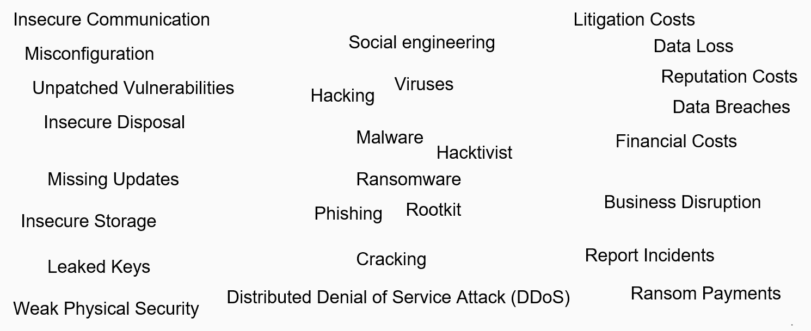

系统配置不正确、缺少更新或使用不安全的通信可能导致系统被黑客攻击或遭受勒索软件要求。这可能导致诉讼费用、数据丢失或泄露以及对您的组织的财务成本。

确保系统安全的原因有很多，包括以下几点：

+   **合规性：**遵守法律、法规和标准，例如欧盟**通用数据保护条例**（**GDPR**）、**健康信息便携和责任法案**（**HIPAA**）和**联邦贸易委员会法案**。

+   数据完整性：如果系统不安全，数据可能会被剥离或篡改，这意味着您不能再信任客户数据或财务报告。

+   **个人可识别信息（PII）：**消费者和客户了解您的隐私政策。数据应该得到安全保护，在不再需要时进行匿名化和删除。

+   **数据可用性：**数据对授权用户可用，但是，例如，如果您的数据中心发生自然灾害，那么在访问数据方面会发生什么？

AWS 中的许多安全性源于配置和正确的架构，因此了解以下重要安全相关术语的子集非常重要：

+   **传输中的安全：**例如，HTTPS SSL——把它看作是浏览器上的挂锁

+   **静态安全：**例如，数据加密，只有拥有密钥的用户才能读取数据存储中的数据

+   **身份验证：**例如，确认用户或系统是否是其应该是的过程

+   **授权：**例如，访问特定资源的权限和控制机制

# 安全设计原则

有许多安全标准、原则、认证和指导，可能足以填满几本书。以下是我发现实用和有用的一个，来自**开放式 Web 应用安全项目**（**OWASP**）[`www.owasp.org`](https://www.owasp.org)。 OWASP 安全设计原则([`www.owasp.org/index.php/Security_by_Design_Principles`](https://www.owasp.org/index.php/Security_by_Design_Principles))适用于任何系统、应用程序或服务，有助于通过设计使它们更加安全，包括无服务器计算。即使无需管理无服务器的服务器，您仍需要确保您的架构、集成、配置和代码遵循以下原则：

+   最小化攻击面积：每增加一个功能都是一个风险——确保它们是安全的，例如，删除不再使用的任何 Lambda。

+   建立安全默认值：这些默认值适用于每个用户、身份和访问管理策略和无服务器堆栈组件。

+   最小特权原则：账户或服务具有执行其业务流程所需的最少特权，例如，如果一个 Lambda 只需要对表进行读取访问，则它不应该拥有更多的访问权限。

+   深度防御原则：具有不同的验证层和集中审计控制。

+   安全失败：这确保了如果请求或转换失败，它仍然是安全的。

+   不要相信服务：特别是第三方、外部服务或库，例如，感染恶意软件的 JavaScript 和 Node.js 库。

+   职责分离：为不同的任务使用不同的角色，例如，管理员不应该是用户或系统用户。

+   避免通过混淆来保护安全性：这通常是一个坏主意和一个薄弱的安全控制。与其依赖于架构或源代码是秘密，不如依赖于其他因素，如良好的架构、限制请求和审计控制。

+   保持安全简单：不要过度设计；使用简单的架构和设计模式。

+   正确修复安全问题：及时修复问题并添加新的测试。

在构建任何无服务器微服务时，请牢记这些原则。

# AWS 身份和访问管理

身份和访问管理（IAM）是一个中心位置，您可以在其中管理用户的安全凭据，例如密码、访问密钥和权限策略，以控制对 AWS 服务和资源的访问。我们将讨论最相关的 IAM 资源——策略、用户、组和角色——但首先，我们将讨论 IAM 策略中使用的 JSON（[`www.json.org/`](https://www.json.org/)）格式。

# JavaScript 对象表示法

JSON，或 JavaScript 对象表示法，是在 REST API 和微服务中使用的标准数据格式。它可以被人类阅读，也可以被机器自动解析。数据对象由属性-值对和数组数据类型组成。支持的数据类型值包括数字、字符串、布尔值、数组、对象和 null，如下面的代码所示：

```py
{
  "firstName": "John",
  "lastName": "Smith",
  "age": 27,
  "address": {
    "city": "New York",
    "postalCode": "10021"
  },
  "phoneNumbers": [
    {
      "type": "home",
      "number": "212 555-1234"
    },
    {
      "type": "mobile",
      "number": "123 456-7890"
    }
  ]
}
```

前面的代码是与 John Smith 相关的详细信息的示例。您可以看到名字是键，字符串值是 John。这样，您有两个由冒号分隔的字符串。因此，您可以看到 John Smith 今年 27 岁，他居住的城市是纽约，邮政编码是 10021，您可以看到他有两个电话号码。一个是他的家庭电话号码，另一个是移动电话号码。JSON 非常描述性，可以很容易地以编程方式解析。

您可以看到它也不必是扁平的。它也可以是分层的，并且键内置到数据中。您还可以很容易地向 JSON 数据添加新的电话号码并扩展模式，而不会破坏模型，不像其他格式，如逗号分隔变量（CSV）文件。JSON 在标准 Python JSON 库中得到了本地支持，但您也可以使用其他库。我喜欢它的原因是它与 Python 数据类型有本地映射。

# IAM 策略

IAM 策略是定义效果、操作、资源和条件的 JSON 文档，如下面的代码所示：

```py
{
    "Version": "2012-10-17",
    "Statement": {
        "Effect": "Allow",
        "Action": [  
                "dynamodb:GetItem",
                "dynamodb:Scan",
                "dynamodb:Query"],
        "Resource": "arn:aws:dynamodb:eu-west-
                     1:123456789012:table/Books",
        "Condition": {
            "IpAddress": {
                "aws: SourceIp": "10.70.112.23/16"
            }
        }
    }
}
```

这是一个 JSON 文档的示例，只有在请求来自特定的 CIDR（无类域间路由选择）`10.70.112.23/16`时，才会授予对名为`Books`的 DynamoDB 表的读取访问权限，即在 IP 地址版本 4 范围内从`10.70.0.0`到`10.70.255.255`。

还有一个可视化编辑器，允许您创建这些，或者您可以通过编辑实际的 JSON 文档来手动创建。例如，我们在本书的前面创建了一个新用户，并使用 AWS 托管策略赋予了他们管理员权限，但您也可以像所示的那样创建自己的。我的建议是在可能的情况下使用 AWS 托管策略，除非是可以或应该更受限制的资源，比如 DynamoDB 表或 S3 存储桶。

# IAM 用户

IAM 用户是与 AWS 交互的人或服务。我们实际上在第一章中设置了一个新用户，*无服务器微服务架构和模式*。他们可以通过多因素身份验证的密码访问 AWS 管理控制台，和/或者可以使用命令行界面或 AWS **软件开发工具包**（**SDK**）进行编程访问。您可以直接向用户附加一个或多个 IAM 策略，以授予他们对资源或服务的访问权限。策略可以像我们刚刚向您展示的那样，用于授予特定来源 IP 范围对名为`Books`的 DynamoDB 表的读取访问权限。

# IAM 组

IAM 组用于在组织组中模仿此安全功能。您可以将其视为活动目录组。例如，在您的组织中，您将拥有管理员、开发人员和测试人员。要创建一个组，您可以使用 AWS 管理控制台、SDK 或 CLI。创建组后，您可以将其附加到用户，或者在创建新用户时也可以创建一个。我倾向于将 IAM 策略附加到组，然后将组分配给用户，因为这样更容易管理并标准化访问权限。例如，我可以将数据科学组分配给团队的新成员，知道它与其他用户相同。同样，如果有人离开，那么他们的神奇策略也不会随着他们被删除！

# IAM 角色

IAM 角色类似于 IAM 用户，它们可以附加策略，但可以由需要在所谓的受信实体中获得访问权限的任何人承担。通过这种方式，您可以委托访问权限给用户、应用程序或服务，而无需给他们一个新的 AWS 密钥，因为他们通过这个受信实体使用临时安全令牌。例如，无需共享任何密钥，纯粹使用角色，您可以仅授予第三方对 S3 存储桶的读取访问权限，而不允许其访问 AWS 环境中的其他任何内容。

# 保护您的无服务器微服务

在这一部分，我们将详细讨论安全性。

# Lambda 安全性

正如我们之前讨论的，AWS Lambda 是无服务器堆栈中的核心组件，或者是与您的自定义代码集成连接器，由 AWS 托管服务之间的事件触发。Lambda 函数始终与执行 IAM 角色相关联，并且使用附加到该角色的策略是拒绝或授予其访问其他 AWS 资源的最佳且最安全的方式之一。美妙的是，对于许多 AWS 托管服务，如 S3、DynamoDB 和 Kinesis Stream，无需管理或交换任何密钥或密码。也有一些例外，比如一些 Amazon **关系型数据库服务**（**RDS**），比如 SQL Server，但 MySQL 或 PostgreSQL 支持 IAM 数据库身份验证。以下图显示了 Lambda 函数的工作原理：

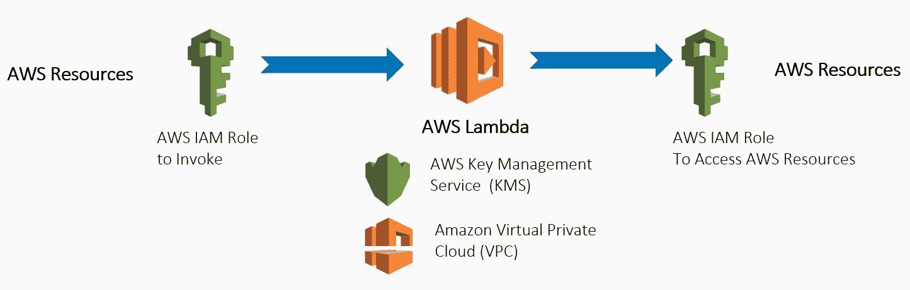

如前图所示，在 Lambda 函数中通常涉及两个 IAM 角色：

+   调用 Lambda，例如，从 API 网关或 AWS Step Functions

+   授予对 AWS 资源的读取和写入访问权限，例如，授予 Lambda 对 DynamoDB 表的读取访问权限

此外，请注意以下内容：

+   **密钥管理服务**（**KMS**）可用于对 DynamoDB 或 RDS 中的静态数据进行加密/解密，也可用于加密密码或密钥，例如，如果您需要与第三方 API 或数据库集成。

+   Lambda 默认在安全的**虚拟私有云**（**VPC**）中启动。但是，如果有需要访问的资源，例如 ElastiCache 集群或 RDS，您也可以在自己的私有 VPC 中运行它。您还可以这样做以增加另一层安全性。

# API Gateway 安全性

让我们看一下以下图表：

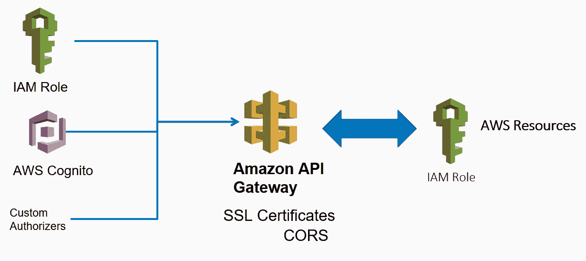

API Gateway 可以用于创建一个无需身份验证的面向公众的 API，但有时您会希望限制访问。以下是控制谁可以调用请求授权 API 的三种不同方式：

+   IAM 角色和策略可用于授予对 API 的访问权限，API Gateway 会透明地验证请求的调用者的签名。

+   Amazon Cognito 用户池控制谁可以访问 API。用户或服务必须首先登录才能访问 API。

+   API Gateway 自定义授权器请求，例如，一个承载令牌，并使用 Lambda 函数检查客户端是否被授权调用 API。

API Gateway 中，请注意以下内容：

+   如果您收到的请求来自 API 自己的域之外的域，您必须启用**跨域资源共享**（**CORS**）。

+   还支持客户端 SSL 证书，例如允许后端系统验证 HTTP 请求是否来自 API Gateway 而不是其他系统。

+   API Gateway 可能还需要通过 IAM 角色授予访问权限，例如，如果需要向 Kinesis Streams 写入记录或调用 Lambda 函数。

+   使用计划允许您为客户创建 API 密钥，从而限制和监视使用情况。例如，这可以让您为客户创建按使用量付费的 API。

# DynamoDB 安全性

现在让我们看一下以下图表：

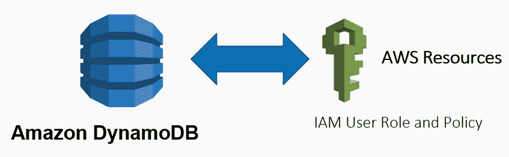

DynamoDB 是 AWS 托管的服务，授权通过 IAM 权限策略进行管理。授予或拒绝对 DynamoDB 的访问的 IAM 策略附加到特定的 IAM 用户或角色，然后可以访问它。如果您想在一个 AWS 账户中承担角色，我们还可以选择委派相同的权限，以便它们可以访问不同 AWS 账户中的 DynamoDB 表。在这种情况下的好处是不需要交换密钥。

我建议您在为 DynamoDB 创建这些策略时应用**最小权限原则**，尽可能地限制它们，这意味着避免对表访问使用通配符星号，例如使用`"Resource": "*"`。例如，在策略文档中，除非绝对必要，避免给予对所有表的读写访问权限。在可能的情况下，最好明确列出特定操作、表名和约束。

# 监控和警报

现在考虑以下图表：

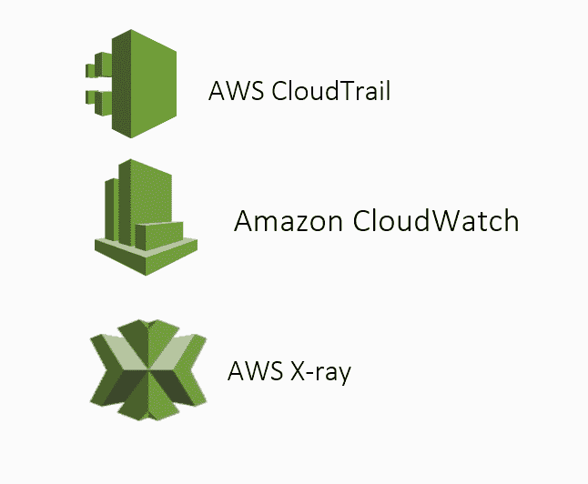

总的来说，监视系统中的任何可疑活动或发现系统的任何性能问题都很重要。API Gateway、DynamoDB 和 Lambda 函数都内置了 CloudWatch 和 X-Ray 的支持。CloudWatch 允许您跟踪指标和监视日志文件，设置特定的警报，并自动对 AWS 资源的更改做出反应。X-Ray 是一个跟踪请求的服务，还可以生成特定的服务地图。这些免费系统的组合为您提供了非常好的洞察力，可以直接了解您的无服务器系统的性能。CloudTrail 是另一个服务，允许您监视所有 API 和任何用户或系统对资源的访问。

# 了解更多

现在您对 AWS 中的安全性有了更深入的了解，以及为什么对您的组织来说很重要。

如果您想了解更多信息，以下是一些白皮书和最佳实践指南的链接。我建议阅读以下白皮书：

+   [`aws.amazon.com/whitepapers/aws-security-best-practices/`](https://aws.amazon.com/whitepapers/aws-security-best-practices/)

+   [`aws.amazon.com/products/security/`](https://aws.amazon.com/products/security/)

+   [`aws.amazon.com/whitepapers/#security`](https://aws.amazon.com/whitepapers/#security)

+   [`docs.aws.amazon.com/IAM/latest/UserGuide/best-practices.html`](http://docs.aws.amazon.com/IAM/latest/UserGuide/best-practices.html)

# 构建无服务器微服务数据 API

在本节中，我们将研究构建无服务器微服务的架构和要求。本章的其余部分在 AWS 管理控制台中进行配置，同时也涉及 Python 代码。Python 代码遵循基本的设计模式，并且保持简单，以便您可以理解并轻松地为自己的用例进行调整。

# 无服务器微服务数据 API 要求

我们想要创建一个微服务，能够为特定事件提供网站访问次数的总用户数。

# 查询字符串

对于传入请求的特定`EventId`，我们希望作为响应检索每日网站访问次数（已由另一个系统收集）。我们将通过`EventId`和`startDate`进行查询；我们希望检索`startDate`之后的所有网站访问次数。URL 及其参数将如下所示：

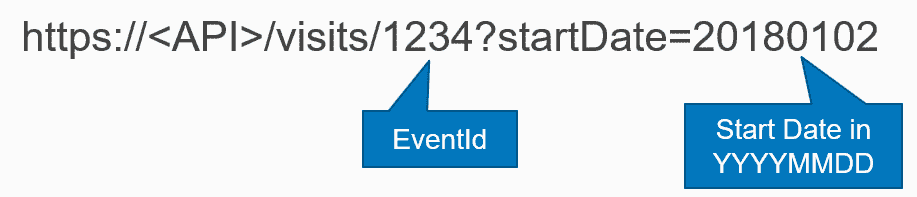

在这里，您可以看到我们有`EventId`作为资源`1234`，并且`startDate`参数格式为`YYYYMMDD`格式。在这种情况下，它是`20180102`。这就是请求。

我们可以在浏览器中或以编程方式输入此请求，我们希望得到的响应来自 NoSQL 数据库，其中存储了实时数据。实际的响应格式将以 JSON 的形式从数据库返回，通过 Lambda 函数呈现给用户或以编程方式查询 API 的其他服务。我们还希望这个 API 能够轻松扩展并且成本效益很高；也就是说，我们不希望一直运行一个机器，因为那样会花钱并且需要维护。我们只想在实际请求时支付费用。

现在以下图表：

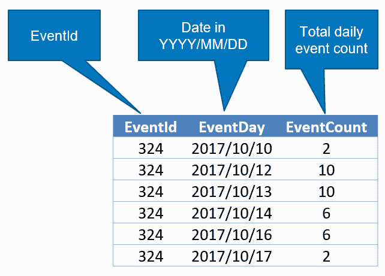

这是我们感兴趣的时间序列数据的一个示例，我们有一个`EventId`，用于事件`324`，我们有格式为`EventDay`的日期，这是 2017 年 10 月，我们在表格的右侧列中有一个名为`EventCount`的总`EventCount`。您可以看到 2017 年 10 月 10 日，`EventId`为`324`的`EventCount`为`2`，这意味着在那一天对于该事件的总访问次数为`2`。第二天是`0`，因为没有第 11 天的条目。然后，它在 12 日增加到`10`，13 日为`10`，然后下降到`6`，`0`，`6`和`2`。请注意，当表中没有特定日期的数据时，它为`0`。

这是我们希望 API 以 JSON 格式提供的数据作为响应，以便另一个客户端应用程序可以绘制它，如下图所示：

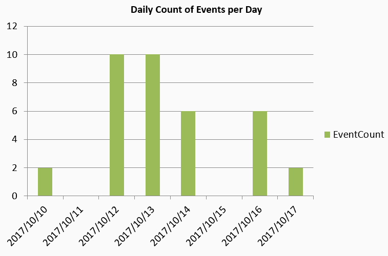

例如，如果我们在 Excel 中绘制数据，您将看到这种类型的图表，其中`EventCount`从`2`开始，在 10 月 11 日有一个间隙，这个特定用户没有访问，然后增加到`10`，`10`，`6`，然后在 10 月 15 日有一个间隙，然后在 10 月 16 日再次增加到`6`。

# 数据 API 架构

现在我们知道了我们想要返回的数据的要求和形状，我们将讨论整体架构。同样，整个堆栈将依赖于 JSON 格式进行所有服务之间的数据交换。

以下图表显示了我们在请求中拥有的内容：

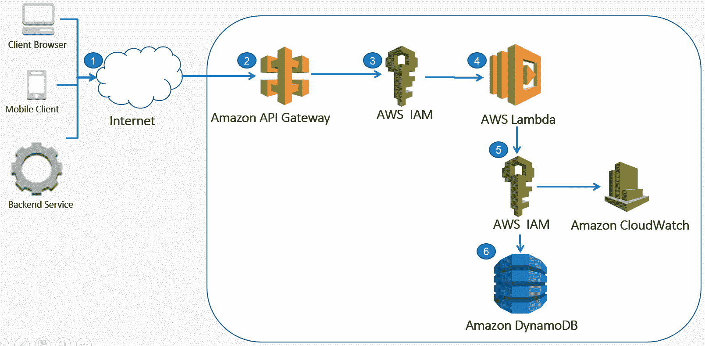

请求流程如下：

1.  我们在互联网上有一个客户端浏览器、移动客户端或后端服务。

1.  这将查询我们的 API Gateway，将带有`EventId`和`startDate`作为可选 URL 参数的请求传递。

1.  这将通过 AWS IAM 角色进行身份验证。

1.  然后将启动 Lambda 函数。

1.  Lambda 函数将使用角色访问 DynamoDB。

1.  Lambda 将查询 Dynamo 以搜索特定的`EventId`。可选地，查询还将包括与`EventDay`进行比较的特定`startDate`。如果`EventDay`大于`startDate`，则将返回记录。

以下图表显示了我们在响应中的内容：

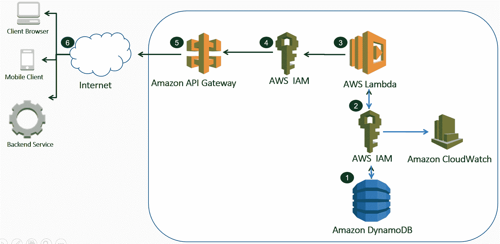

响应流程如下：

1.  数据将从 DynamoDB 返回，如前图表右下角所示

1.  这将通过与 Lambda 函数关联的相同 IAM 角色进行

1.  来自 DynamoDB 的 JSON 记录将返回给 Lambda 函数，Lambda 函数将其解析为 JSON 响应

1.  这将通过 Lambda 函数通过 API Gateway 角色传递

1.  它被传回 API Gateway

1.  最终，它将返回给客户端浏览器移动客户端，或者发出初始请求的后端服务，以便可以绘制图表

我们还配置了 Amazon CloudWatch 来监视请求，通过提供指标和日志的仪表板。

# 在 AWS 管理控制台中设置 Lambda 安全性

我们将登录到 AWS 管理控制台。我们首先使用管理控制台的原因是为了让您更好地了解 Lambda 函数的工作原理，以及它们如何与其他 AWS 服务集成，例如 API Gateway 和 DynamoDB。在后面的章节中，我们将向您展示如何使用 AWS CLI 部署 Lambda 函数。如果您是 Lambda 的初学者，那么我总是发现首先在管理控制台中手动创建完整的无服务器堆栈对于获得比如说有一个魔术命令启动完整的 AWS 基础设施更好和更深入的理解是有用的！

我们将首先使用 AWS 管理控制台创建 Lambda IAM 角色和策略，以便 Lambda 函数可以访问 DynamoDB，并将任何日志或任何状态写入 CloudWatch。我们之前在第一章中使用的管理控制台，*无服务器微服务架构和模式*，允许您集中控制所有 AWS 服务，创建角色，甚至创建 Lambda 函数。就无服务器微服务的架构而言，我们首先从以下图表的右侧开始，并逐步构建其余部分。

以下图表显示了数据 API Lambda IAM：

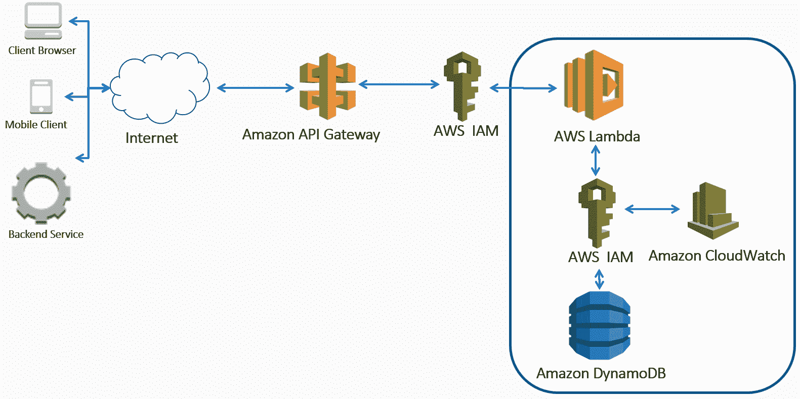

接下来创建两个 IAM 策略并将它们附加到新的 Lambda IAM 角色。

# 创建 IAM 策略

我们将创建 Lambda 函数和 IAM 角色和策略。您需要做的第一件事是登录到 AWS 管理控制台。在 IAM 中，我们要创建实际的策略本身。您可以单击创建策略，我们将使用 JSON 编辑器。

# DynamoDB IAM 策略

首先，我们需要一个策略，允许 Lambda 函数从 DynamoDB 中读取记录。我们可以通过以下方式来做：

1.  登录到[ht](https://console.aws.amazon.com/)[tps://console.aws.amazon.com/](https://console.aws.amazon.com/)的 AWS 管理控制台。

1.  选择安全性、身份和合规性| IAM，或在查找服务下搜索 IAM。

1.  在 IAM 导航窗格中，选择策略。

1.  选择创建策略。

1.  选择 JSON 选项卡。

您也可以使用或切换到**可视化编辑器**来创建策略，而不是使用**JSON**视图，但我更喜欢**JSON**视图，因为代码可以进行源控制，并且可以像我们稍后使用 AWS CLI 那样进行程序化部署。

1.  输入或粘贴以下 JSON 策略文档：

```py
      {
          "Version": "2012-10-17",
          "Statement": [
              {
                 "Effect": "Allow",
                 "Action": [
                     "dynamodb:BatchGetItem",
                     "dynamodb:DescribeTable",
                     "dynamodb:GetItem",
                     "dynamodb:Query",
                     "dynamodb:Scan"
                 ],
                  "Resource": [
                     "arn:aws:dynamodb:<your-region>:<your-aws-
                      accountid>:table/user-visits"                 
                 ]
             }
         ]
     }
```

更新`<your-region>`为您的 AWS 区域，例如`us-east-1`，并将`<your-aws-accountid>`更新为您的 AWS 账户 ID。

如果您不知道您的 AWS 账号，您可以在 AWS 管理控制台顶部的 Support | Support Center 菜单中找到它，如下面的屏幕截图所示：

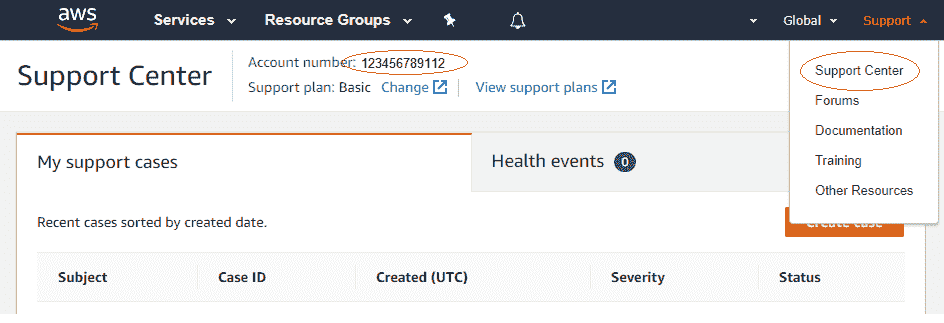

1.  选择 Review Policy。

1.  在 Review Policy 页面，为名称输入`dynamo-readonly-user-visits`。

1.  选择创建策略。

这个名为 dynamo-readonly-user-visits 的 IAM 策略现在将在筛选策略下作为客户管理的策略可用。

我们谈到了安全性非常重要，确保安全的一种方法是应用 OWASP 安全设计原则，比如之前谈到的最小特权原则。在这里，我们通过使用策略来限制表访问来实现这一点。您会注意到，我将其限制在一个特定的名称，`dynamo`表。对于策略名称，应尽可能描述和细化，以便更容易维护。我倾向于在可能的情况下为每个 AWS 资源使用一个策略。我使用前缀`dynamo-readonly`，这样就很明显，您只能从一个名为`user-visits`的特定表中读取。

# Lambda IAM 策略

创建一个策略，以便能够将日志写入和推送指标到 CloudWatch：

1.  登录 AWS 管理控制台，并在[`console.aws.amazon.com/iam/`](https://console.aws.amazon.com/iam/)中打开 IAM 控制台，如果您尚未登录。

1.  在 IAM 导航窗格中，选择策略。

1.  选择创建策略。

1.  选择 JSON 选项卡。

1.  输入或复制以下 JSON 文档：

```py
     {
        "Version": "2012-10-17",
        "Statement": [
          {
            "Effect": "Allow",
            "Action": [
             "logs:CreateLogGroup",
             "logs:CreateLogStream",
             "logs:PutLogEvents",
             "logs:DescribeLogStreams"
          ],
            "Resource": [
              "arn:aws:logs:*:*:*"
         ]
        },
       {
           "Effect": "Allow",
           "Action": [
             "cloudwatch:PutMetricData"
           ],
           "Resource": "*"
         }
      ]
     }
```

这个策略的主要目的是允许 Lambda 函数创建 CloudWatch 日志组和流，并将日志事件添加到这些流中，然后描述它们。我还添加了另一个允许您放置指标的声明，如果您想要推送自定义监视指标，则需要这样做。

1.  选择 Review Policy。

1.  在 Review Policy 中，为名称输入`lambda-cloud-write`。

1.  选择创建策略。

# 创建 Lambda IAM 角色

现在我们有了两个 IAM 策略，我们将创建一个新的 Lambda IAM 角色，并将这两个策略附加到它：

1.  登录 AWS 管理控制台，并在[`console.aws.amazon.com/iam/`](https://console.aws.amazon.com/iam/)中打开 IAM 控制台

1.  在导航窗格中，选择角色

1.  选择创建角色

1.  选择 AWS 服务，然后在下面选择 Lambda

1.  选择下一步：权限

1.  在附加权限策略 | 筛选策略下，输入`dynamo-readonly-user-visits-api`

1.  选择复选框以选择 dynamo-readonly-user-visits-api

1.  在附加权限策略 | 筛选策略下，输入`lambda-cloud-write`

1.  选择 lambda-cloud-write 的复选框

1.  选择下一步：标签

1.  选择下一步：审核

1.  在 Review 页面，为角色名称输入`lambda-dynamo-data-api`

1.  选择创建角色

您已创建了两个 IAM 策略，并将它们附加到一个新的 Lambda 执行角色上，稍后我们将将其与 Lambda 函数关联。

# 使用 AWS 创建和写入名为 DynamoDB 的 NoSQL 数据库

我们将创建一个 DynamoDB 表，从硬编码值向表中写入数据，从文件写入数据记录，然后我们将展示两种不同的查询表的方法：

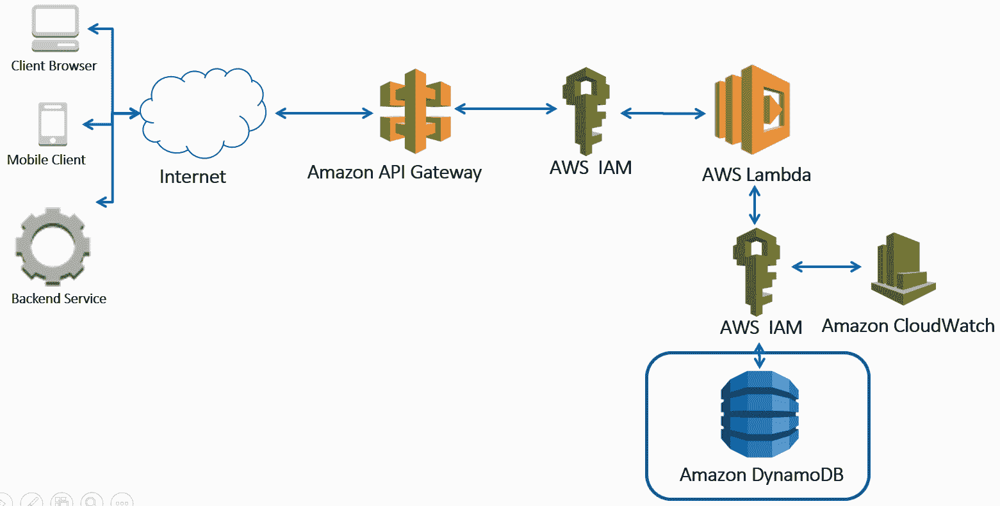

# 在 AWS 中创建 DynamoDB

以下步骤显示如何创建 DynamoDB：

1.  您需要先登录 AWS 管理控制台，然后在[`console.aws.amazon.com/dynamodb/`](https://console.aws.amazon.com/dynamodb/)中打开 AWS DynamoDB 控制台。

1.  选择创建表，或者在 DynamoDB 导航窗格中，选择表，然后选择创建表。

1.  在创建 DynamoDB 表窗口中，执行以下步骤：

1.  在表名下，输入`user-visits`

1.  在 Partition key 的主键中，输入`EventId`并选择 String

1.  勾选添加排序键框

1.  在排序键中，输入`EventDay`并选择 Number

分区键和哈希键可以互换使用，就像排序键和范围键一样。主键可以是仅分区键，也可以是具有分区键和排序键的复合键。

# 使用 AWS 将数据写入 DynamoDB

执行以下步骤：

1.  登录到 AWS 管理控制台，并在[`console.aws.amazon.com/dynamodb/`](https://console.aws.amazon.com/dynamodb/)中打开 DynamoDB 控制台。

1.  在 DynamoDB 导航窗格中，选择 Tables 并选择 user-visits。

1.  在 user-visits 窗格中，选择 Items*选项卡。

1.  选择创建项目。

1.  在创建项目弹出窗口中：

1.  在 EventId String 下，输入`324`

1.  在 EventDay Number 下，输入`20171001`

1.  选择+ > 追加 > 数字，对于字段，输入`EventCount`，对于数字，输入`3`

1.  选择保存

现在，您会看到在右下窗格的 Items 选项卡中添加了一个新记录，因为扫描也已自动完成。

DynamoDB 是一个托管的 NoSQL 数据库，这意味着每行可以有不同的列，列的名称，即属性，是区分大小写的。

# 使用 AWS 查询 DynamoDB

在 DynamoDB 上有两种类型的搜索；`Scan`和`Query`。`Scan`从表中检索所有记录。`Query`利用主键有效地检索一组记录。两者都允许您具有可选的一致性、分页、过滤器、条件，并选择要返回的属性。一般来说，`Scan`适用于检索所有数据或跨许多不同主键的数据，而`Query`应该在您有主键并且想要检索所有或经过筛选的相关记录时使用。

# 在 AWS 管理控制台中的 DynamoDB 扫描

执行以下步骤：

1.  登录到 AWS 管理控制台，并在[`console.aws.amazon.com/dynamodb/`](https://console.aws.amazon.com/dynamodb/)中打开 DynamoDB 控制台。

1.  在 DynamoDB 导航窗格中，选择 Tables 并选择 user-visits

1.  在 user-visits 窗格中选择 Items*选项卡

1.  从下拉菜单中选择 Scan

1.  可选择+Add Filter 以过滤查询结果

1.  选择开始搜索

现在，您应该在右下窗格的表中看到结果，其中包含 EventId、EventDay 和 EventCount 列。

# 在 AWS 管理控制台中的 DynamoDB 查询

执行以下步骤：

1.  登录到 AWS 管理控制台，并在[`console.aws.amazon.com/dynamodb/`](https://console.aws.amazon.com/dynamodb/)中打开 DynamoDB 控制台。

1.  在 DynamoDB 导航窗格中，选择 Tables 并选择 user-visits

1.  在 user-visits 窗格中，选择 Items*选项卡

1.  从下拉菜单中选择查询

1.  在分区键下，输入`324`

1.  在 Sort Key 下，选择`>`并输入`20171001`

1.  选择开始搜索

您会看到没有返回结果，因为我们正在寻找 EventDay 大于`20171001`的记录，而当前表中没有这样的记录。

修改以下内容以查找记录：

1.  在 Sort Key 下，选择`>=`并输入`20171001`

1.  选择开始搜索

现在您会看到我们添加的记录可见，因为它符合查询搜索条件。

修改以下内容以查找记录：

1.  在 Sort Key 下，选择 between 并输入`20170930`和`20171002`

1.  选择开始搜索

在这里，我们使用 between 条件来检索记录。

这种查询灵活性使您能够以非常低的延迟检索数据。但是，您会注意到条件表达式的分区键始终固定为`=`,并且必须提供给所有`Query`操作-这在许多 NoSQL 数据库中很常见。如果您没有或不知道主键，那么您需要使用`Scan`。

# 使用 AWS 删除 DynamoDB

让我们删除表，因为我们将使用 Python 重新创建它。执行以下步骤：

1.  登录到[`console.aws.amazon.com/dynamodb/`](https://console.aws.amazon.com/dynamodb/)控制台

1.  从左侧 DynamoDB 菜单中选择 Tables

1.  选择 user-visits

1.  选择删除表

1.  选择删除

# 使用 Python 创建和写入名为 DynamoDB 的 NoSQL 数据库

现在我们了解了如何创建表、添加数据和使用 AWS 控制台查询 DynamoDB，我们将看看如何只使用 Python 代码来实现这一点。

我们建议您使用 Python **集成开发环境**（**IDE**），如 Eclipse PyDev ([`www.pydev.org/download.html`](http://www.pydev.org/download.html))或 PyCharm ([`www.jetbrains.com/pycharm/`](https://www.jetbrains.com/pycharm/))。您不需要使用 IDE，但我建议您这样做。如果您真的想要，您可以使用 VI，例如在 Linux 上实际编辑您的代码。但是使用 IDE 允许您运行调试或在本地设置单元测试并逐步执行，这使得开发更容易和更高效。

首先在 Python 中使用[Boto3 https://boto3.readthedocs.io/](https://boto3.readthedocs.io/)创建表。在 PyCharm 或您喜欢的文本编辑器中运行以下部分的代码。

# 使用 Python 创建 DynamoDB 表

以下是创建表的通用 Python 代码。创建一个名为`dynamo_table_creation.py`的 Python 脚本，其中包含以下代码：

```py
import boto3

def create_dynamo_table(table_name_value, enable_streams=False,
                        read_capacity=1,
                        write_capacity=1,
                        region='eu-west-1'):
    table_name = table_name_value
    print('creating table: ' + table_name)
    try:
        client = boto3.client(service_name='dynamodb', 
                              region_name=region)
        print(client.create_table(TableName=table_name,
                                  AttributeDefinitions=[{'AttributeName': 'EventId',
                                                         'AttributeType': 'S'},
                                                        {'AttributeName': 'EventDay',
                                                         'AttributeType': 'N'}],
                                  KeySchema=[{'AttributeName': 'EventId',
                                              'KeyType': 'HASH'},
                                             {'AttributeName': 'EventDay',
                                              'KeyType': 'RANGE'},
                                             ],
                                  ProvisionedThroughput={'ReadCapacityUnits': read_capacity,
                                                         'WriteCapacityUnits': write_capacity}))
    except Exception as e:
        print(str(type(e)))
        print(e.__doc__)

def main():
    table_name = 'user-visits'
    create_dynamo_table(table_name, False, 1, 1)

if __name__ == '__main__':
    main()
```

与在 AWS 控制台中创建 DynamoDB 表不同，这里我们使用 Python SDK Boto3 来创建它。`main()`调用名为`create_dynamo_table()`的方法，该方法接受与我们要创建的表相关的各种参数，`table_name`是第一个。忽略`enable_streams`参数，我们稍后会使用。另外两个与初始读取和写入容量相关联。这将直接影响成本，以及表的大小和检索的数据。这就是为什么我默认将它们设置为`1`。区域参数应该是您的 AWS 区域。

然后创建一个`boto3.client()`，这是一个代表 DynamoDB 的低级客户端。然后我们使用它来使用`client.create_table()`创建一个表，传入我们的`create_dynamo_table()`中传入的参数，以及分区键名`EventId`，其数据类型`String`，表示为`S`，和排序键名`EventDay`，其数据类型编号表示为`N`。所有其他属性都是可选的和任意的。

您会注意到 DynamoDB 在管理控制台和 Boto3 描述之间的关键术语有所变化，但它们是同义词：`Partition key (AWS Console) = Hash key (Boto3)`和`Sort key (AWS Console) = Range key (Boto3)`。

两者一起，作为复合键，称为主键。

# 使用 Python 写入 DynamoDB

以下代码将三条记录写入 DynamoDB。使用以下 Python 代码创建另一个名为`dynamo_modify_items.py`的文件：

```py
from boto3 import resource

class DynamoRepository:
    def __init__(self, target_dynamo_table, region='eu-west-1'):
        self.dynamodb = resource(service_name='dynamodb', 
                        region_name=region)
        self.target_dynamo_table = target_dynamo_table
        self.table = self.dynamodb.Table(self.target_dynamo_table)

    def update_dynamo_event_counter(self, event_name, 
                event_datetime, event_count=1):
        return self.table.update_item(
            Key={
                'EventId': event_name,
                'EventDay': event_datetime
            },
            ExpressionAttributeValues={":eventCount": event_count},
            UpdateExpression="ADD EventCount :eventCount")

def main():
    table_name = 'user-visits'
    dynamo_repo = DynamoRepository(table_name)
    print(dynamo_repo.update_dynamo_event_counter('324', 20171001))
    print(dynamo_repo.update_dynamo_event_counter('324', 20171001, 2))
    print(dynamo_repo.update_dynamo_event_counter('324', 20171002, 5))

if __name__ == '__main__':
    main()
```

在这里，我们使用 Boto3 的`resource()`，这是一个具有存储库模式的更高级别的服务资源。我们在`DynamoRepository()`类中将所有与 DynamoDB 相关的代码抽象出来，该类实例化为`dynamo_repo`，并使用`table_name`。`self.dynamodb.Table()`基于`table_name`创建一个表资源。这将在稍后调用`update_dynamo_event_counter()`更新 DynamoDB 记录时使用。

在`self.table.update_item()`中，我首先使用`ExpressionAttributeValues`声明一个名为`eventCount`的变量。我在 DynamoDB 高级*Update Expressions*（[`docs.aws.amazon.com/amazondynamodb/latest/developerguide/Expressions.UpdateExpressions.html`](https://docs.aws.amazon.com/amazondynamodb/latest/developerguide/Expressions.UpdateExpressions.html)）中使用它，这是我在 DynamoDB 中最喜欢的功能之一。为什么？因为并非所有 NoSQL 数据库都可以在没有类似信号量锁并且客户端进行重试的情况下执行类似操作。它在一个原子语句中执行以下三个操作，同时避免可能的并发违规，以最终一致性为代价：

1.  读取与给定的`EventId=event_name`和`EventDay=event_datetime`匹配的记录

1.  如果不存在，则创建一个新项目，设置`EventCount=1`

1.  如果已存在，则通过`event_count`增加`EventCount`

第一个函数调用`dynamo_repo.update_dynamo_event_counter('324', 20171001)`，将`EventCount`设置为`1`；第二个函数调用`dynamo_repo.update_dynamo_event_counter('324', 20171001, 2)`，将`EventCount`增加`2`，现在为`3`。第三个函数调用添加了一个新记录，因为`EventCount`或主键不同。

# 使用 Python 查询 DynamoDB

现在我们已经创建了一个表并添加了数据，我们只需要编写一些代码来查询它。这将成为稍后在 Lambda 函数中使用的代码的一部分。

创建一个名为`dynamo_query_table.py`的 Python 脚本，其中包含以下代码：

```py
import decimal
import json

from boto3 import resource
from boto3.dynamodb.conditions import Key

class DecimalEncoder(json.JSONEncoder):
    """Helper class to convert a DynamoDB item to JSON
    """
    def default(self, o):
        if isinstance(o, decimal.Decimal):
            if o % 1 > 0:
                return float(o)
            else:
                return int(o)
        return super(DecimalEncoder, self).default(o)

class DynamoRepository:
    def __init__(self, target_dynamo_table, region='eu-west-1'):
        self.dynamodb = resource(service_name='dynamodb', region_name=region)
        self.dynamo_table = target_dynamo_table
        self.table = self.dynamodb.Table(self.dynamo_table)

    def query_dynamo_record_by_parition(self, parition_key, 
        parition_value):
        try:
            response = self.table.query(
                KeyConditionExpression=
                Key(parition_key).eq(parition_value))
            for record in response.get('Items'):
                print(json.dumps(record, cls=DecimalEncoder))
            return

        except Exception as e:
            print('Exception %s type' % str(type(e)))
            print('Exception message: %s ' % str(e))

    def query_dynamo_record_by_parition_sort_key(self, 
          partition_key, partition_value, sort_key, sort_value):
        try:
            response = self.table.query(
                KeyConditionExpression=Key(partition_key)
                .eq(partition_value)
                & Key(sort_key).gte(sort_value))
            for record in response.get('Items'):
                print(json.dumps(record, cls=DecimalEncoder))
            return

        except Exception as e:
            print('Exception %s type' % str(type(e)))
            print('Exception message: %s ' % str(e))
def main():
    table_name = 'user-visits'
    partition_key = 'EventId'
    partition_value = '324'
    sort_key = 'EventDay'
    sort_value = 20171001

    dynamo_repo = DynamoRepository(table_name)
    print('Reading all data for partition_key:%s' % partition_value)
    dynamo_repo.query_dynamo_record_by_parition(partition_key, 
        partition_value)

    print('Reading all data for partition_key:%s with date > %d' 
           % (partition_value, sort_value))
    dynamo_repo.query_dynamo_record_by_parition_sort_key(partition_key,                                                         
          partition_value, sort_key, sort_value)
if __name__ == '__main__':
    main()
```

就像我之前做的那样，我创建了`DynamoRepository`类，它抽象了与 DynamoDB 的所有交互，包括连接和查询表。以下是用于使用 DynamoDB 的`self.table.query()`查询表的两种方法：

+   `query_dynamo_record_by_parition()`方法，通过`partition_key`查询记录，也称为哈希键，在这种情况下是`EventId`。在这里，我们在`query()`中仅使用相等条件，显示为`KeyConditionExpression=Key(partition_key).eq(parition_value))`。

+   `query_dynamo_record_by_parition_sort_key()`方法，通过`partition_key`和`sort_key`查询记录，也称为**range key**，在这种情况下是`EventDate`。在这里，我们在`query()`中仅使用相等条件和大于或等于条件，如`KeyConditionExpression=Key(partition_key).eq(partition_value) & Key(sort_key).gte(sort_value))`。这使您能够快速按特定日期范围进行过滤，例如，检索最近 10 天的事件数据以在仪表板中显示。

然后我们解析查询返回的记录并将其打印到控制台。这个 JSON 将是 Lambda 在下一部分作为响应返回给 API Gateway 的内容。

# 创建一个用于查询 DynamoDB 的 Lambda

现在我们已经设置了`security`和`user-visits`表，并且知道如何编写代码来查询 DynamoDB 表，我们将编写 Lambda Python 代码。

# 创建 Lambda 函数

现在我们已经有了附加了两个 IAM 策略的 IAM 角色，创建 Lambda 函数本身。在这里，我们正在从头开始创建一个函数，因为我们希望深入了解创建无服务器堆栈所涉及的全部细节。以下图表显示了涉及 CloudWatch、DynamoDB、IAM 和 Lambda 的数据 API 架构：


执行以下步骤：

1.  登录 AWS 管理控制台，在[`console.aws.amazon.com/lambda/`](https://console.aws.amazon.com/lambda/)上打开 AWS Lambda 控制台。

1.  选择创建函数，或者在 AWS Lambda 导航窗格中选择函数，然后选择创建函数。

1.  在创建函数页面上，选择从头开始创建，按以下步骤操作：

1.  对于名称，键入`lambda-dynamo-data-api`

1.  在运行时中，选择 Python 3.7

1.  在角色中，保留选择现有角色

1.  在现有角色中，选择 lambda-dynamo-data-api

1.  在功能代码下，已创建一个名为`lambda_function.py`的新文件。将以下代码复制并粘贴到 lambda_function 选项卡下，覆盖现有代码：

```py
      import json
      import decimal

      from boto3 import resource
      from boto3.dynamodb.conditions import Key

      class HttpUtils: 
        def init(self):
         pass

      @staticmethod
      def parse_parameters(event):
          try:
              return_parameters = 
              event['queryStringParameters'].copy()
          except Exception:
              return_parameters = {}
          try:
              resource_id = event.get('path', '').split('/')[-1]
              if resource_id.isdigit():
                  return_parameters['resource_id'] = resource_id
              else:
                  return {"parsedParams": None, "err":
                      Exception("resource_id not a number")}
          except Exception as e:
              return {"parsedParams": None, "err": e}  
              # Generally bad idea to expose exceptions
          return {"parsedParams": return_parameters, "err": None}

      @staticmethod
      def respond(err=None, err_code=400, res=None):
          return {
              'statusCode': str(err_code) if err else '200',
              'body': '{"message":%s}' % json.dumps(str(err)) 
                  if err else
              json.dumps(res, cls=DecimalEncoder),
              'headers': {
                  'Content-Type': 'application/json',
                  'Access-Control-Allow-Origin': '*'
              },
          }

      @staticmethod
      def parse_body(event):
          try:
              return {"body": json.loads(event['body']), 
                      "err": None}
          except Exception as e:
              return {"body": None, "err": e}

      class DecimalEncoder(json.JSONEncoder): def default(self, o): 
      if isinstance(o, decimal.Decimal): if o % 1 > 0: 
          return float(o) 
      else: return int(o) return super(DecimalEncoder, 
          self).default(o)

      class DynamoRepository: def init(self, table_name): 
      self.dynamo_client = resource(service_name='dynamodb',
      region_name='eu-west-1') self.table_name = 
          table_name self.db_table =        
      self.dynamo_client.Table(table_name)

      def query_by_partition_and_sort_key(self, 
          partition_key, partition_value,
          sort_key, sort_value):
          response = self.db_table.query(KeyConditionExpression=                                      
                     Key(partition_key).eq(partition_value)
                     & Key(sort_key).gte(sort_value))

          return response.get('Items')

      def query_by_partition_key(self, partition_key, 
          partition_value):
          response = self.db_table.query(KeyConditionExpression=                                   
              Key(partition_key).eq(partition_value))
          return response.get('Items')

      def print_exception(e): try: print('Exception %s type' % 
      str(type(e))) print('Exception message: %s ' 
                          % str(e)) except Exception: pass

      class Controller(): def init(self): pass

      @staticmethod
      def get_dynamodb_records(event):
          try:
              validation_result = HttpUtils.parse_parameters(event)
              if validation_result.get(
              'parsedParams', None) is None:
                  return HttpUtils.respond(
                      err=validation_result['err'], err_code=404)
              resource_id = str(validation_result['parsedParams']
                            ["resource_id"])
              if validation_result['parsedParams']
                  .get("startDate") is None:
                  result = repo.query_by_partition_key(
                           partition_key="EventId", 
                           partition_value=resource_id)
              else:
                  start_date = int(validation_result['parsedParams']
                               ["startDate"])
                  result = repo.query_by_partition_and_sort_key(
                            partition_key="EventId", 
                            partition_value=resource_id,
                            sort_key="EventDay", 
                            sort_value=start_date)
                            return HttpUtils.respond(res=result)

                  except Exception as e:
                  print_exception(e)
              return HttpUtils.respond(err=Exception('Not found'), 
                  err_code=404)

      table_name = 'user-visits' repo = 
                    DynamoRepository(table_name=table_name)

      def lambda_handler(event, context): response = 
      Controller.get_dynamodb_records(event) return response
```

1.  选择保存。

Lambda 函数始终具有一个`handler`（[`docs.aws.amazon.com/lambda/latest/dg/python-programming-model-handler-types.html`](https://docs.aws.amazon.com/lambda/latest/dg/python-programming-model-handler-types.html)），并且传入主要的`event`，其中包含事件源数据。在这里，这将是一个 API Gateway GET 请求。另一个参数是`context`（[`docs.aws.amazon.com/lambda/latest/dg/python-context-object.html`](https://docs.aws.amazon.com/lambda/latest/dg/python-context-object.html)），它提供了诸如 Lambda 的内存或生存时间等详细信息。

您将从之前的示例中识别`class DynamoRepository()`，它处理连接和查询。新的`HttpUtils`类是一组用于解析查询字符串和正文并返回响应的实用方法。另一个新的`Controller()`类控制主流程。在这里，它假定 API 网关请求是`GET`方法，因此它调用函数来解析请求，查询 DynamoDB，并将响应返回给 API 网关。

异常流程是防御性构建的，因此捕获了所有异常（通常最佳做法是仅捕获特定命名的异常并引发其余异常），而不是引发异常。这是因为我们希望 API 能够在发生异常时返回 4XX 或 5XX。出于调试目的，我们也返回异常。在生产环境中，您不会返回异常，只会记录它，因为它可能会暴露代码中的漏洞。类比一下，您可能还记得在浏览器中看到那些带有源错误和完整堆栈跟踪的 SQL Server 错误，它们是在白色背景上以黄色显示的，来自一个安全性较差的 Web 应用程序。

我建议您在本地开发 Lambda 代码，但 AWS 最近收购了一个名为 Cloud9 的在线 IDE 编辑器，您已经在其中粘贴了 Python 代码，如下面的屏幕截图所示：

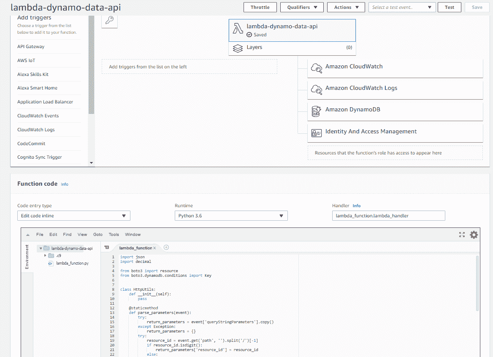

# 测试 Lambda 函数

现在我们已经部署了 Lambda 代码，可以在 AWS 管理控制台中测试它是否正常工作。执行以下步骤：

1.  登录到 AWS 管理控制台，并在[`console.aws.amazon.com/lambda/`](https://console.aws.amazon.com/lambda/)上打开 AWS Lambda 控制台。

1.  在 AWS Lambda 导航窗格中，选择函数。

1.  选择 lambda-dynamo-data-api。

1.  选择测试。

1.  在配置测试事件中，在事件名称下，键入`requestApiGatewayGetValid`，并在 JSON 文档中键入或复制并粘贴以下代码，覆盖旧代码：

```py
      {
       "body": "{"test":"body"}",
       "resource": "/{proxy+}",
       "requestContext": {
         "resourceId": "123456",
         "apiId": "1234567890",
         "resourcePath": "/{proxy+}",
         "httpMethod": "GET",
         "requestId": "c6af9ac6-7b61-11e6-9a41-93e8deadbeef",
         "accountId": "123456789012",
         "identity": {
           "apiKey": null,
           "userArn": null,
           "cognitoAuthenticationType": null,
           "caller": null,
           "userAgent": "Custom User Agent String",
           "user": null, "cognitoIdentityPoolId": null,
           "cognitoIdentityId": null,
           "cognitoAuthenticationProvider": null,
           "sourceIp": "127.0.0.1",
           "accountId": null
         },
         "stage": "prod"
       },
       "queryStringParameters": {
         "StartDate": "20171009"
       },
       "headers": {
         "Via": "1.1 08f323deadbeefa7af34e5feb414ce27
                 .cloudfront.net (CloudFront)",
         "Accept-Language": "en-US,en;q=0.8",
         "CloudFront-Is-Desktop-Viewer": "true",
         "CloudFront-Is-SmartTV-Viewer": "false", 
         "CloudFront-Is-Mobile-Viewer": "false",
         "X-Forwarded-For": "127.0.0.1, 127.0.0.2",
         "CloudFront-Viewer-Country": "US", "Accept":        
         "text/html,application/xhtml+xml,application/xml;q=0.9,
              image/webp,*/*;q=0.8",
         "Upgrade-Insecure-Requests": "1",
         "X-Forwarded-Port": "443", "Host": "1234567890
              .execute-api.us-east-1.amazonaws.com",
         "X-Forwarded-Proto": "https",
         "X-Amz-Cf-Id": "cDehVQoZnx43VYQb9j2-nvCh-
              9z396Uhbp027Y2JvkCPNLmGJHqlaA==",
         "CloudFront-Is-Tablet-Viewer": "false",
         "Cache-Control": "max-age=0",
         "User-Agent": "Custom User Agent String",
         "CloudFront-Forwarded-Proto": "https", "Accept-Encoding": 
              "gzip, deflate, sdch"
       },
       "pathParameters": {
         "proxy": "path/to/resource"
       },
       "httpMethod": "GET",
       "stageVariables": {
         "baz": "qux"
       },
       "path": "/path/to/resource/324"
      }
```

1.  以下是 API 网关`GET`请求 JSON 的一些重要部分：

+   请求使用`GET`方法从`"httpMethod": "GET"`中

+   资源或`EventID`是`324`，来自`"path": "/path/to/resource/324"`

+   查询参数来自`"queryStringParameters": { "StartDate": "20171009"}`

1.  选择创建。

1.  选择要运行测试的测试。

您应该从执行结果中看到，使用示例 API 网关`GET`请求成功通过了测试。这包括持续时间，内存使用和日志输出。展开详细信息以查看将发送到 DynamoDB 的响应。它应该类似于以下代码：

```py
{
  "statusCode": "200",
  "body": "[{"EventCount": 3, "EventDay": 20171001, "EventId": 
          "324"}]",
  "headers": { "Content-Type": "application/json", "Access-Control-
              Allow-Origin": "*"
 }
}
```

如果出现错误，请检查详细信息的日志输出，可能与 IAM 角色/策略，DynamoDB 名称或 Lambda 代码有关。

# 设置 API 网关并将其与 Lambda 代理集成

现在我们知道 Lambda 函数可以使用一些 API 网关测试数据，并返回具有`statusCode`为`200`的标头和正文，我们只需要添加将调用 Lambda 函数的 API 网关，如下图所示：

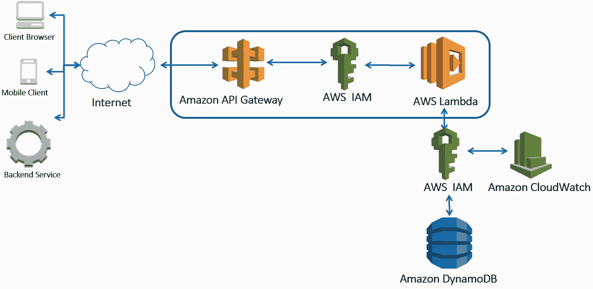

执行以下步骤：

1.  登录到 AWS 管理控制台，并在[`console.aws.amazon.com/apigateway/`](https://console.aws.amazon.com/apigateway/)上打开 API 网关控制台。

1.  选择开始使用，或者在亚马逊 API 网关导航窗格中，选择 API 并选择创建 API。

1.  在创建页面上，执行以下步骤：

1.  在选择协议中，选择 REST

1.  在创建新 API 中，选择新 API

1.  在设置下，输入 API 名称为`metrics`

1.  选择`区域`作为端点类型

1.  选择创建 API

1.  从操作下拉菜单中选择创建资源。

1.  在新的子资源窗口中，执行以下步骤：

1.  在资源名称中，键入`visits`

1.  在资源路径中，键入`visits`

1.  选择启用 API 网关 CORS

1.  选择创建资源。

1.  选择`/visits`资源，并从操作下拉菜单中选择创建资源。

1.  在新的子资源窗口中，执行以下步骤：

1.  在资源名称中，键入`{resourceId}`

1.  在资源路径中，键入`{resourceId}`，替换默认的`-resourceId-`值

1.  检查启用 API 网关 CORS

1.  选择创建资源

1.  选择`/Vists/{resourceId}`资源，并从操作下拉菜单中选择创建方法。

1.  选择下拉菜单中的 GET，然后选择其右侧的复选标记。

1.  选择`/visits/{resourceId} - GET - Setup`窗口中的 GET 资源方法：

1.  在集成类型中，选择 Lambda 函数

1.  检查使用 Lambda 代理集成

1.  在 Lambda 区域中，从下拉菜单中选择您的区域

1.  1.  在 Lambda 函数中，键入`lambda-dynamo-data-api`

1.  检查使用默认超时

1.  选择保存

1.  在添加权限到 Lambda 函数中选择 OK。这将允许 API 网关调用 Lambda 函数。

现在您应该有一个看起来像以下截图的 API 网关 GET - 方法执行：

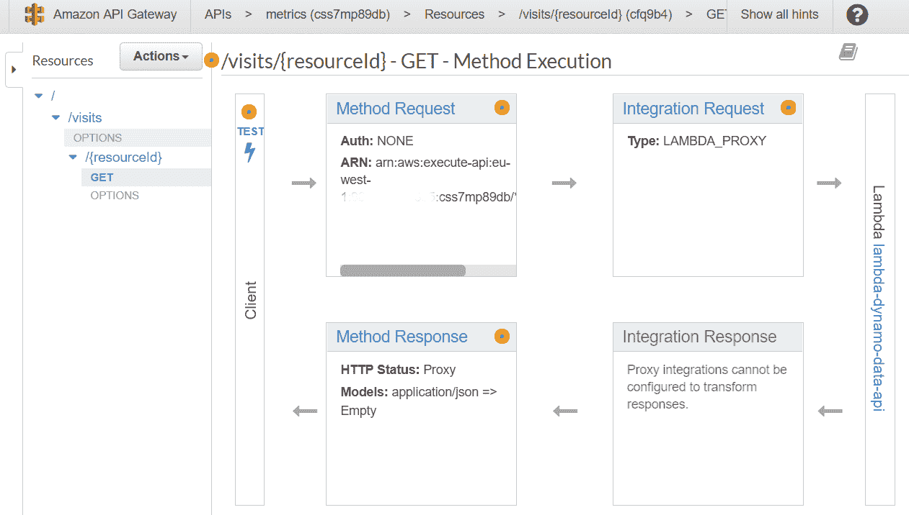

最后，通过执行以下步骤进行快速测试以确保其正常工作：

1.  在左侧的资源菜单中选择`/visits/{resourceId} - GET`

1.  选择测试

1.  在路径{resourceId}下键入`324`

1.  选择测试

您应该看到状态 200、延迟、日志和 JSON 响应正文，如下代码所示：

```py
[ 
   {
     "EventCount": 3,
     "EventDay": 20171001,
     "EventId": "324"
   },
   {
     "EventCount": 5,
     "EventDay": 20171002,
     "EventId": "324"
   }
]
```

如果您没有收到`2XX`状态代码，那么请查看日志，这将帮助您诊断问题。它可能与安全 IAM 角色有关。

# 连接 API 网关、Lambda 和 DynamoDB

现在我们知道 API 网关与 Lambda 函数的集成工作正常，我们将部署它并获取 URL。架构如下图所示：

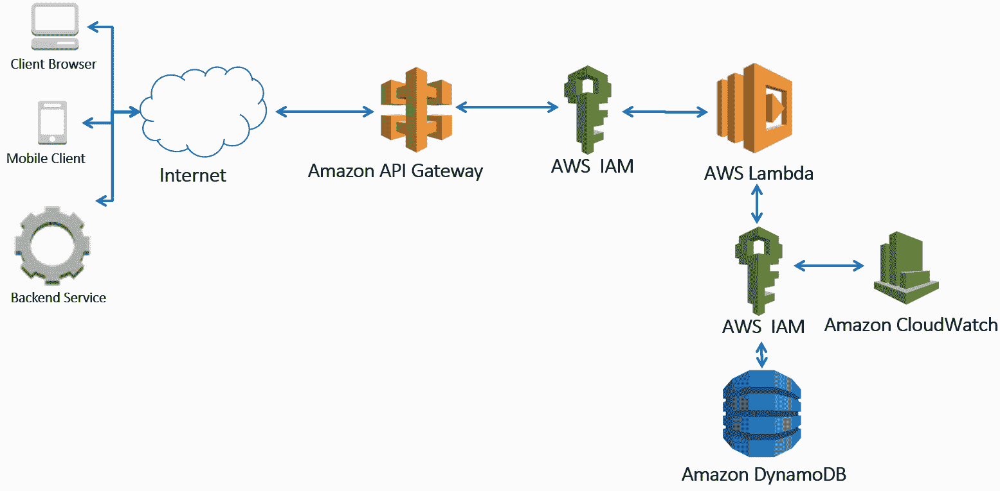

这种架构的工作原理如下：

1.  登录到 AWS 管理控制台，并在[`console.aws.amazon.com/apigateway/`](https://console.aws.amazon.com/apigateway/)上打开 API 网关控制台。

1.  在 Amazon API Gateway 导航窗格中，选择 API 和指标。

1.  在指标下选择资源和`/Vists/{resourceId}`，然后从操作下拉菜单中选择部署 API。

1.  在部署 API 弹出窗口中，执行以下步骤：

1.  在部署阶段中，选择[新阶段]

1.  在阶段名称中，键入`prod`

1.  在阶段描述中，键入`prod`

1.  选择“部署”

1.  指标下的阶段应自动在左侧菜单上选择。

1.  选择`prod/visits/{resourceId}/GET`下的 GET 以获取调用 URL。调用 URL 应如下所示：`https://{restapi_id}.execute-api.{region}.amazonaws.com/prod/visits/{resourceId}`。

1.  在新的浏览器选项卡中粘贴调用 URL：`https://{restapi_id}.execute-api.{region}.amazonaws.com/Prod/visits/{resourceId}`：

+   响应正文将是`{"message": "Internal server error"}`

+   这是因为我们在查询 DynamoDB 之前在 URL`parse_parameters()`函数中验证了`resource_id`，以确保它是一个数字

1.  在新的浏览器选项卡中粘贴调用 URL：`https://{restapi_id}.execute-api.{region}.amazonaws.com/prod/visits/324`。因为我们在内部使用了正确的`resourceId`或`EventId`，您应该在浏览器选项卡中看到以下代码：

```py
      [{
           "EventCount": 3,
           "EventDay": 20171001,
           "EventId": "324"
      },
      {
           "EventCount": 5,
           "EventDay": 20171002,
           "EventId": "324"
      }]
```

1.  在新的浏览器选项卡中粘贴调用 URL：`https://{restapi_id}.execute-api.{region}.amazonaws.com/Prod/visits/324?startDate=20171002`。因为我们添加了`startDate=20171002`参数，您应该在浏览器选项卡中看到以下代码：

```py
      [{"EventCount": 5, "EventDay": 20171002, "EventId": "324"}]
```

这是使用 Lambda 中的`query_by_partition_and_sort_key()`方法和`startDate`。

现在我们有一个完全可用的无服务器数据 API，能够在 DynamoDB 上运行不同类型的查询。

# 清理

您需要手动删除资源。我建议您使用 AWS 控制台进行操作。执行以下步骤：

1.  删除 API 网关：

1.  登录到控制台[`console.aws.amazon.com/apigateway/`](https://console.aws.amazon.com/apigateway/)

1.  在左侧 API 菜单下选择资源

1.  从操作下拉菜单中选择删除 API

1.  在确认此操作文本框中键入 API 的名称

1.  选择删除 API

1.  删除 DynamoDB 表：

1.  登录到[`console.aws.amazon.com/dynamodb/`](https://console.aws.amazon.com/dynamodb/)控制台

1.  在左侧 DynamoDB 菜单上选择表

1.  选择用户访问

1.  选择删除表

1.  选择删除

1.  删除 Lambda 函数：

1.  登录到[`console.aws.amazon.com/lambda/`](https://console.aws.amazon.com/lambda/)控制台

1.  在左侧 AWS Lambda 菜单上选择函数

1.  选择 lambda-dynamo-data-api

1.  在操作菜单下选择删除函数

1.  选择删除

1.  删除 IAM 角色和策略：

1.  登录到[`console.aws.amazon.com/iam/`](https://console.aws.amazon.com/iam/)控制台

1.  在 IAM 导航窗格中选择角色

1.  选择 lambda-dynamo-data-api

1.  在右上角选择删除角色

1.  选择是

1.  在 IAM 导航窗格中选择策略

1.  在筛选策略下选择客户管理

1.  选择 dynamo-readonly-user-visits 旁边的单选按钮，并在策略操作菜单下选择删除

1.  在弹出窗口中选择删除

1.  选择 lambda-cloud-write 旁边的单选按钮，并在策略操作菜单下选择删除

1.  在弹出窗口中选择删除

# 摘要

在本章中，我们讨论了安全性以及其重要性。应用 OWASP 安全设计原则是确保您的无服务器堆栈安全的良好第一步。然后，我们讨论了 IAM 角色，并概述了策略，解释了它们是确保对 AWS 资源受限访问的关键文档。然后，我们概述了一些关于保护您的无服务器微服务安全性概念和原则，特别是关于 Lambda，API Gateway 和 DynamoDB 的安全性。

然后，我们构建了一个可扩展的无服务器微服务，具有 RESTful 数据 API。我们首先创建了一个 DynamoDB 表，然后向其中添加数据，并进行了查询，首先是在 AWS 控制台手动操作，然后使用 Python Boto3 SDK。然后，我们构建了一个简单的 Lambda 来解析请求 URL 参数，查询 DynamoDB，并将记录作为响应主体的一部分返回。然后，我们查看了 Lambda 和 API Gateway 之间的集成设置。然后通过部署 API 将所有内容连接在一起。我们创建了一个完全可扩展的 API，您可以非常轻松地调整以适应自己的用例，并且非常具有成本效益。在不到 30 分钟的时间内，您已经创建了一个具有 API 的高度可扩展的无服务器微服务。API Gateway 和 Lambda 成本是按使用量付费的。对于 DynamoDB，您实际上可以非常轻松地更改读取和写入容量，设置根据负载自动扩展读取和写入容量，或者甚至通过按实际使用量付费的按需容量模式付费，使其完全按 API 使用量和存储的数据付费，避免传统的容量规划或过度配置。

我们在 AWS 控制台中做了很多工作，但在后续章节中，我们将使用 AWS CLI 或使用代码部署流水线来完成大部分工作。但是，使用 AWS 控制台应该让您对在 AWS 中可以做什么以及 Lambda 如何与 DynamoDB 和 API Gateway 集成有很好的理解。当我们使用配置、脚本和代码自动化大部分创建和配置时，这种坚实的基础非常有用。在接下来的章节中，我们将添加更多功能，自动化测试和部署流水线，并实施微服务模式。

在您的组织中，您将开发大量源代码，并且不希望像我们在本章中所做的那样手动部署它。您将首先希望自动测试代码，以确保其按预期工作，然后以可重复的方式部署堆栈。这对于在生产中使用的持续集成或持续交付系统是必需的。

在下一章中，我们将讨论如何使用代码和配置部署您的无服务器微服务，以使该过程更具重复性和可扩展性。
