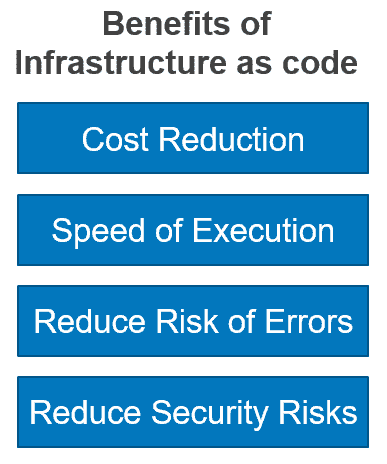
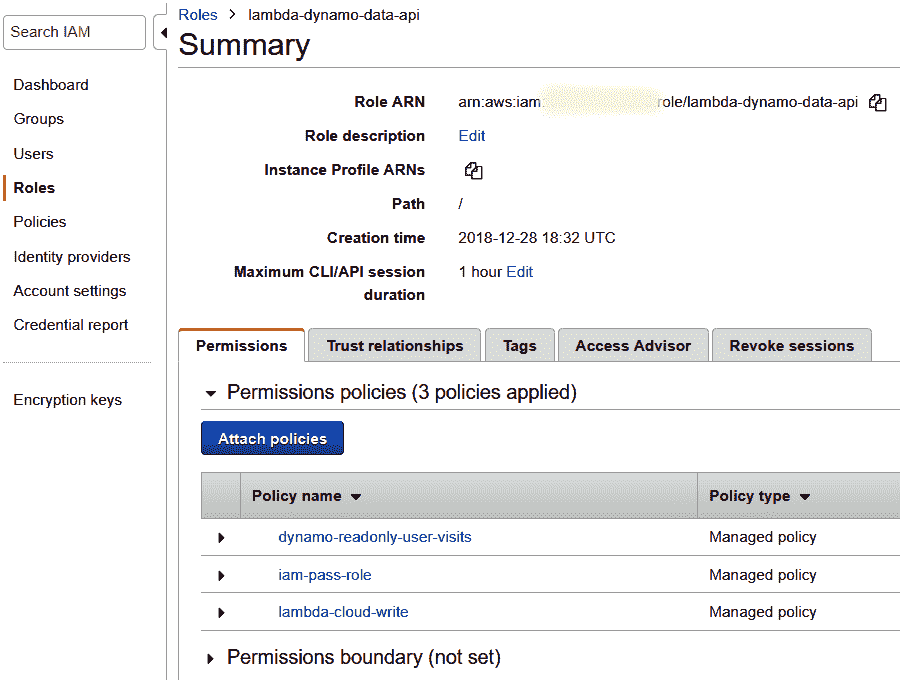
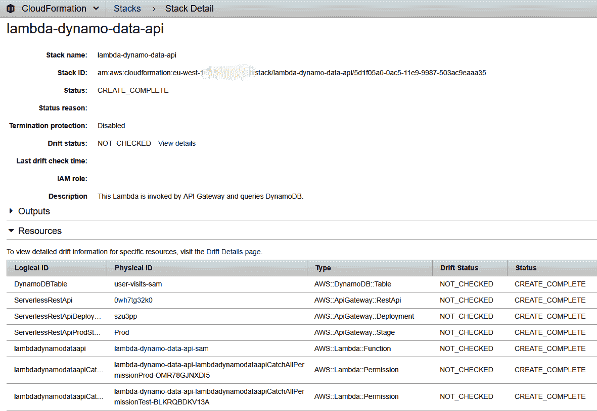
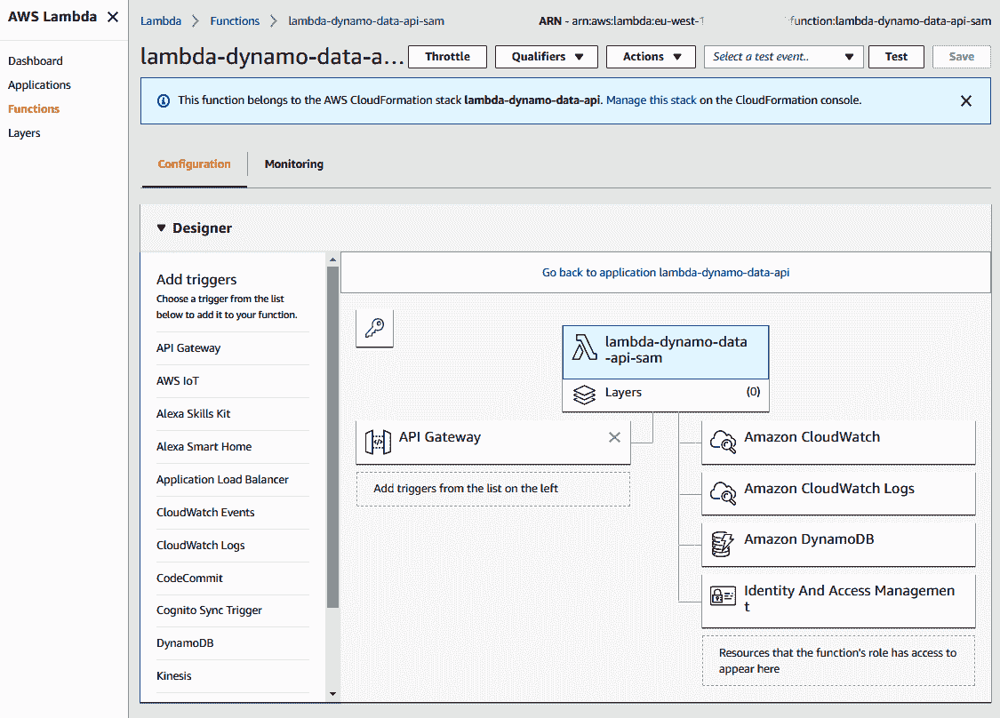

# 第三章：部署您的无服务器堆栈

在上一章中，我们使用 API Gateway、Lambda 和 DynamoDB 创建了一个完全功能的无服务器数据 API，并使用 IAM 角色进行了测试。然而，大部分的代码和配置都是手动部署的；这个过程容易出错，不可重复，也不可扩展。

在本章中，我们将向您展示如何仅使用代码和配置来部署所有这些基础设施。涵盖的主题如下：

+   无服务器堆栈构建和部署选项概述

+   创建配置文件、S3 存储桶、IAM 策略和 IAM 角色资源

+   使用 API Gateway、Lambda 和 DynamoDB 构建和部署

# 无服务器堆栈构建和部署选项概述

在本节中，我们将讨论手动配置基础设施、基础设施即代码、使用无服务器应用程序模型构建和部署，以及使用替代选项构建和部署时面临的挑战。

# 手动配置基础设施

配置基础设施的挑战在于它曾经是一个非常手动的过程。例如，管理员会按照手册中描述的步骤点击用户界面上的项目，运行一系列命令，或者登录服务器并编辑配置文件。随着云计算和开始扩展的 Web 框架的增长，这变得越来越具有挑战性。这可以通过单片架构和它们共享的 Web 服务器或应用服务器来完成。然而，使用微服务架构，使用不同语言开发的不同 Web 服务器和数据库，以及运行的数千个服务需要独立测试、构建和部署。

手动部署服务在成本方面需要付出很多努力，也很难在规模上维护这样的配置。服务的部署变得更加缓慢，也更难从任何错误中恢复，因为您可能需要管理员通过 SSH 远程连接到您的服务器，重新启动机器，或者尝试理解问题所在，并多次更改多台机器的配置。测试和使任何过程可重复也非常困难。无论是使用用户界面还是编辑一个服务器上的配置文件进行的任何配置更改，都不太可重复，也容易出现人为错误或配置错误。例如，在之前的章节中我们使用了 AWS 管理控制台。如果您在任何配置中出现错误，您将不得不返回诊断问题并进行修复，这将非常耗时。

在下一节中，我们将讨论基础设施即代码以及它如何帮助解决手动配置基础设施或部署服务时遇到的问题。

# 基础设施即代码

基础设施即代码基本上是通过定义文件或代码来管理和配置资源的过程。它提供了一种集中管理配置的方式，涉及实施和版本控制。突然之间，资源管理和配置变得更像是软件开发生命周期中的敏捷过程。所有更改都经过验证、测试，并作为发布过程的一部分进行配置，并使用标准的部署流程。这也提供了将用于在一个区域部署基础设施的配置复制到另一个区域的能力。

例如，假设您使用代码和配置在北弗吉尼亚地区部署基础设施，您可以轻松修改它以使其在爱尔兰地区运行。这使您能够快速扩展基础设施周围的配置，从而导致了术语 DevOps 的发展。这是开发人员在配置方面更加参与，特别是在基础设施周围，而运维团队（或运维团队）在开发过程中更加参与。以下图表显示了基础设施即代码的不同优势：



使用基础设施即代码有许多好处。第一个是成本降低，因为您在简单和重复的任务上花费的精力要少得多。在扩展或部署类似基础设施时，您还可以降低成本。

在构建任何系统时，我通常喜欢构建它以便它可以在两个环境中运行。一旦它在两个环境中运行，它就可以在许多环境中运行。例如，如果您使用命名约定作为每个环境的前缀或变量构建代码，例如**dev**代表**development**，**stg**代表**staging**，并在部署时进行替换，那么我们以后可以轻松地为**production**添加**prd**前缀。始终强烈建议使用标准命名约定。另一个例子可能是始终将三个字符作为约定或规则，这样您就不会陷入具有多个前缀的情况，例如 prod 或 production，这可能会引入意外错误。在配置文件中，将被替换的环境变量可能看起来像`${env}`。

另一个要点是执行速度；也就是说，您的管理员或 DevOps 团队实际上可以比以前更快地发布基础设施和服务。此外，通过在每个步骤进行跟踪、验证和测试，有助于减少错误和问题的数量。总的来说，这有助于降低风险并提高安全性。由于有了这种可追溯性，您可以了解部署了什么，以及它是否成功，或者它是否导致问题并应该回滚。

# 使用无服务器应用程序模型（SAM）构建和部署

最近出现的一个工具是由 AWS 维护的 SAM（[`github.com/awslabs/serverless-application-model`](https://github.com/awslabs/serverless-application-model)）。它允许您构建和部署无服务器堆栈。它提供了一种简化的方式来定义和部署任何无服务器资源或应用程序。在其基础上，它采用了云形成，但使用的源代码行数比使用 AWS 命令行要少。使用 SAM 模板文件的基本概念是它可以是包含所有无服务器配置的 JSON 或 YAML 文件，其吉祥物是松鼠 SAM。

# 使用备选选项构建和部署

部署 AWS 无服务器堆栈有替代选项。第一个选项是 AWS 命令行界面（CLI）。当您的组织不想为所有内容或部分无服务器堆栈使用云形成堆栈时，AWS CLI 是一个选择。AWS CLI 在功能发布方面通常领先于 SAM。因此，在本书中，我使用一些命令来补充 SAM 中尚未构建的部分。

Serverless Framework，最初称为 JAWS，是使用 Node.js 技术构建的。它在最初发布时领先于时代，但现在随着 AWS SAM 的出现，它是由第三方维护的 AWS 顶层附加层。然而，它确实允许您使用其他云提供商的其他功能，例如 Google 和 Azure，这是一个很棒的功能，但我个人质疑在不同云提供商之间重用函数代码的事件源、安全性和数据形状都是不同的。

Chalice 和 Zappa 是基于 Python 的 AWS 框架，类似于 Python Flask 和 Bottle 微型 Web 框架，但它们又是 AWS 的另一种抽象。您需要等待任何改进通过。

此外，还存在一种风险，即依赖这些框架当 AWS 功能被弃用时。您需要与它们保持同步，或者依赖于这些其他框架的开源贡献者来实际进行更改或直接贡献。如果我必须选择一个，我会选择 SAM，但我也接受一些人更喜欢无服务器。

SAM 需要一个 S3 存储桶来进行包部署，Lambda 需要 IAM 策略和 IAM 角色。接下来让我们来看看这些。

# 创建配置文件、S3 存储桶、IAM 策略和 IAM 角色资源

我们首先设置一个 S3 存储桶，用于保存 Lambda 部署包的源代码。IAM 策略和角色允许 API Gateway 调用 Lambda，并允许 Lambda 访问 DynamoDB。我们使用 AWS 管理控制台设置它们；在这里，我们将使用 AWS CLI 和 SAM。

本章中使用的代码、shell 脚本和配置文件都可以在`./serverless-microservice-data-api/`文件夹下找到。

# 创建 AWS 凭据配置文件

按照以下步骤创建 AWS 凭据配置文件：

1.  创建名为`demo`的 AWS 配置文件：

```py
$ aws configure --profile demo
```

1.  在`Chapter 1`中重新输入与`newuser`相关的相同的 AWS `aws_access_key_id`和`aws_secret_access_key`详细信息。

或者，您可以通过复制`[default]`来复制`[default]`配置文件，并创建一个`[demo]`的新条目，如下所示：

```py
 $ vi ~/.aws/credentials
      [default]
      aws_access_key_id =
      AAAAAAAAAAAAAAAAAAAA
      aws_secret_access_key =
      1111111111111111111111111111111111111111

      [demo]
      aws_access_key_id =
      AAAAAAAAAAAAAAAAAAAA
      aws_secret_access_key =
      1111111111111111111111111111111111111111
```

本书提供的代码需要一个配置文件名称（这里是`demo`）来使用正确的密钥；如果您使用其他配置文件名称，请在每个项目的 shell 脚本`common-variables.sh`中更改它。

# 创建一个 S3 存储桶

要部署 Lambda 源代码，您需要使用现有的 S3 存储桶或创建一个新的——使用以下代码来创建一个：

```py
$ aws s3api create-bucket --bucket <you-bucket-name> --profile demo --create-bucket-configuration LocationConstraint=<your-aws-region> --region <your-aws-region>
```

确保`<your-bucket-name>`是可寻址的，它必须遵循 DNS 命名约定。要选择您的 AWS 区域，请参考 AWS 区域和终端点（[`docs.aws.amazon.com/general/latest/gr/rande.html`](https://docs.aws.amazon.com/general/latest/gr/rande.html)）。通常，美国用户可以使用`us-east-1`，欧洲用户可以使用`eu-west-1`。

# 为您的 AWS 账户设置配置文件

我已经为`./bash/`下的每个无服务器项目创建了一个名为`common-variables.sh`的配置文件，该文件创建了 AWS CLI 和 SAM 使用的环境变量。您需要使用您的 AWS 账户详细信息对它们进行修改。这样做是为了为在多个地区支持多个 AWS 账户打下基础。以下是`common-variables.sh`的示例：

```py
#!/bin/sh
export profile="demo"
export region="<your-aws-region>"
export aws_account_id=$(aws sts get-caller-identity --query 'Account' --profile $profile | tr -d '\"')
# export aws_account_id="<your-aws-accountid>"
export template="lambda-dynamo-data-api"
export bucket="<you-bucket-name>"
export prefix="tmp/sam"

# Lambda settings
export zip_file="lambda-dynamo-data-api.zip"
export files="lambda_return_dynamo_records.py"

```

让我们试着理解这段代码：

+   使用您的 AWS 区域（例如`us-east-1`）更新`<your-aws-region>`。

+   我正在动态确定`aws_account_id`，但您也可以像注释中所示那样硬编码它，在这种情况下，请取消注释该行，并将`<your-aws-accountid>`更新为您的 AWS 账户 ID。如果您不知道它，您可以在 AWS 管理控制台|支持|支持中心屏幕中找到您的账户号码。

+   `template`是我们将使用的 SAM 模板的名称。

+   `bucket`和`prefix`定义了部署的 Lambda 包的位置。

# 更新策略和假定角色文件

您需要更改存储在`./IAM`文件夹下的 IAM 策略文档中的 AWS `aws_account_id`（当前设置为`000000000000`）。此外，当前设置为`eu-west-1`的区域也必须更改。

要替换您的`aws_account_id`（假设您的 AWS `aws_account_id`是`111111111111`），您可以手动执行，也可以运行以下命令：

```py
$ find ./ -type f -exec sed -i '' -e 's/000000000000/111111111111/' {} \;
```

# 创建 IAM 角色和策略

我们在 AWS 管理控制台中手动创建了 IAM 策略和角色。现在我们将看看如何使用 AWS CLI 创建这些。

以下是我们在`./IAM/`目录下创建的 JSON 策略`dynamo-readonly-user-visits.json`：

```py
{
    "Version": "2012-10-17",
    "Statement": [
        {
            "Effect": "Allow",
            "Action": [
                "dynamodb:BatchGetItem",
                "dynamodb:DescribeTable",
                "dynamodb:GetItem",
                "dynamodb:Query",
                "dynamodb:Scan"
            ],
            "Resource": [
                "arn:aws:dynamodb:eu-west-1:000000000000:
                 table/user-visits",
                "arn:aws:dynamodb:eu-west-1:000000000000:
                 table/user-visits-sam"         
            ]
        }
    ]
}
```

总结一下策略，它表示我们对两个名为`user-visits`的 DynamoDB 表具有`Query`和`Scan`访问权限，这些表可以手动创建或在 Python 中创建，以及我们将在本章中使用 SAM 创建的`user-visits-sam`。

创建一个允许 Lambda 函数将日志写入 CloudWatch 日志的策略。创建一个名为`lambda-cloud-write.json`的文件，内容如下：

```py
{
  "Version": "2012-10-17",
  "Statement": [
    {
      "Effect": "Allow",
      "Action": [
        "logs:CreateLogGroup",
        "logs:CreateLogStream",
        "logs:PutLogEvents",
        "logs:DescribeLogStreams"
    ],
      "Resource": [
        "arn:aws:logs:*:*:*"
    ]
  },
  {
      "Effect": "Allow",
      "Action": [
        "cloudwatch:PutMetricData"
      ],
      "Resource": "*"
    }
 ]
}
```

创建 IAM 角色时，还需要指定它可以承担的 IAM 角色类型。我们创建了一个名为`assume-role-lambda.json`的文件，这被称为受信任的实体：

```py
{
  "Version": "2012-10-17",
  "Statement": [
    {
      "Sid": "",
      "Effect": "Allow",
      "Principal": {
        "Service": "lambda.amazonaws.com"
      },
      "Action": "sts:AssumeRole"
    }
  ]
}
```

将上述内容定义为 JSON 代码使我们能够在 AWS 中对安全性和权限进行版本控制。此外，如果有人错误地删除了它们，我们可以在 AWS 中简单地重新创建它们。

我们现在将创建一个名为`create-role.sh`的 shell 脚本，在`./bash`文件夹下，以创建一个 Lambda IAM 角色和三个 IAM 策略，并将它们附加到 IAM 角色：

```py
#!/bin/sh
#This Script creates a Lambda role and attaches the policies

#import environment variables
. ./common-variables.sh

#Setup Lambda Role
role_name=lambda-dynamo-data-api
aws iam create-role --role-name ${role_name} \
    --assume-role-policy-document file://../../IAM/assume-role-lambda.json \
    --profile $profile || true

sleep 1
#Add and attach DynamoDB Policy
dynamo_policy=dynamo-readonly-user-visits
aws iam create-policy --policy-name $dynamo_policy \
    --policy-document file://../../IAM/$dynamo_policy.json \
    --profile $profile || true

role_policy_arn="arn:aws:iam::$aws_account_id:policy/$dynamo_policy"
aws iam attach-role-policy \
    --role-name "${role_name}" \
    --policy-arn "${role_policy_arn}"  --profile ${profile} || true

#Add and attach cloudwatch_policy
cloudwatch_policy=lambda-cloud-write
aws iam create-policy --policy-name $cloudwatch_policy \
    --policy-document file://../../IAM/$cloudwatch_policy.json \
    --profile $profile || true

role_policy_arn="arn:aws:iam::$aws_account_id:policy/$cloudwatch_policy"
aws iam attach-role-policy \
    --role-name "${role_name}" \
    --policy-arn "${role_policy_arn}"  --profile ${profile} || true
```

使用`./create-role.sh`执行脚本。它将创建一个 IAM 角色和三个 IAM 策略，并将它们附加到 IAM 角色。请注意，此处的代码是有意幂等的，因为策略更改需要谨慎管理，因为它们可能会影响其他人。

请注意，还可以在 SAM 模板中创建 IAM 角色，但是使用 AWS CLI 意味着在删除无服务器堆栈时可以重用角色和策略，而不是删除它们。如果将它们检入 Git 标准命名约定，则可以添加版本控制，并通过集中创建来帮助支持团队。

# 检查 IAM 角色和策略

AWS CLI 会在创建 IAM 角色和策略时给您反馈，但您也可以在 AWS 管理控制台中检查：

1.  登录 AWS 管理控制台，并在[`console.aws.amazon.com/iam/`](https://console.aws.amazon.com/iam/)上打开 IAM 控制台。

1.  在 IAM 导航窗格中，选择角色。

1.  从角色列表中选择`lambda-dynamo-data-api`。

1.  在权限选项卡下选择显示更多权限策略。

您应该看到以下三个附加的策略：



# 使用 API Gateway，Lambda 和 DynamoDB 构建和部署

部署无服务器堆栈涉及三个步骤：

1.  将 Lambda 构建为 ZIP 包

1.  使用 SAM 和 CloudFormation 打包您的无服务器堆栈

1.  使用 SAM 和 CloudFormation 部署您的无服务器堆栈

# 将 Lambda 构建为 ZIP 包

如果尚未安装 ZIP，请安装 ZIP。对于 Ubuntu/Debian，您可以使用`sudo apt-get install zip -y`。创建一个名为`create-lambda-package.sh`的文件，内容如下：

```py
#!/bin/sh
#setup environment variables
. ./common-variables.sh

#Create Lambda package and exclude the tests to reduce package size
(cd ../../lambda_dynamo_read;
mkdir -p ../package/
zip -FSr ../package/"${zip_file}" ${files} -x *tests/*)
```

这将仅在源代码发生更改时创建 Lambda 代码的 ZIP 文件。这是将部署到 AWS 的内容，并且在需要打包第三方库时，将这些命令分开具有优势。

# SAM YAML 模板

我们将使用 SAM 模板创建无服务器堆栈。SAM 使用 YAML 或 JSON，并允许您定义 Lambda 函数和 API Gateway 设置，以及创建 DynamoDB 表。模板如下所示：

```py
AWSTemplateFormatVersion: '2010-09-09'
Transform: 'AWS::Serverless-2016-10-31'
Description: >-
  This Lambda is invoked by API Gateway and queries DynamoDB.
Parameters:
    AccountId:
        Type: String
Resources:
  lambdadynamodataapi:
    Type: AWS::Serverless::Function
    Properties:
      Handler: lambda_return_dynamo_records.lambda_handler
      Runtime: python3.6
      CodeUri: ../../package/lambda-dynamo-data-api.zip
      FunctionName: lambda-dynamo-data-api-sam
      Description: >-
        This Lambda is invoked by API Gateway and queries DynamoDB.
      MemorySize: 128
      Timeout: 3  
      Role: !Sub 'arn:aws:iam::${AccountId}:
                  role/lambda-dynamo-data-api'
      Environment:
        Variables:
          environment: dev
      Events:
        CatchAll:
          Type: Api
          Properties:
            Path: /visits/{resourceId}
            Method: GET
  DynamoDBTable:
    Type: AWS::DynamoDB::Table
    Properties:
      TableName: user-visits-sam
      SSESpecification:
        SSEEnabled: True
      AttributeDefinitions:
        - AttributeName: EventId
          AttributeType: S
        - AttributeName: EventDay
          AttributeType: N
      KeySchema:
        - AttributeName: EventId
          KeyType: HASH
        - AttributeName: EventDay
          KeyType: RANGE
      ProvisionedThroughput:
        ReadCapacityUnits: 1
        WriteCapacityUnits: 1
```

从上到下，我们首先指定模板类型，描述，并传递一个字符串参数`AccountId`。然后，我们指定 Lambda 的细节，例如`Handler`，这是入口点，ZIP 代码的位置，并为函数指定名称和描述。然后，我们选择 128 MB 的 RAM，因为这是一个概念验证，我们不需要更多的内存；我们为超时指定`3`。之后，即使 Lambda 仍在运行，它也会终止；这限制了成本，并且是合理的，因为我们期望同步响应。然后，我们有 IAM Lambda 执行角色，其中包含`${AccountId}`参数，该参数在部署无服务器堆栈时传递。

我们看到如何添加将在 Lambda 函数中可用的环境变量。变量是`environment: dev`。

然后我们有 Lambda 函数的触发器或事件源。在这里，我们创建了一个 API Gateway，其中包含`/visits/{resourceId}`路径的资源，使用`GET`方法调用一个带有`resourceId`的 Lambda 函数，该`resourceId`将是`EventId`。

最后，我们使用 Python 创建了一个 DynamoDB 表，其中`EventId`的哈希数据类型为`string`，`EventDay`的范围数据类型为`number`。为了降低成本（或免费），我将读取和写入容量设置为`1`。

因此，在一个 SAM YAML 文件中，我们已经配置了 Lambda，具有其 Lambda 集成的 API Gateway，并创建了一个新的 DynamoDB 表。

对于 DynamoDB，我强烈建议在 SAM 创建的资源末尾附加`sam`，以便知道其来源。我还建议，如果 DynamoDB 表在服务之间共享，最好使用 Boto3 或 AWS CLI 进行创建。这是因为删除一个无服务器堆栈可能意味着该表对所有服务都被删除。

# 打包和部署您的无服务器堆栈

一旦具有策略的 IAM 角色，具有 Lambda 代码的 ZIP 包和 SAM 模板都创建好了，您只需要运行两个 CloudFormation 命令来打包和部署您的无服务器堆栈。

第一个命令将 Lambda 代码与 SAM 模板打包并推送到 S3：

```py
$ aws cloudformation package --template-file $template.yaml \
    --output-template-file ../../package/$template-output.yaml \
    --s3-bucket $bucket --s3-prefix backend \
    --region $region --profile $profile

Successfully packaged artifacts and wrote output template to file ../../package/lambda-dynamo-data-api-output.yaml.
Execute the following command to deploy the packaged template
aws cloudformation deploy --template-file /mnt/c/serverless-microservice-data-api/package/lambda-dynamo-data-api-output.yaml --stack-name <YOUR STACK NAME>
```

第二个命令将其部署到 AWS：

```py
$ aws cloudformation deploy --template-file ../../package/$template-output.yaml \
    --stack-name $template --capabilities CAPABILITY_IAM \
    --parameter-overrides AccountId=${aws_account_id} \
    --region $region --profile $profile

Waiting for changeset to be created..
Waiting for stack create/update to complete
Successfully created/updated stack - lambda-dynamo-data-api
```

SAM 中的一个很棒的功能是能够使用参数。在这里，当我们使用`--parameter-overrides AccountId=${aws_account_id}`部署堆栈时就可以实现。好处是我们可以在多个环境中重用相同的 SAM 模板，例如 AWS 帐户和区域，以及任何其他参数。

您可以通过检查 AWS 管理控制台来验证堆栈是否已正确部署到 AWS：

1.  登录到 AWS 管理控制台[`console.aws.amazon.com/cloudformation/`](https://console.aws.amazon.com/cloudformation/)。

1.  选择管理和治理| CloudFormation 或在“查找服务”下搜索 CloudFormation。

1.  在 CloudFormation 窗格中，选择 lambda-dynamo-data-api。

1.  选择事件。这显示了不同的事件，并且在部署堆栈时非常有用。通常，这将是命名冲突（例如，具有相同名称的 DynamoDB 表存在）或 IAM 相关问题（例如，角色不存在）。

1.  选择资源。这显示了由此 CloudFormation 堆栈管理的资源：



您还可以直接检查 AWS 管理控制台，以确保 API Gateway，Lambda 函数和 DynamoDB 表已正确创建。

例如，这是我们使用 Python 创建的相同 Lambda，但由 SAM 部署和管理。除非您正在进行概念验证，建议进一步的更改通过配置更改而不是 AWS 管理控制台中的更改进行管理，因为这将破坏基础架构作为代码和自动化：



# 将所有内容放在一起

在本章中，我们部署了一个完全可工作的无服务器堆栈，无需使用用户界面配置任何设置。这是部署基础设施和代码的推荐方式，因为它更具可重复性，可扩展性，并且不太容易出错。它还允许您在一切都在 Git 中进行版本控制时执行诸如还原配置之类的操作。

`./serverless-microservice-data-api/bash`文件夹下提供的 shell 脚本：

+   `common-variables.sh`：其他脚本使用的环境变量

+   `create-role.sh`：Lambda IAM 角色创建并附加了三个策略

+   `lambda-dynamo-data-api.yaml`：定义 SAM YAML 模板

+   `create-lambda-package.sh`：创建 Lambda ZIP 包

+   `build-package-deploy-lambda-dynamo-data-api.sh`：编排 Lambda ZIP 的构建，打包和部署

以下是`build-package-deploy-lambda-dynamo-data-api.sh`的内容，当您修改 Lambda 代码或其他 SAM 配置设置时，可以运行它：

```py
#!/usr/bin/env bash

# Variables
. ./common-variables.sh

#Create Zip file of your Lambda code (works on Windows and Linux)
./create-lambda-package.sh

#Package your Serverless Stack using SAM + Cloudformation
aws cloudformation package --template-file $template.yaml \
    --output-template-file ../../package/$template-output.yaml \
    --s3-bucket $bucket --s3-prefix backend \
    --region $region --profile $profile

#Deploy your Serverless Stack using SAM + Cloudformation
aws cloudformation deploy --template-file ../../package/$template-output.yaml \
    --stack-name $template --capabilities CAPABILITY_IAM \
    --parameter-overrides AccountId=${aws_account_id} \
    --region $region --profile $profile
```

# 手动测试无服务器微服务

测试步骤如下：

1.  登录到 AWS 管理控制台，在[`console.aws.amazon.com/apigateway/`](https://console.aws.amazon.com/apigateway/)打开 API Gateway 控制台。

1.  在 Amazon API Gateway 导航窗格中，选择 API | lambda-dynamo-data-api | Stages。

1.  在`Prod/visits/{resourceId}/GET`下选择 GET 以获取调用 URL，应该看起来像`https://{restapi_id}.execute-api.{region}.amazonaws.com/Prod/visits/{resourceId}`。

1.  打开一个新的浏览器选项卡，输入`https://{restapi_id}.execute-api.{region}.amazonaws.com/Prod/visits/{resourceId}` URL。您将获得`{"message":"resource_id not a number"}`响应正文。这是因为我们在查询 DynamoDB 之前通过`parse_parameters()` URL 函数验证了`resource_id`，以确保它是一个数字。

1.  打开一个新的浏览器选项卡，输入`https://{restapi_id}.execute-api.{region}.amazonaws.com/Prod/visits/324` URL。由于我们使用了正确的`resourceId`，您应该在浏览器选项卡中看到[ ]。

为什么我们没有得到数据？

好吧，没有数据加载到`user-visits-sam` DynamoDB 表中，这就是为什么！

运行`python3 ./aws_dynamo/dynamo_modify_items.py`将一些记录加载到`user-visits-sam` DynamoDB 表中。

以下是`dynamo_modify_items.py`的内容：

```py
from boto3 import resource

class DynamoRepository:
    def __init__(self, target_dynamo_table, region='eu-west-1'):
        self.dynamodb = resource(service_name='dynamodb', region_name=region)
        self.target_dynamo_table = target_dynamo_table
        self.table = self.dynamodb.Table(self.target_dynamo_table)

    def update_dynamo_event_counter(self, event_name, 
            event_datetime, event_count=1):
        return self.table.update_item(
            Key={
                'EventId': event_name,
                'EventDay': event_datetime
            },
            ExpressionAttributeValues={":eventCount": event_count},
            UpdateExpression="ADD EventCount :eventCount")

def main():
    table_name = 'user-visits-sam'
    dynamo_repo = DynamoRepository(table_name)
    print(dynamo_repo.update_dynamo_event_counter('324', 20171001))
    print(dynamo_repo.update_dynamo_event_counter('324', 20171001, 2))
    print(dynamo_repo.update_dynamo_event_counter('324', 20171002, 5))

if __name__ == '__main__':
    main()
```

现在在浏览器中转到相同的端点，您应该会收到以下数据：

```py
[{"EventCount": 3, "EventDay": 20171001, "EventId": "324"}, {"EventCount": 5, "EventDay": 20171002, "EventId": "324"}]
```

打开一个新的浏览器选项卡，输入`https://{restapi_id}.execute-api.{region}.amazonaws.com/Prod/visits/324?startDate=20171002` URL。由于我们添加了`startDate=20171002`参数，您应该在浏览器选项卡中看到以下内容：

```py
[{"EventCount": 5, "EventDay": 20171002, "EventId": "324"}]
```

# 进行代码和配置更改

代码很少保持静态，因为会出现新的需求和业务请求。为了说明对更改的良好支持，假设我们对 Lambda 函数 Python 代码进行了一些更改，现在想要使用 Python 3.7，而不是 Python 3.6。

我们可以通过三个步骤更新代码，配置和堆栈：

1.  更改`lambda_return_dynamo_records.py`的 Python 代码，使其符合 Python 3.7。

1.  更改`lambda-dynamo-data-api.yaml`的 SAM 模板如下：

```py
      Resources:
        lambdadynamodataapi:
          Type: AWS::Serverless::Function
          Properties:
            Handler: lambda_return_dynamo_records.lambda_handler
            Runtime: python3.7
```

1.  运行`./build-package-deploy-lambda-dynamo-data-api.sh`。这将重新构建 Lambda ZIP 包，因为代码已更改。打包和部署代码和 SAM 配置，然后 CloudFormation 将管理和部署更改。

# 删除无服务器堆栈

当您不再需要您的无服务器堆栈时，您可以在 AWS 管理控制台的 CloudFormation 下删除它：

1.  登录到 AWS 管理控制台，在[`console.aws.amazon.com/cloudformation/`](https://console.aws.amazon.com/cloudformation/)打开 CloudFormation 控制台。

1.  从列表中选择 lambda-dynamo-data-api。

1.  选择操作，然后选择删除堆栈。

1.  在提示时选择是，删除。

或者，您可以使用`./delete-stack.sh`运行以下 shell 脚本：

```py
#!/usr/bin/env bash
. ./common-variables.sh
aws cloudformation delete-stack --stack-name $template --region $region --profile $profile
```

# 摘要

现在您对手动部署无服务器堆栈以可重复和一致的方式有了更深入的理解和一些实际经验，使用基础设施即代码原则。您可以根据组织的无服务器微服务需求进行调整。您了解了服务部署选项，并使用 AWS CLI 创建了存储桶、IAM 角色和 IAM 策略，以及使用 AWS SAM 部署了 API Gateway、Lambda 和 DynamoDB。您还看到了如何轻松修改 SAM 模板文件以在整个堆栈中传播更改。本书提供了完整的 Python 源代码、IAM 策略、角色、Linux 和 shell 脚本，因此您可以根据自己的需求进行调整。现在，您可以利用它们，而无需手动使用 AWS 管理控制台 GUI，并且只需要在部署其他无服务器微服务时修改脚本。

现在我们已经向您展示了如何部署堆栈，非常重要的是您知道代码是否按预期运行和执行，特别是随着代码库的增长，并且将在生产环境中使用。我们还没有涵盖自动部署和测试的机制。因此，在下一章中，我们将讨论并介绍您在无服务器微服务上应该使用的不同类型的测试。
