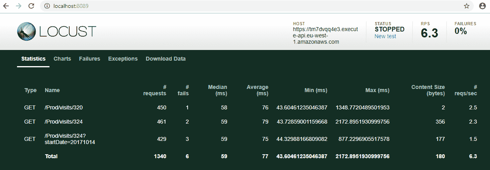
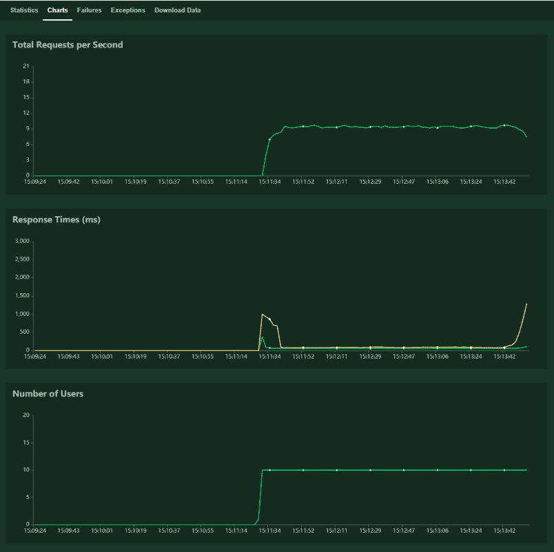
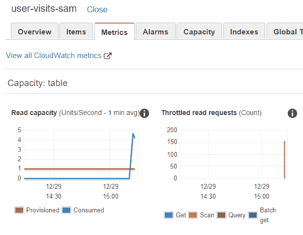
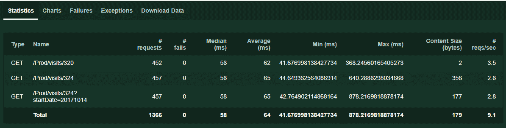
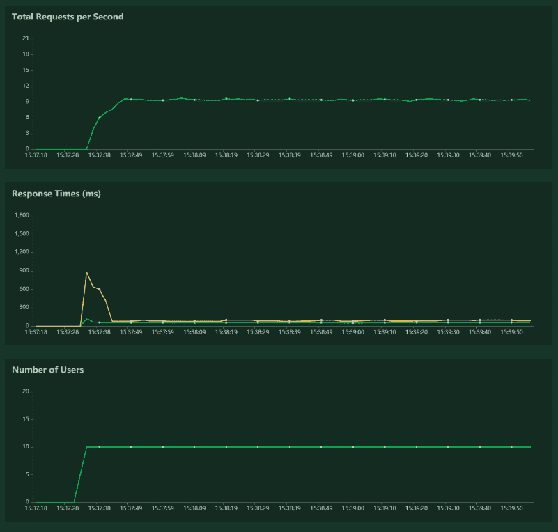

# 第四章：测试您的无服务器微服务

在上一章中，我们使用 API Gateway、Lambda 和 DynamoDB 创建了一个完全功能的无服务器数据 API，并将其部署到了 AWS CLI。我们展示的测试是在 AWS 管理控制台和浏览器中进行的，这对于少量简单代码开发作为概念验证是可以的，但不建议用于开发或生产系统。

对于开发人员来说，首先在本地开发和测试要高效得多，对于持续交付来说，自动化测试至关重要。本章就是关于测试的。

测试可能很容易覆盖整本书，但我们将保持非常实用的方式，并专注于测试您的无服务器代码和我们在第三章中部署的数据 API，*部署您的无服务器堆栈*。这将包括单元测试、模拟、本地调试、集成测试，在 Docker 容器中本地运行 Lambda 或无服务器 API 的 HTTP 服务器，以及负载测试。

在本章中，我们将涵盖以下主题：

+   对 Python Lambda 代码进行单元测试

+   在本地运行和调试您的 AWS Lambda 代码

+   使用真实测试数据进行集成测试

+   AWS **无服务器应用程序模型**（**SAM**）CLI

+   规模化加载和端到端测试

+   减少 API 延迟的策略

+   清理

# 对 Python Lambda 代码进行单元测试

在本节中，我们将讨论为什么测试很重要，以及我们可以用于测试、单元测试和模拟的示例数据。

# 为什么测试很重要？

想想在不同国家的大型分布式开发团队中进行的协作和团队合作，想象一下他们想要在同一个源代码仓库上进行协作，并在不同的时间检查代码更改。对于这些团队来说，理解代码并能够在本地测试以查看其工作原理非常重要，他们的更改是否会影响现有服务，以及代码是否仍然按预期工作。

测试对于确保交付或用户体验中有**质量**很重要。通过进行大量测试，您可以及早发现缺陷并加以修复。例如，如果检测到了重大错误，您可以决定不发布最近的更新，并在发布之前修复问题。

另一个重要的点是**可用性**。例如，您的客户可能有性能或非功能性要求。例如，想象一个电子商务网站，您可以在其中添加商品，但必须等待整整一分钟才能将其添加到购物篮中。在大多数情况下，这是不可接受的，用户会失去对平台的信任。理想情况下，您将有一个测试流程，以确保延迟仍然很低，网站响应迅速。需要测试的其他示例包括不按预期工作的功能或用户界面缺陷，这些缺陷会阻止用户完成他们想要做的任务。

拥有**更短的发布周期**很重要。使用自动化，您可以自动且一致地运行一千次测试，而不需要人工手动测试站点的不同部分，手动测试 API，或在任何发布之前严格检查代码。在每次发布到生产环境之前，您都会运行这一千次测试，这样您就会更有信心，一切都按预期工作，如果您在生产中发现了这一千次测试忽略的问题，您可以修复它并为该场景添加一个新的测试。

# 测试类型

测试可以手动完成，就像我们在 AWS 管理控制台中所做的那样，这容易出错且不可扩展。通常，测试是使用预先编写的测试套件自动化的，并且对于持续集成和持续交付至关重要。

有许多可用的软件测试定义和类型；涵盖它们可能需要整本书。在这里，我们将专注于对我们的无服务器堆栈相关的三种主要类型：

+   **单元测试**：对单个软件模块进行低级别测试，通常由开发人员完成，并在**测试驱动开发**（**TDD**）中使用。这些类型的测试通常执行速度很快。

+   **集成测试**：验证集成后所有组合服务是否正常工作。这些通常更昂贵，因为需要运行许多服务。

+   **负载测试**：这是一种非功能性测试，用于检查系统在重负载下的性能。有时也被称为性能或压力测试，因为它有助于了解平台的可用性和可靠性。

# 单元测试 Lambda Python 代码

在 AWS 管理控制台中进行调试并不容易；在本地调试代码并稍后自动化该过程要更有建设性。

我们从之前的章节中知道，Lambda 事件源是 API Gateway 的`GET`请求。由于我们只关注数据的一个子集，因此完整的 JSON 有效负载也可以用几行 Python 代码模拟出来。

# 样本测试数据

在这里，我们有一个带有`setUp()`方法的测试用例，该方法在测试套件开始时运行一次，以及一个`tearDown()`方法，在测试结束时运行。

以下是在`serverless-microservice-data-api/test/test_dynamo_get.py`顶部的测试设置和拆卸的内容的子集：

```py
import unittest
import json

class TestIndexGetMethod(unittest.TestCase):
    def setUp(self):
        self.validJsonDataNoStartDate = json.loads('{"httpMethod": 
        "GET","path": "/path/to/resource/324","headers": ' \ 'null} ')
        self.validJsonDataStartDate = 
        json.loads('{"queryStringParameters": {"startDate":      
        "20171013"},' \ '"httpMethod": "GET","path": "/path/to/resource
        /324","headers": ' \ 'null} ')
        self.invalidJsonUserIdData =   
        json.loads('{"queryStringParameters": {"startDate": 
        "20171013"},' \ '"httpMethod": "GET","path": "/path/to/resource
        /324f","headers": ' \ 'null} ')
        self.invalidJsonData = "{ invalid JSON request!} "
    def tearDown(self):
        pass
```

我创建了四个不同的 JSON Python 字典：

+   `self.validJsonDataNoStartDate`: 没有`StartDate`过滤器的有效`GET`请求

+   `self.validJsonDataStartDate`: 具有`StartDate`过滤器的有效`GET`请求

+   `self.invalidJsonUserIdData`: 一个无效的`UserId`，不是一个数字

+   `self.invalidJsonData`: 无法解析的无效 JSON

# 单元测试

以下是可以在`serverless-microservice-data-api/test/test_dynamo_get.py`中找到的单元测试：

```py
    def test_validparameters_parseparameters_pass(self):
        parameters = lambda_query_dynamo.HttpUtils.parse_parameters(
                     self.validJsonDataStartDate)
        assert parameters['parsedParams']['startDate'] == u'20171013'
        assert parameters['parsedParams']['resource_id'] == u'324'     

    def test_emptybody_parsebody_nonebody(self):
        body = lambda_query_dynamo.HttpUtils.parse_body(
               self.validJsonDataStartDate)         
        assert body['body'] is None

    def test_invalidjson_getrecord_notfound404(self):
        result = lambda_query_dynamo.Controller.get_dynamodb_records(
                 self.invalidJsonData)
        assert result['statusCode'] == '404'

    def test_invaliduserid_getrecord_invalididerror(self):            
        result = lambda_query_dynamo.Controller.get_dynamodb_records(
                 self.invalidJsonUserIdData)
        assert result['statusCode'] == '404'
        assert json.loads(result['body'])['message'] == 
             "resource_id not a number" 
```

我使用了`test`的前缀，这样 Python 测试套件可以自动检测它们作为单元测试，并且我使用了三元单元测试命名约定来命名测试方法：方法名、测试状态和预期行为。测试方法如下：

+   `test_validparameters_parseparameters_pass()`: 检查参数是否被正确解析。

+   `test_emptybody_parsebody_nonebody()`: 在`GET`方法中我们没有使用 body，所以我们希望确保如果没有提供 body，它仍然可以正常工作。

+   `test_invalidjson_getrecord_notfound404()`: 检查 Lambda 对无效的 JSON 有效负载的反应。

+   `test_invaliduserid_getrecord_invalididerror()`: 检查 Lambda 对无效的非数字`userId`的反应。

前面的内容并不查询 DynamoDB 记录。如果我们想要这样做，我们应该让 DynamoDB 运行起来，使用新的 DynamoDB 本地（[`docs.aws.amazon.com/amazondynamodb/latest/developerguide/DynamoDBLocal.html`](https://docs.aws.amazon.com/amazondynamodb/latest/developerguide/DynamoDBLocal.html)），或者我们可以模拟 DynamoDB 调用，这是我们接下来要看的。

# 模拟

有一个名为 Moto 的 Python AWS 模拟框架（[`docs.getmoto.org/en/latest/`](http://docs.getmoto.org/en/latest/)），但我更喜欢使用一个名为`mock`的通用框架，它在 Python 社区得到了更广泛的支持，并且从 Python 3.3 开始已经包含在 Python 标准库中。

以下模拟代码可以在`serverless-microservice-data-api/test/test_dynamo_get.py`底部找到：

```py
from unittest import mock

     mock.patch.object(lambda_query_dynamo.DynamoRepository,
                      "query_by_partition_key",
                       return_value=['item'])
     def test_validid_checkstatus_status200(self, 
         mock_query_by_partition_key):
        result = lambda_query_dynamo.Controller.get_dynamodb_records(
                 self.validJsonDataNoStartDate)
        assert result['statusCode'] == '200'

    @mock.patch.object(lambda_query_dynamo.DynamoRepository,
                       "query_by_partition_key",
                        return_value=['item'])
     def test_validid_getrecord_validparamcall(self, 
         mock_query_by_partition_key):         
lambda_query_dynamo.Controller.get_dynamodb_records(
self.validJsonDataNoStartDate)         mock_query_by_partition_key.assert_called_with(
     partition_key='EventId',                                                                      
     partition_value=u'324')

    @mock.patch.object(lambda_query_dynamo.DynamoRepository,
                       "query_by_partition_and_sort_key",
                        return_value=['item'])
    def test_validid_getrecorddate_validparamcall(self, 
        mock_query_by_partition_and_sort_key):
           lambda_query_dynamo.Controller.get_dynamodb_records(
               self.validJsonDataStartDate)
          mock_query_by_partition_and_sort_key.assert_called_with(partition_key='   
    EventId',                                                                      
    partition_value=u'324',                                                                 
    sort_key='EventDay',                                                                 
    sort_value=20171013)
```

从这段代码中得出的关键观察结果如下：

+   `@mock.patch.object()`是一个装饰器，用于对我们从`DynamoRepository()`类中模拟的`query_by_partition_key()`或`query_by_partition_and_sort_key()`方法。

+   `test_validid_checkstatus_status200()`: 我们模拟对`query_by_partition_key()`的调用。如果查询有效，我们会得到一个`'200'`状态码。

+   `test_validid_getrecords_validparamcall()`: 我们模拟对`query_by_partition_key()`的调用，并检查该方法是否使用了正确的参数进行调用。请注意，我们不需要检查较低级别的`boto3` `self.db_table.query()`方法是否有效。

+   `test_validid_getrecordsdate_validparamcall()`: 我们模拟对`query_by_partition_and_sort_key()`的调用，并检查该方法是否使用正确的参数进行了调用。

您不是在这里测试现有的第三方库或 Boto3，而是测试您的代码和与它们的集成。模拟允许您用模拟对象替换测试中的代码部分，并对方法或属性进行断言。

# 运行单元测试

现在我们有了所有的测试套件，而不是在 IDE（如 PyCharm）中运行它们，您可以使用以下 bash 命令从根文件夹运行测试：

```py
$ python3 -m unittest discover test 
```

`unittest`会自动检测所有测试文件必须是项目顶层目录可导入的模块或包。在这里，我们只想从以`test_`为前缀的测试文件夹中运行测试。

我在`serverless-microservice-data-api/bash/apigateway-lambda-dynamodb/unit-test-lambda.sh`下创建了一个 shell 脚本：

```py
#!/bin/sh (cd ../..; python3 -m unittest discover test) 
```

# 代码覆盖率

我们不会深入讨论，但代码覆盖率是软件工程中使用的另一个重要度量标准。代码覆盖率衡量了测试套件覆盖的代码程度。主要思想是，覆盖率百分比越高，测试覆盖的代码就越多，因此创建未检测到的错误的可能性就越小，服务应该按预期运行。这些报告可以帮助开发人员提出额外的测试或场景，以增加覆盖率百分比。

与测试覆盖率相关的 Python 包包括`coverage`、`nose`和较新的`nose2`，它们可以提供覆盖率报告。例如，您可以运行以下命令，使用`nose`或`nose2`获取 Lambda 代码的测试覆盖分析报告：

```py
$ nosetests test/test_dynamo_get.py --with-coverage --cover-package lambda_dynamo_read -v
$ nose2 --with-coverage 
```

当我们开始编写自己的测试时，我们可以选择使用一组额外的工具来进行测试。这些工具被称为代码覆盖工具。Codecov 和 Coveralls 就是这样的工具的例子。当我们想要分析通过 GitHub 等托管服务编写的代码时，这些工具非常有用，因为它们提供了完整的分析，以确定哪些行已经进行了测试。

# 在本地运行和调试 AWS Lambda 代码

有时，您希望使用本地 Lambda 模拟 API Gateway 负载，针对 AWS 中托管的真实远程 DynamoDB 进行调试。这样可以使用真实数据进行调试和构建单元测试。此外，我们将看到这些稍后可以用于集成测试。

# 批量加载数据到 DynamoDB

我们将首先讨论如何从名为`sample_data/dynamodb-sample-data.txt`的**逗号分隔值**（**CSV**）文件中批量加载数据到 DynamoDB。与为每个项目插入单个语句不同，这是一个更高效的过程，因为数据文件与 Python 代码是解耦的。

```py
EventId,EventDay,EventCount
324,20171010,2
324,20171012,10
324,20171013,10
324,20171014,6
324,20171016,6
324,20171017,2
300,20171011,1
300,20171013,3
300,20171014,30 
```

添加另一个名为`update_dynamo_event_counter()`的方法，该方法使用`DynamoRepository`类更新 DynamoDB 记录。

以下是`serverless-microservice-data-api/aws_dynamo/dynamo_insert_items_from_file.py` Python 脚本的内容：

```py
from boto3 import resource

class DynamoRepository:
    def __init__(self, target_dynamo_table, region='eu-west-1'):
        self.dynamodb = resource(service_name='dynamodb', region_name=region)
        self.target_dynamo_table = target_dynamo_table
        self.table = self.dynamodb.Table(self.target_dynamo_table)     

    def update_dynamo_event_counter(self, event_name, 
        event_datetime, event_count=1):
        response = self.table.update_item(
            Key={
                'EventId': str(event_name),
                'EventDay': int(event_datetime)
            },
            ExpressionAttributeValues={":eventCount": 
                int(event_count)},
            UpdateExpression="ADD EventCount :eventCount")
        return response 
```

在这里，我们有一个`DynamoRepository`类，在`__init__()`中实例化了与 DynamoDB 的连接，并且有一个`update_dynamo_event_counter()`方法，如果记录存在则更新 DynamoDB 记录，如果不存在则使用传入的参数添加新记录。这是一个原子操作。

以下是`serverless-microservice-data-api/aws_dynamo/dynamo_insert_items_from_file.py` Python 脚本的后半部分：

```py
 import csv
table_name = 'user-visits-sam'
input_data_path = '../sample_data/dynamodb-sample-data.txt'
dynamo_repo = DynamoRepository(table_name)
with open(input_data_path, 'r') as sample_file:
    csv_reader = csv.DictReader(sample_file)
    for row in csv_reader:
        response = dynamo_repo.update_dynamo_event_counter(row['EventId'],                                                            row['EventDay'],                                                            row['EventCount'])
        print(response) 
```

这段 Python 代码打开 CSV 文件，提取标题行，并解析每一行，同时将其写入名为`user-visits-sam`的 DynamoDB 表中。

现在我们已经将一些数据行加载到 DynamoDB 表中，我们将通过调试本地 Lambda 函数来查询表。

# 在本地运行 Lambda

这是一个完整的 API 网关请求示例，`serverless-microservice-data-api/sample_data/request-api-gateway-valid-date.json`，代理 Lambda 函数将作为事件接收。这些可以通过打印 Lambda 作为事件源传递给 CloudWatch 日志的真实 API 网关 JSON 事件来生成：

```py
{
  "body": "{\"test\":\"body\"}",
  "resource": "/{proxy+}",
  "requestContext": {
    "resourceId": "123456",
    "apiId": "1234567890",
    "resourcePath": "/{proxy+}",
    "httpMethod": "GET",
    "requestId": "c6af9ac6-7b61-11e6-9a41-93e8deadbeef",
    "accountId": "123456789012",
    "identity": {
      "apiKey": null,
      "userArn": null,
      "cognitoAuthenticationType": null,
      "caller": null,
      "userAgent": "Custom User Agent String",
      "user": null,
      "cognitoIdentityPoolId": null,
      "cognitoIdentityId": null,
      "cognitoAuthenticationProvider": null,
      "sourceIp": "127.0.0.1",
      "accountId": null
    },
    "stage": "prod"
  },
  "queryStringParameters": {
    "foo": "bar"
  },
  "headers": {
    "Via": "1.1 08f323deadbeefa7af34d5feb414ce27.cloudfront.net 
            (CloudFront)",
    "Accept-Language": "en-US,en;q=0.8",
    "CloudFront-Is-Desktop-Viewer": "true",
    "CloudFront-Is-SmartTV-Viewer": "false",
    "CloudFront-Is-Mobile-Viewer": "false", 
    "X-Forwarded-For": "127.0.0.1, 127.0.0.2",
    "CloudFront-Viewer-Country": "US",
    "Accept": "text/html,application/xhtml+xml,application/xml;
               q=0.9,image/webp,*/*;q=0.8",
    "Upgrade-Insecure-Requests": "1",
    "X-Forwarded-Port": "443",
    "Host": "1234567890.execute-api.us-east-1.amazonaws.com",
    "X-Forwarded-Proto": "https",
    "X-Amz-Cf-Id": "cDehVQoZnx43VYQb9j2-nvCh-
                    9z396Uhbp027Y2JvkCPNLmGJHqlaA==",
    "CloudFront-Is-Tablet-Viewer": "false",
    "Cache-Control": "max-age=0",
    "User-Agent": "Custom User Agent String",     
    "CloudFront-Forwarded-Proto": "https",
    "Accept-Encoding": "gzip, deflate, sdch"
  },
  "pathParameters":{
    "proxy": "path/to/resource"
  },
  "httpMethod": "GET",
  "stageVariables": {
    "baz": "qux"
  },
  "path": "/path/to/resource/324"
} 
```

与依赖于另一个第三方框架进行本地调试（例如 SAM CLI）不同，您可以通过使用 JSON `Dict`事件直接调用 Lambda 函数来直接调试 Lambda 函数。这意味着您无需任何额外的库来运行，而且它是本机 Python。

`serverless-microservice-data-api/test/run_local_api_gateway_lambda_dynamo.py`的内容是使用 AWS 中的服务（例如 DynamoDB）本地调试 Lambda 函数的示例。

```py
import json

from lambda_dynamo_read import lambda_return_dynamo_records as lambda_query_dynamo

with open('../sample_data/request-api-gateway-valid-date.json', 'r') as sample_file:
     event = json.loads(sample_file.read())
print("lambda_query_dynamo\nUsing data: %s" % event)
print(sample_file.name.split('/')[-1]) response = lambda_query_dynamo.lambda_handler(event, None)
print('Response: %s\n' % json.dumps(response)) 
```

我们打开样本`GET`文件，将 JSON 解析为`Dict`，然后将其作为参数传递给`lambda_query_dynamo.lambda_handler()`。由于我们没有模拟 DynamoDB，它将查询`table_name = 'user-visits-sam'`Lambda 函数中指定的表。然后它将捕获输出响应，可能如下所示：

```py
Response: {"statusCode": "200", "body": "[{\"EventCount\": 3, \"EventDay\": 20171001, \"EventId\": \"324\"}, {\"EventCount\": 5, \"EventDay\": 20171002, \"EventId\": \"324\"}, {\"EventCount\": 4, \"EventDay\": 20171010, \"EventId\": \"324\"}, {\"EventCount\": 20, \"EventDay\": 20171012, \"EventId\": \"324\"}, {\"EventCount\": 10, \"EventDay\": 20171013, \"EventId\": \"324\"}, {\"EventCount\": 6, \"EventDay\": 20171014, \"EventId\": \"324\"}, {\"EventCount\": 6, \"EventDay\": 20171016, \"EventId\": \"324\"}, {\"EventCount\": 2, \"EventDay\": 20171017, \"EventId\": \"324\"}]", "headers": {"Content-Type": "application/json", "Access-Control-Allow-Origin": "*"}} 
```

正文与我们在第三章中在浏览器中看到的内容相同，*部署您的无服务器堆栈*。因此，您可以直接使用真实数据调试不同的集成场景，并在使用真实数据的 Lambda 代码中构建更完整的测试套件。

# 使用真实测试数据进行集成测试

现在我们了解了真实测试数据，我们将看看如何测试已部署的 Lambda 函数。首先，您需要安装和设置 AWS CLI，并按照第一章末尾显示的方式配置 AWS 凭据：

```py
$ sudo pip3 sudo install awscli 
$ aws configure 
```

我们将重新部署在第三章中部署的无服务器微服务堆栈，*部署您的无服务器堆栈*，以便我们可以测试它。使用以下命令：

```py
$ cd ./serverless-microservice-data-api/bash/apigateway-lambda-dynamodb
$ ./build-package-deploy-lambda-dynamo-data-api.sh
```

这将重新构建 Lambda ZIP 包作为代码（如果有任何更改）。然后它将打包和部署代码和 SAM 配置。最后，它将创建 API 网关、Lambda 函数和 DynamoDB 表。

对于测试，我们将使用 AWS CLI，它可以调用所有 AWS 托管的服务。在这里，我们对`lambda` ([`docs.aws.amazon.com/cli/latest/reference/lambda/index.html`](https://docs.aws.amazon.com/cli/latest/reference/lambda/index.html))和`apigateway` ([`docs.aws.amazon.com/cli/latest/reference/apigateway/index.html`](https://docs.aws.amazon.com/cli/latest/reference/apigateway/index.html))服务感兴趣。

# 测试 Lambda 是否已正确部署

测试部署的 Lambda，您可以运行以下命令：

```py
$ aws lambda invoke --invocation-type Event \
 --function-name lambda-dynamo-data-api-sam  --region eu-west-1 \
 --payload file://../../sample_data/request-api-gateway-get-valid.json \ outputfile.tmp 
```

为了自动化，我们可以将以下代码放入一个 shell 脚本，`serverless-microservice-data-api/bash/apigateway-lambda-dynamodb/invoke-lambda.sh`：

```py
#!/bin/sh
. ./common-variables.sh
rm outputfile.tmp
status_code=$(aws lambda invoke --invocation-type RequestResponse \
    --function-name ${template}-sam --region ${region} \
    --payload file://../../sample_data/request-api-gateway-get-valid.json \
    outputfile.tmp --profile ${profile})
echo "$status_code"
if echo "$status_code" | grep -q "200";
then
    cat outputfile.tmp
    if grep -q error outputfile.tmp;
    then
        echo "\nerror in response"
        exit 1
    else
        echo "\npass"
        exit 0
    fi
else
    echo "\nerror status not 200"
    exit 1
fi 
```

我们调用 Lambda，但也使用`grep`命令检查`outputfile.tmp`文件中的响应。如果检测到错误，则返回退出代码`1`，否则返回`0`。这允许您在其他工具或 CI/CD 步骤中链接逻辑。

# 测试 API 网关是否已正确部署

我们还希望在部署后能够测试无服务器微服务 API 是否正常工作。我使用 Python 和 bash 混合使用，以使其更容易。

首先使用名为`serverless-microservice-data-api/bash/apigateway-lambda-dynamodb/get_apigateway_endpoint.py`的 Python 脚本查询 AWS API Gateway 以获取完整的端点，并在成功时返回代码`0`：

```py
import argparse
import logging

import boto3
logging.getLogger('botocore').setLevel(logging.CRITICAL)

logger = logging.getLogger(__name__)
logging.basicConfig(format='%(asctime)s %(levelname)s %(name)-15s: %(lineno)d %(message)s',
                    level=logging.INFO) logger.setLevel(logging.INFO) 

def get_apigateway_names(endpoint_name):
    client = boto3.client(service_name='apigateway', 
                          region_name='eu-west-1')
    apis = client.get_rest_apis()
    for api in apis['items']:
        if api['name'] == endpoint_name:
            api_id = api['id']
            region = 'eu-west-1'
            stage = 'Prod'
            resource = 'visits/324'
            #return F"https://{api_id}.execute-api.
             {region}.amazonaws.com/{stage}/{resource}"
            return "https://%s.execute-api.%s.amazonaws.com/%s/%s" 
                % (api_id, region, stage, resource)
    return None

def main():
    endpoint_name = "lambda-dynamo-xray"

    parser = argparse.ArgumentParser()
    parser.add_argument("-e", "--endpointname", type=str, 
        required=False, help="Path to the endpoint_name")
    args = parser.parse_args()

    if (args.endpointname is not None): endpoint_name = 
        args.endpointname

    apigateway_endpoint = get_apigateway_names(endpoint_name)
    if apigateway_endpoint is not None:
        print(apigateway_endpoint)
        return 0
    else:
        return 1

if __name__ == '__main__':
    main()
```

然后我们使用一个 shell 脚本来调用 Python 脚本。Python 脚本返回 API 端点，该端点在 curl 中与样本`GET`请求一起使用。然后我们查看是否获得有效的状态码。

这是`serverless-microservice-data-api/bash/apigateway-lambda-dynamodb/curl-api-gateway.sh`的完整脚本：

```py
. ./common-variables.sh
endpoint="$(python get_apigateway_endpoint.py -e ${template})"
echo ${endpoint}
status_code=$(curl -i -H \"Accept: application/json\" -H \"Content-Type: application/json\" -X GET ${endpoint})
echo "$status_code"
if echo "$status_code" | grep -q "HTTP/1.1 200 OK";
then
    echo "pass"
    exit 0
else
    exit 1
fi 
```

以这种方式设置这些脚本使我们能够轻松地自动化这些集成测试。

**函数即服务**（**FaaS**）仍然是一个相对较新的领域。关于应该使用哪种类型的集成测试仍然有很多讨论。有一种观点是，我们应该在不同的 AWS 账户中进行全套测试，特别是那些会写入或更新数据存储的测试，比如`POST`或`PUT`请求。

如果您想这样做，我已经包括了`--profile`和`aws_account_id`。此外，使用 API Gateway，您可以使用一系列已经存在的围绕 HTTP 端点的测试套件，但是测试 Lambdas 与其他 AWS 服务的集成，比如在 S3 中创建触发 Lambda 的对象，需要更多的工作和思考。在我看来，无服务器集成测试仍然不够成熟，但我已经展示了如何通过使用 AWS CLI 直接调用 Lambda 函数以及使用 JSON 事件源负载调用 API Gateway 端点来实现它们。

接下来，我们将看看 SAM CLI 如何用于本地测试。

# AWS 无服务器应用程序模型 CLI

在本节中，我们将通过完全可用的示例演示 SAM Local 的不同功能。对于本地测试，您可以像我展示的那样使用 Python 和 bash，也可以使用 SAM CLI ([`github.com/awslabs/aws-sam-cli`](https://github.com/awslabs/aws-sam-cli))，在撰写本文时仍处于测试阶段。它使用 Docker，并且基于开源`docker-lambda` ([`github.com/lambci/docker-lambda`](https://github.com/lambci/docker-lambda)) Docker 镜像。如果您使用的是 Windows 10 Home，我建议您升级到 Pro 或 Enterprise，因为在 Home 版上更难使 Docker 工作。还有一些硬件要求，比如虚拟化，需要注意。我们需要执行以下步骤：

1.  安装 AWS CLI ([`docs.aws.amazon.com/cli/latest/userguide/installing.html`](https://docs.aws.amazon.com/cli/latest/userguide/installing.html))。

1.  安装 Docker CE ([`docs.docker.com/install/`](https://docs.docker.com/install/))。

1.  安装 AWS SAM CLI ([`docs.aws.amazon.com/serverless-application-model/latest/developerguide/serverless-sam-cli-install.html`](https://docs.aws.amazon.com/serverless-application-model/latest/developerguide/serverless-sam-cli-install.html))。

1.  对于 Linux，您可以运行以下命令：

```py
$sudo pip install --user aws-sam-cli 
```

1.  对于 Windows，您可以使用 MSI 安装 AWS SAM CLI。

1.  创建一个新的 SAM Python 3.6 项目，`sam-app`，并`docker pull`镜像（这应该会自动发生，但我需要执行`pull`才能使其工作）：

```py
$ sam init --runtime python3.6
$ docker pull lambci/lambda-base:build
$ docker pull lambci/lambda:python3.6 
```

1.  调用以下函数：

```py
$ cd sam-app
$ sam local invoke "HelloWorldFunction" -e event.json --region eu-west-1 
```

您将获得以下内容：

```py
Duration: 8 ms Billed Duration: 100 ms Memory Size: 128 MB Max Memory Used: 19 MB
{"statusCode": 200, "body": "{\"message\": \"hello world\"}"} 
```

这可以用于添加自动化测试。

1.  启动本地 Lambda 端点：

```py
$ sam local start-lambda --region eu-west-1
# in new shell window
$ aws lambda invoke --function-name "HelloWorldFunction" \
 --endpoint-url "http://127.0.0.1:3001" --no-verify-ssl out.txt 
```

这将启动一个模拟 AWS Lambda 的 Docker 容器，并在本地启动一个 HTTP 服务器，您可以使用它来自动化测试 AWS CLI 或 Boto3 中的 Lambda 函数。

1.  启动 API 并使用以下进行测试：

```py
$ sam local start-api --region eu-west-1
# in new shell window
$ curl -i -H \"Accept: application/json\" -H \"Content-Type: application/json\" -X GET http://127.0.0.1:3000/hello 
```

这将在本地启动一个带有 HTTP 服务器的 Docker 容器，您可以使用它来自动化测试与`curl`、Postman 或您的 Web 浏览器一起使用的 API。

1.  生成示例事件的一种方法是从 Lambda 中打印出事件，并从 CloudWatch 日志中复制它（这是我的首选）。另一种方法是使用`sam local`，它可以生成一些示例事件。例如，您可以运行以下命令：

```py
$ sam local generate-event apigateway aws-proxy 
```

就我个人而言，我并没有广泛使用 SAM CLI，因为它非常新，需要安装 Docker，并且仍处于测试阶段。但它看起来很有前途，作为测试无服务器堆栈的另一个工具，它很有用，因为它可以在 Docker 容器中模拟 Lambda 并公开端点，我期望未来会添加更多功能。

也许不太有用的是，它还将一些现有命令的无服务器打包和部署命令包装为 CloudFormation 命令的别名。我认为这样做是为了将它们都放在一个地方。

1.  以下是 SAM CLI `package`和`deploy`命令的示例：

```py
$ sam package \
 --template-file $template.yaml \
 --output-template-file ../../package/$template-output.yaml \
 --s3-bucket
$bucket $ sam deploy \
 --template-file ../../package/$template-output.yaml \
 --stack-name $template \
 --capabilities CAPABILITY_IAM
```

使用 SAM 的 CloudFormation 进行`package`和`deploy`命令：

```py
$ aws cloudformation package \
 --template-file $template.yaml \
 --output-template-file ../../package/$template-output.yaml \
 --s3-bucket $bucket \
 --s3-prefix $prefix
$ aws cloudformation deploy \
 --template-file ../../package/$template-output.yaml \
 --stack-name $template \
 --capabilities CAPABILITY_IAM
```

# 加载和规模化的端到端测试

接下来，我们将看一下 Locust，这是一个用于性能和负载测试的 Python 工具。然后我们将讨论减少 API 延迟和改善 API 响应时间的策略，使用 Locust 将向我们展示性能改进。

# 对您的无服务器微服务进行负载测试

首先，您需要运行一个带有`./build-package-deploy-lambda-dynamo-data-api.sh`的无服务器微服务堆栈，并使用`python3 dynamo_insert_items_from_file.py` Python 脚本将数据加载到 DynamoDB 表中。

然后安装 Locust，如果它尚未与`requirements.txt`中的其他软件包一起安装：

```py
$ sudo pip3 install locustio 
```

Locust ([`docs.locust.io`](https://docs.locust.io))是一个易于使用的负载测试工具，具有 Web 指标和监控界面。它允许您使用 Python 代码定义用户行为，并可用于在多台机器上模拟数百万用户。

要使用 Locust，您首先需要创建一个 Locust Python 文件，在其中定义 Locust 任务。`HttpLocust`类添加了一个客户端属性，用于发出 HTTP 请求。`TaskSet`类定义了 Locust 用户将执行的一组任务。`@task`装饰器声明了`TaskSet`的任务：

```py
import random
from locust import HttpLocust, TaskSet, task

paths = ["/Prod/visits/324?startDate=20171014",
         "/Prod/visits/324",
         "/Prod/visits/320"]

class SimpleLocustTest(TaskSet):

    @task
    def get_something(self):
        index = random.randint(0, len(paths) - 1)
        self.client.get(paths[index])

class LocustTests(HttpLocust):
    task_set = SimpleLocustTest
```

要测试`GET`方法与不同的资源和参数，我们从路径列表中随机选择三个不同的路径，其中一个 ID 在 DynamoDB 中不存在。主要思想是，如果我们已经将相应的行从文件加载到 DynamoDB 中，我们可以轻松地扩展到模拟数百万个不同的查询。Locust 支持更复杂的行为，包括处理响应、模拟用户登录、排序和事件挂钩，但这个脚本是一个很好的开始。

要运行 Locust，我们需要获取 API Gateway ID，看起来像`abcdefgh12`，以创建用于负载测试的完整主机名。在这里，我编写了一个名为`serverless-microservice-data-api/bash/apigateway-lambda-dynamodbget_apigateway_id.py`的 Python 脚本，可以根据 API 名称执行此操作：

```py
import argparse
import logging

import boto3
logging.getLogger('botocore').setLevel(logging.CRITICAL)

logger = logging.getLogger(__name__)
logging.basicConfig(format='%(asctime)s %(levelname)s %(name)-15s: %(lineno)d %(message)s',
                    level=logging.INFO)
logger.setLevel(logging.INFO)

def get_apigateway_id(endpoint_name):
    client = boto3.client(service_name='apigateway', 
             region_name='eu-west-1')
    apis = client.get_rest_apis()
    for api in apis['items']:
        if api['name'] == endpoint_name:
            return api['id']
    return None

def main():
    endpoint_name = "lambda-dynamo-xray"

    parser = argparse.ArgumentParser()
    parser.add_argument("-e", "--endpointname", type=str, 
                        required=False, help="Path to the endpoint_id")
    args = parser.parse_args()

    if (args.endpointname is not None): endpoint_name = args.endpointname

    apigateway_id = get_apigateway_id(endpoint_name)
    if apigateway_id is not None:
        print(apigateway_id)
        return 0
    else:
        return 1

if __name__ == '__main__':
    main() 
```

运行以下命令启动 Locust：

```py
$ . ./common-variables.sh
$ apiid="$(python3 get_apigateway_id.py -e ${template})"
$ locust -f ../../test/locust_test_api.py --host=https://${apiid}.execute-api.${region}.amazonaws.com 
```

或者，我还有这个`locust`运行命令，可以作为一个 shell 脚本运行，在`test`文件夹`serverless-microservice-data-api/bash/apigateway-lambda-dynamodb/run_locus.sh`下：

```py
#!/bin/sh
. ./common-variables.sh
apiid="$(python3 get_apigateway_id.py -e ${template})"
locust -f ../../test/locust_test_api.py --host=https://${apiid}.execute-api.${region}.amazonaws.com 
```

您现在应该在终端中看到 Locust 启动并执行以下步骤：

1.  在 Web 浏览器中导航到`http://localhost:8089/`，以访问 Locust Web 监控和测试界面。

1.  在开始新的 Locust 群中，输入以下内容：

+   **模拟的用户数量**为`10`

+   `5`用于 Hatch 速率（每秒生成的用户）

1.  在统计选项卡上让工具运行几分钟。

在统计选项卡中，您将得到类似以下的内容：



在图表选项卡上，您应该会得到类似以下的内容：



在响应时间（毫秒）图表中，橙色线代表 95^(th)百分位数，绿色代表中位数响应时间。

以下是有关前面图表的一些观察：

+   最大请求时间为 2,172 毫秒，约为 2.1 秒，这非常慢——这与所谓的冷启动有关，这是首次启动 Lambda 的较慢方式。

+   大约一分钟后，失败的次数也会增加——这是因为 DynamoDB 在开始限制读取请求之前允许一些突发读取。如果您登录到 AWS 管理控制台并查看 DynamoDB 表指标，您将看到正在发生这种情况：



# 减少 API 延迟的策略

有许多减少延迟的策略。我们将看两种，这两种都在 SAM 模板中设置：

+   **增加 Lambda RAM 大小**：目前设置为最小的 128 MB

+   **增加 DynamoDB 读取容量**：目前设置为最小值 1 个单位

我真的很喜欢 DynamoDB 的一点是，您可以更改每个表的容量，并且可以独立更改写入容量和读取容量。这对于我来说在读取密集型用例中非常有趣和划算，我可以将读取容量设置得比写入容量更高。甚至还有选项可以根据读/写利用率自动调整表的容量，或者完全基于需求，按照每次读/写请求付费。

我们将从 1 增加 DynamoDB 表的读取容量到 500 个读取单位（保持写入容量为 1 个单位）。费用原本是每月$0.66，但现在将增加到每月$55.24。

编辑`lambda-dynamo-data-api.yaml` SAM YAML 模板文件，并将`ReadCapacityUnits`从`1`增加到`500`：

```py
AWSTemplateFormatVersion: '2010-09-09'
Transform: 'AWS::Serverless-2016-10-31'
Description: >-
  This Lambda is invoked by API Gateway and queries DynamoDB.
Parameters:
    AccountId:
        Type: String

Resources:
  lambdadynamodataapi:
    Type: AWS::Serverless::Function
    Properties:
      Handler: lambda_return_dynamo_records.lambda_handler
      Runtime: python3.6
      CodeUri: ../../package/lambda-dynamo-data-api.zip
      FunctionName: lambda-dynamo-data-api-sam
      Description: >-
        This Lambda is invoked by API Gateway and queries DynamoDB.
      MemorySize: 128
      Timeout: 3
      Role: !Sub 'arn:aws:iam::${AccountId}:role/
                  lambda-dynamo-data-api'
      Environment:
        Variables:
          environment: dev
      Events:
        CatchAll:
          Type: Api
          Properties:
            Path: /visits/{resourceId}
           Method: GET
  DynamoDBTable:
    Type: AWS::DynamoDB::Table 
    Properties:
      TableName: user-visits-sam
      SSESpecification:
        SSEEnabled: True
      AttributeDefinitions:
        - AttributeName: EventId
          AttributeType: S
        - AttributeName: EventDay
          AttributeType: N
      KeySchema:
        - AttributeName: EventId
          KeyType: HASH
        - AttributeName: EventDay
          KeyType: RANGE
      ProvisionedThroughput:
        ReadCapacityUnits: 500
        WriteCapacityUnits: 1
```

运行`./build-package-deploy-lambda-dynamo-data-api.sh`来部署带有 DynamoDB 表更改的无服务器堆栈。

现在以 5 的孵化速率再次使用 10 个用户运行 Locust：



在图表选项卡上，您应该会得到类似以下的结果：



以下是关于前述图表的一些观察：

+   没有故障

+   平均响应时间为 64 毫秒，这非常好

我们得到这些结果是因为增加了 DynamoDB 表的读取容量，也就是说，请求不再被限制。

现在增加 Lambda 函数中可用的 RAM：

1.  通过将 MemorySize: 128 更改为 MemorySize: 1536 来修改`lambda-dynamo-data-api.yaml` SAM YAML 文件。

1.  运行`./build-package-deploy-lambda-dynamo-data-api.sh`来部署带有 Lambda RAM 更改的无服务器堆栈。

以下是我们对前述更改所做的一些观察：

+   没有故障

+   平均响应时间为 60 毫秒，这稍微好一些，特别是考虑到这是 API Gateway 到 Lambda 到 DynamoDB 再返回的一个往返。

使用 10 的孵化速率和 100 个用户，我们得到以下结果：

+   没有故障

+   平均响应时间为 66 毫秒，负载测试开始时最大为 1,057 毫秒

使用 50 的孵化速率和 250 个用户，我们得到以下结果：

+   没有故障

+   平均响应时间为 81 毫秒，负载测试开始时最大为 1,153 毫秒。

您也可以测试更高数量的并发用户，比如 1,000 个，即使响应时间会因其他瓶颈而大大增加，但系统仍然可以正常工作。如果您想进一步扩展规模，我建议您考虑不同的架构。仅仅通过在配置文件中更改几个参数，就能如此轻松地扩展无服务器微服务，仍然令人印象深刻！

这让您对如何减少 API 的延迟有了很好的了解。

# 清理

使用`./delete-stack.sh`运行以下 shell 脚本来删除无服务器堆栈：

```py
#!/usr/bin/env bash
. ./common-variables.sh
aws cloudformation delete-stack --stack-name $template --region $region --profile $profile 
```

# 摘要

在本章中，我们探讨了许多类型的测试，包括使用模拟进行单元测试，使用 Lambda 和 API Gateway 进行集成测试，本地调试 Lambda，提供本地端点以及负载测试。这是我们将在本书的其余部分继续构建的内容。

在下一章中，我们将探讨无服务器的分布式数据管理模式和架构，您可以在组织中应用这些模式。
