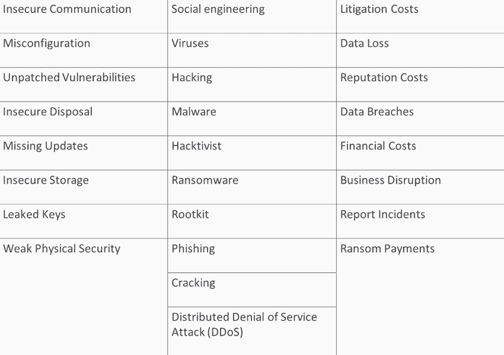
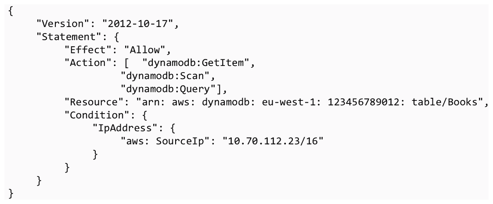
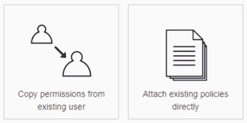
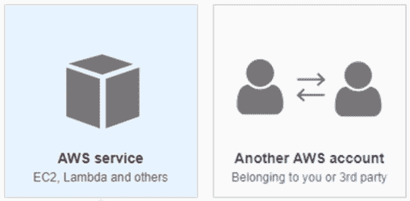
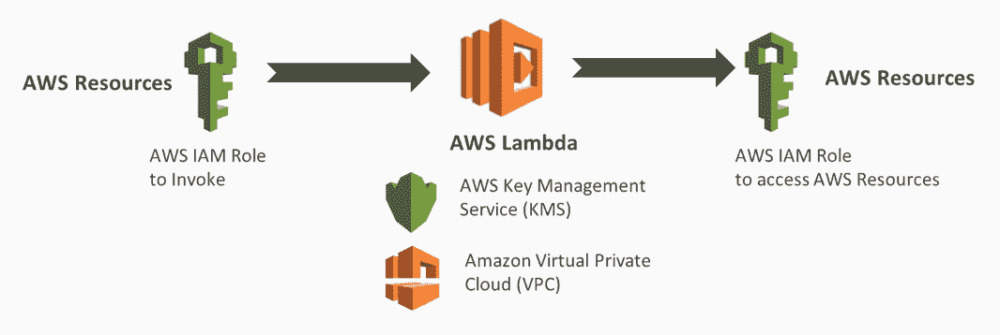
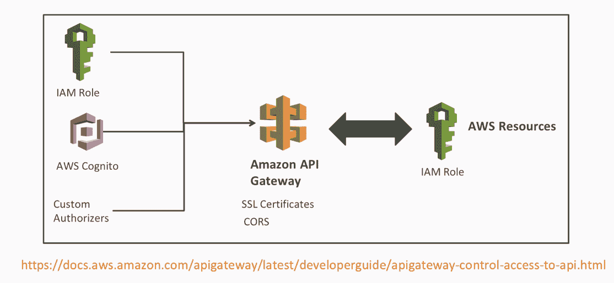

# 第五章：保护您的微服务

在本章中，我们将简要概述 AWS 中的安全性，以确保您的无服务器微服务是安全的。在创建我们的第一个微服务之前，我们首先需要了解 AWS 安全模型。我们将讨论一些重要的术语和整体 AWS 安全模型。然后，我们将讨论 IAM，用于访问任何 AWS 资源。最后，我们将讨论如何保护您的无服务器微服务。

在本章中，我们将涵盖以下主题：

+   AWS 安全概述

+   AWS 身份和访问管理（IAM）概述

+   保护您的无服务器微服务

# AWS 安全概述

在本节中，我们将概述 AWS 中的安全性。我们将看看为什么安全很重要，提供一些安全性的例子，讨论重要的安全术语类型，并谈论 AWS 共享责任模型。

# 为什么安全很重要？

以下几点讨论了安全的重要性：

+   **法律和标准的合规性**：例如，欧盟**通用数据保护条例**（**GDPR**）和美国颁布的**健康保险可移植性和责任法案**（**HIPAA**）负责监管所有个人数据保护和隐私的法律。

+   **数据完整性**：不安全的系统可能会被剥夺数据或篡改数据，这意味着您不能再信任数据。

+   **个人可识别信息**：隐私是当今的主要关注点。您应该当然地保护您的用户数据和资产。

+   **数据可用性**：例如，如果审计员要求您提供特定数据，您需要能够检索该数据。如果您的数据中心附近发生自然灾害，那些数据需要是可用和安全的。

让我们看看以下清单：

在左侧，我们有各种配置不正确、缺少更新或未加密通信手段的系统。这实际上可能导致中间部分，例如系统被黑客入侵、勒索软件要求或对您的系统进行渗透。例如，可能会发动分布式拒绝服务攻击，这将使您的电子商务网站无法访问。

在右侧，您可以看到一些影响。可能会有诉讼成本、数据丢失或数据泄露、对您的组织的财务成本，以及声誉成本。

# AWS 中的安全术语类型

AWS 中的许多安全性实际上是配置和正确架构的重要性。因此，了解一些这些安全术语是很重要的。

+   **传输安全**：将其视为 HTTPS SSL。如果您考虑一个网络浏览器，您会在浏览器中看到一个挂锁，表示通信是安全的，例如当您访问任何在线银行系统时。

+   **静态安全**：这是加密在数据库或文件系统中的数据。只有拥有密钥的用户才能访问数据。

+   **身份验证**：这指的是确认用户或系统是否是其应该是的过程。

+   **授权**：一旦您经过身份验证，系统会检查正确的授权。这是为了检查权限和访问控制是否已经就位，以便您访问特定的 AWS 资源。

# AWS 身份和访问管理（IAM）概述

在本节中，我们将简要讨论 AWS IAM，特别是用于无服务器计算。IAM 是一个中心位置，您可以在那里管理用户和安全凭据，如密码、访问密钥和权限策略，以控制对 AWS 服务和资源的访问。我们将讨论最相关的 IAM 资源：策略、角色、组和用户。

IAM 策略是定义受影响操作的资源和条件的 JSON 文档。以下是一个 JSON 文档的示例，它将授予对 DynamoDB 表的读取访问权限，仅当请求来自特定 IP 范围时，表名为 `Books`：

还有一个可视化编辑器，允许您创建这些组，或者您可以通过编辑 JSON 文档来手动创建。

# IAM 用户

IAM 用户是与 AWS 交互的人员或服务。他们通过密码或多因素身份验证（对于新用户）访问管理控制台，或者他们可能具有访问密钥，以便使用命令行界面或 SDK 进行编程访问。如下图所示，您可以将策略附加到用户，以授予他们对特定 IP 范围内 DynamoDB 的读取访问权限：

# IAM 组

IAM 组用于更好地模拟组织中的安全术语。您可以将它们视为活动目录组。例如，在您的组织中，您可能会有管理员、开发人员和测试人员。

要创建一个组，您可以使用 AWS 管理控制台、SDK 或 CLI，在 IAM 中添加组，然后附加策略。创建组后，您可以将其附加到用户，或者您可以创建一个新的组。

# IAM 角色

IAM 角色类似于用户，它们可以附加策略，但可以由需要访问的任何人附加到受信任的实体。通过这种方式，您可以委派对用户、应用程序或服务的访问权限，而无需给他们新的 AWS 密钥，因为他们可以通过这个受信任的实体使用临时安全令牌。例如，您可以授予第三方对 S3 存储桶的读取访问权限，而无需在您的 AWS 环境中共享任何密钥，纯粹使用角色：

# 保护您的无服务器微服务

在本节中，我们将讨论构建第一个微服务所需的安全性。具体来说，我们将看一下围绕 Lambda 函数、API 网关和 DynamoDB 的安全性，然后我们将讨论在检测到可疑事件时可以使用的监控和警报方式。

# Lambda 安全

在 lambda 安全中，有两种类型的 IAM 角色：

+   调用 lambda：这意味着具有实际调用和运行 lambda 函数的权限。例如，这可以来自 API 网关或另一个服务。

+   授予 lambda 函数对特定 AWS 资源的读写访问权限：例如，您可以允许 Lambda 函数从 DynamoDB 表中读取。

此外，**密钥管理服务**（**KMS**）是 AWS 管理的密钥服务，允许您对数据进行加密和解密，例如在数据库或 NoSQL 数据存储中的数据。亚马逊虚拟私有云是另一个选项，Lambda 默认在安全的 VPC 中运行。但是，如果您需要访问资源，例如弹性碰撞集群或 RDS，这些资源位于私有 VPC 中，您可能希望在自己的私有 AWS VPC 中运行它。以下是使用 AWS Lambda 使用 AWS KMS 和 AWS VPC 的工作流表示：

对于 API 网关安全性，有三种方式可以控制谁可以调用您的 API 方法。这被称为请求授权，如下图所示：

以下是控制谁可以调用您的 API 的不同方法：

+   IAM 角色和策略：这提供对 API 网关的访问。API 网关将使用这些角色和策略来验证请求者的签名。

+   亚马逊 Cognito 用户池：这控制谁可以访问 API。在这种情况下，用户必须登录才能访问 API。

+   **API Gateway 自定义授权者**：这是一个请求，比如一个持有者令牌或 lambda 函数，用于验证并检查客户端是否被授权调用 API。

如果您从 API 自己的域之外的域接收请求，您必须启用跨域资源共享。此外，API Gateway 支持 SSL 证书和证书颁发机构。API Gateway 可能需要通过 IAM 角色授权调用或调用 AWS 内的特定资源，比如 Kinesis 流或调用 Lambda 函数。

# DynamoDB 安全

您可以使用 IAM 用户进行身份验证，也可以使用特定的 IAM 角色。一旦它们经过身份验证，授权就受到控制，并且 IAM 策略被分配给特定用户或角色。我建议的是，在为 DynamoDB 创建这些策略时，尽可能地限制它们，这意味着避免对所有表和 DynamoDB 进行读取和写入访问。最好为特定表使用特定名称。

# 监控和警报

监控系统中的任何可疑活动并检测任何性能问题非常重要。API Gateway、DynamoDB 和 Lambda 函数都支持 CloudTrail、CloudWatch 和 X-Ray 进行监控和警报。它们的讨论如下：

+   CloudTrail 允许您监控所有 API 和任何用户或系统对资源的访问。

+   CloudWatch 允许您收集和跟踪指标，监视日志文件，设置特定警报，并自动对 AWS 资源的更改做出反应。

+   X-Ray 是一项新服务，可以跟踪请求并生成服务地图。

这些免费系统的组合为您提供了对无服务器系统的非常好的洞察力。

# 摘要

阅读完本章后，您应该对 AWS 中的安全有更深入的了解，以及为什么对您的组织来说这是重要的。毕竟，没有人希望成为负责数据泄露的人。我们讨论了 IAM，您现在知道策略是确保对 AWS 资源受限访问的关键文档。我们还研究了一些保护您的无服务器微服务的安全概念；具体来说，我们了解了 lambda、API Gateway 和 DynamoDB。
