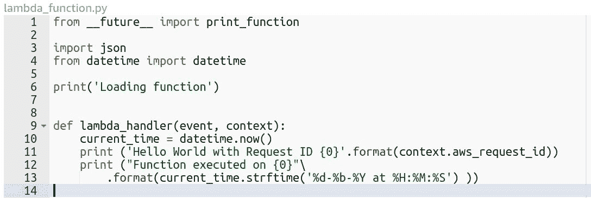
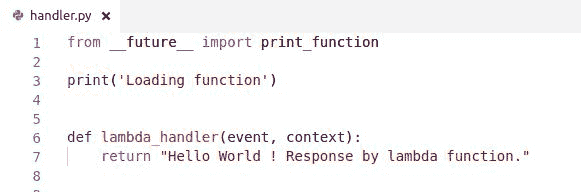

# 第一章：用于无服务器的亚马逊网络服务

在本章中，我们将学习关于亚马逊网络服务管理无服务器基础架构。我们将探索 AWS 工作流程以创建无服务器应用程序。我们将学习手动创建基本无服务器应用程序的过程，以及使用 AWS CLI 进行自动化处理的过程。

本章我们将涵盖的主题包括：

+   从传统服务器过渡到无服务器

+   开始使用 AWS Lambda

+   AWS Lambda 的工作原理

+   执行 Lambda 函数

+   创建 Lambda 触发器

+   创建无服务器 RESTful API

+   通过 AWS CLI 与 AWS Lambda 进行交互

# 技术要求

在继续之前，有一些技术先决条件。我们将通过 Web 控制台和 AWS CLI 演示 AWS。应考虑以下先决条件：

+   所有演示都在 Ubuntu 16.04 的 Linux 机器上进行了测试。我们已经分享了本书中使用的每个库的链接。您可以获取有关特定平台的安装和配置的详细信息。

+   我们使用开源库和软件。因此，对于每个库，我们将分享其官方文档链接。您可以参考这些链接以获取有关特定库的详细信息。

# 从传统服务器过渡到无服务器

自从 Web 托管开始以来，Web 托管发生了巨大变化。物理服务器机器被多个 Web 应用程序共享，当需要扩展时，这是一个真正的挑战。对于任何个人或公司来说，购买整个服务器机器来托管其 Web 应用程序都非常昂贵。

但是，由于虚拟化，任何 Web 应用程序都不需要物理服务器。虚拟化提供了创建许多虚拟服务器的能力，而不是单个物理服务器。

现在，无服务器的新时代使开发人员的生活变得更加轻松，因为我们可以将辛勤工作集中在开发上，而不是花时间和金钱在部署上。

亚马逊推出了亚马逊弹性计算云（Amazon EC2）作为云计算解决方案。亚马逊 EC2 使得在亚马逊云中创建一系列虚拟服务器或实例成为可能，而无需投资于硬件。您可以根据网络、计算和存储的需求进行扩展。

无服务器方法只是消除设置托管环境的手动工作量的过程。云服务提供商提供无服务器服务，因此您实际上从未拥有任何服务器。相反，云服务提供商在高可用性基础设施中执行您的代码。

# 开始使用 AWS Lambda

许多云服务提供商为无服务器基础架构引入了不同的服务。亚马逊推出了 AWS Lambda 作为计算服务，您只需提供代码，AWS Lambda 就会在高度可扩展的基础设施中执行代码。您无需担心手动管理服务。您需要支付代码执行的计算时间，当您的代码未运行时则不收费。

AWS Lambda 根据需要执行代码，以响应诸如 S3 存储桶上的数据存储事件、Amazon DynamoDB 事件和通过 API Gateway 的 HTTP 请求事件等事件。AWS Lambda 能够根据 AWS CloudWatch Events 的计划时间事件执行代码。AWS Lambda 支持 Python、Node.js、C#和 Java。

亚马逊简单存储服务（S3）是亚马逊提供的存储服务。它具有一个简单的 Web 界面来存储数据。亚马逊 S3 具有可供其他服务使用的相关服务事件。

# AWS Lambda 的工作原理

您需要编写一个函数，该函数将由 AWS Lambda 代表您执行。

AWS Lambda 是基于容器的模型实现的，支持运行时环境，并根据 Lambda 函数的配置执行代码。当调用 Lambda 函数时，它会根据 AWS Lambda 配置启动容器（执行环境），并启用基本的运行时环境，这是执行代码所需的。

让我们从一些实际工作开始：

1.  要创建一个 Lambda 函数，您必须拥有 AWS 账户。如果您没有 AWS 账户，那么您需要在 AWS 上注册（[`aws.amazon.com/`](https://aws.amazon.com/)），提供一些基本的联系和付款信息，因为这是亚马逊所需的基本信息。

1.  转到 Lambda 主页（[`console.aws.amazon.com/lambda/home`](https://console.aws.amazon.com/lambda/home)）。单击“创建函数”按钮。这将重定向您到**创建函数**页面，下一步将描述该页面。请查看以下屏幕截图：


1.  AWS 提供了三种不同的选项来创建 Lambda 函数，比如从头开始创建、蓝图和无服务器应用程序存储库。我们将使用蓝图选项，其中包含一些内置的 Lambda 函数。我们可以根据搜索栏中的要求选择这些蓝图，您可以通过标签和属性进行过滤，或者通过关键字搜索：


1.  让我们选择一个 hello-world-python 蓝图。一旦我们选择了蓝图，我们需要设置关于 Lambda 函数的基本信息。这些信息包括 Lambda 函数的名称和角色，如下面的屏幕截图所示：


1.  在这里，名称将是您的 Lambda 函数的唯一标识，而角色定义了您的 Lambda 函数的权限。

有三种选项可用于创建角色：

+   选择现有角色

+   从模板创建新角色

+   创建自定义角色

让我们更详细地看一下它们：

+   **选择现有角色**：这允许您选择先前创建的角色。

+   **从模板创建新角色**：在这里，您需要定义一个角色名称。AWS Lambda 提供了预先配置的内置角色策略模板，具有预配置的权限。这些权限基于 AWS Lambda 函数所需的其他 AWS 服务相关权限。在任何角色选择上，Lambda 将自动将日志记录权限添加到 CloudWatch（AWS 日志记录服务），因为这是 Lambda 所需的基本权限。

+   **创建自定义角色**：AWS 提供了额外的权限来创建一个定制的角色来访问 AWS Lambda。在这里，您可以根据自己的需求定义角色。

1.  让我们创建一个带有某些角色的`HelloWorld` Lambda 函数。在这里，我选择了 S3 对象只读权限策略模板。

1.  以下屏幕截图描述了新创建的`HelloWorld` Lambda 函数：


HelloWorld Lambda 函数

Lambda 函数包括三个部分：

+   配置

+   触发器

+   监控

让我们来看一下关于配置和监控的详细信息。我们将为触发器设置一个单独的部分。

# 配置

Lambda 执行取决于配置设置。配置 Lambda 函数需要以下详细信息：

+   函数代码

+   环境变量

+   标签

+   执行角色

+   基本设置

+   网络

+   调试和错误处理

# 函数代码

在这里，您需要编写代码。Lambda 函数有一个预定义的编写代码的模式。在编写代码时，您需要理解上下文。Lambda 提供了三种可行性，这决定了代码的运行时执行：

+   **代码输入类型**：此部分提供了三种选项来决定代码的输入类型，比如内联编辑代码、上传 ZIP 文件和从 Amazon S3 上传文件。

+   **运行时**：此部分提供了选项来决定代码的运行时编程语言上下文，比如 Python、C#、NodeJS 和 Java。

+   处理程序：处理程序定义了您的方法/函数的路径，例如`<filename>.<method_name>`。例如，如果您想要执行一个名为`handler`的函数，该函数在`main.py`中定义，那么它将是`main.handler`。

让我们回到我们新创建的名为`lambda_handler`的 hello world 函数。

在这里，处理程序的值被定义为`lambda_function.lambda_handler`，其中`lambda_function.py`是文件名，`lambda_handler`是方法名：

```py
def lambda_handler(event, context): 
    print("value1 = " + event['key1']) 
    print("value2 = " + event['key2']) 
```

`Lambda_handler`接受两个位置参数，`event`和`context`：

+   `event`：此参数包含与事件相关的信息。例如，如果我们配置 Lambda 函数与 Amazon S3 存储桶事件，那么我们将在事件参数中获得 S3 存储桶信息，例如存储桶名称，区域等。

+   `context`：此参数包含可能在运行时需要的与上下文相关的信息，以供代码执行。

# 环境变量

您可以以键值对的形式设置环境变量，这些变量可以在您的代码中使用。

# 标签

您可以使用标签对 Lambda 函数进行分组和过滤。您可能有多个具有不同区域的 Lambda 函数，因此标签有助于使 Lambda 函数更易管理。

# 执行角色

正如我们之前讨论的，在创建 Lambda 函数时角色和权限，Lambda 提供了编辑您在创建 Lambda 函数时选择的现有角色的能力。

# 基本设置

在基本设置下，您可以配置内存和执行超时。Lambda 支持的内存范围从 128 MB 到 1,536 MB。超时执行以秒为单位；Lambda 支持的默认超时执行时间为 300 秒。此设置可帮助您控制 Lambda 函数的代码执行性能和成本。

# 网络

在网络部分，您可以配置对 Lambda 函数的网络访问。

AWS 提供了**VPC**（虚拟私有云）服务，用于创建允许访问 AWS 服务的虚拟网络。您还可以根据自己的需求配置网络。

我们将在接下来的章节中讨论带有 VPC 的 Lambda 函数。目前，我们将在网络部分选择无 VPC。

# 调试和错误处理

AWS Lambda 会自动重试失败的异步调用。但是您也可以配置**DLQ**（死信队列），例如 SQS 队列或 SNS 主题。要配置 DLQ，Lambda 函数必须具有访问 DLQ 资源的权限。

既然我们了解了配置，让我们继续执行 Lambda 函数。

让我们看一下*监控*部分，它描述了与我们的 Lambda 函数相关的活动。它可以用于分析我们的 Lambda 函数执行的性能。

# 监控

AWS CloudWatch 是 AWS 资源的监控服务，并管理所有活动日志。它创建指标数据以生成统计数据。CloudWatch 实现了对 AWS 资源的实时监控。它还监视与 AWS EC2 或 RDS 数据库实例以及其他资源相关的硬件信息。

Lambda 监控部分显示与 Lambda 函数活动和性能相关的最近 24 小时的分析数据。以下屏幕截图显示了我们的 hello world Lambda 函数的监控分析信息：


让我们继续下一节，我们将看一下 Lambda 函数的执行。

# 执行 Lambda 函数

AWS Lambda 支持多种执行方法。让我们从其自己的 Web 控制台界面开始基本执行。AWS Lambda 提供了手动测试函数的能力，您可以在其中定义测试事件上下文。如果您想针对其他 Amazon 服务进行测试，则有内置的事件模板可用。

以下屏幕截图演示了测试事件的创建：


如前面的屏幕截图所示，单个 Lambda 函数最多可以有 10 个测试事件，并且测试事件是持久的，因此您可以在需要测试 Lambda 函数时重复使用它们。

我使用事件名称`HelloWorld`创建了测试事件，现在我将执行`HelloWorld`函数，将 Lambda 函数转换为 Python 微服务，如下所示：

```py
from __future__ import print_function 
import json 

print('Loading function') 

def lambda_handler(event, context): 
    print("Received event: " + json.dumps(event, indent=2)) 
    print("value1 = " + event['key1']) 
    print("value2 = " + event['key2']) 
    print("value3 = " + event['key3']) 
    return "Hello World" 
```

在这里，我们打印事件数据，然后返回到`Hello World`字符串：


Lambda 在每个请求执行上管理一些信息，例如请求 ID 和计费信息。Lambda 价格模型是基于请求处理的时间消耗，而请求 ID 是每个请求的唯一标识。

在日志输出中，您可以看到所有的打印语句输出。现在，让我们引发一个错误，看看 Lambda 如何响应并返回日志。

我们将用以下片段替换当前代码：

```py
from __future__ import print_function 
import json 

print('Loading function') 

def lambda_handler(event, context): 
    print("Received event: " + json.dumps(event, indent=2)) 
    raise Exception('Exception raised manually.') 
```

以下屏幕截图是执行结果的日志片段：


在这里，Lambda 以完整的堆栈跟踪信息做出了响应，并将其记录下来。您可以检查 CloudWatch 日志，因为 CloudWatch 已预先配置了 AWS Lambda 执行。

我们从 Lambda 控制台了解了 Lambda 函数的执行，现在是时候从计划触发器执行 Lambda 函数了。在我们的项目中，我们经常需要有一个 cron 作业计划，在特定时间段执行一些功能。

Lambda 触发器将帮助我们根据事件设置触发器。让我们继续介绍如何向我们的 hello world 函数引入触发器。

# 创建 Lambda 触发器

Lambda 函数可以根据事件进行配置。AWS 提供了支持许多事件的触发器列表。这些触发器属于它们关联的 AWS 服务。

您可以从触发器部分向 Lambda 函数添加触发器。

我将稍微修改 hello world Lambda 函数。在这里，我们打印请求 ID，该 ID 作为`aws_request_id`属性在上下文对象中接收。它还打印时间戳：



现在，我们将向我们的 Lambda 函数添加一个触发器，该触发器将每分钟执行我们的 Lambda 函数。

以下屏幕截图显示了“添加触发器”流程，在这里您可以轻松地从左侧面板配置任何触发器与您的 Lambda 函数：


我们将配置 CloudWatch Events 触发器。CloudWatch Events 提供描述 AWS 资源更改的几乎实时系统事件。

您可以设置简单的事件规则，以在发生 AWS 资源的操作事件时进行操作，并且还可以安排自动事件，根据 cron 或速率表达式自触发。

cron 和速率表达式是定义计划表达式的两种不同方法。cron 表达式有六个必填字段，如 cron（字段），而速率表达式有两个必填字段，如速率（值单位）。这些方法帮助我们定义计划表达式。您可以在[`docs.aws.amazon.com/AmazonCloudWatch/latest/events/ScheduledEvents.html`](http://docs.aws.amazon.com/AmazonCloudWatch/latest/events/ScheduledEvents.html)找到详细信息。

在这里，我们将安排一个速率表达式，以便每分钟执行我们的 hello world Lambda 函数。我们需要从触发器下拉菜单中选择 CloudWatch Events。

为了创建 CloudWatch 事件规则，我们将创建一个新规则。我们需要使用一些必需的信息设置规则，例如规则名称，这是一个唯一标识符。因此，我们将规则命名为`hello-world-every-minute`，规则类型为事件模式或计划表达式。在我们的情况下，它将是一个计划表达式，速率（1 分钟），如前面的屏幕截图所示。

一旦我们设置了触发器并启用它，按照计划表达式，计划事件将被触发。让我们在五分钟后查看我们的 hello world Lambda 日志。

要查看与任何服务相关的日志，您需要执行以下操作：

1.  在[`console.aws.amazon.com/cloudwatch/`](https://console.aws.amazon.com/cloudwatch/)上打开 CloudWatch 控制台

1.  在导航窗格中，选择日志

1.  选择与`HelloWorld` Lambda 函数相关的日志组

以下屏幕截图描述了 CloudWatch 日志访问：


通过选择`HelloWorld` Lambda 函数日志组，您可以看到与我们的`HelloWorld` Lambda 函数相关的日志活动。以下屏幕截图显示了`HelloWorld`函数的日志：


在这里，您可以看到我们的 hello world Lambda 函数自从我们启用了触发器以来每分钟执行一次。

现在，让我们继续创建一个无服务器的 RESTful API。

# 无服务器 RESTful API

让我们了解微服务场景，我们将部署一个无服务器的 hello world 函数，通过 API Gateway 响应 HTTP 事件。

Amazon API Gateway 服务使您能够创建、管理和发布与任何规模的 AWS 资源交互的 RESTful API。API Gateway 提供了一个接口，通过该接口您可以通过 REST 应用程序编程接口公开后端。

为了启用 AWS 无服务器基础设施，API Gateway 发挥着重要作用，因为它可以配置为执行 Lambda 函数。

现在，我们将配置一个 API Gateway 服务来执行 Lambda 函数

这是 hello world 函数：


当我们将 AWS Lambda 函数与 API Gateway 集成时，Lambda 函数必须返回一个带有所需键的字典对象，如`statusCode`、`headers`和`body`。`body`属性的值必须是 JSON 字符串。因此，我们将 Python 字典转换为 JSON 字符串。

现在是时候将 API Gateway 与 Lambda 函数集成了。正如我们在之前关于触发器的讨论中所看到的，我们将使用 API Gateway 添加一个触发器：


我们将创建一个名为`LambdaMicroservice`的 API Gateway 服务。API Gateway 使您能够根据需要创建和维护部署阶段。

如果您想保护您的 API，那么您有两个选项——使用 AWS IAM 并使用访问密钥打开它，或者保持它开放，使其公开可用。

AWS **IAM**（身份访问管理）是 AWS 云服务，有助于创建安全访问凭据以访问 AWS 云服务。

使用访问密钥功能允许您从 API Gateway 控制台生成密钥。在我们的情况下，我们只会保持安全性开放，因为我们需要公开访问我们的 API：


一旦添加并保存更改，REST API 将在几秒钟内准备就绪。调用 URL 就是我们的 REST API 端点。

让我们使用`curl`命令行工具访问调用 URL 并查看发生了什么：

```py
$ curl https://cfi6872cxa.execute-api.us-east-2.amazonaws.com/prod/HelloWorld
{"message": "Hello World returned in JSON"}
```

就是这样。我们已经使用 AWS Lambda 和 API Gateway 创建了一个无服务器的 RESTful API。现在，我们将看看如何使用 AWS CLI 与 AWS 服务进行交互。

# AWS Lambda 与 AWS CLI 的交互

AWS CLI 是在 AWS SDK for Python 的基础上开发的开源工具，使用 Boto 库提供与 AWS 服务交互的命令。通过非常少的配置，您可以从 CLI 管理任何 AWS 服务。它提供对 AWS 服务的直接访问，您可以开发 shell 脚本来管理您的资源。

例如，如果您想将文件上传到 S3 存储桶，那么您只需通过 CLI 执行一个命令即可完成：

```py
$ aws s3 cp index.html s3://bucket-name/ 
```

`aws s3 cp`是一个类似 shell 的命令，执行多部分文件上传操作以完成操作。

它还支持对一些 AWS 服务进行定制。您可以使用`--help`命令查看`aws-cli`支持的 AWS 服务列表。

# 安装 AWS CLI

`awscli`可用作 Python 分发包。您可以使用`pip`命令轻松安装它，如下面的代码所述：

```py
$ pip install awscli --upgrade  
```

以下是先决条件：

+   Python 2 的版本为 2.6.5+或 Python 3 的版本为 3.3+

+   Unix、Linux、macOS 或 Windows

# 配置 AWS CLI

`awscli`直接访问 AWS 服务，但我们需要配置和验证它以访问 AWS 服务。

运行`aws configure`命令以配置 AWS CLI 与您的 Amazon 帐户：


您可以从“My Security Credentials”选项中获取 AWS 访问密钥 ID 和 AWS 秘密访问密钥，如下图所示：


让我们使用 AWS CLI 配置 AWS Lambda 函数。

# 使用 AWS CLI 配置 Lambda 函数

让我们使用`awscli 实用程序`命令配置我们的 hello world Lambda 函数和触发器。

AWS CLI 支持所有可用的 AWS 服务。您可以使用`aws help`查看`aws`命令的详细描述，并列出所有可用的服务。

我们对 Lambda 感兴趣，因为我们将创建一个具有简单 hello world 上下文的 Lambda 函数：

```py
$ aws lambda help  
```

这将列出 Lambda 服务的完整描述以及管理 AWS Lambda 服务所需的所有可用命令。

# 创建 Lambda 函数

在这里，我们将使用`aws lambda create-function`命令创建一个新的 Lambda 函数。要运行此命令，我们需要传递必需和可选参数。

确保您具有具有`lambda:CreateFunction`操作权限的角色。

以前，在 AWS Lambda 控制台中，我们选择了内联编辑作为代码入口点。现在，我们将使用 ZIP 文件作为部署包。

在创建 Lambda 函数之前，我们应该创建一个 Lambda 函数部署包。

此部署包将是一个 ZIP 文件，其中包含您的代码和任何依赖项。

如果您的项目有一些依赖关系，则必须在项目的根目录中安装依赖关系。例如：

```py
 $ pip install requests -t <project-dir> OR  
 $ pip install -r requirements.txt  -t <project-dir> 
```

这里，`-t`选项表示目标目录。

在名为`handler.py`的文件中创建一个简单的`lambda_handler`函数，如下图所示：



现在，让我们制作一个 ZIP 文件作为部署包，其中包含前面的代码：


现在，我们准备创建 Lambda 函数。以下截图描述了命令执行：


您可以看到，在 AWS Lambda 控制台中，Lambda 函数立即被创建：


让我们讨论我们在`aws lambda create-function`命令中使用的必需和可选参数：

+   `--function-name`（必需）：名称不言自明。我们需要传递要创建的 Lambda 函数的名称。

+   `--role`（必需）：这是一个必需的参数，我们需要将 AWS 角色 ARN 用作值。确保此角色具有创建 Lambda 函数的权限。

+   `--runtime`（必需）：我们需要提到 Lambda 函数执行的运行时环境。正如我们之前提到的，AWS Lambda 支持 Python、Node.js、C#和 Java。因此，这些是可能的值：

+   `python2.7`

+   `python3.6`

+   `nodejs`

+   `nodejs4.3`

+   `nodejs6.10`

+   `nodejs4.3-edge`

+   `dotnetcore1.0`

+   `java8`

+   `--handler`（必需）：在这里，我们提到将作为 AWS Lambda 执行入口点的函数路径。在我们的情况下，我们使用了`handler.lambda_function`，其中处理程序是包含`lambda_function`的文件。

+   `--description`：此选项允许您添加有关 Lambda 函数的一些文本描述。

+   `--zip-file`：此选项用于从本地环境/计算机上传代码的部署包文件。在这里，您需要在 ZIP 文件路径前添加`fileb://`作为前缀。

+   `--code`：此选项可帮助您从 AWS S3 存储桶上传部署包文件。

您应该传递一个带有模式的字符串值，例如这里所示的一个：

```py
 "S3Bucket=<bucket-name>,S3Key=<file-name>,S3ObjectVersion=<file-version-id>". 
```

还有许多其他可选参数，您可以通过`help`命令查看，例如`aws lambda create-function help`*.* 您可以根据自己的需求使用它们。

现在我们将看到使用命令`$ aws lambda invoke`调用 Lambda 函数。

# 调用函数

Lambda CLI 提供了一个命令来直接调用 Lambda 函数：

```py
$ aws lambda invoke --function-name <value> <outfile> 
```

让我们来看看这些参数：

+   `--function-name`（必需）：此参数要求输入 Lambda 函数名称

+   `outfile`（必需）：在这里，您需要提到一个文件名，返回的输出或 Lambda 函数的响应将被存储在那里

这里还有其他可选参数，您可以通过`help`命令列出。

让我们调用我们最近创建的`HelloWorldCLI`函数：


当我们调用 Lambda 函数时，它立即以状态代码做出响应，并且 Lambda 函数返回的输出数据存储在新创建的`lambda_output.txt`文件中，通过`lambda invoke`命令。

# 创建事件源映射

这是`aws lambda`命令的一个子命令，用于为您的 Lambda 函数创建事件映射。`$ aws lambda create-event-source-mapping`仅支持 Amazon Kinesis 流和 Amazon DynamoDB 流事件映射。我们将在即将到来的章节中讨论使用 Zappa 进行 Amazon API Gateway 和 CloudWatch 事件的事件映射。

# 总结

在本章中，我们学习了创建简单的 AWS Lambda 的手动过程，并配置了一些触发器。此外，我们还使用 AWS CLI 查看了 AWS Lambda 的配置。实现无服务器应用程序真是令人惊讶。这些 AWS 服务在创建无服务器基础架构中扮演着重要的角色，您可以在其中开发应用程序并将其部署为无服务器。

# 问题

1.  无服务器的好处是什么？

1.  Amazon S3 在无服务器基础架构中的作用是什么？
