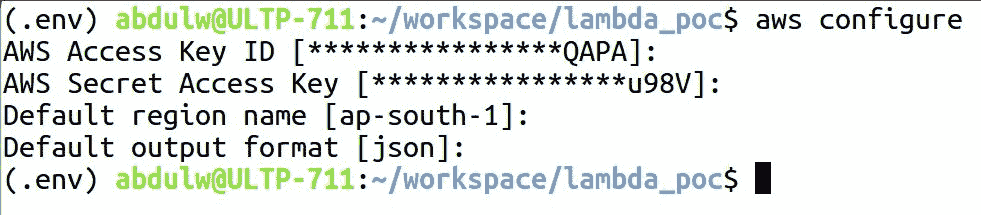
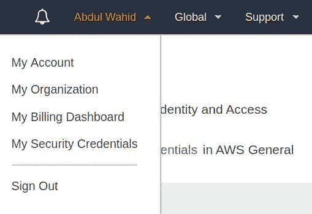
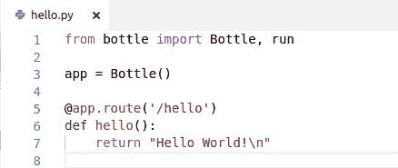
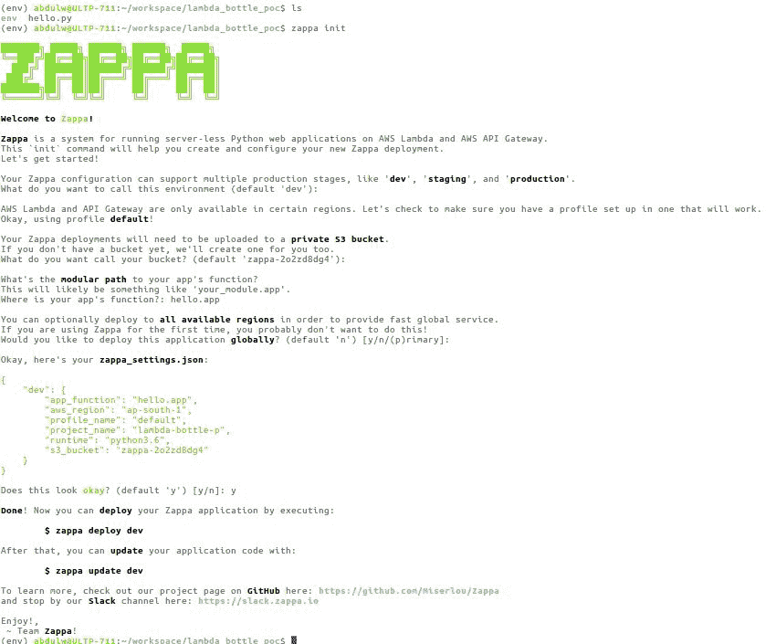
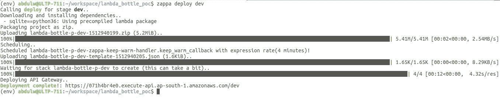

# 第二章：使用 Zappa 入门

之前，我们学习了如何使用 AWS Web 控制台和 AWS CLI 创建无服务器应用程序。现在，我们将学习 Zappa 和自动化操作，以创建无服务器应用程序。

在本章中，我们将涵盖以下主题：

+   什么是 Zappa？

+   安装和配置 Zappa

+   使用 Zappa 构建、测试和部署 Python Web 服务

+   Zappa 的用途

# 技术要求

在继续之前，让我们确保满足技术要求。接下来的小节将介绍本章的硬件和软件要求。

# 硬件

为了演示目的，我们使用了一个基本配置的机器，具体规格如下：

+   内存—16GB

+   处理器—Intel Core i5

+   CPU—2.30GHz x 4

+   图形—Intel HD Graphics 520

# 软件

以下是软件规格：

+   OS—Ubuntu 16.04 LTS

+   OS 类型—64 位

+   Python 3.6

+   Python 开发包：`build-essential`、`python-dev`和`python-virtualenv`

+   AWS 凭据和 AWS CLI

+   Zappa

我们将在接下来的章节中详细描述设置环境的过程。与此同时，你可以配置诸如`python3.6`和`awscli`等必要的软件包。

# 什么是 Zappa？

Zappa 是一个开源工具，由 Gun.io 的创始人/CTO Rich Jones 开发和设计（[`www.gun.io/`](https://www.gun.io/)）。Zappa 主要设计用于在 AWS Lambda 和 API Gateway 上构建和部署无服务器 Python 应用程序。

Zappa 非常适合使用 Flask 和 Bottle 等框架部署无服务器 Python 微服务，用于托管大型 Web 应用程序和 CMSes 的 Django。你也可以部署任何 Python WSGI 应用程序。

在上一章中，我们使用 AWS Lambda 和 API Gateway 实现了基本的 hello world 微服务。Zappa 自动化了所有这些手动流程，并为我们提供了一个方便的工具来构建和部署 Python 应用程序。

就像这样简单：

```py
$ pip install zappa
$ zappa init
$ zappa deploy
```

正如我们之前所描述的，传统的 Web 托管是指服务器需要始终在线，监听 HTTP 请求并逐个处理请求。如果传入的 HTTP 请求队列增长，那么服务器将无法每秒处理那么多请求，就会出现超时错误。

API Gateway 使用虚拟 HTTP 服务器为每个请求提供自动扩展。这就是它可以在不失败的情况下为数百万个请求提供服务的原因。因此，我们可以在当前部署成本的零停机侵害下获得无限扩展。

现在，我们将进行一个应用程序演示，但在此之前，让我们在你的机器上配置 Zappa，我们将在接下来的章节中介绍。

# 安装和配置 Zappa

安装 Zappa 是一项简单的任务，但在继续之前，我们需要配置先决条件。确保你有 Python 2.7 或 Python 3.6，并且有一个有效的 AWS 账户。现在，你需要在你的机器上使用`help awscli`配置 AWS 凭据：

```py
$ pip install awscli
```

使用`aws configure`命令配置 AWS 凭据，如下截图所示：



配置 AWS 凭据要求你有 AWS 访问密钥 ID、AWS 秘密访问密钥、默认区域名称和默认输出格式。

你可以从“我的安全凭据”页面获取 AWS 凭据信息，如下截图所示：



一旦你配置了 AWS 凭据，我们就可以继续安装 Zappa 了。

Zappa 必须安装在虚拟环境中。强烈建议在安装 Zappa 之前创建一个虚拟环境并激活它。我倾向于使用`virtualenv`工具。还有其他可用于管理虚拟环境的工具：

```py
$ virtualenv env -p python3.6
```

在这里，我们创建了一个名为`env`的虚拟环境，并使用`python3.6`，其中`-p`表示 Python 版本。现在，按照以下步骤激活虚拟环境：

```py
$ source env/source/bin
```

现在我们已经准备好了，让我们使用`pip`安装 Zappa：

```py
$ pip install zappa
```

现在，我们准备启动 Zappa。在接下来的章节中，我们将创建一个小程序，演示如何使 Zappa 的部署变成无服务器。

# 使用 Zappa 构建、测试和部署 Python Web 服务

我们将使用 Python 的 Bottle 框架创建一个简单的 hello world 程序作为微服务。让我们按照一些基本步骤来配置一个使用 Bottle 框架的小项目：

1.  首先，我们将创建一个名为`lambda_bottle_poc`的新项目目录：

```py
$ mkdir lambda_bottle_poc
```

1.  让我们在`lambda_bottle_poc`目录中创建一个虚拟环境：

```py
$ virtualenv env -p python3.6
```

1.  以下是使用 Bottle 框架的基本 hello world 程序：



现在是时候将程序部署为 AWS Lambda 上的无服务器，并通过 API Gateway 公开`/hello` API。在上一章中，我们描述了使用 AWS 控制台和 AWS CLI 手动部署 Python 应用程序的过程，这是一个非常大的挑战。

但借助 Zappa，所有 AWS 控制台和 AWS CLI 的手动流程都被自动化，并提供了一种快速的方式来在无服务器环境中部署和维护您的应用程序。

# 构建部署包

让我们使用`zappa init`命令初始化 Zappa。这个命令可以帮助您创建和部署 Python 应用程序。这个命令以用户交互模式运行，并提出一些基本问题，以便我们可以设置部署过程。

问卷结束时，Zappa 创建了一个名为`zappa_settings.json`的 JSON 文件。这个文件实际上就是 Zappa 的支撑，因为它维护了 Zappa 内部使用的映射信息。

我们将在接下来的几分钟内详细讨论 Zappa 的`init`命令过程。在那之前，先看一下以下截图，描述了`zappa init`命令的流程：



正如您所看到的，`zappa init`启动了用户交互模式，并提出了一些问题。让我们看看每个问题的一些信息。

# 您想如何称呼这个环境？（默认开发）

Amazon API Gateway 提供了一种机制来维护托管 API 的不同环境阶段。例如，您可以为开发、暂存和生产创建环境阶段。

借助 Zappa，您可以非常轻松地管理环境阶段。对于前面的问题，您可以定义自己的环境阶段名称，或者将其留空以考虑默认的阶段名称为`dev`。

# 你想给你的存储桶起什么名字？（默认 zappa-2o2zd8dg4）

Zappa 部署将需要上传到私有的 Amazon S3 存储桶。AWS Lambda 需要两种类型的代码输入，即内联代码和上传 ZIP 文件。如果 ZIP 文件大小超过 10MB，则考虑将 ZIP 文件上传到 Amazon S3。这就是为什么 Zappa 默认创建一个存储桶，用于上传部署 ZIP 文件并引用 AWS Lambda。

您可以提供自己现有的存储桶名称，或者选择由 Zappa 建议的默认名称。如果存储桶不存在，Zappa 将自动为您创建一个。

# 你的应用功能的模块化路径是什么？（默认开发）

AWS Lambda 函数需要一个属性，比如`lambda_handler`，它指向一个函数作为 Lambda 执行的入口点。因此，我们需要提供有关函数名称的信息，以模块化路径的形式，例如`<filename>.<function_name/app_name>`给 Zappa。

在我们的案例中，我们有一个名为`hello.py`的文件，以及使用 Python Bottle 框架的`Bottle`类创建的应用对象。因此，对于这个问题的答案是`hello.app`。

# 您想全球部署应用程序吗？（默认否）

AWS 提供了一个功能，可以将 Lambda 服务扩展到所有可用的区域。如果您希望使您的服务全球可用，并且延迟更少，那就是您应该做的。Zappa 支持这个功能，它将使您能够在所有区域扩展 Lambda 服务，而无需任何手动操作。

最后，您将得到一个`zappa_settings.json`文件，其中包含了与您的部署相关的所有配置。让我们在下一节中查看`zappa_settings.json`文件。

# zappa_settings.json 文件

完成问卷调查后，Zappa 会根据您的输入创建一个基本的`zappa_settings.json`文件。`zappa_settings.json`在配置 Zappa 与您的项目时起着重要作用。如果您在现有项目（`Django/Flask/Pyramid/Bottle`）中初始化 Zappa，那么 Zappa 会自动检测项目类型，并相应地创建`zappa_settings.json`文件。

以下是我们新创建的`zappa_settings.json`文件的内容，用于 hello world 程序：

```py
{
   "dev": {
       "app_function": "hello.app",
       "aws_region": "ap-south-1",
       "profile_name": "default",
       "project_name": "lambda-bottle-p",
       "runtime": "python3.6",
       "s3_bucket": "zappa-2o2zd8dg4"
   }
}
```

对于 Django 项目，它使用`django_settings`而不是`app_function`。`django_settings`需要用您的 Django 设置的路径进行初始化：

```py
{
   "dev": {
       "django_settings": "your_project.settings",
       "aws_region": "ap-south-1",
       "profile_name": "default",
       "project_name": "lambda-bottle-p",
       "runtime": "python3.6",
       "s3_bucket": "zappa-2o2zd8dg4"
   }
}
```

上述配置足以部署一个基本的 Python Web 应用程序。让我们继续部署 hello world 作为无服务器应用程序。

# 部署和测试 hello world

Zappa 部署非常简单，因为您只需要运行一个命令来开始部署：

```py
$ zappa deploy <stage_name>
```

就是这样！我们已经完成了部署。现在，让我们部署 hello world 程序。以下截图描述了部署过程：



部署完成后，我们会得到 API URL 端点。让我们通过访问`/hello`端点的 API URL 来测试 hello world 应用程序：

```py
$ curl -l  https://071h4br4e0.execute-api.ap-south-1.amazonaws.com/dev/hello
```

运行上述命令后，您将看到以下输出：

```py
Hello World!
```

能够在几秒钟内配置服务并部署真是太神奇了。现在，我们将详细了解与`zappa_settings.json`文件相关的基本用法。

# 基本用法

Zappa 涵盖了每一个部署过程。让我们详细讨论一下 Zappa 的部署流程。

# 初始部署

一旦您初始化了 Zappa，您就可以通过单个命令将应用程序部署到`production`阶段，如下面的代码片段所示：

```py
$ zappa deploy production
.
.
.
Deployment complete ! https://071h4br4e0.execute-api.ap-south-1.amazonaws.com/production
```

当您调用`$ zappa deploy`命令时，Zappa 会执行一些任务来完成部署。以下是 Zappa 关于部署的内部流程和过程：

1.  通过将本地环境中的应用程序代码压缩成 ZIP 存档文件，并用预编译的 Lambda 包中的版本替换任何依赖项。

1.  使用所需的 WSGI 中间件设置 Lambda `handler`函数。

1.  将前两个步骤生成的存档上传到 Amazon S3 存储桶。

1.  创建和管理必要的 AWS IAM 策略和角色。

1.  使用上传到 AWS S3 存储桶的 ZIP 存档文件创建 AWS Lambda 函数。

1.  根据 Zappa 配置创建 AWS API Gateway 资源以及不同的阶段。

1.  为 API Gateway 资源创建 WSGI 兼容路由。

1.  将 API Gateway 路由链接到 AWS Lambda 函数。

1.  最后，从 AWS S3 中删除 ZIP 文件。

注意：`lambda-packages`（[`github.com/Miserlou/lambda-packages`](https://github.com/Miserlou/lambda-packages)）是由 Zappa 社区维护的开源存储库。该存储库包含了最基本的 Python 库作为预编译的二进制文件，这些文件将与 AWS Lambda 兼容。

这就是 Zappa 处理部署过程的方式——它会自行完成所有这些任务，并让您通过一个命令来部署您的应用程序。

# 更新

如果您已经部署了应用程序，那么您只需使用以下命令简单地在 AWS Lambda 上更新最新的应用程序代码：

```py
$ zappa update production
.
.
.
Your updated Zappa deployment is live!: https://071h4br4e0.execute-api.ap-south-1.amazonaws.com/production
```

我们可以将其与仅更新一些任务的`zappa deploy`进行比较。它们在这里提到：

+   它使用最新的应用程序代码创建一个存档 ZIP；本地环境是一个预编译的 Lambda 包

+   将存档的 ZIP 上传到 AWS S3

+   更新 AWS Lambda

就是这样！我们已经完成了更新现有的部署，而且只花了几秒钟。

# 状态

你可以通过运行以下命令简单地检查应用程序部署的状态：

```py
$ zappa status production
```

这将打印有关 AWS Lambda 函数、计划事件和 API Gateway 的详细信息。

# 尾随日志

Zappa 提供了一个查看与部署相关日志的功能。你可以简单地使用以下命令：

```py
$ zappa tail production
```

这将打印与 HTTP 请求和 AWS 事件相关的所有日志。如果你想打印与 HTTP 请求相关的日志，你可以简单地传递`--http`参数：

```py
$ zappa tail production --http
```

你可以通过简单地使用以下代码来撤销前面的命令，从而反转非 HTTP 事件和日志消息：

```py
$ zappa tail production --non-http
```

你还可以使用`--since`参数限制日志的时间：

```py
$ zappa tail production --since 1h # 1 hour
$ zappa tail production --since 1m # 1 minute
$ zappa tail production --since 1mm # 1 month  
```

你还可以使用`--filter`参数过滤日志，例如：

```py
$ zappa tail production --since 1h --http --filter “POST”
```

这将仅显示最近一小时的 HTTP`POST`请求。这使用 AWS CloudWatch 日志过滤器模式（[`docs.aws.amazon.com/AmazonCloudWatch/latest/logs/FilterAndPatternSyntax.html`](http://docs.aws.amazon.com/AmazonCloudWatch/latest/logs/FilterAndPatternSyntax.html)）。

# 回滚

AWS Lambda 维护你的部署的修订版。你可以通过提供一个修订号来回滚到先前部署的版本，如下所示：

```py
$ zappa rollback production -n 3
```

这将简单地将 Lambda 代码恢复到先前上传的归档 ZIP。

# 取消部署

如果你想完全删除你部署的应用程序，那么你只需使用以下命令：

```py
$ zappa undeploy production
```

这将删除发布的 AWS Lambda 和 API Gateway。如果你想要与你的应用程序相关的 AWS CloudWatch 日志，那么你只需在前面的命令中传递参数，如下所示：

```py
$ zappa undeploy production --remove-logs
```

这将清除 AWS CloudWatch 中的日志。

# 包

Zappa 提供了一个命令，在不部署应用程序的情况下在本地生成一个构建包归档：

```py
$ zappa package production
```

当你运行这个命令时，Zappa 会自动将你的活动虚拟环境打包成 AWS Lambda 兼容的包。

在内部，它用 AWS Lambda 兼容的、预编译版本替换任何本地依赖。这些依赖按以下顺序包括：

+   Lambda 兼容许多来自本地缓存的 Linux wheels

+   Lambda 兼容许多来自 PyPi 的 Linux wheels

+   Lambda 包中的 Lambda 特定版本（[`github.com/Miserlou/lambda-packages`](https://github.com/Miserlou/lambda-packages)）

+   归档活动虚拟环境

+   归档项目目录

在处理、打包和打包时，Zappa 会忽略一些不必要的文件，比如`.pyc`文件。如果它们可用，那么`.py`将被忽略。Zappa 还设置正确的执行权限，配置包设置，并创建一个唯一的、可审计的包清单文件。

生成的包归档将与 Lambda 兼容。你可以设置一个回调函数，一旦创建了归档，它将被调用：

```py
{
    "production": {
       "callbacks": {
            "zip": "my_app.zip_callback"
        }
    }
 }
```

在这里，production 是你的舞台名称，在回调中，你可以通过映射到`"zip"`来设置回调方法。这可以帮助你编写自己的自定义部署自动化。

我们已经看到了 Zappa 的基本用法。现在是时候做一些实际的工作了。我们将使用 Zappa 构建一些 Python 应用程序开发，敬请关注！

# 摘要

Zappa 提供了灵活的功能，让你可以执行部署过程。我们介绍了 Zappa 的基本用法，并了解了打包和部署过程。Zappa 让开发人员可以非常简单和容易地配置和执行应用程序到无服务器环境的部署。

# 问题

1.  Zappa 是什么？

1.  我们如何在 AWS 中保护应用程序？
