# 第三章：使用 Zappa 构建 Flask 应用程序

在上一章中，我们了解了使用 Zappa 自动化部署过程的重要性，因为 Zappa 帮助我们在 AWS 无服务器基础架构上部署 Python 应用程序。我们使用它来开发使用一些 Python Web 框架的 Python 应用程序。在本章中，我们将开发一个基于 Flask 的应用程序，作为 AWS Lambda 上的无服务器应用程序。

在上一章中，我们了解了 Zappa 如何有助于执行无服务器部署，以及如何通过单个命令轻松部署。现在，是时候看到 Zappa 部署的更大型应用程序了，因为看到应用程序如何配置并移动到 AWS Lambda 是非常重要的。

在本章中，我们将涵盖以下主题：

+   什么是 Flask？

+   最小的 Flask 应用程序

+   与 Zappa 配置

+   在 AWS Lambda 上构建，测试和部署

+   一个完整的 Flask Todo 应用程序

# 技术要求

在继续之前，让我们了解技术要求并配置开发环境。本章中有一个应用程序开发的概念演示。因此，有一些先决条件：

+   Ubuntu 16.04/macOS/Windows

+   Python 3.6

+   Pipenv 工具

+   Zappa

+   Flask

+   Flask 扩展

一旦您配置了 Python 3.6 并安装了 Pipenv 工具，您可以创建一个虚拟环境并安装这些软件包。我们将在后面的章节中探索其安装和配置。让我们继续了解一些基于 Python 框架及其相关实现的基本概念。

# 什么是 Flask？

Flask 是 Python 社区中知名的微型 Web 框架。它因其可扩展的特性而被广泛采用和青睐。Flask 旨在保持代码简单但可扩展。

默认情况下，Flask 不包括任何数据库抽象层，表单验证或任何其他特定功能。相反，Flask 支持扩展以向您的应用程序添加任何明确定义的功能。有许多扩展可用于提供数据库集成，表单验证，文件上传处理，身份验证等。Flask 核心团队审查扩展，并确保它们不会破坏未来的发布。

Flask 允许您根据应用程序的需要定义设计。您不必遵循 Flask 的一些严格规则。您可以将应用程序代码编写在单个文件中，也可以以模块化的方式编写。Flask 支持内置开发服务器和快速调试器，单元测试，RESTful 请求分发，Jinja2 模板化和安全的 cookies（用于客户端会话），所有这些都符合 WSGI 1.0 标准和基于 Unicode。

这就是为什么许多 Python 社区的人更喜欢将 Flask 框架作为他们的首选。让我们继续前进，探索基于 Flask 的应用程序开发过程，实际实现以及无服务器方法。

# 安装 Flask

Flask 主要依赖于两个外部库，即 Werkzeug 和 Jinja2。Werkzeug 提供了 Python 标准的 WSGI（Web 服务器网关接口），使 Python 应用程序能够与 HTTP 交互。Jinja2 是一个模板引擎，使您能够使用自定义上下文呈现 HTML 模板。

现在，让我们继续安装 Flask。所有其依赖项将自动安装；您无需手动安装依赖项。

建议您使用`virtualenv`来安装 Flask，因为`virtualenv`使您能够为不同的 Python 项目并行安装 Python 软件包。

如果您没有`virtualenv`，那么您可以使用以下代码简单安装它：

```py
$ sudo apt-get install python-virtualenv
```

一旦您安装了`virtualenv`，您需要为您的 Flask 项目创建一个新的环境，如下面的屏幕截图所示：

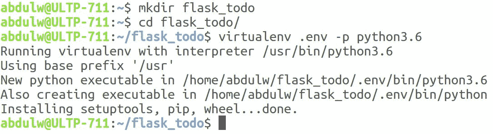

我们将在接下来的章节中使用`virtualenv`。现在，让我们安装 Flask：

```py
$ pip install flask
```

我们准备好开始使用 Flask 了。我们将创建一个最小的 Flask 应用程序来演示 Flask 应用程序的工作流程。

# 一个最小的 Flask 应用程序

让我们看看最小的 Flask 应用程序是什么样子的：

```py
from flask import Flask
app = Flask(__name__)
@app.route('/')
def index():
  return 'Hello World!'
```

就是这样，我们完成了最小的 Flask 应用程序。使用 Flask 配置和创建微服务非常简单。

让我们讨论一下前面的代码到底在做什么，以及我们如何运行这个程序：

1.  首先，我们导入了一个 Flask 类。

1.  接下来，我们创建了一个 Flask 类的实例。这个实例将是我们的 WSGI 应用程序。第一个参数将是模块或包的名称。在这里，我们创建了一个单一的模块，因此我们使用了`__name__`。这是必需的，这样 Flask 就知道在哪里查找模板、静态和其他目录。

1.  然后，我们使用`app.route`作为装饰器，带有 URL 名称作为参数。这将定义并映射路由到指定的函数。

1.  该函数将被调用以处理路由装饰器中指定的 URL 的 HTTP 请求。

要运行这个程序，您可以使用`flask`命令或`python -m flask`，但在此之前，您需要设置一个环境变量`FLASK_APP`，并指定 Flask 实例所在的模块文件名：

```py
$ export FLASK_APP=hello_world.py
$ flask run
* Serving Flask app "flask_todo.hello_world"
* Running on http://127.0.0.1:5000/ (Press CTRL+C to quit)
```

这启动了一个内置服务器，足够用于本地测试和调试。以下是浏览器中运行的本地主机的截图：

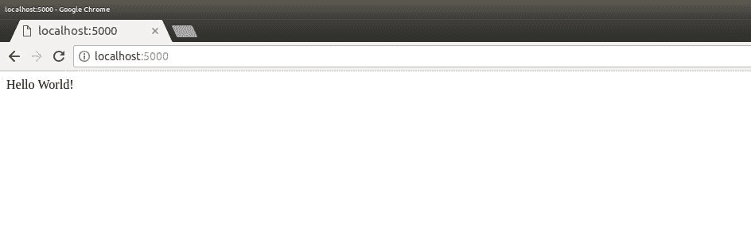

当然，这在生产环境下是行不通的，但 Flask 提供了许多部署选项。您可以查看[`flask.pocoo.org/docs/0.12/deploying/#deployment`](http://flask.pocoo.org/docs/0.12/deploying/#deployment)获取更多信息，但在我们的情况下，我们将使用 Zappa 在 AWS Lambda 和 API Gateway 上部署到无服务器环境。

# 使用 Zappa 进行配置

为了配置 Zappa，需要安装 Zappa，如前一章所述。Zappa 提供了`zappa init`命令，它可以启用用户交互模式初始化，以便我们可以配置 Python 应用程序。

我遵循了`zappa init`命令建议的默认配置设置。这会生成`zappa_settings.json`文件，这是配置任何 Python 应用程序与 Zappa 的基础。

以下是`zappa_settings.json`文件的内容：

```py
{
  "dev": {
      "app_function": "hello_world.app",
      "aws_region": "ap-south-1",
      "profile_name": "default",
      "project_name": "flask-todo",
      "runtime": "python3.6",
      "s3_bucket": "zappa-yrze3w53y"
  }
}
```

现在，在初始化期间，Zappa 有能力识别您的 Python 应用程序的类型，并相应地生成设置属性。在我们的情况下，Zappa 检测到 Python 程序是一个 Flask 应用程序。因此，它要求 Flask 实例路径，我们在`hello_world.py`文件中初始化为`app = Flask(__name__)`。

现在 Zappa 配置已经按照我们的基本需求完成，是时候在 AWS Lambda 上部署它了。

# 在 AWS Lambda 上构建、测试和部署

我们在前一章描述了 Zappa 的基本用法和一些基本命令。使用这些命令，我们可以构建部署包、部署应用程序和执行其他基本操作。

一旦您在`zappa_settings.json`文件中设置了所有有效的属性，您就可以使用`zappa deploy <stage_name>`命令开始部署过程。根据我们的`zappa_settings.json`文件，我们定义了一个名为`dev`的阶段，因此，要开始部署，我们可以运行`deploy`命令，如下面的代码所示：

```py
$ zappa deploy dev
```

以下截图描述了部署流程：

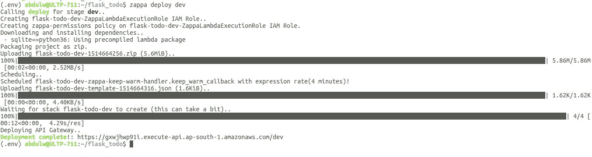

一旦 Zappa 部署完成，它会生成一个随机的 API 网关端点。Zappa 根据`zappa_settings.json`文件配置 AWS Lambda 与 API Gateway。

现在，Flask 应用程序可以通过先前生成的 API 访问。让我们测试一下，看看 Flask 应用程序的 Hello World!响应。您可以在浏览器中输入 URL，如下面的截图所示：

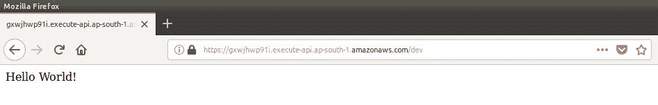

现在，让我们继续下一节，看看如何使用 Flask 框架开发应用程序。

# 一个完整的 Flask Todo 应用程序

由于我们已经看到 Zappa 如何轻松部署 Flask 应用程序，现在是时候看看在开发基于 Flask 的应用程序时可能需要的完整工作流程。我们将开发一个基于 Flask 的模块化应用程序，其中每个功能都将是一个独立的模块，例如认证、待办应用程序等。

认证模块将负责维护认证和授权机制。它还将包括登录和注册过程的实现。

而`todo`模块将有一个基本的 todo 操作实现，这个操作流程将由认证模块授权。借助 Flask 扩展，我们将管理和配置这些模块。除了这些核心模块，我们还将看到与用户界面、数据库配置和静态文件集成相关的实现。

# 先决条件

为了设置开发环境，我们需要执行一些与`virtualenv`和所需包相关的配置。

# Virtualenv

在我们开始项目工作之前，让我们创建一个虚拟环境并启用它，如下面的截图所示：

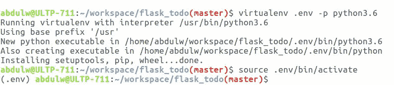

# Flask 扩展

Flask 是一个微框架，但它具有可扩展的特性，您可以根据需要添加更多功能。为了开发一个待办应用程序，我们可能需要一些基本功能，如数据持久性和用户认证机制。因此，在开发 Flask 应用程序时，我们将使用一些 Flask 扩展。

Flask 注册表提供了许多扩展，这些扩展是独立的包，您可以轻松地将它们配置到您的 Flask 应用程序实例中。您可以在[`flask.pocoo.org/extensions/`](http://flask.pocoo.org/extensions/)上看到完整的 Flask 扩展列表。

我们将使用以下 Flask 和 Flask 扩展包：

+   `Flask==0.12.2`

+   `Flask-Login==0.4.0`

+   `Flask-SQLAlchemy==2.3.2`

+   `Flask-WTF==0.14.2`

+   `Flask-Migrate==2.1.1`

我建议将这些包列在一个名为`requirements.txt`的单独文件中，然后一次性安装它们，如下所示：

```py
pip install -r requirements.txt
```

这将安装所有列出的包及其依赖项。

# 脚手架

在从头开始实现任何项目时，您可以自由设计项目的脚手架。我们将遵循以下截图中显示的脚手架：

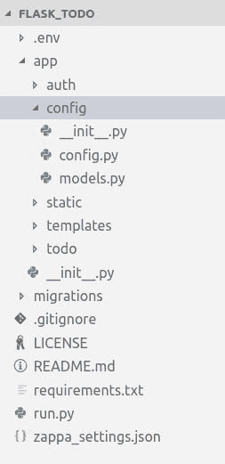

让我们详细看看每个目录及其用途：

+   `.env`：这是我们的`virtualenv`目录，是通过`virtualenv`命令创建的。

+   `auth`：我们将使用`Flask-Login`和`Flask-SqlAlchemy`扩展创建一个独立的通用认证模块。

+   `config`：在这里，我们将创建一些配置和通用数据库模型，其他模块可能需要这些模型。

+   `static`：将静态内容放在`static`目录下是 Flask 的标准做法。因此，我们将使用这个目录来存放所有需要的静态内容。

+   `templates`：Flask 内置支持 Jinja2 模板引擎，并遵循基于模块名称的模板文件的标准布局。我们将在实际使用模板时详细描述这一点。

+   `todo`：这是一个独立的 Flask 模块或包，具有基本的待办功能。

+   `__init__.py`：这是 Python 的标准文件，必须在目录下构建 Python 包。我们将在这里编写代码来配置我们的应用程序。

+   `migrations`：这个目录是由`Flask-Migrate`自动生成的。在后面的部分中，我们将看到`Flask-Migrate`的工作原理。

+   `.gitignore`：这个文件包含了应该被 Git 版本控制忽略的文件和目录列表。

+   `LICENSE`：我使用 GitHub 创建了一个 Git 存储库，并为我们的`flask_todo`存储库包含了 MIT 许可证。

+   `README.md`：这个文件用于在 GitHub 上描述有关存储库的信息。

+   `requirements.txt`：这是我们列出了在前面部分提到的所有所需包的文件。

+   `run.py`：在这里，我们将创建我们的 Flask 应用的最终实例。

+   `zappa_settings.json`：这个文件是由 Zappa 生成的，包含了与 Zappa 相关的配置。

我们将在接下来的部分详细解释代码。

# 配置

在实施任何项目时，我们可能需要一些特定于不同环境的配置，例如在开发环境中切换调试模式和在生产环境中监控。

Flask 有一种灵活的方式来克服配置处理机制。Flask 在其实例上提供了一个`config`对象。这个`config`对象是通过扩展 Python 的`dictionary`对象构建的，但具有一些额外的功能，如从文件、对象和默认内置配置加载配置。您可以在[`flask.pocoo.org/docs/0.12/config/`](http://flask.pocoo.org/docs/0.12/config/)上查看`config`机制的详细描述。

为了根据环境维护配置，我们将创建一个名为`config/config.py`的文件，其中包含以下代码：

```py
import os
from shutil import copyfile

BASE_DIR = os.path.dirname(os.path.dirname(__file__))

def get_sqlite_uri(db_name):
    src = os.path.join(BASE_DIR, db_name)
    dst = "/tmp/%s" % db_name
    copyfile(src, dst)
    return 'sqlite:///%s' % dst

class Config(object):
    SECRET_KEY = os.environ.get('SECRET_KEY') or os.urandom(24)
    SQLALCHEMY_COMMIT_ON_TEARDOWN = True
    SQLALCHEMY_RECORD_QUERIES = True
    SQLALCHEMY_TRACK_MODIFICATIONS = False

    @staticmethod
    def init_app(app):
        pass

class DevelopmentConfig(Config):
    DEBUG = True
    SQLALCHEMY_DATABASE_URI = get_sqlite_uri('todo-dev.db')

class ProductionConfig(Config):
    SQLALCHEMY_DATABASE_URI = get_sqlite_uri('todo-prod.db')

config = {
    'dev': DevelopmentConfig,
    'production': ProductionConfig,
}
```

在这里，我们创建了一个`Config`对象作为一个具有一些通用配置和`Flask-SqlAlchemy`配置的基类。然后，我们用特定于环境的类扩展了基本的`Config`类。最后，我们创建了一个映射对象，我们将从上述键中使用。

# 基本模型

SQLAlchemy 最著名的是其**对象关系映射器**（**ORM**），这是一个可选组件，提供了数据映射器模式，其中类可以以多种方式映射到数据库中，允许对象模型和数据库模式从一开始就以一种清晰的解耦方式发展。我们在这里使用`Flask-SQLAlchemy`扩展，它扩展了对 SQLAlchemy 的支持。`Flask-SQLAlchemy`增强了可能需要与 Flask 应用集成的功能。

我们将组合使用`Flask-SQLAlchemy`所需的通用 SQL 操作。因此，我们将创建一个基本模型类，并将使用这个类来创建其他模块的模型类。这就是我们将其放在`config`目录下的原因。这是`models.py`文件。

文件—`config/models.py`：

```py
from app import db

class BaseModel:
    """
    Base Model with common operations.
    """

    def delete(self):
        db.session.delete(self)
        db.session.commit()

    def save(self):
        db.session.add(self)
        db.session.commit()
        return self
```

您可以在这里看到，我们将所有模型都需要的数据库操作分组在一起。`db`实例是在`app/__init__.py`文件中使用`Flask-SQLAlchemy`扩展创建的。

在这里，我们实现了`save`和`delete`方法。`db.Model`定义了一个通用模式，用于创建代表数据库表的模型类。为了保存和删除，我们需要遇到一些预定义的操作，如`db.session.add()`、`db.session.delete()`和`db.session.commit()`。

因此，我们将通用操作分组在`save`和`delete`方法下。这些方法将从一个模型类中调用，该模型类将继承它们。我们将在稍后创建一个模型类时再详细介绍。

# 认证

为了开发一个认证模块，我们将使用`Flask-Login`扩展。`Flask-Login`扩展提供了用户会话管理机制。它处理管理用户会话的常见任务，如登录、注销和记住用户。

要集成`Flask-Login`，您需要创建实例并定义一些默认参数，如下面的代码片段中所述：

```py
from flask_login import LoginManager
app = Flask(__name__)
login_manager = LoginManager()
login_manager.session_protection = 'strong'
login_manager.login_view = 'auth.login'
login_manager.login_message_category = "info"
login_manager.init_app(app)
```

我们将创建一个认证模块作为一个`auth`包。`auth`包将具有基本的脚手架，如下所示：

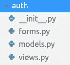

# 蓝图

在深入描述每个文件之前，让我们看一下 Flask 实例化机制。正如你已经知道的，我们正在创建一个独立模块作为`root`模块下的一个子模块。Flask 引入了蓝图的概念，用于将子模块组件放在一个共同的模式下。

Flask 蓝图实例非常类似于 Flask 实例，但它不是一个应用程序对象。相反，它具有构建和扩展父应用程序的能力。借助蓝图，您可以设计一个模块化的应用程序。

```py
Blueprint instantiation in the auth/__init__.py file:
```

```py
from flask import Blueprint
auth = Blueprint('auth', __name__)
from . import views
```

如您所见，它具有与`Flask`类非常相似的特征，并遵循类似的模式。现在，我们将在视图中使用`blueprint`的`auth`实例来注册路由。要执行应用程序，我们需要将`blueprint`对象与 Flask 应用程序实例绑定。

```py
app/__init__.py file where we are going to create the Flask application instance:
```

```py
from .auth import auth as auth_blueprint
from app.config import config

app = Flask(__name__)
app.config.from_object(config[environment])

app.register_blueprint(auth_blueprint, url_prefix='/auth')
```

借助`register_blueprint`方法，我们正在注册`auth`模块蓝图，我们还可以添加 URL 前缀。在查看`todo`模块解释之后，我们将对此文件进行完整描述。

# 模型

让我们从创建具有基本功能的`User`模型开始。以下是用户模型的代码片段。

文件—`auth/models.py`：

```py
import re
from datetime import datetime

from app.config.models import BaseModel
from flask_login.mixins import UserMixin
from sqlalchemy.orm import synonym
from werkzeug.security import generate_password_hash, check_password_hash
from app import db
from app import login_manager

class User(UserMixin, BaseModel, db.Model):
    __tablename__ = 'user'
    id = db.Column(db.Integer, primary_key=True)
    _email = db.Column('email', db.String(64), unique=True)
    password_hash = db.Column(db.String(128))

    def __init__(self, **kwargs):
        super(User, self).__init__(**kwargs)

    def __repr__(self):
        return '<User {0}>'.format(self.email)

    @property
    def email(self):
        return self._email

    @email.setter
    def email(self, email):
        if not len(email) <= 64 or not bool(re.match(r'^\S+@\S+\.\S+$', email)):
            raise ValueError('{} is not a valid email address'.format(email))
        self._email = email

    email = synonym('_email', descriptor=email)

    @property
    def password(self):
        raise AttributeError('password is not a readable attribute')

    @password.setter
    def password(self, password):
        if not bool(password):
            raise ValueError('no password given')

        hashed_password = generate_password_hash(password)
        if not len(hashed_password) <= 128:
            raise ValueError('not a valid password, hash is too long')
        self.password_hash = hashed_password

    def verify_password(self, password):
        return check_password_hash(self.password_hash, password)

    def to_dict(self):
        return {
            'email': self.email
        }

@login_manager.user_loader
def load_user(user_id):
    return User.query.get(int(user_id))
```

现在，我们已经创建了`User`模型，但它如何与`Flask-Login`扩展相关联或映射呢？答案是`load_user`方法，该方法由`login_manager.user_loader`装饰器包装。Flask 提供了这个方法来将用户加载到会话中。该方法使用会话中存在的`user_id`进行调用。

我们可以通过`User`模型将用户数据持久化到数据库中。作为一个 Web 应用程序，用户数据需要通过用户界面（如 HTML）输入。根据我们的需求，我们需要两种类型的 HTML 表单，用于登录和注册功能。

让我们继续下一节，学习通过 Flask 渲染 HTML 表单。

# 表单

`Flask-WTF`扩展提供了在 Flask 中开发表单并通过 Jinja2 模板渲染它们的能力。`Flask-WTF`扩展了`WTForms`库，该库具有设计表单的标准模式。

我们需要两个表单，如`SignupForm`和`LoginForm`。以下是创建表单类的代码。

文件—`auth/forms.py`：

```py
from flask_wtf import FlaskForm
from wtforms import StringField, PasswordField, SubmitField
from wtforms.validators import Required, Length, Email, EqualTo

class LoginForm(FlaskForm):
    email = StringField(
        'Email', validators=[Required(), Length(1,64), Email()]
    )
    password = PasswordField(
        'Password', validators=[Required()]
    )
    submit = SubmitField('Log In')

class SignupForm(FlaskForm):
    email = StringField(
        'Email', validators=[Required(), Length(1,64), Email()]
    )
    password = PasswordField(
        'Password', validators=[
            Required(),
            EqualTo('confirm_password', message='Password must match.')]
    )
    confirm_password = PasswordField(
        'Confirm Password', validators=[Required()]
    )
    submit = SubmitField('Sign up')
```

在这里，我们创建了一些带有验证的表单。现在，我们将在视图部分中使用这些表单，在那里我们将呈现模板以及表单上下文。

# 视图

Flask 以一种非常灵活的方式实现了视图，您可以在其中定义路由。Flask 的通用视图实现受到 Django 的通用视图的启发。我们将在后面的部分详细描述方法视图，但在这里，我们将使用简单的视图。

以下是视图片段。

文件—`auth/views.py`：

```py
from flask import render_template, redirect, url_for
from flask_login import login_user, login_required, logout_user

from app.auth import auth
from app.auth.forms import LoginForm, SignupForm
from app.auth.models import User

@auth.route('/login', methods=['GET', 'POST'])
def login():
    form = LoginForm()
    if form.validate_on_submit():
        user_by_email = User.query.filter_by(email=form.email.data).first()
        if user_by_email is not None and user_by_email.verify_password(form.password.data):
            login_user(user_by_email)
            return redirect(url_for('todo.list'))
    return render_template('auth/login.html', form=form)

@auth.route('/signup', methods=['GET', 'POST'])
def signup():
    form = SignupForm()
    if form.validate_on_submit():
        if not User.query.filter_by(email=form.email.data).scalar():
            User(
                email = form.email.data,
                password = form.password.data
            ).save()
            return redirect(url_for('auth.login'))
        else:
            form.errors['email'] = 'User already exists.'
            return render_template('auth/signup.html', form=form)
    return render_template('auth/signup.html', form=form)

@auth.route('/logout')
@login_required
def logout():
    logout_user()
    return redirect(url_for('auth.login'))
```

在这里，我们创建了`/login`、`/signup`和`/logout`路由，我们根据 HTTP 请求调用它们。我们在 HTTP `GET`请求上呈现一个空的表单实例，并在`POST`请求上通过使用`Flask-WTF`方法和`validate_on_submit()`方法处理数据。在呈现模板时，我们传递表单实例并根据需要的操作进行重定向。

让我们在下一节中看一下模板机制。

# 模板

Flask 内置了对 Jinja2 模板的支持。Jinja2 模板具有用于呈现 HTML 的标准定义模式。我们可以通过传递上下文参数来放置动态内容。Jinja2 提供了使用一些表达式和条件、扩展和包含模板功能来呈现 HTML 的能力。

Flask 遵循标准的模板搭建结构来布置所有模板文件。以下是我们遵循的搭建结构，通过在项目根目录下创建一个`templates`目录，然后根据其他模块名称创建子目录：

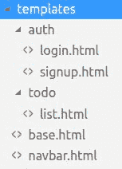

在这里，我们根据模块创建了模板，并将通用模板放在根目录下。

同样，我们保持了静态文件的脚手架：

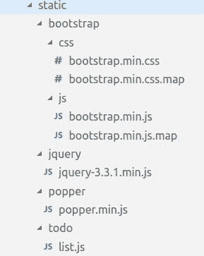

我们保留了静态库和模块相关文件。借助`url_for`方法，我们可以获取任何静态文件和路由的相对路径。因此，在以下模板中，我们使用`url_for`方法包含了所有静态文件，例如`<link rel="stylesheet" href="{{ url_for('static', filename='bootstrap/css/bootstrap.min.css')}}">`。

同样，我们将在基本模板中包含所有静态文件。

文件—`templates/base.html`：

```py
<!DOCTYPE html>
<html lang="en">
<head>
    <meta charset="UTF-8">
    <meta name="viewport" content="width=device-width, initial-scale=1.0">
    <meta http-equiv="X-UA-Compatible" content="ie=edge">
    <meta name="csrf-token" content="{{ csrf_token() }}">
    <meta name="author" content="AbdulWahid AbdulHaque">
    <title>Flask Todo App</title>

    <link rel="stylesheet" href="{{ url_for('static', filename='bootstrap/css/bootstrap.min.css') }}">
    <link rel="stylesheet" href="{{ url_for('static', filename='bootstrap/css/bootstrap.min.css.map') }}">
    

    <script type="text/javascript" src="img/jquery-3.3.1.min.js')}}"></script>
    <script type="text/javascript" src="img/bootstrap.min.js')}}"></script>
    <script type="text/javascript" src="img/popper.min.js')}}"></script>
    
</head>
<body>
    
    
    <script type="text/javascript">
        $('.dropdown-toggle').dropdown();
    </script>
</body>
</html>
```

我们定义了所有其他模板所需的通用 HTML。我们还创建了一个基本的 bootstrap 导航栏，并将其保存在`navbar.html`中，通过``包含在`base.html`模板中。正如你所看到的，Jinja2 模板使得维护模板和提供标准模式变得非常容易。

```py
navbar.html template where we created a navbar using Bootstrap CSS classes.
```

文件—`templates/navbar.html`：

```py
<nav class="navbar navbar-expand-lg navbar-light bg-light">
    <a class="navbar-brand" href="#">Todo's</a>
    <button class="navbar-toggler" type="button" data-toggle="collapse" data-target="#navbarNavDropdown" aria-controls="navbarNavDropdown" aria-expanded="false" aria-label="Toggle navigation">
      <span class="navbar-toggler-icon"></span>
    </button>
    <div class="collapse navbar-collapse" id="navbarNavDropdown">
        
        <ul class="navbar-nav ml-auto">
            <li class="nav-item dropdown ml-auto">
                <a class="nav-link dropdown-toggle" href="#" id="navbarDropdownMenuLink" data-toggle="dropdown" aria-haspopup="true" aria-expanded="false">
                    Welcome <i>{{ current_user.email }}</i>
                </a>
                <div class="dropdown-menu" aria-labelledby="navbarDropdownMenuLink">
                    <a class="dropdown-item" href="../auth/logout">Logout</a>
                </div>
            </li>
        </ul>
        
    </div>
  </nav>
```

在设计`navbar.html`时，我们添加了一些条件语句，以在用户登录时显示已登录用户的信息和注销选项。

让我们继续进行注册和登录页面。以下是注册页面的代码片段。

文件—`templates/auth/signup.html`：

```py



<div class="container align-middle mx-auto" style="width:30%; margin-top:5%">
    <div class="card bg-light mb-3">
        <div class="card-header"><h3>Sign Up</h3></div>
        <div class="card-body">
            <form method="post">
                {{ form.hidden_tag() }}
                
                    
                        <div class="alert alert-danger" role="alert">
                            {{error}}
                        </div>
                    
                  
                <div class="form-group">
                    <label for="exampleInputEmail1">Email address</label>
                    {{ form.email(class_="form-control", id="exampleInputEmail1", placeholder="Email", maxlength=128)}}
                    <small id="emailHelp" class="form-text text-muted">We'll never share your email with anyone else.</small>
                </div>
                <div class="form-group">
                    <label for="exampleInputPassword1">Password</label>
                    {{ form.password(class_="form-control", placeholder="Password") }}
                </div>
                <div class="form-group">
                    <label for="exampleInputPassword">Confirm Password</label>
                    {{ form.confirm_password(class_="form-control", placeholder="Confirm Password") }}
                </div>
                <div class="form-group">
                    {{ form.submit(class_="btn btn-primary btn-lg") }}
                    <a class="float-right" href="login">Already have account.</a>
                </div>
            </form>
        </div>
      </div>
</div>

```

这是注册页面的输出：

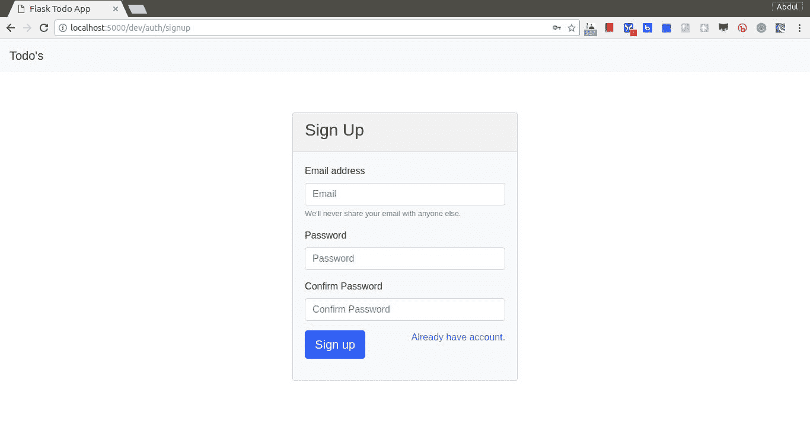

在`auth.signup`视图的 HTTP `GET`请求中，这将返回一个空表单，并通过`signup.html`模板进行渲染。我们还添加了代码来在注册视图中接收 HTTP `POST`请求上的注册数据。我们使用`User`模型在注册过程中持久化用户数据。

这是登录模板。

文件—`templates/auth/login.html`：

```py



<div class="container align-middle mx-auto" style="width:30%; margin-top:5%">
    <div class="card bg-light mb-3">
        <div class="card-header"><h3>Login</h3></div>
        <div class="card-body">
            <form method="post">
                {{ form.hidden_tag() }}
                
                    <div class="has-error"><strong>Unable to login. Typo?</strong></div>
                  
                <div class="form-group">
                    <label for="exampleInputEmail1">Email address</label>
                    {{ form.email(class_="form-control", id="exampleInputEmail1", placeholder="Email", maxlength=128)}}
                    <small id="emailHelp" class="form-text text-muted">We'll never share your email with anyone else.</small>
                </div>
                <div class="form-group">
                    <label for="exampleInputPassword1">Password</label>
                    {{ form.password(class_="form-control", id="exampleInputPassword1", placeholder="Password") }}
                </div>
                <div class="form-group">
                    {{ form.submit(class_="btn btn-primary btn-lg") }}
                    <a class="float-right" href="signup">New around here? Sign up</a>
                </div>
            </form>
        </div>
      </div>
</div>

```

现在，用户可以继续登录系统。对于登录，我们创建了登录表单，并通过`auth.login`视图进行渲染。以下是登录页面的截图：

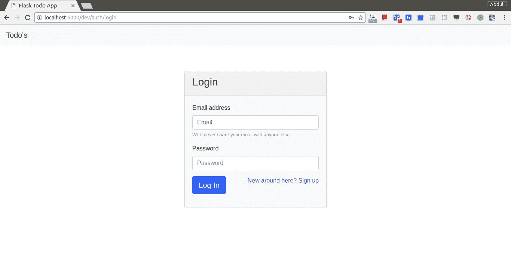

在 HTTP `POST`请求中，我们使用`Flask-Login`扩展来处理用户登录机制，它提供了一个名为`login_user`的函数并执行登录过程。它创建一个会话并将`user_id`添加到会话中，以便在进一步的请求中记住用户，直到我们从会话中移除用户或使用`auth.logout`视图中提到的`logout_user`方法执行注销。

认证过程在这里完成，当用户登录成功并重定向到另一个页面或模板时。现在，是时候继续进行`todo`模块了。

# Todo

Todo 程序被认为是一个简单直接的应用程序，并且在 hello world!之后广泛用于解释任何语言或框架。我们也为`todo`模块遵循相同的脚手架结构。

以下是`todo`模块的脚手架的截图：

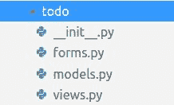

让我们看看`todo`模块中每个文件的详细描述。

# 蓝图

Flask 引入了蓝图的概念，用于开发应用程序组件和命令模式，可以在应用程序或多个应用程序中使用。它有助于通过将根 Flask 应用程序对象集中化来理解大型应用程序。蓝图充当一个独立的 Flask 应用程序，而不创建实际的 Flask 应用程序对象，并且能够实例化应用程序对象，初始化多个扩展，并注册集合。它还提供模板过滤器、静态文件、模板和其他实用程序。

如`auth`模块中所述，我们还将为 Todo 应用程序创建`Blueprint`实例。这将在`app.__init__.py`文件中配置，这是我们创建 Flask 应用程序实例的地方。

```py
todo module's blueprint.
```

文件—`todo/__init__.py`：

```py
from flask import Blueprint

todo = Blueprint('todo', __name__)

from . import views 
```

一旦我们创建了`todo`模块的`blueprint`对象，我们就可以使用它在视图中添加路由，并将 blueprint 注册到 Flask 应用程序实例中。

```py
app/__init__.py, which is where we are going to register blueprint:
```

```py
from .auth import auth as auth_blueprint
from app.config import config

app = Flask(__name__)
app.config.from_object(config[environment])

app.register_blueprint(todo_blueprint, url_prefix='/todos')
```

# 模型

我们将使用`Flask-SQLAlchemy`来创建一个待办事项模型。它将与`User`模型建立关系，并带有一个反向引用，这样我们就可以查询与`User`模型相关的`todo`数据。

以下是待办事项模型的代码片段。

文件-`todo/models.py`：

```py
from datetime import datetime
from app import db
from app.config.models import BaseModel

class Todo(db.Model, BaseModel):
    __tablename__ = 'todo'
    id = db.Column(db.Integer, primary_key=True)
    title = db.Column(db.String(128))
    is_completed = db.Column(db.Boolean, default=False)
    created_by = db.Column(db.String(64), db.ForeignKey('user.email'))
    user = db.relationship('User', backref=db.backref('todos', lazy=True))

    def __init__(self, title, created_by=None, created_at=None):
        self.title = title
        self.created_by = created_by
        self.created_at = created_at or datetime.utcnow()

    def __repr__(self):
        return '<{0} Todo: {1} by {2}>'.format(
            self.status, self.title, self.created_by or 'None')

    @property
    def status(self):
        return 'finished' if self.is_completed else 'open'

    def finished(self):
        self.is_completed = True
        self.finished_at = datetime.utcnow()
        self.save()

    def reopen(self):
        self.is_completed = False
        self.finished_at = None
        self.save()

    def to_dict(self):
        return {
            'title': self.title,
            'created_by': self.created_by,
            'status': self.status,
        }
```

在这里，我们使用基本功能和验证创建了待办事项模型。现在，我们将使用这个模型来持久化`todo`数据。然而，我们还需要为用户提供一个 UI 来输入`todo`数据并执行一些操作。

# 表单

我们将拥有一个简单的待办事项表单，其中包含一个带有提交按钮的文本框。它还应该包含列表视图来显示待办事项数据。

以下是待办事项表单的代码片段。

文件-`todo/forms.py`：

```py
from flask_wtf import FlaskForm
from wtforms import StringField, SubmitField
from wtforms.validators import Required, Length

class TodoForm(FlaskForm):
    title = StringField(
        'What needs to be done?', validators=[Required(), Length(1, 128)]
    )
    submit = SubmitField('Submit')
```

正如你所看到的，我们的待办事项表单非常简单，带有一些基本的验证。现在是时候在视图中使用这个表单来将它们渲染成 HTML 模板了。

# 视图

我们创建了一个待办事项蓝图的实例，并将使用这个实例在视图中创建路由。以下是视图的代码片段。

文件-`todo/views.py`：

```py
import json

from flask import render_template, redirect, url_for, jsonify, request
from flask_login import login_required, current_user
from app.todo import todo
from app.todo.forms import TodoForm
from app.todo.models import Todo

@todo.route('/', methods=['GET', 'POST'])
@login_required
def list():
    context = dict()
    form = TodoForm()
    if form.validate_on_submit():
        Todo(form.title.data, created_by=current_user.email).save()
        return redirect(url_for('todo.list'))
    context['form'] = form
    context['todos'] = current_user.todos
    context['items_left'] = len([todo for todo in current_user.todos if not todo.is_completed])
    return render_template('todo/list.html', **context)

@todo.route('/<todo_id>', methods=['DELETE'])
@login_required
def remove(todo_id):
    Todo.query.filter_by(id=int(todo_id)).delete()
    return jsonify({'message': 'Todo removed successfully'})

@todo.route('/<todo_id>', methods=['PATCH'])
@login_required
def update(todo_id):
    data = json.loads([k for k in request.form.keys()][0])
    todo = Todo.query.filter_by(id=int(todo_id)).scalar()
    if data.get('status'):
        todo.finished()
    else:
        todo.reopen()
    return jsonify({'message': 'Todo updated successfully'})
```

我们在这里定义了三个路由。在注册待办事项蓝图到 Flask 应用对象时，我们已经使用了`todos`作为前缀。记住这一点，我们决定使用这些路由 URL。

为了持久化待办事项数据，我们需要执行四种类型的操作，即—创建一个待办事项，列出待办事项，更新任何特定项目，和删除任何特定的待办事项。这些操作无非是标准的**CRUD**（**创建**，**检索**，**更新**，**删除**）操作。

# 创建

为了创建一个操作，我们决定将 URL 设置为`/`，但是加上前缀后，它将变成`todos/`。在 HTTP `POST`请求中，我们期望从用户那里得到待办事项数据，根据提交的数据，我们将使用待办事项模型创建待办事项数据，例如`Todo(form.description.data, creator=current_user.email).save()`。

# 检索

```py
current_user.todos and filter the data using list compensation. Then, we prepare the context and pass it to the render_template method to display the data in HTML.
```

# 更新

要更新待办事项数据，我们将使用 HTTP `PATCH`请求来访问路由`todos/<todo_id>`。但是，这次我们没有任何表单，需要传递数据，因此我们使用 jQuery 来进行`PATCH`请求的 Ajax 查询。

我们定义了一些属性和方法来标记待办事项数据是否完成，因此根据更新的数据，我们将使用这些方法来更新待办事项记录。

# 删除

类似于从数据库中删除待办事项记录，我们需要使用待办事项模型的查询方法，比如`Todo.query.filter_by(id=int(todo_id)).delete()`。正如你所看到的，路由视图非常简单。现在，让我们来看一下模板。

# 模板

需要做很多工作来完成待办事项的工作流。我们定义了`templates/todo/list.html`模板来显示待办事项表单和待办事项记录列表。在前面的部分中，我们描述了如何渲染和传递上下文数据。

以下是待办事项列表模板的代码片段。

文件-`templates/todo/list.html`：

```py


    <script src="img/list.js')}}"></script>


<div class="container align-middle mx-auto" style="width:30%; margin-top:5%">
    <div class="card mb-3">
        <div class="card-header" align="center"><h3>todo's</h3></div>
        <div class="card-body">
            <form method="post" class="form-inline">
                {{ form.hidden_tag() }}
                
                    <div class="has-error"><strong>Invalid task. Typo?</strong></div>
                  
                <div class="form-group ml-3">
                    {{ form.title(class_="form-control", placeholder="What needs to be done?", maxlength=128)}}
                </div>
                <div class="form-group">
                    {{ form.submit(class_="btn btn-primary ml-2") }}
                </div>
            </form>
            <div class="badge badge-pill badge-info ml-3 mt-2">
                {{items_left}} items left
            </div>
            <ul class="list-group list-group-flush mt-3" id="todolist">
                
                <li class="list-group-item" id="{{todo.id}}">
                    <input type="checkbox" aria-label="Checkbox for following text input"  checked >
                    {{todo.title}}
                    <span class="badge badge-danger badge-pill float-right">X</span>
                </li>
                
            </ul>
        </div>
      </div>
</div>

<script>

</script>

```

我们使用上下文数据来显示待办事项表单和记录列表。有一些操作我们需要编写 jQuery 代码，比如根据复选框操作更新待办事项，以及根据删除按钮操作删除待办事项。

以下是 jQuery 代码片段。

文件-`static/todo/list.js`：

```py
var csrftoken = $('meta[name=csrf-token]').attr('content');
function csrfSafeMethod(method) {
// these HTTP methods do not require CSRF protection
return (/^(GET|HEAD|OPTIONS|TRACE)$/.test(method));
}

$.ajaxSetup({
    beforeSend: function(xhr, settings) {
      if (!csrfSafeMethod(settings.type) && !this.crossDomain) {
        xhr.setRequestHeader("X-CSRFToken", csrftoken);
      }
    }
  });

$(document).ready(function(){

    // Update todo
    $('#todolist li>input[type="checkbox"]').on('click', function(e){
        var todo_id = $(this).parent().closest('li').attr('id');
        $.ajax({
            url : todo_id,
            method : 'PATCH',
            data : JSON.stringify({status: $(this).prop('checked')}),
            success : function(response){
                location.reload();
            },
            error : function(error){
                console.log(error)
            }
        })
    })

    // Remove todo
    $('#todolist li>span').on('click', function(e){
        var todo_id = $(this).parent().closest('li').attr('id');
        $.ajax({
            url : todo_id,
            method : 'DELETE',
            success : function(response){
                location.reload();
            },
            error : function(error){
                console.log(error)
            }
        })
    })
})
```

在进行 Ajax 请求时，我们还添加了对 CSRF 的支持。Ajax 请求非常简单直接，因为这些请求是通过前面提到的 todo 路由来服务的。以下是待办事项列表页面的截图：

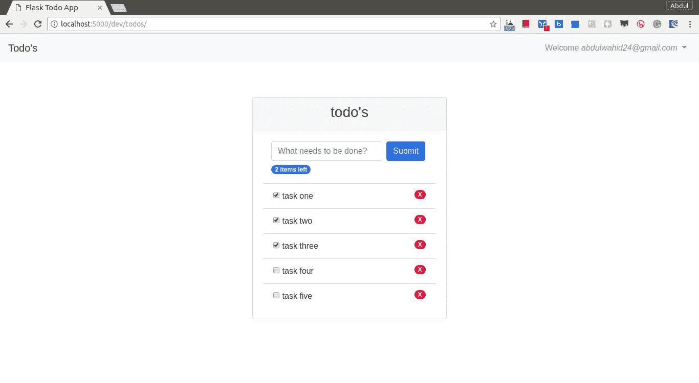

现在，我们已经完成了`todo`模块，是时候用 Flask 应用对象配置 todo 蓝图了。

# FLASK_APP

在任何 Flask 项目中，我们创建 Flask 应用程序对象，并使用`FLASK_APP`参数或环境变量的值引用文件路径。在我们的情况下，我们创建了一个模块化应用程序，为特定操作定义了单独的模块，但现在我们需要将所有这些模块合并到一个地方。我们已经看到了`blueprint`对象及其集成。在这里，我们将看到将`blueprint`和其他所需扩展组合的实际过程。

以下是 Flask 应用程序对象的代码片段。

文件-`app/__init__.py`：

```py
from flask import Flask
from flask_sqlalchemy import SQLAlchemy
from flask_login import LoginManager
from flask_migrate import Migrate
from flask_wtf.csrf import CSRFProtect

from app.config import config

db = SQLAlchemy()
migrate = Migrate()
csrf = CSRFProtect()

login_manager = LoginManager()
login_manager.session_protection = 'strong'
login_manager.login_view = 'auth.login'
login_manager.login_message_category = "info"

def create_app(environment):
    app = Flask(__name__)
    app.config.from_object(config[environment])

    csrf.init_app(app)
    db.init_app(app)
    migrate.init_app(app, db=db)
    login_manager.init_app(app)

    from .auth import auth as auth_blueprint
    app.register_blueprint(auth_blueprint, url_prefix='/auth')

    from .todo import todo as todo_blueprint
    app.register_blueprint(todo_blueprint, url_prefix='/todos')

    return app
```

在这里，我们正在配置扩展和蓝图，但是在一个名为`create_app`的方法下。这个方法需要一个参数来设置特定环境的配置，因此最好有这个函数，并为特定配置获取 Flask 应用程序实例。

```py
run.py, where we will be using the create_app method.
```

文件-`flask_todo/run.py`：

```py
from app import create_app

app = create_app('dev')
```

在这里，我们使用了`dev`环境配置。您可以将此文件用作您的`FLASK_APP`参数，例如`FLASK_APP=run.py flask run`。

我们已经完成了 todo 应用程序的开发，现在是时候使用 Zappa 进行部署了。

# 部署

我们将使用 Zappa 进行部署。要配置 Zappa，您需要安装 Zappa 并使用 AWS CLI 配置您的 AWS 凭据。一旦我们安装了 Zappa 并处理了 AWS CLI 配置，我们就可以继续部署 Todo 应用程序。

以下是`zappa init`命令过程的截图：

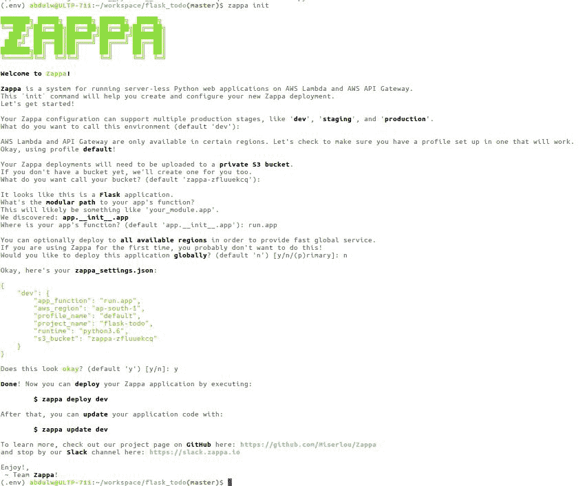

当我们运行`zappa init`命令时，Zappa 会自动识别框架类型并建议所需的参数。在我们的情况下，我们将`app_function`名称保持为`run.app`，因为我们是通过`run.py`中的`create_app`方法初始化`flask app`对象。

`zappa init`命令创建了`zappa_settings.json`文件，其中包含了所有配置的参数。您可以根据需要自由修改它。

现在，是时候使用`zappa deploy <stage_name>`命令执行部署过程了。最初，我们将使用`zappa deploy`命令。一旦我们的应用程序部署完成，我们就不能再使用**`zappa deploy`**命令了。相反，我们需要使用`zappa update <stage_name>`命令。

以下是`zappa deploy dev`命令的代码：

```py
$ zappa deploy dev
Calling deploy for stage dev..
Creating chapter-3-dev-ZappaLambdaExecutionRole IAM Role..
Creating zappa-permissions policy on chapter-3-dev-ZappaLambdaExecutionRole IAM Role.
Downloading and installing dependencies..
 - sqlite==python36: Using precompiled lambda package
Packaging project as zip.
Uploading chapter-3-dev-1529318192.zip (9.4MiB)..
100%|███████████████████████████████████████████████████████████████████████████████████████████████████████████████████████████████████████████████████████████████████████████████████████| 9.87M/9.87M [00:05<00:00, 1.89MB/s]
Scheduling..
Scheduled chapter-3-dev-zappa-keep-warm-handler.keep_warm_callback with expression rate(4 minutes)!
Uploading chapter-3-dev-template-1529318886.json (1.6KiB)..
100%|███████████████████████████████████████████████████████████████████████████████████████████████████████████████████████████████████████████████████████████████████████████████████████| 1.62K/1.62K [00:00<00:00, 4.87KB/s]
Waiting for stack chapter-3-dev to create (this can take a bit)..
 50%|██████████████████████████████████████████████████████████████████████████████████████████████▌ | 2/4 [00:09<00:10, 5.29s/res]
Deploying API Gateway..
Deployment complete!: https://m974nz8zld.execute-api.ap-south-1.amazonaws.com/dev
```

我们已经完成了部署，并且能够访问生成的 URL 上的 Todo 应用程序，如下截图所示。

访问 URL 后的输出如下（[`m974nz8zld.execute-api.ap-south-1.amazonaws.com/dev/auth/signup`](https://m974nz8zld.execute-api.ap-south-1.amazonaws.com/dev/auth/signup)[)](https://p2wdbhjwd6.execute-api.ap-south-1.amazonaws.com/dev/auth/signup)：

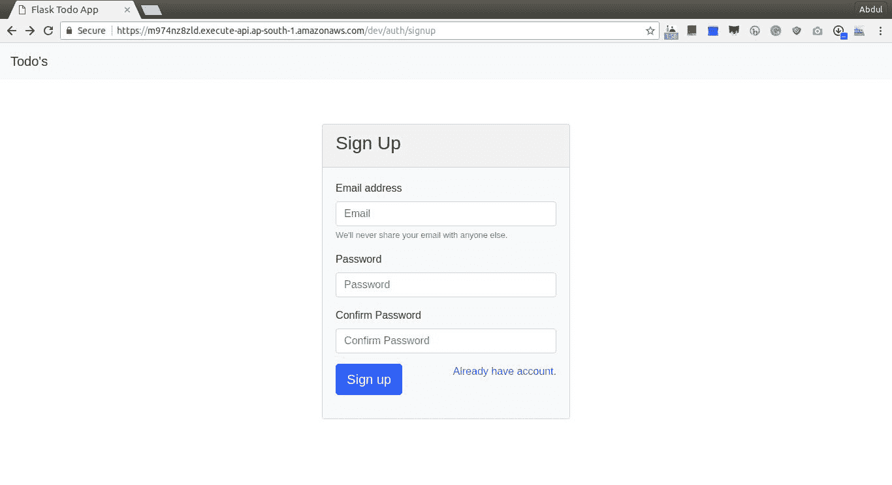

我将保持`flask_todo` Lambda 函数处于活动状态，以便您随时尝试。我已经创建了一个 GitHub 存储库（[`github.com/PacktPublishing/Building-Serverless-Python-Web-Services-with-Zappa/tree/master/chapter_3`](https://github.com/PacktPublishing/Building-Serverless-Python-Web-Services-with-Zappa/tree/master/chapter_3)），并将所有代码库推送到其中以供将来参考。

# 总结

在本章中，我们介绍了使用 Zappa 在服务器环境上创建基于 Flask 的应用程序并部署的工作流程。借助 Zappa，我们将应用程序移动到 AWS Lambda 并执行操作以维护部署。在部署应用程序时，我们不需要配置传统的服务器软件；相反，我们只需使用 JSON 文件来配置具有多个环境的部署。

在下一章中，我们将看到 REST API 的实现。

# 问题

1.  Amazon API Gateway 是什么？

1.  `zappa_settings.json`中的`function_name`的用途是什么？
