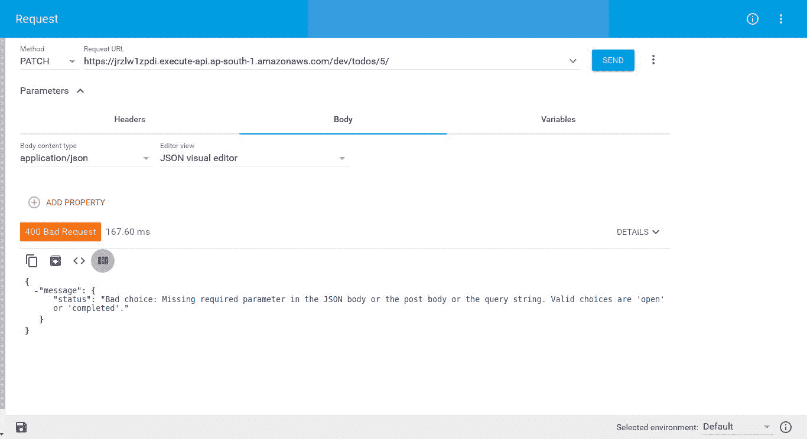

# 第四章：使用 Zappa 构建基于 Flask 的 REST API

到目前为止，我们已经看到了如何开发基于 Flask 的应用程序，并在无服务器基础架构上部署它，我们已经创建了一个完整的 Web 应用程序以及 HTML 渲染过程，并且我们已经使用了各种 Flask 扩展以非常高效的方式构建了应用程序。

在本章中，我们将开发基于 Flask 的 RESTful API。这将涵盖使用 Flask 实现 REST API 并使用 Zappa 部署的 REST API。在第一章中，*无服务器的亚马逊网络服务*，我们看到了集成 AWS Lambda 和 API Gateway 的手动过程，所以现在我们将使用 Zappa 以自动化方式部署 REST API。Zappa 将通过配置代理设置来处理 Flask REST API 与 API Gateway 的集成，以传递请求以调用 Lambda 函数。

让我们继续我们的旅程，开发基于无服务器架构的 REST API。

在本章中，我们将涵盖以下主题：

+   安装和配置 Flask

+   设计 REST API

+   集成 Zappa

+   使用 Zappa 构建、测试和部署 REST API

# 技术要求

在开始实际实现之前，我们需要一些先决条件来创建基于 Flask 的 REST API：

+   Ubuntu 16.04 LTS

+   Python 3.6

+   虚拟环境

+   Flask 0.12.2

+   Flask-JWT 0.3.2

+   Flask-SQLAlchemy 2.3.2

+   Flask-Migrate 2.1.1

+   Flask-RESTful 0.3.6

+   Zappa 0.45.1

+   Flask

+   Flask 扩展

# 安装和配置 Flask

我们将开发一个基于 Flask 的 REST API，将其部署为 AWS Lambda 上的无服务器。因此，在这里，安装和配置 Flask 将在虚拟环境中进行。

我们将创建一个虚拟环境，并使其能够安装所有必需的软件包。可以使用以下命令完成：

```py
virtualenv .env -p python3.6
source .env/bin/activate
```

现在，我们将列出`requirements.txt`文件中的所有必需软件包，并一次性安装所有软件包。以下描述了`requirements.txt`文件的内容：

```py
Flask==0.12.2
Flask-JWT==0.3.2
Flask-SQLAlchemy==2.3.2
Flask-Migrate==2.1.1
flask-restful==0.3.6
zappa==0.45.1

```

现在，我们可以使用以下命令安装所有这些软件包：

```py
$ pip install -r requirements.txt
```

这是将在虚拟环境中安装的所有软件包。现在，让我们在下一节详细解释这些软件包。

# Flask 扩展

Flask 有许多可用的扩展，可以增强任何所需功能的能力。在我们的应用程序中，我们将使用多个扩展，如前一节中所述。这些扩展遵循一个通用模式，以便我们可以将它们与 Flask 应用程序对象集成。

我们将设计一个基于 Flask 的 REST API 应用程序，该应用程序将通过遵循 REST API 通信标准和验证，在 Todo 模型上具有基本的身份验证、授权和 CRUD 操作。

让我们在接下来的章节中看看这些扩展的用法。

# Flask-JWT

Flask-JWT 扩展在 Flask 环境中启用了**JWT**（**JSON Web Token**）功能。在设计 REST API 时，JWT 令牌对于验证和授权 API 访问起着重要作用。我们将在下一节中详细描述 JWT。

# 学习 JWT

**JWT**代表**JSON Web Token**。这是一种标准模式，用于实现 REST API 接口的安全性和真实性访问。JWT 令牌是服务器应用程序发出的数据的编码形式，用于验证客户端访问。客户端需要在 HTTP 请求中添加 JWT 令牌作为授权标头。

我们将使用 JWT 令牌来验证 REST API 的访问。如果您需要详细了解 JWT 机制，我建议阅读[`jwt.io/introduction/`](https://jwt.io/introduction/)上的 JWT 文档。

# Flask-RESTful

Flask-RESTful 扩展旨在使用 Flask 框架实现 REST API。该扩展遵循标准的 REST API 实现模式，并提供了一种实现 REST API 的简单方法。在实现 REST API 之前，您必须对 REST API 标准有基本的了解，因此让我们来看看 REST API 的基础知识。

# 开始 REST

**REST**代表**REpresentational State Transfer.**它是一个明确定义的标准，用于实现服务器-客户端通信以持久化数据。REST 遵循**JSON**（**JavaScript 对象表示**）数据表示格式来交换数据。

REST 在 HTTP 方法上定义了一些动词，用于执行 CRUD 操作，例如：

+   `GET`：检索记录列表和根 URL 中带有后缀 ID 参数的特定记录，还返回带有 200 状态代码的响应

+   `POST`：在服务器上创建记录，并返回带有 201 状态代码的响应

+   `PUT`：更新服务器上的所有记录字段，并返回带有 200 状态代码的响应

+   `PATCH`：更新服务器上记录集中的特定字段，并返回带有 200 状态代码的响应

+   `DELETE`：通过 URL 中的记录特定 ID 的帮助删除整个记录集，并返回带有 204 状态代码的响应

现在是时候看一些实际工作了。让我们继续下一节。

# 设计 REST API

我们将设计一个 REST API，用于对我们的 todos 模型执行 CRUD 操作。我们的应用程序将具有基本的身份验证和授权工作流，以保护 REST API 端点。

以下是我们应用程序的脚手架：


```py
__init__.py, where we configured the Flask application object with extensions and the config object.
```

文件—`app`/`__init__.py`:

```py
from flask import Flask
from flask_sqlalchemy import SQLAlchemy
from flask_migrate import Migrate
from flask_jwt import JWT, jwt_required, current_identity

from app.config import config

db = SQLAlchemy()
migrate = Migrate()

def create_app(environment):
    app = Flask(__name__)
    app.config.from_object(config[environment])

    db.init_app(app)
    migrate.init_app(app, db=db)

    from .auth.models import User

    def authenticate(email, password):
        data = request.json
        user = User.query.filter_by(email=data['email']).first()
        if user is not None and user.verify_password(data['password']):
            return user

    def identity(payload):
        user_id = payload['identity']
        return User.query.filter_by(id=user_id).first()

    jwt = JWT(app, authenticate, identity)

    from .auth import auth as auth_blueprint
    app.register_blueprint(auth_blueprint, url_prefix='/auth')

    from .todo import todo as todo_blueprint
    app.register_blueprint(todo_blueprint)

    return app
```

我们配置了 Flask 扩展，如 Flask-SQLAlchemy 和 Flask-Migration，这些都很简单。Flask-JWT 集成需要更多的工作，因为我们需要定义`authenticate`和`identity`方法，并在初始化 JWT 对象时将它们用作参数。这些方法负责对用户进行身份验证和识别用户。

除了扩展集成，我们将创建`auth`和`todoapps`作为 Flask 蓝图对象，并使用`register_blueprint`方法将它们注册到 Flask 应用程序对象中。

让我们详细描述每个包及其用途。

# 配置应用程序设置

在`config`包中，我们定义了应用程序级别的配置，根据定义的环境进行隔离。以下是`config.py`文件的内容。

文件—`config/config.py`:

```py
import os
from shutil import copyfile

BASE_DIR = os.path.dirname(os.path.dirname(__file__))

def get_sqlite_uri(db_name):
    src = os.path.join(BASE_DIR, db_name)
    dst = "/tmp/%s" % db_name
    copyfile(src, dst)
    return 'sqlite:///%s' % dst

class Config(object):
    SECRET_KEY = os.environ.get('SECRET_KEY') or os.urandom(24)
    SQLALCHEMY_COMMIT_ON_TEARDOWN = True
    SQLALCHEMY_RECORD_QUERIES = True
    SQLALCHEMY_TRACK_MODIFICATIONS = False

    @staticmethod
    def init_app(app):
        pass

class DevelopmentConfig(Config):
    DEBUG = True
    BUNDLE_ERRORS = True
    SQLALCHEMY_DATABASE_URI = get_sqlite_uri('todo-dev.db')

class ProductionConfig(Config):
    SQLALCHEMY_DATABASE_URI = get_sqlite_uri('todo-prod.db')

config = {
    'dev': DevelopmentConfig,
    'prod': ProductionConfig,
}
```

`config`文件公开了`config`对象，其中包含根据您的环境不同的配置对象。类似地，您可以根据需要添加更多环境。

`get_sqlite_uri`方法被定义为将`db`文件设置在`tmp`目录中，因为 AWS Lambda 要求在执行时将 SQLite`.db`文件保存在内存中。

```py
BaseModel, which was inspired by Django's standard pattern to perform save, update, and delete operations. We can add more generic features if required.
```

文件—`config/models.py`:

```py

from app import db

class BaseModel:
    """
    Base Model with common operations.
    """

    def delete(self):
        db.session.delete(self)
        db.session.commit()

    def save(self):
        db.session.add(self)
        db.session.commit()
        return self
```

在这里，我们将`db`会话操作组合在一起，以执行特定的事务，如保存、更新和删除。这将帮助我们扩展模型类的功能。

# 实施认证

认证是保护 REST API 免受未经授权访问的重要功能。因此，为了实现认证层，我们将使用 JWT 机制。在这里，我们将设计两个 REST API，用于注册用户和登录访问。

```py
User model.
```

文件—`auth/models.py`:

```py
import re
from datetime import datetime

from app.config.models import BaseModel
from sqlalchemy.orm import synonym
from werkzeug.security import generate_password_hash, check_password_hash
from app import db

class User(BaseModel, db.Model):
    __tablename__ = 'user'
    id = db.Column(db.Integer, primary_key=True)
    _email = db.Column('email', db.String(64), unique=True)
    password_hash = db.Column(db.String(128))

    def __init__(self, **kwargs):
        super(User, self).__init__(**kwargs)

    def __repr__(self):
        return '<User {0}>'.format(self.email)

    @property
    def email(self):
        return self._email

    @email.setter
    def email(self, email):
        if not len(email) <= 64 or not bool(re.match(r'^\S+@\S+\.\S+$', email)):
            raise ValueError('{} is not a valid email address'.format(email))
        self._email = email

    email = synonym('_email', descriptor=email)

    @property
    def password(self):
        raise AttributeError('password is not a readable attribute')

    @password.setter
    def password(self, password):
        if not bool(password):
            raise ValueError('no password given')

        hashed_password = generate_password_hash(password)
        if not len(hashed_password) <= 128:
            raise ValueError('not a valid password, hash is too long')
        self.password_hash = hashed_password

    def verify_password(self, password):
        return check_password_hash(self.password_hash, password)

    def to_dict(self):
        return {
            'email': self.email
        }
```

这是一个基本的`User`模型，只有两个字段，即`email`和`password`。现在，我们将设计一个注册 API 和一个登录 API。注册 API 将只接受两个参数，电子邮件和密码，并将在数据库中创建一个用户记录。登录 API 将用于验证用户的凭据，并返回一个 JWT 令牌，该令牌将与其他 API 一起作为授权标头使用。

让我们创建注册和登录 API。以下是资源文件的代码片段，其中包括 API 实现逻辑的内容。

文件 - `auth/resources.py`：

```py
from flask import request, jsonify
from flask_restful import Resource, reqparse, abort
from flask_jwt import current_app
from app.auth.models import User

def generate_token(user):
    """ Currently this is workaround
    since the latest version that already has this function
    is not published on PyPI yet and we don't want
    to install the package directly from GitHub.
    See: https://github.com/mattupstate/flask-jwt/blob/9f4f3bc8dce9da5dd8a567dfada0854e0cf656ae/flask_jwt/__init__.py#L145
    """
    jwt = current_app.extensions['jwt']
    token = jwt.jwt_encode_callback(user)
    return token

class SignUpResource(Resource):
    parser = reqparse.RequestParser(bundle_errors=True)
    parser.add_argument('email', type=str, required=True)
    parser.add_argument('password', type=str, required=True)

    def post(self):
        args = self.parser.parse_args()
        if not User.query.filter_by(email=args['email']).scalar():
            User(
                email = args['email'],
                password = args['password']
            ).save()
            return {'message': 'Sign up successfully'}
        abort(400, message='Email already exists.')

class LoginResource(Resource):
    parser = reqparse.RequestParser(bundle_errors=True)
    parser.add_argument('email', type=str, required=True)
    parser.add_argument('password', type=str, required=True)

    def post(self):
        args = self.parser.parse_args()
        user = User.query.filter_by(email=args['email']).first()
        if user is not None and user.verify_password(args['password']):
            token = generate_token(user)
            return jsonify({'token': token.decode("utf-8")})
        abort(400, message='Invalid credentials')
```

Flask-RESTful 提供了一个`Resource`类，用于定义 API 资源。它遵循 REST 标准，并提供了一个简单的方法来创建 API。由于我们将在 HTTP 的大多数`request`方法上使用注册 API，我们创建了一个`post`方法。同样，我们设计了登录 API，我们在那里验证用户的凭据并返回一个令牌。

我们必须返回自定义方法来生成令牌，因为在撰写本文时，Flask-JWT `PyPI`仓库尚未发布更新版本，尽管这个功能已经添加到 GitHub 仓库中。

```py
auth/__init__.py file.
```

文件 - `auth/__init__.py`：

```py
from flask import Blueprint
from flask_restful import Api
from .resources import SignUpResource, LoginResource

auth = Blueprint('auth', __name__)
auth_api = Api(auth, catch_all_404s=True)

auth_api.add_resource(SignUpResource, '/signup', endpoint='signup')
auth_api.add_resource(LoginResource, '/login', endpoint='login')
```

在这里，我们创建了`Blueprint`对象并对其进行了配置。Flask-RESTful 提供了一个`API`类，使用这个类，我们注册了我们的注册和登录资源。就是这样。现在，我们可以用 JSON 数据访问注册和登录 URL 来执行操作。在部署过程之后，我们将对这些 REST API 进行完整演示。

# 实现 todo API

让我们开始 todo API 的实现。我们需要一个 todo REST API 端点来执行 CRUD 操作。根据 REST 标准，只会有一个端点 URL，比如`/todos/<todo_id>/`。这个端点将用于将 todo 数据持久化到数据库中。我们需要有一个 Todo 模型来持久化数据。以下是 Todo 模型的代码片段。

文件 - `todo/models.py`：

```py
from datetime import datetime
from app import db
from app.config.models import BaseModel

class Todo(db.Model, BaseModel):
    __tablename__ = 'todo'
    id = db.Column(db.Integer, primary_key=True)
    title = db.Column(db.String(128))
    is_completed = db.Column(db.Boolean, default=False)
    created_by = db.Column(db.String(64), db.ForeignKey('user.email'))
    user = db.relationship('User', backref=db.backref('todos', lazy=True))

    def __init__(self, title, created_by=None, created_at=None):
        self.title = title
        self.created_by = created_by

    def __repr__(self):
        return '<{0} Todo: {1} by {2}>'.format(
            self.status, self.title, self.created_by or 'None')

    @property
    def status(self):
        return 'completed' if self.is_completed else 'open'

    def completed(self):
        self.is_completed = True
        self.save()

    def reopen(self):
        self.is_completed = False
        self.save()

    def to_dict(self):
        return {
            'id': self.id,
            'title': self.title,
            'created_by': self.created_by,
            'status': self.status,
        }
resources.py, which contains the todo's REST API.
```

文件 - `todo/resources.py`：

```py
from flask import request
from flask_restful import Resource, reqparse
from flask_jwt import current_identity, jwt_required

from .models import Todo

class TodoResource(Resource):

    decorators = [jwt_required()]

    def post(self):
        parser = reqparse.RequestParser(bundle_errors=True)
        parser.add_argument('title', type=str, required=True)

        args = parser.parse_args(strict=True)
        todo = Todo(args['title'], created_by=current_identity.email).save()
        return todo.to_dict(), 201

    def get(self, todo_id=None):
        if todo_id:
            todos = Todo.query.filter_by(id=todo_id, created_by=current_identity.email)
        else:
            todos = Todo.query.filter_by(created_by=current_identity.email)
        return [todo.to_dict() for todo in todos]

    def patch(self, todo_id=None):
        parser = reqparse.RequestParser(bundle_errors=True)
        parser.add_argument(
            'status',
            choices=('open', 'completed'),
            help='Bad choice: {error_msg}. Valid choices are \'open\' or \'completed\'.',
            required=True)

        if not todo_id:
            return {'error': 'method not allowed'}, 405
        args = parser.parse_args(strict=True)
        todo = Todo.query.filter_by(id=todo_id, created_by=current_identity.email).scalar()
        if args['status'] == "open":
            todo.reopen()
        elif args['status'] == 'completed':
            todo.completed()
        else:
            return {'error':'Invalid data!'}, 400
        return todo.to_dict(), 202

    def delete(self, todo_id=None):
        if not todo_id:
            return {'error': 'method not allowed'}, 405
        Todo.query.filter_by(id=int(todo_id), created_by=current_identity.email).delete()
        return {}, 204
```

在这里，我们定义了`TodoResource`类，它将处理`GET`、`POST`、`PUT`和`DELETE`的 HTTP 请求。根据请求类型，我们执行 CRUD 操作。我们还使用`reqparse`来定义从 HTTP 请求中所需数据的验证。

为了保护`TodoResource`，我们在`TodoResource`类的装饰器列表中添加了`jwt_required`方法，这将应用于所有相关方法。现在，`TodoResource` API 只能在有效的授权头部下使用，否则将会响应未经授权的访问错误。

我们将在接下来的章节中看到这个完整的工作过程。

# 使用 Zappa 构建、测试和部署 REST API

我们已经完成了开发，现在是时候将应用程序作为无服务器部署在 AWS Lambda 上了。我们已经在前一章中描述了配置 Zappa 及其相关配置的先决条件，所以这里我假设你已经配置了 Zappa 以及 AWS 配置。

# 配置 Zappa

一旦你配置了 Zappa，你可以为你的项目初始化 Zappa。你需要运行`zappa init`命令，并按照 CLI 问卷的指引来配置你的项目与 Zappa。我按照 Zappa 建议的默认配置设置进行了配置。`zappa init`命令将生成`zappa_settings.json`文件，我们可以根据需要自由修改这个文件。

```py
zappa_settings.json file.
```

文件 - `zappa_settings.json`：

```py
{
    "dev": {
        "app_function": "run.app",
        "aws_region": "ap-south-1",
        "profile_name": "default",
        "project_name": "chapter-4",
        "runtime": "python3.6",
        "s3_bucket": "zappa-5xvirta98"
    }
}
```

Zappa 维护这个 JSON 文件以执行部署过程。现在，我们将继续部署应用程序。

# 使用 Zappa 启动部署

一旦你完成了 Zappa 的初始化，就该部署应用程序了。Zappa 提供了一个`zappa deploy`命令来部署应用程序。这个命令将执行部署过程，它将创建部署包作为 ZIP 文件，将其推送到 AWS S3，并配置 AWS Lambda 与 API Gateway。我们在第一章中详细描述了完整的部署过程。

一旦我们用`zappa deploy dev`命令运行这个，我们的应用程序将作为无服务器应用程序托管在 AWS Lambda 上。如果你想重新部署相同的应用程序，那么你需要运行`zappa update dev`命令，这将更新现有的应用程序。

让我们在下一节中看一下部署的应用程序演示。

# 演示部署的应用程序

Zappa 为部署的应用程序生成一个随机 URL，并且在每次新部署时都会生成 URL。但是，如果您只是更新部署，则不会更改 URL。这是我们从 Zappa 部署过程中获得的 URL：[`jrzlw1zpdi.execute-api.ap-south-1.amazonaws.com/dev/`](https://jrzlw1zpdi.execute-api.ap-south-1.amazonaws.com/dev/)。我们已经使用一些端点编写了 auth 和 todo API，因此您在基本 URL 上看不到任何内容。我们将使用在资源中定义的 API 端点。 

# 注册 API

我们设计了带有端点`/auth/signup`的注册 API，它期望两个参数—`email`和`password`。此端点负责在数据库中创建用户记录。一旦我们获得成功的响应，我们可以使用相同的用户凭据执行登录并访问其他 API。

以下是注册 API 的截图：


在这里，我们使用高级 REST 客户端应用程序测试 API。如您所见，我们正在使用注册 API 创建用户记录。注册 API 以状态码 200 进行响应。

# 登录 API

现在，我们在数据库中有一个用户记录，我们可以使用它来执行登录操作。登录 API 负责验证用户的凭据并返回 JWT 令牌。此 JWT 令牌将用于授权 todos API。以下是通过 REST 客户端使用的登录 API 的截图：


在这里，您可以看到登录 API 的执行，因为我们获得了将用于授权访问待办事项 API 的 JWT 令牌。

# 待办事项 API

现在我们通过登录 API 获得了 JWT 令牌，让我们执行待办事项 API。然而，在这里，我们将看到待办事项 API 的不同场景。我们的待办事项 API 有一个名为`todos/<todo_id>`的端点。

# 没有授权的待办事项 API

让我们尝试在不提供授权标头的情况下使用待办事项 API：


如您所见，我们从应用程序得到了未经授权的错误。现在，我们将提供带有 JWT 令牌的授权标头。

# 带有授权标头的待办事项 API

我们将使用登录 API 返回的 JWT 令牌，并设置授权标头。授权标头的值将是`JWT <token>`。现在，让我们执行带有 CRUD 操作的 API。

`GET`请求如下所示：


在这里，我们得到了数据库中所有待办事项记录的列表。由于我们设置了授权标头，我们获得了访问权限。

`POST`请求如下所示：


在这里，我们创建了一个新的待办事项记录，并获得了状态码为`201`的响应。现在，使用基本 URL，我们可以执行`GET`和`POST`请求，但是，要执行对特定记录的`GET`、`PUT`和`DELETE`功能，我们需要在 URL 中提到`todo_id`。

没有有效负载数据的`POST`请求如下所示：


在这里，由于我们没有提供任何有效负载，我们得到了验证错误。我们使用`flask_restful`库的`reqparse`模块来处理此验证。

带有待办事项 ID 的`GET`请求如下所示：


您可以看到我们在 URL 中使用了待办事项 ID 来查看特定记录集。

`PATCH`请求如下所示：


在这里，我们更新了待办事项的状态，并将待办事项记录标记为已完成。

带有无效数据的`PATCH`请求如下所示：



在这里，由于我们使用`reqparse`模块定义了必需的选项，我们得到了验证错误，如下所示：

```py
parser = reqparse.RequestParser(bundle_errors=True)
        parser.add_argument(
            'status',
            choices=('open', 'completed'),
            help='Bad choice: {error_msg}. Valid choices are \'open\' or \'completed\'.',
            required=True)
```

`DELETE`请求如下所示：


最后，我们使用 HTTP `DELETE`请求删除了记录。就是这样！我们已经完成了 REST API 的实现。

# 摘要

在本章中，我们学习了如何创建基于 Flask 的 REST API，并使用一些扩展进行配置。在 Flask-JWT 扩展的帮助下，我们实现了安全性。Flask-RESTful 扩展提供了一个简单的接口来设计 REST API。最后，我们配置了 Zappa 来在无服务器环境中部署应用程序。

在下一章中，我们将看到 Django 应用程序开发作为 AWS Lambda 上的无服务器应用程序。敬请关注。

# 问题

1.  我们为什么需要 JWT 实现？

1.  Zappa 设置文件中的`function_name`参数是什么？
