# 第五章：使用 Zappa 构建 Django 应用程序

在本章中，我们将创建一个基于 Django 的图库应用程序，用户可以创建相册并上传图片。在 Django 中工作时，为静态和媒体内容提供服务是非常有趣和具有挑战性的。通常，开发人员将图像存储在文件存储中，并通过 URL 服务器提供。在这里，我们将在 AWS S3 中存储图像，并通过 AWS CloudFront 服务提供的 CDN 网络进行服务。

本章我们将涵盖的主题包括以下内容：

+   安装和配置 Django

+   设计图库应用程序

+   通过 AWS CloudFront CDN 提供静态和媒体文件

+   设置静态和媒体文件

+   集成 Zappa

+   使用 Zappa 构建、测试和部署 Django 应用程序

+   Django 管理命令

# 技术要求

在继续之前，让我们满足本章所需的一些先决条件。我们将开发一个基于 Django 的无服务器应用程序，因此我们需要满足以下用于开发此应用程序的要求：

+   Ubuntu 16.04/Mac/Windows

+   Pipenv 工具

+   Django

+   Django 存储

+   Django Imagekit

+   Boto3

+   Zappa

这些软件包是本章所需的软件包，我们将使用 pipenv 工具安装和配置这些软件包。现在我们将详细探讨配置。

# 安装和配置 Django

配置任何 Python 项目都需要遵循维护必要软件包版本的标准。许多开发人员喜欢维护`requriements.txt`文件，这有助于他们保持应用程序的稳定性。`requirements.txt`中特定软件包的任何版本升级可能会破坏整个应用程序。这就是开发人员严格遵循此标准以维护其应用程序的稳定版本的原因。

# 设置虚拟环境

我一直在遵循传统模式，直到我遇到了一个非常酷的工具，改变了我对维护`requirements.txt`文件的传统方法。现在你不再需要`requirements.txt`了。它叫做**pipenv**；我喜欢使用它。

Pipenv 是一个受多种不同语言的包管理工具启发的 Python 包管理工具。Pipenv 是 Python.org 官方推荐的（[`www.python.org/`](https://www.python.org/)）。这个工具赋予了管理 Python 包的标准。

# 安装 pipenv

您可以从任何地方初始化虚拟环境，并且它将跟踪每个软件包的安装。

首先，我们需要在系统级安装`pipenv`。因此，如果您使用的是 macOS，则可以像这样使用 Homebrew 安装`pipenv`：

```py
$ brew install pipenv
```

如果您使用的是 Ubuntu 17.10，则可以简单地添加 PPA 存储库并使用`apt`命令进行安装，如下所示：

```py
$ sudo apt install software-properties-common python-software-properties
$ sudo add-apt-repository ppa:pypa/ppa
$ sudo apt update
$ sudo apt install pipenv
```

您可以简单地在系统级别通过`pip`安装它，而不是从活动虚拟环境中使用`pip`。看一下这行代码：

```py
pip install pipenv
```

系统级安装将是在不使用任何虚拟环境的情况下进行的安装。它安装在系统的`bin`目录中，并且应该可以从终端控制台执行。

现在，您可以通过在终端控制台上执行`pipenv`命令来查看有关`pipenv`命令的详细信息：

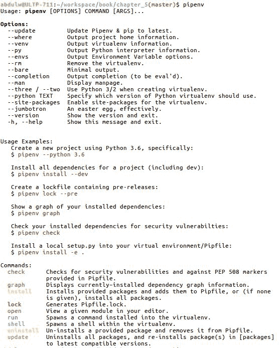

在这里，您可以看到有几个可用的命令，提供了一种非常灵活的方式来处理虚拟环境。

# 配置和安装软件包

现在，我们将为我们的项目创建一个虚拟环境并安装所需的软件包。

以下屏幕截图提到了虚拟环境创建过程：

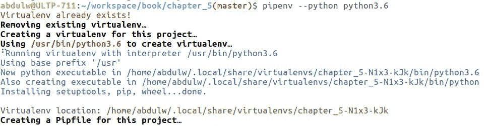

如您从前面的屏幕截图中所见，我们使用以下命令创建了一个虚拟环境：

```py
$ pipenv --python python3.6
```

我们明确指出了所需的 Python 版本；你也可以指定任何 Python 版本。如果你着急，只想用 Python 版本 2 或 3 初始化，那么你可以运行以下命令：

```py
$ pipenv --two
```

你也可以使用这个：

```py
$ pipenv --three
Pipfile:
```

```py
[[source]]

url = "https://pypi.python.org/simple"
verify_ssl = true
name = "pypi"

[dev-packages]

[packages]

[requires]

python_version = "3.6"
```

它有不同的部分来管理所有的包。现在你可以使用以下命令安装任何包：

```py
 pipenv install <package-name>
```

由于我们将使用 Django 框架，我们将使用 pipenv 来安装 Django，如下图所示：

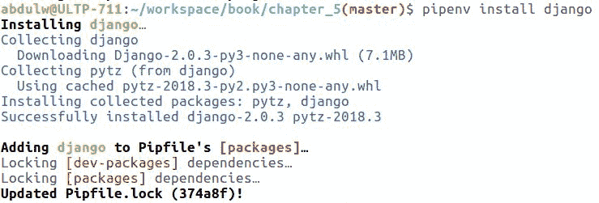

一旦安装了任何包，`pipenv`就会创建一个`Pipfile.lock`文件。`Pipfile.lock`文件维护了每个安装包的提交哈希和依赖关系。

现在，如果你想激活虚拟环境，不用担心。你可以把一切都交给`pipenv`。`pipenv`提供了一个名为`pipenv shell`的命令，它在内部调用虚拟环境的`activate`命令。现在，你将使用激活的虚拟环境 shell。

不必在 shell 中或激活虚拟环境中，你可以使用命令`pipenv run <command as an argument>`在虚拟环境下执行任何命令，例如：

```py
 pipenv run python manage.py runserver
```

这真的很有趣，不是吗？

安装所有所需的包后，`Pipfile`将如下所示：

文件—`Pipfile`:

```py
[[source]]

url = "https://pypi.python.org/simple"
verify_ssl = true
name = "pypi"

[dev-packages]

[packages]

django = "*"
pylint = "*"
pillow = "*"
zappa = "*"
django-storages = "*"
"boto3" = "*"
boto = "*"
django-imagekit = "*"

[requires]

python_version = "3.6"

```

现在，我们已经完成了所需包的配置和安装。

让我们继续下一节，我们将创建一个基于 Django 的图库应用。

# 设计图库应用

一旦我们完成配置，就可以开始实现应用。`ImageGallery`应用将是直接的——用户可以创建一个新的相册记录，并一次上传多张图片。一旦相册创建完成，我们将在列表视图中显示所有现有的相册记录，以及关联的缩略图。

让我们根据我们的需求来看看实现阶段。

# 设计概述

我将基于 Django 创建一个图库应用。我们将使用 Django admin 来实现 UI。Django admin 有非常漂亮的 UI/UX 设计。因此，我们将创建一些模型，比如一个`PhotoAlbum`模型，它将与`Photo`模型有一对多的关系。

然后我们只需在 Django admin 面板中注册这些模型。一旦我们完成了 admin 配置，我们将配置静态和媒体设置，将动态图片上传到 Amazon S3 存储桶，并通过 CloudFront CDN 网络提供这些静态文件。

让我们仔细看看实现。

# 初始化项目

一旦你配置了`pipenv`，你需要使用命令`pipenv shell`启用虚拟环境。假设你在`pipenv` shell 中，这只是一个激活的虚拟环境。一旦启用虚拟环境，你就可以访问已安装的包。因此，我们将通过执行以下命令创建 Django 项目框架：

```py
django-admin.py startproject <project_name>
```

以下是项目创建过程的屏幕截图：

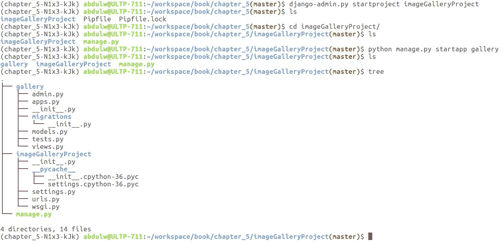

我已经创建了项目和一个应用。从之前的截图中，你可以看到项目和应用文件。

默认情况下，Django 在根`urls.py`文件中启用了 admin 面板。因此，我们不需要再次配置它。

现在让我们进入下一节的模型创建过程。

# 实现模型

我们将创建两个模型——`PhotoAlbum`和`Photo`模型，它们之间有一对多的关系。以下是`gallery/models.py`文件的代码片段：

文件—`gallery/models.py`:

```py
from django.db import models
from django.utils.translation import gettext as _
from imagekit.models import ImageSpecField
from imagekit.processors import ResizeToFill

# Create your models here.

def upload_path(instance, filename):
    return '{}/{}'.format(instance.album.name, filename)

class PhotoAlbum(models.Model):
    name = models.CharField(_('album name'), max_length=50)
    created_at = models.DateTimeField(auto_now_add=True, auto_now=False)
    updated_at = models.DateTimeField(auto_now=True)

    class Meta:
        db_table = 'photo_album'
        verbose_name = 'photo album'
        verbose_name_plural = 'photo albums'

    def __str__(self):
        return self.name

class Photo(models.Model):
    album = models.ForeignKey(PhotoAlbum, related_name='photos', on_delete=models.CASCADE)
    image = models.ImageField(_('image'), upload_to=upload_path)
    image_thumbnail = ImageSpecField(source='image',
                                      processors=[ResizeToFill(100, 50)],
                                      format='JPEG',
                                      options={'quality': 60})
    created_at = models.DateTimeField(auto_now_add=True, auto_now=False)
    updated_at = models.DateTimeField(auto_now=True)

    class Meta:
        db_table = 'photo'
        verbose_name = 'photo'
        verbose_name_plural = 'photos'

    def __str__(self):
        return self.image.name.split('/')[1]

```

按计划，我已经创建了两个模型，以及它们的关系。在这里，`PhotoAlbum`很直接，因为它充当父类。`Photo`模型更有趣，因为我们将通过它存储图片。

在`Photo`模型中，我正在使用`django-imagekit`（[`github.com/matthewwithanm/django-imagekit`](https://github.com/matthewwithanm/django-imagekit)）库来创建和存储原始上传图像的缩略图。这非常有趣，因为它有许多功能可以让我们根据需要处理图像。我的意图是创建上传图像的缩略图；因此，我相应地进行了配置。

一旦您完成模型创建，您将需要运行`makemigrations`和迁移命令来创建实际的数据库表。查看以下截图，以了解`makemigrations`命令的过程：

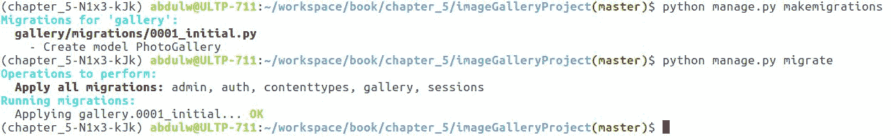

一旦我们运行`makemigrations`命令，就可以准备在管理面板中配置这些模型。让我们继续进行下一节关于配置管理面板的部分。

# 与管理面板集成

将模型与 Django 管理面板集成需要在根`urls.py`文件中启用管理 URL 配置。让我们来看一下代码：

文件—`imageGalleryProject/urls.py`：

```py
from django.contrib import admin
from django.urls import path

urlpatterns = [
    path('admin/', admin.site.urls),
]
admin.py file:
```

文件—`gallery/admin.py`：

```py
from django.contrib import admin
from django.utils.html import mark_safe
from gallery.models import PhotoAlbum, Photo
# Register your models here.

class PhotoAdminInline(admin.TabularInline):
    model = Photo
    extra = 1
    fields = ( 'image', 'image_tag', )
    readonly_fields = ('image_tag',)

    def image_tag(self, instance):
        if instance.image_thumbnail.name:
            return mark_safe('' % instance.image_thumbnail.url)
        return ''
    image_tag.short_description = 'Image Thumbnail'

class PhotoAlbumAdmin(admin.ModelAdmin):
    inlines = [PhotoAdminInline]

admin.site.register(PhotoAlbum, PhotoAlbumAdmin)
```

在这里，我们将`Photo`模型配置为`TabularInline`，这样我们就可以在一个相册下添加多张照片或图片。在将应用程序部署到 AWS Lambda 后，我们将进行完整的工作流程演示。

此时，您可以在本地计算机上运行应用程序并存储图像。但是以后，我们希望部署在 AWS Lambda 上，然后将图像存储在 Amazon S3 存储桶中，并通过 Amazon CloudFront CDN 网络提供服务。

# 应用程序演示

我们已经将模型配置到管理面板中。现在，我们将使用`python manage.py runserver`命令来运行 Django 的本地服务器。它将在`http://locahost:8000 URL`上启动 Django 服务器。

以下是应用程序的截图：

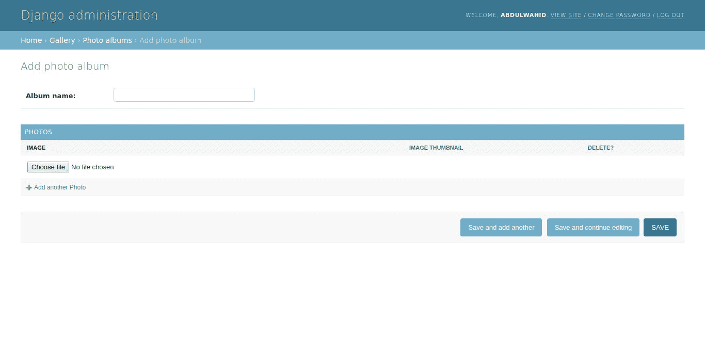

如前面的截图所示，我们正在创建一个相册。我们定义了一对多的关系，并使用`TabularInline`在创建相册时接受多张照片。看一下这个截图：

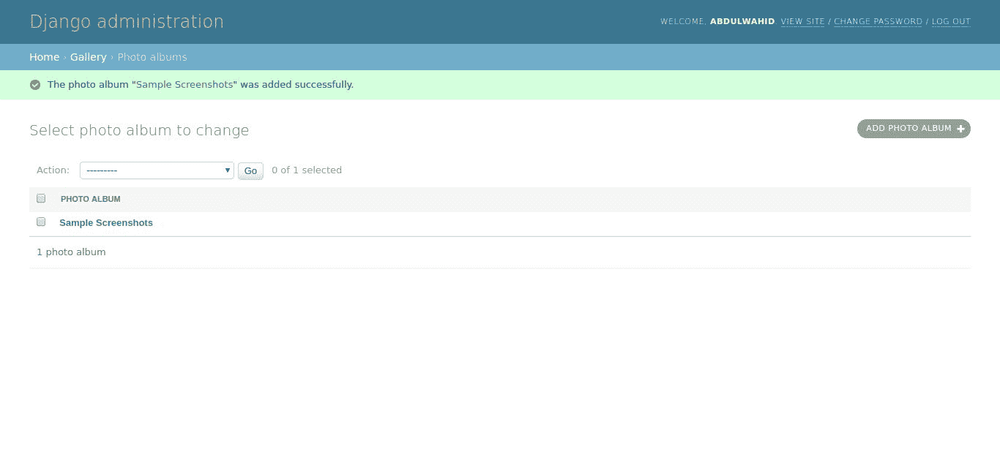

添加过程完成后，将出现列表页面。现在，您可以选择新创建的相册来查看或编辑现有的详细信息。看一下这个截图：

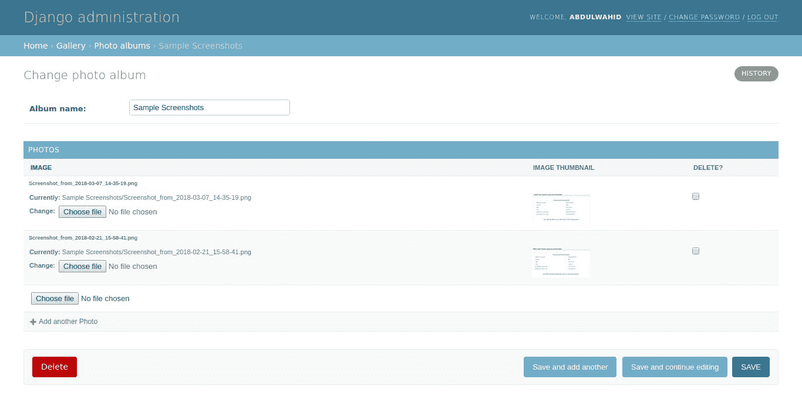

在这里，您可以检查先前上传的图像是否显示为缩略图。我们使用了`django-imagekit`库来配置缩略图图像处理。

现在，我们将在下一节中看到配置 Amazon CloudFront CDN 所需的过程，并将其与我们的应用程序集成。

# 配置 Amazon CloudFront CDN

Amazon CloudFront 是更受欢迎的服务之一。它提供通过 CDN 网络提供静态文件的功能，有助于以更高效的方式分发静态内容，从而提高性能并降低延迟。

配置 Amazon CloudFront 时，我们通过 AWS 用户控制台创建 CloudFront 分发。

# 创建 CloudFront 分发

假设您有有效的 AWS 帐户，您可以使用您的凭据登录 AWS Web 控制台。从服务下拉菜单中选择 CloudFront 服务，然后单击“创建分发”按钮，如下截图所示：

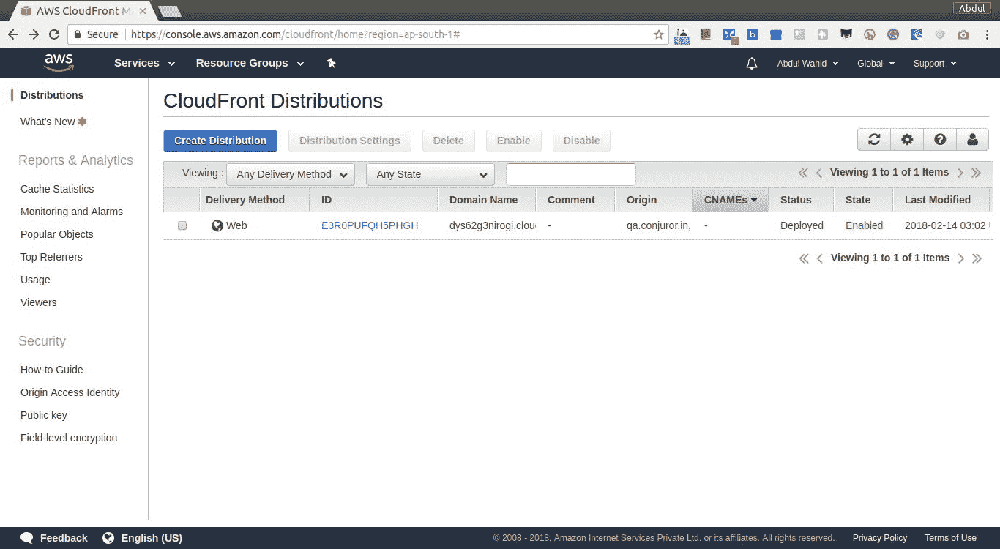

在创建分发时，Amazon 提供了两种不同的方法，即 Web 和 RTMP。Web 方法用于需要通过 CDN 网络提供的静态内容，当所有静态文件都驻留在 Amazon S3 存储桶中时使用。RTMP 方法用于分发流媒体文件，允许用户在下载完成之前播放文件。

在我们的情况下，我们将选择 Web 方法，因为我们希望分发静态文件。您可以按照以下截图中显示的方法进行选择：

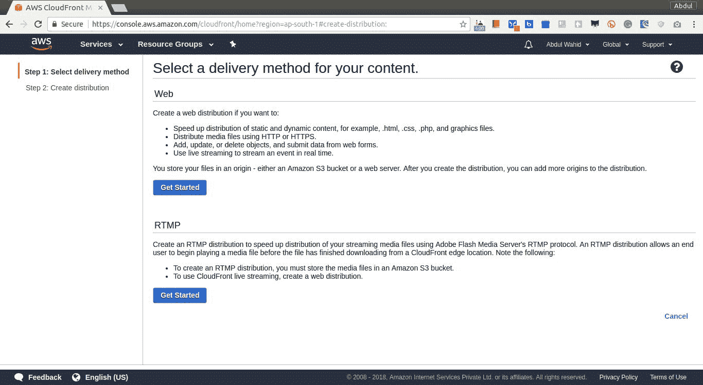

选择 Web 方法后，将打开创建分发表单页面。在此页面上，我们将选择所需的字段来配置分发。看一下这个截图：

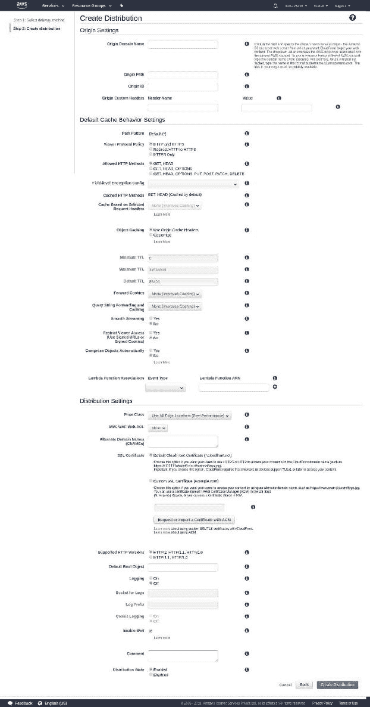

成功创建云分发后，我们将把分发与我们的 Django 应用集成。

让我们继续下一节，在那里我们将配置应用中的静态和媒体文件。

# 设置静态和媒体文件

在 Django 中配置静态和动态文件是必不可少的。我们如何配置和提供静态和媒体文件会影响应用程序的整体性能。因此，应该以优化的方式来配置静态和媒体文件。让我们对此进行详细讨论。

# 标准配置

Django 有一个标准模式来配置静态和媒体文件。静态和媒体是两个不同的问题，其中静态文件指固定内容，如 HTML、JS、CSS 和图像。Django 在`settings.py`中定义了一些与静态文件相关的配置，并在`urls.py`中配置了 URL。媒体文件指通过上传动态处理的任何文件。Django 有一个非常好的机制来配置和管理静态 HTML、JS、CSS 和图像文件。

通常，默认的 Django 静态文件配置假定您将在静态目录下与代码库一起拥有静态文件，但在我们的情况下，我们希望将所有静态内容放在 Amazon S3 存储桶下，并通过 Amazon CloudFront 分发进行提供。

# django-storage

我们将使用`django-storage`（[`django-storages.readthedocs.io/en/latest/`](http://django-storages.readthedocs.io/en/latest/)），这是一个第三方插件，用于实现自定义存储后端。借助 Django 存储，我们将设置静态和媒体配置。

以下是设置自定义存储静态和媒体文件所需的代码片段：

文件—`gallery/utils.py`：

```py
from django.conf import settings
from storages.backends.s3boto import S3BotoStorage

class StaticStorage(S3BotoStorage):
    location = settings.STATICFILES_LOCATION

    @property
    def connection(self):
        if self._connection is None:
            self._connection = self.connection_class(
                self.access_key, self.secret_key,
                calling_format=self.calling_format, host='s3-ap-south-1.amazonaws.com')
        return self._connection

class MediaStorage(S3BotoStorage):
    location = settings.MEDIAFILES_LOCATION

    @property
    def connection(self):
        if self._connection is None:
            self._connection = self.connection_class(
                self.access_key, self.secret_key,
                calling_format=self.calling_format, host='s3-ap-south-1.amazonaws.com')
        return self._connection
```

现在我们将在`settings.py`文件中配置这两个自定义存储类，如下所示：

文件—`imageGalleryProject/settings.py`：

```py
AWS_HEADERS = {
    'Expires': 'Thu, 31 Dec 2099 20:00:00 GMT',
    'Cache-Control': 'max-age=94608000',
}

AWS_STORAGE_BUCKET_NAME = 'chapter-5'
AWS_ACCESS_KEY_ID = os.environ.get('AWS_ACCESS_KEY_ID')
AWS_SECRET_ACCESS_KEY = os.environ.get('AWS_SECRET_ACCESS_KEY')
AWS_CLOUDFRONT_DOMAIN = 'dl76lqo8jmttq.cloudfront.net'

MEDIAFILES_LOCATION = 'media'
MEDIA_ROOT = '/%s/' % MEDIAFILES_LOCATION
MEDIA_URL = '/%s/%s/' % (AWS_CLOUDFRONT_DOMAIN, MEDIAFILES_LOCATION)
DEFAULT_FILE_STORAGE = 'gallery.utils.MediaStorage'

STATICFILES_LOCATION = 'static'
STATIC_ROOT = '/%s/' % STATICFILES_LOCATION
STATIC_URL = '/%s/%s/' % (AWS_CLOUDFRONT_DOMAIN, STATICFILES_LOCATION)
STATICFILES_STORAGE = 'gallery.utils.StaticStorage'
```

这些是您需要放入`settings.py`中的设置，现在是时候配置`urls.py`了。我建议您更新根`urls.py`，如下所示：

文件—`imageGalleryProject/urls.py`：

```py
from django.conf import settings
from django.conf.urls.static import static

urlpatterns = [
    # ... the rest of your URLconf goes here ...
] + static(settings.STATIC_URL, document_root=settings.STATIC_ROOT)
  + static(settings.MEDIA_URL, document_root=settings.MEDIA_ROOT)
```

一旦您配置了 URL，那么您就准备好了。要验证配置，您可以运行`collectstatic`命令，将所有静态文件收集到配置的位置：

```py
$ python manage.py collectstatic
```

此命令将检索属于所述`INSTALL_APPS`的所有静态文件，并将它们上传到`STATIC_ROOT`。现在，当您上传任何文件时，它将被上传到 Amazon S3，并通过 Amazon CloudFront 提供。

现在是时候配置 Zappa 并进行部署了。

# 使用 Zappa 构建、测试和部署 Django 应用

Zappa 配置很简单。Zappa 包也可以在 pip 仓库中找到。但我们将使用 pipenv 来安装它，这可以帮助我们跟踪版本管理。以下是安装 Zappa 所需的命令：

```py
$ pipenv install zappa
```

安装 Zappa 后，您需要使用`zappa init`命令初始化 Zappa。此命令将提示一个 shell 调查问卷，以配置 Zappa 所需的基本信息。让我们看看下一节，我们将讨论 Zappa 的基本配置。

# 配置 Zappa

```py
zappa_settings.json file:
```

```py
{
    "dev": {
        "aws_region": "ap-south-1",
        "django_settings": "imageGalleryProject.settings",
        "profile_name": "default",
        "project_name": "imagegallerypro",
        "runtime": "python3.6",
        "s3_bucket": "chapter-5",
        "remote_env": "s3://important-credentials-bucket/environments.json"
    }
}
```

在这里，我们根据要求定义了配置。由于密钥定义了每个配置，我们可以看到它的用法。考虑以下内容：

+   `aws_region`：Lambda 将上传的 AWS 区域

+   `django_settings`：Django 设置文件的导入路径

+   `profile_name`：在`~/.aws/credentials`文件中定义的 AWS CLI 配置文件

+   `project_name`：上传 Lambda 函数的项目名称

+   `runtime`：Python 运行时解释器

+   `s3_bucket`：创建一个 Amazon S3 存储桶并上传部署包

+   `remote_env`：设置 Amazon S3 位置上传的 JSON 文件中提到的所有键值对的环境变量

在配置信息的帮助下，我们将继续部署。

# 构建和部署

一旦我们完成配置，就可以进行部署。Zappa 提供了两个不同的命令来执行部署，例如`zappa deploy <stage_name>`和`zappa update <stage_name>`。最初，我们将使用`zappa deploy <stage_name>`命令，因为这是我们第一次部署这个 Lambda 应用程序。

如果您已经部署了应用程序并希望重新部署它，那么您将使用`zappa update <stage_name>`命令。在上一章中，我们对 Zappa 的部署过程进行了详细讨论，因此如果需要，您可以参考这一点。

以下是我们部署过程的截图：

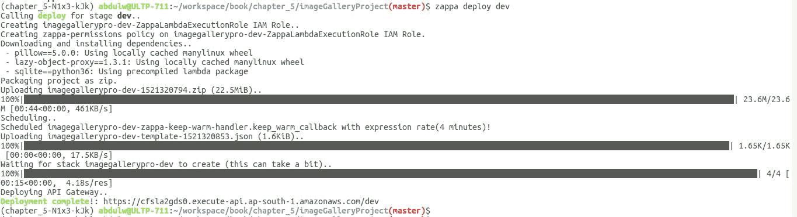

如您所见，成功部署后，我们得到了 API 网关端点 URL。让我们通过访问所述 URL 的管理面板来检查部署过程。看一下这个截图：

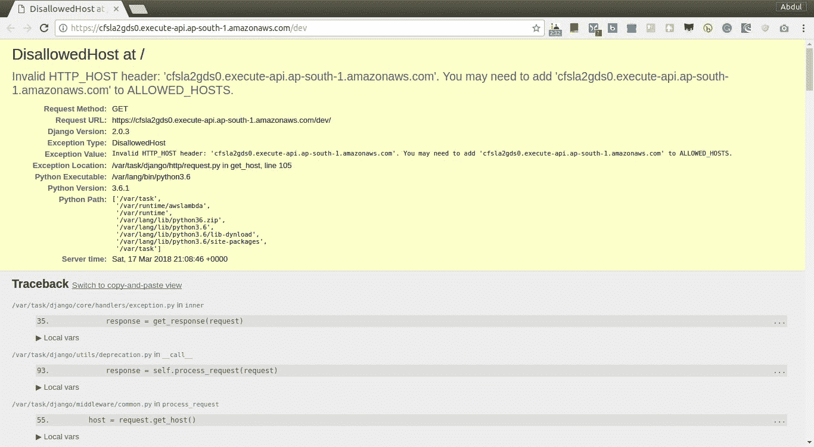

哎呀！我们遇到了一个错误。这个错误说我们有一个无效的`HTTP_HOST`，这是真的，因为我们没有在`settings.py`文件的`ALLOWED_HOSTS`列表中配置它，如下所述：

```py
ALLOWED_HOSTS = ['localhost', 'cfsla2gds0.execute-api.ap-south-1.amazonaws.com']
```

这将解决问题。现在，让我们继续查看管理面板：

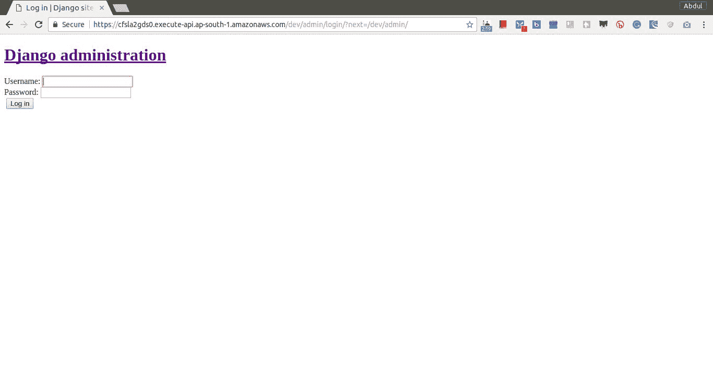

哎呀！看起来好像我们未能加载静态内容。但是我们已经使用 Amazon S3 和 Amazon CloudFront 配置了静态和媒体内容。

因此，为了解决这个错误，我们需要运行`python manage.py collectstatic`命令。这个命令将把所有静态内容上传到 Amazon S3，并通过 Amazon CloudFront 可用。看一下这个截图：

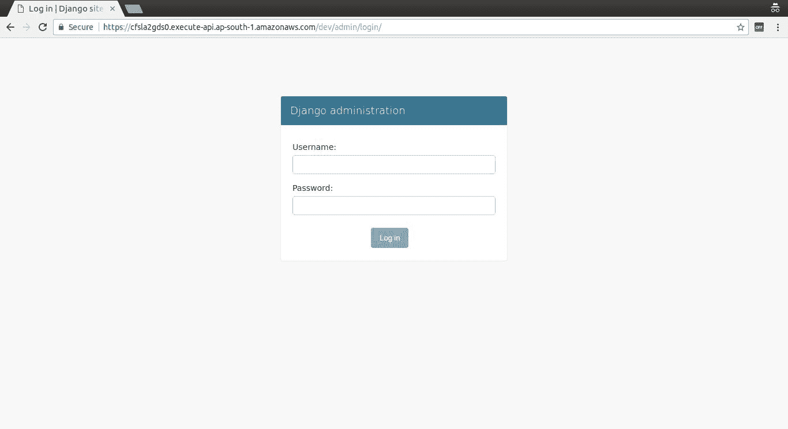

哇！我们解决了问题，我们的应用程序已经上线并且是无服务器的。部署真的很容易。希望您喜欢基于 Django 的应用程序的部署。

在这里，我们从未涉及任何服务器软件，如 Apache 或 Nginx 等复杂的配置。Zappa 使得将应用程序部署为无服务器变得非常容易。

现在我们将看看使用 Zappa 还可以做些什么。请参考我们的下一节，了解更多精彩内容！

# 使用 Zappa 进行 Django 管理命令

Zappa 提供了一个功能，可以直接从您的终端控制台在部署的 Lamdba 实例上执行 Django 的`manage`命令操作。通过`zappa manage <stage_name> <manage-command>`，您可以执行并检查您的 Django 应用程序的状态。

以下是执行此命令的截图：

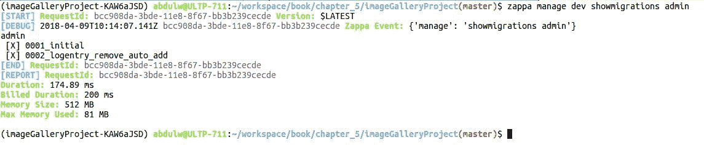

尽管有一些限制。它只适用于 Django 的`manage`命令，因此它只适用于 Django 项目。

要传递任何参数，您可以使用字符串格式的`manage`命令，例如：

```py
$ zappa manage dev "migrate --fake-initial"
```

但对于那些需要用户输入的命令，例如`createsuperuser`，它将没有用处。因此，在这种情况下，您可以以字符串格式编写 Python 脚本，并将其作为参数传递给`zappa invoke <env> '<raw_script>' --raw`。看一下这个截图：

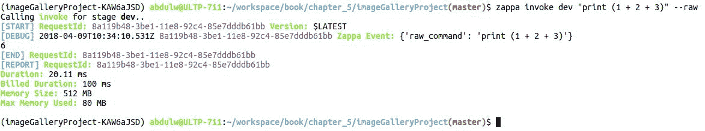

就是这样。

希望你喜欢。这让开发人员的生活变得轻松。因为我们正在处理无服务器环境，所以可能需要这些功能。

# 摘要

我们学会了如何构建一个无服务器的 Django 应用程序。Zappa 使构建操作变得非常容易，并帮助您进行无服务器部署，非常方便。

在实现无服务器 Django 应用程序时，我们涵盖了所有必要的细节。我解释了为这个应用程序编写的代码；我还在我们的 GitHub 存储库中分享了整个代码库（[`github.com/PacktPublishing/Building-Serverless-Python-Web-Services-with-Zappa/tree/master/chapter_5/imageGalleryProject`](https://github.com/PacktPublishing/Building-Serverless-Python-Web-Services-with-Zappa/tree/master/chapter_5/imageGalleryProject)）。

希望你喜欢这一章。在下一章中，我们将实现相同的应用程序，但作为一个 RESTful API，并看看我们会遇到什么挑战。

# 问题

1.  什么是 Amazon CloudFront？

1.  pipenv 用于什么？
