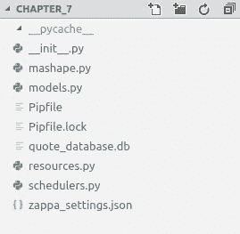

# 第七章：使用 Zappa 构建猎鹰应用程序

在本章中，我们将实施一个基于猎鹰框架的应用程序。这个应用程序将与引用相关；您将能够获取每日引用和生成一个随机引用。我希望这对您来说是有趣的。我们将包括一个调度程序，它将负责从第三方 API 获取一个随机引用并将其放入我们的数据库中。我们将设置这个调度程序每天执行一次。让我们为这次旅行做好准备。

本章我们将涵盖以下主题：

+   安装和配置猎鹰

+   设计猎鹰 API

+   使用 Zappa 构建、测试和部署猎鹰 API

# 技术要求

在本章的开发工作中继续之前，我想建议先满足设置开发环境的先决条件。以下是技术要求的列表：

+   Ubuntu 16.04/macOS/Windows

+   Python 3.6

+   Pipenv 工具

+   猎鹰

+   Peewee

+   请求

+   Gunicorn

+   Zappa

在下一节中，我已经描述了设置环境的完整信息。让我们为此做好准备，探索通往无服务器的旅程。

# 安装和配置猎鹰

配置 Python 应用程序开发需要我们设置虚拟环境。借助虚拟环境，我们将维护所有所需的软件包。正如在第六章中讨论的那样，*使用 Zappa 构建 Django REST API*，pipenv 打包工具在虚拟环境中维护所有已安装的软件包，并跟踪版本和依赖项。让我们继续使用 pipenv 工具设置虚拟环境。

# 设置虚拟环境

在开始实际实施之前，我们将使用 pipenv 工具设置虚拟环境。以下是创建新虚拟环境的命令：

```py
$ pipenv --python python3.6
```

在这里，我明确提到了 Python 版本，因为我在我的系统上使用了许多其他 Python 版本。这个命令将创建一个`Pipfile`，如下所示：

```py
[[source]]

url = "https://pypi.python.org/simple"
verify_ssl = true
name = "pypi"

[dev-packages]

[packages]

[requires]

python_version = "3.6"
```

正如您所见，前面的代码中包含了关于环境的基本信息，但在软件包下面没有任何内容，因为我们还没有安装任何软件包。这个文件维护了所有已安装软件包的列表。pipenv 工具在`~/.local/share/virtualenvs/`创建一个虚拟环境，并且当我们调用前面的命令时，它将从该目录创建新的环境。一旦您执行了该命令，就会创建`Pipfile`，如前所述。

您可以执行`pipenv shell`命令来启用虚拟环境。让我们继续下一节，我们将安装所有所需的软件包。

# 安装所需的软件包

正如我们之前提到的，我们将创建一个基于猎鹰的 API 应用程序。因此，我们需要安装一些我们将在实现中使用的软件包。以下是我们将在实现中使用的软件包列表：

+   `falcon`

+   `zappa`

+   `gunicorn`

+   `peewee`

+   `requests`

您可以使用`pipenv install <package_name>`命令安装这些软件包。

您可以通过指定其他以空格分隔的软件包一次安装多个软件包，例如`pipenv install <package_one> <package_two> ...`。

一旦您安装了所有这些软件包，pipenv 将创建一个名为`Pipfile.lock`的文件，其中包含版本和依赖项的信息。`Pipfile`将被更新。

```py
Pipfile:
```

文件—`Pipfile`：

```py
[[source]]

url = "https://pypi.python.org/simple"
verify_ssl = true
name = "pypi"

[dev-packages]

pylint = "*"

[packages]

falcon = "*"
zappa = "*"
gunicorn = "*"
peewee = "*"
requests = "*"

[requires]

python_version = "3.6"
```

现在我们已经完成了虚拟环境的设置，是时候开始实施应用程序了。但在继续设置环境之前，让我们先了解一些重要的软件包及其用法。

# 什么是猎鹰？

猎鹰是一个裸金属 Python Web API 框架。它可以用于构建具有非常快速性能的微服务。

它非常灵活和易于实现。与其他框架相比，它具有显著的基准。有许多大型组织正在使用 Falcon，如领英、OpenStack、RackSpace 等。以下是 Falcon 网站上的示例代码片段：

```py
# sample.py

import falcon

class QuoteResource:
    def on_get(self, req, resp):
        """Handles GET requests"""
        quote = {
            'quote': (
                "I've always been more interested in "
                "the future than in the past."
            ),
            'author': 'Grace Hopper'
        }

        resp.media = quote

api = falcon.API()
api.add_route('/quote', QuoteResource())
```

它需要`gunicorn`在本地主机上执行 API，如下面的代码块所示：

```py
$ gunicorn sample:api
```

Falcon 真的很简单，而且在 Falcon 中更容易实现 REST API，因为它鼓励我们遵循 REST 架构风格。您可以在此处阅读有关 Falcon 的更多信息：[`falconframework.org/#`](https://falconframework.org/#)。

# 什么是 Peewee？

Peewee 是一个简单而小巧的**ORM**（**对象关系映射器**）。它旨在提供类似于 Django 或 SQLAlchemy 的 ORM 接口。它支持 MySQL、Postgres 和 SQLite 等数据库。

以下是 Peewee 的 GitHub 页面上的定义模型类的示例代码片段：

```py
from peewee import *
import datetime

db = SqliteDatabase('my_database.db')

class BaseModel(Model):
    class Meta:
        database = db

class User(BaseModel):
    username = CharField(unique=True)

class Tweet(BaseModel):
    user = ForeignKeyField(User, backref='tweets')
    message = TextField()
    created_date = DateTimeField(default=datetime.datetime.now)
    is_published = BooleanField(default=True)
```

这真的很棒——我们以 Django 风格设计数据库模型的可行性与一个小包装器。Peewee 真的很棒，可以考虑用于编写小型微服务。

在此处阅读有关 Peewee 的更多信息：[`docs.peewee-orm.com/en/latest/`](http://docs.peewee-orm.com/en/latest/)。

让我们继续下一节，我们将在实际中使用 Falcon 和 Peewee。

# 设计 Falcon API

我们将基于报价概念设计一个 REST API。报价可能是名人说的话，也可能是电影中的对话。我们将使用 Mashape 的**随机名人名言**API（[`market.mashape.com/andruxnet/random-famous-quotes`](https://market.mashape.com/andruxnet/random-famous-quotes)）。Mashape 是一个 API 平台，提供许多类别的 API。

在我们的情况下，我们将创建一个包含以下操作的单个 API：

+   生成或检索当天的报价

+   生成随机报价

对于第一个操作，我们将需要每天将来自 Mashape API 的随机报价存储到我们的数据库中。因此，我们需要设计一个任务调度程序，以便每天执行并将来自 Mashape API 的报价存储到我们的数据库中，以便我们的 API 用户可以获得当天的报价。

对于第二个操作，我们不需要将从 Mashape API 随机生成的每一条报价都持久化。相反，我们将生成的随机报价返回给我们的 API 用户。

# 搭建应用程序

在设计任何应用程序时，搭建是在实施解决方案之前必须考虑的重要步骤。它帮助我们以一种乐观的方式管理代码库。以下是我们应用程序的搭建：



在这里，我们根据功能将代码库分成不同的模块。让我们在接下来的部分中看一下每个模块。

# 设计模型类

```py
models.py.
```

文件—`models.py`：

```py
import os
import datetime
from shutil import copyfile
from peewee import *

# Copy our working DB to /tmp..
db_name = 'quote_database.db'
src = os.path.abspath(db_name)
dst = "/tmp/{}".format(db_name)
copyfile(src, dst)

db = SqliteDatabase(dst)

class QuoteModel(Model):

    class Meta:
        database = db

    id = IntegerField(primary_key= True)
    quote = TextField()
    author = CharField()
    category = CharField()
    created_at = DateTimeField(default= datetime.date.today())

db.connect()
db.create_tables([QuoteModel])
```

在这里，我们通过扩展`Model`类定义了`QuoteModel`，并使用 Peewee 库的特性定义了属性。这里最重要的部分是数据库连接；正如您所看到的，我们使用了 SQLite 数据库。我们创建了数据库文件并将其放在`/tmp`目录中，以便在 AWS Lambda 环境中可以访问。

一旦我们使用`SqliteDatabase`类定义了数据库，我们就连接数据库并根据模型定义创建数据库表。

`db.create_tabless`方法只在表不存在时创建表。

现在我们准备使用这个`Model`类来执行任何查询操作。但是，在创建资源之前，让我们看一下`mashape.py`，在那里我们集成了第三方 API 以获取随机报价。

# Mashape API 集成

Mashape 是私人和公共 API 的最大 API 市场。有数千个 API 提供者和消费者注册。请查看市场[`market.mashape.com`](https://market.mashape.com/)。我们将使用随机名言引用 API([`market.mashape.com/andruxnet/random-famous-quotes`](https://market.mashape.com/andruxnet/random-famous-quotes))。一旦您登录 Mashape 市场，您可以详细了解这些 API。以下代码片段是我们用来获取随机引用的 API 之一。

```py
mashape.py file.
```

文件 - `mashape.py`：

```py
import os
import requests

def fetch_quote():
    response = requests.get(
        os.environ.get('Mashape_API_Endpoint'),
        headers={
            'X-Mashape-Key': os.environ.get('X_Mashape_Key'),
            'Accept': 'application/json'
        }
    )
    if response.status_code == 200:
        return response.json()[0]
    return response.json()
```

在这里，我们编写了一个名为`fetch_quote`的方法。此方法负责从 Mashape API 获取引用并以 Python 字典格式返回引用数据。根据我们的需求，我们将在不同的地方使用此方法。

# 创建 API 资源

```py
resources.py.
```

文件 - `resources.py`：

```py
import os
import datetime
import requests
import falcon

from models import QuoteModel
from mashape import fetch_quote

class QuoteResource:
    def on_get(self, req, resp):
        """Handles GET requests"""
        if req.get_param('type') in ['daily', None]:
            data = QuoteModel.select().where(QuoteModel.created_at == datetime.date.today())
            if data.exists():
                data = data.get()
                resp.media = {'quote': data.quote, 'author': data.author, 'category': data.category}
            else:
                quote = fetch_quote()
                QuoteModel.create(**quote)
                resp.media = quote
        elif req.get_param('type') == 'random':
            resp.media = fetch_quote()
        else:
            raise falcon.HTTPError(falcon.HTTP_400,'Invalid Quote type','Supported types are \'daily\' or \'random\'.')

api = falcon.API()
api.add_route('/quote', QuoteResource())
```

在这里，我们创建了`QuoteResource`类，并实现了`on_get`方法来处理`GET`请求。为了执行生成每日引用和随机引用的不同操作，我们定义了一个名为`type`的查询参数，例如，`http://<API_URL>?type=daily|random`。因此，根据查询参数，我们提供服务。

我们已经完成了实施。我们将在下一节中查看执行、调度和部署。

# 使用 Zappa 构建、测试和部署 Falcon API

与其他框架无关，Falcon 需要`gunicorn`库进行执行。Gunicorn 是一个轻量级的 Python WSGI HTTP 服务器。Falcon 没有任何默认行为来提供 WSGI 服务；相反，Falcon 主要关注 API 架构风格和性能。让我们继续在本地环境中执行 API。

# 使用 gunicorn 进行本地执行

对于本地执行，我们将使用`gunicorn`。以下是`gunicorn`执行的日志：

```py
$ gunicorn resources:api
[2018-05-18 15:40:57 +0530] [31655] [INFO] Starting gunicorn 19.8.1
[2018-05-18 15:40:57 +0530] [31655] [INFO] Listening at: http://127.0.0.1:8000 (31655)
[2018-05-18 15:40:57 +0530] [31655] [INFO] Using worker: sync
[2018-05-18 15:40:57 +0530] [31662] [INFO] Booting worker with pid: 31662
```

我们正在使用`resources`模块和`api`对象进行执行。我们使用`resources`模块创建了`api`对象。

# 每日引用的 API

我们实现了`/quote` API，并根据查询参数分离了操作。让我们执行`/quote?type=daily` API。以下是使用 cURL 命令行工具执行每日引用 API 的日志片段：

```py
$ curl http://localhost:8000/quote?type=daily
{"quote": "I'll get you, my pretty, and your little dog, too!", "author": "The Wizard of Oz", "category": "Movies"}
```

此 API 将每天返回一个独特的引用。

# 随机引用的 API

现在，让我们对`/quote` API 执行另一个操作，例如`/quote?type=random`。此 API 将在每个请求上返回一个随机引用。以下是 API 执行的日志：

```py
$ curl http://localhost:8000/quote?type=random
{"quote": "The only way to get rid of a temptation is to yield to it.", "author": "Oscar Wilde", "category": "Famous"}
```

此 API 将在每个请求上返回一个随机引用记录。

# 配置 Zappa

一旦我们在设置虚拟环境时安装了 Zappa，我们就可以配置 Zappa 与我们的应用程序。以下是我们将执行的操作，以配置 Zappa。

# Zappa 初始化

```py
settings.json file.
```

文件 - `zappa_settings.json`：

```py
{
    "dev": {
        "app_function": "resources.api",
        "aws_region": "ap-south-1",
        "profile_name": "default",
        "project_name": "chapter-7",
        "runtime": "python3.6",
        "s3_bucket": "zappa-0edixmwpd",
        "remote_env": "s3://book-configs/chapter-7-config.json"
    }
}
```

在这里，我们根据要求定义了配置。由于密钥定义了每个配置，我们可以看到它的用法：

+   `aws_region`: lambda 将上传的 AWS 区域

+   `app_function`: 从`resources`模块导入`api`对象的导入路径

+   `profile_name`: 在`~/.aws/credentials`文件中定义的 AWS CLI 配置文件

+   `project_name`: 上传 lambda 函数的项目名称。

+   `runtime`: Python 运行时解释器

+   `s3_bucket`: 创建一个 Amazon S3 存储桶并上传部署包。

+   `remote_env`: 在 Amazon S3 位置上传的 JSON 文件中设置所有键值对的环境变量

借助这些配置信息，我们可以继续部署。

# Zappa 部署

一旦配置完成，我们就可以进行部署。Zappa 提供了两个不同的命令来执行部署，`zappa deploy <stage_name>`和`zappa update <stage_name>`。最初，我们使用`zappa deploy <stage_name>`命令，因为这是我们首次部署此 lambda 应用程序。

如果您已经部署了应用程序并希望重新部署，则可以使用`zappa update <stage_name>`命令。在前一章中，我们对 Zappa 的部署过程进行了详细讨论，因此您可以参考那里获取更多信息。

以下是我们部署过程的日志：

```py
$ zappa update dev
Important! A new version of Zappa is available!
Upgrade with: pip install zappa --upgrade
Visit the project page on GitHub to see the latest changes: https://github.com/Miserlou/Zappa
Calling update for stage dev..
Downloading and installing dependencies..
 - sqlite==python36: Using precompiled lambda package
Packaging project as zip.
Uploading chapter-7-dev-1529584381.zip (5.9MiB)..
100%|███████████████████████████████████████████████████████████████████████████████████████████████████████████████████████████████████████████████████████████████████████████████████████| 6.17M/6.17M [00:03<00:00, 1.08MB/s]
Updating Lambda function code..
Updating Lambda function configuration..
Uploading chapter-7-dev-template-1529584474.json (1.6KiB)..
100%|███████████████████████████████████████████████████████████████████████████████████████████████████████████████████████████████████████████████████████████████████████████████████████| 1.62K/1.62K [00:00<00:00, 9.09KB/s]
Deploying API Gateway..
Scheduling..
Unscheduled chapter-7-dev-schedulers.set_quote_of_the_day.
Unscheduled chapter-7-dev-zappa-keep-warm-handler.keep_warm_callback.
Scheduled chapter-7-dev-schedulers.set_quote_of_the_day with expression cron(0 12 * * ? *)!
Scheduled chapter-7-dev-zappa-keep-warm-handler.keep_warm_callback with expression rate(4 minutes)!
Your updated Zappa deployment is live!: https://0uqnn5ql3a.execute-api.ap-south-1.amazonaws.com/dev
```

在这里，我使用`zappa update dev`来部署我的现有应用程序。此命令将在最后打印部署的 URL；我们可以使用它在生产环境中测试应用程序。

# 在生产环境中执行

由于我们使用 Zappa 在 AWS Lambda 上部署了应用程序，Zappa 配置了具有代理到 AWS Lambda 的 API Gateway。因此，它将具有在前一节中提到的随机生成的 API Gateway 链接。

现在，让我们使用生成的链接执行我们的 API（[`0uqnn5ql3a.execute-api.ap-south-1.amazonaws.com/dev/quote`](https://0uqnn5ql3a.execute-api.ap-south-1.amazonaws.com/dev/quote)）。

# 每日引用 API 执行

执行操作将类似于本地执行，但它将对 API Gateway 产生一些影响，因为 AWS API Gateway 中有许多可用于增强 API 性能和优化的功能。

以下是使用 cURL 工具执行每日引用 API 的日志片段：

```py
$ curl https://0uqnn5ql3a.execute-api.ap-south-1.amazonaws.com/dev/quote?type=daily
{"quote": "You've got to ask yourself one question: 'Do I feel lucky?' Well, do ya, punk?", "author": "Dirty Harry", "category": "Movies"}
```

我们的应用程序作为无服务器应用程序正在运行。您可以使用它而不必过多担心服务器，因为它能够每秒提供数百万次请求，并且亚马逊将负责其可伸缩性和可用性。让我们尝试另一个 API。

# 随机引用 API 执行

让我们执行随机引用 API。以下是随机引用 API 执行的片段：

```py
$ curl -s -w 'Total time taken: %{time_total}\n' https://0uqnn5ql3a.execute-api.ap-south-1.amazonaws.com/dev/quote?type=random
{"quote": "A friendship founded on business is better than a business founded on friendship.", "author": "John D. Rockefeller", "category": "Famous"}
Total time taken: 1.369
```

您可以看到此执行需要 1.369 秒，因为我们明确发出了另一个请求到 Mashape API 以获取随机引用。通过为 API Gateway 服务添加缓存支持，我们可以使此执行更快。

# 在 API Gateway 上启用缓存

AWS API Gateway 提供了一个功能，可以为 API 端点响应添加缓存。它将有助于减少网络延迟，并向用户返回缓存的响应，而无需触发 AWS Lambda 函数。

Zappa 具有配置 AWS API Gateway 上缓存的能力；您无需手动从 AWS Web 控制台配置缓存。以下是在`zappa_settings.json`文件中添加的配置，以启用 API Gateway 上的缓存。

文件—`zappa_settings.json`：

```py
{
    "dev": {
        "app_function": "resources.api",
        "aws_region": "ap-south-1",
        "profile_name": "default",
        "project_name": "chapter-7",
        "runtime": "python3.6",
        "s3_bucket": "zappa-0edixmwpd",
        "remote_env": "s3://book-configs/chapter-7-config.json",
        "cache_cluster_enabled": false,
 "cache_cluster_size": 0.5,
 "cache_cluster_ttl": 300,
 "cache_cluster_encrypted": false,
    }
}
```

如前所述，在`zappa_settings.json`文件中的缓存选项。让我们看看它的用法：

+   `cache_cluster_enabled`：默认为`false`；此选项设置为`true`以启用 API Gateway 缓存集群。

+   `cache_cluster_size`：默认为 0.5 GB；这表示缓存内存大小。如果需要，我们也可以增加大小。

+   `cache_cluster_ttl`：默认为 300 秒；此选项用于设置内存中响应缓存的**生存时间**（TTL）。最大限制为 3,600 秒，如果要禁用它，可以将其设置为 0 秒。

+   `cache_cluster_encrypted`：默认为`false`；如果要加密缓存的响应数据，则将此选项设置为`true`。

这就是您可以在没有任何手动干预的情况下启用 API Gateway 缓存机制的方法。只有`GET`请求方法应该被缓存。

AWS API Gateway 不支持免费套餐。它按小时计费。在[`aws.amazon.com/api-gateway/pricing/`](https://aws.amazon.com/api-gateway/pricing/)上阅读有关 API Gateway 定价的更多信息。

# 事件调度

AWS Lambda 可以与 AWS CloudWatch 事件一起配置。如果要定期执行 Lambda 函数，例如，每五分钟执行一次，您可以使用速率表达式，或者可以配置`cron`表达式以安排定时事件进行执行。

您可以在[`docs.aws.amazon.com/lambda/latest/dg/tutorial-scheduled-events-schedule-expressions.html`](https://docs.aws.amazon.com/lambda/latest/dg/tutorial-scheduled-events-schedule-expressions.html)阅读有关计划表达式的更多信息。

配置 AWS Lambda 与计划事件需要更多的手动干预。您可以查看官方文档[`docs.aws.amazon.com/lambda/latest/dg/with-scheduled-events.html`](https://docs.aws.amazon.com/lambda/latest/dg/with-scheduled-events.html)。

Zappa 提供了一种非常灵活的方式来配置计划事件，无需任何手动干预。

# 使用 Zappa 配置事件

Zappa 支持定时事件和 AWS 事件。定时事件与时间和日期相关，而 AWS 事件与任何 AWS 服务相关，例如 AWS S3 事件等。

我们可以根据任何 AWS 事件安排 Lambda 函数的执行，如下面的代码片段所示：

```py
{
    "production": {
       ...
       "events": [{
            "function": "your_module.process_upload_function",
            "event_source": {
                  "arn": "arn:aws:s3:::my-bucket",
                  "events": [
                    "s3:ObjectCreated:*" 
                  ]
               }
            }],
       ...
    }
}
```

Zappa 支持几乎所有 AWS 事件来执行 AWS lambda 函数。您可以在[`github.com/Miserlou/Zappa#executing-in-response-to-aws-events`](https://github.com/Miserlou/Zappa#executing-in-response-to-aws-events)阅读有关响应 AWS 事件执行的更多信息。

一旦添加了事件配置，您可以执行以下命令来安排事件：

```py
$ zappa schedule production 
```

在我们的案例中，我们将安排一个有时间限制的事件来执行一个函数，以获取每日报价并将其存储在数据库中。让我们看看如何配置我们的应用程序以安排每日事件。

# 安排一个事件来设置每日报价

由于我们已经设计了`/quote?type=daily` API 来获取每日报价，如果该报价存在于数据库中，则此 API 将返回该报价，否则将从 Mashape API 获取并将其存储在数据库中。此操作是为了防止 API 在数据库中不存在报价记录的情况下失败。

但是我们想要确保报价记录确实存在于数据库中。为此，我们将安排一个每日事件，将在午夜发生。我们将执行一个函数来执行`获取报价`操作。

以下是带有事件配置的 Zappa 设置片段。

文件—`zappa_settings.json`：

```py
{
    "dev": {
        "app_function": "resources.api",
        "aws_region": "ap-south-1",
        "profile_name": "default",
        "project_name": "chapter-7",
        "runtime": "python3.6",
        "s3_bucket": "zappa-0edixmwpd",
        "remote_env": "s3://book-configs/chapter-7-config.json",
        "cache_cluster_enabled": false,
        "cache_cluster_size": 0.5,
        "cache_cluster_ttl": 300,
        "cache_cluster_encrypted": false,
        "events": [{
 "function": "schedulers.set_quote_of_the_day",
 "expression": "cron(0 12 * * ? *)"
 }]
    }
}
schedulers module.
```

文件—`schedulers.py`：

```py
from models import QuoteModel
from mashape import fetch_quote

def set_quote_of_the_day(event, context):
    QuoteModel.create(**fetch_quote())
set_quote_of_the_day will be executed by the scheduled event and will perform the operation to fetch the quote and store it in the database.
```

现在，为了启用计划事件，让我们运行`zappa schedule dev`命令。以下是`schedule`命令执行的日志：

```py
$ zappa schedule dev
Calling schedule for stage dev..
Scheduling..
Unscheduled chapter-7-dev-zappa-keep-warm-handler.keep_warm_callback.
Unscheduled chapter-7-dev-schedulers.set_quote_of_the_day.
Scheduled chapter-7-dev-schedulers.set_quote_of_the_day with expression cron(0 12 * * ? *)!
Scheduled chapter-7-dev-zappa-keep-warm-handler.keep_warm_callback with expression rate(4 minutes)!
```

就是这样；我们现在已经完成了调度。现在，每天午夜，`set_quote_of_the_day`方法将被调用并执行获取报价的操作。

# 总结

在本章中，我们学习了如何基于 Falcon 框架创建高性能的 API。我们还学习了如何使用 Zappa 配置 API Gateway 缓存机制。我们涵盖的最有趣的部分是调度。现在，您不需要担心任何第三方调度工具，因为 Zappa 使基于时间和 AWS 事件的调度变得非常容易。

希望您喜欢本章。现在让我们进入下一章，探索 Zappa 的功能。我们将为我们的应用程序设置自定义域和 SSL 证书。

# 问题

1.  Falcon 与其他 Python 框架有什么不同？

1.  Peewee 库相对于`SQLAlchemy`的好处是什么？

1.  调度是如何工作的？
