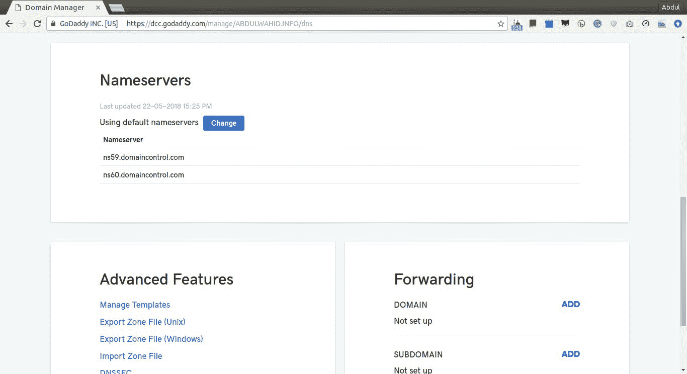

# 第八章：带 SSL 的自定义域

在本章中，我们将为上一章开发的报价应用程序配置自定义域。配置自定义域是将应用程序移动到生产环境的重要部分，因为它是无服务器的。这个过程涉及多个操作，与传统的 Apache 或 NGINX 配置不同。我们将查看已部署在无服务器基础架构中的报价应用程序。

本章我们将涵盖的主题包括：

+   使用 AWS Route53 配置自定义域

+   使用 Amazon 证书管理器生成 SSL 证书

+   使用 Zappa 集成自定义域

# 技术要求

在开始本章之前，有一些先决条件需要满足。我们将使用一些 AWS 服务和一个真实的域名。因此，您将需要以下内容：

+   Ubuntu 16.04/Windows/macOS

+   Pipenv 工具

+   Zappa 和其他 Python 开发包

+   注册域名

+   AWS 账户

我们将使用一些 Python 包，这些包在后面的部分中提到。除了开发环境，您还需要拥有自己注册的域名和更新其默认域名服务器的权限。让我们转到下一节，在那里我们将探索与 AWS Route 53 的域名服务器配置。

# 使用 AWS Route 53 配置自定义域

为我们的应用程序创建自定义域需要拥有一个域。域名可以从域名注册商那里购买。在我们的情况下，我从**GoDaddy**([`in.godaddy.com/`](https://in.godaddy.com/))，这个**域名系统**(**DNS**)服务提供商那里购买了一个名为`abdulwahid.info`的域名。

每个域通过 DNS 服务提供商管理的域名服务器在互联网上提供服务。有许多服务提供商提供服务，可以从他们的端口管理和托管网站。我们将使用 AWS Route 53 服务。

# 什么是 AWS Route 53？

AWS Route 53 是一种可扩展的云 DNS 网络服务。Route 53 在配置与任何 AWS 服务的域名方面非常有效。它连接到在 AWS 上运行的基础架构以及 AWS 之外的基础架构。Route 53 提供各种路由，如基于延迟的路由、地理 DNS、地理近似和加权轮询。所有这些路由可以组合在一起，以提供低延迟带宽。Route 53 还提供域名注册服务。如果我们在 AWS Route 53 上注册域名，那么我们就不需要管理 DNS 配置。所有 DNS 配置将自动使用 AWS 服务。

但我们没有在 Route 53 上注册我们的域，所以我们需要用 Route 53 替换默认的 GoDaddy 域名服务器。在下一节中，我们将讨论如何更改域名服务器。

# 将域名服务器更改为 Route 53

我们将把现有域的控制权转移到 Route 53。这个过程需要将域名`abdulwhaid.info`的默认域名服务器更改为 Route 53 创建的新域名服务器。

参考 AWS 官方文档([`docs.aws.amazon.com/Route53/latest/DeveloperGuide/CreatingHostedZone.html`](https://docs.aws.amazon.com/Route53/latest/DeveloperGuide/CreatingHostedZone.html))关于在不同的注册商上为 Route 53 配置现有域名创建托管区域，执行以下步骤：

1.  登录 AWS 控制台，在[`console.aws.amazon.com/route53/.`](https://console.aws.amazon.com/route53/)打开 Route 53 控制台

1.  如果您是 Route 53 的新用户，请在 DNS 管理下选择立即开始**。**

1.  如果您已经使用 Route 53，请在左侧导航窗格中选择托管区域，如下面的屏幕截图所示：


1.  现在，从托管区域页面，点击使用域`abdulwahid.info`创建托管区域，如下面的屏幕截图所示：


1.  一旦您为域名 `abdulwahid.info` 创建了托管区域，Route 53 将创建两个记录，**域名服务器** (**NS**) 和 **授权起始** (**SOA**)，如下截图所示：


1.  现在，我们需要使用 NS 记录并替换在域名注册商（即 GoDaddy）生成的默认 NS 记录，在那里我们创建了域名 `abdulwahid.info`。以下是默认 NS 记录的截图：



1.  将默认 NS 更改为自定义，并输入在 Route 53 生成的 NS 记录，如下截图所示：


1.  单击保存，我们完成了。现在需要一些时间由域名注册商处理。您将收到来自域名注册商的确认电子邮件。

Route 53 通过特定域名的托管区域管理路由流量。托管区域就像一个容器，包含有关域名的信息，并知道如何在互联网上路由流量。

一旦您收到确认电子邮件，域名 `abdulwahid.info` 将由 Route 53 管理。让我们转到下一节，了解如何使用 AWS 证书管理器配置 SSL 证书。

# 使用 AWS 证书管理器生成 SSL 证书

SSL 为您的 Web 服务器和应用程序用户提供安全性。借助 SSL，您可以防止黑客对在 Web 服务器和浏览器之间通信的数据进行攻击。在将 SSL 安全性应用到我们的应用程序之前，让我们了解一些关于 SSL 的基本方法。

# SSL 是什么？

**SSL** (**安全套接字层**) 是一种标准的安全协议，用于通过加密数据保护 Web 服务器和浏览器之间的通信。SSL 将确保从浏览器传输到您的 Web 服务器的数据是加密的。为了创建 SSL 连接，我们需要生成 SSL 证书并配置我们的 Web 服务器以在 SSL 层下提供服务。下一节将讨论 SSL 证书。

# 什么是 SSL 证书？

为了创建 SSL 连接，我们需要一个 SSL 证书。SSL 证书可以从 **证书颁发机构** (**CA**) 生成。在生成证书之前，我们需要提供有关我们的网站和业务详细信息。根据这些信息，将生成两个加密密钥：公钥和私钥。

现在，使用公钥和业务详细信息，我们需要与 CA 处理一个 **证书签名请求** (**CSR**)。一旦 CA 成功授权我们的详细信息，它将颁发与我们的私钥匹配的 SSL 证书。

现在，我们准备为我们的应用程序配置 SSL 证书。这是生成 SSL 证书的传统方式。但是我们将使用 Amazon 证书管理器来生成 SSL 证书。

# 使用 Amazon 证书管理器 (ACM) 生成 SSL 证书

有几种生成 SSL 证书的方法。以下是一些获取应用程序的 SSL/TSL 证书的方法：

+   您可以从 SSL 证书颁发机构购买 SSL 证书。

+   您可以通过使用 **Let's Encrypt** ([`letsencrypt.org/`](https://letsencrypt.org/)) 自行生成免费的 SSL/TSL 证书。Let's Encrypt 是一个提供免费 SSL/TSL 证书的开放式证书颁发机构。

+   您可以使用 **AWS 证书管理器** (**ACM**) 生成 SSL。我们将使用 ACM 为我们的应用程序生成 SSL 证书。

ACM 是一个管理和创建 AWS 服务和应用程序的 SSL/TSL 证书的服务。ACM 证书适用于多个域名和子域名。您还可以使用 ACM 创建通配符 SSL。

ACM 严格与 **AWS 证书管理器私有证书颁发机构** (**ACM PCA**) 相关联。ACM PCA 负责验证域名授权并颁发证书。

现在，我们将为我们的域和子域生成一个 ACM 证书。按照以下步骤创建 ACM 证书：

请注意，API Gateway 仅支持来自一个地区的 ACM 证书。因此，我们将使用**US East**地区。您可以在[`github.com/Miserlou/Zappa/pull/1142`](https://github.com/Miserlou/Zappa/pull/1142)上阅读更多信息。

1.  登录 AWS 控制台，在[`ap-south-1.console.aws.amazon.com/acm`](https://ap-south-1.console.aws.amazon.com/acm)打开 ACM 控制台。

1.  如果您是 AWS ACM 的新用户，请在“Provision certificates”下点击“Get Started”，如果您已经在使用 AWS ACM，请选择“Request a certificate”，如下面的截图所示：


在这里，我们将选择请求公共证书。

您可以在[`docs.aws.amazon.com/acm/latest/userguide/gs-acm-request-public.html`](https://docs.aws.amazon.com/acm/latest/userguide/gs-acm-request-public.html)上阅读更多关于公共证书的信息。

1.  在下一页，您需要提供您的域名的详细信息。我们将使用通配符(*)作为子域名来针对我们的域请求一个通配符证书。因此，这个证书可以用来保护同一域名下的多个站点。以下是添加域名的截图：


1.  在下一页，您需要选择验证方法。有两种类型的方法可用，如下所示：

+   **DNS 验证：**此方法需要修改证书中域的 DNS 记录的权限，以便它可以直接验证记录集。

+   **电子邮件验证：**如果您没有权限修改 DNS 记录，则可以使用此方法。因此，您可以使用与域名注册商记录的注册电子邮件来验证域。

我们将使用 DNS 验证方法。这是因为我们拥有 Route 53 托管区中的 DNS 访问权限，这是因为在域名注册商处有映射的域名服务器。DNS 验证很简单。请看下面的截图：


1.  现在，我们已经准备好了。点击“Review”将显示所选的配置，如下面的截图所示：


1.  一旦您从“Review”页面点击“确认并请求”，您需要完成验证过程。下面的截图显示验证状态为待定，因此我们需要通过展开域部分来执行验证：


1.  展开域部分后，您将看到一些完成验证过程的说明。我们选择了 DNS 验证方法。因此，这种方法需要向 DNS 配置添加一个 CNAME 记录。根据下面的截图，您可以通过点击“在 Route 53 中创建记录”按钮来执行更新 DNS 配置的操作，以给定的 CNAME：


1.  一旦您点击了在 Route 53 中创建记录，它将弹出一个确认弹窗，显示 CNAME 记录，如下面的截图所示：


1.  点击“创建”按钮后，它会自动使用给定的 CNAME 记录更新 Route 53 中的 DNS 配置。您将看到成功消息，如下面的截图所示：


1.  点击“继续”，我们完成了。您将被重定向到证书仪表板页面，如下面的截图所示：


ACM CA 已成功为您的域颁发了 SSL 证书。正如您所看到的，绿色状态中显示了“已颁发”。现在，是时候配置域和证书与我们的应用程序了。在下一节中，我们将使用我们的报价 API 应用程序配置一个子域与已颁发的 SSL 证书。

# 使用 Zappa 集成自定义域

Zappa 支持自定义域名和子域集成与 SSL 证书。我们已经在前几节中讨论了 SSL/TSL 证书生成的来源。Zappa 可以使用以下 CA 部署域：

+   您自己从证书颁发机构提供商购买的 SSL

+   Let's Encrypt

+   AWS

您可以在以下链接中阅读有关使用上述 CA 部署域的更多详细信息：[`github.com/Miserlou/Zappa#ssl-certification`](https://github.com/Miserlou/Zappa#ssl-certification)。

我们将使用 AWS 证书颁发机构 SSL 证书。我们已经在上一节中生成了 ACM 证书。现在是时候将 ACM 证书与我们的应用程序的子域集成了。

让我们转到下一节，在那里我们将使用子域和 ACM 证书配置我们的报价 API 应用程序。

# 使用 ACM 证书部署到域

由于我们已经颁发了 ACM 证书，现在让我们将应用程序配置到所需的域并执行部署过程。Zappa 提供了一个`domain`属性来配置应用程序的域名和`certificate_arn`用于 ACM 证书。您需要在`zappa_settings.json`中配置这两个属性。

在此之前，我们需要获取`certificate_arn`的值，因为它是 ACM 为我们颁发证书的域生成的**ARN**（**Amazon 资源名称**）。您可以从 ACM 仪表板中展开域部分获取 ARN 的值，如下截图所示：


```py
zappa_settings.json.
```

文件—`zappa_settings.json`:

```py
{
    "dev": {
        "app_function": "resources.api",
        "aws_region": "ap-south-1",
        "profile_name": "default",
        "project_name": "chapter-8",
        "runtime": "python3.6",
        "s3_bucket": "zappa-0edixmwpd",
        "remote_env": "s3://book-configs/chapter-7-config.json",
        "cache_cluster_enabled": false,
        "cache_cluster_size": 0.5,
        "cache_cluster_ttl": 300,
        "cache_cluster_encrypted": false,
        "events": [{
           "function": "schedulers.set_quote_of_the_day",
           "expression": "cron(0 12 * * ? *)"
       }],
       "domain": "quote.abdulwahid.info",
 "certificate_arn":"arn:aws:acm:us-east-1:042373950390:certificate/af0796fa-3a46-49ae-97d8-90a6b5ff6784"
    }
}
```

在这里，我们将域配置为`quote.abdulwahid.info`并设置`certificate_arn`。现在，让我们使用`zappa deploy <stage_name>`命令部署应用程序，因为我们是第一次部署应用程序。看一下以下代码：

```py
$ zappa deploy dev
Important! A new version of Zappa is available!
Upgrade with: pip install zappa --upgrade
Visit the project page on GitHub to see the latest changes: https://github.com/Miserlou/Zappa
Calling deploy for stage dev..
Downloading and installing dependencies..
 - sqlite==python36: Using precompiled lambda package
Packaging project as zip.
Uploading chapter-7-dev-1529679507.zip (5.9MiB)..
100%|███████████████████████████████████████████████████████████████████████████████████████████████████████████████████████████████████████████████████████████████████████████████████████| 6.17M/6.17M [00:02<00:00, 2.27MB/s]
Scheduling..
Scheduled chapter-7-dev-schedulers.set_quote_of_the_day with expression cron(0 12 * * ? *)!
Scheduled chapter-7-dev-zappa-keep-warm-handler.keep_warm_callback with expression rate(4 minutes)!
Uploading chapter-7-dev-template-1529679513.json (1.6KiB)..
100%|███████████████████████████████████████████████████████████████████████████████████████████████████████████████████████████████████████████████████████████████████████████████████████| 1.62K/1.62K [00:00<00:00, 4.76KB/s]
Waiting for stack chapter-7-dev to create (this can take a bit)..
100%|█████████████████████████████████████████████████████████████████████████████████████████████████████████████████████████████████████████████████████████████████████████████████████████████| 4/4 [00:09<00:00, 2.66s/res]
Deploying API Gateway..
Deployment complete!: https://5phr2bp4id.execute-api.ap-south-1.amazonaws.com/dev
```

如您所见，应用程序已部署在随机生成的 API 端点上。但是，为了配置应用程序，我们需要使用`zappa certify`命令将 API 网关与 ACM 证书关联起来，如下日志片段所示：

```py
$ zappa certify
Calling certify for stage dev..
Are you sure you want to certify? [y/n] y
Certifying domain quote.abdulwahid.info..
Created a new domain name with supplied certificate. Please note that it can take up to 40 minutes for this domain to be created and propagated through AWS, but it requires no further work on your part.
Certificate updated!
```

一旦运行`zappa certify`命令，它将创建并将 API 网关与配置的证书关联起来。

现在，让我们再次更新部署，使用`zappa update <stage_name>`命令，如下所示。

```py
$ zappa update dev
Important! A new version of Zappa is available!
Upgrade with: pip install zappa --upgrade
Visit the project page on GitHub to see the latest changes: https://github.com/Miserlou/Zappa
Calling update for stage dev..
Downloading and installing dependencies..
 - sqlite==python36: Using precompiled lambda package
Packaging project as zip.
Uploading chapter-7-dev-1529679710.zip (5.9MiB)..
100%|████████████████████████████████████████████████████████████████████████████████████████████████████████████████████████████████████████████████████████████████████████████████████████| 6.17M/6.17M [00:03<00:00, 863KB/s]
Updating Lambda function code..
Updating Lambda function configuration..
Uploading chapter-7-dev-template-1529679717.json (1.6KiB)..
100%|███████████████████████████████████████████████████████████████████████████████████████████████████████████████████████████████████████████████████████████████████████████████████████| 1.62K/1.62K [00:00<00:00, 6.97KB/s]
Deploying API Gateway..
Scheduling..
Unscheduled chapter-7-dev-schedulers.set_quote_of_the_day.
Unscheduled chapter-7-dev-zappa-keep-warm-handler.keep_warm_callback.
Scheduled chapter-7-dev-schedulers.set_quote_of_the_day with expression cron(0 12 * * ? *)!
Scheduled chapter-7-dev-zappa-keep-warm-handler.keep_warm_callback with expression rate(4 minutes)!
Your updated Zappa deployment is live!: https://quote.abdulwahid.info (https://5phr2bp4id.execute-api.ap-south-1.amazonaws.com/dev)
```

就是这样。正如您所看到的，我们的应用程序现在在`https://quote.abdulwahid.info`上运行。现在，让我们在下一节中查看执行情况。

# 使用配置的域执行应用程序

我们已经在无服务器基础架构上部署和配置了我们的报价 API 应用程序。让我们使用 Postman API 客户端查看 API 执行。

# 每日报价 API

我们设计了这个 API（`https://quote.abdulwahid.info/quote?type=daily`）以每天返回一条报价。我们配置的调度程序将每天更新 UTC 时间表。看一下以下 cURL 日志片段：

```py
$ curl https://quote.abdulwahid.info/quote?type=daily
{"quote": "Many wealthy people are little more than janitors of their possessions.", "author": "Frank Lloyd Wright", "category": "Famous"}
```

# 随机报价 API

随机报价 API（`https://quote.abdulwahid.info/quote?type=random`）将在每次请求时返回一条随机报价。看一下以下 cURL 日志片段：

```py
$ curl https://quote.abdulwahid.info/quote?type=random
{"quote": "My mother thanks you. My father thanks you. My sister thanks you. And I thank you.", "author": "Yankee Doodle Dandy", "category": "Movies"}
```

就是这样。我们已成功在无服务器架构上部署了我们的应用程序。我们还配置了自定义域与我们的应用程序。这将用于测试目的。

# 总结

在本章中，我们学习了如何创建自定义域并配置域与 Route 53 集成。使用 Route 53，我们管理了域 DNS 配置。为了生成 SSL 证书，我们使用了 ACM，这很容易且直接。随后，我们使用生成的 ACM 证书的 ARN 配置了 Zappa 与域的集成。希望本章能帮助您了解为应用程序配置自定义域的机制。

现在我们要学习更多关于在 AWS Lambda 上安排任务和异步执行方法的知识。我们将进一步完善报价 API 应用程序，加入移动订阅模型。让我们为下一章做好准备，深入探讨使用 AWS Lambda 进行异步操作的世界。

# 问题

1.  AWS Route 53 是什么？

1.  域名服务器是什么意思？

1.  ACM 如何保护在 AWS Lambda 上托管的 API？
