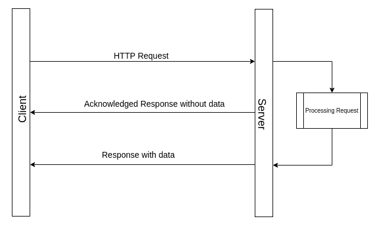
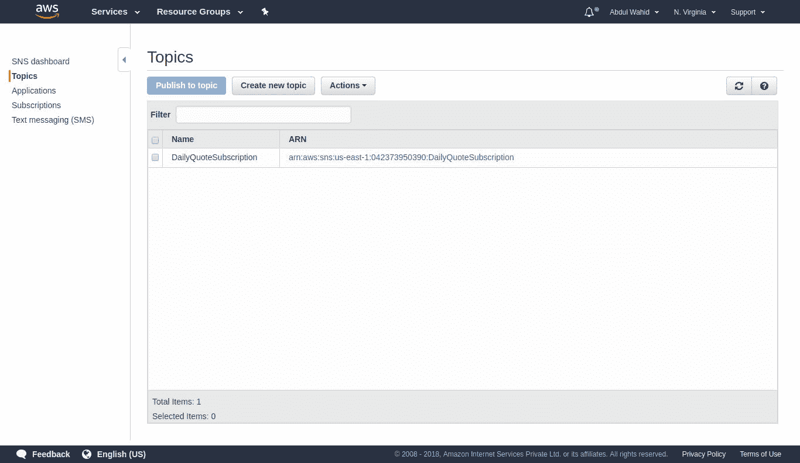
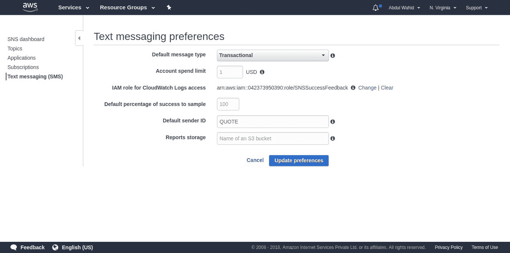
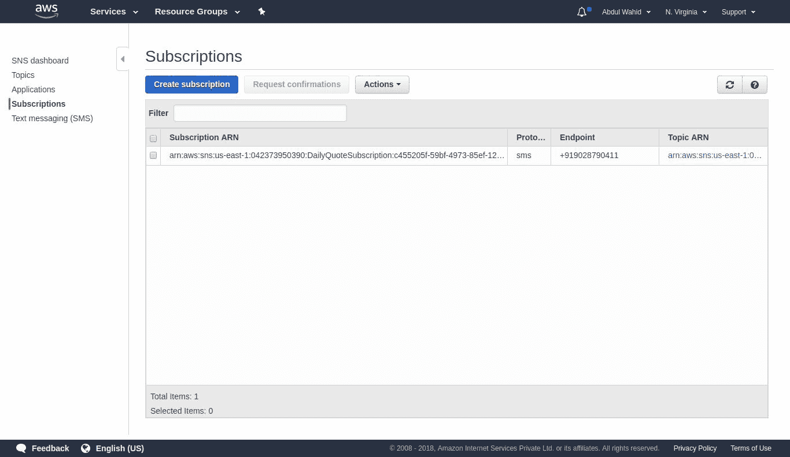
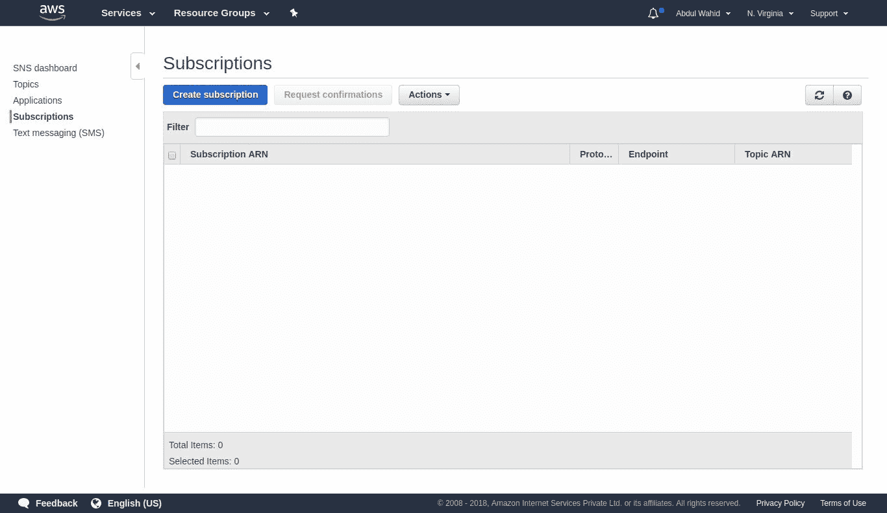

# 第九章：AWS Lambda 上的异步任务执行

在本章中，我们将介绍 AWS Lambda 上的异步任务执行。AWS Lambda 使自动缩放和异步执行变得非常容易实现。Zappa 可以帮助我们配置任务，以便它们在 AWS Lambda 上以异步方式执行。Zappa 实现了管理异步任务响应的功能。

本章我们将涵盖以下主题：

+   异步执行

+   使用 Zappa 进行 AWS Lambda 异步调用

+   使用异步功能配置 Quote API 应用程序

+   使用 Zappa 部署和执行 Quote API

# 技术要求

在开始本章之前，请确保满足应用程序的先决条件。以下是您需要满足的技术要求：

+   Ubuntu 16.04/Windows/macOS

+   Python3.6

+   Pipenv 工具

+   猎鹰框架

+   Zappa

+   注册域名

+   AWS 账户

本章增强了第八章中开发的应用程序，*带 SSL 的自定义域*。因此，一些要求可以从先前配置的先决条件中使用。让我们继续学习 AWS Lambda 中的异步执行。

# 异步执行

异步执行在开发高性能和优化的应用程序中起着重要作用。AWS Lambda 支持异步执行。有不同的方法来以异步模式执行 AWS Lambda 函数。

# 理解异步执行

**异步执行** 是在不阻塞用户干预的情况下执行特定代码块的过程。为了更好地理解它，考虑 jQuery Ajax 机制发送异步请求到服务器，而不会阻塞用户，并在回调方法中捕获成功响应或错误响应。看一下以下图表，以更好地理解：



现在，您可以看到，一旦服务器从客户端获得异步请求，服务器立即返回确认的响应。一旦请求处理完成，将返回成功或失败的响应；否则，将不返回任何内容。

异步方法是否返回响应取决于要求。我们可能需要或不需要返回响应。如果我们希望返回响应，那么应该有一种机制来处理或捕获客户端端的响应。

类似地，AWS Lambda 函数可以以异步方式执行，这样我们就不会阻塞用户干预等待返回响应。有一些用例需要捕获以异步方式执行的 AWS Lambda 函数的响应。我们将在接下来的部分讨论捕获响应。

让我们看看 AWS Lambda 如何异步执行。

# 使用 Boto3 进行 AWS Lambda 异步执行

AWS Lambda 函数实际上就是云中的一个函数（一段代码）。函数可以同步或异步调用。为了在任何编程语言中实现异步执行，我们可以在单独的线程或进程中执行函数。例如，在 Python 中，有各种库可用于实现异步执行。同样，AWS Lambda 很好地支持异步执行。

让我们看一下以下代码片段：

```py
client = boto3.client('lambda')
response = client.invoke(
    FunctionName='string',
    InvocationType='Event'|'RequestResponse'|'DryRun',
    LogType='None'|'Tail',
    ClientContext='string',
    Payload=b'bytes'|file,
    Qualifier='string'
)
```

我们可以使用 Boto3 库调用 AWS Lambda 函数。上面的代码是 Lambda 客户端 `invoke` 方法的语法。您可以在 Boto3 的官方文档中了解更多关于 `invoke` 方法机制的信息：[`boto3.readthedocs.io/en/latest/reference/services/lambda.html#Lambda.Client.invoke`](http://boto3.readthedocs.io/en/latest/reference/services/lambda.html#Lambda.Client.invoke)。

Boto3 是一个组织良好、维护良好的 Python AWS SDK。它帮助开发人员使用 Python 与 AWS 服务进行交互。Zappa 也使用 Boto3 与 AWS 服务进行交互。

让我们简要解释一下`InvocationType`，它用于决定是以同步模式还是异步模式执行函数。如果您想以同步模式调用现有的 AWS Lambda 函数，那么可以选择`InvocationType`为`RequestResponse`，对于异步模式，可以选择`InvocationType`为`Event`。

以下代码是 Lambda 函数的异步执行示例：

```py
client = boto3.client('lambda')
response = client.invoke(
    FunctionName='MyFunction',
    InvocationType='Event'
)
```

就是这样。这将以异步模式调用 Lambda 函数。借助 Boto3，您可以异步执行 AWS Lambda 函数。现在让我们看看如何使用 Zappa 执行异步执行。

# AWS Lambda 使用 Zappa 进行异步调用

AWS Lambda 函数只是部署在 AWS Lambda 容器中的函数。因此，执行它只是调用一个函数。AWS 提供了各种调用方法。如何集成和配置调用以实现异步执行完全取决于您。我们已经在上一节中看到了如何使用 Boto3 SDK 进行异步执行。现在，我们将探索 Zappa 提供的各种调用方式。

# 使用任务装饰器进行异步 AWS Lambda 调用

Zappa 提供了一种超级简单的方式来配置 Lambda 执行为异步模式。Zappa 使用名为`zappa.async.task`的装饰器方法实现了异步执行。这个装饰器可以用于我们想要以异步模式执行的任何函数。以下是来自 Zappa 官方 GitHub 页面的示例（[`github.com/Miserlou/Zappa#asynchronous-task-execution`](https://github.com/Miserlou/Zappa#asynchronous-task-execution)）：

```py
from flask import Flask
from zappa.async import task
app = Flask(__name__)

@task
def make_pie():
    """ This takes a long time! """
    ingredients = get_ingredients()
    pie = bake(ingredients)
    deliver(pie)

@app.route('/api/order/pie')
def order_pie():
    """ This returns immediately! """
    make_pie()
    return "Your pie is being made!"
```

正如您所看到的，我们在`make_pie`方法上使用了`task`装饰器。现在，当您调用 API 时，它将立即返回响应，并以异步模式执行`make_pie`方法。以异步方式执行`make_pie`只是实例化具有`make_pie`方法执行上下文的 AWS Lambda 实例。这就是您可以异步执行函数的方式。现在，另一个挑战是收集异步执行函数的响应。我们将在接下来的部分讨论这个问题。

# Amazon SNS 作为任务来源

**Amazon Simple Notification Service**（**SNS**）是一种托管的发布/订阅消息服务。它支持各种协议，如 HTTP、HTTPS、电子邮件、电子邮件-JSON、Amazon SQS、应用程序、AWS Lambda 和短信。我们可以通过任何这些协议创建主题和订阅，尽管我们可以使用 AWS SNS 通过其 Web 控制台执行发布/订阅操作。

我们已经通过 API Gateway 调用了 AWS Lambda，这是我们所有实现的 API 都在工作的方式。同样，我们可以订阅我们的 AWS Lambda 与 Amazon SNS 的特定主题。现在，每当在该主题上发布任何消息时，它也会调用订阅的 AWS Lambda。

```py
task_sns decorator binding:
```

```py
from zappa.asycn import task_sns

@task_sns
def method_to_invoke_from_sns_event():
    pass

```

您还需要在`zappa_settings.json`文件中更新以下设置：

```py
{
  "dev": {
    ..
      "async_source": "sns",
      "async_resources": true,
    ..
    }
}
```

当您调用`zappa schedule`命令时，它将自动创建并订阅 SNS。通过 SNS 主题发布的任何消息都会创建一个唯一的消息 ID。因此，您可以使用生成的消息 ID 在 CloudWatch 日志中跟踪消息响应。

此功能使您能够使用 Lambda 调用来执行基于 SNS 事件的操作。例如，您可以使用它来开发一个**一次性密码**（**OTP**）生成应用程序，其中您不需要持久化 OTP 数据。相反，它将被发布到特定主题，订阅者将获得该信息。最后，AWS Lambda 和手机号码可以订阅 AWS SNS 主题。这将调用 AWS Lambda 方法，并使用 SNS 主题上发布的消息上下文。

让我们在下一节中看一下直接调用方法。

# 直接调用

Zappa 提供了另一种执行 Lambda 函数的直接调用的机制。以前，我们一直在使用`task`和`task_sns`装饰器，但现在我们将使用`zappa.async.run`方法来执行直接调用。

```py
zappa.async.run method being used:
```

```py
from zappa.async import run

# Invoking a method in async mode using Lambda
run(method_name_to_invoke, args, kwargs)

# Invoking a method in async mode using SNS
run(method_name_to_invoke, args, kwargs, service="sns")
```

此功能将帮助您根据您的要求动态配置`async`调用。装饰器任务方法从编译中固定，但此方法语句可以在运行时有条件地调用。

# 远程调用

默认情况下，Zappa 执行当前 Lambda 实例的直接调用方法。但是，如果您希望在不同区域上将 Lambda 调用作为单独的 Lambda 函数执行，则可以更新您的任务装饰器，如下面的代码片段所示：

```py
@task(remote_aws_lambda_function_name='subscribe-mobile-prod', remote_aws_region='us-east-1')
def subscribe_mobile_number(*args, **kwargs):
   """ This may take a long time! """
   validate(kwargs.get("mobile"))
   add_subscription(mobile=kwargs.get("mobile"))
```

我们正在使用`task`装饰器，但带有额外的参数，例如**`remote_aws_lambda_function_name`**和**`remote_aws_region`**。这些参数说明在特定区域执行特定 Lambda 函数。这就是您可以执行**远程调用**的方式。

让我们通过这些不同类型的调用来增强 Quote API 应用程序，以实现异步执行。

# 配置带有异步功能的 Quote API 应用程序

在上一章中，我们创建了一个 Quote API 并配置了自定义域。现在我们将增强和优化现有的应用程序。我们将添加一些新功能到应用程序中，以演示不同类型的调用。

我们将使用现有的代码库作为一个不同的项目，因此最好将现有的代码库复制到一个新目录中；在我们的情况下，我们将`Chapter08`代码库复制为`Chapter09`；但是，您需要更新`zappa_settings.json`文件。在即将到来的部分中，我们将介绍 Zappa 设置更改。

# 使用 Amazon SNS 进行每日报价的短信订阅

我们将添加每日接收报价的短信订阅的新功能。这将要求我们使用 Boto3 库配置 Amazon SNS。Boto3 是一个完整的 Python SDK 库，使我们能够以编程方式与 AWS 服务进行交互。让我们继续并在下一节中配置 Amazon SNS。

# 使用 Boto3 配置 Amazon SNS

您需要满足先决条件并遵循上一章中详细说明的安装说明，其中我们使用 Boto3 和其他所需的库配置了环境。假设您已经配置了环境，我现在将继续探索配置。

让我们来看一下以下代码片段：

```py
client = boto3.client('sns',
            aws_access_key_id= os.environ['aws_access_key_id'],
            aws_secret_access_key= os.environ['aws_secret_access_key'],
            region_name= 'us-east-1')
```

正如您所看到的，我们正在使用 Boto3 创建 Amazon SNS 的客户端对象。我们需要访问密钥凭据以便以编程方式获取访问权限。

这是与 Amazon SNS 连接时的重要步骤。一旦成功创建了`client`对象，您可以执行各种操作，例如创建主题，使用协议订阅服务以及在主题上发布消息。

让我们朝着使用 Amazon SNS 实现短信订阅的实际实现迈进。

# 实现短信订阅功能

```py
models.py class with along with OTPModel class:
```

```py
import os
import datetime
from shutil import copyfile
from peewee import *

# Copy our working DB to /tmp..
db_name = 'quote_database.db'
src = os.path.abspath(db_name)
dst = "/tmp/{}".format(db_name)
copyfile(src, dst)

db = SqliteDatabase(dst)

class QuoteModel(Model):

    class Meta:
        database = db

    id = IntegerField(primary_key= True)
    quote = TextField()
    author = CharField()
    category = CharField()
    created_at = DateTimeField(default= datetime.date.today())

class OTPModel(Model):

    class Meta:
        database = db

    id = IntegerField(primary_key= True)
    mobile_number = CharField()
    otp = IntegerField()
    is_verified = BooleanField(default=False)
    created_at = DateTimeField(default= datetime.date.today())

db.connect()
db.create_tables([QuoteModel, OTPModel])
QuoteSubscription class.
```

文件-`sns.py`：

```py
import os
import re
import boto3

class QuoteSubscription:

    def __init__(self):
        """
        Class constructor to initialize the boto3 configuration with Amazon SNS.
        """
        self.client = boto3.client(
            'sns',
            aws_access_key_id=os.environ['aws_access_key_id'],
            aws_secret_access_key=os.environ['aws_secret_access_key'],
            region_name='us-east-1')
        topic = self.client.create_topic(Name="DailyQuoteSubscription")
        self.topic_arn = topic['TopicArn']

    def subscribe(self, mobile):
        """
        This method is used to subscribe a mobile number to the Amazon SNS topic.
        Required parameters:
            :param mobile: A mobile number along with country code.
            Syntax - <country_code><mobile_number>
            Example - 919028XXXXXX
        """
        assert(bool(re.match("^(\+\d{1,3}?)?\d{10}$", mobile))), 'Invalid mobile number'
        self.client.subscribe(
            TopicArn=self.topic_arn,
            Protocol='sms',
            Endpoint=mobile,
        )

    def unsubscribe(self, mobile):
        """
        This method is used to unsubscribe a mobile number from the Amazon SNS topic.
        Required parameters:
            :param mobile: A mobile number along with country code.
            Syntax - <country_code><mobile_number>
            Example - 919028XXXXXX
        """
        assert(bool(re.match("^(\+\d{1,3}?)?\d{10}$", mobile))), 'Invalid mobile number'
        try:
            subscriptions = self.client.list_subscriptions_by_topic(TopicArn=self.topic_arn)
            subscription = list(filter(lambda x: x['Endpoint']==mobile, subscriptions['Subscriptions']))[0]
            self.client.unsubscribe(
                SubscriptionArn= subscription['SubscriptionArn']
            )
        except IndexError:
            raise ValueError('Mobile {} is not subscribed.'.format(mobile))

    def publish(self, message):
        """
        This method is used to publish a quote message on Amazon SNS topic.
        Required parameters:
            :param message: string formated data.
        """
        self.client.publish(Message=message, TopicArn=self.topic_arn)

    def send_sms(self, mobile_number, message):
        """
        This method is used to send a SMS to a mobile number.
        Required parameters:
            :param mobile_number: string formated data.
            :param message: string formated data.
        """
        self.client.publish(
            PhoneNumber=mobile_number,
            Message=message
        )
```

这个类有一个用于执行移动号码订阅功能的方法。为了演示异步执行，我们将明确编写一些函数，这些函数将使用`QuoteSubscription`功能。

让我们创建一个名为`async.py`的文件，其中包含以下代码片段：

```py
import random
from zappa.async import task
from sns import QuoteSubscription
from models import OTPModel

@task
def async_subscribe(mobile_number):
    quote_subscription = QuoteSubscription()
    quote_subscription.subscribe(mobile=mobile_number)

@task
def async_unsubscribe(mobile_number):
    quote_subscription = QuoteSubscription()
    quote_subscription.unsubscribe(mobile=mobile_number)

@task
def async_publish(message):
    quote_subscription = QuoteSubscription()
    quote_subscription.publish(message=message)

@task
def async_send_otp(mobile_number):
    otp = None
    quote_subscription = QuoteSubscription()
    data = OTPModel.select().where(OTPModel.mobile_number == mobile_number, OTPModel.is_verified == False)
    if data.exists():
        data = data.get()
        otp = data.otp
    else:
        otp = random.randint(1000,9999)
        OTPModel.create(**{'mobile_number': mobile_number, 'otp': otp})
    message = "One Time Password (OTP) is {} to verify the Daily Quote subscription.".format(otp)
    quote_subscription.send_sms(mobile_number=mobile_number, message=message)
```

正如您所看到的，我们定义了这些方法并添加了`@task`装饰器。在本地环境中，它将以正常方法执行，但在 AWS Lambda 上下文中，它将以异步模式执行。

让我们移动到资源 API 实现。我们将稍微修改现有资源。将会有一些与短信订阅相关的新 API。

文件-`resources.py`：

```py
import os
import re
import datetime
import requests
import falcon
import boto3

from models import QuoteModel, OTPModel
from mashape import fetch_quote
from async import async_subscribe, async_unsubscribe, async_send_otp

class DailyQuoteResource:
    def on_get(self, req, resp):
        """Handles GET requests"""
        try:
            data = QuoteModel.select().where(QuoteModel.created_at == datetime.date.today())
            if data.exists():
                data = data.get()
                resp.media = {'quote': data.quote, 'author': data.author, 'category': data.category}
            else:
                quote = fetch_quote()
                QuoteModel.create(**quote)
                resp.media = quote
        except Exception as e:
            raise falcon.HTTPError(falcon.HTTP_500, str(e))

class SubscribeQuoteResource:
    def on_get(self, req, resp):
        """Handles GET requests"""
        try:
            mobile_number = '+{}'.format(req.get_param('mobile'))
            otp = req.get_param('otp')
            otp_data = OTPModel.select().where(OTPModel.mobile_number == mobile_number, OTPModel.otp == otp, OTPModel.is_verified == False)
            if mobile_number and otp_data.exists():
                otp_data = otp_data.get()
                otp_data.is_verified = True
                otp_data.save()
                async_subscribe(mobile_number)
                resp.media = {"message": "Congratulations!!! You have successfully subscribed for daily famous quote."}
            elif mobile_number and not otp_data.exists():
                async_send_otp(mobile_number)
                resp.media = {"message": "An OTP verification has been sent on mobile {0}. To complete the subscription, Use OTP with this URL pattern https://quote-api.abdulwahid.info/subscribe?mobile={0}&otp=xxxx.".format(mobile_number)}
            else:
                raise falcon.HTTPError(falcon.HTTP_500, 'Require a valid mobile number as a query parameter. e.g https://<API_ENDPOINT>/subscribe?mobile=XXXXXXX')
        except Exception as e:
            raise falcon.HTTPError(falcon.HTTP_500, str(e))

class UnSubscribeQuoteResource:
    def on_get(self, req, resp):
        """Handles GET requests"""
        try:
            mobile_number = '+{}'.format(req.get_param('mobile'))
            if mobile_number:
                async_unsubscribe(mobile_number)
                resp.media = {"message": "You have successfully unsubscribed from daily famous quote. See you again."}
        except Exception as e:
            raise falcon.HTTPError(falcon.HTTP_500, str(e))

api = falcon.API()
api.add_route('/daily', DailyQuoteResource())
api.add_route('/subscribe', SubscribeQuoteResource())
api.add_route('/unsubscribe', UnSubscribeQuoteResource())
```

在这里，我们使用了资源类创建了一些 API，如前面的代码片段中所述。每个资源类代表一个单独的 API 端点。因此，我们创建了三个 API 端点，每个端点都有自己的工作流执行和用法。

让我们按照以下方式探索每个 API 端点的用法：

+   `/daily`：此 API 端点旨在返回每日报价数据。

+   `/subscribe`：此 API 端点旨在订阅任何手机号以获取每日报价短信。在订阅任何手机号之前，它实现了一种 OTP 验证。因此，它遵循执行订阅操作的 URL 模式。订阅需要两个步骤，例如生成订阅的 OTP，然后验证 OTP 以确认订阅。要生成订阅的 OTP，您需要使用带有`mobile`查询参数的 API，例如`http://localhost:8000/subscribe?mobile=919028XXXX`，要进行订阅确认，您需要使用带有`mobile`和`otp`参数的 API，例如`http://localhost:8000/subscribe?mobile=919028790411&otp=XXXX`。

+   `/unsubscribe`：此 API 端点旨在取消现有订阅的手机号。

API 查询参数已定义模式，因此您需要使用这些模式进行有效参数。对于 mobile 参数，您应该以`<country_code><mobile_number>`的格式发送手机号码。对于`opt`参数，您应该发送 4 位整数。

```py
SubscribeQuoteResource and UnSubscribeQuoteResource classes are using async methods to perform the mobile number subscription and unsubscription operations. This would all be executed in asynchronous mode on AWS Lamda.
```

现在让我们继续部署应用程序，然后我们将了解其执行过程。

# 使用 Zappa 部署和执行 Quote API

部署是任何 Web 应用程序的重要部分。我们有幸拥有 Zappa 和 AWS Lambda，它们为我们提供了无服务器的本质。由于我们正在增强上一章中创建的 Quote API 应用程序，因此根据我们当前的需求，将进行一些修改。

在接下来的部分中，我们将讨论 Zappa 设置的一些更改。

# 设置虚拟环境

如前所述，我们正在使用`Chapter08`代码库。在`zappa_settings.json`文件中需要进行一些修改，例如将`project_name`更改为`Chapter09`，如下面的代码片段所示：

```py
{
...
"project_name": "chapter-9"
...
}
```

一旦您更改了`project_name`，您需要使用`pipenv install`命令来配置虚拟环境。这将创建一个带有更改的`project_name`的新虚拟环境。

我们正在使用 Boto3 库与 Amazon SNS 进行交互。因此，我们还需要使用`pipenv install boto3`命令安装 Boto3。

# 设置环境变量

除了虚拟环境之外，我们还需要配置一些环境变量。我们正在使用 Mashape API（第三方 API 市场）和 Boto3 库。因此，我们将使用 Mashape API 密钥和我们的 AWS 访问凭据配置环境变量。

Zappa 提供了几种配置环境变量的机制。我们将使用`"remote_env"`。这种方法需要在 S3 存储桶上上传一个 JSON 文件。

以下是配置的 JSON 文件的代码片段：

```py
{
    "Mashape_API_Endpoint" : "https://XXXXXXXXXXXXXX",
    "X_Mashape_Key": "XXXXXXXXXXXXXXXXXXXXXXXXX",
    "aws_access_key_id" : "XXXXXXXXXXXXX",
    "aws_secret_access_key" :"XXXXXXXXXXXXXXXXXXXXXXXXXXXx"
}
```

一旦您将此文件上传到 S3 存储桶，您可以将此文件的 S3 路径用作`"remote_env"`的值，如下面的代码片段所示：

```py
{
...
"remote_env": "s3://book-configs/chapter-9-config.json",
...
}
```

Zappa 将根据此 JSON 文件自动设置环境变量。

AWS 和其他 API 凭据是机密和敏感数据；因此，您必须避免在公共 Git 存储库中提交这些数据。借助`remove_env`，您可以将凭据设置为 AWS Lambda 上的环境变量，并将其全部安全地保存在 S3 上。

# 添加具有 SSL 的自定义域

是时候为 Quote API 应用程序的增强版本配置特定的域了。Zappa 提供了一个名为`domain`的关键字，用于在文件设置中设置您的域名。

以下是配置域的代码片段：

```py
{
    ...
    "domain": "quote-api.abdulwahid.info",
    ...
}
```

一旦您配置了域名，就需要使用 SSL 证书对其进行认证。我们已经使用**Amazon Certificate Manager** (**ACM**)生成了通配符 SSL 证书。因此，我们将使用相同的 ACM ARN，如下面的代码所示：

```py
{
    ...
    "domain": "quote-api.abdulwahid.info",
    "certificate_arn":"arn:aws:acm:us-east-1:042373950390:certificate/af0796fa-3a46-49ae-97d8-90a6b5ff6784"
    ...
}
```

现在您需要运行`zappa certify`命令，以创建子域并配置证书。看一下以下日志片段：

```py
$ zappa certify
Calling certify for stage dev..
Are you sure you want to certify? [y/n] y
Certifying domain quote-api.abdulwahid.info..
Created a new domain name with supplied certificate. Please note that it can take up to 40 minutes for this domain to be created and propagated through AWS, but it requires no further work on your part.
Certificate updated!
```

如前面的日志片段所示，这个域名可能需要 40 分钟才能在 AWS 中创建和传播，但您无需再做任何工作。

让我们转到下一部分，在那里我们将为所有手机订阅者配置一个发布报价短信的事件。

# 安排事件发布短信

我们将每天向所有短信订阅者发送报价短信。短信订阅功能已经使用 Amazon SNS 和`QuoteSubscription`类实现。我们将在接下来的部分详细解释订阅工作流程。但在执行订阅之前，我们应该有一个配置和计划的事件，将在 SNS 主题上发布报价。

我们已经在`QuoteSubscription`构造函数中创建了 SNS 主题。此外，我们在`async.py`文件中编写了一个`async`方法`async_publish`。现在我们将使用这个方法异步发送报价消息。

为了保持模块化的代码库，我们创建了一个`schedulers.py`文件，将所有调度方法放在一个地方。

```py
schedulers.py:
```

```py
from models import QuoteModel
from mashape import fetch_quote
from sns import QuoteSubscription
from async import async_publish

def set_quote_of_the_day(event, context):
    QuoteModel.create(**fetch_quote())

def publish_quote_of_the_day(event, context):
    quote = fetch_quote()
    async_publish(message=quote['quote'])
```

正如我们在上一章中已经创建了一个调度方法`set_quote_of_the_day`，现在我们需要创建一个名为`publish_quote_of_the_day`的方法，负责在 Amazon SNS 主题上发布报价消息。

```py
zappa_settings.json file:
```

```py
{
    ...
    "events": [
       ...,
       {
 "function": "schedulers.publish_quote_of_the_day",
 "expression": "cron(0 12 * * ? *)"
 }],
    ...
}
```

我们配置了调度方法，使用`cron`表达式每天在 UTC 时间的凌晨 2:00 执行（**协调世界时**），这将是 IST 时间的上午 7:30（**印度标准时间**）。因此，印度的所有订阅者将在早晨收到短信。您可以根据自己的需求安排`cron`表达式。

当我们创建`QuoteSubscription`类的实例时，它会创建一个 SNS 主题，如下面的截图所示：



您的手机上可能已启用**免打扰**（**DND**）。DND 适用于促销短信。因此，在这种情况下，您可以更改文本消息首选项部分中的默认消息类型，如下面的截图所示：



```py
zappa_settings.json file:
```

```py
{
    "dev": {
        "app_function": "resources.api",
        "aws_region": "ap-south-1",
        "profile_name": "default",
        "project_name": "chapter-9",
        "runtime": "python3.6",
        "s3_bucket": "zappa-0edixmwpd",
        "remote_env": "s3://book-configs/chapter-9-config.json",
        "cache_cluster_enabled": false,
        "cache_cluster_size": 0.5,
        "cache_cluster_ttl": 300,
        "cache_cluster_encrypted": false,
        "events": [{
           "function": "schedulers.set_quote_of_the_day",
           "expression": "cron(0 12 * * ? *)"
       },
       {
        "function": "schedulers.publish_quote_of_the_day",
        "expression": "cron(0 2 * * ? *)"
        }],
       "domain": "quote-api.abdulwahid.info",
       "certificate_arn":"arn:aws:acm:us-east-1:042373950390:certificate/af0796fa-3a46-49ae-97d8-90a6b5ff6784"
    }
}
```

就这样，我们已经完成了配置域名与 Quote API 应用程序！现在我们将使用配置的域名来访问 API。

# 部署

Zappa 部署需要`zappa_settings.json`文件，该文件生成`zappa init`命令。但我们已经有了`zappa_setttings.json`文件，所以不需要再次运行此命令。

如果您是第一次部署应用程序，您需要使用`zappa deploy <stage_name>`，如果应用程序已经部署，则需要使用`zappa update <stage_name>`。

```py
zappa update command:
```

```py
$ zappa update dev
Important! A new version of Zappa is available!
Upgrade with: pip install zappa --upgrade
Visit the project page on GitHub to see the latest changes: https://github.com/Miserlou/Zappa
Calling update for stage dev..
Downloading and installing dependencies..
 - sqlite==python36: Using precompiled lambda package
Packaging project as zip.
Uploading chapter-9-dev-1528709561.zip (5.9MiB)..
100%|███████████████████████████████████████████████████████████████████████████████████████████████████████████████████████████████████████████████████████████████████████████████████████| 6.17M/6.17M [00:02<00:00, 2.21MB/s]
Updating Lambda function code..
Updating Lambda function configuration..
Uploading chapter-9-dev-template-1528709612.json (1.6KiB)..
100%|███████████████████████████████████████████████████████████████████████████████████████████████████████████████████████████████████████████████████████████████████████████████████████| 1.62K/1.62K [00:00<00:00, 17.0KB/s]
Deploying API Gateway..
Scheduling..
Unscheduled chapter-9-dev-schedulers.set_quote_of_the_day.
Unscheduled chapter-9-dev-zappa-keep-warm-handler.keep_warm_callback.
Scheduled chapter-9-dev-schedulers.set_quote_of_the_day with expression cron(0 12 * * ? *)!
Scheduled chapter-9-dev-zappa-keep-warm-handler.keep_warm_callback with expression rate(4 minutes)!
Your updated Zappa deployment is live!: https://quote-api.abdulwahid.info (https://5ldrsesbc4.execute-api.ap-south-1.amazonaws.com/dev)
```

哇！我们成功部署了 Quote API 应用程序！现在您可以看到配置的域名已经与 Quote API 应用程序一起运行。

让我们转到下一部分，在那里我们将看到 Quote API 应用程序的执行情况。

# 报价 API 执行

我们将使用`curl`命令行工具（[`curl.haxx.se/`](https://curl.haxx.se/)）。它使得从命令行与任何 HTTP/HTTPS 链接进行交互变得非常容易。（尽管开发人员更倾向于在编写 Shell 脚本时更多地使用它。）让我们看看每个 API 的执行情况。

# 每日报价 API

```py
curl command execution:
```

```py
$ curl https://quote-api.abdulwahid.info/daily
{"quote": "May the Force be with you.", "author": "Star Wars", "category": "Movies"}
```

# 每日报价短信订阅

我们已经集成了 Amazon SNS 来实现短信订阅功能。我们设计了 API `/subscribe?mobile=<mobile_number>&otp=<otp_code>` 用于在注册的手机上获取每日报价消息的订阅。

以下是日志片段，显示了订阅 API 的执行情况：

```py
$ curl https://quote-api.abdulwahid.info/subscribe?mobile=919028XXXXXX
{"message": "An OTP verification has been sent on mobile +919028XXXXXX. To complete the subscription, Use OTP with this URL pattern https://quote-api.abdulwahid.info/subscribe?mobile=+919028XXXXXX&otp=XXXX."}

$ curl https://quote-api.abdulwahid.info/subscribe?mobile=919028XXXXXX&otp=XXXX
{"message": "Congratulations!!! You have successfully subscribed for daily famous quote."}
```

就是这样！我们已经安排了一个事件来发布每日报价消息到相关的 SNS 主题，这将广播到所有订阅。因此，订阅者现在将每天收到一条报价短信。一旦你调用这个 API，它就会创建一个 SNS 订阅。以下是亚马逊 SNS 网络控制台的屏幕截图：



你可以看到已经创建了一个订阅记录。现在在每条发布的消息上，这个订阅将接收到已发布的消息。

# 每日报价短信取消订阅

取消订阅 API 将负责移除任何已订阅的手机号码。这个 API 的工作流程类似于`/subscribe` API，使用了非常接近`/subscribe?mobile=<mobile_number>`的东西。

```py
/unsubscribe API being executed:
```

```py
$ curl https://quote-api.abdulwahid.info/unsubscribe?mobile=919028XXXXxx
{"message": "You have successfully unsubscribed from daily famous quote. See you again."}
```

这将从亚马逊 SNS 订阅中移除相关的订阅。以下是取消订阅 API 执行后亚马逊 SNS 网络控制台的屏幕截图：



你可以看到原来的订阅已经被移除了，所以我们已经实现了短信订阅/取消订阅以及异步执行机制。

# 摘要

在本章中，我们学习了关于异步工作流及其用法。我们还详细探讨了使用 Zappa 异步调用 AWS Lambda 函数。为了演示异步 Lambda 函数的执行，我们实现了报价 API 应用程序以及短信订阅功能。希望你喜欢本章，并且对你有所帮助！

现在我们将看到一些高级的 Zappa 配置，以便利用 Zappa 的自动化流程来维护应用程序部署的能力。让我们为下一章做好准备，开始你的新冒险之旅。

# 问题

1.  什么是 AWS SNS？

1.  AWS Lambda 如何调用 SNS 主题？
