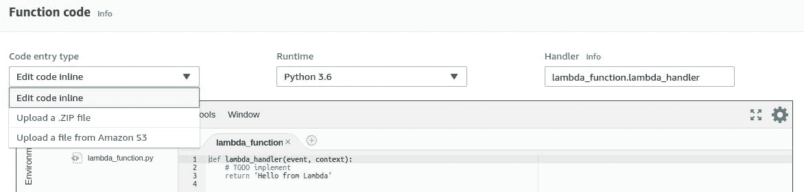
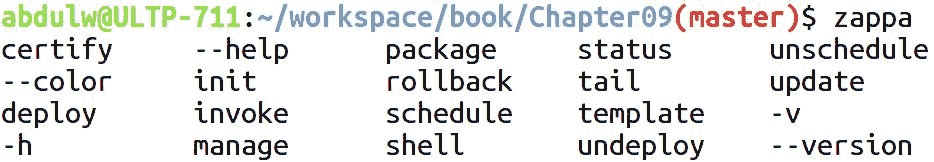

# 第十章：高级 Zappa 设置

在本章中，我们将探索 Zappa 提供的各种设置和配置。这真的可以帮助您以高效的方式部署应用程序。因此，有各种设置来配置您的应用程序。这些设置与一些 AWS 服务及其功能和功能相关。我们将通过将它们应用到我们在第九章中开发的现有报价 API 应用程序来探索这些设置，*AWS Lambda 上的异步任务执行*。

在本章中，我们将涵盖以下主题：

+   保持服务器热

+   启用 CORS

+   处理更大的项目

+   启用 bash 编译

+   缓存未处理的异常

# 技术要求

在继续之前，有一些先决条件需要满足。为了满足先决条件，需要满足以下要求：

+   Ubuntu 16.04/Windows/macOS

+   Python 3.6

+   Pipenv 工具

+   Zappa

+   Falcon API

+   Python 包

+   注册域名

+   AWS 账户

一些先前配置的先决条件可以从第九章中使用，*AWS Lambda 上的异步任务执行*。这意味着您可以继续使用配置的域和 AWS 服务。您可能需要更新本章的 Zappa 设置文件。

让我们继续探索与报价 API 应用程序一起使用的其他设置。

# 保持服务器热

Zappa 启用了一个保持 AWS Lambda 处于热状态的功能。由于容器化，AWS Lambda 存在冷启动，因此 Lambda 需要您设置环境以执行函数。每当 AWS Lambda 收到请求时，它会实例化 Lambda 函数及其所需的环境，最终在完成请求后销毁实例。

这就是 AWS Lambda 的工作原理。因此，Zappa 使用 AWS CloudWatch 事件调度功能来实现此机制，以保持实例化的 Lambda 实例处于热状态。保持 Lambda 处于热状态就是每四分钟触发 CloudWatch 事件作为 ping 请求，以防止 Lambda 实例的销毁。

此功能默认启用，但如果要禁用此功能，则可以在 Zappa 设置的 JSON 文件中将`keep_warm`标志设置为`false`。

以下代码片段用于禁用保持热功能：

```py
{
    "dev": {
             ...
             "keep_warm": true/false
             ...
     }
}
```

在我们的情况下，我们希望保持默认设置不变，以便我们的应用程序始终处于热状态。让我们继续下一节，我们将探索其他有用的设置。

# 启用 CORS

**跨源资源共享**（**CORS**）是在相同域或不同托管域上提供 API 的重要部分。AWS API Gateway 提供了启用 CORS 功能的功能。一旦您在 API Gateway 上配置了 API 资源，您必须使用 API Gateway Web 控制台启用 CORS。在 API Gateway 资源上启用 CORS 需要您设置`OPTION`方法以及一些响应头，例如以下内容：

+   Access-Control-Allow-Methods

+   Access-Control-Allow-Headers

+   Access-Control-Allow-Origin

您可以查看 AWS 官方文档中有关在 API Gateway 中配置 CORS 的手动过程（[`docs.aws.amazon.com/apigateway/latest/developerguide/how-to-cors.html`](https://docs.aws.amazon.com/apigateway/latest/developerguide/how-to-cors.html)）。

Zappa 通过使用名为`cors`的设置属性自动配置 API Gateway 资源的 CORS 过程，如下面的代码片段所述：

```py
{
    "dev": {
             ...
             "cors": true/false
             ...
     }
}
```

Zappa 将`cors`的默认值设置为`false`。如果要为 API 资源启用 CORS，则可以将其设置为`true`。它还支持添加响应头。

`"cors": true`与`"binary_support": true`不兼容。因此，您可以禁用 API 网关级别的 CORS，或者您可以添加应用程序级别的 CORS 功能。

如前所述，您也可以使用应用程序级别的 CORS。有许多库可用于集成 CORS，一些框架有很好的库，比如`django-cors-headers` ([`github.com/ottoyiu/django-cors-headers`](https://github.com/ottoyiu/django-cors-headers)) 和 Flask-CORS ([`github.com/corydolphin/flask-cors`](https://github.com/corydolphin/flask-cors))。

这就是配置 CORS 功能的全部内容。我更喜欢在应用程序级别启用 CORS，因为这样您可以更好地控制它。

# 处理更大的项目

在这一部分，我们将讨论如何处理 AWS Lamda 上的大型项目的过程。AWS Lambda 默认支持不同的代码输入类型。现在，我们将更详细地讨论这个功能，因为我们将向您展示如何通过 AWS Lambda 控制台和使用 Zappa 库来处理这个功能。

# 使用 AWS Lambda 控制台处理更大的项目

AWS Lambda 支持三种不同的代码输入类型——内联编辑代码、上传 ZIP 文件和从 Amazon S3 上传文件，如下面的 AWS Lambda 函数 Web 控制台的截图所示：



这种输入类型允许用户将他们的代码库放在 AWS Lambda 上。让我们详细说明一下：

+   使用这种输入类型，您可以通过 AWS Lambda 的 Web 控制台直接放置代码，就像前面的截图中提到的那样。借助其在线编辑器，您可以编写和执行代码。这可以用于小型代码库。

+   **上传 ZIP 文件**：AWS Lambda 支持上传代码库的.zip 文件。我们在第一章中讨论了代码库的构建打包，*Amazon Web Services for Serverless*。这个功能有一个关于文件大小的限制，因为它只支持 50MB 大小的文件上传，但对于大型项目有另一个选项。

+   **从 Amazon S3 上传文件**：这个功能允许用户将构建包上传到 Amazon S3 存储，无论大小。这意味着您可以通过其 S3 链接引用在 Amazon S3 上上传的构建包。

# 使用 Zappa 处理更大的项目

Zappa 在处理部署时考虑构建包大小。Zappa 只支持两种代码输入类型，即直接在 AWS Lambda 上上传.zip 文件和在 Amazon S3 上上传.zip 文件。

```py
zappa_settings.json file:
```

```py
{
    "dev": {
             ...
             "slim_handler": true/false
             ...
     }
}
```

如果项目大小超过 50MB，请将`"slim_handler"`设置为`true`。一旦设置了这个属性，Zappa 将自动将构建包上传到 Amazon S3 存储桶，并配置 AWS Lambda 处理程序函数以考虑来自 Amazon S3 存储桶的构建包。

# 启用 bash 标签编译

Bash 标签编译是命令行环境中的一个功能。通过按下*Tab*键，它将显示自动完成建议列表。Zappa 有许多命令，如果您将`Zappa`模块与 Python `argcomplete`模块注册，`zappa`命令将支持标签编译功能。

为了获得这个功能，您需要在系统或虚拟环境中安装`argcomplete` ([`github.com/kislyuk/argcomplete`](https://github.com/kislyuk/argcomplete)) 模块：

+   系统级安装：

```py
$ sudo apt update
$ sudo apt install python-argcomplete
```

+   虚拟环境安装：

```py
$ pip install argcomplete
```

一旦您配置了模块，那么您需要在全局级别激活 Python 的`argcomplete`模块。以下是激活全局 Python `argcomplete`模块的命令：

```py
$ activate-global-python-argcomplete
```

为了将`Zappa`模块与`argcomplete`注册，您需要在`~/.bashrc`文件中添加以下行：

```py
eval "$(register-python-argcomplete zappa)"
```

通过执行以下命令在当前终端上再次源化以立即生效：

```py
$ source ~/.bashrc
```

现在，一旦您将`Zappa`模块与`argcomplete`注册，Zappa 命令将在编译中可用。以下是 Zappa 命令编译的截图：



这就是您可以使用`argcomplete`来进行 Zappa 命令。然而，在部署过程中更加高效将会很有帮助。让我们继续下一节，我们将讨论捕获未处理异常。

# 捕获未处理异常

Zappa 提供了一个捕获未处理异常的功能。这将允许您处理未处理的异常，通过电子邮件、SNS 或其他来源发出警报通知。这取决于您的要求，但您可以选择任何来源来发出通知。这将非常有帮助，这样您就可以跟踪任何部署环境中出现的故障。

例如，如果我们想要向所有开发人员和 QA 工程师发送关于任何部署环境的批量电子邮件通知，Zappa 提供了一种简单的方法来配置捕获未处理异常的机制。借助`exception_handler`属性的帮助，您可以绑定一个异常处理程序方法，从中可以处理异常以发送批量电子邮件通知。

以下是 Zappa 设置文件的代码片段：

```py
{
    "dev": {
        ...
        "exception_handler": "your_module.unhandled_exceptions",
    },
    ...
}
```

在这里，异常处理程序是在一个模块中定义的方法。因此，让我们修改我们现有的项目，从第九章，*在 AWS Lambda 上执行异步任务*，添加异常处理程序。

```py
unhandled_exception method that we created in the Quote API application of  Chapter 9, *Asynchronous Task Execution on AWS Lambda.*
```

文件-`notify.py`：

```py
import os
import boto3

def unhandled_exceptions(e, event, context):
    client = boto3.client('sns', aws_access_key_id=os.environ['aws_access_key_id'],
                            aws_secret_access_key=os.environ['aws_secret_access_key'],
                            region_name='us-east-1')
    topic = client.create_topic(Name="UnhandledException")
    client.publish(Message={'exception': e, 'event': event}, TopicArn=topic['TopicArn'])
    return True # Prevent invocation retry
```

在这里，我们将异常和事件数据发布到订阅的电子邮件中的`"UnhandledException"`主题。

我们可以增强订阅以管理开发人员和 QA 工程师的电子邮件订阅列表。这就是这个功能在追踪未处理异常方面的真正帮助。我们希望这对于管理您的部署是有益的。

# 总结

在本章中，我们了解了 Zappa 的一些附加功能。这些功能使我们能够以非常高效的方式管理 DevOps 操作。我们还探讨了处理大型项目、实现 CORS 和管理未处理异常。希望您喜欢本章，并在应用程序中开始使用这些功能。

# 问题

1.  保持 AWS Lambda 处于热状态有什么用？

1.  CORS 是什么？

1.  大型项目的部署流程是什么？
