# 第十一章：使用 Zappa 保护无服务器应用程序

在本章中，我们将学习如何保护部署在 AWS Lambda 上的基于 Python 的应用程序。在之前的章节中，我们学习了如何开发一个应用程序并将其部署到无服务器基础设施上使用 Zappa。Zappa 还支持多种机制，使您能够为应用程序实现安全层。保护应用程序免受未经授权的访问是任何 Web 应用程序的重要过程，但能够在无服务器基础设施上保护 Web 应用程序将更加有趣。

因此，我们将开发一个基于 API 的应用程序，并演示一些机制来保护它免受未经授权的访问。让我们继续并探索有关设置开发环境的详细信息。

在本章中，我们将涵盖以下主题：

+   实现随机引用 API

+   在 API Gateway 上启用安全端点

+   使用死信队列跟踪 AWS Lambda 的失败

+   使用 AWS X-Ray 分析 Zappa 应用程序

+   使用 AWS VPC 保护您的 Zappa 应用程序

# 技术要求

在本章中，我们将涵盖更多的 AWS 功能，以增强使用 Zappa 的安全层。在深入研究本章之前，请确保您已满足以下先决条件：

+   Ubuntu 16.04/macOS/Windows

+   Python 3.6

+   Pipenv 工具

+   AWS 账户

+   Gunicorn

+   Zappa

+   其他 Python 包

一旦您启用了开发环境，我们就可以继续并开发一个简单的基于 Falcon 的 API，以便在请求时生成一个随机引用。在接下来的章节中，我们将使用 Zappa 使用不同的机制和方法来保护这个 API。

# 实现随机引用 API

在这一部分，我们将创建一个 RESTful API，用于生成随机引用。这将包括基于 Falcon 的 API 实现与 Mashape API 集成，就像我们在第九章中所做的那样，*在 AWS Lambda 上执行异步任务*。这一次，我们不打算集成数据库，因为我们不想保留任何信息。这将是一个简单的 HTTP `GET` 请求到我们的 API，然后我们将使用 Mashape API 返回一个随机生成的引用的 JSON 响应。让我们在下一节中看一下先决条件。

# 先决条件

我希望您已经满足了先前提到的技术要求，并使用 pipenv 工具设置了开发环境。现在，您需要在**Mashape** API 市场（[`market.mashape.com/`](https://market.mashape.com/)）注册，我们将使用**Random Famous Quote** API（[`market.mashape.com/andruxnet/random-famous-quotes`](https://market.mashape.com/andruxnet/random-famous-quotes)）。一旦您获得了使用此 API 的凭据，我们就需要在我们的应用程序中对其进行配置。

我们将使用 Zappa 的`remote_env`功能从 AWS S3 文件中将这些凭据作为环境变量共享，因此您需要在 AWS S3 上上传一个 JSON 文件。

文件—`book-config`/`chapter-11-config.json`：

```py
{
    "Mashape_API_Endpoint" : "https://andruxnet-random-famous-quotes.p.mashape.com/",
    "X_Mashape_Key": "XXXXXXXXXXXXXXXXXXXXXXXXXXXX"
}
```

一旦您将此文件上传到 S3 存储中，您可以在`zappa_settings.json`文件中使用`remote_env`功能。以下是带有`remote_env`配置的`zappa_settings.json`的示例：

```py
{
    "dev": {
        ...
        "remote_env": "s3://book-configs/chapter-11-config.json"
        ...
    }
}
```

一旦我们初始化 Zappa 进行部署，我们将添加这个设置。目前，您可以手动将这些凭据设置为环境变量，就像我们在这里所做的那样：

```py
$ export Mashape_API_Endpoint=https://andruxnet-random-famous-quotes.p.mashape.com/
$ export X_Mashape_Key=XXXXXXXXXXXXXXXXXX
```

现在，让我们继续下一节，在那里我们将实现用于生成随机引用数据的 RESTful API。

# 开发随机引用 API

既然我们已经讨论了 Mashape API 的配置，让我们编写一个代码片段来实现获取随机引用数据的功能。请看以下代码片段：

文件—`mashape.py`：

```py
import os
import requests

def fetch_quote():
    response = requests.get(
        os.environ.get('Mashape_API_Endpoint'),
        headers={
            'X-Mashape-Key': os.environ.get('X_Mashape_Key'),
            'Accept': 'application/json'
        }
    )
    if response.status_code == 200:
        return response.json()[0]
    return response.json() 
```

正如您所看到的，我们编写了一个名为`fetch_quote`的方法，负责从 Mashape API 获取随机引用数据。我们将在进一步的实现中使用这个方法。

现在，让我们为我们的用户编写一个资源 API，他们将使用我们的 API 来获取随机引用。以下是资源 API 的代码片段。

文件-`resource.py`：

```py
import falcon
from mashape import fetch_quote

class RandomQuoteResource:
    def on_get(self, req, resp):
        """Handles GET requests"""
        try:
            resp.media = fetch_quote()
        except Exception as e:
            raise falcon.HTTPError(falcon.HTTP_500, str(e))

api = falcon.API()
api.add_route('/', RandomQuoteResource())
```

在这里，我们使用 Falcon 框架实现了一个 RESTful API。此 API 与根 URL 映射，即`"/"`。我们使用`on_get`方法仅接受 HTTP `GET`请求；其他请求将被拒绝访问。一旦用户发起`GET`请求，此 API 将返回随机引用数据。

你可以在本地环境上通过在本地主机上使用`gunicorn`运行此 API 来执行此 API：

```py
$ gunicorn resources:api
[2018-07-11 13:59:28 +0530] [3562] [INFO] Starting gunicorn 19.9.0
[2018-07-11 13:59:28 +0530] [3562] [INFO] Listening at: http://127.0.0.1:8000 (3562)
[2018-07-11 13:59:28 +0530] [3562] [INFO] Using worker: sync
[2018-07-11 13:59:28 +0530] [3565] [INFO] Booting worker with pid: 3565
```

一旦运行`gunicorn resources:api`命令，API 将在本地使用`8000`端口可用。让我们使用`curl`命令执行 API：

```py
$ curl http://localhost:8000
{"quote": "Whenever I climb I am followed by a dog called 'Ego'.", "author": "Friedrich Nietzsche", "category": "Famous"}
```

就是这样。我们已经完成了实施。现在，是时候使用 Zappa 在 AWS Lambda 上部署应用程序了。让我们继续下一节，我们将进一步讨论部署过程。

# 使用 Zappa 部署

要配置 Zappa，您应该运行`zappa init`命令并按照自动生成的问卷进行操作。我遵循了默认建议的设置，因此以下是自动生成的`zappa_settings.json`文件。

文件-`zappa_settings.json`：

```py
{
    "dev": {
        "app_function": "resources.api",
        "profile_name": "default",
        "project_name": "chapter11",
        "runtime": "python3.6",
        "s3_bucket": "zappa-ss0sm7k4r"
    }
}
```

就是这样。现在，借助这个配置，您可以执行以下日志片段中提到的部署：

```py
$ zappa deploy dev
Calling deploy for stage dev..
Creating chapter11-dev-ZappaLambdaExecutionRole IAM Role..
Creating zappa-permissions policy on chapter11-dev-ZappaLambdaExecutionRole IAM Role.
Downloading and installing dependencies..
 - sqlite==python36: Using precompiled lambda package
Packaging project as zip.
Uploading chapter11-dev-1531293742.zip (5.6MiB)..
100%|███████████████████████████████████████████████████████████████████████████████████████████████████████████████████████████████████████████████████████████████████████████████████████| 5.92M/5.92M [00:02<00:00, 1.16MB/s]
Scheduling..
Scheduled chapter11-dev-zappa-keep-warm-handler.keep_warm_callback with expression rate(4 minutes)!
Uploading chapter11-dev-template-1531293760.json (1.6KiB)..
100%|███████████████████████████████████████████████████████████████████████████████████████████████████████████████████████████████████████████████████████████████████████████████████████| 1.62K/1.62K [00:00<00:00, 2.32KB/s]
Waiting for stack chapter11-dev to create (this can take a bit)..
100%|█████████████████████████████████████████████████████████████████████████████████████████████████████████████████████████████████████████████████████████████████████████████████████████████| 4/4 [00:09<00:00, 2.67s/res]
Deploying API Gateway..
Scheduling..
Unscheduled chapter11-dev-zappa-keep-warm-handler.keep_warm_callback.
Scheduled chapter11-dev-zappa-keep-warm-handler.keep_warm_callback with expression rate(4 minutes)!
Your updated Zappa deployment is live!: https://u1pao12esc.execute-api.ap-south-1.amazonaws.com/dev

```

在继续之前，让我们针对此应用程序集成一个自定义域。我们学习了如何使用 ACM 创建 SSL 证书并在第八章中配置自定义域，*带 SSL 的自定义域*。因此，我们将使用先前创建的通配符 SSL 证书。只需从 Zappa 设置中轻松创建新的自定义域。

我们将在`zappa_settings.json`文件中添加以下设置。

文件-`zappa_settings.json`：

```py
{
    "dev": {
        "app_function": "resources.api",
        "profile_name": "default",
        "project_name": "chapter11",
        "runtime": "python3.6",
        "s3_bucket": "zappa-ss0sm7k4r",
        "remote_env": "s3://book-configs/chapter-11-config.json",
 "domain": "random-quote.abdulwahid.info",
 "certificate_arn":"arn:aws:acm:us-east-1:042373950390:certificate/af0796fa-3a46-49ae-97d8-90a6b5ff6784"
    }
}
```

```py
zappa update command:
```

```py
$ zappa update dev
Calling update for stage dev..
Downloading and installing dependencies..
 - sqlite==python36: Using precompiled lambda package
Packaging project as zip.
Uploading chapter11-dev-1531294072.zip (5.6MiB)..
100%|███████████████████████████████████████████████████████████████████████████████████████████████████████████████████████████████████████████████████████████████████████████████████████| 5.92M/5.92M [00:02<00:00, 2.19MB/s]
Updating Lambda function code..
Updating Lambda function configuration..
Uploading chapter11-dev-template-1531294078.json (1.6KiB)..
100%|███████████████████████████████████████████████████████████████████████████████████████████████████████████████████████████████████████████████████████████████████████████████████████| 1.62K/1.62K [00:00<00:00, 8.55KB/s]
Deploying API Gateway..
Scheduling..
Unscheduled chapter11-dev-zappa-keep-warm-handler.keep_warm_callback.
Scheduled chapter11-dev-zappa-keep-warm-handler.keep_warm_callback with expression rate(4 minutes)!
Your updated Zappa deployment is live!: https://random-quote.abdulwahid.info (https://u1pao12esc.execute-api.ap-south-1.amazonaws.com/dev)
```

现在，应用程序已更新到 AWS Lambda，但我们仍然需要执行域认证任务以使域名上线。借助`zappa certify`命令，我们可以实现这一点。

```py
zappa certify command:
```

```py
$ zappa certify dev
Calling certify for stage dev..
Are you sure you want to certify? [y/n] y
Certifying domain random-quote.abdulwahid.info..
Created a new domain name with supplied certificate. Please note that it can take up to 40 minutes for this domain to be created and propagated through AWS, but it requires no further work on your part.
Certificate updated!
```

如前面的日志所述，我们的应用程序已经使用给定的自定义域名（[`random-quote.abdulwahid.info`](https://random-quote.abdulwahid.info)）上线，但可能需要长达 40 分钟才能创建域名并通过 AWS 传播，尽管这不需要您进一步的工作。让我们继续下一节，我们将执行已部署的应用程序。

# 执行 API

一旦应用程序上线，您可以使用 cURL 工具检查 API 的执行情况。以下是 API 执行的日志片段：

```py
$ curl https://random-quote.abdulwahid.info
{"quote": "The significant problems we face cannot be solved at the same level of thinking we were at when we created them.", "author": "Albert Einstein", "category": "Famous"}
```

这就是全部关于无服务器的内容。现在，我们需要探索一些重要的步骤，以保护我们的应用程序免受未经授权的访问。让我们继续下一节，我们将讨论并实施一些解决方案来保护应用程序。

# 在 API Gateway 上启用安全端点

保护 API 访问是一个重要的标准。您可以限制和限制将要使用 API 的客户的访问。Amazon API Gateway 确实支持多种机制来保护、限制和限制 API 的使用。这将有助于根据您的客户群维护 API 的使用情况。以下是 API Gateway 支持的三种实现类型：

+   API 密钥

+   IAM 策略

+   API 网关 Lambda 授权者

让我们更详细地看看每个实现。

# 启用 API 密钥

正如我们在第一章中描述的，*Amazon Web Services for Serverless,*关于 Zappa 的部署工作流程，Zappa 配置 API 网关以使用代理传递机制调用 AWS Lambda，这在 API 网关接口上创建了一个 API。每个 API 都支持各种阶段。在我们的情况下，我们在部署应用程序时创建了一个`dev`阶段。因此，以下屏幕截图显示了 API 网关控制台的状态：

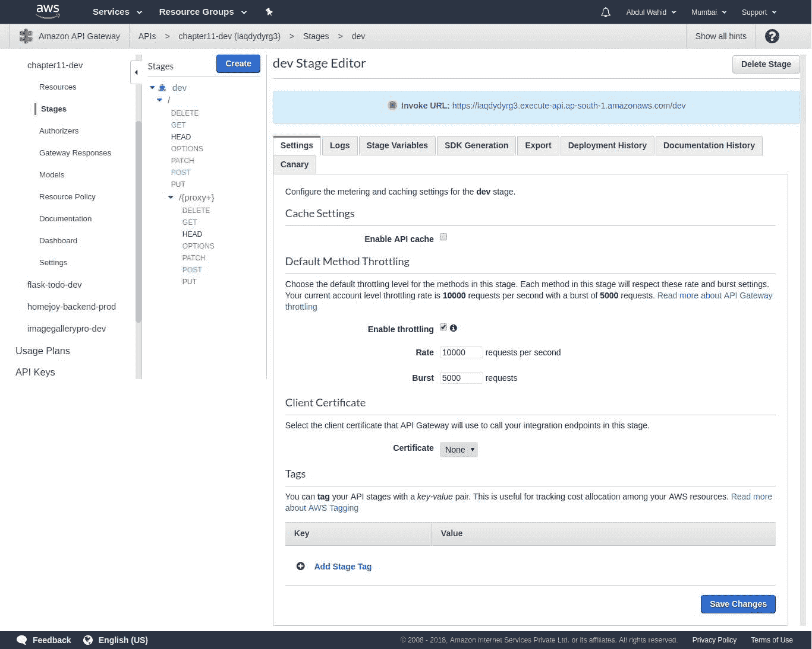

API Gateway 支持 API 密钥机制，您可以创建一个 API 密钥以及使用计划。借助这个 API 密钥，您可以限制客户的访问。任何客户都可以在 API 中设置`x-api-key`头与 API 密钥值来访问 API。API 密钥可以映射到任何 API 或阶段。

以下截图显示了创建 API 密钥的手动过程：

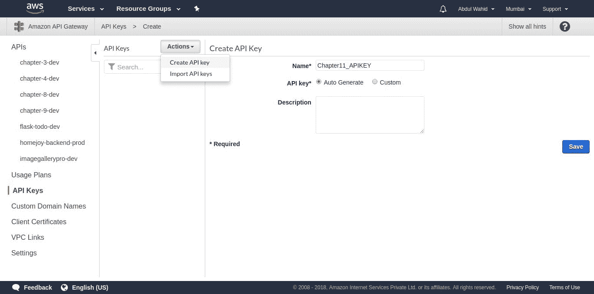

使用 Zappa 可以消除创建 API 密钥的手动过程。这就是 Zappa 发挥重要作用的地方，因为它将通过配置 Zappa 设置自动化整个过程。

Zappa 提供了一个布尔值的`api_key_required`属性。`api_key_required`默认设置为`false`，但如果您想生成 API 密钥，则需要将其设置为`true`。一旦将此属性设置为`true`，则需要重新部署应用程序。

`api_key_required`设置不适用于`zappa update`命令；它只适用于`zappa deploy`命令。因此，您需要取消部署应用程序，并从 Route 53 中删除已部署的自定义域的`CNAME`，然后从 API Gateway 控制台中删除自定义域。一旦删除了这些，就可以再次部署应用程序。

```py
zappa_settings.json file with the "api_key_required" attribute.
```

文件-`zappa_settings.json`：

```py
{
    "dev": {
        "app_function": "resources.api",
        "profile_name": "default",
        "project_name": "chapter11",
        "runtime": "python3.6",
        "s3_bucket": "zappa-ss0sm7k4r",
        "remote_env": "s3://book-configs/chapter-11-config.json",
        "domain": "random-quote.abdulwahid.info",
        "certificate_arn":"arn:aws:acm:us-east-1:042373950390:certificate/af0796fa-3a46-49ae-97d8-90a6b5ff6784",
 "api_key_required": true
    }
}
```

现在，您可以再次使用`zappa deploy`命令执行新的部署，如下面的日志片段所示：

```py
$ zappa deploy dev
Calling deploy for stage dev..
Downloading and installing dependencies..
 - sqlite==python36: Using precompiled lambda package
Packaging project as zip.
Uploading chapter11-dev-1531334904.zip (5.6MiB)..
100%|████████████████████████████████████████████████████████████████████████████████████████████████████████████████████████████████████████████████████████████████████████████████████████| 5.92M/5.92M [00:12<00:00, 360KB/s]
Scheduling..
Scheduled chapter11-dev-zappa-keep-warm-handler.keep_warm_callback with expression rate(4 minutes)!
Uploading chapter11-dev-template-1531334920.json (1.6KiB)..
100%|███████████████████████████████████████████████████████████████████████████████████████████████████████████████████████████████████████████████████████████████████████████████████████| 1.61K/1.61K [00:00<00:00, 10.4KB/s]
Waiting for stack chapter11-dev to create (this can take a bit)..
100%|█████████████████████████████████████████████████████████████████████████████████████████████████████████████████████████████████████████████████████████████████████████████████████████████| 4/4 [00:09<00:00, 4.69s/res]
Deploying API Gateway..
Created a new x-api-key: zp0snz9tik
Deployment complete!: https://laqdydyrg3.execute-api.ap-south-1.amazonaws.com/dev
```

请注意，Zappa 将生成新的`x-api-key`并返回 API 密钥 ID，如前面的日志片段所述。

部署完成后，您将能够在 API Gateway 控制台中看到自动生成的 API 密钥，如此处所示：

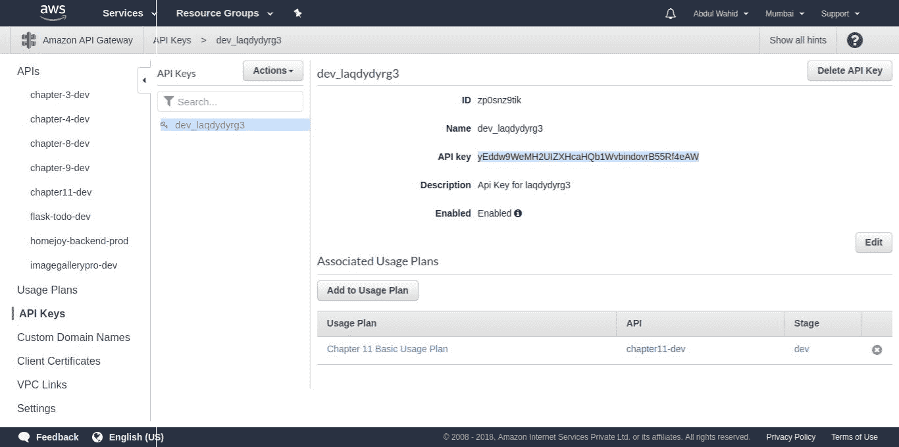

如前面的截图所示，您可以在 Zappa 设置中使用 API 密钥值，将 Zappa 部署的 API 与此密钥关联，以便 API 应用程序需要您在`x-api-key`头中具有此值。

下一步是通过单击前面截图中显示的`Associated Usage Plans`部分中的`Add to Usage Plan`将 API 密钥与使用计划关联起来。API 密钥可以与多个使用计划关联。这些计划使您能够根据您的业务模型为客户定义良好的结构使用计划。以下是第十一章 Basic Usage Plan 及其基本使用计划的截图：

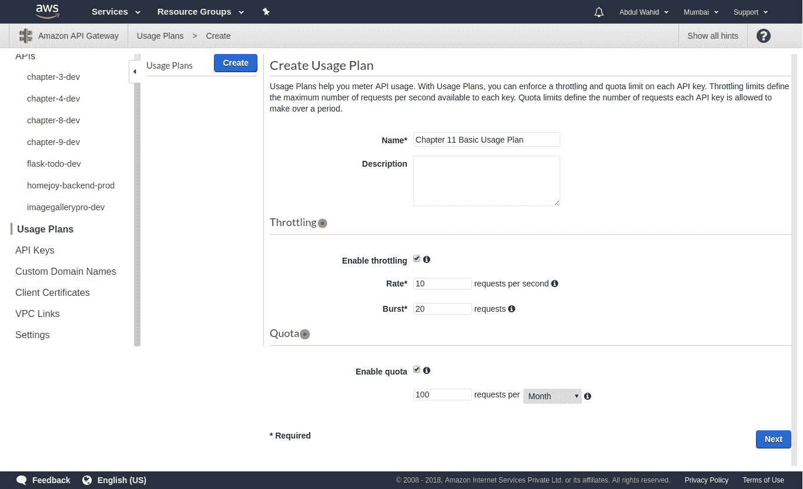

如前面的截图所示，使用计划使您能够为每个 API 密钥定义限流限制和及时限定的 API 请求配额。一旦定义了计划，就可以将其与任何部署的 API 及其各自的阶段关联，如下面的截图所示：

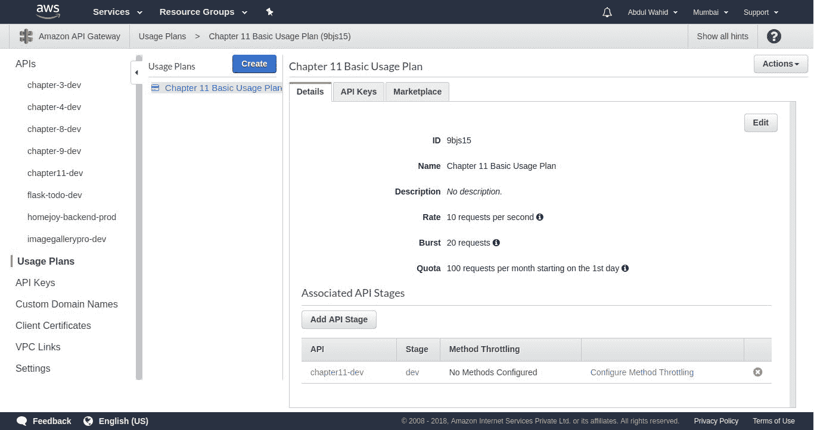

我们将第十一章的`Basic Usage Plan` `dev` API 与`dev`阶段链接到了这个计划。这就是您可以为客户设置 API 的业务计划并共享 API 密钥以提供授权访问的方法。

现在，让我们在`zappa_settings.json`文件中使用前面 API 密钥截图中的 API 密钥值，并使用`"api_key"`属性。以下是更新后的`zappa_settings.json`文件。

文件-`zappa_settings.json`：

```py
{
    "dev": {
        "app_function": "resources.api",
        "profile_name": "default",
        "project_name": "chapter11",
        "runtime": "python3.6",
        "s3_bucket": "zappa-ss0sm7k4r",
        "remote_env": "s3://book-configs/chapter-11-config.json",
        "domain": "random-quote.abdulwahid.info",
        "certificate_arn":"arn:aws:acm:us-east-1:042373950390:certificate/af0796fa-3a46-49ae-97d8-90a6b5ff6784",
        "api_key_required": true,
"api_key":"yEddw9WeMH2UIZXHcaHQb1WvbindovrB55Rf4eAW"
    }
}
```

就这样。让我们再次使用`zappa update`命令更新部署，如下面提到的日志片段所示：

```py
$ zappa update dev
Calling update for stage dev..
Downloading and installing dependencies..
 - sqlite==python36: Using precompiled lambda package
Packaging project as zip.
Uploading chapter11-dev-1531337694.zip (5.6MiB)..
100%|████████████████████████████████████████████████████████████████████████████████████████████████████████████████████████████████████████████████████████| 5.92M/5.92M [00:16<00:00, 261KB/s]
Updating Lambda function code..
Updating Lambda function configuration..
Uploading chapter11-dev-template-1531337713.json (1.6KiB)..
100%|███████████████████████████████████████████████████████████████████████████████████████████████████████████████████████████████████████████████████████| 1.61K/1.61K [00:00<00:00, 8.50KB/s]
Deploying API Gateway..
Scheduling..
Unscheduled chapter11-dev-zappa-keep-warm-handler.keep_warm_callback.
Scheduled chapter11-dev-zappa-keep-warm-handler.keep_warm_callback with expression rate(4 minutes)!
Your updated Zappa deployment is live!: https://random-quote.abdulwahid.info (https://laqdydyrg3.execute-api.ap-south-1.amazonaws.com/dev)
```

我们已经完成了启用 API 密钥认证。让我们继续下一节，看看 API 的执行情况。

# 使用 API 密钥头执行 API

我们启用了 API 密钥的认证，因此 API 密钥与`x-api-key`头是强制的。如果请求没有`x-api-key`头，将被拒绝访问并返回禁止响应。如果用户在`x-api-key`头中提供有效的 API 密钥值，则将被允许访问 API 资源。

没有`x-api-key`头的 API 执行如下：

```py
$ curl https://random-quote.abdulwahid.info/
{"message":"Forbidden"}
```

带有`x-api-key`头的 API 执行如下：

```py
$ curl --header "x-api-key: yEddw9WeMH2UIZXHcaHQb1WvbindovrB55Rf4eAW" https://random-quote.abdulwahid.info/
{"quote": "Problems worthy of attack prove their worth by fighting back.", "author": "Paul Erdos", "category": "Famous"}
```

我们已经完成了 API 密钥身份验证集成。让我们继续下一节，我们将探索使用 IAM 策略进行身份验证的另一种选项。

# IAM 策略

Amazon API Gateway 支持基于 IAM 的 V4 签名请求身份验证。API Gateway 要求用户通过对请求进行签名来进行身份验证。签署请求是使用加密函数创建数字签名的完整流程。您可以在以下链接中阅读有关签署请求过程的更多信息：

[`docs.aws.amazon.com/apigateway/api-reference/signing-requests/`](https://docs.aws.amazon.com/apigateway/api-reference/signing-requests/)

Zappa 通过在 Zappa 的设置中将`"iam_authorization"`属性设置为`true`来启用此功能。此属性默认设置为`false`。因此，您可以显式将其设置为 true，以启用基于 IAM 的身份验证。此功能使您能够根据 IAM 策略访问 API 资源。您可以通过 IAM 策略([`docs.aws.amazon.com/apigateway/latest/developerguide/api-gateway-iam-policy-examples.html`](https://docs.aws.amazon.com/apigateway/latest/developerguide/api-gateway-iam-policy-examples.html))来控制此访问。

为了演示目的，我将为同一应用程序创建一个不同的阶段和自定义域。以下是 Zappa 设置的片段。

文件-`zappa_settings.json`:

```py
{
    "dev": {
        "app_function": "resources.api",
        "profile_name": "default",
        "project_name": "chapter11",
        "runtime": "python3.6",
        "s3_bucket": "zappa-ss0sm7k4r",
        "remote_env": "s3://book-configs/chapter-11-config.json",
        "domain": "random-quote.abdulwahid.info",
        "certificate_arn":"arn:aws:acm:us-east-1:042373950390:certificate/af0796fa-3a46-49ae-97d8-90a6b5ff6784",
        "api_key_required": true,
        "api_key":"yEddw9WeMH2UIZXHcaHQb1WvbindovrB55Rf4eAW"
    },
    "dev_iam": {
 "app_function": "resources.api",
 "profile_name": "default",
 "project_name": "chapter11",
 "runtime": "python3.6",
 "s3_bucket": "zappa-ss0sm7k4r",
 "remote_env": "s3://book-configs/chapter-11-config.json",
 "domain": "random-quote-iam.abdulwahid.info",
 "certificate_arn":"arn:aws:acm:us-east-1:042373950390:certificate/af0796fa-3a46-49ae-97d8-90a6b5ff6784",
 "iam_authorization": true
 }
}
```

在这里，我们创建了一个带有`iam_authentication`的不同阶段。此标志将启用基于 IAM 的身份验证。现在，您需要执行部署、更新和认证操作，以使此阶段与以下域名一起生效。

```py
curl execution:
```

```py
$ curl -s -w "\nStatus Code:%{http_code}" https://random-quote-iam.abdulwahid.info
{"message":"Missing Authentication Token"}
Status Code:403
```

现在，您需要对请求进行签名以访问部署的资源。签署请求需要您遵循一些流程，如此处所述：[`docs.aws.amazon.com/apigateway/api-reference/signing-requests/`](https://docs.aws.amazon.com/apigateway/api-reference/signing-requests/)。还有许多第三方库可用于生成签署请求所需的标头。我们将使用`requests-aws-sign`([`github.com/jmenga/requests-aws-sign`](https://github.com/jmenga/requests-aws-sign))库来使用签名请求访问 API 资源。

以下是签署请求以访问 API 资源的代码片段。

文件-`aws_sign_request_test.py`:

```py
import os
import requests
from requests_aws_sign import AWSV4Sign
from boto3 import session

# You must provide a credentials object as per http://boto3.readthedocs.io/en/latest/guide/configuration.html#configuring-credentials
# This example attempts to get credentials based upon the local environment
# e.g. Environment Variables, assume role profiles, EC2 Instance IAM profiles
session = session.Session(
    aws_access_key_id=os.environ['aws_access_key_id'],
    aws_secret_access_key=os.environ['aws_secret_access_key'])
credentials = session.get_credentials()

# You must provide an AWS region
region = session.region_name or 'ap-south-1'

# You must provide the AWS service. E.g. 'es' for Elasticsearch, 's3' for S3, etc.
service = 'execute-api'

url = "https://random-quote-iam.abdulwahid.info/"
auth=AWSV4Sign(credentials, region, service)
response = requests.get(url, auth=auth)

print (response.content)
```

就是这样！现在，您可以看到前面脚本的输出，如下面的代码所示：

```py
$ python aws_sign_request_test.py 
b'{"quote": "Many wealthy people are little more than janitors of their possessions.", "author": "Frank Lloyd Wright", "category": "Famous"}'
```

最后，我们通过签名请求获得了 API 访问权限。通过这种方式，您可以使用 IAM 身份验证保护无服务器 API 应用程序。让我们继续下一节，我们将探索保护无服务器 API 应用程序的另一种方式。

# API Gateway Lambda 授权程序

Amazon API Gateway Lambda 授权程序是一个简单的 AWS Lambda 函数，作为授权程序来控制对 API Gateway 资源的访问。这是因为 Lambda 授权程序将负责通过 bearer token 形式的授权头验证请求，并返回有效的 IAM 策略。您可以根据**JWT**（JSON Web Token）、OAuth 或 SAML 编写自定义的 Lambda 授权程序，具有不同的身份验证策略。

您可以从 API Gateway 控制台添加授权程序，如官方 AWS 文档中所述([`docs.aws.amazon.com/apigateway/latest/developerguide/apigateway-use-lambda-authorizer.html`](https://docs.aws.amazon.com/apigateway/latest/developerguide/apigateway-use-lambda-authorizer.html))，或者您可以从名为`api-gateway-authorizer-python`的 Lambda 蓝图创建 Lambda 授权程序([`github.com/awslabs/aws-apigateway-lambda-authorizer-blueprints/blob/master/blueprints/python/api-gateway-authorizer-python.py`](https://github.com/awslabs/aws-apigateway-lambda-authorizer-blueprints/blob/master/blueprints/python/api-gateway-authorizer-python.py))，然后从 API Gateway 控制台将此 Lambda 函数关联为 API 资源的授权程序。

一旦您配置了授权者，API 网关期望请求以及授权头中的持有者令牌或参数。如果缺少授权头，它将拒绝请求。如果客户端向您的 API 资源发送带有持有者令牌的请求授权头，那么 API 网关将从请求头中提取持有者令牌和其他参数，并将它们作为事件参数提供给 Lambda 授权者函数。Lambda 授权者使用现有的 AWS IAM 策略或 AWS Cognito 用户池验证令牌，然后返回 IAM 策略以授权请求。API 网关通过在预配置的**TTL**（**生存时间**）期间缓存请求令牌的返回策略来维护子请求的会话，从 300 到 3600 秒， 默认为 300 秒。

Zappa 支持一种更简单的方法来配置 Lambda 授权者。您可以在 Zappa 设置中定义授权者属性如下：

```py
{
    "dev" : {
        ...
        "authorizer": {
            "function": "your_module.your_auth_function", 
            "arn": "arn:aws:lambda:<region>:<account_id>:function:<function_name>",
            "result_ttl": 300,
            "token_header": "Authorization", // Optional. Default 'Authorization'. The name of a custom authorization header containing the token that clients submit as part of their requests.
            "validation_expression": "^Bearer \\w+$", // Optional. A validation expression for the incoming token, specify a regular expression.
        }
        ...
    }
}
```

我们可以定义前面的属性。每个属性都有其自己的特定用途，以定义自定义 Lambda 授权者。让我们更详细地探讨这些属性：

+   `function`：这将是您自己的本地函数，用于执行令牌验证。Zappa 将自动创建并映射此函数作为 API 网关中的授权者。

+   `arn`：这将是您现有 Lambda 函数的`arn`，用于验证令牌。如果您选择蓝图 Lambda 授权者函数`api-gateway-authorizer-python`（[`github.com/awslabs/aws-apigateway-lambda-authorizer-blueprints/blob/master/blueprints/python/api-gateway-authorizer-python.py`](https://github.com/awslabs/aws-apigateway-lambda-authorizer-blueprints/blob/master/blueprints/python/api-gateway-authorizer-python.py)），那么您可以放入由蓝图创建的 Lambda 函数的`arn`。

+   `result_ttl`：这是一个可选属性。它通过 API 网关启用**生存时间**（**TTL**）周期来缓存授权者结果。默认情况下，它设置为 300 秒，您可以将其设置为最多 3600 秒。

+   `token_header`：这是一个可选属性。它用于设置自定义授权头的名称。它包含客户端提交的请求的一部分令牌。

+   `validation_expression`：这是一个可选属性。它用于设置授权头中令牌的验证表达式。默认情况下，它支持`"^Bearer \\w+$"`表达式来验证令牌表达式。

这是您可以为无服务器 API 创建自定义 Lambda 授权者的方法。这使您能够为 Zappa 部署的所有分布式 API 微服务创建集中式身份验证。

现在，让我们继续下一节，我们将探讨 AWS 失败的跟踪机制。

# 使用死信队列跟踪 AWS Lambda 失败

**死信队列**（**DLQ**）是亚马逊定义的机制，用于跟踪 AWS Lambda 函数在异步执行时的失败。AWS Lambda 在事件被丢弃之前，会以异步模式调用并在失败的情况下重试两次。DLQ 用于将此失败事件传递到 Amazon SQS 队列或 Amazon SNS 主题。

# 手动 DLQ 配置

DLQ 可以通过在 Lambda 函数的`DeadLetterConfig`参数上设置`TargetArn`（即 SQS 队列 ARN 或 SNS 主题 ARN）来进行配置，如下所述：

```py
{
    "Code": {
        "ZipFile": blob,
        "S3Bucket": “string”,
        "S3Key": “string”,
        "S3ObjectVersion": “string”
    },
    "Description": "string",
    "FunctionName": "string",
    "Handler": "string",
    "MemorySize": number,
    "Role": "string",
    "Runtime": "string",
    "Timeout": number
    "Publish": bool,
    "DeadLetterConfig": {
 "TargetArn": "string" 
 }
} 
```

# 使用 Zappa 自动化 DLQ 配置

为了自动化这个过程，Zappa 通过将 SQS 队列/SNS 主题 ARN 值设置为`dead_letter_arn`来启用这个功能。我们在第九章中创建了一个名为`UnhandledException`的 SNS 主题，让我们使用现有的 SNS 主题，它已经订阅了我的电子邮件。只有在异步 Lambda 函数调用失败和重试时，DQL 才会触发。然后，DQL 将把故障异常处理为消息发送到配置的 SNS 主题，我们将在订阅的电子邮件上收到处理后的异常数据。

现在，以下代码片段是更新后的 Zappa 设置。

文件-`zappa_settings.json`：

```py
{
    "dev": {
        "app_function": "resources.api",
        "profile_name": "default",
        "project_name": "chapter11",
        "runtime": "python3.6",
        "s3_bucket": "zappa-ss0sm7k4r",
        "remote_env": "s3://book-configs/chapter-11-config.json",
        "domain": "random-quote.abdulwahid.info",
        "certificate_arn":"arn:aws:acm:us-east-1:042373950390:certificate/af0796fa-3a46-49ae-97d8-90a6b5ff6784",
        "api_key_required": true,
        "api_key":"yEddw9WeMH2UIZXHcaHQb1WvbindovrB55Rf4eAW",
        "dead_letter_arn": "arn:aws:sns:ap-south-1:042373950390:UnhandledException"
    },
    "dev_iam": {
        "app_function": "resources.api",
        "profile_name": "default",
        "project_name": "chapter11",
        "runtime": "python3.6",
        "s3_bucket": "zappa-ss0sm7k4r",
        "remote_env": "s3://book-configs/chapter-11-config.json",
        "domain": "random-quote-iam.abdulwahid.info",
        "certificate_arn":"arn:aws:acm:us-east-1:042373950390:certificate/af0796fa-3a46-49ae-97d8-90a6b5ff6784",
        "iam_authorization": true
    }
}
```

在这里，我只为`dev`阶段更新了`dead_letter_arn`属性。因此，这个功能将在`dev`阶段可用。现在，我们已经在`dev`阶段的 Lambda 函数中设置好了 DLQ。完成配置后，您需要使用`zappa deploy`命令进行部署。就是这样！现在，我们的代码中应该有一个异步的 Lambda 函数机制，在运行时引发异常。

请注意，对于特定 Lambda 函数的更改，您需要使用`zappa deploy`命令重新部署函数。`zappa update`命令在这里不起作用，因为它负责更新现有的代码库，而不是 Lambda 配置。

# 在异步 Lambda 函数中引发异常

为了在异步 Lambda 调用中引发异常，我们需要有一个机制来实例化一个异步 Lambda 函数。让我们编写一个资源 API 并调用一个异步任务，这将引发异常。

以下是`resources.py`的更新代码：

```py
import falcon
from zappa.async import task
from mashape import fetch_quote

class RandomQuoteResource:
    def on_get(self, req, resp):
        """Handles GET requests"""
        try:
            resp.media = fetch_quote()
        except Exception as e:
            raise falcon.HTTPError(falcon.HTTP_500, str(e))

@task
def async_task():
    raise ValueError("Async Failure Exception")

class AsyncTaskResource:
    def on_get(self, req, resp):
        """Handles GET requests"""
        try:
            async_task()
            resp.media = 'Called async task'
        except Exception as e:
            raise falcon.HTTPError(falcon.HTTP_500, strsk(e))

api = falcon.API()
api.add_route('/', RandomQuoteResource())
api.add_route('/async-failure', AsyncTaskResource())
```

在这里，我们创建了一个`AsyncTaskResource`作为`"/async-failure"`路由的资源类。这个路由使用`AsyncTaskResource`类中的`on_get`方法定义了 HTTP `GET`请求。我们还使用任务装饰器将`async_task`方法创建为一个异步方法。我们已经在第九章中看到了使用 Zappa 执行异步任务的实现，任务装饰器将在单独的 Lambda 实例中异步执行该方法。

从`async_task`中，我们引发了一个`ValueError`异常。这将导致异步 Lambda 执行失败，并在随后的失败时引发 DLQ 事件。DLQ 将把异常数据处理到我们配置的 SNS 主题 ARN。最后，我们将在电子邮件中收到异常信息。

```py
async-failure API:
```

```py
$ curl -H "x-api-key: yEddw9WeMH2UIZXHcaHQb1WvbindovrB55Rf4eAW" https://random-quote.abdulwahid.info/async-failure
"Called async task"
```

我们请求了`/async-failure` API，它立即响应并在异步 Lambda 函数中实例化了任务。由于我们在`async_task`方法中明确引发了异常，这将调用 DLQ 并通过发布到 SNS 主题来处理异常信息。以下是从 AWS 通知消息收到的电子邮件通知的截图：

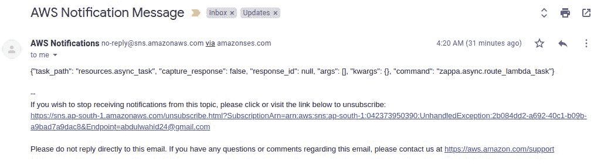

这样，我们就可以追踪未知的故障。这个功能将帮助我们提高应用程序的质量并减少故障率。让我们继续下一节，我们将探讨如何使用 AWS X-Ray 分析 Zappa 应用程序。

# 使用 AWS X-Ray 分析 Zappa 应用程序

AWS X-Ray 是亚马逊网络服务提供的分析服务。它帮助开发人员对应用程序的行为和工作流程进行分析。借助 X-Ray，开发人员可以了解应用程序的性能并追踪根本原因以改进优化。

AWS X-Ray 可以在任何计算 AWS 服务上启用。一旦您启用了 X-Ray，它就会根据应用程序的交互生成数据段。例如，如果您向应用程序发出 HTTP 请求，那么 X-Ray 将生成有关主机、请求、响应、计算时间和错误的数据。基于这些数据段，X-Ray 生成了一个服务图。

服务图提供了一个可视化模式，供开发人员了解应用程序工作流程并帮助确定其性能。除了请求和响应数据生成外，X-Ray 还为您的应用程序与 AWS 资源、微服务、数据库和 HTTP Web API 调用的交互生成记录。

# AWS Lambda 的 X-Ray 手动集成

AWS Lambda 控制台具有特权，可以配置 Lambda 函数与 AWS X-Ray。因此，任何与 AWS Lambda 的交互都将被 AWS X-Ray 记录。您可以通过从控制台页面配置函数来在 Lambda 函数上启用 X-Ray，如下面的截图所示：

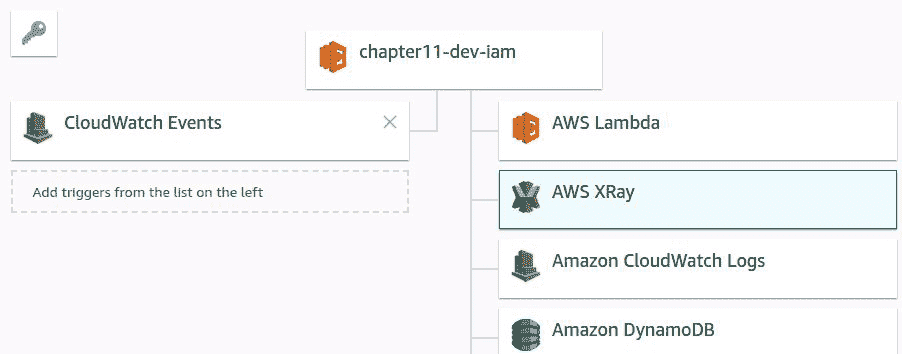

关于 AWS Lambda 控制台工作流程，您需要选择 AWS XRay。然后，您可以从主部分的底部面板配置其关联的设置，如下面的截图所示：

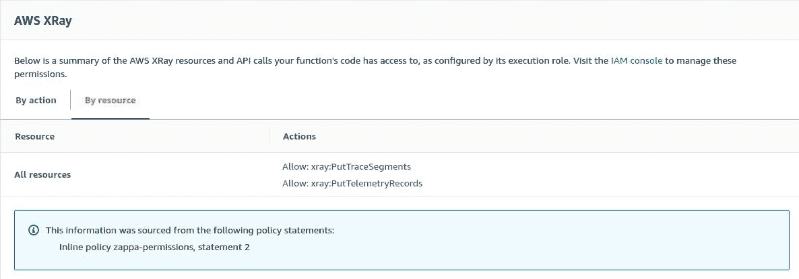

一旦选择了 X-Ray，默认执行角色权限将附加到您的 Lambda 函数。这样，AWS X-Ray 将记录对 Lambda 函数 API 执行的跟踪。

# Zappa 配置以启用 AWS X-Ray 支持

Zappa 始终在这里，以避免手动交互来配置您的 Lambda 函数。因此，Zappa 提供了一种简单的方法来配置 AWS X-Ray 与您的 Lambda 函数。您只需在 Zappa 设置中将`"xray_tracing"`设置为`true`。这将自动为您的 Lambda 函数启用 X-Ray 跟踪支持。

让我们创建现有 API 应用的另一个阶段。这个阶段将具有基本配置，没有身份验证和自定义域，因为我们只是想演示 X-Ray 的工作流程。以下是具有 X-Ray 支持的新阶段配置。

文件 - `zappa_settings.json`：

```py
{
    ...
    "dev_xray": {
        "app_function": "resources.api",
        "profile_name": "default",
        "project_name": "chapter11",
        "runtime": "python3.6",
        "s3_bucket": "zappa-ss0sm7k4r",
        "remote_env": "s3://book-configs/chapter-11-config.json",
        "xray_tracing": true
    }
}
```

如前所述，我们已经添加了一个名为`"dev_xray"`的新阶段，具有基本配置和 AWS X-Ray 跟踪支持。现在，让我们使用`zappa deploy`命令部署这个阶段。

```py
deploy command:
```

```py
$ zappa deploy dev_xray
Calling deploy for stage dev_xray..
Creating chapter11-dev-xray-ZappaLambdaExecutionRole IAM Role..
Creating zappa-permissions policy on chapter11-dev-xray-ZappaLambdaExecutionRole IAM Role.
Downloading and installing dependencies..
 - lazy-object-proxy==1.3.1: Using locally cached manylinux wheel
 - sqlite==python36: Using precompiled lambda package
Packaging project as zip.
Uploading chapter11-dev-xray-1531691356.zip (8.2MiB)..
100%|████████████████████████████████████████████████████████████████████████████████████████████████████████████████████████████████████████████████████████| 8.65M/8.65M [00:19<00:00, 460KB/s]
Scheduling..
Scheduled chapter11-dev-xray-zappa-keep-warm-handler.keep_warm_callback with expression rate(4 minutes)!
Uploading chapter11-dev-xray-template-1531691381.json (1.6KiB)..
100%|███████████████████████████████████████████████████████████████████████████████████████████████████████████████████████████████████████████████████████| 1.64K/1.64K [00:00<00:00, 9.68KB/s]
Waiting for stack chapter11-dev-xray to create (this can take a bit)..
100%|█████████████████████████████████████████████████████████████████████████████████████████████████████████████████████████████████████████████████████████████| 4/4 [00:09<00:00, 4.70s/res]
Deploying API Gateway..
Deployment complete!: https://r0wagu3zh3.execute-api.ap-south-1.amazonaws.com/dev_xray
```

就是这样！现在，我们的随机引用 API 已经在不同的阶段上线运行。一旦应用程序部署，Zappa 将生成一个随机的 API Gateway 链接，如前面的日志片段中所述。现在，您可以使用 curl 工具来访问 API。

以下是 API 执行的日志片段：

```py
$ curl https://r0wagu3zh3.execute-api.ap-south-1.amazonaws.com/dev_xray
{"quote": "A lie gets halfway around the world before the truth has a chance to get its pants on.", "author": "Sir Winston Churchill", "category": "Famous"}
```

我们已经集成了 AWS X-Ray，因此我们应用程序的所有交互将被 AWS X-Ray 记录为跟踪段。以下是 AWS X-Ray 服务地图的截图：

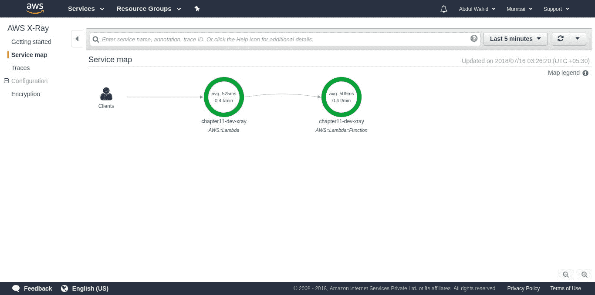

在这里，您可以查看应用程序的跟踪详细信息。这些详细信息根据其控制台上的时间范围可用。AWS X-Ray 支持客户端 SDK 库，使开发人员能够根据其需求持久化这些跟踪。AWS X-Ray 的客户端 SDK 具有许多实现，涵盖了多种语言和特定语言的框架。您可以在以下链接了解有关 AWS X-Ray 及其基于 Python 的 SDK 库的更多信息：

[`docs.aws.amazon.com/xray/latest/devguide/aws-xray.html`](https://docs.aws.amazon.com/xray/latest/devguide/aws-xray.html)

[`github.com/aws/aws-xray-sdk-python`](https://github.com/aws/aws-xray-sdk-python)

让我们继续下一节，我们将探讨 AWS VPC 与 AWS Lambda 函数的集成。

# 使用 AWS VPC 保护您的 Zappa 应用程序

AWS **虚拟私有云**（**VPC**）是专门为 AWS 资源提供的隔离虚拟网络服务。它类似于您自己数据中心中的传统网络机制。AWS VPC 使您能够保护 AWS 资源免受未经授权的访问。AWS 为每个区域提供了默认 VPC。默认 VPC 可帮助您配置所有 AWS 资源。

AWS VPC 专门为您的 AWS 账户提供了隔离层。您可以使用 AWS VPC 配置您的 AWS 资源。启用 VPC 后，您可以根据需要指定以下组件，例如 IP 地址范围、子网、安全组、路由表等。这些组件用于设置网络策略和策略。

# VPC 的手动配置

AWS Lambda 有配置 VPC 的特权。以下是 AWS Lambda 配置的屏幕截图：

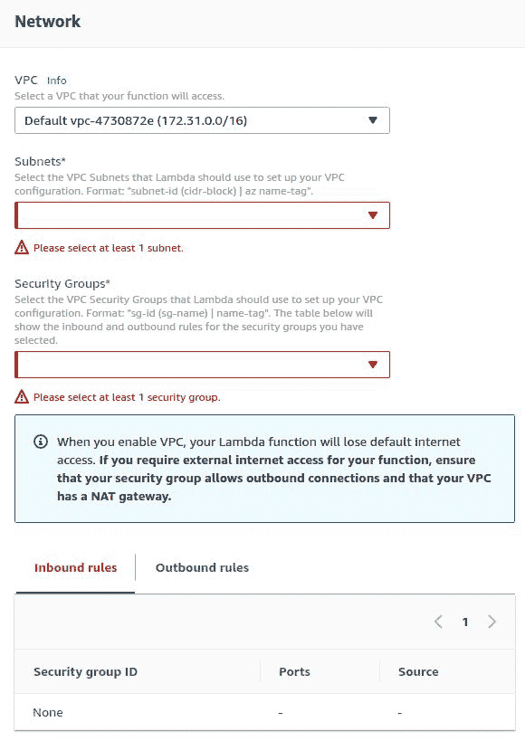

如前面的屏幕截图所示，我们选择了默认 VPC。我们需要配置其他组件，如子网和安全组，这是必需的。子网是 VPC 中的 IP 地址范围。对于需要互联网访问的任何资源，应使用公共子网。私有子网用于不需要连接到互联网的任何资源。

另一方面，安全组定义了授权任何协议访问的入站和出站规则。

AWS VPC 具有完整的安全网络层实现。要了解 VPC 概念的每个方面，您应该阅读其官方文档[(](https://docs.aws.amazon.com/AmazonVPC/latest/UserGuide/VPC_Introduction.html)[`docs.aws.amazon.com/AmazonVPC/latest/UserGuide/VPC_Introduction.html`](https://docs.aws.amazon.com/AmazonVPC/latest/UserGuide/VPC_Introduction.html))。我们将专注于 Zappa 配置，以便以自动化方式启用 VPC。让我们继续下一节，在那里我们将配置 Zappa 与 VPC。

# 使用 Zappa 进行 VPC 配置

Zappa 有一种优化的方式来自动化部署应用程序的 VPC。您只需要提供`vpc_config`属性和子网和安全组 ID，如此处所述：

```py
{
    ...
    "vpc_config": { 
        "SubnetIds": [ "subnet-12345678" ],
        "SecurityGroupIds": [ "sg-12345678" ]
    },
    ...
}
```

我在前一节中提到了默认 VPC。您可以从 VPC 仪表板页面获取默认子网 ID，如下面的屏幕截图所示：

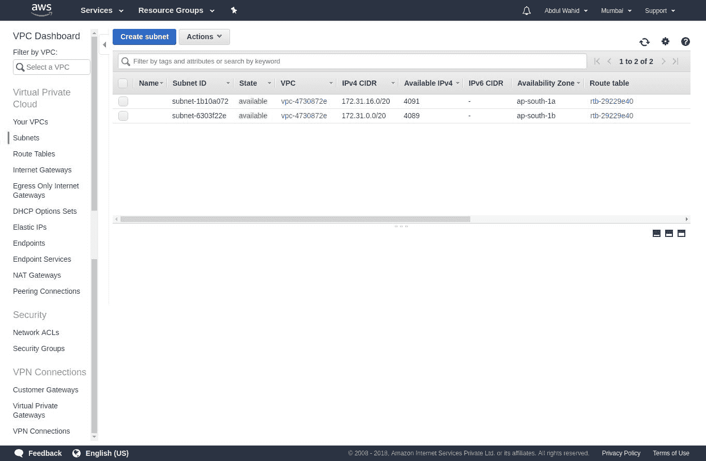

您可以通过从左侧面板选择安全组来获取安全组 ID，如下面的屏幕截图所示：

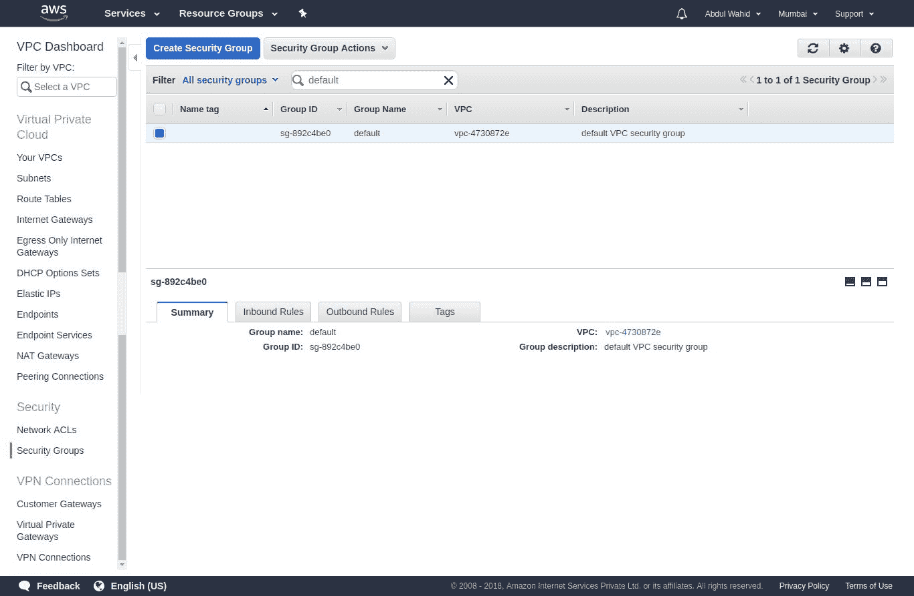

现在，我们将创建另一个带有 VPC 配置的部署阶段。您需要从前面的屏幕截图中放入子网 ID 和安全组 ID，并使用 Zappa 设置进行配置，如下面的代码片段所示。

文件—`zappa_settings.json`：

```py
{
    ...,
    "dev_vpc": {
        "app_function": "resources.api",
        "profile_name": "default",
        "project_name": "chapter11",
        "runtime": "python3.6",
        "s3_bucket": "zappa-ss0sm7k4r",
        "remote_env": "s3://book-configs/chapter-11-config.json",
        "vpc_config": {
 "SubnetIds": [ "subnet-1b10a072", "subnet-6303f22e" ],
 "SecurityGroupIds": [ "sg-892c4be0" ]
 }
    }
}
```

AWS VPC 是一个隔离的网络，因此在 VPC 网络内运行的任何服务都无法访问公共互联网。如果需要为任何资源访问公共互联网，则必须至少有两个子网。在 VPC 仪表板中使用以下设置：

+   对于`subnet-a`：

选择 NAT 网关部分并创建一个 NAT 网关。

选择 Internet 网关部分并创建一个 Internet 网关。

从路由表部分，创建一个名为`route-a`的路由，将 Internet 网关指向`0.0.0.0/0`。

+   对于`subnet-b`：

使用此子网配置您的 Lambda 函数。

从路由表部分，创建一个名为`route-b`的路由，将属于`subnet-a`的 NAT 指向`0.0.0.0/0`。

```py
zappa deploy command:
```

```py
$ zappa deploy dev_vpc
Important! A new version of Zappa is available!
Upgrade with: pip install zappa --upgrade
Visit the project page on GitHub to see the latest changes: https://github.com/Miserlou/Zappa
Calling deploy for stage dev_vpc..
Downloading and installing dependencies..
 - lazy-object-proxy==1.3.1: Downloading
100%|███████████████████████████████████████████████████████████████████████████████████████████████████████████████████████████████████████████████████████████████████████████████████████| 56.0K/56.0K [00:00<00:00, 4.88MB/s]
 - sqlite==python36: Using precompiled lambda package
Packaging project as zip.
Uploading chapter11-dev-vpc-1532712120.zip (8.2MiB)..
100%|███████████████████████████████████████████████████████████████████████████████████████████████████████████████████████████████████████████████████████████████████████████████████████| 8.65M/8.65M [00:03<00:00, 2.56MB/s]
Scheduling..
Scheduled chapter11-dev-vpc-zappa-keep-warm-handler.keep_warm_callback with expression rate(4 minutes)!
Uploading chapter11-dev-vpc-template-1532712136.json (1.6KiB)..
100%|███████████████████████████████████████████████████████████████████████████████████████████████████████████████████████████████████████████████████████████████████████████████████████| 1.64K/1.64K [00:00<00:00, 40.8KB/s]
Waiting for stack chapter11-dev-vpc to create (this can take a bit)..
100%|█████████████████████████████████████████████████████████████████████████████████████████████████████████████████████████████████████████████████████████████████████████████████████████████| 4/4 [00:09<00:00, 2.38s/res]
Deploying API Gateway..
Deployment complete!: https://6odti0061c.execute-api.ap-south-1.amazonaws.com/dev_vpc
```

就是这样。现在，我们的应用已成功配置了 AWS VPC。

# 摘要

在本章中，我们学习了不同的安全机制，并演示了它们在一个小型基于 API 的应用程序中的实现。AWS 拥有非常好的安全架构，但涉及手动交互过程，而 Zappa 自动化了这些过程并防止了手动交互。我们还涵盖了优化应用程序工作流程的跟踪、分析和通知过程。

在下一章中，我们将探讨 Zappa 开发，以及 Docker 容器化。请继续关注，以便您可以提升新的技能。

# 问题

1.  什么是 API 网关授权者？

1.  什么是 AWS Lambda DQL？

1.  为什么 AWS VPC 很重要？
