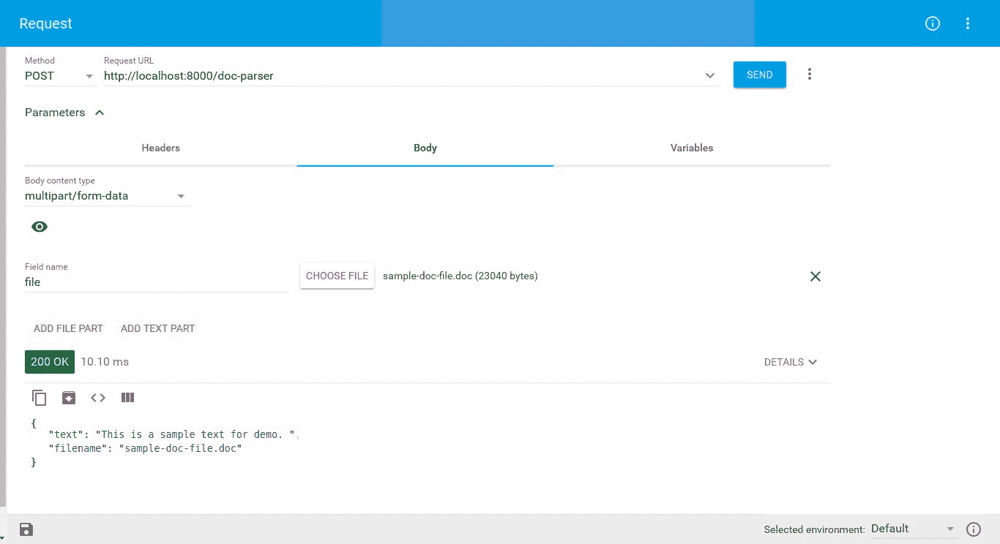

# 第十二章：使用 Docker 的 Zappa

在本章中，我们将学习如何在 AWS Lambda 环境或操作系统上下文中开发无服务器应用，而不是在本地开发环境中。我们将专注于不同环境上出现的问题，并寻找这些问题的有效解决方案。

本章我们将涵盖以下主题：

+   理解 Docker

+   问题陈述

+   具有自定义工具依赖的 API 开发

+   使用 Docker 构建、测试和部署

# 技术要求

在继续之前，让我们配置一些先决条件，例如我们将需要的工具和软件包，以便设置开发环境。以下是您将需要的软件和软件包的列表：

+   Ubuntu 16.04/macOS/Windows

+   Docker

+   Python 3.6

+   Pipenv 工具

+   Falcon

+   Falcon-multipart

+   Gunicorn

+   catdoc

+   Zappa

在这里，我们提到了操作系统以及其他所需的工具和软件包。选择其中任何一个操作系统，并根据其官方网站上详细的说明安装 Docker（[`docs.docker.com/`](https://docs.docker.com/)）。我们将在即将到来的 API 开发部分看到有关安装特定于 Python 的软件包的详细信息。让我们转到下一节，我们将了解 Docker 的概念。

# 理解 Docker

**Docker**是一个用于开发和部署应用程序的容器平台。Docker 基于 Docker 镜像创建这些容器，Docker 镜像包括类似于 Linux 的基本和必需组件。Docker 容器只不过是 Docker 镜像的一个实例。

Docker 容器具有许多功能，支持和运行任何应用程序。Docker 容器轻巧、灵活、便携、可扩展和可堆叠。您可以为任何服务创建一个容器，例如 Python 或 MySQL。Docker 使您能够通过与主机机器进行网络连接来共享数据。借助 Docker 容器，您可以为应用程序创建一个隔离的环境。

您可以创建自己的 Docker 镜像，其中包含堆叠的服务和配置。例如，您可以使用基于 Ubuntu 的镜像容器，然后安装 MySQL 服务，然后相应地配置容器。然后，我们可以构建一个包含配置服务的新镜像。最后，我们可以将镜像推送到 Docker hub 存储库（[`hub.docker.com/`](https://hub.docker.com/)），这取决于我们的存储库权限，我们可以将其保持私有或公开。

您可以在其官方网站[`docs.docker.com/get-started/#docker-concepts`](https://docs.docker.com/get-started/#docker-concepts)上详细阅读并了解 Docker 技术的概念。我们将专注于使用环境相关软件包开发应用程序，并在 AWS Lambda 上部署。让我们转到下一节，我们将讨论在开发级别上维护 AWS Lambda 环境的真实情况。

# 问题陈述

尽管 Zappa 会处理您安装的 Python 软件包，并使用预编译的 Lambda 软件包（[`github.com/Miserlou/lambda-packages`](https://github.com/Miserlou/lambda-packages)）和来自虚拟环境的 wheels 在 Lambda 上部署它们，但这些软件包可能会因操作系统环境而异。因此，可能会出现需要特定于操作系统的工具或自定义软件包来实现解决方案的情况。这种软件包上下文可能会根据操作系统环境而异。因此，在 AWS Lambda 环境中可能无法工作。

为了克服不同的环境上下文问题，并根据 AWS Lambda 环境维护安装的软件包，我们需要一个类似的开发环境上下文。因此，我们需要一个 Docker 镜像，它具有与 AWS Lambda 相似的上下文和环境。最后，**LambCI** ([`github.com/lambci`](https://github.com/lambci)) 开发了一个**Docker-Lambda** ([`github.com/lambci/docker-lambda`](https://github.com/lambci/docker-lambda)) 镜像，它具有与 AWS Lambda 相同的上下文，包括系统库、文件结构、用户和权限、环境变量和其他上下文信息。

# 建议的解决方案

```py
catdoc command execution:
```

```py
$ catdoc sample-doc-file.doc 
This is a sample text for demo.
```

现在，这个`catdoc`命令已经在操作系统级别安装了。但在我们的 API 中，我们将以编程方式执行这个命令，以解析和获取来自`stdout`的打印文本数据。我们的 API 可以作为一个解析器服务，从 Microsoft Office 2003 格式文件中获取文本数据。

# 这个解决方案的案例研究

我选择这个问题是因为目前很少有 Python 库可以解析 Doc 格式的文件。我在组织中开发了一个应用程序，需要解析所有类型的文本文件，如`.pdf`、`.txt`、`.docx`和`.doc`。因此，我遇到了这样的情况，我必须使用一个依赖于操作系统的命令行工具来以编程方式获取文本数据。我开发了一个解决方案，在我的本地 Ubuntu 机器上完美运行；但当我尝试部署应用程序时，`catdoc`在 Lambda 环境中不存在，这对我来说是一个巨大的问题。

我花了数天数夜来解决这个问题，因为我处于要么按照要求实现它，要么放弃使用 Zappa 进行无服务器实现的情况。放弃 Zappa 对我来说是不可能的，因为我已经爱上了 Zappa，并且使用它开发了许多项目。

幸运的是，我并不是在 Zappa 世界中孤独的。我与 Zappa 社区保持联系，并与 João Neves 先生——一个真正的绅士——会面，他帮助我解决了问题，最终我以非常高效的方式解决了问题。这对我的组织来说是 Zappa 的一次重大胜利。我希望 Zappa 社区，特别是 João Neves 先生，能得到热烈的掌声。

让我们在下一节中揭示 API 的实际实现。

# 使用自定义工具依赖进行 API 开发

我们的第一个目标是开发一个支持文件上传的 API。这个 API 只能支持单个文件上传，并且需要对文件扩展名进行验证检查。我们将在一个只有`.doc`扩展名的 MS Office 文档文件上执行操作。因此，这个 API 只允许`.doc`扩展名的文件。

# 先决条件

在本章的*技术要求*部分提到，我们需要使用 Python 版本 3.6 来配置`pipenv`。我们使用以下命令来初始化带有 Python 3.6 的`pipenv`环境：

```py
$ pipenv --python python3.6
```

现在，使用`pipenv install`命令安装以下软件包：

+   `falcon`

+   `flacon-multipart`

+   `gunicorn`

+   `zappa`

安装了这些软件包后，`pipenv`将创建一个`Pipfile`，如下所示：

```py
[[source]]

url = "https://pypi.python.org/simple"
verify_ssl = true
name = "pypi"

[dev-packages]

[packages]

falcon = "*"
falcon-multipart = "*"
gunicorn = "*"
zappa = "*"

[requires]

python_version = "3.6"
```

就是这样，我们的安装工作完成了！现在我们可以使用`pipenv shell`命令进入虚拟环境的 shell，或者使用`pipenv run`命令在虚拟环境中运行任何命令。让我们继续实现 API。

# 实现/doc-parser API

```py
/doc-parser API:
```

```py
import falcon
from falcon_multipart.middleware import MultipartMiddleware
from parser import doc_to_text

class DocParserResource:
    def on_post(self, req, resp):
        """Handles POST requests"""
        try:
            file_object = req.get_param('file')

            # file validation
            if file_object.type != 'application/msword' or file_object.filename.split('.')[-1] != 'doc':
                raise ValueError('Please provide a valid MS Office 93 -2003 document file.')

            # calling _doc_to_text method from parser.py
            text = doc_to_text(file_object)
            quote = {
                'text': text,
                'file': file_object.filename
            }
            resp.media = quote
        except Exception as e:
            raise falcon.HTTPError(falcon.HTTP_500, str(e))

api = falcon.API(middleware=[MultipartMiddleware()])
api.add_route('/doc-parser', DocParserResource())
```

在这里，我们创建了一个只有 HTTP `POST`请求的 API 资源。这个 API 将接受一个文件属性作为多部分数据。一旦文件上传完成，我们将验证文件类型和扩展名。如果文件是`application/msword`，并且文件扩展名是`".doc"`，那么我们可以继续；否则，我们将返回一个错误。

如果上传的文件有效，我们将继续从文件中解析文本数据，并以 JSON 格式返回数据。为了解析文件，我们在`parser.py`中编写了`doc_to_text`方法。

```py
parser.py:
```

```py
import os

def doc_to_text(file_object):
    data = ''
    # save file in tmp
    filepath = os.path.join('/tmp', file_object.filename)
    with open(filepath, 'wb') as tmp_file:
        while True:
            chunk = file_object.file.read(4096)
            tmp_file.write(chunk)
            if not chunk:
                break

    # Parse and return text data
    with os.popen('catdoc -a {0}'.format(filepath), 'r') as proc:
        data = proc.read()
    return data
```

正如你在这里看到的，我们正在执行两个不同的任务。首先，我们将上传的文件存储在`/tmp 目录`中，其次，我们通过使用`os.popen`命令来运行`catdoc`命令来解析文本。借助`os.popen`命令，我们读取`catdoc`命令的`stdout`。`catdoc`命令有许多选项可用。我正在使用`catdoc -a <doc-file>`仅读取 ASCII 字符。您可以使用`man catdoc`命令来探索`catdoc`。

让我们继续下一节，我们将执行此 API。

# 在本地环境中执行

API 执行需要一个文件上传过程。所以，我建议使用 REST API 客户端。在我们的案例中，我正在使用高级 REST 客户端。以下截图是 API 上传过程：



就是这样。我们的 API 按预期工作。现在我们有了 JSON 格式的文本数据，以及文件名。现在让我们继续下一节，我们将探讨在 AWS Lambda 上使用 Zappa 进行构建过程。我们还将探讨依赖工具如何引发异常，以及 Docker 机制如何帮助解决问题。

# 使用 Docker 构建，测试和部署

```py
zappa_settings.json file:
```

```py
{
    "dev": {
        "app_function": "resources.api",
        "aws_region": "ap-south-1",
        "profile_name": "default",
        "project_name": "chapter12",
        "runtime": "python3.6",
        "s3_bucket": "zappa-xl0doooe4"
    }
}
```

让我们继续进行 Zappa 构建，而不考虑 Docker 环境。

# 无 Docker 构建

```py
zappa deploy <stage_name> command:
```

```py
$ zappa deploy dev
Calling deploy for stage dev..
Creating chapter12-dev-ZappaLambdaExecutionRole IAM Role..
Creating zappa-permissions policy on chapter12-dev-ZappaLambdaExecutionRole IAM Role.
Downloading and installing dependencies..
 - sqlite==python36: Using precompiled lambda package
Packaging project as zip.
Uploading chapter12-dev-1531957045.zip (5.7MiB)..
100%|██████████████████████████████████████████████████████████████████████████████████████████████| 5.93M/5.93M [00:12<00:00, 372KB/s]
Scheduling..
Scheduled chapter12-dev-zappa-keep-warm-handler.keep_warm_callback with expression rate(4 minutes)!
Uploading chapter12-dev-template-1531957066.json (1.6KiB)..
100%|█████████████████████████████████████████████████████████████████████████████████████████████| 1.62K/1.62K [00:00<00:00, 3.40KB/s]
Waiting for stack chapter12-dev to create (this can take a bit)..
100%|███████████████████████████████████████████████████████████████████████████████████████████████████| 4/4 [00:09<00:00, 2.66s/res]
Deploying API Gateway..
Deployment complete!: [`rbupm44rza.execute-api.ap-south-1.amazonaws.com/dev`](https://rbupm44rza.execute-api.ap-south-1.amazonaws.com/dev)
```

**现在我们已经部署了应用程序，让我们测试 API 执行。以下是使用高级 REST 客户端执行 API 的截图：


在这里，我们尝试上传相同的文件，但没有得到内容。甚至返回响应是 OK。让我们找出原因。这个问题的原因是什么？你可以使用`zappa logs <stage_name>`来查看 Zappa 日志。

```py
zappa logs command:
```

```py
[1532008716236] /bin/sh: catdoc: command not found
[1532008716237] [INFO] 2018-07-19T13:58:36.237Z d4b00497-8b5b-11e8-8381-9510b412860f 103.19.39.2 - - [19/Jul/2018:13:58:36 +0000] "POST /doc-parser HTTP/1.1" 200 47 "" "" 0/68.15899999999999
```

在这里你可以看到我们得到了一个错误，指出`catdoc`命令找不到。这是真的，也是预期的，因为`catdoc`在 AWS Lambda 环境中不可用，并且没有办法在 AWS Lambda 上安装这个依赖项。但为什么我们没有得到异常？嗯，这是一个系统级错误，因为我们使用`os.popen`方法来执行`catdoc`命令。因此，Python 不会捕获这些错误。这就是我们没有得到异常的原因。

那么问题呢？我们是无助的，因为我们在 AWS Lambda 上无能为力，也无法改变 AWS Lambda 环境！

等等！有人给你带来了一个解决方案—LambCI。LambCI 发布了一个 Docker 镜像（[`github.com/lambci/docker-lambda`](https://github.com/lambci/docker-lambda)），它是 AWS Lambda 环境的镜像。现在你可以用它来解决问题。让我们继续下一节，我们将配置 Docker 环境以及所需的依赖项。

# 使用 Zappa 配置 Docker

借助 LambCI Docker 镜像，我们将获得与 AWS Lambda 兼容的环境。但是，我们仍然需要与`catdoc`实用程序相关的构建依赖项。现在，我们可以使用带有`build-python3.6`标签的 Docker 镜像来创建一个 Docker 容器。

以下是一个显示创建 Docker 容器的代码片段：

```py
$ sudo docker run --name doc-parser -v "$PWD":/var/task -v ~/.aws/:/root/.aws/ -e AWS_PROFILE=default -p "8000:8000" -it lambci/lambda:build-python3.6 bash
docker run command along with some options. These options are used to configure the container and set up the container environment. Let's have a look at these options:
```

+   `run`：此命令用于基于给定的图像标签创建和启动容器。在我们的案例中，我们使用`"lambci/lambda:build-python3.6"`。

+   `--name`：此选项用于创建 Docker 容器的名称。

+   **`-v`**：此选项用于将目录从主机机器挂载到 Docker 容器。对于多个目录，我们需要重复此选项，因为我们正在挂载当前目录以及 AWS CLI 目录以获取 AWS 访问凭据。

+   **`-e`**：此选项用于将环境变量设置到 Docker 容器中。对于多个环境变量，您需要重复此选项。

+   **`-p`**：此选项用于将 Docker 容器端口暴露和映射到主机。我们映射到端口`8000`，这样我们可以在本地环境中测试应用程序。

+   `**-it**`：此选项用于以交互模式启动 Docker 容器，我们可以与 Docker 容器进行交互。

还有要执行的`bash`命令。此命令将使我们进入 Docker 容器的终端 Bash 屏幕。运行该命令后，它将启动 Docker 容器并将控制器附加到 Bash 屏幕。

看一下刚才提到的选项的日志片段，并检查挂载的文件：

```py
$ sudo docker run --name doc-parser -v "$PWD":/var/task -v ~/.aws/:/root/.aws/ -e AWS_PROFILE=default -p "8000:8000" -it lambci/lambda:build-python3.6 bash
bash-4.2# ls
parser.py Pipfile Pipfile.lock __pycache__ resources.py sample-doc-file.doc zappa_settings.json
bash-4.2# pwd
/var/task
```

如您所见，我们当前目录中的所有文件都已根据卷映射挂载。现在，该容器的上下文与 AWS Lambda 的上下文类似。因此，我们可以配置任何库或工具的任何源代码。

我们现在将看一下`catdoc`的配置。如 catdoc 网站（[`www.wagner.pp.ru/~vitus/software/catdoc/`](http://www.wagner.pp.ru/~vitus/software/catdoc/)）所述，您可以通过系统下载源代码并进行编译。我们将使用`wget`工具在容器内下载`catdoc`源代码。

在那之前，我们需要在容器中安装`wget`工具，如下代码片段所示：

```py
bash-4.2# yum install wget
Resolving Dependencies
--> Running transaction check
---> Package wget.x86_64 0:1.18-3.27.amzn1 will be installed
--> Finished Dependency Resolution

Dependencies Resolved

=========================================================================================================================================================================
 Package Arch Version Repository Size
=========================================================================================================================================================================
Installing:
 wget x86_64 1.18-3.27.amzn1 amzn-updates 981 k

Transaction Summary
=========================================================================================================================================================================
Install 1 Package

Total download size: 981 k
Installed size: 2.4 M
Is this ok [y/d/N]: y
Downloading packages:
wget-1.18-3.27.amzn1.x86_64.rpm | 981 kB 00:00:01 
Running transaction check
Running transaction test
Transaction test succeeded
Running transaction
  Installing : wget-1.18-3.27.amzn1.x86_64 1/1 
  Verifying : wget-1.18-3.27.amzn1.x86_64 1/1 

Installed:
  wget.x86_64 0:1.18-3.27.amzn1 

Complete!
```

安装了`wget`工具后，下载`catdoc`源代码到一个文件夹中。在我们的情况下，我们将其下载到`lib`文件夹中。您可以按照以下方式创建`lib`和`usr`目录：

```py
bash-4.2# mkdir lib
bash-4.2# mkdir usr
bash-4.2# ls
***lib*** parser.py Pipfile Pipfile.lock __pycache__ resources.py sample-doc-file.doc ***usr*** zappa_settings.json
bash-4.2# 
```

`lib`和`usr`目录用于任何库的编译源代码，因此这些目录需要维护编译源代码的二进制文件以供执行。

现在是时候从源代码安装`catdoc`库了。您需要按照以下步骤配置库：

1.  下载`catdoc`源代码，如下代码所示：

```py
bash-4.2# wget http://ftp.wagner.pp.ru/pub/catdoc/catdoc-0.95.tar.gz -O lib/catdoc-0.95.tar.gz
--2018-07-19 23:00:39-- http://ftp.wagner.pp.ru/pub/catdoc/catdoc-0.95.tar.gz
Resolving ftp.wagner.pp.ru (ftp.wagner.pp.ru)... 78.46.190.96, 2a01:4f8:c17:2e5b::2
Connecting to ftp.wagner.pp.ru (ftp.wagner.pp.ru)|78.46.190.96|:80... connected.
HTTP request sent, awaiting response... 200 OK
Length: 217779 (213K) [application/x-gzip]
Saving to: ‘lib/catdoc-0.95.tar.gz’

lib/catdoc-0.95.tar.gz 100%[=====================================================================================>] 212.67K --.-KB/s in 0.07s 

2018-07-19 23:00:40 (2.93 MB/s) - ‘lib/catdoc-0.95.tar.gz’ saved [217779/217779]

bash-4.2# 
```

1.  现在使用`tar`命令行实用程序解压缩文件：

```py
bash-4.2# cd lib/
bash-4.2# ls
catdoc-0.95.tar.gz
bash-4.2# tar -xf catdoc-0.95.tar.gz 
bash-4.2# ls
catdoc-0.95 catdoc-0.95.tar.gz
```

1.  接下来，进入`catdoc`源目录，并配置它的前缀，以保持二进制文件在应用程序级别，如下代码片段所示：

```py
bash-4.2# ls
catdoc-0.95 catdoc-0.95.tar.gz
bash-4.2# cd catdoc-0.95
bash-4.2# ls
acconfig.h CODING.STD configure COPYING INSTALL install-sh missing NEWS src
charsets compat configure.in doc INSTALL.dos Makefile.in mkinstalldirs README TODO
bash-4.2# ./configure --prefix=/var/task/usr/
```

1.  现在运行`make`和`make install`命令，如下所示：

```py
bash-4.2# make
...
...
...
bash-4.2# make install
```

1.  现在您会发现`catdoc`二进制文件可在`/var/task/usr/`目录中找到，如下代码所示：

```py
bash-4.2# ls /var/task/usr/bin/
catdoc catppt wordview xls2csv
bash-4.2# cd /var/task/
bash-4.2# ls
lib parser.py Pipfile Pipfile.lock __pycache__ resources.py sample-doc-file.doc usr zappa_settings.json
```

1.  更改`parser.py`中的以下行，我们只是更改了命令路径：

```py
import os

def doc_to_text(file_object):
    data = ''
    # save file in tmp
    filepath = os.path.join('/tmp', file_object.filename)
    with open(filepath, 'wb') as tmp_file:
        while True:
            chunk = file_object.file.read(4096)
            tmp_file.write(chunk)
            if not chunk:
                break

    # Parse and return text data
    with os.popen('./usr/bin/catdoc -a {0}'.format(filepath), 'r') as proc:
        data = proc.read()
    return data
```

就是这样！我们现在已经在我们的应用程序中添加了`catdoc`依赖项。这个依赖项已经在 Docker 容器中配置，而我们的 Docker 容器和 AWS Lambda 环境具有相同的操作系统上下文。因此，配置的依赖项也将在 AWS Lambda 上运行。

让我们继续从容器本身部署应用程序。在初始化部署之前，我们需要使用`pipenv`安装所有必需的 Python 包：

1.  以下日志片段显示了`pipenv install`命令：

```py
bash-4.2# pipenv install
Creating a virtualenv for this project...
Pipfile: /var/task/Pipfile
Using /var/lang/bin/python3.6m (3.6.1) to create virtualenv...
Running virtualenv with interpreter /var/lang/bin/python3.6m
Using base prefix '/var/lang'
New python executable in /root/.local/share/virtualenvs/task-rlWbeMzF/bin/python3.6m
Also creating executable in /root/.local/share/virtualenvs/task-rlWbeMzF/bin/python
Installing setuptools, pip, wheel...done.
Setting project for task-rlWbeMzF to /var/task

Virtualenv location: /root/.local/share/virtualenvs/task-rlWbeMzF
Installing dependencies from Pipfile.lock (5f0d9b)...
Ignoring futures: markers 'python_version < "3"' don't match your environment
Looking in indexes: https://pypi.python.org/simple
   ▉▉▉▉▉▉▉▉▉▉▉▉▉▉▉▉▉▉▉▉▉▉▉▉▉▉▉▉▉▉▉▉ 37/37 — 00:00:45
To activate this project's virtualenv, run pipenv shell.
Alternativaly, run a command inside the virtualenv with pipenv run.
bash-4.2# 
```

1.  现在，使用`pipenv shell`命令激活虚拟环境，如下所示：

```py
bash-4.2# pipenv shell
Please ensure that the SHELL environment variable is set before activating shell.
bash-4.2# 
```

哎呀！在激活虚拟环境时出现了错误！让我们修复它，然后再次激活虚拟环境：

```py
bash-4.2# export SHELL=/bin/bash pipenv shell
bash-4.2# pipenv shell
Spawning environment shell (/bin/bash). Use 'exit' to leave.
 . /root/.local/share/virtualenvs/task-rlWbeMzF/bin/activate
bash-4.2# . /root/.local/share/virtualenvs/task-rlWbeMzF/bin/activate
(task-rlWbeMzF) bash-4.2# 
```

我们设置了`SHELL`环境变量，然后重新运行 Zappa `shell`命令。因此，虚拟环境已被激活。现在，让我们继续。

Zappa 需要启用虚拟环境，因为它基于虚拟环境中安装的包构建部署包。

1.  使用`zappa deploy`命令或`zappa update`命令执行部署。我们已经部署了应用程序，所以我们将使用`zappa update`：

```py
(task-rlWbeMzF) bash-4.2# zappa update dev
(python-dateutil 2.7.3 (/var/runtime), Requirement.parse('python-dateutil<2.7.0,>=2.6.1'), {'zappa'})
Calling update for stage dev..
Downloading and installing dependencies..
 - sqlite==python36: Using precompiled lambda package
Packaging project as zip.
Uploading chapter12-dev-1532044423.zip (6.5MiB)..
100%|████████████████████████████████████████████████████████████████████████████████████████████████████████████████████████████████| 6.78M/6.78M [00:14<00:00, 286KB/s]
Updating Lambda function code..
Updating Lambda function configuration..
Uploading chapter12-dev-template-1532044458.json (1.6KiB)..
100%|███████████████████████████████████████████████████████████████████████████████████████████████████████████████████████████████| 1.62K/1.62K [00:00<00:00, 5.20KB/s]
Deploying API Gateway..
Scheduling..
Unscheduled chapter12-dev-zappa-keep-warm-handler.keep_warm_callback.
Scheduled chapter12-dev-zappa-keep-warm-handler.keep_warm_callback with expression rate(4 minutes)!
Your updated Zappa deployment is live!: https://rbupm44rza.execute-api.ap-south-1.amazonaws.com/dev
```

1.  现在我们已经完成了部署。让我们继续前进到下一部分并探索 API 的执行。

# 在 AWS Lambda 上执行 API

您可以使用任何 REST 客户端来调试和执行 API。我们将使用高级 REST 客户端。以下截图演示了 API 的执行：


正如您在这里所看到的，我们已上传了 MS Office 文档文件，并以 JSON 格式收到了包含上传文件中所有文本数据的响应。任务完成。

# 总结

最后，我们已经实现了使用自定义依赖项开发应用程序的解决方案。借助 Docker 容器化，我们已经构建了所需的`catdoc`库的二进制文件，该库针对 Docker 容器进行了配置，结果与我们预期的 AWS Lambda 类似，这要归功于 LambCI 的 Docker 镜像和`build-Python3.6`标签。这就是我们如何通过 AWS Lambda 解决自定义依赖问题的方法。

# 问题

1.  Docker 容器是如何工作的？

1.  Docker 镜像和 Docker 容器之间有什么区别？
