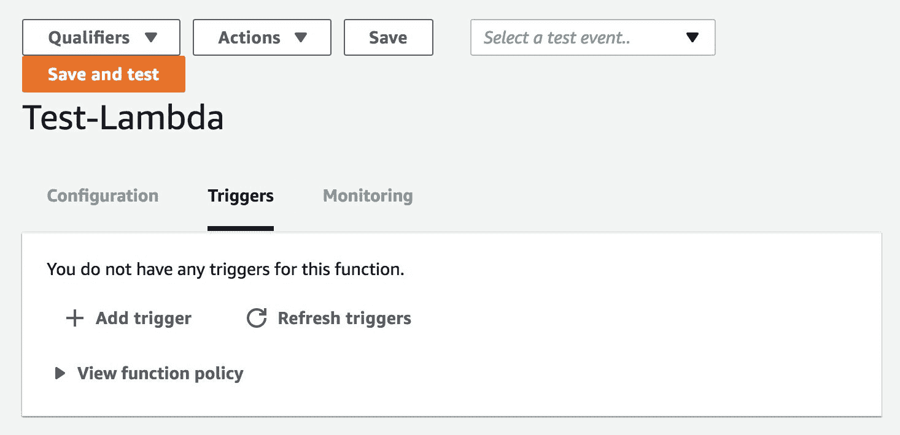
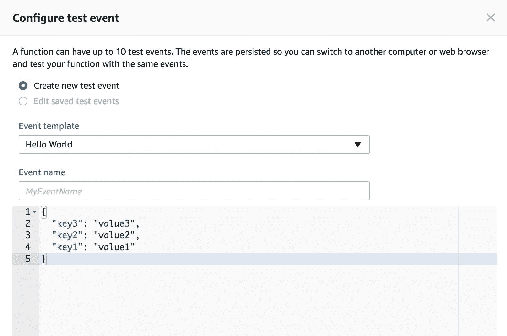
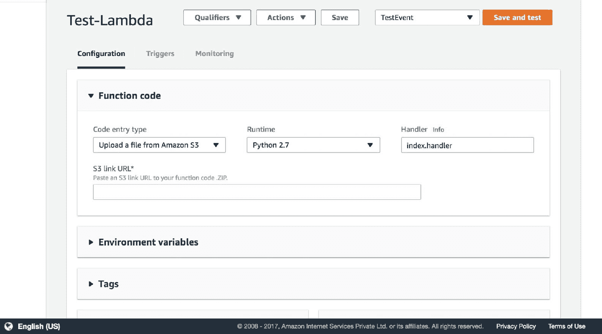
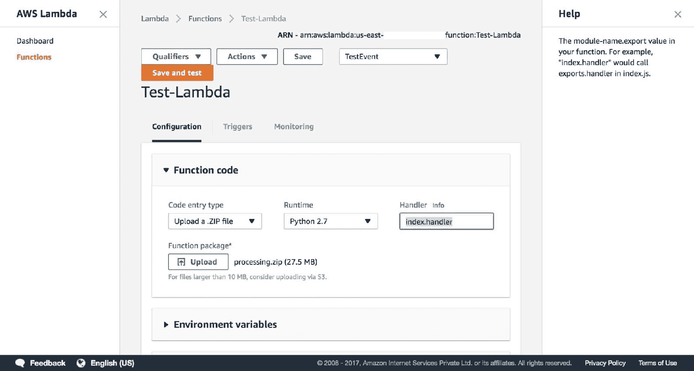

# 第二章：在 AWS 中构建无服务器应用程序

本章将介绍使用 AWS Lambda 作为首选工具的无服务器应用程序的概念。这将帮助您了解无服务器工具中涉及的概念、直觉和工作组件。它还将解释 Lambda 内部涉及的安全、用户控制和代码版本控制的细微差别。您将通过动手教程和课程来指导理解和学习使用 AWS Lambda。因此，建议您使用笔记本电脑和设置好的 AWS 账户跟随本章，以便轻松执行给定的指令。

本章将涵盖以下主题：

+   AWS Lambda 中的触发器

+   Lambda 函数

+   函数作为容器

+   配置函数

+   测试 Lambda 函数

+   Lambda 函数的版本控制

+   创建部署包

# AWS Lambda 中的触发器

无服务器函数是按需计算概念。因此，必须有一个事件来触发 Lambda 函数，以便启动整个计算过程。AWS Lambda 有几个事件可以作为触发器。几乎所有的 AWS 服务都可以作为 AWS Lambda 的触发器。以下是您可以为 Lambda 生成事件并使其响应的服务列表：

+   API Gateway

+   AWS IoT

+   CloudWatch Events

+   CloudWatch Logs

+   CodeCommit

+   Cognito Sync 触发器

+   DynamoDB

+   Kinesis

+   S3

+   SNS

AWS Lambda 的触发器页面看起来如下：

让我们看看以下一些重要且广泛使用的触发器，并了解它们如何在无服务器范式中被利用作为 FaaS。它们如下：

+   **API Gateway**：此触发器可用于创建高效、可扩展和无服务器的 API。一个无服务器 API 有意义的场景是在构建 S3 的查询界面时。假设我们在 S3 桶中有一堆文本文件。每当用户使用查询参数调用 API 时，该参数可以是我们在桶中的文本文件中想要搜索的某个词，API Gateway 的触发器将启动一个 Lambda 函数，该函数执行查询的计算逻辑和工作负载。我们想要我们的 API 触发的 Lambda 函数可以在 API 创建时指定。触发器将在相应的 Lambda 函数控制台中相应地创建。这看起来是这样的：

+   **CloudWatch**：它的事件主要帮助用户为 Lambda 设置 cron 调度。CloudWatch Logs 触发器在用户想要根据 Cloudwatch Logs 中的某些关键字执行计算工作负载时非常有用。然而，CloudWatch Alarms 不能直接通过 CloudWatch 触发器触发 Lambda。它们必须通过通知系统发送，例如**AWS 简单通知服务**（**AWS SNS**）。这就是您如何在 AWS Lambda 中创建 cron 执行的方式。在下面的屏幕截图中，Lambda 函数被设置为每分钟执行一次：

+   **S3**：这是 AWS 的文档存储。因此，每当添加、删除或更改文件时，如果将其作为触发器添加，则会向 AWS Lambda 发送事件。所以，如果您想在文件上传后立即对文件进行一些计算工作负载，那么这个触发器可以帮助您实现。这是 S3 事件结构的示例：

+   **AWS SNS**：AWS 的 SNS 服务帮助用户向其他系统发送通知。此服务还可以用于捕获 CloudWatch 警报并将通知发送到 Lambda 函数以进行计算执行。这是一个示例 SNS 事件的示例：

# Lambda 函数

**Lambda 函数**是无服务器架构的核心操作部分。它们包含要执行的代码。这些函数在触发器被触发时执行。我们已经在上一节中学习了关于一些最流行的 Lambda 触发器的知识。

每当 Lambda 函数被触发时，它会创建一个容器，并设置用户设置的相应设置。我们将在下一节中了解更多关于容器的内容。

容器的启动需要一些时间，这可能导致在 Lambda 函数的新调用时出现延迟，因为它需要设置环境和启动高级设置选项卡中提到的用户设置。因此，为了克服这种延迟，AWS 在解冻时间内解冻容器一段时间，以便在解冻时间内再次调用 Lambda 时重用。因此，使用解冻或现成的 Lambda 函数有助于克服延迟问题。然而，解冻容器的相同全局命名空间也将被用于新的调用。 

因此，如果 Lambda 函数中存在任何在函数内部被操作的全球变量，将它们转换为局部命名空间是一个好主意，因为被操作的全球命名空间变量将被重用，从而导致 Lambda 函数的执行结果出现故障。

用户需要在高级设置选项卡中指定 Lambda 函数的技术细节，包括以下内容：

+   内存（MB）：这是 Lambda 函数为您的函数分配的最大内存。容器会相应地分配 CPU。

+   超时：函数在容器自动停止之前需要执行的最大时间。

+   DLQ 资源：这是 AWS Lambda 的死亡信使设置。用户可以添加一个 SQS 队列或一个 SNS 主题来配置此设置。Lambda 函数在失败时至少会异步重试五次。

+   VPC：这使 Lambda 函数能够访问某些特定 VPC 中的组件或服务。Lambda 函数在其默认 VPC 中执行。

+   KMS 密钥：如果有任何环境变量与 Lambda 函数一起输入，则默认情况下，这有助于我们使用**AWS 密钥管理服务**（**KMS**）来加密它们。

Lambda 函数的高级设置页面看起来是这样的：

# 函数作为容器

为了理解函数作为/在容器中执行的概念，我们需要正确理解容器的概念。以下是从 Docker 文档中引用的容器定义（[`www.docker.com/what-docker`](https://www.docker.com/what-docker)）[:](https://www.docker.com/what-docker)

容器镜像是一个轻量级、独立、可执行的软件包，包括运行它所需的一切：代码、运行时、系统工具、系统库、设置。

适用于基于 Linux 和 Windows 的应用程序；容器化软件将始终在相同的环境中运行。

容器将软件与其周围环境隔离开来（例如，开发和预发布环境之间的差异），并有助于减少在相同基础设施上运行不同软件的团队之间的冲突。

因此，容器的概念是它们是自给自足的隔离环境，就像集装箱船中的集装箱一样，可以在任何主机操作系统上托管并工作，在这个类比中，主机操作系统就是主机船。这个类比的形象描述可能看起来像这样：

与上述类比类似，AWS Lambda 的函数也是在每个函数中启动的独立容器。因此，让我们更详细地了解这个主题，一点一点地：

1.  Lambda 函数可以是单个代码文件的形式，也可以是**部署包**的形式。部署包是一个包含核心函数文件以及函数将使用的库的压缩文件。我们将在本章的“创建部署包”部分详细学习如何创建部署包。

1.  每当函数被触发或启动时，AWS 都会启动一个带有 AWS Linux 操作系统的 EC2 实例来运行函数。实例的配置将取决于用户在 Lambda 函数的高级设置选项卡中提供的配置。

1.  函数成功执行的最大时间限制为 300 秒，或 5 分钟，之后容器将被销毁。因此，在设计 Lambda 函数和/或部署包时需要记住这一点。

# 配置函数

在本节中，我们将介绍配置 Lambda 函数的方法，并详细了解所有设置。就像在上一节中一样，我们将学习每个配置及其设置，如下所示：

1.  您可以通过选择位于 AWS 控制台右上角的下拉菜单中的 AWS Lambda 来进入 AWS Lambda 页面。操作方法如下：

1.  选择 Lambda 选项后，它将用户重定向到 AWS Lambda 控制台，其外观如下：

1.  为了创建一个函数，您需要在右侧点击橙色“创建一个函数”按钮。这将打开一个用于创建函数的控制台。它看起来大致如下：

1.  让我们从零开始创建一个函数，以便更好地理解配置。因此，为了做到这一点，请点击右上角的“从零开始创建”按钮。点击后，用户将被引导到 Lambda 的第一个运行控制台，其外观类似于以下：

1.  此页面有三个用户可以选择的配置，它们是名称、角色和现有角色。名称值是用户可以输入 Lambda 函数名称的地方。角色值是您如何在 AWS 环境中定义权限的方式。角色值的下拉列表将包含以下选项：选择一个现有角色、从模板创建新角色和创建自定义角色。它们如下所示：

选择一个现有角色选项将使我们能够选择一个已经存在的、具有预配置权限的角色。第二个选项帮助用户从预定义模板中创建角色。创建自定义角色选项允许用户从头开始创建具有权限的角色。预定义角色的列表看起来如下：

1.  为了本教程的目的，请从预定义模板中选择一个。通过在屏幕的右下角按下“创建函数”，我们将进入 Lambda 函数的创建页面，其外观类似于以下：

1.  前一个页面表明我们已经成功创建了一个 AWS Lambda 函数。现在我们将探索这个函数的高级设置。它们位于同一控制台的下半部分。它们看起来大致如下：

我们现在将尝试详细理解这些部分的每一个。

1.  展开的环境变量部分包含用于输入将要由我们的函数使用的键值对环境变量的文本框。还可以选择性地提及我们希望对环境变量采用的加密设置详情。加密需要通过**AWS KMS**（**密钥管理服务**）来完成。环境变量的展开设置框看起来大致如下：

1.  下一个设置部分是标签。这与所有可用 AWS 服务的标签功能类似，用于便于服务发现。因此，类似于所有 AWS 服务的标签，这也只需要一个键和一个值。展开的标签部分看起来大致如下：

1.  在标签部分之后可见的下一个部分是执行角色部分，用户可以在此为 Lambda 函数的执行设置 **身份访问管理（IAM**）角色。由于我们已经在书中讨论过 IAM 角色是什么，因此我们在此不再重复。如果用户在创建函数时没有设置角色，他们始终可以在此设置。在 Lambda 控制台中，该部分将如下所示：

    

1.  下一个部分是基本设置部分，包括 Lambda 容器的内存、容器的超时时间和 Lambda 函数的描述等设置。容器的内存可以从 128 MB 到 1,536 MB 不等。用户可以选择该范围内的任何值，并据此计费。超时时间可以从 1 秒到 300 秒，即 5 分钟。超时时间是 Lambda 函数及其容器在停止或终止之前运行的时间。下一个设置是 Lambda 函数的描述值，它充当 Lambda 函数的元数据。在控制台中，本部分看起来如下所示：

1.  下一个部分是网络部分，它也是关于 Lambda 函数与 **AWS 的虚拟私有云**（**VPC**）及其相关子网的网络设置。即使选择“无 VPC”作为选项，AWS Lambda 也会在其自己的安全 VPC 中运行。然而，如果您的 Lambda 函数访问或处理任何位于特定 VPC 或子网中的其他服务，则需要在本部分添加相应的信息，以便网络允许 Lambda 函数容器进行流量传输。在控制台中，本部分看起来如下所示：出于安全考虑，前一个截图中的敏感信息，如 IP 地址和 VPC ID，已被屏蔽。

1.  下一个部分是调试和错误处理部分。本部分允许用户为 Lambda 函数设置确保容错性和异常处理的措施。这包括 **死信队列**（**DLQ**）设置。

1.  Lambda 会自动重试异步调用中失败的执行。因此，未处理的数据包将自动转发到 DLQ 资源。在 Lambda 控制台中，DLQ 设置如下：

用户还可以为 Lambda 函数启用活动跟踪，这将有助于详细监控 Lambda 容器。在 Lambda 控制台的调试和错误处理部分中，此设置如下所示：

# 测试 Lambda 函数

正如每个其他软件系统和编程范式一样，在部署到生产之前对 Lambda 函数和无服务器架构进行适当的测试非常重要。以下我们将尝试理解 Lambda 函数的测试：

1.  在 Lambda 控制台的顶部栏中，可以观察到“保存并测试”选项，该选项由一个橙色按钮表示。此按钮保存 Lambda 函数，然后在该函数上运行配置的测试。在控制台中的外观如下：

1.  此外，在同一栏中，还存在一个下拉菜单，显示为“选择测试事件……”。这包含可用于测试 Lambda 函数的测试事件列表。下拉菜单的外观如下：

1.  现在，为了进一步配置 Lambda 函数的测试事件，用户需要在下拉菜单中选择“配置测试事件”选项。这将打开一个包含测试事件菜单的弹出窗口，其外观如下：

1.  这将打开基本的 Hello World 模板，该模板预配置了三个 JSON 格式的测试事件或边缘情况。然而，根据 Lambda 函数的功能，可以选择其他测试事件。可用的测试模板列表可在事件模板下拉菜单中查看。下拉菜单中的列表如下：

1.  例如，让我们想象我们正在构建一个管道，该管道涉及 Lambda 函数在图像文件添加到 S3 存储桶时启动，该函数执行一些图像处理任务并将其放回某些数据存储中。S3 Put 通知的测试事件看起来大致如下：

1.  在选择或创建测试事件后，用户可以在事件创建控制台的右下角选择“创建”选项，此时您将被要求输入事件的名称。在输入必要的详细信息后，用户将返回 Lambda 控制台。现在，当您检查 Lambda 控制台中的 TestEvent 下拉菜单时，您可以在列表中看到已保存的测试事件。这可以通过以下方式验证：

由于我将事件命名为**TestEvent**，因此在事件下拉菜单中，测试可通过相同名称可见。

1.  此外，当我们更仔细地查看测试事件中的 S3 事件结构时，我们可以观察到提供给 Lambda 函数的元详细信息。事件结构如下：

# Lambda 函数版本控制

**版本控制系统**（**VCS**）的概念是用于控制和管理工作代码的版本。此功能可直接从主 Lambda 控制台使用。让我们尝试学习如何对 Lambda 函数进行版本控制：

1.  Lambda 控制台操作下拉菜单中的第一个选项是“发布新版本”选项。此选项在此处可见：

1.  当选择“发布新版本”选项时，Lambda 控制台的版本控制弹出窗口将在控制台中显示。这将询问您 Lambda 函数新版本的名称。弹出窗口的外观如下：

1.  点击发布按钮后，您将被重定向到主 Lambda 控制台。控制台中成功创建的 Lambda 版本看起来如下：

1.  在页面下半部分，可以注意到以下信息：代码和处理器编辑仅适用于$LATEST 版本。这意味着只能编辑命名为$LATEST 的版本的代码。Lambda 函数的版本化版本是只读的，不能编辑和操作。当出现错误或用户想要回滚或参考以前的版本时，该版本将覆盖$LATEST 版本以进行编辑。信息看起来如下：

1.  当点击“点击此处转到$LATEST”链接时，用户将被重定向到函数的$LATEST 版本，用户可以对其进行编辑和操作。Lambda 函数的$LATEST 版本的控制台看起来如下：

# 创建部署包

依赖于外部库的 Lambda 函数可以作为部署包打包并上传到 AWS Lambda 控制台。这与在 Python 中创建虚拟环境非常相似。因此，在本节中，我们将学习和理解创建用于 Lambda 函数的 Python 部署的过程。我们将详细尝试理解创建部署包的过程，如下所示：

1.  部署包通常以 ZIP 包的格式存在。ZIP 包的内容与任何编程语言的正常库完全相同。

1.  包的结构应该是这样的，即库文件夹和函数文件位于同一个目标位置或部署包文件夹结构中的同一层次。布局看起来如下：

1.  可以使用`pip install <library_name> -t <path_of_the_target_folder>`命令安装 Python 库。这将把包安装到目标文件夹中。这可以通过以下截图中的方式完成：

1.  现在，当我们有了整个部署包文件夹以及库文件夹准备就绪后，我们需要在将其上传到控制台之前，将所有文件夹包括 Lambda 函数文件进行压缩。以下截图显示了按照文件夹层次结构进行压缩的方式：

1.  现在，当压缩包准备就绪后，我们将尝试将包上传到 Lambda 控制台进行处理。对于上传 Lambda 包，我们需要在控制台中选择代码输入类型选项的下拉列表。在 Lambda 控制台中，选择看起来如下：

1.  一旦选择了“上传 ZIP 文件”选项，上传器将变得可见，用户可以直接上传部署包，甚至可以通过 S3 存储桶上传。在 Lambda 控制台中，向导看起来如下：

1.  如前所述，用户可以选择通过 S3 文件位置上传部署包。在 Lambda 控制台中，此向导看起来是这样的：

1.  部署包的命名应与设置中处理器部分输入的值保持一致。部署包的名称与 Lambda 函数文件的名称之间用点（`.`）分隔，并按此顺序排列。这可以在以下屏幕截图中明确看到：

`index` 应该是 Lambda 函数文件名部署包的名称。`handler` 函数文件是内部核心功能处理器的名称，即 Lambda 函数。如 AWS 文档所述：

您函数中的模块名称导出值"。例如，index.handler 将调用 index.py 中的 exports.handler。

# 摘要

在本章中，我们学习了 AWS Lambda 触发器的工作原理以及如何根据问题陈述和时间间隔选择触发器，特别是在 cron 作业触发器的情况下。我们了解了 Lambda 函数是什么，以及它们的功能和与内存、VPC、安全性和容错性相关的设置。我们还了解了 AWS Lambda 内部容器重用的方式。然后，我们介绍了事件驱动函数及其在底层是如何实现的，容器概念及其在软件工程领域的应用和用途。最重要的是，从我们学到的容器概念中，我们现在可以欣赏到为运行 Lambda 函数选择容器的选项。

之后，我们讨论了 AWS Lambda 仪表板中所有可用的配置设置，这些设置对于从头到尾构建和运行 Lambda 函数而没有任何设置相关问题是必要的。我们还了解并理解了 Lambda 内部的安全设置，以便在配置我们的 Lambda 函数时考虑到必要的 VPC 细节和安全密钥设置。这之后是对根据所选触发器选择的 Lambda 函数进行测试。我们了解了各种 AWS 服务的响应看起来像什么，因为它们是 Lambda 函数的输入。然后我们学习了如何编写用于自定义测试目的的自定义测试。 

在此之后，我们了解了 AWS Lambda 函数的版本控制过程。我们学习了过去版本和当前版本之间的区别。我们还了解到，当前版本是不可变的，与过去的版本不同，并且我们也学会了如何不费太多力气地回滚到过去的版本。我们还学习了如何为依赖于外部包（这些包不包括在 Python 的标准库中）的函数创建部署包。我们还遇到了函数代码命名的细微差别，包括文件名和方法处理程序名称，随后是两种将部署包上传到 Lambda 控制台的方式；一种是通过手动上传，另一种是从 S3 文件位置上传。

在下一章中，我们将深入了解 Lambda 控制台中可用的不同触发器以及如何使用它们。我们还将学习如何在 Python 代码中实现它们。我们将理解事件结构和来自不同 AWS 服务的响应，并利用这些信息来构建我们的 Lambda 函数。我们将了解如何将每个触发器集成到 Lambda 函数中，并在 Python 中执行特定任务。最后，我们还将学习关于如何使用无服务器范式将现有基础设施迁移到无服务器的想法和最佳实践。
