# 第三章：设置无服务器架构

到目前为止，我们已经了解了无服务器范式是什么，以及无服务器系统是如何工作的。我们还了解了 AWS Lambda 的无服务器工具是如何工作的。我们还学习了 AWS Lambda 中触发器的基本工作原理，以及用户在 Lambda 环境中可用的系统设置和配置的详细理解。我们还学习了 Lambda 控制台的工作原理，以及如何详细识别和使用 Lambda 控制台的各种部分，包括代码部署、触发器操作、在控制台中部署测试、版本化 Lambda 函数，以及不同的设置。

到本章结束时，您将清楚地了解所有重要的 AWS Lambda 触发器，以及如何使用它们来设置高效的 Lambda 架构。您还将了解事件结构是什么，以及某些 AWS 资源的事件结构看起来像什么，以及如何利用这些知识来编写和部署更好的基于事件的 Lambda 架构。

本章将涵盖以下内容：

+   S3 触发

+   SNS 触发

+   SQS 触发

+   CloudWatch 事件和日志触发

# S3 触发

S3 是 AWS 对象存储服务，用户可以在其中存储和检索任何类型的对象。在本节中，我们将学习 S3 触发器的工作原理，S3 事件的架构结构，以及如何利用它们来构建 Lambda 函数。

我们将构建一个 Lambda 函数，该函数执行以下操作：

1.  从 S3 服务接收 PUT 请求事件

1.  打印文件的名称和其他主要细节

1.  将文件传输到不同的存储桶

因此，让我们开始学习如何高效地使用 S3 触发器。我们将逐步进行这项任务，如下所示：

1.  首先，我们需要为任务创建两个 S3 存储桶。一个将是用户上传文件的存储桶，另一个将是文件被 Lambda 函数传输和上传的存储桶。

1.  当没有预存存储桶时，S3 控制台看起来如下截图所示。您可以通过在 AWS 控制台左上角的“服务”下拉菜单中选择 S3 服务来访问它！[](img/00048.jpeg)

1.  让我们创建两个存储桶，分别是 `receiver-bucket` 和 `sender-bucket`。

1.  `sender-bucket` 存储桶将被用作用户上传文件的存储桶。`receiver-bucket` 存储桶是 Lambda 函数上传文件的存储桶。因此，根据我们的问题陈述，每当我们将文件上传到 `sender-bucket` 存储桶时，Lambda 函数就会被触发，文件也会被上传到 `receiver-bucket`。

1.  当我们在 S3 控制台中点击“创建存储桶”按钮时，我们会看到一个看起来像这样的对话框：

    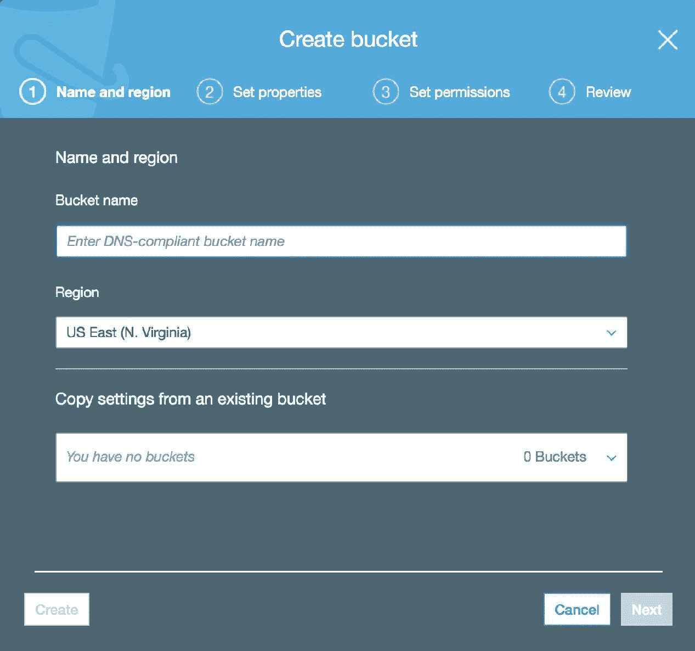

1.  在前面的对话框中，我们需要输入以下设置：

    +   存储桶名称：正如其名所示，我们需要输入我们正在创建的存储桶的名称。对于创建第一个存储桶，命名为`sender-bucket`，第二个存储桶命名为`receiver-bucket`。

    +   区域：这是我们希望存储桶所在的 AWS 区域。您可以使用默认区域或您所在位置最近的区域。

    +   从现有存储桶复制设置：这指定了我们是否希望为此存储桶使用与控制台中某个其他存储桶相同的设置。由于我们目前控制台中没有其他存储桶，我们可以通过将其留空来跳过此设置。之后，您可以在弹出窗口的右下角点击下一步按钮。

1.  点击下一步后，我们将被重定向到弹出窗口的第二标签页，即设置属性菜单，看起来如下：

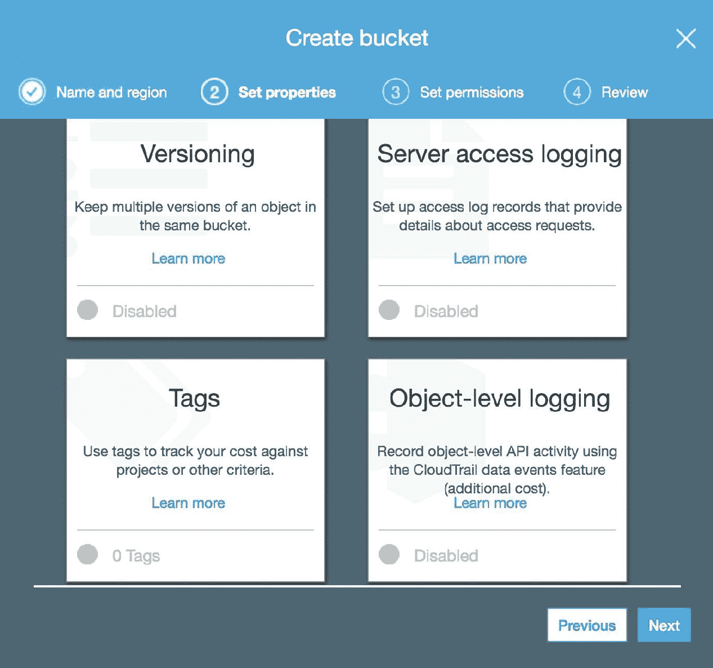

1.  在此弹出窗口的部分，我们需要决定以下设置：

    +   版本控制：如果我们想在 S3 存储桶中保留多个文件版本，这将是相关的。当你需要为 S3 存储桶提供 Git 风格的版本控制时，需要此设置。请注意，存储成本将根据版本化文档的数量相应增加。

    +   服务器访问日志：这将记录对 S3 存储桶的所有访问请求。这有助于调试任何安全漏洞并保护 S3 存储桶和文件。

    +   标签：这将使用*名称：值*样式标记存储桶，这与我们为 Lambda 函数学习到的标记方式相同。

    +   对象级日志记录：这将使用 AWS 的 CloudTrail 服务来记录对 S3 存储桶的所有访问请求和其他详细信息及活动。这还将包括 CloudTrail 的成本。因此，只有在你需要详细日志记录时才使用此功能。我们将跳过在此部分使用此功能。

1.  在完成创建存储桶后，S3 控制台将看起来像这样，列出了创建的存储桶：

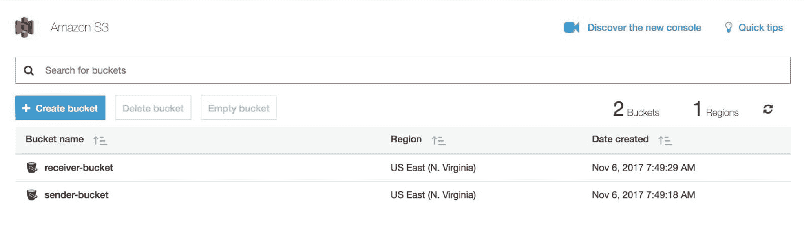

1.  我们已成功创建了用于我们任务的 S3 存储桶。现在，我们必须创建一个 Lambda 函数，该函数可以识别`sender-bucket`存储桶中的对象上传并将该文件发送到`receiver-bucket`存储桶。

1.  在创建 Lambda 函数时，这次从提供的选项中选择`s3-get-object-python`蓝图：

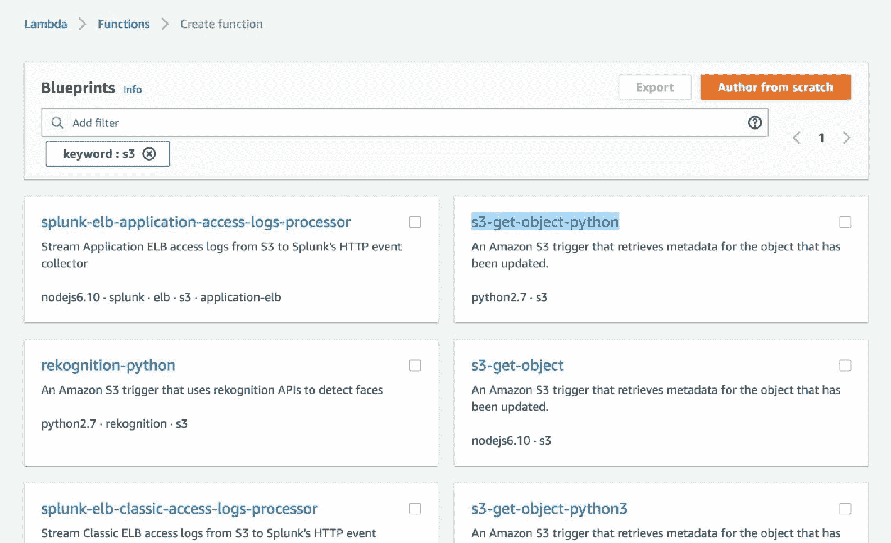

1.  在下一步中配置存储桶详细信息。在存储桶部分，选择`sender-bucket`存储桶，并在事件类型操作中选择对象创建（全部）选项。这是因为我们希望在`sender-bucket`存储桶中创建对象时向 Lambda 发送通知。该部分的完成部分将看起来如下：

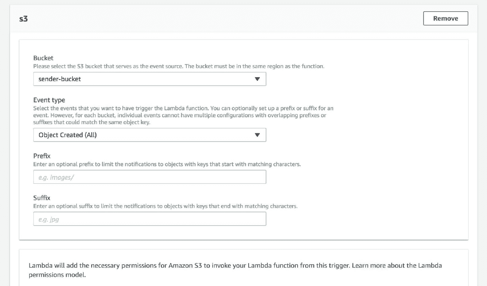

1.  启用触发器后，Lambda 将帮助您为任务创建样板代码。我们所需做的只是编写将对象放入`receiver-bucket`存储桶的代码。样板代码可以在 Lambda 函数代码部分中看到：

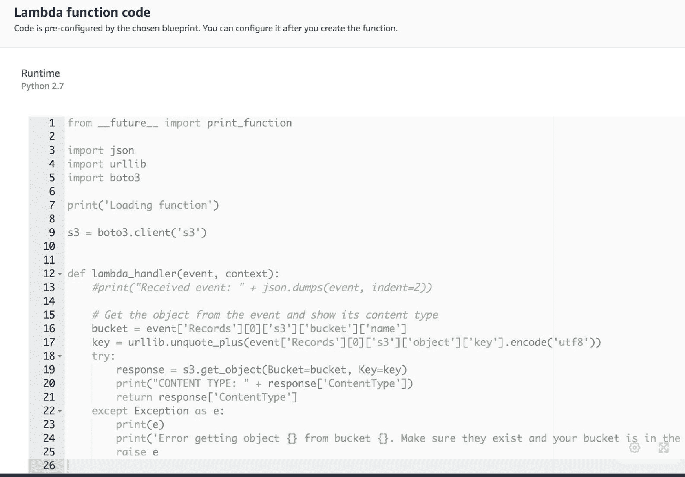

1.  当这一步完成并且你点击了创建功能按钮后，你可以在 Lambda 控制台的触发器部分看到，顶部会显示绿色的成功消息：

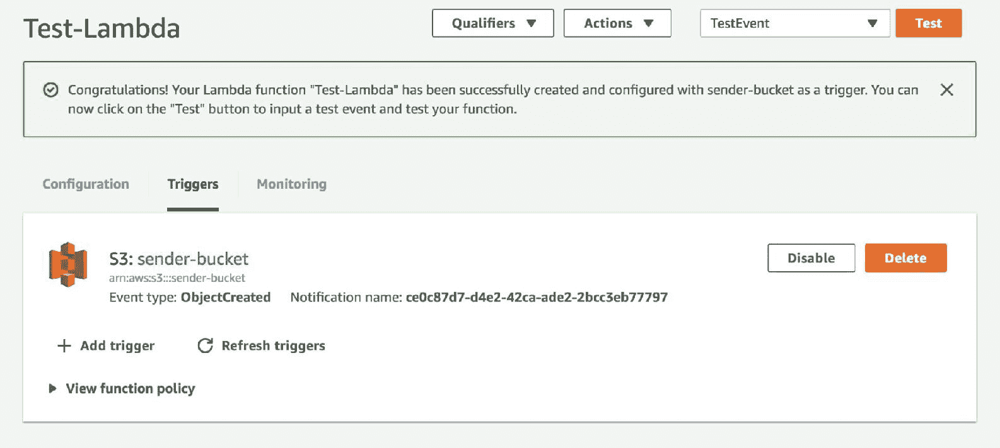

1.  我已将一个小图像文件上传到`sender-bucket`存储桶。因此，现在 sender-bucket 存储桶的内容如下：

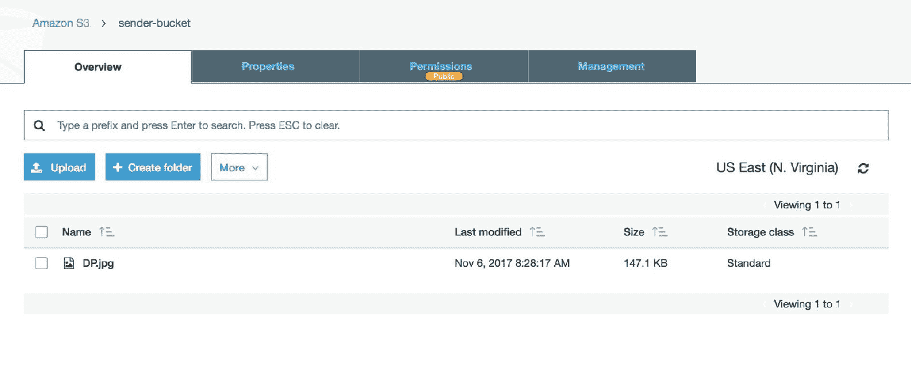

1.  一旦这个文件被上传，Lambda 函数就被触发了。Lambda 函数的代码如下：

```py
from __future__ import print_function

import json
import urllib
import boto3
from botocore.client import Config

print('Loading function')
sts_client = boto3.client('sts', use_ssl=True)

# Assume a Role for temporary credentials
assumedRoleObject = sts_client.assume_role(
RoleArn="arn:aws:iam::080983167913:role/service-role/Pycontw-Role",
RoleSessionName="AssumeRoleSession1"
)
credentials = assumedRoleObject['Credentials']
region = 'us-east-1'

def lambda_handler(event, context):
    #print("Received event: " + json.dumps(event, indent=2))

    # Get the object from the event and show its content type
    bucket = event['Records'][0]['s3']['bucket']['name']
    key = urllib.unquote_plus(event['Records'][0]['s3']       ['object']['key'].encode('utf8'))
    try:
        # Creates a session
        session = boto3.Session(credentials['AccessKeyId'],      credentials['SecretAccessKey'] ,      aws_session_token=credentials['SessionToken'],      region_name=region)

        #Instantiates an S3 resource
        s3 = session.resource('s3',  config=Config(signature_version='s3v4'), use_ssl=True)

        #Instantiates an S3 client
        client = session.client('s3',   config=Config(signature_version='s3v4'), use_ssl=True)

        # Gets the list of objects of a bucket
        response = client.list_objects(Bucket=bucket)

        destination_bucket = 'receiver-bucket'
        source_bucket = 'sender-bucket'

        # Adding all the file names in the S3 bucket in an  array
        keys = []
        if 'Contents' in response:
            for item in response['Contents']:
                keys.append(item['Key']);

        # Add all the files in the bucket into the receiver bucket
        for key in keys:
            path = source_bucket + '/' + key
            print(key)
        s3.Object(destination_bucket,  key).copy_from(CopySource=path)

    Exception as e:
        print(e)
print('Error getting object {} from bucket {}. Make sure they exist and your bucket is in the same region as this function.'.format(key, bucket))
raise e
```

1.  现在，当你运行 Lambda 函数时，你可以在 receiver-bucket 存储桶中看到相同的文件：

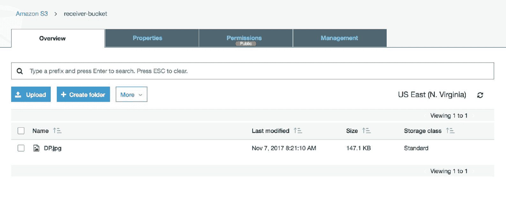

# SNS 触发

SNS 通知服务可以用于多个用例，其中之一涉及触发 Lambda 函数。SNS 触发器通常用作 AWS CloudWatch 服务和 Lambda 之间的接口。

因此，在本节中，我们将执行以下操作：

1.  创建一个 SNS 主题

1.  为我们的`receiver-bucket`存储桶创建一个 CloudWatch 警报来监控存储桶中的对象数量

1.  一旦对象计数达到 5，警报将被设置为 ALERT，并将相应的通知发送到我们刚刚创建的 SNS 主题

1.  此 SNS 主题将触发一个 Lambda 函数，为我们打印出“Hello World”消息

这将帮助你了解如何监控不同的 AWS 服务，并为这些指标设置一些阈值警报。根据服务的指标是否达到该阈值，Lambda 函数将被触发。

此流程的步骤如下：

1.  可以从 SNS 仪表板创建 SNS 主题。通过点击创建主题选项，你将被重定向到 SNS 的主题创建仪表板。AWS 的 SNS 仪表板看起来如下：

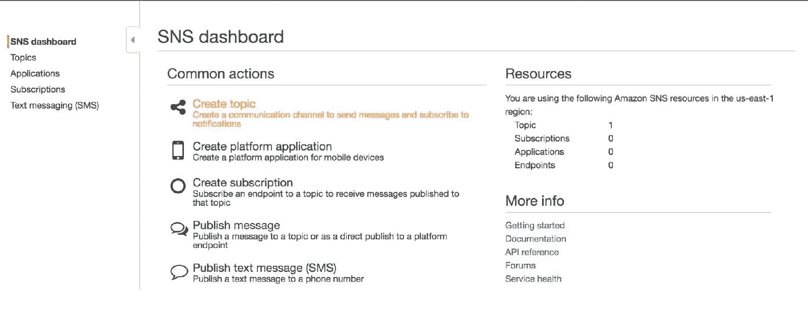

下一步的 SNS 主题创建向导看起来如下：

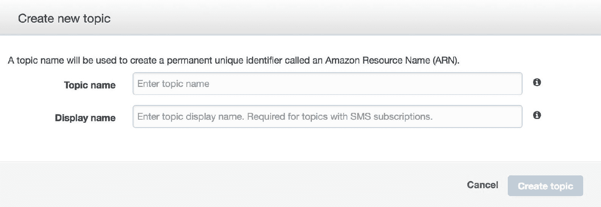

在此创建向导中，你可以为创建的 SNS 主题命名，并添加任何你想要的元信息。

1.  主题创建后，你可以在 SNS 仪表板左侧的“主题”菜单中查看它。按钮看起来如下：

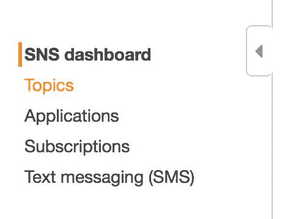

点击“主题”标签后，将显示一系列主题，如下面的截图所示：

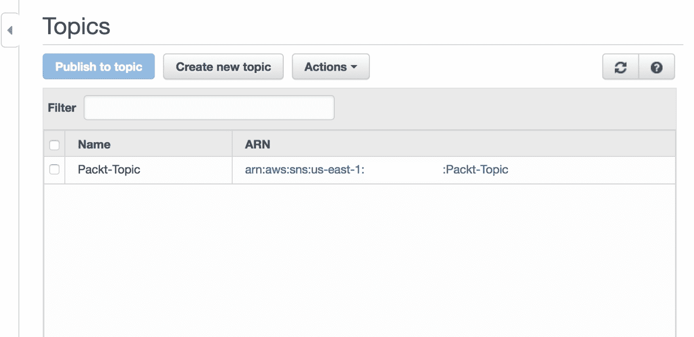

1.  现在我们已成功创建了一个 SNS 主题，我们将创建一个 CloudWatch 警报来监控我们的 S3 存储桶中的文件。AWS 的 CloudWatch 仪表板看起来大致如下：


1.  现在，我们可以通过点击仪表板左侧列表中的警报按钮，进入警报页面。AWS 的警报页面看起来如下：

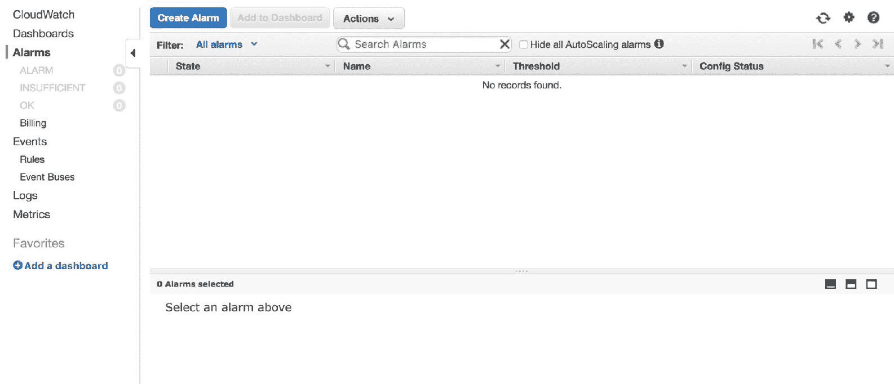

1.  接下来，点击“创建警报”以创建警报。这将打开一个带有多个选项的警报创建向导。根据你在 AWS 生态系统运行的服务，向导看起来是这样的：

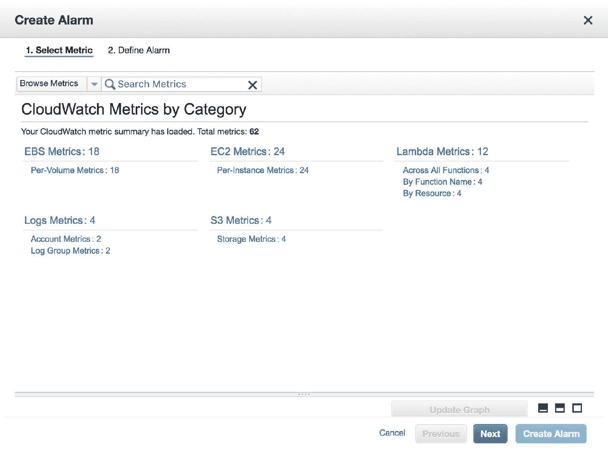

1.  由于我们打算为我们的 S3 存储桶创建一个警报，我们可以转到 S3 指标选项卡并忽略其他可用的指标。如果您在 S3 指标类别中点击存储指标选项，您将被重定向到另一个警报创建向导，如下所示，这取决于您在 S3 中拥有的存储桶数量：

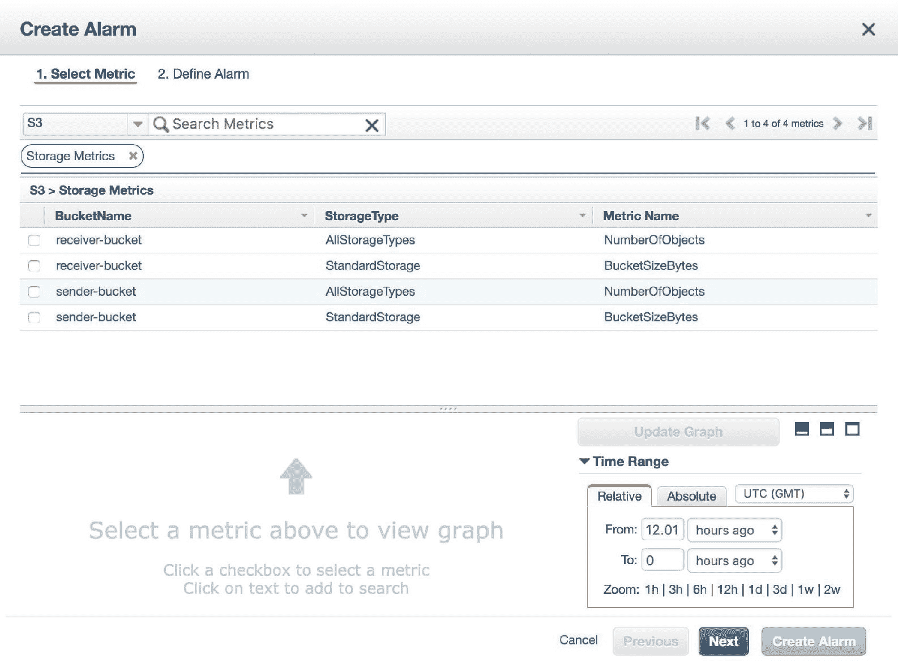

1.  如果您观察指标名称列中的选项，您将看到每个存储桶都有两个选项：NumberOfObjects 和 BucketSizeBytes。它们是自我解释的，我们只需要 `receiver-bucket` 存储桶的 NumberOfObjects 选项。因此，选择该选项并点击下一步：

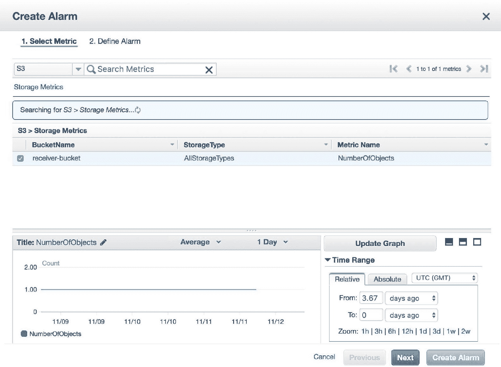

这将带您到警报定义向导，您需要指定 SNS 主题的详细信息和警报的阈值。向导看起来如下：

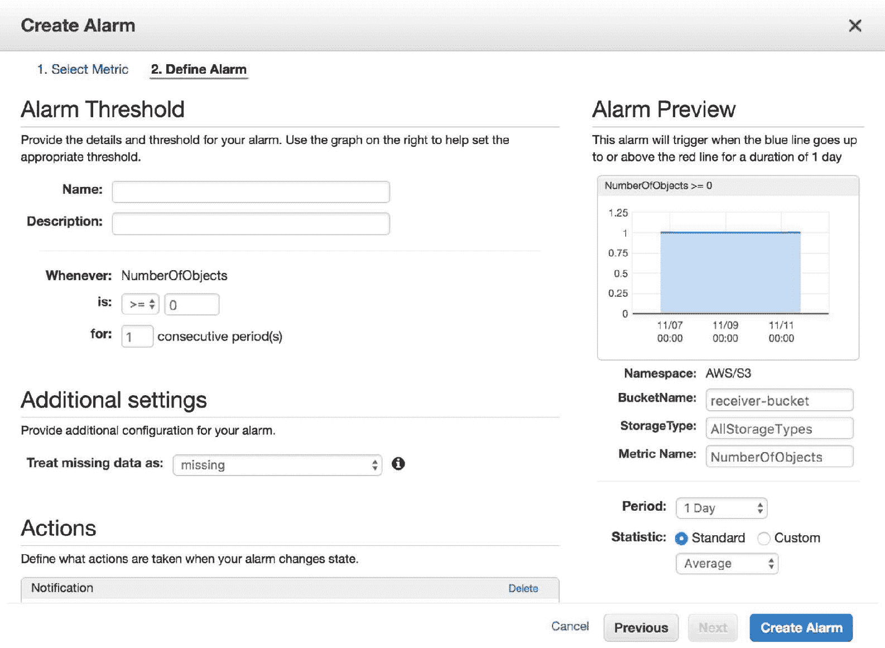

1.  添加阈值和警报名称的详细信息。阈值是五个文件，这意味着当相应存储桶（在我们的例子中是 `receiver-bucket`）中的文件总数达到五个时，警报将被触发。向导看起来如下：

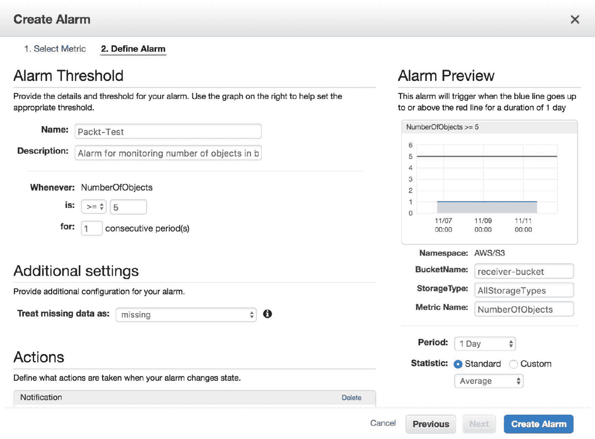

1.  在操作选项中，我们可以配置警报将通知发送到我们刚刚创建的 SNS 主题。您可以从下拉列表中选择主题，如下所示：

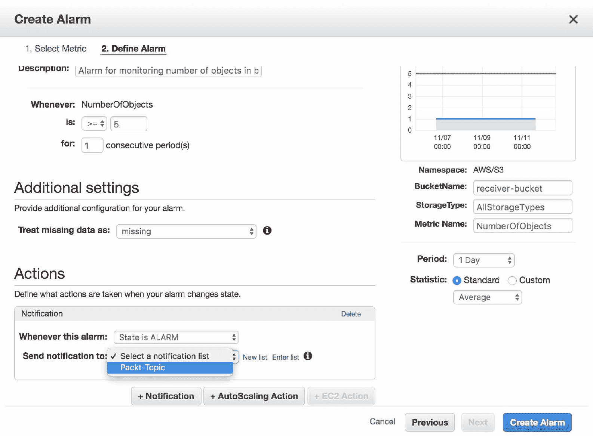

1.  一旦我们配置了 SNS 主题，我们就可以点击底部的蓝色创建警报按钮。这将创建一个与 SNS 主题链接的警报，作为通知管道。创建的警报在仪表板上看起来如下：

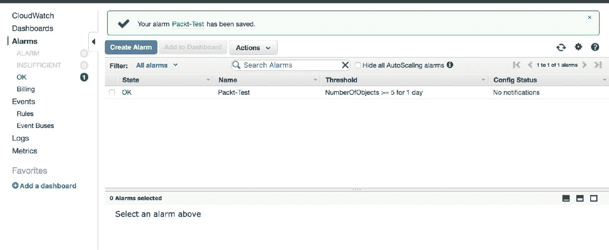

1.  现在，我们可以继续构建用于此任务的 Lambda 函数。对于这个特定的任务，在创建我们的 Lambda 函数时使用 sns-message-python 蓝图：

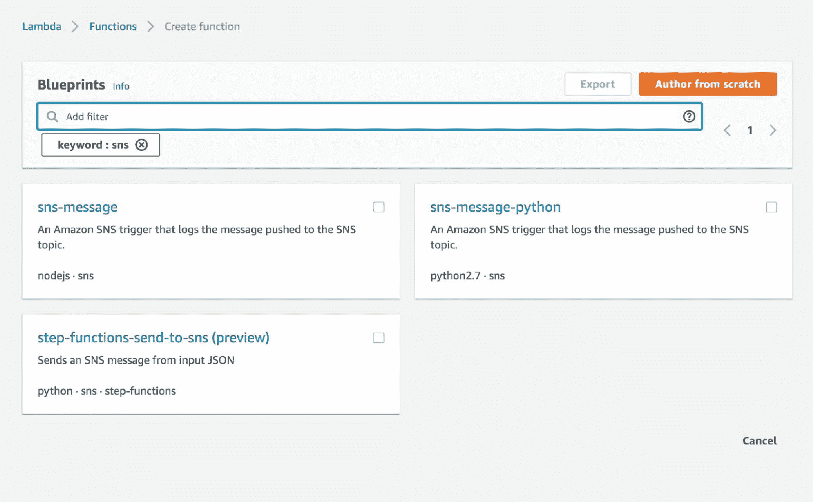

1.  在上一步中，当您选择了蓝图时，您将被要求输入有关您的 Lambda 函数的一些元信息，就像我们在创建 Lambda 函数时之前所做的那样。在相同的向导中，您还将被要求提及 SNS 主题的名称。您可以在此处指定它：

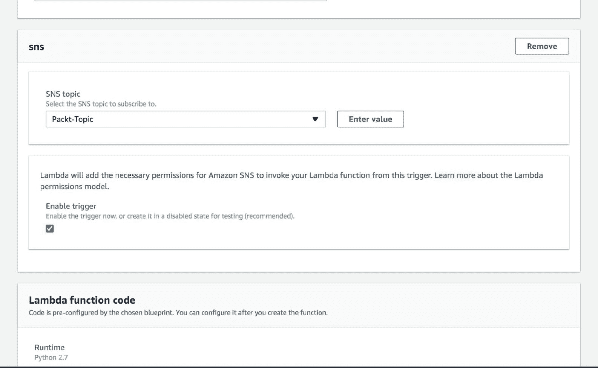

1.  现在我们已经正确选择了 Lambda 函数的所有选项，现在我们可以继续编写代码。所需的代码将如下所示：

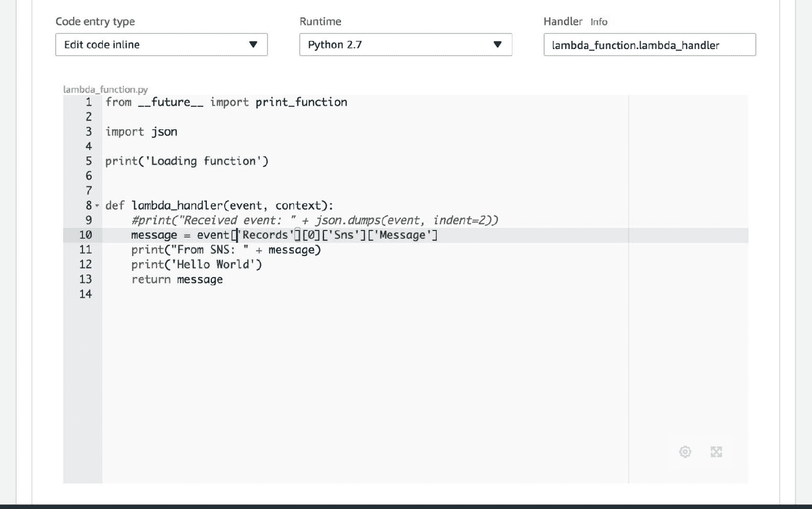

前面的代码将在 Lambda 函数被触发时显示一个 `Hello World` 消息。这样我们就完成了此任务的设置。

1.  要测试前面的设置，您只需将超过五个文件上传到您的 `receiver-bucket` 存储桶，并检查 Lambda 函数的执行情况。

# SQS 触发器

**AWS 简单队列服务 (SQS)** 是 AWS 队列服务。此服务类似于在软件工程中通常使用的排队机制。这使得我们能够在队列中添加、存储和删除消息。

我们将学习如何根据 SQS 队列中的消息数量触发 Lambda 函数。此任务将帮助您了解如何构建无服务器批数据架构以及如何自己构建一个。

我们将通过使用 CloudWatch 警报监控我们的 SQS 队列并将信息通过 SNS 主题传递给 Lambda 来完成此操作，就像我们在之前的任务中所做的那样。

因此，在本节中，我们将执行以下操作：

1.  创建 SQS 队列

1.  创建 SNS 主题

1.  为我们的 SQS 队列创建一个 CloudWatch 警报以监控队列中的消息数量

1.  一旦消息计数达到 5，警报将被设置为 ALERT，并将相应的通知发送到我们刚刚创建的 SNS 主题

1.  此 SNS 主题将触发一个 Lambda 函数，为我们打印出一条 `Hello World` 消息

这将帮助您了解如何监控队列并构建批处理而非实时的高效无服务器数据架构。

此过程的流程如下：

1.  我们将首先创建一个 AWS SQS 队列。我们需要转到我们 AWS 账户的 SQS 仪表板。仪表板看起来如下：

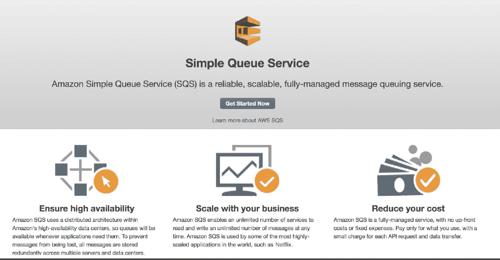

1.  点击“立即开始”按钮创建 SQS 队列。它将重定向您到队列创建向导，您需要输入诸如名称、队列类型等详细信息。队列创建向导看起来如下：

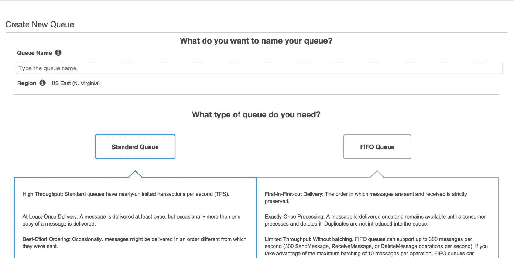

1.  您可以在“队列名称”中输入队列的名称。在“您需要哪种类型的队列？”选项中，选择“标准队列”选项。在底部的选项中，选择蓝色快速创建队列选项：


配置队列选项用于高级设置。对于此任务，不需要调整这些设置。高级设置看起来如下：

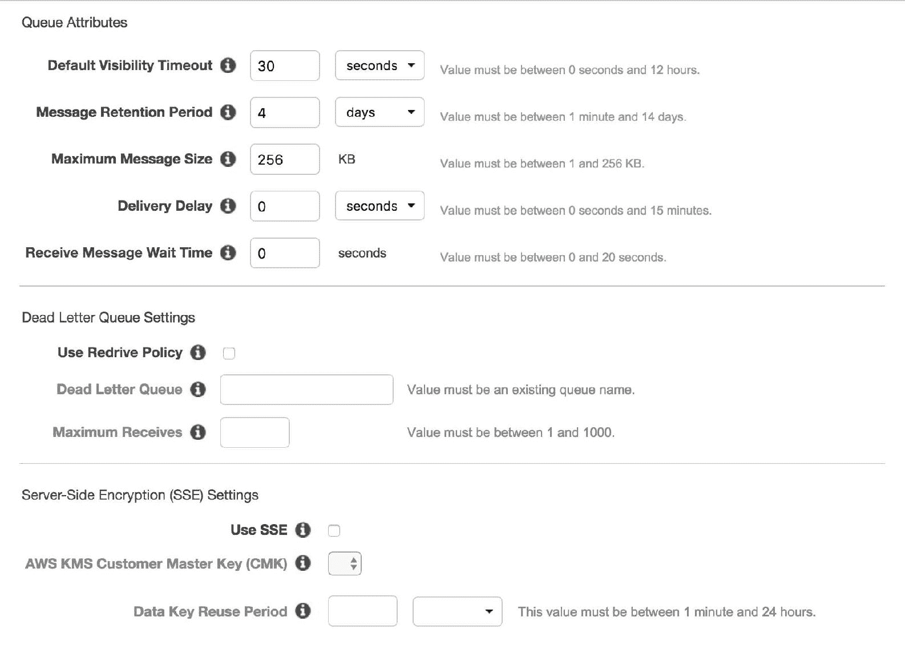

1.  一旦创建了队列，您将被带到 SQS 页面，其中列出了您创建的所有队列，类似于 SNS 列表。此页面看起来如下：

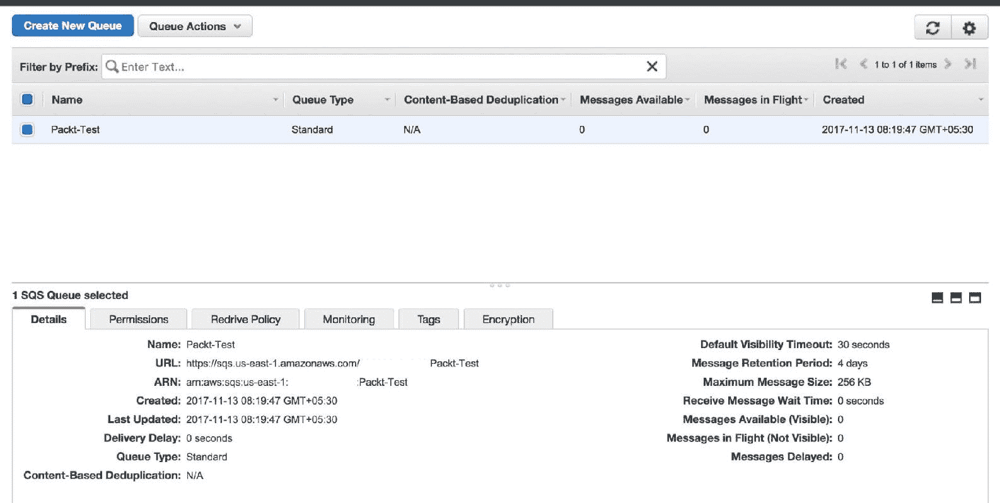

1.  由于我们已经在之前的任务中创建了一个 SNS 主题，我们将使用相同的主题来完成此任务。如果您还没有创建 SNS 主题，可以参考之前的任务了解如何创建一个。SNS 主题列表如下：

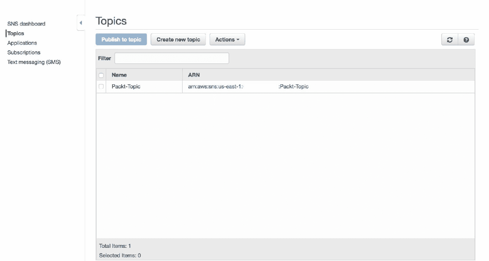

1.  现在，我们将转到 CloudWatch 仪表板创建一个警报以监控我们的 SQS 队列并通过我们已创建的 SNS 主题向 Lambda 发送通知。我们可以在警报创建向导中看到 SQS 队列指标：

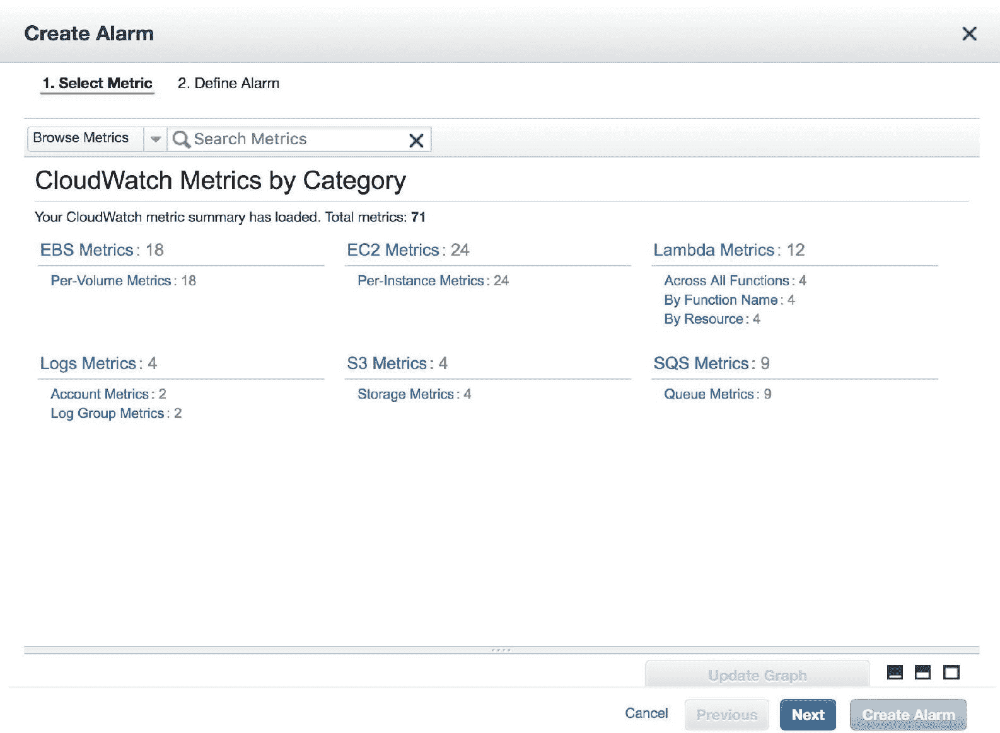

1.  通过点击 SQS 指标下的队列指标选项，我们将进入一个页面，其中列出了所有队列指标，我们需要从中选择一个用于我们的警报：

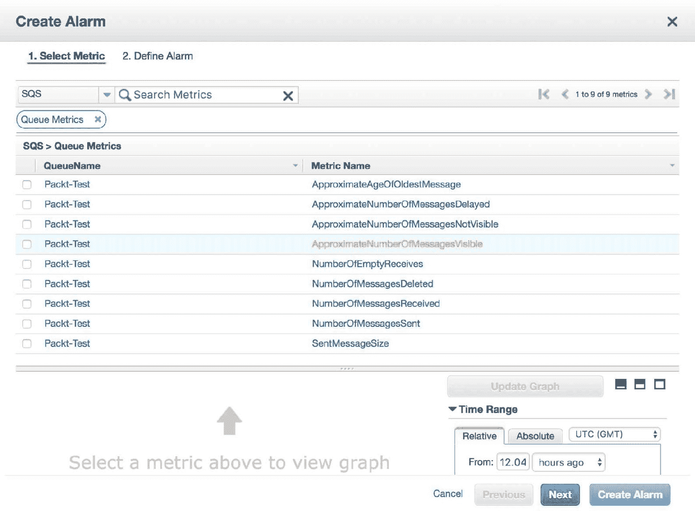

1.  在这里，我们关注的是近似可见消息数指标，它给出了队列中的消息数量。它说近似，因为 SQS 是一个分布式队列，消息数量只能通过随机方式确定。

1.  在下一页，在从列表中选择 ApproximateNumberOfMessagesVisible 指标后，可以配置必要的设置，就像我们在上一个任务中为 S3 指标所做的那样。页面应该看起来像这样：

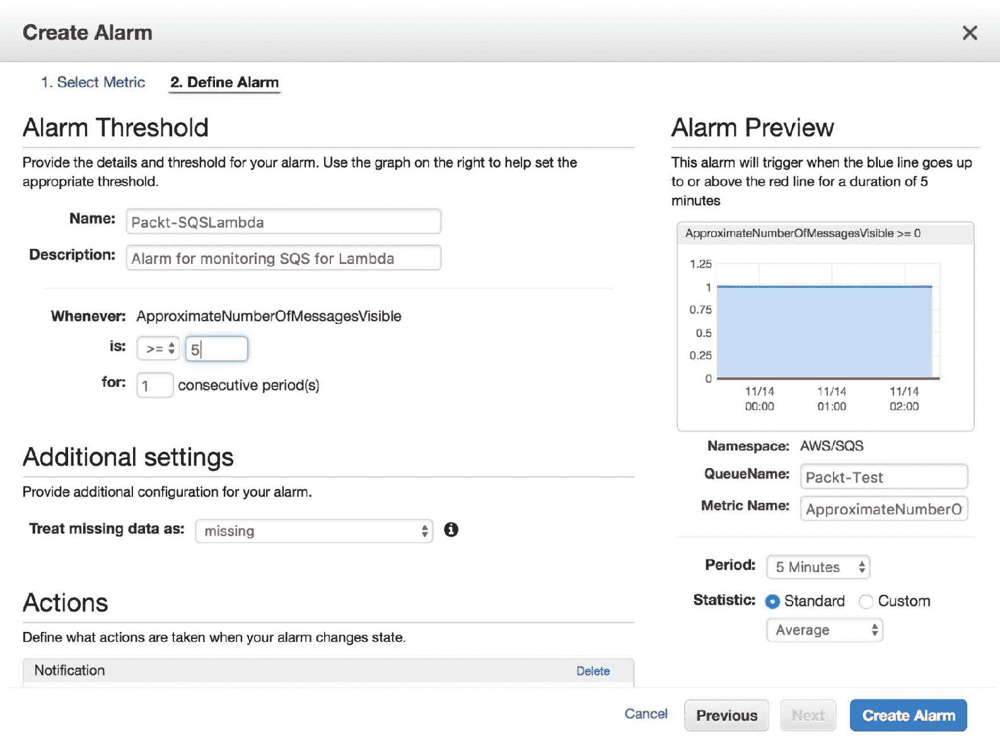

1.  在操作部分，配置我们想要发送通知的 SNS 主题。此步骤也与我们在上一个任务中配置 SNS 主题的方式相似：

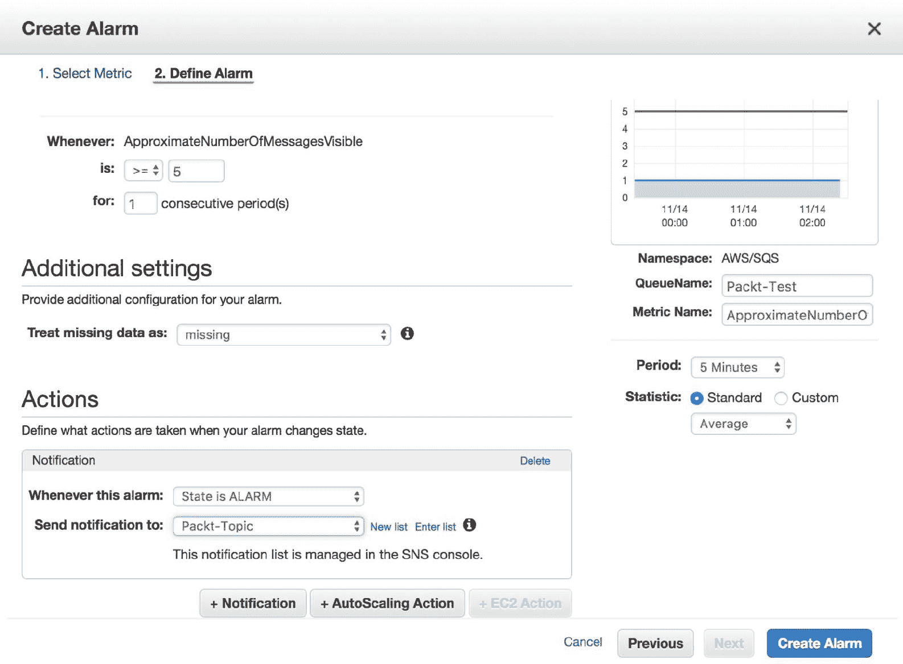

1.  一旦您对元数据和为警报配置的设置感到满意，您就可以点击屏幕右下角的蓝色创建警报按钮。这将成功创建一个监控您的 SQS 队列并向您配置的 SNS 主题发送通知的警报：

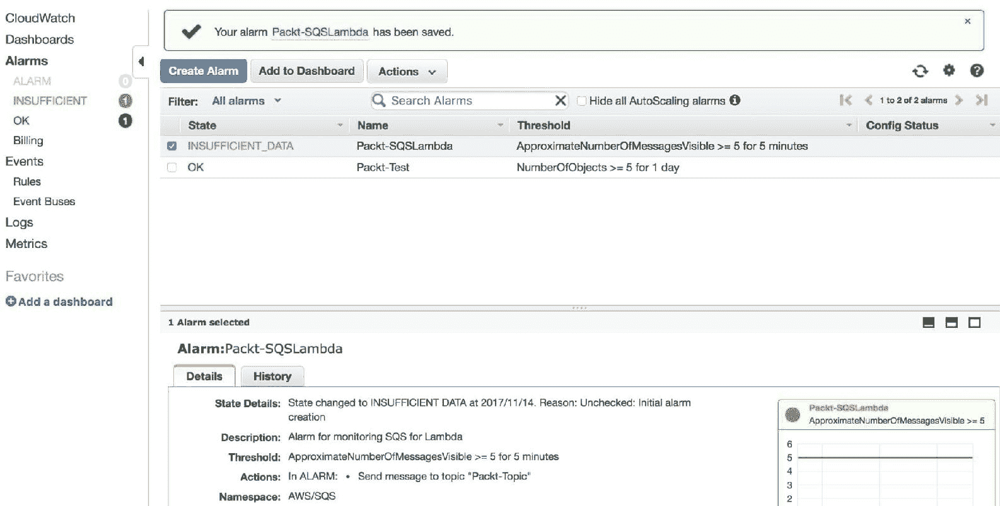

1.  我们可以使用在上一个任务中创建的 Lambda 函数。确保触发器是我们用于配置警报通知系统的 SNS 主题：

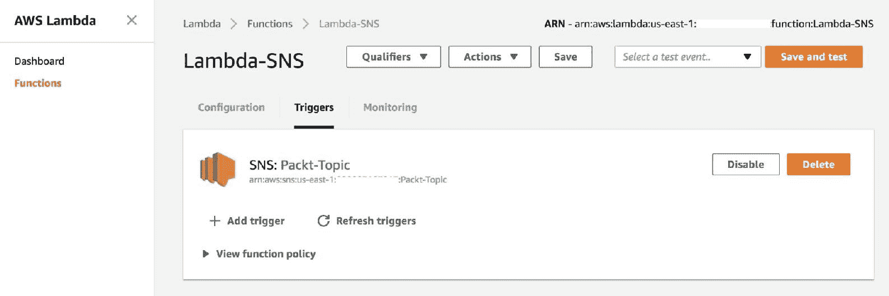

1.  此任务的 Lambda 函数代码如下：

```py
from __future__ import print_function
import json
print('Loading function')
def lambda_handler(event, context):
    #print("Received event: " + json.dumps(event, indent=2))
    message = event['Records'][0]['Sns']['Message']
    print("From SNS: " + message)
    print('Hello World')
    return message
```

# CloudWatch 触发器

**CloudWatch** 是 AWS 的日志和监控服务，其中大多数服务的日志都存储和监控。在本节中，我们将学习 CloudWatch 触发器的工作原理，CloudWatch 查询的实际工作方式，如何在 Lambda 函数中配置此功能，以及如何利用这些知识构建 Lambda 函数。

因此，在本节中，我们将执行以下操作：

1.  创建 CloudWatch 日志

1.  简要了解 CloudWatch 日志的工作原理

1.  创建一个由 CloudWatch 触发器触发的 Lambda 函数

这将帮助您理解和构建弹性稳定的无服务器架构。

此过程的流程如下：

1.  要创建 CloudWatch 日志组，请点击 CloudWatch 控制台左侧的“日志”选项：

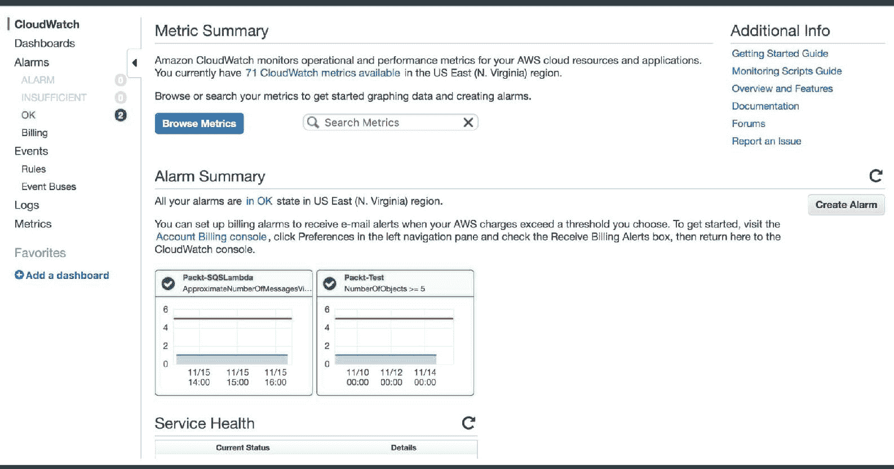

1.  一旦您进入 AWS CloudWatch 日志页面，您将看到已存在的日志组列表。CloudWatch 日志页面看起来大致如下：

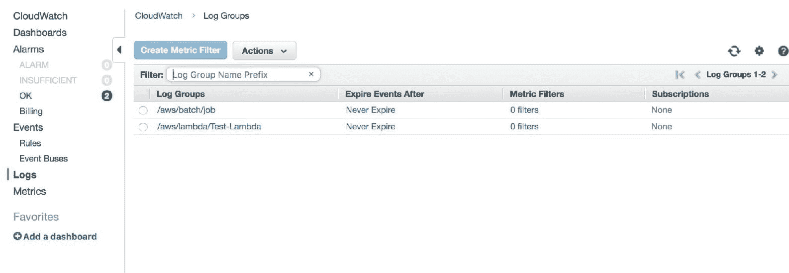

1.  让我们继续创建一个新的 CloudWatch 日志。您可以在顶部的操作下拉菜单中看到创建新日志组的选项：

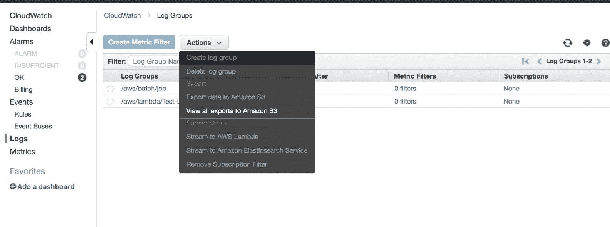

1.  在下一步中，您将被要求命名您正在创建的日志组。请输入相关信息并点击创建日志组：

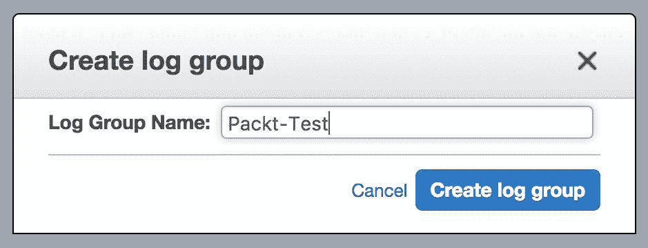

1.  因此，现在我们在 CloudWatch 控制台中的日志组列表中看到了一个新的日志组：

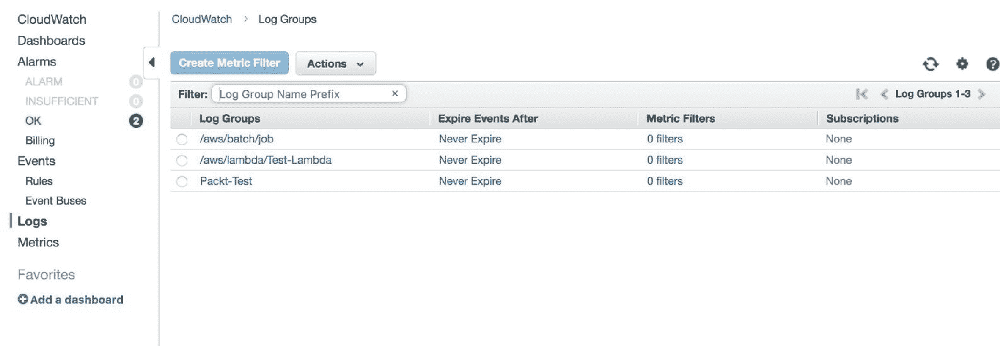

1.  一旦创建了日志组，我们现在就可以开始着手我们的 Lambda 函数了。所以，让我们转到 Lambda 控制台并开始创建一个新的函数。

1.  从蓝图中选择 cloudwatch-logs-process-data 蓝图。描述为：一个实时消费者，用于处理由 Amazon CloudWatch 日志组摄取的日志事件：

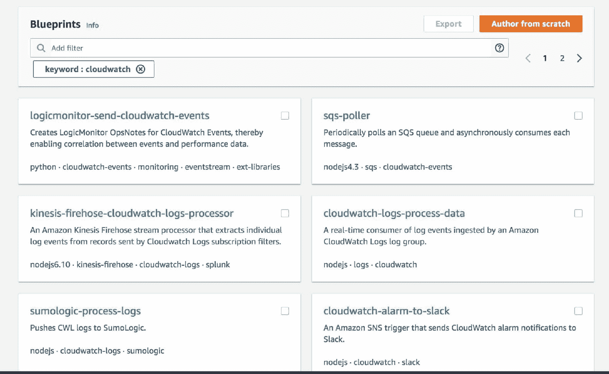

1.  在选择相应的蓝图选项后，您将像往常一样被重定向到 Lambda 创建向导：


1.  正如我们在上一个任务中所做的那样，我们也将有关日志名称和其他详细信息的相关信息输入到 Lambda 创建面板的 cloudwatch-logs 面板中：

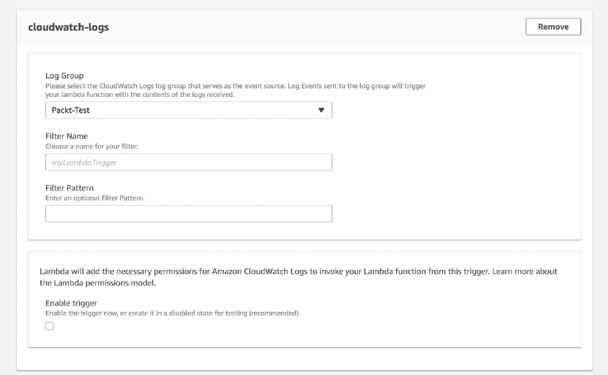

1.  点击创建函数后，我们将被引导到一个带有成功消息的触发器页面。

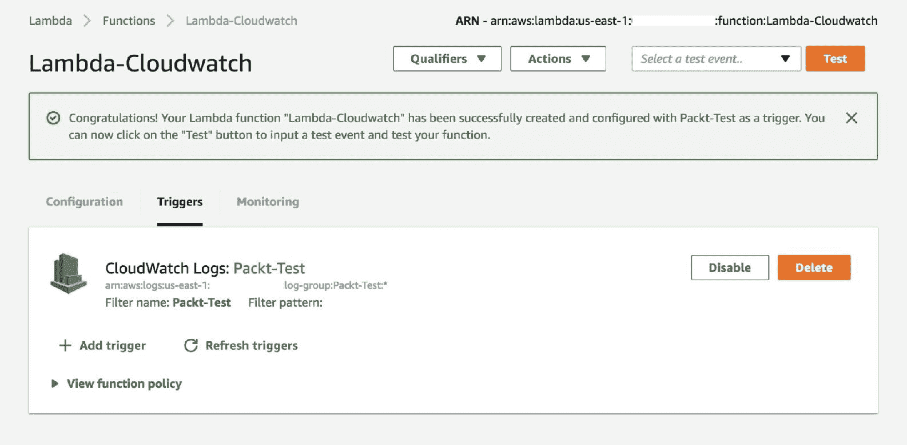

1.  因此，现在我们编写 Lambda 函数代码来识别日志组和打印`Hello World`消息：

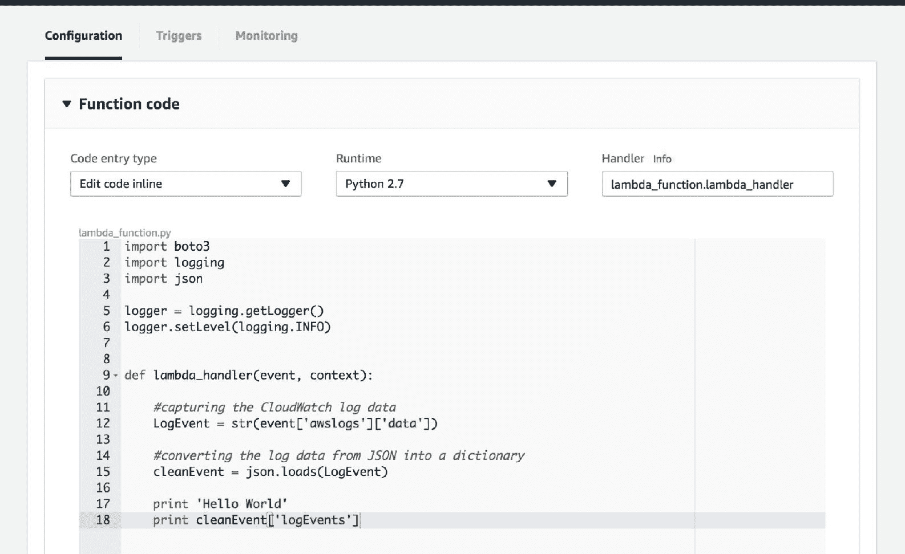

1.  我们现在已经成功完成了另一个任务，了解了如何通过 AWS CloudWatch Logs 触发 Lambda 函数。此任务的 Lambda 函数代码如下：

```py
 import boto3
 import logging
 import json
 logger = logging.getLogger()
 logger.setLevel(logging.INFO)
 def lambda_handler(event, context):
 #capturing the CloudWatch log data
 LogEvent = str(event['awslogs']['data'])
 #converting the log data from JSON into a dictionary
 cleanEvent = json.loads(LogEvent)
 print 'Hello World'
 print cleanEvent['logEvents']
```

# 摘要

在本章中，我们学习了各种 Lambda 触发器的工作原理，以及如何配置它们、设置触发器以及编写 Lambda 函数代码来处理来自它们的数据。

在第一个任务中，我们学习了 S3 事件的工作原理以及如何从 S3 服务接收事件并理解它们，然后通过 CloudWatch 中的指标监控 S3 存储桶的文件详情，并通过 AWS SNS 将通知发送到 Lambda 函数。

我们还学习了如何创建 SNS 主题以及如何将它们用作 CloudWatch 到 AWS Lambda 之间多个 AWS 服务指标的中继路由。

我们简要了解了 AWS CloudWatch 的工作原理。我们了解了各种 AWS 服务（如 S3、SQS 和 CloudWatch）的指标看起来是什么样子。我们还学习了如何为 CloudWatch Alarms 设置阈值，以及如何将这些警报连接到通知服务，如 AWS SNS。

我们学习了 AWS CloudWatch Logs 的工作原理以及如何连接并使用 Lambda 中的 CloudWatch 触发器，以便在添加/接收新的日志事件时触发。总的来说，我们成功创建了新的 AWS 服务，如 SQS、CloudWatch Logs、SNS 和 S3 存储桶，并在本章中成功构建和部署了三个无服务器任务/管道。

在下一章中，我们将学习如何构建无服务器 API，我们将执行一些与本章类似的任务，并亲身体验 API 的工作原理，最重要的是，了解无服务器 API 的工作原理。
