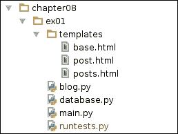
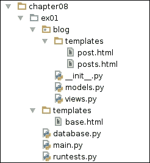
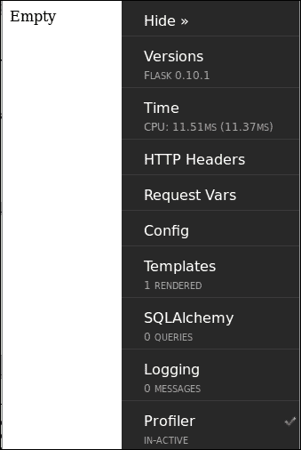

# 第八章：Flask 的技巧或巫术 101

在尝试更高级的 Flask 主题之前，你还能等多久？我肯定不能！在本章中，我们将学习技术和模块，这些对于更好更高效地使用 Flask 至关重要。

高质量的软件需要花费很长时间编码，或者低质量的软件可以很快交付？真正的 Web 开发，也就是你在月底拿到薪水的那种，需要可维护性，生产力和质量才能成为可能。

正如我们之前讨论的，软件质量与测试密切相关。衡量软件质量的一种方法是验证其功能与预期功能的接近程度。这种衡量并不考虑质量评估的主观方面。例如，客户可能认为他最新项目的设计很丑，认为一个经过良好测试的，符合功能的 Web 项目是*糟糕的*。在这些情况下，你所能做的就是为设计重构收取一些额外的费用。

### 提示

如果你遇到这种情况，可以让你的客户更接近开发过程，以避免这种情况。尝试在 Google 或 DuckDuckGo 中搜索“scrum”。

在谈论**生产力**和**可维护性**时，方法有很多！你可以购买一个像 PyCharm 或 WingIDE 这样的好的集成开发环境（IDE）来提高你的生产力，或者雇佣第三方服务来帮助你测试你的代码或控制你的开发进度，但这些只能做到这么多。良好的架构和任务自动化将是大多数项目中的最好朋友。在讨论如何组织你的代码以及哪些模块将帮助你节省一些打字之前，让我们讨论一下过早优化和过度设计，这是焦虑的开发人员/分析师/好奇的经理的两个可怕的症状。

# 过度设计

制作软件有点像制作公寓，有一些相似之处。在开始之前，你会提前计划你想要创造的东西，以便将浪费降到最低。与公寓相反，你不必计划你的软件，因为它在开发过程中很可能会发生变化，而且很多计划可能只是浪费。

这种“计划刚刚好”的方法的问题在于你不知道未来会发生什么，这可能会将我们内心的一点点偏执变成一些大问题。一个人可能最终会编写针对完全系统故障或复杂软件需求场景的代码，而这些可能永远不会发生。你不需要多层架构，缓存，数据库集成，信号系统等等，来创建一个 hello world，也不需要少于这些来创建一个 Facebook 克隆。

这里的信息是：不要使你的产品比你知道它需要的更健壮或更复杂，也不要浪费时间计划可能永远不会发生的事情。

### 提示

始终计划合理的安全性，复杂性和性能水平。

# 过早优化

你的软件足够快吗？不知道？那么为什么要优化代码，我的朋友？当你花时间优化你不确定是否需要优化的软件时，如果没有人抱怨它运行缓慢，或者你在日常使用中没有注意到它运行缓慢，你可能正在浪费时间进行过早优化。

所以，开始 Flask 吧。

# 蓝图 101

到目前为止，我们的应用程序都是平面的：美丽的，单文件的 Web 应用程序（不考虑模板和静态资源）。在某些情况下，这是一个不错的方法；减少了对导入的需求，易于使用简单的编辑器进行维护，但是...

随着我们的应用程序的增长，我们发现需要上下文地安排我们的代码。Flask 蓝图允许你将项目模块化，将你的视图分片成“类似应用程序”的对象，称为**蓝图**，这些蓝图可以稍后由你的 Flask 应用程序加载和公开。大型应用程序受益于使用蓝图，因为代码变得更有组织性。

在功能上，它还可以帮助您以更集中的方式配置已注册的视图访问和资源查找。测试、模型、模板和静态资源可以按蓝图进行排序，使您的代码更易于维护。如果您熟悉**Django**，可以将蓝图视为 Django 应用程序。这样，注册的蓝图可以访问应用程序配置，并可以使用不同的路由进行注册。

与 Django 应用程序不同，蓝图不强制执行特定的结构，就像 Flask 应用程序本身一样。例如，您可以将蓝图结构化为模块，这在某种程度上是方便的。

例子总是有帮助的，对吧？让我们看一个蓝图的好例子。首先，在我们的虚拟环境中安装了示例所需的库：

```py
# library for parsing and reading our HTML
pip install lxml
# our test-friendly library
pip install flask-testing

```

然后我们定义了我们的测试（因为我们喜欢 TDD！）：

```py
# coding:utf-8
# runtests.py

import lxml.html

from flask.ext.testing import TestCase
from flask import url_for
from main import app_factory
from database import db

class BaseTest(object):
    """
    Base test case. Our test cases should extend this class.
    It handles database creation and clean up.
    """

    def create_app(self):
        app = app_factory()
        app.config['TESTING'] = True
        return app

    def setUp(self):
        self.app.config['SQLALCHEMY_DATABASE_URI'] = 'sqlite:////tmp/ex01_test.sqlite'
        db.create_all()

    def tearDown(self):
        db.session.remove()
        db.drop_all()

class PostDetailTest(BaseTest, TestCase):
    def add_single_post(self):
        from blog import Post

        db.session.add(Post(title='Some text', slug='some-text', content='some content'))
        db.session.commit()

        assert Post.query.count() == 1

    def setUp(self):
        super(PostDetailTest, self).setUp()
        self.add_single_post()

    def test_get_request(self):
        with self.app.test_request_context():
            url = url_for('blog.posts_view', slug='some-text')
            resp = self.client.get(url)
            self.assert200(resp)
            self.assertTemplateUsed('post.html')
            self.assertIn('Some text', resp.data)

class PostListTest(BaseTest, TestCase):
    def add_posts(self):
        from blog import Post

        db.session.add_all([
            Post(title='Some text', slug='some-text', content='some content'),
            Post(title='Some more text', slug='some-more-text', content='some more content'),
            Post(title='Here we go', slug='here-we-go', content='here we go!'),
        ])
        db.session.commit()

        assert Post.query.count() == 3

    def add_multiple_posts(self, count):
        from blog import Post

        db.session.add_all([
            Post(title='%d' % i, slug='%d' % i, content='content %d' % i) for i in range(count)
        ])
        db.session.commit()

        assert Post.query.count() == count

    def test_get_posts(self):
        self.add_posts()

        # as we want to use url_for ...
        with self.app.test_request_context():
            url = url_for('blog.posts_view')
            resp = self.client.get(url)

            self.assert200(resp)
            self.assertIn('Some text', resp.data)
            self.assertIn('Some more text', resp.data)
            self.assertIn('Here we go', resp.data)
            self.assertTemplateUsed('posts.html')

    def test_page_number(self):
        self.add_multiple_posts(15)

        with self.app.test_request_context():
            url = url_for('blog.posts_view')
            resp = self.client.get(url)

            self.assert200(resp)

            # we use lxml to count how many li results were returned
            handle = lxml.html.fromstring(resp.data)
            self.assertEqual(10, len(handle.xpath("//ul/li")))

if __name__ == '__main__':
    import unittest
    unittest.main()
```

在前面的代码中，我们测试了一个单个视图`blog.posts_view`，它有两个路由，一个用于帖子详细信息，另一个用于帖子列表。如果我们的视图接收到一个`slug`参数，它应该只返回具有 slug 属性值的第一个`Post`；如果没有，它将返回最多 10 个结果。

现在我们可以创建一个视图，使用满足我们测试的蓝图：

```py
# coding:utf-8
# blog.py

from flask import Blueprint, render_template, request
from database import db

# app is usually a good name for your blueprint instance
app = Blueprint(
    'blog',  # our blueprint name and endpoint prefix
    # template_folder points out to a templates folder in the current module directory
    __name__, template_folder='templates'
)

class Post(db.Model):
    __tablename__ = 'posts'

    id = db.Column(db.Integer, primary_key=True)
    title = db.Column(db.String(100), nullable=False)
    slug = db.Column(db.String(100), nullable=False, unique=True)
    content = db.Column(db.Text(), nullable=False)

    def __unicode__(self):
        return self.title

@app.route("/")
@app.route("/<slug>")
def posts_view(slug=None):
    if slug is not None:
        post = Post.query.filter_by(slug=slug).first()
        return render_template('post.html', post=post)

    # lets paginate our result
    page_number = into(request.args.get('page', 1))
    page = Post.query.paginate(page_number, 10)

    return render_template('posts.html', page=page)
```

创建蓝图非常简单：我们提供蓝图名称，该名称也用作所有蓝图视图的端点前缀，导入名称（通常为`__name__`），以及我们认为合适的任何额外参数。在示例中，我们传递了`template_folder`作为参数，因为我们想使用模板。如果您正在编写服务，可以跳过此参数。另一个非常有用的参数是`url_prefix`，它允许我们为所有路径定义默认的 URL 前缀。

### 提示

如果我们的蓝图名称是`blog`，并且我们注册了一个方法`index_view`，我们对该视图的端点将是`blog.index_view`。端点是对视图的“名称引用”，您可以将其转换为其 URL 路径。

下一步是在我们的 Flask 应用程序中注册我们的蓝图，以便使我们编写的视图可访问。还创建了一个`database.py`模块来保存我们的 db 实例。

请注意，我们的 Post 模型将被`db.create_all`识别，因为它是在`blog.py`中定义的；因此，当模块被导入时，它变得可见。

### 提示

如果您在任何地方导入了一个模块中定义的模型类，那么它的表可能不会被创建，因为 SQLAlchemy 将不知道它。避免这种情况的一种方法是让所有模型都由定义蓝图的模块导入。

```py
# coding:utf-8
# database.py
from flask.ext.sqlalchemy import SQLAlchemy

db = SQLAlchemy()
## database.py END

# coding:utf-8
# main.py
from flask import Flask
from database import db
from blog import app as blog_bp

def app_factory(name=None):
    app = Flask(name or __name__)
    app.config['SQLALCHEMY_DATABASE_URI'] = 'sqlite:////tmp/ex01.db'

    db.init_app(app)

    # let Flask know about blog blueprint
    app.register_blueprint(blog_bp)
    return app

# running or importing?
if __name__ == '__main__':
    app = app_factory()
    app.debug = True

    # make sure our tables are created
    with app.test_request_context():
        db.create_all()

    app.run()
```

我们在这里有什么？一个`app_factory`，它创建我们的 Flask 应用程序，在`/tmp/`中设置默认数据库，这是一个常见的 Linux 临时文件夹；初始化我们的数据库管理器，在`database.py`中定义；并使用`register_blueprint`注册我们的蓝图。

我们设置了一个例行程序来验证我们是在运行还是导入给定的模块（对于`runtests.py`很有用，因为它从`main.py`导入）；如果我们正在运行它，我们创建一个应用程序，将其设置为调试模式（因为我们正在开发），在临时测试上下文中创建数据库（`create_all`不会在上下文之外运行），并运行应用程序。

模板（`post.html`和`posts.html`）仍然需要编写。您能写出来使测试通过吗？我把它留给你来做！

我们当前的示例项目结构应该如下所示：



嗯，我们的项目仍然是平的；所有模块都在同一级别上，上下文排列，但是平的。让我们尝试将我们的博客蓝图移动到自己的模块中！我们可能想要这样的东西：



博客模板位于博客包中的模板文件夹中，我们的模型位于`models.py`中，我们的视图位于`views.py`中（就像 Django 应用程序一样，对吧？）。

可以轻松进行这种更改。主要是创建一个`blog`文件夹，并在其中放置一个带有以下内容的`__init__.py`文件：

```py
# coding:utf-8
from views import *
```

将`Post`类定义和 db 导入移到`models.py`中，并将特定于博客的模板`post.html`和`posts.html`移到包内的`templates`文件夹中。由于`template_folder`是相对于当前模块目录的，因此无需更改我们的蓝图实例化。现在，运行您的测试。它们应该可以正常工作，无需修改。

喝一口水，戴上你的战斗头盔，让我们继续下一个话题：记录！

# 哦，天啊，请告诉我你有日志…

在面对一个你无法完全理解的神秘问题之前，你永远不会知道记录有多么重要。了解为什么会出现问题是人们将记录添加到他们的项目中的第一个，也可能是主要的原因。但是，嘿，什么是记录？

记录是存储有关事件的记录以供以后进一步分析的行为。关于记录的一个重要概念与记录级别有关，它允许您对信息类型和相关性进行分类。

Python 标准库捆绑了一个记录库，实际上非常强大，通过处理程序和消息，可以记录到流、文件、电子邮件或您认为合适的任何其他解决方案。让我们尝试一些有用的记录示例，好吗？

```py
# coding:utf-8
from flask import Flask
import logging
from logging.handlers import RotatingFileHandler

app = Flask(__name__)

# default flask logging handler pushes messages into the console
# works DEBUG mode only
app.config['LOG_FILENAME'] = '/var/tmp/project_name.log'
# log warning messages or higher
app.config['LOG_LEVEL'] = logging.WARNING
app.config['ADMINS'] = ['you@domain.com']
app.config['ENV'] = 'production'

def configure_file_logger(app, filename, level=logging.DEBUG):
    # special file handler that overwrites logging file after
    file_handler = RotatingFileHandler(
        filename=filename,
        encoding='utf-8',  # cool kids use utf-8
        maxBytes=1024 * 1024 * 32,  # we don't want super huge log files ...
        backupCount=3  # keep up to 3 old log files before rolling over
    )

    # define how our log messages should look like
    formatter = logging.Formatter(u"%(asctime)s %(levelname)s\t: %(message)s")
    file_handler.setFormatter(formatter)
    file_handler.setLevel(level)

    app.logger.addHandler(file_handler)

def configure_mail_logger(app, level=logging.ERROR):
    """
    Notify admins by e-mail in case of error for immediate action
    based on from http://flask.pocoo.org/docs/0.10/errorhandling/#error-mails
    """

    if app.config['ENV'] == 'production':
        from logging.handlers import SMTPHandler

        mail_handler = SMTPHandler(
            '127.0.0.1',
            'server-error@domain.com',
            app.config['ADMINS'], 'YourApplication Failed')

        mail_handler.setLevel(level)
        app.logger.addHandler(mail_handler)

if __name__ == '__main__':
    app.debug = True
    configure_file_logger(app, '/var/tmp/project_name.dev.log')
    configure_mail_logger(app)
    app.run()
```

在我们的示例中，我们创建了两个常见的记录设置：记录到文件和记录到邮件。它们各自的方式非常有用。在`configure_file_logger`中，我们定义了一个函数，将一个`RotatingFileHandler`注册到其中，以保存所有具有给定级别或以上的日志消息。在这里，我们不使用常规的`FileHandler`类，因为我们希望保持我们的日志文件可管理（也就是：小）。`RotatingFileHandler`允许我们为我们的日志文件定义一个最大大小，当日志文件大小接近`maxBytes`限制时，处理程序会“旋转”到一个全新的日志文件（或覆盖旧文件）。

记录到文件中非常简单，主要用于跟踪应用程序中的执行流程（主要是 INFO、DEBUG 和 WARN 日志）。基本上，文件记录应该在您有应该记录但不应立即阅读甚至根本不阅读的消息时使用（如果发生意外情况，您可能希望阅读 DEBUG 日志，但其他情况则不需要）。这样，在出现问题时，您只需查看日志文件，看看出了什么问题。邮件记录有另一个目标…

要配置我们的邮件记录器，我们定义一个名为`configure_mail_logger`的函数。它创建并注册一个`SMTPHandler`到我们的记录器在给定的记录级别；这样，每当记录一个具有该记录级别或更高级别的消息时，就会向注册的管理员发送一封电子邮件。

邮件记录有一个主要目的：尽快通知某人（或很多人）发生了重要事件，比如可能危及应用程序的错误。您可能不希望为此类处理程序设置低于 ERROR 的记录级别，因为会有太多的邮件需要跟踪。

关于记录的最后一条建议是，理智的项目都有良好的记录。追溯用户问题报告甚至邮件错误消息是很常见的。定义良好的记录策略并遵循它们，构建工具来分析您的日志，并设置适合项目需求的记录轮换参数。产生大量记录的项目可能需要更大的文件，而没有太多记录的项目可能可以使用较高值的`backupCount`。一定要仔细考虑一下。

# 调试、DebugToolbar 和幸福

在调试模式下运行 Flask 项目（`app.debug = True`）时，每当 Flask 检测到您的代码已更改，它将重新启动您的应用程序。如果给定的更改破坏了您的应用程序，Flask 将在控制台中显示一个非常简单的错误消息，可以很容易地分析。您可以从下往上阅读，直到找到第一行提到您编写的文件的行；这就是错误生成的地方。现在，从上往下阅读，直到找到一行告诉您确切的错误是什么。如果这种方法不够用，如果您需要读取变量值，例如更好地理解发生了什么，您可以使用`pdb`，标准的 Python 调试库，就像这样：

```py
# coding:utf-8
from flask import Flask

app = Flask(__name__)

@app.route("/")
def index_view(arg=None):
    import pdb; pdb.set_trace()  # @TODO remove me before commit
    return 'Arg is %s' % arg

if __name__ == '__main__':
    app.debug = True
    app.run()
```

每当调用`pdb.set_trace`时，将打开一个`pdb`控制台，它非常像 Python 控制台。因此，您可以查询任何您需要的值，甚至进行代码评估。

使用`pdb`很好，但是，如果您只想了解您的请求发生了什么，例如使用的模板，CPU 时间（这可能会让您困惑！），已记录的消息等，Flask-DebugToolbar 可能是一个非常方便的扩展。

## Flask-DebugToolbar

想象一下，您可以直接在渲染的模板中看到您的请求的 CPU 时间，并且可以验证使用哪个模板来渲染该页面，甚至可以实时编辑它。那会很好吗？您想看到它成真吗？那么请尝试以下示例：

首先，确保已安装扩展：

```py
pip install flask-debugtoolbar

```

然后是一些精彩的代码：

```py
# coding:utf-8
from flask import Flask, render_template
from flask_debugtoolbar import DebugToolbarExtension

app = Flask(__name__)
# configure your application before initializing any extensions
app.debug = True
app.config['SECRET_KEY'] = 'secret'  # required for session cookies to work
app.config['DEBUG_TB_TEMPLATE_EDITOR_ENABLED'] = True
toolbar = DebugToolbarExtension(app)

@app.route("/")
def index_view():
    # please, make sure templates/index.html exists ; )
    return render_template('index.html')

if __name__ == '__main__':
    app.run()
```

使用 Flask-DebugToolbar 没有什么神秘的。将`debug`设置为`True`，添加`secret_key`，并初始化扩展。当您在浏览器中打开`http://127.0.0.1:5000/`时，您应该看到类似这样的东西：



右侧的可折叠面板是调试工具栏在每个 HTML 响应中插入的一小部分 HTML，它允许您检查响应，而无需使用`pdb`等调试器。在示例中，我们将`DEBUG_TB_TEMPLATE_EDITOR_ENABLED`设置为`True`；此选项告诉 DebugToolbar 我们希望直接从浏览器中编辑渲染的模板。只需转到**模板** | **编辑模板**来尝试。

# 会话或在请求之间存储用户数据

有时，在应用程序中会出现这样的情况，需要在请求之间保留数据，但无需将其持久化在数据库中，比如用于标识已登录用户的身份验证令牌，或者用户添加到购物车中的商品。在这些危险时刻，请使用 Flask 会话。

Flask 会话是使用浏览器 cookie 和加密实现的请求之间的瞬时存储解决方案。Flask 使用秘钥值来加密您在会话中设置的任何值，然后将其设置在 cookie 中；这样，即使恶意人士可以访问受害者的浏览器，也无法读取 cookie 的内容。

### 提示

由于秘钥用于加密会话数据，因此为您的秘钥设置一个强大的值非常重要。`os.urandom(24)`可能会为部署环境创建一个强大的秘钥。

会话中存储的数据是瞬时的，因为不能保证它在任何时候都会存在，因为用户可能会清除浏览器的 cookie，或者 cookie 可能会过期，但如果您设置了它，它很可能会存在。在开发时，始终考虑这一点。

Flask 会话的一个重大优势是其简单性；您可以像使用常规字典一样使用它，就像这样：

```py
# coding:utf-8

from flask import Flask, render_template, session, flash
from flask.ext.sqlalchemy import SQLAlchemy

app = Flask(__name__)
# strong secret key!!
app.config['SECRET_KEY'] = '\xa6\xb5\x0e\x7f\xd3}\x0b-\xaa\x03\x03\x82\x10\xbe\x1e0u\x93,{\xd4Z\xa3\x8f'
app.config['SQLALCHEMY_DATABASE_URI'] = 'sqlite:////tmp/ex05.sqlite'
db = SQLAlchemy(app)

class Product(db.Model):
    __tablename__ = 'products'

    id = db.Column(db.Integer, primary_key=True)
    sku = db.Column(db.String(30), unique=True)
    name = db.Column(db.String(255), nullable=False)

    def __unicode__(self):
        return self.name

@app.route("/cart/add/<sku>")
def add_to_cart_view(sku):
    product = Product.query.filter_by(sku=sku).first()

    if product is not None:
        session['cart'] = session.get('cart') or dict()
        item = session['cart'].get(product.sku) or dict()
        item['qty'] = item.get('qty', 0) + 1
        session['cart'][product.sku] = item
        flash(u'%s add to cart. Total: %d' % (product, item['qty']))

    return render_template('cart.html')

def init():
    """
    Initializes and populates the database
    """
    db.create_all()

    if Product.query.count() == 0:
        db.session.add_all([
            Product(sku='010', name='Boots'),
            Product(sku='020', name='Gauntlets'),
            Product(sku='030', name='Helmets'),
        ])
        db.session.commit()

if __name__ == '__main__':
    app.debug = True

    with app.test_request_context():
        init()

    app.run()
# == END
# cart.html
<html><head>
  <title>Cart</title>
</head><body>

  
  <ul>
    
    <li>{{ message }}</li>
    
  
  </ul>

</body></html>
```

在示例中，我们定义了一个非常简单的产品模型，带有 ID、名称、sku（用于在商店中识别产品的特殊字段），以及一个视图，将请求的产品添加到用户会话中的购物车中。正如您所看到的，我们并不假设会话中有任何数据，始终保持谨慎。我们也不需要在更改后“保存”会话，因为 Flask 足够聪明，会自动注意到您的会话已经更改并保存它……实际上，这里有一个小技巧。Flask 会话只能检测到会话是否被修改，如果您修改了它的第一级值。例如：

```py
session['cart'] = dict()  # new cart
# modified tells me if session knows it was changed
assert session.modified == True
session.modified = False  # we force it to think it was not meddled with
session['cart']['item'] = dict()
# session does not know that one of its children was modified
assert session.modified == False
# we tell it, forcing a update
session.modified =True
# session will be saved, now
```

现在运行您的项目，并在浏览器中打开 URL `http://localhost:5000/cart/add/010`。看到每次重新加载时计数器是如何增加的吗？嗯，那就是会话在工作！

# 练习

让我们把知识付诸实践吧？尝试制作一个商店网站应用，比如一个在线宠物商店。它应该有宠物服务，例如洗澡和兽医咨询，还有一个小商店，出售宠物配饰。这应该足够简单（很多工作！但是简单）。

# 总结

这是一个密集的章节。我们概述了重要的概念——如性能和可维护性、生产力和质量——快速讨论了过早优化和过度工程化，并将我们的努力集中在学习如何用 Flask 编写更好的代码上。

蓝图允许您使用 Flask 创建强大的大型项目，并通过一个完整的示例进行了讨论；我们学习了如何记录到文件和邮件以及每个的重要性，与 Flask-DebugToolbar 度过了愉快的时光（非常方便！），并且将默认的会话设置和使用牢记在心。

你现在是一个有能力的 Flask 开发者。我感到非常自豱！

就像一个人在尝试漂移之前先学会开车一样，我们将在下一章开始我们的 Flask 漂移。我们的重点将是利用 Flask 提供的广泛扩展生态系统来创建令人惊叹的项目。这将非常有趣！到时见！
