# 第二章：电路基础和 GPIO

在本章中，我们将学习如何设置一个外部电子电路的基本知识，您可以使用 BeagleBone 板上的通用输入/输出（GPIO）引脚与之接口。本章将侧重于让读者理解如何通过解释它们的工作原理来布线电子电路，然后使用 BeagleBone 板上的 GPIO 进行操作。

对于有电子背景的读者，前三个主题中涵盖的大部分内容都将很熟悉，但我仍然建议您浏览这些主题以复习基础知识。由于本书的编写方式使得没有电子知识背景的读者也能理解和参与项目，因此这些主题必须包含在章节中。

本章内容分为以下主题：

+   前提条件

+   电路的电和电子基础知识

+   面包板的使用

+   开关和 LED

+   GPIO

+   将库添加到 Python

+   使用 Python 访问 GPIO

+   简单项目：使用 Python 脚本闪烁 LED

# 前提条件

本主题将涵盖您需要开始使用 BeagleBone Black 在线的哪些部分。您可以从您最喜欢的在线商店或任何当地商店购买这些部件。单个电子元件，如电阻、晶体管、LED 等，通过导电线连接到电源元件，如电池或其他电源，电流通过这些电子元件流动，从而形成一个电子电路：

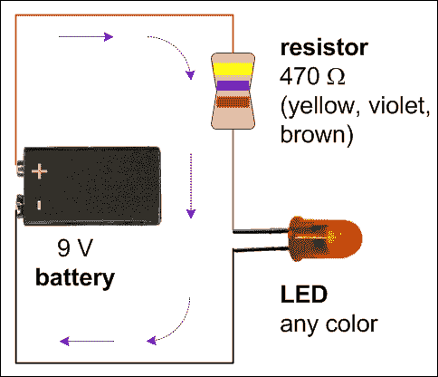

在本章的“开关和 LED”部分，我们将看到如何使用 LED 制作我们的第一个简单电路，然后连接一个开关到它。

# 面包板的使用

在本节中，您将了解面包板是什么，为什么被称为面包板，以及如何使用它们。完成这些后，您应该对面包板的工作原理有一个基本的理解，并能够开始使用它来在面包板上构建基本电路。

面包板由行和列的电气连接组成。每一列都与行上的每个点电连接，您可以看到有连接性的黑色列线。您可以使用电线将任何一列与另一列连接。顶部和底部有较大的行，通常用于电源的正负极，换句话说，VCC（电源）和 GND（地）信号。您可以使用这些来轻松地将任何一列连接到 VCC 或 GND，或者根据您的意愿用于其他任何目的，因为没有限制，它就像任何其他行一样：

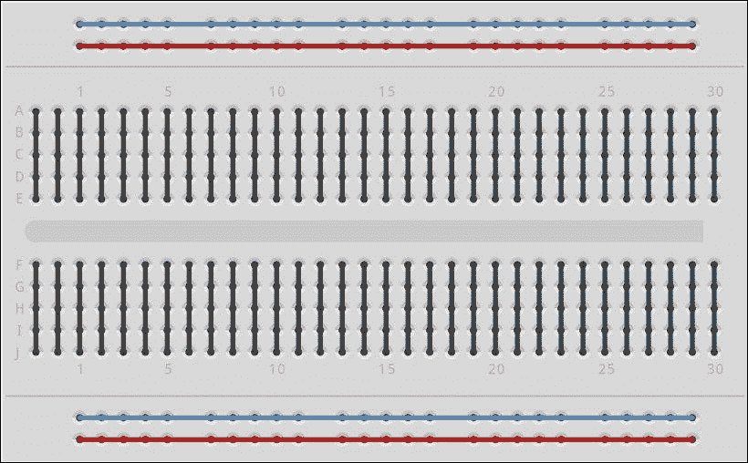

您可以通过将前一部分给出的电路连接到面包板上来学习如何使用面包板，如图所示进行测试，设置相同的电路：

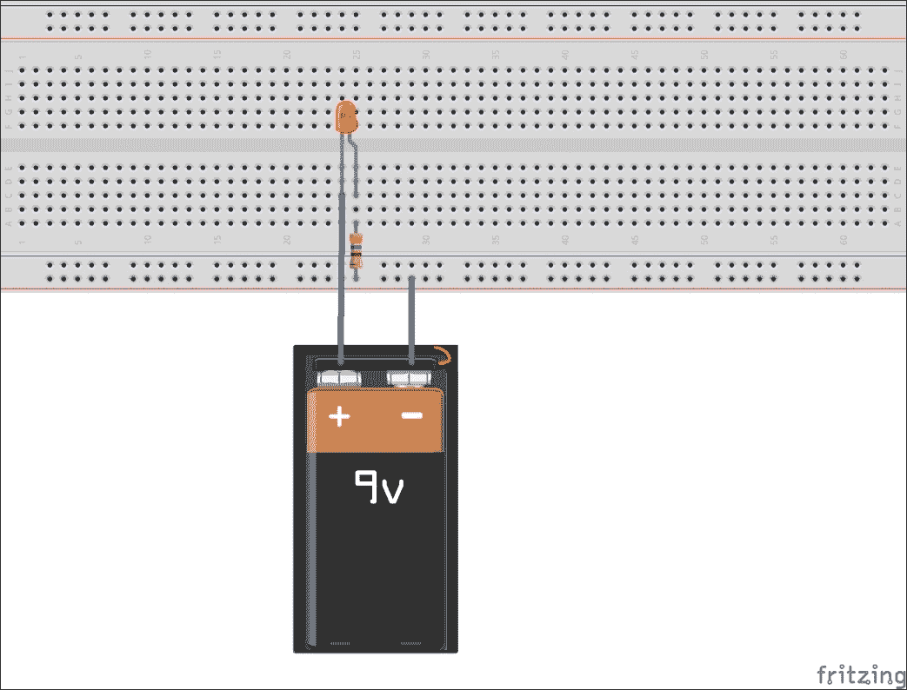

# 开关和 LED

开关是电子电路中的基本元件之一：

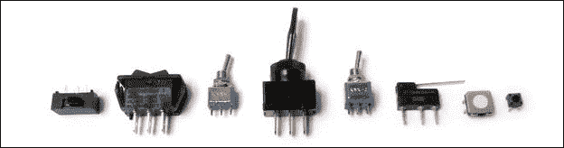

它们所做的只是闭合或断开电路，这意味着它们在两个端点之间打开或关闭连接。开关的两种状态如下图中所示：


有很多不同类型的开关。但在本节中，我们将讨论两种最常用的开关，即瞬动开关和拨动开关。在我们讨论不同类型的开关之前，正如本章介绍中提到的，让我们先看看 LED 是什么，以及如何使用它们创建一个基本电路，因为在解释开关操作时，这将有助于更好地理解。

要创建您的第一个简单电路，取一个电池、电阻和 LED，用电线将它们连接起来，如图所示。通过这样做，您可以了解 LED 是什么。LED 代表发光二极管，它不过是一个电子元件，当在适当的配置下对其引脚施加适当的电压时，它会发出光。LED 有两个引脚：阴极和阳极，如下面的图所示：


阳极端应连接到电源/电池的正极，阴极端应连接到电源/电池的负极，以使 LED 发光。反向连接不会使 LED 发光。如果您想了解更多关于为什么以及 LED 是如何工作的，请在网上进行研究或阅读书籍以获取更多信息。

现在，让我们继续制作一个电子电路，电流通过电线通过电阻和 LED（它们连接到电源，换句话说，是电池）流动，如下面的图所示：

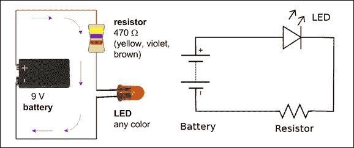

因此，如图所示，电阻可以位于 LED 的任何一侧。电阻是一种降低电路中电流值的元件。它用于增加 LED 的寿命，对于大多数 LED 都是必要的。我建议您了解更多关于应该使用多少电阻值以及您使用的特定电池和 LED，因为本章及其大部分章节的目的是为您提供有关电子电路的基本入门想法。正如本章开头提到的，电气和电子是一个庞大的主题，我们无法将其中涉及的所有概念都放在一个章节中。

如果你成功地用电池和电阻之间的 LED 使 LED 发光，你就已经制作了你的第一个基本电子电路。但是，让 LED 一直发光并不是现在任何人想要的。我们总是需要一个元素来控制另一个元素。因此，开关就出现了，如果你在这个电路中连接一个开关，你就可以在需要时打开或关闭 LED 的发光。所以，让我们继续看看电子电路中最常用的两种开关类型，我们将在接下来的章节中使用它们来与 BeagleBone 板接口，从外部世界获取输入。

## 瞬时开关

如果你查看下面的图示，你可以看到瞬时开关有一个推杆执行器，一个位于可动触点之间的柱塞，该触点接触两个端子的固定触点。

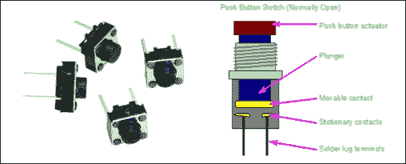

上一个图示中显示的开关在正常状态下是断开的，因为固定触点在正常状态下没有与可动触点接触，柱塞将可动触点向上拉。每次你按下顶部的按钮时，可动触点会下降并接触两个固定端点以建立接触并闭合线路。当你移除你施加在按下推杆开关上的压力时，柱塞会将可动触点拉回，电路就会断开。以下图示通过连接到电池的 LED 说明了这一解释。请查看它们以更好地理解，并尝试使用推杆瞬时开关、电池、电阻和 LED 自己动手做一下：

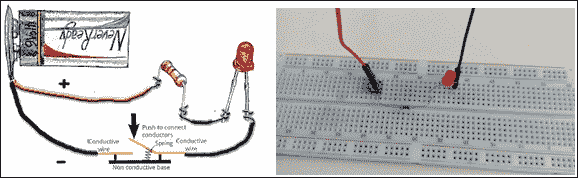

推杆开路 - 无电流流动，所以 LED 是关闭的

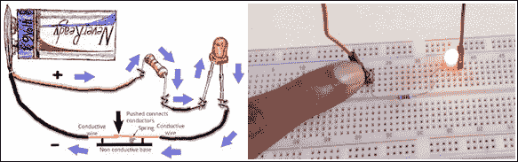

推杆闭路 - 有电流流动，所以 LED 是开启的

请注意，市场上还有其他类型的推杆瞬时开关，它们通常是闭合的，当按钮被按下时，开关会断开电路，而在正常状态下闭合。根据你使用的开关类型，前面图示中的电路操作会有所不同。对于通常闭合的开关，LED 将始终开启，当你按下按钮时，它会熄灭。对于通常开启的开关，操作将如前面图示所示，LED 在正常状态下是关闭的，但当你按下推杆开关时，它会点亮。

我们接下来要讨论的开关类型将是切换开关。

## 切换开关

切换开关类似于传统开关，这些开关用于墙式电气开关板，帮助你打开和关闭电路的连接以开关电路。以下是它的电路符号表示：

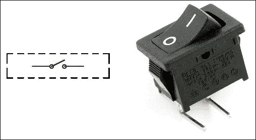

现在你已经熟悉了开关操作的工作原理，你可以轻松理解切换开关的概念。基本上，它将状态从开启切换到关闭，就像我们切换开关的位置一样。与需要按住开关按钮来切换状态的瞬间开关不同，在这里，一旦你切换了位置，它就会保持在离开的位置。因此，我们可以将开关从关闭状态切换到开启状态，换句话说，从开启到关闭状态，以及反之亦然，并且保持这种状态，它将保持在相同的位置，换句话说，处于开启或关闭的状态，因为没有弹簧机制将开关推回到其原始位置。以下图表将帮助你更好地理解：

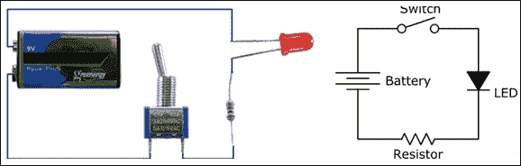

切换开关开路 - 没有电流流动，因此 LED 是关闭的

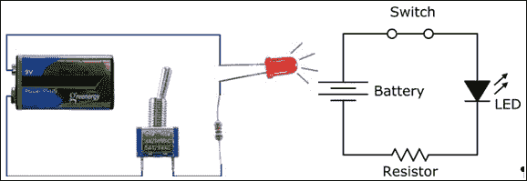

切换开关闭合电路 - 电流流动，因此 LED 是开启的

因此，如图所示，如果你已经成功设置了电路并通过切换开关使 LED 发光，那么现在你一定已经理解了电路的概念以及如何使用开关切换电气和电子电路。但是，我们将使用 BeagleBone 板而不是手动操作，我们将使用 GPIOs 来切换元件以及读取切换输入。我们将在下一章的实验中详细说明这一点。现在，在下一节中，你将学习 GPIOs 的基本概念以及 BeagleBone 板上可用的 GPIOs 类型。

# GPIOs

如我们在第一章中讨论的，*开始使用 BeagleBone*，BeagleBone 板在板的两侧都有 GPIO 引脚头。在本节中，我们将讨论这些 GPIOs 是什么以及我们如何使用它们将外部电子元件与板连接起来。

以下图表显示了可用的 GPIOs 以及每个 GPIO 的引脚映射。这种引脚映射或一般而言，分配给这些引脚的名称，将有助于我们从操作系统上运行的软件中访问它们。你将在本章末尾详细了解这一点，当我们从 Python 中访问 GPIO 时：

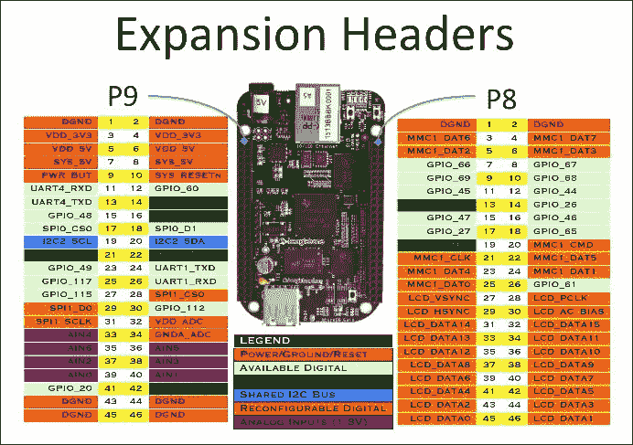

因此，这些 GPIOs 是端口，可以从我们的定义中作为输入或输出从操作系统上运行的软件中操作。有几种方法可以将这些引脚定义为输入和输出，以及当定义为输出时更改这些引脚的状态，当定义为输入时读取状态。在本书中，由于我们将使用 Python 作为主要的编程语言，我们将从 Python 程序中访问这些引脚。要开始，你首先需要向 Python 添加几个库，这将帮助你完成这项工作。如何安装这些库以及如何验证它们将在下一主题中解释。

# 向 Python 添加库

为了使用 Python 编程语言在 BeagleBone 板上轻松地处理 GPIO，我们将安装 `Adafruit-BeagleBone-IO-Python` 库。以下步骤将指导您如何进行操作：

1.  登录到您的 BeagleBone 板。

    正如我们在上一章中所做的那样，您需要做的第一件事是从 microSD 卡启动 BeagleBone 板并通过 SSH 登录到它：

    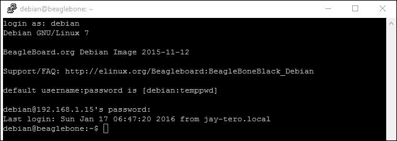

1.  更新存储库。

    您的下一步将是更新 BeagleBone 板上运行的 Debian 的软件依赖项存储库，然后我们再开始安装其他未安装的依赖项和库。

    您可以使用 `apt-get update` 命令来完成此操作：

    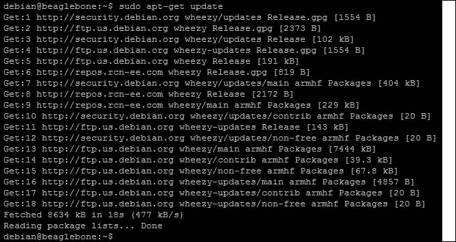

1.  安装依赖项。

    在此步骤中，我们将安装某些软件包，这些软件包对于库与 BeagleBone 板协同工作至关重要。您需要执行的命令如下：

    ```py
    sudo apt-get install build-essential python-dev python-setuptools python-pip python-smbus –y

    ```

    您将看到的输出如下所示：

    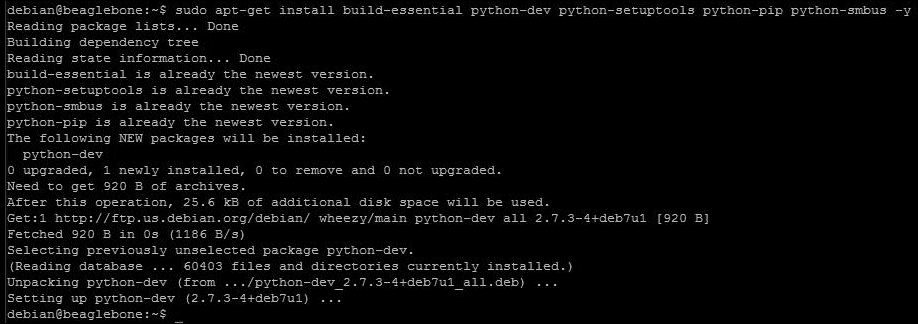

1.  安装 BBIO 库。

    现在，一旦您已更新了存储库并安装了必要的依赖项，我们就可以继续安装我们将用于通过运行在 BeagleBone 板上的 Python 访问 GPIO 引脚的 `Adafruit_BBIO` Python 库。

    要安装 `Adafruit_BBIO` 库，请执行以下命令：

    ```py
    sudo pip install Adafruit_BBIO

    ```

    您将看到以下输出：

    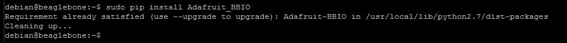

1.  测试您的安装。

    现在，让我们检查安装是否正确完成。为此，只需执行以下命令：

    ```py
    sudo python -c "import Adafruit_BBIO.GPIO as GPIO; print GPIO"

    ```

    现在，如果您看到以下截图所示的输出，则表示安装成功，并且我们已经成功安装了 `Adafruit_BBIO` 库：

    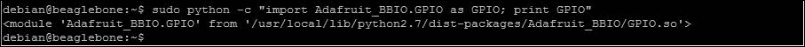

    我们可以通过将库导入 Python 并进行测试来验证这一点，如步骤 6 所示。

1.  验证安装。

    在此步骤中，首先您需要打开 Python 的交互式 shell 以使用以下指令，如下所示：

    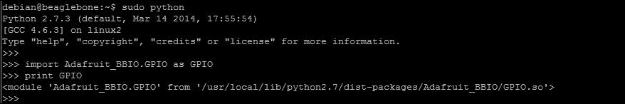

如果您在打印 GPIO 时看到模块及其路径，则确认我们已经成功安装并添加了 `Adafruit_BBIO` 库到 Python。现在让我们继续前进，从 Python 的交互式 shell 中访问 GPIO 以更改其状态，在下一节中。

# 使用 Python 访问 GPIO

在本节中，我们将了解如何使用 `Adafruit_BBIO` 库中可用的函数，从 Python 的交互式 shell 界面更改 BeagleBone 板上 GPIO 的状态。

您需要将一个 LED 连接到 BeagleBone Black 上的一个 GPIO 引脚，以了解这些 GPIO 的工作原理。以下步骤将逐步引导您通过可以在 Python 的交互式 Shell 界面上逐步执行的程序，以了解您如何从 python 中将 GPIO 的状态从低电平更改为高电平，反之亦然：

1.  将 LED 电路连接到 BeagleBone 板。

    要开始，我们需要面包板、LED、电阻和连接线，将 LED 电路与 BeagleBone Black 上的可用 GPIO 连接起来。一旦您准备好了这些，请按照以下图示连接电路：

    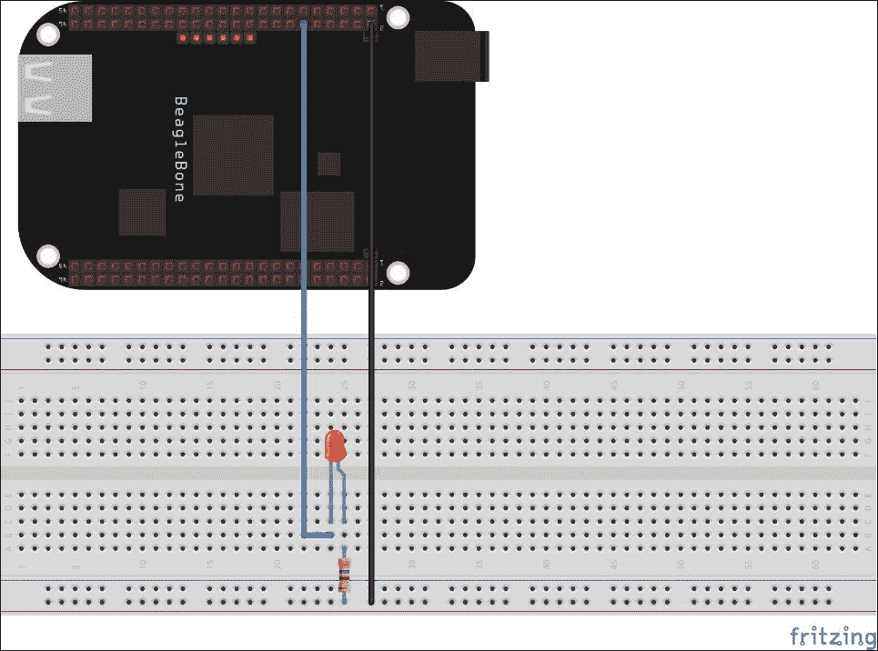

    您可以看到，LED 的阴极通过一个 470 欧姆的电阻连接到 BeagleBone Black 上的 Gnd 引脚，阳极连接到 P9 接口上的 GPIO_60 引脚。您可以参考 BeagleBone Black 的扩展接口以供参考。一旦您将电路与 BeagleBone Black 连接好，我们就可以继续使用 Python 来控制这个 LED 的开关。

1.  打开 Python 的交互式 Shell 并导入 Adafruit 的 BBIO 库：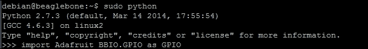

    如前一个屏幕截图所示，在这一步中，您将打开 Python 的交互式 Shell，并使用前一个屏幕截图中的命令将`Adafruit_BBIO`模块导入其中。

1.  设置引脚 GPIO_60 为输出模式。

    我们的下一步将是设置或定义 GPIO_60 为输出引脚，因为我们将会改变引脚的状态。请注意，这些 GPIO 引脚可以被设置为输入或输出。我们将在下一章中看到它们如何作为输入使用。现在，我们将使其作为输出引脚，以改变引脚的状态为高电平或低电平，或反之亦然，因此我们将它定义为输出引脚。为此，命令如下：

    ```py
    GPIO.setup("P9_12", GPIO.OUT)

    ```

    

    P9_12 实际上就是引脚**GPIO_60**，它是 P9 接口上的第 12 个引脚。请参见以下图示以了解记号背后的含义：

    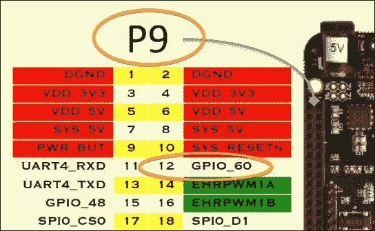

1.  将引脚 GPIO_60 设置为高电平。

    一旦我们将引脚定义为输出引脚，我们就可以继续更改引脚的状态为高电平或低电平。以下给出的函数在执行时将执行该操作：

    ```py
    GPIO.output("P9_12", GPIO.HIGH)

    ```

    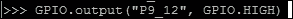

    现在，您将能够看到 LED 已经打开，如以下图像所示：

    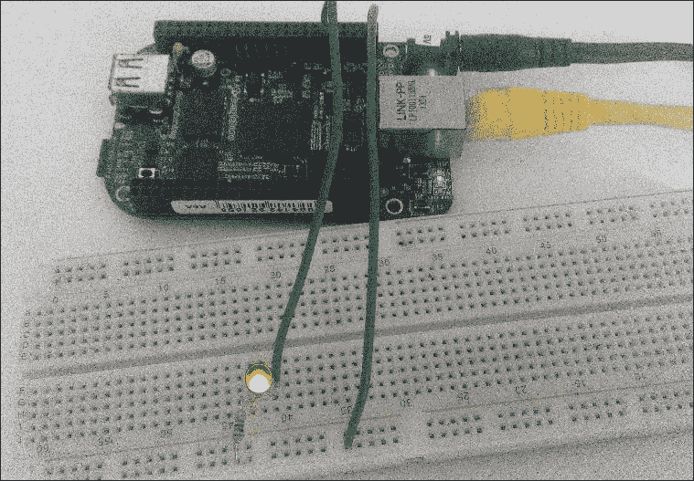

    当您执行函数时，实际上是在处理器芯片内部的某个晶体管由软件打开，这使得 GPIO_60 处于高电平状态，并切换打开，提供 3.3V 输出，从而使 LED 发光。现在，您可以通过将 GPIO_60 引脚设置为低电平来关闭 LED，如下一步所示，通过修改`GPIO.output`函数为 LOW。

1.  将引脚 GPIO_60 设置为低电平：

    ```py
    GPIO.output("P9_12", GPIO.LOW)

    ```

    

    现在，你将能够看到 LED 已经关闭，如下面的图像所示：

    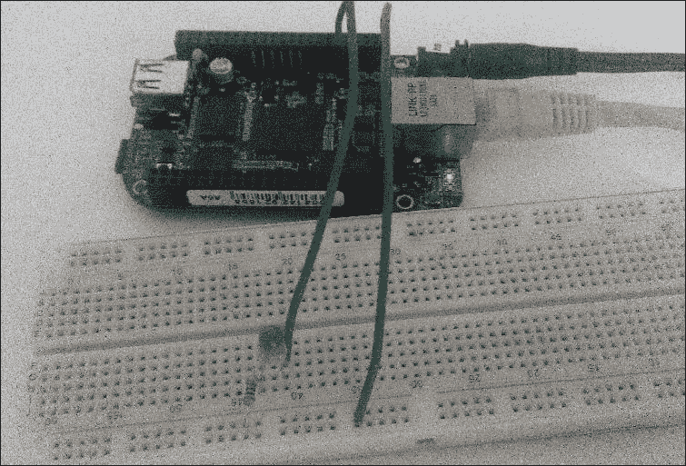

    如前一步，现在软件关闭了 BeagleBone 板上的微处理器内部的晶体管，以关闭 GPIO_60，使其关闭并变为 LOW，不提供 3.3V 电源，因此 LED 被关闭。

1.  清理 GPIO 设置。

    因此，现在你应该已经了解到，可以从板上的软件中更改 GPIO 状态。这些 GPIO 引脚保持原来的状态，直到它们被改变到另一个状态。但在你停止软件进行操作的过程中，你可能需要 GPIO 引脚回到它们的默认状态，对于大多数引脚来说，这个状态是 LOW。为此，`Adafruit_BBIO`库为我们提供了一个函数`GPIO.cleanup()`，我们将使用它来清除软件设置的 GPIO 的先前状态和定义。

    建议你在每个编写的程序结束时使用此函数，以避免不必要的、不期望的输出：

    

# 项目 – 使用 Python 脚本闪烁 LED

在上一节中，我们看到了如何从 Python 的交互式 shell 中访问 GPIO 引脚并改变其状态。现在，让我们编写一个 Python 代码，将其保存为`.py`文件，并像上一章结尾所做的那样运行它。本节讨论的 Python 程序将使 LED 以 1 秒的间隔闪烁。LED 将亮 1 秒，然后熄灭 1 秒；这将持续循环，直到你中断循环。

以下截图显示了程序：

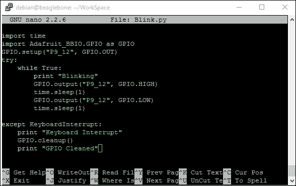

代码导入 time 模块和`Adafruit_BBIO`模块，就像我们在本章上一节的交互式 shell 中所做的那样，然后我们将 GPIO_60 设置为输出引脚，并在持续运行的 while 循环中改变引脚的状态为 HIGH 和 LOW。我们使用`time.sleep(1)`函数在状态变化之间暂停代码 1 秒。代码还有一个`GPIO.clean()`函数，当代码运行时，如果给出键盘中断，则会执行。

要运行命令，在将代码保存为名为`Blink.py`的文件后，执行以下命令：

```py
sudo python Blink.py

```

你应该看到以下截图所示的输出，连接到 BeagleBone 板的 LED 以 1 秒的间隔闪烁，控制台也打印出文本**Blinking**：

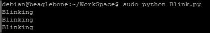

当你按下 *Ctrl* + *C* 来终止程序时，它将 GPIO 清理到默认状态并退出程序：


现在，你可以继续尝试使用不同的 GPIO，并通过 Python 程序中的决策语句等来打开和关闭 LED。如果你还记得，在第一章《开始使用 BeagleBone》中，我们使用了 BoneScript 库来使板上的 LED 打开并保持开启状态一段时间。你也可以尝试在 Python 中编写类似的代码，并尝试让 LED 保持开启一段时间。然后根据你给出的输入将其关闭。

# 摘要

我们已经到达了本章的结尾，在这里我们学习了使用 LED 和开关的简单电子电路背后的基本原理。我们了解了 GPIO 是什么，以及如何从 Python 中访问它们，并编写了一个简单的代码来使 LED 以特定间隔闪烁。然后我们在 BeagleBone 板上添加了外部库。在下一章中，我们将看到如何从外部世界获取输入并构建一个对那个输入做出反应的系统。
