# 第七章. 使用计算机视觉处理图像

在本章中，我们将开始将 USB 摄像头与 BeagleBone 板接口，并使用 OpenCV 从摄像头捕获图像。我们将首先安装 OpenCV，然后继续使用 OpenCV 和 Python 捕获图像。

我们将深入探讨本章中给出的主题：

+   前提条件

+   将 USB 摄像头添加到 BeagleBone Black

+   OpenCV 简介

+   使用 Python 和 OpenCV 一起

+   使用 Python 和 OpenCV 从摄像头捕获图像

# 前提条件

本节将介绍在本章中你需要哪些部件。这些部件都可以在网上购买。

我们将需要以下材料开始：

+   1x BeagleBone Black

+   1x 带有最新版本 Debian 的 microSD 卡，用于从 microSD 卡启动 BeagleBone 板

+   1x 5V DC，2A 电源

+   1x 以太网线

+   1x USB 摄像头

## 需要的材料

+   1x BeagleBone Black

+   1x 带有最新版本 Debian 的 microSD 卡，用于从 microSD 卡启动 BeagleBone 板

+   1x 5V DC，2A 电源

+   1x 以太网线

+   1x USB 摄像头

# 将 USB 摄像头添加到 BeagleBone 板

将 USB 摄像头添加到 BeagleBone 板非常简单。你所需要做的就是获取一个与 Linux 兼容的 USB 摄像头，也就是有 Linux 驱动程序的摄像头。如今，几乎所有的 USB 网络摄像头都带有这种支持。如果你有一个非常旧的 USB 网络摄像头，你想与 BeagleBone 板接口，你可能需要添加一些额外的步骤来安装设备驱动程序，以便在 BeagleBone 板的 Linux 设备列表上看到你的视频摄像头元素。对于这个主题解释，我使用了如图所示的 Logitech C270 HD 网络摄像头：

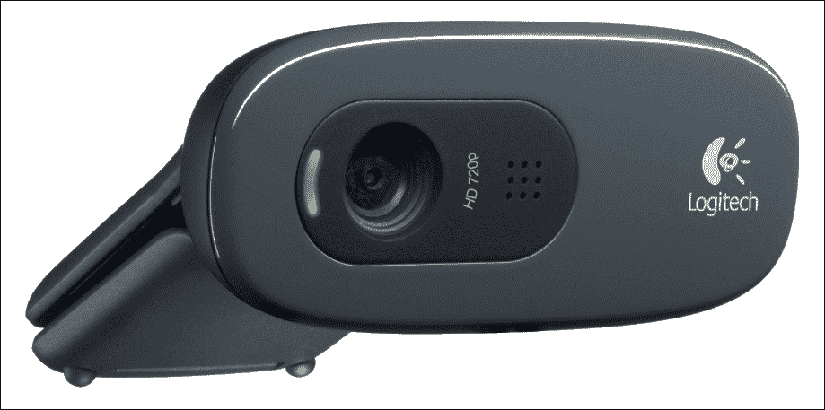

你可以使用 BeagleBone 板上的 USB 端口，如图所示连接 USB 摄像头：

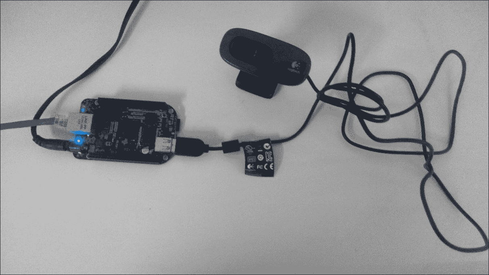

使用我们之前烧录的 Debian 在 MicroSD 卡上启动 BeagleBone 板，并通过 SSH 登录到 BeagleBone 板。现在输入命令 `Lsusb`，如图所示：

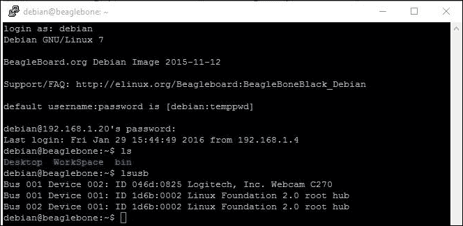

如果你能在设备列表中看到网络摄像头，这意味着摄像头已通过 USB 正确连接到 BeagleBone 板。

然后，检查 Linux 内核中是否为摄像头提供了驱动程序，以及它是否已成功接口，并在 Debian 设备列表中创建了一个视频输入元素。让我们更改目录到 dev 目录 `cd /dev`，然后 `ls`。如果你看到列表上列出了**video0**，那么你可以假设一切顺利，USB 网络摄像头已成功与 BeagleBone 板接口。我们现在有一个可以用于 OpenCV 或任何其他软件的视频 0 元素，我们将安装到 BeagleBone 板上以从摄像头获取视频输入。


现在我们 BeagleBone 板上已经有了视频组件，我们可以继续安装 OpenCV，开始从 USB 网络摄像头捕获图像并将它们存储在 BeagleBone 板上的 microSD 卡上。

# OpenCV – 简介和在 BeagleBone 板上设置

在这个主题中，你将了解 OpenCV 是什么以及我们如何使用它从连接到 BeagleBone 板的网络摄像头捕获图像。

OpenCV 代表开源计算机视觉。它主要是为实时计算机视觉设计的。因此，这个库将基本上帮助我们使用常用的编程语言，如 C、C++和 Python，从连接到我们计算机的摄像头捕获图像——在我们的案例中，使用 BeagleBone 板。当我们进入本章的项目部分，使用 Python 从 USB 摄像头捕获图像时，你会理解 OpenCV 库如何使代码从摄像头获取输入、生成图像文件输出以及更多图像处理功能变得简单。

## 在 BeagleBone 板上的 Debian 系统上安装 OpenCV

按照步骤在 BeagleBone 板上的 Debian 系统上安装 OpenCV：

第 1 步：安装编译器：

```py
sudo apt-get -y install build-essential cmake pkg-config

```

这些编译器对于从源代码构建软件包然后安装它们非常重要。安装它们对我们未来很有用，尤其是在机器人项目期间：

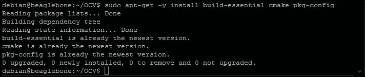

第 2 步：安装编译前必需的其他软件包：

```py
sudo apt-get install cmake git libgtk2.0-dev pkg-config libavcodec-dev libavformat-dev libswscale-dev

```

在 Linux 中，大多数编写的软件将使用其他开源软件包来构建它们的软件，因此这些软件包是 OpenCV 在它们的软件中使用的，以给我们一个美丽且易于编码/使用的库。

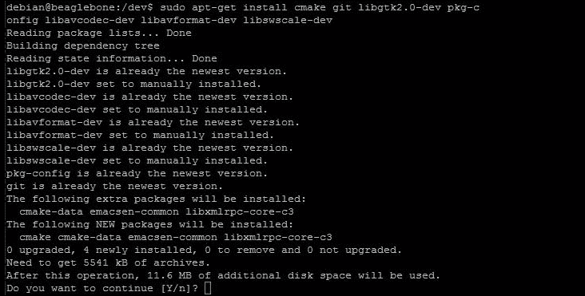

当你安装这些软件包时，如果提示你使用额外的磁盘空间，请继续按*Y*然后按*Enter*开始安装所需的软件包。

在编译之前，你还需要安装一些其他软件包，这些软件包如下所示：

+   `sudo apt-get -y install libjpeg62-dev`

+   `sudo apt-get -y install libtiff4-dev libjasper-dev`

+   `sudo apt-get -y install libgtk2.0-dev`

+   `sudo apt-get -y install libavcodec-dev libavformat-dev libswscale-dev libv4l-dev`

+   `sudo apt-get -y install libdc1394-22-dev`

+   `sudo apt-get -y install libxine-dev libgstreamer0.10-dev libgstreamer-plugins-base0.10-dev`

+   `sudo apt-get -y install python-dev python-numpy`

+   `sudo apt-get -y install libqt4-dev`

+   `sudo apt-get install unzip`

第 3 步：安装一些可能在未来使用 OpenCV 时很有用的其他可选软件。这些软件由 OpenCV 推荐：

+   `sudo apt-get install python-dev python-numpy libjpeg-dev libpng-dev libtiff-dev libjasper-dev libdc1394-22-dev`

这些软件对于 OpenCV 的正常运行并非必需，但当你将来将显示器连接到 BeagleBone 板并希望使用图形时，这些软件将非常有用。现在安装它们比将来在编写带有显示元素和 GUI 的代码时遇到错误而感到沮丧要好。

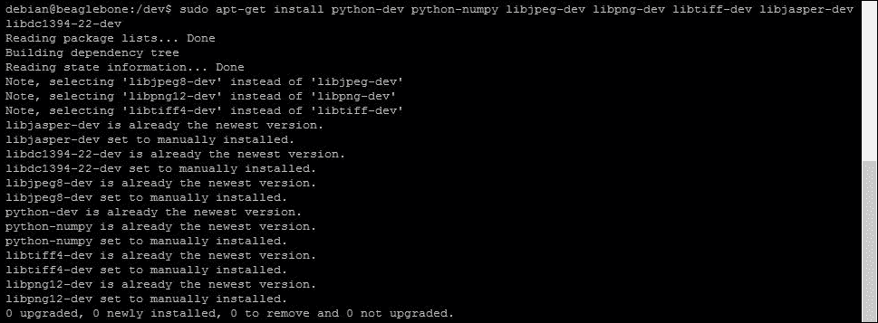

到这一步，我们已经安装了编译和安装 OpenCV 在 BeagleBone Black 上所需的所有必要软件包。因此，现在让我们继续下载 OpenCV 的源代码文件，然后编译和安装它们。让我们创建一个新的目录，并在构建 OpenCV 库时将所有文件保存在其中：

第 4 步：使用以下命令创建一个 OpenCV 目录：

+   `mkdir OCV`

+   `cd OCV`

它将看起来像这样：

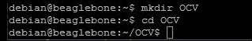

第 5 步：将 OpenCV 源代码克隆到我们的工作目录中：

+   `wget https://sourceforge.net/projects/opencvlibrary/files/opencv-unix/2.4.9/opencv-2.4.9.zip`

`wget`命令将从它后面的 URL 下载文件，并将其保存在当前工作目录中。您可以在 Linux shell 中看到下载状态的百分比，如下面的截图所示：

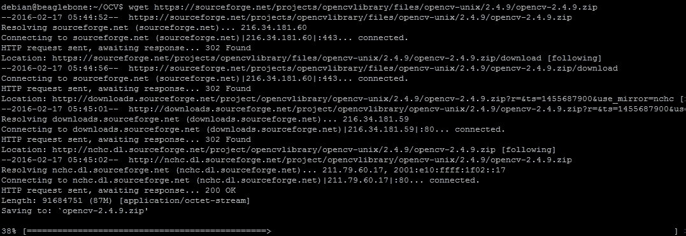

您需要等待下载完成，并使用`ls`命令检查是否收到了 zip 文件。如果您看到文件，如下面的截图所示，您可以继续下一步：

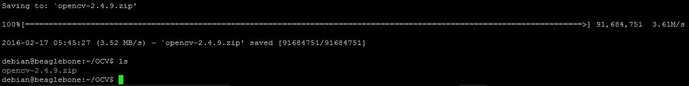

第 6 步：使用 cmake 从源文件构建 OpenCV：

+   `unzip opencv-2.4.9.zip –d opencv`

首先，我们需要解压我们下载的`.zip`文件以提取文件内容。


然后我们编译文件夹内的文件，等待解压过程完成：

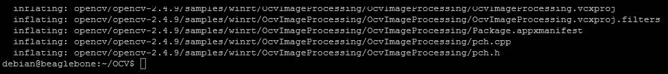

然后使用`ls`命令检查是否已创建`opencv`文件夹，以及`.zip`文件的内容是否已提取到其中：

+   `ls`

您可以看到已经创建了`opencv`文件夹，其中包含了已解压的文件：`cd opencv`：

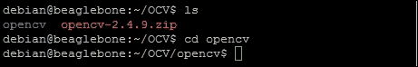

这就是`ls`和`cd opencv-2.4.9`在命令行中的样子：

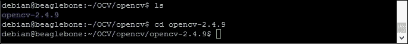

现在，我们需要在`opencv-2.4.9`文件夹中创建一个文件夹，我们将在这个文件夹中编译和构建安装文件。您需要执行`mkdir build`和`cd build`命令来完成此操作：

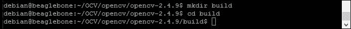

+   `cmake -D CMAKE_BUILD_TYPE=RELEASE -D CMAKE_INSTALL_PREFIX=/usr/local -D WITH_TBB=ON -D BUILD_NEW_PYTHON_SUPPORT=ON -D WITH_V4L=ON -D INSTALL_C_EXAMPLES=ON -D INSTALL_PYTHON_EXAMPLES=ON -D BUILD_EXAMPLES=ON -D WITH_QT=OFF -D WITH_OPENGL=ON`

这就是它的样子：

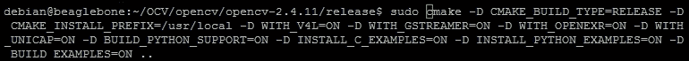

现在，等待配置完成：

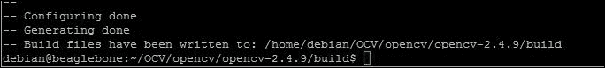

一旦完成，你应该会看到类似于前面的截图。

现在我们可以继续编译文件：

第 7 步：编译`make`，它看起来像这样：

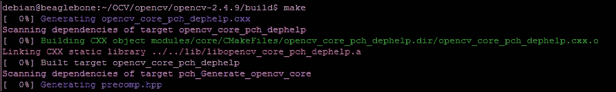

等待程序编译并准备安装：

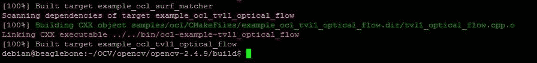

一旦文件编译和构建完成，我们可以使用以下步骤将 OpenCV 库安装到我们的系统中：

第 8 步：安装`sudo make install`：


等待程序安装完成。

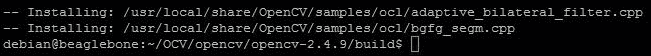

安装完成后，让我们使用以下命令测试是否所有内容都正确安装：

第 9 步：验证安装

由于我们将一起使用 Python 和 OpenCV，让我们使用以下命令验证 OpenCV 的 Python 库是否正确安装：

+   `sudo python`

在 Python 交互式 shell 中输入`from cv2 import_version_`命令以导入库，然后执行以下命令以打印版本：

+   `_ 版本 _`

你应该会看到以下截图：


如果它没有错误地打印版本，那么一切正常，你可以看到它是**2.4.9**，这与你在第 5 步中下载的 zip 文件中的版本相同。

现在我们已经成功安装了 OpenCV 库，我们可以继续到下一个主题，我们将使用 Python 和 OpenCV 一起从我们插入到 BeagleBone 板上的 USB 视频相机捕获图像。

# 项目：使用 Python 和 OpenCV 从相机捕获图像

在本章中，我们将编写一个代码来从相机捕获图像，并使用 Python 将其保存为`.jpg`格式。

让我们先创建一个名为`ImageCapture`的目录，在其中我们可以保存我们编写的 Python 文件，以及我们捕获的图像文件：

+   `mkdir ImageCapture`

+   `cd ImageCapture`

它看起来像以下截图：

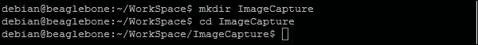

+   `sudo nano TakePhoto.py`

    参考以下图像：

    

现在，我们可以开始编写代码来从相机捕获图像并将其保存到 BeagleBone Black 上：

完成此任务的最简单代码如下截图所示：

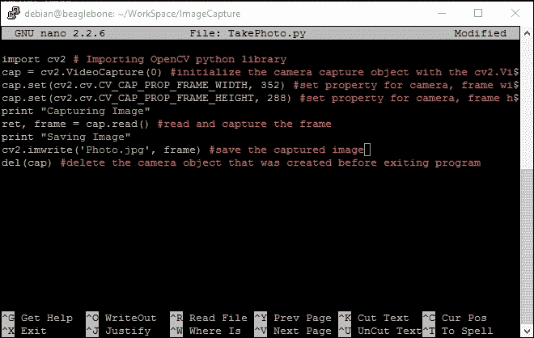

保存它并运行它以从相机捕获图像并保存。

当您运行`sudo python TakePhoto.py`代码时，您将看到的输出如下截图所示：

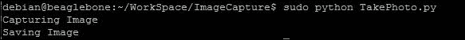

如果您没有收到任何错误，并且程序结束时打印出**保存图像**文本，那么一切应该都进行得很顺利。为了检查这一点，让我们看看`Photo.jpg`文件是否已经创建在文件夹中。您可以使用`ls`命令来检查，您应该会看到如下截图所示的`Photo.jpg`文件已创建：

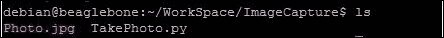

由于我们正在通过 SSH 在 BeagleBone Black 上工作，我们现在没有直接在 GUI 上查看图像的选项 - 我们将需要一个**文件传输协议**（**FTP**）客户端软件来下载捕获的图像。所以，让我们现在在我们的 Windows PC 上安装一个。

### 小贴士

FileZilla 是我最喜欢的，所以在这个教程中我会使用它，您可以使用您熟悉的软件，或者如果您还没有安装 FileZilla，可以安装它。

一旦您打开了 FTP 软件，它将要求您输入设备的 IP 地址、用户名、密码和端口号：

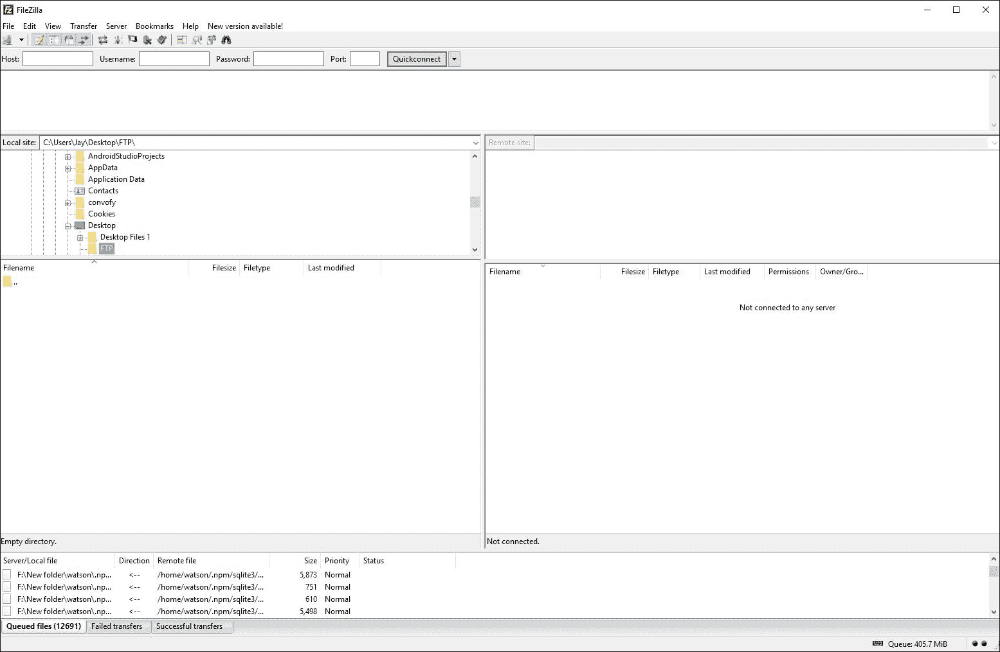

这就是软件的外观。您可以在左上角看到一个输入主机 IP 地址、用户名、密码和端口号的空间。下面您可以看到您想要下载和上传文件的目录选择，底部您可以看到数据传输的日志。

现在我们继续将我们的 PC 通过 FTP 连接到 BeagleBone Black，以传输我们捕获的图像文件，并看看它的样子。您需要输入的详细信息是分配给 BeagleBone 板的 IP 地址，您将通过 SSH 连接到它，与`debian`相同的 IP 地址和用户名，默认密码为`temppwd`，如果您已经更改了用户名和密码，则在这里使用它们，端口号为`22`。然后点击快速连接按钮，您应该会看到 BeagleBone Black 上的文件，如下面的截图所示：

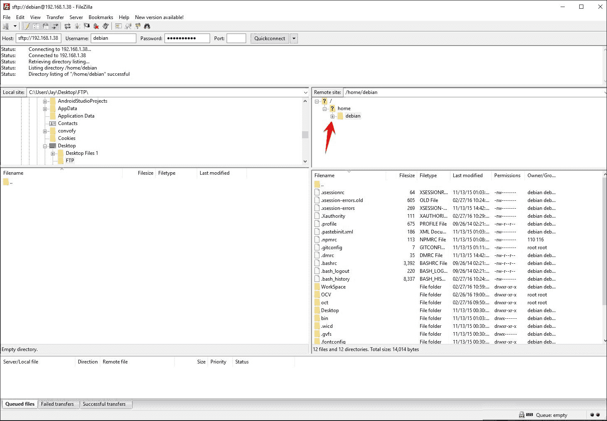

您可以点击图片中显示的`Debian`文件夹旁边的**+**符号，然后导航到其中的`ImageCapture`文件夹，我们捕获并保存的`Photo.jpg`文件就在这个文件夹里。您会看到如下截图所示的内容：

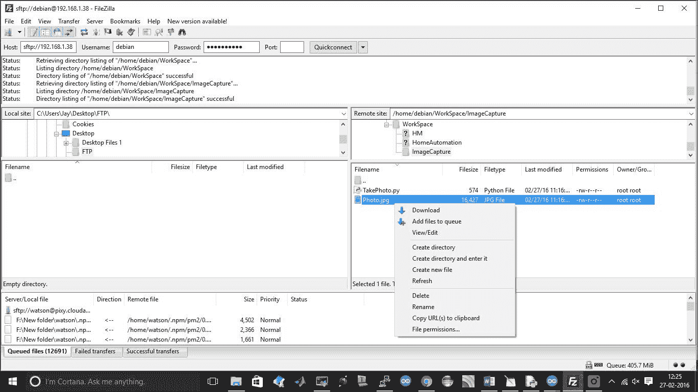

现在，您可以继续下载文件。一旦您点击**下载**，文件将被下载到 FTP 文件夹或您在 PC 上选择的用于下载文件的文件夹中。您可以在下面的屏幕截图中看到，`Photo.jpg`文件现在位于您的 PC 上之前为空的 FTP 文件夹中：

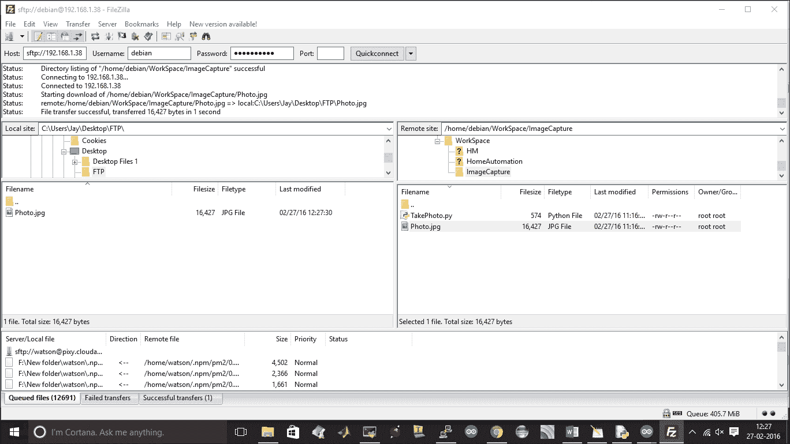

因此，现在您已经将捕获的照片下载到您的 PC 上，您可以继续打开它，使用您在 PC 上设置的图像查看软件查看它。

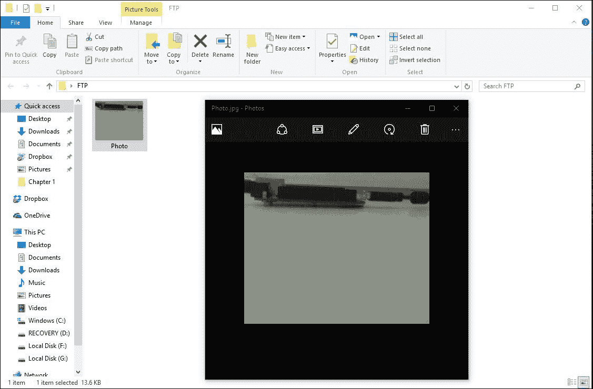

捕获的图像如前一个屏幕截图所示，拍摄此照片时相机的布置如以下屏幕截图所示：

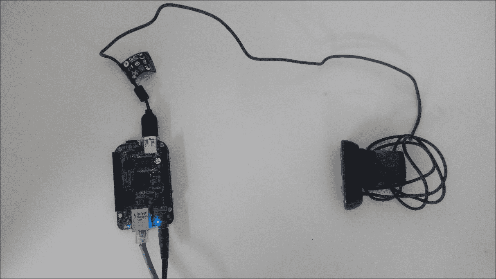

在前面的图片中，您可以看到相机已经被放置，指向 BeagleBone Black，并且距离较远，因此我们捕获的图像显示了 BeagleBone Black 的侧面视图，显示了连接到它的 USB，以及背景。

因此，这样，您可以使用 Python 和 OpenCV 一起拍照并保存它们，用于许多应用程序。

# 摘要

本章只是为您了解 OpenCV 是什么，将其设置在 BeagleBone Black 上，以及通过编写几行代码了解您可以使用它做什么的开始。在本章中，图像捕获项目只是我们做的简单事情——您可以尝试更多，比如捕获视频并保存，将彩色图像转换为黑白，以及使用 OpenCV 和 Python 进行其他图像处理。现在我们知道了如何拍照并保存。

在下一章中，我们将构建一个家庭安全应用程序项目，使用传感器检测运动并在检测到运动时拍照。这样，我们将构建一个实时应用程序，使用 OpenCV、BeagleBone Black 和 Python，系统将与物理世界进行交互。
