# 第八章. 使用 BeagleBone Black 的家庭安全系统

在本章中，我们将专注于使用 BeagleBone 板构建一个实时互联网连接的家庭安全监控系统。与前面的章节类似，我们将在 BeagleBone 板上使用 OpenCV 和 Python，并连接一个摄像头。但为了将项目提升到高级水平，我们将在 BeagleBone 板上添加一个 PIR 传感器，并在其上编写代码以与物理世界交互。我们将从使用 PIR 传感器进行运动检测开始，然后使用 Python 从 BeagleBone 板上发送电子邮件。我们将以一个项目结束本章，在这个项目中，我们将构建一个运动检测安全摄像头，当 PIR 传感器检测到运动时，它会发送带有捕获图像的电子邮件警报。

本章内容分为以下主题：

+   前提条件

+   PIR 传感器

+   使用 PIR 传感器进行运动检测

+   发送带附件的电子邮件

+   高级项目 – 运动检测、图像捕获和警报系统

# 前提条件

这里是要求：

+   一块 BeagleBone Black

+   一张带有最新版本 Debian 的 microSD 卡，用于启动 BeagleBone 板

+   一个 5V DC，2A 的电源

+   一根以太网线

+   一台 USB 摄像头

+   一个 PIR 传感器

# PIR 传感器

**PIR**（即**被动红外**）传感器是一种电子传感器，它测量其视野中存在的物体辐射的红外线（**IR**）。这些传感器主要用于基于 PIR 的运动检测器。

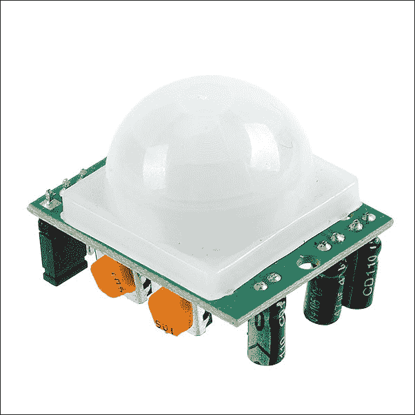

## PIR 传感器的工作原理

如果你查看以下图示，PIR 传感器内部有两个插槽，每个插槽都通过特殊材料帮助准备，这些材料对红外线敏感。菲涅耳透镜帮助传感器上的两个插槽扩大检测区域及其距离，即传感器的灵敏度。当传感器前方或检测区域内没有运动时，两个插槽检测到相同数量的红外线；我们称这为传感器的空闲状态，在此期间，插槽检测从房间或户外辐射出的环境红外线量。传感器会自动校准并等待温暖物体的运动。

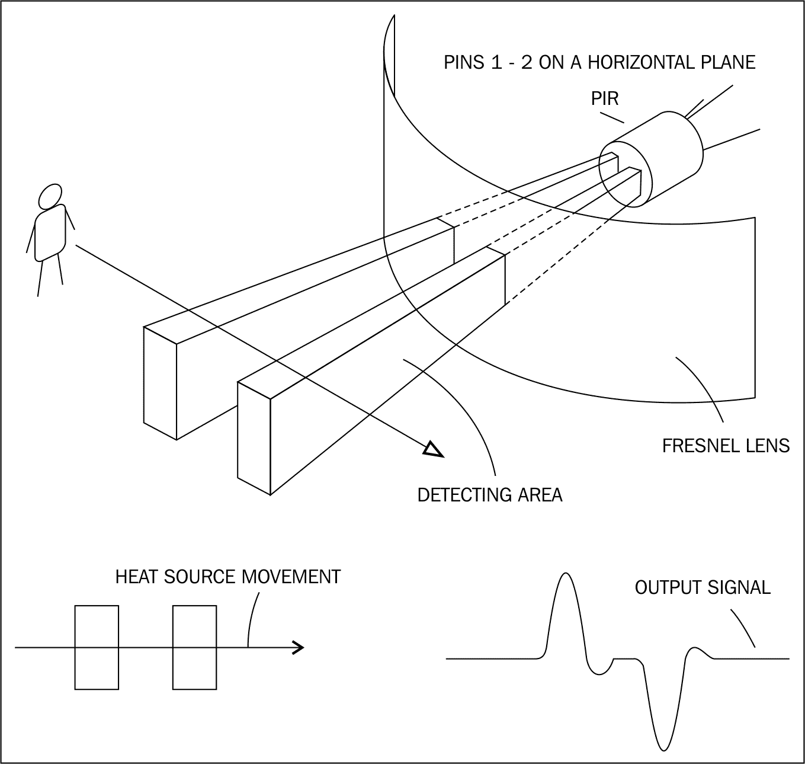

当 PIR 传感器的一半拦截到任何温暖物体，如人或动物时，它会在 PIR 传感器的两个部分之间引起正差分变化。同样，当温暖物体离开感应区域时，会产生负差分变化，这实际上是正差分变化产生的逆过程。因此，我们获得的输出是以传感器输出引脚的上升和下降脉冲的形式，我们通过这些脉冲推断 PIR 前方是否有运动。

你可能想知道为什么前面的图示和实际图像之间有差异，如第一张图像所示。实际上，第一张图像是为了让你理解 PIR 传感器的工作原理。它展示了市场上可用的传感器，我们将使用这个传感器。为了使传感器能够在广泛的检测区域内工作，其镜头呈半球形，如果你看一下下面的图像，你会看到镜头上已经制作了各种角度的槽口，以便在广泛区域内检测，并可以在天花板和墙壁等不同地方安装，以检测移动物体的运动。

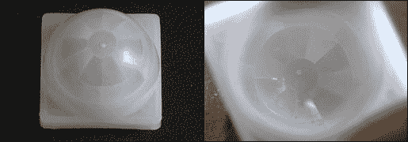

市面上大多数这些业余级 PIR 传感器的检测区域为 90 度宽，但有些可达 110 度，长度为 5 到 6 米。你可以选择并购买你喜欢的任何一种。

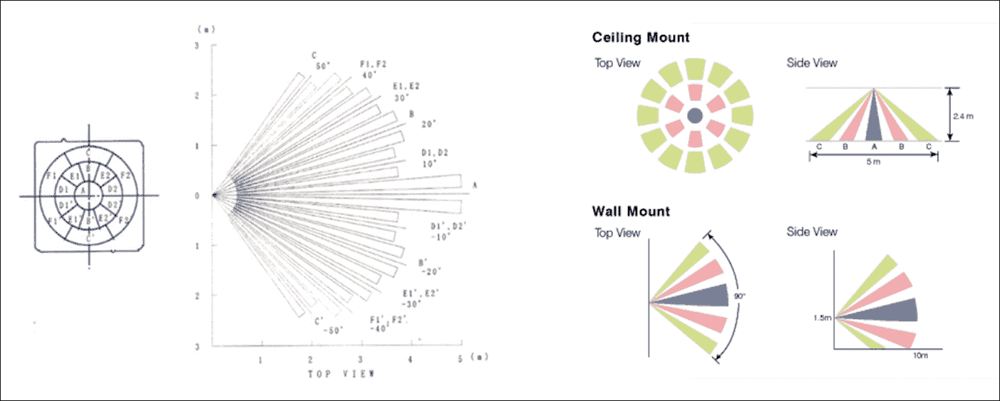

# 使用 PIR 传感器进行运动检测

现在我们已经了解了 PIR 传感器的工作原理，让我们继续将其连接到我们的 BeagleBone 板以检测运动。

首先，取三根伯格线，按照以下电路图将 PIR 传感器连接到 BeagleBone 板上：

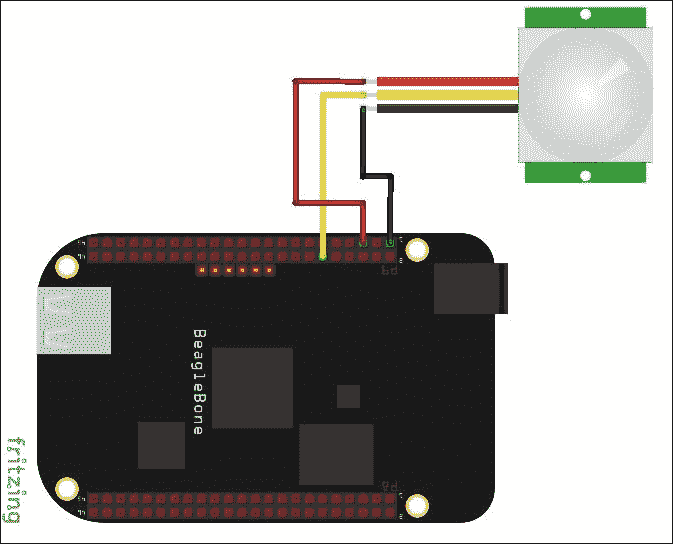

如前述电路图所示，将 PIR 传感器的 Vcc 连接到 BeagleBone 板上的 5V 引脚，将 PIR 传感器的输出引脚连接到 BeagleBone 板上的 GPIO60，并将两个板上的地引脚相互连接。

然后，我们将打开 BeagleBone 板并登录到 Linux shell 以开始编写代码。

使用 `sudo nano TestPIR.py` 创建一个新的 Python 程序：

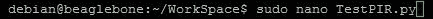

输入以下屏幕截图所示的代码：

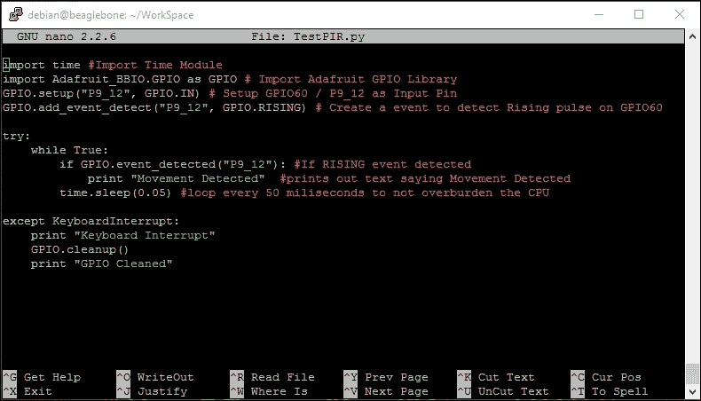

输入代码后，你可以使用 *Ctrl* + *X* 保存它。

通过查看代码中的注释来了解其工作原理。我们正在将 `GPIO_60` 设置为 `INPUT PIN`，从 PIR 传感器的输出读取上升沿，每次从 GPIO 引脚 `60` 读取上升沿时，都会打印出 **Movement Detected** 文本。

当你运行命令时，你应该看到以下输出：

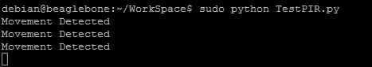

你可以在传感器前放置你的手或进行任何动作，如下面的图片所示：

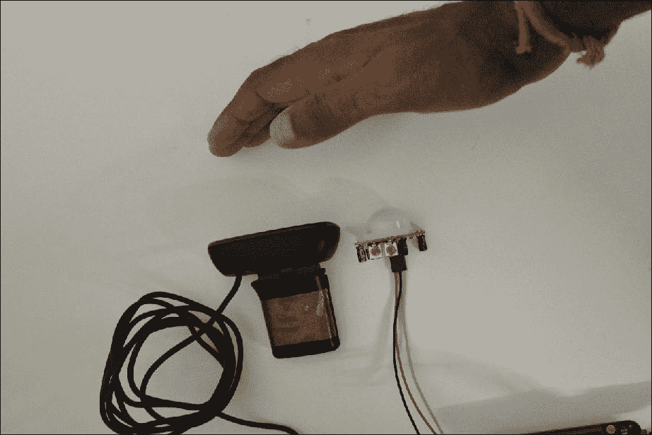

有一个选项可以设置灵敏度，即检测区域的范围，通过调整传感器上的电位器来实现。看看下面的图示，以获得更好的理解。你还有一个电位器可以调整触发时间，这实际上是传感器自动重置模式下的脉冲持续时间，直到脉冲变高并返回低。当设置为无重置模式时，脉冲将始终保持 HIGH 状态，直到检测到另一个运动。通常，首选的方法是自动重置。

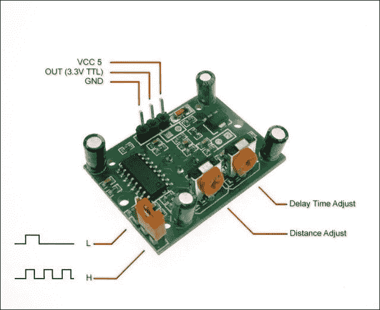

现在我们已经测试了 PIR 传感器，让我们继续使用 Python 从 BeagleBone Black 发送带附件的电子邮件。

# 从 BeagleBone Black 发送带附件的电子邮件

就像使用 Python 在 BeagleBone Black 上与图像和摄像头一起工作的 OpenCV 库一样，我们还有许多其他由 Python 开发和构建的精彩库。其中一个这样的库是 SMTP 电子邮件库，我们将在这个部分中使用它。

为了测试这个，我们将使用上一章项目中捕获的图像，它位于`ImageCapture`文件夹内。

我们首先将工作目录更改为`ImageCapture`目录，如下截图所示，使用`cd ImageCapture`：

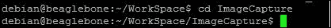

然后，我们将继续创建一个 Python 文件，其中包含发送带附件的电子邮件的代码。为此，首先创建一个名为`sendemail.py`的新文件，使用`sudo nano sendemail.py`：

现在，输入以下截图所示的代码，并将文件保存在`ImageCapture`文件夹本身中。代码的大部分行都带有注释，以便你清楚地了解它是如何工作的。

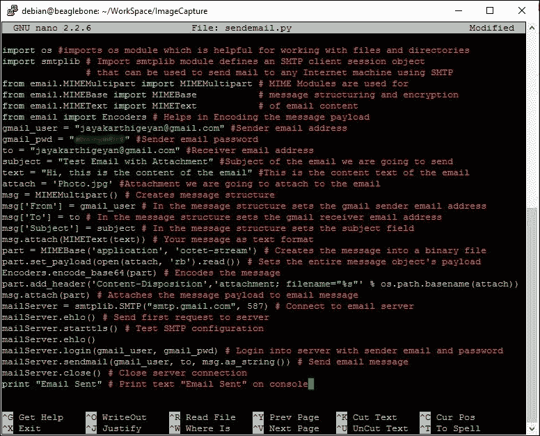

你会看到我们之前项目中捕获的`Photo.jpg`文件仍然在`ImageCapture`文件夹内，这是我们将在执行此程序时附加到电子邮件中的同一张图片：

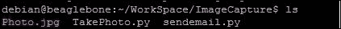

当你执行程序时，你应该会在`sendemail.py`代码文件中提到的接收者的电子邮件地址上收到一封电子邮件，终端的输出将如下所示：

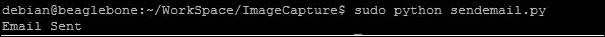

当它在 Linux shell 上打印出电子邮件已发送时，你将在你的电子邮件账户中收到电子邮件；查看我收到的这些电子邮件截图：

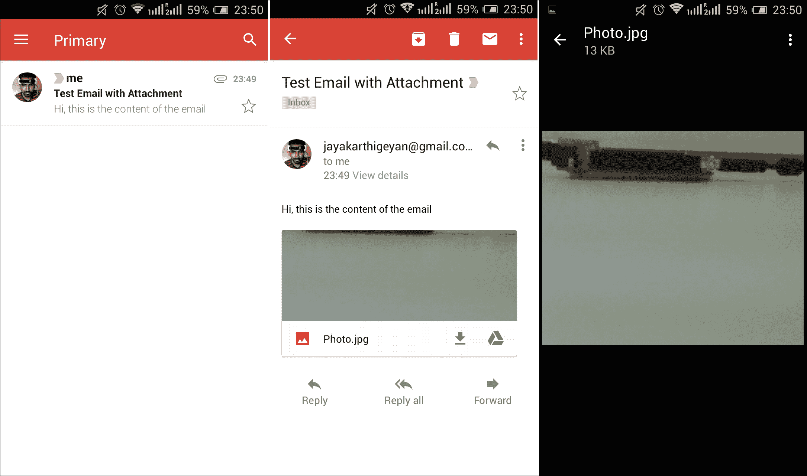

因此，就像这样，你可以将任何附件附加到电子邮件中，并从 BeagleBone 发送。既然我们现在知道如何使用连接到 BeagleBone 板的 PIR 传感器检测运动，以及如何发送带有照片附件的电子邮件，让我们继续将上一章的相机图像捕获项目与我们在本章中学到的知识合并，以构建一个高级项目。

# 高级项目 – 基于运动的家居安全警报系统

在本节中，我们将构建一个家居监控安全警报系统，其中我们将有一个连接了 PIR 传感器的 BeagleBone 板。一个 USB 摄像头连接到它上，BeagleBone 板连接到互联网。所以基本上，该系统将在 PIR 传感器前检测到移动时从摄像头捕获图像。

按照以下步骤操作：

1.  使用 BeagleBone 板设置 PIR 传感器，就像我们在本章的运动检测主题中所做的那样，将 USB 网络摄像头连接到 BeagleBone 板，并登录到系统。设置看起来如下所示：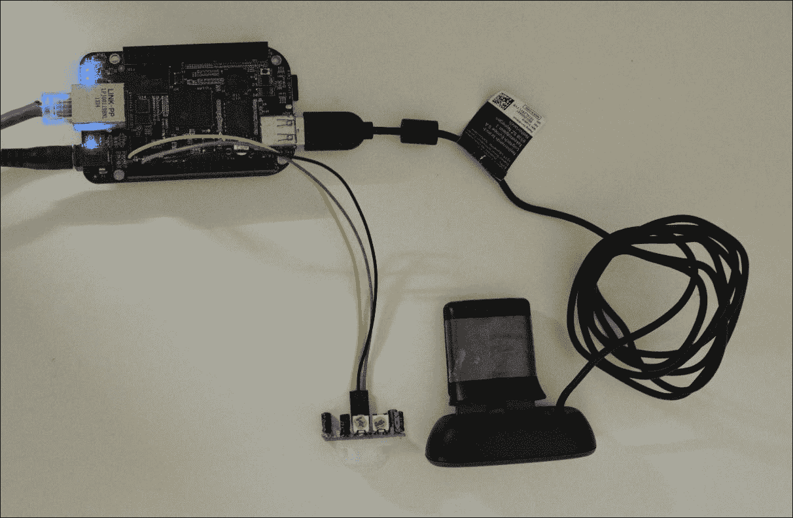

1.  使用 `sudo mkdir HomeSecurity` 为此项目创建一个新的目录：

    使用 `cd HomeSecurity`：

    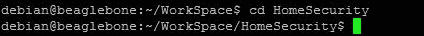

1.  使用 `sudo nano EmailAlert.py` 创建项目的 Python 脚本：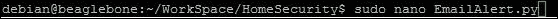

将以下代码输入到文件中。代码中的大多数行都有注释，以清楚地解释其工作原理。

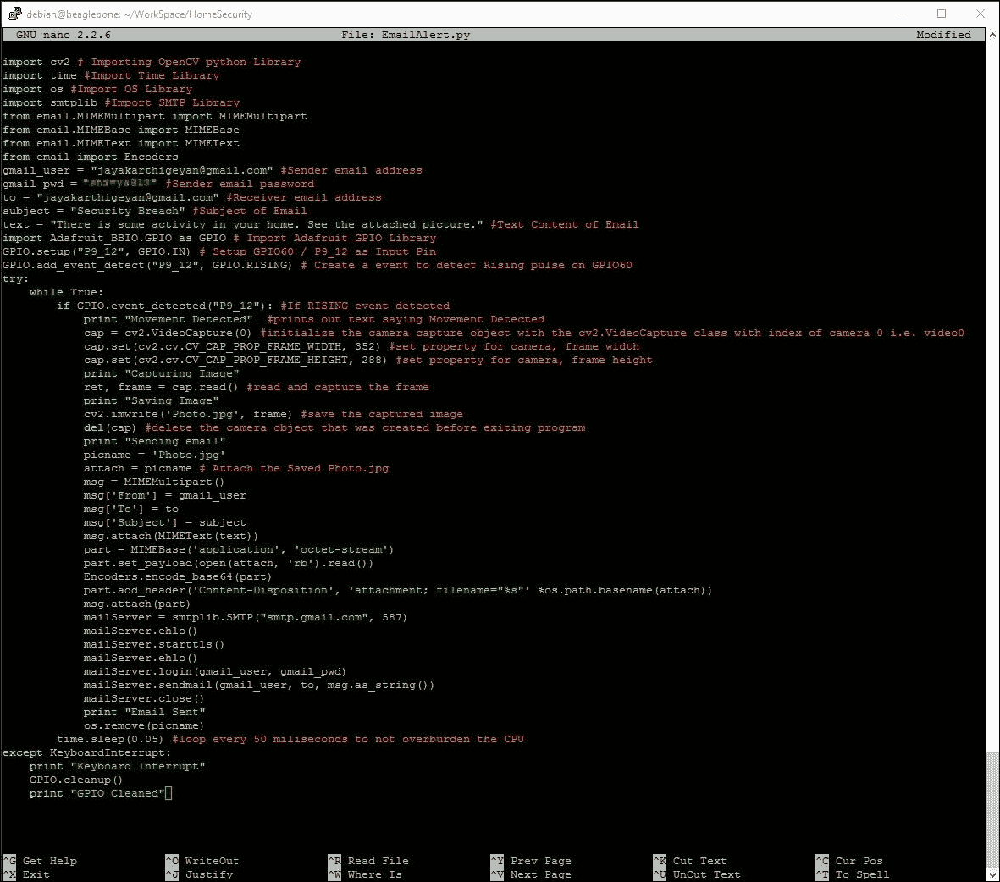

输入代码后，继续保存。当你运行它时，你应该在 Linux 命令行界面中看到输出，如下面的截图所示，只要在 PIR 传感器前有移动：

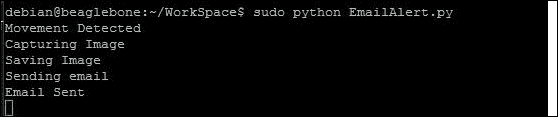

下面的图像显示了我在 PIR 传感器前挥动手臂的情况，手指始终保持在传感器前，然后移开：

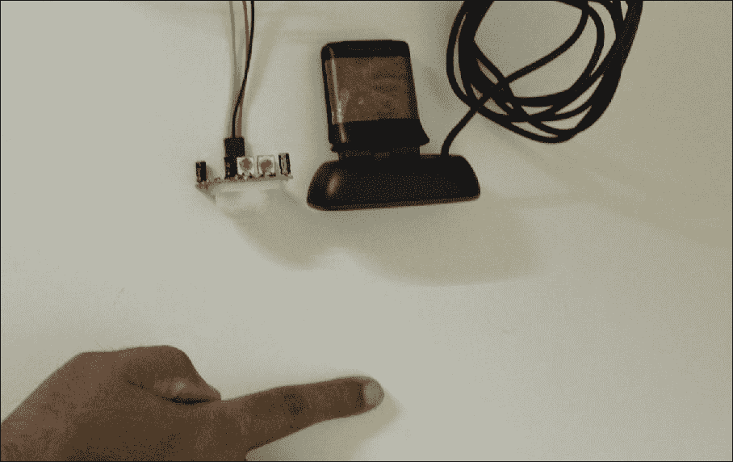

我收到的电子邮件截图如下所示：

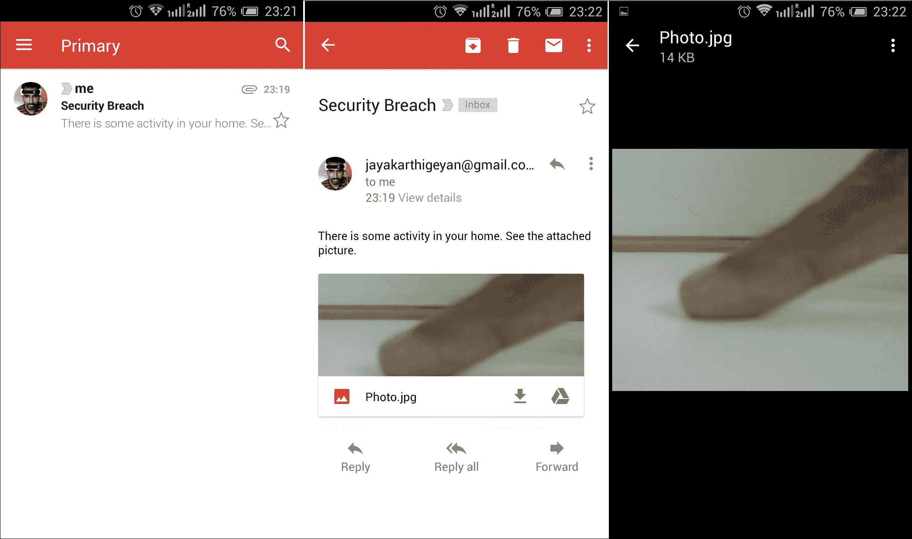

就这样，你可以使用 Python、OpenCV 和 Python 的电子邮件库一起，每当 PIR 传感器检测到移动时，点击图片并发送电子邮件警报。

# 摘要

在本章中，我们使用了上一章关于 OpenCV 的知识，以及本章关于使用 BeagleBone 板进行 PIR 传感器接口和通过 BeagleBone 板使用 Python 发送电子邮件所学的知识，来构建一个运动检测摄像头监控电子邮件警报系统。而不是在这里停止这个项目，我建议你尝试其他运动检测方法，并构建一个没有 PIR 传感器的相同系统。网上有很多关于使用 Python 在实时中利用 OpenCV 进行运动检测的资源。尝试设置一个系统，在没有 PIR 传感器的情况下，仅使用摄像头进行运动检测，并发送电子邮件警报。
