# 第九章。探索机器人学

正如标题所说，在本章中，我们将探索和学习机器人学的基本概念。我们将从机器人学的基本介绍开始，包括一些关于机器人系统和一些关于机器人历史的定义和解释。然后，我们将研究机器人系统结构，就像我们在第三章中做的那样，即《物理计算系统介绍》，关于物理计算系统。我们将查看机器人系统中涉及的硬件和软件的基本模块，这与我们的物理计算系统相似。然后，我们将研究它们的操作，最后讨论差动驱动机器人，因为下一章我们将要构建一个差动驱动机器人。

本章内容分为以下几部分：

+   机器人学介绍

+   机器人系统的元素、结构和操作

+   应用领域

+   差动驱动机器人

# 机器人学介绍

许多人只记得著名演员阿诺德·施瓦辛格，并关联到《终结者》电影中的人形终结者机器人，当他们听到“机器人”这个词时。尽管这是真的，机器人这个词与类似类型的机器人相关，但人们忘记了机器人的确切意义不仅仅是这样。实际上，那只是机器人的一种类型：人形机器人，或者如人们今天所说的——机器人，是类似人类的机器人。我们仍然处于机器人开发的开端——如果我们想要达到类似科幻电影机器人的结果，那么在这个研究领域还有很长的路要走。

科幻类人形机器人与目前最先进的实际机器人

被称为机器人的东西有许多不同的定义。这些定义取决于机器人系统中使用的技术以及机器人系统执行的应用。与已知的物理计算系统定义相关联，我们可以将机器人系统定义为任何由电磁执行器组成的物理计算系统，这些执行器可以在计算机程序的控制下自主或半自主地执行动作，该程序在其电子硬件电路中运行。

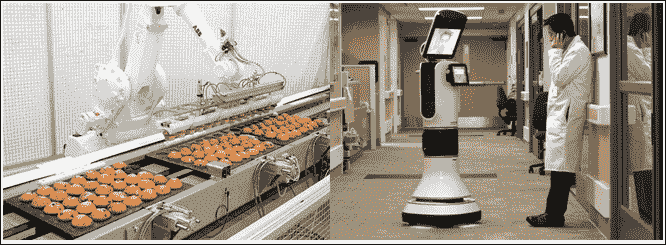

一个拾取和放置食物的机器人和一个医院远程存在机器人

以非常基础的方式，我们可以这样说，机器人是设计成能够以速度和精度执行一项特定任务或多项任务的机器。你可以很容易地购买市场上各种不同类型的机器人系统，用于不同的应用，从清洁地板的吸尘机器人到在咖啡馆为你提供咖啡和茶的机器人，它们看起来就像人类一样。我们将在本章后面讨论一些机器人广泛和当前的应用领域。

尽管机器人存在已久，但它们过去总是存在于研究实验室中，并且由于工业革命之前成本高昂，普通人难以获得。在工业革命期间，制造商和工业界希望有许多工业机器来加速生产，在更短的时间内生产出更多的产品而不会出现缺陷。工业机器开始出现，它们由机器人系统的结构组成，例如使用执行器构建的机器人臂，能够在工业中举起重物。在早期阶段，几乎所有的机器人系统都是由人通过遥控操作，以确保安全和灵活性。但随着软件开始变得便宜且更可靠，具有半自主功能的机器人系统开始演变，例如带有机器人执行器的传送带，可以从传送带上拾取物品并自动包装，同样，许多其他应用也开始在工业中出现。如今，有些公司完全由机器人制造和包装食品和饮料，几乎不需要人工干预。

由于研发智能和智能工业机器人系统，许多传感器和执行器机制被开发出来，以在工业生产中替代人工干预，这导致了各种传感器的发展，这些传感器不再用于构建类人机器人。尽管十多年前电影中已经展示了这样的机器人，但我们还需要很多年才能建造出能够替代人类的机器人。

在我们探讨机器人系统的广泛应用领域之前，让我们先了解一下机器人系统的基本元素和结构，以便理解它们的运作方式。

# 机器人系统的元素、结构和操作

在本节中，您将了解机器人系统由哪些部分组成，随后是它们的操作方式。正如我们在前一节中定义的那样，机器人系统与物理计算系统非常相似，只是某些物理计算系统中可能没有执行减少人力劳动的任务的执行器，而机器人系统则不同。因此，系统的元素以及它们的操作几乎相似。在某些情况下，“物理计算系统”这个术语也可以与机器人系统同义。

就像任何物理计算系统一样，任何机器人系统也将具有连接到具有输入/输出端口的 CPU 的输入传感器和输出执行器。执行器根据在 CPU 上运行的计算机程序进行驱动，这取决于机器人系统中存在的传感器输入。

为了让您更容易理解，并给您一个关于我们将在下一章中构建的机器人的简要概念，让我们看一下一辆两轮机器人的方块图，它将随机移动而不会碰到任何表面：

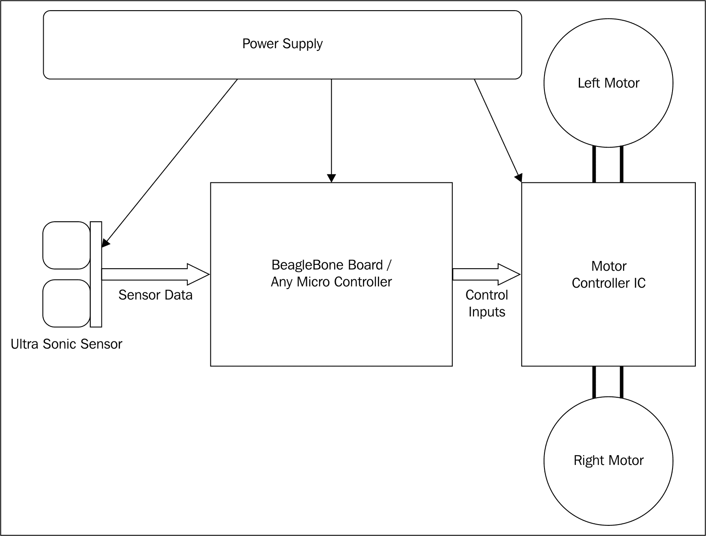

如果你查看方块图，它由一个传感器组成，即一个**超声波传感器**，它可以检测其位置前方任何障碍物的距离，并且该传感器连接到 CPU 的输入端口。同样，我们有一个**电机控制器 IC**，或者电机驱动 IC，它将帮助我们通过从微控制器获取的低电压数字输入来驱动高电压的重型电机。因此，这个电机驱动 IC 连接到 CPU 的输出端口。电机连接到电机驱动 IC。根据提供给电机驱动 IC 的输入，电机以特定的方向驱动。我们将在下一章详细探讨这个 IC。最后，最重要的是，所有设备都应使用外部电源供电，这通常是一个直流电源，但有时也可能是交流电源，这取决于应用。在我们的案例中，对于下一章的项目，它将是直流电源。如果你查看第三章中物理计算系统的以下方块图《物理计算系统简介》，你可以理解它有一些相似之处：

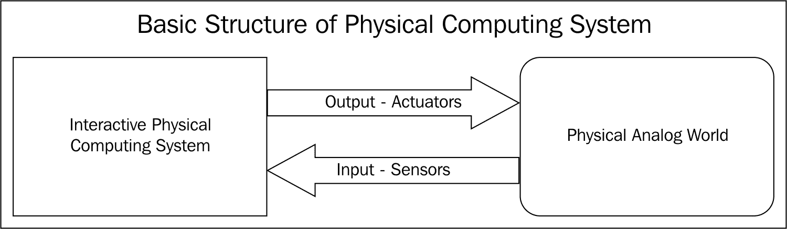

因此，当你比较结构与我们所使用的用于演示目的的机器人系统的结构时，它包括一个向 CPU 提供输入的传感器，以及一个根据 CPU 的输出驱动电机的驱动 IC。在 CPU 中，我们运行软件，它将随机使机器人移动，而不会碰到任何障碍物。

根据软件的不同，机器人可以以任何方式操作。例如，对于一个随机避障和自主移动的机器人，它根据微控制器的输出引脚输出移动机器人向前方向，同时，软件持续读取超声波传感器测量的距离。每当传感器在设定距离处检测到障碍物时，程序就会将其视为障碍物。因此，程序通过改变控制器输出引脚上的输出信号来停止电机运行，然后使机器人向左或向右转动。这可以是随机的，或者我们可以在代码中指令它每次检测到障碍物时只向左或向右移动。因此，机器人开始向特定方向转动，直到有足够的空间移动，然后再次停止并直线移动。这样，程序循环就会运行，机器人就会随机移动而不会撞到任何东西。这听起来可能很愚蠢，因为它不做任何具体工作，也不执行任何复杂任务。但是，当你向系统中添加更多传感器，例如指南针来读取开始转动时的角度，以及一些轮编码器来测量机器人的移动距离，然后编写程序以避免重复在同一区域移动，如果你将其安装到吸尘器系统上，它就可以成为一个很棒的机器人。这样一款机器人就是市面上可购买的吸尘器机器人。

因此，任何机器根据其智能工作方式、解决实时问题和执行动作的能力，都可以变成机器人。让我们看看这样的例子，在下一节中，我们将探讨具有简单硬件但优秀软件的机器人在不同应用中的使用。然后，在最后，我们将更深入地探讨差速驱动机器人，以了解这些电机如何仅使用两个带电机的轮子根据电机方向在不同方向上转动。

# 应用领域

当我们讨论机器人的应用领域时，我们可以看到机器人的存在非常普遍。最常见的基于应用领域的机器人系统分类如下：

+   工业机器人

+   家庭或家用机器人

+   医疗机器人

+   移动机器人

+   社交和类人机器人

## 工业机器人

如前所述，尽管我们已经建造机器人很长时间了，但它们的广泛应用是通过工业机器人在制造业中用于提高生产力才出现的。这些机器在工业中以高速执行特定任务。

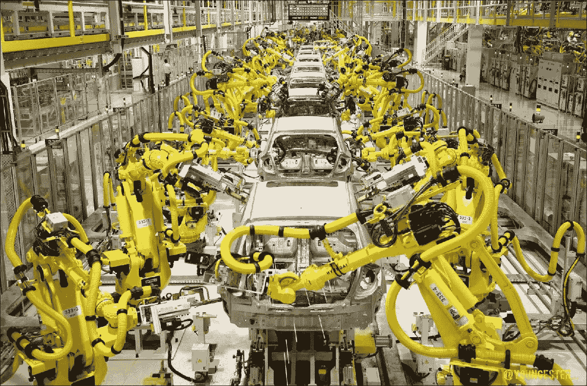

在前面的图片中，你可以看到在汽车制造业中，机器人臂正在制造汽车。这些臂的编程方式使得所有移动汽车的机器人臂和传送带以同步方式工作，并且每个机器人臂都执行特定的任务，例如拧紧螺母或焊接两块金属板。

## 家用机器人

帮助人类完成家务的机器人被称为家用机器人。以下第一个是一个虚构的家用机器人：

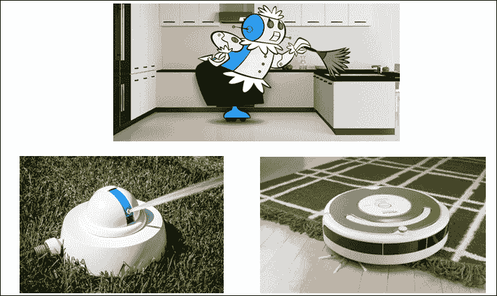

### 备注

[`glennhsmith.files.wordpress.com/2013/04/rosie-the-robot-h.jpg`](https://glennhsmith.files.wordpress.com/2013/04/rosie-the-robot-h.jpg)

[`static01.nyt.com/images/2014/12/25/garden/20141225-TECH-slide-3TZF/20141225-TECH-slide-3TZF-jumbo.jpg`](http://static01.nyt.com/images/2014/12/25/garden/20141225-TECH-slide-3TZF/20141225-TECH-slide-3TZF-jumbo.jpg)

[`s.yimg.com/ny/api/res/1.2/HUZ5Rw7cnzK2z_k8zuI5ZA--/YXBwaWQ9aGlnaGxhbmRlcjtzbT0xO3c9NTc0O2g9NDM2O2lsPXBsYW5l/http://boygeniusreport.files.wordpress.com/2014/02/roomba-robot-vacuum-cleaner.jpg`](https://s.yimg.com/ny/api/res/1.2/HUZ5Rw7cnzK2z_k8zuI5ZA--/YXBwaWQ9aGlnaGxhbmRlcjtzbT0xO3c9NTc0O2g9NDM2O2lsPXBsYW5l/http://boygeniusreport.files.wordpress.com/2014/02/roomba-robot-vacuum-cleaner.jpg)

前面的组合图像的左下角显示了一个每天在固定时间间隔给草坪浇水的机器人，右下角显示了一个清洁地板的吸尘机器人。我想你现在可以将其与我们之前章节中讨论的随机工作的避障机器人联系起来。

## 医疗机器人

近年来，手术和康复机器人被广泛应用于医疗行业。正如其名称所暗示的，手术机器人帮助医生进行复杂的手术，康复机器人帮助人们恢复使用他们的手、臂或身体其他被替换或失去功能的部分。

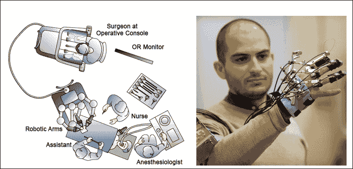

### 备注

[`www.tipoist.com/indexfoto/robotic-surgery.jpg`](http://www.tipoist.com/indexfoto/robotic-surgery.jpg)

[`www.salford.ac.uk/__data/assets/image/0003/370434/dexterous-robot-hand-robotics-cse.jpg`](http://www.salford.ac.uk/__data/assets/image/0003/370434/dexterous-robot-hand-robotics-cse.jpg)

如果你查看左边的图示，你可以看到手术是如何通过机器人臂来进行的：外科医生通过观看安装在臂上的摄像头控制机器人臂，并在控制台进行手术。正如我之前提到的，大多数机器人都是远程操作的。在许多情况下，外科医生在远离患者的地方进行手术。

如果你看看右边的图片，它展示的是一个戴有外骨骼手的人，他没有大拇指。但是有了外骨骼，他有一个完整的手可以帮助他。这些都是帮助人体部位康复的机器人。

## 移动机器人

能够导航和执行任务的机器人被称为移动机器人。有许多自主和半自主的机器人可以导航和执行任务，这与在工业中使用的固定机器人臂和在家庭中使用的固定草坪浇水机器人不同。

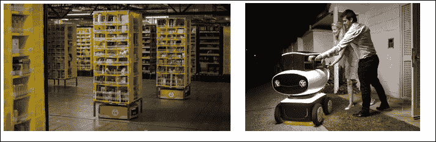

### 注意

[`static-ssl.businessinsider.com/image/55d233c42acae700448be4de-960-720/to-make-things-a-bit-easier-for-its-workers-amazon-added-about-15000-kiva-robots-to-10-us-fulfillment-centers-during-the-2014-holiday-season-amazon-bought-kiva-systems-the-company-that-manufactures-the-robots-for-775-million-in-2012.jpg`](https://static-ssl.businessinsider.com/image/55d233c42acae700448be4de-960-720/to-make-things-a-bit-easier-for-its-workers-amazon-added-about-15000-kiva-robots-to-10-us-fulfillment-centers-during-the-2014-holiday-season-amazon-bought-kiva-systems-the-company-that-manufactures-the-robots-for-775-million-in-2012.jpg)

[`cnet4.cbsistatic.com/img/g2VlwBmVinTwCSSQd2BgrErY2Ws=/570x0/2016/03/18/6cdc953e-563b-4424-bf33-6014b300e428/dominos-dru-pizza-robot-lifestyle.jpg`](https://cnet4.cbsistatic.com/img/g2VlwBmVinTwCSSQd2BgrErY2Ws=/570x0/2016/03/18/6cdc953e-563b-4424-bf33-6014b300e428/dominos-dru-pizza-robot-lifestyle.jpg)

看看前面的图片。左边的图片显示的是在仓库中根据控制单元的请求携带带有物品的货架的仓库管理移动机器人。这些机器人是移动的，并且比人类寻找特定物品并将其带到包装站或仓库中的任何地方要快得多。这些移动机器人最近极大地改变了仓库管理。接下来，如果你看右边的图片，它展示的是最新的一款移动机器人，它将披萨送到顾客的家中地址并递送。这些机器人能够避开障碍物，不会撞到人类；它们规划路径并继续前进。吸尘器机器人也属于移动机器人，但再次强调，根据它们的应用，它们也可以被归类为家用机器人。因此，这些应用领域大多是相互关联的。

移动机器人甚至包括用于军事应用、太空探索、水下机器人等等的机器人。

### 注意

[`s-media-cache-ak0.pinimg.com/236x/2d/ff/8d/2dff8d05cf7f5ca90e6d4ab61148349d.jpg`](https://s-media-cache-ak0.pinimg.com/236x/2d/ff/8d/2dff8d05cf7f5ca90e6d4ab61148349d.jpg)

[`i4.mirror.co.uk/incoming/article4822277.ece/ALTERNATES/s615b/Curiosity-Rover.jpg`](http://i4.mirror.co.uk/incoming/article4822277.ece/ALTERNATES/s615b/Curiosity-Rover.jpg)

[`seahack.org/wp-content/uploads/2013/05/openrov_large.jpg`](http://seahack.org/wp-content/uploads/2013/05/openrov_large.jpg)

如果你观察前面的图片，你可以看到三种不同的机器人。最左边的是一种配备有远程触发武器的军用机器人。中间的是火星探测器，一种被送往火星以探索星球表面的机器人。它通过卫星与地球上的一个站点保持通信联系。最后，在最右边，我们有一个用于水下探索的机器人，称为 OpenROV。现在，关于这个机器人有一个有趣的事实，那就是它是以 BeagleBone Black 作为主控制器来构建的。这是一个如何将使用 BeagleBone Black 的业余项目转变为商业产品的典型例子。我们将在下一章中也构建类似的东西。但与水下探索不同，它将使用摄像头探索地面周围的环境，并将实时视频流显示给我们。

从这些例子中，你可以理解尽管它们执行了如此多的应用，但这些机器人的基本结构仍然相同，而正是我们通过不同的传感器、执行器、通信链路和编写的软件程序添加的功能，使得它们在应用中具有如此多的不同名称，并且产生了如此多的差异。

## 社会型和人形机器人

在外观和交互方式上与人类相似的机器人被称为人形机器人。社会机器人是这类机器人中的一个特定群体，它们没有像人形机器人那样的肢体，但它们上面运行着软件，以实现像人类一样的社会互动。

以下图片展示了两种可能帮助你区分人形机器人和社会机器人的机器人：

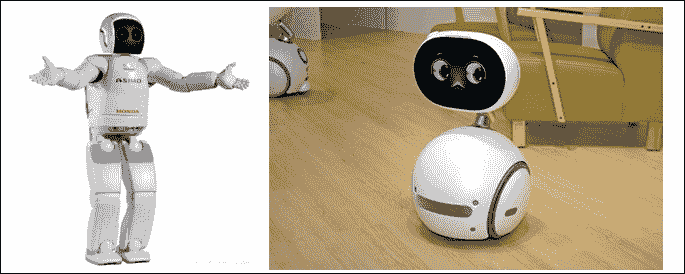

### 注意

[`letsmakerobots.com/files/imagecache/robot_fullpage_header/field_primary_image/asimo.jpg`](http://letsmakerobots.com/files/imagecache/robot_fullpage_header/field_primary_image/asimo.jpg)

[`www.laptopreleasedate.com/wp-content/uploads/2016/06/Robot-ASUS-Zenbo.jpg`](http://www.laptopreleasedate.com/wp-content/uploads/2016/06/Robot-ASUS-Zenbo.jpg)

如果你观察左侧的图片，你可以看到一个看起来像人类，有手、腿、耳朵和显示在屏幕上的脸的机器人。这个机器人是机器人技术研究和开发的一个伟大成果，它试图模仿人类身体的构造，手上有手指可以抓取和握住东西，脚可以用来从一个地方走到另一个地方。它还理解语音并回应人类。

如果你看看右边的图片，它展示了一款基于语音处理与人互动的最新社交机器人。但这看起来并不像人类。社交机器人主要是为了作为人类的个人助理而设计的。它们也旨在娱乐；例如，机器人可以给你讲故事，为你播放歌曲，等等。我想你现在可以理解为什么这样的机器人会被冠以“社交”这个称号。

机器人的类别和应用领域是无限的。一本书不足以解释所有内容。你可以自己进行研究来了解更多。有了这个，我们将结束这个主题，继续讨论差动驱动机器人，这是移动机器人的一种形式，因为这种控制机制将在下一章帮助我们构建自己的移动机器人。

# 差动驱动机器人

差动驱动是一种在大多数需要控制导航机器人的情况下使用的控制机制，特别是对于室内应用。对于初学者来说，这也被认为是开始学习机器人的最佳控制机制。大多数在工业和家庭中使用的室内导航机器人都使用这种机制。

这种机制的概念是使用两个分别驱动的电机与机器人的轮子耦合，相隔一定距离，并放置在固定的共同水平轴上。底盘还包括一个或多个万向轮或滚球轮，以保持平衡。

它看起来是这样的：

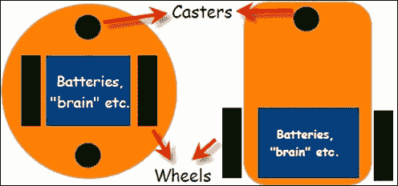

在图中，你可以看到差动驱动机器人的两种不同配置。左边的一个有两个万向轮，而另一个只有一个。这两个是最常用的差动驱动系统配置之一。它们在导航过程中都有不同的运动学。如果你想深入了解，你可以在互联网上找到更多信息。现在，为了开始，你可以选择这些底盘之一——无论你在市场上得到哪个。操作取决于使用电机驱动器 IC 和 MCU 的输出控制两个电机。

当我们观察这些机器人的导航操作时，看起来像这些图示：

+   向前移动：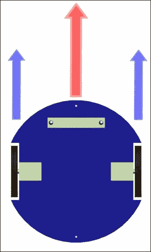

    当右侧电机顺时针旋转而左侧电机逆时针运行时，机器人将向前移动。

+   向后移动：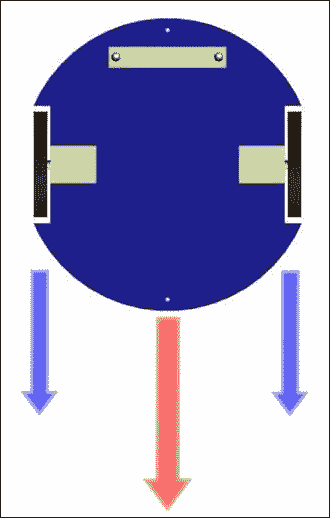

    当右侧电机逆时针旋转而左侧电机顺时针运行时，方向正好与前进运动时的方向相反，机器人将向后移动。

+   左转：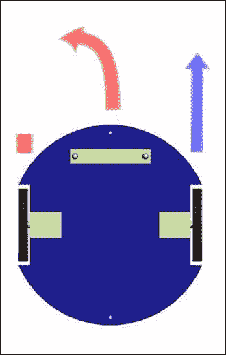

    当左侧电机停止而右侧电机顺时针运行时，机器人向左转。

+   向右转：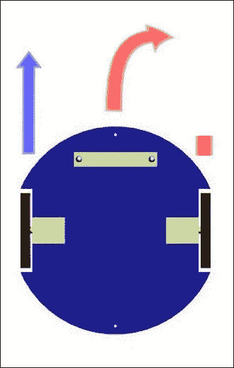

    当左侧电机逆时针运行而右侧电机停止时，机器人向右转。

+   旋转：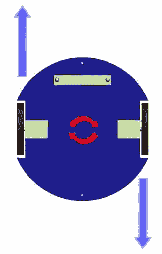

    当两个电机都朝逆时针方向运行时，从上方看，机器人会绕其自身轴心顺时针旋转。同样地，当电机方向反转时，它会逆时针旋转。

+   停止：

    我认为我们不需要图片来解释这个动作——如果两个电机都没有运行，机器人就会停止。

# 概述

因此，我们来到了这一章节的结尾，其中我们介绍了机器人学的基础知识，包括一些将科幻与现实联系起来的例子，随后简要解释了机器人系统的结构和它们的工作原理。我们还探讨了某些例子和它们的应用领域。最后，我们了解了差速驱动机器人的工作方式和操作方法。在下一章中，我们将构建我们自己的实时视频流差速驱动机器人。
