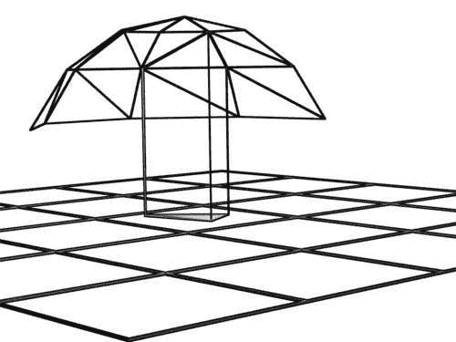

# 第二章。创建和编辑对象

从某种意义上说，网格是 3D 应用程序中最基本的对象类型。它们构成了大多数可见对象的基础，并且是可能进一步绑定和动画的原始材料。本章讨论了网格的创建以及操纵网格对象的方法，无论是作为一个整体还是作为它所包含的各个实体——顶点、边和面。


在本章中，你将学习：

+   如何创建可配置的网格对象

+   如何设计图形用户界面

+   如何让脚本存储用户选择以便以后重用

+   如何在网格中选择顶点和面

+   如何将一个对象附加到另一个对象上

+   如何创建组

+   如何修改网格

+   如何从命令行运行 Blender 并在后台渲染

+   如何处理命令行参数

# 可怕的爬虫——一个配置对象的图形用户界面

实例化一个唯一的 Blender 对象（就像我们在第一章的“hello world”示例中所做的那样）可能是一个好的编程练习，但当一个对象的创建脚本包含内置方法（如复制对象）或修改器（如阵列修改器）不足以满足需求时，它才能真正发挥其作用。

一个很好的例子是我们想要创建一个或多个对象变体，并且这些变体需要易于最终用户配置。例如，螺母和螺栓有各种形状和尺寸，因此 Blender 附带了一个脚本来创建它们。网上还有许多其他脚本，可以创建从机械齿轮到楼梯，从树木到教堂圆顶等各种东西。

在本节中，我们展示了如何构建一个小应用程序，它可以创建各种类似虫子的生物，并附带一个简单但有效的图形用户界面来设置许多可配置的参数。此应用程序还会存储用户偏好设置以供以后重用。

## 构建用户界面

设计、构建和测试一个图形用户界面可能是一项艰巨的任务，但 Blender API 为我们提供了工具，使这项任务变得容易得多。`Blender.Draw`模块提供了简单、常用且易于配置的组件，可以快速构建用户界面。`Blender.BGL`模块提供了从头开始设计图形用户界面的所有工具。我们将主要使用前者，因为它几乎包含了我们所需的一切，但我们也会给出后者的一个示例，以设计一个简单的错误弹出窗口。我们的主要用户界面将看起来像这样：


当我们从 **添加** 菜单（通常可以通过屏幕顶部的菜单栏或按 3D 视图中的空格键访问）调用我们的脚本时，之前的菜单将弹出，用户可以调整参数以符合自己的喜好。当按下 **确定** 按钮时，脚本生成一个类似昆虫的网格。也可以通过按 *Esc* 键退出弹出窗口，在这种情况下，脚本将终止而不会生成网格。

## 创建虫子——需要一些组装

我们的使命是从一小块可能连接在一起的构建块中创建简单的生物。我们脚本的概要如下：

1.  导入我们生物的构建块。

1.  绘制用户界面。

1.  根据用户定义的构建块组装生物网格。

1.  将网格作为对象插入场景。

我们逐步通过脚本，详细展示相关部分。（完整的脚本作为 `creepycrawlies.py` 提供。）第一步涉及创建适合组装的身体部分。这意味着我们必须在 Blender 中建模这些部分，定义合适的关节并将这些关节标记为顶点组。然后我们通过使用我们在下一章中再次遇到的脚本将这些网格作为 Python 代码导出，该脚本处理顶点组。

目前，我们只是将生成的 Python 代码简单地用作包含定义每个身体部分的几个顶点列表的模块。我们必须确保这个模块在 Python 路径中的某个位置，例如，`.blender\scripts\bpymodules` 将是一个合理的选项，或者也可以是用户 `scriptdir`。包含网格构建块的 Python 文件命名为 `mymesh.py`，因此我们代码的第一部分包含以下 `import` 语句：

```py
import mymesh
```

## 创建用户界面

使用 `Draw.Create()` 创建所需的按钮，并通过 `Draw.PupBlock()` 组装和初始化这些按钮，绘制简单的用户界面是一个问题。

与某些编程语言中可用的完整库相比，这有些局限，但非常容易使用。基本思想是创建交互式对象，如按钮，然后将它们组装在对话框中显示给用户。同时，对话框还说明了按钮可能产生的值的限制。对话框或弹出窗口将在光标位置显示。Blender 能够生成更复杂的用户界面，但到目前为止，我们坚持使用基本功能。

虽然 `Draw.Create()` 可以生成切换按钮和字符串的输入按钮，但对我们来说，我们的应用只需要整数和浮点值的输入按钮。变量的类型（例如浮点值或整数）由提供给 `Draw.Create()` 的默认值的类型决定。`**OK**` 按钮由 `Draw.PupBlock()` 自动显示。这个函数接受一个元组列表作为参数，每个元组定义了一个要显示的按钮。每个元组由要显示在按钮上的文本、使用 `Draw.Create()` 创建的按钮对象、允许的最小和最大值以及当鼠标悬停在按钮上时显示的工具提示文本组成。

```py
Draw = Blender.Draw
THORAXSEGMENTS = Draw.Create(3)
TAILSEGMENTS = Draw.Create(5)
LEGSEGMENTS = Draw.Create(2)
WINGSEGMENTS = Draw.Create(2)
EYESIZE = Draw.Create(1.0)
TAILTAPER = Draw.Create(0.9)

if not Draw.PupBlock('Add CreepyCrawly', [
('Thorax segments:' , THORAXSEGMENTS, 2, 50,'Number of thorax segments'),
('Tail segments:' , TAILSEGMENTS, 0, 50, 'Number of tail segments'),
('Leg segments:' , LEGSEGMENTS, 2, 10, 'Number of thorax segments with legs'),
('Wing segments:' , WINGSEGMENTS, 0, 10, 'Number of thorax segments with wings'),
('Eye size:' , EYESIZE, 0.1,10, 'Size of the eyes'),
('Tail taper:' , TAILTAPER, 0.1,10, 'Taper fraction of each tail segment'),]):
   return
```

如您所见，我们将输入按钮的可能值限制在一个合理的范围内（胸和尾段最多为 50），以防止出现不希望的结果（如果内存或处理能力稀缺，巨大的值可能会使您的系统瘫痪）。

## 记忆选择

如果我们能够记住用户的选择，以便在脚本再次运行时呈现最后设置，那将非常方便。但在 Blender 中，每个脚本都是独立运行的，一旦脚本结束，脚本内的所有信息都会丢失。因此，我们需要某种机制以持久的方式存储信息。为此，Blender API 有一个 `Registry` 模块，允许我们通过任意键索引来保持值（并在磁盘上也是如此）。

如果我们想要添加此功能，我们的 GUI 初始化代码本身变化不大，但前面会添加代码来检索已记住的值（如果有的话），后面会跟随着保存用户选择的代码：

```py
reg = Blender.Registry.GetKey('CreepyCrawlies',True)
try:
   nthorax=reg['ThoraxSegments']
except:
   nthorax=3
try:
   ntail=reg['TailSegments']
except:
   ntail=5
... <similar code for other parameters> ...

Draw = Blender.Draw
THORAXSEGMENTS = Draw.Create(nthorax)
TAILSEGMENTS = Draw.Create(ntail)
LEGSEGMENTS = Draw.Create(nleg)
WINGSEGMENTS = Draw.Create(nwing)
EYESIZE = Draw.Create(eye)
TAILTAPER = Draw.Create(taper)

if not Draw.PupBlock('Add CreepyCrawly', [\
... <identical code as in previous example> ...
return
reg={'ThoraxSegments':THORAXSEGMENTS.val,
	 'TailSegments' :TAILSEGMENTS.val,
	 'LegSegments' :LEGSEGMENTS.val,
	 'WingSegments' :WINGSEGMENTS.val,
	 'EyeSize' :EYESIZE.val,
	 'TailTaper':TAILTAPER.val}
Blender.Registry.SetKey('CreepyCrawlies',reg,True)

```

实际上读取和写入我们的注册表条目被突出显示。`True` 参数表示，如果数据不在内存中，我们希望从磁盘检索我们的数据，或者在保存时也将其写入磁盘，以便即使我们停止 Blender 并稍后重新启动，我们的脚本也能访问这些保存的信息。实际接收或写入的注册表条目是一个可以存储我们想要的任何数据的字典。当然，可能还没有注册表条目，在这种情况下，我们会得到一个 `None` 值——这种情况通过 `try` `…` `except` `…` 语句得到了处理。

## Blender 图形的全部力量

对于许多应用来说，一个弹出对话框就足够了，但如果它不符合你的要求，Blender 的 `Draw` 模块提供了更多构建块来创建用户界面，但这些构建块需要更多努力才能将它们粘合在一起以形成一个工作应用。

我们将使用这些构建块来创建一个错误弹出窗口。这个弹出窗口仅仅在令人不安的背景色上显示一条消息，但很好地说明了用户操作（如按键或按钮点击）是如何与图形元素相联系的。

```py
from Blender import Window,Draw,BGL

def event(evt, val):
    if evt == Draw.ESCKEY:
       Draw.Exit() # exit when user presses ESC
    return

def button_event(evt):
    if evt == 1:
       Draw.Exit() 
    return

def msg(text):
    w = Draw.GetStringWidth(text)+20
    wb= Draw.GetStringWidth('Ok')+8
    BGL.glClearColor(0.6, 0.6, 0.6, 1.0)
    BGL.glClear(BGL.GL_COLOR_BUFFER_BIT)
    BGL.glColor3f(0.75, 0.75, 0.75)
    BGL.glRecti(3,30,w+wb,3)
    Draw.Button("Ok",1,4,4,wb,28)
    Draw.Label(text,4+wb,4,w,28)

def error(text):
   Draw.Register(lambda:msg(text), event, button_event)
```

`error()`函数是用户开始和结束的地方；它告诉 Blender 要绘制什么，将事件（如按钮点击）发送到何处，将按键发送到何处，并开始交互。`lambda`函数是必要的，因为我们传递给`Draw.Register()`以绘制东西的函数不能接受参数，但我们希望在每次调用`error()`时传递不同的文本参数。`lambda`函数基本上定义了一个没有参数但有文本封装的新函数。

`msg()`函数负责在屏幕上绘制所有元素。它使用`BGL.glRecti()`函数绘制一个带有文本的彩色背景（使用`Draw.Label()`），并绘制一个分配有事件编号`1`的 OK 按钮（使用`Draw.Button()`）。当用户点击 OK 按钮时，这个事件编号被发送到事件处理器——我们传递给`Draw.Register()`的`button_event()`函数。当事件处理器被调用并带有事件编号`1`时，它所做的所有事情就是通过调用`Draw.Exit()`来终止`Draw.Register()`函数，因此我们的`error()`函数可以返回。

## 创建一个新的网格对象

一旦我们从`mymesh`模块中检索到我们的顶点坐标和面索引列表，我们需要一种方法在我们的场景中创建一个新的`Mesh`对象，并将`MVert`和`MFace`对象添加到这个网格中。这可能像这样实现：

```py
me=Blender.Mesh.New('Bug')
me.verts.extend(verts)
me.faces.extend(faces)
scn=Blender.Scene.GetCurrent()
ob=scn.objects.new(me,'Bug')
scn.objects.active=ob

me.remDoubles(0.001)
me.recalcNormals()
```

第一行创建了一个名为`Bug`的新`Mesh`对象。它将不包含任何顶点、边或面，并且不会嵌入到 Blender 对象中，也不会连接到任何`Scene`。如果网格的名字已经存在，它将附加一个唯一的数字后缀（例如，`Bug.001`）。

接下来的两行实际上在网格内部创建几何形状。`verts`属性是我们引用`MVert`对象列表的地方。它有一个`extend()`方法，该方法将接受一个包含顶点创建的 x、y 和 z 坐标的元组的列表。同样，`faces`属性的`extend()`方法将接受一个包含指向顶点列表的三个或更多索引的元组的列表，这些索引一起定义了一个面。在这里顺序很重要：我们需要首先添加新顶点；否则，新创建的面无法引用它们。没有必要定义任何边，因为添加面也会创建隐含的边，这些边尚未存在。

网格本身还不是用户可以操作的对象，所以在接下来的几行（突出显示）中，我们检索当前场景并向场景添加一个新对象。`new()`的参数是我们之前创建的`Mesh`对象以及我们想要给对象起的名字。给对象起的名字可能与网格的名字相同，因为网格名字和对象名字存在于不同的命名空间中。与网格一样，现有的名字将通过添加后缀来变得唯一。如果省略了名字，新对象将具有其参数的类型作为默认名字（在这种情况下是`Mesh`）。

新创建的对象将被选中但不会激活，所以我们通过将我们的对象分配给`scene.objects.active`来纠正这一点。

当我们从各种顶点集合中组合我们的网格时，结果可能不像我们希望的那样干净，因此，最后的两个动作确保我们没有占据空间中几乎相同位置的顶点，并且所有面的法向量都一致指向外部。

# 转换网格拓扑

从积木块创建生物体需要我们在将它们粘合在一起之前，对这些积木块进行复制、缩放和镜像。在 Blender 2.49 中，这意味着我们必须定义一些实用函数来执行这些操作，因为这些操作在 API 中不存在。我们在**工具**模块中定义了这些实用函数，但在这里我们突出了一些，因为它们展示了有趣的方法。

一些动作，如围绕中点缩放或顶点的平移是直接的，但将一组顶点连接到另一组是棘手的，因为我们希望防止边交叉并保持面平坦且无扭曲。我们不能简单地连接两组顶点（或边环）。但通过尝试边环上的不同起点并检查这种选择是否最小化所有顶点对之间的距离，我们确保没有边交叉且扭曲最小（尽管如果边环形状非常不同，我们无法防止面扭曲）。

## 连接边环的代码概述

在创建新面的函数中，我们必须执行以下步骤：

1.  检查两个边环是否长度相等且非零。

1.  对于循环 1 中的每个边：

    1.  找到循环 2 中最接近的边。

    1.  创建一个连接这两个边的面。

实现此概述的函数看起来相当复杂：

```py
def bridge_edgeloops(e1,e2,verts):

    e1 = e1[:]
    e2 = e2[:]
    faces=[]

if len(e1) == len(e2) and len(e1) > 0 :
```

该函数接受两个边列表和一个顶点列表作为参数。边由两个整数的元组表示（`verts`列表中的索引），顶点由 x、y 和 z 坐标的元组表示。

我们首先做的事情是复制两个边列表，因为我们不希望在原始上下文中破坏这些列表。我们将要构建的面列表初始化为空列表，并对两个边列表的长度进行合理性检查。如果检查无误，我们继续下一步：

```py
for a in e1:
    distance = None
    best = None
    enot = []
```

我们遍历第一个列表中的每个边，将这个边称为`a`。`distance`参数将保存到第二个边列表中最近边的距离，而`best`将是该边的引用。`enot`是一个列表，它将累积第二个列表中距离`best`更远的所有边。

每次迭代的末尾，`enot`将保存第二个列表中除一个之外的所有边——我们认为是最近的那个。然后我们将`enot`重新分配给第二个列表，这样第二个列表在每个迭代中就会减少一个边。一旦第二个边列表耗尽，我们就完成了：

```py
while len(e2):
    b = e2.pop(0)
```

我们正在考虑的第二个列表中的当前边被称为`b`。为了我们的目的，我们将`a`和`b`之间的距离定义为`a`和`b`中对应顶点的距离之和。如果这个距离更短，我们将其定义为到`b`翻转顶点的距离之和。如果最后一种情况适用，我们在边`b`中交换顶点。这看起来可能是一种复杂的方法，但通过将两个距离相加，我们确保了相对共线的边被优先考虑，从而减少了将要构建的非平面面的数量。通过检查翻转第二个边是否会缩短距离，我们防止了形成扭曲或蝴蝶结四边形，如下面的图示所示：


实现将类似于之前的图示，其中高亮的 vec 是`Mathutil.Vector`的别名，将我们的 x、y 和 z 坐标的元组转换为适当的向量，我们可以从中减去、相加并计算长度。

首先，我们计算距离：

```py
d1 = (vec(verts[a[0]]) - vec(verts[b[0]])).length + \
(vec(verts[a[1]]) – vec(verts[b[1]])).length
```

然后我们检查翻转 b 边是否会导致距离更短：

```py
d2 = (vec(verts[a[0]]) - vec(verts[b[1]])).length + \
(vec(verts[a[1]]) - vec(verts[b[0]])).length
if d2<d1 :
    b =(b[1],b[0])
    d1 = d2
```

如果计算出的距离不是最短的，我们将边留到下一次迭代，除非它是我们遇到的第一个：

```py
if distance == None or d1<distance :
    if best != None:
       enot.append(best)
       best = b
       distance = d1
    else:
       enot.append(b)
       e2 = enot
       faces.append((a,best))
```

最后，我们将由两个边组成的元组列表转换为四个索引的元组列表：

```py
return [(a[0],b[0],b[1],a[1]) for a,b in faces]
```

这个脚本还有很多内容，我们将在下一章中重新访问`creepycrawlies.py`，当我们添加修改器和顶点组并给我们的模型绑定时。插图显示了脚本可以创建的野兽样本。


# 用 Blender 风格的条形图惊艳你的老板

为了证明 Blender 除了交互式创建 3D 图形之外，还能适应许多任务，我们将向您展示如何导入外部数据（CSV 格式的电子表格）并自动化创建和渲染条形图 3D 表示的任务。


策略是运行 Blender，使用参数将其指向运行一个读取`.csv`文件、渲染图像并在完成后保存该图像的脚本。为了实现这一点，我们需要一种方法来使用正确的参数调用 Blender。我们将在稍后的脚本中介绍这一点，但首先让我们看看如何传递参数给 Blender 以使其运行 Python 脚本：

```py
blender -P /full/path/to/barchart.py
```

也可以通过命名文本缓冲区来在`.blend`文件内部运行脚本。注意在这种情况下参数的顺序——`.blend`文件排在前面：

```py
blender barchart.blend -P barchart.py

```

我们还需要一种方式来指定传递给我们的脚本的参数。与 API 文档中描述的不同，我们可以像这样从 Python 中访问命令行参数：

```py
import sys
print sys.argv
```

最后这段代码将打印出所有参数，包括作为第一个参数的 Blender 可执行文件名。当使用这个列表时，我们的脚本必须跳过任何打算用于 Blender 本身的参数。任何只打算用于我们的脚本且不应该被 Blender 本身解释的参数应该跟在**选项结束**参数之后，即双横线（`--`）。

最后，我们不希望 Blender 弹出并显示交互式 GUI。相反，我们将指示它在后台运行，并在完成后退出。这是通过传递`-b`选项来完成的。将这些放在一起，命令行将看起来像这样：

```py
blender -b barchart.blend -P barchart.py –- data.csv

```

如果 Blender 以后台模式运行，*必须*指定一个`.blend`文件，否则 Blender 将会崩溃。如果我们必须指定一个`.blend`文件，我们也可以使用内部文本作为我们的 Python 脚本，否则我们就必须将两个文件放在一起而不是一个。

## 柱状图脚本

在这里，我们以块的形式展示代码的相关部分（完整的文件作为`barchart.blend`提供，其中包含内嵌的`barchart.py`文本）。我们首先创建一个新的`World`对象，并将其天顶和地平线颜色设置为中性全白（以下代码的高亮部分）：

```py
if __name__ == '__main__':
    w=World.New('BarWorld')
    w.setHor([1,1,1])
    w.setZen([1,1,1])

```

接下来，我们检索传递给 Blender 的最后一个参数，并检查扩展名是否为`.csv`文件。在实际的生产代码中，当然会有更复杂的错误检查：

```py
csv = sys.argv[-1]
if csv.endswith('.csv'):
```

如果它有正确的扩展名，我们将创建一个名为`BarScene`的新`Scene`，并将它的`world`属性设置为我们的新创建的世界（这受到了 Blender Artists 上*jessethemid*的一个更复杂的脚本的启发[`blenderartists.org/forum/showthread.php?t=79285`](http://blenderartists.org/forum/showthread.php?t=79285))。后台模式不会加载任何默认的`.blend`文件，所以默认场景将不包含任何对象。然而，为了确保这一点，我们创建了一个具有有意义名称的新空场景，它将包含我们的对象：

```py
sc=Scene.New('BarScene')
sc.world=w
sc.makeCurrent()
```

然后，我们将文件名传递给一个函数，该函数将`barchart`对象添加到当前场景中，并返回图表的中心，以便我们的`addcamera()`函数可以使用它来定位相机。我们还添加了一个灯来使渲染成为可能（否则我们的渲染将会是全黑的）。

```py
center = barchart(sys.argv[-1])
addcamera(center)
addlamp()
```

渲染本身很简单（我们将在第八章 Rendering and Image Manipulation 中遇到更复杂的例子），我们将检索包含所有渲染信息的渲染上下文，例如哪个帧、输出类型、渲染的大小等等。由于大多数属性都有合理的默认值，我们只需将格式设置为 PNG 并渲染即可。

```py
context=sc.getRenderingContext()
context.setImageType(Scene.Render.PNG)
context.render()
```

最后，我们将输出目录设置为空字符串，以便我们的输出指向当前工作目录（我们调用 Blender 时的目录）并保存我们的渲染图像。图像将具有与传递给第一个参数的`.csv`文件相同的基名，但将具有`.png`扩展名。我们检查了文件名以`.csv`结尾，因此可以安全地从文件名中删除最后四个字符并添加`.png`

```py
context.setRenderPath('')
context.saveRenderedImage(csv[:-4]+'.png')
```

添加一盏灯与添加任何其他对象并没有太大区别，它与“hello world”示例非常相似。我们创建一个新的`Lamp`对象，将其添加到当前场景中，并设置其位置。`Lamp`对象当然有许多可配置的选项，但在这个例子中我们选择默认的非定向灯。高亮显示的代码显示了某些典型的 Python 惯用语：`loc`是一个包含三个值的元组，但`setLocation()`需要三个单独的参数，因此我们使用`*`符号来表示我们希望将元组解包为单独的值：

```py
def addlamp(loc=(0.0,0.0,10.0)):
    sc = Scene.GetCurrent()
    la = Lamp.New('Lamp')
    ob = sc.objects.new(la)
    ob.setLocation(*loc)

```

添加相机稍微复杂一些，因为我们必须将其指向我们的条形图并确保视图角度足够宽，以便可以看到一切。在这里我们定义了一个透视相机并设置了一个相当宽的角度。因为默认相机已经沿 z 轴定位，所以我们不需要设置任何旋转，只需将位置设置为从中心沿 z 轴远离 12 个单位，如以下代码的倒数第二行所示：

```py
def addcamera(center):
    sc = Scene.GetCurrent()
    ca = Camera.New('persp','Camera')
    ca.angle=75.0
    ob = sc.objects.new(ca)
    ob.setLocation(center[0],center[1],center[2]+12.0)
    sc.objects.camera=ob
```

`barchart`函数本身并没有太多惊喜。我们打开传入的文件名，并使用 Python 的标准`csv`模块从文件中读取数据。我们将所有列标题存储在`xlabel`中，并将其他数据存储在`rows`中。

```py
from csv import DictReader

def barchart(filename): 
    csv = open(filename)
    data = DictReader(csv)
    xlabel = data.fieldnames[0]
    rows = [d for d in data]
```

为了将我们的条形图缩放到合理的值，我们必须确定数据的极值。每个记录的第一列包含 x 值（或标签），因此我们将其排除在我们的计算之外。因为每个值都存储为字符串，所以我们必须将其转换为浮点值进行比较。

```py
maximum = max([float(r[n]) for n in data.fieldnames[1:] for r in rows])
minimum = min([float(r[n]) for n in data.fieldnames[1:] for r in rows])
```

为了创建实际的条形图，我们遍历所有行。因为 x 值可能是一个文本标签（例如，月份的名称），我们保留一个单独的数值 x 值来定位条形图。x 值本身是通过`label()`函数添加到场景中的`Text3d`对象，而 y 值是通过`bar()`函数添加的适当缩放的`Cube`对象来可视化的。这里没有显示`label()`或`bar()`函数。

```py
for x,row in enumerate(rows):
    lastx=x
    label(row[xlabel],(x,10,0))
for y,ylabel in enumerate(data.fieldnames[1:]):
    bar(10.0*(float(row[ylabel])-minimum)/maximum,(x,0,y+1))
    x = lastx+1
```

最后，我们为每个列（即每组数据）添加其自己的列标题作为标签。我们存储了 x 值的数量，因此我们可以通过将其除以二（y 分量设置为 5.0，因为我们已将所有 y 值缩放到 0-10 的范围内）来返回条形图的中心。

```py
for y,ylabel in enumerate(data.fieldnames[1:]):
    label(ylabel,(x,0,y+0.5),'x')
    return (lastx/2.0,5.0,0.0)
```

### 小贴士

**Windows 技巧：发送到**

一旦你有了包含正确 Python 脚本和已经从命令行中找到正确调用方式`.blend`文件，你可以通过创建一个`SendTo`程序来更紧密地将它集成到 Windows XP 中。在这个例子中，`SendTo`程序（一个`.BAT`文件）是任何接受单个文件名作为参数并对其执行操作的程序。它必须位于`SendTo`目录中——这个目录可能位于系统配置的不同位置。通过点击**开始**按钮，选择**运行**，并输入**sendto**而不是命令，可以轻松找到它。这将打开正确的目录。在这个目录中，你可以放置`.BAT`文件，在我们的例子中我们称之为`BarChart.BAT`，它将包含一个单独的命令：`/full/path/to/blender.exe` `/path/to/barchart.blend` `-P` `barchart.py` `--` `%1`（注意百分号）。现在我们只需右键单击我们遇到的任何`.csv`文件，然后可以从`SendTo`菜单中选择`BarChart.BAT`，嘿， presto，一个`.png`文件将出现在我们的`.csv`旁边。

# 奇怪的面——在网格中选择和编辑面

Blender 已经提供了一系列选项来选择和操作网格的面、边和顶点，无论是通过内置方法还是通过 Python 扩展脚本。但如果你想根据你独特的需求选择一些元素，本节将展示如何实现这一点。我们构建了一些小脚本，展示了如何访问面、边和顶点以及如何处理这些对象的各个属性。

# 选择扭曲（非平面）四边形

**扭曲** **四边形**，也称为**蝴蝶结** **四边形**，有时在创建面时意外混淆顶点顺序时形成。在不太极端的情况下，它们可能在移动平面四边形的单个顶点时形成。这个小插图显示了这些在 3D 视图中可能看起来如何：


在 3D 视图中，右侧的扭曲面看起来并不异常，但渲染时它并不显示均匀的着色：


这两个对象都是平面，由一个面和四个顶点组成。左边的是一个蝴蝶结四边形。它的右边边旋转了整整 180 度，结果形成了一个难看的黑色三角形，我们可以看到扭曲面的背面。右边的平面在 3D 视图中没有明显的扭曲，尽管它的右上角顶点在 z 轴（我们的视线）上移动了相当的距离。然而，当渲染时，右平面的扭曲却非常明显。轻微扭曲的四边形的可见扭曲可以通过设置面的 `smooth` 属性来克服，这将沿面插值顶点法线，从而产生平滑的外观。当通过骨架建模或变形网格时，轻微扭曲的四边形几乎是不可避免的，它们是否导致可见问题取决于具体情况。通常，如果你能识别并选择它们，以便做出自己的判断，这会很有帮助。

可以通过检查构成四边形的三角形的法线是否指向同一方向来识别扭曲的四边形。一个平坦的四边形的三角形法线将指向与以下图示相同的方向：


而在一个扭曲的四边形中，这些法线并不平行：


这些三角形法线与顶点法线不同：顶点法线定义为共享顶点的所有面的法线的平均值，因此我们不得不自己计算这些三角形法线。这可以通过计算边向量的叉积来完成，即由每条边的两个端点定义的向量。在所显示的示例中，左边的三角形法线是通过计算边向量 1 → 0 和 1 → 2 的叉积得到的，右边的三角形是通过计算边向量 2 → 1 和 2 → 3 的叉积得到的。

我们是按顺时针还是逆时针遍历边没有关系，但我们必须在计算叉积时注意保持边顺序的一致性，因为符号将会反转。一旦我们有了三角形法线，我们可以通过验证一个向量的所有分量（x、y 和 z）与第二个向量的相应分量相比是否按相同的因子缩放来检查它们是否指向完全相同的方向。然而，为了给我们提供更多的灵活性，我们希望计算三角形法线之间的角度，并且只有当这个角度超过某个最小值时才选择面。我们不必自己设计这样的函数，因为 `Blender.Mathutils` 模块提供了 `AngleBetweenVecs()` 函数。

在一个四边形内可以构造四个不同的三角形，但不需要比较所有三角形法线——任何两个法线就足够了，因为移动四边形的一个顶点将改变四个可能三角形法线中的三个。

## 代码轮廓扭曲选择

带着所有这些信息，我们的工具轮廓将如下所示：

1.  显示最小角度的弹出窗口。

1.  验证活动对象是否为网格且处于**编辑**模式。

1.  启用**面选择**模式。

1.  对于所有面，检查面是否为四边形，如果是，则：

    +   计算由顶点 0、1 和 2 定义的三角形法线

    +   计算由顶点 1、2 和 3 定义的三角形法线

    +   计算法线之间的角度

    +   如果角度 > 最小角度，则选择面

这在以下代码中得到了实际检测和选择的体现（完整的脚本作为`warpselect.py`提供）：

```py
def warpselect(me,maxangle=5.0):
	for face in me.faces:
		if len(face.verts) == 4:
			n1 = ( face.verts[0].co - face.verts[1].co ).cross(
			face.verts[2].co - face.verts[1].co )
			n2 = ( face.verts[1].co - face.verts[2].co ).cross(
			face.verts[3].co - face.verts[2].co )
			a = AngleBetweenVecs(n1,n2)
			if a > maxangle :
				face.sel = 1
```

如您所见，我们的轮廓几乎与代码一一对应。注意，`AngleBetweenVecs()`返回的角度是以度为单位，因此我们可以直接将其与也是以度为单位的最小角度`maxangle`进行比较。此外，我们不需要自己实现两个向量的叉积，因为 Blender 的`Vector`类已经包含了各种运算符。在我们能够调用此函数之前，我们必须注意一个重要的细节：为了选择面，**面选择**模式应该被启用。这可以通过以下方式完成：

```py
selectmode = Blender.Mesh.Mode()
Blender.Mesh.Mode(selectmode | Blender.Mesh.SelectModes.FACE)
```

为了说明一个不太为人所知的事实，即选择模式并非**不互斥**，我们除了设置任何已选模式外，还设置了**面选择**模式，通过使用二进制或运算符（`|`）结合值来实现。在脚本结束时，我们恢复到之前激活的模式。

# 选择超锐利面

存在许多工具可以用于选择在某种程度上难以处理的面的选择。Blender 内置了选择面积过小或周长过短的面选择工具。然而，它缺少一个用于选择边形成角度比某个限制更锐利的面的工具。在某些建模任务中，如果我们能够选择这样的面，将会非常方便，因为它们通常很难操作，并且在应用次表面修改器或变形网格时可能会产生难看的伪影。

### 注意

注意，尽管名称如此，Blender 的**选择****锐边**工具（*Ctrl + Alt + Shift + S*）实际上做的是不同的事情；它选择那些恰好由两个面共享的边，这两个面的接触角度小于某个最小值，或者换句话说，选择相对平坦的面之间的边。

我们已经看到，Blender 的`Mathutils`模块有一个用于计算角度的函数，因此我们的代码非常简短，因为实际的工作是由下面显示的单个函数完成的。（完整的脚本作为`sharpfaces.py`提供。）

```py
def sharpfaces(me,minimum_angle):
   for face in me.faces:
      n = len(face.verts)
      edges = [face.verts[(i+1)%n].co - face.verts[i].co for i in range(n)]
      for i in range(n):
         a = AngleBetweenVecs(-edges[i],edges[(i+1)%n])
         if a < minimum_angle :
            face.sel = 1
            break
```

注意，我们并不区分三角形或四边形，因为两者都可能具有通过锐角相连的边。前述代码中高亮的部分显示了一个细微的细节；每次我们计算两个边向量的角度时，我们都会反转其中一个，因为为了计算正确的角度，每个向量都应该起源于同一个顶点，而我们是将它们都计算为从一个顶点指向下一个顶点。

区别在下图中展示：


# 选择具有许多边的顶点

理想情况下，一个网格将包含只由四个顶点组成的面（这些面通常被称为**四边形**）并且大小相当均匀。这种配置在变形网格时是最优的，这在动画中通常是必要的。当然，三角形面（**tris**）本身并没有内在的错误，但通常最好避免它们，因为小的三角形面会破坏次表面修改器，导致它们出现难看的涟漪。


现在即使你有一个只由四边形组成的网格，一些顶点也是超过四个边的中心。这些顶点有时被称为**极点**，因此以下章节中脚本的名称。如果边的数量过多，比如说六个或更多（如前一个截图所示），这样的区域可能变得难以变形，并且对于模型师来说难以操作。在一个大而复杂的网格中，这些顶点可能难以定位，因此我们需要一个选择工具来选择这些顶点。

# 选择极点

为了选择具有特定步数的顶点，我们可以执行以下步骤：

1.  检查活动对象是否为`Mesh。`

1.  检查我们是否处于*对象*模式。

1.  显示一个弹出菜单以输入最小边数。

1.  对于每个顶点：

    +   遍历所有边，计算顶点的出现次数

    +   如果计数大于或等于最小值，则选择顶点

这种方法简单直接。负责实际工作的函数如下所示（完整脚本名为`poleselect1.py`）。它紧密遵循我们的大纲。实际选择一个顶点是通过将顶点的`sel`属性赋值来实现的。注意，`edge`对象的`v1`和`v2`属性并不是我们网格`verts`属性的索引，而是指向`MVert`对象。这就是为什么我们需要检索`index`属性来比较的原因。

```py
def poleselect1(me,n=5):
   for v in me.verts:
      n_edges=0
      for e in me.edges:
         if e.v1.index == v.index or e.v2.index == v.index:
            n_edges+=1
            if n_edges >= n:
               v.sel = 1
               break
```

## 再次选择极点

你可能已经注意到，我们遍历了每个顶点的边列表（在前面的代码中突出显示）。这可能在性能上代价高昂，而且这种成本还因为需要反复检索索引而加剧。是否有可能编写更高效的代码，同时仍然保持可读性？如果遵循以下策略，就可以做到：

1.  检查活动对象是否为`Mesh。`

1.  检查我们是否处于*对象*模式。

1.  显示一个弹出菜单以输入最小边数。

1.  初始化一个字典，以顶点索引为索引，将包含边计数。

1.  遍历所有边（更新两个引用顶点的计数）。

1.  遍历字典中的项（如果计数大于或等于最小值，则选择顶点）。

通过使用这种策略，我们只需进行两次可能很长的迭代，代价是需要存储字典的内存（没有什么是免费的）。对于小网格，速度的提高可以忽略不计，但对于大网格，速度的提高可能相当可观（我在一个小型的 3000 个顶点的网格上测得速度提高了 1000 倍），而这些正是可能需要这种工具的网格类型。

我们改进的选择函数如下（完整的脚本名为`poleselect.py`）。首先注意`import`语句。我们将使用的字典被称为默认字典，由 Python 的 collections 模块提供。一个**默认**字典是一种在第一次引用缺失项时初始化它的字典。由于我们希望增加每个由边引用的顶点的计数，我们可以在事先为网格中的每个顶点初始化零值，或者在我们想要增加计数时检查顶点是否已经索引，如果没有，则初始化它。默认字典消除了事先初始化所有内容的需要，并允许使用非常易读的语法。

我们通过调用`defaultdictionary()`函数（在面向对象领域，一个通过函数的某些参数配置其行为的函数返回新对象被称为工厂）并传递一个`int`参数来创建我们的字典。该参数应该是一个不接受任何参数的函数。我们在这里使用的内置函数`int()`在无参数调用时将返回一个整数值零。每次我们使用一个不存在的键访问我们的字典时，都会创建一个新的项，其值将是我们的`int()`函数的返回值，即零。关键行是两个增加`edgecount`（以下代码的高亮部分）的行。我们可以用稍微不同的方式编写那个表达式来展示为什么我们需要默认字典：

```py
edgecount[edge.v1.index] = edgecount[edge.v1.index] + 1
```

表达式右侧我们引用的字典项可能每次当我们第一次遇到一个顶点索引时可能还不存在。当然，我们可以在事先进行检查，但这会使代码的可读性大大降低。

```py
from collections import defaultdict

def poleselect(me,n=5):
   n_edges = defaultdict(int)
   for e in me.edges:
      n_edges[e.v1.index]+=1
      n_edges[e.v2.index]+=1
   for v in (v for v,c in n_edges.items() if c>=n ):
      me.verts[v].sel=1
```

# 确定网格的体积

虽然 Blender 实际上不是一个 CAD 程序，但许多人用它来解决类似 CAD 的问题，如建筑可视化。Blender 能够导入许多类型的文件，包括主要 CAD 程序的文件，因此包括精确测量的技术模型永远不会是问题。

这些 CAD 程序通常提供各种工具来测量模型（的部件）的尺寸，然而，Blender 由于其本质，提供的这些工具非常有限。通过按 3D 视图窗口中的*N*键，可以检查对象的大小和位置。在*编辑*模式下，您可以启用显示边长、边角和面面积（请参阅按钮窗口编辑上下文（*F9*）中的**网格工具更多**面板），但这只是其中的一部分。

在我们需要某些特定测量且无法将模型导出到 CAD 工具的情况下，Python 可以克服这些限制。一个实际的例子是计算网格的体积。如今，许多公司提供通过 3D 打印技术将您的数字模型重新创建为现实世界物体的可能性。我得说，握在手中一个塑料或甚至金属的 Blender 模型复制品是一种相当特殊的感觉，它真的为 3D 增加了一个全新的维度。

现在模型 3D 打印的主要成本组成部分是所需使用的材料量。通常，您可以将模型设计为空心物体，以减少生产所需的材料，但反复上传模型的中间版本以让制造商的软件计算体积并给出报价是非常不方便的。因此，我们希望有一个可以以相当准确的方式计算网格体积的脚本。

计算网格体积的一种常见方法有时被称为**测量员公式**，因为它与测量员通过三角测量其表面来计算山丘或山脉体积的方式有关。

核心思想是将三角剖分的网格分成许多以 xy 平面为底座的柱体。

将三角形投影到 xy 平面上的表面积乘以三个顶点的平均 z 位置，然后给出这样一个柱体的体积。将这些体积相加，最终给出完整网格的体积（请参见下一图）。



有几点需要注意。首先，网格可能延伸到 xy 平面以下。如果我们从一个位于 xy 平面以下的面构建一个柱体，投影面积与 z 坐标平均值之积将是一个负数，因此我们必须取其相反数以得到体积。


其次，一个网格可能完全或部分位于 xy 平面之上。如果我们看一下前一张图中的例子，我们会看到物体有两个三角形对物体的体积有贡献，即顶部和底部的三角形（垂直三角形的投影面积为零，因此不会做出贡献）。由于顶部和底部面都位于 xy 平面之上，我们必须从由顶部面构建的体积中减去由底部面构建的柱体的体积。如果物体完全位于 xy 平面之下，情况则相反，我们必须从底部柱体的体积中减去顶部柱体的体积。

我们如何确定要做什么是由我们三角形的面对法线方向决定的。例如，如果一个三角形位于 xy 平面之上，但其面对法线指向下方（具有负的 z 分量），那么我们必须减去计算出的体积。因此，所有面对法线始终指向外部（在*编辑*模式下，选择所有面并按*Ctrl + N*）至关重要。

如果我们考虑所有四种可能性（面对法线向上或向下，面对位于 xy 平面之上或之下），我们可以为我们的函数写出以下大纲：

1.  确保所有面对法线始终指向外部。

1.  对于所有面：

    +   计算面对法线向量的 z 分量**Nz**

    +   计算平均 z 坐标和投影表面积的乘积**P**。

    +   如果 Nz 为正：添加 P

    +   如果 Nz 为负：减去 P

这个巧妙的算法适用于没有孔的简单物体，同样适用于包含孔的物体（例如环面），甚至空心物体（即完全包含在另一个物体中的物体），如下面的截图所示：


由于我们允许面积和 z 坐标的乘积为负，我们只需要检查面对法线的方向，以涵盖所有情况。

### 注意

注意，网格必须是封闭的和单形的：不应该有任何缺失的面，也不应该有任何不恰好共享两个面的边，例如内部面。


代码的重要部分在这里显示（完整的脚本名为`volume.py`）：

```py
def meshvolume(me):
   volume = 0.0
   for f in me.faces:
      xy_area = Mathutils.TriangleArea(vec(f.v[0].co[:2]),vec(f.v[1].co[:2]),vec(f.v[2].co[:2]))
      Nz = f.no[2]
      avg_z = sum([f.v[i].co[2] for i in range(3)])/3.0
      partial_volume = avg_z * xy_area 
      if Nz < 0: volume -= partial_volume
      if Nz > 0: volume += partial_volume
   return volume
```

突出的代码显示了我们是如何计算投影在 xy 平面上的三角形面积的。`TriangleArea()`将在给定二维点（xy 平面上的点）时计算二维三角形的面积。因此，我们不是传递顶点的完整坐标向量，而是将它们截断（即，我们丢弃 z 坐标）成两个分量向量。

在文本编辑器中运行脚本，或者在*对象*模式下从**脚本**菜单运行后，会弹出一个显示体积的窗口，单位是 Blender 单位。在运行脚本之前，请确保所有修改器都已应用，缩放和旋转已应用（*Ctrl + A*在*对象*模式下），网格已完全三角化（*Ctrl + T*在*编辑*模式下），并且通过检查非流形边来确保网格是流形的（*Ctrl + Alt + Shift +M*在*边选择*模式下）。**流形****边**是恰好由两个面共享的边。还要确保所有法线都指向正确的方向。应用修改器是必要的，以使网格封闭（如果它是镜像修改器）并使体积计算准确（如果它是子表面修改器）。

# 确定网格的质心

当我们在塑料或金属中打印三维物体时，一旦我们基于我们创建的网格创建了第一个玩具，可能会出现一个看似无害的问题；它的质心在哪里？如果我们的模型有腿但我们不希望它翻倒，它的质心最好在它的脚上，最好是尽可能低，以保持稳定性。这个图示显示了这一点：


一旦我们知道了如何确定网格的体积，我们就可以重用许多概念来编写一个脚本来确定质心位置。为了计算质心的位置，还需要两个额外的知识点：

+   在计算网格体积时，我们构建的投影体积的质心

+   如何将这些单个体积计算出的质心相加

所有这些都假设我们的网格的实体部分具有均匀的密度。网格可能具有任何形状，甚至可能是空心的，但假设实体部分具有均匀的密度。这对于 3D 打印机沉积的材料是有效的假设。

第一个问题涉及一点几何学：投影体积基本上是一个三角形柱体（或三角形棱柱体），顶部可能是一个斜三角形面。计算质心的方法可能如下：质心的 x 和 y 坐标是 xy 平面上投影三角形的中心 x 和 y 坐标——这些只是定义三角形面的三个点的 x 和 y 坐标的平均值。质心的 z 坐标位于我们投影柱体平均高度的一半。这是三角形面三个点的 z 坐标的平均值除以二。

第二个问题主要是常识：给定两个质量分别为 m1 和 m2，它们的质心分别位于 v1 和 v2，它们的组合质心是加权平均值。也就是说，质心与最重部件的质心成比例地更近。

### 注意

当然，对我们来说这是常识，但像阿基米德这样的人才能看到这实际上确实是常识。在发现这个“杠杆定律”（他称之为）之后，他没有大喊“我找到了”或光着身子到处跑，因此花了相当长的时间才引起人们的注意。

让我们把所有这些信息放入一个我们可以遵循的食谱中：

1.  确保所有面的法线始终指向外侧。

1.  对于所有面：

    +   计算面法线向量的 z 分量 Nz

    +   计算平均 z 坐标和投影表面积的产品 P

    +   使用 x，y 为面的投影 x，y 坐标的平均值和 z（面的 z 坐标平均值）/2 来计算 CM(x, y, z)

    +   如果 Nz 是正数：加上 P 乘以 CM

    +   如果 Nz 是负数：减去 P 乘以 CM

从上面的概述中，很明显，计算质心与计算部分体积是相辅相成的，因此重新定义`meshvolume()`函数是有意义的：

```py
def meshvolume(me):
   volume = 0.0
   cm = vec((0,0,0))
   for f in me.faces:
      xy_area = Mathutils.TriangleArea(vec(f.v[0].co[:2]),vec(f.v[1].co[:2]),vec(f.v[2].co[:2]))
      Nz = f.no[2]
      avg_z = sum([f.v[i].co[2] for i in range(3)])/3.0
      partial_volume = avg_z * xy_area 
      if Nz < 0: volume -= partial_volume
      if Nz > 0: volume += partial_volume
      avg_x = sum([f.v[i].co[0] for i in range(3)])/3.0
      avg_y = sum([f.v[i].co[1] for i in range(3)])/3.0
      centroid = vec((avg_x,avg_y,avg_z/2))
      if Nz < 0: cm -= partial_volume * centroid
      if Nz > 0: cm += partial_volume * centroid
   return volume,cm/volume
```

添加或更改的代码行被突出显示。

## 关于精度的几点说明

虽然我们大多数人是艺术家而不是工程师，但我们仍然可能想知道我们为网格体积或质心计算的数字有多准确。有两件事要考虑——我们算法的内在精度和计算精度。

**内在** **精度**是我们考虑我们的模型由小多边形组成，这些多边形近似于某种想象中的形状时所指的。在进行有机建模时，这几乎无关紧要；如果我们的模型看起来不错，那就是好的。然而，如果我们试图通过多边形模型（比如 uv 球体或二十面体）来近似某种理想形状，例如球体，那么计算出的体积和理想球体的已知体积之间将存在差异。我们可以通过增加细分数量（或相当于多边形的大小）来提高这种近似的精度，但我们永远无法完全消除这种差异，并且用于计算体积的算法无法改变这一点。

**计算** **精度**有几个方面。首先，是我们计算时使用的数字的精度。在 Blender 运行的大多数平台上，计算使用的是双精度浮点数。这相当于大约 17 位精度，我们无法提高这一点。幸运的是，这已经足够我们使用了。

然后是我们的算法的准确性。当你查看代码时，你会看到我们在添加和乘以可能巨大的值，因为典型的高分辨率模型可能包含超过十万甚至一百万个面。对于每个面，我们计算投影柱的体积，并将所有这些体积相加（或相减）。问题是这些体积可能相差很大，不仅因为面的面积可能不同，而且尤其是因为几乎垂直的面投影面积与几乎水平的面相比非常小。

现在如果我们用有限精度的计算将一个非常大的数和一个非常小的数相加，我们会*丢失*小的数。例如，如果我们的精度限制为三个有效数字，则将 0.001 和 0.0001 相加将得到 0.001，丢失了小数的影响。现在我们的精度要好得多（大约 17 位），但我们添加的数字要多得多。然而，如果我们通过使用引用的算法之一实现 `volume()` 函数，差异永远不会超过百万分之一，所以只要我们不打算用 Blender 做核科学，就没有必要烦恼。（对于那些这样做的人，脚本中提供了一个替代函数 `volume2()`。不过，仍然要小心，确保你知道你在做什么）。

### 注意

Python 能够处理可能无限大和精确度的数字，但这比进行正常的浮点计算要慢得多。`Mathutils` 中提供的函数和类主要是用 C 语言编写的，以提高速度并限制为双精度浮点数。请参阅 [`code.activestate.com/recipes/393090/`](http://code.activestate.com/recipes/393090/) [`code.activestate.com/recipes/298339/`](http://code.activestate.com/recipes/298339/) 或 O'Reilly 出版的《Python 烹饪书》第二版的第 18.5 节，了解一些其他技术和数学背景。

# 向日葵生长——亲子关系和分组对象

创建复杂的对象组装很容易自动化，但我们希望为最终用户提供选择所有这些相关对象并一起移动它们的方法。本节展示了我们如何通过创建分组和将对象相互关联来实现这一点。结果你会得到一束漂亮的向日葵。


## 分组

分组是为了使同时选择或操作多个对象变得更加容易。有时这种行为是更大计划的一部分。例如，骨架是一个骨骼的集合，但然后这些集合具有非常具体的关系（骨架中的骨骼彼此之间有精确的关系）。

在许多情况下，我们希望识别一组对象属于同一集合，即使它们之间没有特定的关系。Blender 提供了两种类型的组来帮助我们定义它们松散的关系：**对象组**（或简称组）用于命名对象集合，**顶点组**用于命名网格对象内的顶点集合。

对象组允许我们选择一组原本无关的对象，我们将它们添加到组中（例如，我们可以将网格、骨架和一堆空对象一起分组）。组关系与父子关系不同。组仅仅允许我们选择对象，但父对象移动时，被父化的对象也会移动。定义和操作组的功能由`Group`模块及其同名类（一个组就像另一个 Blender 对象，但包含其他对象的引用列表，但不幸的是不包括其他组）。例如，你可以像添加`Lamp`或`Mesh`一样添加一个组从外部的`.blend`文件。以下表格列出了一些常用的组操作（有关附加功能，请参阅 Blender API 文档中的`Blender.Group`模块）：

| Operation | 动作 |
| --- | --- |
| `group=Group.New(name='aGroupName')` | 创建一个新的组 |
| `group=Group.Get(name='aGroupName')` | 通过名称获取组的引用 |

顶点组是一种方便的方式来识别相关顶点的集合（例如玩具模型中的耳朵或腿），但它们的应用远不止于简单的选择。它们可以用来确定骨骼变形的影响，或者识别粒子系统的发射区域等。在下一章中，我们将重点关注顶点组。

## 父子关系

在现实生活中，**父子关系**有时可能很难，但在 Blender 中却相当简单，尽管有时有令人困惑的选项可供选择。可以将对象绑定到另一个对象、骨架中的一个单一骨骼，或者`Mesh`对象中的一个或三个顶点上。以下表格显示了相关的方法（有关附加功能，请参阅 Blender API 中的`Blender.Object`）。

| Operator | 动作 |
| --- | --- |
| parent.makeParent([child1, child2, child3]) | 将父-子关系应用到父对象上 |
| parentmesh.makeParentVertex([child1,child2,child3],vertexindex1) | 将父-子关系应用到顶点上 |
| parentmesh.makeParentVertex([child1,child2,child3],vertexindex1,vertexindex2,vertexindex3) | 将父-子关系应用到三个顶点上 |

## 从种子中生长向日葵

当我们编写一个创建向日葵模型（梵高如果看到这个“向日葵”可能也会割掉他的另一只耳朵，但话又说回来，他的方式完全是另一种看待方式）的脚本时，我们可以充分利用所有这些信息。我们将创建的单个向日葵由茎和花头组成。向日葵的花头由小花朵组成，一旦受精就会变成种子，以及一圈大花瓣。（我知道，任何植物学家都会对我的语言感到不适。这些小花朵被称为“花盘小花”——但花蕾不就是一个“小花朵”吗？而边缘上的那些是“辐射小花”。）我们的花头将有种子，每个种子都是一个独立的 `Mesh` 对象，它将成为花头网格的顶点父对象。

我们希望我们的种子不仅随着种子头移动，而且要跟随任何局部曲率并相对于头表面垂直定位，这样我们就可以，例如，通过比例编辑扭曲头网格，所有附加的种子都会跟随。为了实现这一点，我们使用顶点父化的三个顶点变体。

通过将一个对象与网格的三个不同顶点关联，该对象将跟随这些顶点的位置并相对于法线进行定位（参见以下插图）：


我们不需要连接所有这些顶点三元组，因为花头网格本身将不会被渲染（它将被种子完全覆盖）。尽管如此，我们确实在每对顶点三元组之间定义了一个面；否则，在 *编辑* 模式下，建模者将很难看到花头网格。


花瓣是独立的对象，按照常规方式附加到花头网格上，因为它们不需要遵循花头网格的任何曲率，只需要其位置和旋转。反过来，花头被附加到茎上，这样我们就可以通过移动茎来移动整个组件。

最后，我们将所有单个对象分配到单个组中。这样，我们可以一次性选择所有内容，并使我们能够将一个或多个从外部文件链接或附加的向日葵作为一个单一实体。

## 复制与实例化

我们说过，所有的种子和花瓣都是独立的对象，但用实例化它们可能更有意义（在 Blender 中称为**创建链接副本**）。因为我们所建模的所有种子和花瓣都是相同的，我们可以引用相同的网格数据，只需根据需要更改对象的位置、旋转或缩放——可能节省相当多的内存。在交互式使用 Blender 时，我们可以通过按 *Alt + D*（而不是 *Shift + D* 用于常规复制）来实例化一个对象。在我们的脚本中，我们简单地定义一个新的对象，并通过在调用 `Object.New()` 时传递对同一网格的引用来将其指向相同的 `Mesh` 对象。

## 向日葵的生长

让我们看看创建向日葵的主要部分脚本（完整的脚本作为 `sunflower.py` 提供）。第一步是计算种子的位置：

```py
def sunflower(scene,nseeds=100,npetals=50):
   pos = kernelpositions(nseeds)
```

从这些位置，我们创建了头部、顶点和面，可以将内核附加到这些面上，并将它们组装成头部网格（以下代码中的高亮部分）：

```py
   headverts=pos2verts(pos)
   faces=[(v,v+1,v+2) for v in range(0,len(headverts),3)]
   head=Tools.addmeshobject(scene,headverts,faces,name='head')

```

下一步是创建内核的基网格，并创建引用此网格的对象（以下代码中的高亮部分）：

```py
   kernelverts,kernelfaces=kernel(radius=1.5,scale=(1.0,1.0,0.3))
   kernelmesh = Tools.newmesh(kernelverts,kernelfaces,name='kernel')
   kernels = [Tools.addmeshduplicate(scene,kernelmesh,name='kernel')for i in range(nseeds)]

```

然后，每个内核被分配一个合适的位置，并附加到花头网格中的适当顶点上（以下代码中的高亮部分）：

```py
   for i in range(nseeds):
      loc = Tools.center(head.data.verts[i*3:(i+1)*3])
      kernels[i].setLocation(loc)
      head.makeParentVertex([kernels[i]],tuple([v.index for v in head.data.verts[i*3:(i+1)*3]]))
```

接下来，我们创建一个花瓣网格，并将该网格的副本沿着花头的边缘排列（以下代码中的高亮部分）：

```py
   petalverts,petalfaces=petal((2.0,1.0,1.0))
   petalmesh = Tools.newmesh(petalverts,petalfaces,name='petal')
   r = sqrt(nseeds)
   petals = [Tools.addmeshduplicate(scene,petalmesh,name='petal') for i in range(npetals)]
```

每个花瓣都沿着边缘定位和旋转，并附加到头部（以下代码中的高亮部分）：

```py
   for i,p in enumerate(petals):
      a=float(i)*2*pi/npetals
      p.setLocation(r*cos(a),r*sin(a),0)
      e=p.getEuler('localspace')
      e.z=a
      p.setEuler(e)
      head.makeParent(petals)
```

最后，我们创建一个茎网格和对象，并将头部附加到茎上。这样，整个花朵就可以通过移动茎来移动：

```py
   # add stalk (parent head to stalk)
   stalkverts,stalkfaces=stalk()
   stalkob = Tools.addmeshobject(scene,stalkverts,stalkfaces,name='stalk')
   stalkob.makeParent([head])
```

剩下的只是将内核和花瓣分组到单独的组中（高亮显示），然后在一个总的向日葵组中包含所有部分，以便于参考：

```py
   kernelgroup = Blender.Group.New('kernels')
   kernelgroup.objects=kernels
   petalgroup = Blender.Group.New('petals')
   petalgroup.objects=petals
   all = Blender.Group.New('sunflower')
   all.objects=sum([kernels,petals],[head,stalkob])
```

在代码中使用的 `addmeshduplicate()` 函数是在以下方式实现的：`Tools` 模块中。

```py
def addmeshduplicate(scn,me,name=None): 
   ob=scn.objects.new(me)
   if name : ob.setName(name)
   scn.objects.active=ob
   me.remDoubles(0.001)
   me.recalcNormals()
   for f in me.faces: f.smooth = 1
      me.update()
   Blender.Window.RedrawAll()
   return ob
```

给定一个场景、一个网格和一个对象名称（可选），它会在场景中添加一个新的对象。作为参数传递的 `Mesh` 对象可能被反复使用来创建引用相同网格的新对象。

新创建的对象将被自动选中，但不会变为活动状态，因此下一步是使新创建的对象变为活动状态（前述代码中的高亮部分）。这不是必需的，但可能对用户来说更方便，就像接下来的两个动作一样：确保所有面的法线方向一致向外，并删除任何非常接近的顶点。这些最后两个动作只能在嵌入在对象中的网格上执行。

此外，为了方便起见，我们为所有面设置了 `smooth` 属性，以便在渲染时获得更平滑的图像。最后，我们更新了这个网格的显示列表，并通知所有 Blender 窗口已发生更改。

### 小贴士

**稍微偏离一下主题，或者为什么兔子与向日葵有关。**

你可能会注意到，我们以一种奇特的方式排列了种子。这种螺旋，其中螺旋上的后续位置是通过遵循所谓的**黄金比例**来间隔的，被称为**费马螺旋**。当花蕾或种子在中间形成并向外推时，这种螺旋自然地导致许多种子头，从而实现高度有效的包装。

从上方看，种子的排列似乎也遵循左右转弯的曲线。这些曲线的数量通常是一对来自**斐波那契****序列**[ 1 1 2 3 5 8 13 21 …]，当这些数字变大时，这样一对数字的比例往往会收敛到**黄金比例**。 (在我们的种子头部的两个插图下，我们可以辨别出 13 个逆时针螺旋和 21 个顺时针螺旋。) 斐波那契发明了这个序列，试图模拟兔子的种群增长。有关向日葵（以及可能还有兔子）的更多信息，请参阅[`en.wikipedia.org/wiki/Sunflower`](http://en.wikipedia.org/wiki/Sunflower)。


# 概述

在本章中，我们看到了如何创建复杂对象，以及如何通过提供一个记住先前选择的图形用户界面，使最终用户配置这些对象的任务变得简单。我们了解到，也可以将 Blender 作为命令行工具来自动化常见任务。

我们还学习了如何创建对象之间的父子关系，并在编辑网格方面迈出了第一步。具体来说，我们看到了如何：

+   创建可配置的网格对象

+   设计图形用户界面

+   让你的脚本存储用户选择以便以后重用

+   在网格中选择顶点和面

+   将一个对象关联到另一个对象

+   创建组

+   修改网格

+   从命令行运行 Blender 并在后台渲染

+   处理命令行参数

在下一章中，我们将看到如何将顶点组和材质分配给我们的网格。
