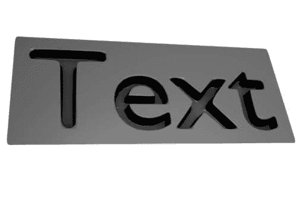
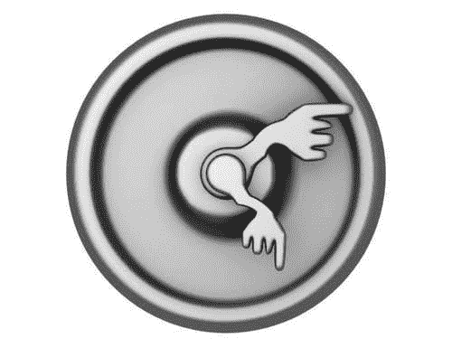

# 第三章：顶点组和材料

当顶点数量很大时，复杂的网格可能难以处理。在本章中，我们将探讨如何通过定义顶点组来标记顶点集合，从而让最终用户的生活更加轻松。我们还将探索顶点组的许多用途，包括它们在骨架和修改器中的应用，以及我们将探讨将不同材质应用于网格不同部分的方法。

在本章中，我们将学习如何：

+   定义顶点组

+   将顶点分配给顶点组

+   将材质分配给面

+   将顶点颜色分配给顶点

+   设置边属性

+   添加修改器

+   皮肤骨骼


# 顶点组

**顶点** **组**是组织网格内顶点集合的一种方式。一个网格可以有任意数量的顶点组，网格中的任何顶点都可以是多个顶点组的成员，或者根本不属于任何顶点组。一个新创建的`Mesh`对象没有定义任何顶点组。

在其基本形式中，顶点组是识别复杂网格中不同部分的有价值工具。通过将顶点分配给顶点组，建模者最终为人们，如绑定者或为模型贴图的人，提供了轻松识别和选择他们想要工作的模型部分的方法。

尽管顶点组的使用远不止简单的识别。许多网格修改器将它们的影响限制在指定的顶点组中，并且可以通过将每个骨骼的影响链接到单个顶点组来配置骨架以变形网格。我们将在稍后看到这方面的例子。

一个顶点组不仅仅是顶点的集合。顶点组中的每个顶点都可能有一个关联的*权重*（介于零和一之间），许多修改器使用它来微调它们的影响。一个顶点在其所属的每个顶点组中可能具有不同的权重。

我们用`creepycrawlies.py`创建的虫子是一个相当复杂的网格的极好例子，它具有许多不同的部分，定义顶点组将极大地从中受益。不仅可以通过名称选择部分，例如头部，而且如果我们要为模型绑定，也会使我们的工作更加容易。

我们创建顶点组的主要工具是以下表中列出的`Mesh`对象的方法：

| 方法 | 操作 | 备注 |
| --- | --- | --- |
| `addVertGroup(group)` | 添加一个新的空顶点组。 |   |
| `assignVertsToGroup(group,vertices,weight,mode)` | 将顶点索引列表添加到具有给定权重的现有顶点组中。 | 模式确定当顶点已经是顶点组的成员时应该做什么。请参阅正文以获取详细信息。 |
| `getVertsFromGroup(group,weightsFlag=0,vertices)` | 返回一个顶点索引列表（默认）或一个包含（索引，权重）元组的列表（如果`weightsFlag`等于`1`）。如果指定了顶点列表，则只返回该组中且在给定列表中的顶点。 |  |
| `removeVertsFromGroup(group,vertices)` | 从现有的顶点组中删除顶点列表。如果未指定列表，则删除所有顶点。 |  |
| `renameVertGroup(groupName, newName)` | 重命名一个顶点组。 |  |
| `getVertGroupNames()` | 返回所有顶点组名称的列表。 |  |
| `removeVertGroup(group)` | 删除一个顶点组。 | 不会删除实际的顶点。 |

在这里需要掌握的重要概念是，创建顶点组和将顶点分配给它是两个不同的操作。通过调用您的`Mesh`对象的`addVertGroup()`方法创建一个新的空顶点组。它接受一个字符串参数，该参数将是顶点组的名称。如果已经存在具有相同名称的顶点组，则名称将添加一个数字后缀以防止名称冲突，例如：`TailSegment`可能变为`TailSegment.001`。

向现有的顶点组添加顶点是通过调用您的网格的`assignVertsToGroup()`方法来完成的。此方法将接受四个强制参数——要分配顶点的顶点组名称、顶点索引列表、权重和一个*分配*模式。如果顶点组不存在，或者其中一个顶点索引指向一个不存在的顶点，则会引发异常。

权重必须是一个介于 0.0 和 1.0 之间的值；任何大于 1.0 的权重都会被限制为 1.0。小于或等于 0.0 的权重将从一个顶点组中删除顶点。如果您想为同一顶点组中的顶点分配不同的权重，您必须通过单独调用`assignVertsToGroup()`方法来分配它们。

*分配*模式有三种：`ADD`、`REPLACE`和`SUBTRACT`。`ADD`会将新顶点添加到顶点组中，并将给定的权重与它们关联。如果列表中的任何顶点已经存在，它们将获得附加的权重。`REPLACE`将替换列表中索引关联的权重，如果它们是顶点组的成员，否则不执行任何操作。`SUBTRACT`将尝试从列表中的顶点减去权重，如果它们不是顶点组的成员，则不执行任何操作。在将完全新的顶点组添加到网格时，通常使用`ADD`模式。

### 一个重要的问题

在我们的第一个示例中，我们将向一个现有的网格对象添加两个新的顶点组——一个将包含所有具有正 x 坐标的顶点，另一个将包含具有负 x 坐标的顶点。我们将分别将这些组命名为**右**和**左**。

此外，我们还将根据每个顶点与其对象中心的距离为其分配一个权重，距离中心越远的顶点权重越大。

#### 代码概要：leftright.py

概括地说，我们将采取以下步骤：

1.  获取活动对象。

1.  验证它是一个网格并获取网格数据。

1.  向对象添加两个新的顶点组——Left 和 Right。

1.  对于网格中的所有顶点：

    1.  计算权重

    1.  如果 x 坐标 > 0：

    1.  将顶点索引和权重添加到顶点组 *right*

    1.  如果 x 坐标 < 0：

    1.  将顶点索引和权重添加到顶点组 *left*

为了确保新的顶点组为空，我们检查该组是否已存在，并在必要时将其删除。此检查在代码中突出显示：

```py
def leftright(me,maximum=1.0):
   center=vec(0,0,0)
   left =[]
   right=[]
   for v in me.verts:
      weight = (v.co-center).length/maximum
      if v.co.x > 0.0 :
         right.append((v.index, weight))
      elif v.co.x > 0.0 :
         left.append((v.index, weight))
   return left,right   

if __name__ == "__main__":
   try:
      ob = Blender.Scene.GetCurrent().objects.active
      me = ob.getData(mesh=True)

      vgroups = me.getVertGroupNames()
      if 'Left' in vgroups:
         me.removeVertsFromGroup('Left')
      else:
         me.addVertGroup('Left')
      if 'Right' in vgroups:
         me.removeVertsFromGroup('Right')
      else:
         me.addVertGroup('Right')

      left,right = leftright(me,vec(ob.getSize()).length)

      for v,w in left:
         me.assignVertsToGroup('Left',[v],w,Blender.Mesh.AssignModes.ADD)
      for v,w in right:
         me.assignVertsToGroup('Right',[v],w,Blender.Mesh.AssignModes.ADD)

      Blender.Window.Redraw()

   except Exception as e:
      Blender.Draw.PupMenu('Error%t|'+str(e)[:80])

```

完整脚本作为 `leftright.py` 提供。计算权重的公式可能需要一些解释：为了将最大权重 1.0 分配给位于对象中心最远处的点，我们必须按可能的最大距离进行缩放。我们可以遍历所有顶点以确定最大值，但在这里我们选择通过尺寸的均方根来近似这个最大值。这将夸大最大距离，因此分配给任何顶点的最大权重可能小于 1.0。然而，获取尺寸比计算大型网格的确切最大值要快得多。此外，请注意，我们计算对象中心到距离（从网格中顶点的角度来看，对象中心始终在 (0, 0, 0)）。

这可能与用户感知的网格中心完全不同。（在 Blender 中，对象中心通常以一个粉红色点显示，并且可以通过选择 **对象 | 变换 | 中心新** 来改变，使其位于所有顶点的平均位置。）

网格的结果权重可能如下所示：


# 修改器

**修改器** 是以非破坏性方式更改网格的工具，并且可以交互式调整。其他对象也可能有修改器：例如 `Text3d`、`Metaballs` 和 `Curves`。这些对象可以表示为网格，因此也可以进行修改。但并非所有修改器都可以与这些对象关联。如果需要，可以通过 *应用* 修改器的效果使其永久化。Blender 提供了从次表面修改器到各种变形修改器的一系列修改器。表中显示了可用的修改器列表：

| 修改器 | 顶点组影响 | 备注 |
| --- | --- | --- |
| 位移 | 是 |   |
| 曲线 | 是 |   |
| 分解 | 是 |   |
| 网格 | 是 |   |
| 遮罩 | 是 |   |
| 网格变形 | 是 |   |
| 收缩包裹 | 是 |   |
| 简单变形 | 是 |   |
| 平滑 | 是 |   |
| 波浪 | 是 |   |
| 数组 | 否 |   |
| 倒角 | 否 |   |
| 并集 | 否 |   |
| 构建 | 否 |   |
| 投影 | 否 |   |
| 简化 | 否 |   |
| 边分割 | 否 |   |
| 镜像 | 否 |   |
| subsurface | no |   |
| uvproject | no |   |
| Particle system | yes | 许多参数受不同顶点组的影响 |
| armature | yes | 每个骨骼可能被限制仅影响单个顶点组 |

许多修改器可以被设置为仅将它们的影响限制在特定的顶点组上，而一些修改器是特殊的。粒子系统被认为是一个修改器，尽管通常粒子系统是通过它们自己的工具集进行管理的。此外，它与顶点组的关系在某种程度上是相反的；它不是将影响限制在顶点组内的顶点上，而是顶点组的顶点权重可能影响粒子系统的各种参数，例如粒子的发射密度和速度。我们将在 *飞溅火花* 部分看到一个例子。

骨骼修改器也是有些特殊的，因为它们不会将它们的影响限制在单个顶点组上。然而，它们可以被配置为将每个单独的骨骼的影响限制在特定的顶点组上，正如我们将在 *骨骼* 部分中考察的那样。

从 Python 程序员的角度来看，修改器列表是对象的一个属性（即，不是底层网格的属性）。引用相同网格的对象可能有不同的修改器。此列表包含 `Modifier` 对象，并且可以添加到或从列表中删除这些对象，并且可以移动列表中的单个修改器上下。在某些情况下，修改器的顺序很重要。例如，在镜像修改器之后添加子表面修改器可能与在子表面修改器之前添加镜像修改器看起来不同。

`Modifier` 对象有一个类型和一个名称（最初代表其类型，但它可能被设置为更合适的内容）。类型是 `Modifier.Types` 常量列表中的一个类型。每个修改器对象可能有许多设置，这些设置通过在 `Modifier.Settings` 中定义的键进行索引。并非所有设置都适用于所有类型。

如果我们有两个对象，一个名为 `Target` 的网格对象和一个名为 `Deformer` 的晶格对象，并且我们希望将 `Deformer` 对象作为晶格修改器关联到 `Target` 对象，以下代码片段将完成这项任务：

```py
import Blender
from Blender import Modifier

target  = Blender.Object.Get('Target')
deformer= Blender.Object.Get('Deformer')

mod = target.modifiers.append(Modifier.Types.LATTICE)
mod[Modifier.Settings.OBJECT] = deformer
target.makeDisplayList()
Blender.Window.RedrawAll()
```

如果 `Target` 对象有一个名为 `Right` 的顶点组，该顶点组包含 `Target` 对象右半部分的顶点，我们可以通过更改 `VERTGROUP` 属性来限制修改器的影响。我们的片段将变为以下内容（添加的行已突出显示）：

```py
import Blender
from Blender import Modifier

target  = Blender.Object.Get('Target')
deformer= Blender.Object.Get('Deformer')

mod = target.modifiers.append(Modifier.Types.LATTICE)
mod[Modifier.Settings.OBJECT] = deformer
mod[Modifier.Settings.VERTGROUP] = 'Right'

target.makeDisplayList()
Blender.Window.RedrawAll()
```


## 雕刻

考虑以下问题：给定一些文本，我们希望将此文本渲染为表面上的凹槽，就像它被雕刻出来一样。这并不像看起来那么简单。当然，创建一个文本对象很简单，但为了操纵这个文本，我们希望将这个文本对象转换为网格。Blender GUI 在对象菜单中提供了这种可能性，但奇怪的是，Blender API 并没有提供等效的功能。因此，我们的第一个障碍就是将文本对象转换为网格。

我们必须解决的第二个问题是，如何将一组顶点或边挤出，以在表面上测量凹槽。同样，Blender API 中没有这个功能，所以我们必须自己将其添加到我们的工具包中。

最后一个问题更为微妙。如果我们设法创建了一些凹槽，我们可能希望使边缘不那么尖锐，因为现实生活中的东西没有完美的尖锐边缘。有各种方法可以做到这一点，但许多方法都需要在我们的网格中添加修改器。一个 **斜面** **修改器** 可能足以去除尖锐的边缘，但我们可能还想将次表面修改器添加到整个网格中。在这里，我们遇到了一个问题，当填充文本字符之间的间隙时，我们很可能遇到许多狭窄的三角形。这些三角形破坏了我们的次表面修改器的外观，如下面的图所示：


以下两点可能有助于减轻这个问题。一是给雕刻文本的边缘添加折痕权重，这样在计算次表面时，这些边缘的权重会比默认值更大。这可能有所帮助，但也可能违背修改器的目的，因为它使这些边缘更尖锐。以下图显示了结果：更好，但仍然看起来不太好。


另一种方法是，在雕刻文本的外侧添加一个额外的边环。这将围绕文本添加一个四边形面的环，使得文本周围的次表面行为表现得更好，如下所示。在我们的最终实现中，我们应用了这两种解决方案，但首先我们一次解决一个问题。



### 将 Text3d 对象转换为网格

`Text3d` 对象基本上是一个带有一些额外参数的曲线。它所引用的数据块是一个 Blender `Curve` 对象，一旦我们知道了如何访问构成我们文本中每个字符的曲线的各个部分，我们就可以将这些曲线转换为顶点和边。所有相关功能都可以在 `Blender.Curve` 和 `Blender.Geometry` 模块中找到。

### 注意

在 Blender 中，`Text3d` 对象和 `Curve` 对象之间的关系比正文中所描述的要微妙和复杂得多。`Text3d` 对象是 `Curve` 对象的一个特殊版本，类似于面向对象术语中的子类。然而，在 Blender API 中，`Text3d` 对象不是 `Curve` 的子类，而且同一对象实例上也没有额外的属性。听起来很复杂？确实如此。那么如何检索所有属性呢？技巧在于你可以使用 `Text3d` 对象的名称来获取其关联的 `Curve` 对象，如下面的小示例所示：

```py
txt = ob.getData()
curve = Blender.Curve.Get(txt.getName())
```

现在，我们可以使用 `txt` 来访问 `Text3d` 特定的信息（例如，`txt.setText('foo')`）和 `curve` 来访问 `Curve` 特定的信息（例如，`curve.getNumCurves()`）。

Blender 的 `Curve` 对象由多个 `CurNurb` 对象组成，这些对象代表曲线的各个部分。通常，一个文本字符由一个或两个曲线段组成。例如，小写字母 *e* 由一个外部的曲线段和一个小的内部曲线段组成。`CurNurb` 对象反过来又由定义曲线段的多个 **节点** 或 **控制点** 组成。在这些情况下，节点始终是 `BezTriple` 对象，而 Blender 的 `Geometry` 模块为我们提供了 `BezierInterp()` 函数，该函数返回两个点之间插值的坐标列表。这些点和曲线在这些点处的方向（通常称为 **手柄**）可以从 `BezTriple` 对象中获取。生成的代码看起来是这样的（完整的代码是我们工具包中 `Tools.py` 部分的一部分）：

```py
import Blender

from Blender.Geometry import BezierInterp as interpolate
from Blender.Mathutils import Vector as vec

def curve2mesh(c):
   vlists=[]
   for cn in c:
      npoints = len(cn)

      points=[]
      first=True
      for segment in range(npoints-1):
         a=cn[segment].vec
         b=cn[segment+1].vec
         lastpoints = interpolate(vec(a[1]),vec(a[2]),vec(b[0]),vec(b[1]),6)
         if first:
            first = False
            points.append(lastpoints[0])
            points.extend(lastpoints[1:])
      if cn.isCyclic():
         a=cn[-1].vec
         b=cn[0].vec
         lastpoints=interpolate(vec(a[1]),vec(a[2]),vec(b[0]),vec(b[1]),6)
         points.extend(lastpoints[:-2])

      vlists.append(points)

   return vlists   
```

突出的线条显示了两个重要的方面。第一个显示了实际的插值。我们将名称相当不自然的 `BezierInterp()` 函数重命名为 `interpolate()`，它接受五个参数。前四个参数来自我们正在插值之间的两个 `BezTriple` 对象。每个 `BezTriple` 对象都可以作为一个包含三个向量的列表访问——进入的手柄、点的位置和出去的手柄（参见下一图）。我们传递第一个点的位置和它的出去手柄以及第二个点的位置和它的进入手柄。第五个参数是我们希望 `interpolate()` 函数返回的点数。


第二条高亮行处理**闭合曲线**，即第一条和最后一点相连的曲线。这是所有在文本中形成字符的曲线的情况。该函数返回一个列表的列表。每个列表包含每个曲线的所有插值点（x、y、z 坐标的元组）。请注意，一些字符由多个曲线组成。例如，许多字体中的小写字母 *e* 或字母 *o* 由两个曲线组成，一个定义字母的轮廓，另一个定义内部。例如，包含文本 `Foo` 的 `Text3d` 对象将返回五个列表的列表——第一个将包含定义大写字母 *F* 的顶点，第二个和第三个将包含组成小写字母 *o* 的两个曲线的顶点，同样第四个和第五个也是如此。

### 拉伸边环

**拉伸**是我们复制顶点（以及可能连接它们的边）并将它们移动到某个方向的过程，之后我们通过新边将这些复制的顶点连接到它们的原点，并通过在旧顶点和新顶点之间创建新面来完成操作。我们需要它来将文本的轮廓下沉，以创建具有垂直壁的凹槽。`Tools.py` 中的 `extrude_selected_edges()` 函数接受一个网格和一个向量作为参数，并将网格中选定边的顶点沿向量方向拉伸，添加任何必要的新的边和面。因为技术是早期看到的东西的扩展，所以这里没有显示代码。

### 扩展边环

如果我们有一个形成闭合曲线（或多个）的边列表来定义一个字符，我们希望用额外的边环包围这些边，以在最终用户可能关联到我们的网格的任何次表面修改器中创建更好的“流动”。如果我们不得不在 3D 中计算这个，这将是一个相当复杂的过程，但幸运的是，我们转换后的角色所有顶点都在 xy 平面上（这是因为新实例化的`Text3d`对象中的所有字符都位于 xy 平面上）。


在仅仅两个维度中，这是一个相当容易解决的问题。对于我们的边环上的每一个点，我们确定顶点法线的方向。**顶点法线**是分割我们正在考虑的点共享的两条边之间的角度的线。如果两条边是共线的（或几乎是），我们将顶点法线视为垂直于其中一条边的线。要在新边环上创建的点将位于这条法线的某个位置。为了确定我们是否需要沿着这条法线向外或向内移动，我们只需尝试一个方向，并检查新位置是否在我们的字符轮廓内。如果是这样，我们就反转方向。

仍然有一个问题需要解决，一个字符可能由多个曲线组成。如果我们想在这样一个字符周围绘制额外的边环，这样的边环应该位于字符轮廓之外但任何内部曲线之内。换句话说，如果我们构造一个新的边环，我们必须知道曲线是否位于另一个曲线内。如果是这样，它不是轮廓，新的边环应该构造在曲线内。因此，我们的`expand()`函数（在下一个片段中显示，完整代码是`Tools.py`的一部分）接受一个额外的可选参数`plist`，它是一个包含定义要检查的额外多边形的`MVert`对象的列表的列表。如果我们想要扩展的曲线的第一个点位于这些额外曲线中的任何一个，我们假设我们正在扩展的曲线是一个**内部****曲线**。（如果内部曲线会在某个点与外部曲线交叉，这将是不正确的，但对于定义字体中字符的曲线来说，这种情况永远不会发生。）

```py
def expand(me,loop,offset=0.05,plist=[]):

   ov = [me.verts[i] for i in verts_from_edgeloop(loop)]

   inside=False
   for polygon in plist:
      if in_polygon(loop[0].v1.co,polygon):
         inside=True
         break   # we don't deal with multiple inclusions

   n=len(ov)
   points=[]
   for i in range(n):
      va = (ov[i].co-ov[(i+1)%n].co).normalize()
      vb = (ov[i].co-ov[(i-1)%n].co).normalize()
      cosa=abs(vec(va).dot(vb))
      if cosa>0.99999 :   # almost colinear
         c = vec(va[1],va[0],va[2])
      else:
         c = va+vb
      l = offset/c.length
      p = ov[i].co+l*c
      if in_polygon(p,ov) != inside:
         p = ov[i].co-l*c
      print i,ov[i].co,va,vb,c,l,cosa,p
      points.append(p)

   return points
```

高亮代码调用一个函数（在`Tools.py`中提供），该函数接受形成一个边环的边列表，并返回一个排序后的顶点列表。这是必要的，因为我们的`in_polygon()`函数接受一个顶点列表而不是边，并假设这个列表是排序的，即相邻顶点形成不交叉的边。

为了确定一个点是否在由顶点列表定义的闭合多边形内部，我们计算一条线（通常称为**射线**）穿过的边的数量，这条线从点开始并延伸到无穷大。如果穿过的边的数量是奇数，则点位于多边形内部；如果是偶数，则位于多边形外部。以下图示说明了这个概念：


这里显示的`in_polygon()`函数是`Tools.py`的一部分。它接受一个点（一个`Vector`）和一个顶点列表（`MVert`对象），并返回`True`或`False`。请注意，多边形中点或顶点的任何 z 坐标都被忽略。

```py
from Blender.Geometry import LineIntersect2D
from Blender.Mathutils import Vector as vec

def in_polygon(p,polygon):
   intersections = 0
   n = len(polygon)
   if n<3 : return False
   for i in range(n):
      if LineIntersect2D (p,vec(1.0,0.0,0.0),polygon[i].co,polygon[(i+1)%n].co):
         intersections+=1
   return intersections % 2 == 1
```

重的劳动是在高亮行中由`Blender.Geometry`模块中可用的`LineIntersect2D()`函数完成的。`return`语句中的`modulo`（`%`）操作是一种确定遇到的交点数是否为奇数的方法。

## 将所有这些放在一起：Engrave.py

带着在前几节中开发的全部辅助函数，我们可以列出为了雕刻文本我们需要执行的步骤：

1.  显示一个弹出窗口以输入要雕刻的字符串。

1.  检查活动对象是否是网格并且有面被选中。

1.  创建一个`Text3d`对象。

1.  转换为网格，并添加适当的顶点组。

1.  为字符添加额外的边环。

1.  向下挤出原始字符。

1.  填充挤出字符的底部。

1.  在文本周围添加一个“卷轴”（一个矩形）。

1.  填充卷轴和字符之间的空间。

1.  添加一个子表面修改器。

1.  在`TextTop`和`TextBottom`顶点组中包含的边缘上设置折痕值。

我们最终的脚本几乎遵循这个大纲，并使用了我们在本章早期开发的工具。我们在这里展示最相关的部分（完整的脚本作为`engrave.py`提供）。我们首先将`Text3d`对象（以下代码中的`c`）转换为包含每个文本曲线段顶点位置的列表，并在场景中添加一个新的空`Mesh`对象和一些空顶点组：

```py
   vlist = curve2mesh(c)

   me = Blender.Mesh.New('Mesh')
   ob = Blender.Scene.GetCurrent().objects.new(me,'Mesh')

   me.addVertGroup('TextTop')
   me.addVertGroup('TextBottom')
   me.addVertGroup('Outline')
```

下一步是将这些顶点添加到网格中并创建连接边缘。由于字符中的所有曲线段都是闭合的，我们必须注意添加一个额外的边缘来连接最后一个和第一个顶点，如高亮行所示。为了保险起见，我们删除可能存在于插值曲线段中的任何重复项。我们将顶点添加到`TextTop`顶点组中，并存储新边缘的列表以供将来参考。

```py
   loop=[]
   for v in vlist:
      offset=len(me.verts)
      me.verts.extend(v)
      edgeoffset=len(me.edges)
      me.edges.extend([(i+offset,i+offset+1) for i in range(len(v)-1)])
      me.edges.extend([(len(v)-1+offset,offset)])
      me.remDoubles(0.001)

      me.assignVertsToGroup('TextTop', range(offset,len(me.verts)),1.0, Blender.Mesh.AssignModes.ADD)
      loop.append([me.edges[i] for i in range(edgeoffset,len(me.edges) )])
```

对于我们在上一部分存储的每个边缘环路，我们围绕它构建一个新的、略微更大的边缘环路，并将这些新顶点和边缘添加到我们的网格中。我们还想在这些边缘环路之间构建面，这从高亮行开始：在这里，我们使用 Python 内置函数`zip()`来配对两个边缘环路的边缘。每个边缘环路都通过一个`utility`函数（在`Tools.py`中可用）进行排序，该函数将边缘排序为它们相互连接的顺序。对于每一对边缘，我们构建两种可能的顶点索引排列，并计算哪一种形成一个未扭曲的面。这种计算是通过`least_warped()`函数（代码未显示）完成的，该函数基本上比较由两种不同的顶点排序定义的面的周长。未扭曲的面将具有最短的周长，然后将其添加到网格中。

```py
   for l in range(len(loop)):
      points = expand.expand(me,loop[l],0.02,loop[:l]+loop[l+1:])
      offset=len(me.verts)
      me.verts.extend(points)
      edgeoffset=len(me.edges)
      me.edges.extend([(i+offset,i+offset+1) for i in range(len(points)-1)])
      me.edges.extend([(len(points)-1+offset,offset)])
      eloop=[me.edges[i] for i in range(edgeoffset,len(me.edges))]
      me.assignVertsToGroup('Outline',range(offset,len(me.verts)),1.0,Blender.Mesh.AssignModes.ADD)
      faces=[]
      for e1,e2 in zip( expand.ordered_edgeloop(loop[l]),expand.ordered_edgeloop(eloop)):
         f1=(e1.v1.index,e1.v2.index,e2.v2.index,e2.v1.index)
         f2=(e1.v2.index,e1.v1.index,e2.v2.index,e2.v1.index)
         faces.append(least_warped(me,f1,f2))
      me.faces.extend(faces)
```

我们省略了挤出字符边缘环路的代码，但以下行提供了信息，展示了如何填充边缘环路。首先，我们通过使用两个实用函数（这些是字符的挤出边缘）选择所有相关边缘。接下来，我们调用`fill()`方法。只要这些封闭的边缘环路位于同一平面内，此方法就会填充任何集合。它甚至还会处理孔洞（如字母*e*中的小岛）：

```py
   deselect_all_edges(me)
   select_edges(me,'TextBottom')
   me.fill()
```

添加边框只是在我们的人物周围添加一个矩形边缘环路的问题。如果此边缘环路与`Outline`顶点组中的顶点一起选择，则可以再次使用`fill()`方法填充此边框。这里没有展示。我们以一些收尾工作结束：我们尽可能使用`triangleToQuad()`方法将网格中的三角形转换为四边形，然后细分网格。我们还添加了一个子表面修改器，将所有面的`smooth`属性设置为平滑，并重新计算所有面的法线，使其一致地指向外部。

```py
   me.triangleToQuad()
   me.subdivide()

   mod = ob.modifiers.append(Blender.Modifier.Types.SUBSURF)
   mod[Blender.Modifier.Settings.LEVELS]=2

   select_all_faces(me)
   set_smooth(me)
   select_all_edges(me)
   me.recalcNormals()
```

### 注意

**隐藏的钩子修改器**：

我们已经看到，Blender 中可用的修改器可以通过 Python 添加到对象中。然而，有一个修改器可以添加，但在 Blender 的 GUI 中似乎没有等效的修改器。这就是所谓的**钩子**修改器。在 Blender 中，钩子是一种将顶点连接到对象的方式（因此它是顶点父化的逆过程，其中我们将对象连接到顶点）。在应用程序本身中，可以通过*编辑*模式下的**网格 | 顶点 | 添加钩子**菜单访问它。一旦添加，它将出现在修改器列表中。从程序员的视角来看，钩子修改器与其他修改器没有区别，但遗憾的是，其类型和 API 中需要的设置都没有被记录。

## 飞溅的火花

通过向对象添加合适的粒子系统，可以轻松地创建火花和各种发光效果。许多粒子系统的参数可以通过顶点组的顶点权重来控制，包括发射粒子的局部密度。

在这个例子中，我们想要模拟被称为“圣埃尔摩之火”的电气现象。这是在某些情况下，尤其是在雷暴来临之际，一些物体开始发光的现象。这种发光被称为**电晕放电**([`en.wikipedia.org/wiki/St._Elmo%27s_fire`](http://en.wikipedia.org/wiki/St._Elmo%27s_fire))，并且在大型结构的尖锐和突出部分最为明显，例如无线电天线或避雷针，那里的电场是造成这种现象的最强。

为了以令人信服的方式影响从网格发射出的粒子数量，我们需要计算一个名为局部曲率的量，并将这个曲率以适当缩放的权重形式存储在顶点组中。然后，我们可以将这个顶点组应用到粒子上下文中的**额外**面板的密度参数上，以控制发射。

一个网格可以具有任何形状，大多数情况下没有整洁的公式可以近似其形状。因此，我们以必要而粗略的方式近似局部曲率（更多细节和一些复杂的数学，请参阅[`en.wikipedia.org/wiki/Mean_curvature`](http://en.wikipedia.org/wiki/Mean_curvature))，通过计算网格中每个顶点连接边的所有边曲率的平均值。在这里，我们定义**边曲率**为归一化顶点法向量和边向量的点积（即从顶点到其邻居的向量形式）。如果边相对于法线向下弯曲，则该乘积将为负，如果边向上弯曲，则乘积为正。我们将反转这个符号，因为我们更习惯于将正曲率与尖峰而不是与凹槽联系起来。另一种看待这个问题的方式是，在正曲率区域，顶点法向量和从同一顶点开始的边之间的角度大于 90°。

下图说明了这个概念——它描绘了一系列通过边连接的顶点。每个顶点都有一个关联的顶点法线显示（箭头）。标记为 **a** 的顶点具有正曲率，标记为 **b** 的顶点具有负曲率。有两个标记为 **c** 的顶点位于零曲率区域——也就是说，在这些位置，表面是平的，顶点法线垂直于边。


### 计算局部曲率

计算网格中每个顶点的局部曲率并返回一个包含归一化权重的列表的函数可以如下实现：

```py
from collections import defaultdict

def localcurvature(me,positive=False):

   end=defaultdict(list)
   for e in me.edges:
      end[e.v1.index].append(e.v2)
      end[e.v2.index].append(e.v1)

   weights=[]
   for v1 in me.verts:
      dvdn = []
      for v2 in end[v1.index]:
         dv = v1.co-v2.co
         dvdn.append(dv.dot(v1.no.normalize()))
      weights.append((v1.index,sum(dvdn)/max(len(dvdn),1.0)))

   if positive:
      weights = [(v,max(0.0,w)) for v,w in weights]

   minimum = min(w for v,w in weights)
   maximum = max(w for v,w in weights)
   span = maximum - minimum

   if span > 1e-9:
      return [(v,(w-minimum)/span) for v,w in weights]
   return weights
```

函数 `localcurvature()` 接收一个网格和一个可选参数，并返回一个包含顶点索引及其权重的元组列表。如果可选参数为 `true`，则丢弃计算出的任何负权重。

繁重的工作在突出显示的行中完成。在这里，我们遍历所有顶点，然后在内部循环中检查每个连接的边，从预先计算的字典中检索另一端的顶点。然后我们计算 `dv` 作为边向量，并将此边向量与归一化顶点法线的点积追加到列表 `dvdn` 中。

```py
weights.append((v1.index,sum(dvdn)/max(len(dvdn),1.0)))
```

前一行可能看起来很奇怪，但它会附加一个由顶点索引及其平均曲率组成的元组，其中平均曲率是通过将曲率列表求和然后除以列表中的值数来计算的。因为列表可能为空（这发生在网格包含未连接的顶点时），我们通过将其除以列表长度或 1（取较大者）来防止除以零错误。这样，我们通过避免 `if` 语句使代码更易于阅读。

### 代码概要：curvature.py

在我们有了 `localcurvature()` 函数之后，实际的曲率脚本变得相当简洁（完整脚本作为 `curvature.py` 提供）：

```py
if __name__ == "__main__":
   try:
      choice = Blender.Draw.PupMenu("Normalization%t|Onlypositive|Full range")
      if choice>0:
         ob = Blender.Scene.GetCurrent().objects.active
         me = ob.getData(mesh=True)

         try:
            me.removeVertGroup('Curvature')
         except AttributeError:
            pass

         me.addVertGroup('Curvature')

         for v,w in localcurvature(me,positive=(choice==1)):
            me.assignVertsToGroup('Curvature',[v],w,Blender.Mesh.AssignModes.ADD)

         Blender.Window.Redraw()

   except Exception as e:
      Blender.Draw.PupMenu('Error%t|'+str(e)[:80])
```

突出显示的行显示了如何通过尝试捕获当组不存在时引发的 `AtrributeError` 来从 `Mesh` 对象中移除可能存在的 `Curvature` 顶点组。接下来，我们再次以相同的名称添加该组，使其完全为空。最后突出显示的行显示了如何单独添加每个顶点，因为任何顶点可能具有不同的权重。

所有操作都围绕着一个 `try … except` 结构，该结构会捕获任何错误，并在发生任何异常情况时弹出一个友好的信息消息。最可能的情况是，这发生在用户忘记选择一个 `Mesh` 对象的情况下。


### 整合一切：圣埃尔摩之火

通过手动建模一个简单的杆对象并使用 `curvature.py` 计算曲率，制作了尖锐尖端杆的放电示意图。


然后，添加了一个粒子系统，并在额外标签页中将密度参数设置为`Curvature`顶点组。杆和粒子系统分别赋予了不同的材质：简单的灰色和白色光环。粒子模拟了 250 帧，并渲染了第 250 帧以供插图。


# 骨骼

骨骼可能被认为是动画的骨干，因为以可控的方式变形网格，这可以在给定的帧上键入，对于动画师来说，这是在良好的控制下摆姿势的必要条件。

Blender 的骨骼实现为绑定器和动画师提供了大量的可能性，但最终，骨骼首先是一系列连接的骨骼，其中每个骨骼将变形网格的一部分。这些骨骼相对于彼此的运动可以通过几种不同的约束来控制。

虽然骨骼可以配置为通过**包络**来施加影响，从而基本上在一定的半径内变形目标网格中的任何顶点，但它们也可以配置为仅变形与骨骼名称相同的顶点组中的顶点。这种变形进一步由顶点组中顶点的权重控制，使我们能够精细调整骨骼影响。

## 滴答声

为了说明骨骼的基本可能性，我们将绑定一个简单的时钟模型。这个时钟由一个由三个独立的、非连接的子网格组成的单一网格组成——主体、小指针和大指针。每个时钟指针的顶点属于两个独立的顶点组——一个用于连接到时钟中心的指针部分，另一个用于指针本身的末端。这种设置允许进行卡通风格的动画，例如我们可以使指针的尖端跟随实际的运动。

### 代码概要：clock.py

我们将采取以下步骤来以我们期望的方式绑定我们的时钟：

1.  导入网格数据。

1.  创建时钟网格。

1.  创建顶点组。

1.  创建骨骼对象。

1.  在骨骼内创建骨骼。

1.  关联骨骼修改器。

从概要到代码的转换几乎是逐字逐句的，并且有些重复，因为许多指令都要为每个骨骼重复（完整代码可在`clock.py`中找到）：

```py
   me=Blender.Mesh.New('Clock')
   me.verts.extend(clockmesh.Clock_verts)
   me.faces.extend(clockmesh.Clock_faces)

   scn=Blender.Scene.GetCurrent()
   ob=scn.objects.new(me)
   scn.objects.active=ob

   me.addVertGroup('BigHand')
   me.assignVertsToGroup('BigHand',clockmesh.Clock_vertexgroup_BigHand,1.0, Blender.Mesh.AssignModes.ADD)

   … <similar code for LittleHand, BigArm and LittleArm vertex groupsomitted> ...   

   ar = Blender.Armature.New('ClockBones')
   ar.envelopes=False
   ar.vertexGroups=False
   obbones = scn.objects.new(ar)

   mod = ob.modifiers.append(Blender.Modifier.Types.ARMATURE)
   mod[Blender.Modifier.Settings.OBJECT]=obbones
   mod[Blender.Modifier.Settings.ENVELOPES]=False
   mod[Blender.Modifier.Settings.VGROUPS]=True

   ar.makeEditable()
   bigarm = Blender.Armature.Editbone()
   bigarm.head = vec(0.0,0.0 ,0.57)
   bigarm.tail = vec(0.0,0.75,0.57)
   ar.bones['BigArm'] = bigarm
   bighand = Blender.Armature.Editbone()
   bighand.head = bigarm.tail
   bighand.tail = vec(0.0,1.50,0.57)
   bighand.parent = bigarm
   ar.bones['BigHand'] = bighand

   … <similar code for the little hand omitted> …

   ar.update()

   obbones.makeParent([ob])
```

突出显示的是重要事项。首先，我们在骨骼对象上禁用了包络和`vertexGroups`属性。这看起来可能有些奇怪，但这些属性是过去骨骼不是应用于网格的修改器，而是通过作为`Mesh`对象（至少就我所知，可用的文档对此有些含糊）的父对象来施加影响时的残留。我们通过在骨骼修改器上设置属性来确定要使用哪种影响。

在将一个臂架修改器与我们的`Mesh`对象关联后，我们通过逐个构建臂架骨骼。在我们向臂架添加任何骨骼之前，我们必须调用其`makeEditable()`方法。请注意，这种针对臂架的**编辑** **模式** **用于** **臂架**是与其他对象不同的，这些对象可以通过`Blender.Window.editMode()`函数设置**编辑**模式！一旦我们完成，我们再次通过调用`update()`方法回到**正常**模式。

您可能已经注意到，在构建我们的臂架时，我们创建了`Editbone`对象的实例。在**编辑**模式之外，这些相同的骨骼被称为`Bone`对象。两者都指向同一个骨骼，但提供了适用于**编辑**模式或**对象**模式的不同功能和属性。为了适应类似的方法，Blender 还提供了`PoseBone`对象来在**姿势模式**中操纵骨骼。

通过指定骨骼的头和尾位置（当将骨骼表示为八边形时，分别是钝端和锐端）来在臂架中定位骨骼。为了连接骨骼，仅将一个骨骼的尾位置设置为另一个骨骼的头位置是不够的。为了使一个骨骼跟随另一个骨骼的运动，它必须被设置为它的父对象。通过将子对象的`parent`属性设置为指向父骨骼对象来实现父化。在我们的示例中，我们将每个手骨与其对应的臂骨进行了父化。

臂架内的骨骼通过其名称进行索引。如果臂架修改器的`VGROUPS`属性被设置，骨骼的名称应该与其影响的顶点组的名称相同。

我们示例代码的最后一行同样很重要；必须将`Mesh`对象设置为臂架的父对象。在臂架和网格将保持在同一位置且只有臂架中的单个骨骼会移动的情况下，这可能会显得有些多余；但如果不这样做，在交互式更改姿势时将导致网格显示异常（例如，您必须将网格更改为**编辑**模式然后再返回，例如，以查看姿势对臂架的影响，这是完全不实用的）。我们的绑定结果将看起来像这样（我们将臂架的显示模式设置为 X 射线，以便通过网格可见）：


渲染结果可能看起来像这样：



我们可能想要限制单个骨骼的运动仅限于围绕 z 轴的旋转，这可以通过添加约束来实现。我们将在下一章中遇到约束。

## 好吧，有点像 backbone boy！

我们到目前为止关于绑定的知识也可以应用到`creepycrawlies.py`中。如果我们想扩展生成的模型的功能，我们可以将一个臂架修改器与生成的网格关联起来。我们必须创建一个带有适当骨骼集的臂架对象。

由于我们已经在`mymesh`模块中将顶点按身体部位分组，因此将它们与顶点组和一个匹配的骨骼关联是微不足道的。但创建骨骼本身可能很多，并且应该以正确的方式定位和连接，这并不简单。

让我们看看一些基本元素可能如何实现（完整的代码在`creepycrawlies.py`中）。首先，我们必须创建一个骨架并使其可编辑，以便添加骨骼：

```py
ar = Blender.Armature.New('BugBones')
   ar.autoIK = True
   obbones = scn.objects.new(ar)
   ar.makeEditable()
```

我们还可以设置任何改变骨架行为或显示方式的属性。在这里，我们只是启用`autoIK`功能，这将使动画师操纵我们生物体可能非常长的尾巴变得更加简单。

下一步是为每组顶点创建一个骨骼。以下代码中的`vgroup`列表包含元组（`vg,vlist,parent,connected`），其中`vg`是顶点组的名称，`vlist`是属于此组的顶点索引列表。我们创建的每个骨骼可能有一个父级，并且它可能物理上连接到父级。这些条件由元组的`parent`和`connected`成员表示：

```py
   for vg,vlist,parent,connected in vgroup:

      bone = Blender.Armature.Editbone()
      bb = bounding_box([verts[i] for i in vlist])
```

对于我们创建的每个骨骼，我们计算该骨骼将影响的顶点组中所有顶点的边界框。接下来要做的事情是定位骨骼。根据我们的设置，我们生物体的所有身体段都将沿着 y 轴延伸，除了翅膀和腿，它们沿着 x 轴延伸。我们首先检查这一点，并相应地设置`axis`变量：

```py
      axis=1
      if vg.startswith('wing') or vg.startswith('leg'): axis = 0
```

骨架内的骨骼按名称索引，骨骼末端的坐标分别存储在其`head`和`tail`属性中。因此，如果我们有一个父级骨骼，并且我们想确定其平均 y 坐标，我们可以按以下方式计算：

```py

      if parent != None : 
         parenty = (ar.bones[parent].head[1] +ar.bones[parent].tail[1])/2.0
```

我们计算这个位置是因为像腿和翅膀这样的部分有父级骨骼（即，它们随着父级骨骼移动）但不是从头到尾连接。我们将从父级骨骼的中心开始定位这些骨骼，为此我们需要父级的 y 坐标。沿着 y 轴排列的骨骼段沿着 y 轴定位，因此它们的 x 和 z 坐标为零。腿和翅膀段段的 x 和 z 坐标来自它们的边界框。如果骨骼*是*连接的，我们只需将其头部位置设置为父级尾巴位置的副本（如下所示）。

### 注意

Blender 的`Vector`类提供了`copy()`函数，但奇怪的是没有提供`__copy__()`函数，所以它不会与 Python 的`copy`模块中的函数很好地配合。

```py
      if connected:
         bone.head = ar.bones[parent].tail.copy()
      else:
         if axis==1:
            bone.head=Blender.Mathutils.Vector(0,bb[1][0],0)
         else:
            bone.head=Blender.Mathutils.Vector(bb[0][1],parenty,bb[2][1])
```

```py
The tail position of the bone is calculated in a similar manner:if axis==1:
         bone.tail=Blender.Mathutils.Vector(0,bb[1][1],0)
      else:
         bone.tail=Blender.Mathutils.Vector(bb[0][0],parenty,bb[2][0])
```

创建骨骼的最终步骤是将它添加到骨架中，并设置骨骼特定的选项以及任何父级关系。

```py
      ar.bones[vg] = bone

      if parent != None :
         bone.parent=ar.bones[parent]
      else:
         bone.clearParent()

      if connected: bone.options=Blender.Armature.CONNECTED
```

注意，在前面的代码中，操作顺序很重要：`parent`属性只能在添加到骨架的骨骼上清除，`CONNECTED`选项只能在具有父级的骨骼上设置。

再次提醒，我们应该注意 Blender 的一些特性。可以通过将其`parent`属性分配给骨骼来设置骨骼的父对象。如果没有父对象，此属性将返回`None`。然而，我们不能将`None`分配给此属性，我们必须使用`clearParent()`函数来移除父关系。


# 材料

材料是赋予对象外观的东西。在 Blender 中，材料非常灵活，因此相对复杂。几乎可以控制从对象反射的光的任何方面，不仅可以通过简单的参数，还可以通过图像映射和节点网络来实现。

最多可以与一个对象关联 16 种材料，并且在一个对象内部，各个部分可以引用这 16 种材料中的任意一种。在`Text3d`对象中，每个单独的字符可能引用不同的材料，而在曲线中，这一点适用于每个控制点。

从开发者的角度来看，将材料分配给对象是一个两步的过程。首先，我们必须定义一种新材料，然后我们必须将材料或材料分配给一个对象。如果我们能引用已经存在的材料，第一步可以省略。

如果一个对象如网格已经定义了面，那么我们仍然需要为每个面分配一种材料。如果定义了活动材料，新创建的面将分配活动材料。

一个小的代码片段说明了我们如何将材料分配给`Mesh`对象。在这里，我们将具有白色漫反射颜色的材料分配给所有偶数编号的面，并将具有黑色漫反射颜色的材料分配给所有奇数编号的面，在一个称为`ob`的`Mesh`对象中。

```py
me=ob.getData(mesh=1)

mats=[ Blender.Material.New(), Blender.Material.New()]
mats[0].rgbCol=[1.0,1.0,1.0]
mats[1].rgbCol=[0.0,0.0,0.0]

ob.setMaterials(mats)
ob.colbits=3

for f in me.faces:
   if f.index%2 == 0 :
      f.mat=0
   else:
      f.mat=1
```

突出的行确保每个面使用的材料索引指向分配给对象的材料。（我们将在下一节中看到，也可以将材料与网格数据关联。）

## 对象材料与 ObData 材料

在 Blender 中，一个`Mesh`对象和包含`Mesh`对象的最顶层 Blender 对象都可以有自己的 16 种材料列表。如果我们想要实例化许多具有不同材料的应用的相同网格副本，这很方便。然而，在某些情况下，我们可能希望将一些或所有材料应用于`Mesh`而不是对象。这由对象的`colbits`属性控制。此属性由 16 位组成，每一位指示是否使用对象或`Mesh`中的材料。我们已经在上一节中看到了一个例子。

`Curve`对象也可能有自己的材料集，选择实际材料遵循与`Mesh`对象相同的规则。元球也有自己的材料集，在材料集之间切换的方式也是相同的，但与由部分组成的许多类型对象不同（参见下一节），无法将不同的材料与元球内的不同元素关联起来（这在 GUI 中也是如此：编辑上下文中的链接和材料中的按钮用于将材料索引分配给单个元球元素，但它们没有效果）。只使用材料列表中的第一个槽位。

注意，不自行渲染的对象，如骨架和格子，没有关联的材料（也就是说，与包含骨架或格子的顶级对象关联的任何材料都被忽略）。一些没有关联材料的对象可能具有与之关联的纹理。例如，`World`和`Lamp`对象可能具有关联的纹理来控制它们的颜色。

## 将材料分配给对象的各个部分

在一个网格中，每个面可能有自己的相关材料。这种材料通过其在材料列表中的索引来识别，并存储在`mat`属性中。在一个`Text3d`对象中，每个字符可能有自己的材料，同样通过其在材料列表中的索引来识别。这次，这个索引不是直接存储在属性中，而是可以通过接受字符在文本中索引的`accessor`方法来设置或检索。

`Curve`（`CurNurb`对象）内的部分可以通过其`setMatIndex()`方法分配材料索引。可以通过相应的`getMatIndex()`方法从中检索索引。请注意，将材料与由单行组成且未设置挤出宽度或与斜面对象关联的曲线关联起来将没有可见效果，因为这些曲线不会被渲染。

下面的代码片段显示了如何将不同的材料分配给`Text3d`对象内的不同字符。代码本身很简单，但如您所注意到的，我们定义了一个包含三个材料的列表，但只使用了一个。这是浪费的，但这是为了解决`setMaterial()`的一个特性。其材料索引参数应该偏移一个，例如，索引 2 指的是列表中的第二个材料，然而，可能通过的最大索引没有偏移一个。所以如果我们想使用两种材料，我们必须使用索引 1 和 2 来访问材料 0 和 1，但实际的材料列表应该包含三个材料，否则我们无法将 2 作为`setMaterial()`的参数传递。

```py
mats=[Material.New(),Material.New(),Material.New()]
mats[0].rgbCol=[1.0,1.0,1.0]
mats[1].rgbCol=[0.0,0.0,0.0]
mats[2].rgbCol=[1.0,0.0,0.0]
ob.setMaterials(mats)
ob.colbits=3
txt=ob.getData()

for i in range(len(txt.getText())):
   txt.setMaterial(i,1+i%2)

```

突出的代码显示了通过`1`进行的修正。完整的代码以`TextColors.py`的形式提供。

## 顶点颜色与面材料

我们尚未处理的一个处理材料的重要方面是**顶点** **颜色**。在网格中，每个顶点可能有自己的顶点颜色。顶点颜色与材料不同，但顶点颜色是否具有可见效果由材料的模式标志控制。为了使材料使用任何顶点颜色，其`VColPaint`位应该通过调用其`setMode()`方法来设置。当以这种方式使用时，顶点颜色确定材料的漫反射颜色，而所有材料的常规属性控制这种漫反射颜色的渲染方式。顶点颜色的一个常见用途是*烘焙*计算成本高昂的效果，如环境遮蔽。由于顶点颜色可以非常快速地渲染，因此即使在实时设置中，如游戏引擎中，也可以通过这种方式近似环境遮蔽。（近似是因为它不会以相同的方式对光照变化做出反应。）

面的`col`属性中存储了作为`Mesh`、`MCol`对象（基本上是 RGBA 元组）的顶点颜色。`col`属性是一个列表，包含对面的每个顶点上的`MCol`对象的引用。当你考虑到材料是与面相关而不是与顶点相关这一事实时，这种安排是有意义的。当顶点的顶点颜色不同时，它们将在面上进行线性插值。

只有当网格的`vertexColors`属性设置为`True`时，才能将值分配给面的`col`属性。

以下示例代码片段显示了如何设置网格的顶点颜色。我们根据顶点的 z 坐标选择灰度阴影（突出显示）。

```py
import Blender
ob=Blender.Scene.getCurrent().objects.active
me=ob.getData(mesh=1)

me.vertexColors=True
for f in me.faces:
   for i,v in enumerate(f.verts):
      g = int(max(0.0,min(1.0,v.co.z))*255)
      f.col[i].r=g
      f.col[i].g=g
      f.col[i].b=g

mats=[Blender.Material.New()]
mats[0].setMode(Blender.Material.Modes['VCOL_PAINT'])
ob.setMaterials(mats)
ob.colbits=1
ob.makeDisplayList()

Blender.Window.RedrawAll()
```

完整的代码作为`VertexColors.py`提供。

## 为我们的雕刻添加材料

为了使我们的雕刻活动更加完美，我们将添加两种材料。一种材料索引分配给表面的顶点，另一种分配给雕刻的凹槽中的顶点。这样，例如，我们可以在一块风化的石头上创建新刻字母的外观。

由于我们之前定义了一些方便的顶点组，因此分配材料索引只需遍历所有面，并根据顶点所属的顶点组将适当的材料索引分配给面的每个顶点。下面显示的函数采用了一种稍微更通用的方法，它接受一个网格和一个正则表达式列表，并根据它是否属于具有与正则表达式匹配的名称的顶点组，将材料索引分配给每个面。

这个功能使得将相同的材料索引分配给所有具有相似名称的顶点组变得非常容易，例如由`creepycrawlies.py`创建的网格的所有尾段和胸段（这些名称都像`tail.0`、`tail.1`……等等）。

该功能在 `Tools.py` 中可用。它依赖于 Python 的 `re.search()` 函数，该函数将正则表达式与字符串进行匹配。高亮行显示我们嵌入所谓的锚（`^` 和 `$`）。这样，正则表达式 `aaaa` 将仅匹配名称为 `aaaa` 的顶点组，而不是名称为 `aaaa.0` 的顶点组，这样我们就可以在需要时区分它们。如果我们想匹配所有以 `tail` 开头的顶点组名称，我们可以传递正则表达式 `tail.*`，例如。

### 注意

正则表达式是匹配字符串的极其强大的方式。如果您不熟悉它们，您应该查阅 Python 模块的文档（[`docs.python.org/library/re.html`](http://docs.python.org/library/re.html)）。从更温和的教程开始，例如，[`docs.python.org/howto/regex.html`](http://docs.python.org/howto/regex.html)。

在此函数中需要注意的另一件事是我们使用集合操作的方式。这些操作大大加快了速度，因为 Python 的集合操作非常快。我们在这里使用它们来高效地检查构成面的顶点集（或更确切地说，它们的索引）是否都在某个顶点组的顶点索引集中。我们预先计算了属于顶点组的顶点索引集和每个面的顶点索引集，并将它们存储在字典中以方便访问。这样，我们只为每个顶点组和每个面分别创建这些集一次，而不是每次匹配正则表达式时都重新创建每个集。对于大型网格，这可以节省大量时间（以存储为代价）。

```py
import re

def matindex2vertgroups(me,matgroups):
   if len(matgroups)>16 :
      raise ArgumentError("number of groups larger than number ofmaterials possible (16)")

   groupnames = me.getVertGroupNames()

   vertexgroupset={}
   for name in groupnames:
      vertexgroupset[name]=set(me.getVertsFromGroup(name))
      print name,len(vertexgroupset[name])

   faceset={}
   for f in me.faces:
      faceset[f.index]=set([v.index for v in f.verts])

   for i,matgroup in enumerate(matgroups):
      for name in groupnames:
         if re.search('^'+matgroup+'$',name):
            for f,vset in faceset.items():
               if vset.issubset(vertexgroupset[name]) :
                  me.faces[f].mat = i
            break
```


# 摘要

在本章中，我们看到了如何通过在网格中定义顶点组来简化最终用户的操作，从而便于轻松选择某些特性。我们还看到了如何将材质分配给顶点，以及如果需要如何创建新的材质。我们迈出了为网格设置骨架的第一步。具体来说，我们学习了：

+   如何定义顶点组

+   如何将顶点分配到顶点组

+   如何将材质分配给面

+   如何将顶点颜色分配给顶点

+   如何设置边属性

+   如何添加修改器

+   如何绑定骨骼

接下来，我们将超越静态对象，看看如何控制对象的移动。
