# 第四章：Pydrivers 和约束

当设计具有可动部件的复杂对象时，我们希望控制这些部件之间的运动关系。有时，我们可能想通过使用物理引擎（如 bullet）来尝试模拟现实，但通常这要么不够准确，要么不能为动画师提供足够的控制。大多数时候，巧妙地使用多个约束可以达到我们的目标，但有时限制和关系不能简单地用约束和关键帧运动来表示。在这些情况下，我们可以通过使用 Python 定义自己的约束或动画属性之间的关系来扩展 Blender 的功能。

在本章中，我们将看到如何将内置约束与 Blender 对象关联起来，以及如何使用所谓的**pydrivers**定义动画属性之间的复杂关系。我们还将定义新的复杂约束，这些约束可以像内置约束一样使用。我们不会在这里探讨为动画属性定义关键帧，因为那些将在后面的章节中遇到。

在本章中，我们将看到：

+   如何通过 Python 表达式从一个 IPO 驱动另一个 IPO

+   如何绕过**pydrivers**固有的某些限制

+   如何通过添加约束来限制对象和骨骼的运动

+   如何编写一个 Python 约束，将对象吸附到另一个对象最近的顶点上

这里有很多内容需要介绍，所以让我们首先从一些定义开始，以便清楚地了解我们正在处理的内容。

# 掌握动画属性

Blender 的系统功能多样，但也很复杂。在我们能够通过 Python 脚本操作动画属性之前，有必要彻底理解其中涉及的概念。

## IPO

在 Blender 中，几乎任何属性都可以进行动画处理。通常，这是通过固定某些属性（如物体在特定关键帧的位置）的值，并在中间帧之间对这些值进行插值来完成的。Blender 将相关的动画属性组合在一起，称为 IPO。例如，所有空间属性（如位置、旋转和缩放）都被组合为一个对象类型 IPO，可以与几乎任何 Blender 对象相关联，例如`Mesh`、`Camera`或`Lamp`。Blender 材质的许多属性被组合在材质类型 IPO 中。材质类型 IPO 可以与任何具有相关材质的对象相关联。同样，灯类型 IPO 应该与`Lamp`对象相关联。下一个表格给出了可能的 IPO 类型概述。

### 注意

**IPO**听起来像是一个缩写，可能确实如此，但它确切代表什么有点模糊。Blender 维基百科表示它代表插值系统，但有时也会遇到插值对象。然而，IPO 通常作为名词单独使用，所以这次讨论有点学术性。

每个 IPO 可以与多个对象相关联。例如，可以通过将单个适当的对象类型 IPO 与它们关联来以相同的方式动画许多对象的旋转。在 Blender Python API 中，IPO 由 IPO 对象表示。IPO 对象可以通过`setIpo()`方法与另一个对象相关联。以下表格概述了 IPO 类型、典型通道以及它们可以应用于的对象类型。有关 Blender.IPO 模块的详细信息，请参阅 API 文档（[`www.blender.org/documentation/249PythonDoc/index.html`](http://www.blender.org/documentation/249PythonDoc/index.html)）。

| IPO 类型 | IPO 通道（一些示例，有关完整列表，请参阅 API 文档） | 与这些 Blender 对象相关 |
| --- | --- | --- |
| 对象 | `LocX`、`LocY`、`LocZ`（位置）`RotX`、`RotY`、`RotZ`（旋转）`ScaleX`、`ScaleY`、`ScaleZ`（缩放） | 所有可以定位的 Blender 对象，例如`Mesh`、`Lamp`、`Camera`等 |
| 姿势 | `RotX`、`RotY`、`RotZ`（旋转） | 骨骼 |
| 材质 | `R`、`G`、`B`（漫反射颜色） | 任何接受材质的对象 |
| 纹理 | `Contrast` | 任何具有关联纹理的对象，例如`Mesh`、`Lamp`、`World`等 |
| 曲线 | `Speed` | 曲线 |
| 灯光 | `Energ`（能量）`R`、`G`、`B`（颜色） | 灯光 |
| 世界 | `HorR`、`HorG`、`HorB`（地平线颜色） | 世界 |
| 约束 | `Inf`（影响） | 约束 |
| 序列 | `Fac`（因子，例如，音频条目的音量） | 序列 |

## IPO 通道和 IPO 曲线

给定类型的 IPO 将包含一系列相关的动画属性。这些属性通常被称为通道。例如，在对象类型 IPO 中的通道有`LocX`（位置的 x 分量）和`RotY`（绕 y 轴的旋转）。每个通道都由一个实现所需功能以在关键帧之间返回插值值的`IPOCurve`对象表示。

材质类型 IPO 中的通道示例可以是`SpecB`——漫反射颜色的蓝色分量。

可以通过属性访问给定 IPO 的`IPOCurve`对象，例如，如果`myipo`是对象类型 IPO，则`myipo.LocX`将引用一个`LocX` `IPOCurve`。

为了说明这些概念，假设我们想要沿着 x 轴动画一个简单立方体的移动。我们希望在帧编号 1 开始运动，并在帧编号 25 结束。在 Blender 中，可以通过以下步骤实现：

1.  通过选择**添加 | 网格 | 立方体**添加一个简单的`Cube`，并确保你再次处于对象模式。

1.  前往第一帧（例如，通过在 3D 视图窗口下方的帧编号小部件中输入帧编号）。

1.  通过选择**对象 | 插入关键帧 | 位置**来插入位置关键帧。在`IPOCurve`编辑窗口中，此位置关键帧将显示为对象类型 IPO（在以下屏幕截图中突出显示）。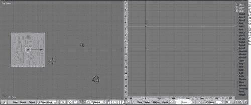

当前帧以绿色垂直线可见。一个位置 IPO 包含三个不同的通道（沿 x 轴的位置`LocX`，以及沿 y 轴和 z 轴的位置`LocY`和`LocZ`）。这些通道以不同颜色的图表表示（它们可能重叠）。这些图表可以直接在`IPOCurve`编辑器中操作，但在这里我们将在 3D 视图窗口中添加第二个关键帧。

1.  在 3D 视图窗口中，转到第 25 帧。

1.  选择立方体并将其沿 x 轴向右移动。

1.  通过选择**对象 | 插入关键帧 | Loc**插入第二个位置关键帧。现在我们可以看到代表三个位置 IPO 通道的每个图表上都有一个第二个点被定义。因为我们只改变了立方体的 x 轴位置，所以其他通道的图表保持平坦，但`LocX`通道显示了 x 位置变化如何随着每一帧的进展而变化。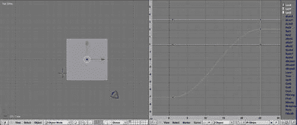

通过添加更多的关键帧，我们可以使任何运动变得尽可能复杂，但如果我们的对象需要遵循一个精确预计算的路径，这将会变得非常繁琐。在本章的后面部分，我们将看到如何通过 IPO 程序来操作代表这些通道的`IPOCurve`对象。

## 约束

**约束**在 Blender 中与顶级 Blender 对象或 Blender 骨骼对象相关联，并由`Constraint`对象表示。Blender 对象和骨骼有一个`constraints`属性，这是一个对象，它实现了一系列约束和方法，用于添加、删除和改变这个序列中约束的顺序（能够改变约束的顺序是必要的，因为在某些情况下，约束应用的顺序很重要）。

当约束与一个对象关联时，结果将是约束参数和计算参数的混合。这种混合中约束参数或非约束参数的比例由`influence`属性决定，这甚至可以动画化。

# 驱动器和约束之间的区别

驱动器和约束在影响参数变化方式方面相关联，但它们也非常不同：约束作用于对象，而驱动器确定 IPO 曲线（动画参数）如何改变其他 IPO 曲线。并且，约束只能影响对象的空间属性，如位置、缩放或旋转，任何 IPO 曲线都可以由另一个 IPO 曲线驱动。这意味着即使是材料参数，如颜色或`Lamp`参数（如能量），也可以由另一个 IPO 驱动。不过，有一个限制：驱动其他 IPO 曲线的 IPO 曲线目前必须是对象的特殊属性，因此你可以通过某个对象的旋转来驱动材料的颜色，但不能通过灯的能量来驱动该颜色。此外，约束只能影响空间属性的事实意味着例如无法限制材料的漫反射颜色。以下表格显示了某些约束及其相关属性。有关`Blender.Constraint`模块的更多详细信息，请参阅 API 文档。

| 约束类型 | 典型属性 |
| --- | --- |
| `TrackTo` | `Target`（目标对象）`Track`（跟踪轴） |
| `Floor` | `Target`（目标对象） |
| `StretchTo` | `Target`（目标对象） |
| `CopyLocation` | `Copy`（要复制的位置组件） |

注意，还可以动画化约束的影响，在这种情况下，对象将有一个相关的约束类型 IPO。

# 使用约束编程

Blender 有许多可以应用于对象的约束。其中一些与驱动器类似，因为它们不限制对象的运动，而是复制一些参数，如旋转或位置。从开发者的角度来看，每个 Blender 对象都有一个`constraints`属性，它是一个约束对象的序列。这个序列可以被追加，并且可以从序列中删除项目。还可以改变项目的顺序。

| 方法 | 操作 | 示例 |
| --- | --- | --- |
| `append(`*类型*`)` | 向对象追加新的约束并返回该约束 | `ob.constraints.append(Constraint.Type.TRACKTO)` |
| `remove(`*约束*`)` | 从对象中删除约束 | `ob.constraints.remove(ob.constraints[0])` |
| `moveUp(`*约束*`)` `moveDown(`*约束*`)` | 改变约束在约束列表中的位置 | `ob.constraints.moveDown(ob.constraints[0])` |
| `[]` | 访问约束的属性 | `Con = ob.constraints[0]` `Con[Constraint.Settings.TARGET] = other` |

新的 `Constraint` 对象不是通过构造函数实例化的，而是通过调用 `constraints` 属性的 `append()` 方法并指定要添加的约束类型来创建。`append()` 方法将返回新的 `Constraint` 对象，然后可以修改其设置。

# 使用 IPO 编程

IPO 通道可以从脚本中更改，就像约束一样，但它们比约束更为多样，因为存在许多不同类型的 IPO 通道，其中一些，特别是纹理通道和形状键，需要特殊处理。它们有自己独立的章节（第六章：*形状键、IPO 和姿态*），但在下一节中将展示 Python 在 IPO 通道中的不同用法。

# PyDrivers

有许多情况，我们希望通过引用另一个属性来更改某些属性，但无法通过驱动另一个 IPO 通道来捕捉这种关系。通常，这是因为关系不是简单的线性依赖，例如，由圆形运动驱动的活塞。另一种情况是，如果关系是非连续的，例如，当开关处于某个位置时打开的灯光。

在这种情况下，关系可能由 Python 表达式或所谓的*pydriver*定义。pydriver 将另一个对象的 IPO 通道作为输入，并产生输出，该输出将驱动当前对象的通道。因为这些 Python 表达式可以访问完整的 Blender API，所以这些关系可以变得非常复杂。

# PyConstraints

在内置的 IPO 通道驱动可能性受限时，可以使用 pydrivers 来绕过这些限制，而**PyConstraints**则允许我们在内置约束不足的情况下克服困难。例如，无法将一个物体的位置限制在另一个有孔物体的表面上。内置约束提供了一种方法，将位置限制在另一个物体（即`floor`约束）的上方。但如果我们希望物体在存在孔的位置下落，我们就必须自己编写这样的约束。正如我们将看到的，PyConstraints 允许我们做到这一点。

在我们完成所有这些介绍性说明之后，我们可以在下一节中再次转向编程。

# 设置时间——一统天下

如果不能以方便的方式设置时间，时钟有什么用？我们不想为每个指针定位，而是希望转动一个旋钮，同时移动大指针和小指针，其中小指针的移动速度是大指针的十二分之一。

因此，我们必须定义一个`knob`对象（我们可能不会渲染它），并通过这个旋钮的旋转来驱动时钟骨骼的旋转。

要设置驱动通道，我们遵循以下步骤：

1.  在 3D 视图中，选择`bighand`对象。

1.  在 IPO 窗口中，请确保您已选择了对象 IPO 类型。在右侧，将有一个通道列表。通过左键单击标签为**RotZ**的通道来选择它。它将被突出显示。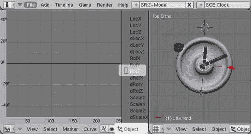

1.  选择**曲线 | 变换属性**。将出现一个弹出窗口。点击**添加驱动器**按钮。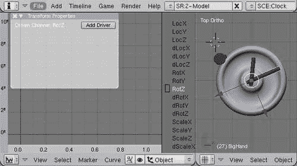

1.  在**变换属性**弹出窗口仍然存在的情况下，选择**曲线 | 插入 1:1 映射**，然后点击**默认的一对一映射**弹出窗口（或按*Enter*键）。生成的图表将作为一条直线、浅蓝色线出现在 IPO 编辑器窗口中。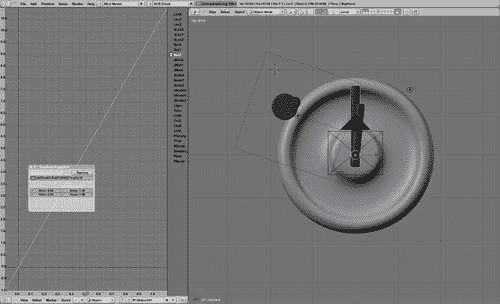

1.  在**变换属性**弹出窗口中，点击浅绿色的 Python 图标。Python 图标将变为深绿色，现在可以在相邻的文本字段中输入 pydriver 表达式。输入以下代码行：

    ```py
    ob('Knob').RotZ*(360/(2*m.pi))/10
    ```

哇！如果你现在围绕`knob`对象的 z 轴旋转，大指针也会相应地旋转。不过，pydriver 表达式确实需要一些解释。高亮部分是驱动器——为我们驱动通道提供输入的对象通道。`ob('Knob')`部分是 pydriver 表达式允许的`Blender.Object.Get('Knob')`的缩写，而`RotZ`属性为我们提供了关于 z 轴的旋转。然而，这种旋转是以弧度为单位的，而旋转通道的 pydriver 表达式的结果应该是以度为单位的，因此我们将其乘以 360 度并除以 2π。最后，我们将计算出的度数除以十，因为出于某种神秘的原因，Blender 实际上并不期望度数，而是度数除以 10！（请注意，这种“除以十”的操作仅适用于旋转通道，不适用于其他任何通道！）

### 注意

1:1 映射

你可能会想知道为什么我们首先需要插入一个 1:1 曲线。嗯，驱动通道与其驱动器之间的关系包含一个额外的层次，那就是将 pydriver 的输出转换为最终输出的曲线。当然，我们可以调整这条曲线，但通常我们会在 pydriver 中进行所有精细调整，然后只插入一个 1:1 曲线。这种工作方式非常常见，因此 Blender 提供了一个专门用于这种情况的菜单项，因为为每个驱动通道反复创建必要的曲线是非常繁琐的。

当然，我们可以通过直接驱动旋转通道的旋转通道或通过复制旋转约束来实现同样的效果。这将节省我们奇怪的转换问题，但本节的目的是展示基础知识。

小指针是一个使用 pydriver 确实是有效解决方案的例子。（尽管通过调整 IPO 曲线本身我们也可以改变驱动通道的速度，但这不如简单的表达式清晰，对于更复杂的关系几乎不可能实现）我们重复之前显示的操作列表，但现在针对小指针对象，并输入以下 pydriver 表达式：

```py
ob('Knob').RotZ*(360/(2*m.pi))/10/12
```

因为小指针的运行速度是大指针的十二分之一，所以我们使用与大指针相同的 pydriver 表达式，但将其结果除以十二。现在当我们围绕`knob`对象的 z 轴旋转时，大指针会跟随，小指针也会以设定的速度跟随。除了手动旋转旋钮外，还可以动画化旋钮的旋转来动画化两个时钟指针。完整的结果作为`clock-pydriver.blend`提供，时钟的渲染图像，其中旋钮驱动指针的运动在左上角可见，如图所示：

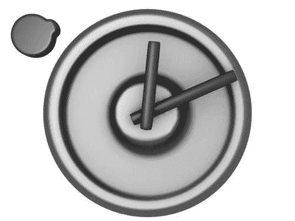

## 快捷键

在 pydriver 表达式中，可以使用一些有用的快捷键来节省输入。在逐步示例中，我们已经使用了`ob('<name>')`快捷键，该快捷键通过名称引用 Blender 对象，同样，可以通过`me('<name>')`和`ma('<name>')`分别访问`Mesh`对象和材质。此外，`Blender`模块作为`b`可用，`Blender.Noise`模块作为`n`可用，Python 的`math`模块作为`m`可用。这允许使用三角函数等表达式，例如正弦。这些设施足以覆盖许多问题，但它们可能仍然不足以满足需求，例如如果我们想导入外部模块。然而，我们将在下一节中看到，有一种方法可以绕过这些困难。

### 克服限制：pydrivers.py

pydrivers 的输入字段限制为 125 个字符，尽管提供的快捷键可以访问 Python 的`math`模块和一些 Blender 模块，允许更短的表达式，但提供的空间通常不足。此外，由于 pydrivers 必须是 Python 表达式，因此很难调试它们（例如，无法插入`print`语句）或实现类似`if/then`的功能。后者可以通过基于以下事实的巧妙技巧在一定程度上克服：在 Python 中，`True`和`False`在数值表达式中分别转换为 1 和 0，因此以下语句：

```py
if a>b:
   c=14
else:
   c=109
```

可以表示为：

```py
c = (a>b)*14 + (a<=b)*109
```

然而，这感觉有些笨拙，并且会两次评估条件。幸运的是，通过使用名为`pydrivers.py`的文本块，可以解决空间问题和限制单个表达式的问题。如果存在这样的文本块，其内容可以通过名为`p`的模块访问。例如，如果我们定义一个名为`clamp()`的函数在`pydrivers.py`中，其看起来如下：

```py
def clamp(a,low,high):
   if a<low : a=low
   if a>high: a=high
   return a
```

我们可以在 pydriver 表达式中调用此函数为`p.clamp(a,14,109)`。

在接下来的示例中，我们将大量使用`pydrivers.py`，这不仅因为它允许使用更复杂的表达式，还因为 pydriver 字段的宽度甚至小于其允许内容的长度，这使得阅读起来非常困难，因为你必须滚动以访问表达式的所有部分。

# 内燃机——关联复杂变化

想象一下，我们想要展示一个四冲程内燃机是如何工作的。这种发动机有很多运动部件，其中许多部件以复杂的方式相互关联。

为了看到这些确切的关系，查看以下插图可能很有用。它列出了我们将用于引用各种部件的名称。（我既不是汽车工程师也不是机械师，所以这些部件名称可能不准确，但至少我们将谈论相同的事情。如需更多信息，您可能想阅读[`en.wikipedia.org/wiki/Four-stroke_cycle`](http://en.wikipedia.org/wiki/Four-stroke_cycle)。）

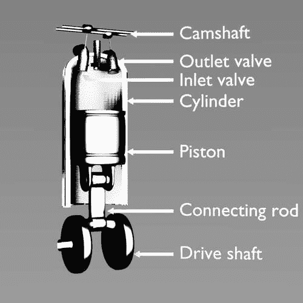

在我们开始配置部件，使其旋转和位置由另一个部件驱动之前，提前思考一下是件好事：在现实生活中，气缸内的活塞是由燃烧燃料的膨胀推动的，而活塞通过连接飞轮和分配皮带（或在我们的情况下是一些齿轮，这里没有展示）将运动传递回驱动进气和排气阀运动的凸轮轴。显然，我们无法直接遵循这个概念，因为没有某种类型的燃料对象来驱动其他对象，所以反转关系链更有意义。在我们的设置中，飞轮将驱动传动轴和不同的齿轮，传动轴将驱动大多数其他对象，包括活塞及其连杆。我们还将通过传动轴的旋转来驱动位于火花塞尖端的灯泡的能量。

传动轴将简单地跟随飞轮的旋转，下齿轮也是如此（这也可以通过`copy` `rotation`约束来实现，但在这里我们选择通过 pydrivers 来实现所有操作）。对应于`RotX`通道的 pydrivers 将如下所示：

```py
ob('Flywheel').RotX/(2*m.pi)*36
```

对于仅仅复制旋转的东西来说，这看起来可能有些笨拙，但请记住，旋转是以弧度存储的，而 pydriver 表达式应该返回以 10 度为单位除以的旋转度数。

顶齿轮和两个凸轮轴也将跟随飞轮的旋转，但速度减半，并且旋转方向相反：

```py
m.degrees(ob('Flywheel').RotX*-0.5)/10.0
```

为了说明如何访问 Python 的`math`模块中的函数，我们没有自己进行度数的转换，而是使用了`math`模块提供的`degrees()`函数。

我们将凸轮轴建模为凸轮正好向下。如果我们想通过传动轴的旋转来驱动进气凸轮轴的 x 轴旋转，我们必须考虑到它以一半的速度移动。此外，它的旋转稍微滞后，以匹配气缸的点火周期，因为它在第一次下冲时打开进气阀，并在点火火花前关闭阀门：

```py
ob('DriveShaftPart').RotX/(2*m.pi)*18+9
```

出口凸轮轴的表达式几乎完全相同，只是它落后（此处为`24`）的量，但调整此发动机的工作留给真正的机械师：

```py
ob('DriveShaftPart').RotX/(2*m.pi)*18+24
```

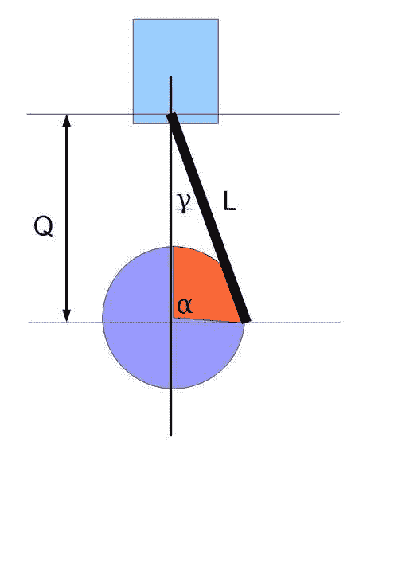

活塞的运动仅限于垂直方向，但确切的运动计算要复杂一些。我们感兴趣的是数量**Q**的位置——参见前面的图示——以及驱动轴中心与连杆连接点（图中**L**）之间的距离。由于连杆的长度是固定的，**Q**将作为驱动轴旋转角度**α**的函数而变化。从驱动轴中心到连杆连接点的距离也是固定的。我们称这个距离为 R。现在我们有一个边长为**Q**、**L**和**R**的三角形，以及一个已知的角**α**。由于这三个量（L、R 和α）是已知的，我们可以通过余弦定理（[`en.wikipedia.org/wiki/Law_of_cosines`](http://en.wikipedia.org/wiki/Law_of_cosines)）计算出第四个量**Q**。因此，我们在`pydrivers.py`中定义了一个函数`q()`，当给定**L**、**R**和**α**时，它将返回长度**Q**：

```py
def q(l,r,a): return r*cos(a)+sqrt(l**2-(r*sin(a))**2)
```

活塞的`LocZ`通道的表达式将简单地调用此函数，并使用适当的参数值：

```py
p.q(1.542,0.655,ob('DriveShaftPart').RotX)
```

**L**和**R**的确切值是通过在`Transform Properties`窗口中记录连杆和驱动轴适当顶点的位置从网格中获得的。（3D 视图中的*N*键）

连杆本身可能使用与活塞和连杆的网格原点精确对齐相同的`LocZ`通道表达式。

然而，连杆的运动不仅限于 z 位置，因为它将围绕连接到活塞的点的 x 轴旋转。这种旋转的角度（图中**γ**）可以从数量**L**、**R**和**α**中推导出来：

```py
def topa(l,r,a):
   Q=q(l,r,a)
   ac=acos((Q**2+l**2-r**2)/(2*Q*l))
   if a%(2*pi)>pi : ac = -ac
   return -ac
```

`RotX`的 pydriver 表达式将看起来像这样：

```py
m.degrees(p.topa(1.542,0.655,ob('DriveShaftPart').RotX))/10.0
```

进气和排气阀门由各自凸轮轴的旋转驱动。实际凸轮的轮廓相当复杂，因此在这里，我们不是使用该轮廓的实际形状，而是通过某种看起来足够好的东西来近似它（即，在正确的时间以流畅而迅速的动作打开阀门）。以下图表显示了阀门行程作为旋转角度的函数：

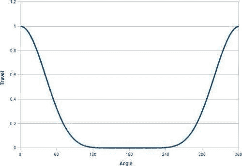

为了达到这个目的，在`pydrivers.py`中我们定义了一个函数`spike()`，它将凸轮轴的旋转作为其参数，并返回一个在零角度周围急剧上升的值在`0.0`和`1.0`之间：

```py
def spike(angle):
   t = (cos(angle)+1.0)/2.0
   return t**4
```

现在阀门的运动是线性的，但它所遵循的线倾斜了 10 度（进水阀向前，出水阀向后），因此我们需要驱动两个通道，`LocZ` 和 `LocY`，每个通道都乘以正确的数值以产生倾斜运动。因此，我们在 `pydrivers.py` 中定义了两个函数：

```py
def valveZ(angle,tilt,travel,offset):
   return cos(radians(tilt))*spike(angle)*travel+offset
def valveY(angle,tilt,travel,offset):
   return sin(radians(tilt))*spike(angle)*travel+offset
```

这两个函数都会根据驱动对象的旋转角度返回一个距离。`tilt` 是阀门倾斜的角度（以度为单位），`travel` 是阀门沿着倾斜线可以旅行的最大距离，`offset` 是一个允许我们调整阀门位置的值。因此，进水阀的 `LocZ` 和 `LocY` 通道的对应 pydriver 表达式将变为：

```py
p.valveZ(ob('CamInlet').RotX+m.pi,-10.0,-0.1,6.55)
```

和

```py
p.valveY(ob('CamInlet').RotX+m.pi,-10.0,-0.1,-0.03)
```

（出水阀的表达式看起来相同，但倾斜角度为正值。）

到目前为止，所有通道都是对象通道，即位置和旋转。但也可以驱动其他通道，这正是我们需要驱动位于火花塞尖端灯的能量。在 `pydrivers.py` 中，我们首先定义了一个辅助函数 `topi()`，它除了接受驱动对象的旋转角度外，还将接受一个角度 `h`（以弧度为单位）和一个强度 `i` 作为参数。如果驱动对象的旋转角度在 `0` 到 `h` 之间，它将返回该强度，如果在这个范围之外，则返回零。因为输入角度可能大于两倍的 pi（当驱动对象旋转超过一整圈时），我们通过高亮的 *modulo* 操作进行纠正：

```py
def topi(a,h,i):
   m = a%(2*pi)
   r=0.0
   if m<h: r=i
   return r
```

能量通道的 pydriver 表达式（在 IPO 编辑器窗口中称为 "Energ"）可以表示如下：

```py
p.topi(ob('DriveShaftPart').RotX/2+m.pi,0.3,0.5)
```

如所示，这个表达式将在其周期的前 17 度左右（约 `0.3` 弧度）通过将能量设置为 `0.5` 来触发火花塞。

## 更强大的功能——将多个气缸组合到发动机中

一旦我们建模了一个单缸并处理了各个部分的运动，我们的下一步就是复制气缸以创建类似于本章开篇插图中的集合。原则上我们可以选择所有部分，通过按 *Shift* + *D* 复制它们，并调整各个驱动通道的时序。

然而，有一个问题。当我们使用 *Shift* + *D* 而不是 *Alt* + *D* 时，我们实际上创建了对象网格的副本，而不是仅仅引用相同的对象。我们原本期望对于与对象相关联的其他项目，例如材质、纹理和 IPOs，也会有同样的效果。然而，事实并非如此，因为 Blender 默认情况下在复制对象时不会复制那些最后三个类别。例如，如果第一个活塞的 IPO 发生变化，将会影响所有复制的活塞，这将会很尴尬。

我们可以在之后使那些副本变得独特（例如，通过点击那些 IPO 的用户计数字段并确认 **make** **single** **user?** 弹出窗口）但这很麻烦，因为必须为每个副本重复操作。

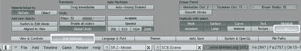

更好的方法是修改**用户首选项**窗口中**编辑方法**屏幕的**复制** **与** **对象**设置，如前面的截图所示。这样，与对象关联的 IPOs 将在复制对象时变成独特的副本。上面显示了带有复制 IPOs 按钮（高亮显示）的**用户首选项**窗口的截图。

我们劳动的结果，一个带有齿轮的四个气缸发动机，可以将驱动轴的运动传递到凸轮轴上，现在可用作`engine001.blend`。下一张截图显示了动画中的静态图像，该动画可在[`vimeo.com/7170769`](http://vimeo.com/7170769)找到：

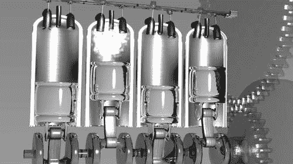

# 添加简单约束

约束可以应用于对象以及骨骼。在这两种情况下，通过调用`constraints`属性的`append()`方法添加一个新的约束。我们的下一个示例将展示我们如何限制从绑定时钟（来自第三章, *顶点组和材质*)的指针围绕 z 轴旋转。定义完成此操作的函数的代码以两个`import`语句开始，这将节省我们一些输入：

```py
from Blender.Constraint import Type
from Blender.Constraint import Settings
```

函数本身将接受两个参数：`obbones`，一个指向 Blender 对象（其数据是骨架，即不是骨架对象本身）的引用，以及`bone`，我们想要限制其运动的骨骼名称。重要的是要理解，我们将与骨骼关联的约束不是骨架的属性，而是包含骨架的对象姿势的属性。许多对象可能引用同一个骨架，并且任何姿势都与对象相关联，因此引用相同骨架的不同对象可能会呈现不同的姿势。

因此，函数首先获取姿势，然后获取我们想要约束的骨骼的引用。高亮行显示了如何关联约束（如果我们将约束与 Blender 对象而不是骨骼关联，这将是类似的）：

```py
def zrotonly(obbones,bone):
   poseob = obbones.getPose()
   bigarmpose = poseob.bones[bone]
   c=bigarmpose.constraints.append(Type.LIMITROT)
   c[Settings.LIMIT]=Settings.LIMIT_XROT|Settings.LIMIT_YROT
   c[Settings.XMIN]=0.0
   c[Settings.XMAX]=0.0
   c[Settings.YMIN]=0.0
   c[Settings.YMAX]=0.0
   poseob.update()
```

新添加的约束被保留为变量`c`，后续行显示可以像字典一样访问约束的不同属性。首先，我们配置`LIMIT`属性（一个位图）以限制 x 和 y 轴的旋转。接下来，我们将围绕这些轴的旋转的最小值和最大值设置为`0.0`，因为我们不允许任何移动。例如，在真实动物骨骼的绑定中，这些值可以设置为限制旋转范围，使其与真实关节相当。最后，为了使我们的`Pose`对象的变化可见，我们调用其`update()`方法。

# 定义复杂约束

当 pydrivers 使我们能够通过另一个`IPOCurve`的变化来驱动一个的变化时，PyConstraints 为我们提供了让对象属性仅以有限方式变化的方法。

当然，Blender 已经预定义了许多简单的约束，正如我们在前面的章节中看到的，通常简单约束的组合可能正是你想要的。但假设你希望你的对象在一个非矩形区域内自由移动，例如简化街道网格上交通灯和电话亭的允许放置。我们如何实现这一点？请进入 pyconstraints。

**PyConstraints** 是一些 Python 脚本，应该以文本块的形式存在于 Blender 的文本编辑器中，并以注释行开始，标识它为一个约束：

```py
#BPYCONSTRAINT
```

一个 Python 约束应包含三个函数，称为`doConstraint()`、`doTarget()`和`getSettings()`。前两个函数在我们移动目标或约束对象时被调用，最后一个函数在用户点击**选项**按钮时被调用，该按钮在用户选择了一个 pyconstraint 之后出现。以下截图显示了选择 pyconstraint 后的**约束**选项卡。

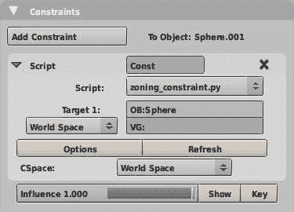

理解这些函数的功能的最简单方法是通过查看内置的约束模板，我们可以将其用作编写我们自己的约束的基础。它可以通过文本编辑器的**文本 | 脚本模板 | 脚本约束**菜单访问。如果点击，它将在文本编辑器的底部下拉菜单中选择一个新文本块。

## Blender 约束模板

Blender 约束模板也包含许多有用的注释，但在这里我们主要列出基本函数。此外，模板创建了一个虚拟属性窗口。我们将在下一节遇到属性，因此这里`getSettings()`的示例将几乎是空的。如图所示，这些函数将实现功能约束，然而，实际上没有任何东西被约束。约束对象的定位、旋转和缩放都保持不变。

```py
def doConstraint(obmatrix, targetmatrices, idprop):
   # Separate out the transformation components for easy access.
   obloc = obmatrix.translationPart()   # Translation
   obrot = obmatrix.toEuler()         # Rotation
   obsca = obmatrix.scalePart()      # Scale

   # code to actually change location, rotation or scale goes here

   # Convert back into a matrix for loc, scale, rotation,
   mtxloc = Mathutils.TranslationMatrix(obloc)
   mtxrot = obrot.toMatrix().resize4x4()
   mtxsca = Mathutils.Matrix([obsca[0],0,0,0], [0,obsca[1],0,0],[0,0,obsca[2],0], [0,0,0,1])

   # Recombine the separate elements into a transform matrix.
   outputmatrix = mtxsca * mtxrot * mtxloc

   # Return the new matrix.
   return outputmatrix
```

`doConstraint()` 函数将传递约束对象的变换矩阵以及每个目标对象的变换矩阵列表。它还将接收一个包含约束属性字典，这些属性可以通过名称访问。

我们首先做的是将约束对象的变换矩阵的平移、旋转和缩放组件分离出来。平移部分将是一个包含 x、y、z 位置的向量，缩放部分将是一个包含沿 x、y 和 z 轴的缩放因子的向量。旋转部分将由一个表示绕三个主轴旋转的欧拉向量表示。（欧拉角大大简化了 3D 中的旋转操作，但一开始很难理解。维基百科有一个关于欧拉角的优秀页面[`en.wikipedia.org/wiki/Euler_angle`](http://en.wikipedia.org/wiki/Euler_angle)，但就现在而言，最容易想到的是欧拉角作为绕局部 x、y 和 z 轴的旋转分离出来。）如果我们愿意，我们也可以将目标对象的任何变换矩阵分离出来，然后以任何我们希望的方式修改约束对象的变换矩阵的变换组件。

如此所示，该函数什么也不做，只是通过使用 API 方法（如果可用）将不同的变换组件转换回矩阵，然后通过矩阵乘法将它们重新组合成一个随后返回的单个矩阵。

在调用`doConstraint()`之前调用`doTarget()`函数，这给了我们操纵目标矩阵在传递给`doConstraint()`之前的机会。它的参数是目标对象、子目标（对于目标骨架或网格，分别是一个`Bone`或顶点组），目标矩阵和约束的属性。在后面的部分，我们将利用这个机会在属性中存储对目标对象的引用，以便`doConstraint()`可以访问它否则无法访问的信息。如果我们不想改变任何东西，那么像以下代码所示返回目标矩阵原样即可：

```py
def doTarget(target_object, subtarget_bone, target_matrix,id_properties_of_constraint):
   return target_matrix
```

同样，如果没有必要提供给用户指定额外属性的可能性，`getSettings()`可以简单地返回。如果我们确实想要显示一个弹出窗口，`getSettings()`就是它应该发生的地方。我们将在后面的部分看到一个例子。以下代码是一个有效的“什么都不做”实现：

```py
def getSettings(idprop):
   return
```

## 你也觉得我很有魅力吗？

当月亮和地球相互绕转时，它们会感受到彼此的引力。在地球上，这会导致潮汐，但地球和月球的固体也会发生形变，尽管这种效应很小。现在关于潮汐的不仅仅是引力([`en.wikipedia.org/wiki/Tides`](http://en.wikipedia.org/wiki/Tides))，但我们可以通过应用约束来夸张地展示引力形变。

实现这一点的其中一种方法是通过使用`TrackTo`约束将我们约束对象的轴朝向吸引对象进行定位，并添加第二个约束来沿同一轴缩放约束对象。缩放的大小将取决于约束对象与目标对象之间的逆距离。效果如图所示，其中`TrackTo`约束的效果与脚本约束`moon_constraint.py`相结合。

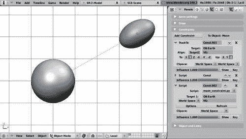

我们将不得不自己编写这个距离相关的缩放。如果我们采用 Blender 提供的约束模板，我们可以保留`doTarget()`和`getSettings()`函数不变，但我们必须编写一个合适的`doConstraint()`函数（完整代码作为`moon_constraint.py`提供）：

```py
def doConstraint(obmatrix, targetmatrices, idprop):
   obloc = obmatrix.translationPart()   # Translation
   obrot = obmatrix.toEuler()         # Rotation
   obsca = obmatrix.scalePart()      # Scale

   tloc = targetmatrices[0].translationPart()
   d = abs((obloc-tloc).length)
   d = max(0.01,d)
   f = 1.0+1.0/d
   obsca[1]*=f

   mtxloc = Mathutils.TranslationMatrix(obloc)
   mtxrot = obrot.toMatrix().resize4x4()
   mtxsca = Mathutils.Matrix([obsca[0],0,0,0], [0,obsca[1],0,0],[0,0,obsca[2],0], [0,0,0,1])

   outputmatrix = mtxsca * mtxrot * mtxloc

   return outputmatrix
```

我们省略了与属性相关的任何行，因为我们没有为这个约束实现任何用户可配置的属性。高亮显示的行显示了我们需要做什么来计算距离相关的缩放。

第一行获取目标的位置。接下来，我们计算约束对象与目标之间的距离，并将其限制在一个最小值（略大于零）以防止在下一行高亮显示时发生除以零的情况。这里使用的公式远非任何引力影响的近似，但对我们目的来说已经足够好了；如果`d`非常大，则缩放因子将为`1.0`，并且随着距离`d`的减小将平滑增加。最后一行高亮显示的是我们只改变 y 轴的缩放，即我们使用`TrackTo`约束朝向目标对象定位的轴。

### 注意

**循环依赖：**

如果两个对象具有相当的质量，那么在两个对象上产生的引力扭曲将具有相当的大小。我们可能会想将`TrackTo`和`moon_constraint.py`约束添加到两个对象上，以观察它们对彼此产生的影响，但不幸的是，这不会起作用，因为它将创建循环依赖，Blender 将会抗议。

## 吸附到网格顶点

这类似于 Blender 菜单中的“吸附到顶点”模式，即**对象 | 变换 | 吸附**（更多关于吸附的信息，请参阅**[`wiki.blender.org/index.php/Doc:Manual/Modelling/Meshes/Snap_to_Mesh`](http://wiki.blender.org/index.php/Doc:Manual/Modelling/Meshes/Snap_to_Mesh)）的功能，但效果不是永久的（一旦移除约束，对象将恢复到未约束的位置），并且可以通过改变影响滑块来调节约束的强度。**

**在我们迄今为止设计的约束中，只需要目标对象的当前位置来计算对约束对象的影响。这个位置对`doConstraint()`函数来说很容易获得，因为目标的矩阵作为参数传递。然而，我们现在面临一个不同的挑战：如果我们想要对齐到一个顶点，我们必须能够访问目标对象的网格数据，但目标对象并没有传递给`doConstraint()`函数。**

**克服这个障碍的方法是将`idprop`参数传递给`doConstraint()`。在调用`doConstraint()`之前，Blender 首先为每个目标对象调用`doTarget()`。这个函数作为目标对象和约束属性的引用传递。这允许我们在这些属性中插入目标对象的引用，因为这些属性传递给`doConstraint()`，这为我们提供了将必要信息传递给`doConstraint()`以获取`Mesh`数据的方法。这里有一个需要注意的小问题：Blender 属性只能是数字或字符串，所以我们实际上不能存储对象的引用，而只能满足其名称。因为名称是唯一的，Blender 的`Object.Get()`提供了一种通过名称检索对象的方法，所以这不是问题。**

**`doConstraint()`和`doTarget()`的代码如下（完整的代码作为`zoning_constraint.py`提供）：**

```py
def doConstraint(obmatrix, targetmatrices, idprop):

   obloc = obmatrix.translationPart().resize3D()
   obrot = obmatrix.toEuler()      
   obsca = obmatrix.scalePart()

   # get the target mesh
   **to = Blender.Object.Get(idprop['target_object'])**
   me = to.getData(mesh=1)

   # get the location of the target object
   tloc = targetmatrices[0].translationPart().resize3D()

   # find the nearest vertex in the target object
   smallest = 1000000.0
   delta_ob=tloc-obloc
   for v in me.verts:
      d = (v.co+delta_ob).length
      if d < smallest:
         smallest=d
         sv=v
   obloc = sv.co + tloc

   # reconstruct the object matrix
   mtxrot = obrot.toMatrix().resize4x4()
   mtxloc = Mathutils.TranslationMatrix(obloc)
   mtxsca = Mathutils.Matrix([obsca[0],0,0,0], [0,obsca[1],0,0],[0,0,obsca[2],0], [0,0,0,1])
   outputmatrix = mtxsca * mtxrot * mtxloc
   return outputmatrix

def doTarget(target_object, subtarget_bone, target_matrix,id_properties_of_constraint):
 **  id_properties_of_constraint['target_object']=target_object.name**
   return target_matrix
```

**高亮行显示了我们将目标对象的名称传递给`doConstraint()`的方式。在`doConstraint()`中，我们首先检索目标网格。这可能抛出异常，例如，如果目标对象不是一个网格，但 Blender 本身会捕获这个异常。此时约束不会受到影响，并且控制台会显示错误，但 Blender 会继续愉快地运行。**

**一旦我们有了目标对象的网格数据，我们就检索目标对象的位置。我们需要这个位置，因为所有顶点坐标都是相对于这个位置。接下来，我们将约束对象的位置与目标网格的所有顶点位置进行比较，并记住最近的那个来计算约束对象的位置。最后，我们通过结合各种变换组件，像以前一样重建约束对象的变换矩阵。**

## **沿着顶点法线对齐**

**现在我们可以将对象约束到目标网格上的最近顶点，我们可以看到有些东西缺失：对象没有以有意义的方式定向。这不一定总是问题，例如，树木通常向上生长，但在许多情况下，如果我们能够使约束对象垂直于表面定向会更好。这在所有实际目的上都是相同的，因为将约束对象沿其已对齐的顶点的顶点法线定向。**

**因此，在找到最近的顶点后，我们确定顶点法线与 z 轴之间的角度（即，我们任意定义 z 方向为'向上'），然后围绕垂直于顶点法线和 z 轴的轴旋转被约束的对象相同的角度。这将使被约束的对象沿着该顶点法线定位。如果被约束的对象在添加约束之前手动旋转，这些先前的旋转将会丢失。如果我们不希望这样，我们可以在添加约束之前永久应用任何旋转。**

**为了实现这个对齐功能，我们的代码将发生变化（`zoning_constraint.py`文件中已经包含了这些更改）：`doConstraint()`将必须计算变换矩阵的旋转部分。我们必须计算旋转角度、旋转轴，然后是新的旋转矩阵。以下代码中突出显示的部分显示了这些计算的基本工具已经由`Mathutils`模块提供：**

```py
 vnormal = sv.no
   if idprop['NormalAlign'] :
      zunit=Mathutils.Vector(0,0,1)
 **     a=Mathutils.AngleBetweenVecs(vnormal,zunit)**
 **     rotaxis=zunit.cross(vnormal)**
 **     rotmatrix=Mathutils.RotationMatrix(a,4,"r",rotaxis)**
      mtxrot = rotmatrix
   else:
      mtxrot = obrot.toMatrix().resize4x4()
```

**在前面的代码中，我们可以看到我们已经根据`NormalAlign`属性进行了对齐。只有当它被设置时，我们才会计算必要的变换。因此，我们还需要调整`getSettings()`，因为用户需要一种方式来选择是否想要对齐：**

```py
def getSettings(idprop):
   if not idprop.has_key('NormalAlign'): idprop['NormalAlign'] = True

   align = Draw.Create(idprop['NormalAlign'])

   block = []
   block.append("Additional restrictions: ")
   block.append(("Alignment: ",align,"Align along vertex normal"))

   retval = Draw.PupBlock("Zoning Constraint", block)

   if (retval):
      idprop['NormalAlign']= align.val
```

**如图所示，`NormalAlign`属性将默认设置为`True`。然后，该选项将以一个简单的弹出窗口和切换按钮的形式呈现。如果用户点击弹出窗口外部或按下*Esc*键，`PupBlock()`的返回值将是`None`，我们不会更改`NormalAlign`属性。否则，它将被设置为切换按钮的值。**

**效果在插图中有展示。第一个展示了一棵小松树被约束在简单细分地面平面的一个顶点上。它被精确地吸附到顶点位置，但其 z 轴沿着全局 z 轴直指上方。接下来的截图显示了一棵云杉树被约束在崎岖景观中的一个顶点上。**

**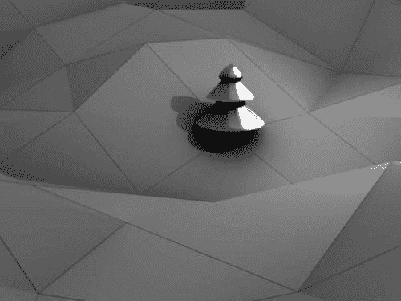**

**如果我们打开`NormalAlign`属性，我们会看到树模型不再直指上方，而是其 z 轴沿着它被吸附到的顶点的顶点法线方向对齐。以下截图显示了一棵云杉树被约束在顶点上并沿着顶点法线对齐。**

**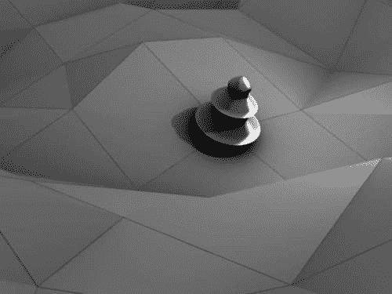**

**可以进一步限制模型可以吸附到的顶点，例如，仅限于属于顶点组的顶点。在以下插图，我们的模型不能移动到白色显示的顶点组范围之外。如何实现这一点将在下一节中展示。**

**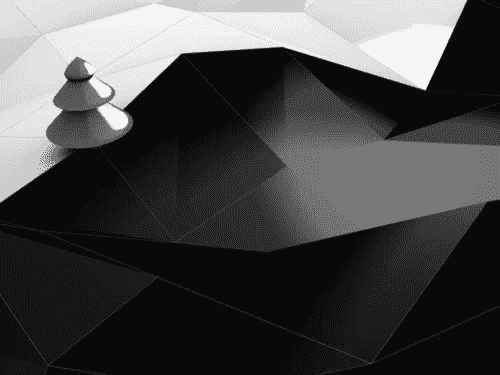**

## **吸附到顶点组的顶点上**

**如果我们想限制可以吸附的顶点？这可以通过定义一个顶点群，然后只考虑这个顶点群中的顶点作为吸附的候选。实现这一点的代码只需几行，`doConstraint()`的相关部分将看起来像这样（高亮代码显示了处理与顶点群匹配的附加行）：**

```py
 # get the target mesh
   to = Blender.Object.Get(idprop['target_object'])
   me = to.getData(mesh=1)

   # get the location of the target object
   tloc = targetmatrices[0].translationPart().resize3D()

   # find the nearest vertex in the target object
   smallest = 1000000.0
   delta_ob=tloc-obloc

 **  try:**
 **     verts = me.getVertsFromGroup(idprop['VertexGroup'])**
 **     for vi in verts:**
 **        d = (me.verts[vi].co+delta_ob).length**
 **        if d < smallest :**
 **           smallest = d**
 **           si = vi**
 **     obloc = me.verts[si].co+tloc**
 **     vnormal = me.verts[si].no**
 **  except AttributeError:**
      for v in me.verts:
         d = (v.co+delta_ob).length
         if d < smallest:
            smallest=d
            sv=v
      obloc = sv.co + tloc
      vnormal = sv.no 
```

**`try/except`结构确保如果`VertexGroup`属性引用了一个不存在的顶点群，我们将有机会检查所有顶点。当然，我们现在需要一种让用户选择顶点群的方法，因此`getSettings()`也需要进行适配。我们选择了一个简单的字符串输入字段，可以在其中输入顶点群的名字。没有检查顶点群是否存在，如果我们不想将吸附限制在顶点群上，我们既可以留空这个输入字段，也可以输入一个不存在的群组名字。这并不十分优雅，但它是有效的（添加的行已高亮）：**

```py
def getSettings(idprop):
 **  if not idprop.has_key('VertexGroup'): idprop['VertexGroup'] ='Zone'**
   if not idprop.has_key('NormalAlign'): idprop['NormalAlign'] = True

 **  vgroup = Draw.Create(idprop['VertexGroup'])**
   align = Draw.Create(idprop['NormalAlign'])

   block = []
   block.append("Additional restrictions: ")
 **  block.append(("Vertex Group: ",vgroup,0,30,"Vertex Group torestrict location to"))**
   block.append(("Alignment: ",align,"Align along vertex normal"))

   retval = Draw.PupBlock("Zoning Constraint", block)

   if (retval):
 **     idprop['VertexGroup']= vgroup.val**
      idprop['NormalAlign']= align.val
```

**下一张截图显示了顶点群输入框可能的样子：**

**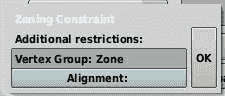**

### **注意**

**注意，脚本约束还向用户提供了一个可能引用顶点群的 VG 字符串输入字段，但这与我们向用户在**选项**弹出窗口中显示的顶点群输入字段不同。这个 VG 字段将改变约束查看目标的方式。如果在这里设置了有效的顶点群，传递给`doConstraint()`的目标矩阵将是顶点群中顶点中值位置的那个。**

**# 摘要

在本章中，我们了解了如何将不同的动画属性相互关联，以及如何将物体的空间属性约束到复杂的限制中。我们学习了如何：

+   通过 Python 表达式从一个**IPO**驱动另一个

+   解决 pydrivers 中固有的某些限制

+   通过添加约束来限制物体和骨骼的运动**

+   编写一个 Python 约束，将物体吸附到另一个物体上最近的顶点上

接下来，我们将探讨如何在动画中每次前进一帧时执行某些操作。**
