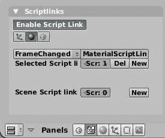
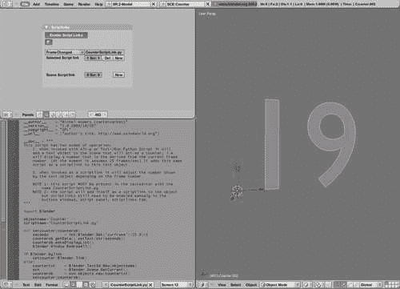
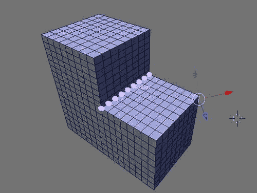
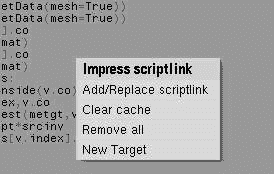
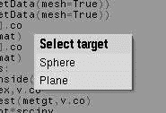
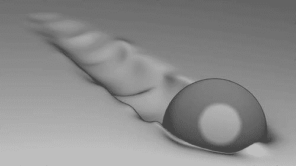
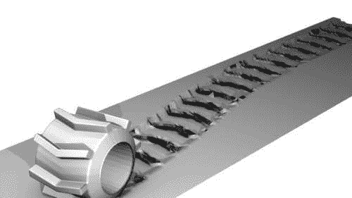

# 第五章。对帧变化进行操作

除了我们在 Blender 中遇到的所有可以使用 Python 的地方，我们现在将查看可能用于对某些事件进行操作的脚本。这些脚本有两种类型——**脚本链接**和**空间处理器**。

**脚本链接**是与 Blender 对象（`网格`、`摄像机`等，但还包括`场景`和`世界`对象）关联的脚本，并且可以设置在以下情况下自动运行：

+   在渲染帧之前

+   在渲染帧之后

+   当帧发生变化时

+   当对象被更新时

+   当对象数据被更新时

场景对象可能与其关联脚本链接，这些链接可能在以下两种情况下被调用：

+   在加载`.blend`文件时

+   保存`.blend`文件时

空间处理器是 Python 脚本，每次 3D 视图窗口重绘或检测到按键或鼠标动作时都会被调用。它们的主要用途是扩展 Blender 用户界面的功能。

在本章中，你将学习：

+   脚本链接和空间处理器是什么

+   如何在动画的每一帧变化上执行活动

+   如何将附加信息与对象关联

+   如何通过改变布局或改变透明度使对象出现或消失

+   如何实现一种方案，在每个帧上为对象关联不同的网格

+   如何增强 3D 视图的功能

# 对象的可见性动画

制作动画时经常遇到的一个问题是希望在某个帧使对象消失或淡出，要么是为了效果本身，要么是为了用另一个对象替换它以达到某种戏剧性的影响（如爆炸或兔子变成球）。

有许多方法可以构建这些效果，其中大多数并不是专门针对脚本链接在帧变化时做出反应的（许多可以简单地键入）。尽管如此，我们将查看两种可以轻松适应各种情况的技术，甚至包括那些不易键入的情况。例如，我们要求某个参数具有某种特定的行为，这在表达式中很容易制定，但在 IPO 中却难以捕捉。

## 渐变材料

我们的第一个例子将改变材料的**漫反射****颜色**。改变透明度同样简单，但通过插图更容易看到漫反射颜色的变化。

我们的目标是将漫反射颜色从黑色渐变到白色，然后再返回黑色，整个过程持续两秒钟。因此，我们定义了一个名为`setcolor()`的函数，它接受一个材料并改变其漫反射颜色（`rgbColor`属性）。它假设每秒 25 帧的帧率，因此第一行获取当前帧号并执行一个*模除*操作以确定当前整个秒中已经过去的时间比例。

在以下代码片段中，高亮行用于确定我们是否处于奇数或偶数秒。如果我们处于偶数秒，我们将漫反射颜色提升至白色，这样我们只需保留计算出的分数。如果我们处于奇数秒，我们将漫反射颜色降低至黑色，这样我们就从最大可能值（`25`）中减去分数。最后，我们将我们的值缩放到`0`到`1`之间，并将其分配给所有三个颜色分量，以获得一种灰色：

```py
import Blender

def setcolor(mat):
   s = Blender.Get('curframe')%25
   if int(Blender.Get('curframe')/25.0)%2 == 0:
      c = s
   else:
      c = 25-s
   c /= 25.0
   mat.rgbCol = [c,c,c]

if Blender.bylink and Blender.event == 'FrameChanged':
   setcolor(Blender.link)
```

脚本以一个重要的检查结束：`Blender.bylink`仅在作为脚本处理程序调用此脚本时为`True`，在这种情况下`Blender.event`包含事件类型。我们只想对帧变化采取行动，因此这就是我们在这里检查的内容。如果这些条件得到满足，我们将`Blender.link`传递给我们的`setcolor()`函数，因为它包含我们的`scriptlink`脚本关联的对象——在这种情况下，那将是一个`Material`对象。（此脚本作为`scriptlinks.blend`中的`MaterialScriptLink.py`提供。）

我们接下来要做的事情是将脚本与我们要更改材质的对象关联起来。因此，我们选择该对象，在**按钮** **窗口**中，我们选择**脚本** **面板**。在**脚本链接**选项卡中，我们启用脚本链接并选择**材质脚本链接**按钮。（如果不存在**材质脚本链接**按钮，则所选对象没有分配任何材质。请确保它有。）现在应该有一个带有**新**按钮的标签**选择** **脚本** **链接**可见。点击**新**将显示一个下拉菜单，其中包含可用的脚本链接（文本编辑器中的文件）。在这种情况下，我们将选择`MaterialScriptLink.py`，我们就完成了。现在我们可以通过在 3D 视图中更改帧（使用箭头键）来测试我们的脚本链接。我们的对象颜色应该随着帧号的改变而改变。（如果颜色似乎没有改变，请检查 3D 视图中是否启用了实体或着色视图。）



## 改变层

如果我们想改变一个对象的**可见性**，改变它所分配的层是一个比改变材质属性更通用且强大的技术。例如，改变其分配的层有这样一个优点：我们可以使对象对于配置为仅照亮某些层的灯具完全不可见，以及动画的许多方面（例如，粒子被力场偏转）也可能仅限于某些层。此外，改变层不仅限于具有相关材质的对象。我们同样可以轻松地改变`Lamp`或`Camera`的层。

对于我们的下一个示例，我们希望如果经过的秒数是偶数，就将对象分配到层 1，如果是奇数，就分配到层 2。实现这个功能的脚本与我们更改材质的脚本非常相似。实际的工作是由`setlayer()`函数完成的。第一行计算对象在当前帧应该位于的层，下一行（突出显示）将包含单个层的层索引列表分配给对象的`layers`属性。`setlayer()`函数的最后两行确保层的更改在 Blender 中实际上是可见的。

```py
import Blender

def setlayer(ob):
   layer = 1+int(Blender.Get('curframe')/25.0)%2
   ob.layers = [ layer ]
   ob.makeDisplayList()
   Blender.Window.RedrawAll()

if Blender.bylink and Blender.event == 'FrameChanged':
   setlayer(Blender.link)
```

如同我们之前的脚本，我们脚本的最后几行检查我们是否作为脚本链接被调用，并且在一个帧改变事件发生时，如果是这样，就将相关对象传递给`setlayer()`函数。（脚本作为`OddEvenScriptlink.py`文件位于`scriptlinks.blend`中。）

剩下的工作是将脚本作为`scriptlink`分配给选定的对象。同样，这通过在**按钮** **窗口** | **脚本** **面板**中点击**启用** **脚本** **链接**在**脚本链接**选项卡（如果需要，可能仍然被选中，因为我们之前的示例。这是一个全局选择，即它对所有对象都是启用的或禁用的）。这次，我们选择对象`scriptlinks`而不是材质`scriptlinks`，并点击**新建**从下拉菜单中选择`OddEvenScriptlink.py`。

# 倒计时——使用脚本链接动画计时器

使用作用于帧改变的脚本链接的一种可能性是能够通过改变`Mesh`对象的顶点或与 Blender 对象关联一个完全不同的网格来修改实际的网格。当使用 IPOs 时这是不可能的，因为这些仅限于在具有相同网格拓扑（以相同方式连接相同数量的顶点）的预定义形状之间进行插值的形状键。对于曲线和文本对象也是如此。

该技术的应用之一是实现一个`counter`对象，它将显示动画开始以来的秒数。这是通过通过其`setText()`方法更改`Text3d`对象的文本来实现的。以下代码中的`setcounter()`函数正是这样做的，同时执行必要的操作来更新 Blender 的显示。（脚本作为`CounterScriptLink.py`文件位于`scriptlinks.blend`中。）

```py
import Blender

objectname='Counter'
scriptname='CounterScriptLink.py'

def setcounter(counterob):
   seconds = int(Blender.Get('curframe')/25.0)+1
   counterob.getData().setText(str(seconds))
   counterob.makeDisplayList()
   Blender.Window.RedrawAll()

if Blender.bylink:
   setcounter(Blender.link)
else:
   countertxt    = Blender.Text3d.New(objectname)
   scn           = Blender.Scene.GetCurrent()
   counterob     = scn.objects.new(countertxt)
   setcounter(counterob)
   counterob.clearScriptLinks([scriptname])
   counterob.addScriptLink(scriptname,'FrameChanged')

```

此脚本可以像之前展示的那样与任何 `Text3d` 对象关联为脚本链接。然而，如果从文本编辑器以 *Alt* *+* *P* 运行，它将创建一个新的 `Text3d` 对象，并将其作为脚本链接与该对象关联。突出显示的行显示了如何检查这一点，就像在之前的脚本中一样，但在这个情况下，如果未作为脚本链接调用，我们也会采取一些行动（`else` 子句）。最后两个突出显示的行显示了如何将脚本与新创建的对象关联。首先，我们删除（清除）可能之前已关联的任何具有相同名称的脚本链接。这样做是为了防止将相同的脚本链接关联多次，虽然这是有效的，但几乎没有什么用处。接下来，我们将脚本添加为脚本链接，当帧发生变化时将被调用。截图显示了包含动画帧的 3D 视图以及列出脚本链接与对象关联的**按钮**窗口（左上角）。



### 注意

注意，尽管在 Python 脚本内部可以将脚本链接与 Blender 对象关联，但脚本链接必须手动**启用**才能实际运行！（在 **ScriptLinks** 选项卡中。）Blender Python API 中没有从脚本执行此操作的功能。

# 我会关注你

有时，当与复杂对象一起工作时，由于可能被几何形状的其他部分遮挡，很难跟踪相关功能。在这种情况下，以保持它们无论方向如何都可见的方式突出显示某些顶点会很好，并且独立于**编辑**模式。

**空间**处理程序为我们提供了一种方式，每次 3D 视图窗口重绘或检测到键或鼠标操作时执行操作。这些操作可能还包括在 3D 视图区域内绘制，因此我们可以在任何我们喜欢的位置添加**高亮**。

我们如何确定我们想要突出显示哪些顶点？Blender 已经为我们提供了一种统一的方式来将顶点集合分组为顶点组，所以我们只需要让用户指出他想要突出显示的顶点组即可。然后我们将所选顶点组的名称存储为对象属性。对象属性旨在在游戏引擎中使用，但没有理由我们不能将它们作为持久存储我们顶点组选择的一种方式。

因此，我们再次有一个脚本，它将以两种方式被调用：作为空间处理程序（即每次重绘 3D 视图窗口以突出显示我们的顶点）或通过从文本编辑器运行它，使用 *Alt + P* 提示用户选择要突出显示的顶点组。

## 代码概述：AuraSpaceHandler.py

下面的概述显示了在每种情况下我们将采取哪些步骤：

1.  获取活动对象和网格。

1.  如果独立运行：

    +   获取顶点组列表

    +   提示用户进行选择

    +   将存储选择为对象的属性

1.  否则：

    +   获取包含顶点组的属性

    +   获取顶点坐标列表

    +   对于每个顶点：

        +   绘制一个小圆盘

结果代码作为`AuraSpaceHandler.py`在`scriptlinks.blend`中可用：

```py
# SPACEHANDLER.VIEW3D.DRAW
```

它以一条注释行开始，这是至关重要的，因为它向 Blender 发出信号，表明这是一个可以与 3D 视图关联的空间处理器脚本（目前其他区域不能关联空间处理器）并且应该在`redraw`事件上调用。

```py
import Blender
from Blender import *

scn = Scene.GetCurrent()
ob  = scn.objects.active
if ob.type == 'Mesh':
   me = ob.getData(mesh = True)
   if Blender.bylink:
      p=ob.getProperty('Highlight')
      vlist = me.getVertsFromGroup(p.getData())
      matrix = ob.matrix
      drawAuras([me.verts[vi].co*matrix for vi in vlist],p.getData())
   else:	  
      groups = ['Select vertexgroup to highlight%t']
      groups.extend(me.getVertGroupNames())
      result = Draw.PupMenu( '|'.join(groups) )
      if result>0:
         try:
            p=ob.getProperty('Highlight')
            p.setData(groups[result])
         except:
            ob.addProperty('Highlight',groups[result])
```

然后脚本继续从当前场景中检索活动对象，如果它是`Mesh`，则获取对象的网格。在突出显示的行，我们检查是否作为空间处理器运行，如果是，则检索我们命名为`Highlight`的属性。该属性的数据是我们想要突出显示的顶点组的名称。我们接着获取该顶点组中所有顶点的列表以及对象的矩阵。我们需要这个矩阵，因为顶点位置是相对于对象的矩阵存储的。然后我们构建一个顶点位置的列表，并将这个列表以及顶点组的名称传递给`drawAuras()`函数，该函数将负责实际的绘制。

第二条突出显示的行标志着当我们从文本编辑器运行脚本时将要执行的代码的开始。它创建一个由与活动对象关联的所有顶点组名称组成的字符串，名称之间用管道字符（`|`）分隔，并前面有一个合适的标题。这个字符串传递给`PopMenu()`，它将显示菜单，并返回用户的选项或`-1`，如果没有选择任何内容。

如果选择了顶点组，我们尝试检索`Highlight`属性。如果成功，我们将其数据设置为所选顶点组的名称。如果该属性尚不存在，我们添加一个新的属性，名称为`Highlight`，并再次以所选顶点组的名称作为数据。

接下来，我们必须确保`scriptlinks`已启用（**按钮** **窗口** | **脚本** **面板** | **脚本链接**。如果尚未选择，请点击**启用** **脚本链接**）。请注意，对于 Blender 来说，无论我们处理的是空间处理器还是脚本链接，只要启用它们，就没有区别。

使用我们的空间处理器最后的步骤是将它与 3D 视图关联起来。为此，在 3D 视图的视图（**空间** **处理器** **脚本**菜单中）切换`Draw: AuraSpaceHandler.py`条目。



## 使用主题

我们尚未看到的代码处理的是实际绘制高亮显示和用于标识我们正在突出显示的顶点组的名称。它首先通过从当前主题中检索这些信息来确定我们将用于高亮显示和文本的颜色。这样，用户就可以从**用户** **首选项**窗口以方便的方式自定义这些颜色：

```py
theme     = Window.Theme.Get()[0]
textcolor = [float(v)/255 for v in theme.get(Window.Types.VIEW3D ).text_hi[:3]]
color     = [float(v)/255 for v intheme.get(Window.Types.VIEW3D).active[:3]]
```

第一行将检索一个包含**主题**的列表。第一个是活动主题。从这个主题中，我们检索`VIEW3D`主题空间及其`text_hi`属性，它是一个表示 RGBA 颜色的四个整数的列表。列表推导式丢弃了 alpha 组件，并将其转换为范围在[0, 1]内的三个浮点数的列表，我们将使用它作为我们的文本颜色。同样，我们构造高亮颜色来自`active`属性。

我们接下来的挑战是在指定位置绘制一个圆形高亮。由于圆盘的大小相当小（可以通过修改`size`变量进行调整），我们可以用八边形形状很好地近似它。我们将此类八边形的 x，y 坐标列表存储在`diskvertices`列表中：

```py
size=0.2
diskvertices=[( 0.0, 1.0),( 0.7, 0.7),( 1.0, 0.0),( 0.7,-0.7),( 0.0,-1.0),(-0.7,-0.7),(-1.0, 0.0),(-0.7, 0.7)]

def drawDisk(loc):
   BGL.glBegin(BGL.GL_POLYGON)
   for x,y in diskvertices:
      BGL.glVertex3f(loc[0]+x*size,loc[1]+y*size,loc[2])
 BGL.glEnd()

```

实际绘制八边形严重依赖于 Blender 的`BGL`模块提供的函数（在之前的代码中突出显示）。我们首先声明我们将绘制一个多边形，然后为`diskvertices`列表中的每个元组添加一个顶点。传递给`drawDisk()`的位置将是中心，所有顶点都将位于半径等于`size`的圆上。当我们调用`glEnd()`函数时，填充的多边形将以当前颜色绘制。

你可能会想知道这些绘图函数是如何知道如何将 3D 位置转换为屏幕坐标的，实际上这里的情况比表面看起来要复杂得多，我们将在下一节代码中看到。将 3D 坐标转换为屏幕坐标所需的功能调用并未在`drawDisk()`函数（前面的代码片段）中实现。这是因为为每个单独的圆盘计算这些信息将导致不必要的性能损失，因为每个我们绘制的圆盘的信息都是相同的。

因此，我们定义了一个函数`drawAuras()`，它将接受一个位置列表和一个`groupname`参数（一个字符串）。它将计算变换参数，为列表中的每个位置调用`drawDisk()`，然后在高亮显示的右侧大约位置添加组名作为屏幕标签。Blender 的`Window`模块为我们提供了`GetPerspMatrix()`函数，该函数将检索将 3D 空间中的点正确转换为屏幕上的点的矩阵。这个 4x4 矩阵是一个 Python 对象，必须将其转换为单个浮点数列表，以便由图形系统使用。以下代码中突出显示的行负责处理此事。接下来的三行重置投影模式，并告诉图形系统使用我们适当转换的透视矩阵来计算屏幕坐标。请注意，更改这些投影模式和其他图形设置不会影响 Blender 本身在屏幕上绘制的内容，因为这些设置在调用我们的脚本处理程序之前被保存，之后被恢复：

```py
def drawAuras(locations,groupname):
   viewMatrix = Window.GetPerspMatrix()
 viewBuff = [viewMatrix[i][j] for i in xrange(4) for j in xrange(4)]
 viewBuff = BGL.Buffer(BGL.GL_FLOAT, 16, viewBuff)

   BGL.glLoadIdentity()
   BGL.glMatrixMode(BGL.GL_PROJECTION)
   BGL.glLoadMatrixf(viewBuff)

   BGL.glColor3f(*color)
   for loc in locations:
      drawDisk(loc)
   n=len(locations)
   if n>0:
      BGL.glColor3f(*textcolor)
      x=sum([l[0] for l in locations])/n
      y=sum([l[1] for l in locations])/n
      z=sum([l[2] for l in locations])/n
      BGL.glRasterPos3f(x+2*size,y,z)
      Draw.Text(groupname,'small')
```

在完成初步计算后，我们可以使用`glColor3f()`函数设置我们将用其绘制的圆盘的颜色。因为我们存储颜色为一个包含三个浮点数的列表，而`glColor3f()`函数需要三个单独的参数，所以我们使用星号运算符解包这个列表。接下来，我们对`locations`中的每个项目调用`drawDisk()`。

### 注意

**Blender OpenGL 函数：**

Blender 的`BGL`模块文档列出了来自**OpenGL**库的大量函数。其中许多函数有多种变体，执行相同的操作但以不同的方式接收参数。例如，`BGL.glRasterPos3f()`与`BGL.glRasterPos3fv()`密切相关，后者将接受一个包含三个单精度浮点值的列表而不是三个单独的参数。更多信息，请参阅`Blender.BGL`和`Blender.Draw`模块的 API 文档以及 OpenGL 参考手册[`www.opengl.org/sdk/docs/man/`](http://www.opengl.org/sdk/docs/man/)。

如果我们绘制的突出显示的数量不是零，我们将绘图颜色设置为`textcolor`，然后计算所有突出显示的平均坐标。然后我们使用`glRasterPos3f()`函数将我们要绘制的文本的起始位置设置为这些平均坐标，并在 x 坐标上添加一些额外空间以使文本稍微向右偏移。Blender 的`Draw.Text()`函数将在所选位置以小字体绘制组名。

# 重新审视网格——留下印象

尽管 Blender 中可用的**软体**和**布料**模拟器在许多情况下都能出色地完成任务，但有时你可能希望对网格变形的方式有更多的控制，或者模拟一些 Blender 内置模拟器未涵盖的特定行为。本练习展示了如何计算一个网格在受到另一个网格接触但未穿透时的变形。这不是为了达到物理上的精确，目的是为了在固体物体接触一个容易变形或粘稠的表面（如手指舔黄油或车轮穿过柔软的路面）时，给出令人信服的结果。

以下插图展示了可能实现的效果。轨道是通过在一个细分平面上动画一个滚动汽车轮胎来创建的：


在以下部分，我们将被变形的对象网格称为源，执行变形的对象或对象称为目标。从某种意义上说，这就像一个约束，我们可能会将这些变形实现为 pyconstraints。然而，这并不可行，因为约束会在源或目标移动时每次都进行评估；因此，当计算交点和网格的变形结果时，这会导致用户界面陷入停滞，因为计算量很大。因此，我们选择了一种方法，每次帧改变时都计算和缓存结果。

我们的脚本将需要执行几个功能，它必须：

+   在每个帧改变时计算和缓存变形

+   当存在缓存信息时更改顶点坐标

当作为独立脚本运行时，脚本应该：

+   保存或恢复原始网格

+   提示用户选择目标

+   将自己作为脚本链接与源对象关联

+   可能会移除作为脚本链接的自己

在设计脚本时，一个重要的考虑因素是我们将如何存储或缓存原始网格和中间变形网格。因为我们不会改变网格的拓扑结构（即顶点相互连接的方式），只是顶点坐标，所以只需存储这些坐标就足够了。这让我们面临一个问题：在哪里存储这些信息。

如果我们不希望编写自己的持久化存储解决方案，我们有两个选择：

+   使用 Blender 的注册表

+   将数据与源对象关联为属性

Blender 的**注册表**易于使用，但我们必须有一种方法将数据与对象关联起来，因为用户可能希望将多个对象与印象计算关联起来。我们可以使用对象的名称作为键，但如果用户更改该名称，我们就会失去与存储信息的引用，而脚本链接功能仍然存在。这将使用户负责在对象名称更改时删除存储的数据。

将所有数据关联为**属性**不会受到任何重命名的影响，并且当对象被删除时，数据将被清除，但可以存储在属性中的数据类型仅限于整数、浮点值或字符串。可以通过使用 Python 的标准`pickle`模块将任意数据转换为字符串，但不幸的是，这个场景被两个问题所阻碍：

+   Blender 中的顶点坐标是`Vector`实例，这些实例不支持 pickle 协议

+   **字符串属性**的大小限制为 127 个字符，这对于存储即使是中等大小的网格的单个顶点坐标帧来说也太小了。

尽管使用注册表的缺点，我们仍将使用它来设计两个函数——一个用于存储给定帧号的顶点坐标，另一个用于检索该数据并将其应用于网格的顶点。首先，我们定义一个实用函数`ckey()`，它将根据我们想要缓存的网格数据的对象名称返回一个用于注册表函数的键：

```py
def ckey(ob):
   return meshcache+ob.name
```

### 注意

**并非所有注册表都相同**

不要混淆 Blender 的注册表与 Windows 注册表。它们都服务于类似的目的，即为各种数据提供持久存储，但它们是不同的实体。Blender 注册表项的实际数据默认存储在`.blender/scripts/bpydata/config/`，并且可以通过设置`datadir`属性使用`Blender.Set()`来更改此位置。

我们的`storemesh()`函数将接受一个对象和一个帧号作为参数。它的第一个动作是从与对象关联的网格数据中提取仅顶点坐标。接下来，它检索我们正在处理的对象在 Blender 注册表中存储的任何数据，并且我们传递额外的`True`参数来指示如果内存中没有数据，`GetKey()`应在磁盘上检查它。如果我们的对象没有任何存储的数据，`GetKey()`将返回`None`，在这种情况下，我们将我们的缓存初始化为一个空字典。

随后，我们将我们的网格坐标存储在这个字典中，以帧号作为索引（在下一代码片段中突出显示）。我们把这个整数帧号转换成字符串，用作实际的键，因为 Blender 的`SetKey()`函数在将注册表数据保存到磁盘时假定所有键都是字符串，如果遇到整数将引发异常。最后一行再次调用`SetKey()`，并带有额外的`True`参数来指示我们希望数据也存储到磁盘上。

```py
def storemesh(ob,frame):
   coords = [(v.co.x,v.co.y,v.co.z) for v in ob.getData().verts]
   d=Blender.Registry.GetKey(ckey(ob),True)
   if d == None: d={}
 d[str(frame)]=coords
   Blender.Registry.SetKey(ckey(ob),d,True)
```

`retrievemesh()`函数将接受一个对象和一个帧号作为参数。如果它为给定对象和帧找到了缓存的数据，它将把存储的顶点坐标分配给网格中的顶点。我们首先定义两个新的异常来指示`retrievemesh()`可能遇到的一些特定错误条件：

```py
class NoSuchProperty(RuntimeError): pass;
class NoFrameCached(RuntimeError): pass;
```

如果对象没有关联的缓存网格数据，`retrievemesh()`将引发`NoSuchProperty`异常；如果数据存在但不是针对指示的帧，将引发`NoFrameCached`异常。下一代码中高亮显示的行值得注意。我们使用`mesh=True`获取对象的关联网格数据。这将产生一个包装的网格，而不是副本，因此我们访问或修改的任何顶点数据都将引用实际数据。此外，我们遇到了 Python 的内置`zip()`函数，它将接受两个列表并返回一个由两个元素的元组组成的列表，每个元素来自每个列表。它有效地让我们并行遍历两个列表。在我们的情况下，这些列表是顶点列表和坐标列表，我们只需将这些坐标转换为向量并将它们分配给每个顶点的 co-属性：

```py
def retrievemesh(ob,frame):
   d=Blender.Registry.GetKey(ckey(ob),True)
   if d == None:
      raise NoSuchProperty("no property %s for object %s"
            %(meshcache,ob.name))
   try:
      coords = d[str(frame)]
   except KeyError:
      raise NoFrameCached("frame %d not cached on object %s"
             %(frame,ob.name))
 for v,c in zip(ob.getData(mesh=True).verts,coords):
      v.co = Blender.Mathutils.Vector(c)
```

为了完成我们的缓存函数集，我们定义了一个`clearcache()`函数，该函数将尝试删除与我们的对象关联的注册数据。`try … except …`子句将确保存储数据的缺失被静默忽略：

```py
def clearcache(ob):
   try:
      Blender.Registry.RemoveKey(ckey(ob))
   except:
      pass
```

## 用户界面

我们的脚本不仅将被用作与对象关联的脚本链接，而且还可以独立使用（例如，在文本编辑器中按*Alt + P*），为用户提供识别将清除缓存的目标以及将脚本链接与活动对象关联的手段。如果以这种方式使用，它将向最终用户展示几个弹出菜单，如截图所示。第一个显示了可能的操作：



第二张截图显示了提供给用户从`Mesh`对象列表中选择对象的弹出菜单：



我们首先定义一个效用函数，该函数将由弹出菜单使用，向用户提供选择用作印象目标的`Mesh`对象。`getmeshobjects()`函数将接受一个`scene`参数，并返回所有`Mesh`对象名称的列表。如图表所示，目标对象列表包括源对象。尽管这是合法的，但关于这非常有用性是有争议的：

```py
def getmeshobjects(scene):
   return [ob.name for ob in scene.objects if ob.type=='Mesh']
```

菜单本身是通过以下定义的`targetmenu()`函数实现的：

```py
def targetmenu(ob):
   meshobjects=getmeshobjects(Blender.Scene.GetCurrent())
   menu='Select target%t|'+ "|".join(meshobjects)
   ret = Blender.Draw.PupMenu(menu)
 if ret>0:
      try:
         p = ob.getProperty(impresstarget)
         p.setData(meshobjects[ret-1])
      except:
         ob.addProperty(impresstarget,meshobjects[ret-1])
```

它将获取场景中所有`网格`对象的列表，并通过使用 Blender 的`Draw.PupMenu()`函数将此列表作为选择展示给用户。如果用户选择菜单条目之一（返回值将是正数且非零，参见前述代码中的高亮行），它将存储此`网格`对象的名称作为与我们的对象关联的属性。`impresstarget`在别处定义为属性的名称。首先，代码通过调用`getProperty()`方法并设置属性数据来检查是否已经与对象关联了此类属性。如果`getProperty()`由于属性尚不存在而引发异常，我们随后将新属性添加到对象中，并通过对`addProperty()`方法的单一调用分配数据。

主要用户界面在脚本的顶层定义。它验证它不是作为脚本链接运行的，然后向用户展示一系列选择：

```py
if not Blender.bylink:
   ret = Blender.Draw.PupMenu('Impress scriptlink%t|Add/Replace' +'scriptlink|Clear cache|Remove' + 'all|New Target')
   active = Blender.Scene.GetCurrent().objects.active
   if ret > 0:
      clearcache(active)
   if ret== 1:
      active.clearScriptLinks([scriptname])
      active.addScriptLink(scriptname,'FrameChanged')
      targetmenu(active)
   elif ret== 2:
      pass
   elif ret== 3:
      active.removeProperty(meshcache)
      active.clearScriptLinks([scriptname])
   elif ret== 4:
      targetmenu(active)
```

任何有效的选择都将清除缓存（高亮显示）并且后续的检查将执行与每个单独选择相关的必要操作：**添加/替换脚本链接**将删除（如果已存在）脚本链接以防止重复，然后将其添加到活动对象中。然后显示目标菜单以选择用于制作印痕的`网格`对象。由于我们已经清除了缓存，第二个选择**清除缓存**将不会执行任何特定操作，所以我们只需跳过。**全部删除**将尝试删除缓存并尝试解除自身作为脚本链接的关联，最后的**新目标**菜单将显示目标选择菜单，允许用户选择新的目标对象而不删除任何缓存结果。

如果我们作为脚本链接运行，我们首先检查我们是否正在处理一个`FrameChanged`事件，然后尝试检索当前帧（在下述代码中高亮显示）存储的任何存储的顶点坐标。如果没有先前存储的数据，我们必须计算此帧的目标对象的效果。因此，我们通过调用实用函数`gettargetobjects()`（目前将返回一个仅包含一个对象的列表）来获取考虑中的对象的目标对象列表，并对每个对象通过调用`impress()`来计算对我们网格的影响。然后，我们存储这些可能已更改的顶点坐标并更新显示列表，以便 Blender GUI 知道如何显示我们修改后的网格：

```py
elif Blender.event == 'FrameChanged':
   try:
 retrievemesh(Blender.link,Blender.Get('curframe'))
   except Exception as e: # we catch anything
      objects = gettargetobjects(Blender.link)
      for ob in objects:
         impress(Blender.link,ob)
      storemesh(Blender.link,Blender.Get('curframe'))
   Blender.link.makeDisplayList()
```

这就留下了我们在我们的网格上计算目标对象印痕的实际计算。

## 计算印痕

当确定制作印痕的目标对象的效果时，我们将如下处理：

对于接收印痕的网格中的每个顶点：

1.  确定它是否位于目标对象内部，如果是的话：

1.  将顶点的位置设置为制作印痕的对象上最近的顶点位置

这里有一些重要的问题需要解决。网格中顶点的位置是相对于对象的变换矩阵存储的。换句话说，如果我们想要比较两个不同网格中的顶点坐标，我们必须在比较之前通过各自的变换矩阵变换每个顶点。

此外，`Blender.Mesh`对象有一个`pointInside()`方法，如果给定点在网格内，它将返回`True`。然而，这仅在封闭网格上才能可靠地工作，因此用户必须验证将要形成印象的对象实际上是否是封闭的。（它们可能有内部气泡，但它们的表面不得包含不是恰好由两个面共享的边。这些所谓的非流形边可以在*边* *选择*模式下通过在 3D 视图中选择**选择 | 非流形**或按*Ctrl + Shift + Alt + M*来选择。）

最后，当目标网格相当粗糙时，将顶点移动到目标对象上的最近顶点可能非常不准确。然而，从性能的角度来看，拥有相对较少的点是有好处的——因为我们的算法相当低效，因为它首先确定一个点是否在网格内，然后单独计算最近的顶点副本重复了大量的计算。然而，由于性能对于由数百个点组成的网格也是可接受的，我们坚持我们的方法，因为它使我们的代码简单，并节省了我们编写和测试非常复杂的代码。

实现从返回给定点`pt`最近的顶点的距离和坐标的函数开始：

```py
def closest(me,pt):
   min = None
   vm = None
   for v in me.verts:
      d=(v.co-pt).length
      if min == None or d<min:
         min = d
         vm = v.co
   return min,vm
```

`impress()`函数本身接受源对象和目标对象作为参数，如果目标网格形成印象，它将修改源对象的网格数据。它首先做的事情是检索对象的变换矩阵。如前所述，这些将用于变换顶点的坐标，以便进行比较。我们还检索源对象的逆矩阵。这将被需要以将坐标转换回源对象的空间。

突出的行检索源对象的包裹网格数据。我们需要包裹数据，因为我们可能想要更改一些顶点坐标。接下来的两行检索网格数据的副本。我们也需要副本，因为我们将要执行的变化可能不会影响实际的网格数据。我们本可以省略`mesh=True`参数，这样就会得到一个`Nmesh`对象的引用而不是`Mesh`对象。然而，`Nmesh`对象不是包裹的，并且已被标记为弃用。此外，它们缺少我们需要的`pointInside()`方法，所以我们选择自己复制网格。

接下来，我们使用各自的物体变换矩阵对这些网格副本进行变换。使用这些网格的`transform()`方法可以避免我们逐个顶点迭代并自己乘以变换矩阵，而且这个方法可能比手动计算更快，因为`transform()`方法完全是用 C 语言实现的：

```py
from copy import copy

def impress(source,target):
   srcmat=source.getMatrix()
   srcinv=source.getInverseMatrix()
   tgtmat=target.getMatrix()
   orgsrc=source.getData(mesh=True)
   mesrc=copy(source.getData(mesh=True))
   metgt=copy(target.getData(mesh=True))

   mesrc.transform(srcmat)
   metgt.transform(tgtmat)

   for v in mesrc.verts:
      if metgt.pointInside(v.co):
         d,pt = closest(metgt,v.co)
         orgsrc.verts[v.index].co=pt*srcinv
```

`impress()`函数的最后一部分遍历变换后的源网格中的所有顶点，并检查顶点是否位于（变换后的）目标网格内部。如果是，它将确定目标网格上最近的顶点，并将原始网格中受影响的顶点设置为这些坐标。

这个原始网格没有进行变换，因此我们必须通过乘以逆变换矩阵将这个最近点转换回源对象的物体空间。因为变换计算成本较高，修改变换后的网格并在最后将整个网格完全转换回来可能需要相当多的时间。因此，当只有相对少数顶点受到印象影响时，保留未变换网格的引用并仅变换个别点可能更可取。完整的脚本作为`ImpressScriptLink.py`在`scriptlinks.blend`中可用。以下插图显示了可能的情况。在这里，我们制作了一个球（一个二十面体球体）沿着并滚入泥中（一个细分平面）的小动画。



当使用脚本时，重要的是要记住，当计算印象时，接收印象的网格的任何顶点都不应该在移动之前位于目标内部。如果发生这种情况，一个顶点可能会随着目标的移动而被卷走，从而在移动过程中扭曲源网格。例如，为了制作泥地中车轮轨迹的插图，我们沿着路径动画化一个滚动的车轮，计算它在每一帧上留下的印象。在我们动画的第一帧中，我们应该确保车轮没有接触到将被扭曲的地面平面，因为如果地面平面的一个顶点在车轮内部并且靠近内缘，它将被移动到那个内缘上最近的顶点。如果车轮滚动得慢，这个顶点将保持在那个内缘附近，从而有效地粘附在那个移动的内缘上，在这个过程中撕裂地面平面。如果目标对象与源网格相比非常小或者移动得非常快，也可能发生这种破坏性的过程。在这种情况下，一个顶点可能会以如此快的速度穿透目标对象，以至于最近的顶点不会在导致印象的前导表面上，而是在目标的另一个地方，这会导致顶点被向外拉而不是向内推。在滚动拖拉机轮胎的插图示例中，我们在对向左的滚动运动进行关键帧动画之前，小心地将轮胎定位在第一帧中，使其位于细分平面的右侧。所显示的图片是在第 171 帧拍摄的，没有对平面应用任何平滑或材质。



# 摘要

在本章中，我们学习了如何将变化链接到动画帧的进度，以及如何将状态信息与对象关联。我们还看到了如何更改图层，例如使对象不可见。具体来说，我们看到了：

+   脚本链接和空间处理器是什么

+   如何在动画的每一帧变化时执行活动

+   如何将附加信息与对象关联

+   如何通过更改图层或更改其透明度使对象出现或消失

+   如何实现一个方案，将不同的网格与每一帧上的对象关联

+   如何增强 3DView 的功能

接下来：添加形状键和 IPOs。
