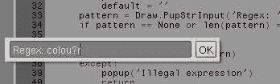

# 第九章. 扩展您的工具集

本章更多地是关于如何通过扩展 Blender 的功能来简化日常使用，而不是渲染。它使用了一些需要安装的外部库，并且在某些时候，所使用的 Python 脚本可能对新手来说读起来有些困难。此外，从艺术家的角度来看，这些脚本可能视觉上不那么吸引人，因为这些脚本不适合制作精美的插图。尽管如此，这些脚本确实增加了真正的有用功能，特别是对于脚本开发者来说，所以请继续阅读。


在本章中，我们将学习如何：

+   列出并归档如图像映射等资源

+   使用 FTP 自动发布渲染图像

+   使用正则表达式搜索扩展内置编辑器的功能

+   使用 Psyco 即时编译器加速计算

+   使用 Subversion 为您的脚本添加版本控制

# 发布到网络及更远——使用 FTP 发布完成的渲染

只要渲染图像在文件系统中可见，我们就可以将其保存到任何位置，但并非所有平台都提供通过本地目录（文件夹）使远程 FTP 服务器可访问的可能性。这个脚本为我们提供了一个简单选项，可以将渲染图像存储在远程 FTP 服务器上，并记住服务器名称、用户名和（可选）密码，以便以后重用。

我们将要使用的**文件传输协议**（FTP）比例如`HTTP`协议要复杂一些，因为它使用了多个连接。幸运的是，对于 FTP 客户端的所有复杂性，Python 标准模块`ftplib`都很好地封装了。我们不仅导入了这个模块的`FTP`类，还导入了其他一些标准 Python 模块，特别是用于路径名操作的`os.path`模块和用于读取标准`.netrc`文件（这使我们能够在需要时将密码存储在脚本之外，以便登录 FTP 服务器）。在需要的地方，我们将讨论每个模块。

```py
from ftplib import FTP
import os.path
import re
import netrc
import tempfile
from Blender import Image,Registry,Draw
```

Python 几乎达到了平台无关性的极限，但当然，有时也有一些没有完全覆盖的复杂性。例如，我们想要使用 FTP 程序（和其他程序）常用的`.netrc`文件中存储的用户名和密码，FTP 客户端期望这个文件位于用户的家目录中，它希望能在环境变量`HOME`中找到。然而，在 Windows 上，家目录的概念并没有那么明确，存在不同的方案来存储仅限于单个用户的数据；并非每个 Python 实现都以相同的方式解决这个问题。

因此，我们定义了一个小的实用函数来检查环境中是否存在`HOME`变量（在 Unix-like 操作系统和一些 Windows 版本中总是存在）。如果没有，它会检查是否存在`USERPROFILE`变量（在包括 XP 在内的大多数 Windows 版本中都存在，通常指向目录`C:\Documents and Settings\<yourusername>`）。如果存在，它将`HOME`变量设置为这个`USERPROFILE`变量的内容：

```py
def sethome():
   from os import environ
   if not 'HOME' in environ:
      if 'USERPROFILE'in environ:
         environ['HOME'] = environ['USERPROFILE']
```

我们接下来的任务是找出用户想要将渲染结果上传到哪个 FTP 服务器。我们将这个信息存储在 Blender 注册表键中，这样每次用户想要上传渲染时，我们就不需要打扰用户进行提示。`getftphost()`函数接受一个名为`reuse`的参数，如果设置为`False`，则可以用来清除这个键（允许选择不同的 FTP 服务器），但将用户界面重写以提供这样的选项留给读者作为练习。

实际的代码从从注册表中检索密钥开始（如果需要从磁盘检索，因此使用`True`参数，已高亮显示）。如果没有密钥存在或者它不包含主机条目，我们会通过弹出窗口提示用户输入 FTP 服务器的名称。如果用户没有指定，我们会通过抛出异常来退出。否则，我们将主机名存储在主机条目中——首先创建字典（如果不存在）并将此字典存储在 Blender 的注册表中。最后，我们返回存储的主机名。

```py
def getftphost(reuse=True):
   dictname = 'ftp'
   if reuse == False:
      Registry.RemoveKey(dictname)

 d = Registry.GetKey(dictname,True)
   if d == None or not 'host' in d:
      host = Draw.PupStrInput("Ftp hostname:", "", 45)
      if host == None or len(host) == 0 :
         raise Exception("no hostname specified")
      if d == None :
         d ={}
      d['host'] = host
      Registry.SetKey(dictname,d,True)
   return d['host']
```

我们还需要另一个实用函数来确保 Blender 图像作为最后渲染的图像存储在磁盘上，因为以`Render Result`命名的图像已经作为一个图像存在，但这个图像并没有自动写入磁盘。`imagefilename()`函数接受一个 Blender 图像作为参数，首先检查它是否有一个与之关联的有效文件名（已高亮显示）。如果没有，它会从图像的名称创建一个文件名，通过添加`.tga`扩展名（图像只能保存为 TARGA 文件）。然后从这个文件名和`temp`目录的路径构造完整的路径。现在，当存在一个有效的文件名时，它会保存并调用`save()`方法来返回文件名：

```py
def imagefilename(im):
 filename = im.getFilename()
 if filename == None or len(filename) == 0:
      filename = im.getName()+'.tga'
      filename = os.path.join(tempfile.gettempdir(),filename)
      im.setFilename(filename)
   im.save()
   return filename
```

当我们将文件上传到 FTP 服务器时，我们想要确保我们不覆盖任何现有的文件。如果我们发现已经存在一个具有给定名称的文件，我们希望有一个函数可以以可预测的方式创建一个新的文件名——就像 Blender 在创建 Blender 对象名称时的行为。我们希望保留文件名的扩展名，所以我们不能简单地使用数字后缀。因此，`nextfile()`函数首先将文件名的路径名和扩展名部分分开。它使用`os.path`模块中的`split()`和`splitext()`函数来留下一个裸露的`name`。

如果名称已经以一个由点和一些数字组成的后缀结尾（例如，`.42`），我们希望增加这个数字。这正是下面那些令人敬畏的高亮行所完成的。Python 的 `re` 模块的 `sub()` 函数接受一个正则表达式作为第一个参数（我们在这里使用原始字符串，这样我们就不需要转义任何反斜杠了），并检查这个正则表达式是否与其第三个参数（在这种情况下是 `name`）匹配。这里使用的正则表达式（`\.(\d+)$`）匹配一个点后跟一个或多个十进制数字，前提是这些数字是最后一个字符。如果这个模式匹配，它将被 `sub()` 函数的第二个参数替换。在这种情况下，替换不是一个简单的字符串，而是一个 `lambda`（即未命名的）函数，它将被传递一个 `match` 对象，并期望返回一个字符串。

由于我们在正则表达式的数字部分周围添加了括号，我们可以通过调用 `match` 对象的 `group()` 方法来检索这些数字——不带前面的点。我们传递一个 `1` 作为参数，因为第一个开括号标记了第一个组（组 0 将是整个模式）。我们使用内置的 `int()` 函数将这个数字字符串转换为整数，然后加 1，并使用 `str()` 函数将其再次转换为字符串。在 `lambda` 函数自动返回这个结果之前，我们再次在前面添加一个点，以符合我们想要的模式。

我们通过检查生成的名称是否与原始名称不同来完成工作。如果它们相同，原始名称没有匹配我们的模式，我们只需将 `.1` 追加到名称上。最后，我们通过添加扩展名并调用 `os.path` 中的 `join()` 函数以平台无关的方式添加路径来重建完整的文件名：

```py
def nextfile(filename):
   (path,base) = os.path.split(filename)
   (name,ext) = os.path.splitext(base)
 new = re.sub(r'\.(\d+)$',lambda m:'.'+str(1+int(m.group(1))),name)
   if new == name :
      new = name + '.1'
   return os.path.join(path,new+ext)
```

现在，我们已经准备好进行真正的上传文件到 FTP 服务器的操作。首先，我们通过调用 `sethome()` 函数确保我们的环境有一个合适的 `HOME` 变量。然后，我们检索我们想要上传到的 FTP 服务器的主机名（顺便说一句，输入 IP 地址而不是主机名是完全有效的）：

```py
if __name__ == "__main__":
   sethome()
   host = getftphost()
```

接下来，如果存在 `.netrc` 文件，我们将从该文件中检索所选主机的用户凭据（高亮显示）。这可能会因为各种原因失败（可能没有 `.netrc` 文件，或者给定的主机没有在这个文件中的条目）；在这种情况下，将引发异常。如果发生这种情况，我们将通知用户，并通过合适的弹出窗口请求用户名和密码：

```py
   try:
 (user,acct,password) = netrc.netrc().authenticators(host)
   except:
      acct=None
      user = Draw.PupStrInput('No .netrc file found, enter username:',
"",75)
      password = Draw.PupStrInput('Enter password:',"",75)
```

渲染后的图像将被存储为一个名为 `Render Result` 的 Blender `Image` 对象。接下来我们要做的是获取对这个图像的引用并确保它已存储在磁盘上。我们之前定义的 `imagefilename()` 函数将返回存储图像的文件名。

下一步是通过使用我们之前获取的主机名和凭据（已突出显示）连接到 FTP 服务器。一旦建立连接，我们就使用`nlst()`方法检索文件名列表：

```py
   im = Image.Get('Render Result')
   filename = imagefilename(im)

 ftp = FTP(host,user,password,acct)
   files = ftp.nlst()
```

由于我们想确保不覆盖 FTP 服务器上的任何文件，我们使用`basename()`函数从存储的图像文件名中删除路径，并将结果与从服务器检索到的文件名列表进行比较（已突出显示）。如果文件名已经存在，我们使用`nextfile()`函数生成一个新的文件名，并再次检查，一直这样做，直到我们最终得到一个在 FTP 服务器上尚未使用的文件名。

```py
   dstfilename = os.path.basename(filename)
 while dstfilename in files:
      dstfilename = nextfile(dstfilename)
```

然后，我们通过调用`storbinary()`方法上传我们的图像文件。此方法将`STOR`前缀的文件名作为第一个参数，一个打开的文件描述符作为第二个参数。我们通过调用 Python 的内置`open()`函数，并将我们的图像文件名作为单个参数来提供后者。（有关`ftplib`模块相当奇特行为的更多详细信息，请参阅其[`docs.python.org/library/ftplib.html`](http://docs.python.org/library/ftplib.html)上的文档。）

```py
   ftp.storbinary('STOR '+dstfilename,open(filename))

   ftp.quit()

   Draw.PupMenu('Render result stored as "%s"%s|Ok'%(dstfilename,'%t'))
```

完整的代码作为`ftp.py`文件位于`ftp.blend`中。它可以从文本编辑器中运行，但在这个例子中，将`ftp.py`放入 Blender 的`scripts`目录中肯定更加方便。该脚本配置为在**文件 | 导出**菜单中提供自身。

# 春季大扫除——存档未使用的图像

经过一段时间，任何长期运行的项目都会积累很多无用之物。例如，尝试过但被丢弃以换取更好的纹理图像。此脚本将帮助我们通过找到所选目录中所有未被`.blend`文件引用的文件并将它们打包到**ZIP** **存档**中来保持一定的秩序。

我们将注意不要将任何`.blend`文件移动到 ZIP 存档中（毕竟，我们通常希望能够渲染它们）以及 ZIP 存档本身（以防止无限递归）。我们将尝试删除我们存档的任何文件，如果删除文件留下一个空目录，我们也会删除该目录，除非它是`.blend`文件所在的目录。

文件操作函数由 Python 的`os`和`os.path`模块提供，并且可以使用`zipfile`模块在 Windows 和开放平台上操作 ZIP 文件。我们将把未使用的文件移动到的`zipfile`命名为`Attic.zip`：

```py
import Blender
from os import walk,remove,rmdir,removedirs
import os.path
from zipfile import ZipFile

zipname = 'Attic.zip'
```

第一个挑战是生成一个列表，列出我们`.blend`文件所在的目录中的所有文件。`listfiles()`函数使用 Python 的`os`模块中的`walk()`函数递归地遍历目录树，并在过程中生成文件列表。

默认情况下，`walk()`函数以深度优先的方式遍历目录树，这允许我们动态地更改目录列表。这里使用此功能来删除任何以点开头的目录（高亮显示）。对于当前目录和父目录（分别由**..**和**.**表示）来说，这不是必要的，因为`walk()`已经过滤掉了它们，但这允许我们，例如，过滤掉我们可能遇到的任何`.svn`目录。

包含`yield`语句的行一次返回一个文件的结果，因此我们的函数可以用作迭代器。（有关迭代器的更多信息，请参阅[`docs.python.org/reference/simple_stmts.html#yield`](http://docs.python.org/reference/simple_stmts.html#yield)在线文档）我们将正确的文件名和路径连接起来，形成一个完整的文件名，并对其进行标准化（即，删除双路径分隔符等）；尽管在这里进行标准化不是严格必要的，因为`walk()`预期会以标准化的形式返回任何路径：

```py
def listfiles(dir):
   for root,dirs,files in walk(dir):
      for file in files:
         if not file.startswith('.'):
            yield os.path.normpath(os.path.join(root,file))
      for d in dirs:
 if d.startswith('.'):
            dirs.remove(d)
```

在我们能够将`.blend`文件使用的文件列表与目录中现有的文件列表进行比较之前，我们确保任何打包的文件都解压到其原始文件位置。这虽然不是严格必要的，但确保我们不会将任何未直接使用但`.blend`文件中存在副本的文件移动到存档中：

```py
def run():
   Blender.UnpackAll(Blender.UnpackModes.USE_ORIGINAL)
```

Blender 模块中的`GetPaths()`函数生成一个由`.blend`文件使用的所有文件列表（除了`.blend`文件本身）。我们传递一个设置为`True`的绝对参数，以检索带有完整路径的文件名，而不是相对于当前目录的路径，以便正确地与`listfiles()`函数生成的列表进行比较。

再次，我们也对这些文件名进行了标准化。高亮行显示了如何通过传递当前 Bender 目录的缩写（`//`）到`expandpath()`函数来检索当前目录的绝对路径：

```py
   files = [os.path.normpath(f) for f inBlender.GetPaths(absolute=True)]
 currentdir = Blender.sys.expandpath('//')

```

接下来，我们以*写入*模式创建一个`ZipFile`对象。这将截断任何具有相同名称的现有存档，并允许我们向存档中添加文件。存档的完整名称是通过连接当前 Blender 目录和我们想要使用的存档名称来构建的。使用`os.path`模块中的`join()`函数确保我们以平台无关的方式构建完整名称。我们将`ZipFile`对象的`debug`参数设置为`3`，以便在创建存档时将任何异常报告到控制台：

```py
   zip = ZipFile(os.path.join(currentdir,zipname),'w')
   zip.debug = 3
```

`removefiles` 变量将在我们构建存档后记录我们想要删除的文件名。我们只能在创建存档后安全地删除文件和目录，否则我们可能会引用不再存在的目录。

存档是通过遍历当前 Blender 目录中所有文件的列表并比较它们与我们的 `.blend` 文件使用的文件列表来构建的。任何具有 `.blend` 或 `.blend1` 等扩展名的文件都会被跳过（突出显示），存档本身也是如此。文件是通过 `write()` 方法添加到 ZIP 文件的，该方法接受一个参数，即相对于存档（因此是当前目录）的文件名。这样，在新位置解压缩存档就更容易了。任何指向当前目录树外文件的引用都不会受 `relpath()` 函数的影响。我们添加到存档的任何文件都会通过将其添加到 `removefiles` 列表来标记为删除。最后，我们关闭存档——这是一个重要的步骤，因为省略它可能会导致我们得到一个损坏的存档：

```py
   removefiles = []
   for f in listfiles(currentdir):
 if not (f in files 
or os.path.splitext(f)[1].startswith('.blend') 
or os.path.basename(f) == zipname):
         rf = os.path.relpath(f,currentdir)
         zip.write(rf)
         removefiles.append(f)

   zip.close()
```

剩下的最后任务是删除我们移动到存档中的文件。Python 的 `os` 模块中的 `remove()` 函数将完成这项任务，但我们还希望删除在删除文件后变得空余的任何目录。因此，对于每个我们删除的文件，我们确定其目录的名称。我们还检查这个目录是否不指向当前目录，因为我们想确保我们不会删除它，因为这是我们的 `.blend` 文件所在的位置。尽管这种情况不太可能发生，但在 Blender 中打开 `.blend` 文件并删除该 `.blend` 文件本身可能会留下一个空目录。如果我们删除这个目录，任何随后的（自动）保存都会失败。`relpath()` 函数如果其第一个参数指向的目录与第二个参数指向的目录相同，将返回一个点。（`samefile()` 函数更健壮且直接，但在 Windows 上不可用。）

如果我们确定我们没有引用当前目录，我们使用 `removedirs()` 函数来删除目录。如果目录不为空，这将失败并抛出 `OSError` 异常（即我们删除的文件不是目录中的最后一个文件），我们忽略这个异常。`removedirs()` 函数还会删除通向目录的所有父目录，如果它们为空，这正是我们想要的：

```py
   for f in removefiles:
      remove(f)
      d = os.path.dirname(f)
      if os.path.relpath(d,currentdir) != '.':
         try:
            removedirs(d)
         except OSError:
            pass

if __name__ == '__main__':
   run()
```

完整的代码作为 `zip.py` 文件存放在 `attic.blend` 中。

# 扩展编辑器——使用正则表达式进行搜索

**编辑器**已经提供了基本的搜索和替换功能，但如果你习惯了其他编辑器，你可能会错过使用**正则表达式**进行搜索的可能性。此插件提供了这一功能。

正则表达式非常强大，许多程序员喜欢它们的灵活性（而许多人则讨厌它们糟糕的可读性）。无论你爱它还是恨它，它们都非常具有表现力：匹配任何十进制数字可以简单地表示为 `\d+`（例如，一个或多个数字）。如果你在寻找一个在英式英语或美式英语中拼写不同的单词，例如 colour/color，你可以使用表达式 `colou?r`（带有可选的 *u*）来匹配任何一个。

以下代码将展示 Blender 内置的编辑器只需几行代码就可以配备这个有用的搜索工具。提供的脚本应安装在 Blender 的 `scripts` 目录中，然后可以从文本编辑器菜单作为 **文本 | 文本插件 | 正则表达式搜索** 或通过快捷键 *Alt + Ctrl + R* 调用。它将弹出一个小的输入小部件，用户可以在其中输入正则表达式（此弹出窗口将记住最后输入的正则表达式），如果用户点击 **确定** 按钮或按 *Enter* 键，光标将定位到第一个匹配正则表达式的位置，并突出显示匹配的范围。



要将脚本注册为具有指定快捷键的文本插件，脚本的前几行包含常规标题，并增加了一个 `Shortcut:` 条目（如下所示突出显示）：

```py
#!BPY
"""
Name: 'Regular Expression Search'
Blender: 249
Group: 'TextPlugin'
Shortcut: 'Ctrl+Alt+R'
Tooltip: 'Find text matching a regular expression'
"""
```

下一步是导入必要的模块。Python 为我们提供了一个标准的 `re` 模块，该模块有很好的文档（即使是对于不熟悉正则表达式的初学者，在线文档也足够了），我们导入 Blender 的 `bpy` 模块。在这本书中，我们很少使用这个模块，因为它被标记为实验性的，但在这个例子中，我们需要它来找出哪个文本缓冲区是活动的：

```py
from Blender import Draw,Text,Registry
import bpy
import re
```

为了指示任何错误条件，例如非法的正则表达式或没有匹配项，我们定义了一个简单的 `popup()` 函数：

```py
def popup(msg):
   Draw.PupMenu(msg+'%t|Ok')
   return
```

因为我们想记住用户输入的最后一个正则表达式，所以我们将使用 Blender 的注册表，因此我们定义了一个键来使用：

```py
keyname = 'regex'
```

`run()` 函数将所有功能结合起来；它检索活动文本缓冲区，如果没有活动缓冲区则退出：

```py
def run():

   txt = bpy.data.texts.active
   if not txt: return
```

随后，它检索此缓冲区内的光标位置：

```py
   row,col = txt.getCursorPos()
```

在向用户提供弹出窗口以输入正则表达式之前，我们检查是否在注册表中存储了一个之前的正则表达式。我们简单地检索它，如果失败，则将默认表达式设置为空字符串（突出显示）。请注意，我们不会向 `GetKey()` 函数传递任何额外的参数，因为我们不希望在磁盘上存储任何信息。如果用户输入一个空字符串，我们只需返回而不进行搜索：

```py
   d=Registry.GetKey(keyname)
   try:
      default = d['regex']
   except:
 default = ''
   pattern = Draw.PupStrInput('Regex: ',default,40)
   if pattern == None or len(pattern) == 0 : return
```

我们编译正则表达式以查看其是否有效，如果失败，则显示一条消息并返回：

```py
   try:
      po = re.compile(pattern)
   except:
      popup('Illegal expression')
      return
```

现在我们知道正则表达式是正确的，我们从光标所在的行（高亮显示）开始遍历文本缓冲区的所有行。对于每一行，我们将编译的正则表达式与字符串（或如果它是第一行，则是光标后的部分）进行匹配。

```py
   first = True
 for string in txt.asLines(row):
      if first :
         string = string[col:]
      mo = re.search(po,string)
```

如果有匹配项，我们会在行内记录匹配的开始位置和匹配的长度（如果是第一行，则适当分隔），并将光标位置设置为当前行和匹配的开始位置（高亮显示）。我们还设置“选择位置”为匹配位置加上匹配长度，以便我们的匹配项被高亮显示并返回。如果行内没有匹配项，我们增加行索引并继续迭代。

如果没有更多可迭代的项，我们向用户发出信号，表示我们没有找到任何匹配项。在所有情况下，我们将正则表达式存储在注册表中以供重用：

```py
      if mo != None :
         i = mo.start()
         l = mo.end()-i
         if first :
            i += col
 txt.setCursorPos(row,i)
         txt.setSelectPos(row,i+l)
         break
      row += 1
      first = False

   else :
      popup('No match')
   Registry.SetKey(keyname,{'regex':pattern})

if __name__ == '__main__':
   run()
```

完整的代码作为 `regex.py` 存放在 `regex.blend` 中，但应该安装到 Blender 的 `scripts` 目录中，并使用合适的名称，例如 `textplugin_regex.py`。

# 扩展编辑器——与 Subversion 交互

当积极开发脚本时，跟踪更改或回滚到先前版本可能会很困难。这不仅仅是在 Blender 中编写 Python 脚本时的问题，而且多年来已经发展了许多 **版本控制系统**。其中之一是广为人知且广泛使用的 **Subversion** ([`subversion.tigris.org`](http://subversion.tigris.org))。在本节中，我们展示了如何增强编辑器以提交或更新来自仓库的文本文件。

与 Subversion 仓库的交互不是由捆绑的 Python 模块提供的，因此我们必须从其他地方获取它。在 [`pysvn.tigris.org`](http://pysvn.tigris.org) 的 **下载** 部分包含了多个平台的源代码和二进制分发。请确保获取正确的版本，因为支持的 Subversion 版本和 Python 版本可能不同。我们在这里开发的脚本针对 Subversion 1.6.x 和 Python 2.6.x 进行了测试，但应该也能与更早版本的 Subversion 一起工作。

我们将实现将文本文件提交到仓库以及更新文件（即从仓库获取最新修订版）的功能。如果我们尝试提交尚未成为仓库一部分的文件，我们会将其添加，但我们将不会实现创建仓库或检出工作副本的工具。例如，Windows 上的 **TortoiseSVN** ([`tortoisesvn.tigris.org/`](http://tortoisesvn.tigris.org/)) 或任何数量的开放平台工具都更适合这项工作。我们假设有一个检出的工作目录，我们将 Blender 文本文件存储在这里。（这个工作目录可能与你的 Blender 项目目录完全不同。）

## 将文件提交到仓库

将文本缓冲区提交到仓库是一个两步过程。首先，我们必须将文本缓冲区的内容保存到文件中，然后我们将这个文件提交到仓库。我们必须检查文本块是否有关联的文件名，如果没有，则提示用户先保存文件。用户必须将文件保存到已签出的目录中，以便将文件提交到仓库。

就像允许我们使用正则表达式进行搜索的扩展一样，这个扩展以一个合适的标题开始，以标识它作为一个文本编辑插件，并分配一个键盘快捷键。我们为提交（高亮显示）定义了 *Ctrl + Alt + C* 作为快捷键，正如我们将在其伴随脚本中为更新定义 *Ctrl + Alt + U* 一样。我们还导入了必要的模块，特别是 `pysvn` 模块：

```py
#!BPY
"""
Name: 'SVNCommit'
Blender: 249
Group: 'TextPlugin'
Shortcut: 'Ctrl+Alt+C'
Tooltip: 'Commit current textbuffer to svn'
"""

from Blender import Draw,Text,Registry
import bpy
import pysvn

def popup(msg):
   Draw.PupMenu(msg+'%t|Ok')
   return
```

`run()` 函数首先尝试获取活动文本缓冲区，如果没有找到，则不会抛出异常并返回。然后它检查是否为这个文本缓冲区定义了文件名（高亮显示）。如果没有，它会提醒用户先保存文件（从而定义一个文件名并将文件放置在已签出的目录中）然后返回。

```py
def run():

   txt = bpy.data.texts.active
   if not txt: return

   fn = txt.getFilename()
 if fn == None or len(fn) == 0:
      popup('No filename defined: save it first')
      return
```

下一步是创建一个 `pysvn` 客户端对象，这将使我们能够与仓库交互。它的 `info()` 方法允许我们检索有关文件仓库状态的详细信息（高亮显示）。如果没有信息，则表示该文件尚未添加到仓库中——这种情况我们可以通过调用 `add()` 方法来纠正：

```py
   svn = pysvn.Client()
 info = svn.info(fn)
   if info == None:
      popup('not yet added to repository, will do that now')
      svn.add(fn)
```

接下来，我们将文本缓冲区的当前内容写出来，通过将其中所有行连接成一个单一的数据块，并将其写入我们为与缓冲区关联的文件名打开的文件对象中：

```py
   file=open(fn,'wb')
   file.write('\n'.join(txt.asLines()))
   file.close()
```

这个文件将通过 `checkin()` 方法提交到仓库，我们传递一个相当不具信息量的提交信息。可能提示用户输入一个更合理的消息是个好主意。最后，我们通知用户结果版本号。

### 注意

注意，Subversion 版本号不是与文件相关联，而是与仓库相关联，因此如果在此期间其他文件已被提交，这个数字可能比上一个文件提交的数字多一个以上。

```py
   version = svn.checkin(fn,'Blender commit')
   popup('updated to rev. '+str(version))

if __name__ == '__main__':
   run()
```

完整代码作为 `textplugin_commit` 在 `svn.blend` 中可用，但应安装在 Blender 的 `scripts` 目录中。

## 从仓库更新文件

仓库的全部目的在于能够协作，这意味着其他人也可能更改我们正在工作的文件，我们必须能够检索这些提交的更改。这被称为更新文件，意味着我们将存储在仓库中的最新版本复制到我们的工作目录中。

除了检查文本缓冲区是否已保存以及文件是否已添加到版本库中，我们还必须检查我们的当前版本是否比版本库中的版本更新或已更改。如果是这样，我们向用户提供选择，是放弃这些更改并恢复到版本库中的版本，还是提交文本缓冲区中的版本。（这里没有提供合并差异的第三个选项；尽管 Subversion 当然能够做到这一点，至少对于文本文件来说是这样，但最好留给更通用的工具，如 TortoiseSVN。）

脚本的第一部分与提交脚本非常相似。主要区别是不同的快捷键：

```py
#!BPY
"""
Name: 'SVNUpdate'
Blender: 249
Group: 'TextPlugin'
Shortcut: 'Ctrl+Alt+U'
Tooltip: 'Update current textbuffer from svn'
"""

from Blender import Draw,Text,Registry
import bpy
import re
import pysvn

def popup(msg):
   Draw.PupMenu(msg+'%t|Ok')
   return
```

`run()`函数也以类似的方式开始，它检索活动文本缓冲区（如果有）并检查文本缓冲区是否有相关文件名（突出显示）。它还检查文件名是否已添加到版本库中，如果没有，则通过调用`add()`方法进行纠正，并通过弹出窗口通知用户：

```py
def run():

   txt = bpy.data.texts.active
   if not txt: return

   fn = txt.getFilename()
 if fn == None or len(fn) == 0:
      popup('No filename defined: save it first')
      return
   svn = pysvn.Client()
   info = svn.info(fn)
   if info == None:
      popup('not yet added to repository, will do that now')
      svn.add(fn)
```

在将文本缓冲区的内容写入其相关文件后，它调用`status()`方法来查看我们写入的文件（因此是文本缓冲区的内容）与版本库中的版本相比是否已修改（突出显示）。`status()`方法也可以传递一个*列表*的文件名，并且总是返回一个结果列表，即使我们只传递一个文件名——因此有`[0]`索引。如果我们的文本缓冲区已修改，我们通知用户并提供选择：要么放弃更改并检索存储在版本库中的版本，要么提交当前版本。还可能通过点击菜单外取消整个操作，在这种情况下`PupMenu()`将返回`-1`：

```py
   file=open(fn,'wb')
   file.write('\n'.join(txt.asLines()))
   file.close()

 if svn.status(fn)[0].text_status == pysvn.wc_status_kind.modified:
      c=Draw.PupMenu('file probably newer than version in'+
           'repository%t|Commit|Discard changes')
      if c==1:
         svn.checkin(fn,'Blender')
         return
      elif c==2:
         svn.revert(fn)
```

从版本库检索版本后，我们刷新文本缓冲区的内容：

```py
   txt.clear()
   file=open(fn)
   txt.write(file.read())
   file.close()
```

最后，我们通过再次调用`status()`方法并获取`commit_revision`字段来通知用户文本缓冲区内容的修订号：

```py
   popup('updated to rev. '+str(svn.status(fn)[0].entry.commit_revision))

if __name__ == '__main__':
   run()
```

完整代码作为`textplugin_svnupdate`在`svn.blend`中可用，并且像其提交对应版本一样，应该安装在 Blender 的`scripts`目录中。

## 与版本库一起工作

尽管关于使用 Subversion 的完整教程超出了本书的范围，但为 Blender 项目中的脚本版本控制流程勾勒一个轮廓可能是有用的。

重要的是要理解，Blender 项目本身不必置于版本控制之下。我们可以以任何有意义的任何方式组织我们的 Blender 项目，并在其中有一个受版本控制的`scripts`目录。

假设我们在网络存储设备上创建了一个脚本版本库，并在我们的本地机器上创建了一个 Blender 项目目录。为了将我们的脚本置于版本控制之下，我们必须执行以下步骤：

1.  在我们的 Blender 项目目录内检出脚本版本库（这被称为版本库的**工作副本**）。

1.  使用内置编辑器在我们的 `.blend` 文件中创建一个脚本。

1.  将此脚本保存到工作副本中。

1.  每次我们更改任何内容时，我们都按下 *Ctrl + Alt + C* 来提交我们的更改。

1.  每次我们再次开始编写脚本时，首先按下 *Ctrl + Alt + U* 来查看是否有人更改了任何内容。

注意，我们并不反对将所有资产，如纹理或作为版本控制库使用的 `.blend` 文件等全部带入，但我们必须使用单独的客户端来提交更改。创建一些提交或更新当前 Blender 目录中所有文件的脚本将是一项有趣的练习。

# 对速度的需求——使用 Psyco

Python 是一种解释型语言：脚本中的所有指令都会在遇到时被解释并重新执行。这听起来可能效率不高，但对于程序的开发者来说，能够快速开发和测试程序的优势可能超过了程序运行较慢的劣势。而且，解释可能效率不高，但这并不等同于慢。Python 是一种非常高级的语言，所以单个语言元素可能相当于许多低级指令。此外，考虑到现代硬件，即使是慢速的脚本也可能比用户预期的结果更快地完成。

然而，在任何情况下，任何速度的提升都是受欢迎的。从本书中我们看到的所有示例来看，Pynodes 可能是计算量最大的，因为指令会在纹理或着色器中的每个可见像素上运行，并且如果考虑超采样，每个像素可能还会运行许多更多次。从执行时间不到一秒的脚本中节省几毫秒并不算什么，但节省 20%的渲染时间，在渲染 500 帧的镜头时，可以节省相当多的时间。

**进入** **Psyco**：Psyco 是一个 Python 扩展，它试图通过将脚本中频繁使用的部分编译成机器指令并存储起来以供重用，来加速脚本的执行。这个过程通常被称为 **即时编译**，类似于其他语言（如 Java）中的即时编译。（在概念上相似，但在实现上由于 Python 的动态类型而相当不同。这对于 Python 脚本的开发者来说并不重要。）重要的是，Psyco 可以在任何脚本中使用，而无需对代码进行任何更改，只需添加几行即可。

Psyco 作为 Windows 的二进制包可用，并且可以在其他平台上从源代码编译。完整说明可在 Psyco 网站上找到：[`psyco.sourceforge.net/`](http://psyco.sourceforge.net/)。

请确保您安装的版本与您的 Python 安装兼容，因为尽管网站声明为 Python 2.5 编译的版本也应该适用于 2.6，但它仍然可能会失败，所以最好使用专门为 2.6 编译的版本。现在，我们可能期望的速度提升是多少？这很难估计，但很容易测量！只需渲染一帧，并注意它花费的时间，然后导入代码中的 psyco，再次渲染，并注意差异。如果差异显著，请保留代码，否则您可能再次删除它。

在以下表格中，列出了`pysco.blend`提供的测试场景的一些结果，但您的实际效果可能会有所不同。请注意，测试场景是一个相当乐观的情景，因为大多数渲染都被一个由 Pynode 生成的纹理覆盖。如果这个覆盖更少，速度的提升也会更少，但这确实给出了使用 Psyco 可能实现的效果。相关代码的速度提升可以达到两倍。以下表格列出了一些说明性的样本时间：

| 时间（秒） | 没有 Psyco | 有 Psyco |
| --- | --- | --- |
| 净书本 | 52.7 | 26.3 |
| 桌面 | 14.01 | 6.98 |

## 启用 Psyco

以下代码显示了在之前遇到的`raindrops` Pynode 上启用 Psyco 所需的附加行。变更以粗体表示。

```py
<... all other code unchanged ...>

__node__ = Raindrops

try:
 import psyco
 psyco.bind(Raindrops.__call__)
 print 'Psyco configured'
except ImportError:
 print 'Psycho not configured, continuing'
 pass 

```

所以基本上，在 Pynode 的定义之后只添加了几行。确保在 Pynode 上点击**更新**按钮，否则代码将不会被重新编译，更改将不会可见。

之前的代码只是尝试导入`psyco`模块。如果导入失败（任何原因），控制台将打印出一条信息性消息，但代码仍然可以正常运行。如果成功导入，我们指导 Psyco 通过调用`bind()`函数并传递一个指向此`__call__`方法的引用来优化`__call__()`方法，并在控制台上通知用户我们已成功配置 Psyco。

# 摘要

在本章中，我们不仅探讨了 3D 和渲染，还展示了如何通过提供一些脚本帮助处理一些常见的维护任务，通过扩展内置编辑器的正则表达式搜索和版本控制功能，以及如何通过使用 Psyco 在某些情况下节省宝贵的渲染时间。具体来说，我们学习了：

+   如何列出和存档资产，如图像映射

+   如何使用 FTP 自动发布渲染图像

+   如何使用正则表达式搜索扩展内置编辑器的功能

+   如何使用即时编译器 Psyco 加速计算

+   如何使用 Subversion 给你的脚本添加版本控制
